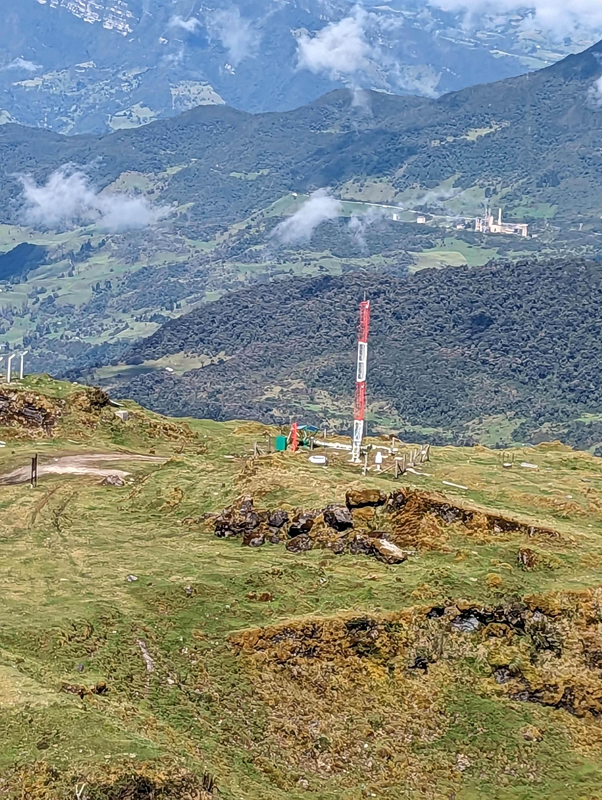
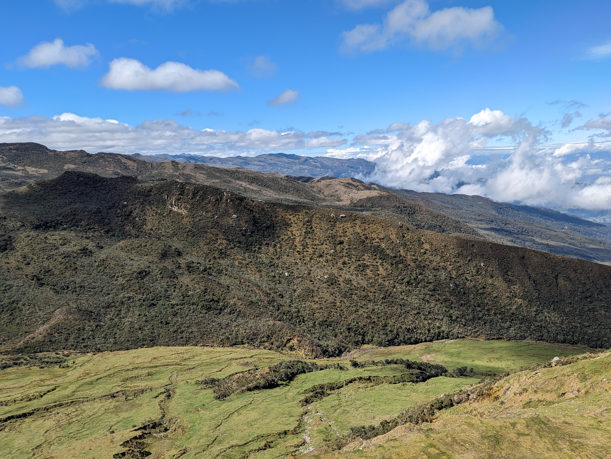
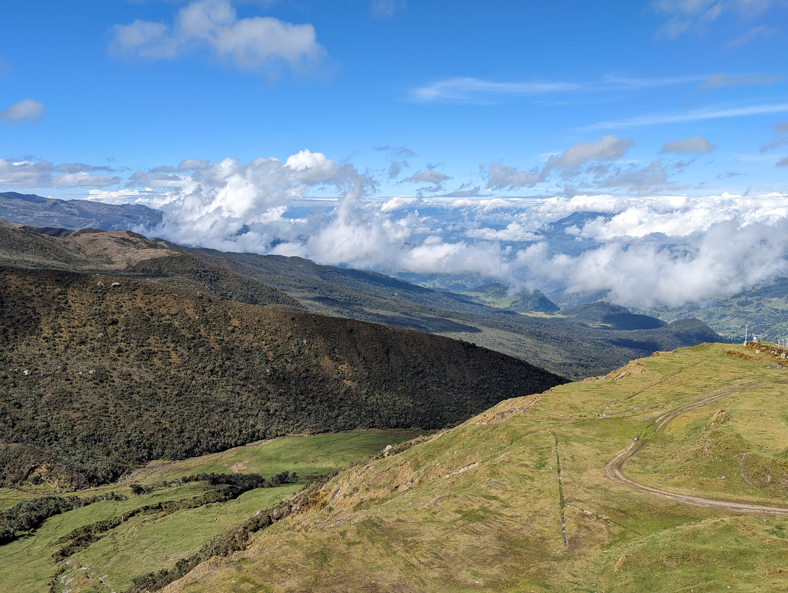
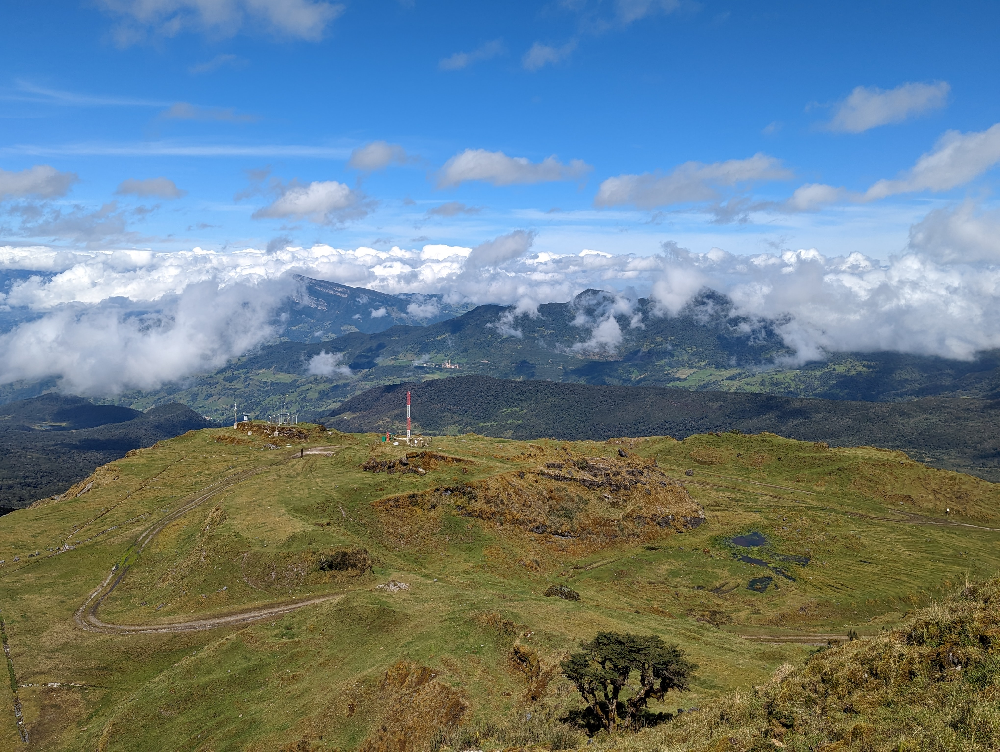
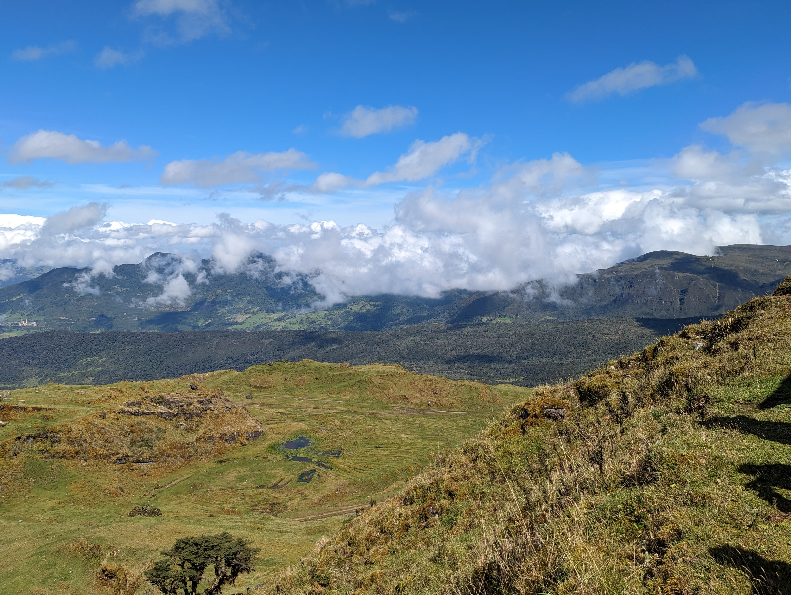

## :globe_with_meridians:Antigua mina de caliza CEMEX (2023-05-03)
`Pictures` rcfdtools <br>`Category` Technical field visit <br>`Location` [Google Maps](http://maps.google.com/maps?q=4.712169444444444,-73.8198361111111) or [Openstreet Map](https://www.openstreetmap.org/query?lat=4.712169444444444&lon=-73.8198361111111) 

```geojson
{
  "type": "Feature",
  "geometry": {
    "type": "Point", 
    "coordinates": [-73.8198361111111, 4.712169444444444]
  }, 
  "properties": {
    "Name": "Antigua mina de caliza CEMEX"
  }
}
```

<br><details><summary>:camera:**1/PXL_20230503_141248486.jpg**</summary><sub> `Exif version` 0232 `OS version` HDR+ 1.0.520435816zd `Date` 2023:05:03 09:12:48 `Aperture` Not known `Brightness` 9.32 `Color space` 1 `Compression` 6`Exposure mode` 0 `Exposure time` 0.00038 `Focal length` 6.81 `Lens model` Pixel 6 back camera 6.81mm f/1.85 `Lens specification` Not known `Orientation` 1 `Scene type` Not known `f number` 1.85 `White balance` 0 `Sensing method` 2 `Shutter speed` 11.36</sub></details><sub>`Coordinates & altitude` (4.712488888888889, -73.81947777777778, 3732.0)</sub><sub> :globe_with_meridians:`Location over` [Google Maps](http://maps.google.com/maps?q=4.712488888888889,-73.81947777777778) or [Openstreet Map](https://www.openstreetmap.org/query?lat=4.712488888888889&lon=-73.81947777777778)</sub>


<br><details><summary>:camera:**1/PXL_20230503_141401490.jpg**</summary><sub> `Exif version` 0232 `OS version` HDR+ 1.0.520435816zd `Date` 2023:05:03 09:14:01 `Aperture` Not known `Brightness` 8.39 `Color space` 1 `Compression` 6`Exposure mode` 0 `Exposure time` 0.000795 `Focal length` 6.81 `Lens model` Pixel 6 back camera 6.81mm f/1.85 `Lens specification` Not known `Orientation` 1 `Scene type` Not known `f number` 1.85 `White balance` 0 `Sensing method` 2 `Shutter speed` 10.3</sub></details><sub>`Coordinates & altitude` (4.712169444444444, -73.8198361111111, 3733.41)</sub><sub> :globe_with_meridians:`Location over` [Google Maps](http://maps.google.com/maps?q=4.712169444444444,-73.8198361111111) or [Openstreet Map](https://www.openstreetmap.org/query?lat=4.712169444444444&lon=-73.8198361111111)</sub>


<br><details><summary>:camera:**1/PXL_20230503_141404104.jpg**</summary><sub> `Exif version` 0232 `OS version` HDR+ 1.0.520435816zd `Date` 2023:05:03 09:14:04 `Aperture` Not known `Brightness` 9.35 `Color space` 1 `Compression` 6`Exposure mode` 0 `Exposure time` 0.00038 `Focal length` 6.81 `Lens model` Pixel 6 back camera 6.81mm f/1.85 `Lens specification` Not known `Orientation` 1 `Scene type` Not known `f number` 1.85 `White balance` 0 `Sensing method` 2 `Shutter speed` 11.36</sub></details><sub>`Coordinates & altitude` (4.712169444444444, -73.8198361111111, 3733.41)</sub><sub> :globe_with_meridians:`Location over` [Google Maps](http://maps.google.com/maps?q=4.712169444444444,-73.8198361111111) or [Openstreet Map](https://www.openstreetmap.org/query?lat=4.712169444444444&lon=-73.8198361111111)</sub>


<br><details><summary>:camera:**1/PXL_20230503_141452560.jpg**</summary><sub> `Exif version` 0232 `OS version` HDR+ 1.0.520435816zd `Date` 2023:05:03 09:14:52 `Aperture` Not known `Brightness` 8.97 `Color space` 1 `Compression` 6`Exposure mode` 0 `Exposure time` 0.000486 `Focal length` 6.81 `Lens model` Pixel 6 back camera 6.81mm f/1.85 `Lens specification` Not known `Orientation` 1 `Scene type` Not known `f number` 1.85 `White balance` 0 `Sensing method` 2 `Shutter speed` 11.01</sub></details><sub>`Coordinates & altitude` (4.712169444444444, -73.8198361111111, 3733.41)</sub><sub> :globe_with_meridians:`Location over` [Google Maps](http://maps.google.com/maps?q=4.712169444444444,-73.8198361111111) or [Openstreet Map](https://www.openstreetmap.org/query?lat=4.712169444444444&lon=-73.8198361111111)</sub>


<br><details><summary>:camera:**1/PXL_20230503_141454219.jpg**</summary><sub> `Exif version` 0232 `OS version` HDR+ 1.0.520435816zd `Date` 2023:05:03 09:14:54 `Aperture` Not known `Brightness` 9.17 `Color space` 1 `Compression` 6`Exposure mode` 0 `Exposure time` 0.000433 `Focal length` 6.81 `Lens model` Pixel 6 back camera 6.81mm f/1.85 `Lens specification` Not known `Orientation` 1 `Scene type` Not known `f number` 1.85 `White balance` 0 `Sensing method` 2 `Shutter speed` 11.17</sub></details><sub>`Coordinates & altitude` (4.712169444444444, -73.8198361111111, 3733.41)</sub><sub> :globe_with_meridians:`Location over` [Google Maps](http://maps.google.com/maps?q=4.712169444444444,-73.8198361111111) or [Openstreet Map](https://www.openstreetmap.org/query?lat=4.712169444444444&lon=-73.8198361111111)</sub>


<br><details><summary>:camera:**1/PXL_20230503_141456741.jpg**</summary><sub> `Exif version` 0232 `OS version` HDR+ 1.0.520435816zd `Date` 2023:05:03 09:14:56 `Aperture` Not known `Brightness` 9.39 `Color space` 1 `Compression` 6`Exposure mode` 0 `Exposure time` 0.000353 `Focal length` 6.81 `Lens model` Pixel 6 back camera 6.81mm f/1.85 `Lens specification` Not known `Orientation` 1 `Scene type` Not known `f number` 1.85 `White balance` 0 `Sensing method` 2 `Shutter speed` 11.47</sub></details><sub>`Coordinates & altitude` (4.712169444444444, -73.8198361111111, 3733.41)</sub><sub> :globe_with_meridians:`Location over` [Google Maps](http://maps.google.com/maps?q=4.712169444444444,-73.8198361111111) or [Openstreet Map](https://www.openstreetmap.org/query?lat=4.712169444444444&lon=-73.8198361111111)</sub>


<br><details><summary>:camera:**1/PXL_20230503_141459242.jpg**</summary><sub> `Exif version` 0232 `OS version` HDR+ 1.0.520435816zd `Date` 2023:05:03 09:14:59 `Aperture` Not known `Brightness` 9.16 `Color space` 1 `Compression` 6`Exposure mode` 0 `Exposure time` 0.000415 `Focal length` 6.81 `Lens model` Pixel 6 back camera 6.81mm f/1.85 `Lens specification` Not known `Orientation` 1 `Scene type` Not known `f number` 1.85 `White balance` 0 `Sensing method` 2 `Shutter speed` 11.23</sub></details><sub>`Coordinates & altitude` (4.712169444444444, -73.8198361111111, 3733.41)</sub><sub> :globe_with_meridians:`Location over` [Google Maps](http://maps.google.com/maps?q=4.712169444444444,-73.8198361111111) or [Openstreet Map](https://www.openstreetmap.org/query?lat=4.712169444444444&lon=-73.8198361111111)</sub>


<br><details><summary>:camera:**1/PXL_20230503_142135200.jpg**</summary><sub> `Exif version` 0232 `OS version` HDR+ 1.0.520435816zd `Date` 2023:05:03 09:21:35 `Aperture` Not known `Brightness` 9.35 `Color space` 1 `Compression` 6`Exposure mode` 0 `Exposure time` 0.00038 `Focal length` 6.81 `Lens model` Pixel 6 back camera 6.81mm f/1.85 `Lens specification` Not known `Orientation` 1 `Scene type` Not known `f number` 1.85 `White balance` 0 `Sensing method` 2 `Shutter speed` 11.36</sub></details><sub>`Coordinates & altitude` (4.712169444444444, -73.81983333333334, 3719.56)</sub><sub> :globe_with_meridians:`Location over` [Google Maps](http://maps.google.com/maps?q=4.712169444444444,-73.81983333333334) or [Openstreet Map](https://www.openstreetmap.org/query?lat=4.712169444444444&lon=-73.81983333333334)</sub>


<br><details><summary>:camera:**1/PXL_20230503_142138155.jpg**</summary><sub> `Exif version` 0232 `OS version` HDR+ 1.0.520435816zd `Date` 2023:05:03 09:21:38 `Aperture` Not known `Brightness` 10.26 `Color space` 1 `Compression` 6`Exposure mode` 0 `Exposure time` 0.00023 `Focal length` 6.81 `Lens model` Pixel 6 back camera 6.81mm f/1.85 `Lens specification` Not known `Orientation` 1 `Scene type` Not known `f number` 1.85 `White balance` 0 `Sensing method` 2 `Shutter speed` 12.09</sub></details><sub>`Coordinates & altitude` (4.712169444444444, -73.81983333333334, 3719.56)</sub><sub> :globe_with_meridians:`Location over` [Google Maps](http://maps.google.com/maps?q=4.712169444444444,-73.81983333333334) or [Openstreet Map](https://www.openstreetmap.org/query?lat=4.712169444444444&lon=-73.81983333333334)</sub>


<br><details><summary>:camera:**1/PXL_20230503_142141424.jpg**</summary><sub> `Exif version` 0232 `OS version` HDR+ 1.0.520435816zd `Date` 2023:05:03 09:21:41 `Aperture` Not known `Brightness` 8.93 `Color space` 1 `Compression` 6`Exposure mode` 0 `Exposure time` 0.000477 `Focal length` 6.81 `Lens model` Pixel 6 back camera 6.81mm f/1.85 `Lens specification` Not known `Orientation` 1 `Scene type` Not known `f number` 1.85 `White balance` 0 `Sensing method` 2 `Shutter speed` 11.03</sub></details><sub>`Coordinates & altitude` (4.712169444444444, -73.81983333333334, 3719.56)</sub><sub> :globe_with_meridians:`Location over` [Google Maps](http://maps.google.com/maps?q=4.712169444444444,-73.81983333333334) or [Openstreet Map](https://www.openstreetmap.org/query?lat=4.712169444444444&lon=-73.81983333333334)</sub>


> _Citación: se permite la reproducción digital parcial o total de este repositorio, scripts, guías de desarrollo, modelos de datos, imágenes y documentación, siempre que se haga referencia como: "R.GISMobile - Sistemas de información geográficos móviles sobre QField que no requieren de conexión a Internet para su navegación". https://github.com/rcfdtools/R.GISMobile - Bogotá - Colombia - Suramérica."._

| [:house: Inicio](../Readme.md) |
|---|