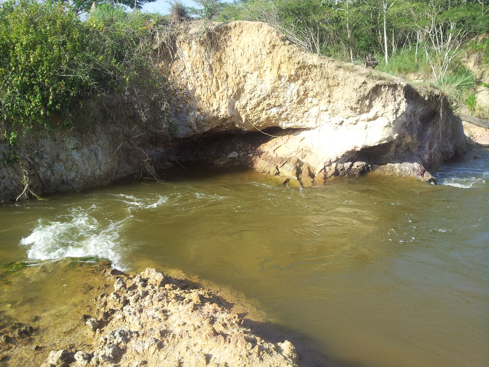
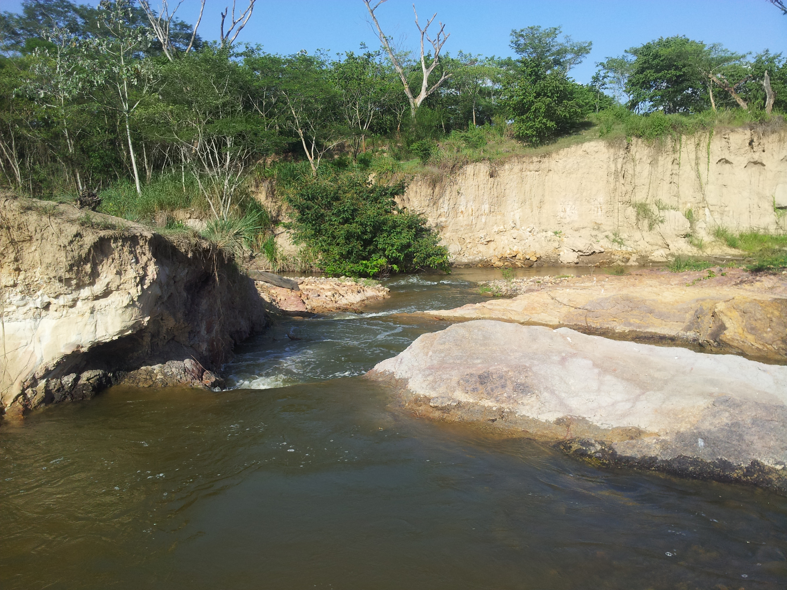
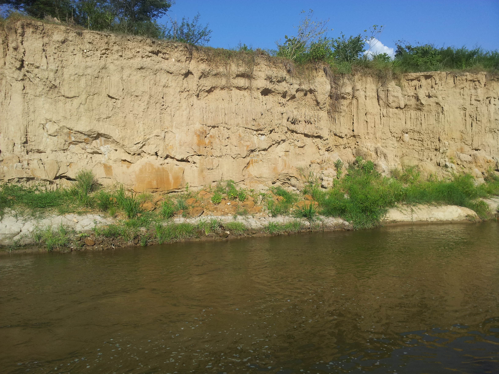
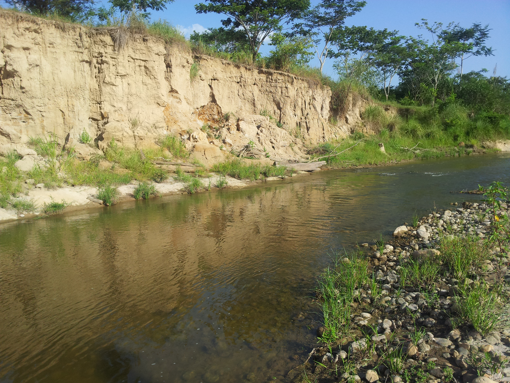
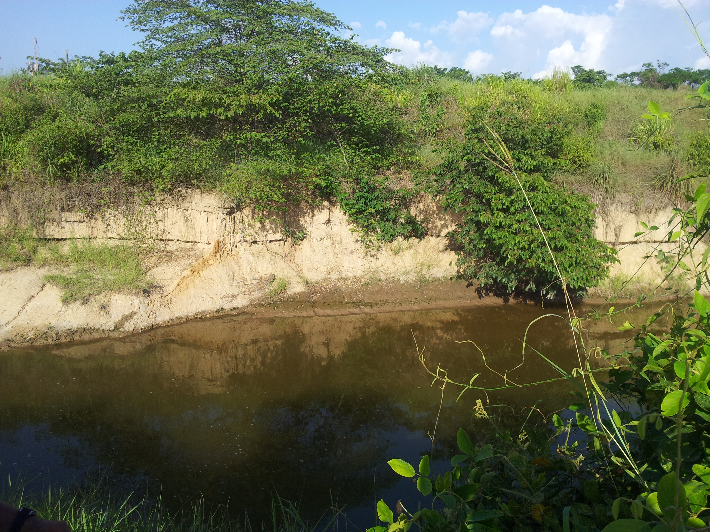
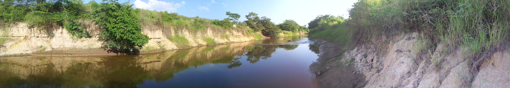
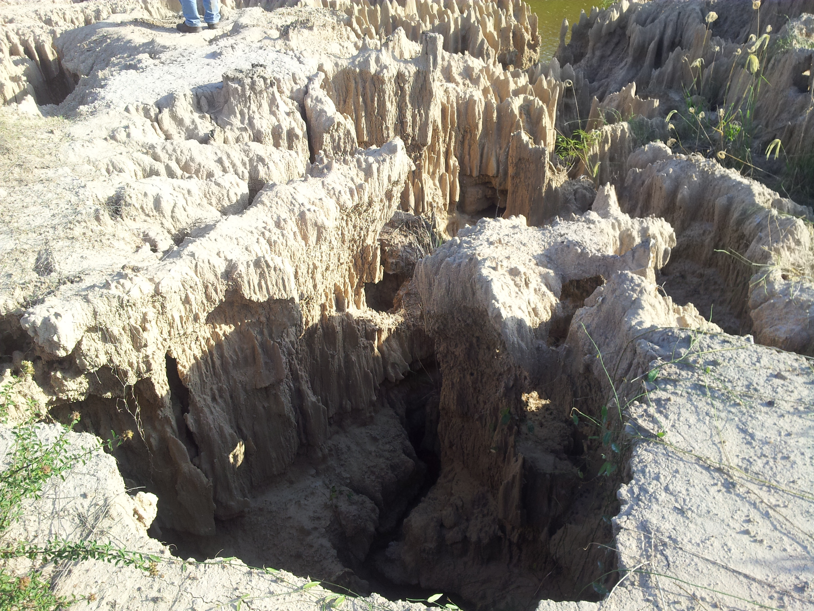
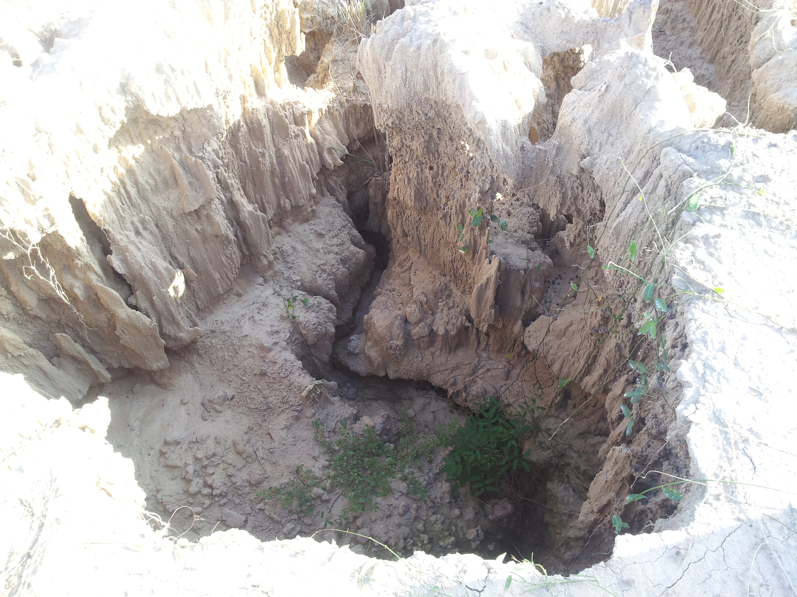

## Arroyo San Antonio - Erosión remontante (2013-07-03)
`Pictures` rcfdtools <br>`Category` Technical field visit <br>`Location` [Google Maps](http://maps.google.com/maps?q=9.5332223,-73.4627698) or [Openstreet Map](https://www.openstreetmap.org/query?lat=9.5332223&lon=-73.4627698) 

```geojson
{
  "type": "Feature",
  "geometry": {
    "type": "Point", 
    "coordinates": [-73.4627698, 9.5332223]
  }, 
  "properties": {
    "Name": "Arroyo San Antonio - Erosión remontante"
  }
}
```

:camera: **10/2013-07-03_16.02.18.jpg** <sub> `Exif version` 0220 `OS version` N7000XXLS2 `Date` 2013:07:03 16:02:18 `Aperture` Not known `Brightness` 8.57 `Color space` 1 `Compression` 6`Exposure mode` 0 `Exposure time` 0.0017482517482517483 `Focal length` 3.97 `Lens model` Not known `Lens specification` Not known `Orientation` 1 `Scene type` Not known `f number` 2.65 `White balance` 0 `Sensing method` Not known `Shutter speed` 9.16</sub><sub>`Coordinates & altitude` (9.5336385, -73.4629137, 56.84)</sub><sub>:globe_with_meridians: `Location over` [Google Maps](http://maps.google.com/maps?q=9.5336385,-73.4629137) or [Openstreet Map](https://www.openstreetmap.org/query?lat=9.5336385&lon=-73.4629137)</sub>


:camera: **10/2013-07-03_16.02.21.jpg** <sub> `Exif version` 0220 `OS version` N7000XXLS2 `Date` 2013:07:03 16:02:21 `Aperture` Not known `Brightness` 8.36 `Color space` 1 `Compression` 6`Exposure mode` 0 `Exposure time` 0.00202020202020202 `Focal length` 3.97 `Lens model` Not known `Lens specification` Not known `Orientation` 1 `Scene type` Not known `f number` 2.65 `White balance` 0 `Sensing method` Not known `Shutter speed` 8.95</sub><sub>`Coordinates & altitude` (9.5336385, -73.4629137, 56.84)</sub><sub>:globe_with_meridians: `Location over` [Google Maps](http://maps.google.com/maps?q=9.5336385,-73.4629137) or [Openstreet Map](https://www.openstreetmap.org/query?lat=9.5336385&lon=-73.4629137)</sub>


:camera: **10/2013-07-03_16.02.26.jpg** <sub> `Exif version` 0220 `OS version` N7000XXLS2 `Date` 2013:07:03 16:02:26 `Aperture` Not known `Brightness` 8.76 `Color space` 1 `Compression` 6`Exposure mode` 0 `Exposure time` 0.0015313935681470138 `Focal length` 3.97 `Lens model` Not known `Lens specification` Not known `Orientation` 1 `Scene type` Not known `f number` 2.65 `White balance` 0 `Sensing method` Not known `Shutter speed` 9.35</sub><sub>`Coordinates & altitude` (9.5336385, -73.4629137, 56.84)</sub><sub>:globe_with_meridians: `Location over` [Google Maps](http://maps.google.com/maps?q=9.5336385,-73.4629137) or [Openstreet Map](https://www.openstreetmap.org/query?lat=9.5336385&lon=-73.4629137)</sub>


:camera: **10/2013-07-03_16.02.34.jpg** <sub> `Exif version` 0220 `OS version` N7000XXLS2 `Date` 2013:07:03 16:02:34 `Aperture` Not known `Brightness` 9.82 `Color space` 1 `Compression` 6`Exposure mode` 0 `Exposure time` 0.0007558578987150416 `Focal length` 3.97 `Lens model` Not known `Lens specification` Not known `Orientation` 1 `Scene type` Not known `f number` 2.65 `White balance` 0 `Sensing method` Not known `Shutter speed` 10.37</sub><sub>`Coordinates & altitude` (9.5336385, -73.4629137, 56.84)</sub><sub>:globe_with_meridians: `Location over` [Google Maps](http://maps.google.com/maps?q=9.5336385,-73.4629137) or [Openstreet Map](https://www.openstreetmap.org/query?lat=9.5336385&lon=-73.4629137)</sub>


:camera: **10/2013-07-03_16.02.37.jpg** <sub> `Exif version` 0220 `OS version` N7000XXLS2 `Date` 2013:07:03 16:02:37 `Aperture` Not known `Brightness` 9.38 `Color space` 1 `Compression` 6`Exposure mode` 0 `Exposure time` 0.0009970089730807576 `Focal length` 3.97 `Lens model` Not known `Lens specification` Not known `Orientation` 1 `Scene type` Not known `f number` 2.65 `White balance` 0 `Sensing method` Not known `Shutter speed` 9.97</sub><sub>`Coordinates & altitude` (9.5336385, -73.4629137, 56.84)</sub><sub>:globe_with_meridians: `Location over` [Google Maps](http://maps.google.com/maps?q=9.5336385,-73.4629137) or [Openstreet Map](https://www.openstreetmap.org/query?lat=9.5336385&lon=-73.4629137)</sub>


:camera: **10/2013-07-03_16.02.53.jpg** <sub> `Exif version` 0220 `OS version` N7000XXLS2 `Date` 2013:07:03 16:02:53 `Aperture` Not known `Brightness` 9.63 `Color space` 1 `Compression` 6`Exposure mode` 0 `Exposure time` 0.0008382229673093043 `Focal length` 3.97 `Lens model` Not known `Lens specification` Not known `Orientation` 1 `Scene type` Not known `f number` 2.65 `White balance` 0 `Sensing method` Not known `Shutter speed` 10.22</sub><sub>`Coordinates & altitude` (9.5336385, -73.4629137, 56.84)</sub><sub>:globe_with_meridians: `Location over` [Google Maps](http://maps.google.com/maps?q=9.5336385,-73.4629137) or [Openstreet Map](https://www.openstreetmap.org/query?lat=9.5336385&lon=-73.4629137)</sub>


:camera: **10/2013-07-03_16.03.00.jpg** <sub> `Exif version` 0220 `OS version` N7000XXLS2 `Date` 2013:07:03 16:03:00 `Aperture` Not known `Brightness` 9.13 `Color space` 1 `Compression` 6`Exposure mode` 0 `Exposure time` 0.0011862396204033216 `Focal length` 3.97 `Lens model` Not known `Lens specification` Not known `Orientation` 1 `Scene type` Not known `f number` 2.65 `White balance` 0 `Sensing method` Not known `Shutter speed` 9.72</sub><sub>`Coordinates & altitude` (9.5336385, -73.4629137, 56.84)</sub><sub>:globe_with_meridians: `Location over` [Google Maps](http://maps.google.com/maps?q=9.5336385,-73.4629137) or [Openstreet Map](https://www.openstreetmap.org/query?lat=9.5336385&lon=-73.4629137)</sub>


:camera: **10/2013-07-03_16.10.23.jpg** <sub> `Exif version` 0220 `OS version` N7000XXLS2 `Date` 2013:07:03 16:10:23 `Aperture` Not known `Brightness` 8.33 `Color space` 1 `Compression` 6`Exposure mode` 0 `Exposure time` 0.002079002079002079 `Focal length` 3.97 `Lens model` Not known `Lens specification` Not known `Orientation` 1 `Scene type` Not known `f number` 2.65 `White balance` 0 `Sensing method` Not known `Shutter speed` 8.91</sub><sub>`Coordinates & altitude` (9.5332223, -73.4627698, 57.73)</sub><sub>:globe_with_meridians: `Location over` [Google Maps](http://maps.google.com/maps?q=9.5332223,-73.4627698) or [Openstreet Map](https://www.openstreetmap.org/query?lat=9.5332223&lon=-73.4627698)</sub>


:camera: **10/2013-07-03_16.10.26.jpg** <sub> `Exif version` 0220 `OS version` N7000XXLS2 `Date` 2013:07:03 16:10:26 `Aperture` Not known `Brightness` 8.81 `Color space` 1 `Compression` 6`Exposure mode` 0 `Exposure time` 0.0014792899408284023 `Focal length` 3.97 `Lens model` Not known `Lens specification` Not known `Orientation` 1 `Scene type` Not known `f number` 2.65 `White balance` 0 `Sensing method` Not known `Shutter speed` 9.4</sub><sub>`Coordinates & altitude` (9.5332223, -73.4627698, 57.73)</sub><sub>:globe_with_meridians: `Location over` [Google Maps](http://maps.google.com/maps?q=9.5332223,-73.4627698) or [Openstreet Map](https://www.openstreetmap.org/query?lat=9.5332223&lon=-73.4627698)</sub>


:camera: **10/2013-07-03_16.10.30.jpg** <sub> `Exif version` 0220 `OS version` N7000XXLS2 `Date` 2013:07:03 16:10:30 `Aperture` Not known `Brightness` 8.86 `Color space` 1 `Compression` 6`Exposure mode` 0 `Exposure time` 0.001430615164520744 `Focal length` 3.97 `Lens model` Not known `Lens specification` Not known `Orientation` 1 `Scene type` Not known `f number` 2.65 `White balance` 0 `Sensing method` Not known `Shutter speed` 9.45</sub><sub>`Coordinates & altitude` (9.5332223, -73.4627698, 57.73)</sub><sub>:globe_with_meridians: `Location over` [Google Maps](http://maps.google.com/maps?q=9.5332223,-73.4627698) or [Openstreet Map](https://www.openstreetmap.org/query?lat=9.5332223&lon=-73.4627698)</sub>


:camera: **10/2013-07-03_16.10.52.jpg** <sub> `Exif version` 0220 `OS version` N7000XXLS2 `Date` 2013:07:03 16:10:52 `Aperture` Not known `Brightness` 8.25 `Color space` 1 `Compression` 6`Exposure mode` 0 `Exposure time` 0.002183406113537118 `Focal length` 3.97 `Lens model` Not known `Lens specification` Not known `Orientation` 1 `Scene type` Not known `f number` 2.65 `White balance` 0 `Sensing method` Not known `Shutter speed` 8.84</sub><sub>`Coordinates & altitude` (9.5332223, -73.4627698, 57.73)</sub><sub>:globe_with_meridians: `Location over` [Google Maps](http://maps.google.com/maps?q=9.5332223,-73.4627698) or [Openstreet Map](https://www.openstreetmap.org/query?lat=9.5332223&lon=-73.4627698)</sub>


:camera: **10/2013-07-03_16.11.05.jpg** <sub> `Exif version` 0220 `OS version` N7000XXLS2 `Date` 2013:07:03 16:11:05 `Aperture` Not known `Brightness` 9.99 `Color space` 1 `Compression` 6`Exposure mode` 0 `Exposure time` 0.000676132521974307 `Focal length` 3.97 `Lens model` Not known `Lens specification` Not known `Orientation` 1 `Scene type` Not known `f number` 2.65 `White balance` 0 `Sensing method` Not known `Shutter speed` 10.53</sub><sub>`Coordinates & altitude` (9.5332223, -73.4627698, 57.73)</sub><sub>:globe_with_meridians: `Location over` [Google Maps](http://maps.google.com/maps?q=9.5332223,-73.4627698) or [Openstreet Map](https://www.openstreetmap.org/query?lat=9.5332223&lon=-73.4627698)</sub>


:camera: **10/2013-07-03_16.11.59.jpg** <sub> `Exif version` 0220 `OS version` N7000XXLS2 `Date` 2013:07:03 16:11:59 `Aperture` Not known `Brightness` 9.42 `Color space` 1 `Compression` 6`Exposure mode` 0 `Exposure time` 0.0009970089730807576 `Focal length` 3.97 `Lens model` Not known `Lens specification` Not known `Orientation` 1 `Scene type` Not known `f number` 2.65 `White balance` 0 `Sensing method` Not known `Shutter speed` 9.97</sub><sub>`Coordinates & altitude` (9.5332223, -73.4627698, 57.73)</sub><sub>:globe_with_meridians: `Location over` [Google Maps](http://maps.google.com/maps?q=9.5332223,-73.4627698) or [Openstreet Map](https://www.openstreetmap.org/query?lat=9.5332223&lon=-73.4627698)</sub>


:camera: **10/2013-07-03_16.14.39.jpg** <sub> `Exif version` 0220 `OS version` N7000XXLS2 `Date` 2013:07:03 16:14:39 `Aperture` Not known `Brightness` 8.29 `Color space` 1 `Compression` 6`Exposure mode` 0 `Exposure time` 0.0021231422505307855 `Focal length` 3.97 `Lens model` Not known `Lens specification` Not known `Orientation` 1 `Scene type` Not known `f number` 2.65 `White balance` 0 `Sensing method` Not known `Shutter speed` 8.88</sub><sub>`Coordinates & altitude` (9.5330167, -73.4626651, 56.05)</sub><sub>:globe_with_meridians: `Location over` [Google Maps](http://maps.google.com/maps?q=9.5330167,-73.4626651) or [Openstreet Map](https://www.openstreetmap.org/query?lat=9.5330167&lon=-73.4626651)</sub>


:camera: **10/2013-07-03_16.26.22.jpg** <sub> `Exif version` 0220 `OS version` N7000XXLS2 `Date` 2013:07:03 16:26:22 `Aperture` Not known `Brightness` 9.17 `Color space` 1 `Compression` 6`Exposure mode` 0 `Exposure time` 0.0011862396204033216 `Focal length` 3.97 `Lens model` Not known `Lens specification` Not known `Orientation` 1 `Scene type` Not known `f number` 2.65 `White balance` 0 `Sensing method` Not known `Shutter speed` 9.72</sub><sub>`Coordinates & altitude` (9.5282362, -73.4623197, 54.04)</sub><sub>:globe_with_meridians: `Location over` [Google Maps](http://maps.google.com/maps?q=9.5282362,-73.4623197) or [Openstreet Map](https://www.openstreetmap.org/query?lat=9.5282362&lon=-73.4623197)</sub>


:camera: **10/2013-07-03_16.26.26.jpg** <sub> `Exif version` 0220 `OS version` N7000XXLS2 `Date` 2013:07:03 16:26:26 `Aperture` Not known `Brightness` 9.42 `Color space` 1 `Compression` 6`Exposure mode` 0 `Exposure time` 0.0009699321047526673 `Focal length` 3.97 `Lens model` Not known `Lens specification` Not known `Orientation` 1 `Scene type` Not known `f number` 2.65 `White balance` 0 `Sensing method` Not known `Shutter speed` 10.01</sub><sub>`Coordinates & altitude` (9.5282362, -73.4623197, 54.04)</sub><sub>:globe_with_meridians: `Location over` [Google Maps](http://maps.google.com/maps?q=9.5282362,-73.4623197) or [Openstreet Map](https://www.openstreetmap.org/query?lat=9.5282362&lon=-73.4623197)</sub>


:camera: **10/2013-07-03_16.28.03.jpg** <sub> `Exif version` 0220 `OS version` N7000XXLS2 `Date` 2013:07:03 16:28:03 `Aperture` Not known `Brightness` 7.95 `Color space` 1 `Compression` 6`Exposure mode` 0 `Exposure time` 0.002688172043010753 `Focal length` 3.97 `Lens model` Not known `Lens specification` Not known `Orientation` 1 `Scene type` Not known `f number` 2.65 `White balance` 0 `Sensing method` Not known `Shutter speed` 8.54</sub><sub>`Coordinates & altitude` (9.5282168, -73.4622893, 52.94)</sub><sub>:globe_with_meridians: `Location over` [Google Maps](http://maps.google.com/maps?q=9.5282168,-73.4622893) or [Openstreet Map](https://www.openstreetmap.org/query?lat=9.5282168&lon=-73.4622893)</sub>


:camera: **10/2013-07-03_16.28.07.jpg** <sub> `Exif version` 0220 `OS version` N7000XXLS2 `Date` 2013:07:03 16:28:07 `Aperture` Not known `Brightness` 8.59 `Color space` 1 `Compression` 6`Exposure mode` 0 `Exposure time` 0.0017241379310344827 `Focal length` 3.97 `Lens model` Not known `Lens specification` Not known `Orientation` 1 `Scene type` Not known `f number` 2.65 `White balance` 0 `Sensing method` Not known `Shutter speed` 9.18</sub><sub>`Coordinates & altitude` (9.5282168, -73.4622893, 52.94)</sub><sub>:globe_with_meridians: `Location over` [Google Maps](http://maps.google.com/maps?q=9.5282168,-73.4622893) or [Openstreet Map](https://www.openstreetmap.org/query?lat=9.5282168&lon=-73.4622893)</sub>


:camera: **10/2013-07-03_16.29.54.jpg** <sub> `Exif version` 0210 `OS version` N7000XXLS2 `Date` 2013:07:03 16:29:54 `Aperture` Not known `Brightness` Not known `Color space` 1 `Compression` Not known`Exposure mode` 0 `Exposure time` Not known `Focal length` Not known `Lens model` Not known `Lens specification` Not known `Orientation` 1 `Scene type` Not known `f number` Not known `White balance` 0 `Sensing method` Not known `Shutter speed` Not known</sub>

:camera: **10/2013-07-03_16.30.54.jpg** <sub> `Exif version` 0210 `OS version` N7000XXLS2 `Date` 2013:07:03 16:30:54 `Aperture` Not known `Brightness` Not known `Color space` 1 `Compression` Not known`Exposure mode` 0 `Exposure time` Not known `Focal length` Not known `Lens model` Not known `Lens specification` Not known `Orientation` 1 `Scene type` Not known `f number` Not known `White balance` 0 `Sensing method` Not known `Shutter speed` Not known</sub>

:camera: **10/2013-07-03_16.39.14.jpg** <sub> `Exif version` 0220 `OS version` N7000XXLS2 `Date` 2013:07:03 16:39:14 `Aperture` Not known `Brightness` 7.89 `Color space` 1 `Compression` 6`Exposure mode` 0 `Exposure time` 0.0028011204481792717 `Focal length` 3.97 `Lens model` Not known `Lens specification` Not known `Orientation` 1 `Scene type` Not known `f number` 2.65 `White balance` 0 `Sensing method` Not known `Shutter speed` 8.48</sub><sub>`Coordinates & altitude` (9.5249731, -73.4694264, 46.07)</sub><sub>:globe_with_meridians: `Location over` [Google Maps](http://maps.google.com/maps?q=9.5249731,-73.4694264) or [Openstreet Map](https://www.openstreetmap.org/query?lat=9.5249731&lon=-73.4694264)</sub>


:camera: **10/2013-07-03_16.39.21.jpg** <sub> `Exif version` 0220 `OS version` N7000XXLS2 `Date` 2013:07:03 16:39:21 `Aperture` Not known `Brightness` 7.45 `Color space` 1 `Compression` 6`Exposure mode` 0 `Exposure time` 0.0038022813688212928 `Focal length` 3.97 `Lens model` Not known `Lens specification` Not known `Orientation` 1 `Scene type` Not known `f number` 2.65 `White balance` 0 `Sensing method` Not known `Shutter speed` 8.04</sub><sub>`Coordinates & altitude` (9.5249731, -73.4694264, 46.07)</sub><sub>:globe_with_meridians: `Location over` [Google Maps](http://maps.google.com/maps?q=9.5249731,-73.4694264) or [Openstreet Map](https://www.openstreetmap.org/query?lat=9.5249731&lon=-73.4694264)</sub>


:camera: **10/2013-07-03_16.39.31.jpg** <sub> `Exif version` 0220 `OS version` N7000XXLS2 `Date` 2013:07:03 16:39:31 `Aperture` Not known `Brightness` 5.93 `Color space` 1 `Compression` 6`Exposure mode` 0 `Exposure time` 0.01 `Focal length` 3.97 `Lens model` Not known `Lens specification` Not known `Orientation` 1 `Scene type` Not known `f number` 2.65 `White balance` 0 `Sensing method` Not known `Shutter speed` 6.64</sub><sub>`Coordinates & altitude` (9.5249731, -73.4694264, 46.07)</sub><sub>:globe_with_meridians: `Location over` [Google Maps](http://maps.google.com/maps?q=9.5249731,-73.4694264) or [Openstreet Map](https://www.openstreetmap.org/query?lat=9.5249731&lon=-73.4694264)</sub>


_**Citación:** se permite la reproducción digital parcial o total de este repositorio, scripts, guías de desarrollo, modelos de datos, imágenes y documentación, siempre que se haga referencia como: "R.GISMobile - Sistemas de información geográficos móviles sobre QField que no requieren de conexión a Internet para su navegación". https://github.com/rcfdtools/R.GISMobile - Bogotá - Colombia - Suramérica."._
| [:house: Inicio](../Readme.md) |
|---|