## :globe_with_meridians:Arroyo San Antonio - Paso de vía en entrega Realineamiento #4 (2013-07-03)
`Pictures` rcfdtools <br>`Category` Technical field visit <br>`Location` [Google Maps](http://maps.google.com/maps?q=9.5384802,-73.5215662) or [Openstreet Map](https://www.openstreetmap.org/query?lat=9.5384802&lon=-73.5215662) 

```geojson
{
  "type": "Feature",
  "geometry": {
    "type": "Point", 
    "coordinates": [-73.5215662, 9.5384802]
  }, 
  "properties": {
    "Name": "Arroyo San Antonio - Paso de vía en entrega Realineamiento #4"
  }
}
```

<br><details><summary>:camera:**11/2013-07-04_08.54.52.jpg**</summary><sub> `Exif version` 0220 `OS version` N7000XXLS2 `Date` 2013:07:04 08:54:52 `Aperture` Not known `Brightness` 7.4 `Color space` 1 `Compression` 6`Exposure mode` 0 `Exposure time` 0.003937007874015748 `Focal length` 3.97 `Lens model` Not known `Lens specification` Not known `Orientation` 1 `Scene type` Not known `f number` 2.65 `White balance` 0 `Sensing method` Not known `Shutter speed` 7.99</sub><sub>`Coordinates & altitude` (9.5384802, -73.5215662, 39.24)</sub><sub> :globe_with_meridians:`Location over` [Google Maps](http://maps.google.com/maps?q=9.5384802,-73.5215662) or [Openstreet Map](https://www.openstreetmap.org/query?lat=9.5384802&lon=-73.5215662)</sub></details>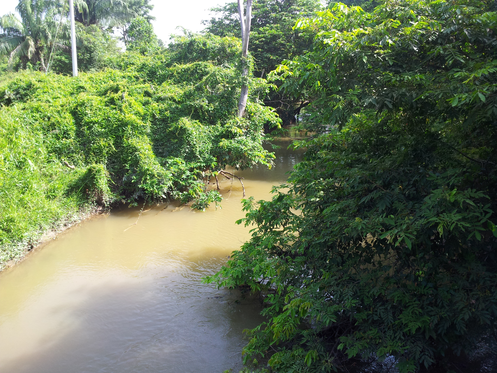

<br><details><summary>:camera:**11/2013-07-04_08.55.15.jpg**</summary><sub> `Exif version` 0220 `OS version` N7000XXLS2 `Date` 2013:07:04 08:55:15 `Aperture` Not known `Brightness` 8.42 `Color space` 1 `Compression` 6`Exposure mode` 0 `Exposure time` 0.001937984496124031 `Focal length` 3.97 `Lens model` Not known `Lens specification` Not known `Orientation` 1 `Scene type` Not known `f number` 2.65 `White balance` 0 `Sensing method` Not known `Shutter speed` 9.01</sub><sub>`Coordinates & altitude` (9.5384802, -73.5215662, 39.24)</sub><sub> :globe_with_meridians:`Location over` [Google Maps](http://maps.google.com/maps?q=9.5384802,-73.5215662) or [Openstreet Map](https://www.openstreetmap.org/query?lat=9.5384802&lon=-73.5215662)</sub></details>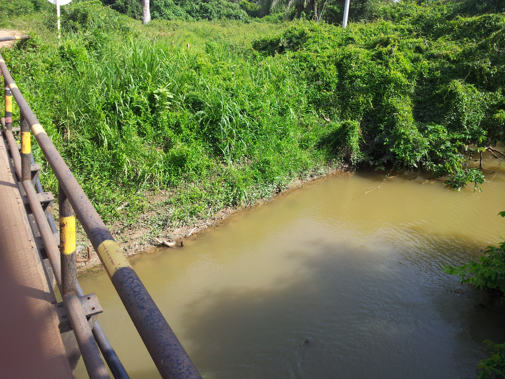

<br><details><summary>:camera:**11/2013-07-04_08.58.04.jpg**</summary><sub> `Exif version` 0220 `OS version` N7000XXLS2 `Date` 2013:07:04 08:58:04 `Aperture` Not known `Brightness` 8.76 `Color space` 1 `Compression` 6`Exposure mode` 0 `Exposure time` 0.0015313935681470138 `Focal length` 3.97 `Lens model` Not known `Lens specification` Not known `Orientation` 1 `Scene type` Not known `f number` 2.65 `White balance` 0 `Sensing method` Not known `Shutter speed` 9.35</sub><sub>`Coordinates & altitude` (9.5384264, -73.5215579, 40.13)</sub><sub> :globe_with_meridians:`Location over` [Google Maps](http://maps.google.com/maps?q=9.5384264,-73.5215579) or [Openstreet Map](https://www.openstreetmap.org/query?lat=9.5384264&lon=-73.5215579)</sub></details>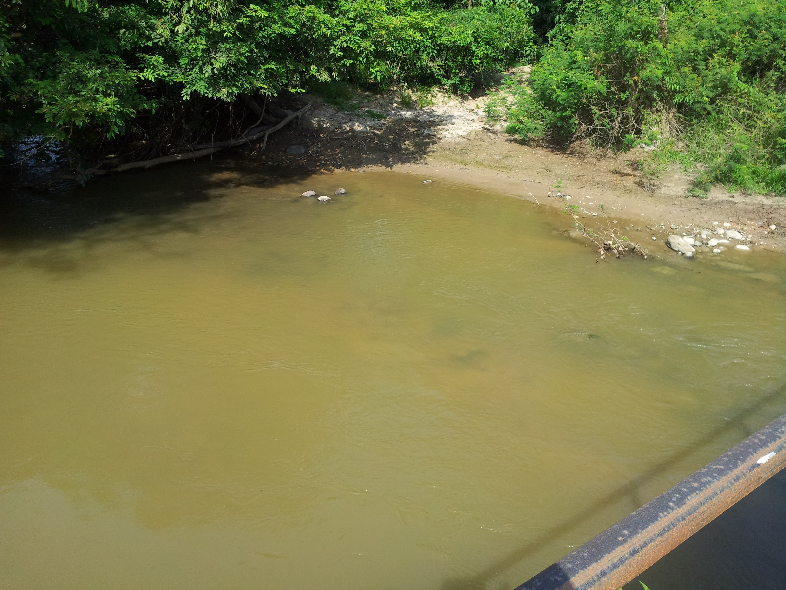

<br><details><summary>:camera:**11/2013-07-04_08.58.24.jpg**</summary><sub> `Exif version` 0220 `OS version` N7000XXLS2 `Date` 2013:07:04 08:58:24 `Aperture` Not known `Brightness` 8.81 `Color space` 1 `Compression` 6`Exposure mode` 0 `Exposure time` 0.0014792899408284023 `Focal length` 3.97 `Lens model` Not known `Lens specification` Not known `Orientation` 1 `Scene type` Not known `f number` 2.65 `White balance` 0 `Sensing method` Not known `Shutter speed` 9.4</sub><sub>`Coordinates & altitude` (9.5384264, -73.5215579, 40.13)</sub><sub> :globe_with_meridians:`Location over` [Google Maps](http://maps.google.com/maps?q=9.5384264,-73.5215579) or [Openstreet Map](https://www.openstreetmap.org/query?lat=9.5384264&lon=-73.5215579)</sub></details>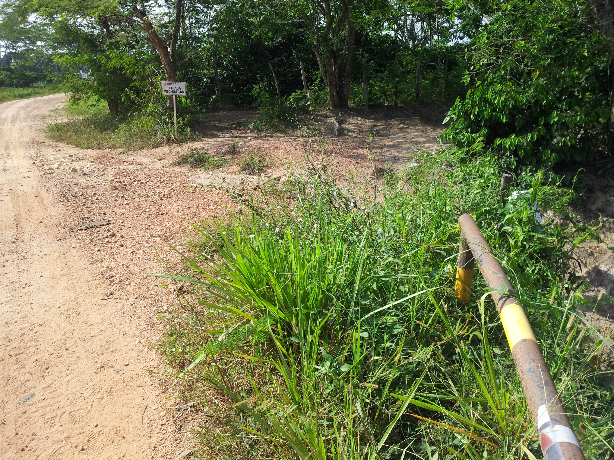

<br><details><summary>:camera:**11/2013-07-04_08.58.43.jpg**</summary><sub> `Exif version` 0220 `OS version` N7000XXLS2 `Date` 2013:07:04 08:58:43 `Aperture` Not known `Brightness` 6.92 `Color space` 1 `Compression` 6`Exposure mode` 0 `Exposure time` 0.005494505494505495 `Focal length` 3.97 `Lens model` Not known `Lens specification` Not known `Orientation` 1 `Scene type` Not known `f number` 2.65 `White balance` 0 `Sensing method` Not known `Shutter speed` 7.51</sub><sub>`Coordinates & altitude` (9.5384264, -73.5215579, 40.13)</sub><sub> :globe_with_meridians:`Location over` [Google Maps](http://maps.google.com/maps?q=9.5384264,-73.5215579) or [Openstreet Map](https://www.openstreetmap.org/query?lat=9.5384264&lon=-73.5215579)</sub></details>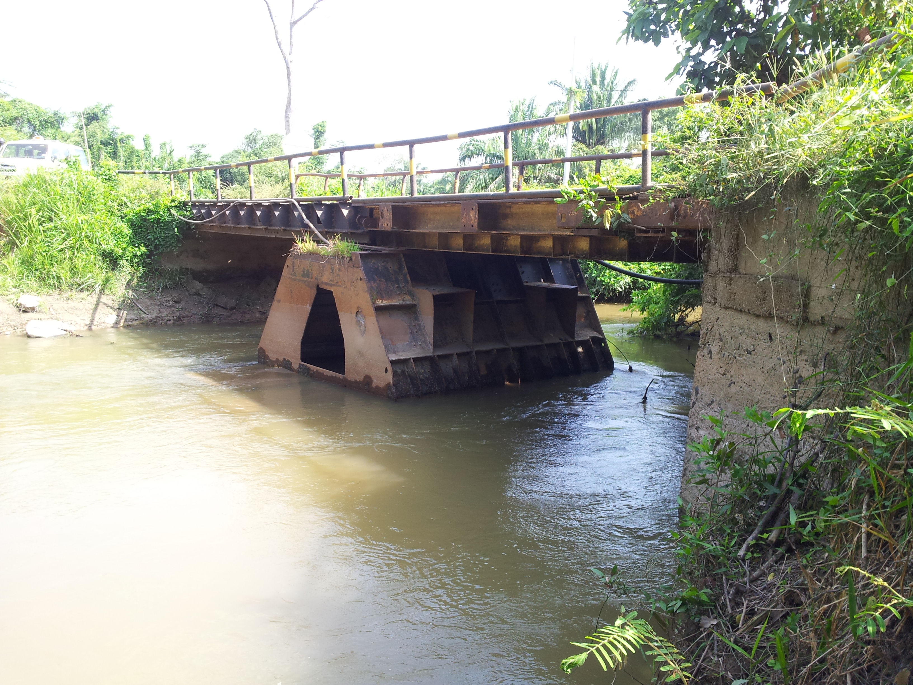

<br><details><summary>:camera:**11/2013-07-04_08.58.48.jpg**</summary><sub> `Exif version` 0220 `OS version` N7000XXLS2 `Date` 2013:07:04 08:58:48 `Aperture` Not known `Brightness` 8.22 `Color space` 1 `Compression` 6`Exposure mode` 0 `Exposure time` 0.0022271714922048997 `Focal length` 3.97 `Lens model` Not known `Lens specification` Not known `Orientation` 1 `Scene type` Not known `f number` 2.65 `White balance` 0 `Sensing method` Not known `Shutter speed` 8.81</sub><sub>`Coordinates & altitude` (9.5384264, -73.5215579, 40.13)</sub><sub> :globe_with_meridians:`Location over` [Google Maps](http://maps.google.com/maps?q=9.5384264,-73.5215579) or [Openstreet Map](https://www.openstreetmap.org/query?lat=9.5384264&lon=-73.5215579)</sub></details>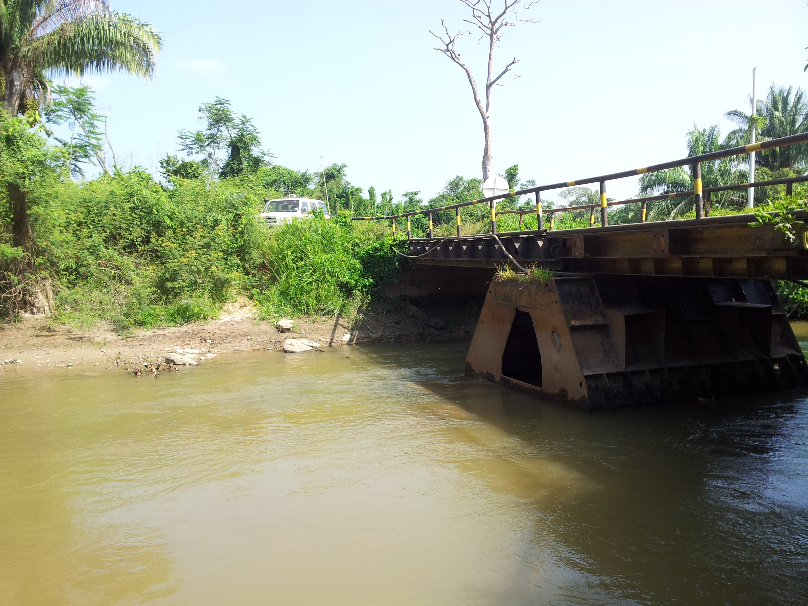

<br><details><summary>:camera:**11/2013-07-04_08.58.52.jpg**</summary><sub> `Exif version` 0220 `OS version` N7000XXLS2 `Date` 2013:07:04 08:58:52 `Aperture` Not known `Brightness` 6.57 `Color space` 1 `Compression` 6`Exposure mode` 0 `Exposure time` 0.006993006993006993 `Focal length` 3.97 `Lens model` Not known `Lens specification` Not known `Orientation` 1 `Scene type` Not known `f number` 2.65 `White balance` 0 `Sensing method` Not known `Shutter speed` 7.16</sub><sub>`Coordinates & altitude` (9.5384264, -73.5215579, 40.13)</sub><sub> :globe_with_meridians:`Location over` [Google Maps](http://maps.google.com/maps?q=9.5384264,-73.5215579) or [Openstreet Map](https://www.openstreetmap.org/query?lat=9.5384264&lon=-73.5215579)</sub></details>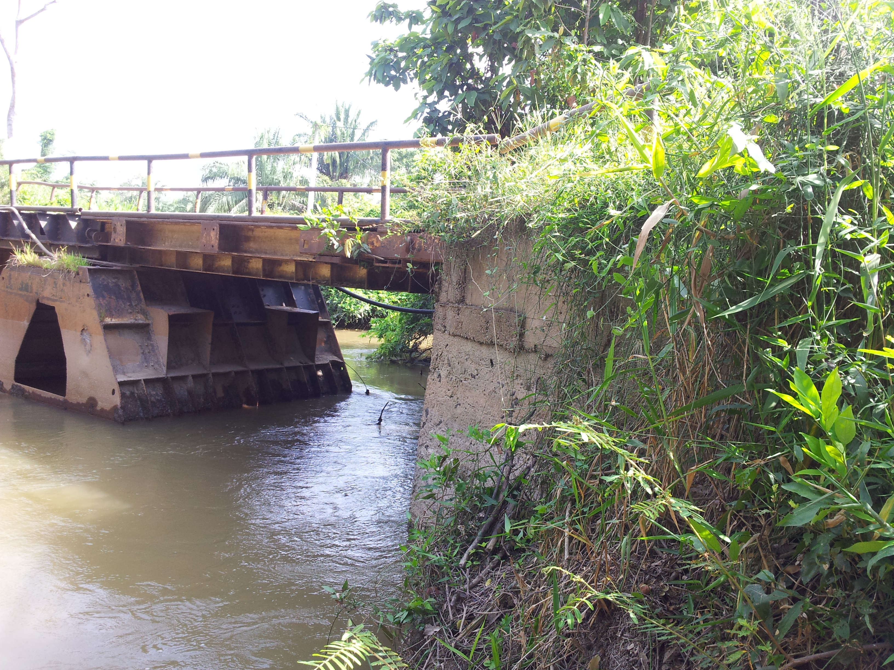

<br><details><summary>:camera:**11/2013-07-04_08.59.56.jpg**</summary><sub> `Exif version` 0220 `OS version` N7000XXLS2 `Date` 2013:07:04 08:59:56 `Aperture` Not known `Brightness` 6.54 `Color space` 1 `Compression` 6`Exposure mode` 0 `Exposure time` 0.007142857142857143 `Focal length` 3.97 `Lens model` Not known `Lens specification` Not known `Orientation` 1 `Scene type` Not known `f number` 2.65 `White balance` 0 `Sensing method` Not known `Shutter speed` 7.13</sub><sub>`Coordinates & altitude` (9.5384264, -73.5215579, 40.13)</sub><sub> :globe_with_meridians:`Location over` [Google Maps](http://maps.google.com/maps?q=9.5384264,-73.5215579) or [Openstreet Map](https://www.openstreetmap.org/query?lat=9.5384264&lon=-73.5215579)</sub></details>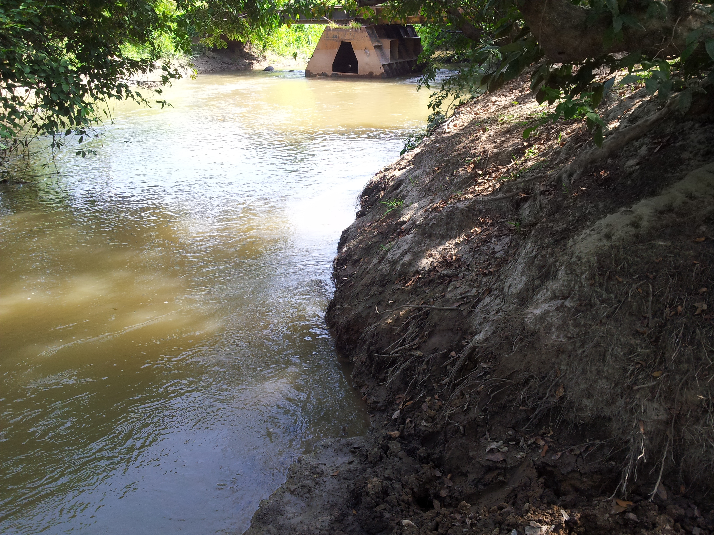

<br><details><summary>:camera:**11/2013-07-04_09.00.00.jpg**</summary><sub> `Exif version` 0220 `OS version` N7000XXLS2 `Date` 2013:07:04 09:00:00 `Aperture` Not known `Brightness` 6.06 `Color space` 1 `Compression` 6`Exposure mode` 0 `Exposure time` 0.01 `Focal length` 3.97 `Lens model` Not known `Lens specification` Not known `Orientation` 1 `Scene type` Not known `f number` 2.65 `White balance` 0 `Sensing method` Not known `Shutter speed` 6.64</sub><sub>`Coordinates & altitude` (9.5381873, -73.5215483, 77.59)</sub><sub> :globe_with_meridians:`Location over` [Google Maps](http://maps.google.com/maps?q=9.5381873,-73.5215483) or [Openstreet Map](https://www.openstreetmap.org/query?lat=9.5381873&lon=-73.5215483)</sub></details>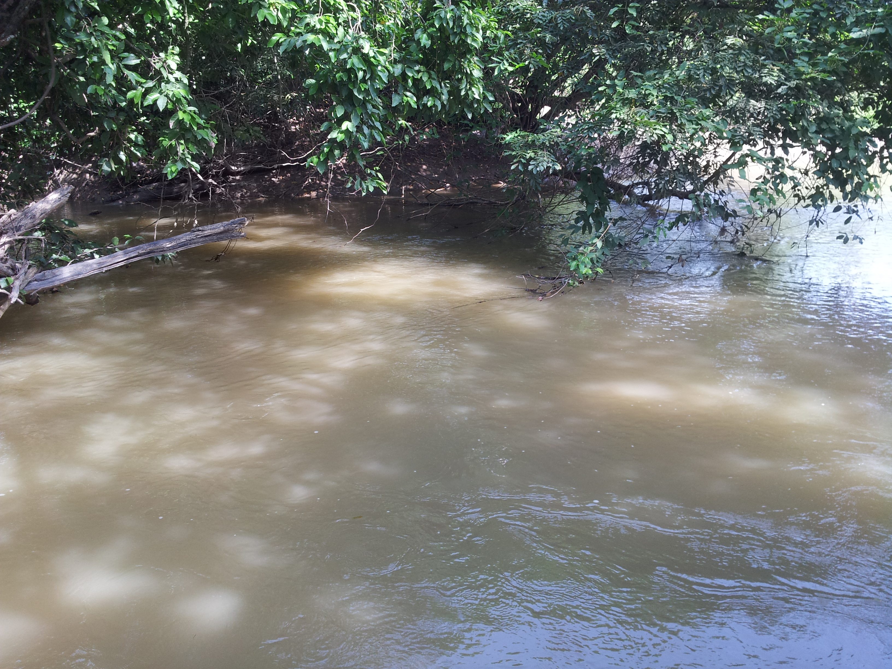

<br><details><summary>:camera:**11/2013-07-04_09.00.06.jpg**</summary><sub> `Exif version` 0220 `OS version` N7000XXLS2 `Date` 2013:07:04 09:00:06 `Aperture` Not known `Brightness` 5.01 `Color space` 1 `Compression` 6`Exposure mode` 0 `Exposure time` 0.02 `Focal length` 3.97 `Lens model` Not known `Lens specification` Not known `Orientation` 1 `Scene type` Not known `f number` 2.65 `White balance` 0 `Sensing method` Not known `Shutter speed` 5.64</sub><sub>`Coordinates & altitude` (9.5381873, -73.5215483, 77.59)</sub><sub> :globe_with_meridians:`Location over` [Google Maps](http://maps.google.com/maps?q=9.5381873,-73.5215483) or [Openstreet Map](https://www.openstreetmap.org/query?lat=9.5381873&lon=-73.5215483)</sub></details>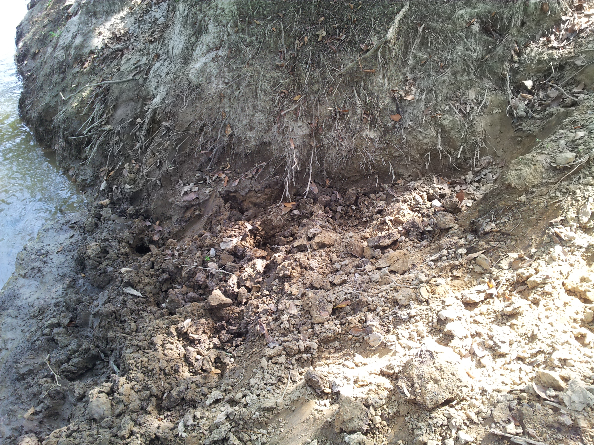

<br><details><summary>:camera:**11/2013-07-04_09.00.11.jpg**</summary><sub> `Exif version` 0220 `OS version` N7000XXLS2 `Date` 2013:07:04 09:00:11 `Aperture` Not known `Brightness` 6.4 `Color space` 1 `Compression` 6`Exposure mode` 0 `Exposure time` 0.007874015748031496 `Focal length` 3.97 `Lens model` Not known `Lens specification` Not known `Orientation` 1 `Scene type` Not known `f number` 2.65 `White balance` 0 `Sensing method` Not known `Shutter speed` 6.99</sub><sub>`Coordinates & altitude` (9.5381873, -73.5215483, 77.59)</sub><sub> :globe_with_meridians:`Location over` [Google Maps](http://maps.google.com/maps?q=9.5381873,-73.5215483) or [Openstreet Map](https://www.openstreetmap.org/query?lat=9.5381873&lon=-73.5215483)</sub></details>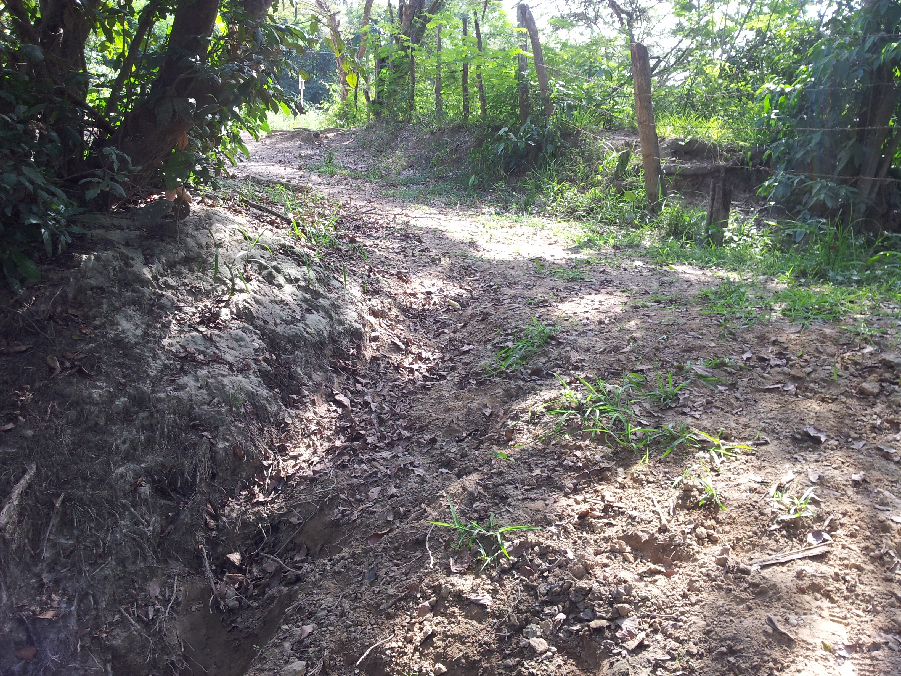

<br><details><summary>:camera:**11/2013-07-04_09.00.17.jpg**</summary><sub> `Exif version` 0220 `OS version` N7000XXLS2 `Date` 2013:07:04 09:00:17 `Aperture` Not known `Brightness` 6.4 `Color space` 1 `Compression` 6`Exposure mode` 0 `Exposure time` 0.007874015748031496 `Focal length` 3.97 `Lens model` Not known `Lens specification` Not known `Orientation` 1 `Scene type` Not known `f number` 2.65 `White balance` 0 `Sensing method` Not known `Shutter speed` 6.99</sub><sub>`Coordinates & altitude` (9.5381873, -73.5215483, 77.59)</sub><sub> :globe_with_meridians:`Location over` [Google Maps](http://maps.google.com/maps?q=9.5381873,-73.5215483) or [Openstreet Map](https://www.openstreetmap.org/query?lat=9.5381873&lon=-73.5215483)</sub></details>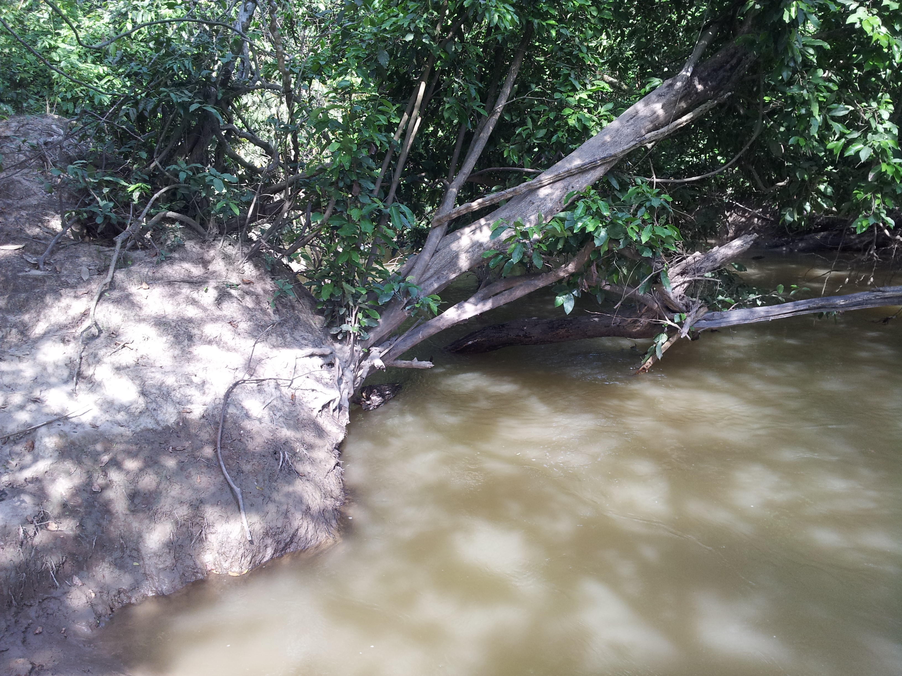

> _Citación: se permite la reproducción digital parcial o total de este repositorio, scripts, guías de desarrollo, modelos de datos, imágenes y documentación, siempre que se haga referencia como: "R.GISMobile - Sistemas de información geográficos móviles sobre QField que no requieren de conexión a Internet para su navegación". https://github.com/rcfdtools/R.GISMobile - Bogotá - Colombia - Suramérica."._

| [:house: Inicio](../Readme.md) |
|---|