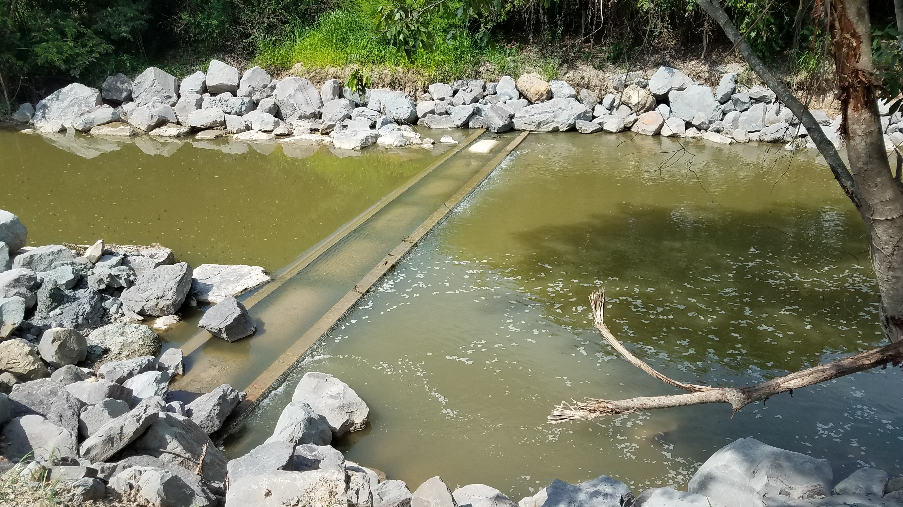

## Arroyo San Antonio - Erosión remontante - Estructuras de agradación (2018-04-25)
`Picture by` rcfdtools `Category` Technical field visit `Location over` [Google Maps](http://maps.google.com/maps?q=9.531024,-73.462601) 

```geojson
{
  "type": "Feature",
  "geometry": {
    "type": "Point", 
    "coordinates": [-73.462601, 9.531024]
  }, 
  "properties": {
    "Name": "Arroyo San Antonio - Erosión remontante - Estructuras de agradación"
  }
}
```

:camera: **12/20180425_141126.jpg** <sub> `Exif version` 0220 `OS version` G930PVPS5BRA1 `Date` 2018:04:25 14:11:26 `Aperture` Not known `Brightness` 8.71 `Color space` 1 `Compression` 6`Exposure mode` 0 `Exposure time` 0.0005040322580645161 `Focal length` 4.2 `Lens model` Not known `Lens specification` Not known `Orientation` 1 `Scene type` Not known `f number` 1.7 `White balance` 0 `Sensing method` 2 `Shutter speed` 10.954</sub>

:camera: **12/20180425_141135.jpg** <sub> `Exif version` 0220 `OS version` G930PVPS5BRA1 `Date` 2018:04:25 14:11:35 `Aperture` Not known `Brightness` 8.59 `Color space` 1 `Compression` 6`Exposure mode` 0 `Exposure time` 0.0005580357142857143 `Focal length` 4.2 `Lens model` Not known `Lens specification` Not known `Orientation` 1 `Scene type` Not known `f number` 1.7 `White balance` 0 `Sensing method` 2 `Shutter speed` 10.807</sub>

:camera: **12/20180425_141207.jpg** <sub> `Exif version` 0220 `OS version` G930PVPS5BRA1 `Date` 2018:04:25 14:12:07 `Aperture` Not known `Brightness` 8.48 `Color space` 1 `Compression` 6`Exposure mode` 0 `Exposure time` 0.0005813953488372093 `Focal length` 4.2 `Lens model` Not known `Lens specification` Not known `Orientation` 1 `Scene type` Not known `f number` 1.7 `White balance` 0 `Sensing method` 2 `Shutter speed` 10.748</sub>

:camera: **12/20180425_141212.jpg** <sub> `Exif version` 0220 `OS version` G930PVPS5BRA1 `Date` 2018:04:25 14:12:12 `Aperture` Not known `Brightness` 8.62 `Color space` 1 `Compression` 6`Exposure mode` 0 `Exposure time` 0.0005274261603375527 `Focal length` 4.2 `Lens model` Not known `Lens specification` Not known `Orientation` 1 `Scene type` Not known `f number` 1.7 `White balance` 0 `Sensing method` 2 `Shutter speed` 10.888</sub>

:camera: **12/20180425_141229.jpg** <sub> `Exif version` 0220 `OS version` G930PVPS5BRA1 `Date` 2018:04:25 14:12:29 `Aperture` Not known `Brightness` 8.72 `Color space` 1 `Compression` 6`Exposure mode` 0 `Exposure time` 0.0005081300813008131 `Focal length` 4.2 `Lens model` Not known `Lens specification` Not known `Orientation` 1 `Scene type` Not known `f number` 1.7 `White balance` 0 `Sensing method` 2 `Shutter speed` 10.942</sub>

:camera: **12/20180425_141246.jpg** <sub> `Exif version` 0220 `OS version` G930PVPS5BRA1 `Date` 2018:04:25 14:12:46 `Aperture` Not known `Brightness` 8.25 `Color space` 1 `Compression` 6`Exposure mode` 0 `Exposure time` 0.0007022471910112359 `Focal length` 4.2 `Lens model` Not known `Lens specification` Not known `Orientation` 1 `Scene type` Not known `f number` 1.7 `White balance` 0 `Sensing method` 2 `Shutter speed` 10.475</sub>

:camera: **12/20180425_141340.jpg** <sub> `Exif version` 0220 `OS version` G930PVPS5BRA1 `Date` 2018:04:25 14:13:40 `Aperture` Not known `Brightness` 8.1 `Color space` 1 `Compression` 6`Exposure mode` 0 `Exposure time` 0.000741839762611276 `Focal length` 4.2 `Lens model` Not known `Lens specification` Not known `Orientation` 1 `Scene type` Not known `f number` 1.7 `White balance` 0 `Sensing method` 2 `Shutter speed` 10.396</sub>

:camera: **12/20180425_141904.jpg** <sub> `Exif version` 0220 `OS version` G930PVPS5BRA1 `Date` 2018:04:25 14:19:03 `Aperture` Not known `Brightness` 8.58 `Color space` 1 `Compression` 6`Exposure mode` 0 `Exposure time` 0.0005787037037037037 `Focal length` 4.2 `Lens model` Not known `Lens specification` Not known `Orientation` 1 `Scene type` Not known `f number` 1.7 `White balance` 0 `Sensing method` 2 `Shutter speed` 10.754</sub>

:camera: **12/20180425_141907.jpg** <sub> `Exif version` 0220 `OS version` G930PVPS5BRA1 `Date` 2018:04:25 14:19:07 `Aperture` Not known `Brightness` 8.8 `Color space` 1 `Compression` 6`Exposure mode` 0 `Exposure time` 0.0004911591355599214 `Focal length` 4.2 `Lens model` Not known `Lens specification` Not known `Orientation` 1 `Scene type` Not known `f number` 1.7 `White balance` 0 `Sensing method` 2 `Shutter speed` 10.991</sub>

:camera: **12/20180425_141934.jpg** <sub> `Exif version` 0220 `OS version` G930PVPS5BRA1 `Date` 2018:04:25 14:19:34 `Aperture` Not known `Brightness` 8.45 `Color space` 1 `Compression` 6`Exposure mode` 0 `Exposure time` 0.0006038647342995169 `Focal length` 4.2 `Lens model` Not known `Lens specification` Not known `Orientation` 1 `Scene type` Not known `f number` 1.7 `White balance` 0 `Sensing method` 2 `Shutter speed` 10.693</sub>

:camera: **12/20180425_141937.jpg** <sub> `Exif version` 0220 `OS version` G930PVPS5BRA1 `Date` 2018:04:25 14:19:37 `Aperture` Not known `Brightness` 8.5 `Color space` 1 `Compression` 6`Exposure mode` 0 `Exposure time` 0.0005720823798627002 `Focal length` 4.2 `Lens model` Not known `Lens specification` Not known `Orientation` 1 `Scene type` Not known `f number` 1.7 `White balance` 0 `Sensing method` 2 `Shutter speed` 10.771</sub>

:camera: **12/20180425_141940.jpg** <sub> `Exif version` 0220 `OS version` G930PVPS5BRA1 `Date` 2018:04:25 14:19:40 `Aperture` Not known `Brightness` 8.38 `Color space` 1 `Compression` 6`Exposure mode` 0 `Exposure time` 0.000663129973474801 `Focal length` 4.2 `Lens model` Not known `Lens specification` Not known `Orientation` 1 `Scene type` Not known `f number` 1.7 `White balance` 0 `Sensing method` 2 `Shutter speed` 10.558</sub>

:camera: **12/20180425_141956.jpg** <sub> `Exif version` 0220 `OS version` G930PVPS5BRA1 `Date` 2018:04:25 14:19:56 `Aperture` Not known `Brightness` 8.27 `Color space` 1 `Compression` 6`Exposure mode` 0 `Exposure time` 0.000708215297450425 `Focal length` 4.2 `Lens model` Not known `Lens specification` Not known `Orientation` 1 `Scene type` Not known `f number` 1.7 `White balance` 0 `Sensing method` 2 `Shutter speed` 10.463</sub>

:camera: **12/20180425_142100.jpg** <sub> `Exif version` 0220 `OS version` G930PVPS5BRA1 `Date` 2018:04:25 14:20:59 `Aperture` Not known `Brightness` Not known `Color space` 1 `Compression` Not known`Exposure mode` 0 `Exposure time` Not known `Focal length` 4.2 `Lens model` Not known `Lens specification` Not known `Orientation` 1 `Scene type` Not known `f number` 1.7 `White balance` 0 `Sensing method` Not known `Shutter speed` Not known</sub>

:camera: **12/20180425_142133.jpg** <sub> `Exif version` 0220 `OS version` G930PVPS5BRA1 `Date` 2018:04:25 14:21:33 `Aperture` Not known `Brightness` 8.49 `Color space` 1 `Compression` 6`Exposure mode` 0 `Exposure time` 0.0005938242280285036 `Focal length` 4.2 `Lens model` Not known `Lens specification` Not known `Orientation` 1 `Scene type` Not known `f number` 1.7 `White balance` 0 `Sensing method` 2 `Shutter speed` 10.717</sub>

:camera: **12/20180425_142135.jpg** <sub> `Exif version` 0220 `OS version` G930PVPS5BRA1 `Date` 2018:04:25 14:21:35 `Aperture` Not known `Brightness` 8.43 `Color space` 1 `Compression` 6`Exposure mode` 0 `Exposure time` 0.0006459948320413437 `Focal length` 4.2 `Lens model` Not known `Lens specification` Not known `Orientation` 1 `Scene type` Not known `f number` 1.7 `White balance` 0 `Sensing method` 2 `Shutter speed` 10.596</sub>

:camera: **12/20180425_142205.jpg** <sub> `Exif version` 0220 `OS version` G930PVPS5BRA1 `Date` 2018:04:25 14:22:04 `Aperture` Not known `Brightness` Not known `Color space` 1 `Compression` Not known`Exposure mode` 0 `Exposure time` Not known `Focal length` 4.2 `Lens model` Not known `Lens specification` Not known `Orientation` 1 `Scene type` Not known `f number` 1.7 `White balance` 0 `Sensing method` Not known `Shutter speed` Not known</sub>

_**Citación:** se permite la reproducción digital parcial o total de este repositorio, scripts, guías de desarrollo, modelos de datos, imágenes y documentación, siempre que se haga referencia como: "R.GISMobile - Sistemas de información geográficos móviles sobre QField que no requieren de conexión a Internet para su navegación", https://github.com/rcfdtools/R.GISMobile, Bogotá - Colombia - Suramérica."._
| [:house: Inicio](../Readme.md) |
|---|