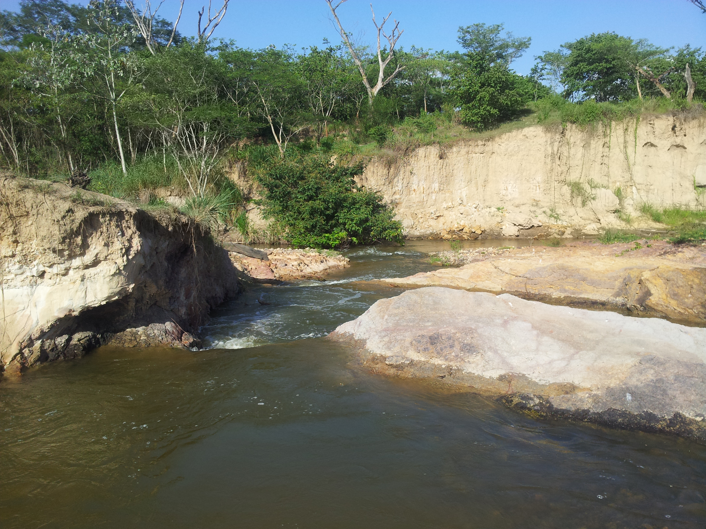
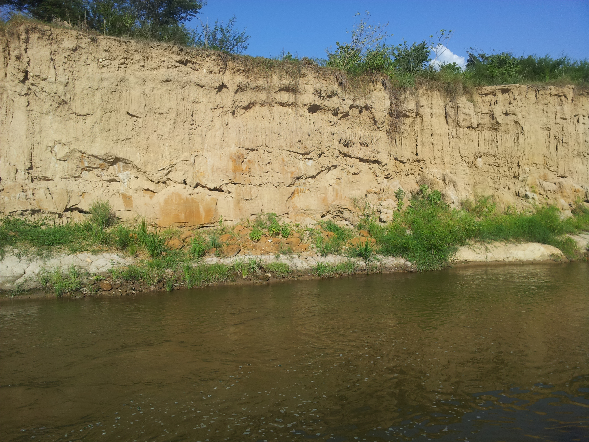
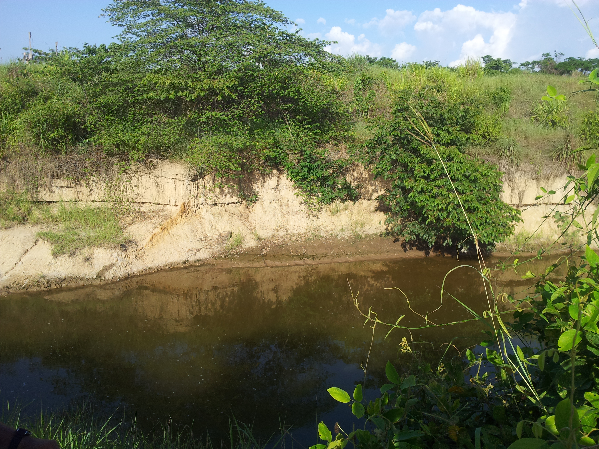
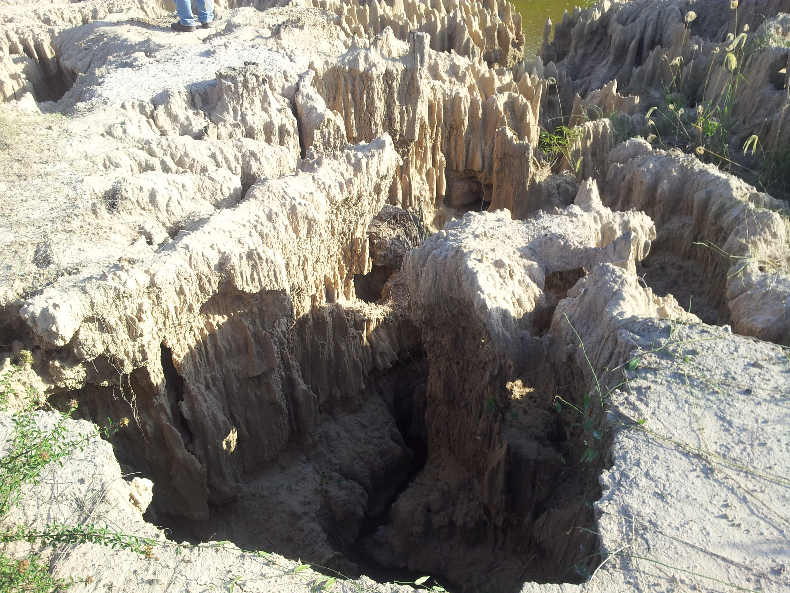

## :globe_with_meridians:Arroyo San Antonio - Erosión remontante - Estructuras de agradación (2018-04-25)
`Pictures` rcfdtools <br>`Category` Technical field visit <br>`Location` [Google Maps](http://maps.google.com/maps?q=9.531024,-73.462601) or [Openstreet Map](https://www.openstreetmap.org/query?lat=9.531024&lon=-73.462601) 

```geojson
{
  "type": "Feature",
  "geometry": {
    "type": "Point", 
    "coordinates": [-73.462601, 9.531024]
  }, 
  "properties": {
    "Name": "Arroyo San Antonio - Erosión remontante - Estructuras de agradación"
  }
}
```

<br><details><summary>:camera:**12/2013-07-03 16.02.18.jpg**</summary><sub> `Exif version` 0220 `OS version` N7000XXLS2 `Date` 2013:07:03 16:02:18 `Aperture` Not known `Brightness` 8.57 `Color space` 1 `Compression` 6`Exposure mode` 0 `Exposure time` 0.0017482517482517483 `Focal length` 3.97 `Lens model` Not known `Lens specification` Not known `Orientation` 1 `Scene type` Not known `f number` 2.65 `White balance` 0 `Sensing method` Not known `Shutter speed` 9.16</sub><sub>`Coordinates & altitude` (9.5336385, -73.4629137, 56.84)</sub><sub> :globe_with_meridians:`Location over` [Google Maps](http://maps.google.com/maps?q=9.5336385,-73.4629137) or [Openstreet Map](https://www.openstreetmap.org/query?lat=9.5336385&lon=-73.4629137)</sub></details>

<br><details><summary>:camera:**12/2013-07-03 16.02.21.jpg**</summary><sub> `Exif version` 0220 `OS version` N7000XXLS2 `Date` 2013:07:03 16:02:21 `Aperture` Not known `Brightness` 8.36 `Color space` 1 `Compression` 6`Exposure mode` 0 `Exposure time` 0.00202020202020202 `Focal length` 3.97 `Lens model` Not known `Lens specification` Not known `Orientation` 1 `Scene type` Not known `f number` 2.65 `White balance` 0 `Sensing method` Not known `Shutter speed` 8.95</sub><sub>`Coordinates & altitude` (9.5336385, -73.4629137, 56.84)</sub><sub> :globe_with_meridians:`Location over` [Google Maps](http://maps.google.com/maps?q=9.5336385,-73.4629137) or [Openstreet Map](https://www.openstreetmap.org/query?lat=9.5336385&lon=-73.4629137)</sub></details>

<br><details><summary>:camera:**12/2013-07-03 16.02.26.jpg**</summary><sub> `Exif version` 0220 `OS version` N7000XXLS2 `Date` 2013:07:03 16:02:26 `Aperture` Not known `Brightness` 8.76 `Color space` 1 `Compression` 6`Exposure mode` 0 `Exposure time` 0.0015313935681470138 `Focal length` 3.97 `Lens model` Not known `Lens specification` Not known `Orientation` 1 `Scene type` Not known `f number` 2.65 `White balance` 0 `Sensing method` Not known `Shutter speed` 9.35</sub><sub>`Coordinates & altitude` (9.5336385, -73.4629137, 56.84)</sub><sub> :globe_with_meridians:`Location over` [Google Maps](http://maps.google.com/maps?q=9.5336385,-73.4629137) or [Openstreet Map](https://www.openstreetmap.org/query?lat=9.5336385&lon=-73.4629137)</sub></details>

<br><details><summary>:camera:**12/2013-07-03 16.02.34.jpg**</summary><sub> `Exif version` 0220 `OS version` N7000XXLS2 `Date` 2013:07:03 16:02:34 `Aperture` Not known `Brightness` 9.82 `Color space` 1 `Compression` 6`Exposure mode` 0 `Exposure time` 0.0007558578987150416 `Focal length` 3.97 `Lens model` Not known `Lens specification` Not known `Orientation` 1 `Scene type` Not known `f number` 2.65 `White balance` 0 `Sensing method` Not known `Shutter speed` 10.37</sub><sub>`Coordinates & altitude` (9.5336385, -73.4629137, 56.84)</sub><sub> :globe_with_meridians:`Location over` [Google Maps](http://maps.google.com/maps?q=9.5336385,-73.4629137) or [Openstreet Map](https://www.openstreetmap.org/query?lat=9.5336385&lon=-73.4629137)</sub></details>

<br><details><summary>:camera:**12/2013-07-03 16.02.37.jpg**</summary><sub> `Exif version` 0220 `OS version` N7000XXLS2 `Date` 2013:07:03 16:02:37 `Aperture` Not known `Brightness` 9.38 `Color space` 1 `Compression` 6`Exposure mode` 0 `Exposure time` 0.0009970089730807576 `Focal length` 3.97 `Lens model` Not known `Lens specification` Not known `Orientation` 1 `Scene type` Not known `f number` 2.65 `White balance` 0 `Sensing method` Not known `Shutter speed` 9.97</sub><sub>`Coordinates & altitude` (9.5336385, -73.4629137, 56.84)</sub><sub> :globe_with_meridians:`Location over` [Google Maps](http://maps.google.com/maps?q=9.5336385,-73.4629137) or [Openstreet Map](https://www.openstreetmap.org/query?lat=9.5336385&lon=-73.4629137)</sub></details>

<br><details><summary>:camera:**12/2013-07-03 16.02.53.jpg**</summary><sub> `Exif version` 0220 `OS version` N7000XXLS2 `Date` 2013:07:03 16:02:53 `Aperture` Not known `Brightness` 9.63 `Color space` 1 `Compression` 6`Exposure mode` 0 `Exposure time` 0.0008382229673093043 `Focal length` 3.97 `Lens model` Not known `Lens specification` Not known `Orientation` 1 `Scene type` Not known `f number` 2.65 `White balance` 0 `Sensing method` Not known `Shutter speed` 10.22</sub><sub>`Coordinates & altitude` (9.5336385, -73.4629137, 56.84)</sub><sub> :globe_with_meridians:`Location over` [Google Maps](http://maps.google.com/maps?q=9.5336385,-73.4629137) or [Openstreet Map](https://www.openstreetmap.org/query?lat=9.5336385&lon=-73.4629137)</sub></details>

<br><details><summary>:camera:**12/2013-07-03 16.03.00.jpg**</summary><sub> `Exif version` 0220 `OS version` N7000XXLS2 `Date` 2013:07:03 16:03:00 `Aperture` Not known `Brightness` 9.13 `Color space` 1 `Compression` 6`Exposure mode` 0 `Exposure time` 0.0011862396204033216 `Focal length` 3.97 `Lens model` Not known `Lens specification` Not known `Orientation` 1 `Scene type` Not known `f number` 2.65 `White balance` 0 `Sensing method` Not known `Shutter speed` 9.72</sub><sub>`Coordinates & altitude` (9.5336385, -73.4629137, 56.84)</sub><sub> :globe_with_meridians:`Location over` [Google Maps](http://maps.google.com/maps?q=9.5336385,-73.4629137) or [Openstreet Map](https://www.openstreetmap.org/query?lat=9.5336385&lon=-73.4629137)</sub></details>

<br><details><summary>:camera:**12/2013-07-03 16.10.23.jpg**</summary><sub> `Exif version` 0220 `OS version` N7000XXLS2 `Date` 2013:07:03 16:10:23 `Aperture` Not known `Brightness` 8.33 `Color space` 1 `Compression` 6`Exposure mode` 0 `Exposure time` 0.002079002079002079 `Focal length` 3.97 `Lens model` Not known `Lens specification` Not known `Orientation` 1 `Scene type` Not known `f number` 2.65 `White balance` 0 `Sensing method` Not known `Shutter speed` 8.91</sub><sub>`Coordinates & altitude` (9.5332223, -73.4627698, 57.73)</sub><sub> :globe_with_meridians:`Location over` [Google Maps](http://maps.google.com/maps?q=9.5332223,-73.4627698) or [Openstreet Map](https://www.openstreetmap.org/query?lat=9.5332223&lon=-73.4627698)</sub></details>

<br><details><summary>:camera:**12/2013-07-03 16.10.26.jpg**</summary><sub> `Exif version` 0220 `OS version` N7000XXLS2 `Date` 2013:07:03 16:10:26 `Aperture` Not known `Brightness` 8.81 `Color space` 1 `Compression` 6`Exposure mode` 0 `Exposure time` 0.0014792899408284023 `Focal length` 3.97 `Lens model` Not known `Lens specification` Not known `Orientation` 1 `Scene type` Not known `f number` 2.65 `White balance` 0 `Sensing method` Not known `Shutter speed` 9.4</sub><sub>`Coordinates & altitude` (9.5332223, -73.4627698, 57.73)</sub><sub> :globe_with_meridians:`Location over` [Google Maps](http://maps.google.com/maps?q=9.5332223,-73.4627698) or [Openstreet Map](https://www.openstreetmap.org/query?lat=9.5332223&lon=-73.4627698)</sub></details>

<br><details><summary>:camera:**12/2013-07-03 16.10.30.jpg**</summary><sub> `Exif version` 0220 `OS version` N7000XXLS2 `Date` 2013:07:03 16:10:30 `Aperture` Not known `Brightness` 8.86 `Color space` 1 `Compression` 6`Exposure mode` 0 `Exposure time` 0.001430615164520744 `Focal length` 3.97 `Lens model` Not known `Lens specification` Not known `Orientation` 1 `Scene type` Not known `f number` 2.65 `White balance` 0 `Sensing method` Not known `Shutter speed` 9.45</sub><sub>`Coordinates & altitude` (9.5332223, -73.4627698, 57.73)</sub><sub> :globe_with_meridians:`Location over` [Google Maps](http://maps.google.com/maps?q=9.5332223,-73.4627698) or [Openstreet Map](https://www.openstreetmap.org/query?lat=9.5332223&lon=-73.4627698)</sub></details>

<br><details><summary>:camera:**12/2013-07-03 16.10.33.jpg**</summary><sub> `Exif version` 0220 `OS version` N7000XXLS2 `Date` 2013:07:03 16:10:33 `Aperture` Not known `Brightness` 9.82 `Color space` 1 `Compression` 6`Exposure mode` 0 `Exposure time` 0.0007558578987150416 `Focal length` 3.97 `Lens model` Not known `Lens specification` Not known `Orientation` 1 `Scene type` Not known `f number` 2.65 `White balance` 0 `Sensing method` Not known `Shutter speed` 10.37</sub><sub>`Coordinates & altitude` (9.5332223, -73.4627698, 57.73)</sub><sub> :globe_with_meridians:`Location over` [Google Maps](http://maps.google.com/maps?q=9.5332223,-73.4627698) or [Openstreet Map](https://www.openstreetmap.org/query?lat=9.5332223&lon=-73.4627698)</sub></details>

<br><details><summary>:camera:**12/2013-07-03 16.10.52.jpg**</summary><sub> `Exif version` 0220 `OS version` N7000XXLS2 `Date` 2013:07:03 16:10:52 `Aperture` Not known `Brightness` 8.25 `Color space` 1 `Compression` 6`Exposure mode` 0 `Exposure time` 0.002183406113537118 `Focal length` 3.97 `Lens model` Not known `Lens specification` Not known `Orientation` 1 `Scene type` Not known `f number` 2.65 `White balance` 0 `Sensing method` Not known `Shutter speed` 8.84</sub><sub>`Coordinates & altitude` (9.5332223, -73.4627698, 57.73)</sub><sub> :globe_with_meridians:`Location over` [Google Maps](http://maps.google.com/maps?q=9.5332223,-73.4627698) or [Openstreet Map](https://www.openstreetmap.org/query?lat=9.5332223&lon=-73.4627698)</sub></details>

<br><details><summary>:camera:**12/2013-07-03 16.10.58.jpg**</summary><sub> `Exif version` 0220 `OS version` N7000XXLS2 `Date` 2013:07:03 16:10:58 `Aperture` Not known `Brightness` 8.25 `Color space` 1 `Compression` 6`Exposure mode` 0 `Exposure time` 0.002183406113537118 `Focal length` 3.97 `Lens model` Not known `Lens specification` Not known `Orientation` 1 `Scene type` Not known `f number` 2.65 `White balance` 0 `Sensing method` Not known `Shutter speed` 8.84</sub><sub>`Coordinates & altitude` (9.5332223, -73.4627698, 57.73)</sub><sub> :globe_with_meridians:`Location over` [Google Maps](http://maps.google.com/maps?q=9.5332223,-73.4627698) or [Openstreet Map](https://www.openstreetmap.org/query?lat=9.5332223&lon=-73.4627698)</sub></details>

<br><details><summary>:camera:**12/2013-07-03 16.11.00.jpg**</summary><sub> `Exif version` 0220 `OS version` N7000XXLS2 `Date` 2013:07:03 16:11:00 `Aperture` Not known `Brightness` 10.31 `Color space` 1 `Compression` 6`Exposure mode` 0 `Exposure time` 0.0005417118093174431 `Focal length` 3.97 `Lens model` Not known `Lens specification` Not known `Orientation` 1 `Scene type` Not known `f number` 2.65 `White balance` 0 `Sensing method` Not known `Shutter speed` 10.85</sub><sub>`Coordinates & altitude` (9.5332223, -73.4627698, 57.73)</sub><sub> :globe_with_meridians:`Location over` [Google Maps](http://maps.google.com/maps?q=9.5332223,-73.4627698) or [Openstreet Map](https://www.openstreetmap.org/query?lat=9.5332223&lon=-73.4627698)</sub></details>

<br><details><summary>:camera:**12/2013-07-03 16.11.05.jpg**</summary><sub> `Exif version` 0220 `OS version` N7000XXLS2 `Date` 2013:07:03 16:11:05 `Aperture` Not known `Brightness` 9.99 `Color space` 1 `Compression` 6`Exposure mode` 0 `Exposure time` 0.000676132521974307 `Focal length` 3.97 `Lens model` Not known `Lens specification` Not known `Orientation` 1 `Scene type` Not known `f number` 2.65 `White balance` 0 `Sensing method` Not known `Shutter speed` 10.53</sub><sub>`Coordinates & altitude` (9.5332223, -73.4627698, 57.73)</sub><sub> :globe_with_meridians:`Location over` [Google Maps](http://maps.google.com/maps?q=9.5332223,-73.4627698) or [Openstreet Map](https://www.openstreetmap.org/query?lat=9.5332223&lon=-73.4627698)</sub></details>

<br><details><summary>:camera:**12/2013-07-03 16.11.59.jpg**</summary><sub> `Exif version` 0220 `OS version` N7000XXLS2 `Date` 2013:07:03 16:11:59 `Aperture` Not known `Brightness` 9.42 `Color space` 1 `Compression` 6`Exposure mode` 0 `Exposure time` 0.0009970089730807576 `Focal length` 3.97 `Lens model` Not known `Lens specification` Not known `Orientation` 1 `Scene type` Not known `f number` 2.65 `White balance` 0 `Sensing method` Not known `Shutter speed` 9.97</sub><sub>`Coordinates & altitude` (9.5332223, -73.4627698, 57.73)</sub><sub> :globe_with_meridians:`Location over` [Google Maps](http://maps.google.com/maps?q=9.5332223,-73.4627698) or [Openstreet Map](https://www.openstreetmap.org/query?lat=9.5332223&lon=-73.4627698)</sub></details>

<br><details><summary>:camera:**12/2013-07-03 16.14.39.jpg**</summary><sub> `Exif version` 0220 `OS version` N7000XXLS2 `Date` 2013:07:03 16:14:39 `Aperture` Not known `Brightness` 8.29 `Color space` 1 `Compression` 6`Exposure mode` 0 `Exposure time` 0.0021231422505307855 `Focal length` 3.97 `Lens model` Not known `Lens specification` Not known `Orientation` 1 `Scene type` Not known `f number` 2.65 `White balance` 0 `Sensing method` Not known `Shutter speed` 8.88</sub><sub>`Coordinates & altitude` (9.5330167, -73.4626651, 56.05)</sub><sub> :globe_with_meridians:`Location over` [Google Maps](http://maps.google.com/maps?q=9.5330167,-73.4626651) or [Openstreet Map](https://www.openstreetmap.org/query?lat=9.5330167&lon=-73.4626651)</sub></details>

<br><details><summary>:camera:**12/2013-07-03 16.14.54.jpg**</summary><sub> `Exif version` 0220 `OS version` N7000XXLS2 `Date` 2013:07:03 16:14:54 `Aperture` Not known `Brightness` 8.81 `Color space` 1 `Compression` 6`Exposure mode` 0 `Exposure time` 0.0014792899408284023 `Focal length` 3.97 `Lens model` Not known `Lens specification` Not known `Orientation` 1 `Scene type` Not known `f number` 2.65 `White balance` 0 `Sensing method` Not known `Shutter speed` 9.4</sub><sub>`Coordinates & altitude` (9.5330167, -73.4626651, 56.05)</sub><sub> :globe_with_meridians:`Location over` [Google Maps](http://maps.google.com/maps?q=9.5330167,-73.4626651) or [Openstreet Map](https://www.openstreetmap.org/query?lat=9.5330167&lon=-73.4626651)</sub></details>

<br><details><summary>:camera:**12/2013-07-03 16.15.27.jpg**</summary><sub> `Exif version` 0220 `OS version` N7000XXLS2 `Date` 2013:07:03 16:15:27 `Aperture` Not known `Brightness` 7.89 `Color space` 1 `Compression` 6`Exposure mode` 0 `Exposure time` 0.0028011204481792717 `Focal length` 3.97 `Lens model` Not known `Lens specification` Not known `Orientation` 1 `Scene type` Not known `f number` 2.65 `White balance` 0 `Sensing method` Not known `Shutter speed` 8.48</sub><sub>`Coordinates & altitude` (9.5330167, -73.4626651, 56.05)</sub><sub> :globe_with_meridians:`Location over` [Google Maps](http://maps.google.com/maps?q=9.5330167,-73.4626651) or [Openstreet Map](https://www.openstreetmap.org/query?lat=9.5330167&lon=-73.4626651)</sub></details>

<br><details><summary>:camera:**12/2013-07-03 16.15.41.jpg**</summary><sub> `Exif version` 0220 `OS version` N7000XXLS2 `Date` 2013:07:03 16:15:41 `Aperture` Not known `Brightness` 7.31 `Color space` 1 `Compression` 6`Exposure mode` 0 `Exposure time` 0.0041841004184100415 `Focal length` 3.97 `Lens model` Not known `Lens specification` Not known `Orientation` 1 `Scene type` Not known `f number` 2.65 `White balance` 0 `Sensing method` Not known `Shutter speed` 7.9</sub><sub>`Coordinates & altitude` (9.5330167, -73.4626651, 56.05)</sub><sub> :globe_with_meridians:`Location over` [Google Maps](http://maps.google.com/maps?q=9.5330167,-73.4626651) or [Openstreet Map](https://www.openstreetmap.org/query?lat=9.5330167&lon=-73.4626651)</sub></details>

<br><details><summary>:camera:**12/2013-07-03 16.16.22.jpg**</summary><sub> `Exif version` 0220 `OS version` N7000XXLS2 `Date` 2013:07:03 16:16:22 `Aperture` Not known `Brightness` 8.98 `Color space` 1 `Compression` 6`Exposure mode` 0 `Exposure time` 0.0013245033112582781 `Focal length` 3.97 `Lens model` Not known `Lens specification` Not known `Orientation` 1 `Scene type` Not known `f number` 2.65 `White balance` 0 `Sensing method` Not known `Shutter speed` 9.56</sub><sub>`Coordinates & altitude` (9.5330167, -73.4626651, 56.05)</sub><sub> :globe_with_meridians:`Location over` [Google Maps](http://maps.google.com/maps?q=9.5330167,-73.4626651) or [Openstreet Map](https://www.openstreetmap.org/query?lat=9.5330167&lon=-73.4626651)</sub></details>

<br><details><summary>:camera:**12/2013-07-03 16.26.22.jpg**</summary><sub> `Exif version` 0220 `OS version` N7000XXLS2 `Date` 2013:07:03 16:26:22 `Aperture` Not known `Brightness` 9.17 `Color space` 1 `Compression` 6`Exposure mode` 0 `Exposure time` 0.0011862396204033216 `Focal length` 3.97 `Lens model` Not known `Lens specification` Not known `Orientation` 1 `Scene type` Not known `f number` 2.65 `White balance` 0 `Sensing method` Not known `Shutter speed` 9.72</sub><sub>`Coordinates & altitude` (9.5282362, -73.4623197, 54.04)</sub><sub> :globe_with_meridians:`Location over` [Google Maps](http://maps.google.com/maps?q=9.5282362,-73.4623197) or [Openstreet Map](https://www.openstreetmap.org/query?lat=9.5282362&lon=-73.4623197)</sub></details>

<br><details><summary>:camera:**12/2013-07-03 16.26.26.jpg**</summary><sub> `Exif version` 0220 `OS version` N7000XXLS2 `Date` 2013:07:03 16:26:26 `Aperture` Not known `Brightness` 9.42 `Color space` 1 `Compression` 6`Exposure mode` 0 `Exposure time` 0.0009699321047526673 `Focal length` 3.97 `Lens model` Not known `Lens specification` Not known `Orientation` 1 `Scene type` Not known `f number` 2.65 `White balance` 0 `Sensing method` Not known `Shutter speed` 10.01</sub><sub>`Coordinates & altitude` (9.5282362, -73.4623197, 54.04)</sub><sub> :globe_with_meridians:`Location over` [Google Maps](http://maps.google.com/maps?q=9.5282362,-73.4623197) or [Openstreet Map](https://www.openstreetmap.org/query?lat=9.5282362&lon=-73.4623197)</sub></details>

<br><details><summary>:camera:**12/2013-07-03 16.28.03.jpg**</summary><sub> `Exif version` 0220 `OS version` N7000XXLS2 `Date` 2013:07:03 16:28:03 `Aperture` Not known `Brightness` 7.95 `Color space` 1 `Compression` 6`Exposure mode` 0 `Exposure time` 0.002688172043010753 `Focal length` 3.97 `Lens model` Not known `Lens specification` Not known `Orientation` 1 `Scene type` Not known `f number` 2.65 `White balance` 0 `Sensing method` Not known `Shutter speed` 8.54</sub><sub>`Coordinates & altitude` (9.5282168, -73.4622893, 52.94)</sub><sub> :globe_with_meridians:`Location over` [Google Maps](http://maps.google.com/maps?q=9.5282168,-73.4622893) or [Openstreet Map](https://www.openstreetmap.org/query?lat=9.5282168&lon=-73.4622893)</sub></details>

<br><details><summary>:camera:**12/2013-07-03 16.28.07.jpg**</summary><sub> `Exif version` 0220 `OS version` N7000XXLS2 `Date` 2013:07:03 16:28:07 `Aperture` Not known `Brightness` 8.59 `Color space` 1 `Compression` 6`Exposure mode` 0 `Exposure time` 0.0017241379310344827 `Focal length` 3.97 `Lens model` Not known `Lens specification` Not known `Orientation` 1 `Scene type` Not known `f number` 2.65 `White balance` 0 `Sensing method` Not known `Shutter speed` 9.18</sub><sub>`Coordinates & altitude` (9.5282168, -73.4622893, 52.94)</sub><sub> :globe_with_meridians:`Location over` [Google Maps](http://maps.google.com/maps?q=9.5282168,-73.4622893) or [Openstreet Map](https://www.openstreetmap.org/query?lat=9.5282168&lon=-73.4622893)</sub></details>

<br><details><summary>:camera:**12/2013-07-03 16.29.54.jpg**</summary><sub> `Exif version` 0210 `OS version` N7000XXLS2 `Date` 2013:07:03 16:29:54 `Aperture` Not known `Brightness` Not known `Color space` 1 `Compression` Not known`Exposure mode` 0 `Exposure time` Not known `Focal length` Not known `Lens model` Not known `Lens specification` Not known `Orientation` 1 `Scene type` Not known `f number` Not known `White balance` 0 `Sensing method` Not known `Shutter speed` Not known</sub></details>

<br><details><summary>:camera:**12/2013-07-03 16.30.54.jpg**</summary><sub> `Exif version` 0210 `OS version` N7000XXLS2 `Date` 2013:07:03 16:30:54 `Aperture` Not known `Brightness` Not known `Color space` 1 `Compression` Not known`Exposure mode` 0 `Exposure time` Not known `Focal length` Not known `Lens model` Not known `Lens specification` Not known `Orientation` 1 `Scene type` Not known `f number` Not known `White balance` 0 `Sensing method` Not known `Shutter speed` Not known</sub></details>

<br><details><summary>:camera:**12/2013-07-03 16.39.14.jpg**</summary><sub> `Exif version` 0220 `OS version` N7000XXLS2 `Date` 2013:07:03 16:39:14 `Aperture` Not known `Brightness` 7.89 `Color space` 1 `Compression` 6`Exposure mode` 0 `Exposure time` 0.0028011204481792717 `Focal length` 3.97 `Lens model` Not known `Lens specification` Not known `Orientation` 1 `Scene type` Not known `f number` 2.65 `White balance` 0 `Sensing method` Not known `Shutter speed` 8.48</sub><sub>`Coordinates & altitude` (9.5249731, -73.4694264, 46.07)</sub><sub> :globe_with_meridians:`Location over` [Google Maps](http://maps.google.com/maps?q=9.5249731,-73.4694264) or [Openstreet Map](https://www.openstreetmap.org/query?lat=9.5249731&lon=-73.4694264)</sub></details>

<br><details><summary>:camera:**12/2013-07-03 16.39.18.jpg**</summary><sub> `Exif version` 0220 `OS version` N7000XXLS2 `Date` 2013:07:03 16:39:18 `Aperture` Not known `Brightness` 8.17 `Color space` 1 `Compression` 6`Exposure mode` 0 `Exposure time` 0.002320185614849188 `Focal length` 3.97 `Lens model` Not known `Lens specification` Not known `Orientation` 1 `Scene type` Not known `f number` 2.65 `White balance` 0 `Sensing method` Not known `Shutter speed` 8.75</sub><sub>`Coordinates & altitude` (9.5249731, -73.4694264, 46.07)</sub><sub> :globe_with_meridians:`Location over` [Google Maps](http://maps.google.com/maps?q=9.5249731,-73.4694264) or [Openstreet Map](https://www.openstreetmap.org/query?lat=9.5249731&lon=-73.4694264)</sub></details>

<br><details><summary>:camera:**12/2013-07-03 16.39.21.jpg**</summary><sub> `Exif version` 0220 `OS version` N7000XXLS2 `Date` 2013:07:03 16:39:21 `Aperture` Not known `Brightness` 7.45 `Color space` 1 `Compression` 6`Exposure mode` 0 `Exposure time` 0.0038022813688212928 `Focal length` 3.97 `Lens model` Not known `Lens specification` Not known `Orientation` 1 `Scene type` Not known `f number` 2.65 `White balance` 0 `Sensing method` Not known `Shutter speed` 8.04</sub><sub>`Coordinates & altitude` (9.5249731, -73.4694264, 46.07)</sub><sub> :globe_with_meridians:`Location over` [Google Maps](http://maps.google.com/maps?q=9.5249731,-73.4694264) or [Openstreet Map](https://www.openstreetmap.org/query?lat=9.5249731&lon=-73.4694264)</sub></details>

<br><details><summary>:camera:**12/2013-07-03 16.39.24.jpg**</summary><sub> `Exif version` 0220 `OS version` N7000XXLS2 `Date` 2013:07:03 16:39:24 `Aperture` Not known `Brightness` 9.23 `Color space` 1 `Compression` 6`Exposure mode` 0 `Exposure time` 0.0011061946902654867 `Focal length` 3.97 `Lens model` Not known `Lens specification` Not known `Orientation` 1 `Scene type` Not known `f number` 2.65 `White balance` 0 `Sensing method` Not known `Shutter speed` 9.82</sub><sub>`Coordinates & altitude` (9.5249731, -73.4694264, 46.07)</sub><sub> :globe_with_meridians:`Location over` [Google Maps](http://maps.google.com/maps?q=9.5249731,-73.4694264) or [Openstreet Map](https://www.openstreetmap.org/query?lat=9.5249731&lon=-73.4694264)</sub></details>

<br><details><summary>:camera:**12/2013-07-03 16.39.31.jpg**</summary><sub> `Exif version` 0220 `OS version` N7000XXLS2 `Date` 2013:07:03 16:39:31 `Aperture` Not known `Brightness` 5.93 `Color space` 1 `Compression` 6`Exposure mode` 0 `Exposure time` 0.01 `Focal length` 3.97 `Lens model` Not known `Lens specification` Not known `Orientation` 1 `Scene type` Not known `f number` 2.65 `White balance` 0 `Sensing method` Not known `Shutter speed` 6.64</sub><sub>`Coordinates & altitude` (9.5249731, -73.4694264, 46.07)</sub><sub> :globe_with_meridians:`Location over` [Google Maps](http://maps.google.com/maps?q=9.5249731,-73.4694264) or [Openstreet Map](https://www.openstreetmap.org/query?lat=9.5249731&lon=-73.4694264)</sub></details>

<br><details><summary>:camera:**12/20180425_141126.jpg**</summary><sub> `Exif version` 0220 `OS version` G930PVPS5BRA1 `Date` 2018:04:25 14:11:26 `Aperture` Not known `Brightness` 8.71 `Color space` 1 `Compression` 6`Exposure mode` 0 `Exposure time` 0.0005040322580645161 `Focal length` 4.2 `Lens model` Not known `Lens specification` Not known `Orientation` 1 `Scene type` Not known `f number` 1.7 `White balance` 0 `Sensing method` 2 `Shutter speed` 10.954</sub></details>

<br><details><summary>:camera:**12/20180425_141135.jpg**</summary><sub> `Exif version` 0220 `OS version` G930PVPS5BRA1 `Date` 2018:04:25 14:11:35 `Aperture` Not known `Brightness` 8.59 `Color space` 1 `Compression` 6`Exposure mode` 0 `Exposure time` 0.0005580357142857143 `Focal length` 4.2 `Lens model` Not known `Lens specification` Not known `Orientation` 1 `Scene type` Not known `f number` 1.7 `White balance` 0 `Sensing method` 2 `Shutter speed` 10.807</sub></details>

<br><details><summary>:camera:**12/20180425_141207.jpg**</summary><sub> `Exif version` 0220 `OS version` G930PVPS5BRA1 `Date` 2018:04:25 14:12:07 `Aperture` Not known `Brightness` 8.48 `Color space` 1 `Compression` 6`Exposure mode` 0 `Exposure time` 0.0005813953488372093 `Focal length` 4.2 `Lens model` Not known `Lens specification` Not known `Orientation` 1 `Scene type` Not known `f number` 1.7 `White balance` 0 `Sensing method` 2 `Shutter speed` 10.748</sub></details>

<br><details><summary>:camera:**12/20180425_141212.jpg**</summary><sub> `Exif version` 0220 `OS version` G930PVPS5BRA1 `Date` 2018:04:25 14:12:12 `Aperture` Not known `Brightness` 8.62 `Color space` 1 `Compression` 6`Exposure mode` 0 `Exposure time` 0.0005274261603375527 `Focal length` 4.2 `Lens model` Not known `Lens specification` Not known `Orientation` 1 `Scene type` Not known `f number` 1.7 `White balance` 0 `Sensing method` 2 `Shutter speed` 10.888</sub></details>

<br><details><summary>:camera:**12/20180425_141229.jpg**</summary><sub> `Exif version` 0220 `OS version` G930PVPS5BRA1 `Date` 2018:04:25 14:12:29 `Aperture` Not known `Brightness` 8.72 `Color space` 1 `Compression` 6`Exposure mode` 0 `Exposure time` 0.0005081300813008131 `Focal length` 4.2 `Lens model` Not known `Lens specification` Not known `Orientation` 1 `Scene type` Not known `f number` 1.7 `White balance` 0 `Sensing method` 2 `Shutter speed` 10.942</sub></details>

<br><details><summary>:camera:**12/20180425_141246.jpg**</summary><sub> `Exif version` 0220 `OS version` G930PVPS5BRA1 `Date` 2018:04:25 14:12:46 `Aperture` Not known `Brightness` 8.25 `Color space` 1 `Compression` 6`Exposure mode` 0 `Exposure time` 0.0007022471910112359 `Focal length` 4.2 `Lens model` Not known `Lens specification` Not known `Orientation` 1 `Scene type` Not known `f number` 1.7 `White balance` 0 `Sensing method` 2 `Shutter speed` 10.475</sub></details>

<br><details><summary>:camera:**12/20180425_141340.jpg**</summary><sub> `Exif version` 0220 `OS version` G930PVPS5BRA1 `Date` 2018:04:25 14:13:40 `Aperture` Not known `Brightness` 8.1 `Color space` 1 `Compression` 6`Exposure mode` 0 `Exposure time` 0.000741839762611276 `Focal length` 4.2 `Lens model` Not known `Lens specification` Not known `Orientation` 1 `Scene type` Not known `f number` 1.7 `White balance` 0 `Sensing method` 2 `Shutter speed` 10.396</sub></details>

<br><details><summary>:camera:**12/20180425_141904.jpg**</summary><sub> `Exif version` 0220 `OS version` G930PVPS5BRA1 `Date` 2018:04:25 14:19:03 `Aperture` Not known `Brightness` 8.58 `Color space` 1 `Compression` 6`Exposure mode` 0 `Exposure time` 0.0005787037037037037 `Focal length` 4.2 `Lens model` Not known `Lens specification` Not known `Orientation` 1 `Scene type` Not known `f number` 1.7 `White balance` 0 `Sensing method` 2 `Shutter speed` 10.754</sub></details>

<br><details><summary>:camera:**12/20180425_141907.jpg**</summary><sub> `Exif version` 0220 `OS version` G930PVPS5BRA1 `Date` 2018:04:25 14:19:07 `Aperture` Not known `Brightness` 8.8 `Color space` 1 `Compression` 6`Exposure mode` 0 `Exposure time` 0.0004911591355599214 `Focal length` 4.2 `Lens model` Not known `Lens specification` Not known `Orientation` 1 `Scene type` Not known `f number` 1.7 `White balance` 0 `Sensing method` 2 `Shutter speed` 10.991</sub></details>

<br><details><summary>:camera:**12/20180425_141934.jpg**</summary><sub> `Exif version` 0220 `OS version` G930PVPS5BRA1 `Date` 2018:04:25 14:19:34 `Aperture` Not known `Brightness` 8.45 `Color space` 1 `Compression` 6`Exposure mode` 0 `Exposure time` 0.0006038647342995169 `Focal length` 4.2 `Lens model` Not known `Lens specification` Not known `Orientation` 1 `Scene type` Not known `f number` 1.7 `White balance` 0 `Sensing method` 2 `Shutter speed` 10.693</sub></details>

<br><details><summary>:camera:**12/20180425_141937.jpg**</summary><sub> `Exif version` 0220 `OS version` G930PVPS5BRA1 `Date` 2018:04:25 14:19:37 `Aperture` Not known `Brightness` 8.5 `Color space` 1 `Compression` 6`Exposure mode` 0 `Exposure time` 0.0005720823798627002 `Focal length` 4.2 `Lens model` Not known `Lens specification` Not known `Orientation` 1 `Scene type` Not known `f number` 1.7 `White balance` 0 `Sensing method` 2 `Shutter speed` 10.771</sub></details>

<br><details><summary>:camera:**12/20180425_141940.jpg**</summary><sub> `Exif version` 0220 `OS version` G930PVPS5BRA1 `Date` 2018:04:25 14:19:40 `Aperture` Not known `Brightness` 8.38 `Color space` 1 `Compression` 6`Exposure mode` 0 `Exposure time` 0.000663129973474801 `Focal length` 4.2 `Lens model` Not known `Lens specification` Not known `Orientation` 1 `Scene type` Not known `f number` 1.7 `White balance` 0 `Sensing method` 2 `Shutter speed` 10.558</sub></details>

<br><details><summary>:camera:**12/20180425_141956.jpg**</summary><sub> `Exif version` 0220 `OS version` G930PVPS5BRA1 `Date` 2018:04:25 14:19:56 `Aperture` Not known `Brightness` 8.27 `Color space` 1 `Compression` 6`Exposure mode` 0 `Exposure time` 0.000708215297450425 `Focal length` 4.2 `Lens model` Not known `Lens specification` Not known `Orientation` 1 `Scene type` Not known `f number` 1.7 `White balance` 0 `Sensing method` 2 `Shutter speed` 10.463</sub></details>

<br><details><summary>:camera:**12/20180425_142100.jpg**</summary><sub> `Exif version` 0220 `OS version` G930PVPS5BRA1 `Date` 2018:04:25 14:20:59 `Aperture` Not known `Brightness` Not known `Color space` 1 `Compression` Not known`Exposure mode` 0 `Exposure time` Not known `Focal length` 4.2 `Lens model` Not known `Lens specification` Not known `Orientation` 1 `Scene type` Not known `f number` 1.7 `White balance` 0 `Sensing method` Not known `Shutter speed` Not known</sub></details>

<br><details><summary>:camera:**12/20180425_142133.jpg**</summary><sub> `Exif version` 0220 `OS version` G930PVPS5BRA1 `Date` 2018:04:25 14:21:33 `Aperture` Not known `Brightness` 8.49 `Color space` 1 `Compression` 6`Exposure mode` 0 `Exposure time` 0.0005938242280285036 `Focal length` 4.2 `Lens model` Not known `Lens specification` Not known `Orientation` 1 `Scene type` Not known `f number` 1.7 `White balance` 0 `Sensing method` 2 `Shutter speed` 10.717</sub></details>

<br><details><summary>:camera:**12/20180425_142135.jpg**</summary><sub> `Exif version` 0220 `OS version` G930PVPS5BRA1 `Date` 2018:04:25 14:21:35 `Aperture` Not known `Brightness` 8.43 `Color space` 1 `Compression` 6`Exposure mode` 0 `Exposure time` 0.0006459948320413437 `Focal length` 4.2 `Lens model` Not known `Lens specification` Not known `Orientation` 1 `Scene type` Not known `f number` 1.7 `White balance` 0 `Sensing method` 2 `Shutter speed` 10.596</sub></details>

<br><details><summary>:camera:**12/20180425_142205.jpg**</summary><sub> `Exif version` 0220 `OS version` G930PVPS5BRA1 `Date` 2018:04:25 14:22:04 `Aperture` Not known `Brightness` Not known `Color space` 1 `Compression` Not known`Exposure mode` 0 `Exposure time` Not known `Focal length` 4.2 `Lens model` Not known `Lens specification` Not known `Orientation` 1 `Scene type` Not known `f number` 1.7 `White balance` 0 `Sensing method` Not known `Shutter speed` Not known</sub></details>

> _Citación: se permite la reproducción digital parcial o total de este repositorio, scripts, guías de desarrollo, modelos de datos, imágenes y documentación, siempre que se haga referencia como: "R.GISMobile - Sistemas de información geográficos móviles sobre QField que no requieren de conexión a Internet para su navegación". https://github.com/rcfdtools/R.GISMobile - Bogotá - Colombia - Suramérica."._

| [:house: Inicio](../Readme.md) |
|---|