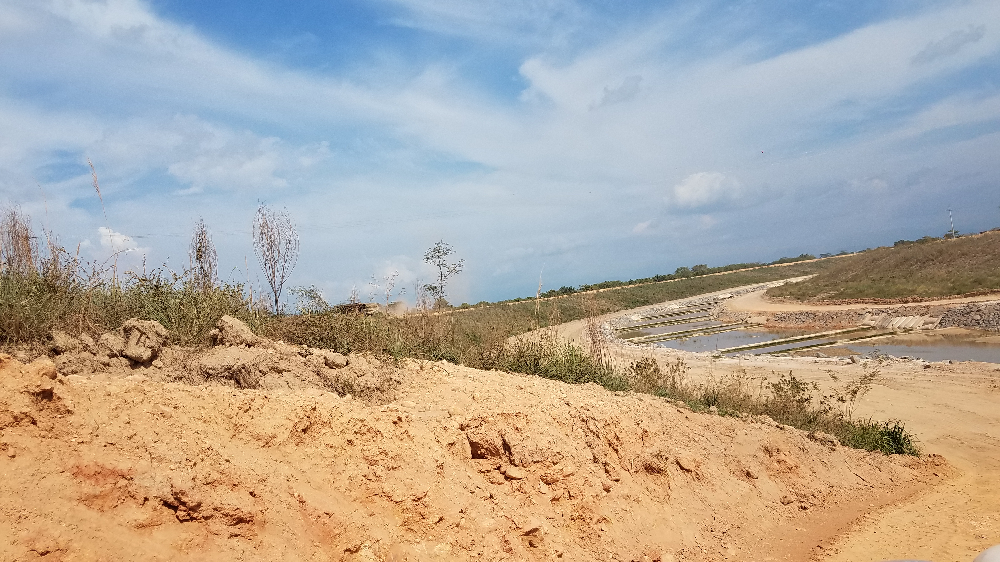
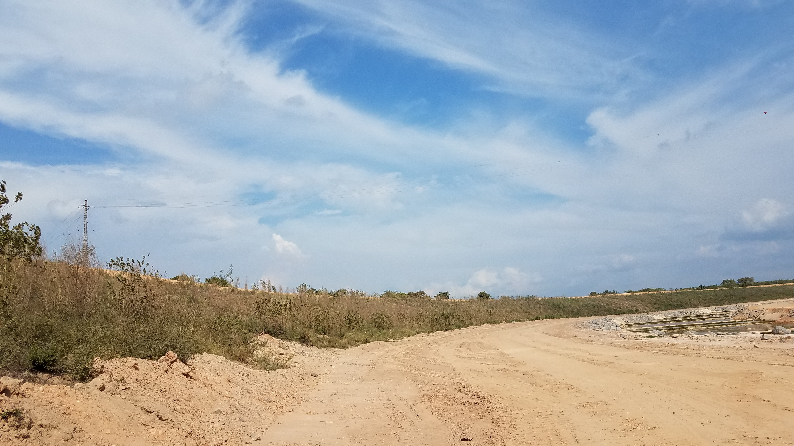
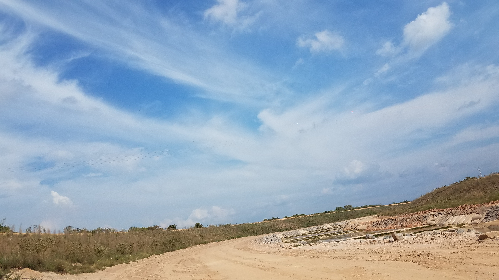
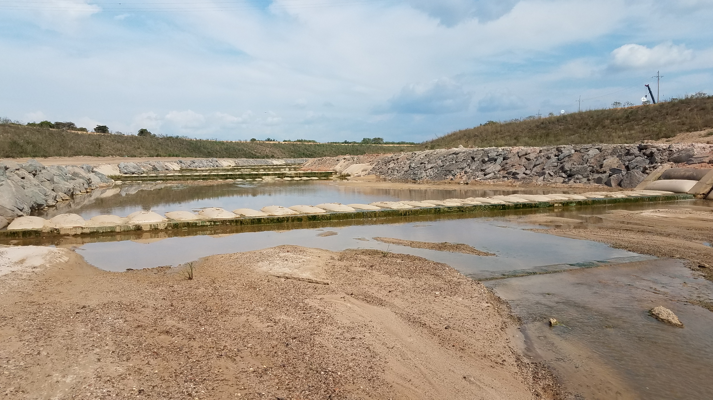
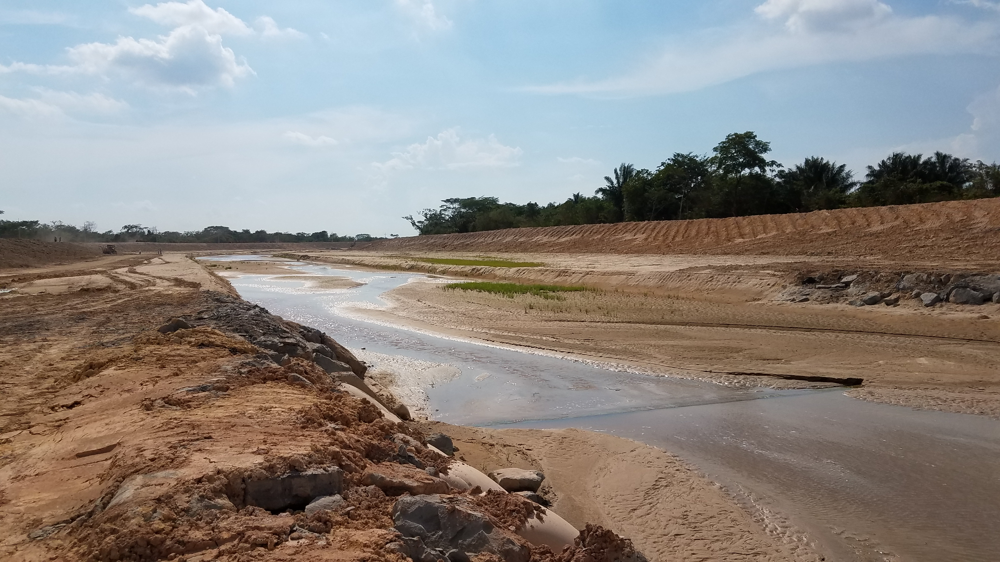

## :globe_with_meridians:Arroyo San Antonio - Realineamiento # 4 - Construcción e inicio de operación (2018-04-25)
`Pictures` rcfdtools <br>`Category` Technical field visit <br>`Location` [Google Maps](http://maps.google.com/maps?q=9.528337,-73.507306) or [Openstreet Map](https://www.openstreetmap.org/query?lat=9.528337&lon=-73.507306) 

```geojson
{
  "type": "Feature",
  "geometry": {
    "type": "Point", 
    "coordinates": [-73.507306, 9.528337]
  }, 
  "properties": {
    "Name": "Arroyo San Antonio - Realineamiento # 4 - Construcción e inicio de operación"
  }
}
```

<details><summary>:camera:More info</summary> **13/20180425_143018.jpg** <sub> `Exif version` 0220 `OS version` G930PVPS5BRA1 `Date` 2018:04:25 14:30:18 `Aperture` Not known `Brightness` 9.1 `Color space` 1 `Compression` 6`Exposure mode` 0 `Exposure time` 0.0003869969040247678 `Focal length` 4.2 `Lens model` Not known `Lens specification` Not known `Orientation` 1 `Scene type` Not known `f number` 1.7 `White balance` 0 `Sensing method` 2 `Shutter speed` 11.335</sub>

<details><summary>:camera:More info</summary> **13/20180425_143020.jpg** <sub> `Exif version` 0220 `OS version` G930PVPS5BRA1 `Date` 2018:04:25 14:30:20 `Aperture` Not known `Brightness` 8.97 `Color space` 1 `Compression` 6`Exposure mode` 0 `Exposure time` 0.00042517006802721087 `Focal length` 4.2 `Lens model` Not known `Lens specification` Not known `Orientation` 1 `Scene type` Not known `f number` 1.7 `White balance` 0 `Sensing method` 2 `Shutter speed` 11.199</sub>

<details><summary>:camera:More info</summary> **13/20180425_143023.jpg** <sub> `Exif version` 0220 `OS version` G930PVPS5BRA1 `Date` 2018:04:25 14:30:22 `Aperture` Not known `Brightness` 9.01 `Color space` 1 `Compression` 6`Exposure mode` 0 `Exposure time` 0.00040192926045016077 `Focal length` 4.2 `Lens model` Not known `Lens specification` Not known `Orientation` 1 `Scene type` Not known `f number` 1.7 `White balance` 0 `Sensing method` 2 `Shutter speed` 11.28</sub>

<details><summary>:camera:More info</summary> **13/20180425_144251.jpg** <sub> `Exif version` 0220 `OS version` G930PVPS5BRA1 `Date` 2018:04:25 14:42:51 `Aperture` Not known `Brightness` 9.45 `Color space` 1 `Compression` 6`Exposure mode` 0 `Exposure time` 0.00029481132075471697 `Focal length` 4.2 `Lens model` Not known `Lens specification` Not known `Orientation` 1 `Scene type` Not known `f number` 1.7 `White balance` 0 `Sensing method` 2 `Shutter speed` 11.727</sub>

<details><summary>:camera:More info</summary> **13/20180425_144347.jpg** <sub> `Exif version` 0220 `OS version` G930PVPS5BRA1 `Date` 2018:04:25 14:43:47 `Aperture` Not known `Brightness` 9.58 `Color space` 1 `Compression` 6`Exposure mode` 0 `Exposure time` 0.0002860411899313501 `Focal length` 4.2 `Lens model` Not known `Lens specification` Not known `Orientation` 1 `Scene type` Not known `f number` 1.7 `White balance` 0 `Sensing method` 2 `Shutter speed` 11.771</sub>

<details><summary>:camera:More info</summary> **13/20180425_144352.jpg** <sub> `Exif version` 0220 `OS version` G930PVPS5BRA1 `Date` 2018:04:25 14:43:52 `Aperture` Not known `Brightness` 9.63 `Color space` 1 `Compression` 6`Exposure mode` 0 `Exposure time` 0.00027839643652561246 `Focal length` 4.2 `Lens model` Not known `Lens specification` Not known `Orientation` 1 `Scene type` Not known `f number` 1.7 `White balance` 0 `Sensing method` 2 `Shutter speed` 11.81</sub>

<details><summary>:camera:More info</summary> **13/20180425_144527.jpg** <sub> `Exif version` 0220 `OS version` G930PVPS5BRA1 `Date` 2018:04:25 14:45:27 `Aperture` Not known `Brightness` 9.14 `Color space` 1 `Compression` 6`Exposure mode` 0 `Exposure time` 0.0003676470588235294 `Focal length` 4.2 `Lens model` Not known `Lens specification` Not known `Orientation` 1 `Scene type` Not known `f number` 1.7 `White balance` 0 `Sensing method` 2 `Shutter speed` 11.409</sub>

<details><summary>:camera:More info</summary> **13/20180425_144532.jpg** <sub> `Exif version` 0220 `OS version` G930PVPS5BRA1 `Date` 2018:04:25 14:45:31 `Aperture` Not known `Brightness` 8.96 `Color space` 1 `Compression` 6`Exposure mode` 0 `Exposure time` 0.0004280821917808219 `Focal length` 4.2 `Lens model` Not known `Lens specification` Not known `Orientation` 1 `Scene type` Not known `f number` 1.7 `White balance` 0 `Sensing method` 2 `Shutter speed` 11.189</sub>

<details><summary>:camera:More info</summary> **13/20180425_144605.jpg** <sub> `Exif version` 0220 `OS version` G930PVPS5BRA1 `Date` 2018:04:25 14:46:05 `Aperture` Not known `Brightness` 9.07 `Color space` 1 `Compression` 6`Exposure mode` 0 `Exposure time` 0.00037764350453172205 `Focal length` 4.2 `Lens model` Not known `Lens specification` Not known `Orientation` 1 `Scene type` Not known `f number` 1.7 `White balance` 0 `Sensing method` 2 `Shutter speed` 11.37</sub>

<details><summary>:camera:More info</summary> **13/20180425_144729.jpg** <sub> `Exif version` 0220 `OS version` G930PVPS5BRA1 `Date` 2018:04:25 14:47:29 `Aperture` Not known `Brightness` 9.07 `Color space` 1 `Compression` 6`Exposure mode` 0 `Exposure time` 0.00040584415584415587 `Focal length` 4.2 `Lens model` Not known `Lens specification` Not known `Orientation` 1 `Scene type` Not known `f number` 1.7 `White balance` 0 `Sensing method` 2 `Shutter speed` 11.266</sub>

<details><summary>:camera:More info</summary> **13/20180425_145349.jpg** <sub> `Exif version` 0220 `OS version` G930PVPS5BRA1 `Date` 2018:04:25 14:53:49 `Aperture` Not known `Brightness` 10.45 `Color space` 1 `Compression` 6`Exposure mode` 0 `Exposure time` 0.0001539408866995074 `Focal length` 4.2 `Lens model` Not known `Lens specification` Not known `Orientation` 1 `Scene type` Not known `f number` 1.7 `White balance` 0 `Sensing method` 2 `Shutter speed` 12.665</sub>

<details><summary>:camera:More info</summary> **13/20180425_145356.jpg** <sub> `Exif version` 0220 `OS version` G930PVPS5BRA1 `Date` 2018:04:25 14:53:56 `Aperture` Not known `Brightness` 9.3 `Color space` 1 `Compression` 6`Exposure mode` 0 `Exposure time` 0.0003405994550408719 `Focal length` 4.2 `Lens model` Not known `Lens specification` Not known `Orientation` 1 `Scene type` Not known `f number` 1.7 `White balance` 0 `Sensing method` 2 `Shutter speed` 11.519</sub>

<details><summary>:camera:More info</summary> **13/20180425_145359.jpg** <sub> `Exif version` 0220 `OS version` G930PVPS5BRA1 `Date` 2018:04:25 14:53:59 `Aperture` Not known `Brightness` 9.58 `Color space` 1 `Compression` 6`Exposure mode` 0 `Exposure time` 0.00027901785714285713 `Focal length` 4.2 `Lens model` Not known `Lens specification` Not known `Orientation` 1 `Scene type` Not known `f number` 1.7 `White balance` 0 `Sensing method` 2 `Shutter speed` 11.807</sub>

<details><summary>:camera:More info</summary> **13/20180425_145413.jpg** <sub> `Exif version` 0220 `OS version` G930PVPS5BRA1 `Date` 2018:04:25 14:54:13 `Aperture` Not known `Brightness` 10.41 `Color space` 1 `Compression` 6`Exposure mode` 0 `Exposure time` 0.0001481042654028436 `Focal length` 4.2 `Lens model` Not known `Lens specification` Not known `Orientation` 1 `Scene type` Not known `f number` 1.7 `White balance` 0 `Sensing method` 2 `Shutter speed` 12.721</sub>

> _Citación: se permite la reproducción digital parcial o total de este repositorio, scripts, guías de desarrollo, modelos de datos, imágenes y documentación, siempre que se haga referencia como: "R.GISMobile - Sistemas de información geográficos móviles sobre QField que no requieren de conexión a Internet para su navegación". https://github.com/rcfdtools/R.GISMobile - Bogotá - Colombia - Suramérica."._

| [:house: Inicio](../Readme.md) |
|---|