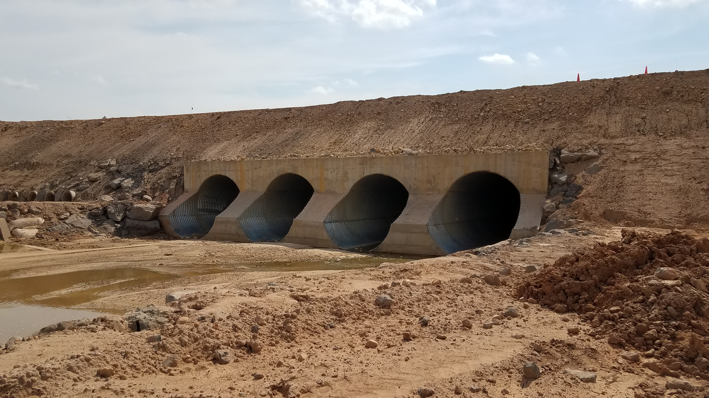
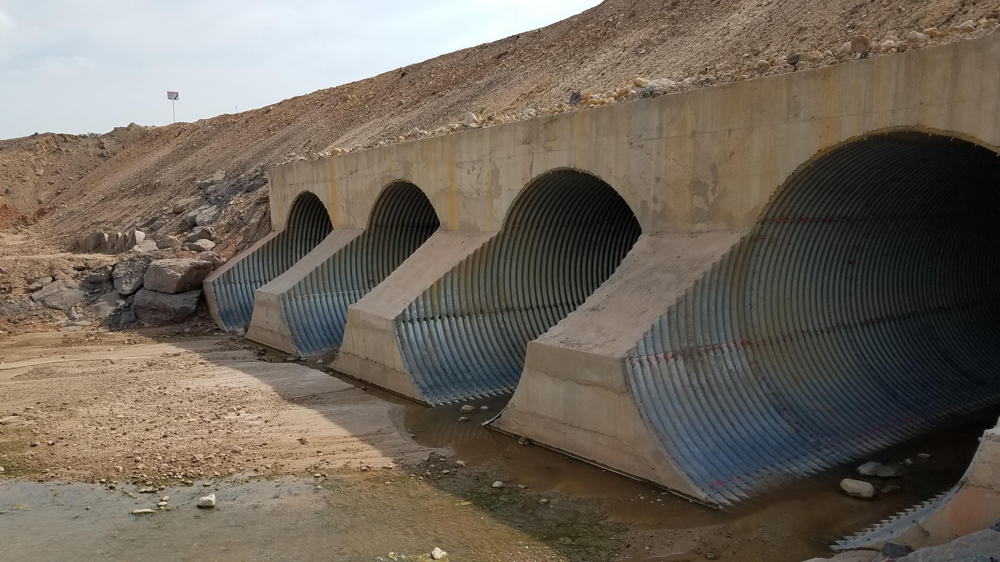
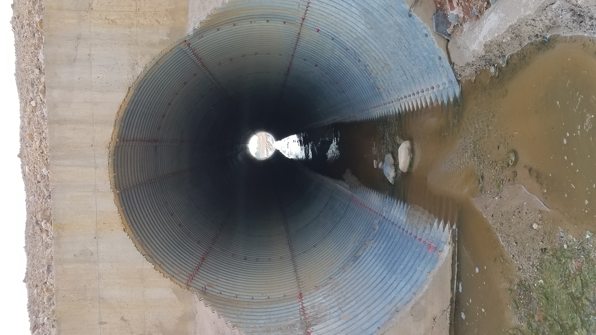
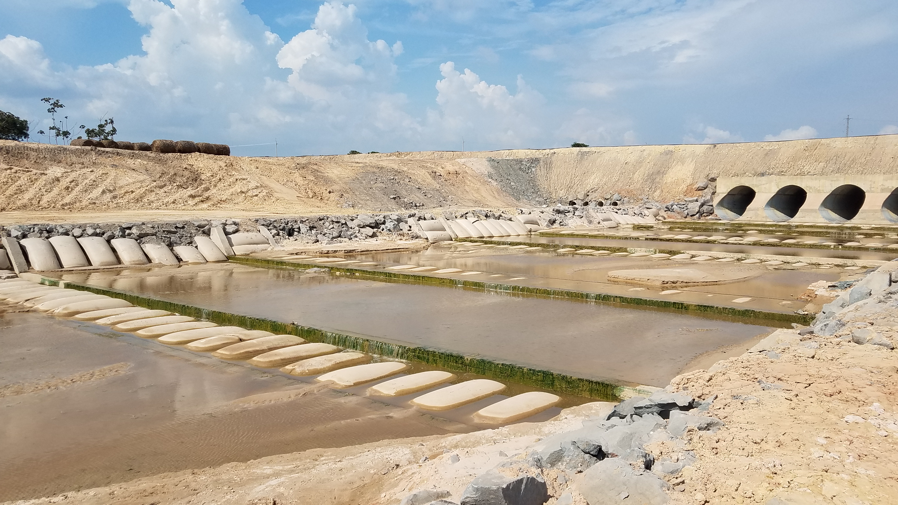
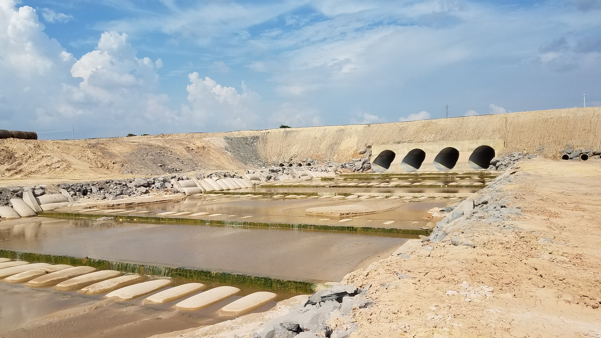

## Arroyo San Antonio - Paso de vía minero (2018-04-25)
Fotos por: rcfdtools<br>Categoría: Technical field visit

```geojson
{
  "type": "Feature",
  "geometry": {
    "type": "Point", 
    "coordinates": [-73.508897, 9.529024]
  }, 
  "properties": {
    "Name": "Arroyo San Antonio - Paso de vía minero"
  }
}
```

:camera: **14/20180425_144418.jpg** <sub> `Exif version` 0220 `OS version` G930PVPS5BRA1 `Date` 2018:04:25 14:44:18 `Aperture` Not known `Brightness` 9.57 `Color space` 1 `Compression` 6`Exposure mode` 0 `Exposure time` 0.0002759381898454746 `Focal length` 4.2 `Lens model` Not known `Lens specification` Not known `Orientation` 1 `Scene type` Not known `f number` 1.7 `White balance` 0 `Sensing method` 2 `Shutter speed` 11.823</sub>

:camera: **14/20180425_144421.jpg** <sub> `Exif version` 0220 `OS version` G930PVPS5BRA1 `Date` 2018:04:25 14:44:21 `Aperture` Not known `Brightness` 9.69 `Color space` 1 `Compression` 6`Exposure mode` 0 `Exposure time` 0.0002670940170940171 `Focal length` 4.2 `Lens model` Not known `Lens specification` Not known `Orientation` 1 `Scene type` Not known `f number` 1.7 `White balance` 0 `Sensing method` 2 `Shutter speed` 11.87</sub>

:camera: **14/20180425_144429.jpg** <sub> `Exif version` 0220 `OS version` G930PVPS5BRA1 `Date` 2018:04:25 14:44:29 `Aperture` Not known `Brightness` 9.05 `Color space` 1 `Compression` 6`Exposure mode` 0 `Exposure time` 0.0004152823920265781 `Focal length` 4.2 `Lens model` Not known `Lens specification` Not known `Orientation` 1 `Scene type` Not known `f number` 1.7 `White balance` 0 `Sensing method` 2 `Shutter speed` 11.233</sub>

:camera: **14/20180425_144453.jpg** <sub> `Exif version` 0220 `OS version` G930PVPS5BRA1 `Date` 2018:04:25 14:44:52 `Aperture` Not known `Brightness` Not known `Color space` 1 `Compression` Not known`Exposure mode` 0 `Exposure time` Not known `Focal length` 4.2 `Lens model` Not known `Lens specification` Not known `Orientation` 1 `Scene type` Not known `f number` 1.7 `White balance` 0 `Sensing method` Not known `Shutter speed` Not known</sub>

:camera: **14/20180425_144555.jpg** <sub> `Exif version` 0220 `OS version` G930PVPS5BRA1 `Date` 2018:04:25 14:45:54 `Aperture` Not known `Brightness` Not known `Color space` 1 `Compression` Not known`Exposure mode` 0 `Exposure time` Not known `Focal length` 4.2 `Lens model` Not known `Lens specification` Not known `Orientation` 1 `Scene type` Not known `f number` 1.7 `White balance` 0 `Sensing method` Not known `Shutter speed` Not known</sub>

:camera: **14/20180425_144716.jpg** <sub> `Exif version` 0220 `OS version` G930PVPS5BRA1 `Date` 2018:04:25 14:47:16 `Aperture` Not known `Brightness` 8.69 `Color space` 1 `Compression` 6`Exposure mode` 0 `Exposure time` 0.00049800796812749 `Focal length` 4.2 `Lens model` Not known `Lens specification` Not known `Orientation` 1 `Scene type` Not known `f number` 1.7 `White balance` 0 `Sensing method` 2 `Shutter speed` 10.971</sub>

:camera: **14/20180425_144734.jpg** <sub> `Exif version` 0220 `OS version` G930PVPS5BRA1 `Date` 2018:04:25 14:47:34 `Aperture` Not known `Brightness` 6.67 `Color space` 1 `Compression` 6`Exposure mode` 0 `Exposure time` 0.002074688796680498 `Focal length` 4.2 `Lens model` Not known `Lens specification` Not known `Orientation` 1 `Scene type` Not known `f number` 1.7 `White balance` 0 `Sensing method` 2 `Shutter speed` 8.912</sub>

:camera: **14/20180425_144739.jpg** <sub> `Exif version` 0220 `OS version` G930PVPS5BRA1 `Date` 2018:04:25 14:47:39 `Aperture` Not known `Brightness` 7.23 `Color space` 1 `Compression` 6`Exposure mode` 0 `Exposure time` 0.0013736263736263737 `Focal length` 4.2 `Lens model` Not known `Lens specification` Not known `Orientation` 6 `Scene type` Not known `f number` 1.7 `White balance` 0 `Sensing method` 2 `Shutter speed` 9.507</sub>

:camera: **14/20180425_145355.jpg** <sub> `Exif version` 0220 `OS version` G930PVPS5BRA1 `Date` 2018:04:25 14:53:54 `Aperture` Not known `Brightness` 9.44 `Color space` 1 `Compression` 6`Exposure mode` 0 `Exposure time` 0.0003026634382566586 `Focal length` 4.2 `Lens model` Not known `Lens specification` Not known `Orientation` 1 `Scene type` Not known `f number` 1.7 `White balance` 0 `Sensing method` 2 `Shutter speed` 11.689</sub>

:camera: **14/20180425_145404.jpg** <sub> `Exif version` 0220 `OS version` G930PVPS5BRA1 `Date` 2018:04:25 14:54:04 `Aperture` Not known `Brightness` 9.48 `Color space` 1 `Compression` 6`Exposure mode` 0 `Exposure time` 0.0002983293556085919 `Focal length` 4.2 `Lens model` Not known `Lens specification` Not known `Orientation` 1 `Scene type` Not known `f number` 1.7 `White balance` 0 `Sensing method` 2 `Shutter speed` 11.71</sub>

_**Citación:** se permite la reproducción digital parcial o total de este repositorio, scripts, guías de desarrollo, modelos de datos, imágenes y documentación, siempre que se haga referencia como: "R.GISMobile - Sistemas de información geográficos móviles sobre QField que no requieren de conexión a Internet para su navegación", https://github.com/rcfdtools/R.GISMobile, Bogotá - Colombia - Suramérica."._
| [:house: Inicio](../Readme.md) |
|---|