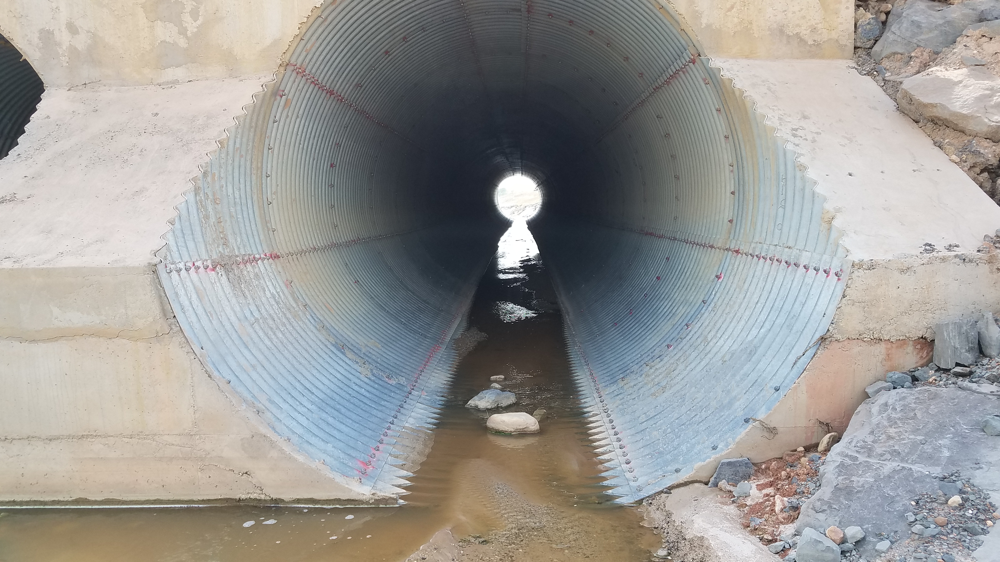

## Arroyo San Antonio - Paso de vía minero (2018-04-25)
:camera: Fotos: rcfdtools<br>Categoría: Technical field visit

```geojson
{
  "type": "Feature",
  "geometry": {
    "type": "Point", 
    "coordinates": [-73.508897, 9.529024]
  }, 
  "properties": {
    "Name": "Arroyo San Antonio - Paso de vía minero"
  }
}
```

`File:` **14/20180425_144418.jpg** `OS version:` G930PVPS5BRA1 `Date:` 2018:04:25 14:44:18 Aperture: Not Known


`File:` **14/20180425_144421.jpg** `OS version:` G930PVPS5BRA1 `Date:` 2018:04:25 14:44:21 Aperture: Not Known


`File:` **14/20180425_144429.jpg** `OS version:` G930PVPS5BRA1 `Date:` 2018:04:25 14:44:29 Aperture: Not Known


`File:` **14/20180425_144453.jpg** `OS version:` G930PVPS5BRA1 `Date:` 2018:04:25 14:44:52 Aperture: Not Known


`File:` **14/20180425_144555.jpg** `OS version:` G930PVPS5BRA1 `Date:` 2018:04:25 14:45:54 Aperture: Not Known


`File:` **14/20180425_144716.jpg** `OS version:` G930PVPS5BRA1 `Date:` 2018:04:25 14:47:16 Aperture: Not Known


`File:` **14/20180425_144734.jpg** `OS version:` G930PVPS5BRA1 `Date:` 2018:04:25 14:47:34 Aperture: Not Known


`File:` **14/20180425_144739.jpg** `OS version:` G930PVPS5BRA1 `Date:` 2018:04:25 14:47:39 Aperture: Not Known


`File:` **14/20180425_145355.jpg** `OS version:` G930PVPS5BRA1 `Date:` 2018:04:25 14:53:54 Aperture: Not Known


`File:` **14/20180425_145404.jpg** `OS version:` G930PVPS5BRA1 `Date:` 2018:04:25 14:54:04 Aperture: Not Known


| [:house: Inicio](../Readme.md) |
|---|