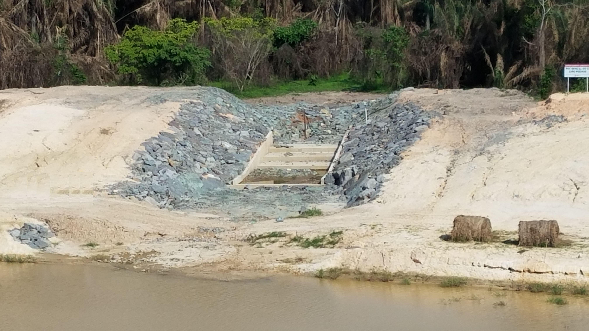
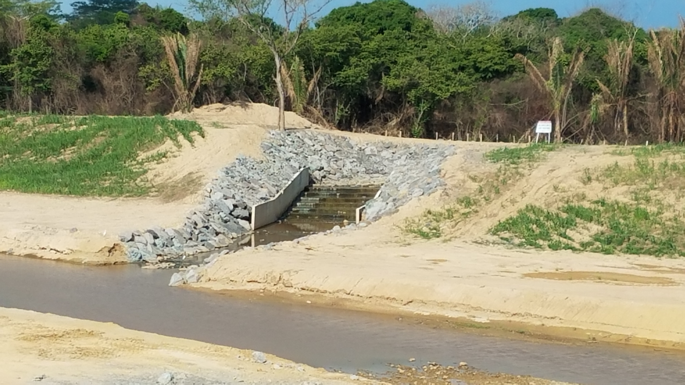
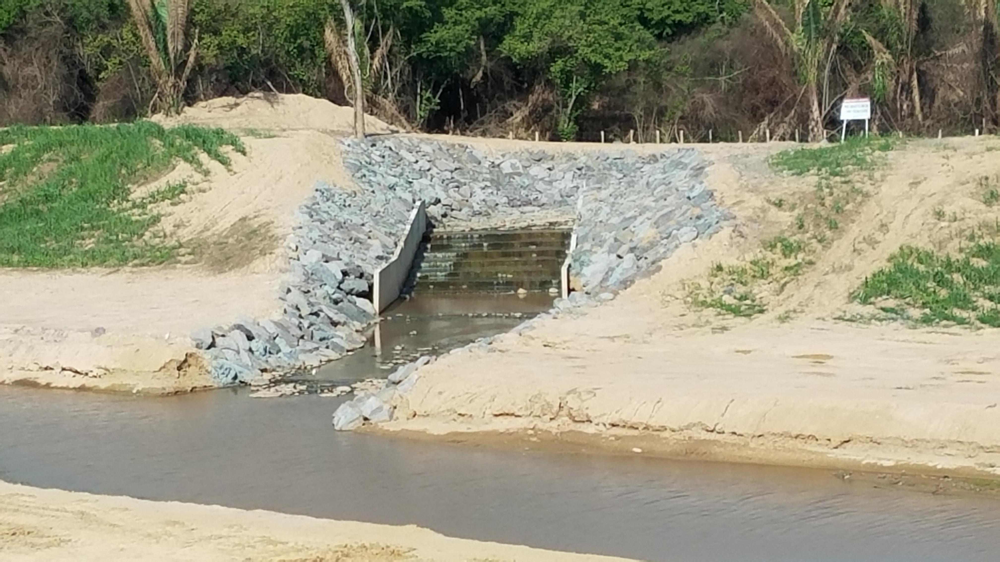

## :globe_with_meridians:Arroyo San Antonio - Estructura escalonada (2018-04-25)
`Pictures` rcfdtools <br>`Category` Technical field visit <br>`Location` [Google Maps](http://maps.google.com/maps?q=9.517357,-73.469932) or [Openstreet Map](https://www.openstreetmap.org/query?lat=9.517357&lon=-73.469932) 

```geojson
{
  "type": "Feature",
  "geometry": {
    "type": "Point", 
    "coordinates": [-73.469932, 9.517357]
  }, 
  "properties": {
    "Name": "Arroyo San Antonio - Estructura escalonada"
  }
}
```

:camera:**16/20180425_152015.jpg** <sub> `Exif version` 0220 `OS version` G930PVPS5BRA1 `Date` 2018:04:25 15:20:15 `Aperture` Not known `Brightness` 9.52 `Color space` 1 `Compression` 6`Exposure mode` 0 `Exposure time` 0.0002808988764044944 `Focal length` 4.2 `Lens model` Not known `Lens specification` Not known `Orientation` 1 `Scene type` Not known `f number` 1.7 `White balance` 0 `Sensing method` 2 `Shutter speed` 11.797</sub>

:camera:**16/20180425_152018.jpg** <sub> `Exif version` 0220 `OS version` G930PVPS5BRA1 `Date` 2018:04:25 15:20:18 `Aperture` Not known `Brightness` 9.51 `Color space` 1 `Compression` 6`Exposure mode` 0 `Exposure time` 0.0002860411899313501 `Focal length` 4.2 `Lens model` Not known `Lens specification` Not known `Orientation` 1 `Scene type` Not known `f number` 1.7 `White balance` 0 `Sensing method` 2 `Shutter speed` 11.771</sub>

:camera:**16/20180425_152022.jpg** <sub> `Exif version` 0220 `OS version` G930PVPS5BRA1 `Date` 2018:04:25 15:20:22 `Aperture` Not known `Brightness` 9.54 `Color space` 1 `Compression` 6`Exposure mode` 0 `Exposure time` 0.0002765486725663717 `Focal length` 4.2 `Lens model` Not known `Lens specification` Not known `Orientation` 1 `Scene type` Not known `f number` 1.7 `White balance` 0 `Sensing method` 2 `Shutter speed` 11.82</sub>

:camera:**16/20180425_152024.jpg** <sub> `Exif version` 0220 `OS version` G930PVPS5BRA1 `Date` 2018:04:25 15:20:24 `Aperture` Not known `Brightness` 9.54 `Color space` 1 `Compression` 6`Exposure mode` 0 `Exposure time` 0.0002962085308056872 `Focal length` 4.2 `Lens model` Not known `Lens specification` Not known `Orientation` 1 `Scene type` Not known `f number` 1.7 `White balance` 0 `Sensing method` 2 `Shutter speed` 11.721</sub>

:camera:**16/20180425_152031.jpg** <sub> `Exif version` 0220 `OS version` G930PVPS5BRA1 `Date` 2018:04:25 15:20:31 `Aperture` Not known `Brightness` Not known `Color space` 1 `Compression` Not known`Exposure mode` 0 `Exposure time` Not known `Focal length` 4.2 `Lens model` Not known `Lens specification` Not known `Orientation` 1 `Scene type` Not known `f number` 1.7 `White balance` 0 `Sensing method` Not known `Shutter speed` Not known</sub>

:camera:**16/20180425_152216.jpg** <sub> `Exif version` 0220 `OS version` G930PVPS5BRA1 `Date` 2018:04:25 15:22:16 `Aperture` Not known `Brightness` 8.69 `Color space` 1 `Compression` 6`Exposure mode` 0 `Exposure time` 0.0005263157894736842 `Focal length` 4.2 `Lens model` Not known `Lens specification` Not known `Orientation` 1 `Scene type` Not known `f number` 1.7 `White balance` 0 `Sensing method` 2 `Shutter speed` 10.891</sub>

:camera:**16/20180425_152526.jpg** <sub> `Exif version` 0220 `OS version` G930PVPS5BRA1 `Date` 2018:04:25 15:25:26 `Aperture` Not known `Brightness` 9.1 `Color space` 1 `Compression` 6`Exposure mode` 0 `Exposure time` 0.00039936102236421724 `Focal length` 4.2 `Lens model` Not known `Lens specification` Not known `Orientation` 1 `Scene type` Not known `f number` 1.7 `White balance` 0 `Sensing method` 2 `Shutter speed` 11.29</sub>

:camera:**16/20180425_152531.jpg** <sub> `Exif version` 0220 `OS version` G930PVPS5BRA1 `Date` 2018:04:25 15:25:31 `Aperture` Not known `Brightness` Not known `Color space` 1 `Compression` Not known`Exposure mode` 0 `Exposure time` Not known `Focal length` 4.2 `Lens model` Not known `Lens specification` Not known `Orientation` 1 `Scene type` Not known `f number` 1.7 `White balance` 0 `Sensing method` Not known `Shutter speed` Not known</sub>

:camera:**16/20180425_152539.jpg** <sub> `Exif version` 0220 `OS version` G930PVPS5BRA1 `Date` 2018:04:25 15:25:39 `Aperture` Not known `Brightness` 9.16 `Color space` 1 `Compression` 6`Exposure mode` 0 `Exposure time` 0.0003654970760233918 `Focal length` 4.2 `Lens model` Not known `Lens specification` Not known `Orientation` 1 `Scene type` Not known `f number` 1.7 `White balance` 0 `Sensing method` 2 `Shutter speed` 11.417</sub>

:camera:**16/20180425_152629.jpg** <sub> `Exif version` 0220 `OS version` G930PVPS5BRA1 `Date` 2018:04:25 15:26:28 `Aperture` Not known `Brightness` Not known `Color space` 1 `Compression` Not known`Exposure mode` 0 `Exposure time` Not known `Focal length` 4.2 `Lens model` Not known `Lens specification` Not known `Orientation` 1 `Scene type` Not known `f number` 1.7 `White balance` 0 `Sensing method` Not known `Shutter speed` Not known</sub>

:camera:**16/20180425_152719.jpg** <sub> `Exif version` 0220 `OS version` G930PVPS5BRA1 `Date` 2018:04:25 15:27:19 `Aperture` Not known `Brightness` 9.1 `Color space` 1 `Compression` 6`Exposure mode` 0 `Exposure time` 0.000390625 `Focal length` 4.2 `Lens model` Not known `Lens specification` Not known `Orientation` 1 `Scene type` Not known `f number` 1.7 `White balance` 0 `Sensing method` 2 `Shutter speed` 11.321</sub>

:camera:**16/20180425_152723.jpg** <sub> `Exif version` 0220 `OS version` G930PVPS5BRA1 `Date` 2018:04:25 15:27:23 `Aperture` Not known `Brightness` Not known `Color space` 1 `Compression` Not known`Exposure mode` 0 `Exposure time` Not known `Focal length` 4.2 `Lens model` Not known `Lens specification` Not known `Orientation` 1 `Scene type` Not known `f number` 1.7 `White balance` 0 `Sensing method` Not known `Shutter speed` Not known</sub>

> _Citación: se permite la reproducción digital parcial o total de este repositorio, scripts, guías de desarrollo, modelos de datos, imágenes y documentación, siempre que se haga referencia como: "R.GISMobile - Sistemas de información geográficos móviles sobre QField que no requieren de conexión a Internet para su navegación". https://github.com/rcfdtools/R.GISMobile - Bogotá - Colombia - Suramérica."._

| [:house: Inicio](../Readme.md) |
|---|