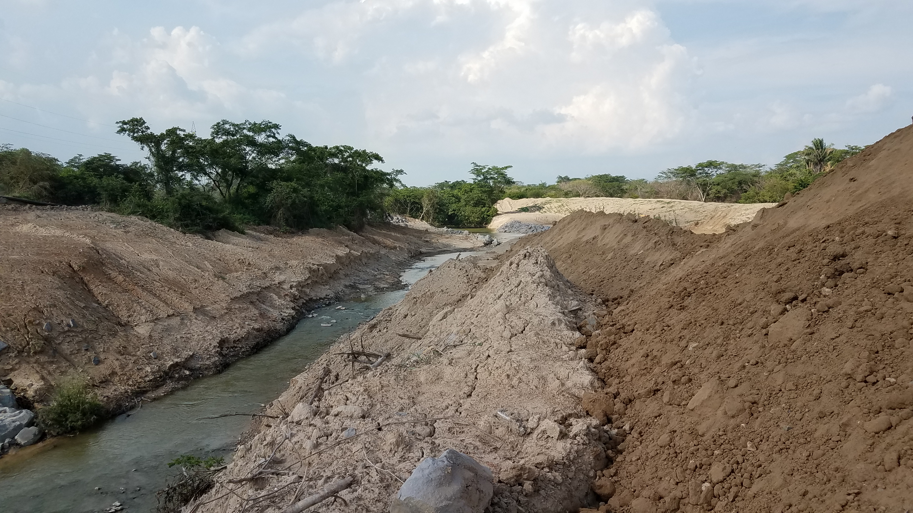
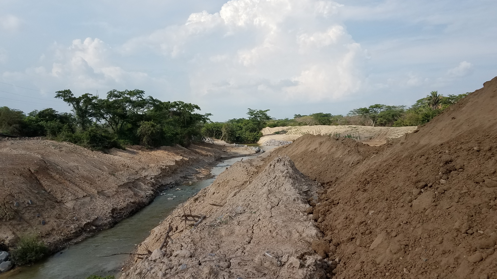
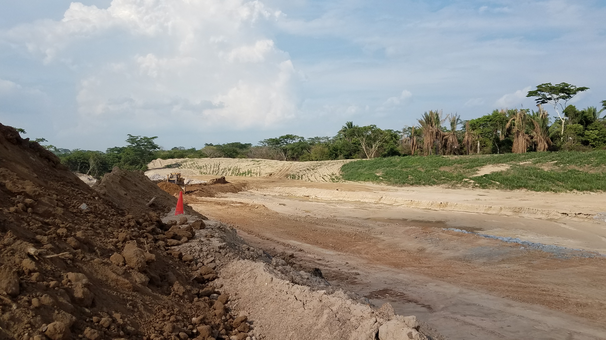
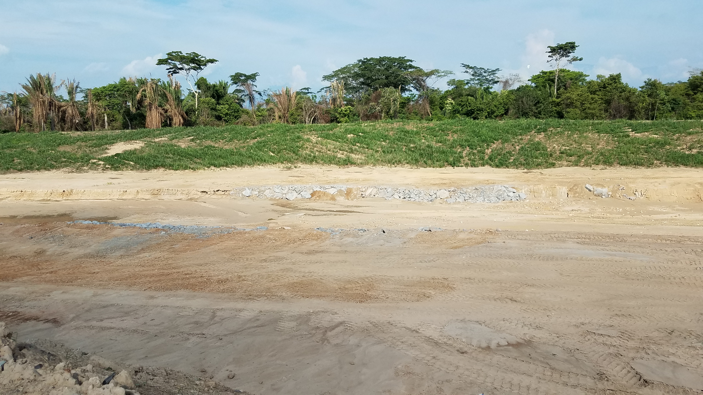
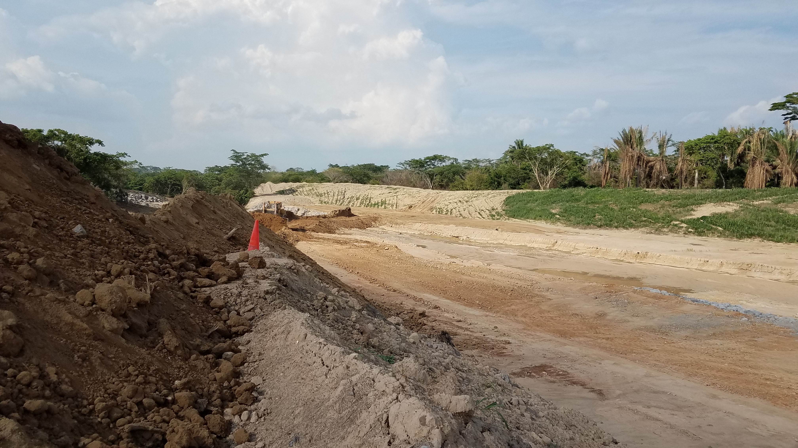
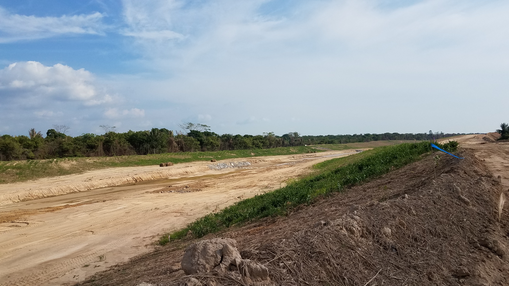

## Arroyo San Antonio - Realineamiento #4 - Construcción inicio desviación (2018-04-25)
`Picture by` rcfdtools <br>`Category` Technical field visit <br>`Location over` [Google Maps](http://maps.google.com/maps?q=9.525125,-73.46366) or [Openstreet Map](https://www.openstreetmap.org/query?lat=9.525125&lon=-73.46366) 

```geojson
{
  "type": "Feature",
  "geometry": {
    "type": "Point", 
    "coordinates": [-73.46366, 9.525125]
  }, 
  "properties": {
    "Name": "Arroyo San Antonio - Realineamiento #4 - Construcción inicio desviación"
  }
}
```

:camera: **17/20180425_153010.jpg** <sub> `Exif version` 0220 `OS version` G930PVPS5BRA1 `Date` 2018:04:25 15:30:10 `Aperture` Not known `Brightness` 8.41 `Color space` 1 `Compression` 6`Exposure mode` 0 `Exposure time` 0.0006377551020408163 `Focal length` 4.2 `Lens model` Not known `Lens specification` Not known `Orientation` 1 `Scene type` Not known `f number` 1.7 `White balance` 0 `Sensing method` 2 `Shutter speed` 10.614</sub>

:camera: **17/20180425_153035.jpg** <sub> `Exif version` 0220 `OS version` G930PVPS5BRA1 `Date` 2018:04:25 15:30:35 `Aperture` Not known `Brightness` 8.68 `Color space` 1 `Compression` 6`Exposure mode` 0 `Exposure time` 0.0005175983436853002 `Focal length` 4.2 `Lens model` Not known `Lens specification` Not known `Orientation` 1 `Scene type` Not known `f number` 1.7 `White balance` 0 `Sensing method` 2 `Shutter speed` 10.915</sub>

:camera: **17/20180425_153038.jpg** <sub> `Exif version` 0220 `OS version` G930PVPS5BRA1 `Date` 2018:04:25 15:30:38 `Aperture` Not known `Brightness` 8.48 `Color space` 1 `Compression` 6`Exposure mode` 0 `Exposure time` 0.0005966587112171838 `Focal length` 4.2 `Lens model` Not known `Lens specification` Not known `Orientation` 1 `Scene type` Not known `f number` 1.7 `White balance` 0 `Sensing method` 2 `Shutter speed` 10.71</sub>

:camera: **17/20180425_153049.jpg** <sub> `Exif version` 0220 `OS version` G930PVPS5BRA1 `Date` 2018:04:25 15:30:49 `Aperture` Not known `Brightness` 9.01 `Color space` 1 `Compression` 6`Exposure mode` 0 `Exposure time` 0.00043252595155709344 `Focal length` 4.2 `Lens model` Not known `Lens specification` Not known `Orientation` 1 `Scene type` Not known `f number` 1.7 `White balance` 0 `Sensing method` 2 `Shutter speed` 11.174</sub>

:camera: **17/20180425_153142.jpg** <sub> `Exif version` 0220 `OS version` G930PVPS5BRA1 `Date` 2018:04:25 15:31:42 `Aperture` Not known `Brightness` 9.16 `Color space` 1 `Compression` 6`Exposure mode` 0 `Exposure time` 0.0003869969040247678 `Focal length` 4.2 `Lens model` Not known `Lens specification` Not known `Orientation` 1 `Scene type` Not known `f number` 1.7 `White balance` 0 `Sensing method` 2 `Shutter speed` 11.335</sub>

:camera: **17/20180425_153148.jpg** <sub> `Exif version` 0220 `OS version` G930PVPS5BRA1 `Date` 2018:04:25 15:31:48 `Aperture` Not known `Brightness` 8.94 `Color space` 1 `Compression` 6`Exposure mode` 0 `Exposure time` 0.0004512635379061372 `Focal length` 4.2 `Lens model` Not known `Lens specification` Not known `Orientation` 1 `Scene type` Not known `f number` 1.7 `White balance` 0 `Sensing method` 2 `Shutter speed` 11.113</sub>

:camera: **17/20180425_153156.jpg** <sub> `Exif version` 0220 `OS version` G930PVPS5BRA1 `Date` 2018:04:25 15:31:56 `Aperture` Not known `Brightness` 9.08 `Color space` 1 `Compression` 6`Exposure mode` 0 `Exposure time` 0.0004084967320261438 `Focal length` 4.2 `Lens model` Not known `Lens specification` Not known `Orientation` 1 `Scene type` Not known `f number` 1.7 `White balance` 0 `Sensing method` 2 `Shutter speed` 11.257</sub>

:camera: **17/20180425_153207.jpg** <sub> `Exif version` 0220 `OS version` G930PVPS5BRA1 `Date` 2018:04:25 15:32:07 `Aperture` Not known `Brightness` 9.4 `Color space` 1 `Compression` 6`Exposure mode` 0 `Exposure time` 0.0003156565656565657 `Focal length` 4.2 `Lens model` Not known `Lens specification` Not known `Orientation` 1 `Scene type` Not known `f number` 1.7 `White balance` 0 `Sensing method` 2 `Shutter speed` 11.629</sub>

_**Citación:** se permite la reproducción digital parcial o total de este repositorio, scripts, guías de desarrollo, modelos de datos, imágenes y documentación, siempre que se haga referencia como: "R.GISMobile - Sistemas de información geográficos móviles sobre QField que no requieren de conexión a Internet para su navegación", https://github.com/rcfdtools/R.GISMobile, Bogotá - Colombia - Suramérica."._
| [:house: Inicio](../Readme.md) |
|---|