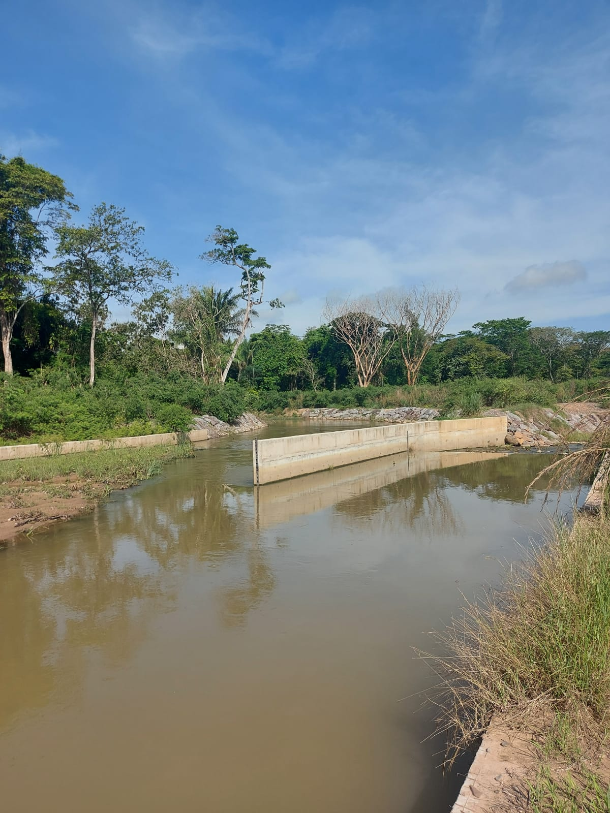
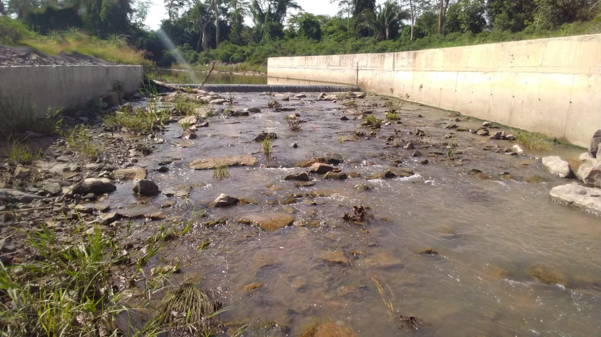
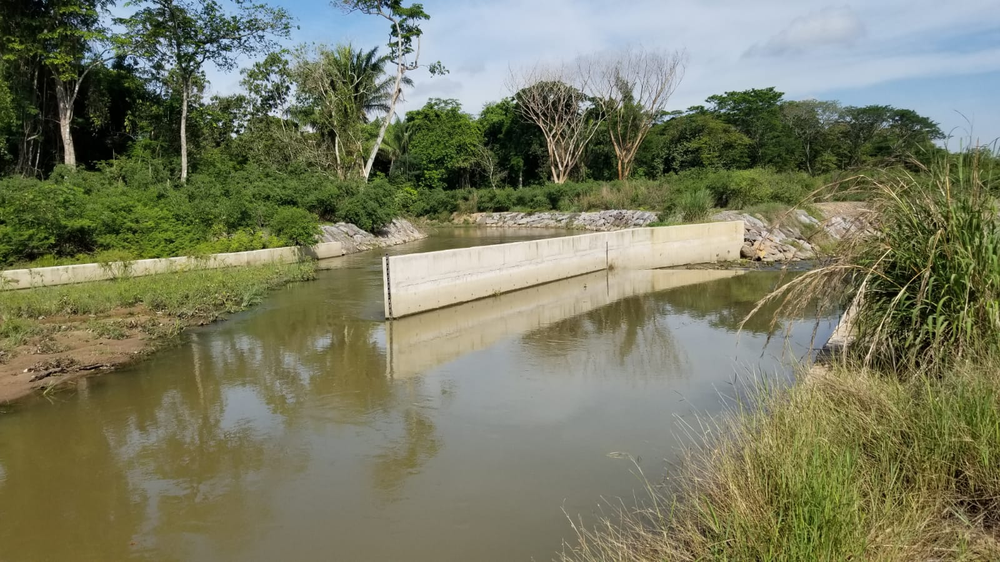

## :globe_with_meridians:Arroyo Las Ánimas - Estructura de repartición (2022-04-27)
`Pictures` rcfdtools & others <br>`Category` Technical field visit <br>`Location` [Google Maps](http://maps.google.com/maps?q=9.492937,-73.518891) or [Openstreet Map](https://www.openstreetmap.org/query?lat=9.492937&lon=-73.518891) 

```geojson
{
  "type": "Feature",
  "geometry": {
    "type": "Point", 
    "coordinates": [-73.518891, 9.492937]
  }, 
  "properties": {
    "Name": "Arroyo Las Ánimas - Estructura de repartición"
  }
}
```

<details><summary>:camera:More info</summary> **18/20220427_084023.jpg** <sub> `Exif version` 0220 `OS version` G955USQU8DUD3 `Date` 2022:04:27 08:40:23 `Aperture` Not known `Brightness` 8.96 `Color space` 1 `Compression` 6`Exposure mode` 0 `Exposure time` 0.0003132832080200501 `Focal length` 4.25 `Lens model` Not known `Lens specification` Not known `Orientation` 1 `Scene type` Not known `f number` 1.7 `White balance` 0 `Sensing method` 2 `Shutter speed` 11.64</sub><sub>`Coordinates & altitude` (0.0, 0.0, 0.0)</sub><sub> :globe_with_meridians:`Location over` [Google Maps](http://maps.google.com/maps?q=0.0,0.0) or [Openstreet Map](https://www.openstreetmap.org/query?lat=0.0&lon=0.0)</sub>


<details><summary>:camera:More info</summary> **18/20220427_084135.jpg** <sub> `Exif version` 0220 `OS version` G955USQU8DUD3 `Date` 2022:04:27 08:41:35 `Aperture` Not known `Brightness` 8.68 `Color space` 1 `Compression` 6`Exposure mode` 0 `Exposure time` 0.00037425149700598805 `Focal length` 4.25 `Lens model` Not known `Lens specification` Not known `Orientation` 1 `Scene type` Not known `f number` 1.7 `White balance` 0 `Sensing method` 2 `Shutter speed` 11.383</sub><sub>`Coordinates & altitude` (0.0, 0.0, 0.0)</sub><sub> :globe_with_meridians:`Location over` [Google Maps](http://maps.google.com/maps?q=0.0,0.0) or [Openstreet Map](https://www.openstreetmap.org/query?lat=0.0&lon=0.0)</sub>


<details><summary>:camera:More info</summary> **18/20220427_084139.jpg** <sub> `Exif version` 0220 `OS version` G955USQU8DUD3 `Date` 2022:04:27 08:41:39 `Aperture` Not known `Brightness` 8.66 `Color space` 1 `Compression` 6`Exposure mode` 0 `Exposure time` 0.00040192926045016077 `Focal length` 4.25 `Lens model` Not known `Lens specification` Not known `Orientation` 1 `Scene type` Not known `f number` 1.7 `White balance` 0 `Sensing method` 2 `Shutter speed` 11.28</sub><sub>`Coordinates & altitude` (0.0, 0.0, 0.0)</sub><sub> :globe_with_meridians:`Location over` [Google Maps](http://maps.google.com/maps?q=0.0,0.0) or [Openstreet Map](https://www.openstreetmap.org/query?lat=0.0&lon=0.0)</sub>


<details><summary>:camera:More info</summary> **18/20220427_084822.jpg** <sub> `Exif version` 0220 `OS version` G955USQU8DUD3 `Date` 2022:04:27 08:48:22 `Aperture` Not known `Brightness` 8.85 `Color space` 1 `Compression` 6`Exposure mode` 0 `Exposure time` 0.00035112359550561797 `Focal length` 4.25 `Lens model` Not known `Lens specification` Not known `Orientation` 1 `Scene type` Not known `f number` 1.7 `White balance` 0 `Sensing method` 2 `Shutter speed` 11.475</sub><sub>`Coordinates & altitude` (0.0, 0.0, 0.0)</sub><sub> :globe_with_meridians:`Location over` [Google Maps](http://maps.google.com/maps?q=0.0,0.0) or [Openstreet Map](https://www.openstreetmap.org/query?lat=0.0&lon=0.0)</sub>


<details><summary>:camera:More info</summary> **18/20220427_084830.jpg** <sub> `Exif version` 0220 `OS version` G955USQU8DUD3 `Date` 2022:04:27 08:48:30 `Aperture` Not known `Brightness` 8.48 `Color space` 1 `Compression` 6`Exposure mode` 0 `Exposure time` 0.00043252595155709344 `Focal length` 4.25 `Lens model` Not known `Lens specification` Not known `Orientation` 1 `Scene type` Not known `f number` 1.7 `White balance` 0 `Sensing method` 2 `Shutter speed` 11.174</sub><sub>`Coordinates & altitude` (0.0, 0.0, 0.0)</sub><sub> :globe_with_meridians:`Location over` [Google Maps](http://maps.google.com/maps?q=0.0,0.0) or [Openstreet Map](https://www.openstreetmap.org/query?lat=0.0&lon=0.0)</sub>


<details><summary>:camera:More info</summary> **18/20220427_084837.jpg** <sub> `Exif version` 0220 `OS version` G955USQU8DUD3 `Date` 2022:04:27 08:48:37 `Aperture` Not known `Brightness` 8.6 `Color space` 1 `Compression` 6`Exposure mode` 0 `Exposure time` 0.0004084967320261438 `Focal length` 4.25 `Lens model` Not known `Lens specification` Not known `Orientation` 1 `Scene type` Not known `f number` 1.7 `White balance` 0 `Sensing method` 2 `Shutter speed` 11.257</sub><sub>`Coordinates & altitude` (0.0, 0.0, 0.0)</sub><sub> :globe_with_meridians:`Location over` [Google Maps](http://maps.google.com/maps?q=0.0,0.0) or [Openstreet Map](https://www.openstreetmap.org/query?lat=0.0&lon=0.0)</sub>


<details><summary>:camera:More info</summary> **18/20220427_084929.jpg** <sub> `Exif version` 0220 `OS version` G955USQU8DUD3 `Date` 2022:04:27 08:49:29 `Aperture` Not known `Brightness` 8.96 `Color space` 1 `Compression` 6`Exposure mode` 0 `Exposure time` 0.0003156565656565657 `Focal length` 4.25 `Lens model` Not known `Lens specification` Not known `Orientation` 1 `Scene type` Not known `f number` 1.7 `White balance` 0 `Sensing method` 2 `Shutter speed` 11.629</sub><sub>`Coordinates & altitude` (0.0, 0.0, 0.0)</sub><sub> :globe_with_meridians:`Location over` [Google Maps](http://maps.google.com/maps?q=0.0,0.0) or [Openstreet Map](https://www.openstreetmap.org/query?lat=0.0&lon=0.0)</sub>


:camera: **18/IMG-20220427a.jpg**  <sub> `Exif version` Not known</details>

:camera: **18/IMG-20220427b.jpg**  <sub> `Exif version` Not known</details>

:camera: **18/IMG-20220427c.jpg**  <sub> `Exif version` Not known</details>

:camera: **18/IMG-20220427d.jpg**  <sub> `Exif version` Not known</details>

:camera: **18/IMG-20220427g.jpg**  <sub> `Exif version` Not known</details>

> _Citación: se permite la reproducción digital parcial o total de este repositorio, scripts, guías de desarrollo, modelos de datos, imágenes y documentación, siempre que se haga referencia como: "R.GISMobile - Sistemas de información geográficos móviles sobre QField que no requieren de conexión a Internet para su navegación". https://github.com/rcfdtools/R.GISMobile - Bogotá - Colombia - Suramérica."._

| [:house: Inicio](../Readme.md) |
|---|