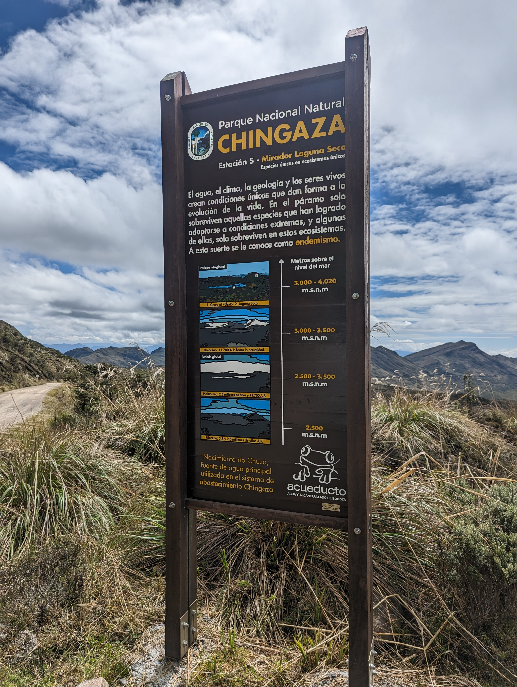

## Mirador Laguna Seca (2023-05-03)
:camera: Fotos: rcfdtools<br>Categoría: Technical field visit

```geojson
{
  "type": "Feature",
  "geometry": {
    "type": "Point", 
    "coordinates": [-73.79294444444444, 4.678047222222222]
  }, 
  "properties": {
    "Name": "Mirador Laguna Seca"
  }
}
```

`File` **2/PXL_20230503_145311366.jpg** <sub>`OS version` HDR+ 1.0.520435816zd `Date` 2023:05:03 09:53:11 `Aperture` Not known `Brightness` 8.81 `Color space` 1 `Compression` 6 `Exif version` 0232 `Exposure mode` 0 `Exposure time` 0.00053 `Focal length` 6.81 `Lens model` Pixel 6 back camera 6.81mm f/1.85 `Lens specification` Not known `Orientation` 1 `Scene type` Not known `Software` HDR+ 1.0.520435816zd `White balance` 0</sub><sub>`Coordinates & altitude` (4.678047222222222, -73.79294444444444, 3730.03)</sub><sub>`:earth_americas: Location over` [Google Maps](http://maps.google.com/maps?q=4.678047222222222,-73.79294444444444) or [Openstreet Map](https://www.openstreetmap.org/query?lat=4.678047222222222&lon=-73.79294444444444)</sub>


`File` **2/PXL_20230503_145353316.jpg** <sub>`OS version` HDR+ 1.0.520435816zd `Date` 2023:05:03 09:53:53 `Aperture` Not known `Brightness` 9.46 `Color space` 1 `Compression` 6 `Exif version` 0232 `Exposure mode` 0 `Exposure time` 0.000371 `Focal length` 6.81 `Lens model` Pixel 6 back camera 6.81mm f/1.85 `Lens specification` Not known `Orientation` 1 `Scene type` Not known `Software` HDR+ 1.0.520435816zd `White balance` 0</sub><sub>`Coordinates & altitude` (4.678238888888889, -73.79212777777778, 3723.83)</sub><sub>`:earth_americas: Location over` [Google Maps](http://maps.google.com/maps?q=4.678238888888889,-73.79212777777778) or [Openstreet Map](https://www.openstreetmap.org/query?lat=4.678238888888889&lon=-73.79212777777778)</sub>


`File` **2/PXL_20230503_145357736.jpg** <sub>`OS version` HDR+ 1.0.520435816zd `Date` 2023:05:03 09:53:57 `Aperture` Not known `Brightness` 9.85 `Color space` 1 `Compression` 6 `Exif version` 0232 `Exposure mode` 0 `Exposure time` 0.000283 `Focal length` 6.81 `Lens model` Pixel 6 back camera 6.81mm f/1.85 `Lens specification` Not known `Orientation` 1 `Scene type` Not known `Software` HDR+ 1.0.520435816zd `White balance` 0</sub><sub>`Coordinates & altitude` (4.678238888888889, -73.79212777777778, 3723.83)</sub><sub>`:earth_americas: Location over` [Google Maps](http://maps.google.com/maps?q=4.678238888888889,-73.79212777777778) or [Openstreet Map](https://www.openstreetmap.org/query?lat=4.678238888888889&lon=-73.79212777777778)</sub>


`File` **2/PXL_20230503_151140383.jpg** <sub>`OS version` HDR+ 1.0.520435816zd `Date` 2023:05:03 10:11:40 `Aperture` Not known `Brightness` 10.15 `Color space` 1 `Compression` 6 `Exif version` 0232 `Exposure mode` 0 `Exposure time` 0.000247 `Focal length` 6.81 `Lens model` Pixel 6 back camera 6.81mm f/1.85 `Lens specification` Not known `Orientation` 1 `Scene type` Not known `Software` HDR+ 1.0.520435816zd `White balance` 0</sub><sub>`Coordinates & altitude` (4.678233333333334, -73.79198055555555, 3723.73)</sub><sub>`:earth_americas: Location over` [Google Maps](http://maps.google.com/maps?q=4.678233333333334,-73.79198055555555) or [Openstreet Map](https://www.openstreetmap.org/query?lat=4.678233333333334&lon=-73.79198055555555)</sub>


`File` **2/PXL_20230503_151249602.MP.jpg** <sub>`OS version` HDR+ 1.0.520435816zd `Date` 2023:05:03 10:12:49 `Aperture` Not known `Brightness` 9.55 `Color space` 1 `Compression` 6 `Exif version` 0232 `Exposure mode` 0 `Exposure time` 0.000318 `Focal length` 6.81 `Lens model` Pixel 6 back camera 6.81mm f/1.85 `Lens specification` Not known `Orientation` 1 `Scene type` Not known `Software` HDR+ 1.0.520435816zd `White balance` 0</sub><sub>`Coordinates & altitude` (4.678219444444445, -73.79198611111111, 3723.76)</sub><sub>`:earth_americas: Location over` [Google Maps](http://maps.google.com/maps?q=4.678219444444445,-73.79198611111111) or [Openstreet Map](https://www.openstreetmap.org/query?lat=4.678219444444445&lon=-73.79198611111111)</sub>


| [:house: Inicio](../Readme.md) |
|---|