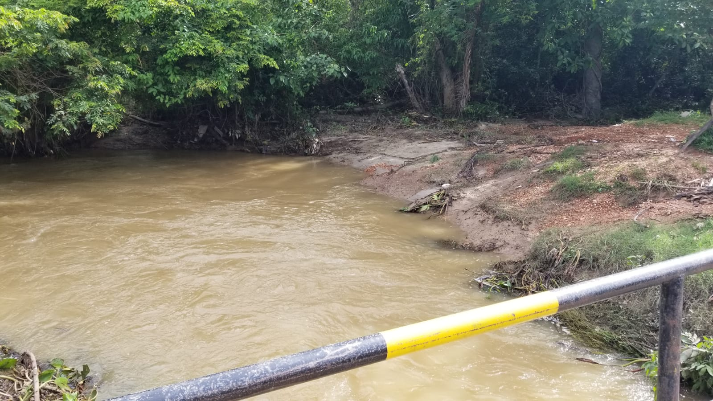
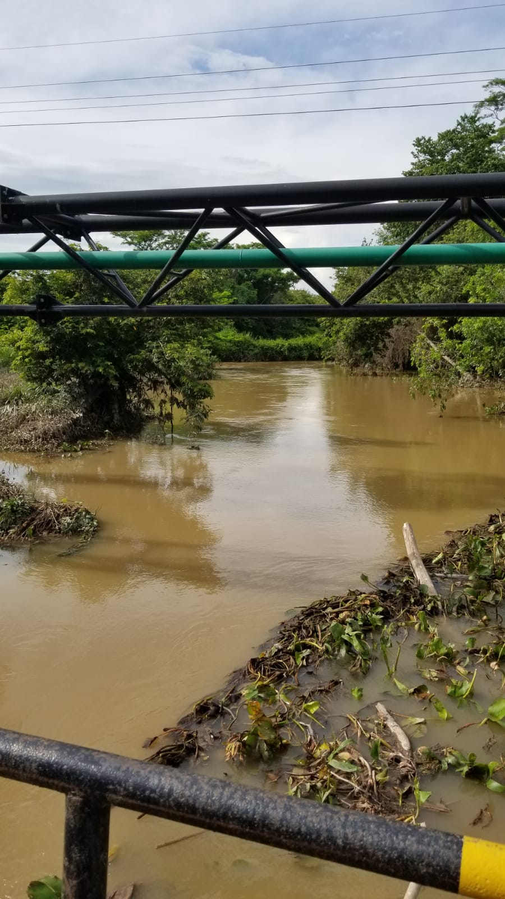
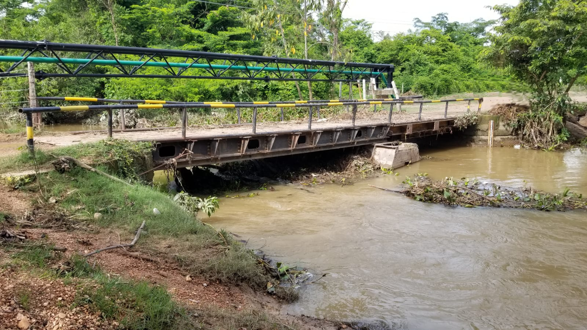
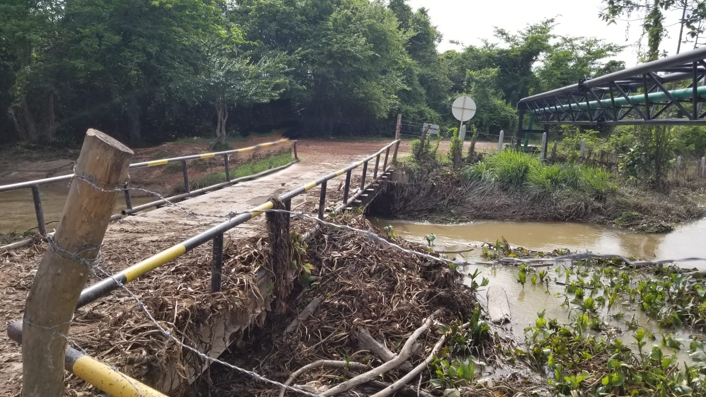

## Arroyo San Antonio - Paso de vía en entrega Realineamiento #4 (2022-04-27)
Fotos por: rcfdtools<br>Categoría: Technical field visit

```geojson
{
  "type": "Feature",
  "geometry": {
    "type": "Point", 
    "coordinates": [-73.521755, 9.538404]
  }, 
  "properties": {
    "Name": "Arroyo San Antonio - Paso de vía en entrega Realineamiento #4"
  }
}
```

:camera: **20/IMG-20220427-WA0040.jpg**

:camera: **20/IMG-20220427-WA0041.jpg**

:camera: **20/IMG-20220427-WA0043.jpg**

:camera: **20/IMG-20220427-WA0044.jpg**

:camera: **20/IMG-20220427-WA0045.jpg**

_**Citación:** se permite la reproducción digital parcial o total de este repositorio, scripts, guías de desarrollo, modelos de datos, imágenes y documentación, siempre que se haga referencia como: "R.GISMobile - Sistemas de información geográficos móviles sobre QField que no requieren de conexión a Internet para su navegación", https://github.com/rcfdtools/R.GISMobile, Bogotá - Colombia - Suramérica."._
| [:house: Inicio](../Readme.md) |
|---|