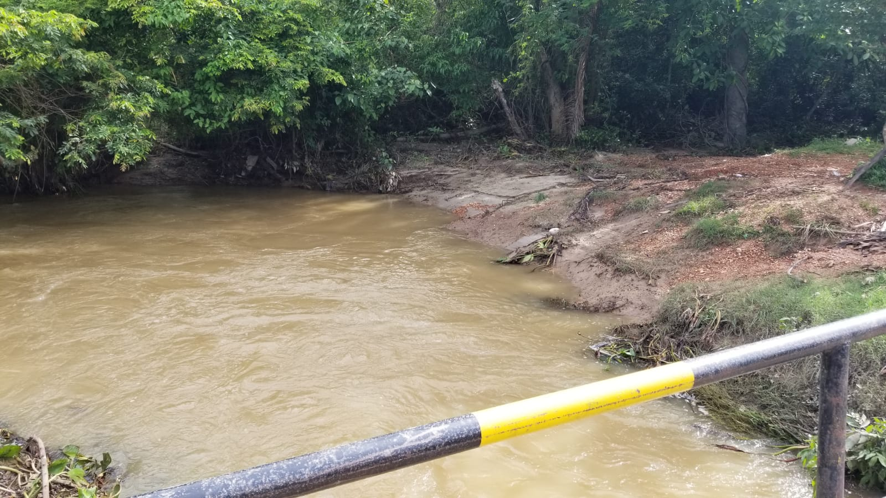
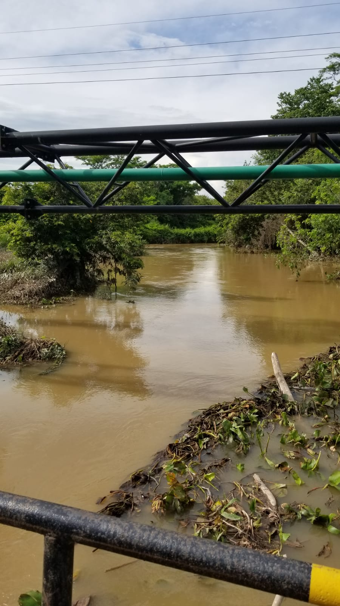
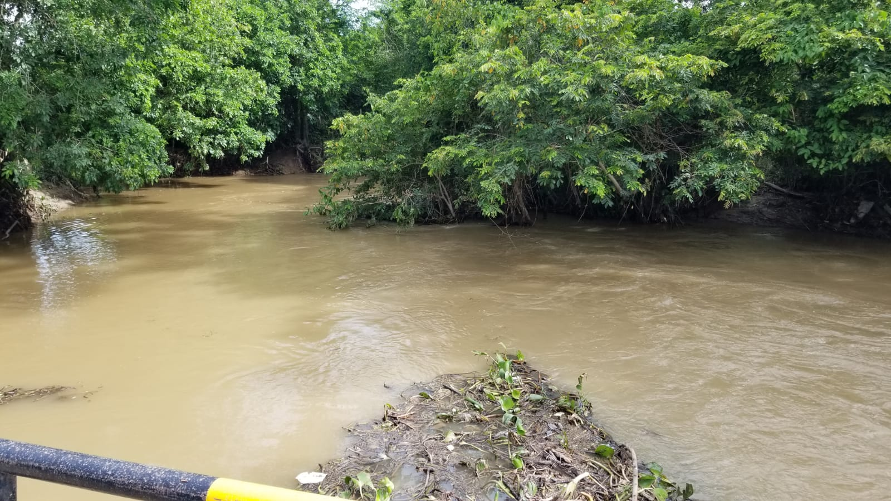
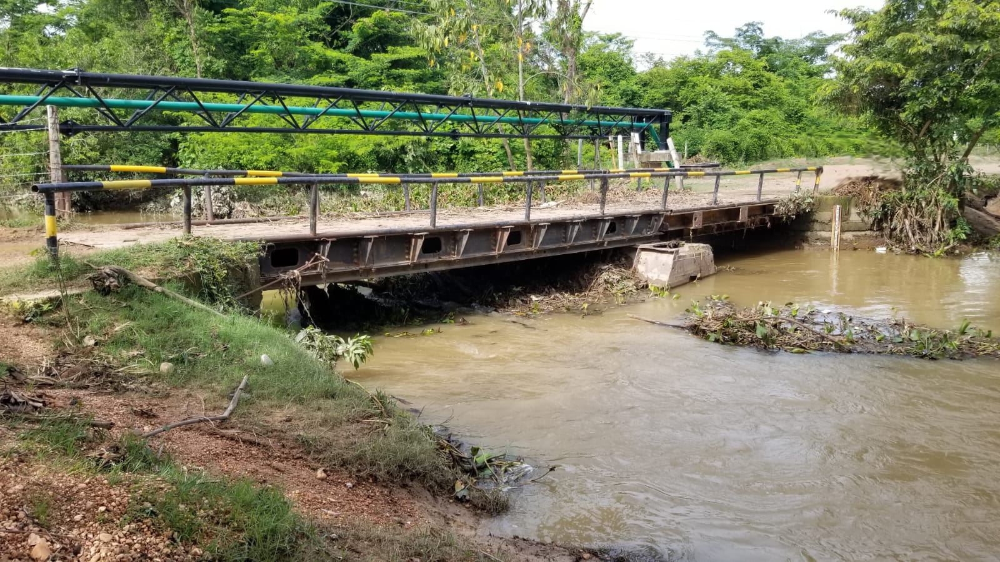
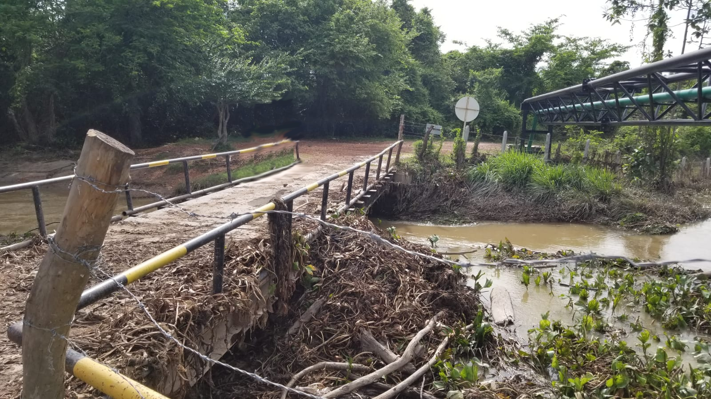

<div align="center"></div>

## :earth_americas:POI: _“Arroyo San Antonio - Paso de vía en entrega Realineamiento #4, La Jagua de Ibirico, Cesar, Colombia (2022-04-27)”_
`Pictures` rcfdtools <br>`Category` Technical field visit <br>`Location` [Google Maps](http://maps.google.com/maps?q=9.538404,-73.521755) or [Openstreet Map](https://www.openstreetmap.org/query?lat=9.538404&lon=-73.521755) 

```geojson
{
  "type": "Feature",
  "geometry": {
    "type": "Point", 
    "coordinates": [-73.521755, 9.538404]
  }, 
  "properties": {
    "Name": "Arroyo San Antonio - Paso de vía en entrega Realineamiento #4, La Jagua de Ibirico, Cesar, Colombia"
  }
}
```

<br><details><summary>:camera:**20/IMG-20220427-WA0040.jpg**</summary> `Exif version` Not known</details>

<br><details><summary>:camera:**20/IMG-20220427-WA0041.jpg**</summary> `Exif version` Not known</details>

<br><details><summary>:camera:**20/IMG-20220427-WA0043.jpg**</summary> `Exif version` Not known</details>

<br><details><summary>:camera:**20/IMG-20220427-WA0044.jpg**</summary> `Exif version` Not known</details>

<br><details><summary>:camera:**20/IMG-20220427-WA0045.jpg**</summary> `Exif version` Not known</details>

<sub>_Citation: Partial or total digital reproduction of this repository, scripts, development guides, data models, images, and documentation is permitted, provided that it is referenced as: "R.GISMobile - Mobile geographic information systems on QField that do not require an internet connection for navigation." https://github.com/rcfdtools/R.GISMobile - Bogotá - Colombia - South America"._<sub>

| [:house: Home](../Readme.md) |
|---|