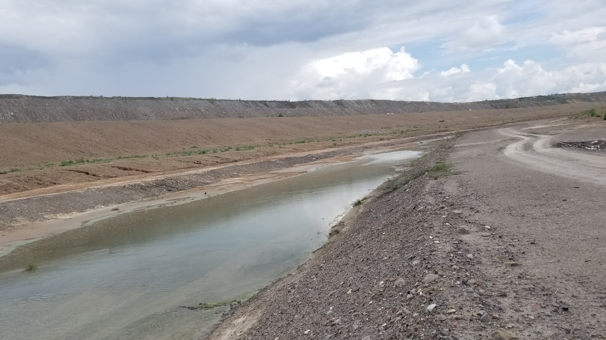
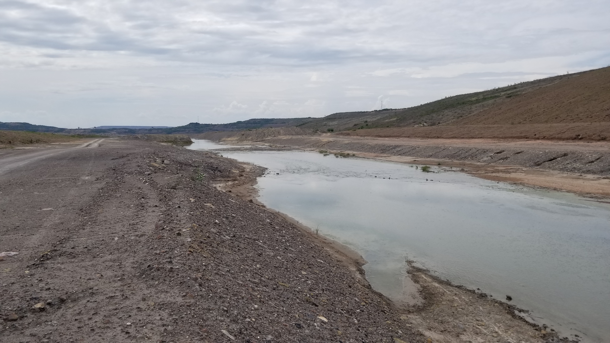
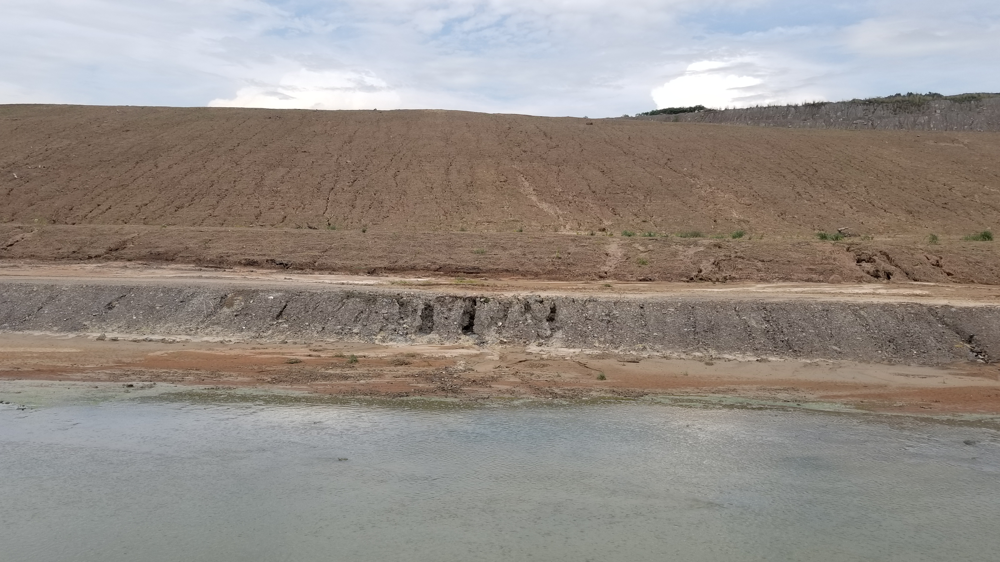
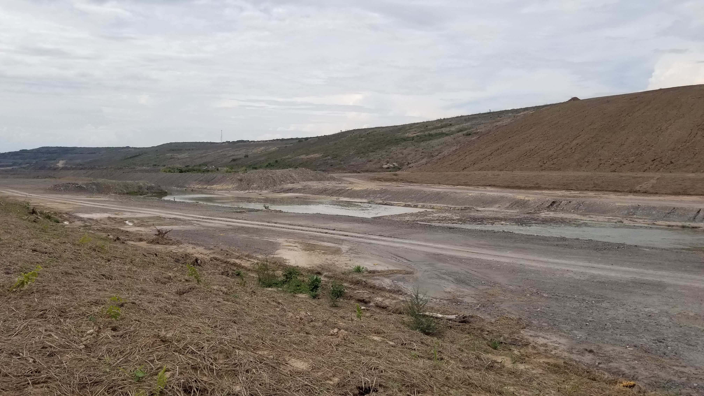

## :globe_with_meridians:Canal de prueba - Realineamiento por retrollenado (2022-04-27)
`Pictures` rcfdtools <br>`Category` Technical field visit <br>`Location` [Google Maps](http://maps.google.com/maps?q=9.549353,-73.482781) or [Openstreet Map](https://www.openstreetmap.org/query?lat=9.549353&lon=-73.482781) 

```geojson
{
  "type": "Feature",
  "geometry": {
    "type": "Point", 
    "coordinates": [-73.482781, 9.549353]
  }, 
  "properties": {
    "Name": "Canal de prueba - Realineamiento por retrollenado"
  }
}
```

:camera: **21/20220426_134914.jpg** <sub> `Exif version` 0220 `OS version` G955USQU8DUD3 `Date` 2022:04:26 13:49:14 `Aperture` Not known `Brightness` 8.71 `Color space` 1 `Compression` 6`Exposure mode` 0 `Exposure time` 0.0003846153846153846 `Focal length` 4.25 `Lens model` Not known `Lens specification` Not known `Orientation` 1 `Scene type` Not known `f number` 1.7 `White balance` 0 `Sensing method` 2 `Shutter speed` 11.344</sub><sub>`Coordinates & altitude` (0.0, 0.0, 0.0)</sub><sub> :globe_with_meridians:`Location over` [Google Maps](http://maps.google.com/maps?q=0.0,0.0) or [Openstreet Map](https://www.openstreetmap.org/query?lat=0.0&lon=0.0)</sub>


:camera: **21/20220426_134953.jpg** <sub> `Exif version` 0220 `OS version` G955USQU8DUD3 `Date` 2022:04:26 13:49:53 `Aperture` Not known `Brightness` 9.35 `Color space` 1 `Compression` 6`Exposure mode` 0 `Exposure time` 0.000251004016064257 `Focal length` 4.25 `Lens model` Not known `Lens specification` Not known `Orientation` 1 `Scene type` Not known `f number` 1.7 `White balance` 0 `Sensing method` 2 `Shutter speed` 11.96</sub><sub>`Coordinates & altitude` (0.0, 0.0, 0.0)</sub><sub> :globe_with_meridians:`Location over` [Google Maps](http://maps.google.com/maps?q=0.0,0.0) or [Openstreet Map](https://www.openstreetmap.org/query?lat=0.0&lon=0.0)</sub>


:camera: **21/20220426_135020.jpg** <sub> `Exif version` 0220 `OS version` G955USQU8DUD3 `Date` 2022:04:26 13:50:20 `Aperture` Not known `Brightness` 7.48 `Color space` 1 `Compression` 6`Exposure mode` 0 `Exposure time` 0.0009225092250922509 `Focal length` 4.25 `Lens model` Not known `Lens specification` Not known `Orientation` 6 `Scene type` Not known `f number` 1.7 `White balance` 0 `Sensing method` 2 `Shutter speed` 10.082</sub><sub>`Coordinates & altitude` (0.0, 0.0, 0.0)</sub><sub> :globe_with_meridians:`Location over` [Google Maps](http://maps.google.com/maps?q=0.0,0.0) or [Openstreet Map](https://www.openstreetmap.org/query?lat=0.0&lon=0.0)</sub>


:camera: **21/20220426_135042.jpg** <sub> `Exif version` 0220 `OS version` G955USQU8DUD3 `Date` 2022:04:26 13:50:42 `Aperture` Not known `Brightness` 8.17 `Color space` 1 `Compression` 6`Exposure mode` 0 `Exposure time` 0.0005567928730512249 `Focal length` 4.25 `Lens model` Not known `Lens specification` Not known `Orientation` 3 `Scene type` Not known `f number` 1.7 `White balance` 0 `Sensing method` 2 `Shutter speed` 10.81</sub><sub>`Coordinates & altitude` (0.0, 0.0, 0.0)</sub><sub> :globe_with_meridians:`Location over` [Google Maps](http://maps.google.com/maps?q=0.0,0.0) or [Openstreet Map](https://www.openstreetmap.org/query?lat=0.0&lon=0.0)</sub>


:camera: **21/20220426_135050.jpg** <sub> `Exif version` 0220 `OS version` G955USQU8DUD3 `Date` 2022:04:26 13:50:50 `Aperture` Not known `Brightness` 8.03 `Color space` 1 `Compression` 6`Exposure mode` 0 `Exposure time` 0.0005966587112171838 `Focal length` 4.25 `Lens model` Not known `Lens specification` Not known `Orientation` 3 `Scene type` Not known `f number` 1.7 `White balance` 0 `Sensing method` 2 `Shutter speed` 10.71</sub><sub>`Coordinates & altitude` (0.0, 0.0, 0.0)</sub><sub> :globe_with_meridians:`Location over` [Google Maps](http://maps.google.com/maps?q=0.0,0.0) or [Openstreet Map](https://www.openstreetmap.org/query?lat=0.0&lon=0.0)</sub>


:camera: **21/20220426_135111.jpg** <sub> `Exif version` 0220 `OS version` G955USQU8DUD3 `Date` 2022:04:26 13:51:11 `Aperture` Not known `Brightness` 8.77 `Color space` 1 `Compression` 6`Exposure mode` 0 `Exposure time` 0.00035298270384751147 `Focal length` 4.25 `Lens model` Not known `Lens specification` Not known `Orientation` 1 `Scene type` Not known `f number` 1.7 `White balance` 0 `Sensing method` 2 `Shutter speed` 11.468</sub><sub>`Coordinates & altitude` (0.0, 0.0, 0.0)</sub><sub> :globe_with_meridians:`Location over` [Google Maps](http://maps.google.com/maps?q=0.0,0.0) or [Openstreet Map](https://www.openstreetmap.org/query?lat=0.0&lon=0.0)</sub>


:camera: **21/20220426_135718.jpg** <sub> `Exif version` 0220 `OS version` G955USQU8DUD3 `Date` 2022:04:26 13:57:17 `Aperture` Not known `Brightness` 7.21 `Color space` 1 `Compression` 6`Exposure mode` 0 `Exposure time` 0.0010460251046025104 `Focal length` 4.25 `Lens model` Not known `Lens specification` Not known `Orientation` 6 `Scene type` Not known `f number` 1.7 `White balance` 0 `Sensing method` 2 `Shutter speed` 9.9</sub><sub>`Coordinates & altitude` (0.0, 0.0, 0.0)</sub><sub> :globe_with_meridians:`Location over` [Google Maps](http://maps.google.com/maps?q=0.0,0.0) or [Openstreet Map](https://www.openstreetmap.org/query?lat=0.0&lon=0.0)</sub>


:camera: **21/20220426_140311.jpg** <sub> `Exif version` 0220 `OS version` G955USQU8DUD3 `Date` 2022:04:26 14:03:11 `Aperture` Not known `Brightness` 9.15 `Color space` 1 `Compression` 6`Exposure mode` 0 `Exposure time` 0.0002777777777777778 `Focal length` 4.25 `Lens model` Not known `Lens specification` Not known `Orientation` 1 `Scene type` Not known `f number` 1.7 `White balance` 0 `Sensing method` 2 `Shutter speed` 11.813</sub><sub>`Coordinates & altitude` (0.0, 0.0, 0.0)</sub><sub> :globe_with_meridians:`Location over` [Google Maps](http://maps.google.com/maps?q=0.0,0.0) or [Openstreet Map](https://www.openstreetmap.org/query?lat=0.0&lon=0.0)</sub>


:camera: **21/20220426_140447.jpg** <sub> `Exif version` 0220 `OS version` G955USQU8DUD3 `Date` 2022:04:26 14:04:47 `Aperture` Not known `Brightness` 9.23 `Color space` 1 `Compression` 6`Exposure mode` 0 `Exposure time` 0.0002642706131078224 `Focal length` 4.25 `Lens model` Not known `Lens specification` Not known `Orientation` 1 `Scene type` Not known `f number` 1.7 `White balance` 0 `Sensing method` 2 `Shutter speed` 11.885</sub><sub>`Coordinates & altitude` (0.0, 0.0, 0.0)</sub><sub> :globe_with_meridians:`Location over` [Google Maps](http://maps.google.com/maps?q=0.0,0.0) or [Openstreet Map](https://www.openstreetmap.org/query?lat=0.0&lon=0.0)</sub>


:camera: **21/20220426_141416.jpg** <sub> `Exif version` 0220 `OS version` G955USQU8DUD3 `Date` 2022:04:26 14:14:16 `Aperture` Not known `Brightness` 9.4 `Color space` 1 `Compression` 6`Exposure mode` 0 `Exposure time` 0.00022977941176470588 `Focal length` 4.25 `Lens model` Not known `Lens specification` Not known `Orientation` 1 `Scene type` Not known `f number` 1.7 `White balance` 0 `Sensing method` 2 `Shutter speed` 12.087</sub><sub>`Coordinates & altitude` (0.0, 0.0, 0.0)</sub><sub> :globe_with_meridians:`Location over` [Google Maps](http://maps.google.com/maps?q=0.0,0.0) or [Openstreet Map](https://www.openstreetmap.org/query?lat=0.0&lon=0.0)</sub>


:camera: **21/20220426_141515.jpg** <sub> `Exif version` 0220 `OS version` G955USQU8DUD3 `Date` 2022:04:26 14:15:15 `Aperture` Not known `Brightness` 9.34 `Color space` 1 `Compression` 6`Exposure mode` 0 `Exposure time` 0.00024131274131274132 `Focal length` 4.25 `Lens model` Not known `Lens specification` Not known `Orientation` 6 `Scene type` Not known `f number` 1.7 `White balance` 0 `Sensing method` 2 `Shutter speed` 12.016</sub><sub>`Coordinates & altitude` (0.0, 0.0, 0.0)</sub><sub> :globe_with_meridians:`Location over` [Google Maps](http://maps.google.com/maps?q=0.0,0.0) or [Openstreet Map](https://www.openstreetmap.org/query?lat=0.0&lon=0.0)</sub>


:camera: **21/20220426_141519.jpg** <sub> `Exif version` 0220 `OS version` G955USQU8DUD3 `Date` 2022:04:26 14:15:19 `Aperture` Not known `Brightness` 8.81 `Color space` 1 `Compression` 6`Exposure mode` 0 `Exposure time` 0.00034916201117318437 `Focal length` 4.25 `Lens model` Not known `Lens specification` Not known `Orientation` 1 `Scene type` Not known `f number` 1.7 `White balance` 0 `Sensing method` 2 `Shutter speed` 11.483</sub><sub>`Coordinates & altitude` (0.0, 0.0, 0.0)</sub><sub> :globe_with_meridians:`Location over` [Google Maps](http://maps.google.com/maps?q=0.0,0.0) or [Openstreet Map](https://www.openstreetmap.org/query?lat=0.0&lon=0.0)</sub>


> _Citación: se permite la reproducción digital parcial o total de este repositorio, scripts, guías de desarrollo, modelos de datos, imágenes y documentación, siempre que se haga referencia como: "R.GISMobile - Sistemas de información geográficos móviles sobre QField que no requieren de conexión a Internet para su navegación". https://github.com/rcfdtools/R.GISMobile - Bogotá - Colombia - Suramérica."._

| [:house: Inicio](../Readme.md) |
|---|