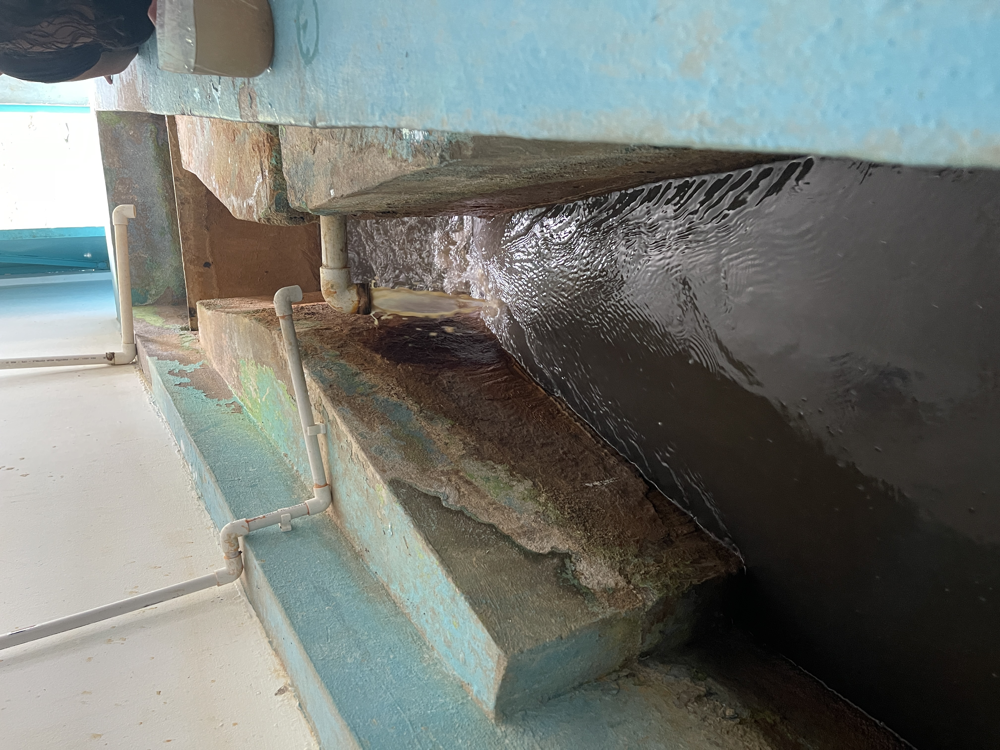

## :globe_with_meridians:Visita técnica Universidad Escuela Colombiana de Ingeniería Julio Garavito a la ESP Villeta - Cundinamarca - Colombia. Agradecimientos especiales a la Ingeniera Ana Vitalia Gonzalez Suavita, gerente de la E.S.P. por concedernos este espacio y al Ingeniero Diego Mauricio Hernández Toro - Director técnico AAA, por compartir su experiencia profesional y conocimientos con los estudiantes y profesores. Información complementaria en https://espvilleta.gov.co (2024-05-10)
`Pictures` rcfdtools <br>`Category` Technical field visit <br>`Location` [Google Maps](http://maps.google.com/maps?q=5.013062,-74.4782647) or [Openstreet Map](https://www.openstreetmap.org/query?lat=5.013062&lon=-74.4782647) 

```geojson
{
  "type": "Feature",
  "geometry": {
    "type": "Point", 
    "coordinates": [-74.4782647, 5.013062]
  }, 
  "properties": {
    "Name": "Visita técnica Universidad Escuela Colombiana de Ingeniería Julio Garavito a la ESP Villeta - Cundinamarca - Colombia. Agradecimientos especiales a la Ingeniera Ana Vitalia Gonzalez Suavita, gerente de la E.S.P. por concedernos este espacio y al Ingeniero Diego Mauricio Hernández Toro - Director técnico AAA, por compartir su experiencia profesional y conocimientos con los estudiantes y profesores. Información complementaria en https://espvilleta.gov.co"
  }
}
```

<br><details><summary>:camera:**22/IMG_0519.JPG**</summary><sub> `Exif version` 0232 `OS version` 17.5 `Date` 2024:05:10 09:57:48 `Aperture` Not known `Brightness` 8.59005489864865 `Color space` 65535 `Compression` 6`Exposure mode` 0 `Exposure time` 0.0006180469715698393 `Focal length` 5.1 `Lens model` iPhone 12 Pro Max back triple camera 5.1mm f/1.6 `Lens specification` (1.5399999618512084, 7.5, 1.6, 2.4) `Orientation` 1 `Scene type` Not known `f number` 1.6 `White balance` 0 `Sensing method` 2 `Shutter speed` 10.660105548423905</sub><sub>`Coordinates & altitude` (5.012822222222222, -74.47740277777778, 852.0079617834394)</sub><sub> :globe_with_meridians:`Location over` [Google Maps](http://maps.google.com/maps?q=5.012822222222222,-74.47740277777778) or [Openstreet Map](https://www.openstreetmap.org/query?lat=5.012822222222222&lon=-74.47740277777778)</sub></details>


<br><details><summary>:camera:**22/IMG_0520.JPG**</summary><sub> `Exif version` 0232 `OS version` 17.5 `Date` 2024:05:10 09:57:57 `Aperture` Not known `Brightness` 8.522525008623663 `Color space` 65535 `Compression` 6`Exposure mode` 0 `Exposure time` 0.0007127583749109052 `Focal length` 5.1 `Lens model` iPhone 12 Pro Max back triple camera 5.1mm f/1.6 `Lens specification` (1.5399999618512084, 7.5, 1.6, 2.4) `Orientation` 1 `Scene type` Not known `f number` 1.6 `White balance` 0 `Sensing method` 2 `Shutter speed` 10.453810307017545</sub><sub>`Coordinates & altitude` (5.012841666666667, -74.47743055555556, 855.76296633303)</sub><sub> :globe_with_meridians:`Location over` [Google Maps](http://maps.google.com/maps?q=5.012841666666667,-74.47743055555556) or [Openstreet Map](https://www.openstreetmap.org/query?lat=5.012841666666667&lon=-74.47743055555556)</sub></details>


<br><details><summary>:camera:**22/IMG_0521.JPG**</summary><sub> `Exif version` 0232 `OS version` 17.5 `Date` 2024:05:10 10:31:31 `Aperture` Not known `Brightness` 6.849677110739058 `Color space` 65535 `Compression` 6`Exposure mode` 0 `Exposure time` 0.002688172043010753 `Focal length` 5.1 `Lens model` iPhone 12 Pro Max back triple camera 5.1mm f/1.6 `Lens specification` (1.5399999618512084, 7.5, 1.6, 2.4) `Orientation` 1 `Scene type` Not known `f number` 1.6 `White balance` 0 `Sensing method` 2 `Shutter speed` 8.539251148694888</sub><sub>`Coordinates & altitude` (5.012291666666667, -74.47744722222222, 854.1477045908183)</sub><sub> :globe_with_meridians:`Location over` [Google Maps](http://maps.google.com/maps?q=5.012291666666667,-74.47744722222222) or [Openstreet Map](https://www.openstreetmap.org/query?lat=5.012291666666667&lon=-74.47744722222222)</sub></details>


<br><details><summary>:camera:**22/IMG_0522.JPG**</summary><sub> `Exif version` 0232 `OS version` 17.5 `Date` 2024:05:10 10:31:37 `Aperture` Not known `Brightness` 7.298749177090191 `Color space` 65535 `Compression` 6`Exposure mode` 0 `Exposure time` 0.0017985611510791368 `Focal length` 5.1 `Lens model` iPhone 12 Pro Max back triple camera 5.1mm f/1.6 `Lens specification` (1.5399999618512084, 7.5, 1.6, 2.4) `Orientation` 1 `Scene type` Not known `f number` 1.6 `White balance` 0 `Sensing method` 2 `Shutter speed` 9.117787386312807</sub><sub>`Coordinates & altitude` (5.0128111111111116, -74.47741666666667, 852.742337164751)</sub><sub> :globe_with_meridians:`Location over` [Google Maps](http://maps.google.com/maps?q=5.0128111111111116,-74.47741666666667) or [Openstreet Map](https://www.openstreetmap.org/query?lat=5.0128111111111116&lon=-74.47741666666667)</sub></details>


<br><details><summary>:camera:**22/IMG_0523.JPG**</summary><sub> `Exif version` 0232 `OS version` 17.5 `Date` 2024:05:10 10:47:22 `Aperture` Not known `Brightness` 7.469125147116516 `Color space` 65535 `Compression` 6`Exposure mode` 0 `Exposure time` 0.0016 `Focal length` 5.1 `Lens model` iPhone 12 Pro Max back triple camera 5.1mm f/1.6 `Lens specification` (1.5399999618512084, 7.5, 1.6, 2.4) `Orientation` 1 `Scene type` Not known `f number` 1.6 `White balance` 0 `Sensing method` 2 `Shutter speed` 9.286810974075006</sub><sub>`Coordinates & altitude` (5.012788888888889, -74.47733333333333, 856.3652618135377)</sub><sub> :globe_with_meridians:`Location over` [Google Maps](http://maps.google.com/maps?q=5.012788888888889,-74.47733333333333) or [Openstreet Map](https://www.openstreetmap.org/query?lat=5.012788888888889&lon=-74.47733333333333)</sub></details>


<br><details><summary>:camera:**22/IMG_0524.JPG**</summary><sub> `Exif version` 0232 `OS version` 17.5 `Date` 2024:05:10 11:15:44 `Aperture` Not known `Brightness` 7.401954832442933 `Color space` 65535 `Compression` 6`Exposure mode` 0 `Exposure time` 0.001669449081803005 `Focal length` 5.1 `Lens model` iPhone 12 Pro Max back triple camera 5.1mm f/1.6 `Lens specification` (1.5399999618512084, 7.5, 1.6, 2.4) `Orientation` 1 `Scene type` Not known `f number` 1.6 `White balance` 0 `Sensing method` 2 `Shutter speed` 9.22593618732684</sub><sub>`Coordinates & altitude` (5.0160527777777775, -74.47553888888889, 856.2385252069225)</sub><sub> :globe_with_meridians:`Location over` [Google Maps](http://maps.google.com/maps?q=5.0160527777777775,-74.47553888888889) or [Openstreet Map](https://www.openstreetmap.org/query?lat=5.0160527777777775&lon=-74.47553888888889)</sub></details>


<br><details><summary>:camera:**22/IMG_0525.JPG**</summary><sub> `Exif version` 0232 `OS version` 17.5 `Date` 2024:05:10 13:02:05 `Aperture` Not known `Brightness` 2.81087437742114 `Color space` 65535 `Compression` 6`Exposure mode` 0 `Exposure time` 0.0125 `Focal length` 5.1 `Lens model` iPhone 12 Pro Max back triple camera 5.1mm f/1.6 `Lens specification` (1.5399999618512084, 7.5, 1.6, 2.4) `Orientation` 6 `Scene type` Not known `f number` 1.6 `White balance` 0 `Sensing method` 2 `Shutter speed` 6.323198225945546</sub><sub>`Coordinates & altitude` (5.009994444444445, -74.47755555555555, 870.8621212121212)</sub><sub> :globe_with_meridians:`Location over` [Google Maps](http://maps.google.com/maps?q=5.009994444444445,-74.47755555555555) or [Openstreet Map](https://www.openstreetmap.org/query?lat=5.009994444444445&lon=-74.47755555555555)</sub></details>


<br><details><summary>:camera:**22/IMG_0526.JPG**</summary><sub> `Exif version` 0232 `OS version` 17.5 `Date` 2024:05:10 13:02:07 `Aperture` Not known `Brightness` 2.196999861104681 `Color space` 65535 `Compression` 6`Exposure mode` 0 `Exposure time` 0.016666666666666666 `Focal length` 5.1 `Lens model` iPhone 12 Pro Max back triple camera 5.1mm f/1.6 `Lens specification` (1.5399999618512084, 7.5, 1.6, 2.4) `Orientation` 1 `Scene type` Not known `f number` 1.6 `White balance` 0 `Sensing method` 2 `Shutter speed` 5.915282590512606</sub><sub>`Coordinates & altitude` (5.009994444444445, -74.47755555555555, 870.8621212121212)</sub><sub> :globe_with_meridians:`Location over` [Google Maps](http://maps.google.com/maps?q=5.009994444444445,-74.47755555555555) or [Openstreet Map](https://www.openstreetmap.org/query?lat=5.009994444444445&lon=-74.47755555555555)</sub></details>


<br><details><summary>:camera:**22/IMG_0527.JPG**</summary><sub> `Exif version` 0232 `OS version` 17.5 `Date` 2024:05:10 13:02:14 `Aperture` Not known `Brightness` 2.6119693743487518 `Color space` 65535 `Compression` 6`Exposure mode` 0 `Exposure time` 0.013888888888888888 `Focal length` 5.1 `Lens model` iPhone 12 Pro Max back triple camera 5.1mm f/1.6 `Lens specification` (1.5399999618512084, 7.5, 1.6, 2.4) `Orientation` 1 `Scene type` Not known `f number` 1.6 `White balance` 0 `Sensing method` 2 `Shutter speed` 6.173761893144669</sub><sub>`Coordinates & altitude` (5.009994444444445, -74.47755555555555, 870.8621212121212)</sub><sub> :globe_with_meridians:`Location over` [Google Maps](http://maps.google.com/maps?q=5.009994444444445,-74.47755555555555) or [Openstreet Map](https://www.openstreetmap.org/query?lat=5.009994444444445&lon=-74.47755555555555)</sub></details>


<br><details><summary>:camera:**22/IMG_0528.JPG**</summary><sub> `Exif version` 0232 `OS version` 17.5 `Date` 2024:05:10 13:02:19 `Aperture` Not known `Brightness` 0.006071162666715689 `Color space` 65535 `Compression` 6`Exposure mode` 0 `Exposure time` 0.022222222222222223 `Focal length` 5.1 `Lens model` iPhone 12 Pro Max back triple camera 5.1mm f/1.6 `Lens specification` (1.5399999618512084, 7.5, 1.6, 2.4) `Orientation` 1 `Scene type` Not known `f number` 1.6 `White balance` 0 `Sensing method` 2 `Shutter speed` 5.500920012988419</sub><sub>`Coordinates & altitude` (5.009994444444445, -74.47755555555555, 870.8621212121212)</sub><sub> :globe_with_meridians:`Location over` [Google Maps](http://maps.google.com/maps?q=5.009994444444445,-74.47755555555555) or [Openstreet Map](https://www.openstreetmap.org/query?lat=5.009994444444445&lon=-74.47755555555555)</sub></details>


<br><details><summary>:camera:**22/IMG_0529.JPG**</summary><sub> `Exif version` 0232 `OS version` 17.5 `Date` 2024:05:10 13:02:41 `Aperture` Not known `Brightness` 4.672714929334074 `Color space` 65535 `Compression` 6`Exposure mode` 0 `Exposure time` 0.008264462809917356 `Focal length` 5.1 `Lens model` iPhone 12 Pro Max back triple camera 5.1mm f/1.6 `Lens specification` (1.5399999618512084, 7.5, 1.6, 2.4) `Orientation` 1 `Scene type` Not known `f number` 1.6 `White balance` 0 `Sensing method` 2 `Shutter speed` 6.922439780250739</sub><sub>`Coordinates & altitude` (5.009994444444445, -74.47755555555555, 872.9495238095238)</sub><sub> :globe_with_meridians:`Location over` [Google Maps](http://maps.google.com/maps?q=5.009994444444445,-74.47755555555555) or [Openstreet Map](https://www.openstreetmap.org/query?lat=5.009994444444445&lon=-74.47755555555555)</sub></details>


<br><details><summary>:camera:**22/IMG_0530.JPG**</summary><sub> `Exif version` 0232 `OS version` 17.5 `Date` 2024:05:10 13:03:04 `Aperture` Not known `Brightness` 1.0102808814400994 `Color space` 65535 `Compression` 6`Exposure mode` 0 `Exposure time` 0.016666666666666666 `Focal length` 5.1 `Lens model` iPhone 12 Pro Max back triple camera 5.1mm f/1.6 `Lens specification` (1.5399999618512084, 7.5, 1.6, 2.4) `Orientation` 6 `Scene type` Not known `f number` 1.6 `White balance` 0 `Sensing method` 2 `Shutter speed` 5.914499196065449</sub><sub>`Coordinates & altitude` (5.013263888888889, -74.47758611111111, 855.0699734278122)</sub><sub> :globe_with_meridians:`Location over` [Google Maps](http://maps.google.com/maps?q=5.013263888888889,-74.47758611111111) or [Openstreet Map](https://www.openstreetmap.org/query?lat=5.013263888888889&lon=-74.47758611111111)</sub></details>


<br><details><summary>:camera:**22/IMG_0531.JPG**</summary><sub> `Exif version` 0232 `OS version` 17.5 `Date` 2024:05:10 13:03:09 `Aperture` Not known `Brightness` 2.9432676174496644 `Color space` 65535 `Compression` 6`Exposure mode` 0 `Exposure time` 0.011904761904761904 `Focal length` 5.1 `Lens model` iPhone 12 Pro Max back triple camera 5.1mm f/1.6 `Lens specification` (1.5399999618512084, 7.5, 1.6, 2.4) `Orientation` 6 `Scene type` Not known `f number` 1.6 `White balance` 0 `Sensing method` 2 `Shutter speed` 6.399943430915005</sub><sub>`Coordinates & altitude` (5.013136111111111, -74.47762222222222, 853.1847195357834)</sub><sub> :globe_with_meridians:`Location over` [Google Maps](http://maps.google.com/maps?q=5.013136111111111,-74.47762222222222) or [Openstreet Map](https://www.openstreetmap.org/query?lat=5.013136111111111&lon=-74.47762222222222)</sub></details>


<br><details><summary>:camera:**22/IMG_0532.JPG**</summary><sub> `Exif version` 0232 `OS version` 17.5 `Date` 2024:05:10 13:03:13 `Aperture` Not known `Brightness` 3.9067761380170443 `Color space` 65535 `Compression` 6`Exposure mode` 0 `Exposure time` 0.008264462809917356 `Focal length` 5.1 `Lens model` iPhone 12 Pro Max back triple camera 5.1mm f/1.6 `Lens specification` (1.5399999618512084, 7.5, 1.6, 2.4) `Orientation` 6 `Scene type` Not known `f number` 1.6 `White balance` 0 `Sensing method` 2 `Shutter speed` 6.922439780250739</sub><sub>`Coordinates & altitude` (5.013097222222222, -74.47763888888889, 852.8876003568242)</sub><sub> :globe_with_meridians:`Location over` [Google Maps](http://maps.google.com/maps?q=5.013097222222222,-74.47763888888889) or [Openstreet Map](https://www.openstreetmap.org/query?lat=5.013097222222222&lon=-74.47763888888889)</sub></details>


<br><details><summary>:camera:**22/IMG_0533.JPG**</summary><sub> `Exif version` 0232 `OS version` 17.5 `Date` 2024:05:10 13:04:51 `Aperture` Not known `Brightness` 3.2040703563864077 `Color space` 65535 `Compression` 6`Exposure mode` 0 `Exposure time` 0.008695652173913044 `Focal length` 5.1 `Lens model` iPhone 12 Pro Max back triple camera 5.1mm f/1.6 `Lens specification` (1.5399999618512084, 7.5, 1.6, 2.4) `Orientation` 1 `Scene type` Not known `f number` 1.6 `White balance` 0 `Sensing method` 2 `Shutter speed` 6.85158385592539</sub></details>


<br><details><summary>:camera:**22/IMG_0534.JPG**</summary><sub> `Exif version` 0232 `OS version` 17.5 `Date` 2024:05:10 13:04:57 `Aperture` Not known `Brightness` 5.712264507830824 `Color space` 65535 `Compression` 6`Exposure mode` 0 `Exposure time` 0.005555555555555556 `Focal length` 5.1 `Lens model` iPhone 12 Pro Max back triple camera 5.1mm f/1.6 `Lens specification` (1.5399999618512084, 7.5, 1.6, 2.4) `Orientation` 1 `Scene type` Not known `f number` 1.6 `White balance` 0 `Sensing method` 2 `Shutter speed` 7.492516882642818</sub></details>


<br><details><summary>:camera:**22/IMG_0535.JPG**</summary><sub> `Exif version` 0232 `OS version` 17.5 `Date` 2024:05:10 13:05:02 `Aperture` Not known `Brightness` 0.7536233457458935 `Color space` 65535 `Compression` 6`Exposure mode` 0 `Exposure time` 0.016666666666666666 `Focal length` 5.1 `Lens model` iPhone 12 Pro Max back triple camera 5.1mm f/1.6 `Lens specification` (1.5399999618512084, 7.5, 1.6, 2.4) `Orientation` 1 `Scene type` Not known `f number` 1.6 `White balance` 0 `Sensing method` 2 `Shutter speed` 5.914499196065449</sub></details>


<br><details><summary>:camera:**22/IMG_0536.JPG**</summary><sub> `Exif version` 0232 `OS version` 17.5 `Date` 2024:05:10 13:05:09 `Aperture` Not known `Brightness` 3.93731553056922 `Color space` 65535 `Compression` 6`Exposure mode` 0 `Exposure time` 0.008264462809917356 `Focal length` 5.1 `Lens model` iPhone 12 Pro Max back triple camera 5.1mm f/1.6 `Lens specification` (1.5399999618512084, 7.5, 1.6, 2.4) `Orientation` 6 `Scene type` Not known `f number` 1.6 `White balance` 0 `Sensing method` 2 `Shutter speed` 6.922439780250739</sub><sub>`Coordinates & altitude` (5.013097222222222, -74.47802777777778, 854.1605489945739)</sub><sub> :globe_with_meridians:`Location over` [Google Maps](http://maps.google.com/maps?q=5.013097222222222,-74.47802777777778) or [Openstreet Map](https://www.openstreetmap.org/query?lat=5.013097222222222&lon=-74.47802777777778)</sub></details>


<br><details><summary>:camera:**22/IMG_0537.JPG**</summary><sub> `Exif version` 0232 `OS version` 17.5 `Date` 2024:05:10 13:05:16 `Aperture` Not known `Brightness` 8.444573823940383 `Color space` 65535 `Compression` 6`Exposure mode` 0 `Exposure time` 0.0006609385327164573 `Focal length` 5.1 `Lens model` iPhone 12 Pro Max back triple camera 5.1mm f/1.6 `Lens specification` (1.5399999618512084, 7.5, 1.6, 2.4) `Orientation` 1 `Scene type` Not known `f number` 1.6 `White balance` 0 `Sensing method` 2 `Shutter speed` 10.56306210608314</sub><sub>`Coordinates & altitude` (5.013125, -74.47776944444445, 864.2390396659707)</sub><sub> :globe_with_meridians:`Location over` [Google Maps](http://maps.google.com/maps?q=5.013125,-74.47776944444445) or [Openstreet Map](https://www.openstreetmap.org/query?lat=5.013125&lon=-74.47776944444445)</sub></details>


<br><details><summary>:camera:**22/IMG_0538.JPG**</summary><sub> `Exif version` 0232 `OS version` 17.5 `Date` 2024:05:10 13:05:18 `Aperture` Not known `Brightness` 8.170141514529545 `Color space` 65535 `Compression` 6`Exposure mode` 0 `Exposure time` 0.0007818608287724785 `Focal length` 5.1 `Lens model` iPhone 12 Pro Max back triple camera 5.1mm f/1.6 `Lens specification` (1.5399999618512084, 7.5, 1.6, 2.4) `Orientation` 1 `Scene type` Not known `f number` 1.6 `White balance` 0 `Sensing method` 2 `Shutter speed` 10.320543768263246</sub><sub>`Coordinates & altitude` (5.013122222222222, -74.47776944444445, 864.126491646778)</sub><sub> :globe_with_meridians:`Location over` [Google Maps](http://maps.google.com/maps?q=5.013122222222222,-74.47776944444445) or [Openstreet Map](https://www.openstreetmap.org/query?lat=5.013122222222222&lon=-74.47776944444445)</sub></details>


<br><details><summary>:camera:**22/IMG_0539.JPG**</summary><sub> `Exif version` 0232 `OS version` 17.5 `Date` 2024:05:10 13:05:20 `Aperture` Not known `Brightness` 8.169884014929567 `Color space` 65535 `Compression` 6`Exposure mode` 0 `Exposure time` 0.0007898894154818325 `Focal length` 5.1 `Lens model` iPhone 12 Pro Max back triple camera 5.1mm f/1.6 `Lens specification` (1.5399999618512084, 7.5, 1.6, 2.4) `Orientation` 1 `Scene type` Not known `f number` 1.6 `White balance` 0 `Sensing method` 2 `Shutter speed` 10.305859721811187</sub><sub>`Coordinates & altitude` (5.0131194444444445, -74.4777611111111, 863.4554707379135)</sub><sub> :globe_with_meridians:`Location over` [Google Maps](http://maps.google.com/maps?q=5.0131194444444445,-74.4777611111111) or [Openstreet Map](https://www.openstreetmap.org/query?lat=5.0131194444444445&lon=-74.4777611111111)</sub></details>


<br><details><summary>:camera:**22/IMG_0540.JPG**</summary><sub> `Exif version` 0232 `OS version` 17.5 `Date` 2024:05:10 13:05:23 `Aperture` Not known `Brightness` 8.762115738531797 `Color space` 65535 `Compression` 6`Exposure mode` 0 `Exposure time` 0.0005571030640668524 `Focal length` 5.1 `Lens model` iPhone 12 Pro Max back triple camera 5.1mm f/1.6 `Lens specification` (1.5399999618512084, 7.5, 1.6, 2.4) `Orientation` 1 `Scene type` Not known `f number` 1.6 `White balance` 0 `Sensing method` 2 `Shutter speed` 10.810035056967573</sub><sub>`Coordinates & altitude` (5.013122222222222, -74.4777611111111, 862.0047875523638)</sub><sub> :globe_with_meridians:`Location over` [Google Maps](http://maps.google.com/maps?q=5.013122222222222,-74.4777611111111) or [Openstreet Map](https://www.openstreetmap.org/query?lat=5.013122222222222&lon=-74.4777611111111)</sub></details>


<br><details><summary>:camera:**22/IMG_0541.JPG**</summary><sub> `Exif version` 0232 `OS version` 17.5 `Date` 2024:05:10 13:07:19 `Aperture` Not known `Brightness` 9.208984194472688 `Color space` 65535 `Compression` 6`Exposure mode` 0 `Exposure time` 0.0003929273084479371 `Focal length` 5.1 `Lens model` iPhone 12 Pro Max back triple camera 5.1mm f/1.6 `Lens specification` (1.5399999618512084, 7.5, 1.6, 2.4) `Orientation` 6 `Scene type` Not known `f number` 1.6 `White balance` 0 `Sensing method` 2 `Shutter speed` 11.31318306010929</sub><sub>`Coordinates & altitude` (5.0132111111111115, -74.47778333333333, 847.2518579686209)</sub><sub> :globe_with_meridians:`Location over` [Google Maps](http://maps.google.com/maps?q=5.0132111111111115,-74.47778333333333) or [Openstreet Map](https://www.openstreetmap.org/query?lat=5.0132111111111115&lon=-74.47778333333333)</sub></details>


<br><details><summary>:camera:**22/IMG_0542.JPG**</summary><sub> `Exif version` 0232 `OS version` 17.5 `Date` 2024:05:10 13:07:21 `Aperture` Not known `Brightness` 8.82841630813358 `Color space` 65535 `Compression` 6`Exposure mode` 0 `Exposure time` 0.0005310674455655868 `Focal length` 5.1 `Lens model` iPhone 12 Pro Max back triple camera 5.1mm f/1.6 `Lens specification` (1.5399999618512084, 7.5, 1.6, 2.4) `Orientation` 6 `Scene type` Not known `f number` 1.6 `White balance` 0 `Sensing method` 2 `Shutter speed` 10.87900051343488</sub><sub>`Coordinates & altitude` (5.013166666666667, -74.47781388888889, 846.5260273972602)</sub><sub> :globe_with_meridians:`Location over` [Google Maps](http://maps.google.com/maps?q=5.013166666666667,-74.47781388888889) or [Openstreet Map](https://www.openstreetmap.org/query?lat=5.013166666666667&lon=-74.47781388888889)</sub></details>


<br><details><summary>:camera:**22/IMG_0543.JPG**</summary><sub> `Exif version` 0232 `OS version` 17.5 `Date` 2024:05:10 13:07:24 `Aperture` Not known `Brightness` 8.777890853580969 `Color space` 65535 `Compression` 6`Exposure mode` 0 `Exposure time` 0.0005138746145940391 `Focal length` 5.1 `Lens model` iPhone 12 Pro Max back triple camera 5.1mm f/1.6 `Lens specification` (1.5399999618512084, 7.5, 1.6, 2.4) `Orientation` 1 `Scene type` Not known `f number` 1.6 `White balance` 0 `Sensing method` 2 `Shutter speed` 10.925944010416666</sub><sub>`Coordinates & altitude` (5.013169444444444, -74.47779722222222, 851.3747826086957)</sub><sub> :globe_with_meridians:`Location over` [Google Maps](http://maps.google.com/maps?q=5.013169444444444,-74.47779722222222) or [Openstreet Map](https://www.openstreetmap.org/query?lat=5.013169444444444&lon=-74.47779722222222)</sub></details>


<br><details><summary>:camera:**22/IMG_0544.JPG**</summary><sub> `Exif version` 0232 `OS version` 17.5 `Date` 2024:05:10 13:07:29 `Aperture` Not known `Brightness` 9.045281980742779 `Color space` 65535 `Compression` 6`Exposure mode` 0 `Exposure time` 0.00046189376443418013 `Focal length` 5.1 `Lens model` iPhone 12 Pro Max back triple camera 5.1mm f/1.6 `Lens specification` (1.5399999618512084, 7.5, 1.6, 2.4) `Orientation` 6 `Scene type` Not known `f number` 1.6 `White balance` 0 `Sensing method` 2 `Shutter speed` 11.079819538434842</sub><sub>`Coordinates & altitude` (5.013175, -74.4777888888889, 860.0113798008534)</sub><sub> :globe_with_meridians:`Location over` [Google Maps](http://maps.google.com/maps?q=5.013175,-74.4777888888889) or [Openstreet Map](https://www.openstreetmap.org/query?lat=5.013175&lon=-74.4777888888889)</sub></details>


<br><details><summary>:camera:**22/IMG_0545.JPG**</summary><sub> `Exif version` 0232 `OS version` 17.5 `Date` 2024:05:10 13:07:35 `Aperture` Not known `Brightness` 9.115478317362351 `Color space` 65535 `Compression` 6`Exposure mode` 0 `Exposure time` 0.00046189376443418013 `Focal length` 5.1 `Lens model` iPhone 12 Pro Max back triple camera 5.1mm f/1.6 `Lens specification` (1.5399999618512084, 7.5, 1.6, 2.4) `Orientation` 1 `Scene type` Not known `f number` 1.6 `White balance` 0 `Sensing method` 2 `Shutter speed` 11.079819538434842</sub><sub>`Coordinates & altitude` (5.013186111111111, -74.47778333333333, 861.9344758064516)</sub><sub> :globe_with_meridians:`Location over` [Google Maps](http://maps.google.com/maps?q=5.013186111111111,-74.47778333333333) or [Openstreet Map](https://www.openstreetmap.org/query?lat=5.013186111111111&lon=-74.47778333333333)</sub></details>


<br><details><summary>:camera:**22/IMG_0546.JPG**</summary><sub> `Exif version` 0232 `OS version` 17.5 `Date` 2024:05:10 13:08:14 `Aperture` Not known `Brightness` 8.48738690792975 `Color space` 65535 `Compression` 6`Exposure mode` 0 `Exposure time` 0.0006609385327164573 `Focal length` 5.1 `Lens model` iPhone 12 Pro Max back triple camera 5.1mm f/1.6 `Lens specification` (1.5399999618512084, 7.5, 1.6, 2.4) `Orientation` 1 `Scene type` Not known `f number` 1.6 `White balance` 0 `Sensing method` 2 `Shutter speed` 10.56306210608314</sub><sub>`Coordinates & altitude` (5.013197222222222, -74.47774444444444, 860.5738786279684)</sub><sub> :globe_with_meridians:`Location over` [Google Maps](http://maps.google.com/maps?q=5.013197222222222,-74.47774444444444) or [Openstreet Map](https://www.openstreetmap.org/query?lat=5.013197222222222&lon=-74.47774444444444)</sub></details>


<br><details><summary>:camera:**22/IMG_0547.JPG**</summary><sub> `Exif version` 0232 `OS version` 17.5 `Date` 2024:05:10 13:08:16 `Aperture` Not known `Brightness` 8.528307508939214 `Color space` 65535 `Compression` 6`Exposure mode` 0 `Exposure time` 0.0006349206349206349 `Focal length` 5.1 `Lens model` iPhone 12 Pro Max back triple camera 5.1mm f/1.6 `Lens specification` (1.5399999618512084, 7.5, 1.6, 2.4) `Orientation` 6 `Scene type` Not known `f number` 1.6 `White balance` 0 `Sensing method` 2 `Shutter speed` 10.620955788397648</sub><sub>`Coordinates & altitude` (5.0132, -74.47775277777778, 861.7806661251016)</sub><sub> :globe_with_meridians:`Location over` [Google Maps](http://maps.google.com/maps?q=5.0132,-74.47775277777778) or [Openstreet Map](https://www.openstreetmap.org/query?lat=5.0132&lon=-74.47775277777778)</sub></details>


<br><details><summary>:camera:**22/IMG_0548.JPG**</summary><sub> `Exif version` 0232 `OS version` 17.5 `Date` 2024:05:10 13:08:31 `Aperture` Not known `Brightness` 8.970707421558412 `Color space` 65535 `Compression` 6`Exposure mode` 0 `Exposure time` 0.0004710315591144607 `Focal length` 5.1 `Lens model` iPhone 12 Pro Max back triple camera 5.1mm f/1.6 `Lens specification` (1.5399999618512084, 7.5, 1.6, 2.4) `Orientation` 1 `Scene type` Not known `f number` 1.6 `White balance` 0 `Sensing method` 2 `Shutter speed` 11.051985329293574</sub><sub>`Coordinates & altitude` (5.013208333333333, -74.47780555555556, 861.631007751938)</sub><sub> :globe_with_meridians:`Location over` [Google Maps](http://maps.google.com/maps?q=5.013208333333333,-74.47780555555556) or [Openstreet Map](https://www.openstreetmap.org/query?lat=5.013208333333333&lon=-74.47780555555556)</sub></details>


<br><details><summary>:camera:**22/IMG_0549.JPG**</summary><sub> `Exif version` 0232 `OS version` 17.5 `Date` 2024:05:10 13:08:33 `Aperture` Not known `Brightness` 8.465447003925636 `Color space` 65535 `Compression` 6`Exposure mode` 0 `Exposure time` 0.00072992700729927 `Focal length` 5.1 `Lens model` iPhone 12 Pro Max back triple camera 5.1mm f/1.6 `Lens specification` (1.5399999618512084, 7.5, 1.6, 2.4) `Orientation` 1 `Scene type` Not known `f number` 1.6 `White balance` 0 `Sensing method` 2 `Shutter speed` 10.419815917704385</sub><sub>`Coordinates & altitude` (5.013208333333333, -74.47780555555556, 861.4618181818182)</sub><sub> :globe_with_meridians:`Location over` [Google Maps](http://maps.google.com/maps?q=5.013208333333333,-74.47780555555556) or [Openstreet Map](https://www.openstreetmap.org/query?lat=5.013208333333333&lon=-74.47780555555556)</sub></details>


<br><details><summary>:camera:**22/IMG_0550.JPG**</summary><sub> `Exif version` 0232 `OS version` 17.5 `Date` 2024:05:10 13:08:49 `Aperture` Not known `Brightness` 8.920792914382117 `Color space` 65535 `Compression` 6`Exposure mode` 0 `Exposure time` 0.0005230125523012552 `Focal length` 5.1 `Lens model` iPhone 12 Pro Max back triple camera 5.1mm f/1.6 `Lens specification` (1.5399999618512084, 7.5, 1.6, 2.4) `Orientation` 1 `Scene type` Not known `f number` 1.6 `White balance` 0 `Sensing method` 2 `Shutter speed` 10.900901438720076</sub><sub>`Coordinates & altitude` (5.0132361111111114, -74.47779722222222, 861.5902211874272)</sub><sub> :globe_with_meridians:`Location over` [Google Maps](http://maps.google.com/maps?q=5.0132361111111114,-74.47779722222222) or [Openstreet Map](https://www.openstreetmap.org/query?lat=5.0132361111111114&lon=-74.47779722222222)</sub></details>


<br><details><summary>:camera:**22/IMG_0551.JPG**</summary><sub> `Exif version` 0232 `OS version` 17.5 `Date` 2024:05:10 13:08:51 `Aperture` Not known `Brightness` 9.285906298003072 `Color space` 65535 `Compression` 6`Exposure mode` 0 `Exposure time` 0.00041893590280687055 `Focal length` 5.1 `Lens model` iPhone 12 Pro Max back triple camera 5.1mm f/1.6 `Lens specification` (1.5399999618512084, 7.5, 1.6, 2.4) `Orientation` 1 `Scene type` Not known `f number` 1.6 `White balance` 0 `Sensing method` 2 `Shutter speed` 11.220762135414331</sub><sub>`Coordinates & altitude` (5.013222222222222, -74.47778333333333, 861.4502478078537)</sub><sub> :globe_with_meridians:`Location over` [Google Maps](http://maps.google.com/maps?q=5.013222222222222,-74.47778333333333) or [Openstreet Map](https://www.openstreetmap.org/query?lat=5.013222222222222&lon=-74.47778333333333)</sub></details>


<br><details><summary>:camera:**22/IMG_0552.JPG**</summary><sub> `Exif version` 0232 `OS version` 17.5 `Date` 2024:05:10 13:08:56 `Aperture` Not known `Brightness` 8.935870762452577 `Color space` 65535 `Compression` 6`Exposure mode` 0 `Exposure time` 0.00046189376443418013 `Focal length` 5.1 `Lens model` iPhone 12 Pro Max back triple camera 5.1mm f/1.6 `Lens specification` (1.5399999618512084, 7.5, 1.6, 2.4) `Orientation` 1 `Scene type` Not known `f number` 1.6 `White balance` 0 `Sensing method` 2 `Shutter speed` 11.079819538434842</sub><sub>`Coordinates & altitude` (5.0132111111111115, -74.4777888888889, 861.7351373513735)</sub><sub> :globe_with_meridians:`Location over` [Google Maps](http://maps.google.com/maps?q=5.0132111111111115,-74.4777888888889) or [Openstreet Map](https://www.openstreetmap.org/query?lat=5.0132111111111115&lon=-74.4777888888889)</sub></details>


<br><details><summary>:camera:**22/IMG_0553.JPG**</summary><sub> `Exif version` 0232 `OS version` 17.5 `Date` 2024:05:10 13:08:59 `Aperture` Not known `Brightness` 9.109494884910486 `Color space` 65535 `Compression` 6`Exposure mode` 0 `Exposure time` 0.00043706293706293706 `Focal length` 5.1 `Lens model` iPhone 12 Pro Max back triple camera 5.1mm f/1.6 `Lens specification` (1.5399999618512084, 7.5, 1.6, 2.4) `Orientation` 1 `Scene type` Not known `f number` 1.6 `White balance` 0 `Sensing method` 2 `Shutter speed` 11.160079100234828</sub><sub>`Coordinates & altitude` (5.0132111111111115, -74.47778333333333, 861.7624810892587)</sub><sub> :globe_with_meridians:`Location over` [Google Maps](http://maps.google.com/maps?q=5.0132111111111115,-74.47778333333333) or [Openstreet Map](https://www.openstreetmap.org/query?lat=5.0132111111111115&lon=-74.47778333333333)</sub></details>


<br><details><summary>:camera:**22/IMG_0554.JPG**</summary><sub> `Exif version` 0232 `OS version` 17.5 `Date` 2024:05:10 13:10:36 `Aperture` Not known `Brightness` 9.831589605129937 `Color space` 65535 `Compression` 6`Exposure mode` 0 `Exposure time` 0.0002809778027535825 `Focal length` 5.1 `Lens model` iPhone 12 Pro Max back triple camera 5.1mm f/1.6 `Lens specification` (1.5399999618512084, 7.5, 1.6, 2.4) `Orientation` 6 `Scene type` Not known `f number` 1.6 `White balance` 0 `Sensing method` 2 `Shutter speed` 11.797142238579779</sub><sub>`Coordinates & altitude` (5.013027777777777, -74.47791388888889, 852.5254171517269)</sub><sub> :globe_with_meridians:`Location over` [Google Maps](http://maps.google.com/maps?q=5.013027777777777,-74.47791388888889) or [Openstreet Map](https://www.openstreetmap.org/query?lat=5.013027777777777&lon=-74.47791388888889)</sub></details>


<br><details><summary>:camera:**22/IMG_0555.JPG**</summary><sub> `Exif version` 0232 `OS version` 17.5 `Date` 2024:05:10 13:15:38 `Aperture` Not known `Brightness` 2.075998159015073 `Color space` 65535 `Compression` 6`Exposure mode` 0 `Exposure time` 0.016666666666666666 `Focal length` 5.1 `Lens model` iPhone 12 Pro Max back triple camera 5.1mm f/1.6 `Lens specification` (1.5399999618512084, 7.5, 1.6, 2.4) `Orientation` 1 `Scene type` Not known `f number` 1.6 `White balance` 0 `Sensing method` 2 `Shutter speed` 5.914499196065449</sub></details>


<br><details><summary>:camera:**22/IMG_0556.JPG**</summary><sub> `Exif version` 0232 `OS version` 17.5 `Date` 2024:05:10 13:23:09 `Aperture` Not known `Brightness` 6.180097147839083 `Color space` 65535 `Compression` 6`Exposure mode` 0 `Exposure time` 0.004081632653061225 `Focal length` 5.1 `Lens model` iPhone 12 Pro Max back triple camera 5.1mm f/1.6 `Lens specification` (1.5399999618512084, 7.5, 1.6, 2.4) `Orientation` 6 `Scene type` Not known `f number` 1.6 `White balance` 0 `Sensing method` 2 `Shutter speed` 7.935095080796358</sub><sub>`Coordinates & altitude` (5.012894444444444, -74.4777, 859.1275899672846)</sub><sub> :globe_with_meridians:`Location over` [Google Maps](http://maps.google.com/maps?q=5.012894444444444,-74.4777) or [Openstreet Map](https://www.openstreetmap.org/query?lat=5.012894444444444&lon=-74.4777)</sub></details>


<br><details><summary>:camera:**22/IMG_0557.JPG**</summary><sub> `Exif version` 0232 `OS version` 17.5 `Date` 2024:05:10 13:23:12 `Aperture` Not known `Brightness` 5.28826236397063 `Color space` 65535 `Compression` 6`Exposure mode` 0 `Exposure time` 0.008264462809917356 `Focal length` 5.1 `Lens model` iPhone 12 Pro Max back triple camera 5.1mm f/1.6 `Lens specification` (1.5399999618512084, 7.5, 1.6, 2.4) `Orientation` 6 `Scene type` Not known `f number` 1.6 `White balance` 0 `Sensing method` 2 `Shutter speed` 6.923840453755375</sub><sub>`Coordinates & altitude` (5.012905555555555, -74.4777, 859.7848170398689)</sub><sub> :globe_with_meridians:`Location over` [Google Maps](http://maps.google.com/maps?q=5.012905555555555,-74.4777) or [Openstreet Map](https://www.openstreetmap.org/query?lat=5.012905555555555&lon=-74.4777)</sub></details>


<br><details><summary>:camera:**22/IMG_0558.JPG**</summary><sub> `Exif version` 0232 `OS version` 17.5 `Date` 2024:05:10 13:23:14 `Aperture` Not known `Brightness` 6.415630397236614 `Color space` 65535 `Compression` 6`Exposure mode` 0 `Exposure time` 0.003663003663003663 `Focal length` 5.1 `Lens model` iPhone 12 Pro Max back triple camera 5.1mm f/1.6 `Lens specification` (1.5399999618512084, 7.5, 1.6, 2.4) `Orientation` 6 `Scene type` Not known `f number` 1.6 `White balance` 0 `Sensing method` 2 `Shutter speed` 8.092758585960318</sub><sub>`Coordinates & altitude` (5.012908333333334, -74.47769166666667, 860.3033707865169)</sub><sub> :globe_with_meridians:`Location over` [Google Maps](http://maps.google.com/maps?q=5.012908333333334,-74.47769166666667) or [Openstreet Map](https://www.openstreetmap.org/query?lat=5.012908333333334&lon=-74.47769166666667)</sub></details>


<br><details><summary>:camera:**22/IMG_0559.JPG**</summary><sub> `Exif version` 0232 `OS version` 17.5 `Date` 2024:05:10 13:23:20 `Aperture` Not known `Brightness` 6.530182612388521 `Color space` 65535 `Compression` 6`Exposure mode` 0 `Exposure time` 0.0031847133757961785 `Focal length` 5.1 `Lens model` iPhone 12 Pro Max back triple camera 5.1mm f/1.6 `Lens specification` (1.5399999618512084, 7.5, 1.6, 2.4) `Orientation` 1 `Scene type` Not known `f number` 1.6 `White balance` 0 `Sensing method` 2 `Shutter speed` 8.29268018018018</sub><sub>`Coordinates & altitude` (5.012908333333334, -74.47769166666667, 861.0643577856558)</sub><sub> :globe_with_meridians:`Location over` [Google Maps](http://maps.google.com/maps?q=5.012908333333334,-74.47769166666667) or [Openstreet Map](https://www.openstreetmap.org/query?lat=5.012908333333334&lon=-74.47769166666667)</sub></details>


<br><details><summary>:camera:**22/IMG_0560.JPG**</summary><sub> `Exif version` 0232 `OS version` 17.5 `Date` 2024:05:10 13:23:45 `Aperture` Not known `Brightness` 8.072349284206924 `Color space` 65535 `Compression` 6`Exposure mode` 0 `Exposure time` 0.0010395010395010396 `Focal length` 5.1 `Lens model` iPhone 12 Pro Max back triple camera 5.1mm f/1.6 `Lens specification` (1.5399999618512084, 7.5, 1.6, 2.4) `Orientation` 1 `Scene type` Not known `f number` 1.6 `White balance` 0 `Sensing method` 2 `Shutter speed` 9.909200759537372</sub><sub>`Coordinates & altitude` (5.012941666666666, -74.47766944444444, 860.8537604456825)</sub><sub> :globe_with_meridians:`Location over` [Google Maps](http://maps.google.com/maps?q=5.012941666666666,-74.47766944444444) or [Openstreet Map](https://www.openstreetmap.org/query?lat=5.012941666666666&lon=-74.47766944444444)</sub></details>


<br><details><summary>:camera:**22/IMG_0561.JPG**</summary><sub> `Exif version` 0232 `OS version` 17.5 `Date` 2024:05:10 13:23:47 `Aperture` Not known `Brightness` 8.397792004839442 `Color space` 65535 `Compression` 6`Exposure mode` 0 `Exposure time` 0.0008849557522123894 `Focal length` 5.1 `Lens model` iPhone 12 Pro Max back triple camera 5.1mm f/1.6 `Lens specification` (1.5399999618512084, 7.5, 1.6, 2.4) `Orientation` 1 `Scene type` Not known `f number` 1.6 `White balance` 0 `Sensing method` 2 `Shutter speed` 10.142034923422106</sub><sub>`Coordinates & altitude` (5.012938888888889, -74.47766111111112, 860.4082254379284)</sub><sub> :globe_with_meridians:`Location over` [Google Maps](http://maps.google.com/maps?q=5.012938888888889,-74.47766111111112) or [Openstreet Map](https://www.openstreetmap.org/query?lat=5.012938888888889&lon=-74.47766111111112)</sub></details>


<br><details><summary>:camera:**22/IMG_0562.JPG**</summary><sub> `Exif version` 0232 `OS version` 17.5 `Date` 2024:05:10 13:23:49 `Aperture` Not known `Brightness` 8.735000923020122 `Color space` 65535 `Compression` 6`Exposure mode` 0 `Exposure time` 0.0005998800239952009 `Focal length` 5.1 `Lens model` iPhone 12 Pro Max back triple camera 5.1mm f/1.6 `Lens specification` (1.5399999618512084, 7.5, 1.6, 2.4) `Orientation` 1 `Scene type` Not known `f number` 1.6 `White balance` 0 `Sensing method` 2 `Shutter speed` 10.702749878387273</sub><sub>`Coordinates & altitude` (5.012933333333334, -74.47766111111112, 860.1996285979573)</sub><sub> :globe_with_meridians:`Location over` [Google Maps](http://maps.google.com/maps?q=5.012933333333334,-74.47766111111112) or [Openstreet Map](https://www.openstreetmap.org/query?lat=5.012933333333334&lon=-74.47766111111112)</sub></details>


<br><details><summary>:camera:**22/IMG_0563.JPG**</summary><sub> `Exif version` 0232 `OS version` 17.5 `Date` 2024:05:10 13:25:09 `Aperture` Not known `Brightness` 8.101330628607307 `Color space` 65535 `Compression` 6`Exposure mode` 0 `Exposure time` 0.000946073793755913 `Focal length` 5.1 `Lens model` iPhone 12 Pro Max back triple camera 5.1mm f/1.6 `Lens specification` (1.5399999618512084, 7.5, 1.6, 2.4) `Orientation` 1 `Scene type` Not known `f number` 1.6 `White balance` 0 `Sensing method` 2 `Shutter speed` 10.045872198245858</sub><sub>`Coordinates & altitude` (5.013013888888889, -74.47783611111112, 852.8913838120104)</sub><sub> :globe_with_meridians:`Location over` [Google Maps](http://maps.google.com/maps?q=5.013013888888889,-74.47783611111112) or [Openstreet Map](https://www.openstreetmap.org/query?lat=5.013013888888889&lon=-74.47783611111112)</sub></details>


<br><details><summary>:camera:**22/IMG_0564.JPG**</summary><sub> `Exif version` 0232 `OS version` 17.5 `Date` 2024:05:10 13:25:17 `Aperture` Not known `Brightness` 5.445843959818872 `Color space` 65535 `Compression` 6`Exposure mode` 0 `Exposure time` 0.007633587786259542 `Focal length` 5.1 `Lens model` iPhone 12 Pro Max back triple camera 5.1mm f/1.6 `Lens specification` (1.5399999618512084, 7.5, 1.6, 2.4) `Orientation` 1 `Scene type` Not known `f number` 1.6 `White balance` 0 `Sensing method` 2 `Shutter speed` 7.038646348160351</sub><sub>`Coordinates & altitude` (5.013052777777777, -74.4777888888889, 856.4220238095238)</sub><sub> :globe_with_meridians:`Location over` [Google Maps](http://maps.google.com/maps?q=5.013052777777777,-74.4777888888889) or [Openstreet Map](https://www.openstreetmap.org/query?lat=5.013052777777777&lon=-74.4777888888889)</sub></details>


<br><details><summary>:camera:**22/IMG_0565.JPG**</summary><sub> `Exif version` 0232 `OS version` 17.5 `Date` 2024:05:10 13:25:27 `Aperture` Not known `Brightness` 8.32140683947913 `Color space` 65535 `Compression` 6`Exposure mode` 0 `Exposure time` 0.0007558578987150416 `Focal length` 5.1 `Lens model` iPhone 12 Pro Max back triple camera 5.1mm f/1.6 `Lens specification` (1.5399999618512084, 7.5, 1.6, 2.4) `Orientation` 1 `Scene type` Not known `f number` 1.6 `White balance` 0 `Sensing method` 2 `Shutter speed` 10.369326134773045</sub><sub>`Coordinates & altitude` (5.013069444444445, -74.47777500000001, 856.6532249438443)</sub><sub> :globe_with_meridians:`Location over` [Google Maps](http://maps.google.com/maps?q=5.013069444444445,-74.47777500000001) or [Openstreet Map](https://www.openstreetmap.org/query?lat=5.013069444444445&lon=-74.47777500000001)</sub></details>


<br><details><summary>:camera:**22/IMG_0566.JPG**</summary><sub> `Exif version` 0232 `OS version` 17.5 `Date` 2024:05:10 13:25:34 `Aperture` Not known `Brightness` 7.931372883088561 `Color space` 65535 `Compression` 6`Exposure mode` 0 `Exposure time` 0.0010395010395010396 `Focal length` 5.1 `Lens model` iPhone 12 Pro Max back triple camera 5.1mm f/1.6 `Lens specification` (1.5399999618512084, 7.5, 1.6, 2.4) `Orientation` 1 `Scene type` Not known `f number` 1.6 `White balance` 0 `Sensing method` 2 `Shutter speed` 9.909200759537372</sub><sub>`Coordinates & altitude` (5.013116666666667, -74.4777888888889, 856.8324250681198)</sub><sub> :globe_with_meridians:`Location over` [Google Maps](http://maps.google.com/maps?q=5.013116666666667,-74.4777888888889) or [Openstreet Map](https://www.openstreetmap.org/query?lat=5.013116666666667&lon=-74.4777888888889)</sub></details>


<br><details><summary>:camera:**22/IMG_0567.JPG**</summary><sub> `Exif version` 0232 `OS version` 17.5 `Date` 2024:05:10 13:27:53 `Aperture` Not known `Brightness` 9.436451211932878 `Color space` 65535 `Compression` 6`Exposure mode` 0 `Exposure time` 0.0003589375448671931 `Focal length` 5.1 `Lens model` iPhone 12 Pro Max back triple camera 5.1mm f/1.6 `Lens specification` (1.5399999618512084, 7.5, 1.6, 2.4) `Orientation` 1 `Scene type` Not known `f number` 1.6 `White balance` 0 `Sensing method` 2 `Shutter speed` 11.44372853754381</sub><sub>`Coordinates & altitude` (5.013261111111111, -74.47788888888888, 866.7882352941176)</sub><sub> :globe_with_meridians:`Location over` [Google Maps](http://maps.google.com/maps?q=5.013261111111111,-74.47788888888888) or [Openstreet Map](https://www.openstreetmap.org/query?lat=5.013261111111111&lon=-74.47788888888888)</sub></details>


<br><details><summary>:camera:**22/IMG_0568.JPG**</summary><sub> `Exif version` 0232 `OS version` 17.5 `Date` 2024:05:10 13:28:26 `Aperture` Not known `Brightness` 8.380944638647264 `Color space` 65535 `Compression` 6`Exposure mode` 0 `Exposure time` 0.0007127583749109052 `Focal length` 5.1 `Lens model` iPhone 12 Pro Max back triple camera 5.1mm f/1.6 `Lens specification` (1.5399999618512084, 7.5, 1.6, 2.4) `Orientation` 6 `Scene type` Not known `f number` 1.6 `White balance` 0 `Sensing method` 2 `Shutter speed` 10.453810307017545</sub><sub>`Coordinates & altitude` (5.013075, -74.47786666666667, 861.5269905533063)</sub><sub> :globe_with_meridians:`Location over` [Google Maps](http://maps.google.com/maps?q=5.013075,-74.47786666666667) or [Openstreet Map](https://www.openstreetmap.org/query?lat=5.013075&lon=-74.47786666666667)</sub></details>


<br><details><summary>:camera:**22/IMG_0569.JPG**</summary><sub> `Exif version` 0232 `OS version` 17.5 `Date` 2024:05:10 13:28:36 `Aperture` Not known `Brightness` 9.06940484675695 `Color space` 65535 `Compression` 6`Exposure mode` 0 `Exposure time` 0.0004450378282153983 `Focal length` 5.1 `Lens model` iPhone 12 Pro Max back triple camera 5.1mm f/1.6 `Lens specification` (1.5399999618512084, 7.5, 1.6, 2.4) `Orientation` 6 `Scene type` Not known `f number` 1.6 `White balance` 0 `Sensing method` 2 `Shutter speed` 11.133907042487737</sub><sub>`Coordinates & altitude` (5.013066666666667, -74.47786111111111, 862.1031674208144)</sub><sub> :globe_with_meridians:`Location over` [Google Maps](http://maps.google.com/maps?q=5.013066666666667,-74.47786111111111) or [Openstreet Map](https://www.openstreetmap.org/query?lat=5.013066666666667&lon=-74.47786111111111)</sub></details>


<br><details><summary>:camera:**22/IMG_0570.JPG**</summary><sub> `Exif version` 0232 `OS version` 17.5 `Date` 2024:05:10 13:28:45 `Aperture` Not known `Brightness` 8.615302205160253 `Color space` 65535 `Compression` 6`Exposure mode` 0 `Exposure time` 0.0005920663114268798 `Focal length` 5.1 `Lens model` iPhone 12 Pro Max back triple camera 5.1mm f/1.6 `Lens specification` (1.5399999618512084, 7.5, 1.6, 2.4) `Orientation` 1 `Scene type` Not known `f number` 1.6 `White balance` 0 `Sensing method` 2 `Shutter speed` 10.722115199383548</sub><sub>`Coordinates & altitude` (5.013069444444445, -74.47786666666667, 862.0849342770475)</sub><sub> :globe_with_meridians:`Location over` [Google Maps](http://maps.google.com/maps?q=5.013069444444445,-74.47786666666667) or [Openstreet Map](https://www.openstreetmap.org/query?lat=5.013069444444445&lon=-74.47786666666667)</sub></details>


<br><details><summary>:camera:**22/IMG_0571.JPG**</summary><sub> `Exif version` 0232 `OS version` 17.5 `Date` 2024:05:10 13:32:22 `Aperture` Not known `Brightness` 8.04698639014906 `Color space` 65535 `Compression` 6`Exposure mode` 0 `Exposure time` 0.0009107468123861566 `Focal length` 5.1 `Lens model` iPhone 12 Pro Max back triple camera 5.1mm f/1.6 `Lens specification` (1.5399999618512084, 7.5, 1.6, 2.4) `Orientation` 1 `Scene type` Not known `f number` 1.6 `White balance` 0 `Sensing method` 2 `Shutter speed` 10.100261324041812</sub><sub>`Coordinates & altitude` (5.012963888888889, -74.47791388888889, 855.1461449942462)</sub><sub> :globe_with_meridians:`Location over` [Google Maps](http://maps.google.com/maps?q=5.012963888888889,-74.47791388888889) or [Openstreet Map](https://www.openstreetmap.org/query?lat=5.012963888888889&lon=-74.47791388888889)</sub></details>


<br><details><summary>:camera:**22/IMG_0572.JPG**</summary><sub> `Exif version` 0232 `OS version` 17.5 `Date` 2024:05:10 13:32:25 `Aperture` Not known `Brightness` 8.271738045322952 `Color space` 65535 `Compression` 6`Exposure mode` 0 `Exposure time` 0.0007209805335255948 `Focal length` 5.1 `Lens model` iPhone 12 Pro Max back triple camera 5.1mm f/1.6 `Lens specification` (1.5399999618512084, 7.5, 1.6, 2.4) `Orientation` 6 `Scene type` Not known `f number` 1.6 `White balance` 0 `Sensing method` 2 `Shutter speed` 10.437713116617413</sub><sub>`Coordinates & altitude` (5.013005555555556, -74.47786666666667, 862.2376973073352)</sub><sub> :globe_with_meridians:`Location over` [Google Maps](http://maps.google.com/maps?q=5.013005555555556,-74.47786666666667) or [Openstreet Map](https://www.openstreetmap.org/query?lat=5.013005555555556&lon=-74.47786666666667)</sub></details>


<br><details><summary>:camera:**22/IMG_0573.JPG**</summary><sub> `Exif version` 0232 `OS version` 17.5 `Date` 2024:05:10 13:33:22 `Aperture` Not known `Brightness` 9.01968174204355 `Color space` 65535 `Compression` 6`Exposure mode` 0 `Exposure time` 0.0004880429477794046 `Focal length` 5.1 `Lens model` iPhone 12 Pro Max back triple camera 5.1mm f/1.6 `Lens specification` (1.5399999618512084, 7.5, 1.6, 2.4) `Orientation` 1 `Scene type` Not known `f number` 1.6 `White balance` 0 `Sensing method` 2 `Shutter speed` 11.000831231368952</sub><sub>`Coordinates & altitude` (5.013030555555556, -74.47790555555555, 861.3905292479109)</sub><sub> :globe_with_meridians:`Location over` [Google Maps](http://maps.google.com/maps?q=5.013030555555556,-74.47790555555555) or [Openstreet Map](https://www.openstreetmap.org/query?lat=5.013030555555556&lon=-74.47790555555555)</sub></details>


<br><details><summary>:camera:**22/IMG_0574.JPG**</summary><sub> `Exif version` 0232 `OS version` 17.5 `Date` 2024:05:10 13:46:03 `Aperture` Not known `Brightness` 8.164376919347019 `Color space` 65535 `Compression` 6`Exposure mode` 0 `Exposure time` 0.0009199632014719411 `Focal length` 5.1 `Lens model` iPhone 12 Pro Max back triple camera 5.1mm f/1.6 `Lens specification` (1.5399999618512084, 7.5, 1.6, 2.4) `Orientation` 1 `Scene type` Not known `f number` 1.6 `White balance` 0 `Sensing method` 2 `Shutter speed` 10.086078519855596</sub></details>


<br><details><summary>:camera:**22/IMG_0575.JPG**</summary><sub> `Exif version` 0232 `OS version` 17.5 `Date` 2024:05:10 13:46:13 `Aperture` Not known `Brightness` 7.76313623267938 `Color space` 65535 `Compression` 6`Exposure mode` 0 `Exposure time` 0.001091703056768559 `Focal length` 5.1 `Lens model` iPhone 12 Pro Max back triple camera 5.1mm f/1.6 `Lens specification` (1.5399999618512084, 7.5, 1.6, 2.4) `Orientation` 1 `Scene type` Not known `f number` 1.6 `White balance` 0 `Sensing method` 2 `Shutter speed` 9.838811420982736</sub><sub>`Coordinates & altitude` (5.012869444444444, -74.4777888888889, 849.8080094228504)</sub><sub> :globe_with_meridians:`Location over` [Google Maps](http://maps.google.com/maps?q=5.012869444444444,-74.4777888888889) or [Openstreet Map](https://www.openstreetmap.org/query?lat=5.012869444444444&lon=-74.4777888888889)</sub></details>


<br><details><summary>:camera:**22/IMG_0577.JPG**</summary><sub> `Exif version` 0232 `OS version` 17.5 `Date` 2024:05:10 13:46:28 `Aperture` Not known `Brightness` 7.923467688207862 `Color space` 65535 `Compression` 6`Exposure mode` 0 `Exposure time` 0.0010395010395010396 `Focal length` 5.1 `Lens model` iPhone 12 Pro Max back triple camera 5.1mm f/1.6 `Lens specification` (1.5399999618512084, 7.5, 1.6, 2.4) `Orientation` 1 `Scene type` Not known `f number` 1.6 `White balance` 0 `Sensing method` 2 `Shutter speed` 9.909200759537372</sub><sub>`Coordinates & altitude` (5.012883333333333, -74.47776944444445, 856.796535326087)</sub><sub> :globe_with_meridians:`Location over` [Google Maps](http://maps.google.com/maps?q=5.012883333333333,-74.47776944444445) or [Openstreet Map](https://www.openstreetmap.org/query?lat=5.012883333333333&lon=-74.47776944444445)</sub></details>


<br><details><summary>:camera:**22/IMG_0578.JPG**</summary><sub> `Exif version` 0232 `OS version` 17.5 `Date` 2024:05:10 13:46:32 `Aperture` Not known `Brightness` 8.420531377964004 `Color space` 65535 `Compression` 6`Exposure mode` 0 `Exposure time` 0.00072992700729927 `Focal length` 5.1 `Lens model` iPhone 12 Pro Max back triple camera 5.1mm f/1.6 `Lens specification` (1.5399999618512084, 7.5, 1.6, 2.4) `Orientation` 6 `Scene type` Not known `f number` 1.6 `White balance` 0 `Sensing method` 2 `Shutter speed` 10.419815917704385</sub><sub>`Coordinates & altitude` (5.0128916666666665, -74.4777611111111, 854.2047387606318)</sub><sub> :globe_with_meridians:`Location over` [Google Maps](http://maps.google.com/maps?q=5.0128916666666665,-74.4777611111111) or [Openstreet Map](https://www.openstreetmap.org/query?lat=5.0128916666666665&lon=-74.4777611111111)</sub></details>


<br><details><summary>:camera:**22/IMG_0579.JPG**</summary><sub> `Exif version` 0232 `OS version` 17.5 `Date` 2024:05:10 13:46:38 `Aperture` Not known `Brightness` 8.118534879440457 `Color space` 65535 `Compression` 6`Exposure mode` 0 `Exposure time` 0.0009017132551848512 `Focal length` 5.1 `Lens model` iPhone 12 Pro Max back triple camera 5.1mm f/1.6 `Lens specification` (1.5399999618512084, 7.5, 1.6, 2.4) `Orientation` 6 `Scene type` Not known `f number` 1.6 `White balance` 0 `Sensing method` 2 `Shutter speed` 10.114584937625136</sub><sub>`Coordinates & altitude` (5.012913888888889, -74.4777611111111, 856.3416030534352)</sub><sub> :globe_with_meridians:`Location over` [Google Maps](http://maps.google.com/maps?q=5.012913888888889,-74.4777611111111) or [Openstreet Map](https://www.openstreetmap.org/query?lat=5.012913888888889&lon=-74.4777611111111)</sub></details>


> _Citación: se permite la reproducción digital parcial o total de este repositorio, scripts, guías de desarrollo, modelos de datos, imágenes y documentación, siempre que se haga referencia como: "R.GISMobile - Sistemas de información geográficos móviles sobre QField que no requieren de conexión a Internet para su navegación". https://github.com/rcfdtools/R.GISMobile - Bogotá - Colombia - Suramérica."._

| [:house: Inicio](../Readme.md) |
|---|