## :globe_with_meridians:Visita técnica Universidad Escuela Colombiana de Ingeniería Julio Garavito con Empresas Públicas de Cundinamarca - EPC a la PTAP del municipio de Villapinzón - Cundinamarca - Colombia (aducción de 2km Ø8in a Ø6in, Q operación ±16 lps, cobertura de distribución urbana). (2024-05-31)
`Pictures` rcfdtools <br>`Category` Technical field visit <br>`Location` [Google Maps](http://maps.google.com/maps?q=5.217477777777778,-73.58726388888888) or [Openstreet Map](https://www.openstreetmap.org/query?lat=5.217477777777778&lon=-73.58726388888888) 

```geojson
{
  "type": "Feature",
  "geometry": {
    "type": "Point", 
    "coordinates": [-73.58726388888888, 5.217477777777778]
  }, 
  "properties": {
    "Name": "Visita técnica Universidad Escuela Colombiana de Ingeniería Julio Garavito con Empresas Públicas de Cundinamarca - EPC a la PTAP del municipio de Villapinzón - Cundinamarca - Colombia (aducción de 2km Ø8in a Ø6in, Q operación ±16 lps, cobertura de distribución urbana)."
  }
}
```

<details><summary>### :camera:**23/IMG_0605.JPG**</summary><sub> `Exif version` 0232 `OS version` 17.5.1 `Date` 2024:05:31 07:52:22 `Aperture` Not known `Brightness` 9.904689112240609 `Color space` 65535 `Compression` 6`Exposure mode` 0 `Exposure time` 0.0002469745616201531 `Focal length` 5.1 `Lens model` iPhone 12 Pro Max back triple camera 5.1mm f/1.6 `Lens specification` (1.5399999618512084, 7.5, 1.6, 2.4) `Orientation` 1 `Scene type` Not known `f number` 1.6 `White balance` 0 `Sensing method` 2 `Shutter speed` 11.983201343892489</sub><sub>`Coordinates & altitude` (5.2159555555555555, -73.59673333333333, 2716.6327800829877)</sub><sub> :globe_with_meridians:`Location over` [Google Maps](http://maps.google.com/maps?q=5.2159555555555555,-73.59673333333333) or [Openstreet Map](https://www.openstreetmap.org/query?lat=5.2159555555555555&lon=-73.59673333333333)</sub></details>
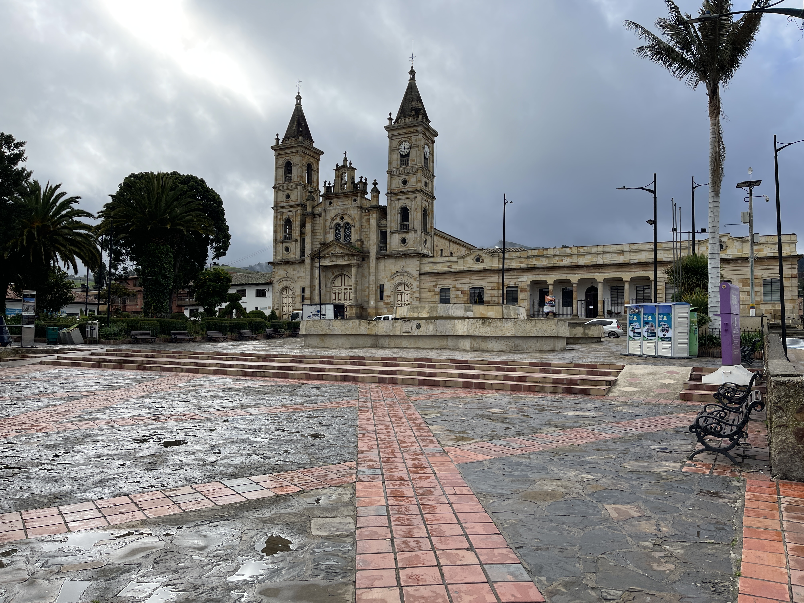

<details><summary>### :camera:**23/IMG_0606.JPG**</summary><sub> `Exif version` 0232 `OS version` 17.5.1 `Date` 2024:05:31 07:52:24 `Aperture` Not known `Brightness` 10.389149560117302 `Color space` 65535 `Compression` 6`Exposure mode` 0 `Exposure time` 0.00018601190476190475 `Focal length` 5.1 `Lens model` iPhone 12 Pro Max back triple camera 5.1mm f/1.6 `Lens specification` (1.5399999618512084, 7.5, 1.6, 2.4) `Orientation` 1 `Scene type` Not known `f number` 1.6 `White balance` 0 `Sensing method` 2 `Shutter speed` 12.392409761529182</sub><sub>`Coordinates & altitude` (5.215963888888889, -73.59671944444445, 2723.524625267666)</sub><sub> :globe_with_meridians:`Location over` [Google Maps](http://maps.google.com/maps?q=5.215963888888889,-73.59671944444445) or [Openstreet Map](https://www.openstreetmap.org/query?lat=5.215963888888889&lon=-73.59671944444445)</sub></details>
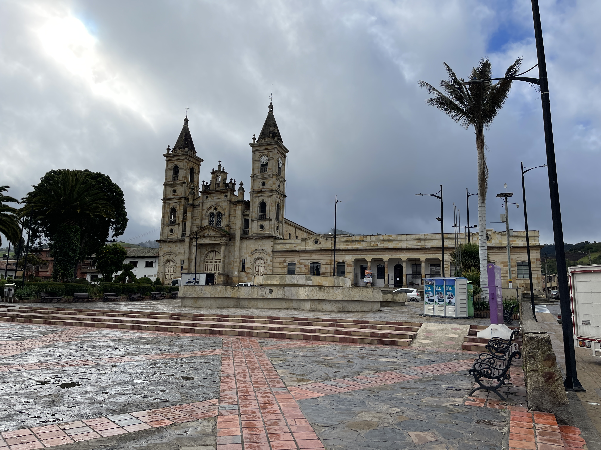

<details><summary>### :camera:**23/IMG_0607.JPG**</summary><sub> `Exif version` 0232 `OS version` 17.5.1 `Date` 2024:05:31 09:34:41 `Aperture` Not known `Brightness` 8.737505860290671 `Color space` 65535 `Compression` 6`Exposure mode` 0 `Exposure time` 0.0006949270326615705 `Focal length` 5.1 `Lens model` iPhone 12 Pro Max back triple camera 5.1mm f/1.6 `Lens specification` (1.5399999618512084, 7.5, 1.6, 2.4) `Orientation` 6 `Scene type` Not known `f number` 1.6 `White balance` 0 `Sensing method` 2 `Shutter speed` 10.490699404761905</sub><sub>`Coordinates & altitude` (5.2159361111111116, -73.59203333333333, 2748.7224137931034)</sub><sub> :globe_with_meridians:`Location over` [Google Maps](http://maps.google.com/maps?q=5.2159361111111116,-73.59203333333333) or [Openstreet Map](https://www.openstreetmap.org/query?lat=5.2159361111111116&lon=-73.59203333333333)</sub></details>
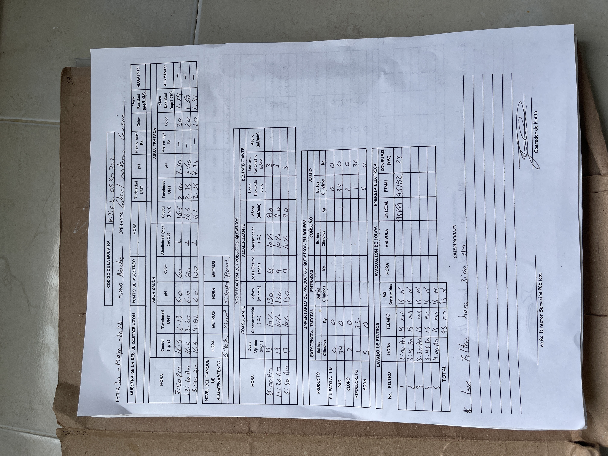

<details><summary>### :camera:**23/IMG_0608.JPG**</summary><sub> `Exif version` 0232 `OS version` 17.5.1 `Date` 2024:05:31 09:43:32 `Aperture` Not known `Brightness` 8.182584725149992 `Color space` 65535 `Compression` 6`Exposure mode` 0 `Exposure time` 0.0009372071227741331 `Focal length` 5.1 `Lens model` iPhone 12 Pro Max back triple camera 5.1mm f/1.6 `Lens specification` (1.5399999618512084, 7.5, 1.6, 2.4) `Orientation` 1 `Scene type` Not known `f number` 1.6 `White balance` 0 `Sensing method` 2 `Shutter speed` 10.05966332836139</sub><sub>`Coordinates & altitude` (5.217469444444444, -73.58734166666666, 2812.6515748031497)</sub><sub> :globe_with_meridians:`Location over` [Google Maps](http://maps.google.com/maps?q=5.217469444444444,-73.58734166666666) or [Openstreet Map](https://www.openstreetmap.org/query?lat=5.217469444444444&lon=-73.58734166666666)</sub></details>
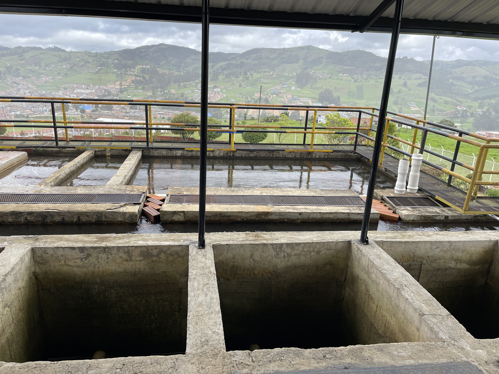

<details><summary>### :camera:**23/IMG_0609.JPG**</summary><sub> `Exif version` 0232 `OS version` 17.5.1 `Date` 2024:05:31 09:43:34 `Aperture` Not known `Brightness` 7.813615014758572 `Color space` 65535 `Compression` 6`Exposure mode` 0 `Exposure time` 0.0010395010395010396 `Focal length` 5.1 `Lens model` iPhone 12 Pro Max back triple camera 5.1mm f/1.6 `Lens specification` (1.5399999618512084, 7.5, 1.6, 2.4) `Orientation` 1 `Scene type` Not known `f number` 1.6 `White balance` 0 `Sensing method` 2 `Shutter speed` 9.909200759537372</sub><sub>`Coordinates & altitude` (5.217477777777778, -73.58730277777778, 2810.668907563025)</sub><sub> :globe_with_meridians:`Location over` [Google Maps](http://maps.google.com/maps?q=5.217477777777778,-73.58730277777778) or [Openstreet Map](https://www.openstreetmap.org/query?lat=5.217477777777778&lon=-73.58730277777778)</sub></details>
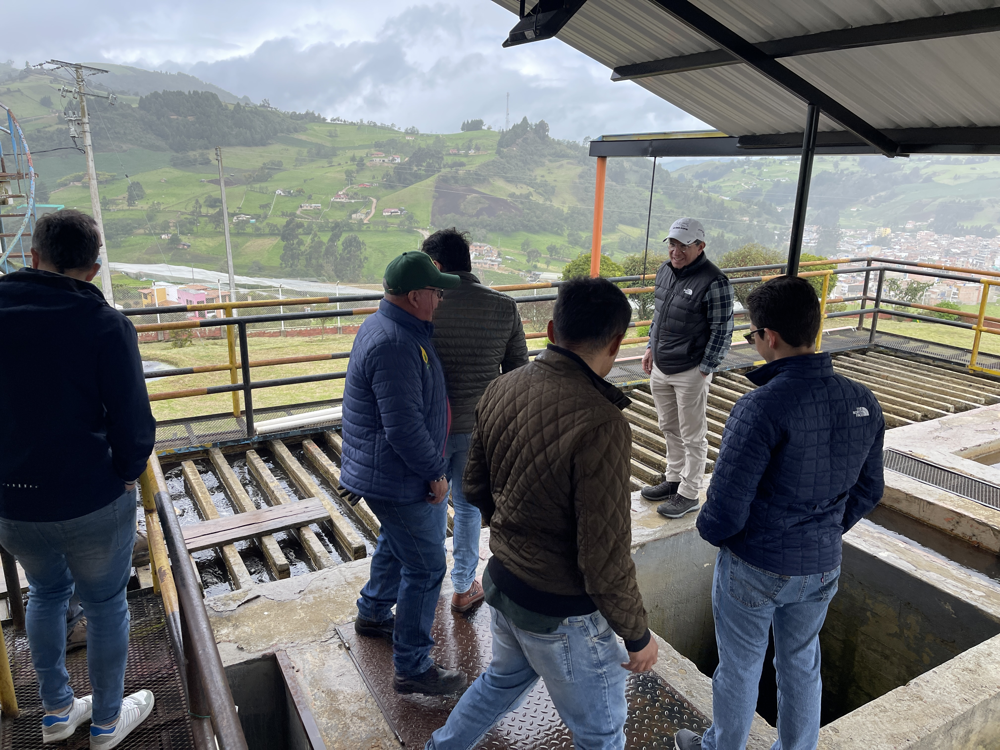

<details><summary>### :camera:**23/IMG_0610.JPG**</summary><sub> `Exif version` 0232 `OS version` 17.5.1 `Date` 2024:05:31 09:43:42 `Aperture` Not known `Brightness` 4.790416734230583 `Color space` 65535 `Compression` 6`Exposure mode` 0 `Exposure time` 0.008264462809917356 `Focal length` 5.1 `Lens model` iPhone 12 Pro Max back triple camera 5.1mm f/1.6 `Lens specification` (1.5399999618512084, 7.5, 1.6, 2.4) `Orientation` 6 `Scene type` Not known `f number` 1.6 `White balance` 0 `Sensing method` 2 `Shutter speed` 6.922439780250739</sub><sub>`Coordinates & altitude` (5.217475, -73.58726388888888, 2817.056603773585)</sub><sub> :globe_with_meridians:`Location over` [Google Maps](http://maps.google.com/maps?q=5.217475,-73.58726388888888) or [Openstreet Map](https://www.openstreetmap.org/query?lat=5.217475&lon=-73.58726388888888)</sub></details>
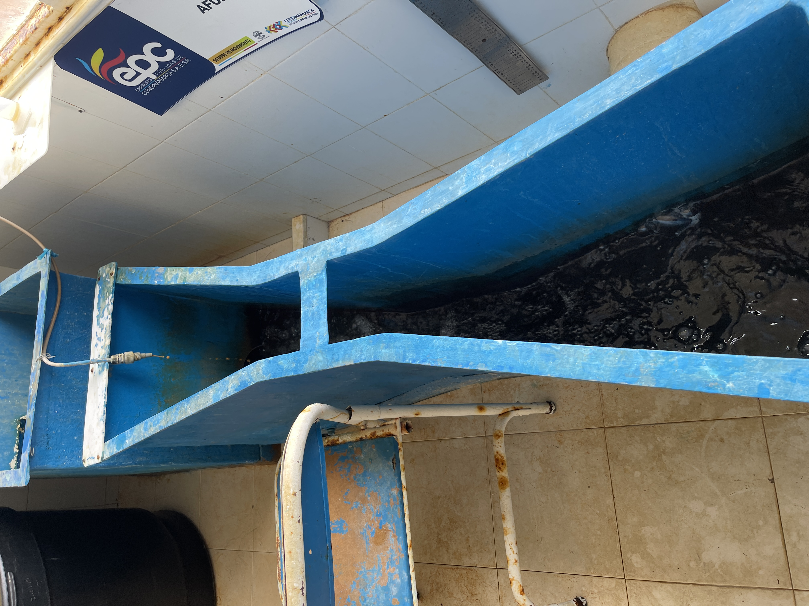

<details><summary>### :camera:**23/IMG_0611.JPG**</summary><sub> `Exif version` 0232 `OS version` 17.5.1 `Date` 2024:05:31 09:43:45 `Aperture` Not known `Brightness` 4.654610550927956 `Color space` 65535 `Compression` 6`Exposure mode` 0 `Exposure time` 0.008264462809917356 `Focal length` 5.1 `Lens model` iPhone 12 Pro Max back triple camera 5.1mm f/1.6 `Lens specification` (1.5399999618512084, 7.5, 1.6, 2.4) `Orientation` 6 `Scene type` Not known `f number` 1.6 `White balance` 0 `Sensing method` 2 `Shutter speed` 6.923840453755375</sub><sub>`Coordinates & altitude` (5.217477777777778, -73.58727222222221, 2817.795620437956)</sub><sub> :globe_with_meridians:`Location over` [Google Maps](http://maps.google.com/maps?q=5.217477777777778,-73.58727222222221) or [Openstreet Map](https://www.openstreetmap.org/query?lat=5.217477777777778&lon=-73.58727222222221)</sub></details>


<details><summary>### :camera:**23/IMG_0612.JPG**</summary><sub> `Exif version` 0232 `OS version` 17.5.1 `Date` 2024:05:31 09:43:47 `Aperture` Not known `Brightness` 5.465977868802348 `Color space` 65535 `Compression` 6`Exposure mode` 0 `Exposure time` 0.008 `Focal length` 5.1 `Lens model` iPhone 12 Pro Max back triple camera 5.1mm f/1.6 `Lens specification` (1.5399999618512084, 7.5, 1.6, 2.4) `Orientation` 1 `Scene type` Not known `f number` 1.6 `White balance` 0 `Sensing method` 2 `Shutter speed` 6.962182044241827</sub><sub>`Coordinates & altitude` (5.217477777777778, -73.58726388888888, 2817.6100746268658)</sub><sub> :globe_with_meridians:`Location over` [Google Maps](http://maps.google.com/maps?q=5.217477777777778,-73.58726388888888) or [Openstreet Map](https://www.openstreetmap.org/query?lat=5.217477777777778&lon=-73.58726388888888)</sub></details>
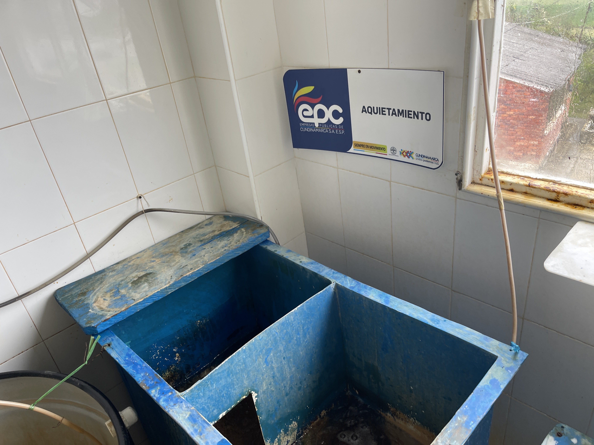

<details><summary>### :camera:**23/IMG_0613.JPG**</summary><sub> `Exif version` 0232 `OS version` 17.5.1 `Date` 2024:05:31 09:43:50 `Aperture` Not known `Brightness` 6.046850304809212 `Color space` 65535 `Compression` 6`Exposure mode` 0 `Exposure time` 0.00546448087431694 `Focal length` 5.1 `Lens model` iPhone 12 Pro Max back triple camera 5.1mm f/1.6 `Lens specification` (1.5399999618512084, 7.5, 1.6, 2.4) `Orientation` 6 `Scene type` Not known `f number` 1.6 `White balance` 0 `Sensing method` 2 `Shutter speed` 7.515298827566485</sub><sub>`Coordinates & altitude` (5.217477777777778, -73.58726388888888, 2817.686730506156)</sub><sub> :globe_with_meridians:`Location over` [Google Maps](http://maps.google.com/maps?q=5.217477777777778,-73.58726388888888) or [Openstreet Map](https://www.openstreetmap.org/query?lat=5.217477777777778&lon=-73.58726388888888)</sub></details>


<details><summary>### :camera:**23/IMG_0614.JPG**</summary><sub> `Exif version` 0232 `OS version` 17.5.1 `Date` 2024:05:31 09:43:52 `Aperture` Not known `Brightness` 5.856762629005975 `Color space` 65535 `Compression` 6`Exposure mode` 0 `Exposure time` 0.006756756756756757 `Focal length` 5.1 `Lens model` iPhone 12 Pro Max back triple camera 5.1mm f/1.6 `Lens specification` (1.5399999618512084, 7.5, 1.6, 2.4) `Orientation` 6 `Scene type` Not known `f number` 1.6 `White balance` 0 `Sensing method` 2 `Shutter speed` 7.210469374167777</sub><sub>`Coordinates & altitude` (5.217477777777778, -73.58726388888888, 2817.96383363472)</sub><sub> :globe_with_meridians:`Location over` [Google Maps](http://maps.google.com/maps?q=5.217477777777778,-73.58726388888888) or [Openstreet Map](https://www.openstreetmap.org/query?lat=5.217477777777778&lon=-73.58726388888888)</sub></details>
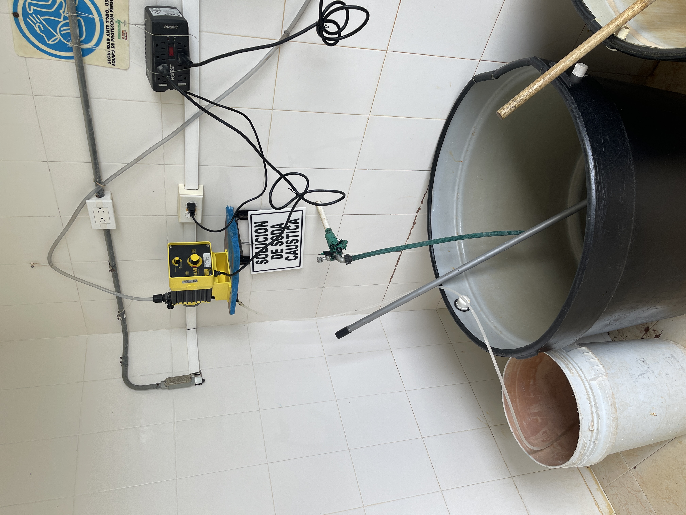

<details><summary>### :camera:**23/IMG_0615.JPG**</summary><sub> `Exif version` 0232 `OS version` 17.5.1 `Date` 2024:05:31 09:43:58 `Aperture` Not known `Brightness` 5.052729000950523 `Color space` 65535 `Compression` 6`Exposure mode` 0 `Exposure time` 0.008264462809917356 `Focal length` 5.1 `Lens model` iPhone 12 Pro Max back triple camera 5.1mm f/1.6 `Lens specification` (1.5399999618512084, 7.5, 1.6, 2.4) `Orientation` 6 `Scene type` Not known `f number` 1.6 `White balance` 0 `Sensing method` 2 `Shutter speed` 6.923840453755375</sub><sub>`Coordinates & altitude` (5.217483333333333, -73.58725, 2819.6532846715327)</sub><sub> :globe_with_meridians:`Location over` [Google Maps](http://maps.google.com/maps?q=5.217483333333333,-73.58725) or [Openstreet Map](https://www.openstreetmap.org/query?lat=5.217483333333333&lon=-73.58725)</sub></details>
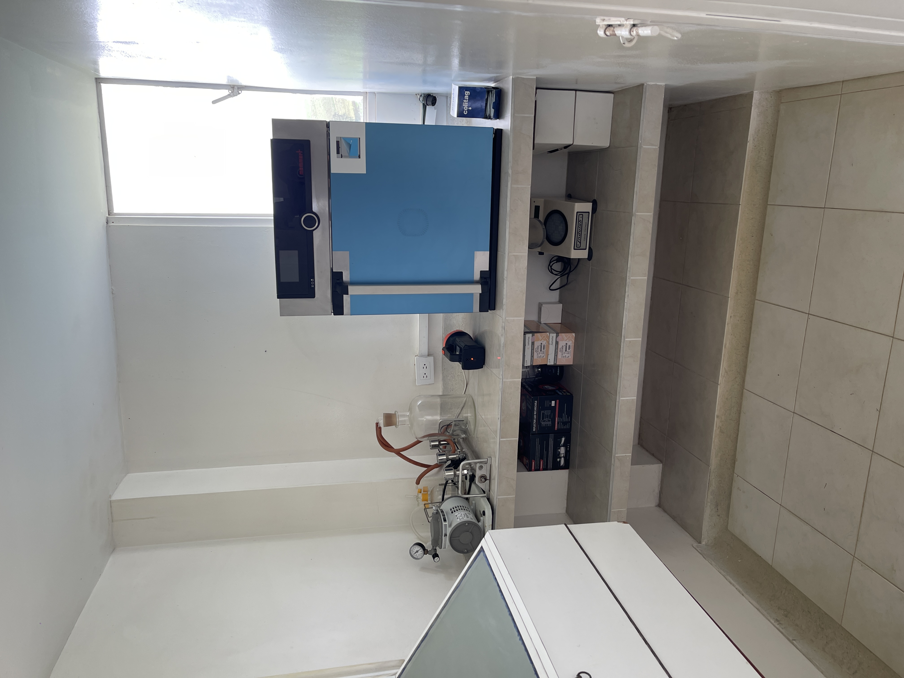

<details><summary>### :camera:**23/IMG_0616.JPG**</summary><sub> `Exif version` 0232 `OS version` 17.5.1 `Date` 2024:05:31 09:44:01 `Aperture` Not known `Brightness` 6.717534410532616 `Color space` 65535 `Compression` 6`Exposure mode` 0 `Exposure time` 0.0024752475247524753 `Focal length` 5.1 `Lens model` iPhone 12 Pro Max back triple camera 5.1mm f/1.6 `Lens specification` (1.5399999618512084, 7.5, 1.6, 2.4) `Orientation` 1 `Scene type` Not known `f number` 1.6 `White balance` 0 `Sensing method` 2 `Shutter speed` 8.659522049765952</sub><sub>`Coordinates & altitude` (5.217488888888889, -73.58725555555556, 2819.4455205811137)</sub><sub> :globe_with_meridians:`Location over` [Google Maps](http://maps.google.com/maps?q=5.217488888888889,-73.58725555555556) or [Openstreet Map](https://www.openstreetmap.org/query?lat=5.217488888888889&lon=-73.58725555555556)</sub></details>
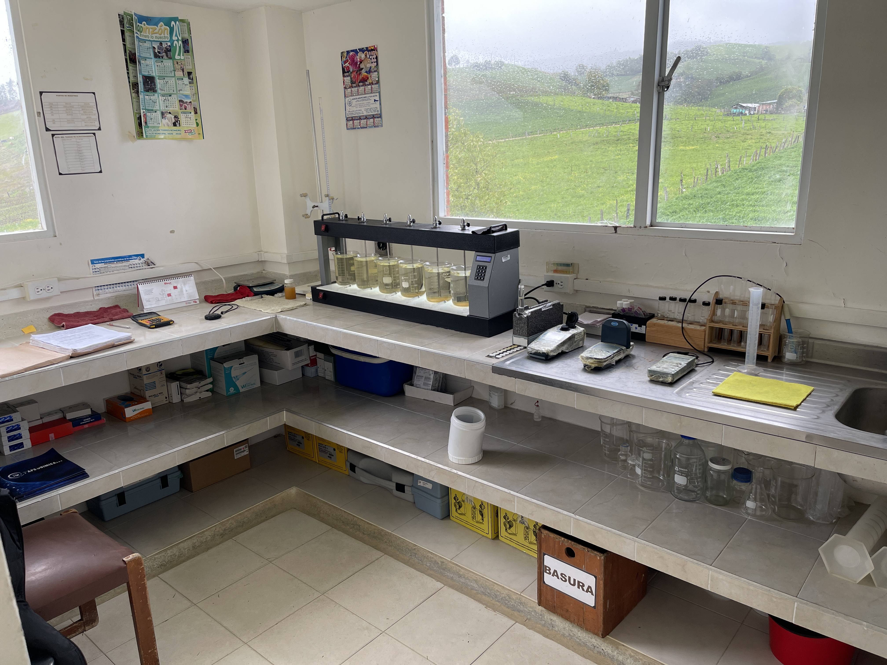

<details><summary>### :camera:**23/IMG_0617.JPG**</summary><sub> `Exif version` 0232 `OS version` 17.5.1 `Date` 2024:05:31 09:44:06 `Aperture` Not known `Brightness` 6.549521707137601 `Color space` 65535 `Compression` 6`Exposure mode` 0 `Exposure time` 0.0032679738562091504 `Focal length` 5.1 `Lens model` iPhone 12 Pro Max back triple camera 5.1mm f/1.6 `Lens specification` (1.5399999618512084, 7.5, 1.6, 2.4) `Orientation` 1 `Scene type` Not known `f number` 1.6 `White balance` 0 `Sensing method` 2 `Shutter speed` 8.258259501531837</sub><sub>`Coordinates & altitude` (5.217497222222223, -73.58725555555556, 2813.011851851852)</sub><sub> :globe_with_meridians:`Location over` [Google Maps](http://maps.google.com/maps?q=5.217497222222223,-73.58725555555556) or [Openstreet Map](https://www.openstreetmap.org/query?lat=5.217497222222223&lon=-73.58725555555556)</sub></details>
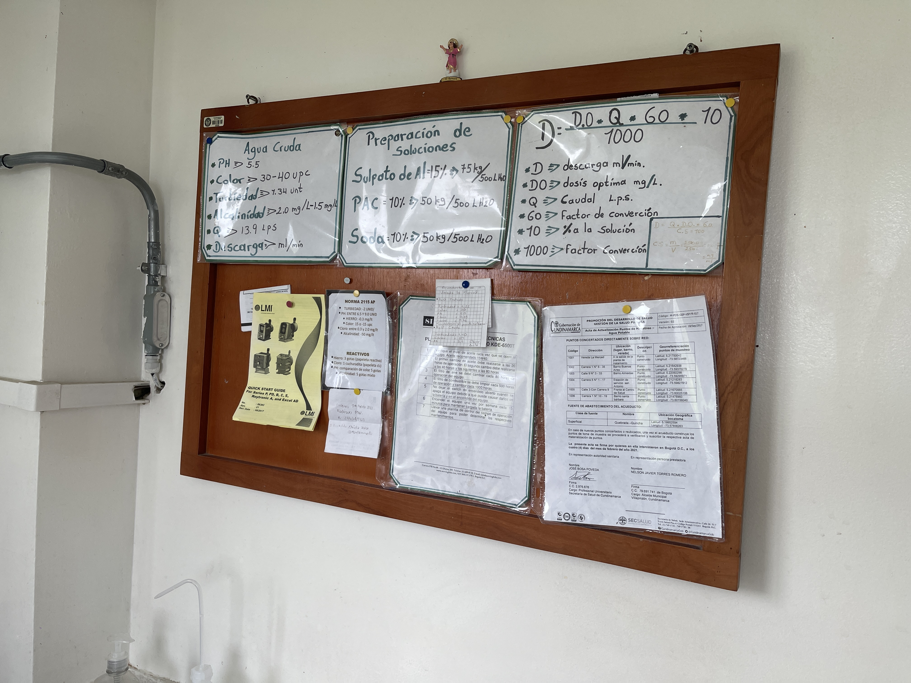

<details><summary>### :camera:**23/IMG_0618.JPG**</summary><sub> `Exif version` 0232 `OS version` 17.5.1 `Date` 2024:05:31 09:44:09 `Aperture` Not known `Brightness` 6.767172093794017 `Color space` 65535 `Compression` 6`Exposure mode` 0 `Exposure time` 0.0027624309392265192 `Focal length` 5.1 `Lens model` iPhone 12 Pro Max back triple camera 5.1mm f/1.6 `Lens specification` (1.5399999618512084, 7.5, 1.6, 2.4) `Orientation` 6 `Scene type` Not known `f number` 1.6 `White balance` 0 `Sensing method` 2 `Shutter speed` 8.497983131646498</sub><sub>`Coordinates & altitude` (5.217505555555555, -73.58725, 2813.0337078651687)</sub><sub> :globe_with_meridians:`Location over` [Google Maps](http://maps.google.com/maps?q=5.217505555555555,-73.58725) or [Openstreet Map](https://www.openstreetmap.org/query?lat=5.217505555555555&lon=-73.58725)</sub></details>
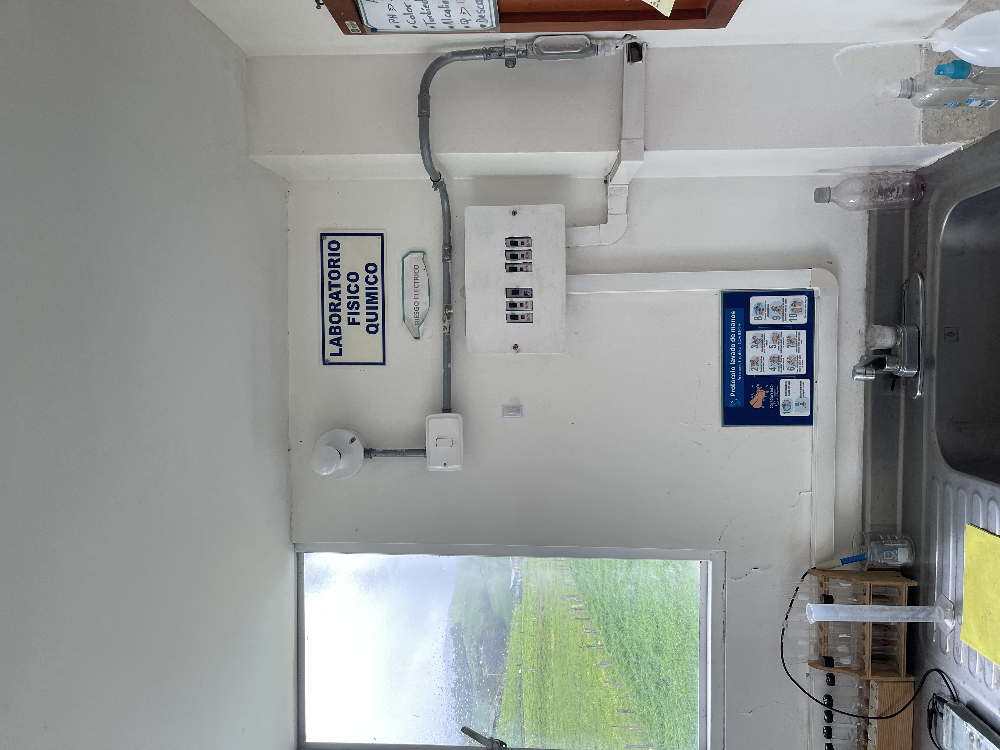

<details><summary>### :camera:**23/IMG_0619.JPG**</summary><sub> `Exif version` 0232 `OS version` 17.5.1 `Date` 2024:05:31 09:44:15 `Aperture` Not known `Brightness` 7.0516469936506585 `Color space` 65535 `Compression` 6`Exposure mode` 0 `Exposure time` 0.001937984496124031 `Focal length` 5.1 `Lens model` iPhone 12 Pro Max back triple camera 5.1mm f/1.6 `Lens specification` (1.5399999618512084, 7.5, 1.6, 2.4) `Orientation` 6 `Scene type` Not known `f number` 1.6 `White balance` 0 `Sensing method` 2 `Shutter speed` 9.011215718379042</sub><sub>`Coordinates & altitude` (5.2174805555555555, -73.58728055555555, 2814.8861003861)</sub><sub> :globe_with_meridians:`Location over` [Google Maps](http://maps.google.com/maps?q=5.2174805555555555,-73.58728055555555) or [Openstreet Map](https://www.openstreetmap.org/query?lat=5.2174805555555555&lon=-73.58728055555555)</sub></details>


<details><summary>### :camera:**23/IMG_0620.JPG**</summary><sub> `Exif version` 0232 `OS version` 17.5.1 `Date` 2024:05:31 09:44:18 `Aperture` Not known `Brightness` 7.240465567410281 `Color space` 65535 `Compression` 6`Exposure mode` 0 `Exposure time` 0.001652892561983471 `Focal length` 5.1 `Lens model` iPhone 12 Pro Max back triple camera 5.1mm f/1.6 `Lens specification` (1.5399999618512084, 7.5, 1.6, 2.4) `Orientation` 1 `Scene type` Not known `f number` 1.6 `White balance` 0 `Sensing method` 2 `Shutter speed` 9.240697556524385</sub><sub>`Coordinates & altitude` (5.217477777777778, -73.58728888888888, 2814.4650698602795)</sub><sub> :globe_with_meridians:`Location over` [Google Maps](http://maps.google.com/maps?q=5.217477777777778,-73.58728888888888) or [Openstreet Map](https://www.openstreetmap.org/query?lat=5.217477777777778&lon=-73.58728888888888)</sub></details>


<details><summary>### :camera:**23/IMG_0621.JPG**</summary><sub> `Exif version` 0232 `OS version` 17.5.1 `Date` 2024:05:31 09:44:33 `Aperture` Not known `Brightness` 7.879453774917596 `Color space` 65535 `Compression` 6`Exposure mode` 0 `Exposure time` 0.0010834236186348862 `Focal length` 5.1 `Lens model` iPhone 12 Pro Max back triple camera 5.1mm f/1.6 `Lens specification` (1.5399999618512084, 7.5, 1.6, 2.4) `Orientation` 6 `Scene type` Not known `f number` 1.6 `White balance` 0 `Sensing method` 2 `Shutter speed` 9.84941953107216</sub><sub>`Coordinates & altitude` (5.2174611111111115, -73.58727222222221, 2814.6704288939054)</sub><sub> :globe_with_meridians:`Location over` [Google Maps](http://maps.google.com/maps?q=5.2174611111111115,-73.58727222222221) or [Openstreet Map](https://www.openstreetmap.org/query?lat=5.2174611111111115&lon=-73.58727222222221)</sub></details>


<details><summary>### :camera:**23/IMG_0622.JPG**</summary><sub> `Exif version` 0232 `OS version` 17.5.1 `Date` 2024:05:31 09:44:39 `Aperture` Not known `Brightness` 7.195143706640238 `Color space` 65535 `Compression` 6`Exposure mode` 0 `Exposure time` 0.001610305958132045 `Focal length` 5.1 `Lens model` iPhone 12 Pro Max back triple camera 5.1mm f/1.6 `Lens specification` (1.5399999618512084, 7.5, 1.6, 2.4) `Orientation` 6 `Scene type` Not known `f number` 1.6 `White balance` 0 `Sensing method` 2 `Shutter speed` 9.27872361124623</sub><sub>`Coordinates & altitude` (5.217436111111112, -73.58725, 2815.051724137931)</sub><sub> :globe_with_meridians:`Location over` [Google Maps](http://maps.google.com/maps?q=5.217436111111112,-73.58725) or [Openstreet Map](https://www.openstreetmap.org/query?lat=5.217436111111112&lon=-73.58725)</sub></details>


<details><summary>### :camera:**23/IMG_0623.JPG**</summary><sub> `Exif version` 0232 `OS version` 17.5.1 `Date` 2024:05:31 09:45:00 `Aperture` Not known `Brightness` 5.407450388766392 `Color space` 65535 `Compression` 6`Exposure mode` 0 `Exposure time` 0.0078125 `Focal length` 5.1 `Lens model` iPhone 12 Pro Max back triple camera 5.1mm f/1.6 `Lens specification` (1.5399999618512084, 7.5, 1.6, 2.4) `Orientation` 6 `Scene type` Not known `f number` 1.6 `White balance` 0 `Sensing method` 2 `Shutter speed` 6.996771978021978</sub><sub>`Coordinates & altitude` (5.217466666666667, -73.58729444444444, 2815.773519163763)</sub><sub> :globe_with_meridians:`Location over` [Google Maps](http://maps.google.com/maps?q=5.217466666666667,-73.58729444444444) or [Openstreet Map](https://www.openstreetmap.org/query?lat=5.217466666666667&lon=-73.58729444444444)</sub></details>


<details><summary>### :camera:**23/IMG_0624.JPG**</summary><sub> `Exif version` 0232 `OS version` 17.5.1 `Date` 2024:05:31 09:45:06 `Aperture` Not known `Brightness` 5.885772392170155 `Color space` 65535 `Compression` 6`Exposure mode` 0 `Exposure time` 0.005076142131979695 `Focal length` 5.1 `Lens model` iPhone 12 Pro Max back triple camera 5.1mm f/1.6 `Lens specification` (1.5399999618512084, 7.5, 1.6, 2.4) `Orientation` 6 `Scene type` Not known `f number` 1.6 `White balance` 0 `Sensing method` 2 `Shutter speed` 7.618969192017051</sub><sub>`Coordinates & altitude` (5.217494444444444, -73.58729444444444, 2815.5013192612137)</sub><sub> :globe_with_meridians:`Location over` [Google Maps](http://maps.google.com/maps?q=5.217494444444444,-73.58729444444444) or [Openstreet Map](https://www.openstreetmap.org/query?lat=5.217494444444444&lon=-73.58729444444444)</sub></details>


<details><summary>### :camera:**23/IMG_0625.JPG**</summary><sub> `Exif version` 0232 `OS version` 17.5.1 `Date` 2024:05:31 09:45:15 `Aperture` Not known `Brightness` 7.579683402932893 `Color space` 65535 `Compression` 6`Exposure mode` 0 `Exposure time` 0.0013245033112582781 `Focal length` 5.1 `Lens model` iPhone 12 Pro Max back triple camera 5.1mm f/1.6 `Lens specification` (1.5399999618512084, 7.5, 1.6, 2.4) `Orientation` 6 `Scene type` Not known `f number` 1.6 `White balance` 0 `Sensing method` 2 `Shutter speed` 9.559791917782148</sub><sub>`Coordinates & altitude` (5.217508333333334, -73.58731944444445, 2816.7373696872496)</sub><sub> :globe_with_meridians:`Location over` [Google Maps](http://maps.google.com/maps?q=5.217508333333334,-73.58731944444445) or [Openstreet Map](https://www.openstreetmap.org/query?lat=5.217508333333334&lon=-73.58731944444445)</sub></details>


<details><summary>### :camera:**23/IMG_0626.JPG**</summary><sub> `Exif version` 0232 `OS version` 17.5.1 `Date` 2024:05:31 09:45:36 `Aperture` Not known `Brightness` 7.896298882681564 `Color space` 65535 `Compression` 6`Exposure mode` 0 `Exposure time` 0.0011185682326621924 `Focal length` 5.1 `Lens model` iPhone 12 Pro Max back triple camera 5.1mm f/1.6 `Lens specification` (1.5399999618512084, 7.5, 1.6, 2.4) `Orientation` 6 `Scene type` Not known `f number` 1.6 `White balance` 0 `Sensing method` 2 `Shutter speed` 9.80486409155937</sub><sub>`Coordinates & altitude` (5.217494444444444, -73.58731944444445, 2815.3085339168492)</sub><sub> :globe_with_meridians:`Location over` [Google Maps](http://maps.google.com/maps?q=5.217494444444444,-73.58731944444445) or [Openstreet Map](https://www.openstreetmap.org/query?lat=5.217494444444444&lon=-73.58731944444445)</sub></details>


<details><summary>### :camera:**23/IMG_0627.JPG**</summary><sub> `Exif version` 0232 `OS version` 17.5.1 `Date` 2024:05:31 09:59:48 `Aperture` Not known `Brightness` 9.126676841513374 `Color space` 65535 `Compression` 6`Exposure mode` 0 `Exposure time` 0.0004710315591144607 `Focal length` 5.1 `Lens model` iPhone 12 Pro Max back triple camera 5.1mm f/1.6 `Lens specification` (1.5399999618512084, 7.5, 1.6, 2.4) `Orientation` 6 `Scene type` Not known `f number` 1.6 `White balance` 0 `Sensing method` 2 `Shutter speed` 11.051985329293574</sub><sub>`Coordinates & altitude` (5.217391666666667, -73.58732777777777, 2809.1613445378152)</sub><sub> :globe_with_meridians:`Location over` [Google Maps](http://maps.google.com/maps?q=5.217391666666667,-73.58732777777777) or [Openstreet Map](https://www.openstreetmap.org/query?lat=5.217391666666667&lon=-73.58732777777777)</sub></details>


<details><summary>### :camera:**23/IMG_0628.JPG**</summary><sub> `Exif version` 0232 `OS version` 17.5.1 `Date` 2024:05:31 09:59:51 `Aperture` Not known `Brightness` 10.305210739030024 `Color space` 65535 `Compression` 6`Exposure mode` 0 `Exposure time` 0.0001950078003120125 `Focal length` 5.1 `Lens model` iPhone 12 Pro Max back triple camera 5.1mm f/1.6 `Lens specification` (1.5399999618512084, 7.5, 1.6, 2.4) `Orientation` 6 `Scene type` Not known `f number` 1.6 `White balance` 0 `Sensing method` 2 `Shutter speed` 12.324238250989843</sub><sub>`Coordinates & altitude` (5.217422222222222, -73.5873111111111, 2810.891077636153)</sub><sub> :globe_with_meridians:`Location over` [Google Maps](http://maps.google.com/maps?q=5.217422222222222,-73.5873111111111) or [Openstreet Map](https://www.openstreetmap.org/query?lat=5.217422222222222&lon=-73.5873111111111)</sub></details>


<details><summary>### :camera:**23/IMG_0629.JPG**</summary><sub> `Exif version` 0232 `OS version` 17.5.1 `Date` 2024:05:31 09:59:54 `Aperture` Not known `Brightness` 8.465085680273175 `Color space` 65535 `Compression` 6`Exposure mode` 0 `Exposure time` 0.0006868131868131869 `Focal length` 5.1 `Lens model` iPhone 12 Pro Max back triple camera 5.1mm f/1.6 `Lens specification` (1.5399999618512084, 7.5, 1.6, 2.4) `Orientation` 6 `Scene type` Not known `f number` 1.6 `White balance` 0 `Sensing method` 2 `Shutter speed` 10.507402279262967</sub><sub>`Coordinates & altitude` (5.217427777777778, -73.58729444444444, 2811.8439597315437)</sub><sub> :globe_with_meridians:`Location over` [Google Maps](http://maps.google.com/maps?q=5.217427777777778,-73.58729444444444) or [Openstreet Map](https://www.openstreetmap.org/query?lat=5.217427777777778&lon=-73.58729444444444)</sub></details>
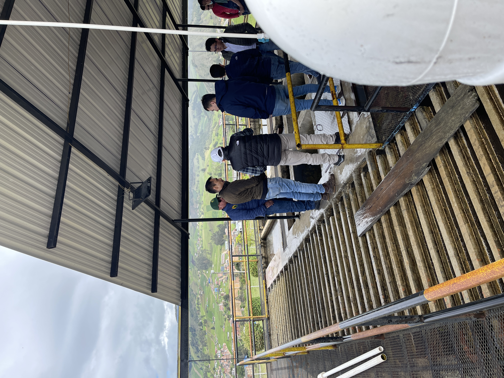

<details><summary>### :camera:**23/IMG_0630.JPG**</summary><sub> `Exif version` 0232 `OS version` 17.5.1 `Date` 2024:05:31 10:00:02 `Aperture` Not known `Brightness` 8.285889476508009 `Color space` 65535 `Compression` 6`Exposure mode` 0 `Exposure time` 0.0007042253521126761 `Focal length` 5.1 `Lens model` iPhone 12 Pro Max back triple camera 5.1mm f/1.6 `Lens specification` (1.5399999618512084, 7.5, 1.6, 2.4) `Orientation` 6 `Scene type` Not known `f number` 1.6 `White balance` 0 `Sensing method` 2 `Shutter speed` 10.472136953955136</sub><sub>`Coordinates & altitude` (5.217430555555556, -73.58728888888888, 2813.645718232044)</sub><sub> :globe_with_meridians:`Location over` [Google Maps](http://maps.google.com/maps?q=5.217430555555556,-73.58728888888888) or [Openstreet Map](https://www.openstreetmap.org/query?lat=5.217430555555556&lon=-73.58728888888888)</sub></details>


<details><summary>### :camera:**23/IMG_0631.JPG**</summary><sub> `Exif version` 0232 `OS version` 17.5.1 `Date` 2024:05:31 10:00:47 `Aperture` Not known `Brightness` 8.511352220212979 `Color space` 65535 `Compression` 6`Exposure mode` 0 `Exposure time` 0.0006868131868131869 `Focal length` 5.1 `Lens model` iPhone 12 Pro Max back triple camera 5.1mm f/1.6 `Lens specification` (1.5399999618512084, 7.5, 1.6, 2.4) `Orientation` 6 `Scene type` Not known `f number` 1.6 `White balance` 0 `Sensing method` 2 `Shutter speed` 10.507402279262967</sub><sub>`Coordinates & altitude` (5.217502777777778, -73.58720277777778, 2812.014367816092)</sub><sub> :globe_with_meridians:`Location over` [Google Maps](http://maps.google.com/maps?q=5.217502777777778,-73.58720277777778) or [Openstreet Map](https://www.openstreetmap.org/query?lat=5.217502777777778&lon=-73.58720277777778)</sub></details>


<details><summary>### :camera:**23/IMG_0632.JPG**</summary><sub> `Exif version` 0232 `OS version` 17.5.1 `Date` 2024:05:31 10:00:57 `Aperture` Not known `Brightness` 10.541131225963793 `Color space` 65535 `Compression` 6`Exposure mode` 0 `Exposure time` 0.00018601190476190475 `Focal length` 5.1 `Lens model` iPhone 12 Pro Max back triple camera 5.1mm f/1.6 `Lens specification` (1.5399999618512084, 7.5, 1.6, 2.4) `Orientation` 1 `Scene type` Not known `f number` 1.6 `White balance` 0 `Sensing method` 2 `Shutter speed` 12.392409761529182</sub><sub>`Coordinates & altitude` (5.217552777777778, -73.58728888888888, 2818.7694974003466)</sub><sub> :globe_with_meridians:`Location over` [Google Maps](http://maps.google.com/maps?q=5.217552777777778,-73.58728888888888) or [Openstreet Map](https://www.openstreetmap.org/query?lat=5.217552777777778&lon=-73.58728888888888)</sub></details>
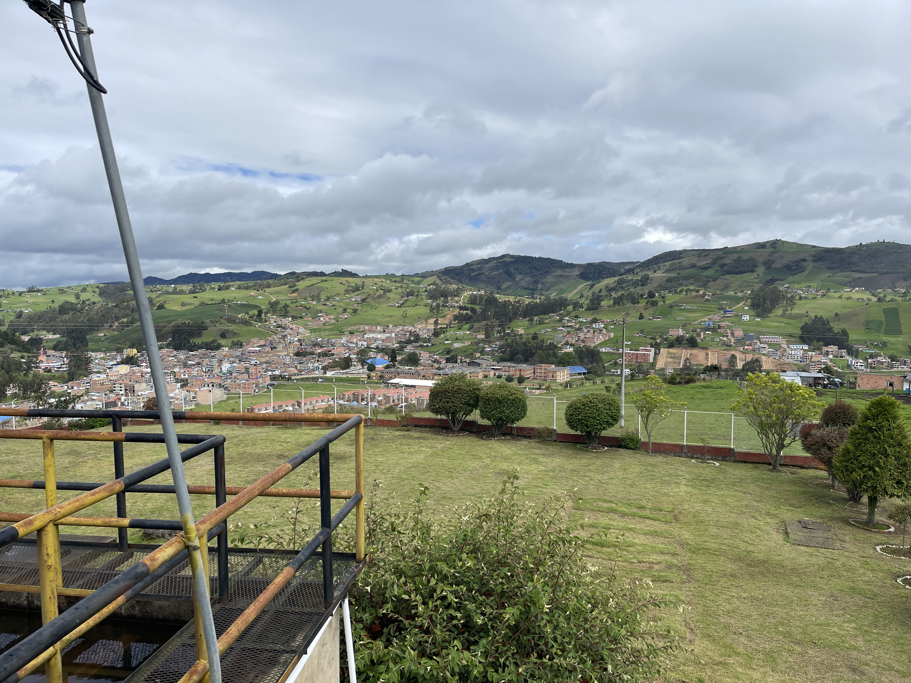

<details><summary>### :camera:**23/IMG_0633.JPG**</summary><sub> `Exif version` 0232 `OS version` 17.5.1 `Date` 2024:05:31 10:00:59 `Aperture` Not known `Brightness` 10.496963635064656 `Color space` 65535 `Compression` 6`Exposure mode` 0 `Exposure time` 0.00018601190476190475 `Focal length` 5.1 `Lens model` iPhone 12 Pro Max back triple camera 5.1mm f/1.6 `Lens specification` (1.5399999618512084, 7.5, 1.6, 2.4) `Orientation` 1 `Scene type` Not known `f number` 1.6 `White balance` 0 `Sensing method` 2 `Shutter speed` 12.392409761529182</sub><sub>`Coordinates & altitude` (5.217552777777778, -73.58728888888888, 2818.5776031434184)</sub><sub> :globe_with_meridians:`Location over` [Google Maps](http://maps.google.com/maps?q=5.217552777777778,-73.58728888888888) or [Openstreet Map](https://www.openstreetmap.org/query?lat=5.217552777777778&lon=-73.58728888888888)</sub></details>
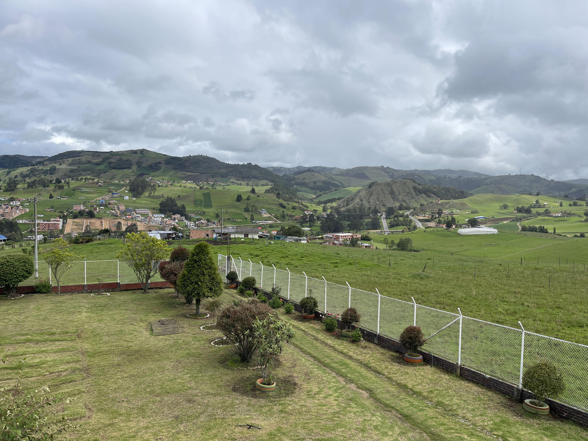

<details><summary>### :camera:**23/IMG_0634.JPG**</summary><sub> `Exif version` 0232 `OS version` 17.5.1 `Date` 2024:05:31 10:01:02 `Aperture` Not known `Brightness` 10.573836905384214 `Color space` 65535 `Compression` 6`Exposure mode` 0 `Exposure time` 0.00016 `Focal length` 5.1 `Lens model` iPhone 12 Pro Max back triple camera 5.1mm f/1.6 `Lens specification` (1.5399999618512084, 7.5, 1.6, 2.4) `Orientation` 1 `Scene type` Not known `f number` 1.6 `White balance` 0 `Sensing method` 2 `Shutter speed` 12.609640476860978</sub><sub>`Coordinates & altitude` (5.217555555555555, -73.58728888888888, 2819.4477211796248)</sub><sub> :globe_with_meridians:`Location over` [Google Maps](http://maps.google.com/maps?q=5.217555555555555,-73.58728888888888) or [Openstreet Map](https://www.openstreetmap.org/query?lat=5.217555555555555&lon=-73.58728888888888)</sub></details>
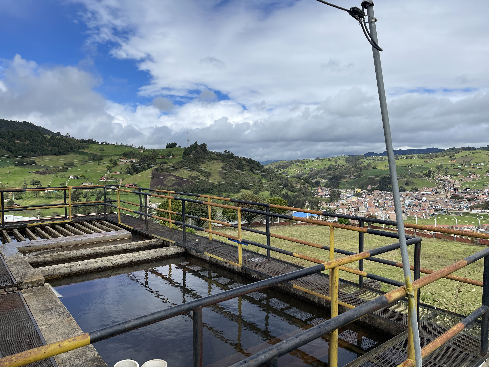

<details><summary>### :camera:**23/IMG_0635.JPG**</summary><sub> `Exif version` 0232 `OS version` 17.5.1 `Date` 2024:05:31 10:04:39 `Aperture` Not known `Brightness` 8.673800765429347 `Color space` 65535 `Compression` 6`Exposure mode` 0 `Exposure time` 0.0006261740763932373 `Focal length` 5.1 `Lens model` iPhone 12 Pro Max back triple camera 5.1mm f/1.6 `Lens specification` (1.5399999618512084, 7.5, 1.6, 2.4) `Orientation` 6 `Scene type` Not known `f number` 1.6 `White balance` 0 `Sensing method` 2 `Shutter speed` 10.641549725442342</sub><sub>`Coordinates & altitude` (5.219569444444445, -73.59397222222222, 2758.3403314917127)</sub><sub> :globe_with_meridians:`Location over` [Google Maps](http://maps.google.com/maps?q=5.219569444444445,-73.59397222222222) or [Openstreet Map](https://www.openstreetmap.org/query?lat=5.219569444444445&lon=-73.59397222222222)</sub></details>


<details><summary>### :camera:**23/IMG_0636.JPG**</summary><sub> `Exif version` 0232 `OS version` 17.5.1 `Date` 2024:05:31 10:04:47 `Aperture` Not known `Brightness` 7.363495059398246 `Color space` 65535 `Compression` 6`Exposure mode` 0 `Exposure time` 0.0014792899408284023 `Focal length` 5.1 `Lens model` iPhone 12 Pro Max back triple camera 5.1mm f/1.6 `Lens specification` (1.5399999618512084, 7.5, 1.6, 2.4) `Orientation` 6 `Scene type` Not known `f number` 1.6 `White balance` 0 `Sensing method` 2 `Shutter speed` 9.400187112618408</sub><sub>`Coordinates & altitude` (5.217569444444445, -73.58731944444445, 2819.8195456493786)</sub><sub> :globe_with_meridians:`Location over` [Google Maps](http://maps.google.com/maps?q=5.217569444444445,-73.58731944444445) or [Openstreet Map](https://www.openstreetmap.org/query?lat=5.217569444444445&lon=-73.58731944444445)</sub></details>


<details><summary>### :camera:**23/IMG_0637.JPG**</summary><sub> `Exif version` 0232 `OS version` 17.5.1 `Date` 2024:05:31 10:04:53 `Aperture` Not known `Brightness` 7.7484985905135435 `Color space` 65535 `Compression` 6`Exposure mode` 0 `Exposure time` 0.0011876484560570072 `Focal length` 5.1 `Lens model` iPhone 12 Pro Max back triple camera 5.1mm f/1.6 `Lens specification` (1.5399999618512084, 7.5, 1.6, 2.4) `Orientation` 1 `Scene type` Not known `f number` 1.6 `White balance` 0 `Sensing method` 2 `Shutter speed` 9.718464351005485</sub><sub>`Coordinates & altitude` (5.2175666666666665, -73.58731944444445, 2819.945767195767)</sub><sub> :globe_with_meridians:`Location over` [Google Maps](http://maps.google.com/maps?q=5.2175666666666665,-73.58731944444445) or [Openstreet Map](https://www.openstreetmap.org/query?lat=5.2175666666666665&lon=-73.58731944444445)</sub></details>


<details><summary>### :camera:**23/IMG_0638.JPG**</summary><sub> `Exif version` 0232 `OS version` 17.5.1 `Date` 2024:05:31 10:04:56 `Aperture` Not known `Brightness` 7.866650374714891 `Color space` 65535 `Compression` 6`Exposure mode` 0 `Exposure time` 0.0010582010582010583 `Focal length` 5.1 `Lens model` iPhone 12 Pro Max back triple camera 5.1mm f/1.6 `Lens specification` (1.5399999618512084, 7.5, 1.6, 2.4) `Orientation` 1 `Scene type` Not known `f number` 1.6 `White balance` 0 `Sensing method` 2 `Shutter speed` 9.884444658882563</sub><sub>`Coordinates & altitude` (5.217555555555555, -73.58732777777777, 2819.260707635009)</sub><sub> :globe_with_meridians:`Location over` [Google Maps](http://maps.google.com/maps?q=5.217555555555555,-73.58732777777777) or [Openstreet Map](https://www.openstreetmap.org/query?lat=5.217555555555555&lon=-73.58732777777777)</sub></details>
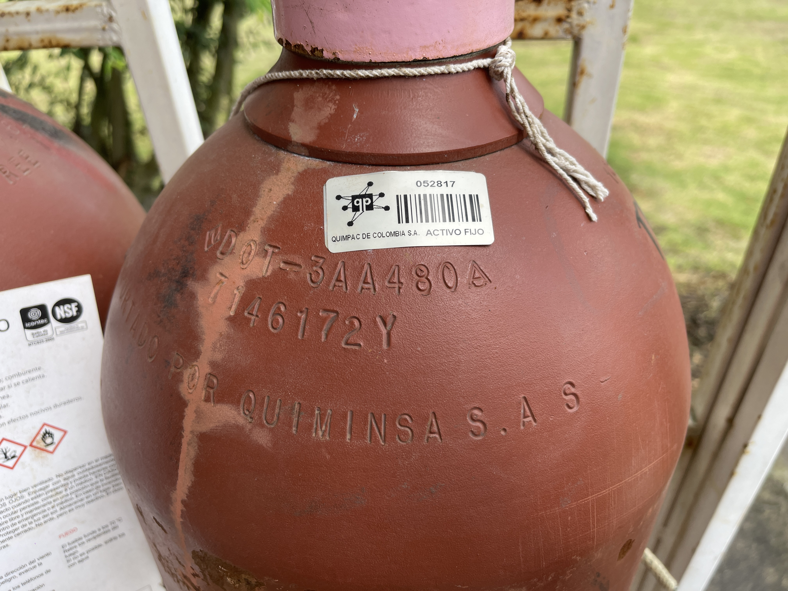

<details><summary>### :camera:**23/IMG_0639.JPG**</summary><sub> `Exif version` 0232 `OS version` 17.5.1 `Date` 2024:05:31 10:05:34 `Aperture` Not known `Brightness` 6.777167853160648 `Color space` 65535 `Compression` 6`Exposure mode` 0 `Exposure time` 0.0024449877750611247 `Focal length` 5.1 `Lens model` iPhone 12 Pro Max back triple camera 5.1mm f/1.6 `Lens specification` (1.5399999618512084, 7.5, 1.6, 2.4) `Orientation` 6 `Scene type` Not known `f number` 1.6 `White balance` 0 `Sensing method` 2 `Shutter speed` 8.674770189166603</sub><sub>`Coordinates & altitude` (5.2175666666666665, -73.58730277777778, 2815.405982905983)</sub><sub> :globe_with_meridians:`Location over` [Google Maps](http://maps.google.com/maps?q=5.2175666666666665,-73.58730277777778) or [Openstreet Map](https://www.openstreetmap.org/query?lat=5.2175666666666665&lon=-73.58730277777778)</sub></details>


<details><summary>### :camera:**23/IMG_0640.JPG**</summary><sub> `Exif version` 0232 `OS version` 17.5.1 `Date` 2024:05:31 10:05:57 `Aperture` Not known `Brightness` 8.152253735122816 `Color space` 65535 `Compression` 6`Exposure mode` 0 `Exposure time` 0.0008417508417508417 `Focal length` 5.1 `Lens model` iPhone 12 Pro Max back triple camera 5.1mm f/1.6 `Lens specification` (1.5399999618512084, 7.5, 1.6, 2.4) `Orientation` 6 `Scene type` Not known `f number` 1.6 `White balance` 0 `Sensing method` 2 `Shutter speed` 10.213892150663897</sub><sub>`Coordinates & altitude` (5.217413888888889, -73.58723611111111, 2813.1685761047465)</sub><sub> :globe_with_meridians:`Location over` [Google Maps](http://maps.google.com/maps?q=5.217413888888889,-73.58723611111111) or [Openstreet Map](https://www.openstreetmap.org/query?lat=5.217413888888889&lon=-73.58723611111111)</sub></details>
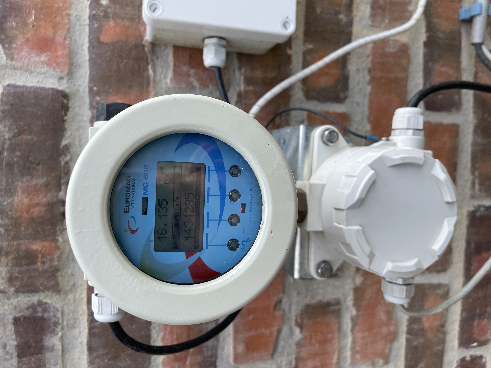

<details><summary>### :camera:**23/IMG_0641.JPG**</summary><sub> `Exif version` 0232 `OS version` 17.5.1 `Date` 2024:05:31 10:06:03 `Aperture` Not known `Brightness` 8.110265962951464 `Color space` 65535 `Compression` 6`Exposure mode` 0 `Exposure time` 0.0009891196834817012 `Focal length` 5.1 `Lens model` iPhone 12 Pro Max back triple camera 5.1mm f/1.6 `Lens specification` (1.5399999618512084, 7.5, 1.6, 2.4) `Orientation` 6 `Scene type` Not known `f number` 1.6 `White balance` 0 `Sensing method` 2 `Shutter speed` 9.981741867785939</sub><sub>`Coordinates & altitude` (5.217391666666667, -73.58722777777777, 2813.2970230040596)</sub><sub> :globe_with_meridians:`Location over` [Google Maps](http://maps.google.com/maps?q=5.217391666666667,-73.58722777777777) or [Openstreet Map](https://www.openstreetmap.org/query?lat=5.217391666666667&lon=-73.58722777777777)</sub></details>
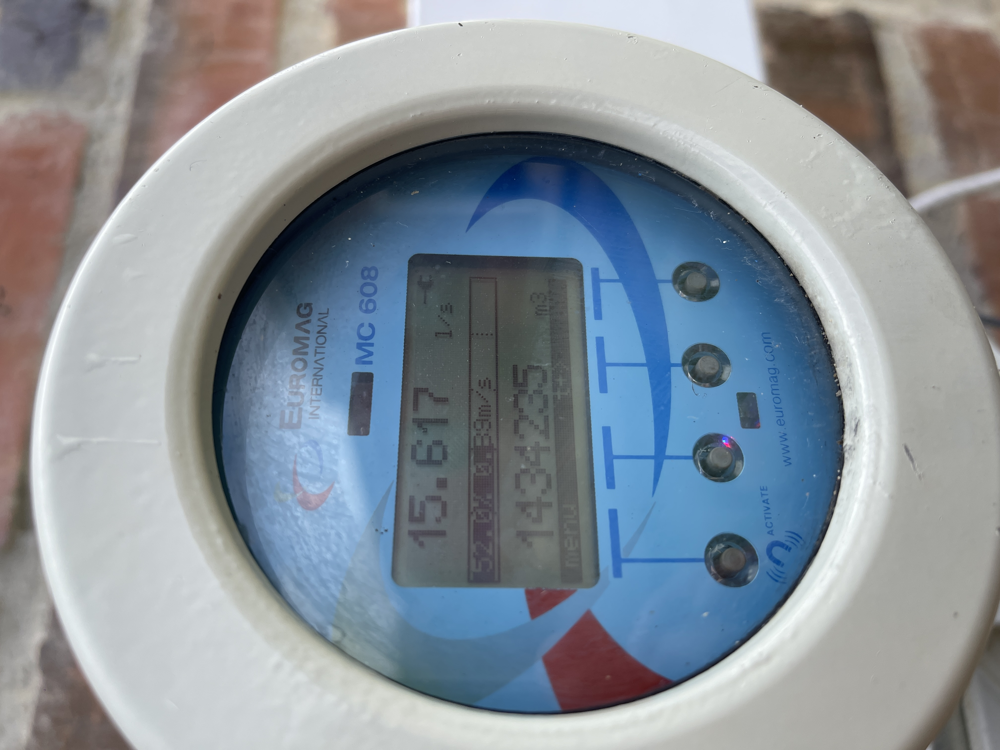

<details><summary>### :camera:**23/IMG_0642.JPG**</summary><sub> `Exif version` 0232 `OS version` 17.5.1 `Date` 2024:05:31 10:06:08 `Aperture` Not known `Brightness` 9.655942196925803 `Color space` 65535 `Compression` 6`Exposure mode` 0 `Exposure time` 0.00030703101013202335 `Focal length` 5.1 `Lens model` iPhone 12 Pro Max back triple camera 5.1mm f/1.6 `Lens specification` (1.5399999618512084, 7.5, 1.6, 2.4) `Orientation` 6 `Scene type` Not known `f number` 1.6 `White balance` 0 `Sensing method` 2 `Shutter speed` 11.669473724050489</sub><sub>`Coordinates & altitude` (5.217422222222222, -73.5872111111111, 2813.7036199095023)</sub><sub> :globe_with_meridians:`Location over` [Google Maps](http://maps.google.com/maps?q=5.217422222222222,-73.5872111111111) or [Openstreet Map](https://www.openstreetmap.org/query?lat=5.217422222222222&lon=-73.5872111111111)</sub></details>
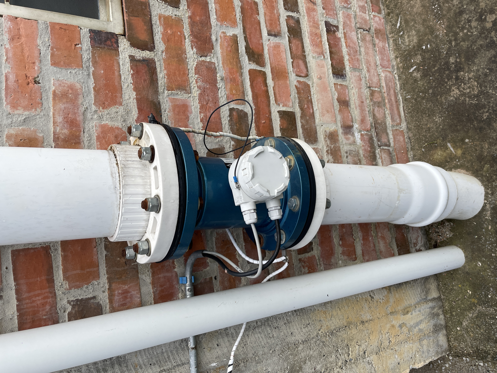

<details><summary>### :camera:**23/IMG_0643.JPG**</summary><sub> `Exif version` 0232 `OS version` 17.5.1 `Date` 2024:05:31 10:06:28 `Aperture` Not known `Brightness` 2.7490788013318537 `Color space` 65535 `Compression` 6`Exposure mode` 0 `Exposure time` 0.012195121951219513 `Focal length` 5.1 `Lens model` iPhone 12 Pro Max back triple camera 5.1mm f/1.6 `Lens specification` (1.5399999618512084, 7.5, 1.6, 2.4) `Orientation` 3 `Scene type` Not known `f number` 1.6 `White balance` 0 `Sensing method` 2 `Shutter speed` 6.353431785140408</sub><sub>`Coordinates & altitude` (5.217402777777778, -73.58721944444444, 2813.4786392405063)</sub><sub> :globe_with_meridians:`Location over` [Google Maps](http://maps.google.com/maps?q=5.217402777777778,-73.58721944444444) or [Openstreet Map](https://www.openstreetmap.org/query?lat=5.217402777777778&lon=-73.58721944444444)</sub></details>


<details><summary>### :camera:**23/IMG_0644.JPG**</summary><sub> `Exif version` 0232 `OS version` 17.5.1 `Date` 2024:05:31 10:06:37 `Aperture` Not known `Brightness` 6.044873563218391 `Color space` 65535 `Compression` 6`Exposure mode` 0 `Exposure time` 0.009615384615384616 `Focal length` 7.5 `Lens model` iPhone 12 Pro Max back triple camera 7.5mm f/2.2 `Lens specification` (1.5399999618512084, 7.5, 1.6, 2.4) `Orientation` 3 `Scene type` Not known `f number` 2.2 `White balance` 0 `Sensing method` 2 `Shutter speed` 6.702299105492719</sub><sub>`Coordinates & altitude` (5.217388888888889, -73.58722777777777, 2812.7370967741936)</sub><sub> :globe_with_meridians:`Location over` [Google Maps](http://maps.google.com/maps?q=5.217388888888889,-73.58722777777777) or [Openstreet Map](https://www.openstreetmap.org/query?lat=5.217388888888889&lon=-73.58722777777777)</sub></details>
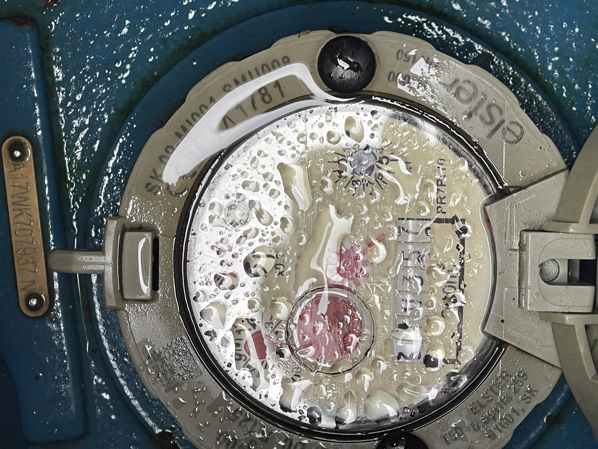

<details><summary>### :camera:**23/IMG_0645.JPG**</summary><sub> `Exif version` 0232 `OS version` 17.5.1 `Date` 2024:05:31 10:07:04 `Aperture` Not known `Brightness` 3.723735662148071 `Color space` 65535 `Compression` 6`Exposure mode` 0 `Exposure time` 0.011235955056179775 `Focal length` 1.54 `Lens model` iPhone 12 Pro Max back triple camera 1.54mm f/2.4 `Lens specification` (1.5399999618512084, 7.5, 1.6, 2.4) `Orientation` 3 `Scene type` Not known `f number` 2.4 `White balance` 0 `Sensing method` 2 `Shutter speed` 6.483581355306851</sub><sub>`Coordinates & altitude` (5.217447222222222, -73.58733333333333, 2811.901654411765)</sub><sub> :globe_with_meridians:`Location over` [Google Maps](http://maps.google.com/maps?q=5.217447222222222,-73.58733333333333) or [Openstreet Map](https://www.openstreetmap.org/query?lat=5.217447222222222&lon=-73.58733333333333)</sub></details>
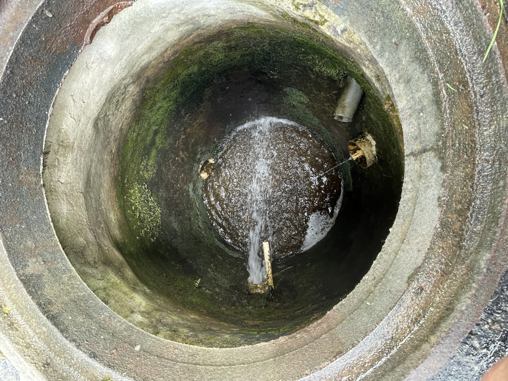

<details><summary>### :camera:**23/IMG_0646.JPG**</summary><sub> `Exif version` 0232 `OS version` 17.5.1 `Date` 2024:05:31 10:07:09 `Aperture` Not known `Brightness` 3.030499293452661 `Color space` 65535 `Compression` 6`Exposure mode` 0 `Exposure time` 0.010101010101010102 `Focal length` 1.54 `Lens model` iPhone 12 Pro Max back triple camera 1.54mm f/2.4 `Lens specification` (1.5399999618512084, 7.5, 1.6, 2.4) `Orientation` 3 `Scene type` Not known `f number` 2.4 `White balance` 0 `Sensing method` 2 `Shutter speed` 6.633792506821055</sub><sub>`Coordinates & altitude` (5.217438888888889, -73.58731944444445, 2812.397534668721)</sub><sub> :globe_with_meridians:`Location over` [Google Maps](http://maps.google.com/maps?q=5.217438888888889,-73.58731944444445) or [Openstreet Map](https://www.openstreetmap.org/query?lat=5.217438888888889&lon=-73.58731944444445)</sub></details>


<details><summary>### :camera:**23/IMG_0647.JPG**</summary><sub> `Exif version` 0232 `OS version` 17.5.1 `Date` 2024:05:31 10:07:31 `Aperture` Not known `Brightness` 7.644862264975951 `Color space` 65535 `Compression` 6`Exposure mode` 0 `Exposure time` 0.004629629629629629 `Focal length` 1.54 `Lens model` iPhone 12 Pro Max back triple camera 1.54mm f/2.4 `Lens specification` (1.5399999618512084, 7.5, 1.6, 2.4) `Orientation` 3 `Scene type` Not known `f number` 2.4 `White balance` 0 `Sensing method` 2 `Shutter speed` 7.7550837217331265</sub><sub>`Coordinates & altitude` (5.217405555555556, -73.58733333333333, 2812.4468438538206)</sub><sub> :globe_with_meridians:`Location over` [Google Maps](http://maps.google.com/maps?q=5.217405555555556,-73.58733333333333) or [Openstreet Map](https://www.openstreetmap.org/query?lat=5.217405555555556&lon=-73.58733333333333)</sub></details>


<details><summary>### :camera:**23/IMG_0648.JPG**</summary><sub> `Exif version` 0232 `OS version` 17.5.1 `Date` 2024:05:31 10:07:49 `Aperture` Not known `Brightness` 9.212401135060073 `Color space` 65535 `Compression` 6`Exposure mode` 0 `Exposure time` 0.001314060446780552 `Focal length` 1.54 `Lens model` iPhone 12 Pro Max back triple camera 1.54mm f/2.4 `Lens specification` (1.5399999618512084, 7.5, 1.6, 2.4) `Orientation` 6 `Scene type` Not known `f number` 2.4 `White balance` 0 `Sensing method` 2 `Shutter speed` 9.571819010021256</sub><sub>`Coordinates & altitude` (5.217436111111112, -73.5873861111111, 2812.1954921803126)</sub><sub> :globe_with_meridians:`Location over` [Google Maps](http://maps.google.com/maps?q=5.217436111111112,-73.5873861111111) or [Openstreet Map](https://www.openstreetmap.org/query?lat=5.217436111111112&lon=-73.5873861111111)</sub></details>


<details><summary>### :camera:**23/IMG_0649.JPG**</summary><sub> `Exif version` 0232 `OS version` 17.5.1 `Date` 2024:05:31 10:08:06 `Aperture` Not known `Brightness` 7.926216685979142 `Color space` 65535 `Compression` 6`Exposure mode` 0 `Exposure time` 0.003424657534246575 `Focal length` 1.54 `Lens model` iPhone 12 Pro Max back triple camera 1.54mm f/2.4 `Lens specification` (1.5399999618512084, 7.5, 1.6, 2.4) `Orientation` 6 `Scene type` Not known `f number` 2.4 `White balance` 0 `Sensing method` 2 `Shutter speed` 8.191787961136136</sub><sub>`Coordinates & altitude` (5.217408333333333, -73.5874861111111, 2811.0139470013946)</sub><sub> :globe_with_meridians:`Location over` [Google Maps](http://maps.google.com/maps?q=5.217408333333333,-73.5874861111111) or [Openstreet Map](https://www.openstreetmap.org/query?lat=5.217408333333333&lon=-73.5874861111111)</sub></details>


<details><summary>### :camera:**23/IMG_0650.JPG**</summary><sub> `Exif version` 0232 `OS version` 17.5.1 `Date` 2024:05:31 10:08:11 `Aperture` Not known `Brightness` 4.935871684291369 `Color space` 65535 `Compression` 6`Exposure mode` 0 `Exposure time` 0.010101010101010102 `Focal length` 1.54 `Lens model` iPhone 12 Pro Max back triple camera 1.54mm f/2.4 `Lens specification` (1.5399999618512084, 7.5, 1.6, 2.4) `Orientation` 6 `Scene type` Not known `f number` 2.4 `White balance` 0 `Sensing method` 2 `Shutter speed` 6.633792506821055</sub><sub>`Coordinates & altitude` (5.217402777777778, -73.5874861111111, 2811.5128518971846)</sub><sub> :globe_with_meridians:`Location over` [Google Maps](http://maps.google.com/maps?q=5.217402777777778,-73.5874861111111) or [Openstreet Map](https://www.openstreetmap.org/query?lat=5.217402777777778&lon=-73.5874861111111)</sub></details>


<details><summary>### :camera:**23/IMG_0651.JPG**</summary><sub> `Exif version` 0232 `OS version` 17.5.1 `Date` 2024:05:31 10:08:35 `Aperture` Not known `Brightness` 10.066458564092237 `Color space` 65535 `Compression` 6`Exposure mode` 0 `Exposure time` 0.0008756567425569177 `Focal length` 1.54 `Lens model` iPhone 12 Pro Max back triple camera 1.54mm f/2.4 `Lens specification` (1.5399999618512084, 7.5, 1.6, 2.4) `Orientation` 1 `Scene type` Not known `f number` 2.4 `White balance` 0 `Sensing method` 2 `Shutter speed` 10.156781508940252</sub><sub>`Coordinates & altitude` (5.217494444444444, -73.58741111111111, 2812.3800675675675)</sub><sub> :globe_with_meridians:`Location over` [Google Maps](http://maps.google.com/maps?q=5.217494444444444,-73.58741111111111) or [Openstreet Map](https://www.openstreetmap.org/query?lat=5.217494444444444&lon=-73.58741111111111)</sub></details>
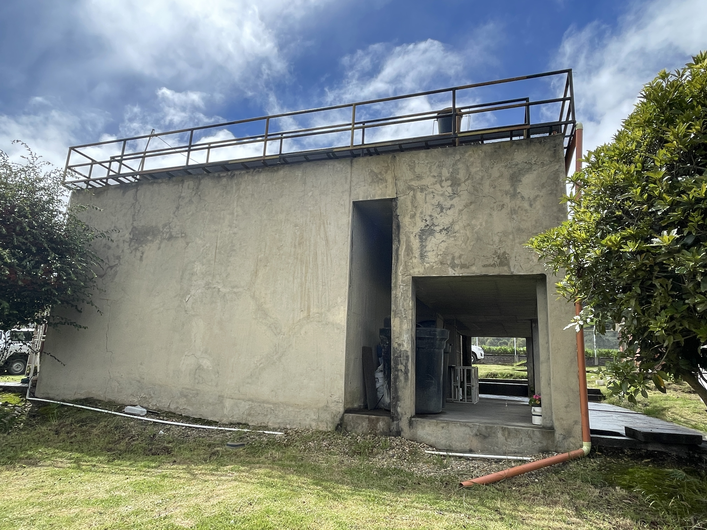

<details><summary>### :camera:**23/IMG_0652.JPG**</summary><sub> `Exif version` 0232 `OS version` 17.5.1 `Date` 2024:05:31 10:09:34 `Aperture` Not known `Brightness` 10.513591881116346 `Color space` 65535 `Compression` 6`Exposure mode` 0 `Exposure time` 0.00018601190476190475 `Focal length` 5.1 `Lens model` iPhone 12 Pro Max back triple camera 5.1mm f/1.6 `Lens specification` (1.5399999618512084, 7.5, 1.6, 2.4) `Orientation` 6 `Scene type` Not known `f number` 1.6 `White balance` 0 `Sensing method` 2 `Shutter speed` 12.392409761529182</sub><sub>`Coordinates & altitude` (5.217708333333333, -73.5873111111111, 2826.564907275321)</sub><sub> :globe_with_meridians:`Location over` [Google Maps](http://maps.google.com/maps?q=5.217708333333333,-73.5873111111111) or [Openstreet Map](https://www.openstreetmap.org/query?lat=5.217708333333333&lon=-73.5873111111111)</sub></details>


> _Citación: se permite la reproducción digital parcial o total de este repositorio, scripts, guías de desarrollo, modelos de datos, imágenes y documentación, siempre que se haga referencia como: "R.GISMobile - Sistemas de información geográficos móviles sobre QField que no requieren de conexión a Internet para su navegación". https://github.com/rcfdtools/R.GISMobile - Bogotá - Colombia - Suramérica."._

| [:house: Inicio](../Readme.md) |
|---|