## :globe_with_meridians:Rocky Mountain National Park (across the park, glacier, rocks, mountains), Colorado, U.S. (2024-07-22)
`Pictures` rcfdtools <br>`Category` Freelance field visit <br>`Location` [Google Maps](http://maps.google.com/maps?q=40.400341,-105.663741) or [Openstreet Map](https://www.openstreetmap.org/query?lat=40.400341&lon=-105.663741) 

```geojson
{
  "type": "Feature",
  "geometry": {
    "type": "Point", 
    "coordinates": [-105.663741, 40.400341]
  }, 
  "properties": {
    "Name": "Rocky Mountain National Park (across the park, glacier, rocks, mountains), Colorado, U.S."
  }
}
```

<br><details><summary>:camera:**24/IMG_0891.JPEG**</summary><sub> `Exif version` 0232 `OS version` 18.0 `Date` 2024:07:22 11:35:25 `Aperture` Not known `Brightness` 9.348564680232558 `Color space` 65535 `Compression` Not known`Exposure mode` 0 `Exposure time` 0.00048007681228996637 `Focal length` 5.1 `Lens model` iPhone 12 Pro Max back triple camera 5.1mm f/1.6 `Lens specification` (1.5399999618512084, 7.5, 1.6, 2.4) `Orientation` 1 `Scene type` Not known `f number` 1.6 `White balance` 0 `Sensing method` 2 `Shutter speed` 11.024677966101695</sub><sub>`Coordinates & altitude` (39.74532777777778, -105.46987222222222, 2246.882252559727)</sub><sub> :globe_with_meridians:`Location over` [Google Maps](http://maps.google.com/maps?q=39.74532777777778,-105.46987222222222) or [Openstreet Map](https://www.openstreetmap.org/query?lat=39.74532777777778&lon=-105.46987222222222)</sub></details>
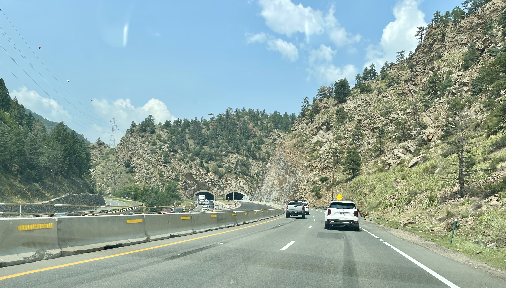

<br><details><summary>:camera:**24/IMG_0892.JPEG**</summary><sub> `Exif version` 0232 `OS version` 18.0 `Date` 2024:07:22 11:35:34 `Aperture` Not known `Brightness` 9.54480135249366 `Color space` 65535 `Compression` Not known`Exposure mode` 0 `Exposure time` 0.0003419972640218878 `Focal length` 5.1 `Lens model` iPhone 12 Pro Max back triple camera 5.1mm f/1.6 `Lens specification` (1.5399999618512084, 7.5, 1.6, 2.4) `Orientation` 1 `Scene type` Not known `f number` 1.6 `White balance` 0 `Sensing method` 2 `Shutter speed` 11.513716063348417</sub><sub>`Coordinates & altitude` (39.74536388888889, -105.47200833333333, 2251.354271356784)</sub><sub> :globe_with_meridians:`Location over` [Google Maps](http://maps.google.com/maps?q=39.74536388888889,-105.47200833333333) or [Openstreet Map](https://www.openstreetmap.org/query?lat=39.74536388888889&lon=-105.47200833333333)</sub></details>
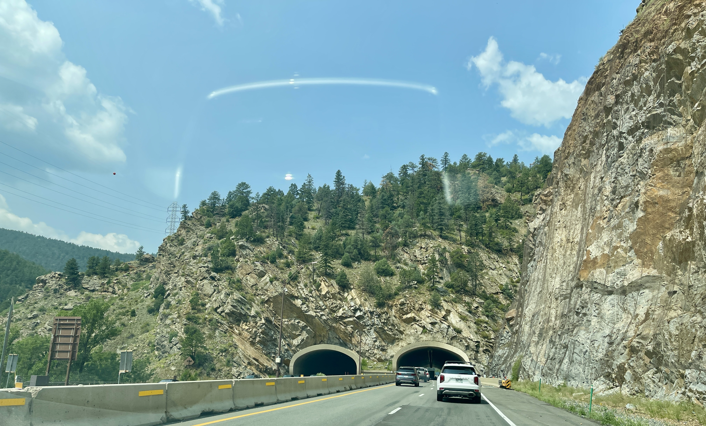

<br><details><summary>:camera:**24/IMG_0893.JPEG**</summary><sub> `Exif version` 0232 `OS version` 18.0 `Date` 2024:07:22 12:56:45 `Aperture` Not known `Brightness` 11.082303602186775 `Color space` 65535 `Compression` Not known`Exposure mode` 0 `Exposure time` 0.00037593984962406017 `Focal length` 1.54 `Lens model` iPhone 12 Pro Max back triple camera 1.54mm f/2.4 `Lens specification` (1.5399999618512084, 7.5, 1.6, 2.4) `Orientation` 1 `Scene type` Not known `f number` 2.4 `White balance` 0 `Sensing method` 2 `Shutter speed` 11.376979723595278</sub><sub>`Coordinates & altitude` (40.14694166666666, -105.89009722222222, 2528.3627450980393)</sub><sub> :globe_with_meridians:`Location over` [Google Maps](http://maps.google.com/maps?q=40.14694166666666,-105.89009722222222) or [Openstreet Map](https://www.openstreetmap.org/query?lat=40.14694166666666&lon=-105.89009722222222)</sub></details>
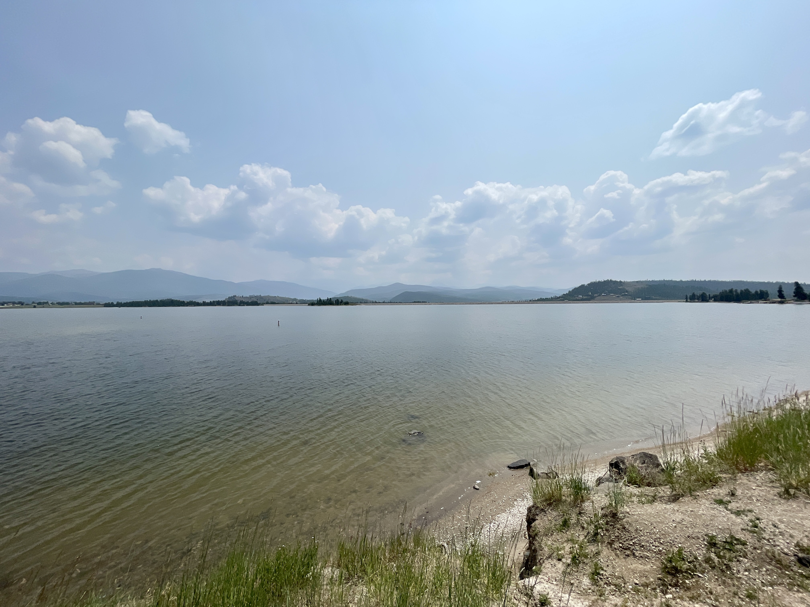

<br><details><summary>:camera:**24/IMG_0894.JPEG**</summary><sub> `Exif version` 0232 `OS version` 18.0 `Date` 2024:07:22 12:56:54 `Aperture` Not known `Brightness` 10.735727958563224 `Color space` 65535 `Compression` Not known`Exposure mode` 0 `Exposure time` 0.000501002004008016 `Focal length` 1.54 `Lens model` iPhone 12 Pro Max back triple camera 1.54mm f/2.4 `Lens specification` (1.5399999618512084, 7.5, 1.6, 2.4) `Orientation` 1 `Scene type` Not known `f number` 2.4 `White balance` 0 `Sensing method` 2 `Shutter speed` 10.962901772303995</sub><sub>`Coordinates & altitude` (40.146947222222224, -105.89010555555556, 2528.444587628866)</sub><sub> :globe_with_meridians:`Location over` [Google Maps](http://maps.google.com/maps?q=40.146947222222224,-105.89010555555556) or [Openstreet Map](https://www.openstreetmap.org/query?lat=40.146947222222224&lon=-105.89010555555556)</sub></details>
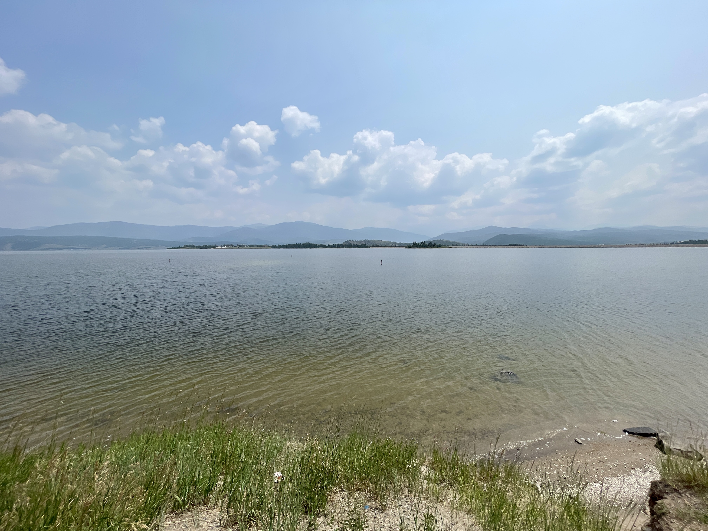

<br><details><summary>:camera:**24/IMG_0895.JPEG**</summary><sub> `Exif version` 0232 `OS version` 18.0 `Date` 2024:07:22 12:57:00 `Aperture` Not known `Brightness` 11.256503836795808 `Color space` 65535 `Compression` Not known`Exposure mode` 0 `Exposure time` 0.00033400133600534405 `Focal length` 1.54 `Lens model` iPhone 12 Pro Max back triple camera 1.54mm f/2.4 `Lens specification` (1.5399999618512084, 7.5, 1.6, 2.4) `Orientation` 1 `Scene type` Not known `f number` 2.4 `White balance` 0 `Sensing method` 2 `Shutter speed` 11.547864283550439</sub><sub>`Coordinates & altitude` (40.146947222222224, -105.89010555555556, 2528.4762979683974)</sub><sub> :globe_with_meridians:`Location over` [Google Maps](http://maps.google.com/maps?q=40.146947222222224,-105.89010555555556) or [Openstreet Map](https://www.openstreetmap.org/query?lat=40.146947222222224&lon=-105.89010555555556)</sub></details>
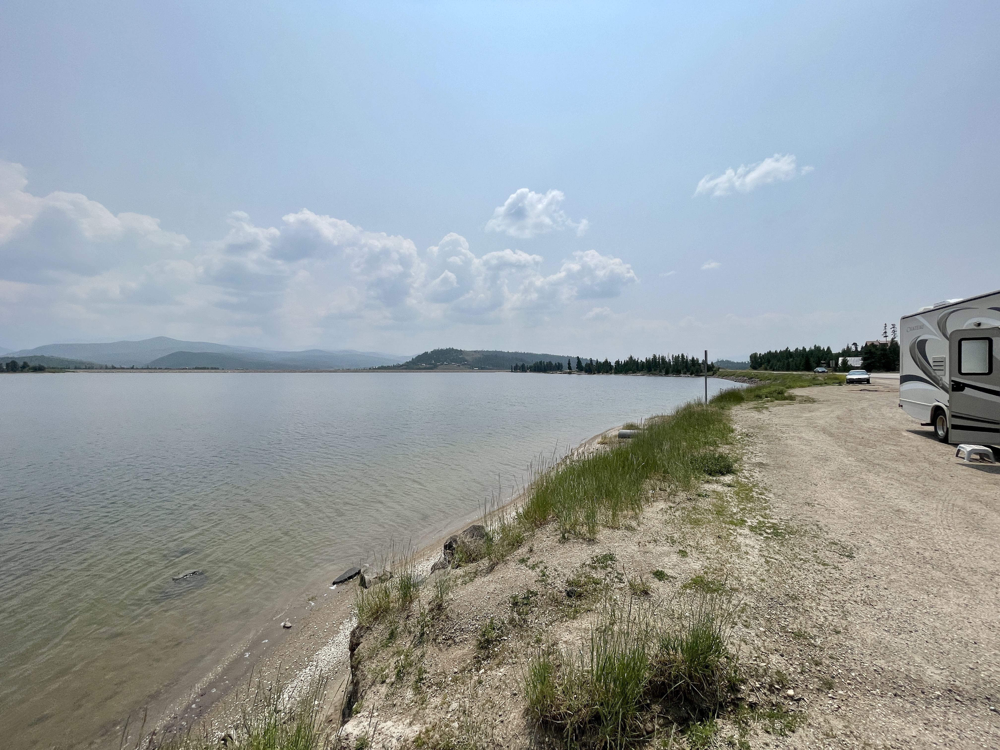

<br><details><summary>:camera:**24/IMG_0896.JPEG**</summary><sub> `Exif version` 0232 `OS version` 18.0 `Date` 2024:07:22 13:01:17 `Aperture` Not known `Brightness` 10.998067899530776 `Color space` 65535 `Compression` Not known`Exposure mode` 0 `Exposure time` 0.00013500742540839745 `Focal length` 5.1 `Lens model` iPhone 12 Pro Max back triple camera 5.1mm f/1.6 `Lens specification` (1.5399999618512084, 7.5, 1.6, 2.4) `Orientation` 1 `Scene type` Not known `f number` 1.6 `White balance` 0 `Sensing method` 2 `Shutter speed` 12.85475297060663</sub><sub>`Coordinates & altitude` (40.14691666666667, -105.89014444444445, 2528.510903426791)</sub><sub> :globe_with_meridians:`Location over` [Google Maps](http://maps.google.com/maps?q=40.14691666666667,-105.89014444444445) or [Openstreet Map](https://www.openstreetmap.org/query?lat=40.14691666666667&lon=-105.89014444444445)</sub></details>
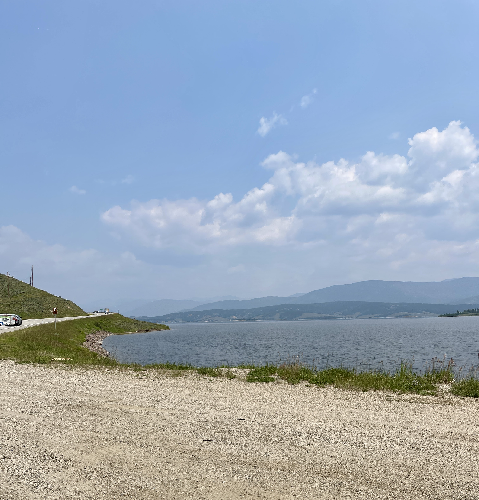

<br><details><summary>:camera:**24/IMG_0897.JPEG**</summary><sub> `Exif version` 0232 `OS version` 18.0 `Date` 2024:07:22 13:03:04 `Aperture` Not known `Brightness` 10.787805944055943 `Color space` 65535 `Compression` Not known`Exposure mode` 0 `Exposure time` 0.0004589261128958238 `Focal length` 1.54 `Lens model` iPhone 12 Pro Max back triple camera 1.54mm f/2.4 `Lens specification` (1.5399999618512084, 7.5, 1.6, 2.4) `Orientation` 1 `Scene type` Not known `f number` 2.4 `White balance` 0 `Sensing method` 2 `Shutter speed` 11.089218221603343</sub><sub>`Coordinates & altitude` (40.16302777777778, -105.89740833333335, 2531.2239657631953)</sub><sub> :globe_with_meridians:`Location over` [Google Maps](http://maps.google.com/maps?q=40.16302777777778,-105.89740833333335) or [Openstreet Map](https://www.openstreetmap.org/query?lat=40.16302777777778&lon=-105.89740833333335)</sub></details>
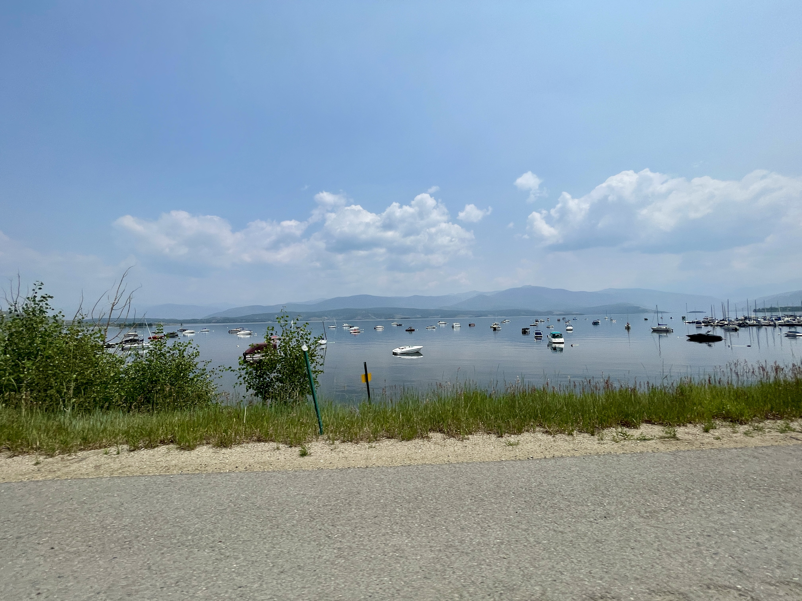

<br><details><summary>:camera:**24/IMG_0898.JPEG**</summary><sub> `Exif version` 0232 `OS version` 18.0 `Date` 2024:07:22 13:03:15 `Aperture` Not known `Brightness` 10.80897234090398 `Color space` 65535 `Compression` Not known`Exposure mode` 0 `Exposure time` 0.0004589261128958238 `Focal length` 1.54 `Lens model` iPhone 12 Pro Max back triple camera 1.54mm f/2.4 `Lens specification` (1.5399999618512084, 7.5, 1.6, 2.4) `Orientation` 1 `Scene type` Not known `f number` 2.4 `White balance` 0 `Sensing method` 2 `Shutter speed` 11.089218221603343</sub><sub>`Coordinates & altitude` (40.165077777777775, -105.89832222222223, 2534.374355195284)</sub><sub> :globe_with_meridians:`Location over` [Google Maps](http://maps.google.com/maps?q=40.165077777777775,-105.89832222222223) or [Openstreet Map](https://www.openstreetmap.org/query?lat=40.165077777777775&lon=-105.89832222222223)</sub></details>
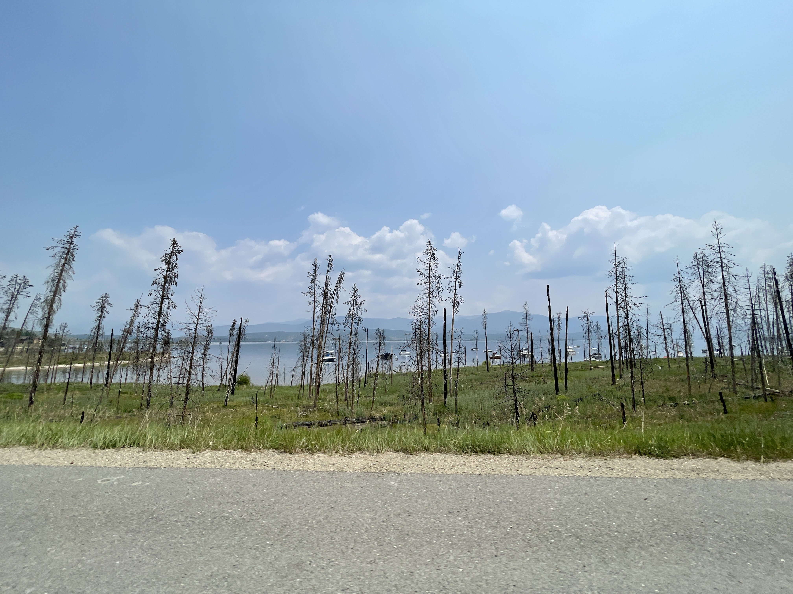

<br><details><summary>:camera:**24/IMG_0899.JPEG**</summary><sub> `Exif version` 0232 `OS version` 18.0 `Date` 2024:07:22 13:03:18 `Aperture` Not known `Brightness` 10.92583791895948 `Color space` 65535 `Compression` Not known`Exposure mode` 0 `Exposure time` 0.0004380201489268506 `Focal length` 1.54 `Lens model` iPhone 12 Pro Max back triple camera 1.54mm f/2.4 `Lens specification` (1.5399999618512084, 7.5, 1.6, 2.4) `Orientation` 1 `Scene type` Not known `f number` 2.4 `White balance` 0 `Sensing method` 2 `Shutter speed` 11.156781508940252</sub><sub>`Coordinates & altitude` (40.16571666666667, -105.89855277777778, 2533.608778625954)</sub><sub> :globe_with_meridians:`Location over` [Google Maps](http://maps.google.com/maps?q=40.16571666666667,-105.89855277777778) or [Openstreet Map](https://www.openstreetmap.org/query?lat=40.16571666666667&lon=-105.89855277777778)</sub></details>
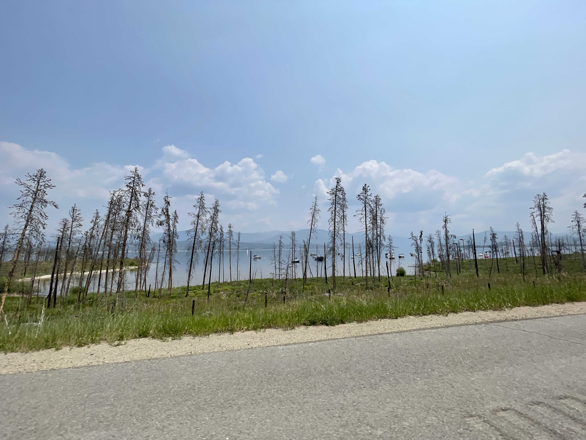

<br><details><summary>:camera:**24/IMG_0900.JPEG**</summary><sub> `Exif version` 0232 `OS version` 18.0 `Date` 2024:07:22 14:24:40 `Aperture` Not known `Brightness` 10.319872489639783 `Color space` 65535 `Compression` Not known`Exposure mode` 0 `Exposure time` 0.0008136696501220504 `Focal length` 1.54 `Lens model` iPhone 12 Pro Max back triple camera 1.54mm f/2.4 `Lens specification` (1.5399999618512084, 7.5, 1.6, 2.4) `Orientation` 1 `Scene type` Not known `f number` 2.4 `White balance` 0 `Sensing method` 2 `Shutter speed` 10.26268357810414</sub><sub>`Coordinates & altitude` (40.39956388888889, -105.83527222222222, 3086.016427104723)</sub><sub> :globe_with_meridians:`Location over` [Google Maps](http://maps.google.com/maps?q=40.39956388888889,-105.83527222222222) or [Openstreet Map](https://www.openstreetmap.org/query?lat=40.39956388888889&lon=-105.83527222222222)</sub></details>


<br><details><summary>:camera:**24/IMG_0901.JPEG**</summary><sub> `Exif version` 0232 `OS version` 18.0 `Date` 2024:07:22 14:24:42 `Aperture` Not known `Brightness` 9.776186687881198 `Color space` 65535 `Compression` Not known`Exposure mode` 0 `Exposure time` 0.0012300123001230013 `Focal length` 1.54 `Lens model` iPhone 12 Pro Max back triple camera 1.54mm f/2.4 `Lens specification` (1.5399999618512084, 7.5, 1.6, 2.4) `Orientation` 1 `Scene type` Not known `f number` 2.4 `White balance` 0 `Sensing method` 2 `Shutter speed` 9.66712596164887</sub><sub>`Coordinates & altitude` (40.39955277777778, -105.83529722222222, 3086.2737520128826)</sub><sub> :globe_with_meridians:`Location over` [Google Maps](http://maps.google.com/maps?q=40.39955277777778,-105.83529722222222) or [Openstreet Map](https://www.openstreetmap.org/query?lat=40.39955277777778&lon=-105.83529722222222)</sub></details>


<br><details><summary>:camera:**24/IMG_0902.JPEG**</summary><sub> `Exif version` 0232 `OS version` 18.0 `Date` 2024:07:22 14:24:46 `Aperture` Not known `Brightness` 10.161355289657623 `Color space` 65535 `Compression` Not known`Exposure mode` 0 `Exposure time` 0.0009389671361502347 `Focal length` 1.54 `Lens model` iPhone 12 Pro Max back triple camera 1.54mm f/2.4 `Lens specification` (1.5399999618512084, 7.5, 1.6, 2.4) `Orientation` 1 `Scene type` Not known `f number` 2.4 `White balance` 0 `Sensing method` 2 `Shutter speed` 10.056587220353853</sub><sub>`Coordinates & altitude` (40.399547222222225, -105.83528055555556, 3085.0581761006288)</sub><sub> :globe_with_meridians:`Location over` [Google Maps](http://maps.google.com/maps?q=40.399547222222225,-105.83528055555556) or [Openstreet Map](https://www.openstreetmap.org/query?lat=40.399547222222225&lon=-105.83528055555556)</sub></details>


<br><details><summary>:camera:**24/IMG_0903.JPEG**</summary><sub> `Exif version` 0232 `OS version` 18.0 `Date` 2024:07:22 14:24:52 `Aperture` Not known `Brightness` 11.05866789370758 `Color space` 65535 `Compression` Not known`Exposure mode` 0 `Exposure time` 0.00037593984962406017 `Focal length` 1.54 `Lens model` iPhone 12 Pro Max back triple camera 1.54mm f/2.4 `Lens specification` (1.5399999618512084, 7.5, 1.6, 2.4) `Orientation` 1 `Scene type` Not known `f number` 2.4 `White balance` 0 `Sensing method` 2 `Shutter speed` 11.376979723595278</sub><sub>`Coordinates & altitude` (40.399525, -105.83528055555556, 3088.2674050632913)</sub><sub> :globe_with_meridians:`Location over` [Google Maps](http://maps.google.com/maps?q=40.399525,-105.83528055555556) or [Openstreet Map](https://www.openstreetmap.org/query?lat=40.399525&lon=-105.83528055555556)</sub></details>
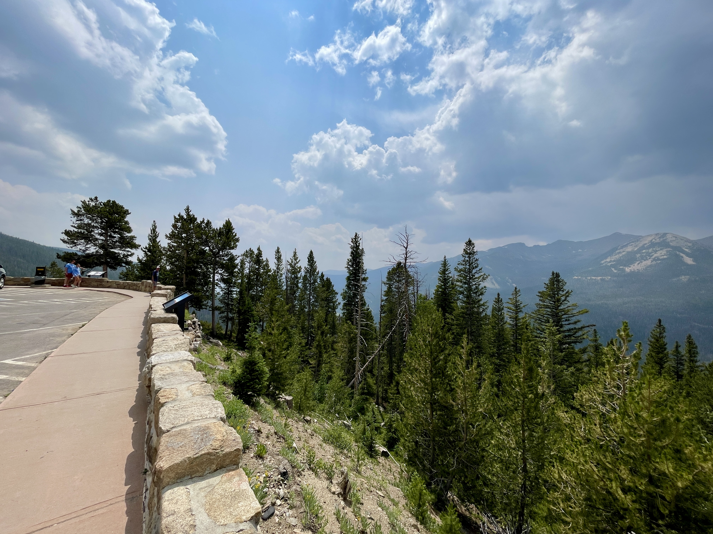

<br><details><summary>:camera:**24/IMG_0904.JPEG**</summary><sub> `Exif version` 0232 `OS version` 18.0 `Date` 2024:07:22 14:25:12 `Aperture` Not known `Brightness` 9.484857159214519 `Color space` 65535 `Compression` Not known`Exposure mode` 0 `Exposure time` 0.00072992700729927 `Focal length` 1.54 `Lens model` iPhone 12 Pro Max back triple camera 1.54mm f/2.4 `Lens specification` (1.5399999618512084, 7.5, 1.6, 2.4) `Orientation` 1 `Scene type` Not known `f number` 2.4 `White balance` 0 `Sensing method` 2 `Shutter speed` 10.419815917704385</sub><sub>`Coordinates & altitude` (40.399430555555554, -105.83531111111111, 3086.1795104261105)</sub><sub> :globe_with_meridians:`Location over` [Google Maps](http://maps.google.com/maps?q=40.399430555555554,-105.83531111111111) or [Openstreet Map](https://www.openstreetmap.org/query?lat=40.399430555555554&lon=-105.83531111111111)</sub></details>


<br><details><summary>:camera:**24/IMG_0905.JPEG**</summary><sub> `Exif version` 0232 `OS version` 18.0 `Date` 2024:07:22 14:25:18 `Aperture` Not known `Brightness` 8.904951222771615 `Color space` 65535 `Compression` Not known`Exposure mode` 0 `Exposure time` 0.0010638297872340426 `Focal length` 1.54 `Lens model` iPhone 12 Pro Max back triple camera 1.54mm f/2.4 `Lens specification` (1.5399999618512084, 7.5, 1.6, 2.4) `Orientation` 1 `Scene type` Not known `f number` 2.4 `White balance` 0 `Sensing method` 2 `Shutter speed` 9.876286134247918</sub><sub>`Coordinates & altitude` (40.39943611111111, -105.83530555555555, 3086.453465346535)</sub><sub> :globe_with_meridians:`Location over` [Google Maps](http://maps.google.com/maps?q=40.39943611111111,-105.83530555555555) or [Openstreet Map](https://www.openstreetmap.org/query?lat=40.39943611111111&lon=-105.83530555555555)</sub></details>
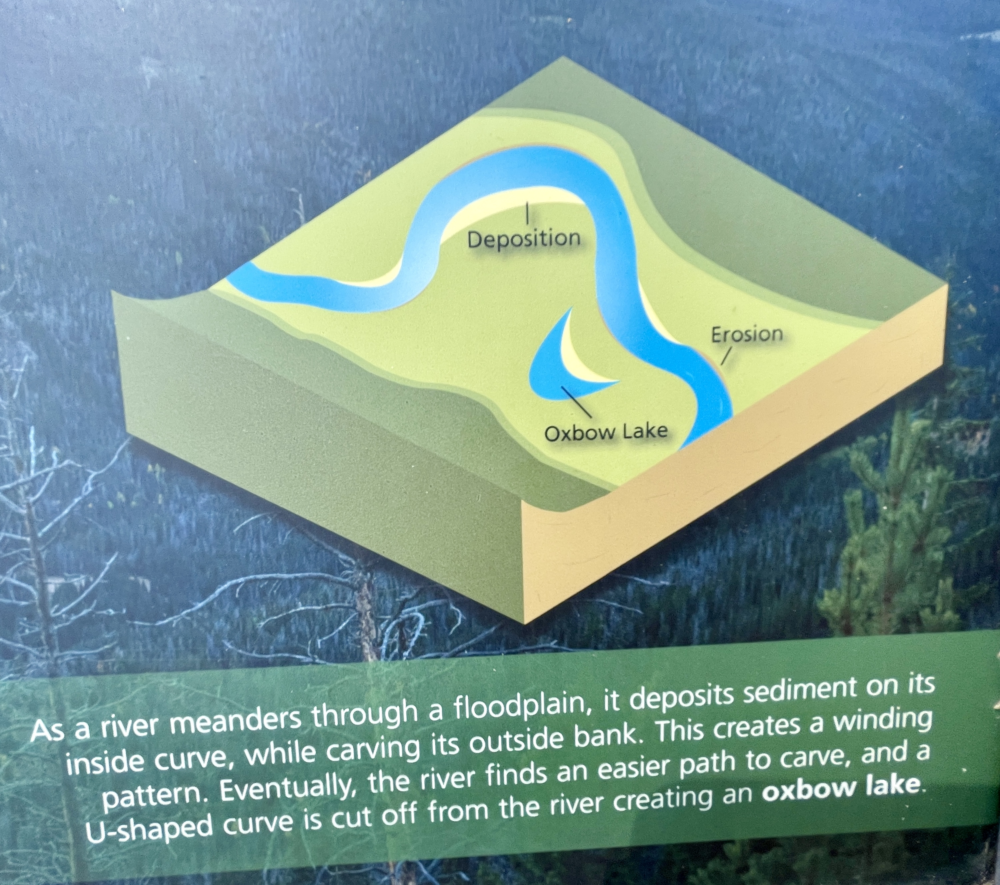

<br><details><summary>:camera:**24/IMG_0906.JPEG**</summary><sub> `Exif version` 0232 `OS version` 18.0 `Date` 2024:07:22 14:25:55 `Aperture` Not known `Brightness` 10.815752176553959 `Color space` 65535 `Compression` Not known`Exposure mode` 0 `Exposure time` 0.0003969829297340214 `Focal length` 1.54 `Lens model` iPhone 12 Pro Max back triple camera 1.54mm f/2.4 `Lens specification` (1.5399999618512084, 7.5, 1.6, 2.4) `Orientation` 1 `Scene type` Not known `f number` 2.4 `White balance` 0 `Sensing method` 2 `Shutter speed` 11.298573369565217</sub><sub>`Coordinates & altitude` (40.39925, -105.83528888888888, 3086.307727480567)</sub><sub> :globe_with_meridians:`Location over` [Google Maps](http://maps.google.com/maps?q=40.39925,-105.83528888888888) or [Openstreet Map](https://www.openstreetmap.org/query?lat=40.39925&lon=-105.83528888888888)</sub></details>


<br><details><summary>:camera:**24/IMG_0907.JPEG**</summary><sub> `Exif version` 0232 `OS version` 18.0 `Date` 2024:07:22 14:26:13 `Aperture` Not known `Brightness` 9.781691125087352 `Color space` 65535 `Compression` Not known`Exposure mode` 0 `Exposure time` 0.0008968609865470852 `Focal length` 1.54 `Lens model` iPhone 12 Pro Max back triple camera 1.54mm f/2.4 `Lens specification` (1.5399999618512084, 7.5, 1.6, 2.4) `Orientation` 1 `Scene type` Not known `f number` 2.4 `White balance` 0 `Sensing method` 2 `Shutter speed` 10.12260439142023</sub><sub>`Coordinates & altitude` (40.39924722222222, -105.83520555555555, 3084.632986627043)</sub><sub> :globe_with_meridians:`Location over` [Google Maps](http://maps.google.com/maps?q=40.39924722222222,-105.83520555555555) or [Openstreet Map](https://www.openstreetmap.org/query?lat=40.39924722222222&lon=-105.83520555555555)</sub></details>


<br><details><summary>:camera:**24/IMG_0909.JPEG**</summary><sub> `Exif version` 0232 `OS version` 18.0 `Date` 2024:07:22 14:26:49 `Aperture` Not known `Brightness` 10.043457797301537 `Color space` 65535 `Compression` Not known`Exposure mode` 0 `Exposure time` 0.00025497195308516065 `Focal length` 5.1 `Lens model` iPhone 12 Pro Max back triple camera 5.1mm f/1.6 `Lens specification` (1.5399999618512084, 7.5, 1.6, 2.4) `Orientation` 1 `Scene type` Not known `f number` 1.6 `White balance` 0 `Sensing method` 2 `Shutter speed` 11.93721513217867</sub><sub>`Coordinates & altitude` (40.39924166666667, -105.83518055555555, 3091.3618843683084)</sub><sub> :globe_with_meridians:`Location over` [Google Maps](http://maps.google.com/maps?q=40.39924166666667,-105.83518055555555) or [Openstreet Map](https://www.openstreetmap.org/query?lat=40.39924166666667&lon=-105.83518055555555)</sub></details>


<br><details><summary>:camera:**24/IMG_0910.JPEG**</summary><sub> `Exif version` 0232 `OS version` 18.0 `Date` 2024:07:22 14:27:04 `Aperture` Not known `Brightness` 8.75793231094659 `Color space` 65535 `Compression` Not known`Exposure mode` 0 `Exposure time` 0.0005659309564233164 `Focal length` 5.1 `Lens model` iPhone 12 Pro Max back triple camera 5.1mm f/1.6 `Lens specification` (1.5399999618512084, 7.5, 1.6, 2.4) `Orientation` 1 `Scene type` Not known `f number` 1.6 `White balance` 0 `Sensing method` 2 `Shutter speed` 10.786910327241818</sub><sub>`Coordinates & altitude` (40.39925, -105.83521388888889, 3090.9954337899544)</sub><sub> :globe_with_meridians:`Location over` [Google Maps](http://maps.google.com/maps?q=40.39925,-105.83521388888889) or [Openstreet Map](https://www.openstreetmap.org/query?lat=40.39925&lon=-105.83521388888889)</sub></details>


<br><details><summary>:camera:**24/IMG_0911.JPEG**</summary><sub> `Exif version` 0232 `OS version` 18.0 `Date` 2024:07:22 14:27:14 `Aperture` Not known `Brightness` 10.15035857542239 `Color space` 65535 `Compression` Not known`Exposure mode` 0 `Exposure time` 0.0008136696501220504 `Focal length` 1.54 `Lens model` iPhone 12 Pro Max back triple camera 1.54mm f/2.4 `Lens specification` (1.5399999618512084, 7.5, 1.6, 2.4) `Orientation` 1 `Scene type` Not known `f number` 2.4 `White balance` 0 `Sensing method` 2 `Shutter speed` 10.26268357810414</sub><sub>`Coordinates & altitude` (40.39925, -105.83520555555555, 3088.5555967383248)</sub><sub> :globe_with_meridians:`Location over` [Google Maps](http://maps.google.com/maps?q=40.39925,-105.83520555555555) or [Openstreet Map](https://www.openstreetmap.org/query?lat=40.39925&lon=-105.83520555555555)</sub></details>


<br><details><summary>:camera:**24/IMG_0912.JPEG**</summary><sub> `Exif version` 0232 `OS version` 18.0 `Date` 2024:07:22 14:27:19 `Aperture` Not known `Brightness` 9.801879525496842 `Color space` 65535 `Compression` Not known`Exposure mode` 0 `Exposure time` 0.0017301038062283738 `Focal length` 1.54 `Lens model` iPhone 12 Pro Max back triple camera 1.54mm f/2.4 `Lens specification` (1.5399999618512084, 7.5, 1.6, 2.4) `Orientation` 1 `Scene type` Not known `f number` 2.4 `White balance` 0 `Sensing method` 2 `Shutter speed` 9.174178565284707</sub><sub>`Coordinates & altitude` (40.39924722222222, -105.83518888888888, 3087.811773255814)</sub><sub> :globe_with_meridians:`Location over` [Google Maps](http://maps.google.com/maps?q=40.39924722222222,-105.83518888888888) or [Openstreet Map](https://www.openstreetmap.org/query?lat=40.39924722222222&lon=-105.83518888888888)</sub></details>


<br><details><summary>:camera:**24/IMG_0917.JPEG**</summary><sub> `Exif version` 0232 `OS version` 18.0 `Date` 2024:07:22 14:36:31 `Aperture` Not known `Brightness` 7.554978676061562 `Color space` 65535 `Compression` Not known`Exposure mode` 0 `Exposure time` 0.0012903225806451613 `Focal length` 5.1 `Lens model` iPhone 12 Pro Max back triple camera 5.1mm f/1.6 `Lens specification` (1.5399999618512084, 7.5, 1.6, 2.4) `Orientation` 1 `Scene type` Not known `f number` 1.6 `White balance` 0 `Sensing method` 2 `Shutter speed` 9.59729528599656</sub><sub>`Coordinates & altitude` (40.41996111111111, -105.81195833333334, 3278.1702997275206)</sub><sub> :globe_with_meridians:`Location over` [Google Maps](http://maps.google.com/maps?q=40.41996111111111,-105.81195833333334) or [Openstreet Map](https://www.openstreetmap.org/query?lat=40.41996111111111&lon=-105.81195833333334)</sub></details>


<br><details><summary>:camera:**24/IMG_0918.JPEG**</summary><sub> `Exif version` 0232 `OS version` 18.0 `Date` 2024:07:22 14:37:22 `Aperture` Not known `Brightness` 8.87361049355269 `Color space` 65535 `Compression` Not known`Exposure mode` 0 `Exposure time` 0.003937007874015748 `Focal length` 1.54 `Lens model` iPhone 12 Pro Max back triple camera 1.54mm f/2.4 `Lens specification` (1.5399999618512084, 7.5, 1.6, 2.4) `Orientation` 1 `Scene type` Not known `f number` 2.4 `White balance` 0 `Sensing method` 2 `Shutter speed` 7.987222533109494</sub><sub>`Coordinates & altitude` (40.42180277777778, -105.81068611111111, 3281.9618055555557)</sub><sub> :globe_with_meridians:`Location over` [Google Maps](http://maps.google.com/maps?q=40.42180277777778,-105.81068611111111) or [Openstreet Map](https://www.openstreetmap.org/query?lat=40.42180277777778&lon=-105.81068611111111)</sub></details>


<br><details><summary>:camera:**24/IMG_0919.JPEG**</summary><sub> `Exif version` 0232 `OS version` 18.0 `Date` 2024:07:22 14:37:25 `Aperture` Not known `Brightness` 9.29186295503212 `Color space` 65535 `Compression` Not known`Exposure mode` 0 `Exposure time` 0.0025252525252525255 `Focal length` 1.54 `Lens model` iPhone 12 Pro Max back triple camera 1.54mm f/2.4 `Lens specification` (1.5399999618512084, 7.5, 1.6, 2.4) `Orientation` 1 `Scene type` Not known `f number` 2.4 `White balance` 0 `Sensing method` 2 `Shutter speed` 8.630644077916262</sub><sub>`Coordinates & altitude` (40.42206944444444, -105.81053888888889, 3277.4837758112094)</sub><sub> :globe_with_meridians:`Location over` [Google Maps](http://maps.google.com/maps?q=40.42206944444444,-105.81053888888889) or [Openstreet Map](https://www.openstreetmap.org/query?lat=40.42206944444444&lon=-105.81053888888889)</sub></details>


<br><details><summary>:camera:**24/IMG_0920.JPEG**</summary><sub> `Exif version` 0232 `OS version` 18.0 `Date` 2024:07:22 14:37:35 `Aperture` Not known `Brightness` 10.295575221238938 `Color space` 65535 `Compression` Not known`Exposure mode` 0 `Exposure time` 0.0006261740763932373 `Focal length` 1.54 `Lens model` iPhone 12 Pro Max back triple camera 1.54mm f/2.4 `Lens specification` (1.5399999618512084, 7.5, 1.6, 2.4) `Orientation` 1 `Scene type` Not known `f number` 2.4 `White balance` 0 `Sensing method` 2 `Shutter speed` 10.641549725442342</sub><sub>`Coordinates & altitude` (40.423069444444444, -105.80976944444444, 3275.951321279555)</sub><sub> :globe_with_meridians:`Location over` [Google Maps](http://maps.google.com/maps?q=40.423069444444444,-105.80976944444444) or [Openstreet Map](https://www.openstreetmap.org/query?lat=40.423069444444444&lon=-105.80976944444444)</sub></details>
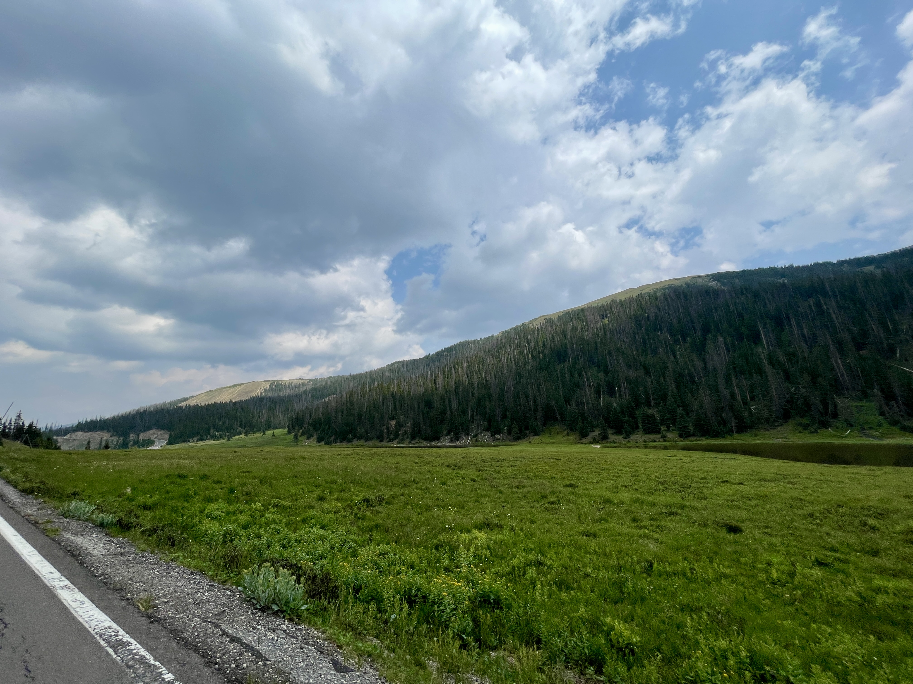

<br><details><summary>:camera:**24/IMG_0921.JPEG**</summary><sub> `Exif version` 0232 `OS version` 18.0 `Date` 2024:07:22 14:44:46 `Aperture` Not known `Brightness` 10.169809626436782 `Color space` 65535 `Compression` Not known`Exposure mode` 0 `Exposure time` 0.0007722007722007722 `Focal length` 1.54 `Lens model` iPhone 12 Pro Max back triple camera 1.54mm f/2.4 `Lens specification` (1.5399999618512084, 7.5, 1.6, 2.4) `Orientation` 1 `Scene type` Not known `f number` 2.4 `White balance` 0 `Sensing method` 2 `Shutter speed` 10.339111525318422</sub><sub>`Coordinates & altitude` (40.44727222222222, -105.75441666666667, 3545.716639209226)</sub><sub> :globe_with_meridians:`Location over` [Google Maps](http://maps.google.com/maps?q=40.44727222222222,-105.75441666666667) or [Openstreet Map](https://www.openstreetmap.org/query?lat=40.44727222222222&lon=-105.75441666666667)</sub></details>
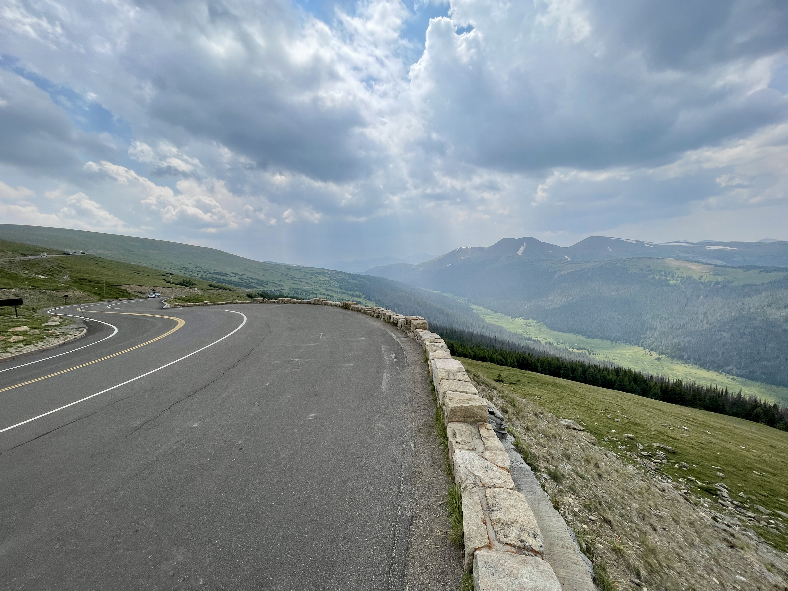

<br><details><summary>:camera:**24/IMG_0922.JPEG**</summary><sub> `Exif version` 0232 `OS version` 18.0 `Date` 2024:07:22 14:44:48 `Aperture` Not known `Brightness` 9.884709181807096 `Color space` 65535 `Compression` Not known`Exposure mode` 0 `Exposure time` 0.000980392156862745 `Focal length` 1.54 `Lens model` iPhone 12 Pro Max back triple camera 1.54mm f/2.4 `Lens specification` (1.5399999618512084, 7.5, 1.6, 2.4) `Orientation` 1 `Scene type` Not known `f number` 2.4 `White balance` 0 `Sensing method` 2 `Shutter speed` 9.994930629669156</sub><sub>`Coordinates & altitude` (40.447269444444444, -105.75441666666667, 3545.720792079208)</sub><sub> :globe_with_meridians:`Location over` [Google Maps](http://maps.google.com/maps?q=40.447269444444444,-105.75441666666667) or [Openstreet Map](https://www.openstreetmap.org/query?lat=40.447269444444444&lon=-105.75441666666667)</sub></details>
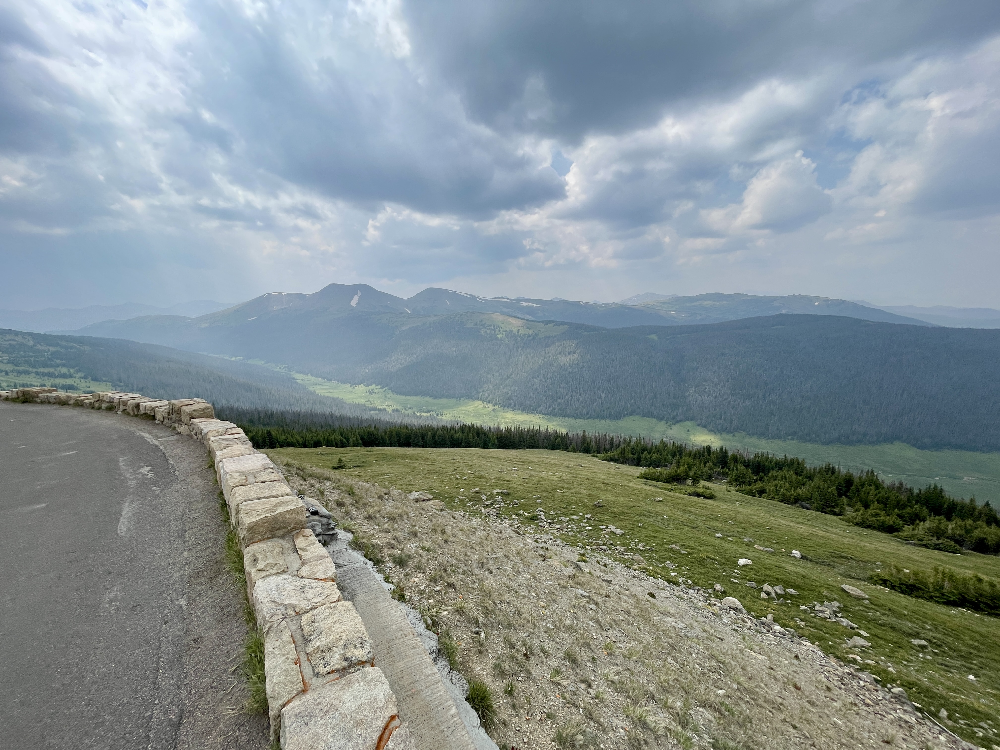

<br><details><summary>:camera:**24/IMG_0923.JPEG**</summary><sub> `Exif version` 0232 `OS version` 18.0 `Date` 2024:07:22 14:44:50 `Aperture` Not known `Brightness` 9.549348471165011 `Color space` 65535 `Compression` Not known`Exposure mode` 0 `Exposure time` 0.001314060446780552 `Focal length` 1.54 `Lens model` iPhone 12 Pro Max back triple camera 1.54mm f/2.4 `Lens specification` (1.5399999618512084, 7.5, 1.6, 2.4) `Orientation` 1 `Scene type` Not known `f number` 2.4 `White balance` 0 `Sensing method` 2 `Shutter speed` 9.571819010021256</sub><sub>`Coordinates & altitude` (40.447269444444444, -105.75441666666667, 3545.9583397862784)</sub><sub> :globe_with_meridians:`Location over` [Google Maps](http://maps.google.com/maps?q=40.447269444444444,-105.75441666666667) or [Openstreet Map](https://www.openstreetmap.org/query?lat=40.447269444444444&lon=-105.75441666666667)</sub></details>


<br><details><summary>:camera:**24/IMG_0924.JPEG**</summary><sub> `Exif version` 0232 `OS version` 18.0 `Date` 2024:07:22 14:44:52 `Aperture` Not known `Brightness` 9.50160482732058 `Color space` 65535 `Compression` Not known`Exposure mode` 0 `Exposure time` 0.0014184397163120568 `Focal length` 1.54 `Lens model` iPhone 12 Pro Max back triple camera 1.54mm f/2.4 `Lens specification` (1.5399999618512084, 7.5, 1.6, 2.4) `Orientation` 1 `Scene type` Not known `f number` 2.4 `White balance` 0 `Sensing method` 2 `Shutter speed` 9.461926753302546</sub><sub>`Coordinates & altitude` (40.447269444444444, -105.75441666666667, 3546.291836734694)</sub><sub> :globe_with_meridians:`Location over` [Google Maps](http://maps.google.com/maps?q=40.447269444444444,-105.75441666666667) or [Openstreet Map](https://www.openstreetmap.org/query?lat=40.447269444444444&lon=-105.75441666666667)</sub></details>


<br><details><summary>:camera:**24/IMG_0925.JPEG**</summary><sub> `Exif version` 0232 `OS version` 18.0 `Date` 2024:07:22 14:44:54 `Aperture` Not known `Brightness` 9.53749241044323 `Color space` 65535 `Compression` Not known`Exposure mode` 0 `Exposure time` 0.0011049723756906078 `Focal length` 1.54 `Lens model` iPhone 12 Pro Max back triple camera 1.54mm f/2.4 `Lens specification` (1.5399999618512084, 7.5, 1.6, 2.4) `Orientation` 1 `Scene type` Not known `f number` 2.4 `White balance` 0 `Sensing method` 2 `Shutter speed` 9.821737915618888</sub><sub>`Coordinates & altitude` (40.44727222222222, -105.75441666666667, 3546.303552206674)</sub><sub> :globe_with_meridians:`Location over` [Google Maps](http://maps.google.com/maps?q=40.44727222222222,-105.75441666666667) or [Openstreet Map](https://www.openstreetmap.org/query?lat=40.44727222222222&lon=-105.75441666666667)</sub></details>
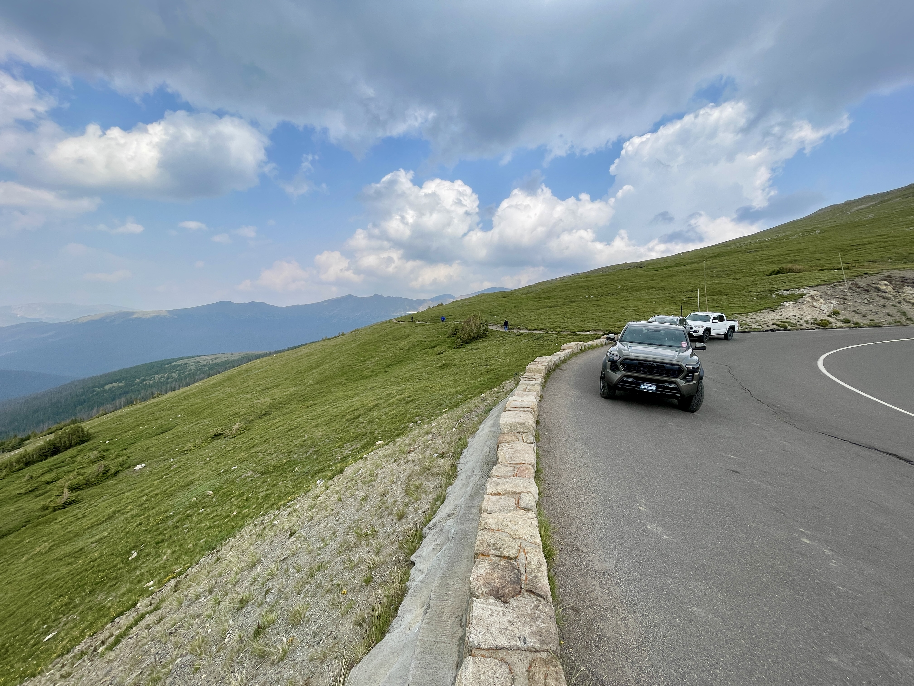

<br><details><summary>:camera:**24/IMG_0928.JPEG**</summary><sub> `Exif version` 0232 `OS version` 18.0 `Date` 2024:07:22 14:46:44 `Aperture` Not known `Brightness` 10.467777876816115 `Color space` 65535 `Compression` Not known`Exposure mode` 0 `Exposure time` 0.000177999288002848 `Focal length` 5.1 `Lens model` iPhone 12 Pro Max back triple camera 5.1mm f/1.6 `Lens specification` (1.5399999618512084, 7.5, 1.6, 2.4) `Orientation` 1 `Scene type` Not known `f number` 1.6 `White balance` 0 `Sensing method` 2 `Shutter speed` 12.455835145490317</sub><sub>`Coordinates & altitude` (40.44137222222222, -105.75566944444445, 3588.1058020477817)</sub><sub> :globe_with_meridians:`Location over` [Google Maps](http://maps.google.com/maps?q=40.44137222222222,-105.75566944444445) or [Openstreet Map](https://www.openstreetmap.org/query?lat=40.44137222222222&lon=-105.75566944444445)</sub></details>
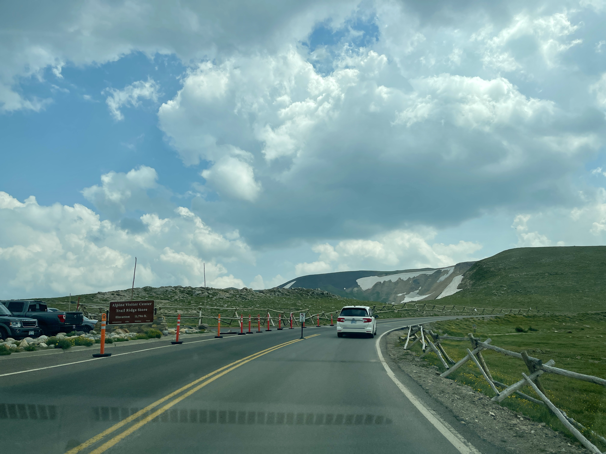

<br><details><summary>:camera:**24/IMG_0929.JPEG**</summary><sub> `Exif version` 0232 `OS version` 18.0 `Date` 2024:07:22 14:46:51 `Aperture` Not known `Brightness` 10.772293730901009 `Color space` 65535 `Compression` Not known`Exposure mode` 0 `Exposure time` 0.000143000143000143 `Focal length` 5.1 `Lens model` iPhone 12 Pro Max back triple camera 5.1mm f/1.6 `Lens specification` (1.5399999618512084, 7.5, 1.6, 2.4) `Orientation` 1 `Scene type` Not known `f number` 1.6 `White balance` 0 `Sensing method` 2 `Shutter speed` 12.771697240635117</sub><sub>`Coordinates & altitude` (40.44087777777777, -105.75575277777777, 3591.7151767151768)</sub><sub> :globe_with_meridians:`Location over` [Google Maps](http://maps.google.com/maps?q=40.44087777777777,-105.75575277777777) or [Openstreet Map](https://www.openstreetmap.org/query?lat=40.44087777777777&lon=-105.75575277777777)</sub></details>
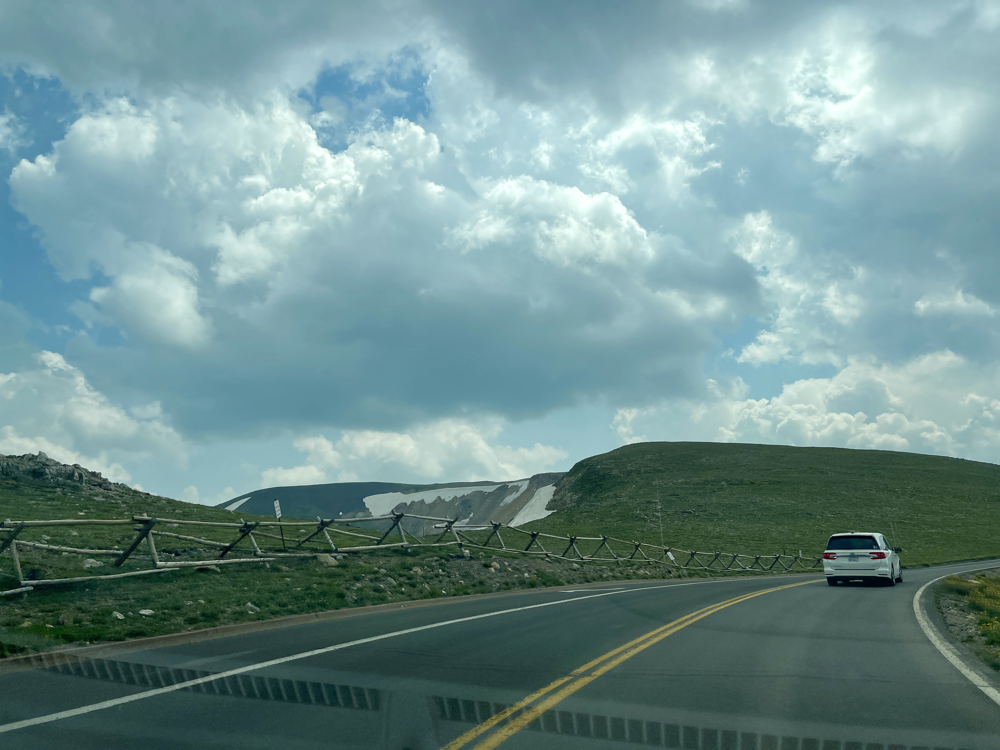

<br><details><summary>:camera:**24/IMG_0930.JPEG**</summary><sub> `Exif version` 0232 `OS version` 18.0 `Date` 2024:07:22 14:47:05 `Aperture` Not known `Brightness` 10.279976019184652 `Color space` 65535 `Compression` Not known`Exposure mode` 0 `Exposure time` 0.00021199915200339198 `Focal length` 5.1 `Lens model` iPhone 12 Pro Max back triple camera 5.1mm f/1.6 `Lens specification` (1.5399999618512084, 7.5, 1.6, 2.4) `Orientation` 1 `Scene type` Not known `f number` 1.6 `White balance` 0 `Sensing method` 2 `Shutter speed` 12.203648118217501</sub><sub>`Coordinates & altitude` (40.440061111111106, -105.7572111111111, 3597.216165413534)</sub><sub> :globe_with_meridians:`Location over` [Google Maps](http://maps.google.com/maps?q=40.440061111111106,-105.7572111111111) or [Openstreet Map](https://www.openstreetmap.org/query?lat=40.440061111111106&lon=-105.7572111111111)</sub></details>
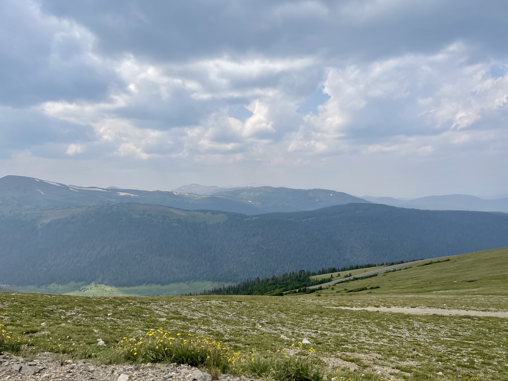

<br><details><summary>:camera:**24/IMG_0931.JPEG**</summary><sub> `Exif version` 0232 `OS version` 18.0 `Date` 2024:07:22 14:47:08 `Aperture` Not known `Brightness` 9.89237190302815 `Color space` 65535 `Compression` Not known`Exposure mode` 0 `Exposure time` 0.0002809778027535825 `Focal length` 5.1 `Lens model` iPhone 12 Pro Max back triple camera 5.1mm f/1.6 `Lens specification` (1.5399999618512084, 7.5, 1.6, 2.4) `Orientation` 1 `Scene type` Not known `f number` 1.6 `White balance` 0 `Sensing method` 2 `Shutter speed` 11.797142238579779</sub><sub>`Coordinates & altitude` (40.439947222222216, -105.7574861111111, 3598.255230125523)</sub><sub> :globe_with_meridians:`Location over` [Google Maps](http://maps.google.com/maps?q=40.439947222222216,-105.7574861111111) or [Openstreet Map](https://www.openstreetmap.org/query?lat=40.439947222222216&lon=-105.7574861111111)</sub></details>
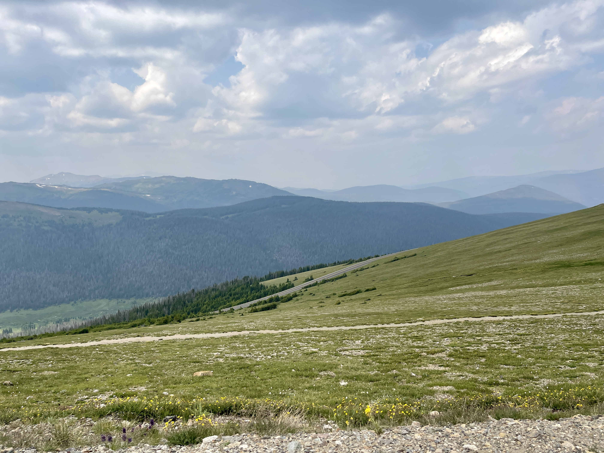

<br><details><summary>:camera:**24/IMG_0932.JPEG**</summary><sub> `Exif version` 0232 `OS version` 18.0 `Date` 2024:07:22 14:47:23 `Aperture` Not known `Brightness` 9.80291514836023 `Color space` 65535 `Compression` Not known`Exposure mode` 0 `Exposure time` 0.0002900232018561485 `Focal length` 5.1 `Lens model` iPhone 12 Pro Max back triple camera 5.1mm f/1.6 `Lens specification` (1.5399999618512084, 7.5, 1.6, 2.4) `Orientation` 1 `Scene type` Not known `f number` 1.6 `White balance` 0 `Sensing method` 2 `Shutter speed` 11.751659466863345</sub><sub>`Coordinates & altitude` (40.438919444444444, -105.75948333333334, 3608.1059782608695)</sub><sub> :globe_with_meridians:`Location over` [Google Maps](http://maps.google.com/maps?q=40.438919444444444,-105.75948333333334) or [Openstreet Map](https://www.openstreetmap.org/query?lat=40.438919444444444&lon=-105.75948333333334)</sub></details>
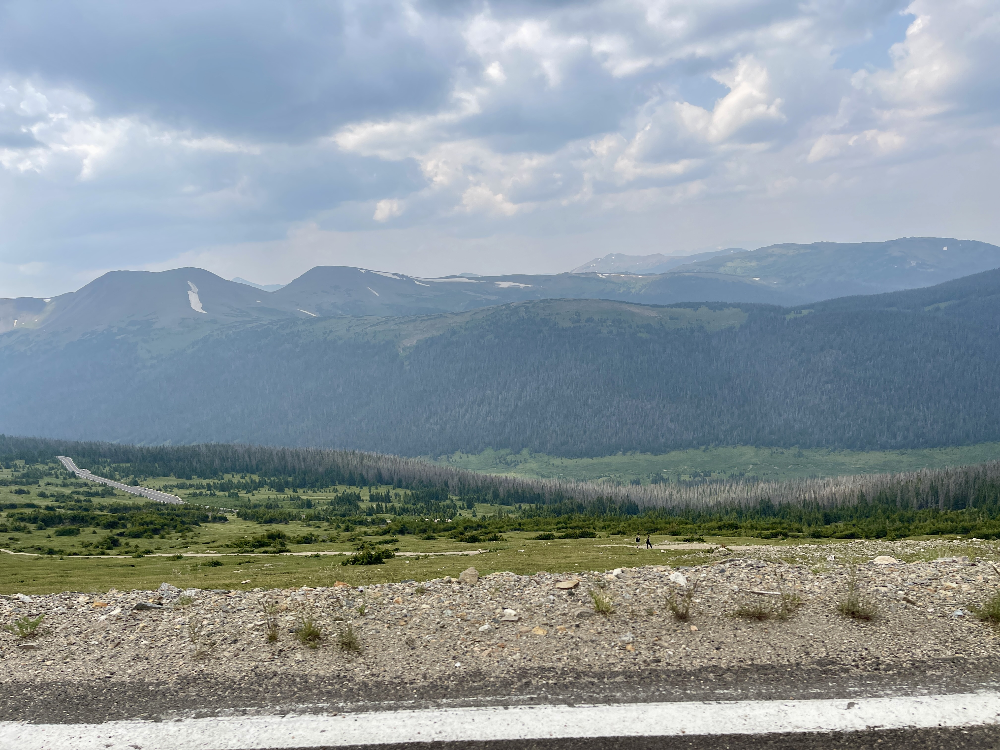

<br><details><summary>:camera:**24/IMG_0933.JPEG**</summary><sub> `Exif version` 0232 `OS version` 18.0 `Date` 2024:07:22 14:49:16 `Aperture` Not known `Brightness` 10.339602649006622 `Color space` 65535 `Compression` Not known`Exposure mode` 0 `Exposure time` 0.000646830530401035 `Focal length` 1.54 `Lens model` iPhone 12 Pro Max back triple camera 1.54mm f/2.4 `Lens specification` (1.5399999618512084, 7.5, 1.6, 2.4) `Orientation` 1 `Scene type` Not known `f number` 2.4 `White balance` 0 `Sensing method` 2 `Shutter speed` 10.593946658675456</sub><sub>`Coordinates & altitude` (40.43259444444444, -105.76841666666667, 3670.444668008048)</sub><sub> :globe_with_meridians:`Location over` [Google Maps](http://maps.google.com/maps?q=40.43259444444444,-105.76841666666667) or [Openstreet Map](https://www.openstreetmap.org/query?lat=40.43259444444444&lon=-105.76841666666667)</sub></details>
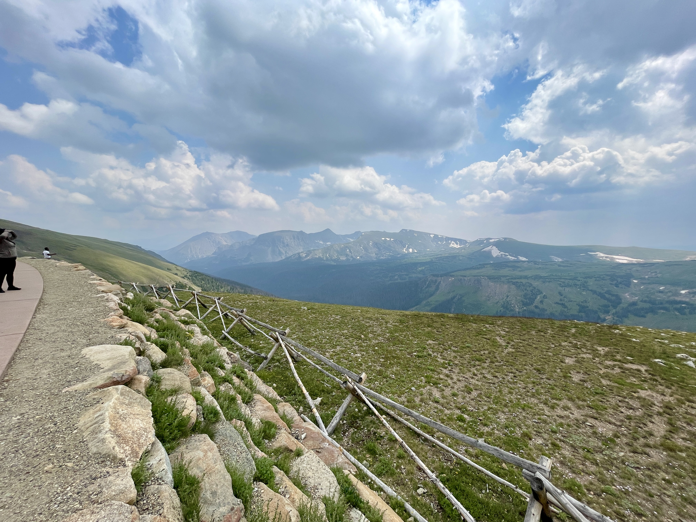

<br><details><summary>:camera:**24/IMG_0934.JPEG**</summary><sub> `Exif version` 0232 `OS version` 18.0 `Date` 2024:07:22 14:49:18 `Aperture` Not known `Brightness` 10.536613127608447 `Color space` 65535 `Compression` Not known`Exposure mode` 0 `Exposure time` 0.0005630630630630631 `Focal length` 1.54 `Lens model` iPhone 12 Pro Max back triple camera 1.54mm f/2.4 `Lens specification` (1.5399999618512084, 7.5, 1.6, 2.4) `Orientation` 1 `Scene type` Not known `f number` 2.4 `White balance` 0 `Sensing method` 2 `Shutter speed` 10.794577457089757</sub><sub>`Coordinates & altitude` (40.43259722222222, -105.76841666666667, 3670.2200557103065)</sub><sub> :globe_with_meridians:`Location over` [Google Maps](http://maps.google.com/maps?q=40.43259722222222,-105.76841666666667) or [Openstreet Map](https://www.openstreetmap.org/query?lat=40.43259722222222&lon=-105.76841666666667)</sub></details>
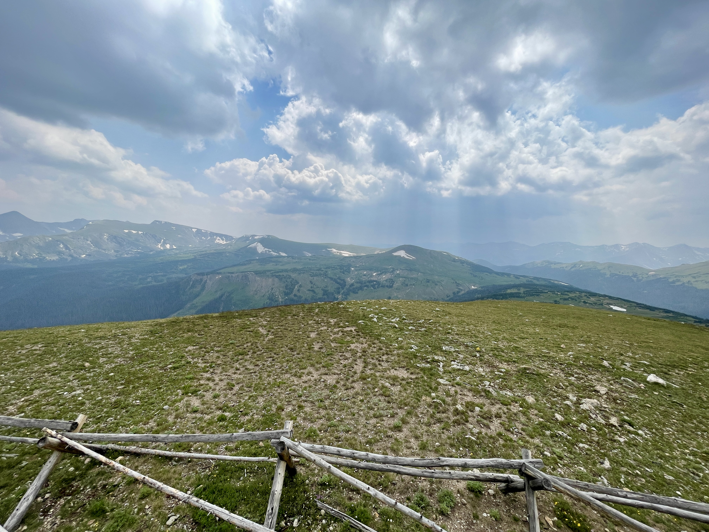

<br><details><summary>:camera:**24/IMG_0935.JPEG**</summary><sub> `Exif version` 0232 `OS version` 18.0 `Date` 2024:07:22 14:49:20 `Aperture` Not known `Brightness` 10.265007566840424 `Color space` 65535 `Compression` Not known`Exposure mode` 0 `Exposure time` 0.0005841121495327102 `Focal length` 1.54 `Lens model` iPhone 12 Pro Max back triple camera 1.54mm f/2.4 `Lens specification` (1.5399999618512084, 7.5, 1.6, 2.4) `Orientation` 1 `Scene type` Not known `f number` 2.4 `White balance` 0 `Sensing method` 2 `Shutter speed` 10.741744010360458</sub><sub>`Coordinates & altitude` (40.43259722222222, -105.768425, 3669.9353932584268)</sub><sub> :globe_with_meridians:`Location over` [Google Maps](http://maps.google.com/maps?q=40.43259722222222,-105.768425) or [Openstreet Map](https://www.openstreetmap.org/query?lat=40.43259722222222&lon=-105.768425)</sub></details>


<br><details><summary>:camera:**24/IMG_0936.JPEG**</summary><sub> `Exif version` 0232 `OS version` 18.0 `Date` 2024:07:22 14:49:22 `Aperture` Not known `Brightness` 10.106694251514703 `Color space` 65535 `Compression` Not known`Exposure mode` 0 `Exposure time` 0.0008340283569641367 `Focal length` 1.54 `Lens model` iPhone 12 Pro Max back triple camera 1.54mm f/2.4 `Lens specification` (1.5399999618512084, 7.5, 1.6, 2.4) `Orientation` 1 `Scene type` Not known `f number` 2.4 `White balance` 0 `Sensing method` 2 `Shutter speed` 10.227665005469795</sub><sub>`Coordinates & altitude` (40.43259722222222, -105.768425, 3668.8006230529595)</sub><sub> :globe_with_meridians:`Location over` [Google Maps](http://maps.google.com/maps?q=40.43259722222222,-105.768425) or [Openstreet Map](https://www.openstreetmap.org/query?lat=40.43259722222222&lon=-105.768425)</sub></details>
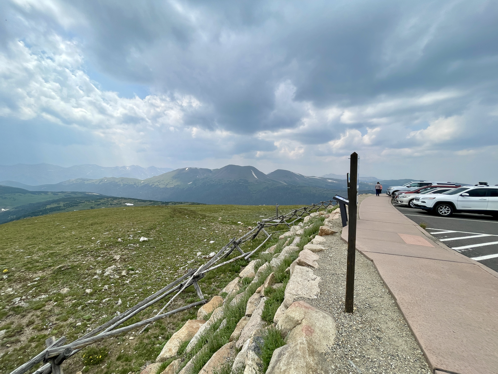

<br><details><summary>:camera:**24/IMG_0938.JPEG**</summary><sub> `Exif version` 0232 `OS version` 18.0 `Date` 2024:07:22 14:49:45 `Aperture` Not known `Brightness` 8.83982552241834 `Color space` 65535 `Compression` Not known`Exposure mode` 0 `Exposure time` 0.0017513134851138354 `Focal length` 1.54 `Lens model` iPhone 12 Pro Max back triple camera 1.54mm f/2.4 `Lens specification` (1.5399999618512084, 7.5, 1.6, 2.4) `Orientation` 1 `Scene type` Not known `f number` 2.4 `White balance` 0 `Sensing method` 2 `Shutter speed` 9.156781508940252</sub><sub>`Coordinates & altitude` (40.43258888888889, -105.76840277777778, 3671.498866213152)</sub><sub> :globe_with_meridians:`Location over` [Google Maps](http://maps.google.com/maps?q=40.43258888888889,-105.76840277777778) or [Openstreet Map](https://www.openstreetmap.org/query?lat=40.43258888888889&lon=-105.76840277777778)</sub></details>


<br><details><summary>:camera:**24/IMG_0939.JPEG**</summary><sub> `Exif version` 0232 `OS version` 18.0 `Date` 2024:07:22 14:49:48 `Aperture` Not known `Brightness` 9.354029018227697 `Color space` 65535 `Compression` Not known`Exposure mode` 0 `Exposure time` 0.001937984496124031 `Focal length` 1.54 `Lens model` iPhone 12 Pro Max back triple camera 1.54mm f/2.4 `Lens specification` (1.5399999618512084, 7.5, 1.6, 2.4) `Orientation` 1 `Scene type` Not known `f number` 2.4 `White balance` 0 `Sensing method` 2 `Shutter speed` 9.01047148533992</sub><sub>`Coordinates & altitude` (40.43258333333333, -105.76840277777778, 3672.3855855855854)</sub><sub> :globe_with_meridians:`Location over` [Google Maps](http://maps.google.com/maps?q=40.43258333333333,-105.76840277777778) or [Openstreet Map](https://www.openstreetmap.org/query?lat=40.43258333333333&lon=-105.76840277777778)</sub></details>


<br><details><summary>:camera:**24/IMG_0940.JPEG**</summary><sub> `Exif version` 0232 `OS version` 18.0 `Date` 2024:07:22 14:49:52 `Aperture` Not known `Brightness` 10.115521643607861 `Color space` 65535 `Compression` Not known`Exposure mode` 0 `Exposure time` 0.0007507507507507507 `Focal length` 1.54 `Lens model` iPhone 12 Pro Max back triple camera 1.54mm f/2.4 `Lens specification` (1.5399999618512084, 7.5, 1.6, 2.4) `Orientation` 1 `Scene type` Not known `f number` 2.4 `White balance` 0 `Sensing method` 2 `Shutter speed` 10.378899480069324</sub><sub>`Coordinates & altitude` (40.43258611111111, -105.7684111111111, 3672.0271903323264)</sub><sub> :globe_with_meridians:`Location over` [Google Maps](http://maps.google.com/maps?q=40.43258611111111,-105.7684111111111) or [Openstreet Map](https://www.openstreetmap.org/query?lat=40.43258611111111&lon=-105.7684111111111)</sub></details>


<br><details><summary>:camera:**24/IMG_0941.JPEG**</summary><sub> `Exif version` 0232 `OS version` 18.0 `Date` 2024:07:22 14:50:33 `Aperture` Not known `Brightness` 9.796546322542145 `Color space` 65535 `Compression` Not known`Exposure mode` 0 `Exposure time` 0.00072992700729927 `Focal length` 1.54 `Lens model` iPhone 12 Pro Max back triple camera 1.54mm f/2.4 `Lens specification` (1.5399999618512084, 7.5, 1.6, 2.4) `Orientation` 1 `Scene type` Not known `f number` 2.4 `White balance` 0 `Sensing method` 2 `Shutter speed` 10.419815917704385</sub><sub>`Coordinates & altitude` (40.432655555555556, -105.76849444444444, 3666.2762096774195)</sub><sub> :globe_with_meridians:`Location over` [Google Maps](http://maps.google.com/maps?q=40.432655555555556,-105.76849444444444) or [Openstreet Map](https://www.openstreetmap.org/query?lat=40.432655555555556&lon=-105.76849444444444)</sub></details>


<br><details><summary>:camera:**24/IMG_0942.JPEG**</summary><sub> `Exif version` 0232 `OS version` 18.0 `Date` 2024:07:22 14:51:32 `Aperture` Not known `Brightness` 10.683531733561274 `Color space` 65535 `Compression` Not known`Exposure mode` 0 `Exposure time` 0.0001519987840097279 `Focal length` 5.1 `Lens model` iPhone 12 Pro Max back triple camera 5.1mm f/1.6 `Lens specification` (1.5399999618512084, 7.5, 1.6, 2.4) `Orientation` 1 `Scene type` Not known `f number` 1.6 `White balance` 0 `Sensing method` 2 `Shutter speed` 12.683641067858403</sub><sub>`Coordinates & altitude` (40.43246388888889, -105.76576111111112, 3676.6697674418606)</sub><sub> :globe_with_meridians:`Location over` [Google Maps](http://maps.google.com/maps?q=40.43246388888889,-105.76576111111112) or [Openstreet Map](https://www.openstreetmap.org/query?lat=40.43246388888889&lon=-105.76576111111112)</sub></details>
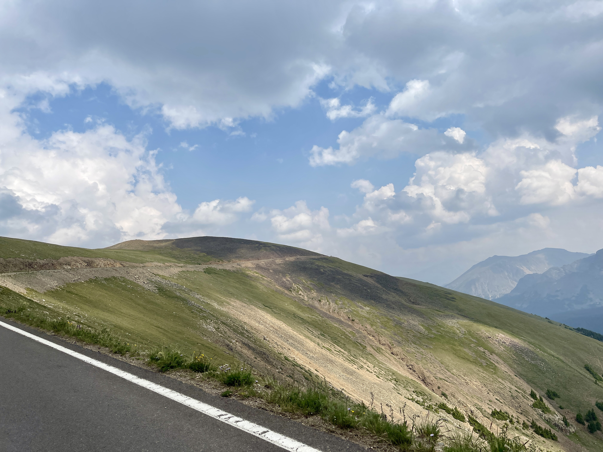

<br><details><summary>:camera:**24/IMG_0943.JPEG**</summary><sub> `Exif version` 0232 `OS version` 18.0 `Date` 2024:07:22 14:51:34 `Aperture` Not known `Brightness` 10.362936693578812 `Color space` 65535 `Compression` Not known`Exposure mode` 0 `Exposure time` 0.00018601190476190475 `Focal length` 5.1 `Lens model` iPhone 12 Pro Max back triple camera 5.1mm f/1.6 `Lens specification` (1.5399999618512084, 7.5, 1.6, 2.4) `Orientation` 1 `Scene type` Not known `f number` 1.6 `White balance` 0 `Sensing method` 2 `Shutter speed` 12.392409761529182</sub><sub>`Coordinates & altitude` (40.43248333333333, -105.76544166666666, 3678.892420537897)</sub><sub> :globe_with_meridians:`Location over` [Google Maps](http://maps.google.com/maps?q=40.43248333333333,-105.76544166666666) or [Openstreet Map](https://www.openstreetmap.org/query?lat=40.43248333333333&lon=-105.76544166666666)</sub></details>
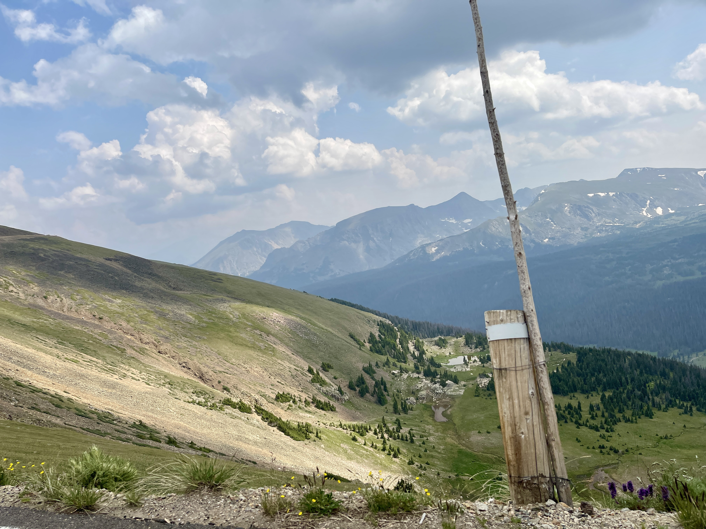

<br><details><summary>:camera:**24/IMG_0944.JPEG**</summary><sub> `Exif version` 0232 `OS version` 18.0 `Date` 2024:07:22 14:51:36 `Aperture` Not known `Brightness` 10.180696534826742 `Color space` 65535 `Compression` Not known`Exposure mode` 0 `Exposure time` 0.0002039983680130559 `Focal length` 5.1 `Lens model` iPhone 12 Pro Max back triple camera 5.1mm f/1.6 `Lens specification` (1.5399999618512084, 7.5, 1.6, 2.4) `Orientation` 1 `Scene type` Not known `f number` 1.6 `White balance` 0 `Sensing method` 2 `Shutter speed` 12.259143251957623</sub><sub>`Coordinates & altitude` (40.432494444444444, -105.76496944444445, 3682.2967213114753)</sub><sub> :globe_with_meridians:`Location over` [Google Maps](http://maps.google.com/maps?q=40.432494444444444,-105.76496944444445) or [Openstreet Map](https://www.openstreetmap.org/query?lat=40.432494444444444&lon=-105.76496944444445)</sub></details>
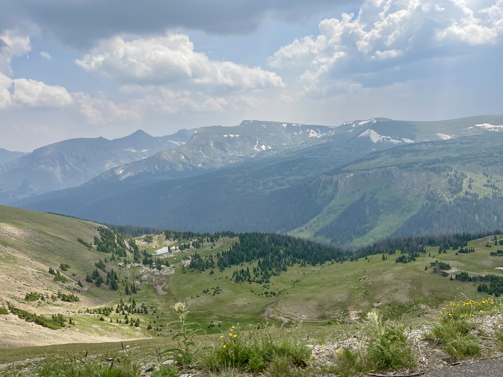

<br><details><summary>:camera:**24/IMG_0945.JPEG**</summary><sub> `Exif version` 0232 `OS version` 18.0 `Date` 2024:07:22 14:51:44 `Aperture` Not known `Brightness` 10.23721452639461 `Color space` 65535 `Compression` Not known`Exposure mode` 0 `Exposure time` 0.0001950078003120125 `Focal length` 5.1 `Lens model` iPhone 12 Pro Max back triple camera 5.1mm f/1.6 `Lens specification` (1.5399999618512084, 7.5, 1.6, 2.4) `Orientation` 1 `Scene type` Not known `f number` 1.6 `White balance` 0 `Sensing method` 2 `Shutter speed` 12.324238250989843</sub><sub>`Coordinates & altitude` (40.43241111111111, -105.76381111111111, 3686.4783783783782)</sub><sub> :globe_with_meridians:`Location over` [Google Maps](http://maps.google.com/maps?q=40.43241111111111,-105.76381111111111) or [Openstreet Map](https://www.openstreetmap.org/query?lat=40.43241111111111&lon=-105.76381111111111)</sub></details>
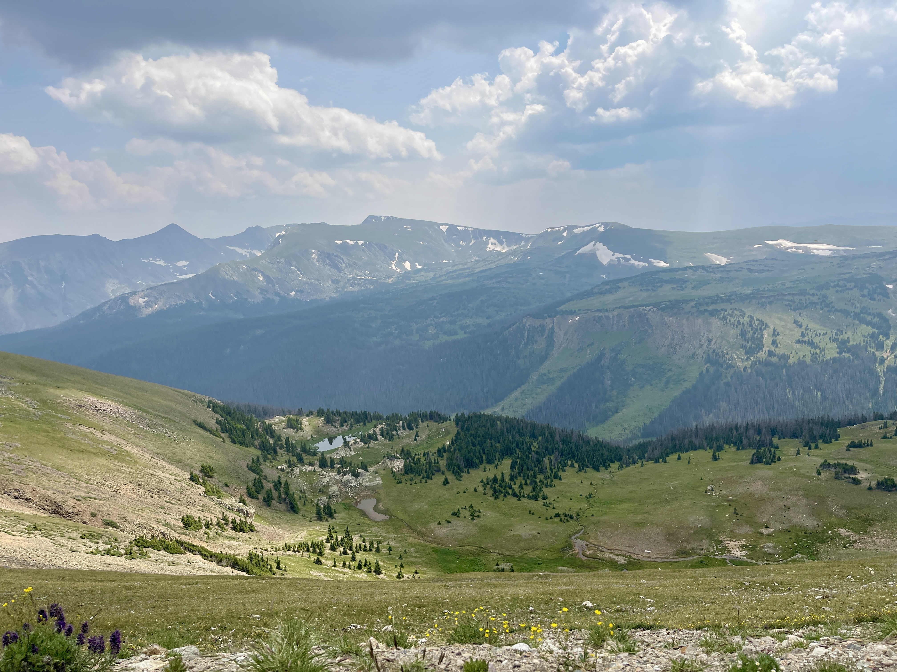

<br><details><summary>:camera:**24/IMG_0946.JPEG**</summary><sub> `Exif version` 0232 `OS version` 18.0 `Date` 2024:07:22 14:52:31 `Aperture` Not known `Brightness` 10.970925022403664 `Color space` 65535 `Compression` Not known`Exposure mode` 0 `Exposure time` 0.00031298904538341156 `Focal length` 1.54 `Lens model` iPhone 12 Pro Max back triple camera 1.54mm f/2.4 `Lens specification` (1.5399999618512084, 7.5, 1.6, 2.4) `Orientation` 1 `Scene type` Not known `f number` 2.4 `White balance` 0 `Sensing method` 2 `Shutter speed` 11.641549725442342</sub><sub>`Coordinates & altitude` (40.428355555555555, -105.75962777777778, 3711.8811881188117)</sub><sub> :globe_with_meridians:`Location over` [Google Maps](http://maps.google.com/maps?q=40.428355555555555,-105.75962777777778) or [Openstreet Map](https://www.openstreetmap.org/query?lat=40.428355555555555&lon=-105.75962777777778)</sub></details>
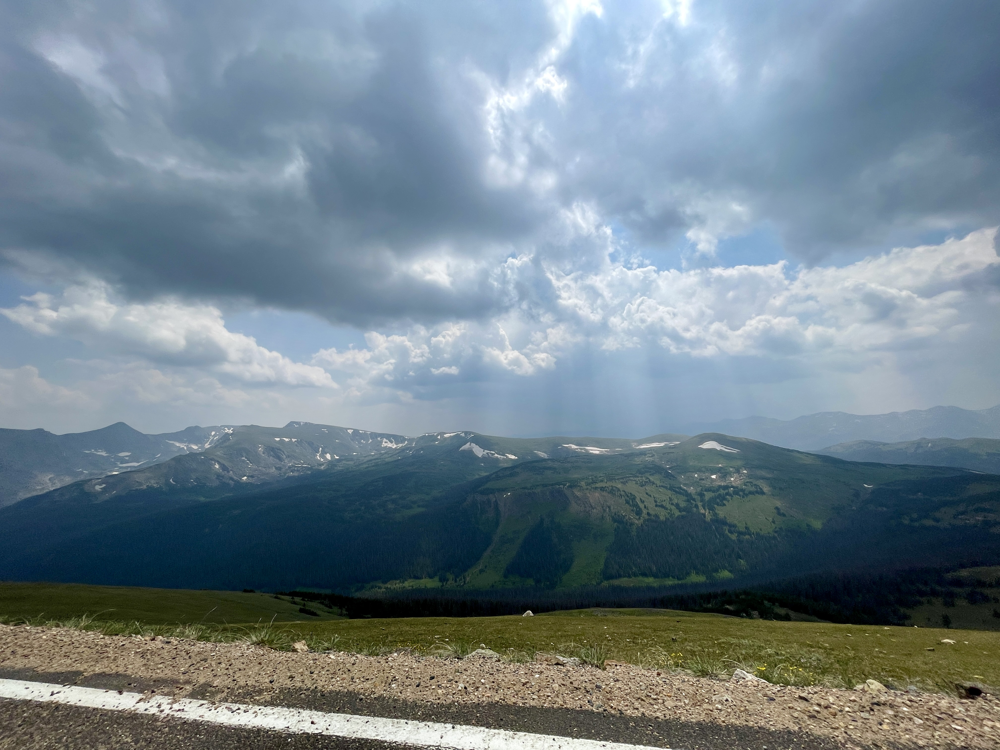

<br><details><summary>:camera:**24/IMG_0947.JPEG**</summary><sub> `Exif version` 0232 `OS version` 18.0 `Date` 2024:07:22 14:52:35 `Aperture` Not known `Brightness` 10.768998735039409 `Color space` 65535 `Compression` Not known`Exposure mode` 0 `Exposure time` 0.00037593984962406017 `Focal length` 1.54 `Lens model` iPhone 12 Pro Max back triple camera 1.54mm f/2.4 `Lens specification` (1.5399999618512084, 7.5, 1.6, 2.4) `Orientation` 1 `Scene type` Not known `f number` 2.4 `White balance` 0 `Sensing method` 2 `Shutter speed` 11.376979723595278</sub><sub>`Coordinates & altitude` (40.428105555555554, -105.75939166666667, 3711.5843230403802)</sub><sub> :globe_with_meridians:`Location over` [Google Maps](http://maps.google.com/maps?q=40.428105555555554,-105.75939166666667) or [Openstreet Map](https://www.openstreetmap.org/query?lat=40.428105555555554&lon=-105.75939166666667)</sub></details>
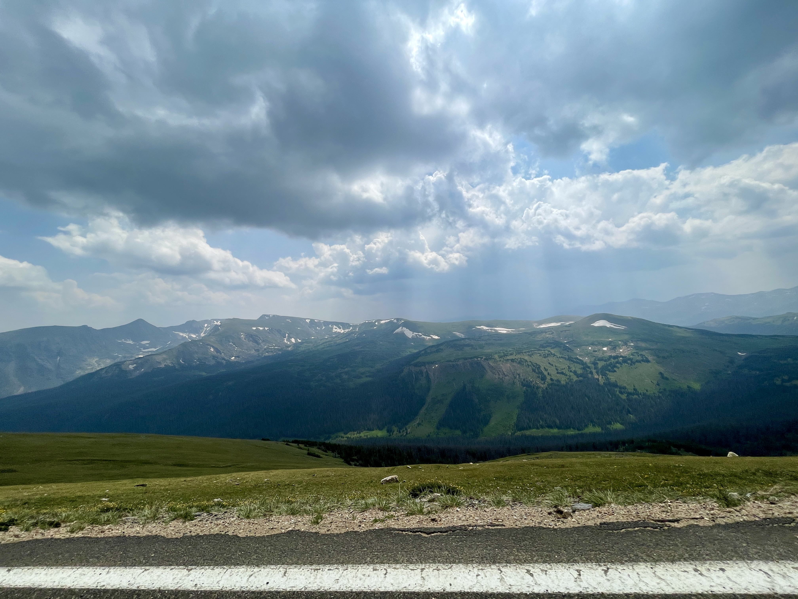

<br><details><summary>:camera:**24/IMG_0948.JPEG**</summary><sub> `Exif version` 0232 `OS version` 18.0 `Date` 2024:07:22 14:53:54 `Aperture` Not known `Brightness` 9.757218456967784 `Color space` 65535 `Compression` Not known`Exposure mode` 0 `Exposure time` 0.0011049723756906078 `Focal length` 1.54 `Lens model` iPhone 12 Pro Max back triple camera 1.54mm f/2.4 `Lens specification` (1.5399999618512084, 7.5, 1.6, 2.4) `Orientation` 1 `Scene type` Not known `f number` 2.4 `White balance` 0 `Sensing method` 2 `Shutter speed` 9.821737915618888</sub><sub>`Coordinates & altitude` (40.424819444444445, -105.75332777777778, 3686.333830104322)</sub><sub> :globe_with_meridians:`Location over` [Google Maps](http://maps.google.com/maps?q=40.424819444444445,-105.75332777777778) or [Openstreet Map](https://www.openstreetmap.org/query?lat=40.424819444444445&lon=-105.75332777777778)</sub></details>


<br><details><summary>:camera:**24/IMG_0949.JPEG**</summary><sub> `Exif version` 0232 `OS version` 18.0 `Date` 2024:07:22 14:54:01 `Aperture` Not known `Brightness` 9.822524233036875 `Color space` 65535 `Compression` Not known`Exposure mode` 0 `Exposure time` 0.0009389671361502347 `Focal length` 1.54 `Lens model` iPhone 12 Pro Max back triple camera 1.54mm f/2.4 `Lens specification` (1.5399999618512084, 7.5, 1.6, 2.4) `Orientation` 1 `Scene type` Not known `f number` 2.4 `White balance` 0 `Sensing method` 2 `Shutter speed` 10.056587220353853</sub><sub>`Coordinates & altitude` (40.42480833333333, -105.75333333333333, 3685.916835699797)</sub><sub> :globe_with_meridians:`Location over` [Google Maps](http://maps.google.com/maps?q=40.42480833333333,-105.75333333333333) or [Openstreet Map](https://www.openstreetmap.org/query?lat=40.42480833333333&lon=-105.75333333333333)</sub></details>
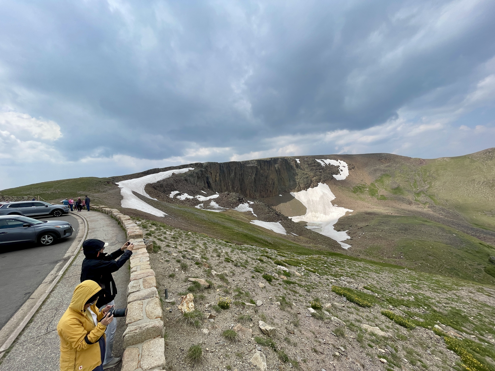

<br><details><summary>:camera:**24/IMG_0950.JPEG**</summary><sub> `Exif version` 0232 `OS version` 18.0 `Date` 2024:07:22 14:54:07 `Aperture` Not known `Brightness` 9.855898998693949 `Color space` 65535 `Compression` Not known`Exposure mode` 0 `Exposure time` 0.0011049723756906078 `Focal length` 1.54 `Lens model` iPhone 12 Pro Max back triple camera 1.54mm f/2.4 `Lens specification` (1.5399999618512084, 7.5, 1.6, 2.4) `Orientation` 1 `Scene type` Not known `f number` 2.4 `White balance` 0 `Sensing method` 2 `Shutter speed` 9.821737915618888</sub><sub>`Coordinates & altitude` (40.42480833333333, -105.75333333333333, 3685.7351916376306)</sub><sub> :globe_with_meridians:`Location over` [Google Maps](http://maps.google.com/maps?q=40.42480833333333,-105.75333333333333) or [Openstreet Map](https://www.openstreetmap.org/query?lat=40.42480833333333&lon=-105.75333333333333)</sub></details>


<br><details><summary>:camera:**24/IMG_0951.JPEG**</summary><sub> `Exif version` 0232 `OS version` 18.0 `Date` 2024:07:22 14:54:09 `Aperture` Not known `Brightness` 9.532346109175377 `Color space` 65535 `Compression` Not known`Exposure mode` 0 `Exposure time` 0.0011890606420927466 `Focal length` 1.54 `Lens model` iPhone 12 Pro Max back triple camera 1.54mm f/2.4 `Lens specification` (1.5399999618512084, 7.5, 1.6, 2.4) `Orientation` 1 `Scene type` Not known `f number` 2.4 `White balance` 0 `Sensing method` 2 `Shutter speed` 9.716035551572187</sub><sub>`Coordinates & altitude` (40.42480555555555, -105.75334166666667, 3685.936855670103)</sub><sub> :globe_with_meridians:`Location over` [Google Maps](http://maps.google.com/maps?q=40.42480555555555,-105.75334166666667) or [Openstreet Map](https://www.openstreetmap.org/query?lat=40.42480555555555&lon=-105.75334166666667)</sub></details>


<br><details><summary>:camera:**24/IMG_0952.JPEG**</summary><sub> `Exif version` 0232 `OS version` 18.0 `Date` 2024:07:22 14:54:11 `Aperture` Not known `Brightness` 9.533546997320444 `Color space` 65535 `Compression` Not known`Exposure mode` 0 `Exposure time` 0.0010638297872340426 `Focal length` 1.54 `Lens model` iPhone 12 Pro Max back triple camera 1.54mm f/2.4 `Lens specification` (1.5399999618512084, 7.5, 1.6, 2.4) `Orientation` 1 `Scene type` Not known `f number` 2.4 `White balance` 0 `Sensing method` 2 `Shutter speed` 9.876286134247918</sub><sub>`Coordinates & altitude` (40.42480555555555, -105.75334166666667, 3685.9461358313815)</sub><sub> :globe_with_meridians:`Location over` [Google Maps](http://maps.google.com/maps?q=40.42480555555555,-105.75334166666667) or [Openstreet Map](https://www.openstreetmap.org/query?lat=40.42480555555555&lon=-105.75334166666667)</sub></details>


<br><details><summary>:camera:**24/IMG_0953.JPEG**</summary><sub> `Exif version` 0232 `OS version` 18.0 `Date` 2024:07:22 14:54:12 `Aperture` Not known `Brightness` 9.632913226133565 `Color space` 65535 `Compression` Not known`Exposure mode` 0 `Exposure time` 0.0010638297872340426 `Focal length` 1.54 `Lens model` iPhone 12 Pro Max back triple camera 1.54mm f/2.4 `Lens specification` (1.5399999618512084, 7.5, 1.6, 2.4) `Orientation` 1 `Scene type` Not known `f number` 2.4 `White balance` 0 `Sensing method` 2 `Shutter speed` 9.876286134247918</sub><sub>`Coordinates & altitude` (40.42480555555555, -105.75334166666667, 3686.0721088435375)</sub><sub> :globe_with_meridians:`Location over` [Google Maps](http://maps.google.com/maps?q=40.42480555555555,-105.75334166666667) or [Openstreet Map](https://www.openstreetmap.org/query?lat=40.42480555555555&lon=-105.75334166666667)</sub></details>


<br><details><summary>:camera:**24/IMG_0954.JPEG**</summary><sub> `Exif version` 0232 `OS version` 18.0 `Date` 2024:07:22 14:54:14 `Aperture` Not known `Brightness` 9.753913423699169 `Color space` 65535 `Compression` Not known`Exposure mode` 0 `Exposure time` 0.0011261261261261261 `Focal length` 1.54 `Lens model` iPhone 12 Pro Max back triple camera 1.54mm f/2.4 `Lens specification` (1.5399999618512084, 7.5, 1.6, 2.4) `Orientation` 1 `Scene type` Not known `f number` 2.4 `White balance` 0 `Sensing method` 2 `Shutter speed` 9.794577457089757</sub><sub>`Coordinates & altitude` (40.42480555555555, -105.75333333333333, 3685.857268722467)</sub><sub> :globe_with_meridians:`Location over` [Google Maps](http://maps.google.com/maps?q=40.42480555555555,-105.75333333333333) or [Openstreet Map](https://www.openstreetmap.org/query?lat=40.42480555555555&lon=-105.75333333333333)</sub></details>


<br><details><summary>:camera:**24/IMG_0955.JPEG**</summary><sub> `Exif version` 0232 `OS version` 18.0 `Date` 2024:07:22 14:54:15 `Aperture` Not known `Brightness` 9.884976525821596 `Color space` 65535 `Compression` Not known`Exposure mode` 0 `Exposure time` 0.0010638297872340426 `Focal length` 1.54 `Lens model` iPhone 12 Pro Max back triple camera 1.54mm f/2.4 `Lens specification` (1.5399999618512084, 7.5, 1.6, 2.4) `Orientation` 1 `Scene type` Not known `f number` 2.4 `White balance` 0 `Sensing method` 2 `Shutter speed` 9.876286134247918</sub><sub>`Coordinates & altitude` (40.42480555555555, -105.75333333333333, 3685.7449596774195)</sub><sub> :globe_with_meridians:`Location over` [Google Maps](http://maps.google.com/maps?q=40.42480555555555,-105.75333333333333) or [Openstreet Map](https://www.openstreetmap.org/query?lat=40.42480555555555&lon=-105.75333333333333)</sub></details>


<br><details><summary>:camera:**24/IMG_0957.JPEG**</summary><sub> `Exif version` 0232 `OS version` 18.0 `Date` 2024:07:22 14:54:41 `Aperture` Not known `Brightness` 9.770509977827052 `Color space` 65535 `Compression` Not known`Exposure mode` 0 `Exposure time` 0.0002900232018561485 `Focal length` 5.1 `Lens model` iPhone 12 Pro Max back triple camera 5.1mm f/1.6 `Lens specification` (1.5399999618512084, 7.5, 1.6, 2.4) `Orientation` 1 `Scene type` Not known `f number` 1.6 `White balance` 0 `Sensing method` 2 `Shutter speed` 11.751659466863345</sub><sub>`Coordinates & altitude` (40.42483055555555, -105.75332777777778, 3690.3191800878476)</sub><sub> :globe_with_meridians:`Location over` [Google Maps](http://maps.google.com/maps?q=40.42483055555555,-105.75332777777778) or [Openstreet Map](https://www.openstreetmap.org/query?lat=40.42483055555555&lon=-105.75332777777778)</sub></details>


<br><details><summary>:camera:**24/IMG_0958.JPEG**</summary><sub> `Exif version` 0232 `OS version` 18.0 `Date` 2024:07:22 14:54:45 `Aperture` Not known `Brightness` 9.632781663319715 `Color space` 65535 `Compression` Not known`Exposure mode` 0 `Exposure time` 0.00030703101013202335 `Focal length` 5.1 `Lens model` iPhone 12 Pro Max back triple camera 5.1mm f/1.6 `Lens specification` (1.5399999618512084, 7.5, 1.6, 2.4) `Orientation` 1 `Scene type` Not known `f number` 1.6 `White balance` 0 `Sensing method` 2 `Shutter speed` 11.669473724050489</sub><sub>`Coordinates & altitude` (40.42483055555555, -105.75332777777778, 3691.11214953271)</sub><sub> :globe_with_meridians:`Location over` [Google Maps](http://maps.google.com/maps?q=40.42483055555555,-105.75332777777778) or [Openstreet Map](https://www.openstreetmap.org/query?lat=40.42483055555555&lon=-105.75332777777778)</sub></details>


<br><details><summary>:camera:**24/IMG_0959.JPEG**</summary><sub> `Exif version` 0232 `OS version` 18.0 `Date` 2024:07:22 14:56:11 `Aperture` Not known `Brightness` 9.67844503428445 `Color space` 65535 `Compression` Not known`Exposure mode` 0 `Exposure time` 0.0009182736455463728 `Focal length` 1.54 `Lens model` iPhone 12 Pro Max back triple camera 1.54mm f/2.4 `Lens specification` (1.5399999618512084, 7.5, 1.6, 2.4) `Orientation` 1 `Scene type` Not known `f number` 2.4 `White balance` 0 `Sensing method` 2 `Shutter speed` 10.089218221603343</sub><sub>`Coordinates & altitude` (40.42480555555555, -105.75384444444444, 3688.1518438177873)</sub><sub> :globe_with_meridians:`Location over` [Google Maps](http://maps.google.com/maps?q=40.42480555555555,-105.75384444444444) or [Openstreet Map](https://www.openstreetmap.org/query?lat=40.42480555555555&lon=-105.75384444444444)</sub></details>


<br><details><summary>:camera:**24/IMG_0960.JPEG**</summary><sub> `Exif version` 0232 `OS version` 18.0 `Date` 2024:07:22 14:56:16 `Aperture` Not known `Brightness` 9.753719669686056 `Color space` 65535 `Compression` Not known`Exposure mode` 0 `Exposure time` 0.001001001001001001 `Focal length` 1.54 `Lens model` iPhone 12 Pro Max back triple camera 1.54mm f/2.4 `Lens specification` (1.5399999618512084, 7.5, 1.6, 2.4) `Orientation` 1 `Scene type` Not known `f number` 2.4 `White balance` 0 `Sensing method` 2 `Shutter speed` 9.964342313787638</sub><sub>`Coordinates & altitude` (40.42480833333333, -105.7538611111111, 3688.4608879492603)</sub><sub> :globe_with_meridians:`Location over` [Google Maps](http://maps.google.com/maps?q=40.42480833333333,-105.7538611111111) or [Openstreet Map](https://www.openstreetmap.org/query?lat=40.42480833333333&lon=-105.7538611111111)</sub></details>


<br><details><summary>:camera:**24/IMG_0962.JPEG**</summary><sub> `Exif version` 0232 `OS version` 18.0 `Date` 2024:07:22 14:56:25 `Aperture` Not known `Brightness` 10.215696001587458 `Color space` 65535 `Compression` Not known`Exposure mode` 0 `Exposure time` 0.0009182736455463728 `Focal length` 1.54 `Lens model` iPhone 12 Pro Max back triple camera 1.54mm f/2.4 `Lens specification` (1.5399999618512084, 7.5, 1.6, 2.4) `Orientation` 1 `Scene type` Not known `f number` 2.4 `White balance` 0 `Sensing method` 2 `Shutter speed` 10.089218221603343</sub><sub>`Coordinates & altitude` (40.42480277777778, -105.7538611111111, 3687.7340206185568)</sub><sub> :globe_with_meridians:`Location over` [Google Maps](http://maps.google.com/maps?q=40.42480277777778,-105.7538611111111) or [Openstreet Map](https://www.openstreetmap.org/query?lat=40.42480277777778&lon=-105.7538611111111)</sub></details>


<br><details><summary>:camera:**24/IMG_0963.JPEG**</summary><sub> `Exif version` 0232 `OS version` 18.0 `Date` 2024:07:22 14:56:36 `Aperture` Not known `Brightness` 9.965478083125141 `Color space` 65535 `Compression` Not known`Exposure mode` 0 `Exposure time` 0.0008968609865470852 `Focal length` 1.54 `Lens model` iPhone 12 Pro Max back triple camera 1.54mm f/2.4 `Lens specification` (1.5399999618512084, 7.5, 1.6, 2.4) `Orientation` 1 `Scene type` Not known `f number` 2.4 `White balance` 0 `Sensing method` 2 `Shutter speed` 10.12260439142023</sub><sub>`Coordinates & altitude` (40.42480833333333, -105.7538611111111, 3688.195928753181)</sub><sub> :globe_with_meridians:`Location over` [Google Maps](http://maps.google.com/maps?q=40.42480833333333,-105.7538611111111) or [Openstreet Map](https://www.openstreetmap.org/query?lat=40.42480833333333&lon=-105.7538611111111)</sub></details>


<br><details><summary>:camera:**24/IMG_0965.JPEG**</summary><sub> `Exif version` 0232 `OS version` 18.0 `Date` 2024:07:22 15:00:50 `Aperture` Not known `Brightness` 12.110980207351556 `Color space` 65535 `Compression` Not known`Exposure mode` 0 `Exposure time` 0.0002089864158829676 `Focal length` 1.54 `Lens model` iPhone 12 Pro Max back triple camera 1.54mm f/2.4 `Lens specification` (1.5399999618512084, 7.5, 1.6, 2.4) `Orientation` 1 `Scene type` Not known `f number` 2.4 `White balance` 0 `Sensing method` 2 `Shutter speed` 12.224209434940384</sub><sub>`Coordinates & altitude` (40.413130555555554, -105.73819722222223, 3660.47542997543)</sub><sub> :globe_with_meridians:`Location over` [Google Maps](http://maps.google.com/maps?q=40.413130555555554,-105.73819722222223) or [Openstreet Map](https://www.openstreetmap.org/query?lat=40.413130555555554&lon=-105.73819722222223)</sub></details>
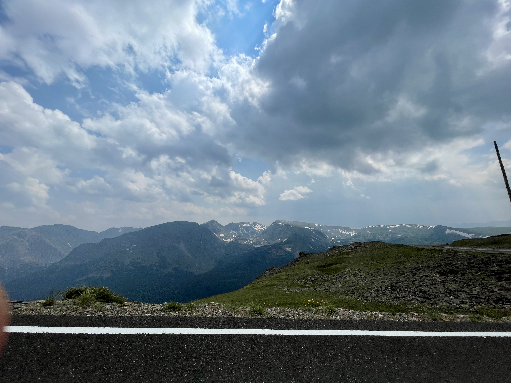

<br><details><summary>:camera:**24/IMG_0966.JPEG**</summary><sub> `Exif version` 0232 `OS version` 18.0 `Date` 2024:07:22 15:01:06 `Aperture` Not known `Brightness` 10.918178452425028 `Color space` 65535 `Compression` Not known`Exposure mode` 0 `Exposure time` 0.0003549875754348598 `Focal length` 1.54 `Lens model` iPhone 12 Pro Max back triple camera 1.54mm f/2.4 `Lens specification` (1.5399999618512084, 7.5, 1.6, 2.4) `Orientation` 1 `Scene type` Not known `f number` 2.4 `White balance` 0 `Sensing method` 2 `Shutter speed` 11.459893361457784</sub><sub>`Coordinates & altitude` (40.413044444444445, -105.73603055555556, 3674.6902834008097)</sub><sub> :globe_with_meridians:`Location over` [Google Maps](http://maps.google.com/maps?q=40.413044444444445,-105.73603055555556) or [Openstreet Map](https://www.openstreetmap.org/query?lat=40.413044444444445&lon=-105.73603055555556)</sub></details>
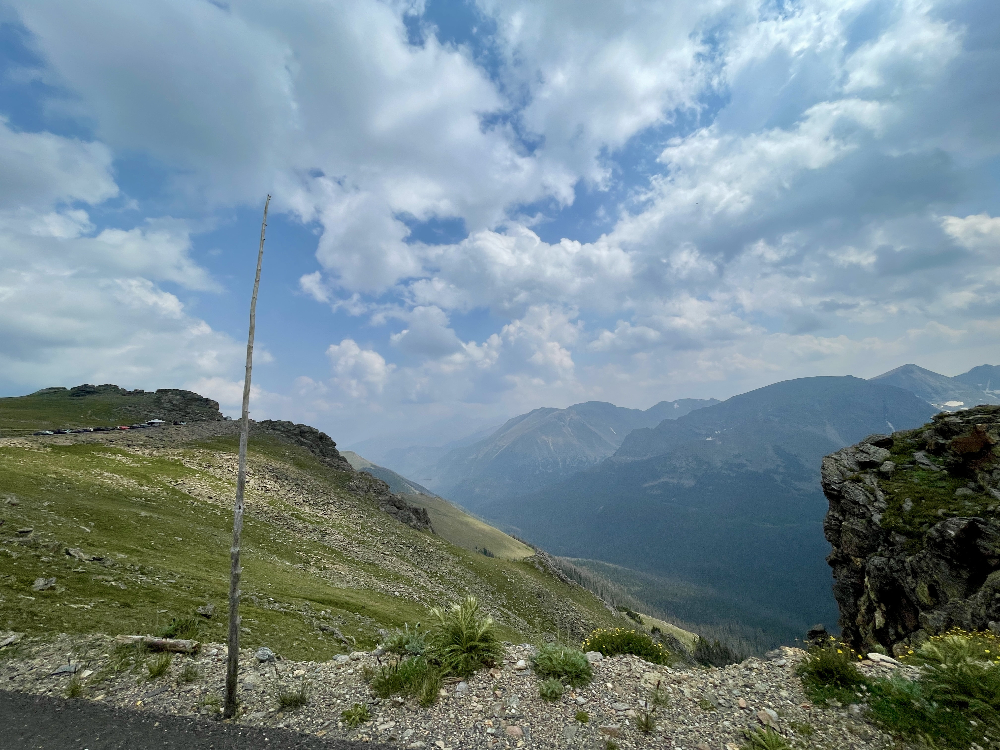

<br><details><summary>:camera:**24/IMG_0967.JPEG**</summary><sub> `Exif version` 0232 `OS version` 18.0 `Date` 2024:07:22 15:01:11 `Aperture` Not known `Brightness` 10.795447224310104 `Color space` 65535 `Compression` Not known`Exposure mode` 0 `Exposure time` 0.0004170141784820684 `Focal length` 1.54 `Lens model` iPhone 12 Pro Max back triple camera 1.54mm f/2.4 `Lens specification` (1.5399999618512084, 7.5, 1.6, 2.4) `Orientation` 1 `Scene type` Not known `f number` 2.4 `White balance` 0 `Sensing method` 2 `Shutter speed` 11.227665005469795</sub><sub>`Coordinates & altitude` (40.41316111111111, -105.735275, 3679.5926352128886)</sub><sub> :globe_with_meridians:`Location over` [Google Maps](http://maps.google.com/maps?q=40.41316111111111,-105.735275) or [Openstreet Map](https://www.openstreetmap.org/query?lat=40.41316111111111&lon=-105.735275)</sub></details>
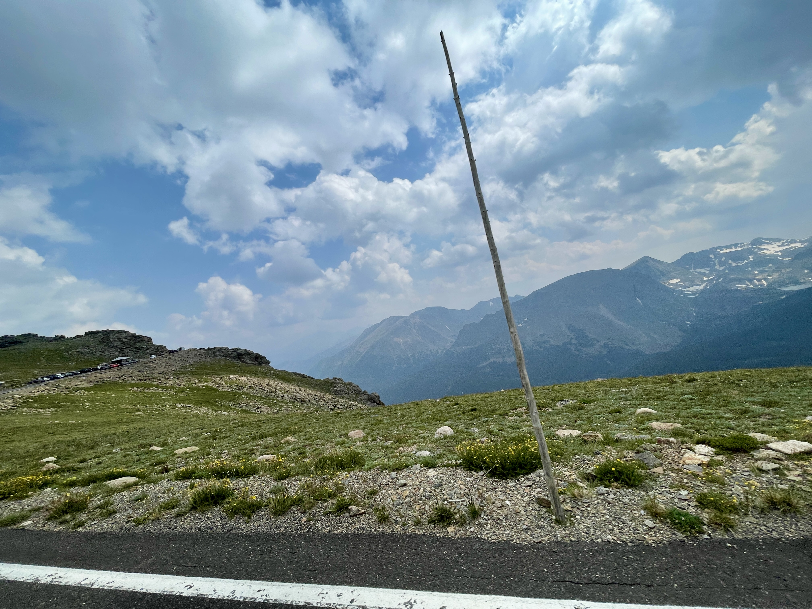

<br><details><summary>:camera:**24/IMG_0968.JPEG**</summary><sub> `Exif version` 0232 `OS version` 18.0 `Date` 2024:07:22 15:01:57 `Aperture` Not known `Brightness` 10.540269027754128 `Color space` 65535 `Compression` Not known`Exposure mode` 0 `Exposure time` 0.0006049606775559589 `Focal length` 1.54 `Lens model` iPhone 12 Pro Max back triple camera 1.54mm f/2.4 `Lens specification` (1.5399999618512084, 7.5, 1.6, 2.4) `Orientation` 1 `Scene type` Not known `f number` 2.4 `White balance` 0 `Sensing method` 2 `Shutter speed` 10.690777240609892</sub><sub>`Coordinates & altitude` (40.41166388888889, -105.7327638888889, 3691.928395061728)</sub><sub> :globe_with_meridians:`Location over` [Google Maps](http://maps.google.com/maps?q=40.41166388888889,-105.7327638888889) or [Openstreet Map](https://www.openstreetmap.org/query?lat=40.41166388888889&lon=-105.7327638888889)</sub></details>
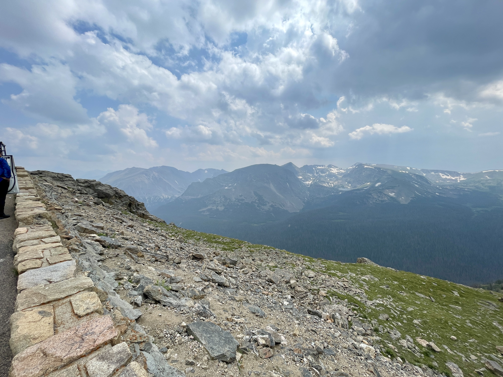

<br><details><summary>:camera:**24/IMG_0969.JPEG**</summary><sub> `Exif version` 0232 `OS version` 18.0 `Date` 2024:07:22 15:01:59 `Aperture` Not known `Brightness` 10.298396429161844 `Color space` 65535 `Compression` Not known`Exposure mode` 0 `Exposure time` 0.0006261740763932373 `Focal length` 1.54 `Lens model` iPhone 12 Pro Max back triple camera 1.54mm f/2.4 `Lens specification` (1.5399999618512084, 7.5, 1.6, 2.4) `Orientation` 1 `Scene type` Not known `f number` 2.4 `White balance` 0 `Sensing method` 2 `Shutter speed` 10.641549725442342</sub><sub>`Coordinates & altitude` (40.41166388888889, -105.7327638888889, 3691.928395061728)</sub><sub> :globe_with_meridians:`Location over` [Google Maps](http://maps.google.com/maps?q=40.41166388888889,-105.7327638888889) or [Openstreet Map](https://www.openstreetmap.org/query?lat=40.41166388888889&lon=-105.7327638888889)</sub></details>


<br><details><summary>:camera:**24/IMG_0970.JPEG**</summary><sub> `Exif version` 0232 `OS version` 18.0 `Date` 2024:07:22 15:02:01 `Aperture` Not known `Brightness` 10.086509929239899 `Color space` 65535 `Compression` Not known`Exposure mode` 0 `Exposure time` 0.0006882312456985547 `Focal length` 1.54 `Lens model` iPhone 12 Pro Max back triple camera 1.54mm f/2.4 `Lens specification` (1.5399999618512084, 7.5, 1.6, 2.4) `Orientation` 1 `Scene type` Not known `f number` 2.4 `White balance` 0 `Sensing method` 2 `Shutter speed` 10.5053038199767</sub><sub>`Coordinates & altitude` (40.41166388888889, -105.7327638888889, 3691.928395061728)</sub><sub> :globe_with_meridians:`Location over` [Google Maps](http://maps.google.com/maps?q=40.41166388888889,-105.7327638888889) or [Openstreet Map](https://www.openstreetmap.org/query?lat=40.41166388888889&lon=-105.7327638888889)</sub></details>


<br><details><summary>:camera:**24/IMG_0971.JPEG**</summary><sub> `Exif version` 0232 `OS version` 18.0 `Date` 2024:07:22 15:02:03 `Aperture` Not known `Brightness` 10.115442242035714 `Color space` 65535 `Compression` Not known`Exposure mode` 0 `Exposure time` 0.0008547008547008547 `Focal length` 1.54 `Lens model` iPhone 12 Pro Max back triple camera 1.54mm f/2.4 `Lens specification` (1.5399999618512084, 7.5, 1.6, 2.4) `Orientation` 1 `Scene type` Not known `f number` 2.4 `White balance` 0 `Sensing method` 2 `Shutter speed` 10.191787962628814</sub><sub>`Coordinates & altitude` (40.41166388888889, -105.7327638888889, 3691.928395061728)</sub><sub> :globe_with_meridians:`Location over` [Google Maps](http://maps.google.com/maps?q=40.41166388888889,-105.7327638888889) or [Openstreet Map](https://www.openstreetmap.org/query?lat=40.41166388888889&lon=-105.7327638888889)</sub></details>
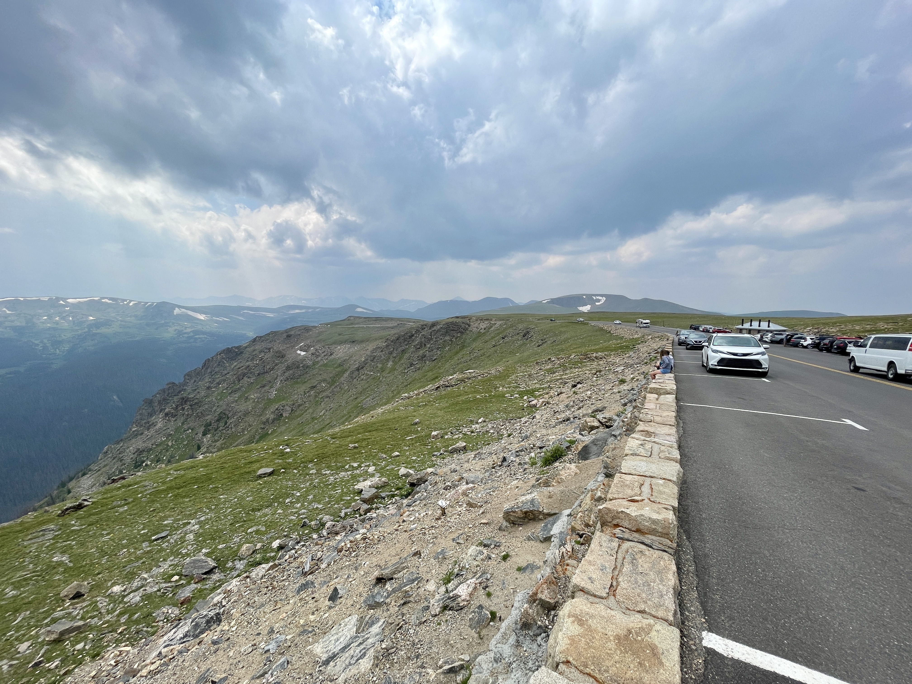

<br><details><summary>:camera:**24/IMG_0972.JPEG**</summary><sub> `Exif version` 0232 `OS version` 18.0 `Date` 2024:07:22 15:02:09 `Aperture` Not known `Brightness` 10.03614445626298 `Color space` 65535 `Compression` Not known`Exposure mode` Not known `Exposure time` 0.00025497195308516065 `Focal length` 5.1 `Lens model` iPhone 12 Pro Max back camera 5.1mm f/1.6 `Lens specification` (5.1, 5.1, 1.6, 1.6) `Orientation` 1 `Scene type` Not known `f number` 1.6 `White balance` 0 `Sensing method` 2 `Shutter speed` 11.93721513217867</sub><sub>`Coordinates & altitude` (40.41166388888889, -105.73275833333334, 3691.5581947743467)</sub><sub> :globe_with_meridians:`Location over` [Google Maps](http://maps.google.com/maps?q=40.41166388888889,-105.73275833333334) or [Openstreet Map](https://www.openstreetmap.org/query?lat=40.41166388888889&lon=-105.73275833333334)</sub></details>
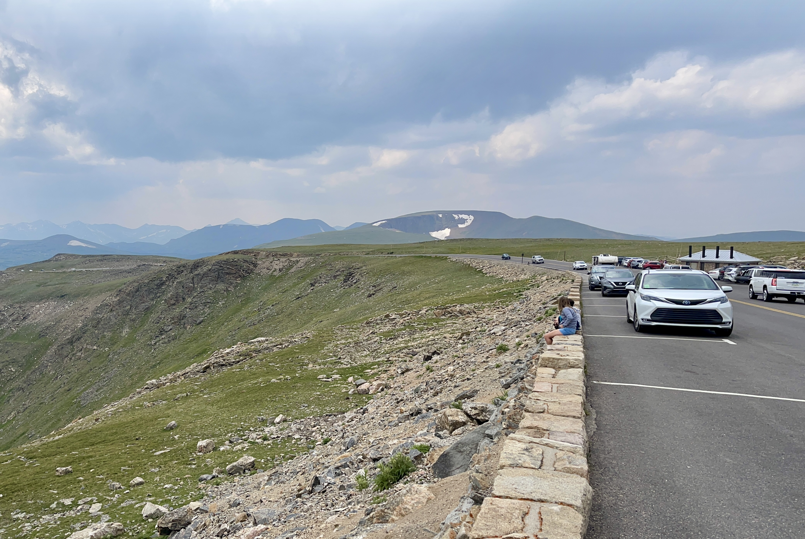

<br><details><summary>:camera:**24/IMG_0974.JPEG**</summary><sub> `Exif version` 0232 `OS version` 18.0 `Date` 2024:07:22 15:02:37 `Aperture` Not known `Brightness` 10.19912443618997 `Color space` 65535 `Compression` Not known`Exposure mode` 0 `Exposure time` 0.00022099447513812155 `Focal length` 5.1 `Lens model` iPhone 12 Pro Max back triple camera 5.1mm f/1.6 `Lens specification` (1.5399999618512084, 7.5, 1.6, 2.4) `Orientation` 1 `Scene type` Not known `f number` 1.6 `White balance` 0 `Sensing method` 2 `Shutter speed` 12.1436660268714</sub><sub>`Coordinates & altitude` (40.41169444444444, -105.73275833333334, 3692.9900744416873)</sub><sub> :globe_with_meridians:`Location over` [Google Maps](http://maps.google.com/maps?q=40.41169444444444,-105.73275833333334) or [Openstreet Map](https://www.openstreetmap.org/query?lat=40.41169444444444&lon=-105.73275833333334)</sub></details>


<br><details><summary>:camera:**24/IMG_0975.JPEG**</summary><sub> `Exif version` 0232 `OS version` 18.0 `Date` 2024:07:22 15:02:41 `Aperture` Not known `Brightness` 9.667799113737075 `Color space` 65535 `Compression` Not known`Exposure mode` 0 `Exposure time` 0.00030703101013202335 `Focal length` 5.1 `Lens model` iPhone 12 Pro Max back triple camera 5.1mm f/1.6 `Lens specification` (1.5399999618512084, 7.5, 1.6, 2.4) `Orientation` 1 `Scene type` Not known `f number` 1.6 `White balance` 0 `Sensing method` 2 `Shutter speed` 11.669473724050489</sub><sub>`Coordinates & altitude` (40.41169722222222, -105.7327638888889, 3694.434903047091)</sub><sub> :globe_with_meridians:`Location over` [Google Maps](http://maps.google.com/maps?q=40.41169722222222,-105.7327638888889) or [Openstreet Map](https://www.openstreetmap.org/query?lat=40.41169722222222&lon=-105.7327638888889)</sub></details>


<br><details><summary>:camera:**24/IMG_0976.JPEG**</summary><sub> `Exif version` 0232 `OS version` 18.0 `Date` 2024:07:22 15:02:45 `Aperture` Not known `Brightness` 10.09692390717755 `Color space` 65535 `Compression` Not known`Exposure mode` 0 `Exposure time` 0.0008756567425569177 `Focal length` 1.54 `Lens model` iPhone 12 Pro Max back triple camera 1.54mm f/2.4 `Lens specification` (1.5399999618512084, 7.5, 1.6, 2.4) `Orientation` 1 `Scene type` Not known `f number` 2.4 `White balance` 0 `Sensing method` 2 `Shutter speed` 10.156781508940252</sub><sub>`Coordinates & altitude` (40.41169722222222, -105.73275833333334, 3695.430508474576)</sub><sub> :globe_with_meridians:`Location over` [Google Maps](http://maps.google.com/maps?q=40.41169722222222,-105.73275833333334) or [Openstreet Map](https://www.openstreetmap.org/query?lat=40.41169722222222&lon=-105.73275833333334)</sub></details>


<br><details><summary>:camera:**24/IMG_0977.JPEG**</summary><sub> `Exif version` 0232 `OS version` 18.0 `Date` 2024:07:22 15:02:56 `Aperture` Not known `Brightness` 10.255109109802563 `Color space` 65535 `Compression` Not known`Exposure mode` 0 `Exposure time` 0.0008756567425569177 `Focal length` 1.54 `Lens model` iPhone 12 Pro Max back triple camera 1.54mm f/2.4 `Lens specification` (1.5399999618512084, 7.5, 1.6, 2.4) `Orientation` 1 `Scene type` Not known `f number` 2.4 `White balance` 0 `Sensing method` 2 `Shutter speed` 10.156781508940252</sub><sub>`Coordinates & altitude` (40.411677777777776, -105.73273611111111, 3695.159021406728)</sub><sub> :globe_with_meridians:`Location over` [Google Maps](http://maps.google.com/maps?q=40.411677777777776,-105.73273611111111) or [Openstreet Map](https://www.openstreetmap.org/query?lat=40.411677777777776&lon=-105.73273611111111)</sub></details>
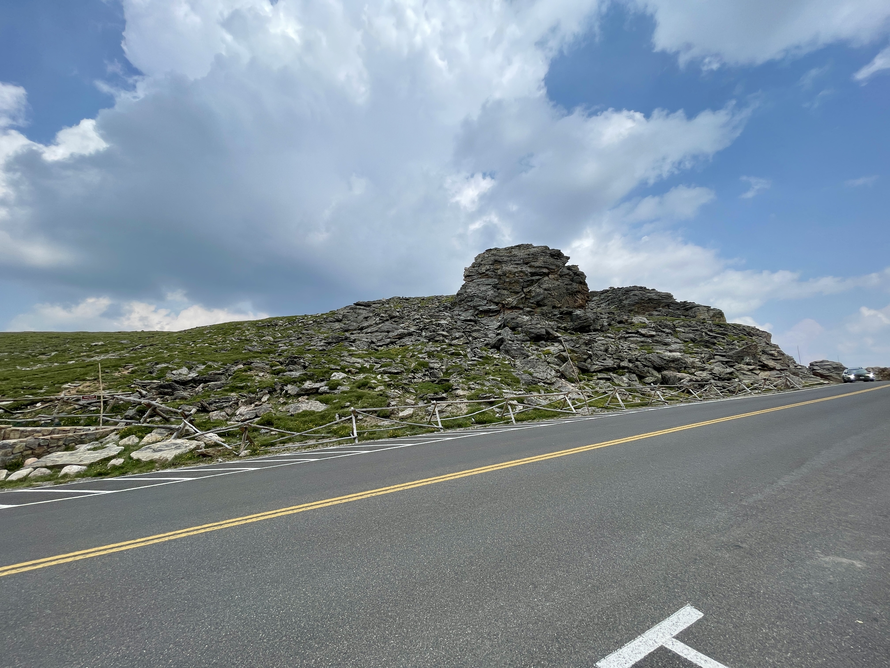

<br><details><summary>:camera:**24/IMG_0978.JPEG**</summary><sub> `Exif version` 0232 `OS version` 18.0 `Date` 2024:07:22 15:03:01 `Aperture` Not known `Brightness` 10.718611919387865 `Color space` 65535 `Compression` Not known`Exposure mode` 0 `Exposure time` 0.0005630630630630631 `Focal length` 1.54 `Lens model` iPhone 12 Pro Max back triple camera 1.54mm f/2.4 `Lens specification` (1.5399999618512084, 7.5, 1.6, 2.4) `Orientation` 1 `Scene type` Not known `f number` 2.4 `White balance` 0 `Sensing method` 2 `Shutter speed` 10.794577457089757</sub><sub>`Coordinates & altitude` (40.411677777777776, -105.73273611111111, 3695.5857843137255)</sub><sub> :globe_with_meridians:`Location over` [Google Maps](http://maps.google.com/maps?q=40.411677777777776,-105.73273611111111) or [Openstreet Map](https://www.openstreetmap.org/query?lat=40.411677777777776&lon=-105.73273611111111)</sub></details>
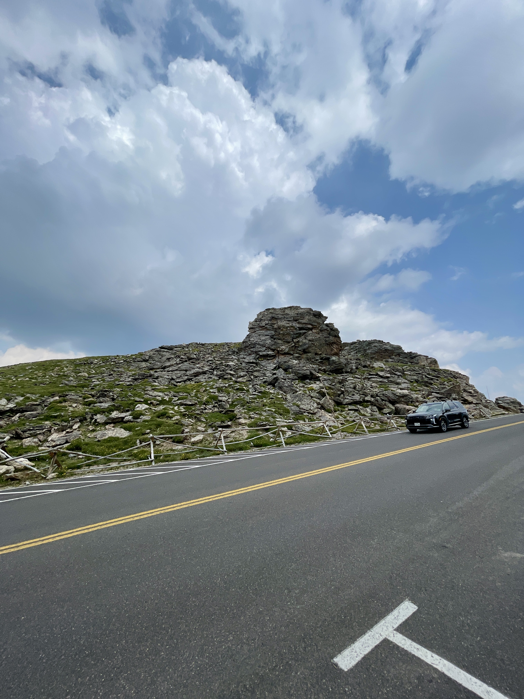

<br><details><summary>:camera:**24/IMG_0979.JPEG**</summary><sub> `Exif version` 0232 `OS version` 18.0 `Date` 2024:07:22 15:03:04 `Aperture` Not known `Brightness` 10.738516449410303 `Color space` 65535 `Compression` Not known`Exposure mode` 0 `Exposure time` 0.0005219206680584551 `Focal length` 1.54 `Lens model` iPhone 12 Pro Max back triple camera 1.54mm f/2.4 `Lens specification` (1.5399999618512084, 7.5, 1.6, 2.4) `Orientation` 1 `Scene type` Not known `f number` 2.4 `White balance` 0 `Sensing method` 2 `Shutter speed` 10.903662575491914</sub><sub>`Coordinates & altitude` (40.411677777777776, -105.73273611111111, 3695.49203187251)</sub><sub> :globe_with_meridians:`Location over` [Google Maps](http://maps.google.com/maps?q=40.411677777777776,-105.73273611111111) or [Openstreet Map](https://www.openstreetmap.org/query?lat=40.411677777777776&lon=-105.73273611111111)</sub></details>
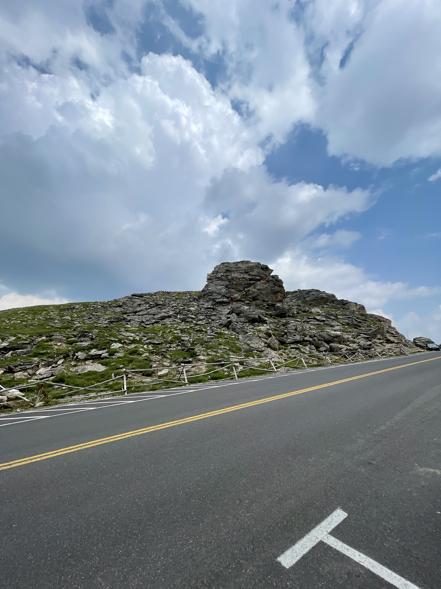

<br><details><summary>:camera:**24/IMG_1051.JPEG**</summary><sub> `Exif version` 0232 `OS version` 18.0 `Date` 2024:08:05 08:06:29 `Aperture` Not known `Brightness` 1.0115024429967427 `Color space` 65535 `Compression` Not known`Exposure mode` 0 `Exposure time` 0.016666666666666666 `Focal length` 5.1 `Lens model` iPhone 12 Pro Max back triple camera 5.1mm f/1.6 `Lens specification` (1.5399999618512084, 7.5, 1.6, 2.4) `Orientation` 1 `Scene type` Not known `f number` 1.6 `White balance` 0 `Sensing method` 2 `Shutter speed` 5.899608969755008</sub><sub>`Coordinates & altitude` (5.025569444444445, -73.99639722222223, 2597.7342657342656)</sub><sub> :globe_with_meridians:`Location over` [Google Maps](http://maps.google.com/maps?q=5.025569444444445,-73.99639722222223) or [Openstreet Map](https://www.openstreetmap.org/query?lat=5.025569444444445&lon=-73.99639722222223)</sub></details>


> _Citación: se permite la reproducción digital parcial o total de este repositorio, scripts, guías de desarrollo, modelos de datos, imágenes y documentación, siempre que se haga referencia como: "R.GISMobile - Sistemas de información geográficos móviles sobre QField que no requieren de conexión a Internet para su navegación". https://github.com/rcfdtools/R.GISMobile - Bogotá - Colombia - Suramérica."._

| [:house: Inicio](../Readme.md) |
|---|