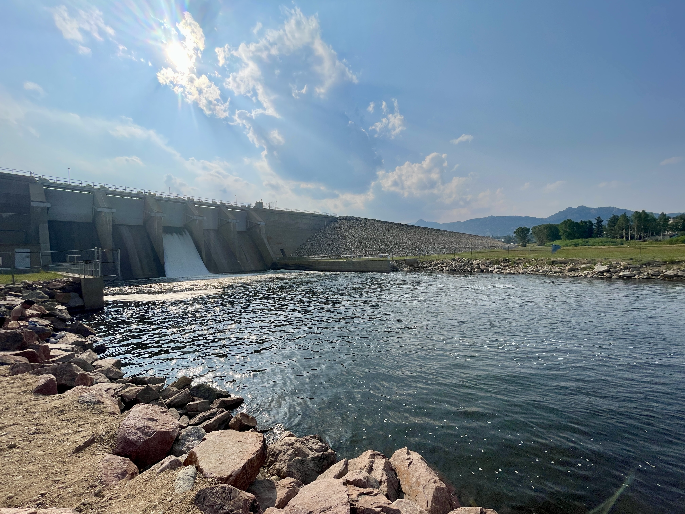
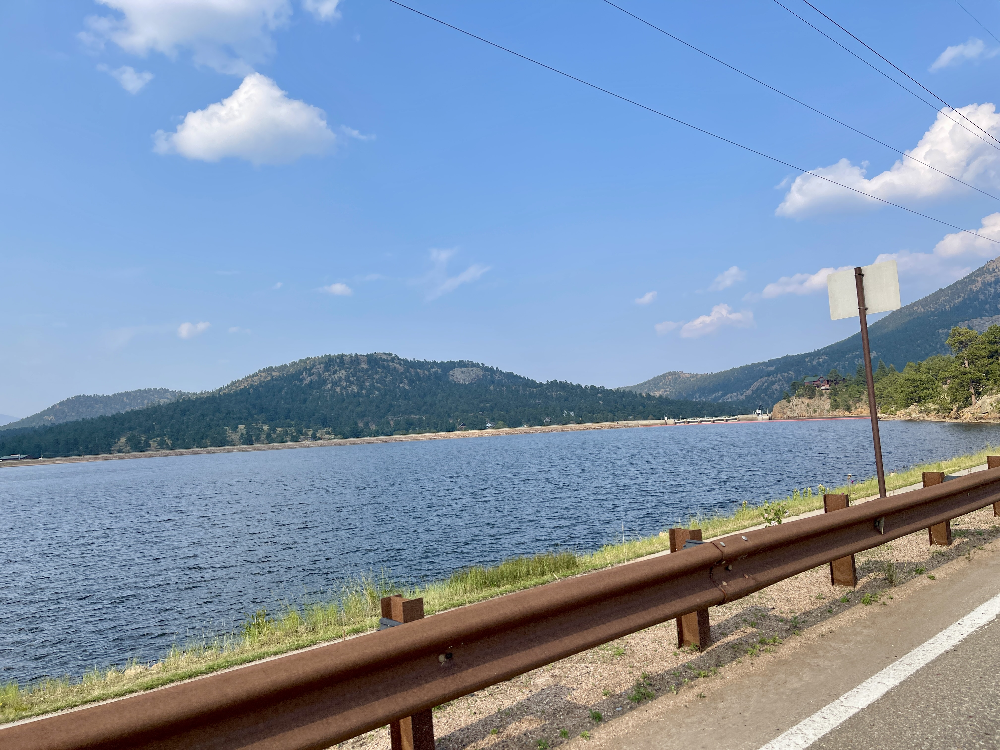
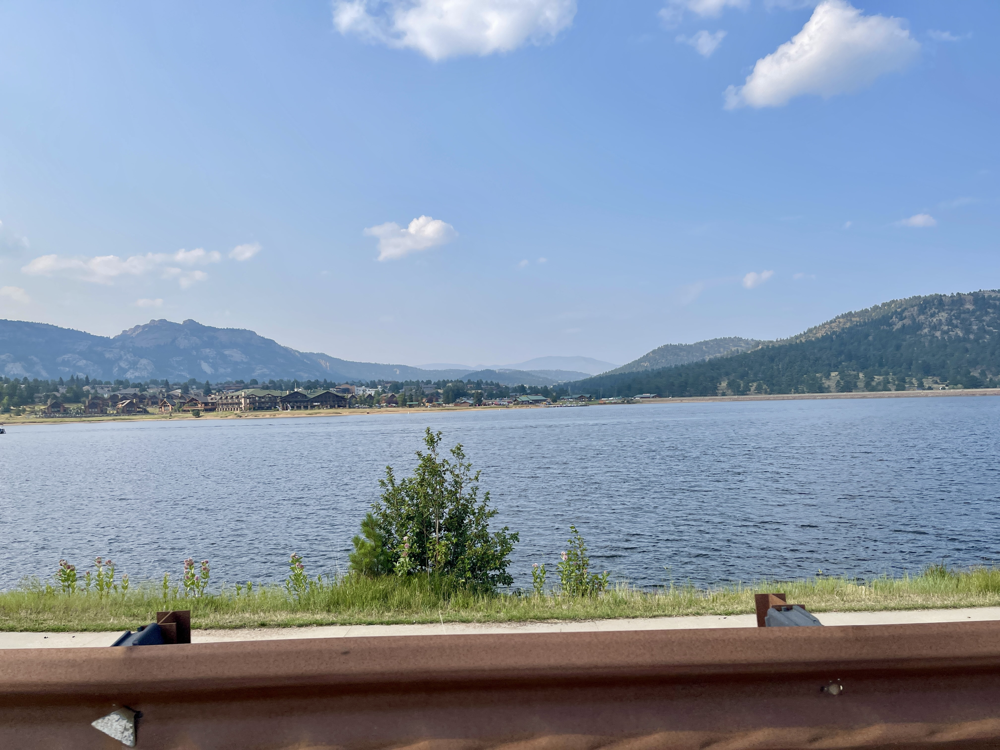
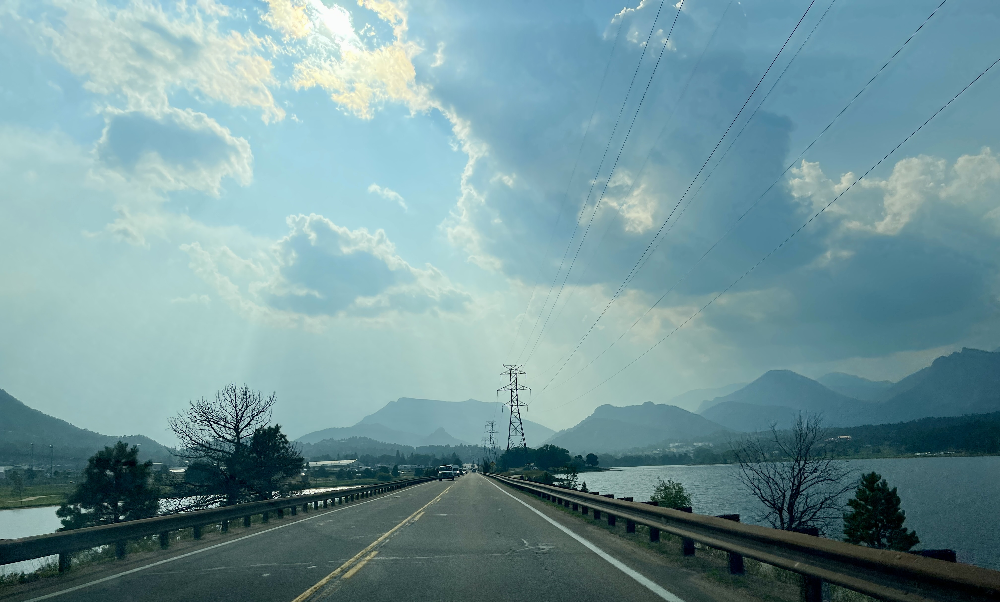
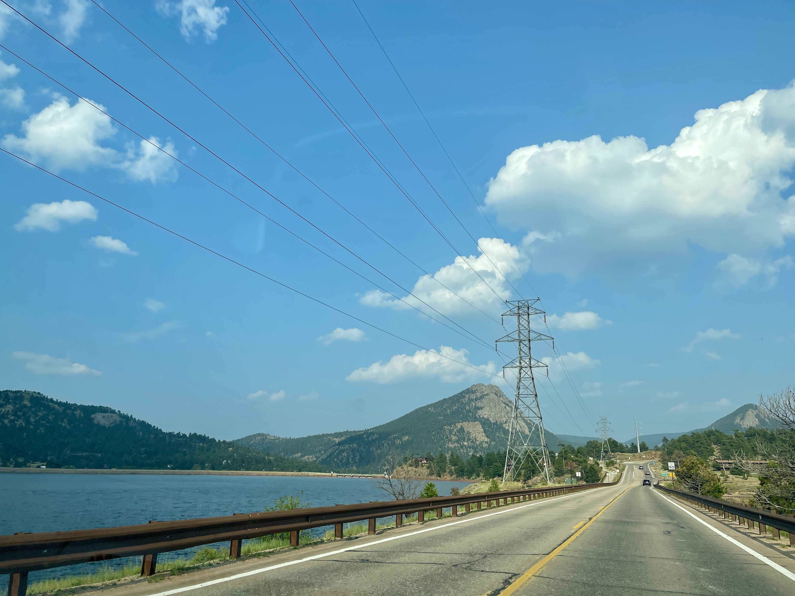
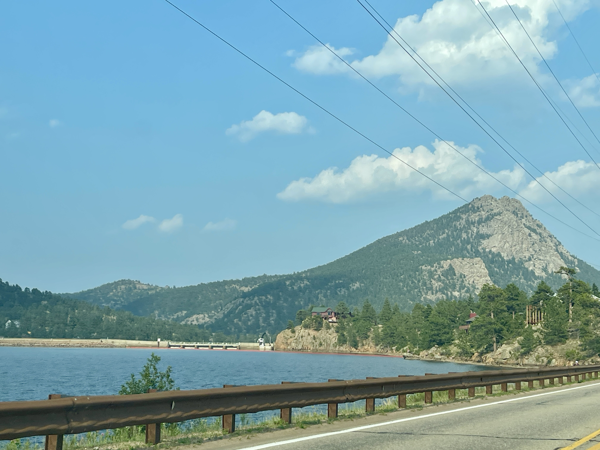

## :globe_with_meridians:Lake Estes & Spillway, Estes Park, Colorado, U.S. (2024-07-22)
`Pictures` rcfdtools <br>`Category` Freelance field visit <br>`Location` [Google Maps](http://maps.google.com/maps?q=40.375469,-105.486357) or [Openstreet Map](https://www.openstreetmap.org/query?lat=40.375469&lon=-105.486357) 

```geojson
{
  "type": "Feature",
  "geometry": {
    "type": "Point", 
    "coordinates": [-105.486357, 40.375469]
  }, 
  "properties": {
    "Name": "Lake Estes & Spillway, Estes Park, Colorado, U.S."
  }
}
```

<br><details><summary>:camera:**25/IMG_1004.JPEG**</summary><sub> `Exif version` 0232 `OS version` 18.0 `Date` 2024:07:22 17:21:07 `Aperture` Not known `Brightness` 10.444309899700702 `Color space` 65535 `Compression` Not known`Exposure mode` 0 `Exposure time` 0.0007722007722007722 `Focal length` 1.54 `Lens model` iPhone 12 Pro Max back triple camera 1.54mm f/2.4 `Lens specification` (1.5399999618512084, 7.5, 1.6, 2.4) `Orientation` 1 `Scene type` Not known `f number` 2.4 `White balance` 0 `Sensing method` 2 `Shutter speed` 10.339111525318422</sub></details><sub>`Coordinates & altitude` (40.37542222222222, -105.48696111111111, 2271.2932454695224)</sub><sub> :globe_with_meridians:`Location over` [Google Maps](http://maps.google.com/maps?q=40.37542222222222,-105.48696111111111) or [Openstreet Map](https://www.openstreetmap.org/query?lat=40.37542222222222&lon=-105.48696111111111)</sub>


<br><details><summary>:camera:**25/IMG_1005.JPEG**</summary><sub> `Exif version` 0232 `OS version` 18.0 `Date` 2024:07:22 17:21:09 `Aperture` Not known `Brightness` 10.131812593907936 `Color space` 65535 `Compression` Not known`Exposure mode` 0 `Exposure time` 0.0008756567425569177 `Focal length` 1.54 `Lens model` iPhone 12 Pro Max back triple camera 1.54mm f/2.4 `Lens specification` (1.5399999618512084, 7.5, 1.6, 2.4) `Orientation` 1 `Scene type` Not known `f number` 2.4 `White balance` 0 `Sensing method` 2 `Shutter speed` 10.156781508940252</sub></details><sub>`Coordinates & altitude` (40.37542222222222, -105.48696111111111, 2271.4131175468483)</sub><sub> :globe_with_meridians:`Location over` [Google Maps](http://maps.google.com/maps?q=40.37542222222222,-105.48696111111111) or [Openstreet Map](https://www.openstreetmap.org/query?lat=40.37542222222222&lon=-105.48696111111111)</sub>


<br><details><summary>:camera:**25/IMG_1006.JPEG**</summary><sub> `Exif version` 0232 `OS version` 18.0 `Date` 2024:07:22 17:21:11 `Aperture` Not known `Brightness` 10.655104474516513 `Color space` 65535 `Compression` Not known`Exposure mode` 0 `Exposure time` 0.000646830530401035 `Focal length` 1.54 `Lens model` iPhone 12 Pro Max back triple camera 1.54mm f/2.4 `Lens specification` (1.5399999618512084, 7.5, 1.6, 2.4) `Orientation` 1 `Scene type` Not known `f number` 2.4 `White balance` 0 `Sensing method` 2 `Shutter speed` 10.593946658675456</sub></details><sub>`Coordinates & altitude` (40.37542222222222, -105.48696111111111, 2271.4131175468483)</sub><sub> :globe_with_meridians:`Location over` [Google Maps](http://maps.google.com/maps?q=40.37542222222222,-105.48696111111111) or [Openstreet Map](https://www.openstreetmap.org/query?lat=40.37542222222222&lon=-105.48696111111111)</sub>


<br><details><summary>:camera:**25/IMG_1009.JPEG**</summary><sub> `Exif version` 0232 `OS version` 18.0 `Date` 2024:07:22 17:21:47 `Aperture` Not known `Brightness` 9.805549989981968 `Color space` 65535 `Compression` Not known`Exposure mode` 0 `Exposure time` 0.0003240440699935191 `Focal length` 5.1 `Lens model` iPhone 12 Pro Max back triple camera 5.1mm f/1.6 `Lens specification` (1.5399999618512084, 7.5, 1.6, 2.4) `Orientation` 1 `Scene type` Not known `f number` 1.6 `White balance` 0 `Sensing method` 2 `Shutter speed` 11.591718562220038</sub></details><sub>`Coordinates & altitude` (40.37545, -105.48685555555555, 2271.6677577741407)</sub><sub> :globe_with_meridians:`Location over` [Google Maps](http://maps.google.com/maps?q=40.37545,-105.48685555555555) or [Openstreet Map](https://www.openstreetmap.org/query?lat=40.37545&lon=-105.48685555555555)</sub>


<br><details><summary>:camera:**25/IMG_1010.JPEG**</summary><sub> `Exif version` 0232 `OS version` 18.0 `Date` 2024:07:22 17:21:59 `Aperture` Not known `Brightness` 10.313897537503538 `Color space` 65535 `Compression` Not known`Exposure mode` 0 `Exposure time` 0.00018601190476190475 `Focal length` 5.1 `Lens model` iPhone 12 Pro Max back triple camera 5.1mm f/1.6 `Lens specification` (1.5399999618512084, 7.5, 1.6, 2.4) `Orientation` 1 `Scene type` Not known `f number` 1.6 `White balance` 0 `Sensing method` 2 `Shutter speed` 12.392409761529182</sub></details><sub>`Coordinates & altitude` (40.37548888888889, -105.48683055555556, 2270.53640776699)</sub><sub> :globe_with_meridians:`Location over` [Google Maps](http://maps.google.com/maps?q=40.37548888888889,-105.48683055555556) or [Openstreet Map](https://www.openstreetmap.org/query?lat=40.37548888888889&lon=-105.48683055555556)</sub>


<br><details><summary>:camera:**25/IMG_1011.JPEG**</summary><sub> `Exif version` 0232 `OS version` 18.0 `Date` 2024:07:22 17:22:03 `Aperture` Not known `Brightness` 10.716851707800014 `Color space` 65535 `Compression` Not known`Exposure mode` 0 `Exposure time` 0.0006261740763932373 `Focal length` 1.54 `Lens model` iPhone 12 Pro Max back triple camera 1.54mm f/2.4 `Lens specification` (1.5399999618512084, 7.5, 1.6, 2.4) `Orientation` 1 `Scene type` Not known `f number` 2.4 `White balance` 0 `Sensing method` 2 `Shutter speed` 10.641549725442342</sub></details><sub>`Coordinates & altitude` (40.375502777777776, -105.48683055555556, 2271.7331606217617)</sub><sub> :globe_with_meridians:`Location over` [Google Maps](http://maps.google.com/maps?q=40.375502777777776,-105.48683055555556) or [Openstreet Map](https://www.openstreetmap.org/query?lat=40.375502777777776&lon=-105.48683055555556)</sub>


<br><details><summary>:camera:**25/IMG_1013.JPEG**</summary><sub> `Exif version` 0232 `OS version` 18.0 `Date` 2024:07:22 17:22:28 `Aperture` Not known `Brightness` 11.318611242324044 `Color space` 65535 `Compression` Not known`Exposure mode` 0 `Exposure time` 0.00033400133600534405 `Focal length` 1.54 `Lens model` iPhone 12 Pro Max back triple camera 1.54mm f/2.4 `Lens specification` (1.5399999618512084, 7.5, 1.6, 2.4) `Orientation` 1 `Scene type` Not known `f number` 2.4 `White balance` 0 `Sensing method` 2 `Shutter speed` 11.547864283550439</sub></details><sub>`Coordinates & altitude` (40.37549722222222, -105.48684722222222, 2271.47268907563)</sub><sub> :globe_with_meridians:`Location over` [Google Maps](http://maps.google.com/maps?q=40.37549722222222,-105.48684722222222) or [Openstreet Map](https://www.openstreetmap.org/query?lat=40.37549722222222&lon=-105.48684722222222)</sub>


<br><details><summary>:camera:**25/IMG_1014.JPEG**</summary><sub> `Exif version` 0232 `OS version` 18.0 `Date` 2024:07:22 17:22:35 `Aperture` Not known `Brightness` 10.808923375363724 `Color space` 65535 `Compression` Not known`Exposure mode` 0 `Exposure time` 0.0005219206680584551 `Focal length` 1.54 `Lens model` iPhone 12 Pro Max back triple camera 1.54mm f/2.4 `Lens specification` (1.5399999618512084, 7.5, 1.6, 2.4) `Orientation` 1 `Scene type` Not known `f number` 2.4 `White balance` 0 `Sensing method` 2 `Shutter speed` 10.903662575491914</sub></details><sub>`Coordinates & altitude` (40.37549722222222, -105.48684722222222, 2271.6584766584765)</sub><sub> :globe_with_meridians:`Location over` [Google Maps](http://maps.google.com/maps?q=40.37549722222222,-105.48684722222222) or [Openstreet Map](https://www.openstreetmap.org/query?lat=40.37549722222222&lon=-105.48684722222222)</sub>


<br><details><summary>:camera:**25/IMG_1015.JPEG**</summary><sub> `Exif version` 0232 `OS version` 18.0 `Date` 2024:07:22 17:23:15 `Aperture` Not known `Brightness` 10.131073144687667 `Color space` 65535 `Compression` Not known`Exposure mode` 0 `Exposure time` 0.0010845986984815619 `Focal length` 1.54 `Lens model` iPhone 12 Pro Max back triple camera 1.54mm f/2.4 `Lens specification` (1.5399999618512084, 7.5, 1.6, 2.4) `Orientation` 1 `Scene type` Not known `f number` 2.4 `White balance` 0 `Sensing method` 2 `Shutter speed` 9.848089247567055</sub></details><sub>`Coordinates & altitude` (40.37535833333333, -105.48678611111112, 2271.5598455598456)</sub><sub> :globe_with_meridians:`Location over` [Google Maps](http://maps.google.com/maps?q=40.37535833333333,-105.48678611111112) or [Openstreet Map](https://www.openstreetmap.org/query?lat=40.37535833333333&lon=-105.48678611111112)</sub>


<br><details><summary>:camera:**25/IMG_1016.JPEG**</summary><sub> `Exif version` 0232 `OS version` 18.0 `Date` 2024:07:22 17:23:21 `Aperture` Not known `Brightness` 9.359423352705864 `Color space` 65535 `Compression` Not known`Exposure mode` Not known `Exposure time` 0.0003850596842510589 `Focal length` 5.1 `Lens model` iPhone 12 Pro Max back camera 5.1mm f/1.6 `Lens specification` (5.1, 5.1, 1.6, 1.6) `Orientation` 1 `Scene type` Not known `f number` 1.6 `White balance` 0 `Sensing method` 2 `Shutter speed` 11.342853930057348</sub></details><sub>`Coordinates & altitude` (40.375372222222225, -105.48676388888889, 2271.2883597883597)</sub><sub> :globe_with_meridians:`Location over` [Google Maps](http://maps.google.com/maps?q=40.375372222222225,-105.48676388888889) or [Openstreet Map](https://www.openstreetmap.org/query?lat=40.375372222222225&lon=-105.48676388888889)</sub>


<br><details><summary>:camera:**25/IMG_1017.JPEG**</summary><sub> `Exif version` 0232 `OS version` 18.0 `Date` 2024:07:22 17:27:38 `Aperture` Not known `Brightness` 9.7239984080658 `Color space` 65535 `Compression` Not known`Exposure mode` 0 `Exposure time` 0.000333000333000333 `Focal length` 5.1 `Lens model` iPhone 12 Pro Max back triple camera 5.1mm f/1.6 `Lens specification` (1.5399999618512084, 7.5, 1.6, 2.4) `Orientation` 1 `Scene type` Not known `f number` 1.6 `White balance` 0 `Sensing method` 2 `Shutter speed` 11.552190197036314</sub></details><sub>`Coordinates & altitude` (40.37372222222222, -105.49281944444445, 2282.09597924773)</sub><sub> :globe_with_meridians:`Location over` [Google Maps](http://maps.google.com/maps?q=40.37372222222222,-105.49281944444445) or [Openstreet Map](https://www.openstreetmap.org/query?lat=40.37372222222222&lon=-105.49281944444445)</sub>


<br><details><summary>:camera:**25/IMG_1018.JPEG**</summary><sub> `Exif version` 0232 `OS version` 18.0 `Date` 2024:07:22 17:27:40 `Aperture` Not known `Brightness` 9.866647950589556 `Color space` 65535 `Compression` Not known`Exposure mode` 0 `Exposure time` 0.0002990430622009569 `Focal length` 5.1 `Lens model` iPhone 12 Pro Max back triple camera 5.1mm f/1.6 `Lens specification` (1.5399999618512084, 7.5, 1.6, 2.4) `Orientation` 1 `Scene type` Not known `f number` 1.6 `White balance` 0 `Sensing method` 2 `Shutter speed` 11.707566889632107</sub></details><sub>`Coordinates & altitude` (40.37377222222222, -105.49312777777777, 2283.494905385735)</sub><sub> :globe_with_meridians:`Location over` [Google Maps](http://maps.google.com/maps?q=40.37377222222222,-105.49312777777777) or [Openstreet Map](https://www.openstreetmap.org/query?lat=40.37377222222222&lon=-105.49312777777777)</sub>


<br><details><summary>:camera:**25/IMG_1019.JPEG**</summary><sub> `Exif version` 0232 `OS version` 18.0 `Date` 2024:07:22 17:27:46 `Aperture` Not known `Brightness` 11.285563973063972 `Color space` 65535 `Compression` Not known`Exposure mode` 0 `Exposure time` 8.300132802124833e-05 `Focal length` 5.1 `Lens model` iPhone 12 Pro Max back triple camera 5.1mm f/1.6 `Lens specification` (1.5399999618512084, 7.5, 1.6, 2.4) `Orientation` 1 `Scene type` Not known `f number` 1.6 `White balance` 0 `Sensing method` 2 `Shutter speed` 13.556529146890593</sub></details><sub>`Coordinates & altitude` (40.37390277777778, -105.49408055555556, 2283.151886792453)</sub><sub> :globe_with_meridians:`Location over` [Google Maps](http://maps.google.com/maps?q=40.37390277777778,-105.49408055555556) or [Openstreet Map](https://www.openstreetmap.org/query?lat=40.37390277777778&lon=-105.49408055555556)</sub>


<br><details><summary>:camera:**25/IMG_1020.JPEG**</summary><sub> `Exif version` 0232 `OS version` 18.0 `Date` 2024:07:22 17:33:44 `Aperture` Not known `Brightness` 9.675551853394419 `Color space` 65535 `Compression` Not known`Exposure mode` 0 `Exposure time` 0.000315955766192733 `Focal length` 5.1 `Lens model` iPhone 12 Pro Max back triple camera 5.1mm f/1.6 `Lens specification` (1.5399999618512084, 7.5, 1.6, 2.4) `Orientation` 1 `Scene type` Not known `f number` 1.6 `White balance` 0 `Sensing method` 2 `Shutter speed` 11.627787823990356</sub></details><sub>`Coordinates & altitude` (40.37399444444444, -105.49497222222222, 2281.535922330097)</sub><sub> :globe_with_meridians:`Location over` [Google Maps](http://maps.google.com/maps?q=40.37399444444444,-105.49497222222222) or [Openstreet Map](https://www.openstreetmap.org/query?lat=40.37399444444444&lon=-105.49497222222222)</sub>


<br><details><summary>:camera:**25/IMG_1021.JPEG**</summary><sub> `Exif version` 0232 `OS version` 18.0 `Date` 2024:07:22 17:33:51 `Aperture` Not known `Brightness` 9.385643939393939 `Color space` 65535 `Compression` Not known`Exposure mode` 0 `Exposure time` 0.00037593984962406017 `Focal length` 5.1 `Lens model` iPhone 12 Pro Max back triple camera 5.1mm f/1.6 `Lens specification` (1.5399999618512084, 7.5, 1.6, 2.4) `Orientation` 1 `Scene type` Not known `f number` 1.6 `White balance` 0 `Sensing method` 2 `Shutter speed` 11.376979723595278</sub></details><sub>`Coordinates & altitude` (40.37382222222222, -105.49368888888888, 2282.331086773378)</sub><sub> :globe_with_meridians:`Location over` [Google Maps](http://maps.google.com/maps?q=40.37382222222222,-105.49368888888888) or [Openstreet Map](https://www.openstreetmap.org/query?lat=40.37382222222222&lon=-105.49368888888888)</sub>


> _Citación: se permite la reproducción digital parcial o total de este repositorio, scripts, guías de desarrollo, modelos de datos, imágenes y documentación, siempre que se haga referencia como: "R.GISMobile - Sistemas de información geográficos móviles sobre QField que no requieren de conexión a Internet para su navegación". https://github.com/rcfdtools/R.GISMobile - Bogotá - Colombia - Suramérica."._

| [:house: Inicio](../Readme.md) |
|---|