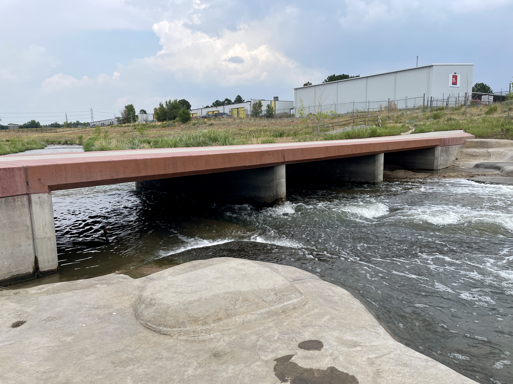

## :globe_with_meridians:Cherry Creek River (Sinusoidal river design, downstream Cherry Creek Reservoir), Denver, Colorado, U.S. (2024-07-21)
`Pictures` rcfdtools <br>`Category` Freelance field visit <br>`Location` [Google Maps](http://maps.google.com/maps?q=39.679556,-104.895472) or [Openstreet Map](https://www.openstreetmap.org/query?lat=39.679556&lon=-104.895472) 

```geojson
{
  "type": "Feature",
  "geometry": {
    "type": "Point", 
    "coordinates": [-104.895472, 39.679556]
  }, 
  "properties": {
    "Name": "Cherry Creek River (Sinusoidal river design, downstream Cherry Creek Reservoir), Denver, Colorado, U.S."
  }
}
```

<br><details><summary>:camera:**29/IMG_0813.JPEG**</summary><sub> `Exif version` 0232 `OS version` 18.0 `Date` 2024:07:21 15:13:43 `Aperture` Not known `Brightness` 10.181596244131455 `Color space` 65535 `Compression` Not known`Exposure mode` 0 `Exposure time` 0.00021199915200339198 `Focal length` 5.1 `Lens model` iPhone 12 Pro Max back triple camera 5.1mm f/1.6 `Lens specification` (1.5399999618512084, 7.5, 1.6, 2.4) `Orientation` 1 `Scene type` Not known `f number` 1.6 `White balance` 0 `Sensing method` 2 `Shutter speed` 12.203648118217501</sub><sub>`Coordinates & altitude` (39.67765833333333, -104.89486666666667, 1657.512981199642)</sub><sub> :globe_with_meridians:`Location over` [Google Maps](http://maps.google.com/maps?q=39.67765833333333,-104.89486666666667) or [Openstreet Map](https://www.openstreetmap.org/query?lat=39.67765833333333&lon=-104.89486666666667)</sub></details>


<br><details><summary>:camera:**29/IMG_0814.JPEG**</summary><sub> `Exif version` 0232 `OS version` 18.0 `Date` 2024:07:21 15:13:46 `Aperture` Not known `Brightness` 10.082381911797627 `Color space` 65535 `Compression` Not known`Exposure mode` 0 `Exposure time` 0.00023798191337458352 `Focal length` 5.1 `Lens model` iPhone 12 Pro Max back triple camera 5.1mm f/1.6 `Lens specification` (1.5399999618512084, 7.5, 1.6, 2.4) `Orientation` 1 `Scene type` Not known `f number` 1.6 `White balance` 0 `Sensing method` 2 `Shutter speed` 12.036750815730723</sub><sub>`Coordinates & altitude` (39.67765555555555, -104.89485277777779, 1660.9315286624203)</sub><sub> :globe_with_meridians:`Location over` [Google Maps](http://maps.google.com/maps?q=39.67765555555555,-104.89485277777779) or [Openstreet Map](https://www.openstreetmap.org/query?lat=39.67765555555555&lon=-104.89485277777779)</sub></details>


<br><details><summary>:camera:**29/IMG_0815.JPEG**</summary><sub> `Exif version` 0232 `OS version` 18.0 `Date` 2024:07:21 15:13:48 `Aperture` Not known `Brightness` 10.470578484999171 `Color space` 65535 `Compression` Not known`Exposure mode` 0 `Exposure time` 0.0001950078003120125 `Focal length` 5.1 `Lens model` iPhone 12 Pro Max back triple camera 5.1mm f/1.6 `Lens specification` (1.5399999618512084, 7.5, 1.6, 2.4) `Orientation` 1 `Scene type` Not known `f number` 1.6 `White balance` 0 `Sensing method` 2 `Shutter speed` 12.324238250989843</sub><sub>`Coordinates & altitude` (39.67766388888889, -104.89486111111111, 1659.7606199770378)</sub><sub> :globe_with_meridians:`Location over` [Google Maps](http://maps.google.com/maps?q=39.67766388888889,-104.89486111111111) or [Openstreet Map](https://www.openstreetmap.org/query?lat=39.67766388888889&lon=-104.89486111111111)</sub></details>


<br><details><summary>:camera:**29/IMG_0816.JPEG**</summary><sub> `Exif version` 0232 `OS version` 18.0 `Date` 2024:07:21 15:13:50 `Aperture` Not known `Brightness` 10.426857112515266 `Color space` 65535 `Compression` Not known`Exposure mode` 0 `Exposure time` 0.0001950078003120125 `Focal length` 5.1 `Lens model` iPhone 12 Pro Max back triple camera 5.1mm f/1.6 `Lens specification` (1.5399999618512084, 7.5, 1.6, 2.4) `Orientation` 1 `Scene type` Not known `f number` 1.6 `White balance` 0 `Sensing method` 2 `Shutter speed` 12.324238250989843</sub><sub>`Coordinates & altitude` (39.67766388888889, -104.89486111111111, 1659.713028169014)</sub><sub> :globe_with_meridians:`Location over` [Google Maps](http://maps.google.com/maps?q=39.67766388888889,-104.89486111111111) or [Openstreet Map](https://www.openstreetmap.org/query?lat=39.67766388888889&lon=-104.89486111111111)</sub></details>


<br><details><summary>:camera:**29/IMG_0817.JPEG**</summary><sub> `Exif version` 0232 `OS version` 18.0 `Date` 2024:07:21 15:14:08 `Aperture` Not known `Brightness` 9.654809070218326 `Color space` 65535 `Compression` Not known`Exposure mode` 0 `Exposure time` 0.000333000333000333 `Focal length` 5.1 `Lens model` iPhone 12 Pro Max back triple camera 5.1mm f/1.6 `Lens specification` (1.5399999618512084, 7.5, 1.6, 2.4) `Orientation` 1 `Scene type` Not known `f number` 1.6 `White balance` 0 `Sensing method` 2 `Shutter speed` 11.552190197036314</sub><sub>`Coordinates & altitude` (39.67776944444444, -104.89470555555556, 1656.807116104869)</sub><sub> :globe_with_meridians:`Location over` [Google Maps](http://maps.google.com/maps?q=39.67776944444444,-104.89470555555556) or [Openstreet Map](https://www.openstreetmap.org/query?lat=39.67776944444444&lon=-104.89470555555556)</sub></details>


<br><details><summary>:camera:**29/IMG_0818.JPEG**</summary><sub> `Exif version` 0232 `OS version` 18.0 `Date` 2024:07:21 15:14:16 `Aperture` Not known `Brightness` 9.354910792220942 `Color space` 65535 `Compression` Not known`Exposure mode` 0 `Exposure time` 0.00041893590280687055 `Focal length` 5.1 `Lens model` iPhone 12 Pro Max back triple camera 5.1mm f/1.6 `Lens specification` (1.5399999618512084, 7.5, 1.6, 2.4) `Orientation` 1 `Scene type` Not known `f number` 1.6 `White balance` 0 `Sensing method` 2 `Shutter speed` 11.220762135414331</sub><sub>`Coordinates & altitude` (39.677749999999996, -104.89466111111112, 1656.2672955974842)</sub><sub> :globe_with_meridians:`Location over` [Google Maps](http://maps.google.com/maps?q=39.677749999999996,-104.89466111111112) or [Openstreet Map](https://www.openstreetmap.org/query?lat=39.677749999999996&lon=-104.89466111111112)</sub></details>


<br><details><summary>:camera:**29/IMG_0819.JPEG**</summary><sub> `Exif version` 0232 `OS version` 18.0 `Date` 2024:07:21 15:14:18 `Aperture` Not known `Brightness` 9.389510968921389 `Color space` 65535 `Compression` Not known`Exposure mode` 0 `Exposure time` 0.0003929273084479371 `Focal length` 5.1 `Lens model` iPhone 12 Pro Max back triple camera 5.1mm f/1.6 `Lens specification` (1.5399999618512084, 7.5, 1.6, 2.4) `Orientation` 1 `Scene type` Not known `f number` 1.6 `White balance` 0 `Sensing method` 2 `Shutter speed` 11.31318306010929</sub><sub>`Coordinates & altitude` (39.677752777777776, -104.89466111111112, 1656.3395225464192)</sub><sub> :globe_with_meridians:`Location over` [Google Maps](http://maps.google.com/maps?q=39.677752777777776,-104.89466111111112) or [Openstreet Map](https://www.openstreetmap.org/query?lat=39.677752777777776&lon=-104.89466111111112)</sub></details>


<br><details><summary>:camera:**29/IMG_0820.JPEG**</summary><sub> `Exif version` 0232 `OS version` 18.0 `Date` 2024:07:21 15:14:23 `Aperture` Not known `Brightness` 9.613809871140287 `Color space` 65535 `Compression` Not known`Exposure mode` 0 `Exposure time` 0.000333000333000333 `Focal length` 5.1 `Lens model` iPhone 12 Pro Max back triple camera 5.1mm f/1.6 `Lens specification` (1.5399999618512084, 7.5, 1.6, 2.4) `Orientation` 1 `Scene type` Not known `f number` 1.6 `White balance` 0 `Sensing method` 2 `Shutter speed` 11.552190197036314</sub><sub>`Coordinates & altitude` (39.67774444444444, -104.89465277777778, 1656.3162217659137)</sub><sub> :globe_with_meridians:`Location over` [Google Maps](http://maps.google.com/maps?q=39.67774444444444,-104.89465277777778) or [Openstreet Map](https://www.openstreetmap.org/query?lat=39.67774444444444&lon=-104.89465277777778)</sub></details>


<br><details><summary>:camera:**29/IMG_0822.JPEG**</summary><sub> `Exif version` 0232 `OS version` 18.0 `Date` 2024:07:21 15:14:48 `Aperture` Not known `Brightness` 10.083983765220106 `Color space` 65535 `Compression` Not known`Exposure mode` 0 `Exposure time` 0.0002469745616201531 `Focal length` 5.1 `Lens model` iPhone 12 Pro Max back triple camera 5.1mm f/1.6 `Lens specification` (1.5399999618512084, 7.5, 1.6, 2.4) `Orientation` 1 `Scene type` Not known `f number` 1.6 `White balance` 0 `Sensing method` 2 `Shutter speed` 11.983201343892489</sub><sub>`Coordinates & altitude` (39.67778333333333, -104.89467777777779, 1655.8996563573883)</sub><sub> :globe_with_meridians:`Location over` [Google Maps](http://maps.google.com/maps?q=39.67778333333333,-104.89467777777779) or [Openstreet Map](https://www.openstreetmap.org/query?lat=39.67778333333333&lon=-104.89467777777779)</sub></details>


<br><details><summary>:camera:**29/IMG_0823.JPEG**</summary><sub> `Exif version` 0232 `OS version` 18.0 `Date` 2024:07:21 15:14:54 `Aperture` Not known `Brightness` 9.649176113123758 `Color space` 65535 `Compression` Not known`Exposure mode` 0 `Exposure time` 0.00030703101013202335 `Focal length` 5.1 `Lens model` iPhone 12 Pro Max back triple camera 5.1mm f/1.6 `Lens specification` (1.5399999618512084, 7.5, 1.6, 2.4) `Orientation` 1 `Scene type` Not known `f number` 1.6 `White balance` 0 `Sensing method` 2 `Shutter speed` 11.669473724050489</sub><sub>`Coordinates & altitude` (39.677819444444445, -104.89463888888889, 1656.0056818181818)</sub><sub> :globe_with_meridians:`Location over` [Google Maps](http://maps.google.com/maps?q=39.677819444444445,-104.89463888888889) or [Openstreet Map](https://www.openstreetmap.org/query?lat=39.677819444444445&lon=-104.89463888888889)</sub></details>


<br><details><summary>:camera:**29/IMG_0824.JPEG**</summary><sub> `Exif version` 0232 `OS version` 18.0 `Date` 2024:07:21 15:15:00 `Aperture` Not known `Brightness` 9.840175705355634 `Color space` 65535 `Compression` Not known`Exposure mode` 0 `Exposure time` 0.0002809778027535825 `Focal length` 5.1 `Lens model` iPhone 12 Pro Max back triple camera 5.1mm f/1.6 `Lens specification` (1.5399999618512084, 7.5, 1.6, 2.4) `Orientation` 1 `Scene type` Not known `f number` 1.6 `White balance` 0 `Sensing method` 2 `Shutter speed` 11.797142238579779</sub><sub>`Coordinates & altitude` (39.67783333333333, -104.89457777777778, 1656.141600703606)</sub><sub> :globe_with_meridians:`Location over` [Google Maps](http://maps.google.com/maps?q=39.67783333333333,-104.89457777777778) or [Openstreet Map](https://www.openstreetmap.org/query?lat=39.67783333333333&lon=-104.89457777777778)</sub></details>


<br><details><summary>:camera:**29/IMG_0825.JPEG**</summary><sub> `Exif version` 0232 `OS version` 18.0 `Date` 2024:07:21 15:15:03 `Aperture` Not known `Brightness` 10.242595335061088 `Color space` 65535 `Compression` Not known`Exposure mode` 0 `Exposure time` 0.00022099447513812155 `Focal length` 5.1 `Lens model` iPhone 12 Pro Max back triple camera 5.1mm f/1.6 `Lens specification` (1.5399999618512084, 7.5, 1.6, 2.4) `Orientation` 1 `Scene type` Not known `f number` 1.6 `White balance` 0 `Sensing method` 2 `Shutter speed` 12.1436660268714</sub><sub>`Coordinates & altitude` (39.67783333333333, -104.89458611111112, 1655.8857868020305)</sub><sub> :globe_with_meridians:`Location over` [Google Maps](http://maps.google.com/maps?q=39.67783333333333,-104.89458611111112) or [Openstreet Map](https://www.openstreetmap.org/query?lat=39.67783333333333&lon=-104.89458611111112)</sub></details>


<br><details><summary>:camera:**29/IMG_0826.JPEG**</summary><sub> `Exif version` 0232 `OS version` 18.0 `Date` 2024:07:21 15:15:12 `Aperture` Not known `Brightness` 9.091241617557406 `Color space` 65535 `Compression` Not known`Exposure mode` 0 `Exposure time` 0.0004450378282153983 `Focal length` 5.1 `Lens model` iPhone 12 Pro Max back triple camera 5.1mm f/1.6 `Lens specification` (1.5399999618512084, 7.5, 1.6, 2.4) `Orientation` 1 `Scene type` Not known `f number` 1.6 `White balance` 0 `Sensing method` 2 `Shutter speed` 11.133907042487737</sub><sub>`Coordinates & altitude` (39.67785277777777, -104.89455277777779, 1655.251580278129)</sub><sub> :globe_with_meridians:`Location over` [Google Maps](http://maps.google.com/maps?q=39.67785277777777,-104.89455277777779) or [Openstreet Map](https://www.openstreetmap.org/query?lat=39.67785277777777&lon=-104.89455277777779)</sub></details>


<br><details><summary>:camera:**29/IMG_0827.JPEG**</summary><sub> `Exif version` 0232 `OS version` 18.0 `Date` 2024:07:21 15:15:14 `Aperture` Not known `Brightness` 9.35961632254918 `Color space` 65535 `Compression` Not known`Exposure mode` 0 `Exposure time` 0.0003929273084479371 `Focal length` 5.1 `Lens model` iPhone 12 Pro Max back triple camera 5.1mm f/1.6 `Lens specification` (1.5399999618512084, 7.5, 1.6, 2.4) `Orientation` 1 `Scene type` Not known `f number` 1.6 `White balance` 0 `Sensing method` 2 `Shutter speed` 11.31318306010929</sub><sub>`Coordinates & altitude` (39.67784722222222, -104.89454722222223, 1655.3646496815286)</sub><sub> :globe_with_meridians:`Location over` [Google Maps](http://maps.google.com/maps?q=39.67784722222222,-104.89454722222223) or [Openstreet Map](https://www.openstreetmap.org/query?lat=39.67784722222222&lon=-104.89454722222223)</sub></details>


<br><details><summary>:camera:**29/IMG_0828.JPEG**</summary><sub> `Exif version` 0232 `OS version` 18.0 `Date` 2024:07:21 15:15:17 `Aperture` Not known `Brightness` 10.293173782975252 `Color space` 65535 `Compression` Not known`Exposure mode` 0 `Exposure time` 0.00021199915200339198 `Focal length` 5.1 `Lens model` iPhone 12 Pro Max back triple camera 5.1mm f/1.6 `Lens specification` (1.5399999618512084, 7.5, 1.6, 2.4) `Orientation` 1 `Scene type` Not known `f number` 1.6 `White balance` 0 `Sensing method` 2 `Shutter speed` 12.203648118217501</sub><sub>`Coordinates & altitude` (39.677841666666666, -104.89455277777779, 1655.3203194321206)</sub><sub> :globe_with_meridians:`Location over` [Google Maps](http://maps.google.com/maps?q=39.677841666666666,-104.89455277777779) or [Openstreet Map](https://www.openstreetmap.org/query?lat=39.677841666666666&lon=-104.89455277777779)</sub></details>


<br><details><summary>:camera:**29/IMG_0829.JPEG**</summary><sub> `Exif version` 0232 `OS version` 18.0 `Date` 2024:07:21 15:15:34 `Aperture` Not known `Brightness` 9.325221862234118 `Color space` 65535 `Compression` Not known`Exposure mode` 0 `Exposure time` 0.0004110152075626798 `Focal length` 5.1 `Lens model` iPhone 12 Pro Max back triple camera 5.1mm f/1.6 `Lens specification` (1.5399999618512084, 7.5, 1.6, 2.4) `Orientation` 1 `Scene type` Not known `f number` 1.6 `White balance` 0 `Sensing method` 2 `Shutter speed` 11.248573985012863</sub><sub>`Coordinates & altitude` (39.67789722222222, -104.89447777777778, 1654.0083955223881)</sub><sub> :globe_with_meridians:`Location over` [Google Maps](http://maps.google.com/maps?q=39.67789722222222,-104.89447777777778) or [Openstreet Map](https://www.openstreetmap.org/query?lat=39.67789722222222&lon=-104.89447777777778)</sub></details>


<br><details><summary>:camera:**29/IMG_0830.JPEG**</summary><sub> `Exif version` 0232 `OS version` 18.0 `Date` 2024:07:21 15:15:45 `Aperture` Not known `Brightness` 9.196702579170747 `Color space` 65535 `Compression` Not known`Exposure mode` 0 `Exposure time` 0.00043706293706293706 `Focal length` 5.1 `Lens model` iPhone 12 Pro Max back triple camera 5.1mm f/1.6 `Lens specification` (1.5399999618512084, 7.5, 1.6, 2.4) `Orientation` 1 `Scene type` Not known `f number` 1.6 `White balance` 0 `Sensing method` 2 `Shutter speed` 11.160079100234828</sub><sub>`Coordinates & altitude` (39.67791388888889, -104.89455277777779, 1653.6495798319327)</sub><sub> :globe_with_meridians:`Location over` [Google Maps](http://maps.google.com/maps?q=39.67791388888889,-104.89455277777779) or [Openstreet Map](https://www.openstreetmap.org/query?lat=39.67791388888889&lon=-104.89455277777779)</sub></details>


<br><details><summary>:camera:**29/IMG_0831.JPEG**</summary><sub> `Exif version` 0232 `OS version` 18.0 `Date` 2024:07:21 15:15:50 `Aperture` Not known `Brightness` 10.169979637350917 `Color space` 65535 `Compression` Not known`Exposure mode` 0 `Exposure time` 0.00022999080036798528 `Focal length` 5.1 `Lens model` iPhone 12 Pro Max back triple camera 5.1mm f/1.6 `Lens specification` (1.5399999618512084, 7.5, 1.6, 2.4) `Orientation` 1 `Scene type` Not known `f number` 1.6 `White balance` 0 `Sensing method` 2 `Shutter speed` 12.086078519855596</sub><sub>`Coordinates & altitude` (39.677924999999995, -104.89456111111112, 1654.3271461716938)</sub><sub> :globe_with_meridians:`Location over` [Google Maps](http://maps.google.com/maps?q=39.677924999999995,-104.89456111111112) or [Openstreet Map](https://www.openstreetmap.org/query?lat=39.677924999999995&lon=-104.89456111111112)</sub></details>


<br><details><summary>:camera:**29/IMG_0832.JPEG**</summary><sub> `Exif version` 0232 `OS version` 18.0 `Date` 2024:07:21 15:15:59 `Aperture` Not known `Brightness` 8.474738174703647 `Color space` 65535 `Compression` Not known`Exposure mode` 0 `Exposure time` 0.0007727975270479134 `Focal length` 5.1 `Lens model` iPhone 12 Pro Max back triple camera 5.1mm f/1.6 `Lens specification` (1.5399999618512084, 7.5, 1.6, 2.4) `Orientation` 1 `Scene type` Not known `f number` 1.6 `White balance` 0 `Sensing method` 2 `Shutter speed` 10.33724396576594</sub><sub>`Coordinates & altitude` (39.677875, -104.89454722222223, 1653.5154028436018)</sub><sub> :globe_with_meridians:`Location over` [Google Maps](http://maps.google.com/maps?q=39.677875,-104.89454722222223) or [Openstreet Map](https://www.openstreetmap.org/query?lat=39.677875&lon=-104.89454722222223)</sub></details>


<br><details><summary>:camera:**29/IMG_0833.JPEG**</summary><sub> `Exif version` 0232 `OS version` 18.0 `Date` 2024:07:21 15:16:02 `Aperture` Not known `Brightness` 9.822790357925493 `Color space` 65535 `Compression` Not known`Exposure mode` 0 `Exposure time` 0.0002900232018561485 `Focal length` 5.1 `Lens model` iPhone 12 Pro Max back triple camera 5.1mm f/1.6 `Lens specification` (1.5399999618512084, 7.5, 1.6, 2.4) `Orientation` 1 `Scene type` Not known `f number` 1.6 `White balance` 0 `Sensing method` 2 `Shutter speed` 11.751659466863345</sub><sub>`Coordinates & altitude` (39.677880555555554, -104.89454722222223, 1653.8963503649636)</sub><sub> :globe_with_meridians:`Location over` [Google Maps](http://maps.google.com/maps?q=39.677880555555554,-104.89454722222223) or [Openstreet Map](https://www.openstreetmap.org/query?lat=39.677880555555554&lon=-104.89454722222223)</sub></details>


<br><details><summary>:camera:**29/IMG_0836.JPEG**</summary><sub> `Exif version` 0232 `OS version` 18.0 `Date` 2024:07:21 15:17:02 `Aperture` Not known `Brightness` 10.21238071935405 `Color space` 65535 `Compression` Not known`Exposure mode` 0 `Exposure time` 0.00022099447513812155 `Focal length` 5.1 `Lens model` iPhone 12 Pro Max back triple camera 5.1mm f/1.6 `Lens specification` (1.5399999618512084, 7.5, 1.6, 2.4) `Orientation` 1 `Scene type` Not known `f number` 1.6 `White balance` 0 `Sensing method` 2 `Shutter speed` 12.1436660268714</sub><sub>`Coordinates & altitude` (39.67763055555555, -104.89492777777778, 1658.0235457063711)</sub><sub> :globe_with_meridians:`Location over` [Google Maps](http://maps.google.com/maps?q=39.67763055555555,-104.89492777777778) or [Openstreet Map](https://www.openstreetmap.org/query?lat=39.67763055555555&lon=-104.89492777777778)</sub></details>


<br><details><summary>:camera:**29/IMG_0837.JPEG**</summary><sub> `Exif version` 0232 `OS version` 18.0 `Date` 2024:07:21 15:17:27 `Aperture` Not known `Brightness` 10.190517390552 `Color space` 65535 `Compression` Not known`Exposure mode` 0 `Exposure time` 0.00022999080036798528 `Focal length` 5.1 `Lens model` iPhone 12 Pro Max back triple camera 5.1mm f/1.6 `Lens specification` (1.5399999618512084, 7.5, 1.6, 2.4) `Orientation` 1 `Scene type` Not known `f number` 1.6 `White balance` 0 `Sensing method` 2 `Shutter speed` 12.086078519855596</sub><sub>`Coordinates & altitude` (39.67783055555555, -104.8951638888889, 1658.170426065163)</sub><sub> :globe_with_meridians:`Location over` [Google Maps](http://maps.google.com/maps?q=39.67783055555555,-104.8951638888889) or [Openstreet Map](https://www.openstreetmap.org/query?lat=39.67783055555555&lon=-104.8951638888889)</sub></details>


<br><details><summary>:camera:**29/IMG_0838.JPEG**</summary><sub> `Exif version` 0232 `OS version` 18.0 `Date` 2024:07:21 15:17:34 `Aperture` Not known `Brightness` 10.341077253560346 `Color space` 65535 `Compression` Not known`Exposure mode` 0 `Exposure time` 0.00018601190476190475 `Focal length` 5.1 `Lens model` iPhone 12 Pro Max back triple camera 5.1mm f/1.6 `Lens specification` (1.5399999618512084, 7.5, 1.6, 2.4) `Orientation` 1 `Scene type` Not known `f number` 1.6 `White balance` 0 `Sensing method` 2 `Shutter speed` 12.392409761529182</sub><sub>`Coordinates & altitude` (39.67784722222222, -104.89519444444446, 1658.1292059219381)</sub><sub> :globe_with_meridians:`Location over` [Google Maps](http://maps.google.com/maps?q=39.67784722222222,-104.89519444444446) or [Openstreet Map](https://www.openstreetmap.org/query?lat=39.67784722222222&lon=-104.89519444444446)</sub></details>


<br><details><summary>:camera:**29/IMG_0839.JPEG**</summary><sub> `Exif version` 0232 `OS version` 18.0 `Date` 2024:07:21 15:20:27 `Aperture` Not known `Brightness` 9.83932745231094 `Color space` 65535 `Compression` Not known`Exposure mode` 0 `Exposure time` 0.0011682242990654205 `Focal length` 1.54 `Lens model` iPhone 12 Pro Max back triple camera 1.54mm f/2.4 `Lens specification` (1.5399999618512084, 7.5, 1.6, 2.4) `Orientation` 1 `Scene type` Not known `f number` 2.4 `White balance` 0 `Sensing method` 2 `Shutter speed` 9.741744010360458</sub><sub>`Coordinates & altitude` (39.68382222222222, -104.90136111111111, 1653.3599717114569)</sub><sub> :globe_with_meridians:`Location over` [Google Maps](http://maps.google.com/maps?q=39.68382222222222,-104.90136111111111) or [Openstreet Map](https://www.openstreetmap.org/query?lat=39.68382222222222&lon=-104.90136111111111)</sub></details>


<br><details><summary>:camera:**29/IMG_0840.JPEG**</summary><sub> `Exif version` 0232 `OS version` 18.0 `Date` 2024:07:21 15:20:31 `Aperture` Not known `Brightness` 10.115292381479431 `Color space` 65535 `Compression` Not known`Exposure mode` 0 `Exposure time` 0.0007722007722007722 `Focal length` 1.54 `Lens model` iPhone 12 Pro Max back triple camera 1.54mm f/2.4 `Lens specification` (1.5399999618512084, 7.5, 1.6, 2.4) `Orientation` 1 `Scene type` Not known `f number` 2.4 `White balance` 0 `Sensing method` 2 `Shutter speed` 10.339111525318422</sub><sub>`Coordinates & altitude` (39.68382222222222, -104.90136111111111, 1654.0794551645856)</sub><sub> :globe_with_meridians:`Location over` [Google Maps](http://maps.google.com/maps?q=39.68382222222222,-104.90136111111111) or [Openstreet Map](https://www.openstreetmap.org/query?lat=39.68382222222222&lon=-104.90136111111111)</sub></details>


<br><details><summary>:camera:**29/IMG_0841.JPEG**</summary><sub> `Exif version` 0232 `OS version` 18.0 `Date` 2024:07:21 15:21:55 `Aperture` Not known `Brightness` 10.067390845813119 `Color space` 65535 `Compression` Not known`Exposure mode` 0 `Exposure time` 0.0010224948875255625 `Focal length` 1.54 `Lens model` iPhone 12 Pro Max back triple camera 1.54mm f/2.4 `Lens specification` (1.5399999618512084, 7.5, 1.6, 2.4) `Orientation` 1 `Scene type` Not known `f number` 2.4 `White balance` 0 `Sensing method` 2 `Shutter speed` 9.934389086875457</sub><sub>`Coordinates & altitude` (39.68485555555555, -104.90262777777778, 1646.8572895277207)</sub><sub> :globe_with_meridians:`Location over` [Google Maps](http://maps.google.com/maps?q=39.68485555555555,-104.90262777777778) or [Openstreet Map](https://www.openstreetmap.org/query?lat=39.68485555555555&lon=-104.90262777777778)</sub></details>


<br><details><summary>:camera:**29/IMG_0842.JPEG**</summary><sub> `Exif version` 0232 `OS version` 18.0 `Date` 2024:07:21 15:21:59 `Aperture` Not known `Brightness` 10.005937044919905 `Color space` 65535 `Compression` Not known`Exposure mode` 0 `Exposure time` 0.0009587727708533077 `Focal length` 1.54 `Lens model` iPhone 12 Pro Max back triple camera 1.54mm f/2.4 `Lens specification` (1.5399999618512084, 7.5, 1.6, 2.4) `Orientation` 1 `Scene type` Not known `f number` 2.4 `White balance` 0 `Sensing method` 2 `Shutter speed` 10.026181570894254</sub><sub>`Coordinates & altitude` (39.68485277777778, -104.90267222222222, 1649.2086049543677)</sub><sub> :globe_with_meridians:`Location over` [Google Maps](http://maps.google.com/maps?q=39.68485277777778,-104.90267222222222) or [Openstreet Map](https://www.openstreetmap.org/query?lat=39.68485277777778&lon=-104.90267222222222)</sub></details>


<br><details><summary>:camera:**29/IMG_0843.JPEG**</summary><sub> `Exif version` 0232 `OS version` 18.0 `Date` 2024:07:21 15:22:33 `Aperture` Not known `Brightness` 10.076021656901283 `Color space` 65535 `Compression` Not known`Exposure mode` 0 `Exposure time` 0.0008968609865470852 `Focal length` 1.54 `Lens model` iPhone 12 Pro Max back triple camera 1.54mm f/2.4 `Lens specification` (1.5399999618512084, 7.5, 1.6, 2.4) `Orientation` 1 `Scene type` Not known `f number` 2.4 `White balance` 0 `Sensing method` 2 `Shutter speed` 10.12260439142023</sub><sub>`Coordinates & altitude` (39.68513055555555, -104.90306944444445, 1648.803007518797)</sub><sub> :globe_with_meridians:`Location over` [Google Maps](http://maps.google.com/maps?q=39.68513055555555,-104.90306944444445) or [Openstreet Map](https://www.openstreetmap.org/query?lat=39.68513055555555&lon=-104.90306944444445)</sub></details>


<br><details><summary>:camera:**29/IMG_0845.JPEG**</summary><sub> `Exif version` 0232 `OS version` 18.0 `Date` 2024:07:21 15:23:00 `Aperture` Not known `Brightness` 10.098706338939198 `Color space` 65535 `Compression` Not known`Exposure mode` 0 `Exposure time` 0.00022099447513812155 `Focal length` 5.1 `Lens model` iPhone 12 Pro Max back triple camera 5.1mm f/1.6 `Lens specification` (1.5399999618512084, 7.5, 1.6, 2.4) `Orientation` 1 `Scene type` Not known `f number` 1.6 `White balance` 0 `Sensing method` 2 `Shutter speed` 12.1436660268714</sub><sub>`Coordinates & altitude` (39.68512777777777, -104.9030388888889, 1651.437365010799)</sub><sub> :globe_with_meridians:`Location over` [Google Maps](http://maps.google.com/maps?q=39.68512777777777,-104.9030388888889) or [Openstreet Map](https://www.openstreetmap.org/query?lat=39.68512777777777&lon=-104.9030388888889)</sub></details>


<br><details><summary>:camera:**29/IMG_0846.JPEG**</summary><sub> `Exif version` 0232 `OS version` 18.0 `Date` 2024:07:21 15:23:04 `Aperture` Not known `Brightness` 10.121628455832772 `Color space` 65535 `Compression` Not known`Exposure mode` 0 `Exposure time` 0.0009389671361502347 `Focal length` 1.54 `Lens model` iPhone 12 Pro Max back triple camera 1.54mm f/2.4 `Lens specification` (1.5399999618512084, 7.5, 1.6, 2.4) `Orientation` 1 `Scene type` Not known `f number` 2.4 `White balance` 0 `Sensing method` 2 `Shutter speed` 10.056587220353853</sub><sub>`Coordinates & altitude` (39.68515277777777, -104.90303055555556, 1651.6041131105399)</sub><sub> :globe_with_meridians:`Location over` [Google Maps](http://maps.google.com/maps?q=39.68515277777777,-104.90303055555556) or [Openstreet Map](https://www.openstreetmap.org/query?lat=39.68515277777777&lon=-104.90303055555556)</sub></details>


<br><details><summary>:camera:**29/IMG_0847.JPEG**</summary><sub> `Exif version` 0232 `OS version` 18.0 `Date` 2024:07:21 15:23:06 `Aperture` Not known `Brightness` 9.71775872117226 `Color space` 65535 `Compression` Not known`Exposure mode` 0 `Exposure time` 0.0011682242990654205 `Focal length` 1.54 `Lens model` iPhone 12 Pro Max back triple camera 1.54mm f/2.4 `Lens specification` (1.5399999618512084, 7.5, 1.6, 2.4) `Orientation` 1 `Scene type` Not known `f number` 2.4 `White balance` 0 `Sensing method` 2 `Shutter speed` 9.741744010360458</sub><sub>`Coordinates & altitude` (39.68515277777777, -104.90303055555556, 1651.5486935866984)</sub><sub> :globe_with_meridians:`Location over` [Google Maps](http://maps.google.com/maps?q=39.68515277777777,-104.90303055555556) or [Openstreet Map](https://www.openstreetmap.org/query?lat=39.68515277777777&lon=-104.90303055555556)</sub></details>


<br><details><summary>:camera:**29/IMG_0848.JPEG**</summary><sub> `Exif version` 0232 `OS version` 18.0 `Date` 2024:07:21 15:23:08 `Aperture` Not known `Brightness` 10.030652755978211 `Color space` 65535 `Compression` Not known`Exposure mode` 0 `Exposure time` 0.0011261261261261261 `Focal length` 1.54 `Lens model` iPhone 12 Pro Max back triple camera 1.54mm f/2.4 `Lens specification` (1.5399999618512084, 7.5, 1.6, 2.4) `Orientation` 1 `Scene type` Not known `f number` 2.4 `White balance` 0 `Sensing method` 2 `Shutter speed` 9.794577457089757</sub><sub>`Coordinates & altitude` (39.68515277777777, -104.90303055555556, 1651.407335907336)</sub><sub> :globe_with_meridians:`Location over` [Google Maps](http://maps.google.com/maps?q=39.68515277777777,-104.90303055555556) or [Openstreet Map](https://www.openstreetmap.org/query?lat=39.68515277777777&lon=-104.90303055555556)</sub></details>


<br><details><summary>:camera:**29/IMG_0849.JPEG**</summary><sub> `Exif version` 0232 `OS version` 18.0 `Date` 2024:07:21 15:23:13 `Aperture` Not known `Brightness` 9.68743272335845 `Color space` 65535 `Compression` Not known`Exposure mode` 0 `Exposure time` 0.000333000333000333 `Focal length` 5.1 `Lens model` iPhone 12 Pro Max back triple camera 5.1mm f/1.6 `Lens specification` (1.5399999618512084, 7.5, 1.6, 2.4) `Orientation` 1 `Scene type` Not known `f number` 1.6 `White balance` 0 `Sensing method` 2 `Shutter speed` 11.552190197036314</sub><sub>`Coordinates & altitude` (39.68515, -104.90303055555556, 1651.414904330312)</sub><sub> :globe_with_meridians:`Location over` [Google Maps](http://maps.google.com/maps?q=39.68515,-104.90303055555556) or [Openstreet Map](https://www.openstreetmap.org/query?lat=39.68515&lon=-104.90303055555556)</sub></details>


<br><details><summary>:camera:**29/IMG_0851.JPEG**</summary><sub> `Exif version` 0232 `OS version` 18.0 `Date` 2024:07:21 15:23:43 `Aperture` Not known `Brightness` 10.392007301649391 `Color space` 65535 `Compression` Not known`Exposure mode` 0 `Exposure time` 0.0007092198581560284 `Focal length` 1.54 `Lens model` iPhone 12 Pro Max back triple camera 1.54mm f/2.4 `Lens specification` (1.5399999618512084, 7.5, 1.6, 2.4) `Orientation` 1 `Scene type` Not known `f number` 2.4 `White balance` 0 `Sensing method` 2 `Shutter speed` 10.461926753302546</sub><sub>`Coordinates & altitude` (39.685136111111106, -104.90302222222223, 1650.063829787234)</sub><sub> :globe_with_meridians:`Location over` [Google Maps](http://maps.google.com/maps?q=39.685136111111106,-104.90302222222223) or [Openstreet Map](https://www.openstreetmap.org/query?lat=39.685136111111106&lon=-104.90302222222223)</sub></details>


<br><details><summary>:camera:**29/IMG_0852.JPEG**</summary><sub> `Exif version` 0232 `OS version` 18.0 `Date` 2024:07:21 15:23:46 `Aperture` Not known `Brightness` 9.778123309897241 `Color space` 65535 `Compression` Not known`Exposure mode` 0 `Exposure time` 0.00129366106080207 `Focal length` 1.54 `Lens model` iPhone 12 Pro Max back triple camera 1.54mm f/2.4 `Lens specification` (1.5399999618512084, 7.5, 1.6, 2.4) `Orientation` 1 `Scene type` Not known `f number` 2.4 `White balance` 0 `Sensing method` 2 `Shutter speed` 9.595062009329844</sub><sub>`Coordinates & altitude` (39.685136111111106, -104.90302222222223, 1650.0333115610713)</sub><sub> :globe_with_meridians:`Location over` [Google Maps](http://maps.google.com/maps?q=39.685136111111106,-104.90302222222223) or [Openstreet Map](https://www.openstreetmap.org/query?lat=39.685136111111106&lon=-104.90302222222223)</sub></details>


<br><details><summary>:camera:**29/IMG_0853.JPEG**</summary><sub> `Exif version` 0232 `OS version` 18.0 `Date` 2024:07:21 15:23:49 `Aperture` Not known `Brightness` 10.114464634021148 `Color space` 65535 `Compression` Not known`Exposure mode` 0 `Exposure time` 0.0010427528675703858 `Focal length` 1.54 `Lens model` iPhone 12 Pro Max back triple camera 1.54mm f/2.4 `Lens specification` (1.5399999618512084, 7.5, 1.6, 2.4) `Orientation` 1 `Scene type` Not known `f number` 2.4 `White balance` 0 `Sensing method` 2 `Shutter speed` 9.905045118949959</sub><sub>`Coordinates & altitude` (39.685136111111106, -104.90302222222223, 1650.1929797433122)</sub><sub> :globe_with_meridians:`Location over` [Google Maps](http://maps.google.com/maps?q=39.685136111111106,-104.90302222222223) or [Openstreet Map](https://www.openstreetmap.org/query?lat=39.685136111111106&lon=-104.90302222222223)</sub></details>


<br><details><summary>:camera:**29/IMG_0854.JPEG**</summary><sub> `Exif version` 0232 `OS version` 18.0 `Date` 2024:07:21 15:23:56 `Aperture` Not known `Brightness` 10.097021411076874 `Color space` 65535 `Compression` Not known`Exposure mode` 0 `Exposure time` 0.001001001001001001 `Focal length` 1.54 `Lens model` iPhone 12 Pro Max back triple camera 1.54mm f/2.4 `Lens specification` (1.5399999618512084, 7.5, 1.6, 2.4) `Orientation` 1 `Scene type` Not known `f number` 2.4 `White balance` 0 `Sensing method` 2 `Shutter speed` 9.964342313787638</sub><sub>`Coordinates & altitude` (39.685136111111106, -104.90302222222223, 1649.8919540229886)</sub><sub> :globe_with_meridians:`Location over` [Google Maps](http://maps.google.com/maps?q=39.685136111111106,-104.90302222222223) or [Openstreet Map](https://www.openstreetmap.org/query?lat=39.685136111111106&lon=-104.90302222222223)</sub></details>


<br><details><summary>:camera:**29/IMG_0855.JPEG**</summary><sub> `Exif version` 0232 `OS version` 18.0 `Date` 2024:07:21 15:23:59 `Aperture` Not known `Brightness` 10.148920713989208 `Color space` 65535 `Compression` Not known`Exposure mode` 0 `Exposure time` 0.0008756567425569177 `Focal length` 1.54 `Lens model` iPhone 12 Pro Max back triple camera 1.54mm f/2.4 `Lens specification` (1.5399999618512084, 7.5, 1.6, 2.4) `Orientation` 1 `Scene type` Not known `f number` 2.4 `White balance` 0 `Sensing method` 2 `Shutter speed` 10.156781508940252</sub><sub>`Coordinates & altitude` (39.685136111111106, -104.90302222222223, 1649.908067542214)</sub><sub> :globe_with_meridians:`Location over` [Google Maps](http://maps.google.com/maps?q=39.685136111111106,-104.90302222222223) or [Openstreet Map](https://www.openstreetmap.org/query?lat=39.685136111111106&lon=-104.90302222222223)</sub></details>


> _Citación: se permite la reproducción digital parcial o total de este repositorio, scripts, guías de desarrollo, modelos de datos, imágenes y documentación, siempre que se haga referencia como: "R.GISMobile - Sistemas de información geográficos móviles sobre QField que no requieren de conexión a Internet para su navegación". https://github.com/rcfdtools/R.GISMobile - Bogotá - Colombia - Suramérica."._

| [:house: Inicio](../Readme.md) |
|---|