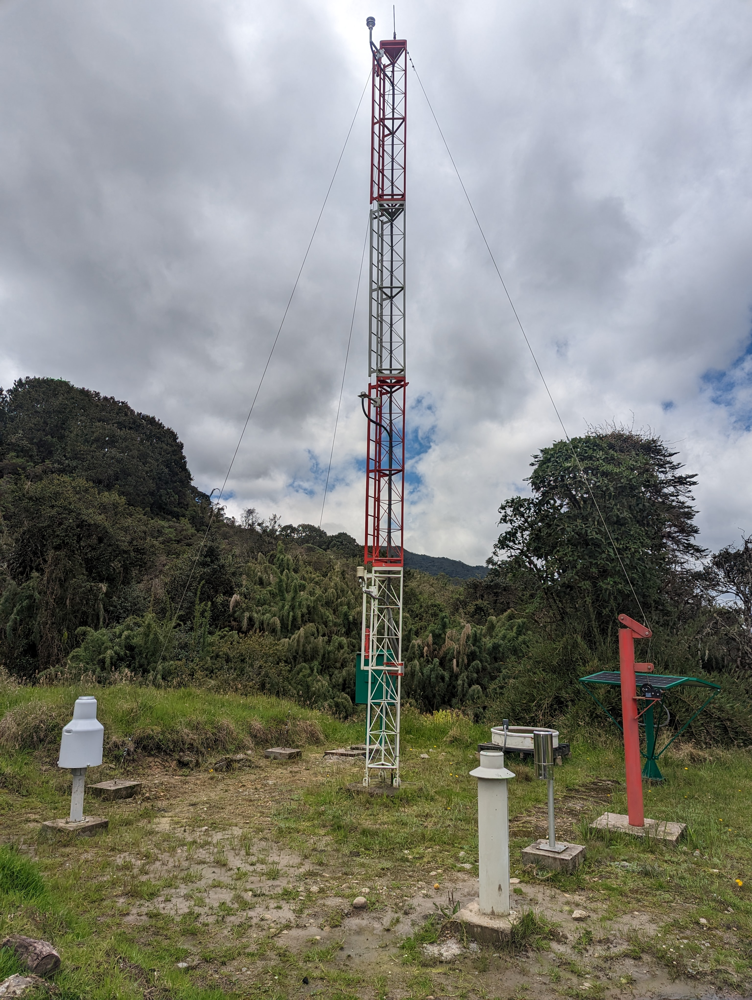
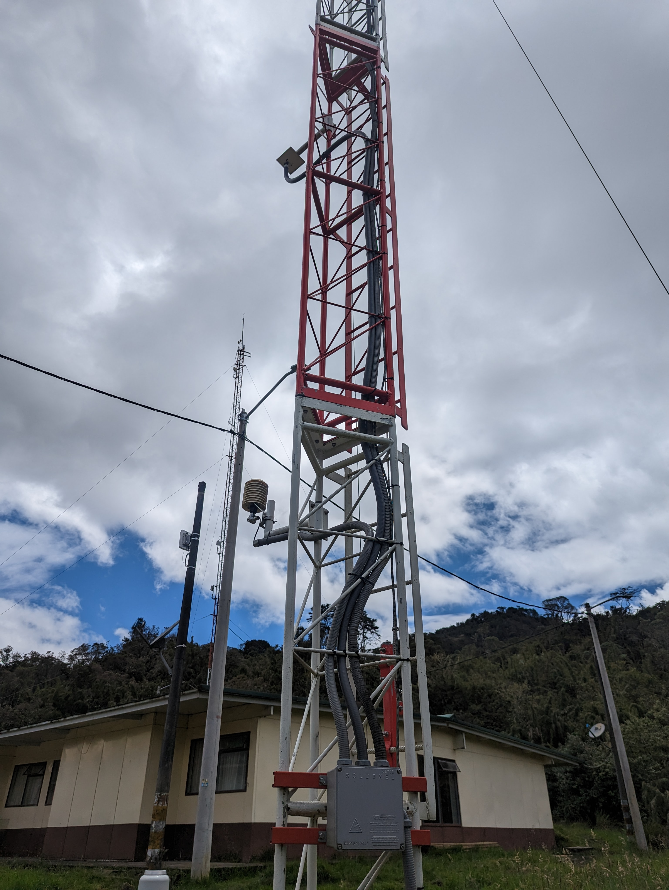
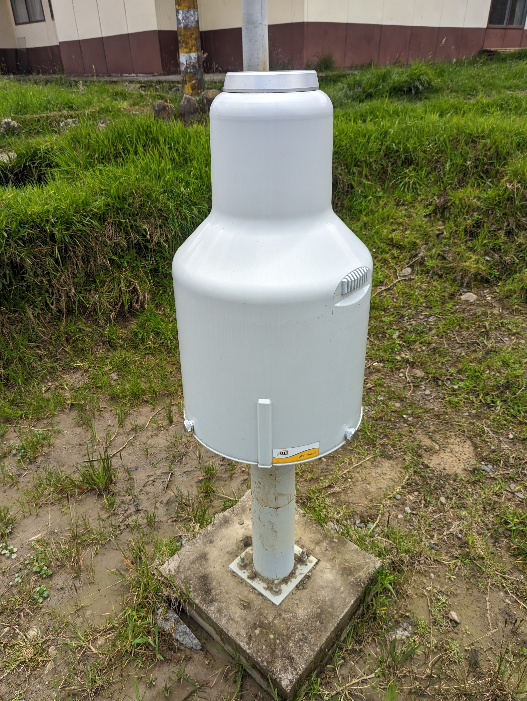

## Campamento EAB. Estación climatológica Chuza Monterredondo (2023-05-03)
:camera: Fotos: rcfdtools<br>Categoría: Technical field visit

```geojson
{
  "type": "Feature",
  "geometry": {
    "type": "Point", 
    "coordinates": [-73.72457222222222, 4.634402777777777]
  }, 
  "properties": {
    "Name": "Campamento EAB. Estación climatológica Chuza Monterredondo"
  }
}
```

`File` **3/PXL_20230503_155933043.jpg** <sub>`OS version` HDR+ 1.0.520435816zd `Date` 2023:05:03 10:59:33 `Aperture` Not known `Brightness` 9.17 `Color space` 1 `Compression` 6 `Exif version` 0232 `Exposure mode` 0 `Exposure time` 0.000477 `Focal length` 6.81 `Lens model` Pixel 6 back camera 6.81mm f/1.85 `Lens specification` Not known `Orientation` 1 `Scene type` Not known `Software` HDR+ 1.0.520435816zd `White balance` 0</sub>


`File` **3/PXL_20230503_155938980.jpg** <sub>`OS version` HDR+ 1.0.520435816zd `Date` 2023:05:03 10:59:38 `Aperture` Not known `Brightness` 9.27 `Color space` 1 `Compression` 6 `Exif version` 0232 `Exposure mode` 0 `Exposure time` 0.000468 `Focal length` 6.81 `Lens model` Pixel 6 back camera 6.81mm f/1.85 `Lens specification` Not known `Orientation` 1 `Scene type` Not known `Software` HDR+ 1.0.520435816zd `White balance` 0</sub>
<br>Coordinates & altitude: (4.634430555555555, -73.72469722222222, 3495.81)<br>:earth_americas: Location over [Google Maps](http://maps.google.com/maps?q=4.634430555555555,-73.72469722222222) or [Openstreet Map](https://www.openstreetmap.org/query?lat=4.634430555555555&lon=-73.72469722222222)


`File` **3/PXL_20230503_160044311.jpg** <sub>`OS version` HDR+ 1.0.520435816zd `Date` 2023:05:03 11:00:44 `Aperture` Not known `Brightness` 9.61 `Color space` 1 `Compression` 6 `Exif version` 0232 `Exposure mode` 0 `Exposure time` 0.000318 `Focal length` 6.81 `Lens model` Pixel 6 back camera 6.81mm f/1.85 `Lens specification` Not known `Orientation` 1 `Scene type` Not known `Software` HDR+ 1.0.520435816zd `White balance` 0</sub>
<br>Coordinates & altitude: (4.634402777777777, -73.72457222222222, 3051.38)<br>:earth_americas: Location over [Google Maps](http://maps.google.com/maps?q=4.634402777777777,-73.72457222222222) or [Openstreet Map](https://www.openstreetmap.org/query?lat=4.634402777777777&lon=-73.72457222222222)


`File` **3/PXL_20230503_160207984.jpg** <sub>`OS version` HDR+ 1.0.520435816zd `Date` 2023:05:03 11:02:07 `Aperture` Not known `Brightness` 8.26 `Color space` 1 `Compression` 6 `Exif version` 0232 `Exposure mode` 0 `Exposure time` 0.000892 `Focal length` 6.81 `Lens model` Pixel 6 back camera 6.81mm f/1.85 `Lens specification` Not known `Orientation` 1 `Scene type` Not known `Software` HDR+ 1.0.520435816zd `White balance` 0</sub>
<br>Coordinates & altitude: (4.634402777777777, -73.72457222222222, 3051.38)<br>:earth_americas: Location over [Google Maps](http://maps.google.com/maps?q=4.634402777777777,-73.72457222222222) or [Openstreet Map](https://www.openstreetmap.org/query?lat=4.634402777777777&lon=-73.72457222222222)


`File` **3/PXL_20230503_160215078.jpg** <sub>`OS version` HDR+ 1.0.520435816zd `Date` 2023:05:03 11:02:15 `Aperture` Not known `Brightness` 10.19 `Color space` 1 `Compression` 6 `Exif version` 0232 `Exposure mode` 0 `Exposure time` 0.000203 `Focal length` 6.81 `Lens model` Pixel 6 back camera 6.81mm f/1.85 `Lens specification` Not known `Orientation` 1 `Scene type` Not known `Software` HDR+ 1.0.520435816zd `White balance` 0</sub>
<br>Coordinates & altitude: (4.634402777777777, -73.72457222222222, 3051.38)<br>:earth_americas: Location over [Google Maps](http://maps.google.com/maps?q=4.634402777777777,-73.72457222222222) or [Openstreet Map](https://www.openstreetmap.org/query?lat=4.634402777777777&lon=-73.72457222222222)


`File` **3/PXL_20230503_160224723.jpg** <sub>`OS version` HDR+ 1.0.520435816zd `Date` 2023:05:03 11:02:24 `Aperture` Not known `Brightness` 8.0 `Color space` 1 `Compression` 6 `Exif version` 0232 `Exposure mode` 0 `Exposure time` 0.000928 `Focal length` 6.81 `Lens model` Pixel 6 back camera 6.81mm f/1.85 `Lens specification` Not known `Orientation` 1 `Scene type` Not known `Software` HDR+ 1.0.520435816zd `White balance` 0</sub>
<br>Coordinates & altitude: (4.634402777777777, -73.72457222222222, 3051.38)<br>:earth_americas: Location over [Google Maps](http://maps.google.com/maps?q=4.634402777777777,-73.72457222222222) or [Openstreet Map](https://www.openstreetmap.org/query?lat=4.634402777777777&lon=-73.72457222222222)


`File` **3/PXL_20230503_160239329.jpg** <sub>`OS version` HDR+ 1.0.520435816zd `Date` 2023:05:03 11:02:39 `Aperture` Not known `Brightness` 7.99 `Color space` 1 `Compression` 6 `Exif version` 0232 `Exposure mode` 0 `Exposure time` 0.000892 `Focal length` 6.81 `Lens model` Pixel 6 back camera 6.81mm f/1.85 `Lens specification` Not known `Orientation` 1 `Scene type` Not known `Software` HDR+ 1.0.520435816zd `White balance` 0</sub>
<br>Coordinates & altitude: (4.634402777777777, -73.72457222222222, 3051.38)<br>:earth_americas: Location over [Google Maps](http://maps.google.com/maps?q=4.634402777777777,-73.72457222222222) or [Openstreet Map](https://www.openstreetmap.org/query?lat=4.634402777777777&lon=-73.72457222222222)


`File` **3/PXL_20230503_160247835.jpg** <sub>`OS version` HDR+ 1.0.520435816zd `Date` 2023:05:03 11:02:47 `Aperture` Not known `Brightness` 7.93 `Color space` 1 `Compression` 6 `Exif version` 0232 `Exposure mode` 0 `Exposure time` 0.000998 `Focal length` 6.81 `Lens model` Pixel 6 back camera 6.81mm f/1.85 `Lens specification` Not known `Orientation` 1 `Scene type` Not known `Software` HDR+ 1.0.520435816zd `White balance` 0</sub>
<br>Coordinates & altitude: (4.634402777777777, -73.72457222222222, 3051.38)<br>:earth_americas: Location over [Google Maps](http://maps.google.com/maps?q=4.634402777777777,-73.72457222222222) or [Openstreet Map](https://www.openstreetmap.org/query?lat=4.634402777777777&lon=-73.72457222222222)


`File` **3/PXL_20230503_160321527.jpg** <sub>`OS version` HDR+ 1.0.520435816zd `Date` 2023:05:03 11:03:21 `Aperture` Not known `Brightness` 9.12 `Color space` 1 `Compression` 6 `Exif version` 0232 `Exposure mode` 0 `Exposure time` 0.000468 `Focal length` 6.81 `Lens model` Pixel 6 back camera 6.81mm f/1.85 `Lens specification` Not known `Orientation` 1 `Scene type` Not known `Software` HDR+ 1.0.520435816zd `White balance` 0</sub>
<br>Coordinates & altitude: (4.634369444444444, -73.72456944444444, 3052.68)<br>:earth_americas: Location over [Google Maps](http://maps.google.com/maps?q=4.634369444444444,-73.72456944444444) or [Openstreet Map](https://www.openstreetmap.org/query?lat=4.634369444444444&lon=-73.72456944444444)


`File` **3/PXL_20230503_214412455.jpg** <sub>`OS version` HDR+ 1.0.520435816zd `Date` 2023:05:03 16:44:12 `Aperture` Not known `Brightness` 5.26 `Color space` 1 `Compression` 6 `Exif version` 0232 `Exposure mode` 0 `Exposure time` 0.006802 `Focal length` 6.81 `Lens model` Pixel 6 back camera 6.81mm f/1.85 `Lens specification` Not known `Orientation` 1 `Scene type` Not known `Software` HDR+ 1.0.520435816zd `White balance` 0</sub>
<br>Coordinates & altitude: (4.634694444444444, -73.72484722222222, 3474.67)<br>:earth_americas: Location over [Google Maps](http://maps.google.com/maps?q=4.634694444444444,-73.72484722222222) or [Openstreet Map](https://www.openstreetmap.org/query?lat=4.634694444444444&lon=-73.72484722222222)


`File` **3/PXL_20230503_214416501.jpg** <sub>`OS version` HDR+ 1.0.520435816zd `Date` 2023:05:03 16:44:16 `Aperture` Not known `Brightness` 5.16 `Color space` 1 `Compression` 6 `Exif version` 0232 `Exposure mode` 0 `Exposure time` 0.007279 `Focal length` 6.81 `Lens model` Pixel 6 back camera 6.81mm f/1.85 `Lens specification` Not known `Orientation` 1 `Scene type` Not known `Software` HDR+ 1.0.520435816zd `White balance` 0</sub>
<br>Coordinates & altitude: (4.634694444444444, -73.72484722222222, 3474.67)<br>:earth_americas: Location over [Google Maps](http://maps.google.com/maps?q=4.634694444444444,-73.72484722222222) or [Openstreet Map](https://www.openstreetmap.org/query?lat=4.634694444444444&lon=-73.72484722222222)


`File` **3/PXL_20230503_214439657.jpg** <sub>`OS version` HDR+ 1.0.520435816zd `Date` 2023:05:03 16:44:39 `Aperture` Not known `Brightness` 4.77 `Color space` 1 `Compression` 6 `Exif version` 0232 `Exposure mode` 0 `Exposure time` 0.006042 `Focal length` 6.81 `Lens model` Pixel 6 back camera 6.81mm f/1.85 `Lens specification` Not known `Orientation` 1 `Scene type` Not known `Software` HDR+ 1.0.520435816zd `White balance` 0</sub>
<br>Coordinates & altitude: (4.634694444444444, -73.72484722222222, 3474.67)<br>:earth_americas: Location over [Google Maps](http://maps.google.com/maps?q=4.634694444444444,-73.72484722222222) or [Openstreet Map](https://www.openstreetmap.org/query?lat=4.634694444444444&lon=-73.72484722222222)


`File` **3/PXL_20230503_214442343.jpg** <sub>`OS version` HDR+ 1.0.520435816zd `Date` 2023:05:03 16:44:42 `Aperture` Not known `Brightness` 5.56 `Color space` 1 `Compression` 6 `Exif version` 0232 `Exposure mode` 0 `Exposure time` 0.005027 `Focal length` 6.81 `Lens model` Pixel 6 back camera 6.81mm f/1.85 `Lens specification` Not known `Orientation` 1 `Scene type` Not known `Software` HDR+ 1.0.520435816zd `White balance` 0</sub>
<br>Coordinates & altitude: (4.634694444444444, -73.72484722222222, 3474.67)<br>:earth_americas: Location over [Google Maps](http://maps.google.com/maps?q=4.634694444444444,-73.72484722222222) or [Openstreet Map](https://www.openstreetmap.org/query?lat=4.634694444444444&lon=-73.72484722222222)


| [:house: Inicio](../Readme.md) |
|---|