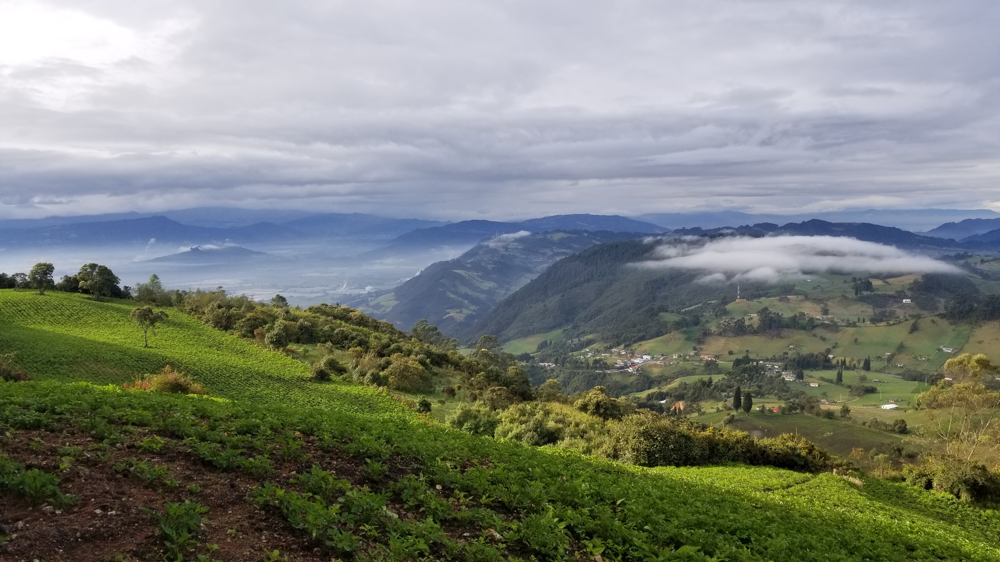
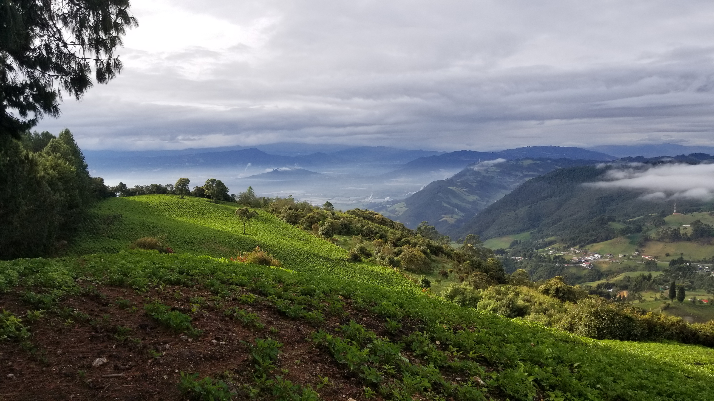
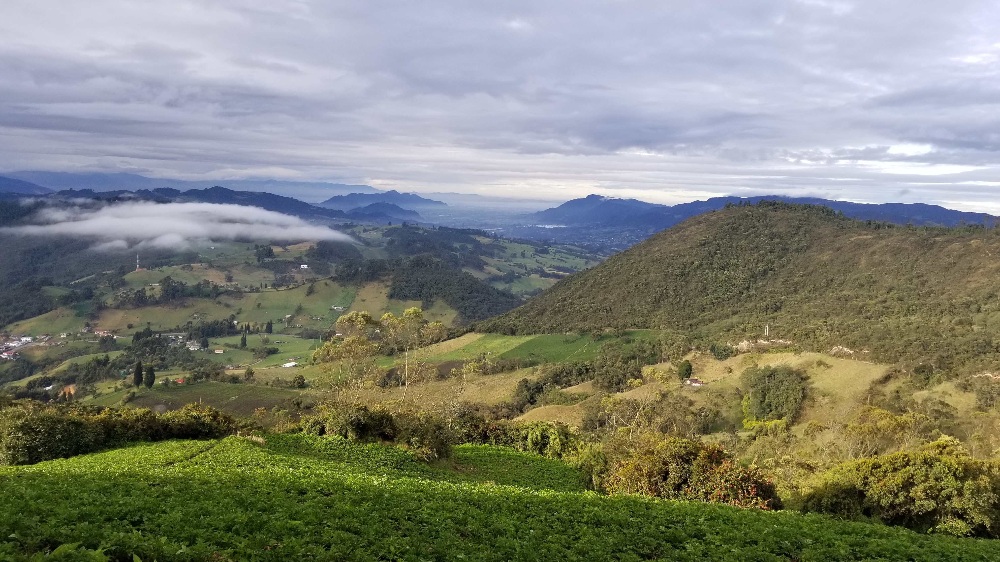
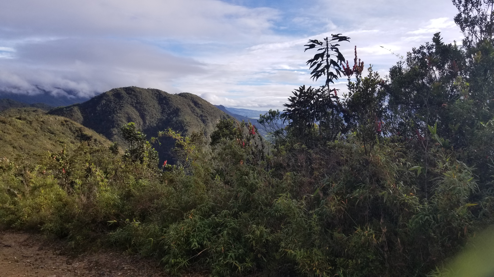
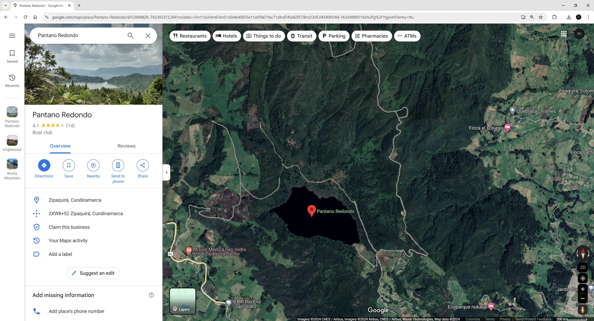

## :globe_with_meridians:Pantano Redondo trail, Zipaquirá, Cundinamarca, Colombia (2020-10-10)
`Pictures` rcfdtools <br>`Category` Freelance field visit <br>`Location` [Google Maps](http://maps.google.com/maps?q=5.054401,-74.026773) or [Openstreet Map](https://www.openstreetmap.org/query?lat=5.054401&lon=-74.026773) 

```geojson
{
  "type": "Feature",
  "geometry": {
    "type": "Point", 
    "coordinates": [-74.026773, 5.054401]
  }, 
  "properties": {
    "Name": "Pantano Redondo trail, Zipaquirá, Cundinamarca, Colombia"
  }
}
```

:camera:**30/20201010_065709.jpg** <details><summary>+ info</summary><sub> `Exif version` 0220 `OS version` G955USQU7DTF4 `Date` 2020:10:10 06:57:09 `Aperture` Not known `Brightness` 6.66 `Color space` 1 `Compression` 6`Exposure mode` 0 `Exposure time` 0.001639344262295082 `Focal length` 4.25 `Lens model` Not known `Lens specification` Not known `Orientation` 1 `Scene type` Not known `f number` 1.7 `White balance` 0 `Sensing method` 2 `Shutter speed` 9.252</sub></details><sub>`Coordinates & altitude` (5.0419052777777775, -74.02458202777778, 3270.571)</sub><sub> :globe_with_meridians:`Location over` [Google Maps](http://maps.google.com/maps?q=5.0419052777777775,-74.02458202777778) or [Openstreet Map](https://www.openstreetmap.org/query?lat=5.0419052777777775&lon=-74.02458202777778)</sub>


:camera:**30/20201010_065711.jpg** <details><summary>+ info</summary><sub> `Exif version` 0220 `OS version` G955USQU7DTF4 `Date` 2020:10:10 06:57:11 `Aperture` Not known `Brightness` 6.65 `Color space` 1 `Compression` 6`Exposure mode` 0 `Exposure time` 0.0015432098765432098 `Focal length` 4.25 `Lens model` Not known `Lens specification` Not known `Orientation` 1 `Scene type` Not known `f number` 1.7 `White balance` 0 `Sensing method` 2 `Shutter speed` 9.339</sub></details><sub>`Coordinates & altitude` (5.0419052777777775, -74.02458202777778, 3270.571)</sub><sub> :globe_with_meridians:`Location over` [Google Maps](http://maps.google.com/maps?q=5.0419052777777775,-74.02458202777778) or [Openstreet Map](https://www.openstreetmap.org/query?lat=5.0419052777777775&lon=-74.02458202777778)</sub>


:camera:**30/20201010_065715.jpg** <details><summary>+ info</summary><sub> `Exif version` 0220 `OS version` G955USQU7DTF4 `Date` 2020:10:10 06:57:15 `Aperture` Not known `Brightness` 6.51 `Color space` 1 `Compression` 6`Exposure mode` 0 `Exposure time` 0.0017605633802816902 `Focal length` 4.25 `Lens model` Not known `Lens specification` Not known `Orientation` 1 `Scene type` Not known `f number` 1.7 `White balance` 0 `Sensing method` 2 `Shutter speed` 9.149</sub></details><sub>`Coordinates & altitude` (5.0419052777777775, -74.02458202777778, 3270.571)</sub><sub> :globe_with_meridians:`Location over` [Google Maps](http://maps.google.com/maps?q=5.0419052777777775,-74.02458202777778) or [Openstreet Map](https://www.openstreetmap.org/query?lat=5.0419052777777775&lon=-74.02458202777778)</sub>


:camera:**30/20201010_070859.jpg** <details><summary>+ info</summary><sub> `Exif version` 0220 `OS version` G955USQU7DTF4 `Date` 2020:10:10 07:08:58 `Aperture` Not known `Brightness` Not known `Color space` 1 `Compression` Not known`Exposure mode` 0 `Exposure time` 0.0006377551020408163 `Focal length` 4.25 `Lens model` Not known `Lens specification` Not known `Orientation` 1 `Scene type` Not known `f number` 1.7 `White balance` 0 `Sensing method` Not known `Shutter speed` Not known</sub></details>

:camera:**30/20201010_070901.jpg** <details><summary>+ info</summary><sub> `Exif version` 0220 `OS version` G955USQU7DTF4 `Date` 2020:10:10 07:09:01 `Aperture` Not known `Brightness` Not known `Color space` 1 `Compression` Not known`Exposure mode` 0 `Exposure time` 0.0004432624113475177 `Focal length` 4.25 `Lens model` Not known `Lens specification` Not known `Orientation` 1 `Scene type` Not known `f number` 1.7 `White balance` 0 `Sensing method` Not known `Shutter speed` Not known</sub></details>

:camera:**30/20201010_070904.jpg** <details><summary>+ info</summary><sub> `Exif version` 0220 `OS version` G955USQU7DTF4 `Date` 2020:10:10 07:09:04 `Aperture` Not known `Brightness` Not known `Color space` 1 `Compression` Not known`Exposure mode` 0 `Exposure time` 0.00051440329218107 `Focal length` 4.25 `Lens model` Not known `Lens specification` Not known `Orientation` 1 `Scene type` Not known `f number` 1.7 `White balance` 0 `Sensing method` Not known `Shutter speed` Not known</sub></details>

:camera:**30/20201010_070909.jpg** <details><summary>+ info</summary><sub> `Exif version` 0220 `OS version` G955USQU7DTF4 `Date` 2020:10:10 07:09:09 `Aperture` Not known `Brightness` Not known `Color space` 1 `Compression` Not known`Exposure mode` 0 `Exposure time` 0.0006756756756756757 `Focal length` 4.25 `Lens model` Not known `Lens specification` Not known `Orientation` 1 `Scene type` Not known `f number` 1.7 `White balance` 0 `Sensing method` Not known `Shutter speed` Not known</sub></details>

:camera: **30/GoogleMaps.jpg**  <details><summary>+ info</summary><sub> `Exif version` Not known</details>

> _Citación: se permite la reproducción digital parcial o total de este repositorio, scripts, guías de desarrollo, modelos de datos, imágenes y documentación, siempre que se haga referencia como: "R.GISMobile - Sistemas de información geográficos móviles sobre QField que no requieren de conexión a Internet para su navegación". https://github.com/rcfdtools/R.GISMobile - Bogotá - Colombia - Suramérica."._

| [:house: Inicio](../Readme.md) |
|---|