<div align="center"></div>

## :earth_americas:POI: Antena del Oso, Subachoque, Cundinamarca, Colombia (2022-11-31)
`Pictures` rcfdtools <br>`Category` Freelance field visit <br>`Location` [Google Maps](http://maps.google.com/maps?q=5.056057,-74.137623) or [Openstreet Map](https://www.openstreetmap.org/query?lat=5.056057&lon=-74.137623) 

```geojson
{
  "type": "Feature",
  "geometry": {
    "type": "Point", 
    "coordinates": [-74.137623, 5.056057]
  }, 
  "properties": {
    "Name": "Antena del Oso, Subachoque, Cundinamarca, Colombia"
  }
}
```

<br><details><summary>:camera:**31/20180310_073610.jpg**</summary><sub> `Exif version` 0220 `OS version` G930PVPS5BRA1 `Date` 2018:03:10 07:36:10 `Aperture` Not known `Brightness` 9.91 `Color space` 1 `Compression` 6`Exposure mode` 0 `Exposure time` 0.00022401433691756272 `Focal length` 4.2 `Lens model` Not known `Lens specification` Not known `Orientation` 1 `Scene type` Not known `f number` 1.7 `White balance` 0 `Sensing method` 2 `Shutter speed` 12.124</sub></details>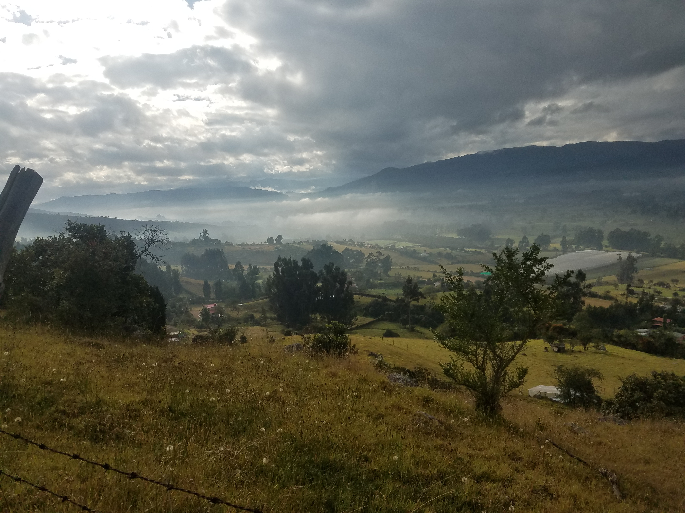

<br><details><summary>:camera:**31/20180310_073618.jpg**</summary><sub> `Exif version` 0220 `OS version` G930PVPS5BRA1 `Date` 2018:03:10 07:36:18 `Aperture` Not known `Brightness` 8.29 `Color space` 1 `Compression` 6`Exposure mode` 0 `Exposure time` 0.0007062146892655367 `Focal length` 4.2 `Lens model` Not known `Lens specification` Not known `Orientation` 1 `Scene type` Not known `f number` 1.7 `White balance` 0 `Sensing method` 2 `Shutter speed` 10.467</sub></details>

<br><details><summary>:camera:**31/20180310_073624.jpg**</summary><sub> `Exif version` 0220 `OS version` G930PVPS5BRA1 `Date` 2018:03:10 07:36:23 `Aperture` Not known `Brightness` 8.7 `Color space` 1 `Compression` 6`Exposure mode` 0 `Exposure time` 0.0005081300813008131 `Focal length` 4.2 `Lens model` Not known `Lens specification` Not known `Orientation` 1 `Scene type` Not known `f number` 1.7 `White balance` 0 `Sensing method` 2 `Shutter speed` 10.942</sub></details>

<br><details><summary>:camera:**31/20180317_074438.jpg**</summary><sub> `Exif version` 0220 `OS version` G930PVPS5BRA1 `Date` 2018:03:17 07:44:37 `Aperture` Not known `Brightness` 10.18 `Color space` 1 `Compression` 6`Exposure mode` 0 `Exposure time` 0.00018882175226586103 `Focal length` 4.2 `Lens model` Not known `Lens specification` Not known `Orientation` 1 `Scene type` Not known `f number` 1.7 `White balance` 0 `Sensing method` 2 `Shutter speed` 12.37</sub></details>

<br><details><summary>:camera:**31/20180317_074440.jpg**</summary><sub> `Exif version` 0220 `OS version` G930PVPS5BRA1 `Date` 2018:03:17 07:44:40 `Aperture` Not known `Brightness` 10.66 `Color space` 1 `Compression` 6`Exposure mode` 0 `Exposure time` 0.00012807377049180329 `Focal length` 4.2 `Lens model` Not known `Lens specification` Not known `Orientation` 1 `Scene type` Not known `f number` 1.7 `White balance` 0 `Sensing method` 2 `Shutter speed` 12.93</sub></details>

<br><details><summary>:camera:**31/20180317_074444.jpg**</summary><sub> `Exif version` 0220 `OS version` G930PVPS5BRA1 `Date` 2018:03:17 07:44:44 `Aperture` Not known `Brightness` 8.74 `Color space` 1 `Compression` 6`Exposure mode` 0 `Exposure time` 0.00048828125 `Focal length` 4.2 `Lens model` Not known `Lens specification` Not known `Orientation` 1 `Scene type` Not known `f number` 1.7 `White balance` 0 `Sensing method` 2 `Shutter speed` 11.0</sub></details>

<br><details><summary>:camera:**31/20221113_081432.jpg**</summary><sub> `Exif version` 0220 `OS version` G955USQU8DUD3 `Date` 2022:11:13 08:14:31 `Aperture` Not known `Brightness` 0.94 `Color space` 1 `Compression` 6`Exposure mode` 0 `Exposure time` 0.025 `Focal length` 4.25 `Lens model` Not known `Lens specification` Not known `Orientation` 6 `Scene type` Not known `f number` 1.7 `White balance` 0 `Sensing method` 2 `Shutter speed` 5.321</sub><sub>`Coordinates & altitude` (0.0, 0.0, 0.0)</sub><sub> :earth_americas:`Location over` [Google Maps](http://maps.google.com/maps?q=0.0,0.0) or [Openstreet Map](https://www.openstreetmap.org/query?lat=0.0&lon=0.0)</sub></details>

<br><details><summary>:camera:**31/20221113_083938.jpg**</summary><sub> `Exif version` 0220 `OS version` G955USQU8DUD3 `Date` 2022:11:13 08:39:38 `Aperture` Not known `Brightness` 8.65 `Color space` 1 `Compression` 6`Exposure mode` 0 `Exposure time` 0.0003787878787878788 `Focal length` 4.25 `Lens model` Not known `Lens specification` Not known `Orientation` 6 `Scene type` Not known `f number` 1.7 `White balance` 0 `Sensing method` 2 `Shutter speed` 11.366</sub><sub>`Coordinates & altitude` (0.0, 0.0, 0.0)</sub><sub> :earth_americas:`Location over` [Google Maps](http://maps.google.com/maps?q=0.0,0.0) or [Openstreet Map](https://www.openstreetmap.org/query?lat=0.0&lon=0.0)</sub></details>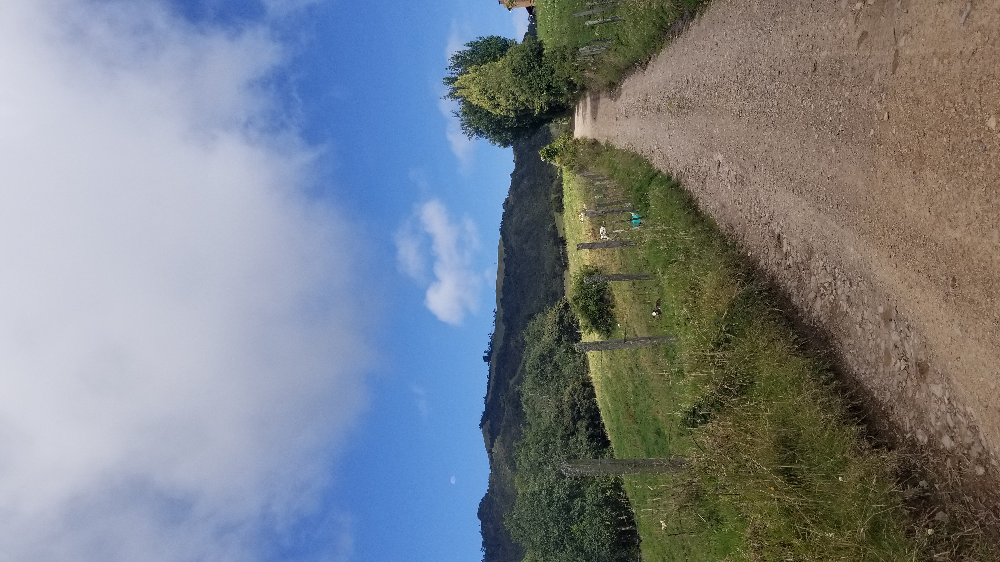

<br><details><summary>:camera:**31/20221113_084010.jpg**</summary><sub> `Exif version` 0220 `OS version` G955USQU8DUD3 `Date` 2022:11:13 08:40:10 `Aperture` Not known `Brightness` 8.58 `Color space` 1 `Compression` 6`Exposure mode` 0 `Exposure time` 0.0004166666666666667 `Focal length` 4.25 `Lens model` Not known `Lens specification` Not known `Orientation` 1 `Scene type` Not known `f number` 1.7 `White balance` 0 `Sensing method` 2 `Shutter speed` 11.228</sub><sub>`Coordinates & altitude` (0.0, 0.0, 0.0)</sub><sub> :earth_americas:`Location over` [Google Maps](http://maps.google.com/maps?q=0.0,0.0) or [Openstreet Map](https://www.openstreetmap.org/query?lat=0.0&lon=0.0)</sub></details>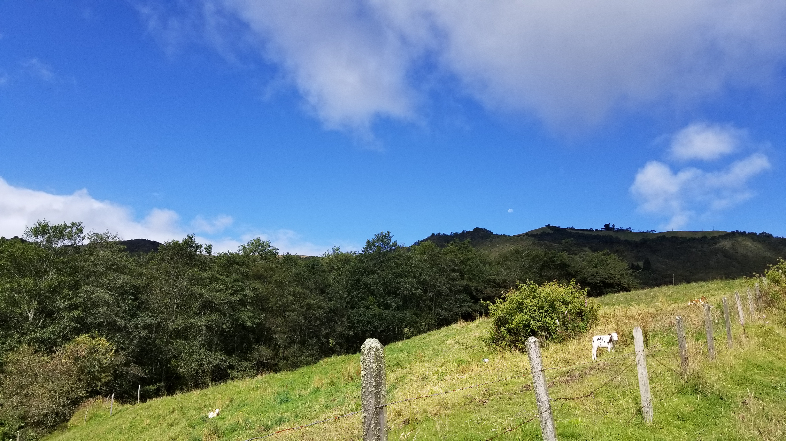

<br><details><summary>:camera:**31/20221113_084015.jpg**</summary><sub> `Exif version` 0220 `OS version` G955USQU8DUD3 `Date` 2022:11:13 08:40:15 `Aperture` Not known `Brightness` 9.93 `Color space` 1 `Compression` 6`Exposure mode` 0 `Exposure time` 0.00016490765171503957 `Focal length` 4.25 `Lens model` Not known `Lens specification` Not known `Orientation` 1 `Scene type` Not known `f number` 1.7 `White balance` 0 `Sensing method` 2 `Shutter speed` 12.566</sub><sub>`Coordinates & altitude` (0.0, 0.0, 0.0)</sub><sub> :earth_americas:`Location over` [Google Maps](http://maps.google.com/maps?q=0.0,0.0) or [Openstreet Map](https://www.openstreetmap.org/query?lat=0.0&lon=0.0)</sub></details>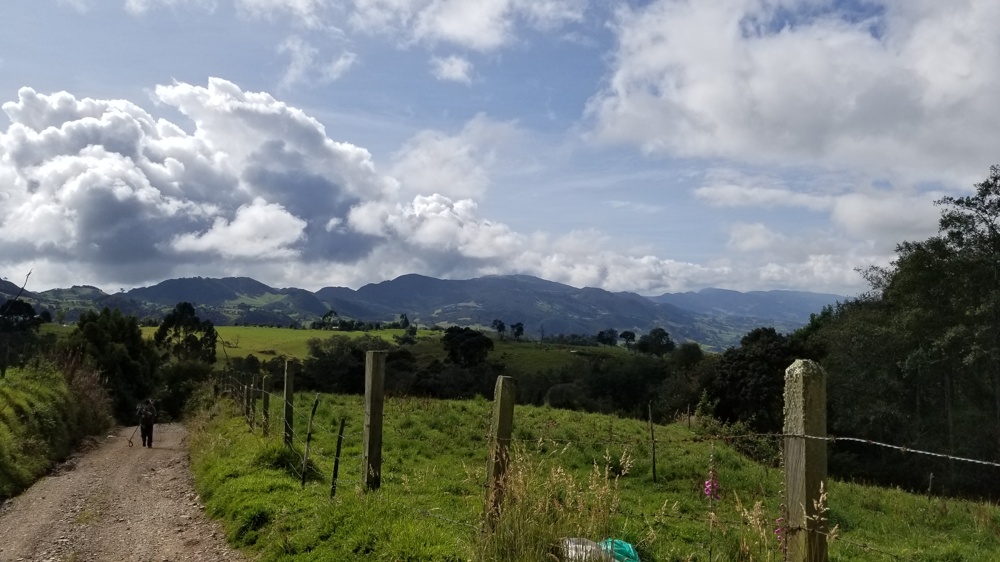

<br><details><summary>:camera:**31/20221113_090112.jpg**</summary><sub> `Exif version` 0220 `OS version` G955USQU8DUD3 `Date` 2022:11:13 09:01:12 `Aperture` Not known `Brightness` 9.03 `Color space` 1 `Compression` 6`Exposure mode` 0 `Exposure time` 0.000251004016064257 `Focal length` 4.25 `Lens model` Not known `Lens specification` Not known `Orientation` 6 `Scene type` Not known `f number` 1.7 `White balance` 0 `Sensing method` 2 `Shutter speed` 11.96</sub><sub>`Coordinates & altitude` (0.0, 0.0, 0.0)</sub><sub> :earth_americas:`Location over` [Google Maps](http://maps.google.com/maps?q=0.0,0.0) or [Openstreet Map](https://www.openstreetmap.org/query?lat=0.0&lon=0.0)</sub></details>

<br><details><summary>:camera:**31/20221113_090118.jpg**</summary><sub> `Exif version` 0220 `OS version` G955USQU8DUD3 `Date` 2022:11:13 09:01:18 `Aperture` Not known `Brightness` 8.94 `Color space` 1 `Compression` 6`Exposure mode` 0 `Exposure time` 0.000231000231000231 `Focal length` 4.25 `Lens model` Not known `Lens specification` Not known `Orientation` 3 `Scene type` Not known `f number` 1.7 `White balance` 0 `Sensing method` 2 `Shutter speed` 12.079</sub><sub>`Coordinates & altitude` (0.0, 0.0, 0.0)</sub><sub> :earth_americas:`Location over` [Google Maps](http://maps.google.com/maps?q=0.0,0.0) or [Openstreet Map](https://www.openstreetmap.org/query?lat=0.0&lon=0.0)</sub></details>

<br><details><summary>:camera:**31/20221113_092235.jpg**</summary><sub> `Exif version` 0220 `OS version` G955USQU8DUD3 `Date` 2022:11:13 09:22:35 `Aperture` Not known `Brightness` 9.32 `Color space` 1 `Compression` 6`Exposure mode` 0 `Exposure time` 0.00023854961832061068 `Focal length` 4.25 `Lens model` Not known `Lens specification` Not known `Orientation` 6 `Scene type` Not known `f number` 1.7 `White balance` 0 `Sensing method` 2 `Shutter speed` 12.033</sub><sub>`Coordinates & altitude` (0.0, 0.0, 0.0)</sub><sub> :earth_americas:`Location over` [Google Maps](http://maps.google.com/maps?q=0.0,0.0) or [Openstreet Map](https://www.openstreetmap.org/query?lat=0.0&lon=0.0)</sub></details>

<br><details><summary>:camera:**31/20221113_092250.jpg**</summary><sub> `Exif version` 0220 `OS version` G955USQU8DUD3 `Date` 2022:11:13 09:22:50 `Aperture` Not known `Brightness` 9.25 `Color space` 1 `Compression` 6`Exposure mode` 0 `Exposure time` 0.0002682403433476395 `Focal length` 4.25 `Lens model` Not known `Lens specification` Not known `Orientation` 1 `Scene type` Not known `f number` 1.7 `White balance` 0 `Sensing method` 2 `Shutter speed` 11.864</sub><sub>`Coordinates & altitude` (0.0, 0.0, 0.0)</sub><sub> :earth_americas:`Location over` [Google Maps](http://maps.google.com/maps?q=0.0,0.0) or [Openstreet Map](https://www.openstreetmap.org/query?lat=0.0&lon=0.0)</sub></details>

<br><details><summary>:camera:**31/20221113_092252.jpg**</summary><sub> `Exif version` 0220 `OS version` G955USQU8DUD3 `Date` 2022:11:13 09:22:52 `Aperture` Not known `Brightness` 9.33 `Color space` 1 `Compression` 6`Exposure mode` 0 `Exposure time` 0.000251004016064257 `Focal length` 4.25 `Lens model` Not known `Lens specification` Not known `Orientation` 1 `Scene type` Not known `f number` 1.7 `White balance` 0 `Sensing method` 2 `Shutter speed` 11.96</sub><sub>`Coordinates & altitude` (0.0, 0.0, 0.0)</sub><sub> :earth_americas:`Location over` [Google Maps](http://maps.google.com/maps?q=0.0,0.0) or [Openstreet Map](https://www.openstreetmap.org/query?lat=0.0&lon=0.0)</sub></details>

<br><details><summary>:camera:**31/20221113_100005.jpg**</summary><sub> `Exif version` 0220 `OS version` G955USQU8DUD3 `Date` 2022:11:13 10:00:05 `Aperture` Not known `Brightness` 9.33 `Color space` 1 `Compression` 6`Exposure mode` 0 `Exposure time` 0.00025510204081632655 `Focal length` 4.25 `Lens model` Not known `Lens specification` Not known `Orientation` 1 `Scene type` Not known `f number` 1.7 `White balance` 0 `Sensing method` 2 `Shutter speed` 11.936</sub><sub>`Coordinates & altitude` (0.0, 0.0, 0.0)</sub><sub> :earth_americas:`Location over` [Google Maps](http://maps.google.com/maps?q=0.0,0.0) or [Openstreet Map](https://www.openstreetmap.org/query?lat=0.0&lon=0.0)</sub></details>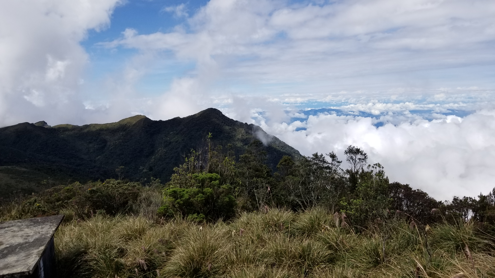

<br><details><summary>:camera:**31/20221113_100010.jpg**</summary><sub> `Exif version` 0220 `OS version` G955USQU8DUD3 `Date` 2022:11:13 10:00:10 `Aperture` Not known `Brightness` 11.7 `Color space` 1 `Compression` 6`Exposure mode` 0 `Exposure time` 4.749240121580547e-05 `Focal length` 4.25 `Lens model` Not known `Lens specification` Not known `Orientation` 6 `Scene type` Not known `f number` 1.7 `White balance` 0 `Sensing method` 2 `Shutter speed` 14.361</sub><sub>`Coordinates & altitude` (0.0, 0.0, 0.0)</sub><sub> :earth_americas:`Location over` [Google Maps](http://maps.google.com/maps?q=0.0,0.0) or [Openstreet Map](https://www.openstreetmap.org/query?lat=0.0&lon=0.0)</sub></details>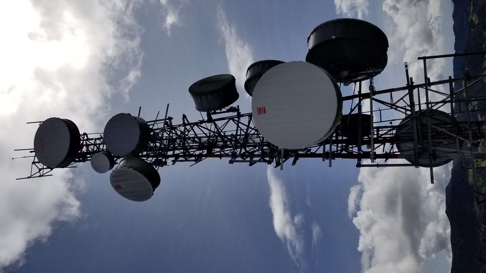

<br><details><summary>:camera:**31/20221113_100107.jpg**</summary><sub> `Exif version` 0220 `OS version` G955USQU8DUD3 `Date` 2022:11:13 10:01:07 `Aperture` Not known `Brightness` 9.45 `Color space` 1 `Compression` 6`Exposure mode` 0 `Exposure time` 0.00023062730627306272 `Focal length` 4.25 `Lens model` Not known `Lens specification` Not known `Orientation` 1 `Scene type` Not known `f number` 1.7 `White balance` 0 `Sensing method` 2 `Shutter speed` 12.082</sub><sub>`Coordinates & altitude` (0.0, 0.0, 0.0)</sub><sub> :earth_americas:`Location over` [Google Maps](http://maps.google.com/maps?q=0.0,0.0) or [Openstreet Map](https://www.openstreetmap.org/query?lat=0.0&lon=0.0)</sub></details>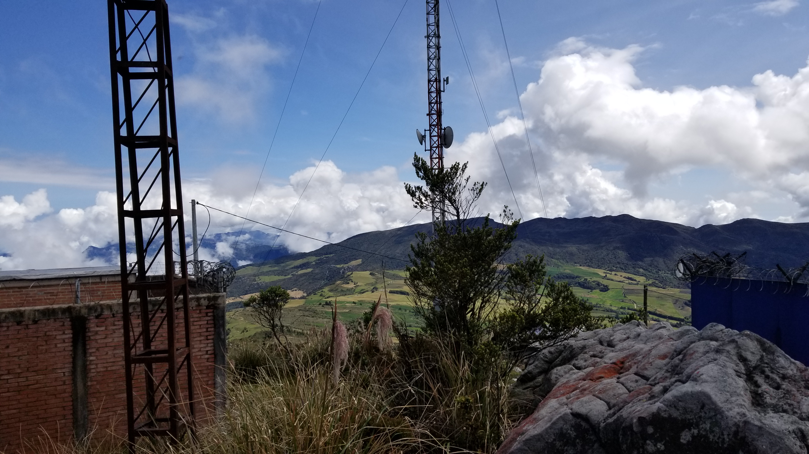

<br><details><summary>:camera:**31/20221113_100140.jpg**</summary><sub> `Exif version` 0220 `OS version` G955USQU8DUD3 `Date` 2022:11:13 10:01:40 `Aperture` Not known `Brightness` 8.88 `Color space` 1 `Compression` 6`Exposure mode` 0 `Exposure time` 0.00032637075718015666 `Focal length` 4.25 `Lens model` Not known `Lens specification` Not known `Orientation` 6 `Scene type` Not known `f number` 1.7 `White balance` 0 `Sensing method` 2 `Shutter speed` 11.581</sub><sub>`Coordinates & altitude` (0.0, 0.0, 0.0)</sub><sub> :earth_americas:`Location over` [Google Maps](http://maps.google.com/maps?q=0.0,0.0) or [Openstreet Map](https://www.openstreetmap.org/query?lat=0.0&lon=0.0)</sub></details>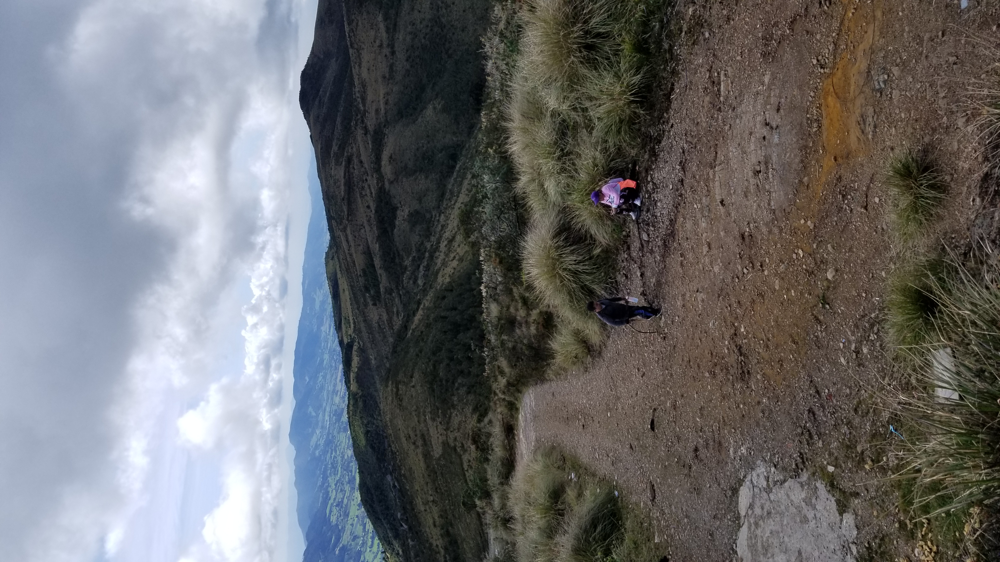

<br><details><summary>:camera:**31/20221113_100148.jpg**</summary><sub> `Exif version` 0220 `OS version` G955USQU8DUD3 `Date` 2022:11:13 10:01:48 `Aperture` Not known `Brightness` 8.44 `Color space` 1 `Compression` 6`Exposure mode` 0 `Exposure time` 0.0004807692307692308 `Focal length` 4.25 `Lens model` Not known `Lens specification` Not known `Orientation` 1 `Scene type` Not known `f number` 1.7 `White balance` 0 `Sensing method` 2 `Shutter speed` 11.022</sub><sub>`Coordinates & altitude` (0.0, 0.0, 0.0)</sub><sub> :earth_americas:`Location over` [Google Maps](http://maps.google.com/maps?q=0.0,0.0) or [Openstreet Map](https://www.openstreetmap.org/query?lat=0.0&lon=0.0)</sub></details>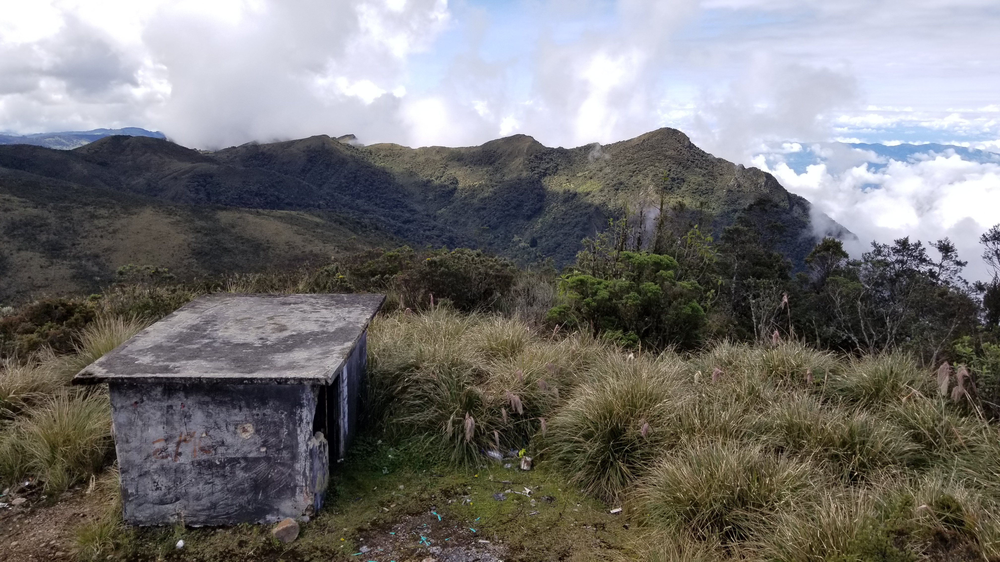

<br><details><summary>:camera:**31/20221113_100155.jpg**</summary><sub> `Exif version` 0220 `OS version` G955USQU8DUD3 `Date` 2022:11:13 10:01:55 `Aperture` Not known `Brightness` 9.27 `Color space` 1 `Compression` 6`Exposure mode` 0 `Exposure time` 0.000251004016064257 `Focal length` 4.25 `Lens model` Not known `Lens specification` Not known `Orientation` 1 `Scene type` Not known `f number` 1.7 `White balance` 0 `Sensing method` 2 `Shutter speed` 11.96</sub><sub>`Coordinates & altitude` (0.0, 0.0, 0.0)</sub><sub> :earth_americas:`Location over` [Google Maps](http://maps.google.com/maps?q=0.0,0.0) or [Openstreet Map](https://www.openstreetmap.org/query?lat=0.0&lon=0.0)</sub></details>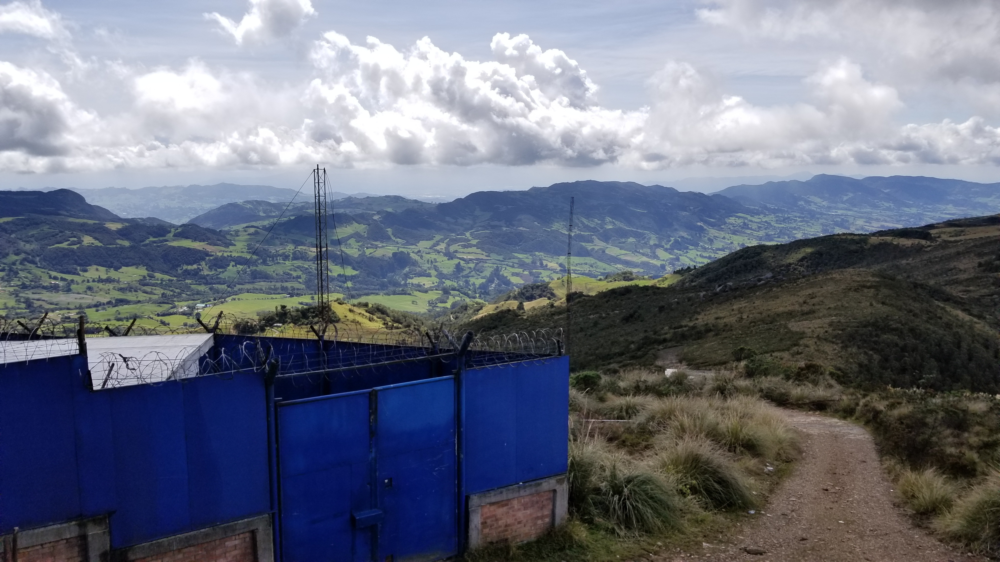

<br><details><summary>:camera:**31/20221113_100156.jpg**</summary><sub> `Exif version` 0220 `OS version` G955USQU8DUD3 `Date` 2022:11:13 10:01:56 `Aperture` Not known `Brightness` 9.18 `Color space` 1 `Compression` 6`Exposure mode` 0 `Exposure time` 0.0002808988764044944 `Focal length` 4.25 `Lens model` Not known `Lens specification` Not known `Orientation` 1 `Scene type` Not known `f number` 1.7 `White balance` 0 `Sensing method` 2 `Shutter speed` 11.797</sub><sub>`Coordinates & altitude` (0.0, 0.0, 0.0)</sub><sub> :earth_americas:`Location over` [Google Maps](http://maps.google.com/maps?q=0.0,0.0) or [Openstreet Map](https://www.openstreetmap.org/query?lat=0.0&lon=0.0)</sub></details>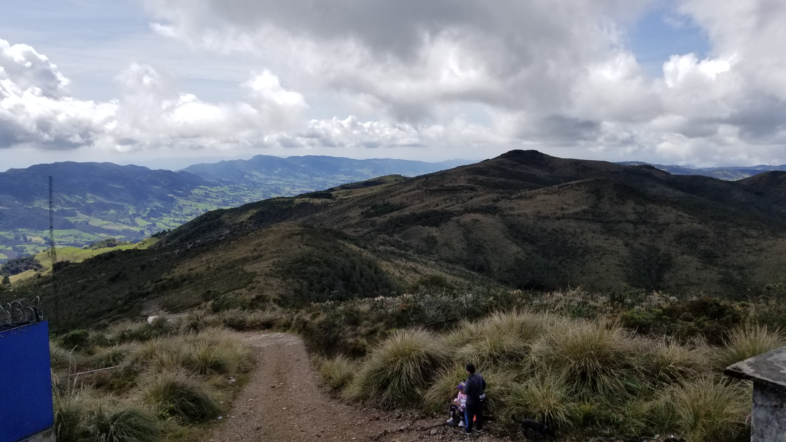

<br><details><summary>:camera:**31/20221113_100258.jpg**</summary><sub> `Exif version` 0220 `OS version` G955USQU8DUD3 `Date` 2022:11:13 10:02:58 `Aperture` Not known `Brightness` Not known `Color space` 1 `Compression` Not known`Exposure mode` 0 `Exposure time` Not known `Focal length` 4.25 `Lens model` Not known `Lens specification` Not known `Orientation` 1 `Scene type` Not known `f number` 1.7 `White balance` 0 `Sensing method` Not known `Shutter speed` Not known</sub></details>

<br><details><summary>:camera:**31/20221113_100343.jpg**</summary><sub> `Exif version` 0220 `OS version` G955USQU8DUD3 `Date` 2022:11:13 10:03:42 `Aperture` Not known `Brightness` Not known `Color space` 1 `Compression` Not known`Exposure mode` 0 `Exposure time` Not known `Focal length` 4.25 `Lens model` Not known `Lens specification` Not known `Orientation` 1 `Scene type` Not known `f number` 1.7 `White balance` 0 `Sensing method` Not known `Shutter speed` Not known</sub></details>

<br><details><summary>:camera:**31/20221113_100451.jpg**</summary><sub> `Exif version` 0220 `OS version` G955USQU8DUD3 `Date` 2022:11:13 10:04:51 `Aperture` Not known `Brightness` Not known `Color space` 1 `Compression` Not known`Exposure mode` 0 `Exposure time` Not known `Focal length` 4.25 `Lens model` Not known `Lens specification` Not known `Orientation` 1 `Scene type` Not known `f number` 1.7 `White balance` 0 `Sensing method` Not known `Shutter speed` Not known</sub></details>

<br><details><summary>:camera:**31/20221113_100500.jpg**</summary><sub> `Exif version` 0220 `OS version` G955USQU8DUD3 `Date` 2022:11:13 10:05:00 `Aperture` Not known `Brightness` 9.43 `Color space` 1 `Compression` 6`Exposure mode` 0 `Exposure time` 0.0002332089552238806 `Focal length` 4.25 `Lens model` Not known `Lens specification` Not known `Orientation` 6 `Scene type` Not known `f number` 1.7 `White balance` 0 `Sensing method` 2 `Shutter speed` 12.066</sub><sub>`Coordinates & altitude` (0.0, 0.0, 0.0)</sub><sub> :earth_americas:`Location over` [Google Maps](http://maps.google.com/maps?q=0.0,0.0) or [Openstreet Map](https://www.openstreetmap.org/query?lat=0.0&lon=0.0)</sub></details>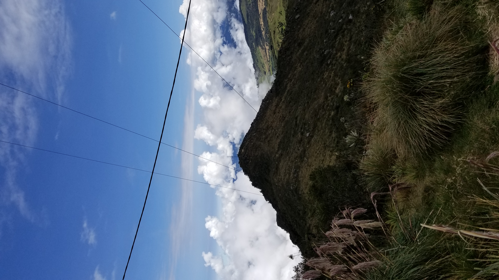

<br><details><summary>:camera:**31/20221113_100505.jpg**</summary><sub> `Exif version` 0220 `OS version` G955USQU8DUD3 `Date` 2022:11:13 10:05:05 `Aperture` Not known `Brightness` 9.46 `Color space` 1 `Compression` 6`Exposure mode` 0 `Exposure time` 0.00021853146853146853 `Focal length` 4.25 `Lens model` Not known `Lens specification` Not known `Orientation` 1 `Scene type` Not known `f number` 1.7 `White balance` 0 `Sensing method` 2 `Shutter speed` 12.159</sub><sub>`Coordinates & altitude` (0.0, 0.0, 0.0)</sub><sub> :earth_americas:`Location over` [Google Maps](http://maps.google.com/maps?q=0.0,0.0) or [Openstreet Map](https://www.openstreetmap.org/query?lat=0.0&lon=0.0)</sub></details>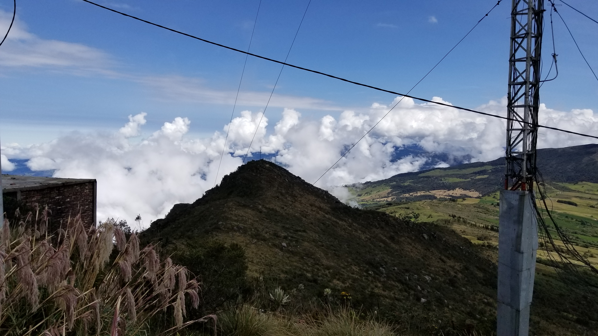

<br><details><summary>:camera:**31/20221113_100508.jpg**</summary><sub> `Exif version` 0220 `OS version` G955USQU8DUD3 `Date` 2022:11:13 10:05:08 `Aperture` Not known `Brightness` 9.41 `Color space` 1 `Compression` 6`Exposure mode` 0 `Exposure time` 0.0002465483234714004 `Focal length` 4.25 `Lens model` Not known `Lens specification` Not known `Orientation` 1 `Scene type` Not known `f number` 1.7 `White balance` 0 `Sensing method` 2 `Shutter speed` 11.985</sub><sub>`Coordinates & altitude` (0.0, 0.0, 0.0)</sub><sub> :earth_americas:`Location over` [Google Maps](http://maps.google.com/maps?q=0.0,0.0) or [Openstreet Map](https://www.openstreetmap.org/query?lat=0.0&lon=0.0)</sub></details>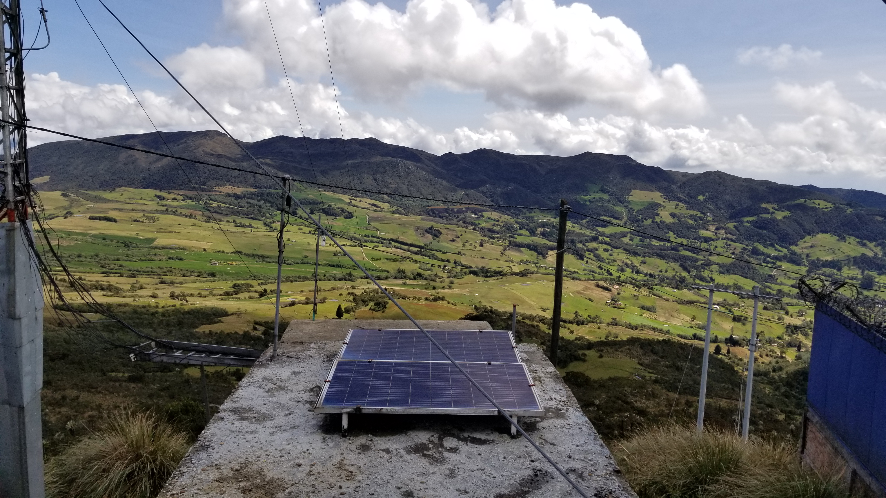

<br><details><summary>:camera:**31/20221113_101654.jpg**</summary><sub> `Exif version` 0220 `OS version` G955USQU8DUD3 `Date` 2022:11:13 10:16:54 `Aperture` Not known `Brightness` 9.09 `Color space` 1 `Compression` 6`Exposure mode` 0 `Exposure time` 0.00029976019184652276 `Focal length` 4.25 `Lens model` Not known `Lens specification` Not known `Orientation` 1 `Scene type` Not known `f number` 1.7 `White balance` 0 `Sensing method` 2 `Shutter speed` 11.703</sub><sub>`Coordinates & altitude` (0.0, 0.0, 0.0)</sub><sub> :earth_americas:`Location over` [Google Maps](http://maps.google.com/maps?q=0.0,0.0) or [Openstreet Map](https://www.openstreetmap.org/query?lat=0.0&lon=0.0)</sub></details>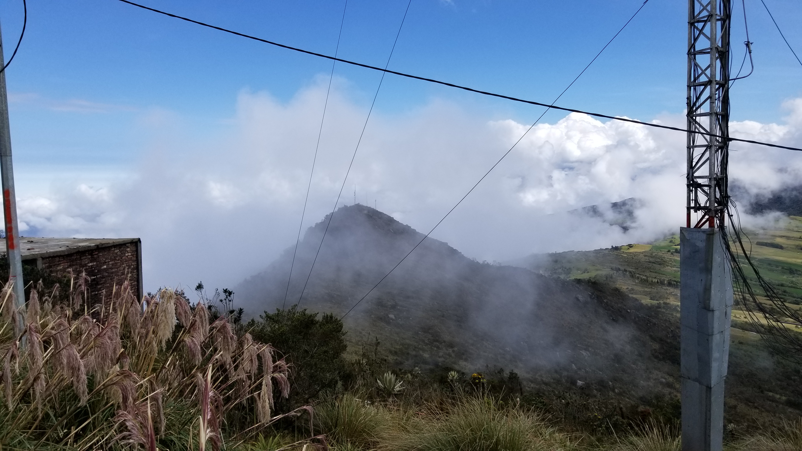

<br><details><summary>:camera:**31/20221113_101700.jpg**</summary><sub> `Exif version` 0220 `OS version` G955USQU8DUD3 `Date` 2022:11:13 10:17:00 `Aperture` Not known `Brightness` 8.89 `Color space` 1 `Compression` 6`Exposure mode` 0 `Exposure time` 0.00034153005464480874 `Focal length` 4.25 `Lens model` Not known `Lens specification` Not known `Orientation` 6 `Scene type` Not known `f number` 1.7 `White balance` 0 `Sensing method` 2 `Shutter speed` 11.515</sub><sub>`Coordinates & altitude` (0.0, 0.0, 0.0)</sub><sub> :earth_americas:`Location over` [Google Maps](http://maps.google.com/maps?q=0.0,0.0) or [Openstreet Map](https://www.openstreetmap.org/query?lat=0.0&lon=0.0)</sub></details>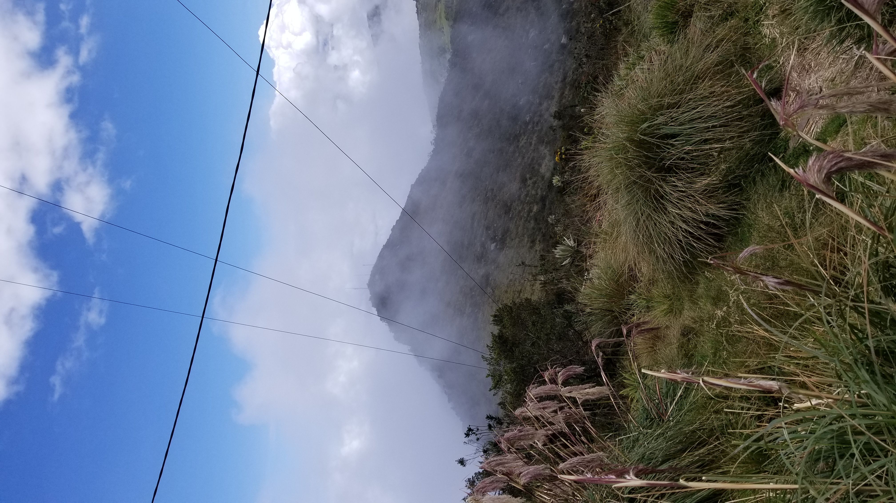

<br><details><summary>:camera:**31/20221113_103734.jpg**</summary><sub> `Exif version` 0220 `OS version` G955USQU8DUD3 `Date` 2022:11:13 10:37:34 `Aperture` Not known `Brightness` 7.58 `Color space` 1 `Compression` 6`Exposure mode` 0 `Exposure time` 0.0008361204013377926 `Focal length` 4.25 `Lens model` Not known `Lens specification` Not known `Orientation` 6 `Scene type` Not known `f number` 1.7 `White balance` 0 `Sensing method` 2 `Shutter speed` 10.224</sub><sub>`Coordinates & altitude` (0.0, 0.0, 0.0)</sub><sub> :earth_americas:`Location over` [Google Maps](http://maps.google.com/maps?q=0.0,0.0) or [Openstreet Map](https://www.openstreetmap.org/query?lat=0.0&lon=0.0)</sub></details>

<br><details><summary>:camera:**31/20221113_103743.jpg**</summary><sub> `Exif version` 0220 `OS version` G955USQU8DUD3 `Date` 2022:11:13 10:37:42 `Aperture` Not known `Brightness` 7.64 `Color space` 1 `Compression` 6`Exposure mode` 0 `Exposure time` 0.0006770480704129993 `Focal length` 4.25 `Lens model` Not known `Lens specification` Not known `Orientation` 3 `Scene type` Not known `f number` 1.7 `White balance` 0 `Sensing method` 2 `Shutter speed` 10.528</sub><sub>`Coordinates & altitude` (0.0, 0.0, 0.0)</sub><sub> :earth_americas:`Location over` [Google Maps](http://maps.google.com/maps?q=0.0,0.0) or [Openstreet Map](https://www.openstreetmap.org/query?lat=0.0&lon=0.0)</sub></details>

<br><details><summary>:camera:**31/20221113_105340.jpg**</summary><sub> `Exif version` 0220 `OS version` G955USQU8DUD3 `Date` 2022:11:13 10:53:39 `Aperture` Not known `Brightness` 7.23 `Color space` 1 `Compression` 6`Exposure mode` 0 `Exposure time` 0.0010548523206751054 `Focal length` 4.25 `Lens model` Not known `Lens specification` Not known `Orientation` 6 `Scene type` Not known `f number` 1.7 `White balance` 0 `Sensing method` 2 `Shutter speed` 9.888</sub><sub>`Coordinates & altitude` (0.0, 0.0, 0.0)</sub><sub> :earth_americas:`Location over` [Google Maps](http://maps.google.com/maps?q=0.0,0.0) or [Openstreet Map](https://www.openstreetmap.org/query?lat=0.0&lon=0.0)</sub></details>

<br><details><summary>:camera:**31/DGMH8354a.jpg**</summary><sub> `Exif version` Not known `OS version` Not known `Date` 2026:02:07 16:21:40 `Aperture` Not known `Brightness` Not known `Color space` Not known `Compression` Not known`Exposure mode` Not known `Exposure time` Not known `Focal length` Not known `Lens model` Not known `Lens specification` Not known `Orientation` Not known `Scene type` Not known `f number` Not known `White balance` Not known `Sensing method` Not known `Shutter speed` Not known</sub></details>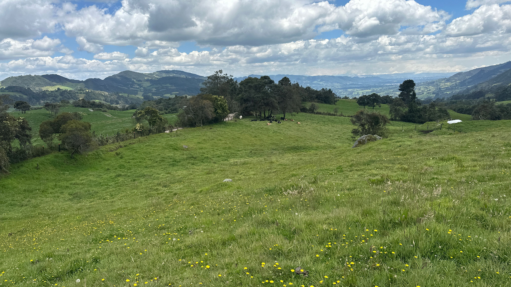

<br><details><summary>:camera:**31/GoogleMaps.jpg**</summary> `Exif version` Not known</details>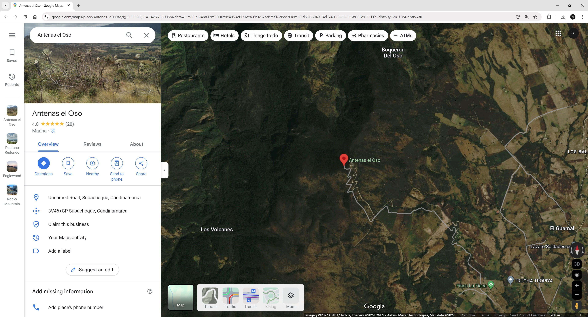

<br><details><summary>:camera:**31/IMG-20221113-WA0014.jpg**</summary> `Exif version` Not known</details>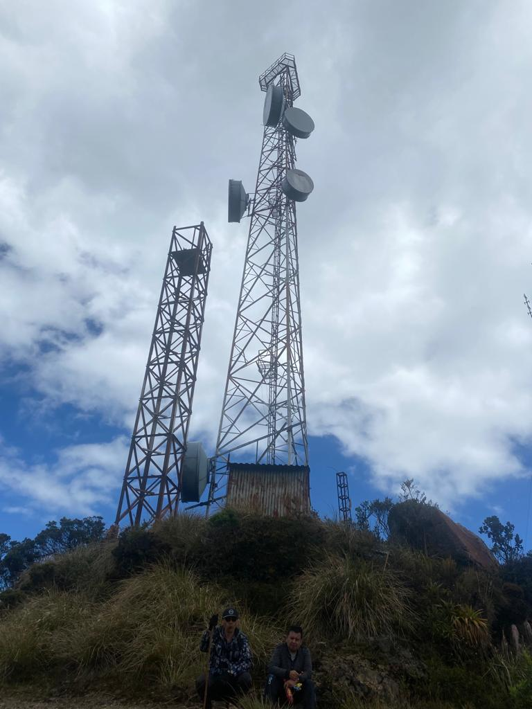

<br><details><summary>:camera:**31/IMG-20221113-WA0017.jpg**</summary> `Exif version` Not known</details>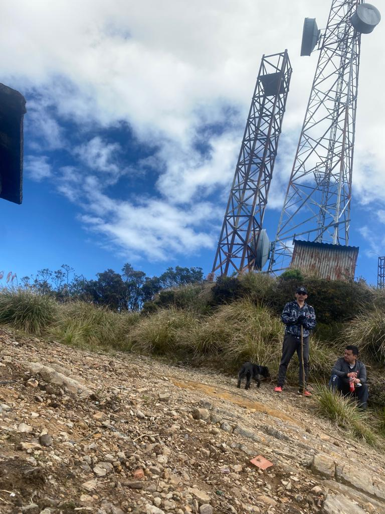

<br><details><summary>:camera:**31/IMG-20221113-WA0018.jpg**</summary> `Exif version` Not known</details>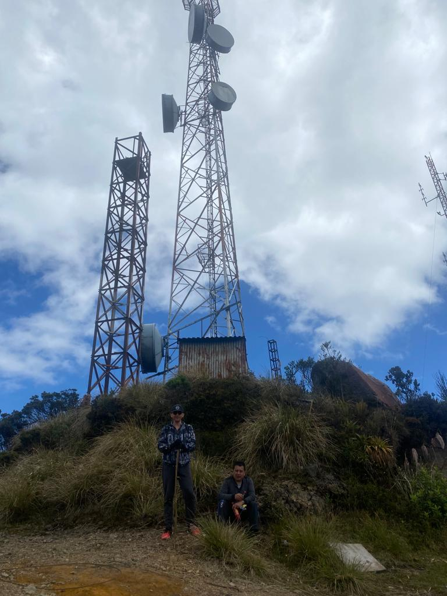

<br><details><summary>:camera:**31/IMG_2307.JPG**</summary><sub> `Exif version` 0232 `OS version` 18.5 `Date` 2025:04:14 10:49:14 `Aperture` Not known `Brightness` 10.158864325964457 `Color space` 65535 `Compression` 6`Exposure mode` 0 `Exposure time` 0.00016100466913540493 `Focal length` 6.86 `Lens model` iPhone 14 Pro back triple camera 6.86mm f/1.78 `Lens specification` (2.220000028611935, 9.0, 1.7799999713880652, 2.8) `Orientation` 1 `Scene type` Not known `f number` 1.78 `White balance` 0 `Sensing method` 2 `Shutter speed` 12.60065170166546</sub><sub>`Coordinates & altitude` (5.042255555555555, -74.11806388888888, 2902.3476394849786)</sub><sub> :earth_americas:`Location over` [Google Maps](http://maps.google.com/maps?q=5.042255555555555,-74.11806388888888) or [Openstreet Map](https://www.openstreetmap.org/query?lat=5.042255555555555&lon=-74.11806388888888)</sub></details>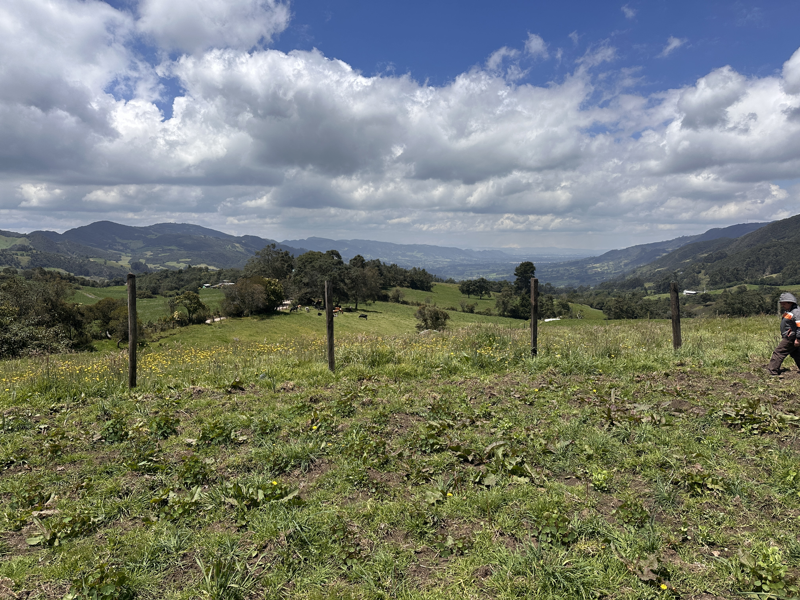

<br><details><summary>:camera:**31/IMG_2308.JPG**</summary><sub> `Exif version` 0232 `OS version` 18.5 `Date` 2025:04:14 10:49:18 `Aperture` Not known `Brightness` 10.025843339050887 `Color space` 65535 `Compression` 6`Exposure mode` 0 `Exposure time` 0.00018099547511312217 `Focal length` 6.86 `Lens model` iPhone 14 Pro back triple camera 6.86mm f/1.78 `Lens specification` (2.220000028611935, 9.0, 1.7799999713880652, 2.8) `Orientation` 1 `Scene type` Not known `f number` 1.78 `White balance` 0 `Sensing method` 2 `Shutter speed` 12.431722689075631</sub><sub>`Coordinates & altitude` (5.0422666666666665, -74.11803333333333, 3154.477519379845)</sub><sub> :earth_americas:`Location over` [Google Maps](http://maps.google.com/maps?q=5.0422666666666665,-74.11803333333333) or [Openstreet Map](https://www.openstreetmap.org/query?lat=5.0422666666666665&lon=-74.11803333333333)</sub></details>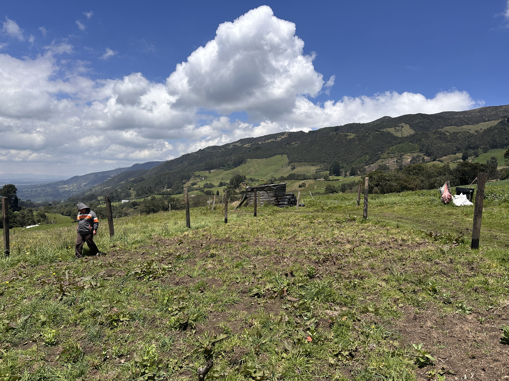

<br><details><summary>:camera:**31/IMG_2309.JPG**</summary><sub> `Exif version` 0232 `OS version` 18.5 `Date` 2025:04:14 10:49:20 `Aperture` Not known `Brightness` 9.61528756177058 `Color space` 65535 `Compression` 6`Exposure mode` 0 `Exposure time` 0.00022002200220022002 `Focal length` 6.86 `Lens model` iPhone 14 Pro back triple camera 6.86mm f/1.78 `Lens specification` (2.220000028611935, 9.0, 1.7799999713880652, 2.8) `Orientation` 1 `Scene type` Not known `f number` 1.78 `White balance` 0 `Sensing method` 2 `Shutter speed` 12.150208855472014</sub><sub>`Coordinates & altitude` (5.042258333333333, -74.11803333333333, 3155.740099009901)</sub><sub> :earth_americas:`Location over` [Google Maps](http://maps.google.com/maps?q=5.042258333333333,-74.11803333333333) or [Openstreet Map](https://www.openstreetmap.org/query?lat=5.042258333333333&lon=-74.11803333333333)</sub></details>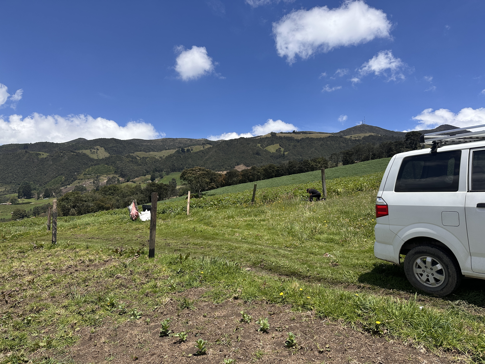

<br><details><summary>:camera:**31/IMG_2310.JPG**</summary><sub> `Exif version` 0232 `OS version` 18.5 `Date` 2025:04:14 10:49:33 `Aperture` Not known `Brightness` 9.624754033844942 `Color space` 65535 `Compression` 6`Exposure mode` Not known `Exposure time` 0.00023702299123014932 `Focal length` 6.86 `Lens model` iPhone 14 Pro back camera 6.86mm f/1.78 `Lens specification` (6.8600001335175875, 6.8600001335175875, 1.7799999713880652, 1.7799999713880652) `Orientation` 1 `Scene type` Not known `f number` 1.78 `White balance` 0 `Sensing method` 2 `Shutter speed` 12.042825315620101</sub><sub>`Coordinates & altitude` (5.042258333333333, -74.11804166666666, 3154.2574568288856)</sub><sub> :earth_americas:`Location over` [Google Maps](http://maps.google.com/maps?q=5.042258333333333,-74.11804166666666) or [Openstreet Map](https://www.openstreetmap.org/query?lat=5.042258333333333&lon=-74.11804166666666)</sub></details>

<br><details><summary>:camera:**31/IMG_2311.JPG**</summary><sub> `Exif version` 0232 `OS version` 18.5 `Date` 2025:04:14 10:49:58 `Aperture` Not known `Brightness` 9.940359824337724 `Color space` 65535 `Compression` 6`Exposure mode` 0 `Exposure time` 0.0003819709702062643 `Focal length` 2.22 `Lens model` iPhone 14 Pro back triple camera 2.22mm f/2.2 `Lens specification` (2.220000028611935, 9.0, 1.7799999713880652, 2.8) `Orientation` 1 `Scene type` Not known `f number` 2.2 `White balance` 0 `Sensing method` 2 `Shutter speed` 11.354139747540007</sub><sub>`Coordinates & altitude` (5.042263888888889, -74.11803333333333, 3155.371052631579)</sub><sub> :earth_americas:`Location over` [Google Maps](http://maps.google.com/maps?q=5.042263888888889,-74.11803333333333) or [Openstreet Map](https://www.openstreetmap.org/query?lat=5.042263888888889&lon=-74.11803333333333)</sub></details>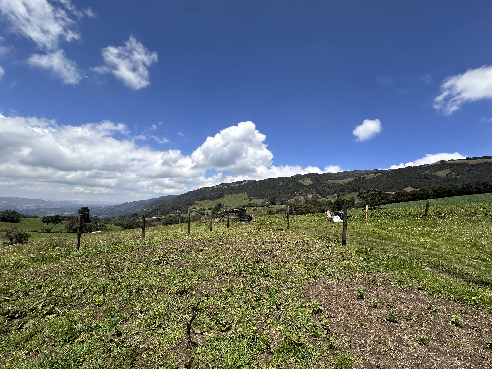

<br><details><summary>:camera:**31/IMG_2312.JPG**</summary><sub> `Exif version` 0232 `OS version` 18.5 `Date` 2025:04:14 10:50:02 `Aperture` Not known `Brightness` 10.216527497840485 `Color space` 65535 `Compression` 6`Exposure mode` 0 `Exposure time` 0.00031201248049921997 `Focal length` 2.22 `Lens model` iPhone 14 Pro back triple camera 2.22mm f/2.2 `Lens specification` (2.220000028611935, 9.0, 1.7799999713880652, 2.8) `Orientation` 1 `Scene type` Not known `f number` 2.2 `White balance` 0 `Sensing method` 2 `Shutter speed` 11.646166350582497</sub><sub>`Coordinates & altitude` (5.042263888888889, -74.11803333333333, 3155.6251097453905)</sub><sub> :earth_americas:`Location over` [Google Maps](http://maps.google.com/maps?q=5.042263888888889,-74.11803333333333) or [Openstreet Map](https://www.openstreetmap.org/query?lat=5.042263888888889&lon=-74.11803333333333)</sub></details>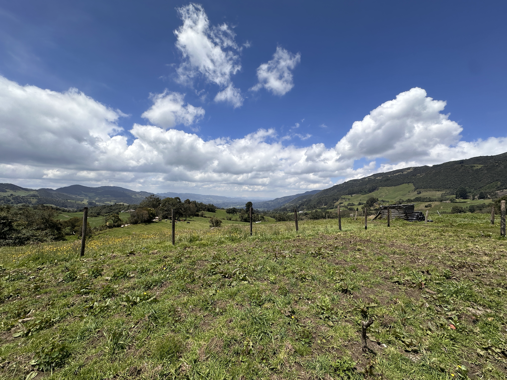

<br><details><summary>:camera:**31/IMG_2313.JPG**</summary><sub> `Exif version` 0232 `OS version` 18.5 `Date` 2025:04:14 10:50:09 `Aperture` Not known `Brightness` 10.073352855051244 `Color space` 65535 `Compression` 6`Exposure mode` 0 `Exposure time` 0.0003379520108144643 `Focal length` 2.22 `Lens model` iPhone 14 Pro back triple camera 2.22mm f/2.2 `Lens specification` (2.220000028611935, 9.0, 1.7799999713880652, 2.8) `Orientation` 6 `Scene type` Not known `f number` 2.2 `White balance` 0 `Sensing method` 2 `Shutter speed` 11.53068914229053</sub><sub>`Coordinates & altitude` (5.042261111111111, -74.11804166666666, 3155.9717314487634)</sub><sub> :earth_americas:`Location over` [Google Maps](http://maps.google.com/maps?q=5.042261111111111,-74.11804166666666) or [Openstreet Map](https://www.openstreetmap.org/query?lat=5.042261111111111&lon=-74.11804166666666)</sub></details>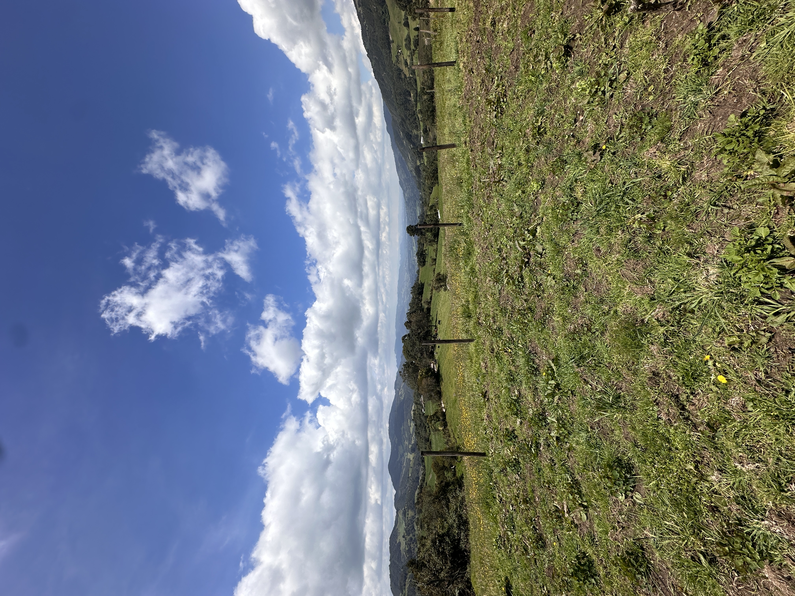

<br><details><summary>:camera:**31/IMG_2314.JPG**</summary><sub> `Exif version` 0232 `OS version` 18.5 `Date` 2025:04:14 10:50:11 `Aperture` Not known `Brightness` 9.819118848595311 `Color space` 65535 `Compression` 6`Exposure mode` 0 `Exposure time` 0.00036403349108117945 `Focal length` 2.22 `Lens model` iPhone 14 Pro back triple camera 2.22mm f/2.2 `Lens specification` (2.220000028611935, 9.0, 1.7799999713880652, 2.8) `Orientation` 6 `Scene type` Not known `f number` 2.2 `White balance` 0 `Sensing method` 2 `Shutter speed` 11.423773919655304</sub><sub>`Coordinates & altitude` (5.042263888888889, -74.11805, 3155.8731117824773)</sub><sub> :earth_americas:`Location over` [Google Maps](http://maps.google.com/maps?q=5.042263888888889,-74.11805) or [Openstreet Map](https://www.openstreetmap.org/query?lat=5.042263888888889&lon=-74.11805)</sub></details>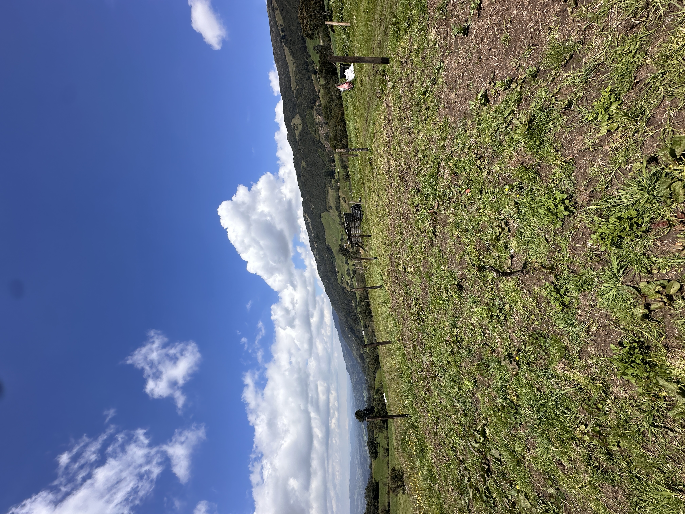

<br><details><summary>:camera:**31/IMG_2315.JPG**</summary><sub> `Exif version` 0232 `OS version` 18.5 `Date` 2025:04:14 10:50:14 `Aperture` Not known `Brightness` 9.644375553587246 `Color space` 65535 `Compression` 6`Exposure mode` 0 `Exposure time` 0.0005299417064122947 `Focal length` 2.22 `Lens model` iPhone 14 Pro back triple camera 2.22mm f/2.2 `Lens specification` (2.220000028611935, 9.0, 1.7799999713880652, 2.8) `Orientation` 6 `Scene type` Not known `f number` 2.2 `White balance` 0 `Sensing method` 2 `Shutter speed` 10.881720019840513</sub><sub>`Coordinates & altitude` (5.042261111111111, -74.11805, 3155.400921658986)</sub><sub> :earth_americas:`Location over` [Google Maps](http://maps.google.com/maps?q=5.042261111111111,-74.11805) or [Openstreet Map](https://www.openstreetmap.org/query?lat=5.042261111111111&lon=-74.11805)</sub></details>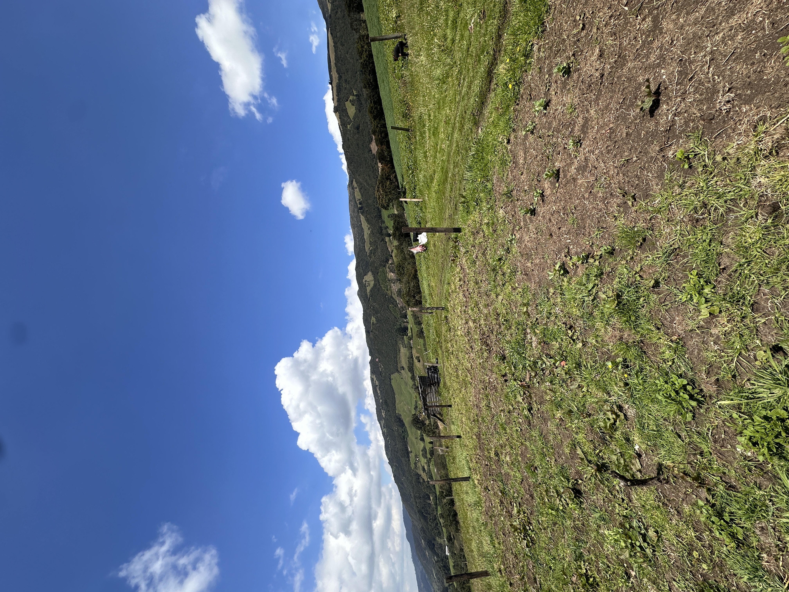

<br><details><summary>:camera:**31/IMG_2318.JPG**</summary><sub> `Exif version` 0232 `OS version` 18.5 `Date` 2025:04:14 12:50:06 `Aperture` Not known `Brightness` 10.099088997897688 `Color space` 65535 `Compression` 6`Exposure mode` 0 `Exposure time` 0.00016100466913540493 `Focal length` 6.86 `Lens model` iPhone 14 Pro back triple camera 6.86mm f/1.78 `Lens specification` (2.220000028611935, 9.0, 1.7799999713880652, 2.8) `Orientation` 6 `Scene type` Not known `f number` 1.78 `White balance` 0 `Sensing method` 2 `Shutter speed` 12.60065170166546</sub><sub>`Coordinates & altitude` (5.041547222222222, -74.1181861111111, 2942.7647120091656)</sub><sub> :earth_americas:`Location over` [Google Maps](http://maps.google.com/maps?q=5.041547222222222,-74.1181861111111) or [Openstreet Map](https://www.openstreetmap.org/query?lat=5.041547222222222&lon=-74.1181861111111)</sub></details>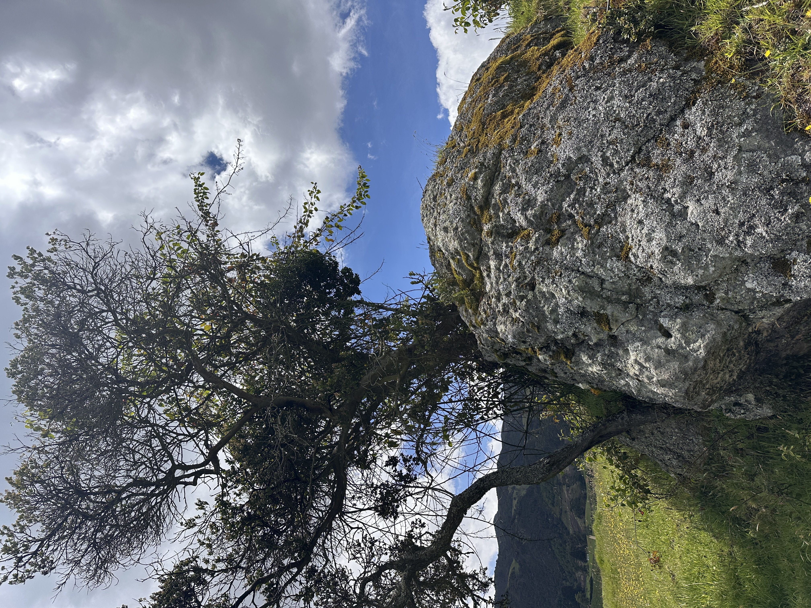

<br><details><summary>:camera:**31/IMG_2319.JPG**</summary><sub> `Exif version` 0232 `OS version` 18.5 `Date` 2025:04:14 12:50:13 `Aperture` Not known `Brightness` 8.55070110701107 `Color space` 65535 `Compression` 6`Exposure mode` 0 `Exposure time` 0.0004440497335701599 `Focal length` 6.86 `Lens model` iPhone 14 Pro back triple camera 6.86mm f/1.78 `Lens specification` (2.220000028611935, 9.0, 1.7799999713880652, 2.8) `Orientation` 1 `Scene type` Not known `f number` 1.78 `White balance` 0 `Sensing method` 2 `Shutter speed` 11.137152701091038</sub><sub>`Coordinates & altitude` (5.0415777777777775, -74.11818055555555, 3137.7647754137115)</sub><sub> :earth_americas:`Location over` [Google Maps](http://maps.google.com/maps?q=5.0415777777777775,-74.11818055555555) or [Openstreet Map](https://www.openstreetmap.org/query?lat=5.0415777777777775&lon=-74.11818055555555)</sub></details>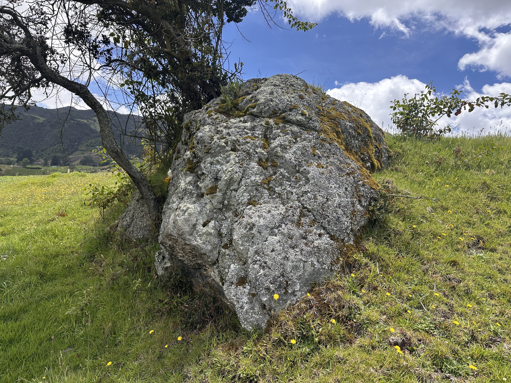

<br><details><summary>:camera:**31/IMG_2320.JPG**</summary><sub> `Exif version` 0232 `OS version` 18.5 `Date` 2025:04:14 12:50:22 `Aperture` Not known `Brightness` 10.088224544989401 `Color space` 65535 `Compression` 6`Exposure mode` 0 `Exposure time` 0.0005040322580645161 `Focal length` 2.22 `Lens model` iPhone 14 Pro back triple camera 2.22mm f/2.2 `Lens specification` (2.220000028611935, 9.0, 1.7799999713880652, 2.8) `Orientation` 1 `Scene type` Not known `f number` 2.2 `White balance` 0 `Sensing method` 2 `Shutter speed` 10.954288649203903</sub><sub>`Coordinates & altitude` (5.041558333333334, -74.11818055555555, 3141.6892430278886)</sub><sub> :earth_americas:`Location over` [Google Maps](http://maps.google.com/maps?q=5.041558333333334,-74.11818055555555) or [Openstreet Map](https://www.openstreetmap.org/query?lat=5.041558333333334&lon=-74.11818055555555)</sub></details>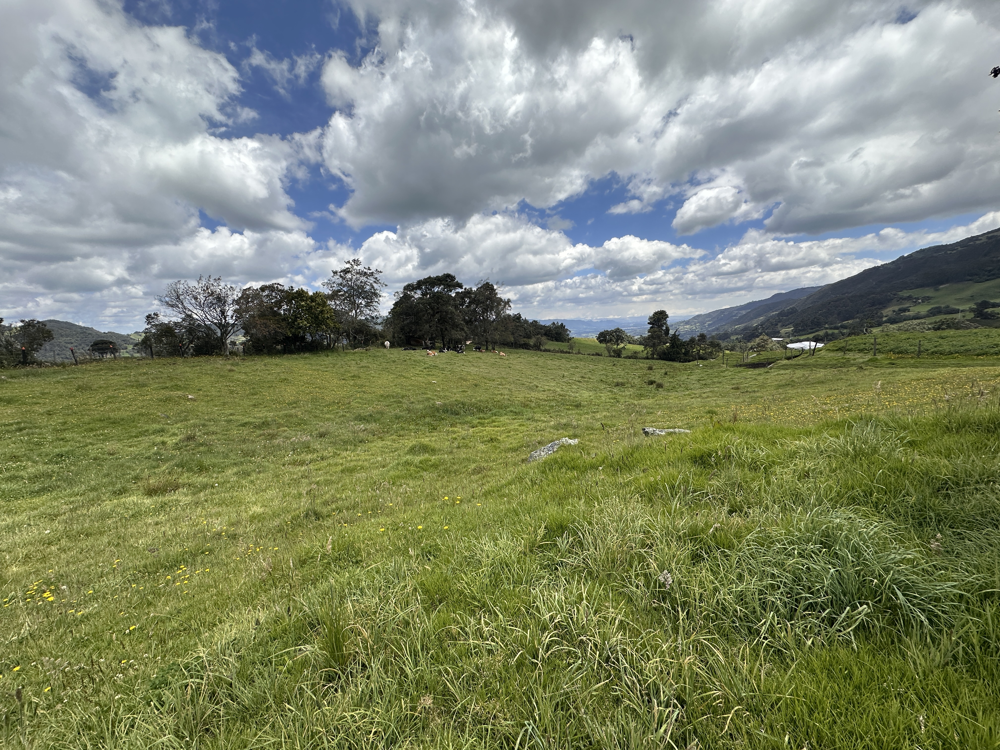

<br><details><summary>:camera:**31/IMG_2321.JPG**</summary><sub> `Exif version` 0232 `OS version` 18.5 `Date` 2025:04:14 12:51:38 `Aperture` Not known `Brightness` 10.323442929697942 `Color space` 65535 `Compression` 6`Exposure mode` 0 `Exposure time` 0.00013199577613516366 `Focal length` 6.86 `Lens model` iPhone 14 Pro back triple camera 6.86mm f/1.78 `Lens specification` (2.220000028611935, 9.0, 1.7799999713880652, 2.8) `Orientation` 6 `Scene type` Not known `f number` 1.78 `White balance` 0 `Sensing method` 2 `Shutter speed` 12.887174436419349</sub><sub>`Coordinates & altitude` (5.041597222222222, -74.11847777777777, 3136.137214137214)</sub><sub> :earth_americas:`Location over` [Google Maps](http://maps.google.com/maps?q=5.041597222222222,-74.11847777777777) or [Openstreet Map](https://www.openstreetmap.org/query?lat=5.041597222222222&lon=-74.11847777777777)</sub></details>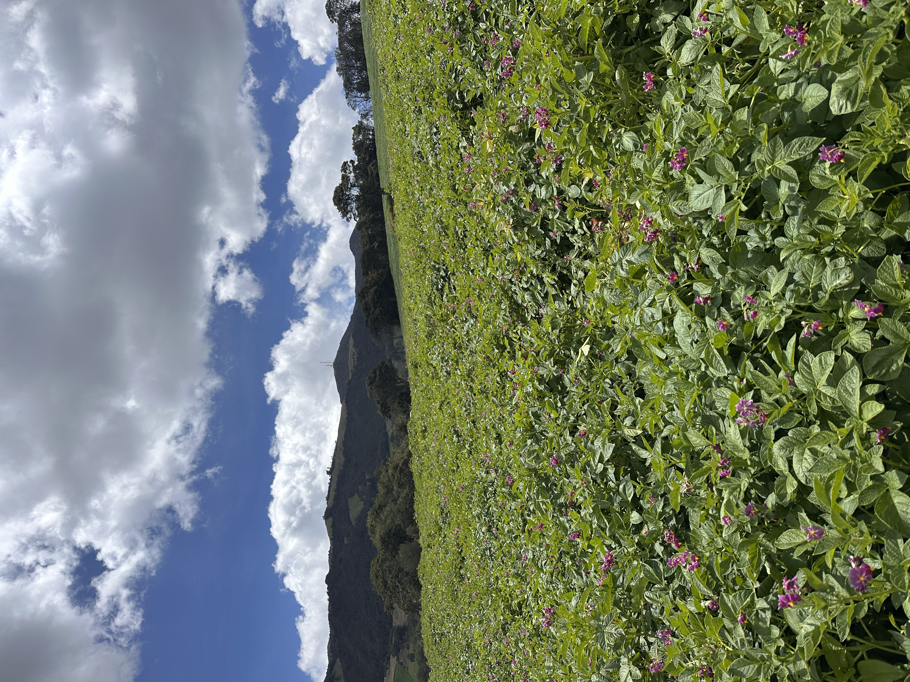

<br><details><summary>:camera:**31/IMG_2322.JPG**</summary><sub> `Exif version` 0232 `OS version` 18.5 `Date` 2025:04:14 12:51:41 `Aperture` Not known `Brightness` 10.558944014565316 `Color space` 65535 `Compression` 6`Exposure mode` 0 `Exposure time` 0.00011199462425803562 `Focal length` 6.86 `Lens model` iPhone 14 Pro back triple camera 6.86mm f/1.78 `Lens specification` (2.220000028611935, 9.0, 1.7799999713880652, 2.8) `Orientation` 1 `Scene type` Not known `f number` 1.78 `White balance` 0 `Sensing method` 2 `Shutter speed` 13.124213642531146</sub><sub>`Coordinates & altitude` (5.041572222222222, -74.1185, 3144.518737672584)</sub><sub> :earth_americas:`Location over` [Google Maps](http://maps.google.com/maps?q=5.041572222222222,-74.1185) or [Openstreet Map](https://www.openstreetmap.org/query?lat=5.041572222222222&lon=-74.1185)</sub></details>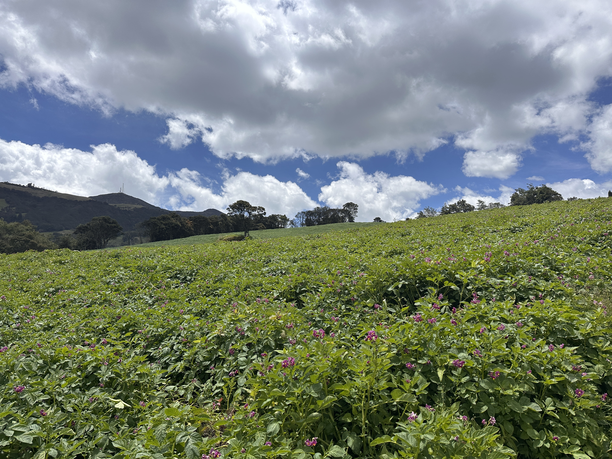

<br><details><summary>:camera:**31/IMG_2323.JPG**</summary><sub> `Exif version` 0232 `OS version` 18.5 `Date` 2025:04:14 12:51:46 `Aperture` Not known `Brightness` 10.666736621196222 `Color space` 65535 `Compression` 6`Exposure mode` 0 `Exposure time` 0.00029403116730373417 `Focal length` 2.22 `Lens model` iPhone 14 Pro back triple camera 2.22mm f/2.2 `Lens specification` (2.220000028611935, 9.0, 1.7799999713880652, 2.8) `Orientation` 1 `Scene type` Not known `f number` 2.2 `White balance` 0 `Sensing method` 2 `Shutter speed` 11.731896217890796</sub><sub>`Coordinates & altitude` (5.041563888888889, -74.11847777777777, 3141.4767358625627)</sub><sub> :earth_americas:`Location over` [Google Maps](http://maps.google.com/maps?q=5.041563888888889,-74.11847777777777) or [Openstreet Map](https://www.openstreetmap.org/query?lat=5.041563888888889&lon=-74.11847777777777)</sub></details>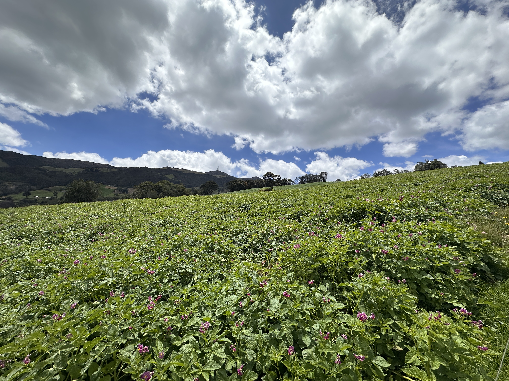

<br><details><summary>:camera:**31/IMG_2324.JPG**</summary><sub> `Exif version` 0232 `OS version` 18.5 `Date` 2025:04:14 12:51:49 `Aperture` Not known `Brightness` 10.515232097037556 `Color space` 65535 `Compression` 6`Exposure mode` 0 `Exposure time` 0.0003379520108144643 `Focal length` 2.22 `Lens model` iPhone 14 Pro back triple camera 2.22mm f/2.2 `Lens specification` (2.220000028611935, 9.0, 1.7799999713880652, 2.8) `Orientation` 1 `Scene type` Not known `f number` 2.2 `White balance` 0 `Sensing method` 2 `Shutter speed` 11.53068914229053</sub><sub>`Coordinates & altitude` (5.041566666666666, -74.11847777777777, 3142.1560913705584)</sub><sub> :earth_americas:`Location over` [Google Maps](http://maps.google.com/maps?q=5.041566666666666,-74.11847777777777) or [Openstreet Map](https://www.openstreetmap.org/query?lat=5.041566666666666&lon=-74.11847777777777)</sub></details>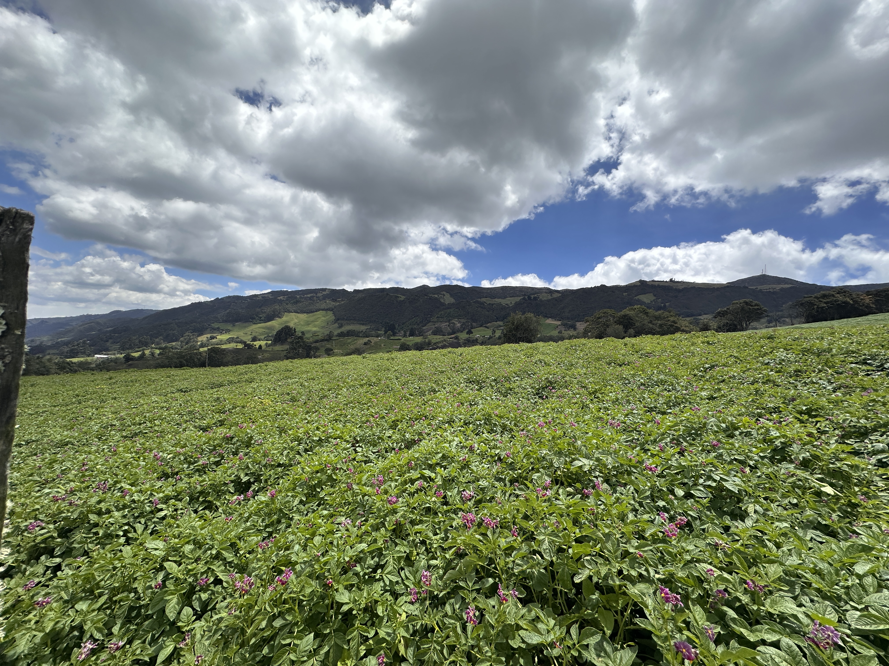

<br><details><summary>:camera:**31/IMG_2325.JPG**</summary><sub> `Exif version` 0232 `OS version` 18.5 `Date` 2025:04:14 12:57:51 `Aperture` Not known `Brightness` 9.685080748526019 `Color space` 65535 `Compression` 6`Exposure mode` 0 `Exposure time` 0.00020999580008399833 `Focal length` 6.86 `Lens model` iPhone 14 Pro back triple camera 6.86mm f/1.78 `Lens specification` (2.220000028611935, 9.0, 1.7799999713880652, 2.8) `Orientation` 6 `Scene type` Not known `f number` 1.78 `White balance` 0 `Sensing method` 2 `Shutter speed` 12.21732305936073</sub><sub>`Coordinates & altitude` (5.042136111111111, -74.11699722222221, 2783.336141533277)</sub><sub> :earth_americas:`Location over` [Google Maps](http://maps.google.com/maps?q=5.042136111111111,-74.11699722222221) or [Openstreet Map](https://www.openstreetmap.org/query?lat=5.042136111111111&lon=-74.11699722222221)</sub></details>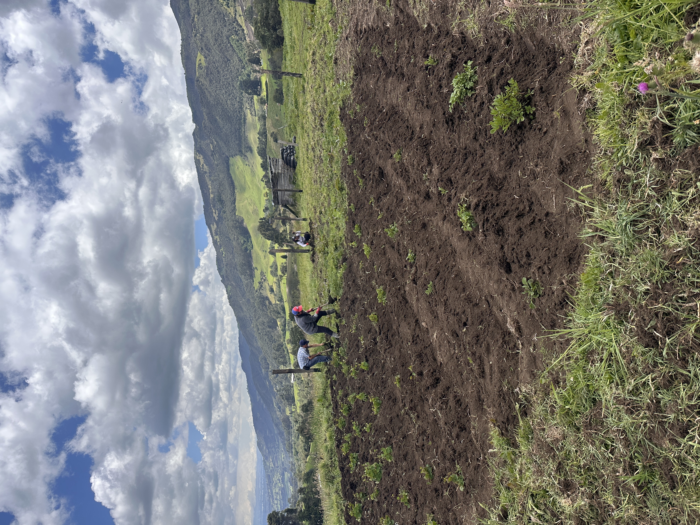

<br><details><summary>:camera:**31/IMG_2326.JPG**</summary><sub> `Exif version` 0232 `OS version` 18.5 `Date` 2025:04:14 12:57:58 `Aperture` Not known `Brightness` 9.110343977314757 `Color space` 65535 `Compression` 6`Exposure mode` 0 `Exposure time` 0.0003079765937788728 `Focal length` 6.86 `Lens model` iPhone 14 Pro back triple camera 6.86mm f/1.78 `Lens specification` (2.220000028611935, 9.0, 1.7799999713880652, 2.8) `Orientation` 1 `Scene type` Not known `f number` 1.78 `White balance` 0 `Sensing method` 2 `Shutter speed` 11.664782026484154</sub><sub>`Coordinates & altitude` (5.042133333333333, -74.11699722222221, 2801.0400390625)</sub><sub> :earth_americas:`Location over` [Google Maps](http://maps.google.com/maps?q=5.042133333333333,-74.11699722222221) or [Openstreet Map](https://www.openstreetmap.org/query?lat=5.042133333333333&lon=-74.11699722222221)</sub></details>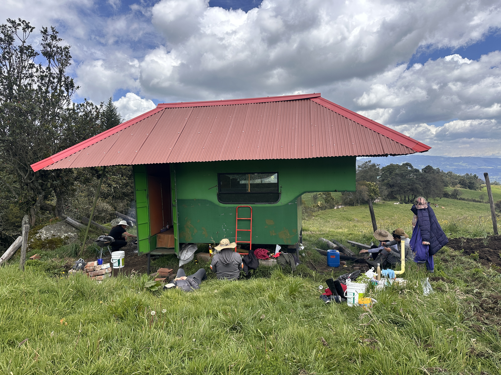

<br><details><summary>:camera:**31/IMG_2327.JPG**</summary><sub> `Exif version` 0232 `OS version` 18.5 `Date` 2025:04:14 13:04:37 `Aperture` Not known `Brightness` 9.971153870501338 `Color space` 65535 `Compression` 6`Exposure mode` Not known `Exposure time` 0.00017898693395382138 `Focal length` 6.86 `Lens model` iPhone 14 Pro back camera 6.86mm f/1.78 `Lens specification` (6.8600001335175875, 6.8600001335175875, 1.7799999713880652, 1.7799999713880652) `Orientation` 1 `Scene type` Not known `f number` 1.78 `White balance` 0 `Sensing method` 2 `Shutter speed` 12.44775279141776</sub><sub>`Coordinates & altitude` (5.042344444444445, -74.11821666666665, 3156.529300567108)</sub><sub> :earth_americas:`Location over` [Google Maps](http://maps.google.com/maps?q=5.042344444444445,-74.11821666666665) or [Openstreet Map](https://www.openstreetmap.org/query?lat=5.042344444444445&lon=-74.11821666666665)</sub></details>

<br><details><summary>:camera:**31/TKUM5651.JPG**</summary><sub> `Exif version` Not known `OS version` Not known `Date` 2026:02:07 16:23:30 `Aperture` Not known `Brightness` Not known `Color space` Not known `Compression` Not known`Exposure mode` Not known `Exposure time` Not known `Focal length` Not known `Lens model` Not known `Lens specification` Not known `Orientation` Not known `Scene type` Not known `f number` Not known `White balance` Not known `Sensing method` Not known `Shutter speed` Not known</sub></details>

<sub>_Citation: Partial or total digital reproduction of this repository, scripts, development guides, data models, images, and documentation is permitted, provided that it is referenced as: "R.GISMobile - Mobile geographic information systems on QField that do not require an internet connection for navigation." https://github.com/rcfdtools/R.GISMobile - Bogotá - Colombia - South America"._<sub>

| [:house: Home](../Readme.md) |
|---|