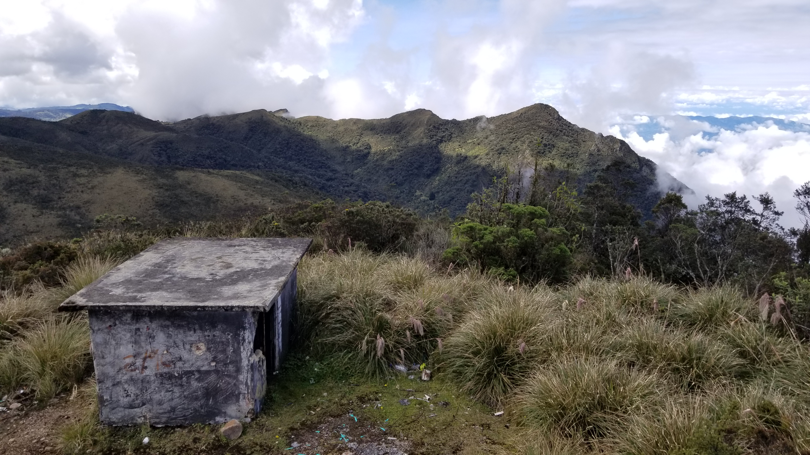

## :globe_with_meridians:Antena del Oso, Subachoque, Cundinamarca, Colombia (2022-11-31)
`Pictures` rcfdtools <br>`Category` Freelance field visit <br>`Location` [Google Maps](http://maps.google.com/maps?q=5.056057,-74.137623) or [Openstreet Map](https://www.openstreetmap.org/query?lat=5.056057&lon=-74.137623) 

```geojson
{
  "type": "Feature",
  "geometry": {
    "type": "Point", 
    "coordinates": [-74.137623, 5.056057]
  }, 
  "properties": {
    "Name": "Antena del Oso, Subachoque, Cundinamarca, Colombia"
  }
}
```

<br><details><summary>:camera:**31/20221113_081432.jpg**</summary><sub> `Exif version` 0220 `OS version` G955USQU8DUD3 `Date` 2022:11:13 08:14:31 `Aperture` Not known `Brightness` 0.94 `Color space` 1 `Compression` 6`Exposure mode` 0 `Exposure time` 0.025 `Focal length` 4.25 `Lens model` Not known `Lens specification` Not known `Orientation` 6 `Scene type` Not known `f number` 1.7 `White balance` 0 `Sensing method` 2 `Shutter speed` 5.321</sub><sub>`Coordinates & altitude` (0.0, 0.0, 0.0)</sub><sub> :globe_with_meridians:`Location over` [Google Maps](http://maps.google.com/maps?q=0.0,0.0) or [Openstreet Map](https://www.openstreetmap.org/query?lat=0.0&lon=0.0)</sub></details>

<br><details><summary>:camera:**31/20221113_083938.jpg**</summary><sub> `Exif version` 0220 `OS version` G955USQU8DUD3 `Date` 2022:11:13 08:39:38 `Aperture` Not known `Brightness` 8.65 `Color space` 1 `Compression` 6`Exposure mode` 0 `Exposure time` 0.0003787878787878788 `Focal length` 4.25 `Lens model` Not known `Lens specification` Not known `Orientation` 6 `Scene type` Not known `f number` 1.7 `White balance` 0 `Sensing method` 2 `Shutter speed` 11.366</sub><sub>`Coordinates & altitude` (0.0, 0.0, 0.0)</sub><sub> :globe_with_meridians:`Location over` [Google Maps](http://maps.google.com/maps?q=0.0,0.0) or [Openstreet Map](https://www.openstreetmap.org/query?lat=0.0&lon=0.0)</sub></details>

<br><details><summary>:camera:**31/20221113_084010.jpg**</summary><sub> `Exif version` 0220 `OS version` G955USQU8DUD3 `Date` 2022:11:13 08:40:10 `Aperture` Not known `Brightness` 8.58 `Color space` 1 `Compression` 6`Exposure mode` 0 `Exposure time` 0.0004166666666666667 `Focal length` 4.25 `Lens model` Not known `Lens specification` Not known `Orientation` 1 `Scene type` Not known `f number` 1.7 `White balance` 0 `Sensing method` 2 `Shutter speed` 11.228</sub><sub>`Coordinates & altitude` (0.0, 0.0, 0.0)</sub><sub> :globe_with_meridians:`Location over` [Google Maps](http://maps.google.com/maps?q=0.0,0.0) or [Openstreet Map](https://www.openstreetmap.org/query?lat=0.0&lon=0.0)</sub></details>

<br><details><summary>:camera:**31/20221113_084015.jpg**</summary><sub> `Exif version` 0220 `OS version` G955USQU8DUD3 `Date` 2022:11:13 08:40:15 `Aperture` Not known `Brightness` 9.93 `Color space` 1 `Compression` 6`Exposure mode` 0 `Exposure time` 0.00016490765171503957 `Focal length` 4.25 `Lens model` Not known `Lens specification` Not known `Orientation` 1 `Scene type` Not known `f number` 1.7 `White balance` 0 `Sensing method` 2 `Shutter speed` 12.566</sub><sub>`Coordinates & altitude` (0.0, 0.0, 0.0)</sub><sub> :globe_with_meridians:`Location over` [Google Maps](http://maps.google.com/maps?q=0.0,0.0) or [Openstreet Map](https://www.openstreetmap.org/query?lat=0.0&lon=0.0)</sub></details>

<br><details><summary>:camera:**31/20221113_090112.jpg**</summary><sub> `Exif version` 0220 `OS version` G955USQU8DUD3 `Date` 2022:11:13 09:01:12 `Aperture` Not known `Brightness` 9.03 `Color space` 1 `Compression` 6`Exposure mode` 0 `Exposure time` 0.000251004016064257 `Focal length` 4.25 `Lens model` Not known `Lens specification` Not known `Orientation` 6 `Scene type` Not known `f number` 1.7 `White balance` 0 `Sensing method` 2 `Shutter speed` 11.96</sub><sub>`Coordinates & altitude` (0.0, 0.0, 0.0)</sub><sub> :globe_with_meridians:`Location over` [Google Maps](http://maps.google.com/maps?q=0.0,0.0) or [Openstreet Map](https://www.openstreetmap.org/query?lat=0.0&lon=0.0)</sub></details>

<br><details><summary>:camera:**31/20221113_090118.jpg**</summary><sub> `Exif version` 0220 `OS version` G955USQU8DUD3 `Date` 2022:11:13 09:01:18 `Aperture` Not known `Brightness` 8.94 `Color space` 1 `Compression` 6`Exposure mode` 0 `Exposure time` 0.000231000231000231 `Focal length` 4.25 `Lens model` Not known `Lens specification` Not known `Orientation` 3 `Scene type` Not known `f number` 1.7 `White balance` 0 `Sensing method` 2 `Shutter speed` 12.079</sub><sub>`Coordinates & altitude` (0.0, 0.0, 0.0)</sub><sub> :globe_with_meridians:`Location over` [Google Maps](http://maps.google.com/maps?q=0.0,0.0) or [Openstreet Map](https://www.openstreetmap.org/query?lat=0.0&lon=0.0)</sub></details>

<br><details><summary>:camera:**31/20221113_092235.jpg**</summary><sub> `Exif version` 0220 `OS version` G955USQU8DUD3 `Date` 2022:11:13 09:22:35 `Aperture` Not known `Brightness` 9.32 `Color space` 1 `Compression` 6`Exposure mode` 0 `Exposure time` 0.00023854961832061068 `Focal length` 4.25 `Lens model` Not known `Lens specification` Not known `Orientation` 6 `Scene type` Not known `f number` 1.7 `White balance` 0 `Sensing method` 2 `Shutter speed` 12.033</sub><sub>`Coordinates & altitude` (0.0, 0.0, 0.0)</sub><sub> :globe_with_meridians:`Location over` [Google Maps](http://maps.google.com/maps?q=0.0,0.0) or [Openstreet Map](https://www.openstreetmap.org/query?lat=0.0&lon=0.0)</sub></details>

<br><details><summary>:camera:**31/20221113_092250.jpg**</summary><sub> `Exif version` 0220 `OS version` G955USQU8DUD3 `Date` 2022:11:13 09:22:50 `Aperture` Not known `Brightness` 9.25 `Color space` 1 `Compression` 6`Exposure mode` 0 `Exposure time` 0.0002682403433476395 `Focal length` 4.25 `Lens model` Not known `Lens specification` Not known `Orientation` 1 `Scene type` Not known `f number` 1.7 `White balance` 0 `Sensing method` 2 `Shutter speed` 11.864</sub><sub>`Coordinates & altitude` (0.0, 0.0, 0.0)</sub><sub> :globe_with_meridians:`Location over` [Google Maps](http://maps.google.com/maps?q=0.0,0.0) or [Openstreet Map](https://www.openstreetmap.org/query?lat=0.0&lon=0.0)</sub></details>

<br><details><summary>:camera:**31/20221113_092252.jpg**</summary><sub> `Exif version` 0220 `OS version` G955USQU8DUD3 `Date` 2022:11:13 09:22:52 `Aperture` Not known `Brightness` 9.33 `Color space` 1 `Compression` 6`Exposure mode` 0 `Exposure time` 0.000251004016064257 `Focal length` 4.25 `Lens model` Not known `Lens specification` Not known `Orientation` 1 `Scene type` Not known `f number` 1.7 `White balance` 0 `Sensing method` 2 `Shutter speed` 11.96</sub><sub>`Coordinates & altitude` (0.0, 0.0, 0.0)</sub><sub> :globe_with_meridians:`Location over` [Google Maps](http://maps.google.com/maps?q=0.0,0.0) or [Openstreet Map](https://www.openstreetmap.org/query?lat=0.0&lon=0.0)</sub></details>

<br><details><summary>:camera:**31/20221113_100005.jpg**</summary><sub> `Exif version` 0220 `OS version` G955USQU8DUD3 `Date` 2022:11:13 10:00:05 `Aperture` Not known `Brightness` 9.33 `Color space` 1 `Compression` 6`Exposure mode` 0 `Exposure time` 0.00025510204081632655 `Focal length` 4.25 `Lens model` Not known `Lens specification` Not known `Orientation` 1 `Scene type` Not known `f number` 1.7 `White balance` 0 `Sensing method` 2 `Shutter speed` 11.936</sub><sub>`Coordinates & altitude` (0.0, 0.0, 0.0)</sub><sub> :globe_with_meridians:`Location over` [Google Maps](http://maps.google.com/maps?q=0.0,0.0) or [Openstreet Map](https://www.openstreetmap.org/query?lat=0.0&lon=0.0)</sub></details>

<br><details><summary>:camera:**31/20221113_100010.jpg**</summary><sub> `Exif version` 0220 `OS version` G955USQU8DUD3 `Date` 2022:11:13 10:00:10 `Aperture` Not known `Brightness` 11.7 `Color space` 1 `Compression` 6`Exposure mode` 0 `Exposure time` 4.749240121580547e-05 `Focal length` 4.25 `Lens model` Not known `Lens specification` Not known `Orientation` 6 `Scene type` Not known `f number` 1.7 `White balance` 0 `Sensing method` 2 `Shutter speed` 14.361</sub><sub>`Coordinates & altitude` (0.0, 0.0, 0.0)</sub><sub> :globe_with_meridians:`Location over` [Google Maps](http://maps.google.com/maps?q=0.0,0.0) or [Openstreet Map](https://www.openstreetmap.org/query?lat=0.0&lon=0.0)</sub></details>

<br><details><summary>:camera:**31/20221113_100107.jpg**</summary><sub> `Exif version` 0220 `OS version` G955USQU8DUD3 `Date` 2022:11:13 10:01:07 `Aperture` Not known `Brightness` 9.45 `Color space` 1 `Compression` 6`Exposure mode` 0 `Exposure time` 0.00023062730627306272 `Focal length` 4.25 `Lens model` Not known `Lens specification` Not known `Orientation` 1 `Scene type` Not known `f number` 1.7 `White balance` 0 `Sensing method` 2 `Shutter speed` 12.082</sub><sub>`Coordinates & altitude` (0.0, 0.0, 0.0)</sub><sub> :globe_with_meridians:`Location over` [Google Maps](http://maps.google.com/maps?q=0.0,0.0) or [Openstreet Map](https://www.openstreetmap.org/query?lat=0.0&lon=0.0)</sub></details>

<br><details><summary>:camera:**31/20221113_100140.jpg**</summary><sub> `Exif version` 0220 `OS version` G955USQU8DUD3 `Date` 2022:11:13 10:01:40 `Aperture` Not known `Brightness` 8.88 `Color space` 1 `Compression` 6`Exposure mode` 0 `Exposure time` 0.00032637075718015666 `Focal length` 4.25 `Lens model` Not known `Lens specification` Not known `Orientation` 6 `Scene type` Not known `f number` 1.7 `White balance` 0 `Sensing method` 2 `Shutter speed` 11.581</sub><sub>`Coordinates & altitude` (0.0, 0.0, 0.0)</sub><sub> :globe_with_meridians:`Location over` [Google Maps](http://maps.google.com/maps?q=0.0,0.0) or [Openstreet Map](https://www.openstreetmap.org/query?lat=0.0&lon=0.0)</sub></details>

<br><details><summary>:camera:**31/20221113_100148.jpg**</summary><sub> `Exif version` 0220 `OS version` G955USQU8DUD3 `Date` 2022:11:13 10:01:48 `Aperture` Not known `Brightness` 8.44 `Color space` 1 `Compression` 6`Exposure mode` 0 `Exposure time` 0.0004807692307692308 `Focal length` 4.25 `Lens model` Not known `Lens specification` Not known `Orientation` 1 `Scene type` Not known `f number` 1.7 `White balance` 0 `Sensing method` 2 `Shutter speed` 11.022</sub><sub>`Coordinates & altitude` (0.0, 0.0, 0.0)</sub><sub> :globe_with_meridians:`Location over` [Google Maps](http://maps.google.com/maps?q=0.0,0.0) or [Openstreet Map](https://www.openstreetmap.org/query?lat=0.0&lon=0.0)</sub></details>

<br><details><summary>:camera:**31/20221113_100155.jpg**</summary><sub> `Exif version` 0220 `OS version` G955USQU8DUD3 `Date` 2022:11:13 10:01:55 `Aperture` Not known `Brightness` 9.27 `Color space` 1 `Compression` 6`Exposure mode` 0 `Exposure time` 0.000251004016064257 `Focal length` 4.25 `Lens model` Not known `Lens specification` Not known `Orientation` 1 `Scene type` Not known `f number` 1.7 `White balance` 0 `Sensing method` 2 `Shutter speed` 11.96</sub><sub>`Coordinates & altitude` (0.0, 0.0, 0.0)</sub><sub> :globe_with_meridians:`Location over` [Google Maps](http://maps.google.com/maps?q=0.0,0.0) or [Openstreet Map](https://www.openstreetmap.org/query?lat=0.0&lon=0.0)</sub></details>

<br><details><summary>:camera:**31/20221113_100156.jpg**</summary><sub> `Exif version` 0220 `OS version` G955USQU8DUD3 `Date` 2022:11:13 10:01:56 `Aperture` Not known `Brightness` 9.18 `Color space` 1 `Compression` 6`Exposure mode` 0 `Exposure time` 0.0002808988764044944 `Focal length` 4.25 `Lens model` Not known `Lens specification` Not known `Orientation` 1 `Scene type` Not known `f number` 1.7 `White balance` 0 `Sensing method` 2 `Shutter speed` 11.797</sub><sub>`Coordinates & altitude` (0.0, 0.0, 0.0)</sub><sub> :globe_with_meridians:`Location over` [Google Maps](http://maps.google.com/maps?q=0.0,0.0) or [Openstreet Map](https://www.openstreetmap.org/query?lat=0.0&lon=0.0)</sub></details>

<br><details><summary>:camera:**31/20221113_100258.jpg**</summary><sub> `Exif version` 0220 `OS version` G955USQU8DUD3 `Date` 2022:11:13 10:02:58 `Aperture` Not known `Brightness` Not known `Color space` 1 `Compression` Not known`Exposure mode` 0 `Exposure time` Not known `Focal length` 4.25 `Lens model` Not known `Lens specification` Not known `Orientation` 1 `Scene type` Not known `f number` 1.7 `White balance` 0 `Sensing method` Not known `Shutter speed` Not known</sub></details>

<br><details><summary>:camera:**31/20221113_100343.jpg**</summary><sub> `Exif version` 0220 `OS version` G955USQU8DUD3 `Date` 2022:11:13 10:03:42 `Aperture` Not known `Brightness` Not known `Color space` 1 `Compression` Not known`Exposure mode` 0 `Exposure time` Not known `Focal length` 4.25 `Lens model` Not known `Lens specification` Not known `Orientation` 1 `Scene type` Not known `f number` 1.7 `White balance` 0 `Sensing method` Not known `Shutter speed` Not known</sub></details>

<br><details><summary>:camera:**31/20221113_100451.jpg**</summary><sub> `Exif version` 0220 `OS version` G955USQU8DUD3 `Date` 2022:11:13 10:04:51 `Aperture` Not known `Brightness` Not known `Color space` 1 `Compression` Not known`Exposure mode` 0 `Exposure time` Not known `Focal length` 4.25 `Lens model` Not known `Lens specification` Not known `Orientation` 1 `Scene type` Not known `f number` 1.7 `White balance` 0 `Sensing method` Not known `Shutter speed` Not known</sub></details>

<br><details><summary>:camera:**31/20221113_100500.jpg**</summary><sub> `Exif version` 0220 `OS version` G955USQU8DUD3 `Date` 2022:11:13 10:05:00 `Aperture` Not known `Brightness` 9.43 `Color space` 1 `Compression` 6`Exposure mode` 0 `Exposure time` 0.0002332089552238806 `Focal length` 4.25 `Lens model` Not known `Lens specification` Not known `Orientation` 6 `Scene type` Not known `f number` 1.7 `White balance` 0 `Sensing method` 2 `Shutter speed` 12.066</sub><sub>`Coordinates & altitude` (0.0, 0.0, 0.0)</sub><sub> :globe_with_meridians:`Location over` [Google Maps](http://maps.google.com/maps?q=0.0,0.0) or [Openstreet Map](https://www.openstreetmap.org/query?lat=0.0&lon=0.0)</sub></details>

<br><details><summary>:camera:**31/20221113_100505.jpg**</summary><sub> `Exif version` 0220 `OS version` G955USQU8DUD3 `Date` 2022:11:13 10:05:05 `Aperture` Not known `Brightness` 9.46 `Color space` 1 `Compression` 6`Exposure mode` 0 `Exposure time` 0.00021853146853146853 `Focal length` 4.25 `Lens model` Not known `Lens specification` Not known `Orientation` 1 `Scene type` Not known `f number` 1.7 `White balance` 0 `Sensing method` 2 `Shutter speed` 12.159</sub><sub>`Coordinates & altitude` (0.0, 0.0, 0.0)</sub><sub> :globe_with_meridians:`Location over` [Google Maps](http://maps.google.com/maps?q=0.0,0.0) or [Openstreet Map](https://www.openstreetmap.org/query?lat=0.0&lon=0.0)</sub></details>

<br><details><summary>:camera:**31/20221113_100508.jpg**</summary><sub> `Exif version` 0220 `OS version` G955USQU8DUD3 `Date` 2022:11:13 10:05:08 `Aperture` Not known `Brightness` 9.41 `Color space` 1 `Compression` 6`Exposure mode` 0 `Exposure time` 0.0002465483234714004 `Focal length` 4.25 `Lens model` Not known `Lens specification` Not known `Orientation` 1 `Scene type` Not known `f number` 1.7 `White balance` 0 `Sensing method` 2 `Shutter speed` 11.985</sub><sub>`Coordinates & altitude` (0.0, 0.0, 0.0)</sub><sub> :globe_with_meridians:`Location over` [Google Maps](http://maps.google.com/maps?q=0.0,0.0) or [Openstreet Map](https://www.openstreetmap.org/query?lat=0.0&lon=0.0)</sub></details>

<br><details><summary>:camera:**31/20221113_101654.jpg**</summary><sub> `Exif version` 0220 `OS version` G955USQU8DUD3 `Date` 2022:11:13 10:16:54 `Aperture` Not known `Brightness` 9.09 `Color space` 1 `Compression` 6`Exposure mode` 0 `Exposure time` 0.00029976019184652276 `Focal length` 4.25 `Lens model` Not known `Lens specification` Not known `Orientation` 1 `Scene type` Not known `f number` 1.7 `White balance` 0 `Sensing method` 2 `Shutter speed` 11.703</sub><sub>`Coordinates & altitude` (0.0, 0.0, 0.0)</sub><sub> :globe_with_meridians:`Location over` [Google Maps](http://maps.google.com/maps?q=0.0,0.0) or [Openstreet Map](https://www.openstreetmap.org/query?lat=0.0&lon=0.0)</sub></details>

<br><details><summary>:camera:**31/20221113_101700.jpg**</summary><sub> `Exif version` 0220 `OS version` G955USQU8DUD3 `Date` 2022:11:13 10:17:00 `Aperture` Not known `Brightness` 8.89 `Color space` 1 `Compression` 6`Exposure mode` 0 `Exposure time` 0.00034153005464480874 `Focal length` 4.25 `Lens model` Not known `Lens specification` Not known `Orientation` 6 `Scene type` Not known `f number` 1.7 `White balance` 0 `Sensing method` 2 `Shutter speed` 11.515</sub><sub>`Coordinates & altitude` (0.0, 0.0, 0.0)</sub><sub> :globe_with_meridians:`Location over` [Google Maps](http://maps.google.com/maps?q=0.0,0.0) or [Openstreet Map](https://www.openstreetmap.org/query?lat=0.0&lon=0.0)</sub></details>

<br><details><summary>:camera:**31/20221113_103734.jpg**</summary><sub> `Exif version` 0220 `OS version` G955USQU8DUD3 `Date` 2022:11:13 10:37:34 `Aperture` Not known `Brightness` 7.58 `Color space` 1 `Compression` 6`Exposure mode` 0 `Exposure time` 0.0008361204013377926 `Focal length` 4.25 `Lens model` Not known `Lens specification` Not known `Orientation` 6 `Scene type` Not known `f number` 1.7 `White balance` 0 `Sensing method` 2 `Shutter speed` 10.224</sub><sub>`Coordinates & altitude` (0.0, 0.0, 0.0)</sub><sub> :globe_with_meridians:`Location over` [Google Maps](http://maps.google.com/maps?q=0.0,0.0) or [Openstreet Map](https://www.openstreetmap.org/query?lat=0.0&lon=0.0)</sub></details>

<br><details><summary>:camera:**31/20221113_103743.jpg**</summary><sub> `Exif version` 0220 `OS version` G955USQU8DUD3 `Date` 2022:11:13 10:37:42 `Aperture` Not known `Brightness` 7.64 `Color space` 1 `Compression` 6`Exposure mode` 0 `Exposure time` 0.0006770480704129993 `Focal length` 4.25 `Lens model` Not known `Lens specification` Not known `Orientation` 3 `Scene type` Not known `f number` 1.7 `White balance` 0 `Sensing method` 2 `Shutter speed` 10.528</sub><sub>`Coordinates & altitude` (0.0, 0.0, 0.0)</sub><sub> :globe_with_meridians:`Location over` [Google Maps](http://maps.google.com/maps?q=0.0,0.0) or [Openstreet Map](https://www.openstreetmap.org/query?lat=0.0&lon=0.0)</sub></details>

<br><details><summary>:camera:**31/20221113_105340.jpg**</summary><sub> `Exif version` 0220 `OS version` G955USQU8DUD3 `Date` 2022:11:13 10:53:39 `Aperture` Not known `Brightness` 7.23 `Color space` 1 `Compression` 6`Exposure mode` 0 `Exposure time` 0.0010548523206751054 `Focal length` 4.25 `Lens model` Not known `Lens specification` Not known `Orientation` 6 `Scene type` Not known `f number` 1.7 `White balance` 0 `Sensing method` 2 `Shutter speed` 9.888</sub><sub>`Coordinates & altitude` (0.0, 0.0, 0.0)</sub><sub> :globe_with_meridians:`Location over` [Google Maps](http://maps.google.com/maps?q=0.0,0.0) or [Openstreet Map](https://www.openstreetmap.org/query?lat=0.0&lon=0.0)</sub></details>

<br><details><summary>:camera:**31/GoogleMaps.jpg**</summary> `Exif version` Not known</details>

<br><details><summary>:camera:**31/IMG-20221113-WA0014.jpg**</summary> `Exif version` Not known</details>

<br><details><summary>:camera:**31/IMG-20221113-WA0017.jpg**</summary> `Exif version` Not known</details>

<br><details><summary>:camera:**31/IMG-20221113-WA0018.jpg**</summary> `Exif version` Not known</details>

> _Citación: se permite la reproducción digital parcial o total de este repositorio, scripts, guías de desarrollo, modelos de datos, imágenes y documentación, siempre que se haga referencia como: "R.GISMobile - Sistemas de información geográficos móviles sobre QField que no requieren de conexión a Internet para su navegación". https://github.com/rcfdtools/R.GISMobile - Bogotá - Colombia - Suramérica."._

| [:house: Inicio](../Readme.md) |
|---|