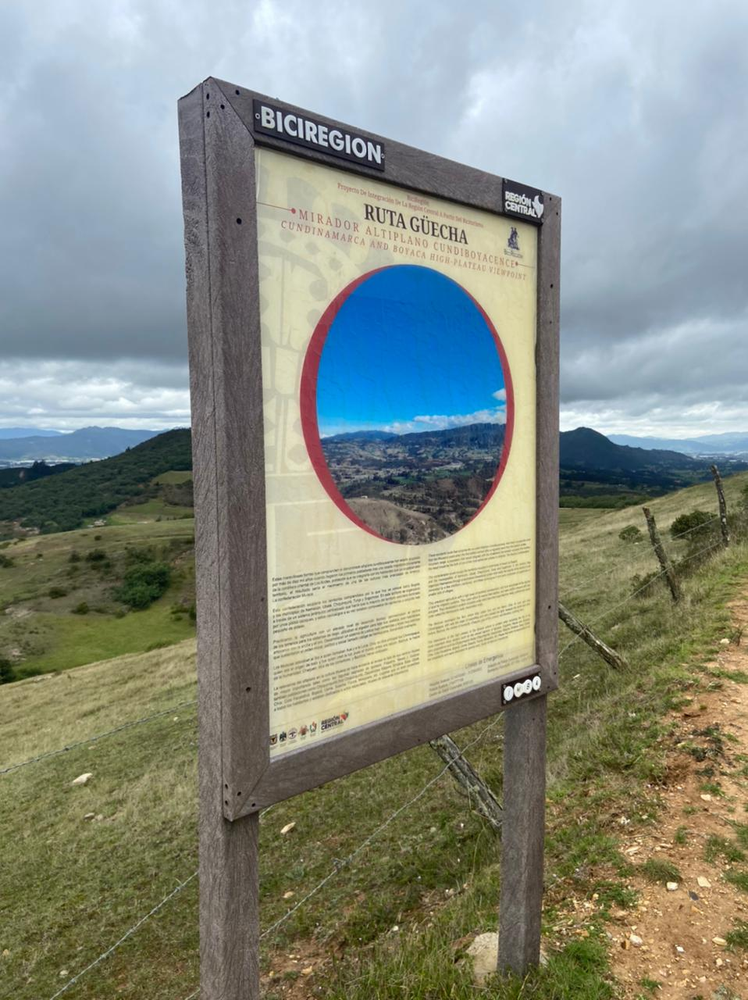
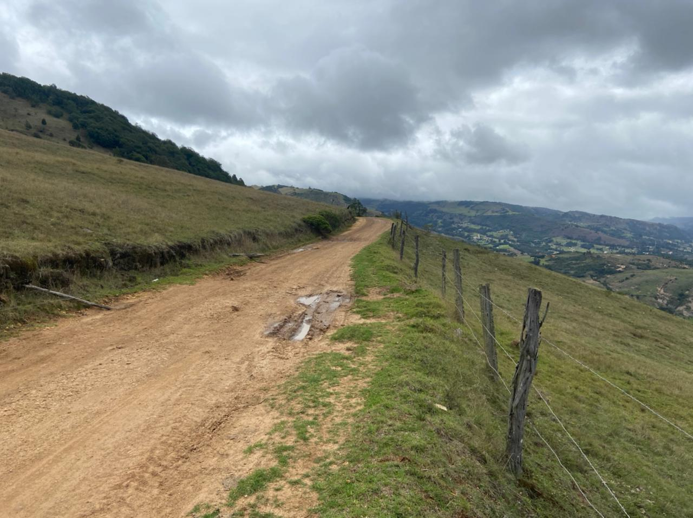
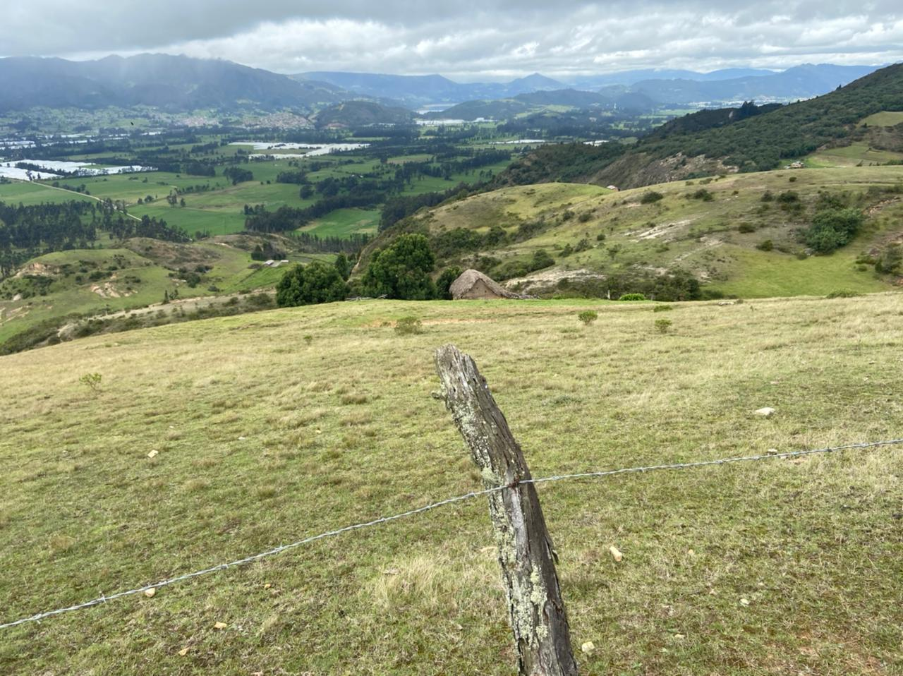
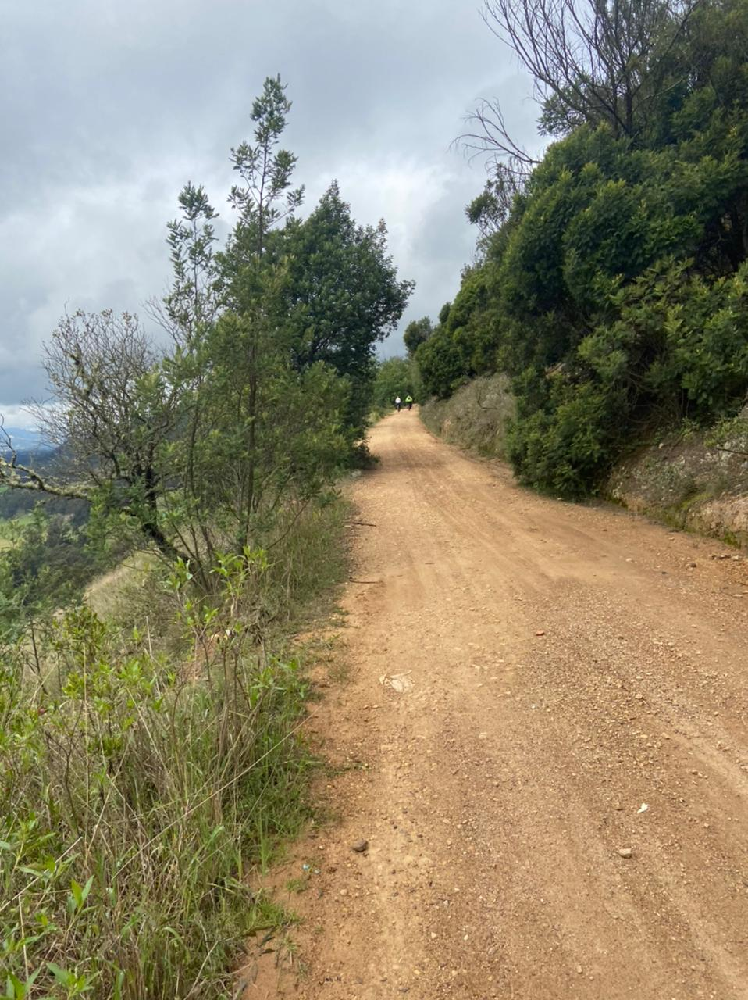
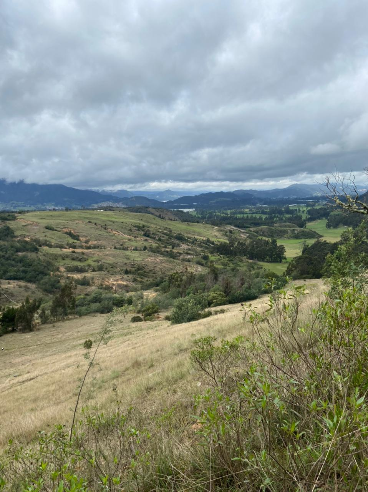
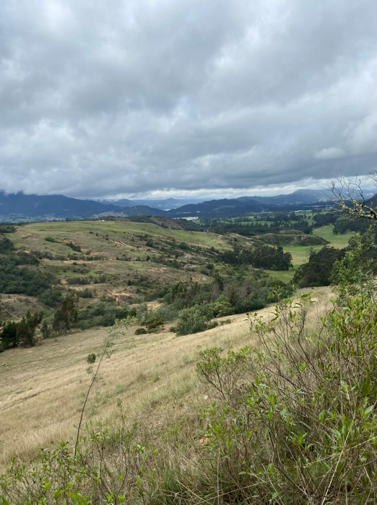
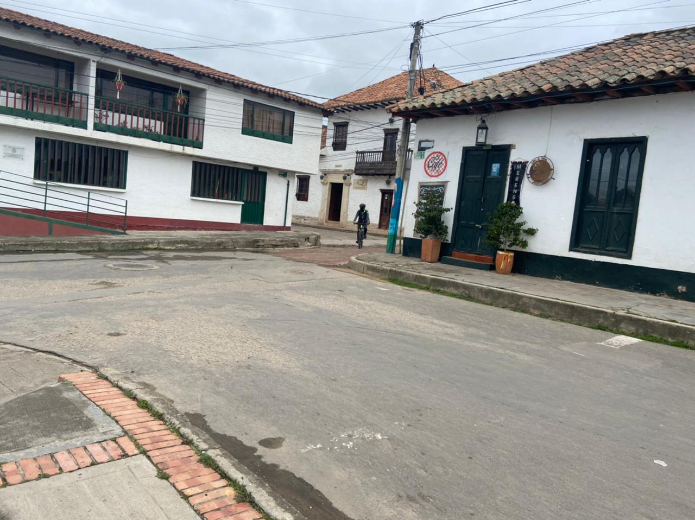
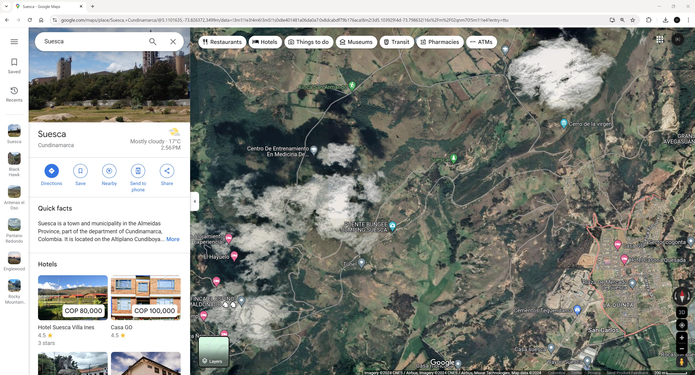

## :globe_with_meridians:Ruta Guecha, Suesca, Cundinamarca, Colombia (2021-04-02)
`Pictures` rcfdtools <br>`Category` Freelance field visit <br>`Location` [Google Maps](http://maps.google.com/maps?q=5.108268,-73.823783) or [Openstreet Map](https://www.openstreetmap.org/query?lat=5.108268&lon=-73.823783) 

```geojson
{
  "type": "Feature",
  "geometry": {
    "type": "Point", 
    "coordinates": [-73.823783, 5.108268]
  }, 
  "properties": {
    "Name": "Ruta Guecha, Suesca, Cundinamarca, Colombia"
  }
}
```

:camera: **32/0.jpeg**  <sub> `Exif version` Not known

:camera: **32/2.jpeg**  <sub> `Exif version` Not known

:camera: **32/3.jpeg**  <sub> `Exif version` Not known

:camera: **32/4.jpeg**  <sub> `Exif version` Not known

:camera: **32/5.jpeg**  <sub> `Exif version` Not known

:camera: **32/6.jpeg**  <sub> `Exif version` Not known

:camera: **32/7.jpeg**  <sub> `Exif version` Not known

:camera: **32/8.jpeg**  <sub> `Exif version` Not known

:camera: **32/9999_GoogleMaps.jpg**  <sub> `Exif version` Not known

> _Citación: se permite la reproducción digital parcial o total de este repositorio, scripts, guías de desarrollo, modelos de datos, imágenes y documentación, siempre que se haga referencia como: "R.GISMobile - Sistemas de información geográficos móviles sobre QField que no requieren de conexión a Internet para su navegación". https://github.com/rcfdtools/R.GISMobile - Bogotá - Colombia - Suramérica."._

| [:house: Inicio](../Readme.md) |
|---|