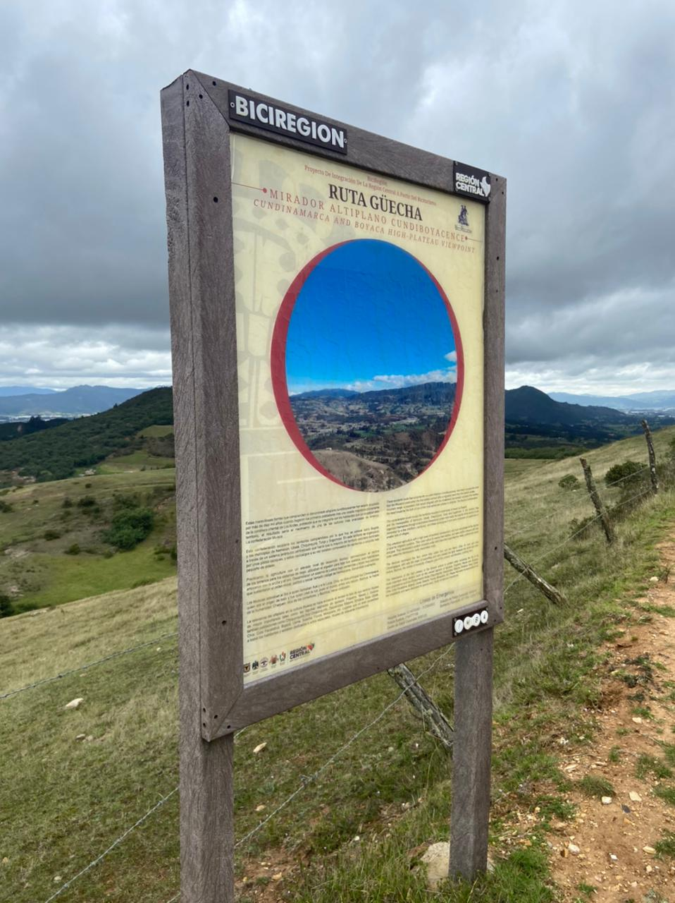
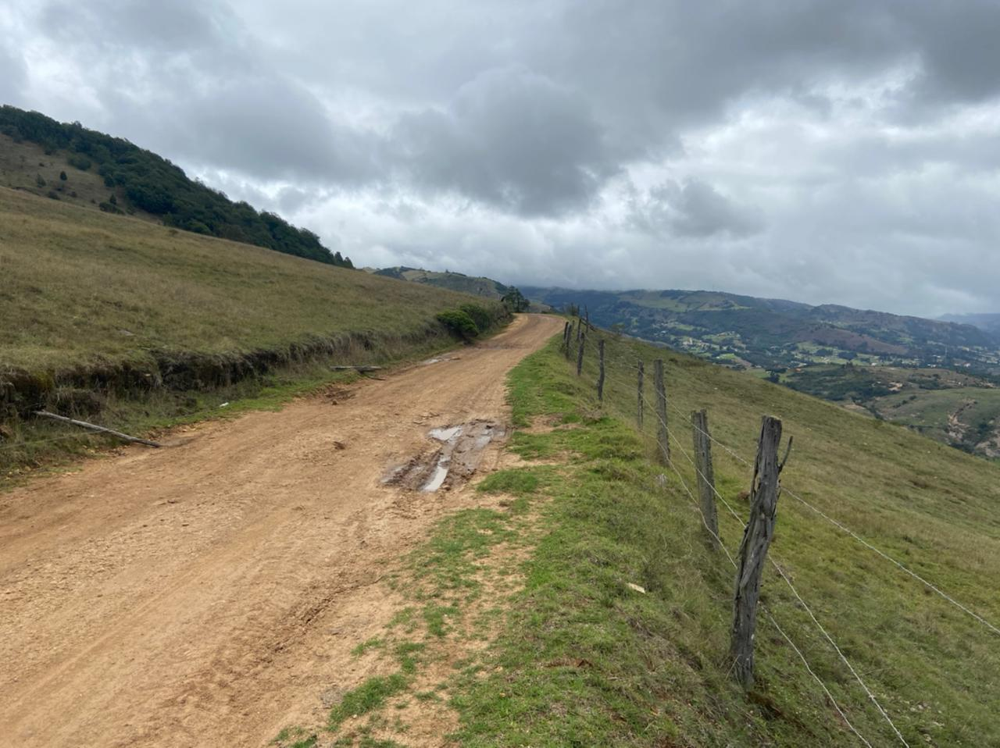
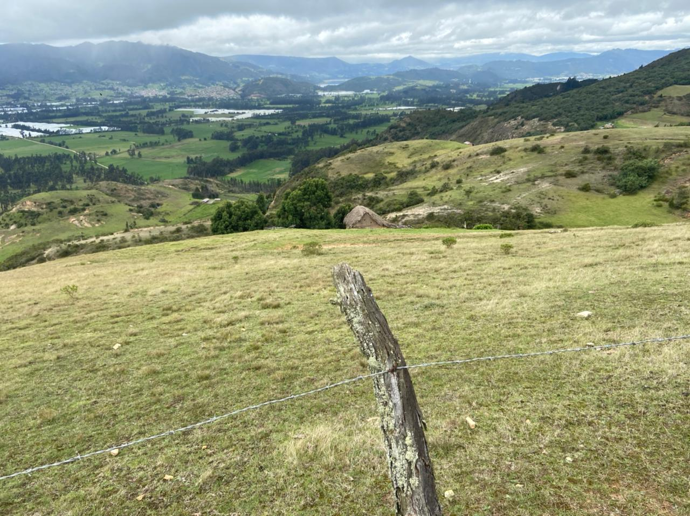
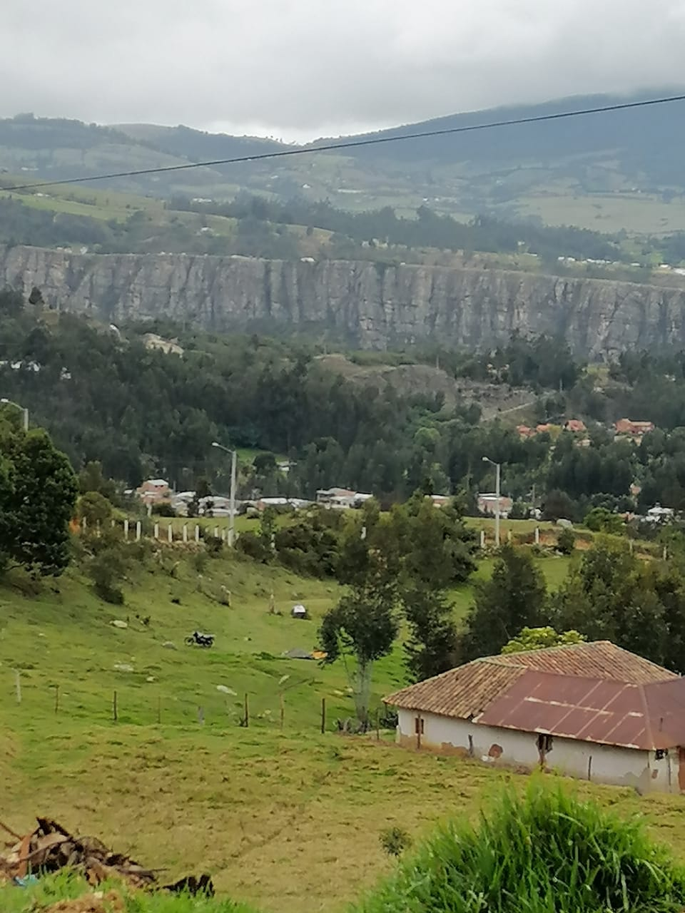
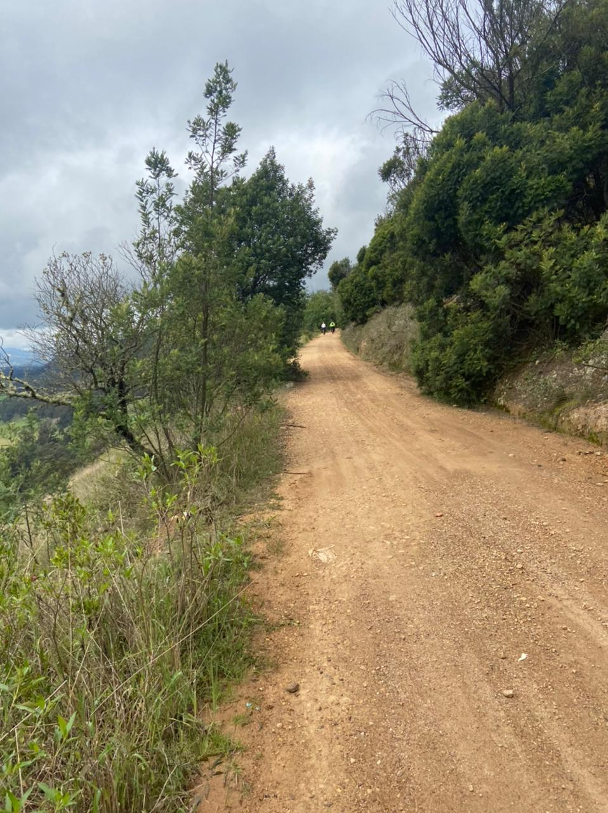
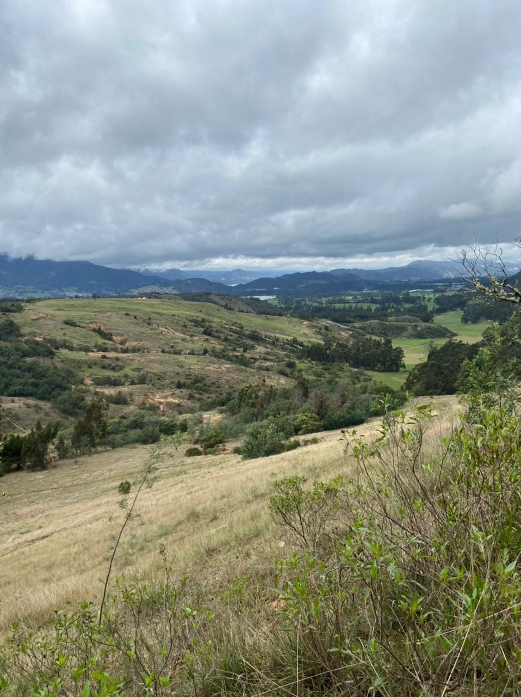
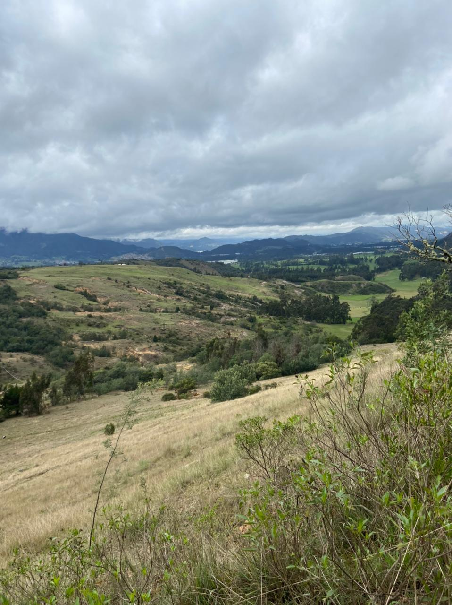
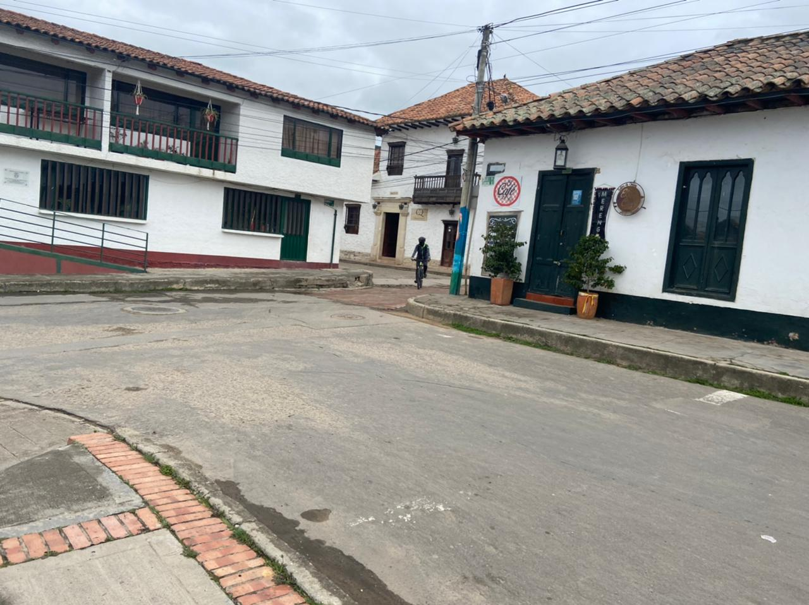
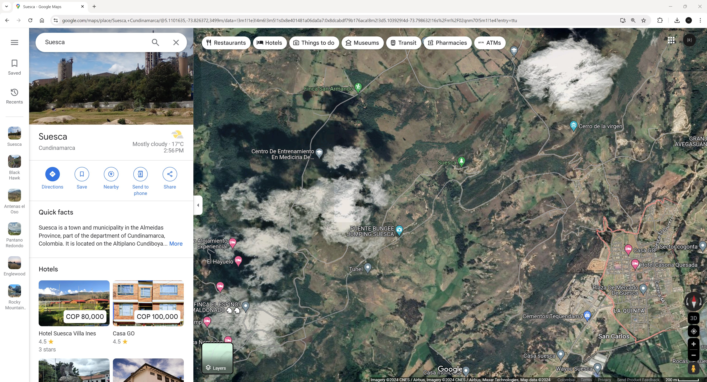

<div align="center"></div>

## Ruta Guecha, Suesca, Cundinamarca, Colombia (2021-04-02)
`Pictures` rcfdtools <br>`Category` Freelance field visit <br>`Location` [Google Maps](http://maps.google.com/maps?q=5.108268,-73.823783) or [Openstreet Map](https://www.openstreetmap.org/query?lat=5.108268&lon=-73.823783) 

```geojson
{
  "type": "Feature",
  "geometry": {
    "type": "Point", 
    "coordinates": [-73.823783, 5.108268]
  }, 
  "properties": {
    "Name": "Ruta Guecha, Suesca, Cundinamarca, Colombia"
  }
}
```

<br><details><summary>:camera:**32/0.jpeg**</summary> `Exif version` Not known</details>

<br><details><summary>:camera:**32/2.jpeg**</summary> `Exif version` Not known</details>

<br><details><summary>:camera:**32/3.jpeg**</summary> `Exif version` Not known</details>

<br><details><summary>:camera:**32/4.jpeg**</summary> `Exif version` Not known</details>

<br><details><summary>:camera:**32/5.jpeg**</summary> `Exif version` Not known</details>

<br><details><summary>:camera:**32/6.jpeg**</summary> `Exif version` Not known</details>

<br><details><summary>:camera:**32/7.jpeg**</summary> `Exif version` Not known</details>

<br><details><summary>:camera:**32/8.jpeg**</summary> `Exif version` Not known</details>

<br><details><summary>:camera:**32/9999_GoogleMaps.jpg**</summary> `Exif version` Not known</details>

<sub>_Citation: Partial or total digital reproduction of this repository, scripts, development guides, data models, images, and documentation is permitted, provided that it is referenced as: "R.GISMobile - Mobile geographic information systems on QField that do not require an internet connection for navigation." https://github.com/rcfdtools/R.GISMobile - Bogotá - Colombia - South America"._<sub>

| [:house: Home](../Readme.md) |
|---|