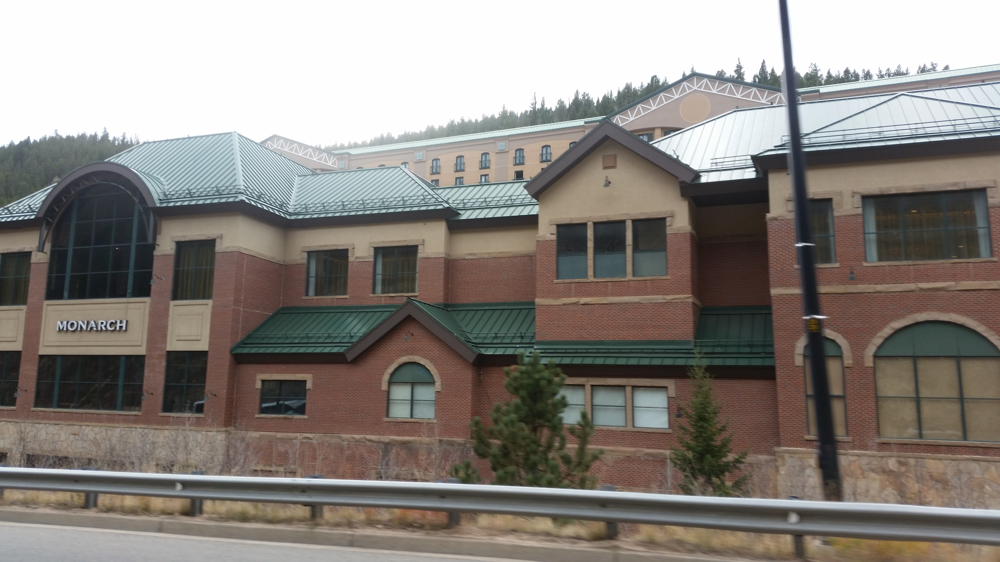
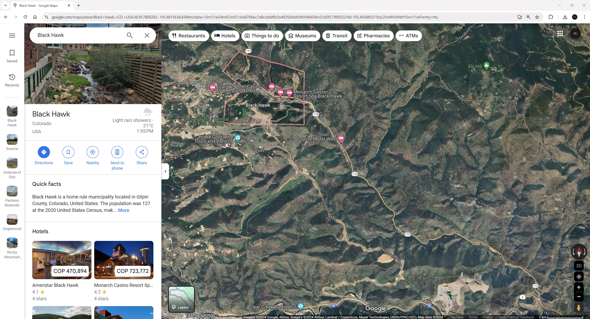

## :globe_with_meridians:Black Hawk, Colorado, U.S. (2016-10-18)
`Pictures` rcfdtools <br>`Category` Freelance field visit <br>`Location` [Google Maps](http://maps.google.com/maps?q=39.767451,-105.44864) or [Openstreet Map](https://www.openstreetmap.org/query?lat=39.767451&lon=-105.44864) 

```geojson
{
  "type": "Feature",
  "geometry": {
    "type": "Point", 
    "coordinates": [-105.44864, 39.767451]
  }, 
  "properties": {
    "Name": "Black Hawk, Colorado, U.S."
  }
}
```

<br><details><summary>:camera:**33/20161017_155857.jpg**</summary><sub> `Exif version` 0220 `OS version` G900MUBU1ANJ2 `Date` 2016:10:17 15:58:56 `Aperture` Not known `Brightness` 5.85 `Color space` 1 `Compression` 6`Exposure mode` 0 `Exposure time` 0.007194244604316547 `Focal length` 4.8 `Lens model` Not known `Lens specification` Not known `Orientation` 1 `Scene type` Not known `f number` 2.2 `White balance` 0 `Sensing method` 2 `Shutter speed` 7.12</sub></details>


<br><details><summary>:camera:**33/20161017_155902.jpg**</summary><sub> `Exif version` 0220 `OS version` G900MUBU1ANJ2 `Date` 2016:10:17 15:59:02 `Aperture` Not known `Brightness` 6.83 `Color space` 1 `Compression` 6`Exposure mode` 0 `Exposure time` 0.0035842293906810036 `Focal length` 4.8 `Lens model` Not known `Lens specification` Not known `Orientation` 1 `Scene type` Not known `f number` 2.2 `White balance` 0 `Sensing method` 2 `Shutter speed` 8.12</sub></details>


<br><details><summary>:camera:**33/20161017_155914.jpg**</summary><sub> `Exif version` 0220 `OS version` G900MUBU1ANJ2 `Date` 2016:10:17 15:59:14 `Aperture` Not known `Brightness` 6.41 `Color space` 1 `Compression` 6`Exposure mode` 0 `Exposure time` 0.004830917874396135 `Focal length` 4.8 `Lens model` Not known `Lens specification` Not known `Orientation` 1 `Scene type` Not known `f number` 2.2 `White balance` 0 `Sensing method` 2 `Shutter speed` 7.69</sub></details>


<br><details><summary>:camera:**33/20161017_155920.jpg**</summary><sub> `Exif version` 0220 `OS version` G900MUBU1ANJ2 `Date` 2016:10:17 15:59:20 `Aperture` Not known `Brightness` 4.58 `Color space` 1 `Compression` 6`Exposure mode` 0 `Exposure time` 0.016666666666666666 `Focal length` 4.8 `Lens model` Not known `Lens specification` Not known `Orientation` 1 `Scene type` Not known `f number` 2.2 `White balance` 0 `Sensing method` 2 `Shutter speed` 5.9</sub></details>


<br><details><summary>:camera:**33/20161018_114719.jpg**</summary><sub> `Exif version` 0220 `OS version` G900MUBU1ANJ2 `Date` 2016:10:18 11:47:19 `Aperture` Not known `Brightness` 7.48 `Color space` 1 `Compression` 6`Exposure mode` 0 `Exposure time` 0.0021691973969631237 `Focal length` 4.8 `Lens model` Not known `Lens specification` Not known `Orientation` 1 `Scene type` Not known `f number` 2.2 `White balance` 0 `Sensing method` 2 `Shutter speed` 8.85</sub></details>


<br><details><summary>:camera:**33/20161018_114721.jpg**</summary><sub> `Exif version` 0220 `OS version` G900MUBU1ANJ2 `Date` 2016:10:18 11:47:20 `Aperture` Not known `Brightness` 7.37 `Color space` 1 `Compression` 6`Exposure mode` 0 `Exposure time` 0.002386634844868735 `Focal length` 4.8 `Lens model` Not known `Lens specification` Not known `Orientation` 1 `Scene type` Not known `f number` 2.2 `White balance` 0 `Sensing method` 2 `Shutter speed` 8.71</sub></details>


<br><details><summary>:camera:**33/20161018_114912.jpg**</summary><sub> `Exif version` 0220 `OS version` G900MUBU1ANJ2 `Date` 2016:10:18 11:49:11 `Aperture` Not known `Brightness` 7.33 `Color space` 1 `Compression` 6`Exposure mode` 0 `Exposure time` 0.0025575447570332483 `Focal length` 4.8 `Lens model` Not known `Lens specification` Not known `Orientation` 1 `Scene type` Not known `f number` 2.2 `White balance` 0 `Sensing method` 2 `Shutter speed` 8.61</sub></details>


<br><details><summary>:camera:**33/20161018_115104.jpg**</summary><sub> `Exif version` 0220 `OS version` G900MUBU1ANJ2 `Date` 2016:10:18 11:51:03 `Aperture` Not known `Brightness` 8.41 `Color space` 1 `Compression` 6`Exposure mode` 0 `Exposure time` 0.0012468827930174563 `Focal length` 4.8 `Lens model` Not known `Lens specification` Not known `Orientation` 1 `Scene type` Not known `f number` 2.2 `White balance` 0 `Sensing method` 2 `Shutter speed` 9.64</sub></details>


<br><details><summary>:camera:**33/20161018_115109.jpg**</summary><sub> `Exif version` 0220 `OS version` G900MUBU1ANJ2 `Date` 2016:10:18 11:51:08 `Aperture` Not known `Brightness` 8.95 `Color space` 1 `Compression` 6`Exposure mode` 0 `Exposure time` 0.0008650519031141869 `Focal length` 4.8 `Lens model` Not known `Lens specification` Not known `Orientation` 1 `Scene type` Not known `f number` 2.2 `White balance` 0 `Sensing method` 2 `Shutter speed` 10.17</sub></details>


<br><details><summary>:camera:**33/20161018_115111.jpg**</summary><sub> `Exif version` 0220 `OS version` G900MUBU1ANJ2 `Date` 2016:10:18 11:51:11 `Aperture` Not known `Brightness` 7.23 `Color space` 1 `Compression` 6`Exposure mode` 0 `Exposure time` 0.002617801047120419 `Focal length` 4.8 `Lens model` Not known `Lens specification` Not known `Orientation` 1 `Scene type` Not known `f number` 2.2 `White balance` 0 `Sensing method` 2 `Shutter speed` 8.57</sub></details>


<br><details><summary>:camera:**33/20161018_115123.jpg**</summary><sub> `Exif version` 0220 `OS version` G900MUBU1ANJ2 `Date` 2016:10:18 11:51:22 `Aperture` Not known `Brightness` 7.04 `Color space` 1 `Compression` 6`Exposure mode` 0 `Exposure time` 0.0031446540880503146 `Focal length` 4.8 `Lens model` Not known `Lens specification` Not known `Orientation` 1 `Scene type` Not known `f number` 2.2 `White balance` 0 `Sensing method` 2 `Shutter speed` 8.31</sub></details>


<br><details><summary>:camera:**33/20161018_115124.jpg**</summary><sub> `Exif version` 0220 `OS version` G900MUBU1ANJ2 `Date` 2016:10:18 11:51:24 `Aperture` Not known `Brightness` 7.71 `Color space` 1 `Compression` 6`Exposure mode` 0 `Exposure time` 0.001976284584980237 `Focal length` 4.8 `Lens model` Not known `Lens specification` Not known `Orientation` 1 `Scene type` Not known `f number` 2.2 `White balance` 0 `Sensing method` 2 `Shutter speed` 8.98</sub></details>


<br><details><summary>:camera:**33/20161018_115128.jpg**</summary><sub> `Exif version` 0220 `OS version` G900MUBU1ANJ2 `Date` 2016:10:18 11:51:27 `Aperture` Not known `Brightness` 7.87 `Color space` 1 `Compression` 6`Exposure mode` 0 `Exposure time` 0.0017730496453900709 `Focal length` 4.8 `Lens model` Not known `Lens specification` Not known `Orientation` 1 `Scene type` Not known `f number` 2.2 `White balance` 0 `Sensing method` 2 `Shutter speed` 9.14</sub></details>


<br><details><summary>:camera:**33/20161018_115150.jpg**</summary><sub> `Exif version` 0220 `OS version` G900MUBU1ANJ2 `Date` 2016:10:18 11:51:50 `Aperture` Not known `Brightness` 7.16 `Color space` 1 `Compression` 6`Exposure mode` 0 `Exposure time` 0.0028169014084507044 `Focal length` 4.8 `Lens model` Not known `Lens specification` Not known `Orientation` 1 `Scene type` Not known `f number` 2.2 `White balance` 0 `Sensing method` 2 `Shutter speed` 8.47</sub></details>


<br><details><summary>:camera:**33/20161018_115159.jpg**</summary><sub> `Exif version` 0220 `OS version` G900MUBU1ANJ2 `Date` 2016:10:18 11:51:58 `Aperture` Not known `Brightness` 6.69 `Color space` 1 `Compression` 6`Exposure mode` 0 `Exposure time` 0.004149377593360996 `Focal length` 4.8 `Lens model` Not known `Lens specification` Not known `Orientation` 1 `Scene type` Not known `f number` 2.2 `White balance` 0 `Sensing method` 2 `Shutter speed` 7.91</sub></details>


<br><details><summary>:camera:**33/20161018_115205.jpg**</summary><sub> `Exif version` 0220 `OS version` G900MUBU1ANJ2 `Date` 2016:10:18 11:52:05 `Aperture` Not known `Brightness` 6.55 `Color space` 1 `Compression` 6`Exposure mode` 0 `Exposure time` 0.00411522633744856 `Focal length` 4.8 `Lens model` Not known `Lens specification` Not known `Orientation` 1 `Scene type` Not known `f number` 2.2 `White balance` 0 `Sensing method` 2 `Shutter speed` 7.92</sub></details>


<br><details><summary>:camera:**33/20161018_115212.jpg**</summary><sub> `Exif version` 0220 `OS version` G900MUBU1ANJ2 `Date` 2016:10:18 11:52:12 `Aperture` Not known `Brightness` 6.28 `Color space` 1 `Compression` 6`Exposure mode` 0 `Exposure time` 0.005376344086021506 `Focal length` 4.8 `Lens model` Not known `Lens specification` Not known `Orientation` 1 `Scene type` Not known `f number` 2.2 `White balance` 0 `Sensing method` 2 `Shutter speed` 7.54</sub></details>


<br><details><summary>:camera:**33/20161018_115236.jpg**</summary><sub> `Exif version` 0220 `OS version` G900MUBU1ANJ2 `Date` 2016:10:18 11:52:36 `Aperture` Not known `Brightness` 7.69 `Color space` 1 `Compression` 6`Exposure mode` 0 `Exposure time` 0.0019011406844106464 `Focal length` 4.8 `Lens model` Not known `Lens specification` Not known `Orientation` 1 `Scene type` Not known `f number` 2.2 `White balance` 0 `Sensing method` 2 `Shutter speed` 9.04</sub></details>


<br><details><summary>:camera:**33/20161018_115239.jpg**</summary><sub> `Exif version` 0220 `OS version` G900MUBU1ANJ2 `Date` 2016:10:18 11:52:39 `Aperture` Not known `Brightness` 6.64 `Color space` 1 `Compression` 6`Exposure mode` 0 `Exposure time` 0.004291845493562232 `Focal length` 4.8 `Lens model` Not known `Lens specification` Not known `Orientation` 1 `Scene type` Not known `f number` 2.2 `White balance` 0 `Sensing method` 2 `Shutter speed` 7.86</sub></details>


<br><details><summary>:camera:**33/20161018_115914.jpg**</summary><sub> `Exif version` 0220 `OS version` G900MUBU1ANJ2 `Date` 2016:10:18 11:59:13 `Aperture` Not known `Brightness` 7.82 `Color space` 1 `Compression` 6`Exposure mode` 0 `Exposure time` 0.0018315018315018315 `Focal length` 4.8 `Lens model` Not known `Lens specification` Not known `Orientation` 1 `Scene type` Not known `f number` 2.2 `White balance` 0 `Sensing method` 2 `Shutter speed` 9.09</sub></details>


<br><details><summary>:camera:**33/20161018_115919.jpg**</summary><sub> `Exif version` 0220 `OS version` G900MUBU1ANJ2 `Date` 2016:10:18 11:59:18 `Aperture` Not known `Brightness` 7.94 `Color space` 1 `Compression` 6`Exposure mode` 0 `Exposure time` 0.0016286644951140066 `Focal length` 4.8 `Lens model` Not known `Lens specification` Not known `Orientation` 1 `Scene type` Not known `f number` 2.2 `White balance` 0 `Sensing method` 2 `Shutter speed` 9.26</sub></details>


<br><details><summary>:camera:**33/20161018_115922.jpg**</summary><sub> `Exif version` 0220 `OS version` G900MUBU1ANJ2 `Date` 2016:10:18 11:59:22 `Aperture` Not known `Brightness` 7.6 `Color space` 1 `Compression` 6`Exposure mode` 0 `Exposure time` 0.0020964360587002098 `Focal length` 4.8 `Lens model` Not known `Lens specification` Not known `Orientation` 1 `Scene type` Not known `f number` 2.2 `White balance` 0 `Sensing method` 2 `Shutter speed` 8.89</sub></details>


<br><details><summary>:camera:**33/20161018_115924.jpg**</summary><sub> `Exif version` 0220 `OS version` G900MUBU1ANJ2 `Date` 2016:10:18 11:59:24 `Aperture` Not known `Brightness` 7.75 `Color space` 1 `Compression` 6`Exposure mode` 0 `Exposure time` 0.0018656716417910447 `Focal length` 4.8 `Lens model` Not known `Lens specification` Not known `Orientation` 1 `Scene type` Not known `f number` 2.2 `White balance` 0 `Sensing method` 2 `Shutter speed` 9.07</sub></details>


<br><details><summary>:camera:**33/20161018_115929.jpg**</summary><sub> `Exif version` 0220 `OS version` G900MUBU1ANJ2 `Date` 2016:10:18 11:59:28 `Aperture` Not known `Brightness` 6.71 `Color space` 1 `Compression` 6`Exposure mode` 0 `Exposure time` 0.00392156862745098 `Focal length` 4.8 `Lens model` Not known `Lens specification` Not known `Orientation` 1 `Scene type` Not known `f number` 2.2 `White balance` 0 `Sensing method` 2 `Shutter speed` 7.99</sub></details>


<br><details><summary>:camera:**33/20161018_120045.jpg**</summary><sub> `Exif version` 0220 `OS version` G900MUBU1ANJ2 `Date` 2016:10:18 12:00:44 `Aperture` Not known `Brightness` 6.89 `Color space` 1 `Compression` 6`Exposure mode` 0 `Exposure time` 0.0032679738562091504 `Focal length` 4.8 `Lens model` Not known `Lens specification` Not known `Orientation` 1 `Scene type` Not known `f number` 2.2 `White balance` 0 `Sensing method` 2 `Shutter speed` 8.26</sub></details>


<br><details><summary>:camera:**33/20161018_120048.jpg**</summary><sub> `Exif version` 0220 `OS version` G900MUBU1ANJ2 `Date` 2016:10:18 12:00:47 `Aperture` Not known `Brightness` 6.69 `Color space` 1 `Compression` 6`Exposure mode` 0 `Exposure time` 0.00411522633744856 `Focal length` 4.8 `Lens model` Not known `Lens specification` Not known `Orientation` 1 `Scene type` Not known `f number` 2.2 `White balance` 0 `Sensing method` 2 `Shutter speed` 7.92</sub></details>


<br><details><summary>:camera:**33/20161018_120055.jpg**</summary><sub> `Exif version` 0220 `OS version` G900MUBU1ANJ2 `Date` 2016:10:18 12:00:55 `Aperture` Not known `Brightness` 6.77 `Color space` 1 `Compression` 6`Exposure mode` 0 `Exposure time` 0.003861003861003861 `Focal length` 4.8 `Lens model` Not known `Lens specification` Not known `Orientation` 1 `Scene type` Not known `f number` 2.2 `White balance` 0 `Sensing method` 2 `Shutter speed` 8.01</sub></details>


<br><details><summary>:camera:**33/20161018_120100.jpg**</summary><sub> `Exif version` 0220 `OS version` G900MUBU1ANJ2 `Date` 2016:10:18 12:00:59 `Aperture` Not known `Brightness` 6.73 `Color space` 1 `Compression` 6`Exposure mode` 0 `Exposure time` 0.003968253968253968 `Focal length` 4.8 `Lens model` Not known `Lens specification` Not known `Orientation` 1 `Scene type` Not known `f number` 2.2 `White balance` 0 `Sensing method` 2 `Shutter speed` 7.97</sub></details>


<br><details><summary>:camera:**33/20161018_120437.jpg**</summary><sub> `Exif version` 0220 `OS version` G900MUBU1ANJ2 `Date` 2016:10:18 12:04:36 `Aperture` Not known `Brightness` 6.18 `Color space` 1 `Compression` 6`Exposure mode` 0 `Exposure time` 0.0056179775280898875 `Focal length` 4.8 `Lens model` Not known `Lens specification` Not known `Orientation` 1 `Scene type` Not known `f number` 2.2 `White balance` 0 `Sensing method` 2 `Shutter speed` 7.47</sub></details>


<br><details><summary>:camera:**33/20161018_120441.jpg**</summary><sub> `Exif version` 0220 `OS version` G900MUBU1ANJ2 `Date` 2016:10:18 12:04:41 `Aperture` Not known `Brightness` 6.67 `Color space` 1 `Compression` 6`Exposure mode` 0 `Exposure time` 0.004 `Focal length` 4.8 `Lens model` Not known `Lens specification` Not known `Orientation` 1 `Scene type` Not known `f number` 2.2 `White balance` 0 `Sensing method` 2 `Shutter speed` 7.96</sub></details>


<br><details><summary>:camera:**33/20161018_120445.jpg**</summary><sub> `Exif version` 0220 `OS version` G900MUBU1ANJ2 `Date` 2016:10:18 12:04:44 `Aperture` Not known `Brightness` 7.44 `Color space` 1 `Compression` 6`Exposure mode` 0 `Exposure time` 0.0022522522522522522 `Focal length` 4.8 `Lens model` Not known `Lens specification` Not known `Orientation` 1 `Scene type` Not known `f number` 2.2 `White balance` 0 `Sensing method` 2 `Shutter speed` 8.79</sub></details>


<br><details><summary>:camera:**33/20161018_120449.jpg**</summary><sub> `Exif version` 0220 `OS version` G900MUBU1ANJ2 `Date` 2016:10:18 12:04:48 `Aperture` Not known `Brightness` 7.5 `Color space` 1 `Compression` 6`Exposure mode` 0 `Exposure time` 0.002183406113537118 `Focal length` 4.8 `Lens model` Not known `Lens specification` Not known `Orientation` 1 `Scene type` Not known `f number` 2.2 `White balance` 0 `Sensing method` 2 `Shutter speed` 8.83</sub></details>


<br><details><summary>:camera:**33/20161018_120453.jpg**</summary><sub> `Exif version` 0220 `OS version` G900MUBU1ANJ2 `Date` 2016:10:18 12:04:52 `Aperture` Not known `Brightness` 7.98 `Color space` 1 `Compression` 6`Exposure mode` 0 `Exposure time` 0.0016286644951140066 `Focal length` 4.8 `Lens model` Not known `Lens specification` Not known `Orientation` 1 `Scene type` Not known `f number` 2.2 `White balance` 0 `Sensing method` 2 `Shutter speed` 9.26</sub></details>


<br><details><summary>:camera:**33/20161018_120526.jpg**</summary><sub> `Exif version` 0220 `OS version` G900MUBU1ANJ2 `Date` 2016:10:18 12:05:25 `Aperture` Not known `Brightness` 8.13 `Color space` 1 `Compression` 6`Exposure mode` 0 `Exposure time` 0.0013850415512465374 `Focal length` 4.8 `Lens model` Not known `Lens specification` Not known `Orientation` 6 `Scene type` Not known `f number` 2.2 `White balance` 0 `Sensing method` 2 `Shutter speed` 9.49</sub></details>


<br><details><summary>:camera:**33/20161018_120537.jpg**</summary><sub> `Exif version` 0220 `OS version` G900MUBU1ANJ2 `Date` 2016:10:18 12:05:36 `Aperture` Not known `Brightness` 8.36 `Color space` 1 `Compression` 6`Exposure mode` 0 `Exposure time` 0.0012254901960784314 `Focal length` 4.8 `Lens model` Not known `Lens specification` Not known `Orientation` 6 `Scene type` Not known `f number` 2.2 `White balance` 0 `Sensing method` 2 `Shutter speed` 9.67</sub></details>


<br><details><summary>:camera:**33/20161018_120541.jpg**</summary><sub> `Exif version` 0220 `OS version` G900MUBU1ANJ2 `Date` 2016:10:18 12:05:40 `Aperture` Not known `Brightness` 8.0 `Color space` 1 `Compression` 6`Exposure mode` 0 `Exposure time` 0.001597444089456869 `Focal length` 4.8 `Lens model` Not known `Lens specification` Not known `Orientation` 6 `Scene type` Not known `f number` 2.2 `White balance` 0 `Sensing method` 2 `Shutter speed` 9.29</sub></details>


<br><details><summary>:camera:**33/GoogleMaps.jpg**</summary> `Exif version` Not known</details>


> _Citación: se permite la reproducción digital parcial o total de este repositorio, scripts, guías de desarrollo, modelos de datos, imágenes y documentación, siempre que se haga referencia como: "R.GISMobile - Sistemas de información geográficos móviles sobre QField que no requieren de conexión a Internet para su navegación". https://github.com/rcfdtools/R.GISMobile - Bogotá - Colombia - Suramérica."._

| [:house: Inicio](../Readme.md) |
|---|