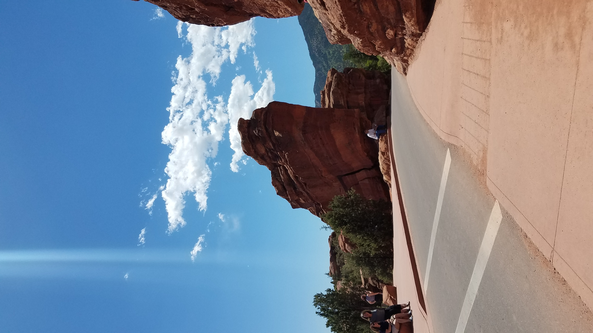
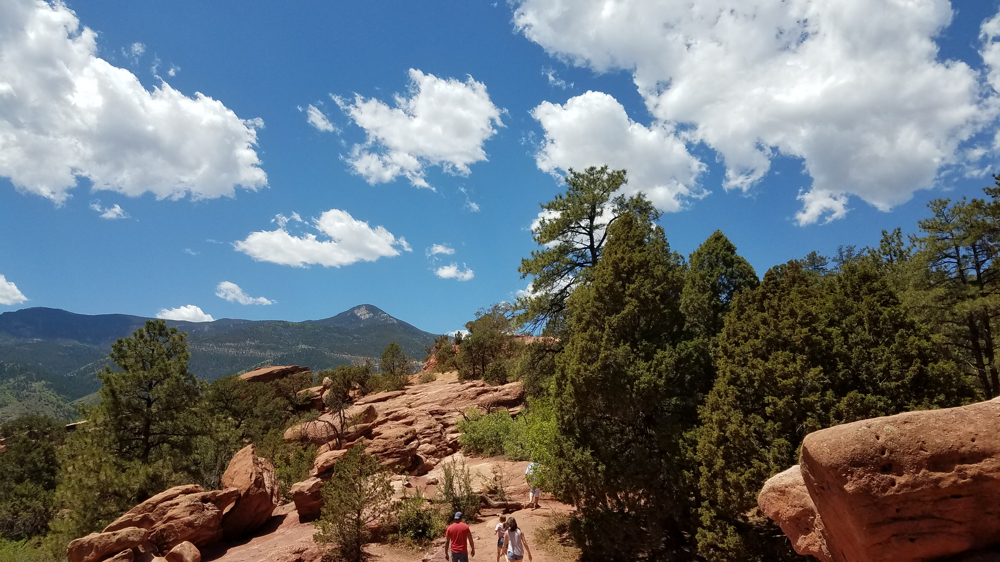

## :globe_with_meridians:Garden of Gods - Colorado Springs, Colorado, U.S. (2018-05-25)
`Pictures` rcfdtools <br>`Category` Freelance field visit <br>`Location` [Google Maps](http://maps.google.com/maps?q=38.865713,-104.889951) or [Openstreet Map](https://www.openstreetmap.org/query?lat=38.865713&lon=-104.889951) 

```geojson
{
  "type": "Feature",
  "geometry": {
    "type": "Point", 
    "coordinates": [-104.889951, 38.865713]
  }, 
  "properties": {
    "Name": "Garden of Gods - Colorado Springs, Colorado, U.S."
  }
}
```

<br><details><summary>:camera:**34/20180525_121221.jpg**</summary><sub> `Exif version` 0220 `OS version` G930PVPU5BQL1 `Date` 2018:05:25 12:12:21 `Aperture` Not known `Brightness` 8.83 `Color space` 1 `Compression` 6`Exposure mode` 0 `Exposure time` 0.000462962962962963 `Focal length` 4.2 `Lens model` Not known `Lens specification` Not known `Orientation` 6 `Scene type` Not known `f number` 1.7 `White balance` 0 `Sensing method` 2 `Shutter speed` 11.076</sub></details>

<br><details><summary>:camera:**34/20180525_121238.jpg**</summary><sub> `Exif version` 0220 `OS version` G930PVPU5BQL1 `Date` 2018:05:25 12:12:38 `Aperture` Not known `Brightness` 8.95 `Color space` 1 `Compression` 6`Exposure mode` 0 `Exposure time` 0.00042087542087542086 `Focal length` 4.2 `Lens model` Not known `Lens specification` Not known `Orientation` 6 `Scene type` Not known `f number` 1.7 `White balance` 0 `Sensing method` 2 `Shutter speed` 11.214</sub></details>

<br><details><summary>:camera:**34/20180525_121243.jpg**</summary><sub> `Exif version` 0220 `OS version` G930PVPU5BQL1 `Date` 2018:05:25 12:12:42 `Aperture` Not known `Brightness` 8.98 `Color space` 1 `Compression` 6`Exposure mode` 0 `Exposure time` 0.00043252595155709344 `Focal length` 4.2 `Lens model` Not known `Lens specification` Not known `Orientation` 1 `Scene type` Not known `f number` 1.7 `White balance` 0 `Sensing method` 2 `Shutter speed` 11.174</sub></details>

<br><details><summary>:camera:**34/20180525_121245.jpg**</summary><sub> `Exif version` 0220 `OS version` G930PVPU5BQL1 `Date` 2018:05:25 12:12:45 `Aperture` Not known `Brightness` 8.96 `Color space` 1 `Compression` 6`Exposure mode` 0 `Exposure time` 0.0004280821917808219 `Focal length` 4.2 `Lens model` Not known `Lens specification` Not known `Orientation` 1 `Scene type` Not known `f number` 1.7 `White balance` 0 `Sensing method` 2 `Shutter speed` 11.189</sub></details>

<br><details><summary>:camera:**34/20180525_121254.jpg**</summary><sub> `Exif version` 0220 `OS version` G930PVPU5BQL1 `Date` 2018:05:25 12:12:54 `Aperture` Not known `Brightness` 9.02 `Color space` 1 `Compression` 6`Exposure mode` 0 `Exposure time` 0.0004152823920265781 `Focal length` 4.2 `Lens model` Not known `Lens specification` Not known `Orientation` 6 `Scene type` Not known `f number` 1.7 `White balance` 0 `Sensing method` 2 `Shutter speed` 11.233</sub></details>

<br><details><summary>:camera:**34/20180525_121311.jpg**</summary><sub> `Exif version` 0220 `OS version` G930PVPU5BQL1 `Date` 2018:05:25 12:13:11 `Aperture` Not known `Brightness` 8.55 `Color space` 1 `Compression` 6`Exposure mode` 0 `Exposure time` 0.0005787037037037037 `Focal length` 4.2 `Lens model` Not known `Lens specification` Not known `Orientation` 6 `Scene type` Not known `f number` 1.7 `White balance` 0 `Sensing method` 2 `Shutter speed` 10.754</sub></details>

<br><details><summary>:camera:**34/20180525_121313.jpg**</summary><sub> `Exif version` 0220 `OS version` G930PVPU5BQL1 `Date` 2018:05:25 12:13:13 `Aperture` Not known `Brightness` 9.44 `Color space` 1 `Compression` 6`Exposure mode` 0 `Exposure time` 0.0003117206982543641 `Focal length` 4.2 `Lens model` Not known `Lens specification` Not known `Orientation` 6 `Scene type` Not known `f number` 1.7 `White balance` 0 `Sensing method` 2 `Shutter speed` 11.647</sub></details>

<br><details><summary>:camera:**34/20180525_121326.jpg**</summary><sub> `Exif version` 0220 `OS version` G930PVPU5BQL1 `Date` 2018:05:25 12:13:26 `Aperture` Not known `Brightness` 9.28 `Color space` 1 `Compression` 6`Exposure mode` 0 `Exposure time` 0.00034722222222222224 `Focal length` 4.2 `Lens model` Not known `Lens specification` Not known `Orientation` 6 `Scene type` Not known `f number` 1.7 `White balance` 0 `Sensing method` 2 `Shutter speed` 11.491</sub></details>

<br><details><summary>:camera:**34/20180525_121329.jpg**</summary><sub> `Exif version` 0220 `OS version` G930PVPU5BQL1 `Date` 2018:05:25 12:13:29 `Aperture` Not known `Brightness` 9.15 `Color space` 1 `Compression` 6`Exposure mode` 0 `Exposure time` 0.0003787878787878788 `Focal length` 4.2 `Lens model` Not known `Lens specification` Not known `Orientation` 1 `Scene type` Not known `f number` 1.7 `White balance` 0 `Sensing method` 2 `Shutter speed` 11.366</sub></details>

<br><details><summary>:camera:**34/20180525_121337.jpg**</summary><sub> `Exif version` 0220 `OS version` G930PVPU5BQL1 `Date` 2018:05:25 12:13:37 `Aperture` Not known `Brightness` 9.03 `Color space` 1 `Compression` 6`Exposure mode` 0 `Exposure time` 0.000423728813559322 `Focal length` 4.2 `Lens model` Not known `Lens specification` Not known `Orientation` 1 `Scene type` Not known `f number` 1.7 `White balance` 0 `Sensing method` 2 `Shutter speed` 11.204</sub></details>

<br><details><summary>:camera:**34/20180525_121423.jpg**</summary><sub> `Exif version` 0220 `OS version` G930PVPU5BQL1 `Date` 2018:05:25 12:14:23 `Aperture` Not known `Brightness` 8.84 `Color space` 1 `Compression` 6`Exposure mode` 0 `Exposure time` 0.0004752851711026616 `Focal length` 4.2 `Lens model` Not known `Lens specification` Not known `Orientation` 1 `Scene type` Not known `f number` 1.7 `White balance` 0 `Sensing method` 2 `Shutter speed` 11.038</sub></details>

<br><details><summary>:camera:**34/20180525_121436.jpg**</summary><sub> `Exif version` 0220 `OS version` G930PVPU5BQL1 `Date` 2018:05:25 12:14:36 `Aperture` Not known `Brightness` 8.91 `Color space` 1 `Compression` 6`Exposure mode` 0 `Exposure time` 0.00044483985765124553 `Focal length` 4.2 `Lens model` Not known `Lens specification` Not known `Orientation` 1 `Scene type` Not known `f number` 1.7 `White balance` 0 `Sensing method` 2 `Shutter speed` 11.134</sub></details>

<br><details><summary>:camera:**34/20180525_121436_0.jpg**</summary><sub> `Exif version` 0220 `OS version` G930PVPU5BQL1 `Date` 2018:05:25 12:14:36 `Aperture` Not known `Brightness` 8.92 `Color space` 1 `Compression` 6`Exposure mode` 0 `Exposure time` 0.00044483985765124553 `Focal length` 4.2 `Lens model` Not known `Lens specification` Not known `Orientation` 1 `Scene type` Not known `f number` 1.7 `White balance` 0 `Sensing method` 2 `Shutter speed` 11.134</sub></details>

<br><details><summary>:camera:**34/20180525_121523.jpg**</summary><sub> `Exif version` 0220 `OS version` G930PVPU5BQL1 `Date` 2018:05:25 12:15:22 `Aperture` Not known `Brightness` Not known `Color space` 1 `Compression` Not known`Exposure mode` 0 `Exposure time` Not known `Focal length` 4.2 `Lens model` Not known `Lens specification` Not known `Orientation` 1 `Scene type` Not known `f number` 1.7 `White balance` 0 `Sensing method` Not known `Shutter speed` Not known</sub></details>

<br><details><summary>:camera:**34/20180525_121706.jpg**</summary><sub> `Exif version` 0220 `OS version` G930PVPU5BQL1 `Date` 2018:05:25 12:17:06 `Aperture` Not known `Brightness` 8.04 `Color space` 1 `Compression` 6`Exposure mode` 0 `Exposure time` 0.0007692307692307692 `Focal length` 4.2 `Lens model` Not known `Lens specification` Not known `Orientation` 1 `Scene type` Not known `f number` 1.7 `White balance` 0 `Sensing method` 2 `Shutter speed` 10.344</sub></details>

<br><details><summary>:camera:**34/20180525_121721.jpg**</summary><sub> `Exif version` 0220 `OS version` G930PVPU5BQL1 `Date` 2018:05:25 12:17:21 `Aperture` Not known `Brightness` 8.59 `Color space` 1 `Compression` 6`Exposure mode` 0 `Exposure time` 0.0005263157894736842 `Focal length` 4.2 `Lens model` Not known `Lens specification` Not known `Orientation` 6 `Scene type` Not known `f number` 1.7 `White balance` 0 `Sensing method` 2 `Shutter speed` 10.891</sub></details>

<br><details><summary>:camera:**34/20180525_121726.jpg**</summary><sub> `Exif version` 0220 `OS version` G930PVPU5BQL1 `Date` 2018:05:25 12:17:26 `Aperture` Not known `Brightness` 8.1 `Color space` 1 `Compression` 6`Exposure mode` 0 `Exposure time` 0.000741839762611276 `Focal length` 4.2 `Lens model` Not known `Lens specification` Not known `Orientation` 6 `Scene type` Not known `f number` 1.7 `White balance` 0 `Sensing method` 2 `Shutter speed` 10.396</sub></details>

<br><details><summary>:camera:**34/20180525_121732.jpg**</summary><sub> `Exif version` 0220 `OS version` G930PVPU5BQL1 `Date` 2018:05:25 12:17:32 `Aperture` Not known `Brightness` 8.92 `Color space` 1 `Compression` 6`Exposure mode` 0 `Exposure time` 0.00043706293706293706 `Focal length` 4.2 `Lens model` Not known `Lens specification` Not known `Orientation` 6 `Scene type` Not known `f number` 1.7 `White balance` 0 `Sensing method` 2 `Shutter speed` 11.159</sub></details>

<br><details><summary>:camera:**34/20180525_121741.jpg**</summary><sub> `Exif version` 0220 `OS version` G930PVPU5BQL1 `Date` 2018:05:25 12:17:41 `Aperture` Not known `Brightness` 8.94 `Color space` 1 `Compression` 6`Exposure mode` 0 `Exposure time` 0.00042087542087542086 `Focal length` 4.2 `Lens model` Not known `Lens specification` Not known `Orientation` 1 `Scene type` Not known `f number` 1.7 `White balance` 0 `Sensing method` 2 `Shutter speed` 11.214</sub></details>

<br><details><summary>:camera:**34/20180525_121748.jpg**</summary><sub> `Exif version` 0220 `OS version` G930PVPU5BQL1 `Date` 2018:05:25 12:17:47 `Aperture` Not known `Brightness` 9.15 `Color space` 1 `Compression` 6`Exposure mode` 0 `Exposure time` 0.0003654970760233918 `Focal length` 4.2 `Lens model` Not known `Lens specification` Not known `Orientation` 1 `Scene type` Not known `f number` 1.7 `White balance` 0 `Sensing method` 2 `Shutter speed` 11.417</sub></details>

<br><details><summary>:camera:**34/20180525_121850.jpg**</summary><sub> `Exif version` 0220 `OS version` G930PVPU5BQL1 `Date` 2018:05:25 12:18:50 `Aperture` Not known `Brightness` 9.17 `Color space` 1 `Compression` 6`Exposure mode` 0 `Exposure time` 0.00036023054755043225 `Focal length` 4.2 `Lens model` Not known `Lens specification` Not known `Orientation` 6 `Scene type` Not known `f number` 1.7 `White balance` 0 `Sensing method` 2 `Shutter speed` 11.438</sub></details>

<br><details><summary>:camera:**34/20180525_121906.jpg**</summary><sub> `Exif version` 0220 `OS version` G930PVPU5BQL1 `Date` 2018:05:25 12:19:06 `Aperture` Not known `Brightness` 7.01 `Color space` 1 `Compression` 6`Exposure mode` 0 `Exposure time` 0.001718213058419244 `Focal length` 4.2 `Lens model` Not known `Lens specification` Not known `Orientation` 1 `Scene type` Not known `f number` 1.7 `White balance` 0 `Sensing method` 2 `Shutter speed` 9.184</sub></details>

<br><details><summary>:camera:**34/20180525_121928.jpg**</summary><sub> `Exif version` 0220 `OS version` G930PVPU5BQL1 `Date` 2018:05:25 12:19:28 `Aperture` Not known `Brightness` 8.19 `Color space` 1 `Compression` 6`Exposure mode` 0 `Exposure time` 0.0007288629737609329 `Focal length` 4.2 `Lens model` Not known `Lens specification` Not known `Orientation` 6 `Scene type` Not known `f number` 1.7 `White balance` 0 `Sensing method` 2 `Shutter speed` 10.422</sub></details>

<br><details><summary>:camera:**34/20180525_121932.jpg**</summary><sub> `Exif version` 0220 `OS version` G930PVPU5BQL1 `Date` 2018:05:25 12:19:32 `Aperture` Not known `Brightness` 8.16 `Color space` 1 `Compression` 6`Exposure mode` 0 `Exposure time` 0.0007507507507507507 `Focal length` 4.2 `Lens model` Not known `Lens specification` Not known `Orientation` 6 `Scene type` Not known `f number` 1.7 `White balance` 0 `Sensing method` 2 `Shutter speed` 10.379</sub></details>

<br><details><summary>:camera:**34/20180525_121938.jpg**</summary><sub> `Exif version` 0220 `OS version` G930PVPU5BQL1 `Date` 2018:05:25 12:19:38 `Aperture` Not known `Brightness` 8.23 `Color space` 1 `Compression` 6`Exposure mode` 0 `Exposure time` 0.0007309941520467836 `Focal length` 4.2 `Lens model` Not known `Lens specification` Not known `Orientation` 1 `Scene type` Not known `f number` 1.7 `White balance` 0 `Sensing method` 2 `Shutter speed` 10.417</sub></details>

<br><details><summary>:camera:**34/20180525_121951.jpg**</summary><sub> `Exif version` 0220 `OS version` G930PVPU5BQL1 `Date` 2018:05:25 12:19:51 `Aperture` Not known `Brightness` 8.41 `Color space` 1 `Compression` 6`Exposure mode` 0 `Exposure time` 0.0006127450980392157 `Focal length` 4.2 `Lens model` Not known `Lens specification` Not known `Orientation` 1 `Scene type` Not known `f number` 1.7 `White balance` 0 `Sensing method` 2 `Shutter speed` 10.672</sub></details>

<br><details><summary>:camera:**34/20180525_122003.jpg**</summary><sub> `Exif version` 0220 `OS version` G930PVPU5BQL1 `Date` 2018:05:25 12:20:03 `Aperture` Not known `Brightness` 8.52 `Color space` 1 `Compression` 6`Exposure mode` 0 `Exposure time` 0.0005966587112171838 `Focal length` 4.2 `Lens model` Not known `Lens specification` Not known `Orientation` 1 `Scene type` Not known `f number` 1.7 `White balance` 0 `Sensing method` 2 `Shutter speed` 10.71</sub></details>

<br><details><summary>:camera:**34/20180525_122007.jpg**</summary><sub> `Exif version` 0220 `OS version` G930PVPU5BQL1 `Date` 2018:05:25 12:20:07 `Aperture` Not known `Brightness` 9.21 `Color space` 1 `Compression` 6`Exposure mode` 0 `Exposure time` 0.00037313432835820896 `Focal length` 4.2 `Lens model` Not known `Lens specification` Not known `Orientation` 1 `Scene type` Not known `f number` 1.7 `White balance` 0 `Sensing method` 2 `Shutter speed` 11.388</sub></details>

<br><details><summary>:camera:**34/20180525_122011.jpg**</summary><sub> `Exif version` 0220 `OS version` G930PVPU5BQL1 `Date` 2018:05:25 12:20:11 `Aperture` Not known `Brightness` 9.17 `Color space` 1 `Compression` 6`Exposure mode` 0 `Exposure time` 0.00035919540229885057 `Focal length` 4.2 `Lens model` Not known `Lens specification` Not known `Orientation` 1 `Scene type` Not known `f number` 1.7 `White balance` 0 `Sensing method` 2 `Shutter speed` 11.442</sub></details>

<br><details><summary>:camera:**34/20180525_122037.jpg**</summary><sub> `Exif version` 0220 `OS version` G930PVPU5BQL1 `Date` 2018:05:25 12:20:37 `Aperture` Not known `Brightness` 8.66 `Color space` 1 `Compression` 6`Exposure mode` 0 `Exposure time` 0.0005330490405117271 `Focal length` 4.2 `Lens model` Not known `Lens specification` Not known `Orientation` 1 `Scene type` Not known `f number` 1.7 `White balance` 0 `Sensing method` 2 `Shutter speed` 10.873</sub></details>

<br><details><summary>:camera:**34/20180525_122051.jpg**</summary><sub> `Exif version` 0220 `OS version` G930PVPU5BQL1 `Date` 2018:05:25 12:20:51 `Aperture` Not known `Brightness` 7.82 `Color space` 1 `Compression` 6`Exposure mode` 0 `Exposure time` 0.0009823182711198428 `Focal length` 4.2 `Lens model` Not known `Lens specification` Not known `Orientation` 1 `Scene type` Not known `f number` 1.7 `White balance` 0 `Sensing method` 2 `Shutter speed` 9.991</sub></details>

<br><details><summary>:camera:**34/20180525_122055.jpg**</summary><sub> `Exif version` 0220 `OS version` G930PVPU5BQL1 `Date` 2018:05:25 12:20:55 `Aperture` Not known `Brightness` 7.94 `Color space` 1 `Compression` 6`Exposure mode` 0 `Exposure time` 0.0008389261744966443 `Focal length` 4.2 `Lens model` Not known `Lens specification` Not known `Orientation` 1 `Scene type` Not known `f number` 1.7 `White balance` 0 `Sensing method` 2 `Shutter speed` 10.219</sub></details>

<br><details><summary>:camera:**34/20180525_122418.jpg**</summary><sub> `Exif version` 0220 `OS version` G930PVPU5BQL1 `Date` 2018:05:25 12:24:18 `Aperture` Not known `Brightness` 9.37 `Color space` 1 `Compression` 6`Exposure mode` 0 `Exposure time` 0.0003272251308900524 `Focal length` 4.2 `Lens model` Not known `Lens specification` Not known `Orientation` 1 `Scene type` Not known `f number` 1.7 `White balance` 0 `Sensing method` 2 `Shutter speed` 11.577</sub></details>

<br><details><summary>:camera:**34/20180525_122428.jpg**</summary><sub> `Exif version` 0220 `OS version` G930PVPU5BQL1 `Date` 2018:05:25 12:24:28 `Aperture` Not known `Brightness` 9.27 `Color space` 1 `Compression` 6`Exposure mode` 0 `Exposure time` 0.0003453038674033149 `Focal length` 4.2 `Lens model` Not known `Lens specification` Not known `Orientation` 1 `Scene type` Not known `f number` 1.7 `White balance` 0 `Sensing method` 2 `Shutter speed` 11.499</sub></details>

<br><details><summary>:camera:**34/20180525_122502.jpg**</summary><sub> `Exif version` 0220 `OS version` G930PVPU5BQL1 `Date` 2018:05:25 12:25:02 `Aperture` Not known `Brightness` 8.56 `Color space` 1 `Compression` 6`Exposure mode` 0 `Exposure time` 0.000564334085778781 `Focal length` 4.2 `Lens model` Not known `Lens specification` Not known `Orientation` 1 `Scene type` Not known `f number` 1.7 `White balance` 0 `Sensing method` 2 `Shutter speed` 10.791</sub></details>

<br><details><summary>:camera:**34/20180525_122640.jpg**</summary><sub> `Exif version` 0220 `OS version` G930PVPU5BQL1 `Date` 2018:05:25 12:26:40 `Aperture` Not known `Brightness` 8.21 `Color space` 1 `Compression` 6`Exposure mode` 0 `Exposure time` 0.0007621951219512195 `Focal length` 4.2 `Lens model` Not known `Lens specification` Not known `Orientation` 6 `Scene type` Not known `f number` 1.7 `White balance` 0 `Sensing method` 2 `Shutter speed` 10.357</sub></details>

<br><details><summary>:camera:**34/20180525_122646.jpg**</summary><sub> `Exif version` 0220 `OS version` G930PVPU5BQL1 `Date` 2018:05:25 12:26:46 `Aperture` Not known `Brightness` 7.74 `Color space` 1 `Compression` 6`Exposure mode` 0 `Exposure time` 0.00099601593625498 `Focal length` 4.2 `Lens model` Not known `Lens specification` Not known `Orientation` 1 `Scene type` Not known `f number` 1.7 `White balance` 0 `Sensing method` 2 `Shutter speed` 9.971</sub></details>

<br><details><summary>:camera:**34/20180525_122817.jpg**</summary><sub> `Exif version` 0220 `OS version` G930PVPU5BQL1 `Date` 2018:05:25 12:28:16 `Aperture` Not known `Brightness` Not known `Color space` 1 `Compression` Not known`Exposure mode` 0 `Exposure time` Not known `Focal length` 4.2 `Lens model` Not known `Lens specification` Not known `Orientation` 1 `Scene type` Not known `f number` 1.7 `White balance` 0 `Sensing method` Not known `Shutter speed` Not known</sub></details>

<br><details><summary>:camera:**34/20180525_122911.jpg**</summary><sub> `Exif version` 0220 `OS version` G930PVPU5BQL1 `Date` 2018:05:25 12:29:11 `Aperture` Not known `Brightness` 9.12 `Color space` 1 `Compression` 6`Exposure mode` 0 `Exposure time` 0.00035310734463276836 `Focal length` 4.2 `Lens model` Not known `Lens specification` Not known `Orientation` 1 `Scene type` Not known `f number` 1.7 `White balance` 0 `Sensing method` 2 `Shutter speed` 11.467</sub></details>

<br><details><summary>:camera:**34/20180525_122916.jpg**</summary><sub> `Exif version` 0220 `OS version` G930PVPU5BQL1 `Date` 2018:05:25 12:29:16 `Aperture` Not known `Brightness` 9.18 `Color space` 1 `Compression` 6`Exposure mode` 0 `Exposure time` 0.000361271676300578 `Focal length` 4.2 `Lens model` Not known `Lens specification` Not known `Orientation` 1 `Scene type` Not known `f number` 1.7 `White balance` 0 `Sensing method` 2 `Shutter speed` 11.434</sub></details>

<br><details><summary>:camera:**34/20180525_123702.jpg**</summary><sub> `Exif version` 0220 `OS version` G930PVPU5BQL1 `Date` 2018:05:25 12:37:02 `Aperture` Not known `Brightness` 8.19 `Color space` 1 `Compression` 6`Exposure mode` 0 `Exposure time` 0.0007062146892655367 `Focal length` 4.2 `Lens model` Not known `Lens specification` Not known `Orientation` 1 `Scene type` Not known `f number` 1.7 `White balance` 0 `Sensing method` 2 `Shutter speed` 10.467</sub></details>

<br><details><summary>:camera:**34/20180525_123705.jpg**</summary><sub> `Exif version` 0220 `OS version` G930PVPU5BQL1 `Date` 2018:05:25 12:37:05 `Aperture` Not known `Brightness` 8.22 `Color space` 1 `Compression` 6`Exposure mode` 0 `Exposure time` 0.0007062146892655367 `Focal length` 4.2 `Lens model` Not known `Lens specification` Not known `Orientation` 1 `Scene type` Not known `f number` 1.7 `White balance` 0 `Sensing method` 2 `Shutter speed` 10.467</sub></details>

<br><details><summary>:camera:**34/20180525_123708.jpg**</summary><sub> `Exif version` 0220 `OS version` G930PVPU5BQL1 `Date` 2018:05:25 12:37:08 `Aperture` Not known `Brightness` 8.19 `Color space` 1 `Compression` 6`Exposure mode` 0 `Exposure time` 0.0007352941176470588 `Focal length` 4.2 `Lens model` Not known `Lens specification` Not known `Orientation` 1 `Scene type` Not known `f number` 1.7 `White balance` 0 `Sensing method` 2 `Shutter speed` 10.409</sub></details>

<br><details><summary>:camera:**34/20180525_123722.jpg**</summary><sub> `Exif version` 0220 `OS version` G930PVPU5BQL1 `Date` 2018:05:25 12:37:22 `Aperture` Not known `Brightness` 8.35 `Color space` 1 `Compression` 6`Exposure mode` 0 `Exposure time` 0.0006811989100817438 `Focal length` 4.2 `Lens model` Not known `Lens specification` Not known `Orientation` 1 `Scene type` Not known `f number` 1.7 `White balance` 0 `Sensing method` 2 `Shutter speed` 10.519</sub></details>

<br><details><summary>:camera:**34/20180525_123729.jpg**</summary><sub> `Exif version` 0220 `OS version` G930PVPU5BQL1 `Date` 2018:05:25 12:37:29 `Aperture` Not known `Brightness` 7.66 `Color space` 1 `Compression` 6`Exposure mode` 0 `Exposure time` 0.0010080645161290322 `Focal length` 4.2 `Lens model` Not known `Lens specification` Not known `Orientation` 1 `Scene type` Not known `f number` 1.7 `White balance` 0 `Sensing method` 2 `Shutter speed` 9.954</sub></details>

<br><details><summary>:camera:**34/20180525_124008.jpg**</summary><sub> `Exif version` 0220 `OS version` G930PVPU5BQL1 `Date` 2018:05:25 12:40:07 `Aperture` Not known `Brightness` 8.54 `Color space` 1 `Compression` 6`Exposure mode` 0 `Exposure time` 0.000588235294117647 `Focal length` 4.2 `Lens model` Not known `Lens specification` Not known `Orientation` 1 `Scene type` Not known `f number` 1.7 `White balance` 0 `Sensing method` 2 `Shutter speed` 10.731</sub></details>

<br><details><summary>:camera:**34/20180525_124010.jpg**</summary><sub> `Exif version` 0220 `OS version` G930PVPU5BQL1 `Date` 2018:05:25 12:40:10 `Aperture` Not known `Brightness` 8.5 `Color space` 1 `Compression` 6`Exposure mode` 0 `Exposure time` 0.0005966587112171838 `Focal length` 4.2 `Lens model` Not known `Lens specification` Not known `Orientation` 1 `Scene type` Not known `f number` 1.7 `White balance` 0 `Sensing method` 2 `Shutter speed` 10.71</sub></details>

<br><details><summary>:camera:**34/20180525_124014.jpg**</summary><sub> `Exif version` 0220 `OS version` G930PVPU5BQL1 `Date` 2018:05:25 12:40:14 `Aperture` Not known `Brightness` 8.52 `Color space` 1 `Compression` 6`Exposure mode` 0 `Exposure time` 0.0005995203836930455 `Focal length` 4.2 `Lens model` Not known `Lens specification` Not known `Orientation` 1 `Scene type` Not known `f number` 1.7 `White balance` 0 `Sensing method` 2 `Shutter speed` 10.703</sub></details>

<br><details><summary>:camera:**34/20180525_124023.jpg**</summary><sub> `Exif version` 0220 `OS version` G930PVPU5BQL1 `Date` 2018:05:25 12:40:23 `Aperture` Not known `Brightness` 8.62 `Color space` 1 `Compression` 6`Exposure mode` 0 `Exposure time` 0.0005518763796909492 `Focal length` 4.2 `Lens model` Not known `Lens specification` Not known `Orientation` 1 `Scene type` Not known `f number` 1.7 `White balance` 0 `Sensing method` 2 `Shutter speed` 10.823</sub></details>

<br><details><summary>:camera:**34/20180525_124028.jpg**</summary><sub> `Exif version` 0220 `OS version` G930PVPU5BQL1 `Date` 2018:05:25 12:40:28 `Aperture` Not known `Brightness` 8.91 `Color space` 1 `Compression` 6`Exposure mode` 0 `Exposure time` 0.0004432624113475177 `Focal length` 4.2 `Lens model` Not known `Lens specification` Not known `Orientation` 1 `Scene type` Not known `f number` 1.7 `White balance` 0 `Sensing method` 2 `Shutter speed` 11.139</sub></details>

<br><details><summary>:camera:**34/20180525_124032.jpg**</summary><sub> `Exif version` 0220 `OS version` G930PVPU5BQL1 `Date` 2018:05:25 12:40:32 `Aperture` Not known `Brightness` 8.91 `Color space` 1 `Compression` 6`Exposure mode` 0 `Exposure time` 0.0004084967320261438 `Focal length` 4.2 `Lens model` Not known `Lens specification` Not known `Orientation` 1 `Scene type` Not known `f number` 1.7 `White balance` 0 `Sensing method` 2 `Shutter speed` 11.257</sub></details>

<br><details><summary>:camera:**34/20180525_124505.jpg**</summary><sub> `Exif version` 0220 `OS version` G930PVPU5BQL1 `Date` 2018:05:25 12:45:05 `Aperture` Not known `Brightness` 9.19 `Color space` 1 `Compression` 6`Exposure mode` 0 `Exposure time` 0.0003720238095238095 `Focal length` 4.2 `Lens model` Not known `Lens specification` Not known `Orientation` 1 `Scene type` Not known `f number` 1.7 `White balance` 0 `Sensing method` 2 `Shutter speed` 11.392</sub></details>

<br><details><summary>:camera:**34/20180525_124508.jpg**</summary><sub> `Exif version` 0220 `OS version` G930PVPU5BQL1 `Date` 2018:05:25 12:45:08 `Aperture` Not known `Brightness` 9.03 `Color space` 1 `Compression` 6`Exposure mode` 0 `Exposure time` 0.00037764350453172205 `Focal length` 4.2 `Lens model` Not known `Lens specification` Not known `Orientation` 1 `Scene type` Not known `f number` 1.7 `White balance` 0 `Sensing method` 2 `Shutter speed` 11.37</sub></details>

<br><details><summary>:camera:**34/20180525_124511.jpg**</summary><sub> `Exif version` 0220 `OS version` G930PVPU5BQL1 `Date` 2018:05:25 12:45:11 `Aperture` Not known `Brightness` 9.26 `Color space` 1 `Compression` 6`Exposure mode` 0 `Exposure time` 0.00037313432835820896 `Focal length` 4.2 `Lens model` Not known `Lens specification` Not known `Orientation` 1 `Scene type` Not known `f number` 1.7 `White balance` 0 `Sensing method` 2 `Shutter speed` 11.388</sub></details>

<br><details><summary>:camera:**34/20180525_124527.jpg**</summary><sub> `Exif version` 0220 `OS version` G930PVPU5BQL1 `Date` 2018:05:25 12:45:27 `Aperture` Not known `Brightness` 8.98 `Color space` 1 `Compression` 6`Exposure mode` 0 `Exposure time` 0.00043252595155709344 `Focal length` 4.2 `Lens model` Not known `Lens specification` Not known `Orientation` 1 `Scene type` Not known `f number` 1.7 `White balance` 0 `Sensing method` 2 `Shutter speed` 11.174</sub></details>

<br><details><summary>:camera:**34/20180525_124554.jpg**</summary><sub> `Exif version` 0220 `OS version` G930PVPU5BQL1 `Date` 2018:05:25 12:45:54 `Aperture` Not known `Brightness` 8.73 `Color space` 1 `Compression` 6`Exposure mode` 0 `Exposure time` 0.0005285412262156448 `Focal length` 4.2 `Lens model` Not known `Lens specification` Not known `Orientation` 1 `Scene type` Not known `f number` 1.7 `White balance` 0 `Sensing method` 2 `Shutter speed` 10.885</sub></details>

<br><details><summary>:camera:**34/20180525_124559.jpg**</summary><sub> `Exif version` 0220 `OS version` G930PVPU5BQL1 `Date` 2018:05:25 12:45:59 `Aperture` Not known `Brightness` 8.46 `Color space` 1 `Compression` 6`Exposure mode` 0 `Exposure time` 0.0005656108597285068 `Focal length` 4.2 `Lens model` Not known `Lens specification` Not known `Orientation` 6 `Scene type` Not known `f number` 1.7 `White balance` 0 `Sensing method` 2 `Shutter speed` 10.787</sub></details>

<br><details><summary>:camera:**34/20180525_124601.jpg**</summary><sub> `Exif version` 0220 `OS version` G930PVPU5BQL1 `Date` 2018:05:25 12:46:01 `Aperture` Not known `Brightness` 8.66 `Color space` 1 `Compression` 6`Exposure mode` 0 `Exposure time` 0.0005494505494505495 `Focal length` 4.2 `Lens model` Not known `Lens specification` Not known `Orientation` 6 `Scene type` Not known `f number` 1.7 `White balance` 0 `Sensing method` 2 `Shutter speed` 10.829</sub></details>

<br><details><summary>:camera:**34/20180525_124606.jpg**</summary><sub> `Exif version` 0220 `OS version` G930PVPU5BQL1 `Date` 2018:05:25 12:46:06 `Aperture` Not known `Brightness` 8.27 `Color space` 1 `Compression` 6`Exposure mode` 0 `Exposure time` 0.0006983240223463687 `Focal length` 4.2 `Lens model` Not known `Lens specification` Not known `Orientation` 1 `Scene type` Not known `f number` 1.7 `White balance` 0 `Sensing method` 2 `Shutter speed` 10.483</sub></details>

<br><details><summary>:camera:**34/20180525_124624.jpg**</summary><sub> `Exif version` 0220 `OS version` G930PVPU5BQL1 `Date` 2018:05:25 12:46:24 `Aperture` Not known `Brightness` 8.11 `Color space` 1 `Compression` 6`Exposure mode` 0 `Exposure time` 0.0007739938080495357 `Focal length` 4.2 `Lens model` Not known `Lens specification` Not known `Orientation` 1 `Scene type` Not known `f number` 1.7 `White balance` 0 `Sensing method` 2 `Shutter speed` 10.335</sub></details>

<br><details><summary>:camera:**34/20180525_124640.jpg**</summary><sub> `Exif version` 0220 `OS version` G930PVPU5BQL1 `Date` 2018:05:25 12:46:40 `Aperture` Not known `Brightness` 8.68 `Color space` 1 `Compression` 6`Exposure mode` 0 `Exposure time` 0.0005122950819672131 `Focal length` 4.2 `Lens model` Not known `Lens specification` Not known `Orientation` 1 `Scene type` Not known `f number` 1.7 `White balance` 0 `Sensing method` 2 `Shutter speed` 10.93</sub></details>

<br><details><summary>:camera:**34/20180525_125038.jpg**</summary><sub> `Exif version` 0220 `OS version` G930PVPU5BQL1 `Date` 2018:05:25 12:50:38 `Aperture` Not known `Brightness` 8.53 `Color space` 1 `Compression` 6`Exposure mode` 0 `Exposure time` 0.0005694760820045558 `Focal length` 4.2 `Lens model` Not known `Lens specification` Not known `Orientation` 6 `Scene type` Not known `f number` 1.7 `White balance` 0 `Sensing method` 2 `Shutter speed` 10.778</sub></details>

<br><details><summary>:camera:**34/20180525_125044.jpg**</summary><sub> `Exif version` 0220 `OS version` G930PVPU5BQL1 `Date` 2018:05:25 12:50:43 `Aperture` Not known `Brightness` 8.83 `Color space` 1 `Compression` 6`Exposure mode` 0 `Exposure time` 0.00048449612403100775 `Focal length` 4.2 `Lens model` Not known `Lens specification` Not known `Orientation` 1 `Scene type` Not known `f number` 1.7 `White balance` 0 `Sensing method` 2 `Shutter speed` 11.011</sub></details>

<br><details><summary>:camera:**34/20180525_125047.jpg**</summary><sub> `Exif version` 0220 `OS version` G930PVPU5BQL1 `Date` 2018:05:25 12:50:47 `Aperture` Not known `Brightness` 8.75 `Color space` 1 `Compression` 6`Exposure mode` 0 `Exposure time` 0.0005197505197505198 `Focal length` 4.2 `Lens model` Not known `Lens specification` Not known `Orientation` 1 `Scene type` Not known `f number` 1.7 `White balance` 0 `Sensing method` 2 `Shutter speed` 10.909</sub></details>

<br><details><summary>:camera:**34/20180525_125052.jpg**</summary><sub> `Exif version` 0220 `OS version` G930PVPU5BQL1 `Date` 2018:05:25 12:50:52 `Aperture` Not known `Brightness` 8.75 `Color space` 1 `Compression` 6`Exposure mode` 0 `Exposure time` 0.0005102040816326531 `Focal length` 4.2 `Lens model` Not known `Lens specification` Not known `Orientation` 1 `Scene type` Not known `f number` 1.7 `White balance` 0 `Sensing method` 2 `Shutter speed` 10.936</sub></details>

<br><details><summary>:camera:**34/20180525_125102.jpg**</summary><sub> `Exif version` 0220 `OS version` G930PVPU5BQL1 `Date` 2018:05:25 12:51:02 `Aperture` Not known `Brightness` 8.67 `Color space` 1 `Compression` 6`Exposure mode` 0 `Exposure time` 0.0005219206680584551 `Focal length` 4.2 `Lens model` Not known `Lens specification` Not known `Orientation` 1 `Scene type` Not known `f number` 1.7 `White balance` 0 `Sensing method` 2 `Shutter speed` 10.903</sub></details>

<br><details><summary>:camera:**34/20180525_125106.jpg**</summary><sub> `Exif version` 0220 `OS version` G930PVPU5BQL1 `Date` 2018:05:25 12:51:06 `Aperture` Not known `Brightness` 8.32 `Color space` 1 `Compression` 6`Exposure mode` 0 `Exposure time` 0.0006142506142506142 `Focal length` 4.2 `Lens model` Not known `Lens specification` Not known `Orientation` 1 `Scene type` Not known `f number` 1.7 `White balance` 0 `Sensing method` 2 `Shutter speed` 10.668</sub></details>

<br><details><summary>:camera:**34/20180525_125108.jpg**</summary><sub> `Exif version` 0220 `OS version` G930PVPU5BQL1 `Date` 2018:05:25 12:51:08 `Aperture` Not known `Brightness` 8.41 `Color space` 1 `Compression` 6`Exposure mode` 0 `Exposure time` 0.0006142506142506142 `Focal length` 4.2 `Lens model` Not known `Lens specification` Not known `Orientation` 1 `Scene type` Not known `f number` 1.7 `White balance` 0 `Sensing method` 2 `Shutter speed` 10.668</sub></details>

<br><details><summary>:camera:**34/20180525_125110.jpg**</summary><sub> `Exif version` 0220 `OS version` G930PVPU5BQL1 `Date` 2018:05:25 12:51:10 `Aperture` Not known `Brightness` 8.32 `Color space` 1 `Compression` 6`Exposure mode` 0 `Exposure time` 0.0006793478260869565 `Focal length` 4.2 `Lens model` Not known `Lens specification` Not known `Orientation` 1 `Scene type` Not known `f number` 1.7 `White balance` 0 `Sensing method` 2 `Shutter speed` 10.523</sub></details>

<br><details><summary>:camera:**34/20180525_125145.jpg**</summary><sub> `Exif version` 0220 `OS version` G930PVPU5BQL1 `Date` 2018:05:25 12:51:45 `Aperture` Not known `Brightness` 8.53 `Color space` 1 `Compression` 6`Exposure mode` 0 `Exposure time` 0.0005555555555555556 `Focal length` 4.2 `Lens model` Not known `Lens specification` Not known `Orientation` 1 `Scene type` Not known `f number` 1.7 `White balance` 0 `Sensing method` 2 `Shutter speed` 10.813</sub></details>

<br><details><summary>:camera:**34/20180525_125146.jpg**</summary><sub> `Exif version` 0220 `OS version` G930PVPU5BQL1 `Date` 2018:05:25 12:51:46 `Aperture` Not known `Brightness` 8.52 `Color space` 1 `Compression` 6`Exposure mode` 0 `Exposure time` 0.0005518763796909492 `Focal length` 4.2 `Lens model` Not known `Lens specification` Not known `Orientation` 1 `Scene type` Not known `f number` 1.7 `White balance` 0 `Sensing method` 2 `Shutter speed` 10.823</sub></details>

<br><details><summary>:camera:**34/20180525_125152.jpg**</summary><sub> `Exif version` 0220 `OS version` G930PVPU5BQL1 `Date` 2018:05:25 12:51:52 `Aperture` Not known `Brightness` 8.57 `Color space` 1 `Compression` 6`Exposure mode` 0 `Exposure time` 0.0006053268765133172 `Focal length` 4.2 `Lens model` Not known `Lens specification` Not known `Orientation` 1 `Scene type` Not known `f number` 1.7 `White balance` 0 `Sensing method` 2 `Shutter speed` 10.689</sub></details>

<br><details><summary>:camera:**34/20180525_125157.jpg**</summary><sub> `Exif version` 0220 `OS version` G930PVPU5BQL1 `Date` 2018:05:25 12:51:57 `Aperture` Not known `Brightness` 8.65 `Color space` 1 `Compression` 6`Exposure mode` 0 `Exposure time` 0.0005376344086021505 `Focal length` 4.2 `Lens model` Not known `Lens specification` Not known `Orientation` 1 `Scene type` Not known `f number` 1.7 `White balance` 0 `Sensing method` 2 `Shutter speed` 10.861</sub></details>

<br><details><summary>:camera:**34/20180525_131355.jpg**</summary><sub> `Exif version` 0220 `OS version` G930PVPU5BQL1 `Date` 2018:05:25 13:13:55 `Aperture` Not known `Brightness` 6.27 `Color space` 1 `Compression` 6`Exposure mode` 0 `Exposure time` 0.002688172043010753 `Focal length` 4.2 `Lens model` Not known `Lens specification` Not known `Orientation` 1 `Scene type` Not known `f number` 1.7 `White balance` 0 `Sensing method` 2 `Shutter speed` 8.539</sub></details>

<br><details><summary>:camera:**34/20180525_131359.jpg**</summary><sub> `Exif version` 0220 `OS version` G930PVPU5BQL1 `Date` 2018:05:25 13:13:59 `Aperture` Not known `Brightness` 5.95 `Color space` 1 `Compression` 6`Exposure mode` 0 `Exposure time` 0.003703703703703704 `Focal length` 4.2 `Lens model` Not known `Lens specification` Not known `Orientation` 1 `Scene type` Not known `f number` 1.7 `White balance` 0 `Sensing method` 2 `Shutter speed` 8.076</sub></details>

<br><details><summary>:camera:**34/20180525_131414.jpg**</summary><sub> `Exif version` 0220 `OS version` G930PVPU5BQL1 `Date` 2018:05:25 13:14:14 `Aperture` Not known `Brightness` 6.27 `Color space` 1 `Compression` 6`Exposure mode` 0 `Exposure time` 0.0029585798816568047 `Focal length` 4.2 `Lens model` Not known `Lens specification` Not known `Orientation` 1 `Scene type` Not known `f number` 1.7 `White balance` 0 `Sensing method` 2 `Shutter speed` 8.4</sub></details>

> _Citación: se permite la reproducción digital parcial o total de este repositorio, scripts, guías de desarrollo, modelos de datos, imágenes y documentación, siempre que se haga referencia como: "R.GISMobile - Sistemas de información geográficos móviles sobre QField que no requieren de conexión a Internet para su navegación". https://github.com/rcfdtools/R.GISMobile - Bogotá - Colombia - Suramérica."._

| [:house: Inicio](../Readme.md) |
|---|