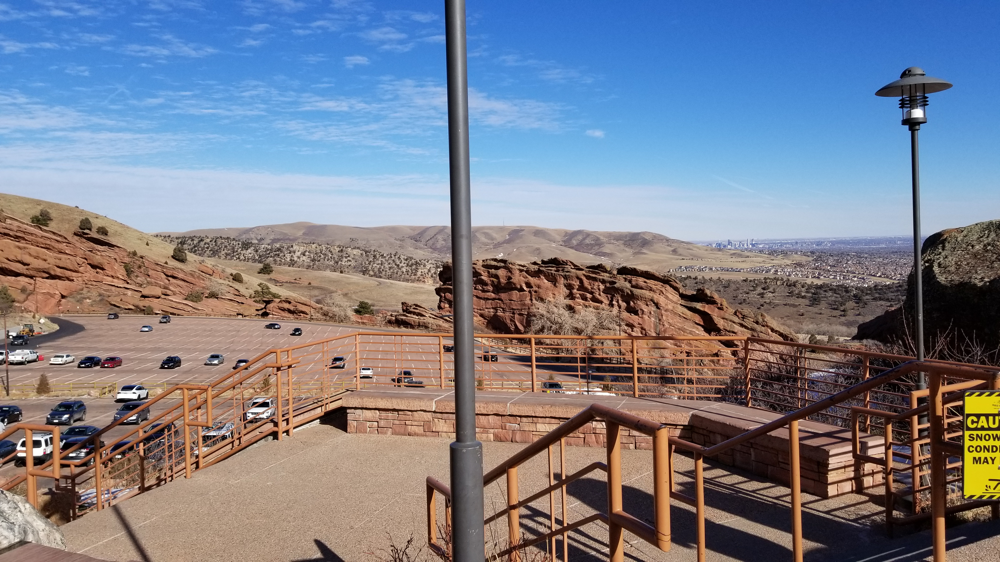
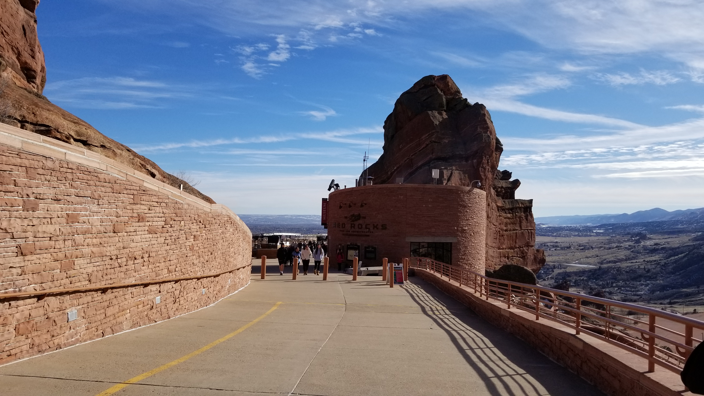
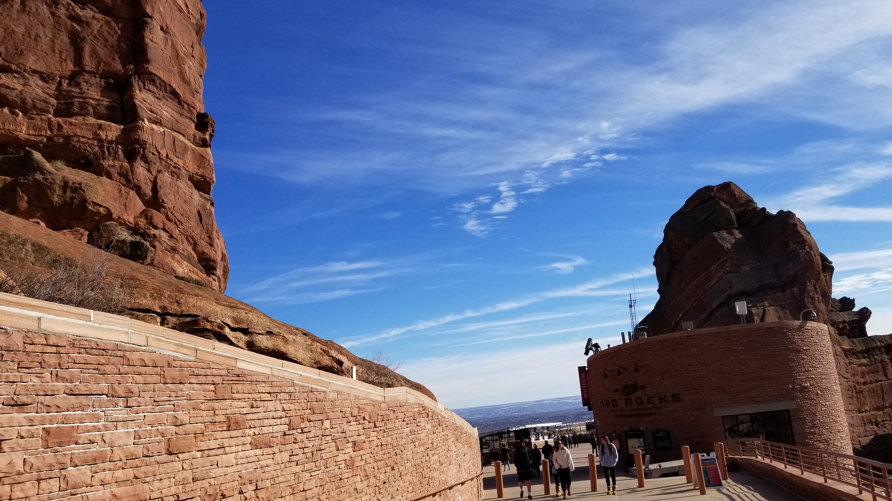
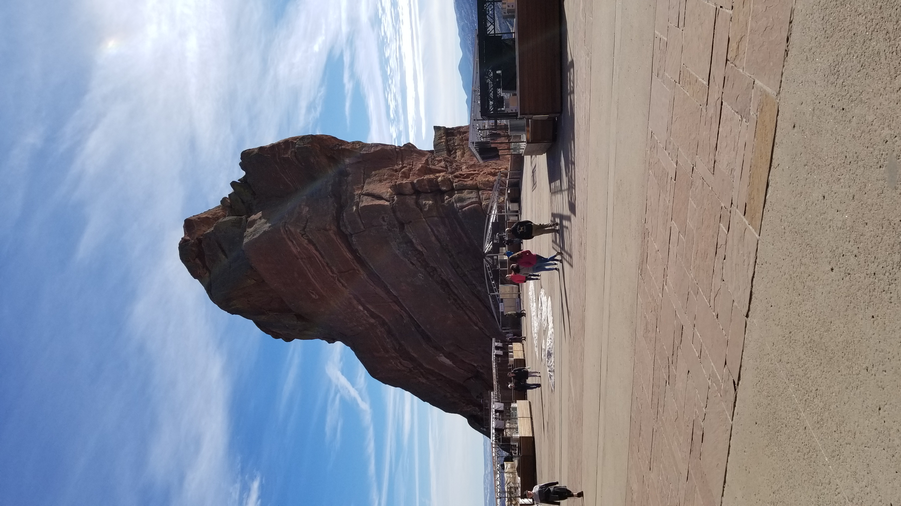
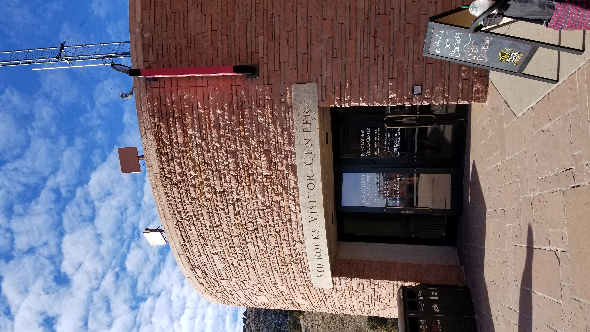
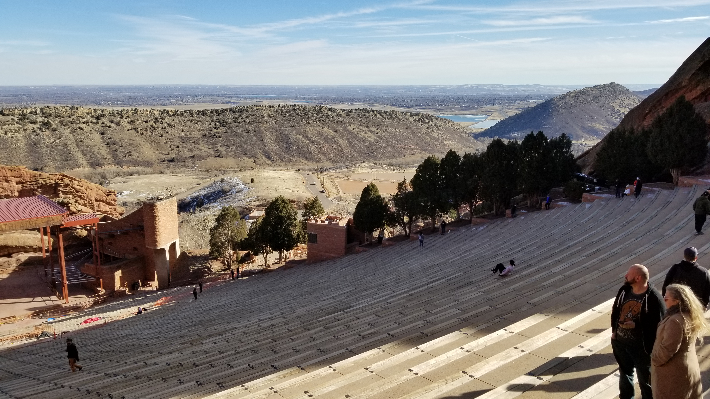
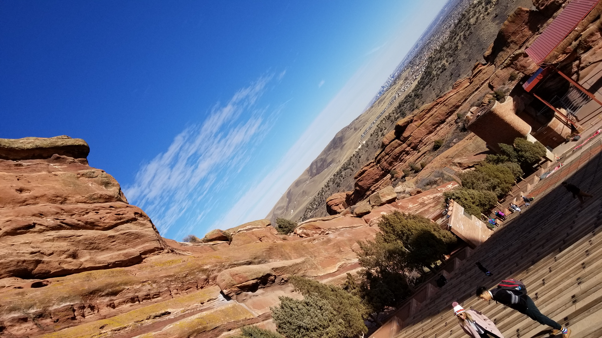
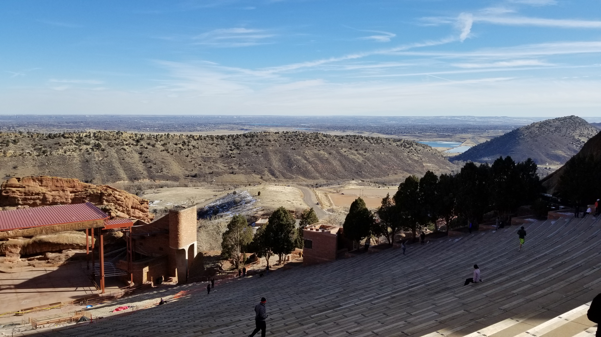

## :globe_with_meridians:Red Rocks, Colorado, U.S. (2020-01-05)
`Pictures` rcfdtools <br>`Category` Freelance field visit <br>`Location` [Google Maps](http://maps.google.com/maps?q=39.665453,-105.205656) or [Openstreet Map](https://www.openstreetmap.org/query?lat=39.665453&lon=-105.205656) 

```geojson
{
  "type": "Feature",
  "geometry": {
    "type": "Point", 
    "coordinates": [-105.205656, 39.665453]
  }, 
  "properties": {
    "Name": "Red Rocks, Colorado, U.S."
  }
}
```

<br><details><summary>:camera:**35/20200105_125846.jpg**</summary><sub> `Exif version` 0220 `OS version` G955USQS6DSJ1 `Date` 2020:01:05 12:58:46 `Aperture` Not known `Brightness` 9.28 `Color space` 1 `Compression` 6`Exposure mode` 0 `Exposure time` 0.00026371308016877635 `Focal length` 4.25 `Lens model` Not known `Lens specification` Not known `Orientation` 1 `Scene type` Not known `f number` 1.7 `White balance` 0 `Sensing method` 2 `Shutter speed` 11.888</sub><sub>`Coordinates & altitude` (0.0, 0.0, 0.0)</sub><sub> :globe_with_meridians:`Location over` [Google Maps](http://maps.google.com/maps?q=0.0,0.0) or [Openstreet Map](https://www.openstreetmap.org/query?lat=0.0&lon=0.0)</sub></details>

<br><details><summary>:camera:**35/20200105_130055.jpg**</summary><sub> `Exif version` 0220 `OS version` G955USQS6DSJ1 `Date` 2020:01:05 13:00:55 `Aperture` Not known `Brightness` 9.21 `Color space` 1 `Compression` 6`Exposure mode` 0 `Exposure time` 0.0002631578947368421 `Focal length` 4.25 `Lens model` Not known `Lens specification` Not known `Orientation` 1 `Scene type` Not known `f number` 1.7 `White balance` 0 `Sensing method` 2 `Shutter speed` 11.891</sub><sub>`Coordinates & altitude` (0.0, 0.0, 0.0)</sub><sub> :globe_with_meridians:`Location over` [Google Maps](http://maps.google.com/maps?q=0.0,0.0) or [Openstreet Map](https://www.openstreetmap.org/query?lat=0.0&lon=0.0)</sub></details>

<br><details><summary>:camera:**35/20200105_130059.jpg**</summary><sub> `Exif version` 0220 `OS version` G955USQS6DSJ1 `Date` 2020:01:05 13:00:59 `Aperture` Not known `Brightness` 9.2 `Color space` 1 `Compression` 6`Exposure mode` 0 `Exposure time` 0.00026939655172413793 `Focal length` 4.25 `Lens model` Not known `Lens specification` Not known `Orientation` 1 `Scene type` Not known `f number` 1.7 `White balance` 0 `Sensing method` 2 `Shutter speed` 11.857</sub><sub>`Coordinates & altitude` (0.0, 0.0, 0.0)</sub><sub> :globe_with_meridians:`Location over` [Google Maps](http://maps.google.com/maps?q=0.0,0.0) or [Openstreet Map](https://www.openstreetmap.org/query?lat=0.0&lon=0.0)</sub></details>

<br><details><summary>:camera:**35/20200105_130153.jpg**</summary><sub> `Exif version` 0220 `OS version` G955USQS6DSJ1 `Date` 2020:01:05 13:01:53 `Aperture` Not known `Brightness` 9.13 `Color space` 1 `Compression` 6`Exposure mode` 0 `Exposure time` 0.00028935185185185184 `Focal length` 4.25 `Lens model` Not known `Lens specification` Not known `Orientation` 6 `Scene type` Not known `f number` 1.7 `White balance` 0 `Sensing method` 2 `Shutter speed` 11.754</sub><sub>`Coordinates & altitude` (0.0, 0.0, 0.0)</sub><sub> :globe_with_meridians:`Location over` [Google Maps](http://maps.google.com/maps?q=0.0,0.0) or [Openstreet Map](https://www.openstreetmap.org/query?lat=0.0&lon=0.0)</sub></details>

<br><details><summary>:camera:**35/20200105_130205.jpg**</summary><sub> `Exif version` 0220 `OS version` G955USQS6DSJ1 `Date` 2020:01:05 13:02:04 `Aperture` Not known `Brightness` 8.3 `Color space` 1 `Compression` 6`Exposure mode` 0 `Exposure time` 0.0005319148936170213 `Focal length` 4.25 `Lens model` Not known `Lens specification` Not known `Orientation` 6 `Scene type` Not known `f number` 1.7 `White balance` 0 `Sensing method` 2 `Shutter speed` 10.876</sub><sub>`Coordinates & altitude` (0.0, 0.0, 0.0)</sub><sub> :globe_with_meridians:`Location over` [Google Maps](http://maps.google.com/maps?q=0.0,0.0) or [Openstreet Map](https://www.openstreetmap.org/query?lat=0.0&lon=0.0)</sub></details>

<br><details><summary>:camera:**35/20200105_130336.jpg**</summary><sub> `Exif version` 0220 `OS version` G955USQS6DSJ1 `Date` 2020:01:05 13:03:36 `Aperture` Not known `Brightness` 8.46 `Color space` 1 `Compression` 6`Exposure mode` 0 `Exposure time` 0.00043252595155709344 `Focal length` 4.25 `Lens model` Not known `Lens specification` Not known `Orientation` 1 `Scene type` Not known `f number` 1.7 `White balance` 0 `Sensing method` 2 `Shutter speed` 11.174</sub><sub>`Coordinates & altitude` (0.0, 0.0, 0.0)</sub><sub> :globe_with_meridians:`Location over` [Google Maps](http://maps.google.com/maps?q=0.0,0.0) or [Openstreet Map](https://www.openstreetmap.org/query?lat=0.0&lon=0.0)</sub></details>

<br><details><summary>:camera:**35/20200105_130340.jpg**</summary><sub> `Exif version` 0220 `OS version` G955USQS6DSJ1 `Date` 2020:01:05 13:03:39 `Aperture` Not known `Brightness` 8.47 `Color space` 1 `Compression` 6`Exposure mode` 0 `Exposure time` 0.0004528985507246377 `Focal length` 4.25 `Lens model` Not known `Lens specification` Not known `Orientation` 1 `Scene type` Not known `f number` 1.7 `White balance` 0 `Sensing method` 2 `Shutter speed` 11.108</sub><sub>`Coordinates & altitude` (0.0, 0.0, 0.0)</sub><sub> :globe_with_meridians:`Location over` [Google Maps](http://maps.google.com/maps?q=0.0,0.0) or [Openstreet Map](https://www.openstreetmap.org/query?lat=0.0&lon=0.0)</sub></details>

<br><details><summary>:camera:**35/20200105_130342.jpg**</summary><sub> `Exif version` 0220 `OS version` G955USQS6DSJ1 `Date` 2020:01:05 13:03:42 `Aperture` Not known `Brightness` 8.64 `Color space` 1 `Compression` 6`Exposure mode` 0 `Exposure time` 0.00039308176100628933 `Focal length` 4.25 `Lens model` Not known `Lens specification` Not known `Orientation` 1 `Scene type` Not known `f number` 1.7 `White balance` 0 `Sensing method` 2 `Shutter speed` 11.312</sub><sub>`Coordinates & altitude` (0.0, 0.0, 0.0)</sub><sub> :globe_with_meridians:`Location over` [Google Maps](http://maps.google.com/maps?q=0.0,0.0) or [Openstreet Map](https://www.openstreetmap.org/query?lat=0.0&lon=0.0)</sub></details>

<br><details><summary>:camera:**35/20200105_130346.jpg**</summary><sub> `Exif version` 0220 `OS version` G955USQS6DSJ1 `Date` 2020:01:05 13:03:46 `Aperture` Not known `Brightness` 9.27 `Color space` 1 `Compression` 6`Exposure mode` 0 `Exposure time` 0.0002598752598752599 `Focal length` 4.25 `Lens model` Not known `Lens specification` Not known `Orientation` 1 `Scene type` Not known `f number` 1.7 `White balance` 0 `Sensing method` 2 `Shutter speed` 11.909</sub><sub>`Coordinates & altitude` (0.0, 0.0, 0.0)</sub><sub> :globe_with_meridians:`Location over` [Google Maps](http://maps.google.com/maps?q=0.0,0.0) or [Openstreet Map](https://www.openstreetmap.org/query?lat=0.0&lon=0.0)</sub></details>

<br><details><summary>:camera:**35/20200105_130350.jpg**</summary><sub> `Exif version` 0220 `OS version` G955USQS6DSJ1 `Date` 2020:01:05 13:03:50 `Aperture` Not known `Brightness` 8.71 `Color space` 1 `Compression` 6`Exposure mode` 0 `Exposure time` 0.0003943217665615142 `Focal length` 4.25 `Lens model` Not known `Lens specification` Not known `Orientation` 1 `Scene type` Not known `f number` 1.7 `White balance` 0 `Sensing method` 2 `Shutter speed` 11.308</sub><sub>`Coordinates & altitude` (0.0, 0.0, 0.0)</sub><sub> :globe_with_meridians:`Location over` [Google Maps](http://maps.google.com/maps?q=0.0,0.0) or [Openstreet Map](https://www.openstreetmap.org/query?lat=0.0&lon=0.0)</sub></details>

> _Citación: se permite la reproducción digital parcial o total de este repositorio, scripts, guías de desarrollo, modelos de datos, imágenes y documentación, siempre que se haga referencia como: "R.GISMobile - Sistemas de información geográficos móviles sobre QField que no requieren de conexión a Internet para su navegación". https://github.com/rcfdtools/R.GISMobile - Bogotá - Colombia - Suramérica."._

| [:house: Inicio](../Readme.md) |
|---|