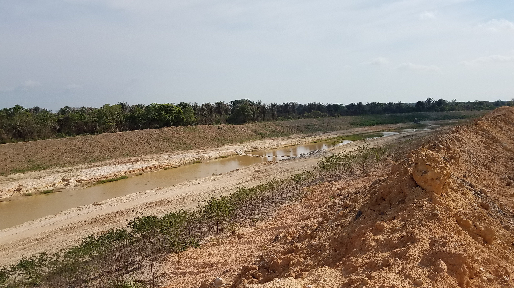
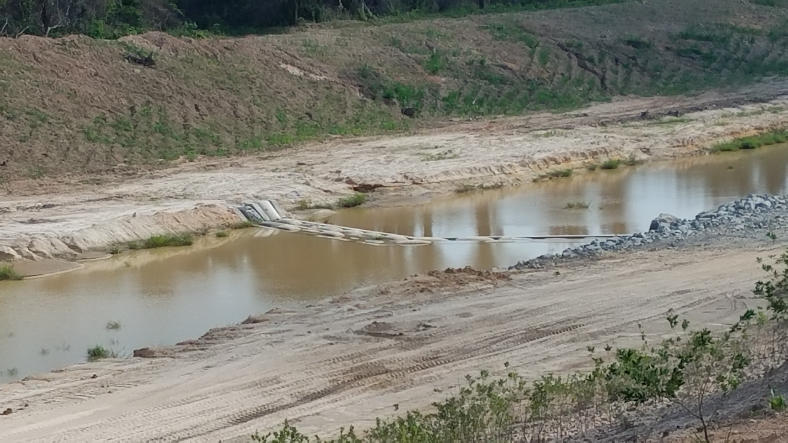

## :globe_with_meridians:Visita Drummond 2018 - Departamento del Cesar - Colombia (varios) (2018-04-25)
`Pictures` rcfdtools <br>`Category` Technical field visit <br>`Location` [Google Maps](http://maps.google.com/maps?q=9.531024,-73.462601) or [Openstreet Map](https://www.openstreetmap.org/query?lat=9.531024&lon=-73.462601) 

```geojson
{
  "type": "Feature",
  "geometry": {
    "type": "Point", 
    "coordinates": [-73.462601, 9.531024]
  }, 
  "properties": {
    "Name": "Visita Drummond 2018 - Departamento del Cesar - Colombia (varios)"
  }
}
```

<br><details><summary>:camera:**37/20180425_140944.jpg**</summary><sub> `Exif version` 0220 `OS version` G930PVPS5BRA1 `Date` 2018:04:25 14:09:44 `Aperture` Not known `Brightness` 8.55 `Color space` 1 `Compression` 6`Exposure mode` 0 `Exposure time` 0.0005694760820045558 `Focal length` 4.2 `Lens model` Not known `Lens specification` Not known `Orientation` 1 `Scene type` Not known `f number` 1.7 `White balance` 0 `Sensing method` 2 `Shutter speed` 10.778</sub></details>

<br><details><summary>:camera:**37/20180425_141126.jpg**</summary><sub> `Exif version` 0220 `OS version` G930PVPS5BRA1 `Date` 2018:04:25 14:11:26 `Aperture` Not known `Brightness` 8.71 `Color space` 1 `Compression` 6`Exposure mode` 0 `Exposure time` 0.0005040322580645161 `Focal length` 4.2 `Lens model` Not known `Lens specification` Not known `Orientation` 1 `Scene type` Not known `f number` 1.7 `White balance` 0 `Sensing method` 2 `Shutter speed` 10.954</sub></details>

<br><details><summary>:camera:**37/20180425_141135.jpg**</summary><sub> `Exif version` 0220 `OS version` G930PVPS5BRA1 `Date` 2018:04:25 14:11:35 `Aperture` Not known `Brightness` 8.59 `Color space` 1 `Compression` 6`Exposure mode` 0 `Exposure time` 0.0005580357142857143 `Focal length` 4.2 `Lens model` Not known `Lens specification` Not known `Orientation` 1 `Scene type` Not known `f number` 1.7 `White balance` 0 `Sensing method` 2 `Shutter speed` 10.807</sub></details>

<br><details><summary>:camera:**37/20180425_141207.jpg**</summary><sub> `Exif version` 0220 `OS version` G930PVPS5BRA1 `Date` 2018:04:25 14:12:07 `Aperture` Not known `Brightness` 8.48 `Color space` 1 `Compression` 6`Exposure mode` 0 `Exposure time` 0.0005813953488372093 `Focal length` 4.2 `Lens model` Not known `Lens specification` Not known `Orientation` 1 `Scene type` Not known `f number` 1.7 `White balance` 0 `Sensing method` 2 `Shutter speed` 10.748</sub></details>

<br><details><summary>:camera:**37/20180425_141212.jpg**</summary><sub> `Exif version` 0220 `OS version` G930PVPS5BRA1 `Date` 2018:04:25 14:12:12 `Aperture` Not known `Brightness` 8.62 `Color space` 1 `Compression` 6`Exposure mode` 0 `Exposure time` 0.0005274261603375527 `Focal length` 4.2 `Lens model` Not known `Lens specification` Not known `Orientation` 1 `Scene type` Not known `f number` 1.7 `White balance` 0 `Sensing method` 2 `Shutter speed` 10.888</sub></details>

<br><details><summary>:camera:**37/20180425_141229.jpg**</summary><sub> `Exif version` 0220 `OS version` G930PVPS5BRA1 `Date` 2018:04:25 14:12:29 `Aperture` Not known `Brightness` 8.72 `Color space` 1 `Compression` 6`Exposure mode` 0 `Exposure time` 0.0005081300813008131 `Focal length` 4.2 `Lens model` Not known `Lens specification` Not known `Orientation` 1 `Scene type` Not known `f number` 1.7 `White balance` 0 `Sensing method` 2 `Shutter speed` 10.942</sub></details>

<br><details><summary>:camera:**37/20180425_141246.jpg**</summary><sub> `Exif version` 0220 `OS version` G930PVPS5BRA1 `Date` 2018:04:25 14:12:46 `Aperture` Not known `Brightness` 8.25 `Color space` 1 `Compression` 6`Exposure mode` 0 `Exposure time` 0.0007022471910112359 `Focal length` 4.2 `Lens model` Not known `Lens specification` Not known `Orientation` 1 `Scene type` Not known `f number` 1.7 `White balance` 0 `Sensing method` 2 `Shutter speed` 10.475</sub></details>

<br><details><summary>:camera:**37/20180425_141340.jpg**</summary><sub> `Exif version` 0220 `OS version` G930PVPS5BRA1 `Date` 2018:04:25 14:13:40 `Aperture` Not known `Brightness` 8.1 `Color space` 1 `Compression` 6`Exposure mode` 0 `Exposure time` 0.000741839762611276 `Focal length` 4.2 `Lens model` Not known `Lens specification` Not known `Orientation` 1 `Scene type` Not known `f number` 1.7 `White balance` 0 `Sensing method` 2 `Shutter speed` 10.396</sub></details>

<br><details><summary>:camera:**37/20180425_141904.jpg**</summary><sub> `Exif version` 0220 `OS version` G930PVPS5BRA1 `Date` 2018:04:25 14:19:03 `Aperture` Not known `Brightness` 8.58 `Color space` 1 `Compression` 6`Exposure mode` 0 `Exposure time` 0.0005787037037037037 `Focal length` 4.2 `Lens model` Not known `Lens specification` Not known `Orientation` 1 `Scene type` Not known `f number` 1.7 `White balance` 0 `Sensing method` 2 `Shutter speed` 10.754</sub></details>

<br><details><summary>:camera:**37/20180425_141907.jpg**</summary><sub> `Exif version` 0220 `OS version` G930PVPS5BRA1 `Date` 2018:04:25 14:19:07 `Aperture` Not known `Brightness` 8.8 `Color space` 1 `Compression` 6`Exposure mode` 0 `Exposure time` 0.0004911591355599214 `Focal length` 4.2 `Lens model` Not known `Lens specification` Not known `Orientation` 1 `Scene type` Not known `f number` 1.7 `White balance` 0 `Sensing method` 2 `Shutter speed` 10.991</sub></details>

<br><details><summary>:camera:**37/20180425_141934.jpg**</summary><sub> `Exif version` 0220 `OS version` G930PVPS5BRA1 `Date` 2018:04:25 14:19:34 `Aperture` Not known `Brightness` 8.45 `Color space` 1 `Compression` 6`Exposure mode` 0 `Exposure time` 0.0006038647342995169 `Focal length` 4.2 `Lens model` Not known `Lens specification` Not known `Orientation` 1 `Scene type` Not known `f number` 1.7 `White balance` 0 `Sensing method` 2 `Shutter speed` 10.693</sub></details>

<br><details><summary>:camera:**37/20180425_141937.jpg**</summary><sub> `Exif version` 0220 `OS version` G930PVPS5BRA1 `Date` 2018:04:25 14:19:37 `Aperture` Not known `Brightness` 8.5 `Color space` 1 `Compression` 6`Exposure mode` 0 `Exposure time` 0.0005720823798627002 `Focal length` 4.2 `Lens model` Not known `Lens specification` Not known `Orientation` 1 `Scene type` Not known `f number` 1.7 `White balance` 0 `Sensing method` 2 `Shutter speed` 10.771</sub></details>

<br><details><summary>:camera:**37/20180425_141940.jpg**</summary><sub> `Exif version` 0220 `OS version` G930PVPS5BRA1 `Date` 2018:04:25 14:19:40 `Aperture` Not known `Brightness` 8.38 `Color space` 1 `Compression` 6`Exposure mode` 0 `Exposure time` 0.000663129973474801 `Focal length` 4.2 `Lens model` Not known `Lens specification` Not known `Orientation` 1 `Scene type` Not known `f number` 1.7 `White balance` 0 `Sensing method` 2 `Shutter speed` 10.558</sub></details>

<br><details><summary>:camera:**37/20180425_141956.jpg**</summary><sub> `Exif version` 0220 `OS version` G930PVPS5BRA1 `Date` 2018:04:25 14:19:56 `Aperture` Not known `Brightness` 8.27 `Color space` 1 `Compression` 6`Exposure mode` 0 `Exposure time` 0.000708215297450425 `Focal length` 4.2 `Lens model` Not known `Lens specification` Not known `Orientation` 1 `Scene type` Not known `f number` 1.7 `White balance` 0 `Sensing method` 2 `Shutter speed` 10.463</sub></details>

<br><details><summary>:camera:**37/20180425_142100.jpg**</summary><sub> `Exif version` 0220 `OS version` G930PVPS5BRA1 `Date` 2018:04:25 14:20:59 `Aperture` Not known `Brightness` Not known `Color space` 1 `Compression` Not known`Exposure mode` 0 `Exposure time` Not known `Focal length` 4.2 `Lens model` Not known `Lens specification` Not known `Orientation` 1 `Scene type` Not known `f number` 1.7 `White balance` 0 `Sensing method` Not known `Shutter speed` Not known</sub></details>

<br><details><summary>:camera:**37/20180425_142133.jpg**</summary><sub> `Exif version` 0220 `OS version` G930PVPS5BRA1 `Date` 2018:04:25 14:21:33 `Aperture` Not known `Brightness` 8.49 `Color space` 1 `Compression` 6`Exposure mode` 0 `Exposure time` 0.0005938242280285036 `Focal length` 4.2 `Lens model` Not known `Lens specification` Not known `Orientation` 1 `Scene type` Not known `f number` 1.7 `White balance` 0 `Sensing method` 2 `Shutter speed` 10.717</sub></details>

<br><details><summary>:camera:**37/20180425_142135.jpg**</summary><sub> `Exif version` 0220 `OS version` G930PVPS5BRA1 `Date` 2018:04:25 14:21:35 `Aperture` Not known `Brightness` 8.43 `Color space` 1 `Compression` 6`Exposure mode` 0 `Exposure time` 0.0006459948320413437 `Focal length` 4.2 `Lens model` Not known `Lens specification` Not known `Orientation` 1 `Scene type` Not known `f number` 1.7 `White balance` 0 `Sensing method` 2 `Shutter speed` 10.596</sub></details>

<br><details><summary>:camera:**37/20180425_142205.jpg**</summary><sub> `Exif version` 0220 `OS version` G930PVPS5BRA1 `Date` 2018:04:25 14:22:04 `Aperture` Not known `Brightness` Not known `Color space` 1 `Compression` Not known`Exposure mode` 0 `Exposure time` Not known `Focal length` 4.2 `Lens model` Not known `Lens specification` Not known `Orientation` 1 `Scene type` Not known `f number` 1.7 `White balance` 0 `Sensing method` Not known `Shutter speed` Not known</sub></details>

<br><details><summary>:camera:**37/20180425_143018.jpg**</summary><sub> `Exif version` 0220 `OS version` G930PVPS5BRA1 `Date` 2018:04:25 14:30:18 `Aperture` Not known `Brightness` 9.1 `Color space` 1 `Compression` 6`Exposure mode` 0 `Exposure time` 0.0003869969040247678 `Focal length` 4.2 `Lens model` Not known `Lens specification` Not known `Orientation` 1 `Scene type` Not known `f number` 1.7 `White balance` 0 `Sensing method` 2 `Shutter speed` 11.335</sub></details>

<br><details><summary>:camera:**37/20180425_143020.jpg**</summary><sub> `Exif version` 0220 `OS version` G930PVPS5BRA1 `Date` 2018:04:25 14:30:20 `Aperture` Not known `Brightness` 8.97 `Color space` 1 `Compression` 6`Exposure mode` 0 `Exposure time` 0.00042517006802721087 `Focal length` 4.2 `Lens model` Not known `Lens specification` Not known `Orientation` 1 `Scene type` Not known `f number` 1.7 `White balance` 0 `Sensing method` 2 `Shutter speed` 11.199</sub></details>

<br><details><summary>:camera:**37/20180425_143023.jpg**</summary><sub> `Exif version` 0220 `OS version` G930PVPS5BRA1 `Date` 2018:04:25 14:30:22 `Aperture` Not known `Brightness` 9.01 `Color space` 1 `Compression` 6`Exposure mode` 0 `Exposure time` 0.00040192926045016077 `Focal length` 4.2 `Lens model` Not known `Lens specification` Not known `Orientation` 1 `Scene type` Not known `f number` 1.7 `White balance` 0 `Sensing method` 2 `Shutter speed` 11.28</sub></details>

<br><details><summary>:camera:**37/20180425_144251.jpg**</summary><sub> `Exif version` 0220 `OS version` G930PVPS5BRA1 `Date` 2018:04:25 14:42:51 `Aperture` Not known `Brightness` 9.45 `Color space` 1 `Compression` 6`Exposure mode` 0 `Exposure time` 0.00029481132075471697 `Focal length` 4.2 `Lens model` Not known `Lens specification` Not known `Orientation` 1 `Scene type` Not known `f number` 1.7 `White balance` 0 `Sensing method` 2 `Shutter speed` 11.727</sub></details>

<br><details><summary>:camera:**37/20180425_144347.jpg**</summary><sub> `Exif version` 0220 `OS version` G930PVPS5BRA1 `Date` 2018:04:25 14:43:47 `Aperture` Not known `Brightness` 9.58 `Color space` 1 `Compression` 6`Exposure mode` 0 `Exposure time` 0.0002860411899313501 `Focal length` 4.2 `Lens model` Not known `Lens specification` Not known `Orientation` 1 `Scene type` Not known `f number` 1.7 `White balance` 0 `Sensing method` 2 `Shutter speed` 11.771</sub></details>

<br><details><summary>:camera:**37/20180425_144352.jpg**</summary><sub> `Exif version` 0220 `OS version` G930PVPS5BRA1 `Date` 2018:04:25 14:43:52 `Aperture` Not known `Brightness` 9.63 `Color space` 1 `Compression` 6`Exposure mode` 0 `Exposure time` 0.00027839643652561246 `Focal length` 4.2 `Lens model` Not known `Lens specification` Not known `Orientation` 1 `Scene type` Not known `f number` 1.7 `White balance` 0 `Sensing method` 2 `Shutter speed` 11.81</sub></details>

<br><details><summary>:camera:**37/20180425_144418.jpg**</summary><sub> `Exif version` 0220 `OS version` G930PVPS5BRA1 `Date` 2018:04:25 14:44:18 `Aperture` Not known `Brightness` 9.57 `Color space` 1 `Compression` 6`Exposure mode` 0 `Exposure time` 0.0002759381898454746 `Focal length` 4.2 `Lens model` Not known `Lens specification` Not known `Orientation` 1 `Scene type` Not known `f number` 1.7 `White balance` 0 `Sensing method` 2 `Shutter speed` 11.823</sub></details>

<br><details><summary>:camera:**37/20180425_144421.jpg**</summary><sub> `Exif version` 0220 `OS version` G930PVPS5BRA1 `Date` 2018:04:25 14:44:21 `Aperture` Not known `Brightness` 9.69 `Color space` 1 `Compression` 6`Exposure mode` 0 `Exposure time` 0.0002670940170940171 `Focal length` 4.2 `Lens model` Not known `Lens specification` Not known `Orientation` 1 `Scene type` Not known `f number` 1.7 `White balance` 0 `Sensing method` 2 `Shutter speed` 11.87</sub></details>

<br><details><summary>:camera:**37/20180425_144427.jpg**</summary><sub> `Exif version` 0220 `OS version` G930PVPS5BRA1 `Date` 2018:04:25 14:44:27 `Aperture` Not known `Brightness` 9.13 `Color space` 1 `Compression` 6`Exposure mode` 0 `Exposure time` 0.00037313432835820896 `Focal length` 4.2 `Lens model` Not known `Lens specification` Not known `Orientation` 1 `Scene type` Not known `f number` 1.7 `White balance` 0 `Sensing method` 2 `Shutter speed` 11.388</sub></details>

<br><details><summary>:camera:**37/20180425_144429.jpg**</summary><sub> `Exif version` 0220 `OS version` G930PVPS5BRA1 `Date` 2018:04:25 14:44:29 `Aperture` Not known `Brightness` 9.05 `Color space` 1 `Compression` 6`Exposure mode` 0 `Exposure time` 0.0004152823920265781 `Focal length` 4.2 `Lens model` Not known `Lens specification` Not known `Orientation` 1 `Scene type` Not known `f number` 1.7 `White balance` 0 `Sensing method` 2 `Shutter speed` 11.233</sub></details>

<br><details><summary>:camera:**37/20180425_144453.jpg**</summary><sub> `Exif version` 0220 `OS version` G930PVPS5BRA1 `Date` 2018:04:25 14:44:52 `Aperture` Not known `Brightness` Not known `Color space` 1 `Compression` Not known`Exposure mode` 0 `Exposure time` Not known `Focal length` 4.2 `Lens model` Not known `Lens specification` Not known `Orientation` 1 `Scene type` Not known `f number` 1.7 `White balance` 0 `Sensing method` Not known `Shutter speed` Not known</sub></details>

<br><details><summary>:camera:**37/20180425_144518.jpg**</summary><sub> `Exif version` 0220 `OS version` G930PVPS5BRA1 `Date` 2018:04:25 14:45:18 `Aperture` Not known `Brightness` 9.28 `Color space` 1 `Compression` 6`Exposure mode` 0 `Exposure time` 0.00035816618911174784 `Focal length` 4.2 `Lens model` Not known `Lens specification` Not known `Orientation` 1 `Scene type` Not known `f number` 1.7 `White balance` 0 `Sensing method` 2 `Shutter speed` 11.447</sub></details>

<br><details><summary>:camera:**37/20180425_144527.jpg**</summary><sub> `Exif version` 0220 `OS version` G930PVPS5BRA1 `Date` 2018:04:25 14:45:27 `Aperture` Not known `Brightness` 9.14 `Color space` 1 `Compression` 6`Exposure mode` 0 `Exposure time` 0.0003676470588235294 `Focal length` 4.2 `Lens model` Not known `Lens specification` Not known `Orientation` 1 `Scene type` Not known `f number` 1.7 `White balance` 0 `Sensing method` 2 `Shutter speed` 11.409</sub></details>

<br><details><summary>:camera:**37/20180425_144532.jpg**</summary><sub> `Exif version` 0220 `OS version` G930PVPS5BRA1 `Date` 2018:04:25 14:45:31 `Aperture` Not known `Brightness` 8.96 `Color space` 1 `Compression` 6`Exposure mode` 0 `Exposure time` 0.0004280821917808219 `Focal length` 4.2 `Lens model` Not known `Lens specification` Not known `Orientation` 1 `Scene type` Not known `f number` 1.7 `White balance` 0 `Sensing method` 2 `Shutter speed` 11.189</sub></details>

<br><details><summary>:camera:**37/20180425_144555.jpg**</summary><sub> `Exif version` 0220 `OS version` G930PVPS5BRA1 `Date` 2018:04:25 14:45:54 `Aperture` Not known `Brightness` Not known `Color space` 1 `Compression` Not known`Exposure mode` 0 `Exposure time` Not known `Focal length` 4.2 `Lens model` Not known `Lens specification` Not known `Orientation` 1 `Scene type` Not known `f number` 1.7 `White balance` 0 `Sensing method` Not known `Shutter speed` Not known</sub></details>

<br><details><summary>:camera:**37/20180425_144605.jpg**</summary><sub> `Exif version` 0220 `OS version` G930PVPS5BRA1 `Date` 2018:04:25 14:46:05 `Aperture` Not known `Brightness` 9.07 `Color space` 1 `Compression` 6`Exposure mode` 0 `Exposure time` 0.00037764350453172205 `Focal length` 4.2 `Lens model` Not known `Lens specification` Not known `Orientation` 1 `Scene type` Not known `f number` 1.7 `White balance` 0 `Sensing method` 2 `Shutter speed` 11.37</sub></details>

<br><details><summary>:camera:**37/20180425_144716.jpg**</summary><sub> `Exif version` 0220 `OS version` G930PVPS5BRA1 `Date` 2018:04:25 14:47:16 `Aperture` Not known `Brightness` 8.69 `Color space` 1 `Compression` 6`Exposure mode` 0 `Exposure time` 0.00049800796812749 `Focal length` 4.2 `Lens model` Not known `Lens specification` Not known `Orientation` 1 `Scene type` Not known `f number` 1.7 `White balance` 0 `Sensing method` 2 `Shutter speed` 10.971</sub></details>

<br><details><summary>:camera:**37/20180425_144729.jpg**</summary><sub> `Exif version` 0220 `OS version` G930PVPS5BRA1 `Date` 2018:04:25 14:47:29 `Aperture` Not known `Brightness` 9.07 `Color space` 1 `Compression` 6`Exposure mode` 0 `Exposure time` 0.00040584415584415587 `Focal length` 4.2 `Lens model` Not known `Lens specification` Not known `Orientation` 1 `Scene type` Not known `f number` 1.7 `White balance` 0 `Sensing method` 2 `Shutter speed` 11.266</sub></details>

<br><details><summary>:camera:**37/20180425_144734.jpg**</summary><sub> `Exif version` 0220 `OS version` G930PVPS5BRA1 `Date` 2018:04:25 14:47:34 `Aperture` Not known `Brightness` 6.67 `Color space` 1 `Compression` 6`Exposure mode` 0 `Exposure time` 0.002074688796680498 `Focal length` 4.2 `Lens model` Not known `Lens specification` Not known `Orientation` 1 `Scene type` Not known `f number` 1.7 `White balance` 0 `Sensing method` 2 `Shutter speed` 8.912</sub></details>

<br><details><summary>:camera:**37/20180425_144739.jpg**</summary><sub> `Exif version` 0220 `OS version` G930PVPS5BRA1 `Date` 2018:04:25 14:47:39 `Aperture` Not known `Brightness` 7.23 `Color space` 1 `Compression` 6`Exposure mode` 0 `Exposure time` 0.0013736263736263737 `Focal length` 4.2 `Lens model` Not known `Lens specification` Not known `Orientation` 6 `Scene type` Not known `f number` 1.7 `White balance` 0 `Sensing method` 2 `Shutter speed` 9.507</sub></details>

<br><details><summary>:camera:**37/20180425_145349.jpg**</summary><sub> `Exif version` 0220 `OS version` G930PVPS5BRA1 `Date` 2018:04:25 14:53:49 `Aperture` Not known `Brightness` 10.45 `Color space` 1 `Compression` 6`Exposure mode` 0 `Exposure time` 0.0001539408866995074 `Focal length` 4.2 `Lens model` Not known `Lens specification` Not known `Orientation` 1 `Scene type` Not known `f number` 1.7 `White balance` 0 `Sensing method` 2 `Shutter speed` 12.665</sub></details>

<br><details><summary>:camera:**37/20180425_145355.jpg**</summary><sub> `Exif version` 0220 `OS version` G930PVPS5BRA1 `Date` 2018:04:25 14:53:54 `Aperture` Not known `Brightness` 9.44 `Color space` 1 `Compression` 6`Exposure mode` 0 `Exposure time` 0.0003026634382566586 `Focal length` 4.2 `Lens model` Not known `Lens specification` Not known `Orientation` 1 `Scene type` Not known `f number` 1.7 `White balance` 0 `Sensing method` 2 `Shutter speed` 11.689</sub></details>

<br><details><summary>:camera:**37/20180425_145356.jpg**</summary><sub> `Exif version` 0220 `OS version` G930PVPS5BRA1 `Date` 2018:04:25 14:53:56 `Aperture` Not known `Brightness` 9.3 `Color space` 1 `Compression` 6`Exposure mode` 0 `Exposure time` 0.0003405994550408719 `Focal length` 4.2 `Lens model` Not known `Lens specification` Not known `Orientation` 1 `Scene type` Not known `f number` 1.7 `White balance` 0 `Sensing method` 2 `Shutter speed` 11.519</sub></details>

<br><details><summary>:camera:**37/20180425_145359.jpg**</summary><sub> `Exif version` 0220 `OS version` G930PVPS5BRA1 `Date` 2018:04:25 14:53:59 `Aperture` Not known `Brightness` 9.58 `Color space` 1 `Compression` 6`Exposure mode` 0 `Exposure time` 0.00027901785714285713 `Focal length` 4.2 `Lens model` Not known `Lens specification` Not known `Orientation` 1 `Scene type` Not known `f number` 1.7 `White balance` 0 `Sensing method` 2 `Shutter speed` 11.807</sub></details>

<br><details><summary>:camera:**37/20180425_145401.jpg**</summary><sub> `Exif version` 0220 `OS version` G930PVPS5BRA1 `Date` 2018:04:25 14:54:01 `Aperture` Not known `Brightness` 10.23 `Color space` 1 `Compression` 6`Exposure mode` 0 `Exposure time` 0.0001827485380116959 `Focal length` 4.2 `Lens model` Not known `Lens specification` Not known `Orientation` 1 `Scene type` Not known `f number` 1.7 `White balance` 0 `Sensing method` 2 `Shutter speed` 12.417</sub></details>

<br><details><summary>:camera:**37/20180425_145404.jpg**</summary><sub> `Exif version` 0220 `OS version` G930PVPS5BRA1 `Date` 2018:04:25 14:54:04 `Aperture` Not known `Brightness` 9.48 `Color space` 1 `Compression` 6`Exposure mode` 0 `Exposure time` 0.0002983293556085919 `Focal length` 4.2 `Lens model` Not known `Lens specification` Not known `Orientation` 1 `Scene type` Not known `f number` 1.7 `White balance` 0 `Sensing method` 2 `Shutter speed` 11.71</sub></details>

<br><details><summary>:camera:**37/20180425_145413.jpg**</summary><sub> `Exif version` 0220 `OS version` G930PVPS5BRA1 `Date` 2018:04:25 14:54:13 `Aperture` Not known `Brightness` 10.41 `Color space` 1 `Compression` 6`Exposure mode` 0 `Exposure time` 0.0001481042654028436 `Focal length` 4.2 `Lens model` Not known `Lens specification` Not known `Orientation` 1 `Scene type` Not known `f number` 1.7 `White balance` 0 `Sensing method` 2 `Shutter speed` 12.721</sub></details>

<br><details><summary>:camera:**37/20180425_150251.jpg**</summary><sub> `Exif version` 0220 `OS version` G930PVPS5BRA1 `Date` 2018:04:25 15:02:51 `Aperture` Not known `Brightness` 9.19 `Color space` 1 `Compression` 6`Exposure mode` 0 `Exposure time` 0.00037313432835820896 `Focal length` 4.2 `Lens model` Not known `Lens specification` Not known `Orientation` 1 `Scene type` Not known `f number` 1.7 `White balance` 0 `Sensing method` 2 `Shutter speed` 11.388</sub></details>

<br><details><summary>:camera:**37/20180425_150253.jpg**</summary><sub> `Exif version` 0220 `OS version` G930PVPS5BRA1 `Date` 2018:04:25 15:02:53 `Aperture` Not known `Brightness` 9.13 `Color space` 1 `Compression` 6`Exposure mode` 0 `Exposure time` 0.0003846153846153846 `Focal length` 4.2 `Lens model` Not known `Lens specification` Not known `Orientation` 1 `Scene type` Not known `f number` 1.7 `White balance` 0 `Sensing method` 2 `Shutter speed` 11.344</sub></details>

<br><details><summary>:camera:**37/20180425_150255.jpg**</summary><sub> `Exif version` 0220 `OS version` G930PVPS5BRA1 `Date` 2018:04:25 15:02:55 `Aperture` Not known `Brightness` 9.1 `Color space` 1 `Compression` 6`Exposure mode` 0 `Exposure time` 0.0004084967320261438 `Focal length` 4.2 `Lens model` Not known `Lens specification` Not known `Orientation` 6 `Scene type` Not known `f number` 1.7 `White balance` 0 `Sensing method` 2 `Shutter speed` 11.257</sub></details>

<br><details><summary>:camera:**37/20180425_150259.jpg**</summary><sub> `Exif version` 0220 `OS version` G930PVPS5BRA1 `Date` 2018:04:25 15:02:59 `Aperture` Not known `Brightness` 8.39 `Color space` 1 `Compression` 6`Exposure mode` 0 `Exposure time` 0.0006720430107526882 `Focal length` 4.2 `Lens model` Not known `Lens specification` Not known `Orientation` 1 `Scene type` Not known `f number` 1.7 `White balance` 0 `Sensing method` 2 `Shutter speed` 10.539</sub></details>

<br><details><summary>:camera:**37/20180425_150307.jpg**</summary><sub> `Exif version` 0220 `OS version` G930PVPS5BRA1 `Date` 2018:04:25 15:03:07 `Aperture` Not known `Brightness` 7.86 `Color space` 1 `Compression` 6`Exposure mode` 0 `Exposure time` 0.0009328358208955224 `Focal length` 4.2 `Lens model` Not known `Lens specification` Not known `Orientation` 1 `Scene type` Not known `f number` 1.7 `White balance` 0 `Sensing method` 2 `Shutter speed` 10.066</sub></details>

<br><details><summary>:camera:**37/20180425_150321.jpg**</summary><sub> `Exif version` 0220 `OS version` G930PVPS5BRA1 `Date` 2018:04:25 15:03:21 `Aperture` Not known `Brightness` 8.91 `Color space` 1 `Compression` 6`Exposure mode` 0 `Exposure time` 0.00043402777777777775 `Focal length` 4.2 `Lens model` Not known `Lens specification` Not known `Orientation` 1 `Scene type` Not known `f number` 1.7 `White balance` 0 `Sensing method` 2 `Shutter speed` 11.169</sub></details>

<br><details><summary>:camera:**37/20180425_150325.jpg**</summary><sub> `Exif version` 0220 `OS version` G930PVPS5BRA1 `Date` 2018:04:25 15:03:25 `Aperture` Not known `Brightness` 8.45 `Color space` 1 `Compression` 6`Exposure mode` 0 `Exposure time` 0.0006097560975609756 `Focal length` 4.2 `Lens model` Not known `Lens specification` Not known `Orientation` 1 `Scene type` Not known `f number` 1.7 `White balance` 0 `Sensing method` 2 `Shutter speed` 10.679</sub></details>

<br><details><summary>:camera:**37/20180425_150455.jpg**</summary><sub> `Exif version` 0220 `OS version` G930PVPS5BRA1 `Date` 2018:04:25 15:04:55 `Aperture` Not known `Brightness` 9.25 `Color space` 1 `Compression` 6`Exposure mode` 0 `Exposure time` 0.00035714285714285714 `Focal length` 4.2 `Lens model` Not known `Lens specification` Not known `Orientation` 1 `Scene type` Not known `f number` 1.7 `White balance` 0 `Sensing method` 2 `Shutter speed` 11.451</sub></details>

<br><details><summary>:camera:**37/20180425_150500.jpg**</summary><sub> `Exif version` 0220 `OS version` G930PVPS5BRA1 `Date` 2018:04:25 15:05:00 `Aperture` Not known `Brightness` 9.05 `Color space` 1 `Compression` 6`Exposure mode` 0 `Exposure time` 0.00039556962025316455 `Focal length` 4.2 `Lens model` Not known `Lens specification` Not known `Orientation` 1 `Scene type` Not known `f number` 1.7 `White balance` 0 `Sensing method` 2 `Shutter speed` 11.303</sub></details>

<br><details><summary>:camera:**37/20180425_150507.jpg**</summary><sub> `Exif version` 0220 `OS version` G930PVPS5BRA1 `Date` 2018:04:25 15:05:07 `Aperture` Not known `Brightness` 9.18 `Color space` 1 `Compression` 6`Exposure mode` 0 `Exposure time` 0.0003687315634218289 `Focal length` 4.2 `Lens model` Not known `Lens specification` Not known `Orientation` 1 `Scene type` Not known `f number` 1.7 `White balance` 0 `Sensing method` 2 `Shutter speed` 11.405</sub></details>

<br><details><summary>:camera:**37/20180425_150509.jpg**</summary><sub> `Exif version` 0220 `OS version` G930PVPS5BRA1 `Date` 2018:04:25 15:05:09 `Aperture` Not known `Brightness` 9.38 `Color space` 1 `Compression` 6`Exposure mode` 0 `Exposure time` 0.0003117206982543641 `Focal length` 4.2 `Lens model` Not known `Lens specification` Not known `Orientation` 1 `Scene type` Not known `f number` 1.7 `White balance` 0 `Sensing method` 2 `Shutter speed` 11.647</sub></details>

<br><details><summary>:camera:**37/20180425_150531.jpg**</summary><sub> `Exif version` 0220 `OS version` G930PVPS5BRA1 `Date` 2018:04:25 15:05:31 `Aperture` Not known `Brightness` Not known `Color space` 1 `Compression` Not known`Exposure mode` 0 `Exposure time` Not known `Focal length` 4.2 `Lens model` Not known `Lens specification` Not known `Orientation` 1 `Scene type` Not known `f number` 1.7 `White balance` 0 `Sensing method` Not known `Shutter speed` Not known</sub></details>

<br><details><summary>:camera:**37/20180425_151707.jpg**</summary><sub> `Exif version` 0220 `OS version` G930PVPS5BRA1 `Date` 2018:04:25 15:17:07 `Aperture` Not known `Brightness` 9.12 `Color space` 1 `Compression` 6`Exposure mode` 0 `Exposure time` 0.00040192926045016077 `Focal length` 4.2 `Lens model` Not known `Lens specification` Not known `Orientation` 1 `Scene type` Not known `f number` 1.7 `White balance` 0 `Sensing method` 2 `Shutter speed` 11.28</sub></details>

<br><details><summary>:camera:**37/20180425_152015.jpg**</summary><sub> `Exif version` 0220 `OS version` G930PVPS5BRA1 `Date` 2018:04:25 15:20:15 `Aperture` Not known `Brightness` 9.52 `Color space` 1 `Compression` 6`Exposure mode` 0 `Exposure time` 0.0002808988764044944 `Focal length` 4.2 `Lens model` Not known `Lens specification` Not known `Orientation` 6 `Scene type` Not known `f number` 1.7 `White balance` 0 `Sensing method` 2 `Shutter speed` 11.797</sub></details>

<br><details><summary>:camera:**37/20180425_152018.jpg**</summary><sub> `Exif version` 0220 `OS version` G930PVPS5BRA1 `Date` 2018:04:25 15:20:18 `Aperture` Not known `Brightness` 9.51 `Color space` 1 `Compression` 6`Exposure mode` 0 `Exposure time` 0.0002860411899313501 `Focal length` 4.2 `Lens model` Not known `Lens specification` Not known `Orientation` 1 `Scene type` Not known `f number` 1.7 `White balance` 0 `Sensing method` 2 `Shutter speed` 11.771</sub></details>

<br><details><summary>:camera:**37/20180425_152022.jpg**</summary><sub> `Exif version` 0220 `OS version` G930PVPS5BRA1 `Date` 2018:04:25 15:20:22 `Aperture` Not known `Brightness` 9.54 `Color space` 1 `Compression` 6`Exposure mode` 0 `Exposure time` 0.0002765486725663717 `Focal length` 4.2 `Lens model` Not known `Lens specification` Not known `Orientation` 1 `Scene type` Not known `f number` 1.7 `White balance` 0 `Sensing method` 2 `Shutter speed` 11.82</sub></details>

<br><details><summary>:camera:**37/20180425_152024.jpg**</summary><sub> `Exif version` 0220 `OS version` G930PVPS5BRA1 `Date` 2018:04:25 15:20:24 `Aperture` Not known `Brightness` 9.54 `Color space` 1 `Compression` 6`Exposure mode` 0 `Exposure time` 0.0002962085308056872 `Focal length` 4.2 `Lens model` Not known `Lens specification` Not known `Orientation` 1 `Scene type` Not known `f number` 1.7 `White balance` 0 `Sensing method` 2 `Shutter speed` 11.721</sub></details>

<br><details><summary>:camera:**37/20180425_152026.jpg**</summary><sub> `Exif version` 0220 `OS version` G930PVPS5BRA1 `Date` 2018:04:25 15:20:26 `Aperture` Not known `Brightness` 9.33 `Color space` 1 `Compression` 6`Exposure mode` 0 `Exposure time` 0.0003405994550408719 `Focal length` 4.2 `Lens model` Not known `Lens specification` Not known `Orientation` 1 `Scene type` Not known `f number` 1.7 `White balance` 0 `Sensing method` 2 `Shutter speed` 11.519</sub></details>

<br><details><summary>:camera:**37/20180425_152031.jpg**</summary><sub> `Exif version` 0220 `OS version` G930PVPS5BRA1 `Date` 2018:04:25 15:20:31 `Aperture` Not known `Brightness` Not known `Color space` 1 `Compression` Not known`Exposure mode` 0 `Exposure time` Not known `Focal length` 4.2 `Lens model` Not known `Lens specification` Not known `Orientation` 1 `Scene type` Not known `f number` 1.7 `White balance` 0 `Sensing method` Not known `Shutter speed` Not known</sub></details>

<br><details><summary>:camera:**37/20180425_152115.jpg**</summary><sub> `Exif version` 0220 `OS version` G930PVPS5BRA1 `Date` 2018:04:25 15:21:15 `Aperture` Not known `Brightness` 9.58 `Color space` 1 `Compression` 6`Exposure mode` 0 `Exposure time` 0.0002900232018561485 `Focal length` 4.2 `Lens model` Not known `Lens specification` Not known `Orientation` 1 `Scene type` Not known `f number` 1.7 `White balance` 0 `Sensing method` 2 `Shutter speed` 11.751</sub></details>

<br><details><summary>:camera:**37/20180425_152119.jpg**</summary><sub> `Exif version` 0220 `OS version` G930PVPS5BRA1 `Date` 2018:04:25 15:21:19 `Aperture` Not known `Brightness` Not known `Color space` 1 `Compression` Not known`Exposure mode` 0 `Exposure time` Not known `Focal length` 4.2 `Lens model` Not known `Lens specification` Not known `Orientation` 1 `Scene type` Not known `f number` 1.7 `White balance` 0 `Sensing method` Not known `Shutter speed` Not known</sub></details>

<br><details><summary>:camera:**37/20180425_152213.jpg**</summary><sub> `Exif version` 0220 `OS version` G930PVPS5BRA1 `Date` 2018:04:25 15:22:13 `Aperture` Not known `Brightness` 7.94 `Color space` 1 `Compression` 6`Exposure mode` 0 `Exposure time` 0.0008960573476702509 `Focal length` 4.2 `Lens model` Not known `Lens specification` Not known `Orientation` 1 `Scene type` Not known `f number` 1.7 `White balance` 0 `Sensing method` 2 `Shutter speed` 10.124</sub></details>

<br><details><summary>:camera:**37/20180425_152216.jpg**</summary><sub> `Exif version` 0220 `OS version` G930PVPS5BRA1 `Date` 2018:04:25 15:22:16 `Aperture` Not known `Brightness` 8.69 `Color space` 1 `Compression` 6`Exposure mode` 0 `Exposure time` 0.0005263157894736842 `Focal length` 4.2 `Lens model` Not known `Lens specification` Not known `Orientation` 1 `Scene type` Not known `f number` 1.7 `White balance` 0 `Sensing method` 2 `Shutter speed` 10.891</sub></details>

<br><details><summary>:camera:**37/20180425_152512.jpg**</summary><sub> `Exif version` 0220 `OS version` G930PVPS5BRA1 `Date` 2018:04:25 15:25:12 `Aperture` Not known `Brightness` 8.98 `Color space` 1 `Compression` 6`Exposure mode` 0 `Exposure time` 0.0004222972972972973 `Focal length` 4.2 `Lens model` Not known `Lens specification` Not known `Orientation` 1 `Scene type` Not known `f number` 1.7 `White balance` 0 `Sensing method` 2 `Shutter speed` 11.209</sub></details>

<br><details><summary>:camera:**37/20180425_152517.jpg**</summary><sub> `Exif version` 0220 `OS version` G930PVPS5BRA1 `Date` 2018:04:25 15:25:17 `Aperture` Not known `Brightness` 9.22 `Color space` 1 `Compression` 6`Exposure mode` 0 `Exposure time` 0.0003453038674033149 `Focal length` 4.2 `Lens model` Not known `Lens specification` Not known `Orientation` 1 `Scene type` Not known `f number` 1.7 `White balance` 0 `Sensing method` 2 `Shutter speed` 11.499</sub></details>

<br><details><summary>:camera:**37/20180425_152526.jpg**</summary><sub> `Exif version` 0220 `OS version` G930PVPS5BRA1 `Date` 2018:04:25 15:25:26 `Aperture` Not known `Brightness` 9.1 `Color space` 1 `Compression` 6`Exposure mode` 0 `Exposure time` 0.00039936102236421724 `Focal length` 4.2 `Lens model` Not known `Lens specification` Not known `Orientation` 1 `Scene type` Not known `f number` 1.7 `White balance` 0 `Sensing method` 2 `Shutter speed` 11.29</sub></details>

<br><details><summary>:camera:**37/20180425_152531.jpg**</summary><sub> `Exif version` 0220 `OS version` G930PVPS5BRA1 `Date` 2018:04:25 15:25:31 `Aperture` Not known `Brightness` Not known `Color space` 1 `Compression` Not known`Exposure mode` 0 `Exposure time` Not known `Focal length` 4.2 `Lens model` Not known `Lens specification` Not known `Orientation` 1 `Scene type` Not known `f number` 1.7 `White balance` 0 `Sensing method` Not known `Shutter speed` Not known</sub></details>

<br><details><summary>:camera:**37/20180425_152539.jpg**</summary><sub> `Exif version` 0220 `OS version` G930PVPS5BRA1 `Date` 2018:04:25 15:25:39 `Aperture` Not known `Brightness` 9.16 `Color space` 1 `Compression` 6`Exposure mode` 0 `Exposure time` 0.0003654970760233918 `Focal length` 4.2 `Lens model` Not known `Lens specification` Not known `Orientation` 1 `Scene type` Not known `f number` 1.7 `White balance` 0 `Sensing method` 2 `Shutter speed` 11.417</sub></details>

<br><details><summary>:camera:**37/20180425_152629.jpg**</summary><sub> `Exif version` 0220 `OS version` G930PVPS5BRA1 `Date` 2018:04:25 15:26:28 `Aperture` Not known `Brightness` Not known `Color space` 1 `Compression` Not known`Exposure mode` 0 `Exposure time` Not known `Focal length` 4.2 `Lens model` Not known `Lens specification` Not known `Orientation` 1 `Scene type` Not known `f number` 1.7 `White balance` 0 `Sensing method` Not known `Shutter speed` Not known</sub></details>

<br><details><summary>:camera:**37/20180425_152719.jpg**</summary><sub> `Exif version` 0220 `OS version` G930PVPS5BRA1 `Date` 2018:04:25 15:27:19 `Aperture` Not known `Brightness` 9.1 `Color space` 1 `Compression` 6`Exposure mode` 0 `Exposure time` 0.000390625 `Focal length` 4.2 `Lens model` Not known `Lens specification` Not known `Orientation` 1 `Scene type` Not known `f number` 1.7 `White balance` 0 `Sensing method` 2 `Shutter speed` 11.321</sub></details>

<br><details><summary>:camera:**37/20180425_152723.jpg**</summary><sub> `Exif version` 0220 `OS version` G930PVPS5BRA1 `Date` 2018:04:25 15:27:23 `Aperture` Not known `Brightness` Not known `Color space` 1 `Compression` Not known`Exposure mode` 0 `Exposure time` Not known `Focal length` 4.2 `Lens model` Not known `Lens specification` Not known `Orientation` 1 `Scene type` Not known `f number` 1.7 `White balance` 0 `Sensing method` Not known `Shutter speed` Not known</sub></details>

<br><details><summary>:camera:**37/20180425_153003.jpg**</summary><sub> `Exif version` 0220 `OS version` G930PVPS5BRA1 `Date` 2018:04:25 15:30:03 `Aperture` Not known `Brightness` 7.48 `Color space` 1 `Compression` 6`Exposure mode` 0 `Exposure time` 0.0012254901960784314 `Focal length` 4.2 `Lens model` Not known `Lens specification` Not known `Orientation` 1 `Scene type` Not known `f number` 1.7 `White balance` 0 `Sensing method` 2 `Shutter speed` 9.672</sub></details>

<br><details><summary>:camera:**37/20180425_153006.jpg**</summary><sub> `Exif version` 0220 `OS version` G930PVPS5BRA1 `Date` 2018:04:25 15:30:06 `Aperture` Not known `Brightness` 8.6 `Color space` 1 `Compression` 6`Exposure mode` 0 `Exposure time` 0.0005580357142857143 `Focal length` 4.2 `Lens model` Not known `Lens specification` Not known `Orientation` 1 `Scene type` Not known `f number` 1.7 `White balance` 0 `Sensing method` 2 `Shutter speed` 10.807</sub></details>

<br><details><summary>:camera:**37/20180425_153010.jpg**</summary><sub> `Exif version` 0220 `OS version` G930PVPS5BRA1 `Date` 2018:04:25 15:30:10 `Aperture` Not known `Brightness` 8.41 `Color space` 1 `Compression` 6`Exposure mode` 0 `Exposure time` 0.0006377551020408163 `Focal length` 4.2 `Lens model` Not known `Lens specification` Not known `Orientation` 1 `Scene type` Not known `f number` 1.7 `White balance` 0 `Sensing method` 2 `Shutter speed` 10.614</sub></details>

<br><details><summary>:camera:**37/20180425_153035.jpg**</summary><sub> `Exif version` 0220 `OS version` G930PVPS5BRA1 `Date` 2018:04:25 15:30:35 `Aperture` Not known `Brightness` 8.68 `Color space` 1 `Compression` 6`Exposure mode` 0 `Exposure time` 0.0005175983436853002 `Focal length` 4.2 `Lens model` Not known `Lens specification` Not known `Orientation` 1 `Scene type` Not known `f number` 1.7 `White balance` 0 `Sensing method` 2 `Shutter speed` 10.915</sub></details>

<br><details><summary>:camera:**37/20180425_153038.jpg**</summary><sub> `Exif version` 0220 `OS version` G930PVPS5BRA1 `Date` 2018:04:25 15:30:38 `Aperture` Not known `Brightness` 8.48 `Color space` 1 `Compression` 6`Exposure mode` 0 `Exposure time` 0.0005966587112171838 `Focal length` 4.2 `Lens model` Not known `Lens specification` Not known `Orientation` 1 `Scene type` Not known `f number` 1.7 `White balance` 0 `Sensing method` 2 `Shutter speed` 10.71</sub></details>

<br><details><summary>:camera:**37/20180425_153049.jpg**</summary><sub> `Exif version` 0220 `OS version` G930PVPS5BRA1 `Date` 2018:04:25 15:30:49 `Aperture` Not known `Brightness` 9.01 `Color space` 1 `Compression` 6`Exposure mode` 0 `Exposure time` 0.00043252595155709344 `Focal length` 4.2 `Lens model` Not known `Lens specification` Not known `Orientation` 1 `Scene type` Not known `f number` 1.7 `White balance` 0 `Sensing method` 2 `Shutter speed` 11.174</sub></details>

<br><details><summary>:camera:**37/20180425_153142.jpg**</summary><sub> `Exif version` 0220 `OS version` G930PVPS5BRA1 `Date` 2018:04:25 15:31:42 `Aperture` Not known `Brightness` 9.16 `Color space` 1 `Compression` 6`Exposure mode` 0 `Exposure time` 0.0003869969040247678 `Focal length` 4.2 `Lens model` Not known `Lens specification` Not known `Orientation` 1 `Scene type` Not known `f number` 1.7 `White balance` 0 `Sensing method` 2 `Shutter speed` 11.335</sub></details>

<br><details><summary>:camera:**37/20180425_153148.jpg**</summary><sub> `Exif version` 0220 `OS version` G930PVPS5BRA1 `Date` 2018:04:25 15:31:48 `Aperture` Not known `Brightness` 8.94 `Color space` 1 `Compression` 6`Exposure mode` 0 `Exposure time` 0.0004512635379061372 `Focal length` 4.2 `Lens model` Not known `Lens specification` Not known `Orientation` 1 `Scene type` Not known `f number` 1.7 `White balance` 0 `Sensing method` 2 `Shutter speed` 11.113</sub></details>

<br><details><summary>:camera:**37/20180425_153156.jpg**</summary><sub> `Exif version` 0220 `OS version` G930PVPS5BRA1 `Date` 2018:04:25 15:31:56 `Aperture` Not known `Brightness` 9.08 `Color space` 1 `Compression` 6`Exposure mode` 0 `Exposure time` 0.0004084967320261438 `Focal length` 4.2 `Lens model` Not known `Lens specification` Not known `Orientation` 1 `Scene type` Not known `f number` 1.7 `White balance` 0 `Sensing method` 2 `Shutter speed` 11.257</sub></details>

<br><details><summary>:camera:**37/20180425_153207.jpg**</summary><sub> `Exif version` 0220 `OS version` G930PVPS5BRA1 `Date` 2018:04:25 15:32:07 `Aperture` Not known `Brightness` 9.4 `Color space` 1 `Compression` 6`Exposure mode` 0 `Exposure time` 0.0003156565656565657 `Focal length` 4.2 `Lens model` Not known `Lens specification` Not known `Orientation` 1 `Scene type` Not known `f number` 1.7 `White balance` 0 `Sensing method` 2 `Shutter speed` 11.629</sub></details>

<br><details><summary>:camera:**37/20180425_154912.jpg**</summary><sub> `Exif version` 0220 `OS version` G930PVPS5BRA1 `Date` 2018:04:25 15:49:11 `Aperture` Not known `Brightness` 8.65 `Color space` 1 `Compression` 6`Exposure mode` 0 `Exposure time` 0.0005219206680584551 `Focal length` 4.2 `Lens model` Not known `Lens specification` Not known `Orientation` 1 `Scene type` Not known `f number` 1.7 `White balance` 0 `Sensing method` 2 `Shutter speed` 10.903</sub></details>

<br><details><summary>:camera:**37/20180425_154938.jpg**</summary><sub> `Exif version` 0220 `OS version` G930PVPS5BRA1 `Date` 2018:04:25 15:49:37 `Aperture` Not known `Brightness` Not known `Color space` 1 `Compression` Not known`Exposure mode` 0 `Exposure time` Not known `Focal length` 4.2 `Lens model` Not known `Lens specification` Not known `Orientation` 1 `Scene type` Not known `f number` 1.7 `White balance` 0 `Sensing method` Not known `Shutter speed` Not known</sub></details>

<br><details><summary>:camera:**37/20180425_155036.jpg**</summary><sub> `Exif version` 0220 `OS version` G930PVPS5BRA1 `Date` 2018:04:25 15:50:36 `Aperture` Not known `Brightness` 8.71 `Color space` 1 `Compression` 6`Exposure mode` 0 `Exposure time` 0.0005081300813008131 `Focal length` 4.2 `Lens model` Not known `Lens specification` Not known `Orientation` 1 `Scene type` Not known `f number` 1.7 `White balance` 0 `Sensing method` 2 `Shutter speed` 10.942</sub></details>

<br><details><summary>:camera:**37/20180425_155038.jpg**</summary><sub> `Exif version` 0220 `OS version` G930PVPS5BRA1 `Date` 2018:04:25 15:50:38 `Aperture` Not known `Brightness` 8.73 `Color space` 1 `Compression` 6`Exposure mode` 0 `Exposure time` 0.0004970178926441351 `Focal length` 4.2 `Lens model` Not known `Lens specification` Not known `Orientation` 1 `Scene type` Not known `f number` 1.7 `White balance` 0 `Sensing method` 2 `Shutter speed` 10.974</sub></details>

> _Citación: se permite la reproducción digital parcial o total de este repositorio, scripts, guías de desarrollo, modelos de datos, imágenes y documentación, siempre que se haga referencia como: "R.GISMobile - Sistemas de información geográficos móviles sobre QField que no requieren de conexión a Internet para su navegación". https://github.com/rcfdtools/R.GISMobile - Bogotá - Colombia - Suramérica."._

| [:house: Inicio](../Readme.md) |
|---|