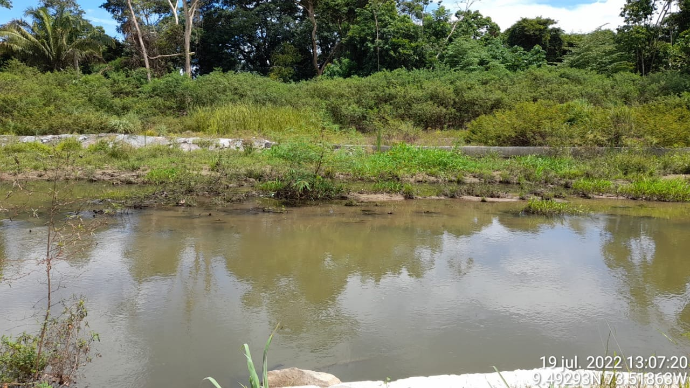
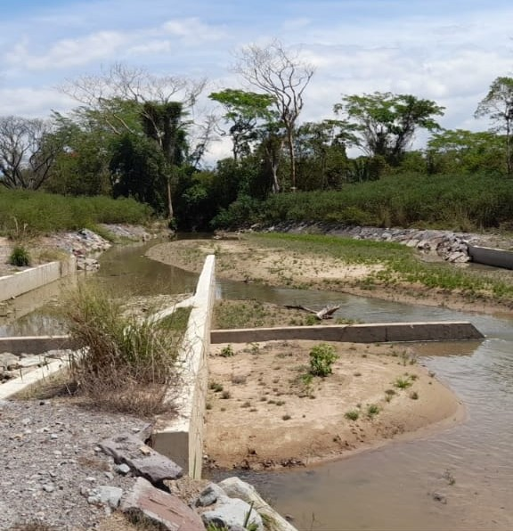
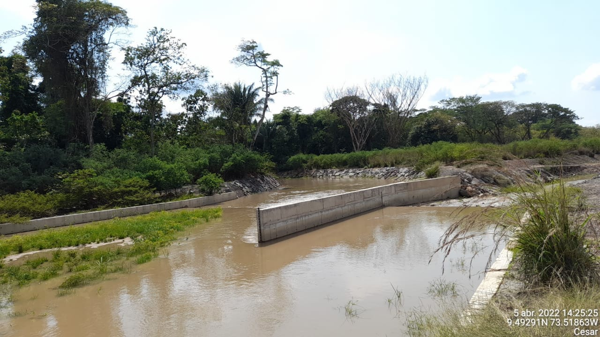
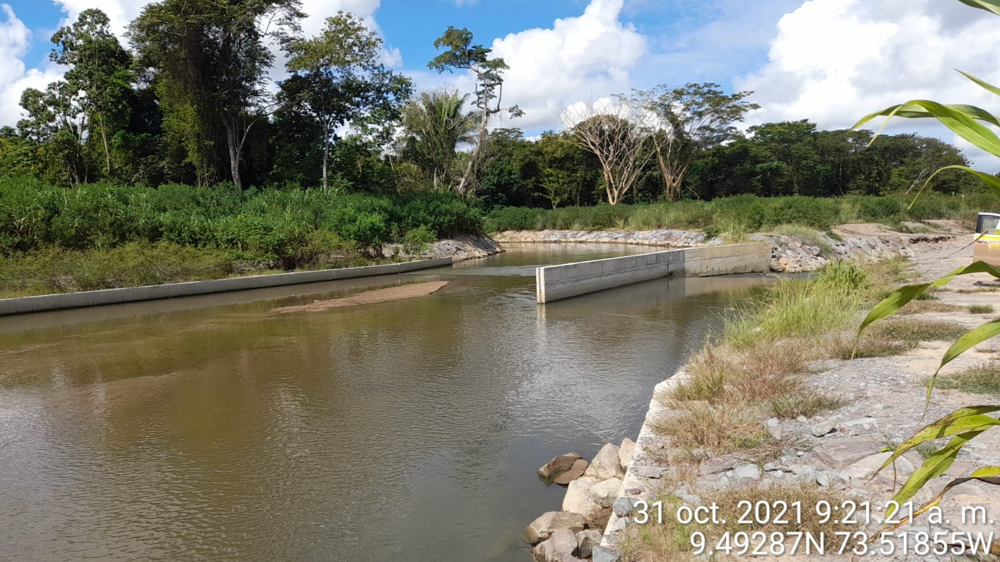
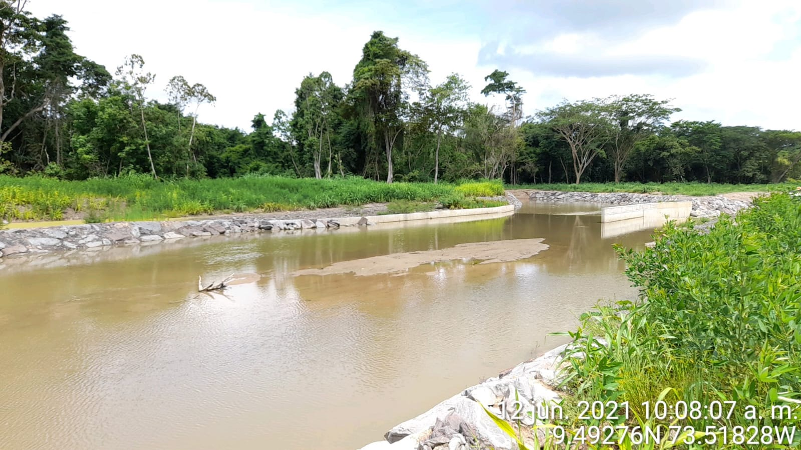
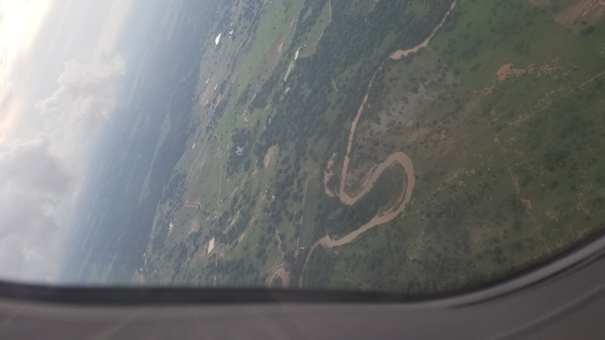
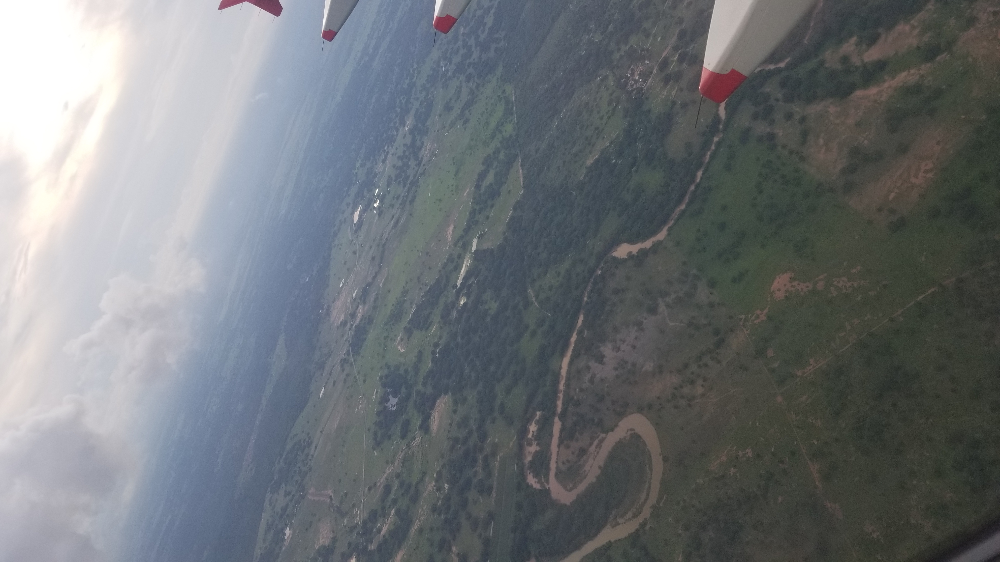

## :globe_with_meridians:Visita Drummond 2022 - Departamento del Cesar - Colombia (varios) (2022-04-27)
`Pictures` rcfdtools & AHOC <br>`Category` Technical field visit <br>`Location` [Google Maps](http://maps.google.com/maps?q=9.531024,-73.462601) or [Openstreet Map](https://www.openstreetmap.org/query?lat=9.531024&lon=-73.462601) 

```geojson
{
  "type": "Feature",
  "geometry": {
    "type": "Point", 
    "coordinates": [-73.462601, 9.531024]
  }, 
  "properties": {
    "Name": "Visita Drummond 2022 - Departamento del Cesar - Colombia (varios)"
  }
}
```

<br><details><summary>:camera:**38/2022-04-27at8.44.17AM.jpeg**</summary> `Exif version` Not known</details>

<br><details><summary>:camera:**38/2022-04-27at9.28.23AM.jpeg**</summary> `Exif version` Not known</details>

<br><details><summary>:camera:**38/2022-04-27at9.28.23AM_1.jpeg**</summary> `Exif version` Not known</details>

<br><details><summary>:camera:**38/2022-04-27at9.28.23AM_2.jpeg**</summary> `Exif version` Not known</details>

<br><details><summary>:camera:**38/2022-04-27at9.28.23AM_3.jpeg**</summary> `Exif version` Not known</details>

<br><details><summary>:camera:**38/2022-04-27at9.28.25AM.jpeg**</summary> `Exif version` Not known</details>

<br><details><summary>:camera:**38/2022-08-04at8.32.23PM.jpeg**</summary> `Exif version` Not known</details>

<br><details><summary>:camera:**38/2022-08-04at8.32.23PM1.jpeg**</summary> `Exif version` Not known</details>

<br><details><summary>:camera:**38/2022-08-04at8.32.23PM2.jpeg**</summary> `Exif version` Not known</details>

<br><details><summary>:camera:**38/2022-08-04at8.32.23PM3.jpeg**</summary> `Exif version` Not known</details>

<br><details><summary>:camera:**38/2022-08-04at8.32.24PM.jpeg**</summary> `Exif version` Not known</details>

<br><details><summary>:camera:**38/2022-08-04at8.32.24PM1.jpeg**</summary> `Exif version` Not known</details>

<br><details><summary>:camera:**38/2022-08-04at8.32.24PM2.jpeg**</summary> `Exif version` Not known</details>

<br><details><summary>:camera:**38/2022-08-04at8.32.25PM.jpeg**</summary> `Exif version` Not known</details>

<br><details><summary>:camera:**38/2022-08-04at8.32.25PM1.jpeg**</summary> `Exif version` Not known</details>

<br><details><summary>:camera:**38/2022-08-04at8.32.25PM2.jpeg**</summary> `Exif version` Not known</details>

<br><details><summary>:camera:**38/2022-08-04at8.32.26PM.jpeg**</summary> `Exif version` Not known</details>

<br><details><summary>:camera:**38/2022-08-04at8.32.26PM1.jpeg**</summary> `Exif version` Not known</details>

<br><details><summary>:camera:**38/2022-08-04at8.32.26PM2.jpeg**</summary> `Exif version` Not known</details>

<br><details><summary>:camera:**38/2022-08-04at8.32.27PM.jpeg**</summary> `Exif version` Not known</details>

<br><details><summary>:camera:**38/2022-08-04at8.32.27PM1.jpeg**</summary> `Exif version` Not known</details>

<br><details><summary>:camera:**38/2022-08-04at8.32.27PM2.jpeg**</summary> `Exif version` Not known</details>

<br><details><summary>:camera:**38/2022-08-04at8.32.28PM.jpeg**</summary> `Exif version` Not known</details>

<br><details><summary>:camera:**38/2022-08-04at8.32.28PM1.jpeg**</summary> `Exif version` Not known</details>

<br><details><summary>:camera:**38/2022-08-04at8.32.28PM2.jpeg**</summary> `Exif version` Not known</details>

<br><details><summary>:camera:**38/2022-08-04at8.32.29PM.jpeg**</summary> `Exif version` Not known</details>

<br><details><summary>:camera:**38/2022-08-04at8.32.29PM1.jpeg**</summary> `Exif version` Not known</details>

<br><details><summary>:camera:**38/2022-08-04at8.32.29PM2.jpeg**</summary> `Exif version` Not known</details>

<br><details><summary>:camera:**38/2022-08-04at8.32.29PM3.jpeg**</summary> `Exif version` Not known</details>

<br><details><summary>:camera:**38/2022-08-04at8.32.30PM.jpeg**</summary> `Exif version` Not known</details>

<br><details><summary>:camera:**38/2022-08-04at8.32.30PM1.jpeg**</summary> `Exif version` Not known</details>

<br><details><summary>:camera:**38/2022-08-04at8.32.31PM.jpeg**</summary> `Exif version` Not known</details>

<br><details><summary>:camera:**38/2022-08-04at8.32.31PM1.jpeg**</summary> `Exif version` Not known</details>

<br><details><summary>:camera:**38/2022-08-04at8.32.31PM2.jpeg**</summary> `Exif version` Not known</details>

<br><details><summary>:camera:**38/2022-08-04at8.32.31PM3.jpeg**</summary> `Exif version` Not known</details>

<br><details><summary>:camera:**38/2022-08-04at8.32.32PM.jpeg**</summary> `Exif version` Not known</details>

<br><details><summary>:camera:**38/2022-08-04at8.32.32PM1.jpeg**</summary> `Exif version` Not known</details>

<br><details><summary>:camera:**38/2022-08-04at8.32.32PM2.jpeg**</summary> `Exif version` Not known</details>

<br><details><summary>:camera:**38/2022-08-04at8.32.32PM3.jpeg**</summary> `Exif version` Not known</details>

<br><details><summary>:camera:**38/2022-08-04at8.32.33PM.jpeg**</summary> `Exif version` Not known</details>

<br><details><summary>:camera:**38/2022-08-04at8.32.33PM1.jpeg**</summary> `Exif version` Not known</details>

<br><details><summary>:camera:**38/2022-08-04at8.32.33PM2.jpeg**</summary> `Exif version` Not known</details>

<br><details><summary>:camera:**38/2022-08-04at8.32.34PM.jpeg**</summary> `Exif version` Not known</details>

<br><details><summary>:camera:**38/2022-08-04at8.32.34PM1.jpeg**</summary> `Exif version` Not known</details>

<br><details><summary>:camera:**38/2022-08-04at8.32.34PM2.jpeg**</summary> `Exif version` Not known</details>

<br><details><summary>:camera:**38/2022-08-04at8.32.35PM.jpeg**</summary> `Exif version` Not known</details>

<br><details><summary>:camera:**38/2022-08-04at8.32.35PM1.jpeg**</summary> `Exif version` Not known</details>

<br><details><summary>:camera:**38/2022-08-04at8.32.35PM2.jpeg**</summary> `Exif version` Not known</details>

<br><details><summary>:camera:**38/2022-08-04at8.32.35PM3.jpeg**</summary> `Exif version` Not known</details>

<br><details><summary>:camera:**38/2022-08-04at8.32.36PM.jpeg**</summary> `Exif version` Not known</details>

<br><details><summary>:camera:**38/2022-08-04at8.32.36PM1.jpeg**</summary> `Exif version` Not known</details>

<br><details><summary>:camera:**38/2022-08-04at8.32.36PM2.jpeg**</summary> `Exif version` Not known</details>

<br><details><summary>:camera:**38/2022-08-04at8.32.37PM.jpeg**</summary> `Exif version` Not known</details>

<br><details><summary>:camera:**38/2022-08-04at8.32.37PM1.jpeg**</summary> `Exif version` Not known</details>

<br><details><summary>:camera:**38/2022-08-04at8.32.37PM2.jpeg**</summary> `Exif version` Not known</details>

<br><details><summary>:camera:**38/2022-08-04at8.32.37PM3.jpeg**</summary> `Exif version` Not known</details>

<br><details><summary>:camera:**38/2022-08-04at8.32.38PM.jpeg**</summary> `Exif version` Not known</details>

<br><details><summary>:camera:**38/2022-08-04at8.32.38PM1.jpeg**</summary> `Exif version` Not known</details>

<br><details><summary>:camera:**38/2022-08-04at8.32.38PM2.jpeg**</summary> `Exif version` Not known</details>

<br><details><summary>:camera:**38/2022-08-04at8.32.39PM.jpeg**</summary> `Exif version` Not known</details>

<br><details><summary>:camera:**38/2022-08-04at8.32.39PM1.jpeg**</summary> `Exif version` Not known</details>

<br><details><summary>:camera:**38/2022-08-04at8.32.39PM2.jpeg**</summary> `Exif version` Not known</details>

<br><details><summary>:camera:**38/2022-08-04at8.32.40PM.jpeg**</summary> `Exif version` Not known</details>

<br><details><summary>:camera:**38/2022-08-04at8.32.40PM1.jpeg**</summary> `Exif version` Not known</details>

<br><details><summary>:camera:**38/2022-08-04at8.32.40PM2.jpeg**</summary> `Exif version` Not known</details>

<br><details><summary>:camera:**38/2022-08-04at8.32.40PM3.jpeg**</summary> `Exif version` Not known</details>

<br><details><summary>:camera:**38/2022-08-04at8.32.41PM.jpeg**</summary> `Exif version` Not known</details>

<br><details><summary>:camera:**38/2022-08-04at8.32.41PM1.jpeg**</summary> `Exif version` Not known</details>

<br><details><summary>:camera:**38/2022-08-04at8.32.41PM2.jpeg**</summary> `Exif version` Not known</details>

<br><details><summary>:camera:**38/2022-08-04at8.32.42PM.jpeg**</summary> `Exif version` Not known</details>

<br><details><summary>:camera:**38/2022-08-04at8.32.42PM1.jpeg**</summary> `Exif version` Not known</details>

<br><details><summary>:camera:**38/2022-08-04at8.32.42PM2.jpeg**</summary> `Exif version` Not known</details>

<br><details><summary>:camera:**38/2022-08-04at8.32.43PM.jpeg**</summary> `Exif version` Not known</details>

<br><details><summary>:camera:**38/2022-08-04at8.32.43PM1.jpeg**</summary> `Exif version` Not known</details>

<br><details><summary>:camera:**38/2022-08-04at8.32.43PM2.jpeg**</summary> `Exif version` Not known</details>

<br><details><summary>:camera:**38/2022-08-04at8.32.44PM.jpeg**</summary> `Exif version` Not known</details>

<br><details><summary>:camera:**38/2022-08-04at8.32.44PM1.jpeg**</summary> `Exif version` Not known</details>

<br><details><summary>:camera:**38/2022-08-04at8.32.44PM2.jpeg**</summary> `Exif version` Not known</details>

<br><details><summary>:camera:**38/2022-08-04at8.32.44PM3.jpeg**</summary> `Exif version` Not known</details>

<br><details><summary>:camera:**38/2022-08-04at8.32.45PM.jpeg**</summary> `Exif version` Not known</details>

<br><details><summary>:camera:**38/2022-08-04at8.32.45PM1.jpeg**</summary> `Exif version` Not known</details>

<br><details><summary>:camera:**38/2022-08-04at8.32.45PM2.jpeg**</summary> `Exif version` Not known</details>

<br><details><summary>:camera:**38/2022-08-04at8.32.46PM.jpeg**</summary> `Exif version` Not known</details>

<br><details><summary>:camera:**38/2022-08-04at8.32.46PM1.jpeg**</summary> `Exif version` Not known</details>

<br><details><summary>:camera:**38/20220425_171528.jpg**</summary><sub> `Exif version` 0220 `OS version` G955USQU8DUD3 `Date` 2022:04:25 17:15:28 `Aperture` Not known `Brightness` 6.47 `Color space` 1 `Compression` 6`Exposure mode` 0 `Exposure time` 0.0017241379310344827 `Focal length` 4.25 `Lens model` Not known `Lens specification` Not known `Orientation` 6 `Scene type` Not known `f number` 1.7 `White balance` 0 `Sensing method` 2 `Shutter speed` 9.179</sub><sub>`Coordinates & altitude` (0.0, 0.0, 0.0)</sub><sub> :globe_with_meridians:`Location over` [Google Maps](http://maps.google.com/maps?q=0.0,0.0) or [Openstreet Map](https://www.openstreetmap.org/query?lat=0.0&lon=0.0)</sub></details>

<br><details><summary>:camera:**38/20220425_171624.jpg**</summary><sub> `Exif version` 0220 `OS version` G955USQU8DUD3 `Date` 2022:04:25 17:16:24 `Aperture` Not known `Brightness` 5.92 `Color space` 1 `Compression` 6`Exposure mode` 0 `Exposure time` 0.002421307506053269 `Focal length` 4.25 `Lens model` Not known `Lens specification` Not known `Orientation` 6 `Scene type` Not known `f number` 1.7 `White balance` 0 `Sensing method` 2 `Shutter speed` 8.689</sub><sub>`Coordinates & altitude` (0.0, 0.0, 0.0)</sub><sub> :globe_with_meridians:`Location over` [Google Maps](http://maps.google.com/maps?q=0.0,0.0) or [Openstreet Map](https://www.openstreetmap.org/query?lat=0.0&lon=0.0)</sub></details>

<br><details><summary>:camera:**38/20220425_171625.jpg**</summary><sub> `Exif version` 0220 `OS version` G955USQU8DUD3 `Date` 2022:04:25 17:16:25 `Aperture` Not known `Brightness` 6.53 `Color space` 1 `Compression` 6`Exposure mode` 0 `Exposure time` 0.0017730496453900709 `Focal length` 4.25 `Lens model` Not known `Lens specification` Not known `Orientation` 6 `Scene type` Not known `f number` 1.7 `White balance` 0 `Sensing method` 2 `Shutter speed` 9.139</sub><sub>`Coordinates & altitude` (0.0, 0.0, 0.0)</sub><sub> :globe_with_meridians:`Location over` [Google Maps](http://maps.google.com/maps?q=0.0,0.0) or [Openstreet Map](https://www.openstreetmap.org/query?lat=0.0&lon=0.0)</sub></details>

<br><details><summary>:camera:**38/20220425_171630.jpg**</summary><sub> `Exif version` 0220 `OS version` G955USQU8DUD3 `Date` 2022:04:25 17:16:30 `Aperture` Not known `Brightness` 6.03 `Color space` 1 `Compression` 6`Exposure mode` 0 `Exposure time` 0.002320185614849188 `Focal length` 4.25 `Lens model` Not known `Lens specification` Not known `Orientation` 6 `Scene type` Not known `f number` 1.7 `White balance` 0 `Sensing method` 2 `Shutter speed` 8.751</sub><sub>`Coordinates & altitude` (0.0, 0.0, 0.0)</sub><sub> :globe_with_meridians:`Location over` [Google Maps](http://maps.google.com/maps?q=0.0,0.0) or [Openstreet Map](https://www.openstreetmap.org/query?lat=0.0&lon=0.0)</sub></details>

<br><details><summary>:camera:**38/20220425_171634.jpg**</summary><sub> `Exif version` 0220 `OS version` G955USQU8DUD3 `Date` 2022:04:25 17:16:34 `Aperture` Not known `Brightness` 5.66 `Color space` 1 `Compression` 6`Exposure mode` 0 `Exposure time` 0.0032679738562091504 `Focal length` 4.25 `Lens model` Not known `Lens specification` Not known `Orientation` 1 `Scene type` Not known `f number` 1.7 `White balance` 0 `Sensing method` 2 `Shutter speed` 8.257</sub><sub>`Coordinates & altitude` (0.0, 0.0, 0.0)</sub><sub> :globe_with_meridians:`Location over` [Google Maps](http://maps.google.com/maps?q=0.0,0.0) or [Openstreet Map](https://www.openstreetmap.org/query?lat=0.0&lon=0.0)</sub></details>

<br><details><summary>:camera:**38/20220426_134914.jpg**</summary><sub> `Exif version` 0220 `OS version` G955USQU8DUD3 `Date` 2022:04:26 13:49:14 `Aperture` Not known `Brightness` 8.71 `Color space` 1 `Compression` 6`Exposure mode` 0 `Exposure time` 0.0003846153846153846 `Focal length` 4.25 `Lens model` Not known `Lens specification` Not known `Orientation` 1 `Scene type` Not known `f number` 1.7 `White balance` 0 `Sensing method` 2 `Shutter speed` 11.344</sub><sub>`Coordinates & altitude` (0.0, 0.0, 0.0)</sub><sub> :globe_with_meridians:`Location over` [Google Maps](http://maps.google.com/maps?q=0.0,0.0) or [Openstreet Map](https://www.openstreetmap.org/query?lat=0.0&lon=0.0)</sub></details>

<br><details><summary>:camera:**38/20220426_134953.jpg**</summary><sub> `Exif version` 0220 `OS version` G955USQU8DUD3 `Date` 2022:04:26 13:49:53 `Aperture` Not known `Brightness` 9.35 `Color space` 1 `Compression` 6`Exposure mode` 0 `Exposure time` 0.000251004016064257 `Focal length` 4.25 `Lens model` Not known `Lens specification` Not known `Orientation` 1 `Scene type` Not known `f number` 1.7 `White balance` 0 `Sensing method` 2 `Shutter speed` 11.96</sub><sub>`Coordinates & altitude` (0.0, 0.0, 0.0)</sub><sub> :globe_with_meridians:`Location over` [Google Maps](http://maps.google.com/maps?q=0.0,0.0) or [Openstreet Map](https://www.openstreetmap.org/query?lat=0.0&lon=0.0)</sub></details>

<br><details><summary>:camera:**38/20220426_135020.jpg**</summary><sub> `Exif version` 0220 `OS version` G955USQU8DUD3 `Date` 2022:04:26 13:50:20 `Aperture` Not known `Brightness` 7.48 `Color space` 1 `Compression` 6`Exposure mode` 0 `Exposure time` 0.0009225092250922509 `Focal length` 4.25 `Lens model` Not known `Lens specification` Not known `Orientation` 6 `Scene type` Not known `f number` 1.7 `White balance` 0 `Sensing method` 2 `Shutter speed` 10.082</sub><sub>`Coordinates & altitude` (0.0, 0.0, 0.0)</sub><sub> :globe_with_meridians:`Location over` [Google Maps](http://maps.google.com/maps?q=0.0,0.0) or [Openstreet Map](https://www.openstreetmap.org/query?lat=0.0&lon=0.0)</sub></details>

<br><details><summary>:camera:**38/20220426_135042.jpg**</summary><sub> `Exif version` 0220 `OS version` G955USQU8DUD3 `Date` 2022:04:26 13:50:42 `Aperture` Not known `Brightness` 8.17 `Color space` 1 `Compression` 6`Exposure mode` 0 `Exposure time` 0.0005567928730512249 `Focal length` 4.25 `Lens model` Not known `Lens specification` Not known `Orientation` 3 `Scene type` Not known `f number` 1.7 `White balance` 0 `Sensing method` 2 `Shutter speed` 10.81</sub><sub>`Coordinates & altitude` (0.0, 0.0, 0.0)</sub><sub> :globe_with_meridians:`Location over` [Google Maps](http://maps.google.com/maps?q=0.0,0.0) or [Openstreet Map](https://www.openstreetmap.org/query?lat=0.0&lon=0.0)</sub></details>

<br><details><summary>:camera:**38/20220426_135050.jpg**</summary><sub> `Exif version` 0220 `OS version` G955USQU8DUD3 `Date` 2022:04:26 13:50:50 `Aperture` Not known `Brightness` 8.03 `Color space` 1 `Compression` 6`Exposure mode` 0 `Exposure time` 0.0005966587112171838 `Focal length` 4.25 `Lens model` Not known `Lens specification` Not known `Orientation` 3 `Scene type` Not known `f number` 1.7 `White balance` 0 `Sensing method` 2 `Shutter speed` 10.71</sub><sub>`Coordinates & altitude` (0.0, 0.0, 0.0)</sub><sub> :globe_with_meridians:`Location over` [Google Maps](http://maps.google.com/maps?q=0.0,0.0) or [Openstreet Map](https://www.openstreetmap.org/query?lat=0.0&lon=0.0)</sub></details>

<br><details><summary>:camera:**38/20220426_135111.jpg**</summary><sub> `Exif version` 0220 `OS version` G955USQU8DUD3 `Date` 2022:04:26 13:51:11 `Aperture` Not known `Brightness` 8.77 `Color space` 1 `Compression` 6`Exposure mode` 0 `Exposure time` 0.00035298270384751147 `Focal length` 4.25 `Lens model` Not known `Lens specification` Not known `Orientation` 1 `Scene type` Not known `f number` 1.7 `White balance` 0 `Sensing method` 2 `Shutter speed` 11.468</sub><sub>`Coordinates & altitude` (0.0, 0.0, 0.0)</sub><sub> :globe_with_meridians:`Location over` [Google Maps](http://maps.google.com/maps?q=0.0,0.0) or [Openstreet Map](https://www.openstreetmap.org/query?lat=0.0&lon=0.0)</sub></details>

<br><details><summary>:camera:**38/20220426_135718.jpg**</summary><sub> `Exif version` 0220 `OS version` G955USQU8DUD3 `Date` 2022:04:26 13:57:17 `Aperture` Not known `Brightness` 7.21 `Color space` 1 `Compression` 6`Exposure mode` 0 `Exposure time` 0.0010460251046025104 `Focal length` 4.25 `Lens model` Not known `Lens specification` Not known `Orientation` 6 `Scene type` Not known `f number` 1.7 `White balance` 0 `Sensing method` 2 `Shutter speed` 9.9</sub><sub>`Coordinates & altitude` (0.0, 0.0, 0.0)</sub><sub> :globe_with_meridians:`Location over` [Google Maps](http://maps.google.com/maps?q=0.0,0.0) or [Openstreet Map](https://www.openstreetmap.org/query?lat=0.0&lon=0.0)</sub></details>

<br><details><summary>:camera:**38/20220426_135727.jpg**</summary><sub> `Exif version` 0220 `OS version` G955USQU8DUD3 `Date` 2022:04:26 13:57:27 `Aperture` Not known `Brightness` 7.19 `Color space` 1 `Compression` 6`Exposure mode` 0 `Exposure time` 0.0010787486515641855 `Focal length` 4.25 `Lens model` Not known `Lens specification` Not known `Orientation` 6 `Scene type` Not known `f number` 1.7 `White balance` 0 `Sensing method` 2 `Shutter speed` 9.856</sub><sub>`Coordinates & altitude` (0.0, 0.0, 0.0)</sub><sub> :globe_with_meridians:`Location over` [Google Maps](http://maps.google.com/maps?q=0.0,0.0) or [Openstreet Map](https://www.openstreetmap.org/query?lat=0.0&lon=0.0)</sub></details>

<br><details><summary>:camera:**38/20220426_140311.jpg**</summary><sub> `Exif version` 0220 `OS version` G955USQU8DUD3 `Date` 2022:04:26 14:03:11 `Aperture` Not known `Brightness` 9.15 `Color space` 1 `Compression` 6`Exposure mode` 0 `Exposure time` 0.0002777777777777778 `Focal length` 4.25 `Lens model` Not known `Lens specification` Not known `Orientation` 1 `Scene type` Not known `f number` 1.7 `White balance` 0 `Sensing method` 2 `Shutter speed` 11.813</sub><sub>`Coordinates & altitude` (0.0, 0.0, 0.0)</sub><sub> :globe_with_meridians:`Location over` [Google Maps](http://maps.google.com/maps?q=0.0,0.0) or [Openstreet Map](https://www.openstreetmap.org/query?lat=0.0&lon=0.0)</sub></details>

<br><details><summary>:camera:**38/20220426_140447.jpg**</summary><sub> `Exif version` 0220 `OS version` G955USQU8DUD3 `Date` 2022:04:26 14:04:47 `Aperture` Not known `Brightness` 9.23 `Color space` 1 `Compression` 6`Exposure mode` 0 `Exposure time` 0.0002642706131078224 `Focal length` 4.25 `Lens model` Not known `Lens specification` Not known `Orientation` 1 `Scene type` Not known `f number` 1.7 `White balance` 0 `Sensing method` 2 `Shutter speed` 11.885</sub><sub>`Coordinates & altitude` (0.0, 0.0, 0.0)</sub><sub> :globe_with_meridians:`Location over` [Google Maps](http://maps.google.com/maps?q=0.0,0.0) or [Openstreet Map](https://www.openstreetmap.org/query?lat=0.0&lon=0.0)</sub></details>

<br><details><summary>:camera:**38/20220426_141416.jpg**</summary><sub> `Exif version` 0220 `OS version` G955USQU8DUD3 `Date` 2022:04:26 14:14:16 `Aperture` Not known `Brightness` 9.4 `Color space` 1 `Compression` 6`Exposure mode` 0 `Exposure time` 0.00022977941176470588 `Focal length` 4.25 `Lens model` Not known `Lens specification` Not known `Orientation` 6 `Scene type` Not known `f number` 1.7 `White balance` 0 `Sensing method` 2 `Shutter speed` 12.087</sub><sub>`Coordinates & altitude` (0.0, 0.0, 0.0)</sub><sub> :globe_with_meridians:`Location over` [Google Maps](http://maps.google.com/maps?q=0.0,0.0) or [Openstreet Map](https://www.openstreetmap.org/query?lat=0.0&lon=0.0)</sub></details>

<br><details><summary>:camera:**38/20220426_141515.jpg**</summary><sub> `Exif version` 0220 `OS version` G955USQU8DUD3 `Date` 2022:04:26 14:15:15 `Aperture` Not known `Brightness` 9.34 `Color space` 1 `Compression` 6`Exposure mode` 0 `Exposure time` 0.00024131274131274132 `Focal length` 4.25 `Lens model` Not known `Lens specification` Not known `Orientation` 6 `Scene type` Not known `f number` 1.7 `White balance` 0 `Sensing method` 2 `Shutter speed` 12.016</sub><sub>`Coordinates & altitude` (0.0, 0.0, 0.0)</sub><sub> :globe_with_meridians:`Location over` [Google Maps](http://maps.google.com/maps?q=0.0,0.0) or [Openstreet Map](https://www.openstreetmap.org/query?lat=0.0&lon=0.0)</sub></details>

<br><details><summary>:camera:**38/20220426_141519.jpg**</summary><sub> `Exif version` 0220 `OS version` G955USQU8DUD3 `Date` 2022:04:26 14:15:19 `Aperture` Not known `Brightness` 8.81 `Color space` 1 `Compression` 6`Exposure mode` 0 `Exposure time` 0.00034916201117318437 `Focal length` 4.25 `Lens model` Not known `Lens specification` Not known `Orientation` 1 `Scene type` Not known `f number` 1.7 `White balance` 0 `Sensing method` 2 `Shutter speed` 11.483</sub><sub>`Coordinates & altitude` (0.0, 0.0, 0.0)</sub><sub> :globe_with_meridians:`Location over` [Google Maps](http://maps.google.com/maps?q=0.0,0.0) or [Openstreet Map](https://www.openstreetmap.org/query?lat=0.0&lon=0.0)</sub></details>

<br><details><summary>:camera:**38/20220426_142419.jpg**</summary><sub> `Exif version` 0220 `OS version` G955USQU8DUD3 `Date` 2022:04:26 14:24:19 `Aperture` Not known `Brightness` 9.25 `Color space` 1 `Compression` 6`Exposure mode` 0 `Exposure time` 0.0002545824847250509 `Focal length` 4.25 `Lens model` Not known `Lens specification` Not known `Orientation` 1 `Scene type` Not known `f number` 1.7 `White balance` 0 `Sensing method` 2 `Shutter speed` 11.939</sub><sub>`Coordinates & altitude` (0.0, 0.0, 0.0)</sub><sub> :globe_with_meridians:`Location over` [Google Maps](http://maps.google.com/maps?q=0.0,0.0) or [Openstreet Map](https://www.openstreetmap.org/query?lat=0.0&lon=0.0)</sub></details>

<br><details><summary>:camera:**38/20220426_142421.jpg**</summary><sub> `Exif version` 0220 `OS version` G955USQU8DUD3 `Date` 2022:04:26 14:24:21 `Aperture` Not known `Brightness` 9.39 `Color space` 1 `Compression` 6`Exposure mode` 0 `Exposure time` 0.00024703557312252963 `Focal length` 4.25 `Lens model` Not known `Lens specification` Not known `Orientation` 1 `Scene type` Not known `f number` 1.7 `White balance` 0 `Sensing method` 2 `Shutter speed` 11.982</sub><sub>`Coordinates & altitude` (0.0, 0.0, 0.0)</sub><sub> :globe_with_meridians:`Location over` [Google Maps](http://maps.google.com/maps?q=0.0,0.0) or [Openstreet Map](https://www.openstreetmap.org/query?lat=0.0&lon=0.0)</sub></details>

<br><details><summary>:camera:**38/20220426_142424.jpg**</summary><sub> `Exif version` 0220 `OS version` G955USQU8DUD3 `Date` 2022:04:26 14:24:24 `Aperture` Not known `Brightness` 9.41 `Color space` 1 `Compression` 6`Exposure mode` 0 `Exposure time` 0.0002358490566037736 `Focal length` 4.25 `Lens model` Not known `Lens specification` Not known `Orientation` 1 `Scene type` Not known `f number` 1.7 `White balance` 0 `Sensing method` 2 `Shutter speed` 12.049</sub><sub>`Coordinates & altitude` (0.0, 0.0, 0.0)</sub><sub> :globe_with_meridians:`Location over` [Google Maps](http://maps.google.com/maps?q=0.0,0.0) or [Openstreet Map](https://www.openstreetmap.org/query?lat=0.0&lon=0.0)</sub></details>

<br><details><summary>:camera:**38/20220426_142451.jpg**</summary><sub> `Exif version` 0220 `OS version` G955USQU8DUD3 `Date` 2022:04:26 14:24:51 `Aperture` Not known `Brightness` 9.36 `Color space` 1 `Compression` 6`Exposure mode` 0 `Exposure time` 0.0002376425855513308 `Focal length` 4.25 `Lens model` Not known `Lens specification` Not known `Orientation` 6 `Scene type` Not known `f number` 1.7 `White balance` 0 `Sensing method` 2 `Shutter speed` 12.038</sub><sub>`Coordinates & altitude` (0.0, 0.0, 0.0)</sub><sub> :globe_with_meridians:`Location over` [Google Maps](http://maps.google.com/maps?q=0.0,0.0) or [Openstreet Map](https://www.openstreetmap.org/query?lat=0.0&lon=0.0)</sub></details>

<br><details><summary>:camera:**38/20220426_144305.jpg**</summary><sub> `Exif version` 0220 `OS version` G955USQU8DUD3 `Date` 2022:04:26 14:43:05 `Aperture` Not known `Brightness` 9.19 `Color space` 1 `Compression` 6`Exposure mode` 0 `Exposure time` 0.00027901785714285713 `Focal length` 4.25 `Lens model` Not known `Lens specification` Not known `Orientation` 1 `Scene type` Not known `f number` 1.7 `White balance` 0 `Sensing method` 2 `Shutter speed` 11.807</sub><sub>`Coordinates & altitude` (0.0, 0.0, 0.0)</sub><sub> :globe_with_meridians:`Location over` [Google Maps](http://maps.google.com/maps?q=0.0,0.0) or [Openstreet Map](https://www.openstreetmap.org/query?lat=0.0&lon=0.0)</sub></details>

<br><details><summary>:camera:**38/20220426_144308.jpg**</summary><sub> `Exif version` 0220 `OS version` G955USQU8DUD3 `Date` 2022:04:26 14:43:08 `Aperture` Not known `Brightness` 9.37 `Color space` 1 `Compression` 6`Exposure mode` 0 `Exposure time` 0.00024224806201550387 `Focal length` 4.25 `Lens model` Not known `Lens specification` Not known `Orientation` 1 `Scene type` Not known `f number` 1.7 `White balance` 0 `Sensing method` 2 `Shutter speed` 12.011</sub><sub>`Coordinates & altitude` (0.0, 0.0, 0.0)</sub><sub> :globe_with_meridians:`Location over` [Google Maps](http://maps.google.com/maps?q=0.0,0.0) or [Openstreet Map](https://www.openstreetmap.org/query?lat=0.0&lon=0.0)</sub></details>

<br><details><summary>:camera:**38/20220426_144310.jpg**</summary><sub> `Exif version` 0220 `OS version` G955USQU8DUD3 `Date` 2022:04:26 14:43:10 `Aperture` Not known `Brightness` 9.02 `Color space` 1 `Compression` 6`Exposure mode` 0 `Exposure time` 0.0003078817733990148 `Focal length` 4.25 `Lens model` Not known `Lens specification` Not known `Orientation` 1 `Scene type` Not known `f number` 1.7 `White balance` 0 `Sensing method` 2 `Shutter speed` 11.665</sub><sub>`Coordinates & altitude` (0.0, 0.0, 0.0)</sub><sub> :globe_with_meridians:`Location over` [Google Maps](http://maps.google.com/maps?q=0.0,0.0) or [Openstreet Map](https://www.openstreetmap.org/query?lat=0.0&lon=0.0)</sub></details>

<br><details><summary>:camera:**38/20220426_150208.jpg**</summary><sub> `Exif version` 0220 `OS version` G955USQU8DUD3 `Date` 2022:04:26 15:02:07 `Aperture` Not known `Brightness` 9.03 `Color space` 1 `Compression` 6`Exposure mode` 0 `Exposure time` 0.00022799817601459188 `Focal length` 4.25 `Lens model` Not known `Lens specification` Not known `Orientation` 6 `Scene type` Not known `f number` 1.7 `White balance` 0 `Sensing method` 2 `Shutter speed` 12.098</sub><sub>`Coordinates & altitude` (0.0, 0.0, 0.0)</sub><sub> :globe_with_meridians:`Location over` [Google Maps](http://maps.google.com/maps?q=0.0,0.0) or [Openstreet Map](https://www.openstreetmap.org/query?lat=0.0&lon=0.0)</sub></details>

<br><details><summary>:camera:**38/20220426_150211.jpg**</summary><sub> `Exif version` 0220 `OS version` G955USQU8DUD3 `Date` 2022:04:26 15:02:11 `Aperture` Not known `Brightness` 9.06 `Color space` 1 `Compression` 6`Exposure mode` 0 `Exposure time` 0.0002289901534234028 `Focal length` 4.25 `Lens model` Not known `Lens specification` Not known `Orientation` 1 `Scene type` Not known `f number` 1.7 `White balance` 0 `Sensing method` 2 `Shutter speed` 12.092</sub><sub>`Coordinates & altitude` (0.0, 0.0, 0.0)</sub><sub> :globe_with_meridians:`Location over` [Google Maps](http://maps.google.com/maps?q=0.0,0.0) or [Openstreet Map](https://www.openstreetmap.org/query?lat=0.0&lon=0.0)</sub></details>

<br><details><summary>:camera:**38/20220426_152139.jpg**</summary><sub> `Exif version` 0220 `OS version` G955USQU8DUD3 `Date` 2022:04:26 15:21:39 `Aperture` Not known `Brightness` 8.07 `Color space` 1 `Compression` 6`Exposure mode` 0 `Exposure time` 0.0005938242280285036 `Focal length` 4.25 `Lens model` Not known `Lens specification` Not known `Orientation` 1 `Scene type` Not known `f number` 1.7 `White balance` 0 `Sensing method` 2 `Shutter speed` 10.717</sub><sub>`Coordinates & altitude` (0.0, 0.0, 0.0)</sub><sub> :globe_with_meridians:`Location over` [Google Maps](http://maps.google.com/maps?q=0.0,0.0) or [Openstreet Map](https://www.openstreetmap.org/query?lat=0.0&lon=0.0)</sub></details>

<br><details><summary>:camera:**38/20220426_152142.jpg**</summary><sub> `Exif version` 0220 `OS version` G955USQU8DUD3 `Date` 2022:04:26 15:21:42 `Aperture` Not known `Brightness` 9.21 `Color space` 1 `Compression` 6`Exposure mode` 0 `Exposure time` 0.00019398642095053346 `Focal length` 4.25 `Lens model` Not known `Lens specification` Not known `Orientation` 6 `Scene type` Not known `f number` 1.7 `White balance` 0 `Sensing method` 2 `Shutter speed` 12.331</sub><sub>`Coordinates & altitude` (0.0, 0.0, 0.0)</sub><sub> :globe_with_meridians:`Location over` [Google Maps](http://maps.google.com/maps?q=0.0,0.0) or [Openstreet Map](https://www.openstreetmap.org/query?lat=0.0&lon=0.0)</sub></details>

<br><details><summary>:camera:**38/20220426_152159.jpg**</summary><sub> `Exif version` 0220 `OS version` G955USQU8DUD3 `Date` 2022:04:26 15:21:59 `Aperture` Not known `Brightness` 8.79 `Color space` 1 `Compression` 6`Exposure mode` 0 `Exposure time` 0.00036231884057971015 `Focal length` 4.25 `Lens model` Not known `Lens specification` Not known `Orientation` 6 `Scene type` Not known `f number` 1.7 `White balance` 0 `Sensing method` 2 `Shutter speed` 11.43</sub><sub>`Coordinates & altitude` (0.0, 0.0, 0.0)</sub><sub> :globe_with_meridians:`Location over` [Google Maps](http://maps.google.com/maps?q=0.0,0.0) or [Openstreet Map](https://www.openstreetmap.org/query?lat=0.0&lon=0.0)</sub></details>

<br><details><summary>:camera:**38/20220426_152204.jpg**</summary><sub> `Exif version` 0220 `OS version` G955USQU8DUD3 `Date` 2022:04:26 15:22:04 `Aperture` Not known `Brightness` 6.67 `Color space` 1 `Compression` 6`Exposure mode` 0 `Exposure time` 0.001607717041800643 `Focal length` 4.25 `Lens model` Not known `Lens specification` Not known `Orientation` 1 `Scene type` Not known `f number` 1.7 `White balance` 0 `Sensing method` 2 `Shutter speed` 9.28</sub><sub>`Coordinates & altitude` (0.0, 0.0, 0.0)</sub><sub> :globe_with_meridians:`Location over` [Google Maps](http://maps.google.com/maps?q=0.0,0.0) or [Openstreet Map](https://www.openstreetmap.org/query?lat=0.0&lon=0.0)</sub></details>

<br><details><summary>:camera:**38/20220426_152206.jpg**</summary><sub> `Exif version` 0220 `OS version` G955USQU8DUD3 `Date` 2022:04:26 15:22:06 `Aperture` Not known `Brightness` 6.4 `Color space` 1 `Compression` 6`Exposure mode` 0 `Exposure time` 0.0018115942028985507 `Focal length` 4.25 `Lens model` Not known `Lens specification` Not known `Orientation` 1 `Scene type` Not known `f number` 1.7 `White balance` 0 `Sensing method` 2 `Shutter speed` 9.108</sub><sub>`Coordinates & altitude` (0.0, 0.0, 0.0)</sub><sub> :globe_with_meridians:`Location over` [Google Maps](http://maps.google.com/maps?q=0.0,0.0) or [Openstreet Map](https://www.openstreetmap.org/query?lat=0.0&lon=0.0)</sub></details>

<br><details><summary>:camera:**38/20220426_152310.jpg**</summary><sub> `Exif version` 0220 `OS version` G955USQU8DUD3 `Date` 2022:04:26 15:23:10 `Aperture` Not known `Brightness` 7.11 `Color space` 1 `Compression` 6`Exposure mode` 0 `Exposure time` 0.0011467889908256881 `Focal length` 4.25 `Lens model` Not known `Lens specification` Not known `Orientation` 1 `Scene type` Not known `f number` 1.7 `White balance` 0 `Sensing method` 2 `Shutter speed` 9.768</sub><sub>`Coordinates & altitude` (0.0, 0.0, 0.0)</sub><sub> :globe_with_meridians:`Location over` [Google Maps](http://maps.google.com/maps?q=0.0,0.0) or [Openstreet Map](https://www.openstreetmap.org/query?lat=0.0&lon=0.0)</sub></details>

<br><details><summary>:camera:**38/20220426_153737.jpg**</summary><sub> `Exif version` 0220 `OS version` G955USQU8DUD3 `Date` 2022:04:26 15:37:37 `Aperture` Not known `Brightness` 8.46 `Color space` 1 `Compression` 6`Exposure mode` 0 `Exposure time` 0.00047709923664122136 `Focal length` 4.25 `Lens model` Not known `Lens specification` Not known `Orientation` 1 `Scene type` Not known `f number` 1.7 `White balance` 0 `Sensing method` 2 `Shutter speed` 11.033</sub><sub>`Coordinates & altitude` (0.0, 0.0, 0.0)</sub><sub> :globe_with_meridians:`Location over` [Google Maps](http://maps.google.com/maps?q=0.0,0.0) or [Openstreet Map](https://www.openstreetmap.org/query?lat=0.0&lon=0.0)</sub></details>

<br><details><summary>:camera:**38/20220426_153741.jpg**</summary><sub> `Exif version` 0220 `OS version` G955USQU8DUD3 `Date` 2022:04:26 15:37:41 `Aperture` Not known `Brightness` 9.05 `Color space` 1 `Compression` 6`Exposure mode` 0 `Exposure time` 0.00029761904761904765 `Focal length` 4.25 `Lens model` Not known `Lens specification` Not known `Orientation` 1 `Scene type` Not known `f number` 1.7 `White balance` 0 `Sensing method` 2 `Shutter speed` 11.714</sub><sub>`Coordinates & altitude` (0.0, 0.0, 0.0)</sub><sub> :globe_with_meridians:`Location over` [Google Maps](http://maps.google.com/maps?q=0.0,0.0) or [Openstreet Map](https://www.openstreetmap.org/query?lat=0.0&lon=0.0)</sub></details>

<br><details><summary>:camera:**38/20220426_155050.jpg**</summary><sub> `Exif version` 0220 `OS version` G955USQU8DUD3 `Date` 2022:04:26 15:50:50 `Aperture` Not known `Brightness` 8.49 `Color space` 1 `Compression` 6`Exposure mode` 0 `Exposure time` 0.0004222972972972973 `Focal length` 4.25 `Lens model` Not known `Lens specification` Not known `Orientation` 1 `Scene type` Not known `f number` 1.7 `White balance` 0 `Sensing method` 2 `Shutter speed` 11.209</sub><sub>`Coordinates & altitude` (0.0, 0.0, 0.0)</sub><sub> :globe_with_meridians:`Location over` [Google Maps](http://maps.google.com/maps?q=0.0,0.0) or [Openstreet Map](https://www.openstreetmap.org/query?lat=0.0&lon=0.0)</sub></details>

<br><details><summary>:camera:**38/20220426_155055.jpg**</summary><sub> `Exif version` 0220 `OS version` G955USQU8DUD3 `Date` 2022:04:26 15:50:55 `Aperture` Not known `Brightness` 8.33 `Color space` 1 `Compression` 6`Exposure mode` 0 `Exposure time` 0.000501002004008016 `Focal length` 4.25 `Lens model` Not known `Lens specification` Not known `Orientation` 1 `Scene type` Not known `f number` 1.7 `White balance` 0 `Sensing method` 2 `Shutter speed` 10.962</sub><sub>`Coordinates & altitude` (0.0, 0.0, 0.0)</sub><sub> :globe_with_meridians:`Location over` [Google Maps](http://maps.google.com/maps?q=0.0,0.0) or [Openstreet Map](https://www.openstreetmap.org/query?lat=0.0&lon=0.0)</sub></details>

<br><details><summary>:camera:**38/20220427_084023.jpg**</summary><sub> `Exif version` 0220 `OS version` G955USQU8DUD3 `Date` 2022:04:27 08:40:23 `Aperture` Not known `Brightness` 8.96 `Color space` 1 `Compression` 6`Exposure mode` 0 `Exposure time` 0.0003132832080200501 `Focal length` 4.25 `Lens model` Not known `Lens specification` Not known `Orientation` 1 `Scene type` Not known `f number` 1.7 `White balance` 0 `Sensing method` 2 `Shutter speed` 11.64</sub><sub>`Coordinates & altitude` (0.0, 0.0, 0.0)</sub><sub> :globe_with_meridians:`Location over` [Google Maps](http://maps.google.com/maps?q=0.0,0.0) or [Openstreet Map](https://www.openstreetmap.org/query?lat=0.0&lon=0.0)</sub></details>

<br><details><summary>:camera:**38/20220427_084135.jpg**</summary><sub> `Exif version` 0220 `OS version` G955USQU8DUD3 `Date` 2022:04:27 08:41:35 `Aperture` Not known `Brightness` 8.68 `Color space` 1 `Compression` 6`Exposure mode` 0 `Exposure time` 0.00037425149700598805 `Focal length` 4.25 `Lens model` Not known `Lens specification` Not known `Orientation` 1 `Scene type` Not known `f number` 1.7 `White balance` 0 `Sensing method` 2 `Shutter speed` 11.383</sub><sub>`Coordinates & altitude` (0.0, 0.0, 0.0)</sub><sub> :globe_with_meridians:`Location over` [Google Maps](http://maps.google.com/maps?q=0.0,0.0) or [Openstreet Map](https://www.openstreetmap.org/query?lat=0.0&lon=0.0)</sub></details>

<br><details><summary>:camera:**38/20220427_084139.jpg**</summary><sub> `Exif version` 0220 `OS version` G955USQU8DUD3 `Date` 2022:04:27 08:41:39 `Aperture` Not known `Brightness` 8.66 `Color space` 1 `Compression` 6`Exposure mode` 0 `Exposure time` 0.00040192926045016077 `Focal length` 4.25 `Lens model` Not known `Lens specification` Not known `Orientation` 1 `Scene type` Not known `f number` 1.7 `White balance` 0 `Sensing method` 2 `Shutter speed` 11.28</sub><sub>`Coordinates & altitude` (0.0, 0.0, 0.0)</sub><sub> :globe_with_meridians:`Location over` [Google Maps](http://maps.google.com/maps?q=0.0,0.0) or [Openstreet Map](https://www.openstreetmap.org/query?lat=0.0&lon=0.0)</sub></details>

<br><details><summary>:camera:**38/20220427_084822.jpg**</summary><sub> `Exif version` 0220 `OS version` G955USQU8DUD3 `Date` 2022:04:27 08:48:22 `Aperture` Not known `Brightness` 8.85 `Color space` 1 `Compression` 6`Exposure mode` 0 `Exposure time` 0.00035112359550561797 `Focal length` 4.25 `Lens model` Not known `Lens specification` Not known `Orientation` 1 `Scene type` Not known `f number` 1.7 `White balance` 0 `Sensing method` 2 `Shutter speed` 11.475</sub><sub>`Coordinates & altitude` (0.0, 0.0, 0.0)</sub><sub> :globe_with_meridians:`Location over` [Google Maps](http://maps.google.com/maps?q=0.0,0.0) or [Openstreet Map](https://www.openstreetmap.org/query?lat=0.0&lon=0.0)</sub></details>

<br><details><summary>:camera:**38/20220427_084830.jpg**</summary><sub> `Exif version` 0220 `OS version` G955USQU8DUD3 `Date` 2022:04:27 08:48:30 `Aperture` Not known `Brightness` 8.48 `Color space` 1 `Compression` 6`Exposure mode` 0 `Exposure time` 0.00043252595155709344 `Focal length` 4.25 `Lens model` Not known `Lens specification` Not known `Orientation` 1 `Scene type` Not known `f number` 1.7 `White balance` 0 `Sensing method` 2 `Shutter speed` 11.174</sub><sub>`Coordinates & altitude` (0.0, 0.0, 0.0)</sub><sub> :globe_with_meridians:`Location over` [Google Maps](http://maps.google.com/maps?q=0.0,0.0) or [Openstreet Map](https://www.openstreetmap.org/query?lat=0.0&lon=0.0)</sub></details>

<br><details><summary>:camera:**38/20220427_084837.jpg**</summary><sub> `Exif version` 0220 `OS version` G955USQU8DUD3 `Date` 2022:04:27 08:48:37 `Aperture` Not known `Brightness` 8.6 `Color space` 1 `Compression` 6`Exposure mode` 0 `Exposure time` 0.0004084967320261438 `Focal length` 4.25 `Lens model` Not known `Lens specification` Not known `Orientation` 1 `Scene type` Not known `f number` 1.7 `White balance` 0 `Sensing method` 2 `Shutter speed` 11.257</sub><sub>`Coordinates & altitude` (0.0, 0.0, 0.0)</sub><sub> :globe_with_meridians:`Location over` [Google Maps](http://maps.google.com/maps?q=0.0,0.0) or [Openstreet Map](https://www.openstreetmap.org/query?lat=0.0&lon=0.0)</sub></details>

<br><details><summary>:camera:**38/20220427_084929.jpg**</summary><sub> `Exif version` 0220 `OS version` G955USQU8DUD3 `Date` 2022:04:27 08:49:29 `Aperture` Not known `Brightness` 8.96 `Color space` 1 `Compression` 6`Exposure mode` 0 `Exposure time` 0.0003156565656565657 `Focal length` 4.25 `Lens model` Not known `Lens specification` Not known `Orientation` 1 `Scene type` Not known `f number` 1.7 `White balance` 0 `Sensing method` 2 `Shutter speed` 11.629</sub><sub>`Coordinates & altitude` (0.0, 0.0, 0.0)</sub><sub> :globe_with_meridians:`Location over` [Google Maps](http://maps.google.com/maps?q=0.0,0.0) or [Openstreet Map](https://www.openstreetmap.org/query?lat=0.0&lon=0.0)</sub></details>

<br><details><summary>:camera:**38/20220427_084932.jpg**</summary><sub> `Exif version` 0220 `OS version` G955USQU8DUD3 `Date` 2022:04:27 08:49:32 `Aperture` Not known `Brightness` 8.94 `Color space` 1 `Compression` 6`Exposure mode` 0 `Exposure time` 0.00030864197530864197 `Focal length` 4.25 `Lens model` Not known `Lens specification` Not known `Orientation` 6 `Scene type` Not known `f number` 1.7 `White balance` 0 `Sensing method` 2 `Shutter speed` 11.661</sub><sub>`Coordinates & altitude` (0.0, 0.0, 0.0)</sub><sub> :globe_with_meridians:`Location over` [Google Maps](http://maps.google.com/maps?q=0.0,0.0) or [Openstreet Map](https://www.openstreetmap.org/query?lat=0.0&lon=0.0)</sub></details>

<br><details><summary>:camera:**38/20220427_084935.jpg**</summary><sub> `Exif version` 0220 `OS version` G955USQU8DUD3 `Date` 2022:04:27 08:49:35 `Aperture` Not known `Brightness` 9.05 `Color space` 1 `Compression` 6`Exposure mode` 0 `Exposure time` 0.0003094059405940594 `Focal length` 4.25 `Lens model` Not known `Lens specification` Not known `Orientation` 1 `Scene type` Not known `f number` 1.7 `White balance` 0 `Sensing method` 2 `Shutter speed` 11.658</sub><sub>`Coordinates & altitude` (0.0, 0.0, 0.0)</sub><sub> :globe_with_meridians:`Location over` [Google Maps](http://maps.google.com/maps?q=0.0,0.0) or [Openstreet Map](https://www.openstreetmap.org/query?lat=0.0&lon=0.0)</sub></details>

<br><details><summary>:camera:**38/20220427_093013.jpg**</summary><sub> `Exif version` 0220 `OS version` G955USQU8DUD3 `Date` 2022:04:27 09:30:13 `Aperture` Not known `Brightness` 9.39 `Color space` 1 `Compression` 6`Exposure mode` 0 `Exposure time` 0.00024703557312252963 `Focal length` 4.25 `Lens model` Not known `Lens specification` Not known `Orientation` 1 `Scene type` Not known `f number` 1.7 `White balance` 0 `Sensing method` 2 `Shutter speed` 11.982</sub><sub>`Coordinates & altitude` (0.0, 0.0, 0.0)</sub><sub> :globe_with_meridians:`Location over` [Google Maps](http://maps.google.com/maps?q=0.0,0.0) or [Openstreet Map](https://www.openstreetmap.org/query?lat=0.0&lon=0.0)</sub></details>

<br><details><summary>:camera:**38/20220427_093016.jpg**</summary><sub> `Exif version` 0220 `OS version` G955USQU8DUD3 `Date` 2022:04:27 09:30:16 `Aperture` Not known `Brightness` 9.41 `Color space` 1 `Compression` 6`Exposure mode` 0 `Exposure time` 0.00024703557312252963 `Focal length` 4.25 `Lens model` Not known `Lens specification` Not known `Orientation` 1 `Scene type` Not known `f number` 1.7 `White balance` 0 `Sensing method` 2 `Shutter speed` 11.982</sub><sub>`Coordinates & altitude` (0.0, 0.0, 0.0)</sub><sub> :globe_with_meridians:`Location over` [Google Maps](http://maps.google.com/maps?q=0.0,0.0) or [Openstreet Map](https://www.openstreetmap.org/query?lat=0.0&lon=0.0)</sub></details>

<br><details><summary>:camera:**38/IMG-20220427-WA0000.jpg**</summary> `Exif version` Not known</details>

<br><details><summary>:camera:**38/IMG-20220427-WA0000_1.jpg**</summary> `Exif version` Not known</details>

<br><details><summary>:camera:**38/IMG-20220427-WA0001.jpg**</summary> `Exif version` Not known</details>

<br><details><summary>:camera:**38/IMG-20220427-WA0002.jpg**</summary> `Exif version` Not known</details>

<br><details><summary>:camera:**38/IMG-20220427-WA0005.jpg**</summary> `Exif version` Not known</details>

<br><details><summary>:camera:**38/IMG-20220427-WA0013.jpg**</summary> `Exif version` Not known</details>

<br><details><summary>:camera:**38/IMG-20220427-WA0015.jpg**</summary> `Exif version` Not known</details>

<br><details><summary>:camera:**38/IMG-20220427-WA0018.jpg**</summary> `Exif version` Not known</details>

<br><details><summary>:camera:**38/IMG-20220427-WA0019.jpg**</summary> `Exif version` Not known</details>

<br><details><summary>:camera:**38/IMG-20220427-WA0021.jpg**</summary> `Exif version` Not known</details>

<br><details><summary>:camera:**38/IMG-20220427-WA0024.jpg**</summary> `Exif version` Not known</details>

<br><details><summary>:camera:**38/IMG-20220427-WA0025.jpg**</summary> `Exif version` Not known</details>

<br><details><summary>:camera:**38/IMG-20220427-WA0030.jpg**</summary> `Exif version` Not known</details>

<br><details><summary>:camera:**38/IMG-20220427-WA0031.jpg**</summary> `Exif version` Not known</details>

<br><details><summary>:camera:**38/IMG-20220427-WA0032.jpg**</summary> `Exif version` Not known</details>

<br><details><summary>:camera:**38/IMG-20220427-WA0033.jpg**</summary> `Exif version` Not known</details>

<br><details><summary>:camera:**38/IMG-20220427-WA0034.jpg**</summary> `Exif version` Not known</details>

<br><details><summary>:camera:**38/IMG-20220427-WA0036.jpg**</summary> `Exif version` Not known</details>

<br><details><summary>:camera:**38/IMG-20220427-WA0037.jpg**</summary> `Exif version` Not known</details>

<br><details><summary>:camera:**38/IMG-20220427-WA0038.jpg**</summary> `Exif version` Not known</details>

<br><details><summary>:camera:**38/IMG-20220427-WA0038_1.jpg**</summary> `Exif version` Not known</details>

<br><details><summary>:camera:**38/IMG-20220427-WA0039.jpg**</summary> `Exif version` Not known</details>

<br><details><summary>:camera:**38/IMG-20220427-WA0040.jpg**</summary> `Exif version` Not known</details>

<br><details><summary>:camera:**38/IMG-20220427-WA0041.jpg**</summary> `Exif version` Not known</details>

<br><details><summary>:camera:**38/IMG-20220427-WA0042.jpg**</summary> `Exif version` Not known</details>

<br><details><summary>:camera:**38/IMG-20220427-WA0043.jpg**</summary> `Exif version` Not known</details>

<br><details><summary>:camera:**38/IMG-20220427-WA0043_1.jpg**</summary> `Exif version` Not known</details>

<br><details><summary>:camera:**38/IMG-20220427-WA0044.jpg**</summary> `Exif version` Not known</details>

<br><details><summary>:camera:**38/IMG-20220427-WA0045.jpg**</summary> `Exif version` Not known</details>

<br><details><summary>:camera:**38/IMG-20220427-WA0046.jpg**</summary> `Exif version` Not known</details>

<br><details><summary>:camera:**38/IMG-20220427-WA0047.jpg**</summary> `Exif version` Not known</details>

<br><details><summary>:camera:**38/IMG-20220427-WA0048.jpg**</summary> `Exif version` Not known</details>

<br><details><summary>:camera:**38/IMG-20220427-WA0049.jpg**</summary> `Exif version` Not known</details>

<br><details><summary>:camera:**38/IMG-20220427-WA0051.jpg**</summary> `Exif version` Not known</details>

> _Citacin: se permite la reproduccin digital parcial o total de este repositorio, scripts, guas de desarrollo, modelos de datos, imgenes y documentacin, siempre que se haga referencia como: "R.GISMobile - Sistemas de informacin geogrficos mviles sobre QField que no requieren de conexin a Internet para su navegacin". https://github.com/rcfdtools/R.GISMobile - Bogot - Colombia - Suramrica."._

| [:house: Inicio](../Readme.md) |
|---|