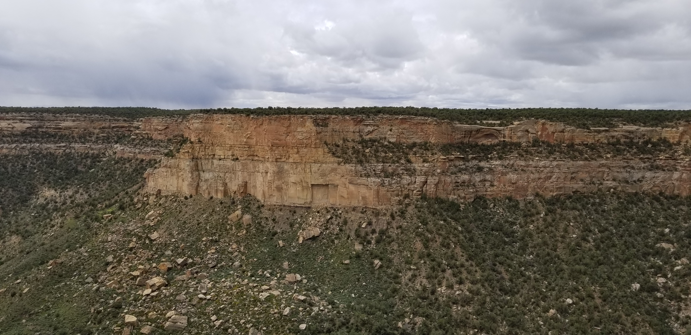

## :globe_with_meridians:Mesa Verde National Park, Colorado, U.S. (2019-05-21)
`Pictures` rcfdtools <br>`Category` Technical field visit <br>`Location` [Google Maps](http://maps.google.com/maps?q=37.184072,-108.488924) or [Openstreet Map](https://www.openstreetmap.org/query?lat=37.184072&lon=-108.488924) 

```geojson
{
  "type": "Feature",
  "geometry": {
    "type": "Point", 
    "coordinates": [-108.488924, 37.184072]
  }, 
  "properties": {
    "Name": "Mesa Verde National Park, Colorado, U.S."
  }
}
```

<br><details><summary>:camera:**39/20190521_122254.jpg**</summary><sub> `Exif version` 0220 `OS version` G955USQU5DSC1 `Date` 2019:05:21 12:22:54 `Aperture` Not known `Brightness` 10.21 `Color space` 1 `Compression` 6`Exposure mode` 0 `Exposure time` 0.00013646288209606986 `Focal length` 4.25 `Lens model` Not known `Lens specification` Not known `Orientation` 1 `Scene type` Not known `f number` 1.7 `White balance` 0 `Sensing method` 2 `Shutter speed` 12.839</sub><sub>`Coordinates & altitude` (0.0, 0.0, 0.0)</sub><sub> :globe_with_meridians:`Location over` [Google Maps](http://maps.google.com/maps?q=0.0,0.0) or [Openstreet Map](https://www.openstreetmap.org/query?lat=0.0&lon=0.0)</sub></details>

<br><details><summary>:camera:**39/20190521_122518.jpg**</summary><sub> `Exif version` 0220 `OS version` G955USQU5DSC1 `Date` 2019:05:21 12:25:18 `Aperture` Not known `Brightness` 9.61 `Color space` 1 `Compression` 6`Exposure mode` 0 `Exposure time` 0.00020292207792207794 `Focal length` 4.25 `Lens model` Not known `Lens specification` Not known `Orientation` 1 `Scene type` Not known `f number` 1.7 `White balance` 0 `Sensing method` 2 `Shutter speed` 12.266</sub><sub>`Coordinates & altitude` (0.0, 0.0, 0.0)</sub><sub> :globe_with_meridians:`Location over` [Google Maps](http://maps.google.com/maps?q=0.0,0.0) or [Openstreet Map](https://www.openstreetmap.org/query?lat=0.0&lon=0.0)</sub></details>

<br><details><summary>:camera:**39/20190521_122525.jpg**</summary><sub> `Exif version` 0220 `OS version` G955USQU5DSC1 `Date` 2019:05:21 12:25:25 `Aperture` Not known `Brightness` 9.6 `Color space` 1 `Compression` 6`Exposure mode` 0 `Exposure time` 0.00019904458598726116 `Focal length` 4.25 `Lens model` Not known `Lens specification` Not known `Orientation` 1 `Scene type` Not known `f number` 1.7 `White balance` 0 `Sensing method` 2 `Shutter speed` 12.294</sub><sub>`Coordinates & altitude` (0.0, 0.0, 0.0)</sub><sub> :globe_with_meridians:`Location over` [Google Maps](http://maps.google.com/maps?q=0.0,0.0) or [Openstreet Map](https://www.openstreetmap.org/query?lat=0.0&lon=0.0)</sub></details>

<br><details><summary>:camera:**39/20190521_122554.jpg**</summary><sub> `Exif version` 0220 `OS version` G955USQU5DSC1 `Date` 2019:05:21 12:25:54 `Aperture` Not known `Brightness` 8.09 `Color space` 1 `Compression` 6`Exposure mode` 0 `Exposure time` 0.0005995203836930455 `Focal length` 4.25 `Lens model` Not known `Lens specification` Not known `Orientation` 1 `Scene type` Not known `f number` 1.7 `White balance` 0 `Sensing method` 2 `Shutter speed` 10.703</sub><sub>`Coordinates & altitude` (0.0, 0.0, 0.0)</sub><sub> :globe_with_meridians:`Location over` [Google Maps](http://maps.google.com/maps?q=0.0,0.0) or [Openstreet Map](https://www.openstreetmap.org/query?lat=0.0&lon=0.0)</sub></details>

<br><details><summary>:camera:**39/20190521_122718.jpg**</summary><sub> `Exif version` 0220 `OS version` G955USQU5DSC1 `Date` 2019:05:21 12:27:17 `Aperture` Not known `Brightness` 7.07 `Color space` 1 `Compression` 6`Exposure mode` 0 `Exposure time` 0.0012048192771084338 `Focal length` 4.25 `Lens model` Not known `Lens specification` Not known `Orientation` 1 `Scene type` Not known `f number` 1.7 `White balance` 0 `Sensing method` 2 `Shutter speed` 9.696</sub><sub>`Coordinates & altitude` (0.0, 0.0, 0.0)</sub><sub> :globe_with_meridians:`Location over` [Google Maps](http://maps.google.com/maps?q=0.0,0.0) or [Openstreet Map](https://www.openstreetmap.org/query?lat=0.0&lon=0.0)</sub></details>

<br><details><summary>:camera:**39/20190521_122748.jpg**</summary><sub> `Exif version` 0220 `OS version` G955USQU5DSC1 `Date` 2019:05:21 12:27:48 `Aperture` Not known `Brightness` 6.16 `Color space` 1 `Compression` 6`Exposure mode` 0 `Exposure time` 0.0022026431718061676 `Focal length` 4.25 `Lens model` Not known `Lens specification` Not known `Orientation` 6 `Scene type` Not known `f number` 1.7 `White balance` 0 `Sensing method` 2 `Shutter speed` 8.826</sub><sub>`Coordinates & altitude` (0.0, 0.0, 0.0)</sub><sub> :globe_with_meridians:`Location over` [Google Maps](http://maps.google.com/maps?q=0.0,0.0) or [Openstreet Map](https://www.openstreetmap.org/query?lat=0.0&lon=0.0)</sub></details>

<br><details><summary>:camera:**39/20190521_122819.jpg**</summary><sub> `Exif version` 0220 `OS version` G955USQU5DSC1 `Date` 2019:05:21 12:28:19 `Aperture` Not known `Brightness` 6.74 `Color space` 1 `Compression` 6`Exposure mode` 0 `Exposure time` 0.001524390243902439 `Focal length` 4.25 `Lens model` Not known `Lens specification` Not known `Orientation` 6 `Scene type` Not known `f number` 1.7 `White balance` 0 `Sensing method` 2 `Shutter speed` 9.357</sub><sub>`Coordinates & altitude` (0.0, 0.0, 0.0)</sub><sub> :globe_with_meridians:`Location over` [Google Maps](http://maps.google.com/maps?q=0.0,0.0) or [Openstreet Map](https://www.openstreetmap.org/query?lat=0.0&lon=0.0)</sub></details>

<br><details><summary>:camera:**39/20190521_132502.jpg**</summary><sub> `Exif version` 0220 `OS version` G955USQU5DSC1 `Date` 2019:05:21 13:25:02 `Aperture` Not known `Brightness` 9.22 `Color space` 1 `Compression` 6`Exposure mode` 0 `Exposure time` 0.0002699784017278618 `Focal length` 4.25 `Lens model` Not known `Lens specification` Not known `Orientation` 1 `Scene type` Not known `f number` 1.7 `White balance` 0 `Sensing method` 2 `Shutter speed` 11.854</sub><sub>`Coordinates & altitude` (0.0, 0.0, 0.0)</sub><sub> :globe_with_meridians:`Location over` [Google Maps](http://maps.google.com/maps?q=0.0,0.0) or [Openstreet Map](https://www.openstreetmap.org/query?lat=0.0&lon=0.0)</sub></details>

<br><details><summary>:camera:**39/20190521_132504.jpg**</summary><sub> `Exif version` 0220 `OS version` G955USQU5DSC1 `Date` 2019:05:21 13:25:04 `Aperture` Not known `Brightness` 9.19 `Color space` 1 `Compression` 6`Exposure mode` 0 `Exposure time` 0.0002765486725663717 `Focal length` 4.25 `Lens model` Not known `Lens specification` Not known `Orientation` 1 `Scene type` Not known `f number` 1.7 `White balance` 0 `Sensing method` 2 `Shutter speed` 11.82</sub><sub>`Coordinates & altitude` (0.0, 0.0, 0.0)</sub><sub> :globe_with_meridians:`Location over` [Google Maps](http://maps.google.com/maps?q=0.0,0.0) or [Openstreet Map](https://www.openstreetmap.org/query?lat=0.0&lon=0.0)</sub></details>

<br><details><summary>:camera:**39/20190521_132507.jpg**</summary><sub> `Exif version` 0220 `OS version` G955USQU5DSC1 `Date` 2019:05:21 13:25:06 `Aperture` Not known `Brightness` 8.8 `Color space` 1 `Compression` 6`Exposure mode` 0 `Exposure time` 0.00036443148688046647 `Focal length` 4.25 `Lens model` Not known `Lens specification` Not known `Orientation` 1 `Scene type` Not known `f number` 1.7 `White balance` 0 `Sensing method` 2 `Shutter speed` 11.422</sub><sub>`Coordinates & altitude` (0.0, 0.0, 0.0)</sub><sub> :globe_with_meridians:`Location over` [Google Maps](http://maps.google.com/maps?q=0.0,0.0) or [Openstreet Map](https://www.openstreetmap.org/query?lat=0.0&lon=0.0)</sub></details>

<br><details><summary>:camera:**39/20190521_132509.jpg**</summary><sub> `Exif version` 0220 `OS version` G955USQU5DSC1 `Date` 2019:05:21 13:25:09 `Aperture` Not known `Brightness` 8.58 `Color space` 1 `Compression` 6`Exposure mode` 0 `Exposure time` 0.00041118421052631577 `Focal length` 4.25 `Lens model` Not known `Lens specification` Not known `Orientation` 1 `Scene type` Not known `f number` 1.7 `White balance` 0 `Sensing method` 2 `Shutter speed` 11.247</sub><sub>`Coordinates & altitude` (0.0, 0.0, 0.0)</sub><sub> :globe_with_meridians:`Location over` [Google Maps](http://maps.google.com/maps?q=0.0,0.0) or [Openstreet Map](https://www.openstreetmap.org/query?lat=0.0&lon=0.0)</sub></details>

<br><details><summary>:camera:**39/20190521_132553.jpg**</summary><sub> `Exif version` 0220 `OS version` G955USQU5DSC1 `Date` 2019:05:21 13:25:52 `Aperture` Not known `Brightness` Not known `Color space` 1 `Compression` Not known`Exposure mode` 0 `Exposure time` Not known `Focal length` 4.25 `Lens model` Not known `Lens specification` Not known `Orientation` 1 `Scene type` Not known `f number` 1.7 `White balance` 0 `Sensing method` Not known `Shutter speed` Not known</sub></details>

<br><details><summary>:camera:**39/20190521_132625.jpg**</summary><sub> `Exif version` 0220 `OS version` G955USQU5DSC1 `Date` 2019:05:21 13:26:25 `Aperture` Not known `Brightness` 8.57 `Color space` 1 `Compression` 6`Exposure mode` 0 `Exposure time` 0.0004266211604095563 `Focal length` 4.25 `Lens model` Not known `Lens specification` Not known `Orientation` 6 `Scene type` Not known `f number` 1.7 `White balance` 0 `Sensing method` 2 `Shutter speed` 11.194</sub><sub>`Coordinates & altitude` (37.166954499999996, -108.49288638888889, 2057.504)</sub><sub> :globe_with_meridians:`Location over` [Google Maps](http://maps.google.com/maps?q=37.166954499999996,-108.49288638888889) or [Openstreet Map](https://www.openstreetmap.org/query?lat=37.166954499999996&lon=-108.49288638888889)</sub></details>

<br><details><summary>:camera:**39/20190521_132630.jpg**</summary><sub> `Exif version` 0220 `OS version` G955USQU5DSC1 `Date` 2019:05:21 13:26:30 `Aperture` Not known `Brightness` 9.38 `Color space` 1 `Compression` 6`Exposure mode` 0 `Exposure time` 0.0002376425855513308 `Focal length` 4.25 `Lens model` Not known `Lens specification` Not known `Orientation` 6 `Scene type` Not known `f number` 1.7 `White balance` 0 `Sensing method` 2 `Shutter speed` 12.038</sub><sub>`Coordinates & altitude` (37.166954499999996, -108.49288638888889, 2057.504)</sub><sub> :globe_with_meridians:`Location over` [Google Maps](http://maps.google.com/maps?q=37.166954499999996,-108.49288638888889) or [Openstreet Map](https://www.openstreetmap.org/query?lat=37.166954499999996&lon=-108.49288638888889)</sub></details>

<br><details><summary>:camera:**39/20190521_132637.jpg**</summary><sub> `Exif version` 0220 `OS version` G955USQU5DSC1 `Date` 2019:05:21 13:26:37 `Aperture` Not known `Brightness` 8.66 `Color space` 1 `Compression` 6`Exposure mode` 0 `Exposure time` 0.00040096230954290296 `Focal length` 4.25 `Lens model` Not known `Lens specification` Not known `Orientation` 1 `Scene type` Not known `f number` 1.7 `White balance` 0 `Sensing method` 2 `Shutter speed` 11.284</sub><sub>`Coordinates & altitude` (37.166954499999996, -108.49288638888889, 2057.504)</sub><sub> :globe_with_meridians:`Location over` [Google Maps](http://maps.google.com/maps?q=37.166954499999996,-108.49288638888889) or [Openstreet Map](https://www.openstreetmap.org/query?lat=37.166954499999996&lon=-108.49288638888889)</sub></details>

<br><details><summary>:camera:**39/20190521_132642.jpg**</summary><sub> `Exif version` 0220 `OS version` G955USQU5DSC1 `Date` 2019:05:21 13:26:41 `Aperture` Not known `Brightness` 7.82 `Color space` 1 `Compression` 6`Exposure mode` 0 `Exposure time` 0.0007331378299120235 `Focal length` 4.25 `Lens model` Not known `Lens specification` Not known `Orientation` 1 `Scene type` Not known `f number` 1.7 `White balance` 0 `Sensing method` 2 `Shutter speed` 10.413</sub><sub>`Coordinates & altitude` (37.166954499999996, -108.49288638888889, 2057.504)</sub><sub> :globe_with_meridians:`Location over` [Google Maps](http://maps.google.com/maps?q=37.166954499999996,-108.49288638888889) or [Openstreet Map](https://www.openstreetmap.org/query?lat=37.166954499999996&lon=-108.49288638888889)</sub></details>

<br><details><summary>:camera:**39/20190521_133452.jpg**</summary><sub> `Exif version` 0220 `OS version` G955USQU5DSC1 `Date` 2019:05:21 13:34:52 `Aperture` Not known `Brightness` 7.52 `Color space` 1 `Compression` 6`Exposure mode` 0 `Exposure time` 0.0008278145695364238 `Focal length` 4.25 `Lens model` Not known `Lens specification` Not known `Orientation` 1 `Scene type` Not known `f number` 1.7 `White balance` 0 `Sensing method` 2 `Shutter speed` 10.238</sub><sub>`Coordinates & altitude` (37.16578558333333, -108.49157130555555, 2062.777)</sub><sub> :globe_with_meridians:`Location over` [Google Maps](http://maps.google.com/maps?q=37.16578558333333,-108.49157130555555) or [Openstreet Map](https://www.openstreetmap.org/query?lat=37.16578558333333&lon=-108.49157130555555)</sub></details>

<br><details><summary>:camera:**39/20190521_133455.jpg**</summary><sub> `Exif version` 0220 `OS version` G955USQU5DSC1 `Date` 2019:05:21 13:34:55 `Aperture` Not known `Brightness` 7.62 `Color space` 1 `Compression` 6`Exposure mode` 0 `Exposure time` 0.0008169934640522876 `Focal length` 4.25 `Lens model` Not known `Lens specification` Not known `Orientation` 1 `Scene type` Not known `f number` 1.7 `White balance` 0 `Sensing method` 2 `Shutter speed` 10.257</sub><sub>`Coordinates & altitude` (37.16578558333333, -108.49157130555555, 2062.777)</sub><sub> :globe_with_meridians:`Location over` [Google Maps](http://maps.google.com/maps?q=37.16578558333333,-108.49157130555555) or [Openstreet Map](https://www.openstreetmap.org/query?lat=37.16578558333333&lon=-108.49157130555555)</sub></details>

<br><details><summary>:camera:**39/20190521_133501.jpg**</summary><sub> `Exif version` 0220 `OS version` G955USQU5DSC1 `Date` 2019:05:21 13:35:01 `Aperture` Not known `Brightness` 7.58 `Color space` 1 `Compression` 6`Exposure mode` 0 `Exposure time` 0.0008710801393728223 `Focal length` 4.25 `Lens model` Not known `Lens specification` Not known `Orientation` 1 `Scene type` Not known `f number` 1.7 `White balance` 0 `Sensing method` 2 `Shutter speed` 10.165</sub><sub>`Coordinates & altitude` (37.16578558333333, -108.49157130555555, 2062.777)</sub><sub> :globe_with_meridians:`Location over` [Google Maps](http://maps.google.com/maps?q=37.16578558333333,-108.49157130555555) or [Openstreet Map](https://www.openstreetmap.org/query?lat=37.16578558333333&lon=-108.49157130555555)</sub></details>

<br><details><summary>:camera:**39/20190521_133506.jpg**</summary><sub> `Exif version` 0220 `OS version` G955USQU5DSC1 `Date` 2019:05:21 13:35:06 `Aperture` Not known `Brightness` 8.71 `Color space` 1 `Compression` 6`Exposure mode` 0 `Exposure time` 0.00038109756097560977 `Focal length` 4.25 `Lens model` Not known `Lens specification` Not known `Orientation` 6 `Scene type` Not known `f number` 1.7 `White balance` 0 `Sensing method` 2 `Shutter speed` 11.357</sub><sub>`Coordinates & altitude` (37.16578558333333, -108.49157130555555, 2062.777)</sub><sub> :globe_with_meridians:`Location over` [Google Maps](http://maps.google.com/maps?q=37.16578558333333,-108.49157130555555) or [Openstreet Map](https://www.openstreetmap.org/query?lat=37.16578558333333&lon=-108.49157130555555)</sub></details>

<br><details><summary>:camera:**39/20190521_133509.jpg**</summary><sub> `Exif version` 0220 `OS version` G955USQU5DSC1 `Date` 2019:05:21 13:35:08 `Aperture` Not known `Brightness` 8.7 `Color space` 1 `Compression` 6`Exposure mode` 0 `Exposure time` 0.0003869969040247678 `Focal length` 4.25 `Lens model` Not known `Lens specification` Not known `Orientation` 6 `Scene type` Not known `f number` 1.7 `White balance` 0 `Sensing method` 2 `Shutter speed` 11.335</sub><sub>`Coordinates & altitude` (37.16578558333333, -108.49157130555555, 2062.777)</sub><sub> :globe_with_meridians:`Location over` [Google Maps](http://maps.google.com/maps?q=37.16578558333333,-108.49157130555555) or [Openstreet Map](https://www.openstreetmap.org/query?lat=37.16578558333333&lon=-108.49157130555555)</sub></details>

<br><details><summary>:camera:**39/20190521_133513.jpg**</summary><sub> `Exif version` 0220 `OS version` G955USQU5DSC1 `Date` 2019:05:21 13:35:13 `Aperture` Not known `Brightness` 8.22 `Color space` 1 `Compression` 6`Exposure mode` 0 `Exposure time` 0.0005186721991701245 `Focal length` 4.25 `Lens model` Not known `Lens specification` Not known `Orientation` 1 `Scene type` Not known `f number` 1.7 `White balance` 0 `Sensing method` 2 `Shutter speed` 10.912</sub><sub>`Coordinates & altitude` (37.16578558333333, -108.49157130555555, 2062.777)</sub><sub> :globe_with_meridians:`Location over` [Google Maps](http://maps.google.com/maps?q=37.16578558333333,-108.49157130555555) or [Openstreet Map](https://www.openstreetmap.org/query?lat=37.16578558333333&lon=-108.49157130555555)</sub></details>

<br><details><summary>:camera:**39/20190521_133538.jpg**</summary><sub> `Exif version` 0220 `OS version` G955USQU5DSC1 `Date` 2019:05:21 13:35:38 `Aperture` Not known `Brightness` 8.03 `Color space` 1 `Compression` 6`Exposure mode` 0 `Exposure time` 0.0006049606775559589 `Focal length` 4.25 `Lens model` Not known `Lens specification` Not known `Orientation` 6 `Scene type` Not known `f number` 1.7 `White balance` 0 `Sensing method` 2 `Shutter speed` 10.69</sub><sub>`Coordinates & altitude` (37.165877916666666, -108.49140716666666, 2072.807)</sub><sub> :globe_with_meridians:`Location over` [Google Maps](http://maps.google.com/maps?q=37.165877916666666,-108.49140716666666) or [Openstreet Map](https://www.openstreetmap.org/query?lat=37.165877916666666&lon=-108.49140716666666)</sub></details>

<br><details><summary>:camera:**39/20190521_133543.jpg**</summary><sub> `Exif version` 0220 `OS version` G955USQU5DSC1 `Date` 2019:05:21 13:35:42 `Aperture` Not known `Brightness` 7.62 `Color space` 1 `Compression` 6`Exposure mode` 0 `Exposure time` 0.0008382229673093043 `Focal length` 4.25 `Lens model` Not known `Lens specification` Not known `Orientation` 6 `Scene type` Not known `f number` 1.7 `White balance` 0 `Sensing method` 2 `Shutter speed` 10.22</sub><sub>`Coordinates & altitude` (37.165877916666666, -108.49140716666666, 2072.807)</sub><sub> :globe_with_meridians:`Location over` [Google Maps](http://maps.google.com/maps?q=37.165877916666666,-108.49140716666666) or [Openstreet Map](https://www.openstreetmap.org/query?lat=37.165877916666666&lon=-108.49140716666666)</sub></details>

<br><details><summary>:camera:**39/20190521_133635.jpg**</summary><sub> `Exif version` 0220 `OS version` G955USQU5DSC1 `Date` 2019:05:21 13:36:35 `Aperture` Not known `Brightness` 8.71 `Color space` 1 `Compression` 6`Exposure mode` 0 `Exposure time` 0.00037425149700598805 `Focal length` 4.25 `Lens model` Not known `Lens specification` Not known `Orientation` 1 `Scene type` Not known `f number` 1.7 `White balance` 0 `Sensing method` 2 `Shutter speed` 11.383</sub><sub>`Coordinates & altitude` (37.165802194444446, -108.49146708333333, 2068.949)</sub><sub> :globe_with_meridians:`Location over` [Google Maps](http://maps.google.com/maps?q=37.165802194444446,-108.49146708333333) or [Openstreet Map](https://www.openstreetmap.org/query?lat=37.165802194444446&lon=-108.49146708333333)</sub></details>

<br><details><summary>:camera:**39/20190521_133646.jpg**</summary><sub> `Exif version` 0220 `OS version` G955USQU5DSC1 `Date` 2019:05:21 13:36:46 `Aperture` Not known `Brightness` 8.42 `Color space` 1 `Compression` 6`Exposure mode` 0 `Exposure time` 0.0004807692307692308 `Focal length` 4.25 `Lens model` Not known `Lens specification` Not known `Orientation` 1 `Scene type` Not known `f number` 1.7 `White balance` 0 `Sensing method` 2 `Shutter speed` 11.022</sub><sub>`Coordinates & altitude` (37.165802194444446, -108.49146708333333, 2068.949)</sub><sub> :globe_with_meridians:`Location over` [Google Maps](http://maps.google.com/maps?q=37.165802194444446,-108.49146708333333) or [Openstreet Map](https://www.openstreetmap.org/query?lat=37.165802194444446&lon=-108.49146708333333)</sub></details>

<br><details><summary>:camera:**39/20190521_133707.jpg**</summary><sub> `Exif version` 0220 `OS version` G955USQU5DSC1 `Date` 2019:05:21 13:37:07 `Aperture` Not known `Brightness` Not known `Color space` 1 `Compression` Not known`Exposure mode` 0 `Exposure time` Not known `Focal length` 4.25 `Lens model` Not known `Lens specification` Not known `Orientation` 1 `Scene type` Not known `f number` 1.7 `White balance` 0 `Sensing method` Not known `Shutter speed` Not known</sub></details>

<br><details><summary>:camera:**39/20190521_133722.jpg**</summary><sub> `Exif version` 0220 `OS version` G955USQU5DSC1 `Date` 2019:05:21 13:37:21 `Aperture` Not known `Brightness` 9.39 `Color space` 1 `Compression` 6`Exposure mode` 0 `Exposure time` 0.000250501002004008 `Focal length` 4.25 `Lens model` Not known `Lens specification` Not known `Orientation` 1 `Scene type` Not known `f number` 1.7 `White balance` 0 `Sensing method` 2 `Shutter speed` 11.962</sub><sub>`Coordinates & altitude` (37.165782138888886, -108.49154641666667, 2063.954)</sub><sub> :globe_with_meridians:`Location over` [Google Maps](http://maps.google.com/maps?q=37.165782138888886,-108.49154641666667) or [Openstreet Map](https://www.openstreetmap.org/query?lat=37.165782138888886&lon=-108.49154641666667)</sub></details>

<br><details><summary>:camera:**39/20190521_134520.jpg**</summary><sub> `Exif version` 0220 `OS version` G955USQU5DSC1 `Date` 2019:05:21 13:45:20 `Aperture` Not known `Brightness` 8.57 `Color space` 1 `Compression` 6`Exposure mode` 0 `Exposure time` 0.0004222972972972973 `Focal length` 4.25 `Lens model` Not known `Lens specification` Not known `Orientation` 1 `Scene type` Not known `f number` 1.7 `White balance` 0 `Sensing method` 2 `Shutter speed` 11.209</sub><sub>`Coordinates & altitude` (37.16344997222222, -108.48380227777778, 2085.062)</sub><sub> :globe_with_meridians:`Location over` [Google Maps](http://maps.google.com/maps?q=37.16344997222222,-108.48380227777778) or [Openstreet Map](https://www.openstreetmap.org/query?lat=37.16344997222222&lon=-108.48380227777778)</sub></details>

<br><details><summary>:camera:**39/20190521_134525.jpg**</summary><sub> `Exif version` 0220 `OS version` G955USQU5DSC1 `Date` 2019:05:21 13:45:25 `Aperture` Not known `Brightness` 8.26 `Color space` 1 `Compression` 6`Exposure mode` 0 `Exposure time` 0.0005040322580645161 `Focal length` 4.25 `Lens model` Not known `Lens specification` Not known `Orientation` 6 `Scene type` Not known `f number` 1.7 `White balance` 0 `Sensing method` 2 `Shutter speed` 10.954</sub><sub>`Coordinates & altitude` (37.16345013888889, -108.48377519444445, 2083.437)</sub><sub> :globe_with_meridians:`Location over` [Google Maps](http://maps.google.com/maps?q=37.16345013888889,-108.48377519444445) or [Openstreet Map](https://www.openstreetmap.org/query?lat=37.16345013888889&lon=-108.48377519444445)</sub></details>

<br><details><summary>:camera:**39/20190521_134640.jpg**</summary><sub> `Exif version` 0220 `OS version` G955USQU5DSC1 `Date` 2019:05:21 13:46:40 `Aperture` Not known `Brightness` 2.13 `Color space` 1 `Compression` 6`Exposure mode` 0 `Exposure time` 0.016666666666666666 `Focal length` 4.25 `Lens model` Not known `Lens specification` Not known `Orientation` 1 `Scene type` Not known `f number` 1.7 `White balance` 0 `Sensing method` 2 `Shutter speed` 5.906</sub><sub>`Coordinates & altitude` (37.163358305555555, -108.48377936111112, 2088.145)</sub><sub> :globe_with_meridians:`Location over` [Google Maps](http://maps.google.com/maps?q=37.163358305555555,-108.48377936111112) or [Openstreet Map](https://www.openstreetmap.org/query?lat=37.163358305555555&lon=-108.48377936111112)</sub></details>

<br><details><summary>:camera:**39/20190521_134645.jpg**</summary><sub> `Exif version` 0220 `OS version` G955USQU5DSC1 `Date` 2019:05:21 13:46:45 `Aperture` Not known `Brightness` 2.18 `Color space` 1 `Compression` 6`Exposure mode` 0 `Exposure time` 0.016666666666666666 `Focal length` 4.25 `Lens model` Not known `Lens specification` Not known `Orientation` 1 `Scene type` Not known `f number` 1.7 `White balance` 0 `Sensing method` 2 `Shutter speed` 5.906</sub><sub>`Coordinates & altitude` (37.163358305555555, -108.48377936111112, 2088.145)</sub><sub> :globe_with_meridians:`Location over` [Google Maps](http://maps.google.com/maps?q=37.163358305555555,-108.48377936111112) or [Openstreet Map](https://www.openstreetmap.org/query?lat=37.163358305555555&lon=-108.48377936111112)</sub></details>

<br><details><summary>:camera:**39/20190521_134658.jpg**</summary><sub> `Exif version` 0220 `OS version` G955USQU5DSC1 `Date` 2019:05:21 13:46:58 `Aperture` Not known `Brightness` 2.19 `Color space` 1 `Compression` 6`Exposure mode` 0 `Exposure time` 0.016666666666666666 `Focal length` 4.25 `Lens model` Not known `Lens specification` Not known `Orientation` 1 `Scene type` Not known `f number` 1.7 `White balance` 0 `Sensing method` 2 `Shutter speed` 5.906</sub><sub>`Coordinates & altitude` (37.163358305555555, -108.48377936111112, 2088.145)</sub><sub> :globe_with_meridians:`Location over` [Google Maps](http://maps.google.com/maps?q=37.163358305555555,-108.48377936111112) or [Openstreet Map](https://www.openstreetmap.org/query?lat=37.163358305555555&lon=-108.48377936111112)</sub></details>

<br><details><summary>:camera:**39/20190521_134823.jpg**</summary><sub> `Exif version` 0220 `OS version` G955USQU5DSC1 `Date` 2019:05:21 13:48:23 `Aperture` Not known `Brightness` 1.6 `Color space` 1 `Compression` 6`Exposure mode` 0 `Exposure time` 0.016666666666666666 `Focal length` 4.25 `Lens model` Not known `Lens specification` Not known `Orientation` 1 `Scene type` Not known `f number` 1.7 `White balance` 0 `Sensing method` 2 `Shutter speed` 5.906</sub><sub>`Coordinates & altitude` (37.163253222222224, -108.48373452777778, 2088.768)</sub><sub> :globe_with_meridians:`Location over` [Google Maps](http://maps.google.com/maps?q=37.163253222222224,-108.48373452777778) or [Openstreet Map](https://www.openstreetmap.org/query?lat=37.163253222222224&lon=-108.48373452777778)</sub></details>

<br><details><summary>:camera:**39/20190521_134831.jpg**</summary><sub> `Exif version` 0220 `OS version` G955USQU5DSC1 `Date` 2019:05:21 13:48:31 `Aperture` Not known `Brightness` 1.51 `Color space` 1 `Compression` 6`Exposure mode` 0 `Exposure time` 0.02 `Focal length` 4.25 `Lens model` Not known `Lens specification` Not known `Orientation` 1 `Scene type` Not known `f number` 1.7 `White balance` 0 `Sensing method` 2 `Shutter speed` 5.643</sub><sub>`Coordinates & altitude` (37.163253222222224, -108.48373452777778, 2088.768)</sub><sub> :globe_with_meridians:`Location over` [Google Maps](http://maps.google.com/maps?q=37.163253222222224,-108.48373452777778) or [Openstreet Map](https://www.openstreetmap.org/query?lat=37.163253222222224&lon=-108.48373452777778)</sub></details>

<br><details><summary>:camera:**39/20190521_135025.jpg**</summary><sub> `Exif version` 0220 `OS version` G955USQU5DSC1 `Date` 2019:05:21 13:50:25 `Aperture` Not known `Brightness` 6.39 `Color space` 1 `Compression` 6`Exposure mode` 0 `Exposure time` 0.0019157088122605363 `Focal length` 4.25 `Lens model` Not known `Lens specification` Not known `Orientation` 1 `Scene type` Not known `f number` 1.7 `White balance` 0 `Sensing method` 2 `Shutter speed` 9.027</sub><sub>`Coordinates & altitude` (37.16329461111111, -108.48381847222223, 2077.489)</sub><sub> :globe_with_meridians:`Location over` [Google Maps](http://maps.google.com/maps?q=37.16329461111111,-108.48381847222223) or [Openstreet Map](https://www.openstreetmap.org/query?lat=37.16329461111111&lon=-108.48381847222223)</sub></details>

<br><details><summary>:camera:**39/20190521_135030.jpg**</summary><sub> `Exif version` 0220 `OS version` G955USQU5DSC1 `Date` 2019:05:21 13:50:30 `Aperture` Not known `Brightness` 5.43 `Color space` 1 `Compression` 6`Exposure mode` 0 `Exposure time` 0.0037313432835820895 `Focal length` 4.25 `Lens model` Not known `Lens specification` Not known `Orientation` 1 `Scene type` Not known `f number` 1.7 `White balance` 0 `Sensing method` 2 `Shutter speed` 8.066</sub><sub>`Coordinates & altitude` (37.16330027777778, -108.48383569444445, 2079.059)</sub><sub> :globe_with_meridians:`Location over` [Google Maps](http://maps.google.com/maps?q=37.16330027777778,-108.48383569444445) or [Openstreet Map](https://www.openstreetmap.org/query?lat=37.16330027777778&lon=-108.48383569444445)</sub></details>

<br><details><summary>:camera:**39/20190521_135041.jpg**</summary><sub> `Exif version` 0220 `OS version` G955USQU5DSC1 `Date` 2019:05:21 13:50:41 `Aperture` Not known `Brightness` 6.37 `Color space` 1 `Compression` 6`Exposure mode` 0 `Exposure time` 0.0018587360594795538 `Focal length` 4.25 `Lens model` Not known `Lens specification` Not known `Orientation` 6 `Scene type` Not known `f number` 1.7 `White balance` 0 `Sensing method` 2 `Shutter speed` 9.071</sub><sub>`Coordinates & altitude` (37.16330027777778, -108.48383569444445, 2079.059)</sub><sub> :globe_with_meridians:`Location over` [Google Maps](http://maps.google.com/maps?q=37.16330027777778,-108.48383569444445) or [Openstreet Map](https://www.openstreetmap.org/query?lat=37.16330027777778&lon=-108.48383569444445)</sub></details>

<br><details><summary>:camera:**39/20190521_135716.jpg**</summary><sub> `Exif version` 0220 `OS version` G955USQU5DSC1 `Date` 2019:05:21 13:57:16 `Aperture` Not known `Brightness` Not known `Color space` 1 `Compression` Not known`Exposure mode` 0 `Exposure time` Not known `Focal length` 4.25 `Lens model` Not known `Lens specification` Not known `Orientation` 3 `Scene type` Not known `f number` 1.7 `White balance` 0 `Sensing method` Not known `Shutter speed` Not known</sub></details>

<br><details><summary>:camera:**39/20190521_135733.jpg**</summary><sub> `Exif version` 0220 `OS version` G955USQU5DSC1 `Date` 2019:05:21 13:57:33 `Aperture` Not known `Brightness` 6.17 `Color space` 1 `Compression` 6`Exposure mode` 0 `Exposure time` 0.0022935779816513763 `Focal length` 4.25 `Lens model` Not known `Lens specification` Not known `Orientation` 1 `Scene type` Not known `f number` 1.7 `White balance` 0 `Sensing method` 2 `Shutter speed` 8.768</sub><sub>`Coordinates & altitude` (37.16238927777778, -108.4750861388889, 2036.487)</sub><sub> :globe_with_meridians:`Location over` [Google Maps](http://maps.google.com/maps?q=37.16238927777778,-108.4750861388889) or [Openstreet Map](https://www.openstreetmap.org/query?lat=37.16238927777778&lon=-108.4750861388889)</sub></details>

<br><details><summary>:camera:**39/20190521_135740.jpg**</summary><sub> `Exif version` 0220 `OS version` G955USQU5DSC1 `Date` 2019:05:21 13:57:40 `Aperture` Not known `Brightness` 7.65 `Color space` 1 `Compression` 6`Exposure mode` 0 `Exposure time` 0.0007880220646178094 `Focal length` 4.25 `Lens model` Not known `Lens specification` Not known `Orientation` 1 `Scene type` Not known `f number` 1.7 `White balance` 0 `Sensing method` 2 `Shutter speed` 10.309</sub><sub>`Coordinates & altitude` (37.16238927777778, -108.4750861388889, 2036.487)</sub><sub> :globe_with_meridians:`Location over` [Google Maps](http://maps.google.com/maps?q=37.16238927777778,-108.4750861388889) or [Openstreet Map](https://www.openstreetmap.org/query?lat=37.16238927777778&lon=-108.4750861388889)</sub></details>

<br><details><summary>:camera:**39/20190521_135814.jpg**</summary><sub> `Exif version` 0220 `OS version` G955USQU5DSC1 `Date` 2019:05:21 13:58:14 `Aperture` Not known `Brightness` 9.11 `Color space` 1 `Compression` 6`Exposure mode` 0 `Exposure time` 0.0002900232018561485 `Focal length` 4.25 `Lens model` Not known `Lens specification` Not known `Orientation` 1 `Scene type` Not known `f number` 1.7 `White balance` 0 `Sensing method` 2 `Shutter speed` 11.751</sub><sub>`Coordinates & altitude` (37.162387277777775, -108.47508405555556, 2034.625)</sub><sub> :globe_with_meridians:`Location over` [Google Maps](http://maps.google.com/maps?q=37.162387277777775,-108.47508405555556) or [Openstreet Map](https://www.openstreetmap.org/query?lat=37.162387277777775&lon=-108.47508405555556)</sub></details>

<br><details><summary>:camera:**39/20190521_135823.jpg**</summary><sub> `Exif version` 0220 `OS version` G955USQU5DSC1 `Date` 2019:05:21 13:58:23 `Aperture` Not known `Brightness` 6.06 `Color space` 1 `Compression` 6`Exposure mode` 0 `Exposure time` 0.0024813895781637717 `Focal length` 4.25 `Lens model` Not known `Lens specification` Not known `Orientation` 1 `Scene type` Not known `f number` 1.7 `White balance` 0 `Sensing method` 2 `Shutter speed` 8.654</sub><sub>`Coordinates & altitude` (37.162387277777775, -108.47508405555556, 2034.625)</sub><sub> :globe_with_meridians:`Location over` [Google Maps](http://maps.google.com/maps?q=37.162387277777775,-108.47508405555556) or [Openstreet Map](https://www.openstreetmap.org/query?lat=37.162387277777775&lon=-108.47508405555556)</sub></details>

<br><details><summary>:camera:**39/20190521_135837.jpg**</summary><sub> `Exif version` 0220 `OS version` G955USQU5DSC1 `Date` 2019:05:21 13:58:37 `Aperture` Not known `Brightness` 7.67 `Color space` 1 `Compression` 6`Exposure mode` 0 `Exposure time` 0.0007727975270479134 `Focal length` 4.25 `Lens model` Not known `Lens specification` Not known `Orientation` 1 `Scene type` Not known `f number` 1.7 `White balance` 0 `Sensing method` 2 `Shutter speed` 10.337</sub><sub>`Coordinates & altitude` (37.162387277777775, -108.47508405555556, 2034.625)</sub><sub> :globe_with_meridians:`Location over` [Google Maps](http://maps.google.com/maps?q=37.162387277777775,-108.47508405555556) or [Openstreet Map](https://www.openstreetmap.org/query?lat=37.162387277777775&lon=-108.47508405555556)</sub></details>

<br><details><summary>:camera:**39/20190521_135915.jpg**</summary><sub> `Exif version` 0220 `OS version` G955USQU5DSC1 `Date` 2019:05:21 13:59:15 `Aperture` Not known `Brightness` 8.37 `Color space` 1 `Compression` 6`Exposure mode` 0 `Exposure time` 0.00035298270384751147 `Focal length` 4.25 `Lens model` Not known `Lens specification` Not known `Orientation` 1 `Scene type` Not known `f number` 1.7 `White balance` 0 `Sensing method` 2 `Shutter speed` 11.468</sub><sub>`Coordinates & altitude` (37.16246958333333, -108.47509244444444, 2050.059)</sub><sub> :globe_with_meridians:`Location over` [Google Maps](http://maps.google.com/maps?q=37.16246958333333,-108.47509244444444) or [Openstreet Map](https://www.openstreetmap.org/query?lat=37.16246958333333&lon=-108.47509244444444)</sub></details>

<br><details><summary>:camera:**39/20190521_135918.jpg**</summary><sub> `Exif version` 0220 `OS version` G955USQU5DSC1 `Date` 2019:05:21 13:59:18 `Aperture` Not known `Brightness` 8.23 `Color space` 1 `Compression` 6`Exposure mode` 0 `Exposure time` 0.0003729951510630362 `Focal length` 4.25 `Lens model` Not known `Lens specification` Not known `Orientation` 1 `Scene type` Not known `f number` 1.7 `White balance` 0 `Sensing method` 2 `Shutter speed` 11.388</sub><sub>`Coordinates & altitude` (37.16246958333333, -108.47509244444444, 2050.059)</sub><sub> :globe_with_meridians:`Location over` [Google Maps](http://maps.google.com/maps?q=37.16246958333333,-108.47509244444444) or [Openstreet Map](https://www.openstreetmap.org/query?lat=37.16246958333333&lon=-108.47509244444444)</sub></details>

<br><details><summary>:camera:**39/20190521_140107.jpg**</summary><sub> `Exif version` 0220 `OS version` G955USQU5DSC1 `Date` 2019:05:21 14:01:07 `Aperture` Not known `Brightness` 7.79 `Color space` 1 `Compression` 6`Exposure mode` 0 `Exposure time` 0.0007163323782234957 `Focal length` 4.25 `Lens model` Not known `Lens specification` Not known `Orientation` 1 `Scene type` Not known `f number` 1.7 `White balance` 0 `Sensing method` 2 `Shutter speed` 10.447</sub><sub>`Coordinates & altitude` (37.162389222222224, -108.47499769444444, 2040.256)</sub><sub> :globe_with_meridians:`Location over` [Google Maps](http://maps.google.com/maps?q=37.162389222222224,-108.47499769444444) or [Openstreet Map](https://www.openstreetmap.org/query?lat=37.162389222222224&lon=-108.47499769444444)</sub></details>

<br><details><summary>:camera:**39/20190521_140122.jpg**</summary><sub> `Exif version` 0220 `OS version` G955USQU5DSC1 `Date` 2019:05:21 14:01:22 `Aperture` Not known `Brightness` 7.85 `Color space` 1 `Compression` 6`Exposure mode` 0 `Exposure time` 0.0006648936170212766 `Focal length` 4.25 `Lens model` Not known `Lens specification` Not known `Orientation` 1 `Scene type` Not known `f number` 1.7 `White balance` 0 `Sensing method` 2 `Shutter speed` 10.554</sub><sub>`Coordinates & altitude` (37.162488249999996, -108.47507852777778, 2043.135)</sub><sub> :globe_with_meridians:`Location over` [Google Maps](http://maps.google.com/maps?q=37.162488249999996,-108.47507852777778) or [Openstreet Map](https://www.openstreetmap.org/query?lat=37.162488249999996&lon=-108.47507852777778)</sub></details>

<br><details><summary>:camera:**39/20190521_140129.jpg**</summary><sub> `Exif version` 0220 `OS version` G955USQU5DSC1 `Date` 2019:05:21 14:01:29 `Aperture` Not known `Brightness` 7.4 `Color space` 1 `Compression` 6`Exposure mode` 0 `Exposure time` 0.0009433962264150943 `Focal length` 4.25 `Lens model` Not known `Lens specification` Not known `Orientation` 1 `Scene type` Not known `f number` 1.7 `White balance` 0 `Sensing method` 2 `Shutter speed` 10.049</sub><sub>`Coordinates & altitude` (37.162488249999996, -108.47507852777778, 2043.135)</sub><sub> :globe_with_meridians:`Location over` [Google Maps](http://maps.google.com/maps?q=37.162488249999996,-108.47507852777778) or [Openstreet Map](https://www.openstreetmap.org/query?lat=37.162488249999996&lon=-108.47507852777778)</sub></details>

<br><details><summary>:camera:**39/20190521_140136.jpg**</summary><sub> `Exif version` 0220 `OS version` G955USQU5DSC1 `Date` 2019:05:21 14:01:36 `Aperture` Not known `Brightness` 8.12 `Color space` 1 `Compression` 6`Exposure mode` 0 `Exposure time` 0.0005580357142857143 `Focal length` 4.25 `Lens model` Not known `Lens specification` Not known `Orientation` 1 `Scene type` Not known `f number` 1.7 `White balance` 0 `Sensing method` 2 `Shutter speed` 10.807</sub><sub>`Coordinates & altitude` (37.162488249999996, -108.47507852777778, 2043.135)</sub><sub> :globe_with_meridians:`Location over` [Google Maps](http://maps.google.com/maps?q=37.162488249999996,-108.47507852777778) or [Openstreet Map](https://www.openstreetmap.org/query?lat=37.162488249999996&lon=-108.47507852777778)</sub></details>

<br><details><summary>:camera:**39/20190521_140144.jpg**</summary><sub> `Exif version` 0220 `OS version` G955USQU5DSC1 `Date` 2019:05:21 14:01:44 `Aperture` Not known `Brightness` 7.62 `Color space` 1 `Compression` 6`Exposure mode` 0 `Exposure time` 0.0005959475566150178 `Focal length` 4.25 `Lens model` Not known `Lens specification` Not known `Orientation` 6 `Scene type` Not known `f number` 1.7 `White balance` 0 `Sensing method` 2 `Shutter speed` 10.712</sub><sub>`Coordinates & altitude` (37.162488249999996, -108.47507852777778, 2043.135)</sub><sub> :globe_with_meridians:`Location over` [Google Maps](http://maps.google.com/maps?q=37.162488249999996,-108.47507852777778) or [Openstreet Map](https://www.openstreetmap.org/query?lat=37.162488249999996&lon=-108.47507852777778)</sub></details>

<br><details><summary>:camera:**39/20190521_140147.jpg**</summary><sub> `Exif version` 0220 `OS version` G955USQU5DSC1 `Date` 2019:05:21 14:01:47 `Aperture` Not known `Brightness` 6.79 `Color space` 1 `Compression` 6`Exposure mode` 0 `Exposure time` 0.0014124293785310734 `Focal length` 4.25 `Lens model` Not known `Lens specification` Not known `Orientation` 6 `Scene type` Not known `f number` 1.7 `White balance` 0 `Sensing method` 2 `Shutter speed` 9.467</sub><sub>`Coordinates & altitude` (37.162488249999996, -108.47507852777778, 2043.135)</sub><sub> :globe_with_meridians:`Location over` [Google Maps](http://maps.google.com/maps?q=37.162488249999996,-108.47507852777778) or [Openstreet Map](https://www.openstreetmap.org/query?lat=37.162488249999996&lon=-108.47507852777778)</sub></details>

<br><details><summary>:camera:**39/20190521_140213.jpg**</summary><sub> `Exif version` 0220 `OS version` G955USQU5DSC1 `Date` 2019:05:21 14:02:13 `Aperture` Not known `Brightness` 7.4 `Color space` 1 `Compression` 6`Exposure mode` 0 `Exposure time` 0.000949667616334283 `Focal length` 4.25 `Lens model` Not known `Lens specification` Not known `Orientation` 6 `Scene type` Not known `f number` 1.7 `White balance` 0 `Sensing method` 2 `Shutter speed` 10.039</sub><sub>`Coordinates & altitude` (37.162488249999996, -108.47507852777778, 2043.135)</sub><sub> :globe_with_meridians:`Location over` [Google Maps](http://maps.google.com/maps?q=37.162488249999996,-108.47507852777778) or [Openstreet Map](https://www.openstreetmap.org/query?lat=37.162488249999996&lon=-108.47507852777778)</sub></details>

<br><details><summary>:camera:**39/20190521_140639.jpg**</summary><sub> `Exif version` 0220 `OS version` G955USQU5DSC1 `Date` 2019:05:21 14:06:39 `Aperture` Not known `Brightness` 8.41 `Color space` 1 `Compression` 6`Exposure mode` 0 `Exposure time` 0.00034305317324185246 `Focal length` 4.25 `Lens model` Not known `Lens specification` Not known `Orientation` 1 `Scene type` Not known `f number` 1.7 `White balance` 0 `Sensing method` 2 `Shutter speed` 11.509</sub><sub>`Coordinates & altitude` (37.16467169444444, -108.47913194444445, 2050.622)</sub><sub> :globe_with_meridians:`Location over` [Google Maps](http://maps.google.com/maps?q=37.16467169444444,-108.47913194444445) or [Openstreet Map](https://www.openstreetmap.org/query?lat=37.16467169444444&lon=-108.47913194444445)</sub></details>

<br><details><summary>:camera:**39/20190521_140644.jpg**</summary><sub> `Exif version` 0220 `OS version` G955USQU5DSC1 `Date` 2019:05:21 14:06:44 `Aperture` Not known `Brightness` 6.57 `Color space` 1 `Compression` 6`Exposure mode` 0 `Exposure time` 0.0016722408026755853 `Focal length` 4.25 `Lens model` Not known `Lens specification` Not known `Orientation` 1 `Scene type` Not known `f number` 1.7 `White balance` 0 `Sensing method` 2 `Shutter speed` 9.224</sub><sub>`Coordinates & altitude` (37.16468363888889, -108.47911377777778, 2052.075)</sub><sub> :globe_with_meridians:`Location over` [Google Maps](http://maps.google.com/maps?q=37.16468363888889,-108.47911377777778) or [Openstreet Map](https://www.openstreetmap.org/query?lat=37.16468363888889&lon=-108.47911377777778)</sub></details>

<br><details><summary>:camera:**39/20190521_140651.jpg**</summary><sub> `Exif version` 0220 `OS version` G955USQU5DSC1 `Date` 2019:05:21 14:06:51 `Aperture` Not known `Brightness` 6.62 `Color space` 1 `Compression` 6`Exposure mode` 0 `Exposure time` 0.0017006802721088435 `Focal length` 4.25 `Lens model` Not known `Lens specification` Not known `Orientation` 1 `Scene type` Not known `f number` 1.7 `White balance` 0 `Sensing method` 2 `Shutter speed` 9.199</sub><sub>`Coordinates & altitude` (37.16468363888889, -108.47911377777778, 2052.075)</sub><sub> :globe_with_meridians:`Location over` [Google Maps](http://maps.google.com/maps?q=37.16468363888889,-108.47911377777778) or [Openstreet Map](https://www.openstreetmap.org/query?lat=37.16468363888889&lon=-108.47911377777778)</sub></details>

<br><details><summary>:camera:**39/20190521_140700.jpg**</summary><sub> `Exif version` 0220 `OS version` G955USQU5DSC1 `Date` 2019:05:21 14:07:00 `Aperture` Not known `Brightness` 6.5 `Color space` 1 `Compression` 6`Exposure mode` 0 `Exposure time` 0.0018115942028985507 `Focal length` 4.25 `Lens model` Not known `Lens specification` Not known `Orientation` 1 `Scene type` Not known `f number` 1.7 `White balance` 0 `Sensing method` 2 `Shutter speed` 9.108</sub><sub>`Coordinates & altitude` (37.16468363888889, -108.47911377777778, 2052.075)</sub><sub> :globe_with_meridians:`Location over` [Google Maps](http://maps.google.com/maps?q=37.16468363888889,-108.47911377777778) or [Openstreet Map](https://www.openstreetmap.org/query?lat=37.16468363888889&lon=-108.47911377777778)</sub></details>

<br><details><summary>:camera:**39/20190521_140709.jpg**</summary><sub> `Exif version` 0220 `OS version` G955USQU5DSC1 `Date` 2019:05:21 14:07:09 `Aperture` Not known `Brightness` 6.66 `Color space` 1 `Compression` 6`Exposure mode` 0 `Exposure time` 0.0015527950310559005 `Focal length` 4.25 `Lens model` Not known `Lens specification` Not known `Orientation` 1 `Scene type` Not known `f number` 1.7 `White balance` 0 `Sensing method` 2 `Shutter speed` 9.331</sub><sub>`Coordinates & altitude` (37.164721, -108.47927405555556, 2044.764)</sub><sub> :globe_with_meridians:`Location over` [Google Maps](http://maps.google.com/maps?q=37.164721,-108.47927405555556) or [Openstreet Map](https://www.openstreetmap.org/query?lat=37.164721&lon=-108.47927405555556)</sub></details>

<br><details><summary>:camera:**39/20190521_141222.jpg**</summary><sub> `Exif version` 0220 `OS version` G955USQU5DSC1 `Date` 2019:05:21 14:12:22 `Aperture` Not known `Brightness` 9.55 `Color space` 1 `Compression` 6`Exposure mode` 0 `Exposure time` 0.00022163120567375886 `Focal length` 4.25 `Lens model` Not known `Lens specification` Not known `Orientation` 1 `Scene type` Not known `f number` 1.7 `White balance` 0 `Sensing method` 2 `Shutter speed` 12.139</sub><sub>`Coordinates & altitude` (37.164703055555556, -108.47552644444444, 2059.328)</sub><sub> :globe_with_meridians:`Location over` [Google Maps](http://maps.google.com/maps?q=37.164703055555556,-108.47552644444444) or [Openstreet Map](https://www.openstreetmap.org/query?lat=37.164703055555556&lon=-108.47552644444444)</sub></details>

<br><details><summary>:camera:**39/20190521_141229.jpg**</summary><sub> `Exif version` 0220 `OS version` G955USQU5DSC1 `Date` 2019:05:21 14:12:29 `Aperture` Not known `Brightness` 9.11 `Color space` 1 `Compression` 6`Exposure mode` 0 `Exposure time` 0.0002759381898454746 `Focal length` 4.25 `Lens model` Not known `Lens specification` Not known `Orientation` 1 `Scene type` Not known `f number` 1.7 `White balance` 0 `Sensing method` 2 `Shutter speed` 11.823</sub><sub>`Coordinates & altitude` (37.164703055555556, -108.47552644444444, 2059.328)</sub><sub> :globe_with_meridians:`Location over` [Google Maps](http://maps.google.com/maps?q=37.164703055555556,-108.47552644444444) or [Openstreet Map](https://www.openstreetmap.org/query?lat=37.164703055555556&lon=-108.47552644444444)</sub></details>

<br><details><summary>:camera:**39/20190521_141308.jpg**</summary><sub> `Exif version` 0220 `OS version` G955USQU5DSC1 `Date` 2019:05:21 14:13:08 `Aperture` Not known `Brightness` 9.91 `Color space` 1 `Compression` 6`Exposure mode` 0 `Exposure time` 0.00016801075268817206 `Focal length` 4.25 `Lens model` Not known `Lens specification` Not known `Orientation` 1 `Scene type` Not known `f number` 1.7 `White balance` 0 `Sensing method` 2 `Shutter speed` 12.539</sub><sub>`Coordinates & altitude` (37.164703055555556, -108.47552644444444, 2059.328)</sub><sub> :globe_with_meridians:`Location over` [Google Maps](http://maps.google.com/maps?q=37.164703055555556,-108.47552644444444) or [Openstreet Map](https://www.openstreetmap.org/query?lat=37.164703055555556&lon=-108.47552644444444)</sub></details>

<br><details><summary>:camera:**39/20190521_141403.jpg**</summary><sub> `Exif version` 0220 `OS version` G955USQU5DSC1 `Date` 2019:05:21 14:14:02 `Aperture` Not known `Brightness` 9.1 `Color space` 1 `Compression` 6`Exposure mode` 0 `Exposure time` 0.0002927400468384075 `Focal length` 4.25 `Lens model` Not known `Lens specification` Not known `Orientation` 1 `Scene type` Not known `f number` 1.7 `White balance` 0 `Sensing method` 2 `Shutter speed` 11.738</sub><sub>`Coordinates & altitude` (37.16481394444444, -108.47503186111112, 2042.122)</sub><sub> :globe_with_meridians:`Location over` [Google Maps](http://maps.google.com/maps?q=37.16481394444444,-108.47503186111112) or [Openstreet Map](https://www.openstreetmap.org/query?lat=37.16481394444444&lon=-108.47503186111112)</sub></details>

<br><details><summary>:camera:**39/20190521_141412.jpg**</summary><sub> `Exif version` 0220 `OS version` G955USQU5DSC1 `Date` 2019:05:21 14:14:12 `Aperture` Not known `Brightness` 8.58 `Color space` 1 `Compression` 6`Exposure mode` 0 `Exposure time` 0.00041999160016799666 `Focal length` 4.25 `Lens model` Not known `Lens specification` Not known `Orientation` 1 `Scene type` Not known `f number` 1.7 `White balance` 0 `Sensing method` 2 `Shutter speed` 11.217</sub><sub>`Coordinates & altitude` (37.16479386111111, -108.47504438888889, 2046.485)</sub><sub> :globe_with_meridians:`Location over` [Google Maps](http://maps.google.com/maps?q=37.16479386111111,-108.47504438888889) or [Openstreet Map](https://www.openstreetmap.org/query?lat=37.16479386111111&lon=-108.47504438888889)</sub></details>

<br><details><summary>:camera:**39/20190521_141419.jpg**</summary><sub> `Exif version` 0220 `OS version` G955USQU5DSC1 `Date` 2019:05:21 14:14:19 `Aperture` Not known `Brightness` 9.12 `Color space` 1 `Compression` 6`Exposure mode` 0 `Exposure time` 0.00028538812785388126 `Focal length` 4.25 `Lens model` Not known `Lens specification` Not known `Orientation` 1 `Scene type` Not known `f number` 1.7 `White balance` 0 `Sensing method` 2 `Shutter speed` 11.774</sub><sub>`Coordinates & altitude` (37.16479386111111, -108.47504438888889, 2046.485)</sub><sub> :globe_with_meridians:`Location over` [Google Maps](http://maps.google.com/maps?q=37.16479386111111,-108.47504438888889) or [Openstreet Map](https://www.openstreetmap.org/query?lat=37.16479386111111&lon=-108.47504438888889)</sub></details>

<br><details><summary>:camera:**39/20190521_141617.jpg**</summary><sub> `Exif version` 0220 `OS version` G955USQU5DSC1 `Date` 2019:05:21 14:16:17 `Aperture` Not known `Brightness` 3.08 `Color space` 1 `Compression` 6`Exposure mode` 0 `Exposure time` 0.01 `Focal length` 4.25 `Lens model` Not known `Lens specification` Not known `Orientation` 1 `Scene type` Not known `f number` 1.7 `White balance` 0 `Sensing method` 2 `Shutter speed` 6.643</sub><sub>`Coordinates & altitude` (37.164696666666664, -108.47521966666667, 2048.079)</sub><sub> :globe_with_meridians:`Location over` [Google Maps](http://maps.google.com/maps?q=37.164696666666664,-108.47521966666667) or [Openstreet Map](https://www.openstreetmap.org/query?lat=37.164696666666664&lon=-108.47521966666667)</sub></details>

<br><details><summary>:camera:**39/20190521_141630.jpg**</summary><sub> `Exif version` 0220 `OS version` G955USQU5DSC1 `Date` 2019:05:21 14:16:30 `Aperture` Not known `Brightness` 4.2 `Color space` 1 `Compression` 6`Exposure mode` 0 `Exposure time` 0.008849557522123894 `Focal length` 4.25 `Lens model` Not known `Lens specification` Not known `Orientation` 1 `Scene type` Not known `f number` 1.7 `White balance` 0 `Sensing method` 2 `Shutter speed` 6.82</sub><sub>`Coordinates & altitude` (37.16476147222222, -108.47520677777779, 2047.629)</sub><sub> :globe_with_meridians:`Location over` [Google Maps](http://maps.google.com/maps?q=37.16476147222222,-108.47520677777779) or [Openstreet Map](https://www.openstreetmap.org/query?lat=37.16476147222222&lon=-108.47520677777779)</sub></details>

<br><details><summary>:camera:**39/20190521_141828.jpg**</summary><sub> `Exif version` 0220 `OS version` G955USQU5DSC1 `Date` 2019:05:21 14:18:28 `Aperture` Not known `Brightness` 10.64 `Color space` 1 `Compression` 6`Exposure mode` 0 `Exposure time` 0.00010080645161290323 `Focal length` 4.25 `Lens model` Not known `Lens specification` Not known `Orientation` 1 `Scene type` Not known `f number` 1.7 `White balance` 0 `Sensing method` 2 `Shutter speed` 13.276</sub><sub>`Coordinates & altitude` (37.16524038888889, -108.47552980555555, 2051.986)</sub><sub> :globe_with_meridians:`Location over` [Google Maps](http://maps.google.com/maps?q=37.16524038888889,-108.47552980555555) or [Openstreet Map](https://www.openstreetmap.org/query?lat=37.16524038888889&lon=-108.47552980555555)</sub></details>

<br><details><summary>:camera:**39/20190521_141833.jpg**</summary><sub> `Exif version` 0220 `OS version` G955USQU5DSC1 `Date` 2019:05:21 14:18:33 `Aperture` Not known `Brightness` 9.17 `Color space` 1 `Compression` 6`Exposure mode` 0 `Exposure time` 0.00028735632183908046 `Focal length` 4.25 `Lens model` Not known `Lens specification` Not known `Orientation` 1 `Scene type` Not known `f number` 1.7 `White balance` 0 `Sensing method` 2 `Shutter speed` 11.764</sub><sub>`Coordinates & altitude` (37.16524038888889, -108.47552980555555, 2051.986)</sub><sub> :globe_with_meridians:`Location over` [Google Maps](http://maps.google.com/maps?q=37.16524038888889,-108.47552980555555) or [Openstreet Map](https://www.openstreetmap.org/query?lat=37.16524038888889&lon=-108.47552980555555)</sub></details>

<br><details><summary>:camera:**39/20190521_141841.jpg**</summary><sub> `Exif version` 0220 `OS version` G955USQU5DSC1 `Date` 2019:05:21 14:18:40 `Aperture` Not known `Brightness` 8.51 `Color space` 1 `Compression` 6`Exposure mode` 0 `Exposure time` 0.0004310344827586207 `Focal length` 4.25 `Lens model` Not known `Lens specification` Not known `Orientation` 1 `Scene type` Not known `f number` 1.7 `White balance` 0 `Sensing method` 2 `Shutter speed` 11.18</sub><sub>`Coordinates & altitude` (37.16533666666667, -108.47556694444445, 2050.014)</sub><sub> :globe_with_meridians:`Location over` [Google Maps](http://maps.google.com/maps?q=37.16533666666667,-108.47556694444445) or [Openstreet Map](https://www.openstreetmap.org/query?lat=37.16533666666667&lon=-108.47556694444445)</sub></details>

<br><details><summary>:camera:**39/20190521_141849.jpg**</summary><sub> `Exif version` 0220 `OS version` G955USQU5DSC1 `Date` 2019:05:21 14:18:48 `Aperture` Not known `Brightness` 8.5 `Color space` 1 `Compression` 6`Exposure mode` 0 `Exposure time` 0.0004399472063352398 `Focal length` 4.25 `Lens model` Not known `Lens specification` Not known `Orientation` 1 `Scene type` Not known `f number` 1.7 `White balance` 0 `Sensing method` 2 `Shutter speed` 11.15</sub><sub>`Coordinates & altitude` (37.16533666666667, -108.47556694444445, 2050.014)</sub><sub> :globe_with_meridians:`Location over` [Google Maps](http://maps.google.com/maps?q=37.16533666666667,-108.47556694444445) or [Openstreet Map](https://www.openstreetmap.org/query?lat=37.16533666666667&lon=-108.47556694444445)</sub></details>

<br><details><summary>:camera:**39/20190521_153419.jpg**</summary><sub> `Exif version` 0220 `OS version` G955USQU5DSC1 `Date` 2019:05:21 15:34:19 `Aperture` Not known `Brightness` 10.18 `Color space` 1 `Compression` 6`Exposure mode` 0 `Exposure time` 0.0001379690949227373 `Focal length` 4.25 `Lens model` Not known `Lens specification` Not known `Orientation` 1 `Scene type` Not known `f number` 1.7 `White balance` 0 `Sensing method` 2 `Shutter speed` 12.823</sub><sub>`Coordinates & altitude` (37.29698611111111, -108.44155161111111, 2369.443)</sub><sub> :globe_with_meridians:`Location over` [Google Maps](http://maps.google.com/maps?q=37.29698611111111,-108.44155161111111) or [Openstreet Map](https://www.openstreetmap.org/query?lat=37.29698611111111&lon=-108.44155161111111)</sub></details>

<br><details><summary>:camera:**39/20190521_153423.jpg**</summary><sub> `Exif version` 0220 `OS version` G955USQU5DSC1 `Date` 2019:05:21 15:34:22 `Aperture` Not known `Brightness` 10.23 `Color space` 1 `Compression` 6`Exposure mode` 0 `Exposure time` 0.0001307531380753138 `Focal length` 4.25 `Lens model` Not known `Lens specification` Not known `Orientation` 1 `Scene type` Not known `f number` 1.7 `White balance` 0 `Sensing method` 2 `Shutter speed` 12.9</sub><sub>`Coordinates & altitude` (37.29698611111111, -108.44155161111111, 2369.443)</sub><sub> :globe_with_meridians:`Location over` [Google Maps](http://maps.google.com/maps?q=37.29698611111111,-108.44155161111111) or [Openstreet Map](https://www.openstreetmap.org/query?lat=37.29698611111111&lon=-108.44155161111111)</sub></details>

<br><details><summary>:camera:**39/20190521_153426.jpg**</summary><sub> `Exif version` 0220 `OS version` G955USQU5DSC1 `Date` 2019:05:21 15:34:26 `Aperture` Not known `Brightness` 9.75 `Color space` 1 `Compression` 6`Exposure mode` 0 `Exposure time` 0.0001827485380116959 `Focal length` 4.25 `Lens model` Not known `Lens specification` Not known `Orientation` 1 `Scene type` Not known `f number` 1.7 `White balance` 0 `Sensing method` 2 `Shutter speed` 12.417</sub><sub>`Coordinates & altitude` (37.29698611111111, -108.44155161111111, 2369.443)</sub><sub> :globe_with_meridians:`Location over` [Google Maps](http://maps.google.com/maps?q=37.29698611111111,-108.44155161111111) or [Openstreet Map](https://www.openstreetmap.org/query?lat=37.29698611111111&lon=-108.44155161111111)</sub></details>

<br><details><summary>:camera:**39/20190521_153429.jpg**</summary><sub> `Exif version` 0220 `OS version` G955USQU5DSC1 `Date` 2019:05:21 15:34:29 `Aperture` Not known `Brightness` 9.26 `Color space` 1 `Compression` 6`Exposure mode` 0 `Exposure time` 0.0002587991718426501 `Focal length` 4.25 `Lens model` Not known `Lens specification` Not known `Orientation` 1 `Scene type` Not known `f number` 1.7 `White balance` 0 `Sensing method` 2 `Shutter speed` 11.915</sub><sub>`Coordinates & altitude` (37.29698611111111, -108.44155161111111, 2369.443)</sub><sub> :globe_with_meridians:`Location over` [Google Maps](http://maps.google.com/maps?q=37.29698611111111,-108.44155161111111) or [Openstreet Map](https://www.openstreetmap.org/query?lat=37.29698611111111&lon=-108.44155161111111)</sub></details>

<br><details><summary>:camera:**39/20190521_153433.jpg**</summary><sub> `Exif version` 0220 `OS version` G955USQU5DSC1 `Date` 2019:05:21 15:34:33 `Aperture` Not known `Brightness` 9.95 `Color space` 1 `Compression` 6`Exposure mode` 0 `Exposure time` 0.00016622340425531914 `Focal length` 4.25 `Lens model` Not known `Lens specification` Not known `Orientation` 1 `Scene type` Not known `f number` 1.7 `White balance` 0 `Sensing method` 2 `Shutter speed` 12.554</sub><sub>`Coordinates & altitude` (37.29698611111111, -108.44155161111111, 2369.443)</sub><sub> :globe_with_meridians:`Location over` [Google Maps](http://maps.google.com/maps?q=37.29698611111111,-108.44155161111111) or [Openstreet Map](https://www.openstreetmap.org/query?lat=37.29698611111111&lon=-108.44155161111111)</sub></details>

<br><details><summary>:camera:**39/20190521_153436.jpg**</summary><sub> `Exif version` 0220 `OS version` G955USQU5DSC1 `Date` 2019:05:21 15:34:36 `Aperture` Not known `Brightness` 10.37 `Color space` 1 `Compression` 6`Exposure mode` 0 `Exposure time` 0.00012065637065637066 `Focal length` 4.25 `Lens model` Not known `Lens specification` Not known `Orientation` 1 `Scene type` Not known `f number` 1.7 `White balance` 0 `Sensing method` 2 `Shutter speed` 13.016</sub><sub>`Coordinates & altitude` (37.29698611111111, -108.44155161111111, 2369.443)</sub><sub> :globe_with_meridians:`Location over` [Google Maps](http://maps.google.com/maps?q=37.29698611111111,-108.44155161111111) or [Openstreet Map](https://www.openstreetmap.org/query?lat=37.29698611111111&lon=-108.44155161111111)</sub></details>

<br><details><summary>:camera:**39/20190521_153554.jpg**</summary><sub> `Exif version` 0220 `OS version` G955USQU5DSC1 `Date` 2019:05:21 15:35:54 `Aperture` Not known `Brightness` 10.35 `Color space` 1 `Compression` 6`Exposure mode` 0 `Exposure time` 0.00011837121212121212 `Focal length` 4.25 `Lens model` Not known `Lens specification` Not known `Orientation` 1 `Scene type` Not known `f number` 1.7 `White balance` 0 `Sensing method` 2 `Shutter speed` 13.044</sub><sub>`Coordinates & altitude` (37.29693211111111, -108.44161516666667, 2352.344)</sub><sub> :globe_with_meridians:`Location over` [Google Maps](http://maps.google.com/maps?q=37.29693211111111,-108.44161516666667) or [Openstreet Map](https://www.openstreetmap.org/query?lat=37.29693211111111&lon=-108.44161516666667)</sub></details>

<br><details><summary>:camera:**39/20190521_153603.jpg**</summary><sub> `Exif version` 0220 `OS version` G955USQU5DSC1 `Date` 2019:05:21 15:36:03 `Aperture` Not known `Brightness` 10.41 `Color space` 1 `Compression` 6`Exposure mode` 0 `Exposure time` 0.00011488970588235294 `Focal length` 4.25 `Lens model` Not known `Lens specification` Not known `Orientation` 1 `Scene type` Not known `f number` 1.7 `White balance` 0 `Sensing method` 2 `Shutter speed` 13.087</sub><sub>`Coordinates & altitude` (37.29693211111111, -108.44161516666667, 2352.344)</sub><sub> :globe_with_meridians:`Location over` [Google Maps](http://maps.google.com/maps?q=37.29693211111111,-108.44161516666667) or [Openstreet Map](https://www.openstreetmap.org/query?lat=37.29693211111111&lon=-108.44161516666667)</sub></details>

<br><details><summary>:camera:**39/20190521_153608.jpg**</summary><sub> `Exif version` 0220 `OS version` G955USQU5DSC1 `Date` 2019:05:21 15:36:08 `Aperture` Not known `Brightness` 8.08 `Color space` 1 `Compression` 6`Exposure mode` 0 `Exposure time` 0.0005787037037037037 `Focal length` 4.25 `Lens model` Not known `Lens specification` Not known `Orientation` 1 `Scene type` Not known `f number` 1.7 `White balance` 0 `Sensing method` 2 `Shutter speed` 10.754</sub><sub>`Coordinates & altitude` (37.29693211111111, -108.44161516666667, 2352.344)</sub><sub> :globe_with_meridians:`Location over` [Google Maps](http://maps.google.com/maps?q=37.29693211111111,-108.44161516666667) or [Openstreet Map](https://www.openstreetmap.org/query?lat=37.29693211111111&lon=-108.44161516666667)</sub></details>

<br><details><summary>:camera:**39/20190521_153611.jpg**</summary><sub> `Exif version` 0220 `OS version` G955USQU5DSC1 `Date` 2019:05:21 15:36:11 `Aperture` Not known `Brightness` 8.03 `Color space` 1 `Compression` 6`Exposure mode` 0 `Exposure time` 0.0006234413965087282 `Focal length` 4.25 `Lens model` Not known `Lens specification` Not known `Orientation` 1 `Scene type` Not known `f number` 1.7 `White balance` 0 `Sensing method` 2 `Shutter speed` 10.647</sub><sub>`Coordinates & altitude` (37.29693211111111, -108.44161516666667, 2352.344)</sub><sub> :globe_with_meridians:`Location over` [Google Maps](http://maps.google.com/maps?q=37.29693211111111,-108.44161516666667) or [Openstreet Map](https://www.openstreetmap.org/query?lat=37.29693211111111&lon=-108.44161516666667)</sub></details>

<br><details><summary>:camera:**39/20190521_153614.jpg**</summary><sub> `Exif version` 0220 `OS version` G955USQU5DSC1 `Date` 2019:05:21 15:36:14 `Aperture` Not known `Brightness` 8.83 `Color space` 1 `Compression` 6`Exposure mode` 0 `Exposure time` 0.00036023054755043225 `Focal length` 4.25 `Lens model` Not known `Lens specification` Not known `Orientation` 1 `Scene type` Not known `f number` 1.7 `White balance` 0 `Sensing method` 2 `Shutter speed` 11.438</sub><sub>`Coordinates & altitude` (37.29693211111111, -108.44161516666667, 2352.344)</sub><sub> :globe_with_meridians:`Location over` [Google Maps](http://maps.google.com/maps?q=37.29693211111111,-108.44161516666667) or [Openstreet Map](https://www.openstreetmap.org/query?lat=37.29693211111111&lon=-108.44161516666667)</sub></details>

<br><details><summary>:camera:**39/20190521_153746.jpg**</summary><sub> `Exif version` 0220 `OS version` G955USQU5DSC1 `Date` 2019:05:21 15:37:46 `Aperture` Not known `Brightness` 10.45 `Color space` 1 `Compression` 6`Exposure mode` 0 `Exposure time` 0.0001188212927756654 `Focal length` 4.25 `Lens model` Not known `Lens specification` Not known `Orientation` 6 `Scene type` Not known `f number` 1.7 `White balance` 0 `Sensing method` 2 `Shutter speed` 13.038</sub><sub>`Coordinates & altitude` (37.29652180555556, -108.4417138888889, 2355.708)</sub><sub> :globe_with_meridians:`Location over` [Google Maps](http://maps.google.com/maps?q=37.29652180555556,-108.4417138888889) or [Openstreet Map](https://www.openstreetmap.org/query?lat=37.29652180555556&lon=-108.4417138888889)</sub></details>

<br><details><summary>:camera:**39/20190521_153750.jpg**</summary><sub> `Exif version` 0220 `OS version` G955USQU5DSC1 `Date` 2019:05:21 15:37:50 `Aperture` Not known `Brightness` 9.76 `Color space` 1 `Compression` 6`Exposure mode` 0 `Exposure time` 0.0001934984520123839 `Focal length` 4.25 `Lens model` Not known `Lens specification` Not known `Orientation` 1 `Scene type` Not known `f number` 1.7 `White balance` 0 `Sensing method` 2 `Shutter speed` 12.335</sub><sub>`Coordinates & altitude` (37.29652180555556, -108.4417138888889, 2355.708)</sub><sub> :globe_with_meridians:`Location over` [Google Maps](http://maps.google.com/maps?q=37.29652180555556,-108.4417138888889) or [Openstreet Map](https://www.openstreetmap.org/query?lat=37.29652180555556&lon=-108.4417138888889)</sub></details>

> _Citacin: se permite la reproduccin digital parcial o total de este repositorio, scripts, guas de desarrollo, modelos de datos, imgenes y documentacin, siempre que se haga referencia como: "R.GISMobile - Sistemas de informacin geogrficos mviles sobre QField que no requieren de conexin a Internet para su navegacin". https://github.com/rcfdtools/R.GISMobile - Bogot - Colombia - Suramrica."._

| [:house: Inicio](../Readme.md) |
|---|