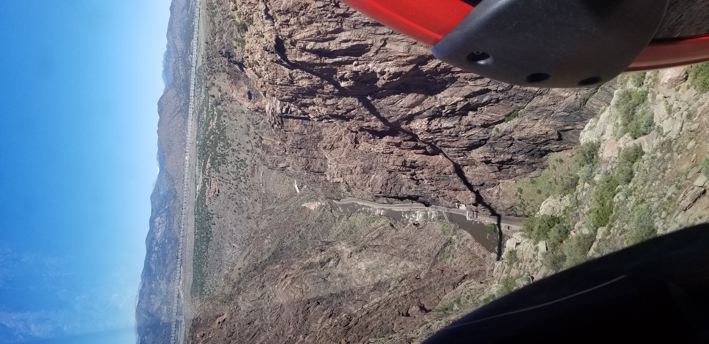
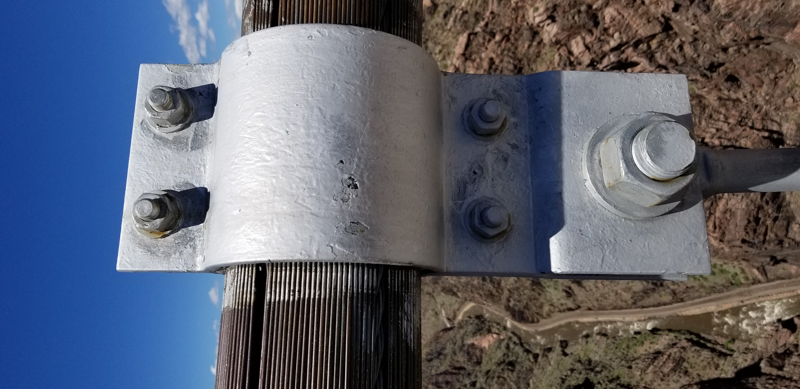
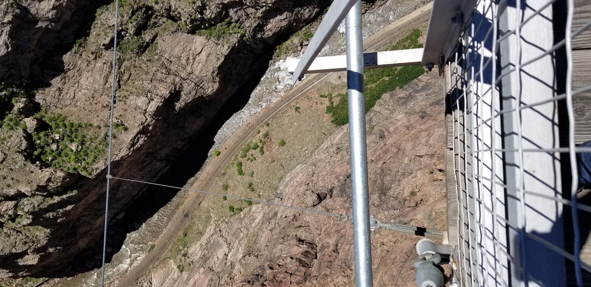
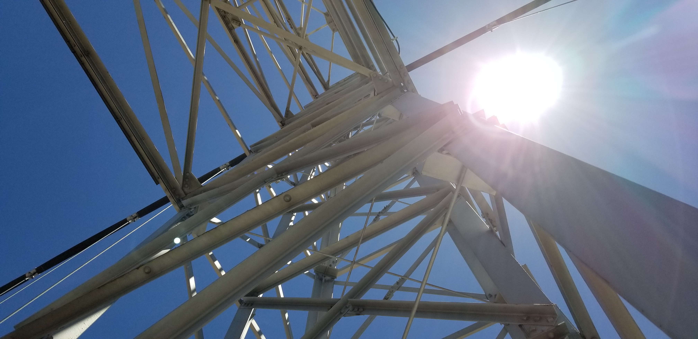
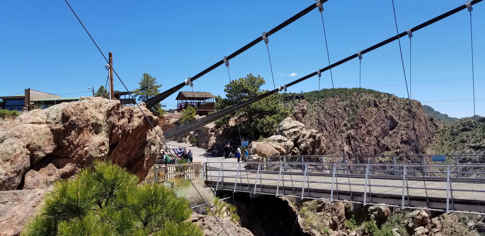

## :globe_with_meridians:Royal Gorge Bridge & Park - Arkansas River, Canyon City, Colorado, U.S. (2019-05-24)
`Pictures` rcfdtools <br>`Category` Technical field visit <br>`Location` [Google Maps](http://maps.google.com/maps?q=38.463484,-105.322374) or [Openstreet Map](https://www.openstreetmap.org/query?lat=38.463484&lon=-105.322374) 

```geojson
{
  "type": "Feature",
  "geometry": {
    "type": "Point", 
    "coordinates": [-105.322374, 38.463484]
  }, 
  "properties": {
    "Name": "Royal Gorge Bridge & Park - Arkansas River, Canyon City, Colorado, U.S."
  }
}
```

<br><details><summary>:camera:**40/20190523_154256.jpg**</summary><sub> `Exif version` 0220 `OS version` G955USQU5DSC1 `Date` 2019:05:23 15:42:56 `Aperture` Not known `Brightness` 10.35 `Color space` 1 `Compression` 6`Exposure mode` 0 `Exposure time` 0.00012833675564681725 `Focal length` 4.25 `Lens model` Not known `Lens specification` Not known `Orientation` 1 `Scene type` Not known `f number` 1.7 `White balance` 0 `Sensing method` 2 `Shutter speed` 12.927</sub><sub>`Coordinates & altitude` (38.25431419444445, -105.95302136111111, 2419.11)</sub><sub> :globe_with_meridians:`Location over` [Google Maps](http://maps.google.com/maps?q=38.25431419444445,-105.95302136111111) or [Openstreet Map](https://www.openstreetmap.org/query?lat=38.25431419444445&lon=-105.95302136111111)</sub></details>

<br><details><summary>:camera:**40/20190523_154323.jpg**</summary><sub> `Exif version` 0220 `OS version` G955USQU5DSC1 `Date` 2019:05:23 15:43:23 `Aperture` Not known `Brightness` Not known `Color space` 1 `Compression` Not known`Exposure mode` 0 `Exposure time` Not known `Focal length` 4.25 `Lens model` Not known `Lens specification` Not known `Orientation` 1 `Scene type` Not known `f number` 1.7 `White balance` 0 `Sensing method` Not known `Shutter speed` Not known</sub></details>

<br><details><summary>:camera:**40/20190524_104849.jpg**</summary><sub> `Exif version` 0220 `OS version` G955USQU5DSC1 `Date` 2019:05:24 10:48:49 `Aperture` Not known `Brightness` 9.04 `Color space` 1 `Compression` 6`Exposure mode` 0 `Exposure time` 0.000314070351758794 `Focal length` 4.25 `Lens model` Not known `Lens specification` Not known `Orientation` 1 `Scene type` Not known `f number` 1.7 `White balance` 0 `Sensing method` 2 `Shutter speed` 11.636</sub><sub>`Coordinates & altitude` (38.463402638888894, -105.3210451111111, 1966.812)</sub><sub> :globe_with_meridians:`Location over` [Google Maps](http://maps.google.com/maps?q=38.463402638888894,-105.3210451111111) or [Openstreet Map](https://www.openstreetmap.org/query?lat=38.463402638888894&lon=-105.3210451111111)</sub></details>

<br><details><summary>:camera:**40/20190524_104855.jpg**</summary><sub> `Exif version` 0220 `OS version` G955USQU5DSC1 `Date` 2019:05:24 10:48:55 `Aperture` Not known `Brightness` 8.95 `Color space` 1 `Compression` 6`Exposure mode` 0 `Exposure time` 0.0003180661577608143 `Focal length` 4.25 `Lens model` Not known `Lens specification` Not known `Orientation` 1 `Scene type` Not known `f number` 1.7 `White balance` 0 `Sensing method` 2 `Shutter speed` 11.618</sub><sub>`Coordinates & altitude` (38.463402638888894, -105.3210451111111, 1966.812)</sub><sub> :globe_with_meridians:`Location over` [Google Maps](http://maps.google.com/maps?q=38.463402638888894,-105.3210451111111) or [Openstreet Map](https://www.openstreetmap.org/query?lat=38.463402638888894&lon=-105.3210451111111)</sub></details>

<br><details><summary>:camera:**40/20190524_104915.jpg**</summary><sub> `Exif version` 0220 `OS version` G955USQU5DSC1 `Date` 2019:05:24 10:49:15 `Aperture` Not known `Brightness` 8.83 `Color space` 1 `Compression` 6`Exposure mode` 0 `Exposure time` 0.00036656891495601173 `Focal length` 4.25 `Lens model` Not known `Lens specification` Not known `Orientation` 1 `Scene type` Not known `f number` 1.7 `White balance` 0 `Sensing method` 2 `Shutter speed` 11.413</sub><sub>`Coordinates & altitude` (38.46332705555556, -105.32100133333333, 1977.296)</sub><sub> :globe_with_meridians:`Location over` [Google Maps](http://maps.google.com/maps?q=38.46332705555556,-105.32100133333333) or [Openstreet Map](https://www.openstreetmap.org/query?lat=38.46332705555556&lon=-105.32100133333333)</sub></details>

<br><details><summary>:camera:**40/20190524_110640.jpg**</summary><sub> `Exif version` 0220 `OS version` G955USQU5DSC1 `Date` 2019:05:24 11:06:40 `Aperture` Not known `Brightness` 7.5 `Color space` 1 `Compression` 6`Exposure mode` 0 `Exposure time` 0.0008865248226950354 `Focal length` 4.25 `Lens model` Not known `Lens specification` Not known `Orientation` 1 `Scene type` Not known `f number` 1.7 `White balance` 0 `Sensing method` 2 `Shutter speed` 10.139</sub><sub>`Coordinates & altitude` (38.463028333333334, -105.32197769444444, 1963.785)</sub><sub> :globe_with_meridians:`Location over` [Google Maps](http://maps.google.com/maps?q=38.463028333333334,-105.32197769444444) or [Openstreet Map](https://www.openstreetmap.org/query?lat=38.463028333333334&lon=-105.32197769444444)</sub></details>

<br><details><summary>:camera:**40/20190524_111333.jpg**</summary><sub> `Exif version` 0220 `OS version` G955USQU5DSC1 `Date` 2019:05:24 11:13:33 `Aperture` Not known `Brightness` 6.99 `Color space` 1 `Compression` 6`Exposure mode` 0 `Exposure time` 0.00125 `Focal length` 4.25 `Lens model` Not known `Lens specification` Not known `Orientation` 6 `Scene type` Not known `f number` 1.7 `White balance` 0 `Sensing method` 2 `Shutter speed` 9.643</sub><sub>`Coordinates & altitude` (38.46271458333334, -105.32212375, 1975.029)</sub><sub> :globe_with_meridians:`Location over` [Google Maps](http://maps.google.com/maps?q=38.46271458333334,-105.32212375) or [Openstreet Map](https://www.openstreetmap.org/query?lat=38.46271458333334&lon=-105.32212375)</sub></details>

<br><details><summary>:camera:**40/20190524_111339.jpg**</summary><sub> `Exif version` 0220 `OS version` G955USQU5DSC1 `Date` 2019:05:24 11:13:39 `Aperture` Not known `Brightness` 6.95 `Color space` 1 `Compression` 6`Exposure mode` 0 `Exposure time` 0.0012787723785166241 `Focal length` 4.25 `Lens model` Not known `Lens specification` Not known `Orientation` 6 `Scene type` Not known `f number` 1.7 `White balance` 0 `Sensing method` 2 `Shutter speed` 9.611</sub><sub>`Coordinates & altitude` (38.46271458333334, -105.32212375, 1975.029)</sub><sub> :globe_with_meridians:`Location over` [Google Maps](http://maps.google.com/maps?q=38.46271458333334,-105.32212375) or [Openstreet Map](https://www.openstreetmap.org/query?lat=38.46271458333334&lon=-105.32212375)</sub></details>

<br><details><summary>:camera:**40/20190524_111342.jpg**</summary><sub> `Exif version` 0220 `OS version` G955USQU5DSC1 `Date` 2019:05:24 11:13:42 `Aperture` Not known `Brightness` 6.37 `Color space` 1 `Compression` 6`Exposure mode` 0 `Exposure time` 0.0018656716417910447 `Focal length` 4.25 `Lens model` Not known `Lens specification` Not known `Orientation` 6 `Scene type` Not known `f number` 1.7 `White balance` 0 `Sensing method` 2 `Shutter speed` 9.066</sub><sub>`Coordinates & altitude` (38.46271458333334, -105.32212375, 1975.029)</sub><sub> :globe_with_meridians:`Location over` [Google Maps](http://maps.google.com/maps?q=38.46271458333334,-105.32212375) or [Openstreet Map](https://www.openstreetmap.org/query?lat=38.46271458333334&lon=-105.32212375)</sub></details>

<br><details><summary>:camera:**40/20190524_111345.jpg**</summary><sub> `Exif version` 0220 `OS version` G955USQU5DSC1 `Date` 2019:05:24 11:13:45 `Aperture` Not known `Brightness` 6.45 `Color space` 1 `Compression` 6`Exposure mode` 0 `Exposure time` 0.001736111111111111 `Focal length` 4.25 `Lens model` Not known `Lens specification` Not known `Orientation` 6 `Scene type` Not known `f number` 1.7 `White balance` 0 `Sensing method` 2 `Shutter speed` 9.169</sub><sub>`Coordinates & altitude` (38.46271458333334, -105.32212375, 1975.029)</sub><sub> :globe_with_meridians:`Location over` [Google Maps](http://maps.google.com/maps?q=38.46271458333334,-105.32212375) or [Openstreet Map](https://www.openstreetmap.org/query?lat=38.46271458333334&lon=-105.32212375)</sub></details>

<br><details><summary>:camera:**40/20190524_111417.jpg**</summary><sub> `Exif version` 0220 `OS version` G955USQU5DSC1 `Date` 2019:05:24 11:14:17 `Aperture` Not known `Brightness` 7.19 `Color space` 1 `Compression` 6`Exposure mode` 0 `Exposure time` 0.0010438413361169101 `Focal length` 4.25 `Lens model` Not known `Lens specification` Not known `Orientation` 6 `Scene type` Not known `f number` 1.7 `White balance` 0 `Sensing method` 2 `Shutter speed` 9.903</sub><sub>`Coordinates & altitude` (38.462122, -105.32225538888889, 1966.663)</sub><sub> :globe_with_meridians:`Location over` [Google Maps](http://maps.google.com/maps?q=38.462122,-105.32225538888889) or [Openstreet Map](https://www.openstreetmap.org/query?lat=38.462122&lon=-105.32225538888889)</sub></details>

<br><details><summary>:camera:**40/20190524_111421.jpg**</summary><sub> `Exif version` 0220 `OS version` G955USQU5DSC1 `Date` 2019:05:24 11:14:20 `Aperture` Not known `Brightness` 7.12 `Color space` 1 `Compression` 6`Exposure mode` 0 `Exposure time` 0.0011574074074074073 `Focal length` 4.25 `Lens model` Not known `Lens specification` Not known `Orientation` 6 `Scene type` Not known `f number` 1.7 `White balance` 0 `Sensing method` 2 `Shutter speed` 9.754</sub><sub>`Coordinates & altitude` (38.462122, -105.32225538888889, 1966.663)</sub><sub> :globe_with_meridians:`Location over` [Google Maps](http://maps.google.com/maps?q=38.462122,-105.32225538888889) or [Openstreet Map](https://www.openstreetmap.org/query?lat=38.462122&lon=-105.32225538888889)</sub></details>

<br><details><summary>:camera:**40/20190524_111508.jpg**</summary><sub> `Exif version` 0220 `OS version` G955USQU5DSC1 `Date` 2019:05:24 11:15:08 `Aperture` Not known `Brightness` 5.77 `Color space` 1 `Compression` 6`Exposure mode` 0 `Exposure time` 0.0030959752321981426 `Focal length` 4.25 `Lens model` Not known `Lens specification` Not known `Orientation` 6 `Scene type` Not known `f number` 1.7 `White balance` 0 `Sensing method` 2 `Shutter speed` 8.335</sub><sub>`Coordinates & altitude` (38.45954527777778, -105.32294191666666, 1969.971)</sub><sub> :globe_with_meridians:`Location over` [Google Maps](http://maps.google.com/maps?q=38.45954527777778,-105.32294191666666) or [Openstreet Map](https://www.openstreetmap.org/query?lat=38.45954527777778&lon=-105.32294191666666)</sub></details>

<br><details><summary>:camera:**40/20190524_111510.jpg**</summary><sub> `Exif version` 0220 `OS version` G955USQU5DSC1 `Date` 2019:05:24 11:15:10 `Aperture` Not known `Brightness` 6.55 `Color space` 1 `Compression` 6`Exposure mode` 0 `Exposure time` 0.0017064846416382253 `Focal length` 4.25 `Lens model` Not known `Lens specification` Not known `Orientation` 6 `Scene type` Not known `f number` 1.7 `White balance` 0 `Sensing method` 2 `Shutter speed` 9.194</sub><sub>`Coordinates & altitude` (38.45947955555556, -105.32295938888889, 1970.358)</sub><sub> :globe_with_meridians:`Location over` [Google Maps](http://maps.google.com/maps?q=38.45947955555556,-105.32295938888889) or [Openstreet Map](https://www.openstreetmap.org/query?lat=38.45947955555556&lon=-105.32295938888889)</sub></details>

<br><details><summary>:camera:**40/20190524_111513.jpg**</summary><sub> `Exif version` 0220 `OS version` G955USQU5DSC1 `Date` 2019:05:24 11:15:13 `Aperture` Not known `Brightness` 6.94 `Color space` 1 `Compression` 6`Exposure mode` 0 `Exposure time` 0.0012953367875647669 `Focal length` 4.25 `Lens model` Not known `Lens specification` Not known `Orientation` 6 `Scene type` Not known `f number` 1.7 `White balance` 0 `Sensing method` 2 `Shutter speed` 9.592</sub><sub>`Coordinates & altitude` (38.45947955555556, -105.32295938888889, 1970.358)</sub><sub> :globe_with_meridians:`Location over` [Google Maps](http://maps.google.com/maps?q=38.45947955555556,-105.32295938888889) or [Openstreet Map](https://www.openstreetmap.org/query?lat=38.45947955555556&lon=-105.32295938888889)</sub></details>

<br><details><summary>:camera:**40/20190524_112933.jpg**</summary><sub> `Exif version` 0220 `OS version` G955USQU5DSC1 `Date` 2019:05:24 11:29:33 `Aperture` Not known `Brightness` 8.7 `Color space` 1 `Compression` 6`Exposure mode` 0 `Exposure time` 0.00037764350453172205 `Focal length` 4.25 `Lens model` Not known `Lens specification` Not known `Orientation` 1 `Scene type` Not known `f number` 1.7 `White balance` 0 `Sensing method` 2 `Shutter speed` 11.37</sub><sub>`Coordinates & altitude` (38.459079333333335, -105.32367844444444, 1995.973)</sub><sub> :globe_with_meridians:`Location over` [Google Maps](http://maps.google.com/maps?q=38.459079333333335,-105.32367844444444) or [Openstreet Map](https://www.openstreetmap.org/query?lat=38.459079333333335&lon=-105.32367844444444)</sub></details>

<br><details><summary>:camera:**40/20190524_113011.jpg**</summary><sub> `Exif version` 0220 `OS version` G955USQU5DSC1 `Date` 2019:05:24 11:30:11 `Aperture` Not known `Brightness` Not known `Color space` 1 `Compression` Not known`Exposure mode` 0 `Exposure time` Not known `Focal length` 4.25 `Lens model` Not known `Lens specification` Not known `Orientation` 1 `Scene type` Not known `f number` 1.7 `White balance` 0 `Sensing method` Not known `Shutter speed` Not known</sub></details>

<br><details><summary>:camera:**40/20190524_113026.jpg**</summary><sub> `Exif version` 0220 `OS version` G955USQU5DSC1 `Date` 2019:05:24 11:30:26 `Aperture` Not known `Brightness` 9.0 `Color space` 1 `Compression` 6`Exposure mode` 0 `Exposure time` 0.00031887755102040814 `Focal length` 4.25 `Lens model` Not known `Lens specification` Not known `Orientation` 1 `Scene type` Not known `f number` 1.7 `White balance` 0 `Sensing method` 2 `Shutter speed` 11.614</sub><sub>`Coordinates & altitude` (38.459041000000006, -105.32386083333333, 1997.628)</sub><sub> :globe_with_meridians:`Location over` [Google Maps](http://maps.google.com/maps?q=38.459041000000006,-105.32386083333333) or [Openstreet Map](https://www.openstreetmap.org/query?lat=38.459041000000006&lon=-105.32386083333333)</sub></details>

<br><details><summary>:camera:**40/20190524_113035.jpg**</summary><sub> `Exif version` 0220 `OS version` G955USQU5DSC1 `Date` 2019:05:24 11:30:35 `Aperture` Not known `Brightness` 8.55 `Color space` 1 `Compression` 6`Exposure mode` 0 `Exposure time` 0.00041254125412541255 `Focal length` 4.25 `Lens model` Not known `Lens specification` Not known `Orientation` 6 `Scene type` Not known `f number` 1.7 `White balance` 0 `Sensing method` 2 `Shutter speed` 11.243</sub><sub>`Coordinates & altitude` (38.459041000000006, -105.32386083333333, 1997.628)</sub><sub> :globe_with_meridians:`Location over` [Google Maps](http://maps.google.com/maps?q=38.459041000000006,-105.32386083333333) or [Openstreet Map](https://www.openstreetmap.org/query?lat=38.459041000000006&lon=-105.32386083333333)</sub></details>

<br><details><summary>:camera:**40/20190524_113042.jpg**</summary><sub> `Exif version` 0220 `OS version` G955USQU5DSC1 `Date` 2019:05:24 11:30:42 `Aperture` Not known `Brightness` 7.98 `Color space` 1 `Compression` 6`Exposure mode` 0 `Exposure time` 0.0006172839506172839 `Focal length` 4.25 `Lens model` Not known `Lens specification` Not known `Orientation` 6 `Scene type` Not known `f number` 1.7 `White balance` 0 `Sensing method` 2 `Shutter speed` 10.661</sub><sub>`Coordinates & altitude` (38.49675788888889, -105.321145, 0.0)</sub><sub> :globe_with_meridians:`Location over` [Google Maps](http://maps.google.com/maps?q=38.49675788888889,-105.321145) or [Openstreet Map](https://www.openstreetmap.org/query?lat=38.49675788888889&lon=-105.321145)</sub></details>

<br><details><summary>:camera:**40/20190524_113321.jpg**</summary><sub> `Exif version` 0220 `OS version` G955USQU5DSC1 `Date` 2019:05:24 11:33:20 `Aperture` Not known `Brightness` 8.65 `Color space` 1 `Compression` 6`Exposure mode` 0 `Exposure time` 0.00040584415584415587 `Focal length` 4.25 `Lens model` Not known `Lens specification` Not known `Orientation` 1 `Scene type` Not known `f number` 1.7 `White balance` 0 `Sensing method` 2 `Shutter speed` 11.266</sub><sub>`Coordinates & altitude` (38.45892830555556, -105.32407963888889, 1996.209)</sub><sub> :globe_with_meridians:`Location over` [Google Maps](http://maps.google.com/maps?q=38.45892830555556,-105.32407963888889) or [Openstreet Map](https://www.openstreetmap.org/query?lat=38.45892830555556&lon=-105.32407963888889)</sub></details>

<br><details><summary>:camera:**40/20190524_123102.jpg**</summary><sub> `Exif version` 0220 `OS version` G955USQU5DSC1 `Date` 2019:05:24 12:31:02 `Aperture` Not known `Brightness` 8.67 `Color space` 1 `Compression` 6`Exposure mode` 0 `Exposure time` 0.0003869969040247678 `Focal length` 4.25 `Lens model` Not known `Lens specification` Not known `Orientation` 6 `Scene type` Not known `f number` 1.7 `White balance` 0 `Sensing method` 2 `Shutter speed` 11.335</sub><sub>`Coordinates & altitude` (38.45986955555556, -105.32638630555554, 1960.645)</sub><sub> :globe_with_meridians:`Location over` [Google Maps](http://maps.google.com/maps?q=38.45986955555556,-105.32638630555554) or [Openstreet Map](https://www.openstreetmap.org/query?lat=38.45986955555556&lon=-105.32638630555554)</sub></details>

<br><details><summary>:camera:**40/20190524_123106.jpg**</summary><sub> `Exif version` 0220 `OS version` G955USQU5DSC1 `Date` 2019:05:24 12:31:06 `Aperture` Not known `Brightness` 8.61 `Color space` 1 `Compression` 6`Exposure mode` 0 `Exposure time` 0.0004084967320261438 `Focal length` 4.25 `Lens model` Not known `Lens specification` Not known `Orientation` 6 `Scene type` Not known `f number` 1.7 `White balance` 0 `Sensing method` 2 `Shutter speed` 11.257</sub><sub>`Coordinates & altitude` (38.45986955555556, -105.32638630555554, 1960.645)</sub><sub> :globe_with_meridians:`Location over` [Google Maps](http://maps.google.com/maps?q=38.45986955555556,-105.32638630555554) or [Openstreet Map](https://www.openstreetmap.org/query?lat=38.45986955555556&lon=-105.32638630555554)</sub></details>

<br><details><summary>:camera:**40/20190524_123219.jpg**</summary><sub> `Exif version` 0220 `OS version` G955USQU5DSC1 `Date` 2019:05:24 12:32:19 `Aperture` Not known `Brightness` 8.97 `Color space` 1 `Compression` 6`Exposure mode` 0 `Exposure time` 0.00031969309462915604 `Focal length` 4.25 `Lens model` Not known `Lens specification` Not known `Orientation` 6 `Scene type` Not known `f number` 1.7 `White balance` 0 `Sensing method` 2 `Shutter speed` 11.611</sub><sub>`Coordinates & altitude` (38.46003788888889, -105.32649711111111, 1960.697)</sub><sub> :globe_with_meridians:`Location over` [Google Maps](http://maps.google.com/maps?q=38.46003788888889,-105.32649711111111) or [Openstreet Map](https://www.openstreetmap.org/query?lat=38.46003788888889&lon=-105.32649711111111)</sub></details>

<br><details><summary>:camera:**40/20190524_123223.jpg**</summary><sub> `Exif version` 0220 `OS version` G955USQU5DSC1 `Date` 2019:05:24 12:32:23 `Aperture` Not known `Brightness` 8.95 `Color space` 1 `Compression` 6`Exposure mode` 0 `Exposure time` 0.00031969309462915604 `Focal length` 4.25 `Lens model` Not known `Lens specification` Not known `Orientation` 6 `Scene type` Not known `f number` 1.7 `White balance` 0 `Sensing method` 2 `Shutter speed` 11.611</sub><sub>`Coordinates & altitude` (38.46003788888889, -105.32649711111111, 1960.697)</sub><sub> :globe_with_meridians:`Location over` [Google Maps](http://maps.google.com/maps?q=38.46003788888889,-105.32649711111111) or [Openstreet Map](https://www.openstreetmap.org/query?lat=38.46003788888889&lon=-105.32649711111111)</sub></details>

<br><details><summary>:camera:**40/20190524_123229.jpg**</summary><sub> `Exif version` 0220 `OS version` G955USQU5DSC1 `Date` 2019:05:24 12:32:29 `Aperture` Not known `Brightness` 8.97 `Color space` 1 `Compression` 6`Exposure mode` 0 `Exposure time` 0.00030637254901960784 `Focal length` 4.25 `Lens model` Not known `Lens specification` Not known `Orientation` 1 `Scene type` Not known `f number` 1.7 `White balance` 0 `Sensing method` 2 `Shutter speed` 11.672</sub><sub>`Coordinates & altitude` (38.46003788888889, -105.32649711111111, 1960.697)</sub><sub> :globe_with_meridians:`Location over` [Google Maps](http://maps.google.com/maps?q=38.46003788888889,-105.32649711111111) or [Openstreet Map](https://www.openstreetmap.org/query?lat=38.46003788888889&lon=-105.32649711111111)</sub></details>

<br><details><summary>:camera:**40/20190524_123235.jpg**</summary><sub> `Exif version` 0220 `OS version` G955USQU5DSC1 `Date` 2019:05:24 12:32:35 `Aperture` Not known `Brightness` 8.82 `Color space` 1 `Compression` 6`Exposure mode` 0 `Exposure time` 0.00035211267605633805 `Focal length` 4.25 `Lens model` Not known `Lens specification` Not known `Orientation` 1 `Scene type` Not known `f number` 1.7 `White balance` 0 `Sensing method` 2 `Shutter speed` 11.471</sub><sub>`Coordinates & altitude` (38.460053638888894, -105.32653808333333, 1963.0)</sub><sub> :globe_with_meridians:`Location over` [Google Maps](http://maps.google.com/maps?q=38.460053638888894,-105.32653808333333) or [Openstreet Map](https://www.openstreetmap.org/query?lat=38.460053638888894&lon=-105.32653808333333)</sub></details>

<br><details><summary>:camera:**40/20190524_123251.jpg**</summary><sub> `Exif version` 0220 `OS version` G955USQU5DSC1 `Date` 2019:05:24 12:32:51 `Aperture` Not known `Brightness` 8.83 `Color space` 1 `Compression` 6`Exposure mode` 0 `Exposure time` 0.00034818941504178273 `Focal length` 4.25 `Lens model` Not known `Lens specification` Not known `Orientation` 6 `Scene type` Not known `f number` 1.7 `White balance` 0 `Sensing method` 2 `Shutter speed` 11.487</sub><sub>`Coordinates & altitude` (38.460053638888894, -105.32653808333333, 1963.0)</sub><sub> :globe_with_meridians:`Location over` [Google Maps](http://maps.google.com/maps?q=38.460053638888894,-105.32653808333333) or [Openstreet Map](https://www.openstreetmap.org/query?lat=38.460053638888894&lon=-105.32653808333333)</sub></details>

<br><details><summary>:camera:**40/20190524_123332.jpg**</summary><sub> `Exif version` 0220 `OS version` G955USQU5DSC1 `Date` 2019:05:24 12:33:32 `Aperture` Not known `Brightness` Not known `Color space` 1 `Compression` Not known`Exposure mode` 0 `Exposure time` Not known `Focal length` 4.25 `Lens model` Not known `Lens specification` Not known `Orientation` 1 `Scene type` Not known `f number` 1.7 `White balance` 0 `Sensing method` Not known `Shutter speed` Not known</sub></details>

<br><details><summary>:camera:**40/20190524_123409.jpg**</summary><sub> `Exif version` 0220 `OS version` G955USQU5DSC1 `Date` 2019:05:24 12:34:09 `Aperture` Not known `Brightness` 8.3 `Color space` 1 `Compression` 6`Exposure mode` 0 `Exposure time` 0.00049800796812749 `Focal length` 4.25 `Lens model` Not known `Lens specification` Not known `Orientation` 1 `Scene type` Not known `f number` 1.7 `White balance` 0 `Sensing method` 2 `Shutter speed` 10.971</sub><sub>`Coordinates & altitude` (38.460224583333336, -105.32680497222222, 1958.099)</sub><sub> :globe_with_meridians:`Location over` [Google Maps](http://maps.google.com/maps?q=38.460224583333336,-105.32680497222222) or [Openstreet Map](https://www.openstreetmap.org/query?lat=38.460224583333336&lon=-105.32680497222222)</sub></details>

<br><details><summary>:camera:**40/20190524_123420.jpg**</summary><sub> `Exif version` 0220 `OS version` G955USQU5DSC1 `Date` 2019:05:24 12:34:20 `Aperture` Not known `Brightness` 8.5 `Color space` 1 `Compression` 6`Exposure mode` 0 `Exposure time` 0.0004432624113475177 `Focal length` 4.25 `Lens model` Not known `Lens specification` Not known `Orientation` 6 `Scene type` Not known `f number` 1.7 `White balance` 0 `Sensing method` 2 `Shutter speed` 11.139</sub><sub>`Coordinates & altitude` (38.460224583333336, -105.32680497222222, 1958.099)</sub><sub> :globe_with_meridians:`Location over` [Google Maps](http://maps.google.com/maps?q=38.460224583333336,-105.32680497222222) or [Openstreet Map](https://www.openstreetmap.org/query?lat=38.460224583333336&lon=-105.32680497222222)</sub></details>

<br><details><summary>:camera:**40/20190524_123607.jpg**</summary><sub> `Exif version` 0220 `OS version` G955USQU5DSC1 `Date` 2019:05:24 12:36:07 `Aperture` Not known `Brightness` 8.93 `Color space` 1 `Compression` 6`Exposure mode` 0 `Exposure time` 0.00031887755102040814 `Focal length` 4.25 `Lens model` Not known `Lens specification` Not known `Orientation` 1 `Scene type` Not known `f number` 1.7 `White balance` 0 `Sensing method` 2 `Shutter speed` 11.614</sub><sub>`Coordinates & altitude` (38.459862138888894, -105.32721494444444, 1965.527)</sub><sub> :globe_with_meridians:`Location over` [Google Maps](http://maps.google.com/maps?q=38.459862138888894,-105.32721494444444) or [Openstreet Map](https://www.openstreetmap.org/query?lat=38.459862138888894&lon=-105.32721494444444)</sub></details>

<br><details><summary>:camera:**40/20190524_123619.jpg**</summary><sub> `Exif version` 0220 `OS version` G955USQU5DSC1 `Date` 2019:05:24 12:36:19 `Aperture` Not known `Brightness` 8.51 `Color space` 1 `Compression` 6`Exposure mode` 0 `Exposure time` 0.0004310344827586207 `Focal length` 4.25 `Lens model` Not known `Lens specification` Not known `Orientation` 6 `Scene type` Not known `f number` 1.7 `White balance` 0 `Sensing method` 2 `Shutter speed` 11.179</sub><sub>`Coordinates & altitude` (38.459862138888894, -105.32721494444444, 1965.527)</sub><sub> :globe_with_meridians:`Location over` [Google Maps](http://maps.google.com/maps?q=38.459862138888894,-105.32721494444444) or [Openstreet Map](https://www.openstreetmap.org/query?lat=38.459862138888894&lon=-105.32721494444444)</sub></details>

<br><details><summary>:camera:**40/20190524_123641.jpg**</summary><sub> `Exif version` 0220 `OS version` G955USQU5DSC1 `Date` 2019:05:24 12:36:40 `Aperture` Not known `Brightness` 10.78 `Color space` 1 `Compression` 6`Exposure mode` 0 `Exposure time` 9.110787172011662e-05 `Focal length` 4.25 `Lens model` Not known `Lens specification` Not known `Orientation` 6 `Scene type` Not known `f number` 1.7 `White balance` 0 `Sensing method` 2 `Shutter speed` 13.422</sub><sub>`Coordinates & altitude` (38.460224583333336, -105.32680497222222, 1958.099)</sub><sub> :globe_with_meridians:`Location over` [Google Maps](http://maps.google.com/maps?q=38.460224583333336,-105.32680497222222) or [Openstreet Map](https://www.openstreetmap.org/query?lat=38.460224583333336&lon=-105.32680497222222)</sub></details>

<br><details><summary>:camera:**40/20190524_123649.jpg**</summary><sub> `Exif version` 0220 `OS version` G955USQU5DSC1 `Date` 2019:05:24 12:36:49 `Aperture` Not known `Brightness` 10.73 `Color space` 1 `Compression` 6`Exposure mode` 0 `Exposure time` 9.674922600619196e-05 `Focal length` 4.25 `Lens model` Not known `Lens specification` Not known `Orientation` 6 `Scene type` Not known `f number` 1.7 `White balance` 0 `Sensing method` 2 `Shutter speed` 13.335</sub><sub>`Coordinates & altitude` (38.460224583333336, -105.32680497222222, 1958.099)</sub><sub> :globe_with_meridians:`Location over` [Google Maps](http://maps.google.com/maps?q=38.460224583333336,-105.32680497222222) or [Openstreet Map](https://www.openstreetmap.org/query?lat=38.460224583333336&lon=-105.32680497222222)</sub></details>

<br><details><summary>:camera:**40/20190524_123653.jpg**</summary><sub> `Exif version` 0220 `OS version` G955USQU5DSC1 `Date` 2019:05:24 12:36:53 `Aperture` Not known `Brightness` 10.76 `Color space` 1 `Compression` 6`Exposure mode` 0 `Exposure time` 9.057971014492754e-05 `Focal length` 4.25 `Lens model` Not known `Lens specification` Not known `Orientation` 6 `Scene type` Not known `f number` 1.7 `White balance` 0 `Sensing method` 2 `Shutter speed` 13.43</sub><sub>`Coordinates & altitude` (38.460224583333336, -105.32680497222222, 1958.099)</sub><sub> :globe_with_meridians:`Location over` [Google Maps](http://maps.google.com/maps?q=38.460224583333336,-105.32680497222222) or [Openstreet Map](https://www.openstreetmap.org/query?lat=38.460224583333336&lon=-105.32680497222222)</sub></details>

<br><details><summary>:camera:**40/20190524_123715.jpg**</summary><sub> `Exif version` 0220 `OS version` G955USQU5DSC1 `Date` 2019:05:24 12:37:15 `Aperture` Not known `Brightness` 9.08 `Color space` 1 `Compression` 6`Exposure mode` 0 `Exposure time` 0.0003048780487804878 `Focal length` 4.25 `Lens model` Not known `Lens specification` Not known `Orientation` 6 `Scene type` Not known `f number` 1.7 `White balance` 0 `Sensing method` 2 `Shutter speed` 11.679</sub><sub>`Coordinates & altitude` (38.460224583333336, -105.32680497222222, 1958.099)</sub><sub> :globe_with_meridians:`Location over` [Google Maps](http://maps.google.com/maps?q=38.460224583333336,-105.32680497222222) or [Openstreet Map](https://www.openstreetmap.org/query?lat=38.460224583333336&lon=-105.32680497222222)</sub></details>

<br><details><summary>:camera:**40/20190524_123726.jpg**</summary><sub> `Exif version` 0220 `OS version` G955USQU5DSC1 `Date` 2019:05:24 12:37:26 `Aperture` Not known `Brightness` 8.9 `Color space` 1 `Compression` 6`Exposure mode` 0 `Exposure time` 0.00033783783783783786 `Focal length` 4.25 `Lens model` Not known `Lens specification` Not known `Orientation` 1 `Scene type` Not known `f number` 1.7 `White balance` 0 `Sensing method` 2 `Shutter speed` 11.531</sub><sub>`Coordinates & altitude` (38.460224583333336, -105.32680497222222, 1958.099)</sub><sub> :globe_with_meridians:`Location over` [Google Maps](http://maps.google.com/maps?q=38.460224583333336,-105.32680497222222) or [Openstreet Map](https://www.openstreetmap.org/query?lat=38.460224583333336&lon=-105.32680497222222)</sub></details>

<br><details><summary>:camera:**40/20190524_123736.jpg**</summary><sub> `Exif version` 0220 `OS version` G955USQU5DSC1 `Date` 2019:05:24 12:37:36 `Aperture` Not known `Brightness` 8.91 `Color space` 1 `Compression` 6`Exposure mode` 0 `Exposure time` 0.00034916201117318437 `Focal length` 4.25 `Lens model` Not known `Lens specification` Not known `Orientation` 1 `Scene type` Not known `f number` 1.7 `White balance` 0 `Sensing method` 2 `Shutter speed` 11.483</sub><sub>`Coordinates & altitude` (38.460224583333336, -105.32680497222222, 1958.099)</sub><sub> :globe_with_meridians:`Location over` [Google Maps](http://maps.google.com/maps?q=38.460224583333336,-105.32680497222222) or [Openstreet Map](https://www.openstreetmap.org/query?lat=38.460224583333336&lon=-105.32680497222222)</sub></details>

<br><details><summary>:camera:**40/20190524_123755.jpg**</summary><sub> `Exif version` 0220 `OS version` G955USQU5DSC1 `Date` 2019:05:24 12:37:55 `Aperture` Not known `Brightness` 9.27 `Color space` 1 `Compression` 6`Exposure mode` 0 `Exposure time` 0.00025933609958506224 `Focal length` 4.25 `Lens model` Not known `Lens specification` Not known `Orientation` 6 `Scene type` Not known `f number` 1.7 `White balance` 0 `Sensing method` 2 `Shutter speed` 11.912</sub><sub>`Coordinates & altitude` (38.460224583333336, -105.32680497222222, 1958.099)</sub><sub> :globe_with_meridians:`Location over` [Google Maps](http://maps.google.com/maps?q=38.460224583333336,-105.32680497222222) or [Openstreet Map](https://www.openstreetmap.org/query?lat=38.460224583333336&lon=-105.32680497222222)</sub></details>

<br><details><summary>:camera:**40/20190524_123846.jpg**</summary><sub> `Exif version` 0220 `OS version` G955USQU5DSC1 `Date` 2019:05:24 12:38:46 `Aperture` Not known `Brightness` 8.78 `Color space` 1 `Compression` 6`Exposure mode` 0 `Exposure time` 0.0003633720930232558 `Focal length` 4.25 `Lens model` Not known `Lens specification` Not known `Orientation` 6 `Scene type` Not known `f number` 1.7 `White balance` 0 `Sensing method` 2 `Shutter speed` 11.426</sub><sub>`Coordinates & altitude` (38.460224583333336, -105.32680497222222, 1958.099)</sub><sub> :globe_with_meridians:`Location over` [Google Maps](http://maps.google.com/maps?q=38.460224583333336,-105.32680497222222) or [Openstreet Map](https://www.openstreetmap.org/query?lat=38.460224583333336&lon=-105.32680497222222)</sub></details>

<br><details><summary>:camera:**40/20190524_123853.jpg**</summary><sub> `Exif version` 0220 `OS version` G955USQU5DSC1 `Date` 2019:05:24 12:38:53 `Aperture` Not known `Brightness` 8.75 `Color space` 1 `Compression` 6`Exposure mode` 0 `Exposure time` 0.0003787878787878788 `Focal length` 4.25 `Lens model` Not known `Lens specification` Not known `Orientation` 6 `Scene type` Not known `f number` 1.7 `White balance` 0 `Sensing method` 2 `Shutter speed` 11.366</sub><sub>`Coordinates & altitude` (38.460224583333336, -105.32680497222222, 1958.099)</sub><sub> :globe_with_meridians:`Location over` [Google Maps](http://maps.google.com/maps?q=38.460224583333336,-105.32680497222222) or [Openstreet Map](https://www.openstreetmap.org/query?lat=38.460224583333336&lon=-105.32680497222222)</sub></details>

<br><details><summary>:camera:**40/20190524_123908.jpg**</summary><sub> `Exif version` 0220 `OS version` G955USQU5DSC1 `Date` 2019:05:24 12:39:08 `Aperture` Not known `Brightness` 9.6 `Color space` 1 `Compression` 6`Exposure mode` 0 `Exposure time` 0.00020764119601328904 `Focal length` 4.25 `Lens model` Not known `Lens specification` Not known `Orientation` 1 `Scene type` Not known `f number` 1.7 `White balance` 0 `Sensing method` 2 `Shutter speed` 12.233</sub><sub>`Coordinates & altitude` (38.460224583333336, -105.32680497222222, 1958.099)</sub><sub> :globe_with_meridians:`Location over` [Google Maps](http://maps.google.com/maps?q=38.460224583333336,-105.32680497222222) or [Openstreet Map](https://www.openstreetmap.org/query?lat=38.460224583333336&lon=-105.32680497222222)</sub></details>

<br><details><summary>:camera:**40/20190524_123911.jpg**</summary><sub> `Exif version` 0220 `OS version` G955USQU5DSC1 `Date` 2019:05:24 12:39:11 `Aperture` Not known `Brightness` 9.53 `Color space` 1 `Compression` 6`Exposure mode` 0 `Exposure time` 0.00022163120567375886 `Focal length` 4.25 `Lens model` Not known `Lens specification` Not known `Orientation` 1 `Scene type` Not known `f number` 1.7 `White balance` 0 `Sensing method` 2 `Shutter speed` 12.139</sub><sub>`Coordinates & altitude` (38.460224583333336, -105.32680497222222, 1958.099)</sub><sub> :globe_with_meridians:`Location over` [Google Maps](http://maps.google.com/maps?q=38.460224583333336,-105.32680497222222) or [Openstreet Map](https://www.openstreetmap.org/query?lat=38.460224583333336&lon=-105.32680497222222)</sub></details>

<br><details><summary>:camera:**40/20190524_123947.jpg**</summary><sub> `Exif version` 0220 `OS version` G955USQU5DSC1 `Date` 2019:05:24 12:39:47 `Aperture` Not known `Brightness` 8.5 `Color space` 1 `Compression` 6`Exposure mode` 0 `Exposure time` 0.00044802867383512545 `Focal length` 4.25 `Lens model` Not known `Lens specification` Not known `Orientation` 1 `Scene type` Not known `f number` 1.7 `White balance` 0 `Sensing method` 2 `Shutter speed` 11.124</sub><sub>`Coordinates & altitude` (38.460224583333336, -105.32680497222222, 1958.099)</sub><sub> :globe_with_meridians:`Location over` [Google Maps](http://maps.google.com/maps?q=38.460224583333336,-105.32680497222222) or [Openstreet Map](https://www.openstreetmap.org/query?lat=38.460224583333336&lon=-105.32680497222222)</sub></details>

<br><details><summary>:camera:**40/20190524_123952.jpg**</summary><sub> `Exif version` 0220 `OS version` G955USQU5DSC1 `Date` 2019:05:24 12:39:52 `Aperture` Not known `Brightness` 8.9 `Color space` 1 `Compression` 6`Exposure mode` 0 `Exposure time` 0.0003315649867374005 `Focal length` 4.25 `Lens model` Not known `Lens specification` Not known `Orientation` 1 `Scene type` Not known `f number` 1.7 `White balance` 0 `Sensing method` 2 `Shutter speed` 11.558</sub><sub>`Coordinates & altitude` (38.460224583333336, -105.32680497222222, 1958.099)</sub><sub> :globe_with_meridians:`Location over` [Google Maps](http://maps.google.com/maps?q=38.460224583333336,-105.32680497222222) or [Openstreet Map](https://www.openstreetmap.org/query?lat=38.460224583333336&lon=-105.32680497222222)</sub></details>

<br><details><summary>:camera:**40/20190524_124102.jpg**</summary><sub> `Exif version` 0220 `OS version` G955USQU5DSC1 `Date` 2019:05:24 12:41:02 `Aperture` Not known `Brightness` 6.48 `Color space` 1 `Compression` 6`Exposure mode` 0 `Exposure time` 0.0017667844522968198 `Focal length` 4.25 `Lens model` Not known `Lens specification` Not known `Orientation` 6 `Scene type` Not known `f number` 1.7 `White balance` 0 `Sensing method` 2 `Shutter speed` 9.144</sub><sub>`Coordinates & altitude` (38.460224583333336, -105.32680497222222, 1958.099)</sub><sub> :globe_with_meridians:`Location over` [Google Maps](http://maps.google.com/maps?q=38.460224583333336,-105.32680497222222) or [Openstreet Map](https://www.openstreetmap.org/query?lat=38.460224583333336&lon=-105.32680497222222)</sub></details>

<br><details><summary>:camera:**40/20190524_124108.jpg**</summary><sub> `Exif version` 0220 `OS version` G955USQU5DSC1 `Date` 2019:05:24 12:41:08 `Aperture` Not known `Brightness` 8.15 `Color space` 1 `Compression` 6`Exposure mode` 0 `Exposure time` 0.0005720823798627002 `Focal length` 4.25 `Lens model` Not known `Lens specification` Not known `Orientation` 6 `Scene type` Not known `f number` 1.7 `White balance` 0 `Sensing method` 2 `Shutter speed` 10.771</sub><sub>`Coordinates & altitude` (38.460224583333336, -105.32680497222222, 1958.099)</sub><sub> :globe_with_meridians:`Location over` [Google Maps](http://maps.google.com/maps?q=38.460224583333336,-105.32680497222222) or [Openstreet Map](https://www.openstreetmap.org/query?lat=38.460224583333336&lon=-105.32680497222222)</sub></details>

<br><details><summary>:camera:**40/20190524_124115.jpg**</summary><sub> `Exif version` 0220 `OS version` G955USQU5DSC1 `Date` 2019:05:24 12:41:15 `Aperture` Not known `Brightness` 9.06 `Color space` 1 `Compression` 6`Exposure mode` 0 `Exposure time` 0.0002920560747663551 `Focal length` 4.25 `Lens model` Not known `Lens specification` Not known `Orientation` 6 `Scene type` Not known `f number` 1.7 `White balance` 0 `Sensing method` 2 `Shutter speed` 11.741</sub><sub>`Coordinates & altitude` (38.460224583333336, -105.32680497222222, 1958.099)</sub><sub> :globe_with_meridians:`Location over` [Google Maps](http://maps.google.com/maps?q=38.460224583333336,-105.32680497222222) or [Openstreet Map](https://www.openstreetmap.org/query?lat=38.460224583333336&lon=-105.32680497222222)</sub></details>

<br><details><summary>:camera:**40/20190524_124132.jpg**</summary><sub> `Exif version` 0220 `OS version` G955USQU5DSC1 `Date` 2019:05:24 12:41:32 `Aperture` Not known `Brightness` 8.53 `Color space` 1 `Compression` 6`Exposure mode` 0 `Exposure time` 0.0004280821917808219 `Focal length` 4.25 `Lens model` Not known `Lens specification` Not known `Orientation` 6 `Scene type` Not known `f number` 1.7 `White balance` 0 `Sensing method` 2 `Shutter speed` 11.189</sub><sub>`Coordinates & altitude` (38.460224583333336, -105.32680497222222, 1958.099)</sub><sub> :globe_with_meridians:`Location over` [Google Maps](http://maps.google.com/maps?q=38.460224583333336,-105.32680497222222) or [Openstreet Map](https://www.openstreetmap.org/query?lat=38.460224583333336&lon=-105.32680497222222)</sub></details>

<br><details><summary>:camera:**40/20190524_124136.jpg**</summary><sub> `Exif version` 0220 `OS version` G955USQU5DSC1 `Date` 2019:05:24 12:41:36 `Aperture` Not known `Brightness` 8.14 `Color space` 1 `Compression` 6`Exposure mode` 0 `Exposure time` 0.0005530973451327434 `Focal length` 4.25 `Lens model` Not known `Lens specification` Not known `Orientation` 6 `Scene type` Not known `f number` 1.7 `White balance` 0 `Sensing method` 2 `Shutter speed` 10.82</sub><sub>`Coordinates & altitude` (38.460224583333336, -105.32680497222222, 1958.099)</sub><sub> :globe_with_meridians:`Location over` [Google Maps](http://maps.google.com/maps?q=38.460224583333336,-105.32680497222222) or [Openstreet Map](https://www.openstreetmap.org/query?lat=38.460224583333336&lon=-105.32680497222222)</sub></details>

<br><details><summary>:camera:**40/20190524_124143.jpg**</summary><sub> `Exif version` 0220 `OS version` G955USQU5DSC1 `Date` 2019:05:24 12:41:43 `Aperture` Not known `Brightness` 8.54 `Color space` 1 `Compression` 6`Exposure mode` 0 `Exposure time` 0.0004084967320261438 `Focal length` 4.25 `Lens model` Not known `Lens specification` Not known `Orientation` 6 `Scene type` Not known `f number` 1.7 `White balance` 0 `Sensing method` 2 `Shutter speed` 11.257</sub><sub>`Coordinates & altitude` (38.460224583333336, -105.32680497222222, 1958.099)</sub><sub> :globe_with_meridians:`Location over` [Google Maps](http://maps.google.com/maps?q=38.460224583333336,-105.32680497222222) or [Openstreet Map](https://www.openstreetmap.org/query?lat=38.460224583333336&lon=-105.32680497222222)</sub></details>

<br><details><summary>:camera:**40/20190524_124147.jpg**</summary><sub> `Exif version` 0220 `OS version` G955USQU5DSC1 `Date` 2019:05:24 12:41:47 `Aperture` Not known `Brightness` 8.4 `Color space` 1 `Compression` 6`Exposure mode` 0 `Exposure time` 0.0004807692307692308 `Focal length` 4.25 `Lens model` Not known `Lens specification` Not known `Orientation` 6 `Scene type` Not known `f number` 1.7 `White balance` 0 `Sensing method` 2 `Shutter speed` 11.022</sub><sub>`Coordinates & altitude` (38.460224583333336, -105.32680497222222, 1958.099)</sub><sub> :globe_with_meridians:`Location over` [Google Maps](http://maps.google.com/maps?q=38.460224583333336,-105.32680497222222) or [Openstreet Map](https://www.openstreetmap.org/query?lat=38.460224583333336&lon=-105.32680497222222)</sub></details>

<br><details><summary>:camera:**40/20190524_124204.jpg**</summary><sub> `Exif version` 0220 `OS version` G955USQU5DSC1 `Date` 2019:05:24 12:42:04 `Aperture` Not known `Brightness` 8.2 `Color space` 1 `Compression` 6`Exposure mode` 0 `Exposure time` 0.0005263157894736842 `Focal length` 4.25 `Lens model` Not known `Lens specification` Not known `Orientation` 6 `Scene type` Not known `f number` 1.7 `White balance` 0 `Sensing method` 2 `Shutter speed` 10.891</sub><sub>`Coordinates & altitude` (38.460651472222224, -105.32643458333332, 1954.595)</sub><sub> :globe_with_meridians:`Location over` [Google Maps](http://maps.google.com/maps?q=38.460651472222224,-105.32643458333332) or [Openstreet Map](https://www.openstreetmap.org/query?lat=38.460651472222224&lon=-105.32643458333332)</sub></details>

<br><details><summary>:camera:**40/20190524_124206.jpg**</summary><sub> `Exif version` 0220 `OS version` G955USQU5DSC1 `Date` 2019:05:24 12:42:06 `Aperture` Not known `Brightness` 8.14 `Color space` 1 `Compression` 6`Exposure mode` 0 `Exposure time` 0.0005376344086021505 `Focal length` 4.25 `Lens model` Not known `Lens specification` Not known `Orientation` 6 `Scene type` Not known `f number` 1.7 `White balance` 0 `Sensing method` 2 `Shutter speed` 10.861</sub><sub>`Coordinates & altitude` (38.460655583333335, -105.32642630555556, 1958.717)</sub><sub> :globe_with_meridians:`Location over` [Google Maps](http://maps.google.com/maps?q=38.460655583333335,-105.32642630555556) or [Openstreet Map](https://www.openstreetmap.org/query?lat=38.460655583333335&lon=-105.32642630555556)</sub></details>

<br><details><summary>:camera:**40/20190524_124334.jpg**</summary><sub> `Exif version` 0220 `OS version` G955USQU5DSC1 `Date` 2019:05:24 12:43:34 `Aperture` Not known `Brightness` 7.69 `Color space` 1 `Compression` 6`Exposure mode` 0 `Exposure time` 0.0007396449704142012 `Focal length` 4.25 `Lens model` Not known `Lens specification` Not known `Orientation` 1 `Scene type` Not known `f number` 1.7 `White balance` 0 `Sensing method` 2 `Shutter speed` 10.4</sub><sub>`Coordinates & altitude` (38.46058113888889, -105.32591155555555, 1951.564)</sub><sub> :globe_with_meridians:`Location over` [Google Maps](http://maps.google.com/maps?q=38.46058113888889,-105.32591155555555) or [Openstreet Map](https://www.openstreetmap.org/query?lat=38.46058113888889&lon=-105.32591155555555)</sub></details>

<br><details><summary>:camera:**40/20190524_124507.jpg**</summary><sub> `Exif version` 0220 `OS version` G955USQU5DSC1 `Date` 2019:05:24 12:45:06 `Aperture` Not known `Brightness` Not known `Color space` 1 `Compression` Not known`Exposure mode` 0 `Exposure time` Not known `Focal length` 4.25 `Lens model` Not known `Lens specification` Not known `Orientation` 1 `Scene type` Not known `f number` 1.7 `White balance` 0 `Sensing method` Not known `Shutter speed` Not known</sub></details>

<br><details><summary>:camera:**40/20190524_124611.jpg**</summary><sub> `Exif version` 0220 `OS version` G955USQU5DSC1 `Date` 2019:05:24 12:46:11 `Aperture` Not known `Brightness` 9.73 `Color space` 1 `Compression` 6`Exposure mode` 0 `Exposure time` 0.00019171779141104295 `Focal length` 4.25 `Lens model` Not known `Lens specification` Not known `Orientation` 6 `Scene type` Not known `f number` 1.7 `White balance` 0 `Sensing method` 2 `Shutter speed` 12.348</sub><sub>`Coordinates & altitude` (38.461115944444444, -105.3258635, 1946.938)</sub><sub> :globe_with_meridians:`Location over` [Google Maps](http://maps.google.com/maps?q=38.461115944444444,-105.3258635) or [Openstreet Map](https://www.openstreetmap.org/query?lat=38.461115944444444&lon=-105.3258635)</sub></details>

<br><details><summary>:camera:**40/20190524_124615.jpg**</summary><sub> `Exif version` 0220 `OS version` G955USQU5DSC1 `Date` 2019:05:24 12:46:15 `Aperture` Not known `Brightness` 10.03 `Color space` 1 `Compression` 6`Exposure mode` 0 `Exposure time` 0.00015782828282828284 `Focal length` 4.25 `Lens model` Not known `Lens specification` Not known `Orientation` 1 `Scene type` Not known `f number` 1.7 `White balance` 0 `Sensing method` 2 `Shutter speed` 12.629</sub><sub>`Coordinates & altitude` (38.461115944444444, -105.3258635, 1946.938)</sub><sub> :globe_with_meridians:`Location over` [Google Maps](http://maps.google.com/maps?q=38.461115944444444,-105.3258635) or [Openstreet Map](https://www.openstreetmap.org/query?lat=38.461115944444444&lon=-105.3258635)</sub></details>

<br><details><summary>:camera:**40/20190524_124624.jpg**</summary><sub> `Exif version` 0220 `OS version` G955USQU5DSC1 `Date` 2019:05:24 12:46:24 `Aperture` Not known `Brightness` 9.71 `Color space` 1 `Compression` 6`Exposure mode` 0 `Exposure time` 0.00019290123456790122 `Focal length` 4.25 `Lens model` Not known `Lens specification` Not known `Orientation` 6 `Scene type` Not known `f number` 1.7 `White balance` 0 `Sensing method` 2 `Shutter speed` 12.339</sub><sub>`Coordinates & altitude` (38.461115944444444, -105.3258635, 1946.938)</sub><sub> :globe_with_meridians:`Location over` [Google Maps](http://maps.google.com/maps?q=38.461115944444444,-105.3258635) or [Openstreet Map](https://www.openstreetmap.org/query?lat=38.461115944444444&lon=-105.3258635)</sub></details>

<br><details><summary>:camera:**40/20190524_124630.jpg**</summary><sub> `Exif version` 0220 `OS version` G955USQU5DSC1 `Date` 2019:05:24 12:46:30 `Aperture` Not known `Brightness` 9.61 `Color space` 1 `Compression` 6`Exposure mode` 0 `Exposure time` 0.00019054878048780488 `Focal length` 4.25 `Lens model` Not known `Lens specification` Not known `Orientation` 6 `Scene type` Not known `f number` 1.7 `White balance` 0 `Sensing method` 2 `Shutter speed` 12.357</sub><sub>`Coordinates & altitude` (38.461115944444444, -105.3258635, 1946.938)</sub><sub> :globe_with_meridians:`Location over` [Google Maps](http://maps.google.com/maps?q=38.461115944444444,-105.3258635) or [Openstreet Map](https://www.openstreetmap.org/query?lat=38.461115944444444&lon=-105.3258635)</sub></details>

<br><details><summary>:camera:**40/20190524_124649.jpg**</summary><sub> `Exif version` 0220 `OS version` G955USQU5DSC1 `Date` 2019:05:24 12:46:49 `Aperture` Not known `Brightness` 8.94 `Color space` 1 `Compression` 6`Exposure mode` 0 `Exposure time` 0.0003324468085106383 `Focal length` 4.25 `Lens model` Not known `Lens specification` Not known `Orientation` 6 `Scene type` Not known `f number` 1.7 `White balance` 0 `Sensing method` 2 `Shutter speed` 11.554</sub><sub>`Coordinates & altitude` (38.461111, -105.32583269444444, 1949.622)</sub><sub> :globe_with_meridians:`Location over` [Google Maps](http://maps.google.com/maps?q=38.461111,-105.32583269444444) or [Openstreet Map](https://www.openstreetmap.org/query?lat=38.461111&lon=-105.32583269444444)</sub></details>

<br><details><summary>:camera:**40/20190524_124702.jpg**</summary><sub> `Exif version` 0220 `OS version` G955USQU5DSC1 `Date` 2019:05:24 12:47:02 `Aperture` Not known `Brightness` 9.57 `Color space` 1 `Compression` 6`Exposure mode` 0 `Exposure time` 0.00020161290322580645 `Focal length` 4.25 `Lens model` Not known `Lens specification` Not known `Orientation` 1 `Scene type` Not known `f number` 1.7 `White balance` 0 `Sensing method` 2 `Shutter speed` 12.276</sub><sub>`Coordinates & altitude` (38.461111, -105.32583269444444, 1949.622)</sub><sub> :globe_with_meridians:`Location over` [Google Maps](http://maps.google.com/maps?q=38.461111,-105.32583269444444) or [Openstreet Map](https://www.openstreetmap.org/query?lat=38.461111&lon=-105.32583269444444)</sub></details>

<br><details><summary>:camera:**40/20190524_124741.jpg**</summary><sub> `Exif version` 0220 `OS version` G955USQU5DSC1 `Date` 2019:05:24 12:47:41 `Aperture` Not known `Brightness` 8.38 `Color space` 1 `Compression` 6`Exposure mode` 0 `Exposure time` 0.000499001996007984 `Focal length` 4.25 `Lens model` Not known `Lens specification` Not known `Orientation` 1 `Scene type` Not known `f number` 1.7 `White balance` 0 `Sensing method` 2 `Shutter speed` 10.968</sub><sub>`Coordinates & altitude` (38.461111, -105.32583269444444, 1949.622)</sub><sub> :globe_with_meridians:`Location over` [Google Maps](http://maps.google.com/maps?q=38.461111,-105.32583269444444) or [Openstreet Map](https://www.openstreetmap.org/query?lat=38.461111&lon=-105.32583269444444)</sub></details>

<br><details><summary>:camera:**40/20190524_124749.jpg**</summary><sub> `Exif version` 0220 `OS version` G955USQU5DSC1 `Date` 2019:05:24 12:47:49 `Aperture` Not known `Brightness` 9.13 `Color space` 1 `Compression` 6`Exposure mode` 0 `Exposure time` 0.00027839643652561246 `Focal length` 4.25 `Lens model` Not known `Lens specification` Not known `Orientation` 8 `Scene type` Not known `f number` 1.7 `White balance` 0 `Sensing method` 2 `Shutter speed` 11.81</sub><sub>`Coordinates & altitude` (38.46112572222223, -105.32570205555555, 1969.977)</sub><sub> :globe_with_meridians:`Location over` [Google Maps](http://maps.google.com/maps?q=38.46112572222223,-105.32570205555555) or [Openstreet Map](https://www.openstreetmap.org/query?lat=38.46112572222223&lon=-105.32570205555555)</sub></details>

<br><details><summary>:camera:**40/20190524_124759.jpg**</summary><sub> `Exif version` 0220 `OS version` G955USQU5DSC1 `Date` 2019:05:24 12:47:59 `Aperture` Not known `Brightness` 8.8 `Color space` 1 `Compression` 6`Exposure mode` 0 `Exposure time` 0.00035211267605633805 `Focal length` 4.25 `Lens model` Not known `Lens specification` Not known `Orientation` 6 `Scene type` Not known `f number` 1.7 `White balance` 0 `Sensing method` 2 `Shutter speed` 11.471</sub><sub>`Coordinates & altitude` (38.46112572222223, -105.32570205555555, 1969.977)</sub><sub> :globe_with_meridians:`Location over` [Google Maps](http://maps.google.com/maps?q=38.46112572222223,-105.32570205555555) or [Openstreet Map](https://www.openstreetmap.org/query?lat=38.46112572222223&lon=-105.32570205555555)</sub></details>

<br><details><summary>:camera:**40/20190524_124808.jpg**</summary><sub> `Exif version` 0220 `OS version` G955USQU5DSC1 `Date` 2019:05:24 12:48:08 `Aperture` Not known `Brightness` 8.1 `Color space` 1 `Compression` 6`Exposure mode` 0 `Exposure time` 0.000564334085778781 `Focal length` 4.25 `Lens model` Not known `Lens specification` Not known `Orientation` 1 `Scene type` Not known `f number` 1.7 `White balance` 0 `Sensing method` 2 `Shutter speed` 10.791</sub><sub>`Coordinates & altitude` (38.46112572222223, -105.32570205555555, 1969.977)</sub><sub> :globe_with_meridians:`Location over` [Google Maps](http://maps.google.com/maps?q=38.46112572222223,-105.32570205555555) or [Openstreet Map](https://www.openstreetmap.org/query?lat=38.46112572222223&lon=-105.32570205555555)</sub></details>

<br><details><summary>:camera:**40/20190524_124819.jpg**</summary><sub> `Exif version` 0220 `OS version` G955USQU5DSC1 `Date` 2019:05:24 12:48:19 `Aperture` Not known `Brightness` 8.3 `Color space` 1 `Compression` 6`Exposure mode` 0 `Exposure time` 0.00048828125 `Focal length` 4.25 `Lens model` Not known `Lens specification` Not known `Orientation` 6 `Scene type` Not known `f number` 1.7 `White balance` 0 `Sensing method` 2 `Shutter speed` 11.0</sub><sub>`Coordinates & altitude` (38.46118677777778, -105.32563144444444, 1955.727)</sub><sub> :globe_with_meridians:`Location over` [Google Maps](http://maps.google.com/maps?q=38.46118677777778,-105.32563144444444) or [Openstreet Map](https://www.openstreetmap.org/query?lat=38.46118677777778&lon=-105.32563144444444)</sub></details>

<br><details><summary>:camera:**40/20190524_124835.jpg**</summary><sub> `Exif version` 0220 `OS version` G955USQU5DSC1 `Date` 2019:05:24 12:48:35 `Aperture` Not known `Brightness` 8.11 `Color space` 1 `Compression` 6`Exposure mode` 0 `Exposure time` 0.0005707762557077625 `Focal length` 4.25 `Lens model` Not known `Lens specification` Not known `Orientation` 1 `Scene type` Not known `f number` 1.7 `White balance` 0 `Sensing method` 2 `Shutter speed` 10.774</sub><sub>`Coordinates & altitude` (38.46118677777778, -105.32563144444444, 1955.727)</sub><sub> :globe_with_meridians:`Location over` [Google Maps](http://maps.google.com/maps?q=38.46118677777778,-105.32563144444444) or [Openstreet Map](https://www.openstreetmap.org/query?lat=38.46118677777778&lon=-105.32563144444444)</sub></details>

<br><details><summary>:camera:**40/20190524_124900.jpg**</summary><sub> `Exif version` 0220 `OS version` Not known `Date` 2019:05:24 12:48:59 `Aperture` Not known `Brightness` Not known `Color space` Not known `Compression` Not known`Exposure mode` Not known `Exposure time` 0.0010893246187363835 `Focal length` 2.95 `Lens model` Not known `Lens specification` Not known `Orientation` Not known `Scene type` Not known `f number` 1.7 `White balance` 0 `Sensing method` Not known `Shutter speed` Not known</sub></details>

<br><details><summary>:camera:**40/20190524_125007.jpg**</summary><sub> `Exif version` 0220 `OS version` G955USQU5DSC1 `Date` 2019:05:24 12:50:07 `Aperture` Not known `Brightness` 7.7 `Color space` 1 `Compression` 6`Exposure mode` 0 `Exposure time` 0.000724112961622013 `Focal length` 4.25 `Lens model` Not known `Lens specification` Not known `Orientation` 6 `Scene type` Not known `f number` 1.7 `White balance` 0 `Sensing method` 2 `Shutter speed` 10.431</sub><sub>`Coordinates & altitude` (38.46140783333334, -105.32551269444444, 1958.412)</sub><sub> :globe_with_meridians:`Location over` [Google Maps](http://maps.google.com/maps?q=38.46140783333334,-105.32551269444444) or [Openstreet Map](https://www.openstreetmap.org/query?lat=38.46140783333334&lon=-105.32551269444444)</sub></details>

<br><details><summary>:camera:**40/20190524_125011.jpg**</summary><sub> `Exif version` 0220 `OS version` G955USQU5DSC1 `Date` 2019:05:24 12:50:11 `Aperture` Not known `Brightness` 7.66 `Color space` 1 `Compression` 6`Exposure mode` 0 `Exposure time` 0.0007710100231303007 `Focal length` 4.25 `Lens model` Not known `Lens specification` Not known `Orientation` 6 `Scene type` Not known `f number` 1.7 `White balance` 0 `Sensing method` 2 `Shutter speed` 10.34</sub><sub>`Coordinates & altitude` (38.46140783333334, -105.32551269444444, 1958.412)</sub><sub> :globe_with_meridians:`Location over` [Google Maps](http://maps.google.com/maps?q=38.46140783333334,-105.32551269444444) or [Openstreet Map](https://www.openstreetmap.org/query?lat=38.46140783333334&lon=-105.32551269444444)</sub></details>

<br><details><summary>:camera:**40/20190524_125016.jpg**</summary><sub> `Exif version` 0220 `OS version` G955USQU5DSC1 `Date` 2019:05:24 12:50:16 `Aperture` Not known `Brightness` 7.91 `Color space` 1 `Compression` 6`Exposure mode` 0 `Exposure time` 0.0006648936170212766 `Focal length` 4.25 `Lens model` Not known `Lens specification` Not known `Orientation` 6 `Scene type` Not known `f number` 1.7 `White balance` 0 `Sensing method` 2 `Shutter speed` 10.554</sub><sub>`Coordinates & altitude` (38.46140783333334, -105.32551269444444, 1958.412)</sub><sub> :globe_with_meridians:`Location over` [Google Maps](http://maps.google.com/maps?q=38.46140783333334,-105.32551269444444) or [Openstreet Map](https://www.openstreetmap.org/query?lat=38.46140783333334&lon=-105.32551269444444)</sub></details>

<br><details><summary>:camera:**40/20190524_125018.jpg**</summary><sub> `Exif version` 0220 `OS version` G955USQU5DSC1 `Date` 2019:05:24 12:50:18 `Aperture` Not known `Brightness` 7.99 `Color space` 1 `Compression` 6`Exposure mode` 0 `Exposure time` 0.0006142506142506142 `Focal length` 4.25 `Lens model` Not known `Lens specification` Not known `Orientation` 6 `Scene type` Not known `f number` 1.7 `White balance` 0 `Sensing method` 2 `Shutter speed` 10.668</sub><sub>`Coordinates & altitude` (38.46140783333334, -105.32551269444444, 1958.412)</sub><sub> :globe_with_meridians:`Location over` [Google Maps](http://maps.google.com/maps?q=38.46140783333334,-105.32551269444444) or [Openstreet Map](https://www.openstreetmap.org/query?lat=38.46140783333334&lon=-105.32551269444444)</sub></details>

<br><details><summary>:camera:**40/20190524_125025.jpg**</summary><sub> `Exif version` 0220 `OS version` G955USQU5DSC1 `Date` 2019:05:24 12:50:25 `Aperture` Not known `Brightness` 7.94 `Color space` 1 `Compression` 6`Exposure mode` 0 `Exposure time` 0.0006540222367560497 `Focal length` 4.25 `Lens model` Not known `Lens specification` Not known `Orientation` 6 `Scene type` Not known `f number` 1.7 `White balance` 0 `Sensing method` 2 `Shutter speed` 10.578</sub><sub>`Coordinates & altitude` (38.46140783333334, -105.32551269444444, 1958.412)</sub><sub> :globe_with_meridians:`Location over` [Google Maps](http://maps.google.com/maps?q=38.46140783333334,-105.32551269444444) or [Openstreet Map](https://www.openstreetmap.org/query?lat=38.46140783333334&lon=-105.32551269444444)</sub></details>

<br><details><summary>:camera:**40/20190524_125403.jpg**</summary><sub> `Exif version` 0220 `OS version` G955USQU5DSC1 `Date` 2019:05:24 12:54:03 `Aperture` Not known `Brightness` 8.56 `Color space` 1 `Compression` 6`Exposure mode` 0 `Exposure time` 0.00043706293706293706 `Focal length` 4.25 `Lens model` Not known `Lens specification` Not known `Orientation` 6 `Scene type` Not known `f number` 1.7 `White balance` 0 `Sensing method` 2 `Shutter speed` 11.159</sub><sub>`Coordinates & altitude` (38.46188188888889, -105.32477808333333, 1955.573)</sub><sub> :globe_with_meridians:`Location over` [Google Maps](http://maps.google.com/maps?q=38.46188188888889,-105.32477808333333) or [Openstreet Map](https://www.openstreetmap.org/query?lat=38.46188188888889&lon=-105.32477808333333)</sub></details>

<br><details><summary>:camera:**40/20190524_125413.jpg**</summary><sub> `Exif version` 0220 `OS version` G955USQU5DSC1 `Date` 2019:05:24 12:54:13 `Aperture` Not known `Brightness` 8.21 `Color space` 1 `Compression` 6`Exposure mode` 0 `Exposure time` 0.0005219206680584551 `Focal length` 4.25 `Lens model` Not known `Lens specification` Not known `Orientation` 6 `Scene type` Not known `f number` 1.7 `White balance` 0 `Sensing method` 2 `Shutter speed` 10.903</sub><sub>`Coordinates & altitude` (38.46188188888889, -105.32477808333333, 1955.573)</sub><sub> :globe_with_meridians:`Location over` [Google Maps](http://maps.google.com/maps?q=38.46188188888889,-105.32477808333333) or [Openstreet Map](https://www.openstreetmap.org/query?lat=38.46188188888889&lon=-105.32477808333333)</sub></details>

<br><details><summary>:camera:**40/20190524_125421.jpg**</summary><sub> `Exif version` 0220 `OS version` G955USQU5DSC1 `Date` 2019:05:24 12:54:21 `Aperture` Not known `Brightness` 9.26 `Color space` 1 `Compression` 6`Exposure mode` 0 `Exposure time` 0.0002566735112936345 `Focal length` 4.25 `Lens model` Not known `Lens specification` Not known `Orientation` 6 `Scene type` Not known `f number` 1.7 `White balance` 0 `Sensing method` 2 `Shutter speed` 11.927</sub><sub>`Coordinates & altitude` (38.46188188888889, -105.32477808333333, 1955.573)</sub><sub> :globe_with_meridians:`Location over` [Google Maps](http://maps.google.com/maps?q=38.46188188888889,-105.32477808333333) or [Openstreet Map](https://www.openstreetmap.org/query?lat=38.46188188888889&lon=-105.32477808333333)</sub></details>

<br><details><summary>:camera:**40/20190524_125438.jpg**</summary><sub> `Exif version` 0220 `OS version` G955USQU5DSC1 `Date` 2019:05:24 12:54:38 `Aperture` Not known `Brightness` 8.57 `Color space` 1 `Compression` 6`Exposure mode` 0 `Exposure time` 0.00044014084507042255 `Focal length` 4.25 `Lens model` Not known `Lens specification` Not known `Orientation` 6 `Scene type` Not known `f number` 1.7 `White balance` 0 `Sensing method` 2 `Shutter speed` 11.149</sub><sub>`Coordinates & altitude` (38.46190377777778, -105.32478430555555, 1957.748)</sub><sub> :globe_with_meridians:`Location over` [Google Maps](http://maps.google.com/maps?q=38.46190377777778,-105.32478430555555) or [Openstreet Map](https://www.openstreetmap.org/query?lat=38.46190377777778&lon=-105.32478430555555)</sub></details>

<br><details><summary>:camera:**40/20190524_125441.jpg**</summary><sub> `Exif version` 0220 `OS version` G955USQU5DSC1 `Date` 2019:05:24 12:54:41 `Aperture` Not known `Brightness` 9.28 `Color space` 1 `Compression` 6`Exposure mode` 0 `Exposure time` 0.0002615062761506276 `Focal length` 4.25 `Lens model` Not known `Lens specification` Not known `Orientation` 6 `Scene type` Not known `f number` 1.7 `White balance` 0 `Sensing method` 2 `Shutter speed` 11.9</sub><sub>`Coordinates & altitude` (38.461893833333335, -105.32478449999999, 1958.307)</sub><sub> :globe_with_meridians:`Location over` [Google Maps](http://maps.google.com/maps?q=38.461893833333335,-105.32478449999999) or [Openstreet Map](https://www.openstreetmap.org/query?lat=38.461893833333335&lon=-105.32478449999999)</sub></details>

<br><details><summary>:camera:**40/20190524_125446.jpg**</summary><sub> `Exif version` 0220 `OS version` G955USQU5DSC1 `Date` 2019:05:24 12:54:46 `Aperture` Not known `Brightness` 9.14 `Color space` 1 `Compression` 6`Exposure mode` 0 `Exposure time` 0.0002927400468384075 `Focal length` 4.25 `Lens model` Not known `Lens specification` Not known `Orientation` 6 `Scene type` Not known `f number` 1.7 `White balance` 0 `Sensing method` 2 `Shutter speed` 11.738</sub><sub>`Coordinates & altitude` (38.461893833333335, -105.32478449999999, 1958.307)</sub><sub> :globe_with_meridians:`Location over` [Google Maps](http://maps.google.com/maps?q=38.461893833333335,-105.32478449999999) or [Openstreet Map](https://www.openstreetmap.org/query?lat=38.461893833333335&lon=-105.32478449999999)</sub></details>

<br><details><summary>:camera:**40/20190524_125459.jpg**</summary><sub> `Exif version` 0220 `OS version` G955USQU5DSC1 `Date` 2019:05:24 12:54:59 `Aperture` Not known `Brightness` 8.68 `Color space` 1 `Compression` 6`Exposure mode` 0 `Exposure time` 0.0003943217665615142 `Focal length` 4.25 `Lens model` Not known `Lens specification` Not known `Orientation` 6 `Scene type` Not known `f number` 1.7 `White balance` 0 `Sensing method` 2 `Shutter speed` 11.308</sub><sub>`Coordinates & altitude` (38.461885111111116, -105.32473436111111, 1962.924)</sub><sub> :globe_with_meridians:`Location over` [Google Maps](http://maps.google.com/maps?q=38.461885111111116,-105.32473436111111) or [Openstreet Map](https://www.openstreetmap.org/query?lat=38.461885111111116&lon=-105.32473436111111)</sub></details>

<br><details><summary>:camera:**40/20190524_125524.jpg**</summary><sub> `Exif version` 0220 `OS version` G955USQU5DSC1 `Date` 2019:05:24 12:55:23 `Aperture` Not known `Brightness` 8.04 `Color space` 1 `Compression` 6`Exposure mode` 0 `Exposure time` 0.0005966587112171838 `Focal length` 4.25 `Lens model` Not known `Lens specification` Not known `Orientation` 1 `Scene type` Not known `f number` 1.7 `White balance` 0 `Sensing method` 2 `Shutter speed` 10.71</sub><sub>`Coordinates & altitude` (38.46188519444445, -105.32469144444444, 1965.972)</sub><sub> :globe_with_meridians:`Location over` [Google Maps](http://maps.google.com/maps?q=38.46188519444445,-105.32469144444444) or [Openstreet Map](https://www.openstreetmap.org/query?lat=38.46188519444445&lon=-105.32469144444444)</sub></details>

<br><details><summary>:camera:**40/20190524_125547.jpg**</summary><sub> `Exif version` 0220 `OS version` G955USQU5DSC1 `Date` 2019:05:24 12:55:47 `Aperture` Not known `Brightness` 10.26 `Color space` 1 `Compression` 6`Exposure mode` 0 `Exposure time` 0.0001307531380753138 `Focal length` 4.25 `Lens model` Not known `Lens specification` Not known `Orientation` 1 `Scene type` Not known `f number` 1.7 `White balance` 0 `Sensing method` 2 `Shutter speed` 12.9</sub><sub>`Coordinates & altitude` (38.46188519444445, -105.32469144444444, 1965.972)</sub><sub> :globe_with_meridians:`Location over` [Google Maps](http://maps.google.com/maps?q=38.46188519444445,-105.32469144444444) or [Openstreet Map](https://www.openstreetmap.org/query?lat=38.46188519444445&lon=-105.32469144444444)</sub></details>

<br><details><summary>:camera:**40/20190524_125552.jpg**</summary><sub> `Exif version` 0220 `OS version` G955USQU5DSC1 `Date` 2019:05:24 12:55:52 `Aperture` Not known `Brightness` 9.17 `Color space` 1 `Compression` 6`Exposure mode` 0 `Exposure time` 0.0002723311546840959 `Focal length` 4.25 `Lens model` Not known `Lens specification` Not known `Orientation` 1 `Scene type` Not known `f number` 1.7 `White balance` 0 `Sensing method` 2 `Shutter speed` 11.842</sub><sub>`Coordinates & altitude` (38.46188519444445, -105.32469144444444, 1965.972)</sub><sub> :globe_with_meridians:`Location over` [Google Maps](http://maps.google.com/maps?q=38.46188519444445,-105.32469144444444) or [Openstreet Map](https://www.openstreetmap.org/query?lat=38.46188519444445&lon=-105.32469144444444)</sub></details>

<br><details><summary>:camera:**40/20190524_125600.jpg**</summary><sub> `Exif version` 0220 `OS version` G955USQU5DSC1 `Date` 2019:05:24 12:56:00 `Aperture` Not known `Brightness` 7.9 `Color space` 1 `Compression` 6`Exposure mode` 0 `Exposure time` 0.0006561679790026247 `Focal length` 4.25 `Lens model` Not known `Lens specification` Not known `Orientation` 1 `Scene type` Not known `f number` 1.7 `White balance` 0 `Sensing method` 2 `Shutter speed` 10.573</sub><sub>`Coordinates & altitude` (38.46188519444445, -105.32469144444444, 1965.972)</sub><sub> :globe_with_meridians:`Location over` [Google Maps](http://maps.google.com/maps?q=38.46188519444445,-105.32469144444444) or [Openstreet Map](https://www.openstreetmap.org/query?lat=38.46188519444445&lon=-105.32469144444444)</sub></details>

<br><details><summary>:camera:**40/20190524_125750.jpg**</summary><sub> `Exif version` 0220 `OS version` G955USQU5DSC1 `Date` 2019:05:24 12:57:50 `Aperture` Not known `Brightness` 7.92 `Color space` 1 `Compression` 6`Exposure mode` 0 `Exposure time` 0.0006476683937823834 `Focal length` 4.25 `Lens model` Not known `Lens specification` Not known `Orientation` 1 `Scene type` Not known `f number` 1.7 `White balance` 0 `Sensing method` 2 `Shutter speed` 10.592</sub><sub>`Coordinates & altitude` (38.46263969444445, -105.32421152777778, 1967.76)</sub><sub> :globe_with_meridians:`Location over` [Google Maps](http://maps.google.com/maps?q=38.46263969444445,-105.32421152777778) or [Openstreet Map](https://www.openstreetmap.org/query?lat=38.46263969444445&lon=-105.32421152777778)</sub></details>

<br><details><summary>:camera:**40/20190524_125819.jpg**</summary><sub> `Exif version` 0220 `OS version` G955USQU5DSC1 `Date` 2019:05:24 12:58:19 `Aperture` Not known `Brightness` 9.07 `Color space` 1 `Compression` 6`Exposure mode` 0 `Exposure time` 0.00028935185185185184 `Focal length` 4.25 `Lens model` Not known `Lens specification` Not known `Orientation` 1 `Scene type` Not known `f number` 1.7 `White balance` 0 `Sensing method` 2 `Shutter speed` 11.754</sub><sub>`Coordinates & altitude` (38.46263969444445, -105.32421152777778, 1967.76)</sub><sub> :globe_with_meridians:`Location over` [Google Maps](http://maps.google.com/maps?q=38.46263969444445,-105.32421152777778) or [Openstreet Map](https://www.openstreetmap.org/query?lat=38.46263969444445&lon=-105.32421152777778)</sub></details>

<br><details><summary>:camera:**40/20190524_125824.jpg**</summary><sub> `Exif version` 0220 `OS version` G955USQU5DSC1 `Date` 2019:05:24 12:58:24 `Aperture` Not known `Brightness` 9.11 `Color space` 1 `Compression` 6`Exposure mode` 0 `Exposure time` 0.0002983293556085919 `Focal length` 4.25 `Lens model` Not known `Lens specification` Not known `Orientation` 1 `Scene type` Not known `f number` 1.7 `White balance` 0 `Sensing method` 2 `Shutter speed` 11.71</sub><sub>`Coordinates & altitude` (38.46263969444445, -105.32421152777778, 1967.76)</sub><sub> :globe_with_meridians:`Location over` [Google Maps](http://maps.google.com/maps?q=38.46263969444445,-105.32421152777778) or [Openstreet Map](https://www.openstreetmap.org/query?lat=38.46263969444445&lon=-105.32421152777778)</sub></details>

<br><details><summary>:camera:**40/20190524_125832.jpg**</summary><sub> `Exif version` 0220 `OS version` G955USQU5DSC1 `Date` 2019:05:24 12:58:32 `Aperture` Not known `Brightness` 8.67 `Color space` 1 `Compression` 6`Exposure mode` 0 `Exposure time` 0.00040064102564102563 `Focal length` 4.25 `Lens model` Not known `Lens specification` Not known `Orientation` 1 `Scene type` Not known `f number` 1.7 `White balance` 0 `Sensing method` 2 `Shutter speed` 11.285</sub><sub>`Coordinates & altitude` (38.46263969444445, -105.32421152777778, 1967.76)</sub><sub> :globe_with_meridians:`Location over` [Google Maps](http://maps.google.com/maps?q=38.46263969444445,-105.32421152777778) or [Openstreet Map](https://www.openstreetmap.org/query?lat=38.46263969444445&lon=-105.32421152777778)</sub></details>

<br><details><summary>:camera:**40/20190524_125838.jpg**</summary><sub> `Exif version` 0220 `OS version` G955USQU5DSC1 `Date` 2019:05:24 12:58:38 `Aperture` Not known `Brightness` 8.85 `Color space` 1 `Compression` 6`Exposure mode` 0 `Exposure time` 0.00034722222222222224 `Focal length` 4.25 `Lens model` Not known `Lens specification` Not known `Orientation` 1 `Scene type` Not known `f number` 1.7 `White balance` 0 `Sensing method` 2 `Shutter speed` 11.491</sub><sub>`Coordinates & altitude` (38.46263969444445, -105.32421152777778, 1967.76)</sub><sub> :globe_with_meridians:`Location over` [Google Maps](http://maps.google.com/maps?q=38.46263969444445,-105.32421152777778) or [Openstreet Map](https://www.openstreetmap.org/query?lat=38.46263969444445&lon=-105.32421152777778)</sub></details>

<br><details><summary>:camera:**40/20190524_125849.jpg**</summary><sub> `Exif version` 0220 `OS version` G955USQU5DSC1 `Date` 2019:05:24 12:58:49 `Aperture` Not known `Brightness` 8.95 `Color space` 1 `Compression` 6`Exposure mode` 0 `Exposure time` 0.00031887755102040814 `Focal length` 4.25 `Lens model` Not known `Lens specification` Not known `Orientation` 1 `Scene type` Not known `f number` 1.7 `White balance` 0 `Sensing method` 2 `Shutter speed` 11.614</sub><sub>`Coordinates & altitude` (38.46263969444445, -105.32421152777778, 1967.76)</sub><sub> :globe_with_meridians:`Location over` [Google Maps](http://maps.google.com/maps?q=38.46263969444445,-105.32421152777778) or [Openstreet Map](https://www.openstreetmap.org/query?lat=38.46263969444445&lon=-105.32421152777778)</sub></details>

<br><details><summary>:camera:**40/20190524_125859.jpg**</summary><sub> `Exif version` 0220 `OS version` G955USQU5DSC1 `Date` 2019:05:24 12:58:59 `Aperture` Not known `Brightness` 8.73 `Color space` 1 `Compression` 6`Exposure mode` 0 `Exposure time` 0.00038226299694189603 `Focal length` 4.25 `Lens model` Not known `Lens specification` Not known `Orientation` 6 `Scene type` Not known `f number` 1.7 `White balance` 0 `Sensing method` 2 `Shutter speed` 11.353</sub><sub>`Coordinates & altitude` (38.46263969444445, -105.32421152777778, 1967.76)</sub><sub> :globe_with_meridians:`Location over` [Google Maps](http://maps.google.com/maps?q=38.46263969444445,-105.32421152777778) or [Openstreet Map](https://www.openstreetmap.org/query?lat=38.46263969444445&lon=-105.32421152777778)</sub></details>

<br><details><summary>:camera:**40/20190524_125908.jpg**</summary><sub> `Exif version` 0220 `OS version` G955USQU5DSC1 `Date` 2019:05:24 12:59:07 `Aperture` Not known `Brightness` 8.45 `Color space` 1 `Compression` 6`Exposure mode` 0 `Exposure time` 0.0004578754578754579 `Focal length` 4.25 `Lens model` Not known `Lens specification` Not known `Orientation` 1 `Scene type` Not known `f number` 1.7 `White balance` 0 `Sensing method` 2 `Shutter speed` 11.092</sub><sub>`Coordinates & altitude` (38.46263969444445, -105.32421152777778, 1967.76)</sub><sub> :globe_with_meridians:`Location over` [Google Maps](http://maps.google.com/maps?q=38.46263969444445,-105.32421152777778) or [Openstreet Map](https://www.openstreetmap.org/query?lat=38.46263969444445&lon=-105.32421152777778)</sub></details>

<br><details><summary>:camera:**40/20190524_125953.jpg**</summary><sub> `Exif version` 0220 `OS version` G955USQU5DSC1 `Date` 2019:05:24 12:59:53 `Aperture` Not known `Brightness` 8.39 `Color space` 1 `Compression` 6`Exposure mode` 0 `Exposure time` 0.0004807692307692308 `Focal length` 4.25 `Lens model` Not known `Lens specification` Not known `Orientation` 1 `Scene type` Not known `f number` 1.7 `White balance` 0 `Sensing method` 2 `Shutter speed` 11.022</sub><sub>`Coordinates & altitude` (38.462523805555556, -105.32396266666666, 1964.525)</sub><sub> :globe_with_meridians:`Location over` [Google Maps](http://maps.google.com/maps?q=38.462523805555556,-105.32396266666666) or [Openstreet Map](https://www.openstreetmap.org/query?lat=38.462523805555556&lon=-105.32396266666666)</sub></details>

<br><details><summary>:camera:**40/20190524_130001.jpg**</summary><sub> `Exif version` 0220 `OS version` G955USQU5DSC1 `Date` 2019:05:24 13:00:01 `Aperture` Not known `Brightness` 8.31 `Color space` 1 `Compression` 6`Exposure mode` 0 `Exposure time` 0.000502008032128514 `Focal length` 4.25 `Lens model` Not known `Lens specification` Not known `Orientation` 6 `Scene type` Not known `f number` 1.7 `White balance` 0 `Sensing method` 2 `Shutter speed` 10.96</sub><sub>`Coordinates & altitude` (38.462523805555556, -105.32396266666666, 1964.525)</sub><sub> :globe_with_meridians:`Location over` [Google Maps](http://maps.google.com/maps?q=38.462523805555556,-105.32396266666666) or [Openstreet Map](https://www.openstreetmap.org/query?lat=38.462523805555556&lon=-105.32396266666666)</sub></details>

<br><details><summary>:camera:**40/20190524_130026.jpg**</summary><sub> `Exif version` 0220 `OS version` G955USQU5DSC1 `Date` 2019:05:24 13:00:26 `Aperture` Not known `Brightness` 8.33 `Color space` 1 `Compression` 6`Exposure mode` 0 `Exposure time` 0.0004752851711026616 `Focal length` 4.25 `Lens model` Not known `Lens specification` Not known `Orientation` 1 `Scene type` Not known `f number` 1.7 `White balance` 0 `Sensing method` 2 `Shutter speed` 11.038</sub><sub>`Coordinates & altitude` (38.46262, -105.3238431111111, 1964.298)</sub><sub> :globe_with_meridians:`Location over` [Google Maps](http://maps.google.com/maps?q=38.46262,-105.3238431111111) or [Openstreet Map](https://www.openstreetmap.org/query?lat=38.46262&lon=-105.3238431111111)</sub></details>

<br><details><summary>:camera:**40/20190524_130033.jpg**</summary><sub> `Exif version` 0220 `OS version` G955USQU5DSC1 `Date` 2019:05:24 13:00:33 `Aperture` Not known `Brightness` 8.15 `Color space` 1 `Compression` 6`Exposure mode` 0 `Exposure time` 0.0005630630630630631 `Focal length` 4.25 `Lens model` Not known `Lens specification` Not known `Orientation` 1 `Scene type` Not known `f number` 1.7 `White balance` 0 `Sensing method` 2 `Shutter speed` 10.794</sub><sub>`Coordinates & altitude` (38.46262, -105.3238431111111, 1964.298)</sub><sub> :globe_with_meridians:`Location over` [Google Maps](http://maps.google.com/maps?q=38.46262,-105.3238431111111) or [Openstreet Map](https://www.openstreetmap.org/query?lat=38.46262&lon=-105.3238431111111)</sub></details>

<br><details><summary>:camera:**40/20190524_130044.jpg**</summary><sub> `Exif version` 0220 `OS version` G955USQU5DSC1 `Date` 2019:05:24 13:00:44 `Aperture` Not known `Brightness` 8.91 `Color space` 1 `Compression` 6`Exposure mode` 0 `Exposure time` 0.0003289473684210526 `Focal length` 4.25 `Lens model` Not known `Lens specification` Not known `Orientation` 6 `Scene type` Not known `f number` 1.7 `White balance` 0 `Sensing method` 2 `Shutter speed` 11.569</sub><sub>`Coordinates & altitude` (38.46262, -105.3238431111111, 1964.298)</sub><sub> :globe_with_meridians:`Location over` [Google Maps](http://maps.google.com/maps?q=38.46262,-105.3238431111111) or [Openstreet Map](https://www.openstreetmap.org/query?lat=38.46262&lon=-105.3238431111111)</sub></details>

<br><details><summary>:camera:**40/20190524_130111.jpg**</summary><sub> `Exif version` 0220 `OS version` G955USQU5DSC1 `Date` 2019:05:24 13:01:11 `Aperture` Not known `Brightness` 8.36 `Color space` 1 `Compression` 6`Exposure mode` 0 `Exposure time` 0.0004664179104477612 `Focal length` 4.25 `Lens model` Not known `Lens specification` Not known `Orientation` 6 `Scene type` Not known `f number` 1.7 `White balance` 0 `Sensing method` 2 `Shutter speed` 11.066</sub><sub>`Coordinates & altitude` (38.46253902777778, -105.32392097222221, 1968.648)</sub><sub> :globe_with_meridians:`Location over` [Google Maps](http://maps.google.com/maps?q=38.46253902777778,-105.32392097222221) or [Openstreet Map](https://www.openstreetmap.org/query?lat=38.46253902777778&lon=-105.32392097222221)</sub></details>

<br><details><summary>:camera:**40/20190524_130116.jpg**</summary><sub> `Exif version` 0220 `OS version` G955USQU5DSC1 `Date` 2019:05:24 13:01:16 `Aperture` Not known `Brightness` 8.34 `Color space` 1 `Compression` 6`Exposure mode` 0 `Exposure time` 0.0004734848484848485 `Focal length` 4.25 `Lens model` Not known `Lens specification` Not known `Orientation` 6 `Scene type` Not known `f number` 1.7 `White balance` 0 `Sensing method` 2 `Shutter speed` 11.044</sub><sub>`Coordinates & altitude` (38.46250341666667, -105.32386508333333, 1962.622)</sub><sub> :globe_with_meridians:`Location over` [Google Maps](http://maps.google.com/maps?q=38.46250341666667,-105.32386508333333) or [Openstreet Map](https://www.openstreetmap.org/query?lat=38.46250341666667&lon=-105.32386508333333)</sub></details>

<br><details><summary>:camera:**40/20190524_130130.jpg**</summary><sub> `Exif version` 0220 `OS version` G955USQU5DSC1 `Date` 2019:05:24 13:01:30 `Aperture` Not known `Brightness` 8.43 `Color space` 1 `Compression` 6`Exposure mode` 0 `Exposure time` 0.00046468401486988845 `Focal length` 4.25 `Lens model` Not known `Lens specification` Not known `Orientation` 6 `Scene type` Not known `f number` 1.7 `White balance` 0 `Sensing method` 2 `Shutter speed` 11.071</sub><sub>`Coordinates & altitude` (38.46250341666667, -105.32386508333333, 1962.622)</sub><sub> :globe_with_meridians:`Location over` [Google Maps](http://maps.google.com/maps?q=38.46250341666667,-105.32386508333333) or [Openstreet Map](https://www.openstreetmap.org/query?lat=38.46250341666667&lon=-105.32386508333333)</sub></details>

<br><details><summary>:camera:**40/20190524_130311.jpg**</summary><sub> `Exif version` 0220 `OS version` G955USQU5DSC1 `Date` 2019:05:24 13:03:11 `Aperture` Not known `Brightness` 9.1 `Color space` 1 `Compression` 6`Exposure mode` 0 `Exposure time` 0.0002834467120181406 `Focal length` 4.25 `Lens model` Not known `Lens specification` Not known `Orientation` 6 `Scene type` Not known `f number` 1.7 `White balance` 0 `Sensing method` 2 `Shutter speed` 11.784</sub><sub>`Coordinates & altitude` (38.46282494444445, -105.32333308333332, 1950.616)</sub><sub> :globe_with_meridians:`Location over` [Google Maps](http://maps.google.com/maps?q=38.46282494444445,-105.32333308333332) or [Openstreet Map](https://www.openstreetmap.org/query?lat=38.46282494444445&lon=-105.32333308333332)</sub></details>

<br><details><summary>:camera:**40/20190524_130318.jpg**</summary><sub> `Exif version` 0220 `OS version` G955USQU5DSC1 `Date` 2019:05:24 13:03:18 `Aperture` Not known `Brightness` 8.9 `Color space` 1 `Compression` 6`Exposure mode` 0 `Exposure time` 0.0003405994550408719 `Focal length` 4.25 `Lens model` Not known `Lens specification` Not known `Orientation` 1 `Scene type` Not known `f number` 1.7 `White balance` 0 `Sensing method` 2 `Shutter speed` 11.519</sub><sub>`Coordinates & altitude` (38.46282494444445, -105.32333308333332, 1950.616)</sub><sub> :globe_with_meridians:`Location over` [Google Maps](http://maps.google.com/maps?q=38.46282494444445,-105.32333308333332) or [Openstreet Map](https://www.openstreetmap.org/query?lat=38.46282494444445&lon=-105.32333308333332)</sub></details>

> _Citacin: se permite la reproduccin digital parcial o total de este repositorio, scripts, guas de desarrollo, modelos de datos, imgenes y documentacin, siempre que se haga referencia como: "R.GISMobile - Sistemas de informacin geogrficos mviles sobre QField que no requieren de conexin a Internet para su navegacin". https://github.com/rcfdtools/R.GISMobile - Bogot - Colombia - Suramrica."._

| [:house: Inicio](../Readme.md) |
|---|