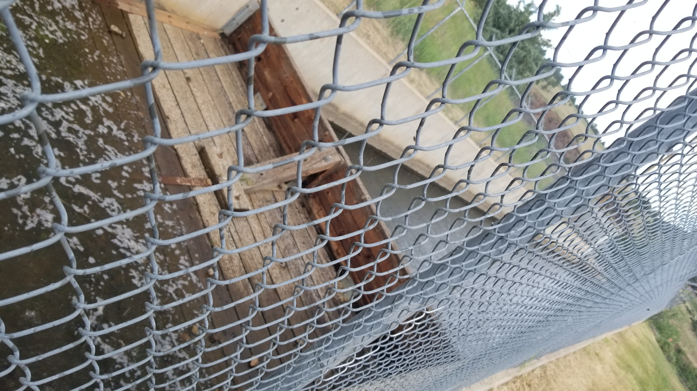

## :globe_with_meridians:Flatiron Reservoir and Spillway, Loveland, Colorado, U.S. (2021-06-26)
`Pictures` rcfdtools <br>`Category` Freelance field visit <br>`Location` [Google Maps](http://maps.google.com/maps?q=40.37364894444445,-105.23005497222222) or [Openstreet Map](https://www.openstreetmap.org/query?lat=40.37364894444445&lon=-105.23005497222222) 

```geojson
{
  "type": "Feature",
  "geometry": {
    "type": "Point", 
    "coordinates": [-105.23005497222222, 40.37364894444445]
  }, 
  "properties": {
    "Name": "Flatiron Reservoir and Spillway, Loveland, Colorado, U.S."
  }
}
```

<br><details><summary>:camera:**41/20210626_110424.jpg**</summary><sub> `Exif version` 0220 `OS version` G955USQU8DUD3 `Date` 2021:06:26 11:04:24 `Aperture` Not known `Brightness` 8.77 `Color space` 1 `Compression` 6`Exposure mode` 0 `Exposure time` 0.0003720238095238095 `Focal length` 4.25 `Lens model` Not known `Lens specification` Not known `Orientation` 6 `Scene type` Not known `f number` 1.7 `White balance` 0 `Sensing method` 2 `Shutter speed` 11.392</sub><sub>`Coordinates & altitude` (0.0, 0.0, 0.0)</sub><sub> :globe_with_meridians:`Location over` [Google Maps](http://maps.google.com/maps?q=0.0,0.0) or [Openstreet Map](https://www.openstreetmap.org/query?lat=0.0&lon=0.0)</sub></details>

<br><details><summary>:camera:**41/20210626_110426.jpg**</summary><sub> `Exif version` 0220 `OS version` G955USQU8DUD3 `Date` 2021:06:26 11:04:26 `Aperture` Not known `Brightness` 8.82 `Color space` 1 `Compression` 6`Exposure mode` 0 `Exposure time` 0.00033967391304347825 `Focal length` 4.25 `Lens model` Not known `Lens specification` Not known `Orientation` 1 `Scene type` Not known `f number` 1.7 `White balance` 0 `Sensing method` 2 `Shutter speed` 11.523</sub><sub>`Coordinates & altitude` (40.37364894444445, -105.23005497222222, 1654.968)</sub><sub> :globe_with_meridians:`Location over` [Google Maps](http://maps.google.com/maps?q=40.37364894444445,-105.23005497222222) or [Openstreet Map](https://www.openstreetmap.org/query?lat=40.37364894444445&lon=-105.23005497222222)</sub></details>

<br><details><summary>:camera:**41/20210626_110525.jpg**</summary><sub> `Exif version` 0220 `OS version` G955USQU8DUD3 `Date` 2021:06:26 11:05:25 `Aperture` Not known `Brightness` 8.6 `Color space` 1 `Compression` 6`Exposure mode` 0 `Exposure time` 0.00042087542087542086 `Focal length` 4.25 `Lens model` Not known `Lens specification` Not known `Orientation` 6 `Scene type` Not known `f number` 1.7 `White balance` 0 `Sensing method` 2 `Shutter speed` 11.214</sub><sub>`Coordinates & altitude` (40.37360616666667, -105.23002658333334, 1654.512)</sub><sub> :globe_with_meridians:`Location over` [Google Maps](http://maps.google.com/maps?q=40.37360616666667,-105.23002658333334) or [Openstreet Map](https://www.openstreetmap.org/query?lat=40.37360616666667&lon=-105.23002658333334)</sub></details>

<br><details><summary>:camera:**41/20210626_110529.jpg**</summary><sub> `Exif version` 0220 `OS version` G955USQU8DUD3 `Date` 2021:06:26 11:05:29 `Aperture` Not known `Brightness` 8.28 `Color space` 1 `Compression` 6`Exposure mode` 0 `Exposure time` 0.0005175983436853002 `Focal length` 4.25 `Lens model` Not known `Lens specification` Not known `Orientation` 1 `Scene type` Not known `f number` 1.7 `White balance` 0 `Sensing method` 2 `Shutter speed` 10.915</sub><sub>`Coordinates & altitude` (40.37360616666667, -105.23002658333334, 1654.512)</sub><sub> :globe_with_meridians:`Location over` [Google Maps](http://maps.google.com/maps?q=40.37360616666667,-105.23002658333334) or [Openstreet Map](https://www.openstreetmap.org/query?lat=40.37360616666667&lon=-105.23002658333334)</sub></details>

<br><details><summary>:camera:**41/20210626_110606.jpg**</summary><sub> `Exif version` 0220 `OS version` G955USQU8DUD3 `Date` 2021:06:26 11:06:06 `Aperture` Not known `Brightness` 7.3 `Color space` 1 `Compression` 6`Exposure mode` 0 `Exposure time` 0.0010526315789473684 `Focal length` 4.25 `Lens model` Not known `Lens specification` Not known `Orientation` 1 `Scene type` Not known `f number` 1.7 `White balance` 0 `Sensing method` 2 `Shutter speed` 9.891</sub><sub>`Coordinates & altitude` (40.37360616666667, -105.23002658333334, 1654.512)</sub><sub> :globe_with_meridians:`Location over` [Google Maps](http://maps.google.com/maps?q=40.37360616666667,-105.23002658333334) or [Openstreet Map](https://www.openstreetmap.org/query?lat=40.37360616666667&lon=-105.23002658333334)</sub></details>

<br><details><summary>:camera:**41/20210626_110807.jpg**</summary><sub> `Exif version` 0220 `OS version` G955USQU8DUD3 `Date` 2021:06:26 11:08:07 `Aperture` Not known `Brightness` 7.54 `Color space` 1 `Compression` 6`Exposure mode` 0 `Exposure time` 0.0008503401360544217 `Focal length` 4.25 `Lens model` Not known `Lens specification` Not known `Orientation` 1 `Scene type` Not known `f number` 1.7 `White balance` 0 `Sensing method` 2 `Shutter speed` 10.199</sub><sub>`Coordinates & altitude` (40.37362269444444, -105.23000294444445, 1655.788)</sub><sub> :globe_with_meridians:`Location over` [Google Maps](http://maps.google.com/maps?q=40.37362269444444,-105.23000294444445) or [Openstreet Map](https://www.openstreetmap.org/query?lat=40.37362269444444&lon=-105.23000294444445)</sub></details>

<br><details><summary>:camera:**41/20210626_110819.jpg**</summary><sub> `Exif version` 0220 `OS version` G955USQU8DUD3 `Date` 2021:06:26 11:08:19 `Aperture` Not known `Brightness` 8.4 `Color space` 1 `Compression` 6`Exposure mode` 0 `Exposure time` 0.00049800796812749 `Focal length` 4.25 `Lens model` Not known `Lens specification` Not known `Orientation` 1 `Scene type` Not known `f number` 1.7 `White balance` 0 `Sensing method` 2 `Shutter speed` 10.971</sub><sub>`Coordinates & altitude` (40.373649444444446, -105.22999180555556, 1658.843)</sub><sub> :globe_with_meridians:`Location over` [Google Maps](http://maps.google.com/maps?q=40.373649444444446,-105.22999180555556) or [Openstreet Map](https://www.openstreetmap.org/query?lat=40.373649444444446&lon=-105.22999180555556)</sub></details>

<br><details><summary>:camera:**41/20210626_110826.jpg**</summary><sub> `Exif version` 0220 `OS version` G955USQU8DUD3 `Date` 2021:06:26 11:08:26 `Aperture` Not known `Brightness` 9.24 `Color space` 1 `Compression` 6`Exposure mode` 0 `Exposure time` 0.0002642706131078224 `Focal length` 4.25 `Lens model` Not known `Lens specification` Not known `Orientation` 1 `Scene type` Not known `f number` 1.7 `White balance` 0 `Sensing method` 2 `Shutter speed` 11.885</sub><sub>`Coordinates & altitude` (40.37364127777778, -105.22998972222223, 1658.876)</sub><sub> :globe_with_meridians:`Location over` [Google Maps](http://maps.google.com/maps?q=40.37364127777778,-105.22998972222223) or [Openstreet Map](https://www.openstreetmap.org/query?lat=40.37364127777778&lon=-105.22998972222223)</sub></details>

<br><details><summary>:camera:**41/20210626_110912.jpg**</summary><sub> `Exif version` 0220 `OS version` G955USQU8DUD3 `Date` 2021:06:26 11:09:12 `Aperture` Not known `Brightness` 6.82 `Color space` 1 `Compression` 6`Exposure mode` 0 `Exposure time` 0.0014204545454545455 `Focal length` 4.25 `Lens model` Not known `Lens specification` Not known `Orientation` 6 `Scene type` Not known `f number` 1.7 `White balance` 0 `Sensing method` 2 `Shutter speed` 9.459</sub><sub>`Coordinates & altitude` (0.0, 0.0, 0.0)</sub><sub> :globe_with_meridians:`Location over` [Google Maps](http://maps.google.com/maps?q=0.0,0.0) or [Openstreet Map](https://www.openstreetmap.org/query?lat=0.0&lon=0.0)</sub></details>

<br><details><summary>:camera:**41/20210626_110938.jpg**</summary><sub> `Exif version` 0220 `OS version` G955USQU8DUD3 `Date` 2021:06:26 11:09:38 `Aperture` Not known `Brightness` 6.84 `Color space` 1 `Compression` 6`Exposure mode` 0 `Exposure time` 0.0013850415512465374 `Focal length` 4.25 `Lens model` Not known `Lens specification` Not known `Orientation` 1 `Scene type` Not known `f number` 1.7 `White balance` 0 `Sensing method` 2 `Shutter speed` 9.495</sub><sub>`Coordinates & altitude` (40.373515222222224, -105.2294495, 1599.245)</sub><sub> :globe_with_meridians:`Location over` [Google Maps](http://maps.google.com/maps?q=40.373515222222224,-105.2294495) or [Openstreet Map](https://www.openstreetmap.org/query?lat=40.373515222222224&lon=-105.2294495)</sub></details>

<br><details><summary>:camera:**41/20210626_110942.jpg**</summary><sub> `Exif version` 0220 `OS version` G955USQU8DUD3 `Date` 2021:06:26 11:09:42 `Aperture` Not known `Brightness` 7.12 `Color space` 1 `Compression` 6`Exposure mode` 0 `Exposure time` 0.001201923076923077 `Focal length` 4.25 `Lens model` Not known `Lens specification` Not known `Orientation` 1 `Scene type` Not known `f number` 1.7 `White balance` 0 `Sensing method` 2 `Shutter speed` 9.7</sub><sub>`Coordinates & altitude` (40.373515222222224, -105.2294495, 1599.245)</sub><sub> :globe_with_meridians:`Location over` [Google Maps](http://maps.google.com/maps?q=40.373515222222224,-105.2294495) or [Openstreet Map](https://www.openstreetmap.org/query?lat=40.373515222222224&lon=-105.2294495)</sub></details>

<br><details><summary>:camera:**41/20210626_111103.jpg**</summary><sub> `Exif version` 0220 `OS version` G955USQU8DUD3 `Date` 2021:06:26 11:11:03 `Aperture` Not known `Brightness` 7.87 `Color space` 1 `Compression` 6`Exposure mode` 0 `Exposure time` 0.0006793478260869565 `Focal length` 4.25 `Lens model` Not known `Lens specification` Not known `Orientation` 1 `Scene type` Not known `f number` 1.7 `White balance` 0 `Sensing method` 2 `Shutter speed` 10.523</sub><sub>`Coordinates & altitude` (40.37398955555555, -105.23029102777778, 1688.346)</sub><sub> :globe_with_meridians:`Location over` [Google Maps](http://maps.google.com/maps?q=40.37398955555555,-105.23029102777778) or [Openstreet Map](https://www.openstreetmap.org/query?lat=40.37398955555555&lon=-105.23029102777778)</sub></details>

<br><details><summary>:camera:**41/20210626_111105.jpg**</summary><sub> `Exif version` 0220 `OS version` G955USQU8DUD3 `Date` 2021:06:26 11:11:05 `Aperture` Not known `Brightness` 7.55 `Color space` 1 `Compression` 6`Exposure mode` 0 `Exposure time` 0.000847457627118644 `Focal length` 4.25 `Lens model` Not known `Lens specification` Not known `Orientation` 1 `Scene type` Not known `f number` 1.7 `White balance` 0 `Sensing method` 2 `Shutter speed` 10.204</sub><sub>`Coordinates & altitude` (40.37398955555555, -105.23029102777778, 1688.346)</sub><sub> :globe_with_meridians:`Location over` [Google Maps](http://maps.google.com/maps?q=40.37398955555555,-105.23029102777778) or [Openstreet Map](https://www.openstreetmap.org/query?lat=40.37398955555555&lon=-105.23029102777778)</sub></details>

<br><details><summary>:camera:**41/20210626_111110.jpg**</summary><sub> `Exif version` 0220 `OS version` G955USQU8DUD3 `Date` 2021:06:26 11:11:10 `Aperture` Not known `Brightness` 7.07 `Color space` 1 `Compression` 6`Exposure mode` 0 `Exposure time` 0.0012135922330097086 `Focal length` 4.25 `Lens model` Not known `Lens specification` Not known `Orientation` 1 `Scene type` Not known `f number` 1.7 `White balance` 0 `Sensing method` 2 `Shutter speed` 9.687</sub><sub>`Coordinates & altitude` (40.37398955555555, -105.23029102777778, 1688.346)</sub><sub> :globe_with_meridians:`Location over` [Google Maps](http://maps.google.com/maps?q=40.37398955555555,-105.23029102777778) or [Openstreet Map](https://www.openstreetmap.org/query?lat=40.37398955555555&lon=-105.23029102777778)</sub></details>

<br><details><summary>:camera:**41/20210626_111315.jpg**</summary><sub> `Exif version` 0220 `OS version` G955USQU8DUD3 `Date` 2021:06:26 11:13:15 `Aperture` Not known `Brightness` 5.62 `Color space` 1 `Compression` 6`Exposure mode` 0 `Exposure time` 0.0031545741324921135 `Focal length` 4.25 `Lens model` Not known `Lens specification` Not known `Orientation` 1 `Scene type` Not known `f number` 1.7 `White balance` 0 `Sensing method` 2 `Shutter speed` 8.308</sub><sub>`Coordinates & altitude` (0.0, 0.0, 0.0)</sub><sub> :globe_with_meridians:`Location over` [Google Maps](http://maps.google.com/maps?q=0.0,0.0) or [Openstreet Map](https://www.openstreetmap.org/query?lat=0.0&lon=0.0)</sub></details>

<br><details><summary>:camera:**41/20210626_111317.jpg**</summary><sub> `Exif version` 0220 `OS version` G955USQU8DUD3 `Date` 2021:06:26 11:13:17 `Aperture` Not known `Brightness` 6.16 `Color space` 1 `Compression` 6`Exposure mode` 0 `Exposure time` 0.0023148148148148147 `Focal length` 4.25 `Lens model` Not known `Lens specification` Not known `Orientation` 1 `Scene type` Not known `f number` 1.7 `White balance` 0 `Sensing method` 2 `Shutter speed` 8.754</sub><sub>`Coordinates & altitude` (40.374671694444444, -105.2305748888889, 1691.903)</sub><sub> :globe_with_meridians:`Location over` [Google Maps](http://maps.google.com/maps?q=40.374671694444444,-105.2305748888889) or [Openstreet Map](https://www.openstreetmap.org/query?lat=40.374671694444444&lon=-105.2305748888889)</sub></details>

<br><details><summary>:camera:**41/20210626_111320.jpg**</summary><sub> `Exif version` 0220 `OS version` G955USQU8DUD3 `Date` 2021:06:26 11:13:19 `Aperture` Not known `Brightness` 5.7 `Color space` 1 `Compression` 6`Exposure mode` 0 `Exposure time` 0.0029940119760479044 `Focal length` 4.25 `Lens model` Not known `Lens specification` Not known `Orientation` 1 `Scene type` Not known `f number` 1.7 `White balance` 0 `Sensing method` 2 `Shutter speed` 8.383</sub><sub>`Coordinates & altitude` (40.374671694444444, -105.2305748888889, 1691.903)</sub><sub> :globe_with_meridians:`Location over` [Google Maps](http://maps.google.com/maps?q=40.374671694444444,-105.2305748888889) or [Openstreet Map](https://www.openstreetmap.org/query?lat=40.374671694444444&lon=-105.2305748888889)</sub></details>

<br><details><summary>:camera:**41/20210626_111327.jpg**</summary><sub> `Exif version` 0220 `OS version` G955USQU8DUD3 `Date` 2021:06:26 11:13:27 `Aperture` Not known `Brightness` 6.44 `Color space` 1 `Compression` 6`Exposure mode` 0 `Exposure time` 0.0018656716417910447 `Focal length` 4.25 `Lens model` Not known `Lens specification` Not known `Orientation` 1 `Scene type` Not known `f number` 1.7 `White balance` 0 `Sensing method` 2 `Shutter speed` 9.066</sub><sub>`Coordinates & altitude` (40.374671694444444, -105.2305748888889, 1691.903)</sub><sub> :globe_with_meridians:`Location over` [Google Maps](http://maps.google.com/maps?q=40.374671694444444,-105.2305748888889) or [Openstreet Map](https://www.openstreetmap.org/query?lat=40.374671694444444&lon=-105.2305748888889)</sub></details>

<br><details><summary>:camera:**41/20210626_111330.jpg**</summary><sub> `Exif version` 0220 `OS version` G955USQU8DUD3 `Date` 2021:06:26 11:13:30 `Aperture` Not known `Brightness` 5.86 `Color space` 1 `Compression` 6`Exposure mode` 0 `Exposure time` 0.002702702702702703 `Focal length` 4.25 `Lens model` Not known `Lens specification` Not known `Orientation` 1 `Scene type` Not known `f number` 1.7 `White balance` 0 `Sensing method` 2 `Shutter speed` 8.531</sub><sub>`Coordinates & altitude` (40.374671694444444, -105.2305748888889, 1691.903)</sub><sub> :globe_with_meridians:`Location over` [Google Maps](http://maps.google.com/maps?q=40.374671694444444,-105.2305748888889) or [Openstreet Map](https://www.openstreetmap.org/query?lat=40.374671694444444&lon=-105.2305748888889)</sub></details>

<br><details><summary>:camera:**41/20210626_112800.jpg**</summary><sub> `Exif version` 0220 `OS version` G955USQU8DUD3 `Date` 2021:06:26 11:28:00 `Aperture` Not known `Brightness` 8.47 `Color space` 1 `Compression` 6`Exposure mode` 0 `Exposure time` 0.0004266211604095563 `Focal length` 4.25 `Lens model` Not known `Lens specification` Not known `Orientation` 1 `Scene type` Not known `f number` 1.7 `White balance` 0 `Sensing method` 2 `Shutter speed` 11.194</sub><sub>`Coordinates & altitude` (40.37339608333333, -105.23172686111111, 1672.807)</sub><sub> :globe_with_meridians:`Location over` [Google Maps](http://maps.google.com/maps?q=40.37339608333333,-105.23172686111111) or [Openstreet Map](https://www.openstreetmap.org/query?lat=40.37339608333333&lon=-105.23172686111111)</sub></details>

<br><details><summary>:camera:**41/20210626_114437.jpg**</summary><sub> `Exif version` 0220 `OS version` G955USQU8DUD3 `Date` 2021:06:26 11:44:37 `Aperture` Not known `Brightness` 8.39 `Color space` 1 `Compression` 6`Exposure mode` 0 `Exposure time` 0.00046816479400749064 `Focal length` 4.25 `Lens model` Not known `Lens specification` Not known `Orientation` 1 `Scene type` Not known `f number` 1.7 `White balance` 0 `Sensing method` 2 `Shutter speed` 11.06</sub><sub>`Coordinates & altitude` (40.37349783333333, -105.2318983888889, 1666.398)</sub><sub> :globe_with_meridians:`Location over` [Google Maps](http://maps.google.com/maps?q=40.37349783333333,-105.2318983888889) or [Openstreet Map](https://www.openstreetmap.org/query?lat=40.37349783333333&lon=-105.2318983888889)</sub></details>

<br><details><summary>:camera:**41/20210627_062952.jpg**</summary><sub> `Exif version` 0220 `OS version` G955USQU8DUD3 `Date` 2021:06:27 06:29:52 `Aperture` Not known `Brightness` 1.73 `Color space` 1 `Compression` 6`Exposure mode` 0 `Exposure time` 0.016666666666666666 `Focal length` 4.25 `Lens model` Not known `Lens specification` Not known `Orientation` 1 `Scene type` Not known `f number` 1.7 `White balance` 0 `Sensing method` 2 `Shutter speed` 5.906</sub><sub>`Coordinates & altitude` (0.0, 0.0, 0.0)</sub><sub> :globe_with_meridians:`Location over` [Google Maps](http://maps.google.com/maps?q=0.0,0.0) or [Openstreet Map](https://www.openstreetmap.org/query?lat=0.0&lon=0.0)</sub></details>

<br><details><summary>:camera:**41/20210627_063004.jpg**</summary><sub> `Exif version` 0220 `OS version` G955USQU8DUD3 `Date` 2021:06:27 06:30:04 `Aperture` Not known `Brightness` 2.2 `Color space` 1 `Compression` 6`Exposure mode` 0 `Exposure time` 0.016666666666666666 `Focal length` 4.25 `Lens model` Not known `Lens specification` Not known `Orientation` 1 `Scene type` Not known `f number` 1.7 `White balance` 0 `Sensing method` 2 `Shutter speed` 5.906</sub><sub>`Coordinates & altitude` (0.0, 0.0, 0.0)</sub><sub> :globe_with_meridians:`Location over` [Google Maps](http://maps.google.com/maps?q=0.0,0.0) or [Openstreet Map](https://www.openstreetmap.org/query?lat=0.0&lon=0.0)</sub></details>

<br><details><summary>:camera:**41/20210627_063016.jpg**</summary><sub> `Exif version` 0220 `OS version` G955USQU8DUD3 `Date` 2021:06:27 06:30:15 `Aperture` Not known `Brightness` 1.34 `Color space` 1 `Compression` 6`Exposure mode` 0 `Exposure time` 0.02 `Focal length` 4.25 `Lens model` Not known `Lens specification` Not known `Orientation` 1 `Scene type` Not known `f number` 1.7 `White balance` 0 `Sensing method` 2 `Shutter speed` 5.643</sub><sub>`Coordinates & altitude` (0.0, 0.0, 0.0)</sub><sub> :globe_with_meridians:`Location over` [Google Maps](http://maps.google.com/maps?q=0.0,0.0) or [Openstreet Map](https://www.openstreetmap.org/query?lat=0.0&lon=0.0)</sub></details>

<br><details><summary>:camera:**41/20210627_063037.jpg**</summary><sub> `Exif version` 0220 `OS version` G955USQU8DUD3 `Date` 2021:06:27 06:30:37 `Aperture` Not known `Brightness` 2.1 `Color space` 1 `Compression` 6`Exposure mode` 0 `Exposure time` 0.011235955056179775 `Focal length` 4.25 `Lens model` Not known `Lens specification` Not known `Orientation` 6 `Scene type` Not known `f number` 1.7 `White balance` 0 `Sensing method` 2 `Shutter speed` 6.467</sub><sub>`Coordinates & altitude` (0.0, 0.0, 0.0)</sub><sub> :globe_with_meridians:`Location over` [Google Maps](http://maps.google.com/maps?q=0.0,0.0) or [Openstreet Map](https://www.openstreetmap.org/query?lat=0.0&lon=0.0)</sub></details>

<br><details><summary>:camera:**41/20210627_063046.jpg**</summary><sub> `Exif version` 0220 `OS version` G955USQU8DUD3 `Date` 2021:06:27 06:30:45 `Aperture` Not known `Brightness` 2.87 `Color space` 1 `Compression` 6`Exposure mode` 0 `Exposure time` 0.02 `Focal length` 4.25 `Lens model` Not known `Lens specification` Not known `Orientation` 1 `Scene type` Not known `f number` 1.7 `White balance` 0 `Sensing method` 2 `Shutter speed` 5.643</sub><sub>`Coordinates & altitude` (0.0, 0.0, 0.0)</sub><sub> :globe_with_meridians:`Location over` [Google Maps](http://maps.google.com/maps?q=0.0,0.0) or [Openstreet Map](https://www.openstreetmap.org/query?lat=0.0&lon=0.0)</sub></details>

<br><details><summary>:camera:**41/20210627_204340.jpg**</summary><sub> `Exif version` 0220 `OS version` G955USQU8DUD3 `Date` 2021:06:27 20:43:40 `Aperture` Not known `Brightness` 7.29 `Color space` 1 `Compression` 6`Exposure mode` 0 `Exposure time` 0.0010351966873706005 `Focal length` 4.25 `Lens model` Not known `Lens specification` Not known `Orientation` 1 `Scene type` Not known `f number` 1.7 `White balance` 0 `Sensing method` 2 `Shutter speed` 9.915</sub><sub>`Coordinates & altitude` (0.0, 0.0, 0.0)</sub><sub> :globe_with_meridians:`Location over` [Google Maps](http://maps.google.com/maps?q=0.0,0.0) or [Openstreet Map](https://www.openstreetmap.org/query?lat=0.0&lon=0.0)</sub></details>

<br><details><summary>:camera:**41/20210627_204439.jpg**</summary><sub> `Exif version` 0220 `OS version` G955USQU8DUD3 `Date` 2021:06:27 20:44:39 `Aperture` Not known `Brightness` 7.31 `Color space` 1 `Compression` 6`Exposure mode` 0 `Exposure time` 0.000980392156862745 `Focal length` 4.25 `Lens model` Not known `Lens specification` Not known `Orientation` 1 `Scene type` Not known `f number` 1.7 `White balance` 0 `Sensing method` 2 `Shutter speed` 9.994</sub><sub>`Coordinates & altitude` (0.0, 0.0, 0.0)</sub><sub> :globe_with_meridians:`Location over` [Google Maps](http://maps.google.com/maps?q=0.0,0.0) or [Openstreet Map](https://www.openstreetmap.org/query?lat=0.0&lon=0.0)</sub></details>

<br><details><summary>:camera:**41/20210627_210222.jpg**</summary><sub> `Exif version` 0220 `OS version` G955USQU8DUD3 `Date` 2021:06:27 21:02:22 `Aperture` Not known `Brightness` 6.6 `Color space` 1 `Compression` 6`Exposure mode` 0 `Exposure time` 0.0015822784810126582 `Focal length` 4.25 `Lens model` Not known `Lens specification` Not known `Orientation` 1 `Scene type` Not known `f number` 1.7 `White balance` 0 `Sensing method` 2 `Shutter speed` 9.303</sub><sub>`Coordinates & altitude` (0.0, 0.0, 0.0)</sub><sub> :globe_with_meridians:`Location over` [Google Maps](http://maps.google.com/maps?q=0.0,0.0) or [Openstreet Map](https://www.openstreetmap.org/query?lat=0.0&lon=0.0)</sub></details>

<br><details><summary>:camera:**41/20210627_210510.jpg**</summary><sub> `Exif version` 0220 `OS version` G955USQU8DUD3 `Date` 2021:06:27 21:05:10 `Aperture` Not known `Brightness` 6.72 `Color space` 1 `Compression` 6`Exposure mode` 0 `Exposure time` 0.0014970059880239522 `Focal length` 4.25 `Lens model` Not known `Lens specification` Not known `Orientation` 6 `Scene type` Not known `f number` 1.7 `White balance` 0 `Sensing method` 2 `Shutter speed` 9.383</sub><sub>`Coordinates & altitude` (0.0, 0.0, 0.0)</sub><sub> :globe_with_meridians:`Location over` [Google Maps](http://maps.google.com/maps?q=0.0,0.0) or [Openstreet Map](https://www.openstreetmap.org/query?lat=0.0&lon=0.0)</sub></details>

<br><details><summary>:camera:**41/20210627_210521.jpg**</summary><sub> `Exif version` 0220 `OS version` G955USQU8DUD3 `Date` 2021:06:27 21:05:21 `Aperture` Not known `Brightness` 7.11 `Color space` 1 `Compression` 6`Exposure mode` 0 `Exposure time` 0.0011312217194570137 `Focal length` 4.25 `Lens model` Not known `Lens specification` Not known `Orientation` 1 `Scene type` Not known `f number` 1.7 `White balance` 0 `Sensing method` 2 `Shutter speed` 9.787</sub><sub>`Coordinates & altitude` (0.0, 0.0, 0.0)</sub><sub> :globe_with_meridians:`Location over` [Google Maps](http://maps.google.com/maps?q=0.0,0.0) or [Openstreet Map](https://www.openstreetmap.org/query?lat=0.0&lon=0.0)</sub></details>

> _Citación: se permite la reproducción digital parcial o total de este repositorio, scripts, guías de desarrollo, modelos de datos, imágenes y documentación, siempre que se haga referencia como: "R.GISMobile - Sistemas de información geográficos móviles sobre QField que no requieren de conexión a Internet para su navegación". https://github.com/rcfdtools/R.GISMobile - Bogotá - Colombia - Suramérica."._

| [:house: Inicio](../Readme.md) |
|---|