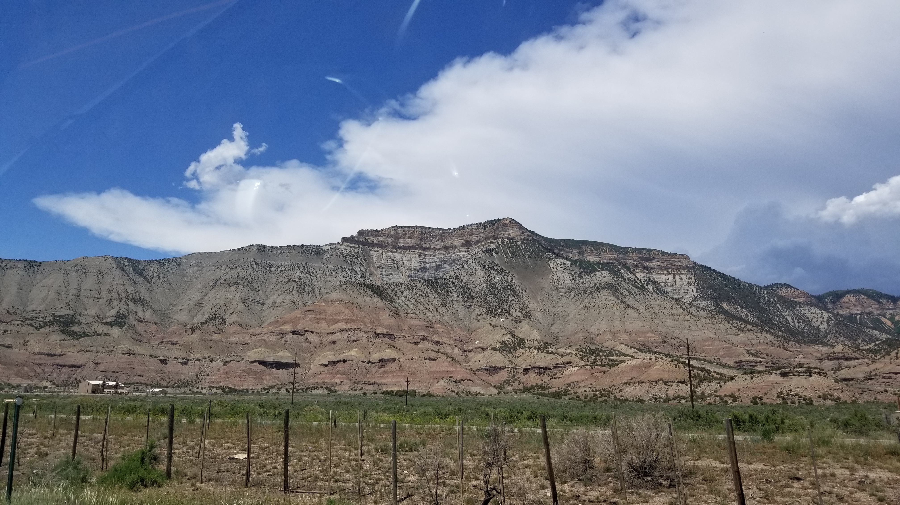

## :globe_with_meridians:Travel across Colorado - Utah - Nevada, U.S. (2021-06-26)
`Pictures` rcfdtools <br>`Category` Freelance field visit <br>`Location` [Google Maps](http://maps.google.com/maps?q=40.37364894444445,-105.23005497222222) or [Openstreet Map](https://www.openstreetmap.org/query?lat=40.37364894444445&lon=-105.23005497222222) 

```geojson
{
  "type": "Feature",
  "geometry": {
    "type": "Point", 
    "coordinates": [-105.23005497222222, 40.37364894444445]
  }, 
  "properties": {
    "Name": "Travel across Colorado - Utah - Nevada, U.S."
  }
}
```

<br><details><summary>:camera:**42/20210606_120544.jpg**</summary><sub> `Exif version` 0220 `OS version` G955USQU8DUD3 `Date` 2021:06:06 12:05:44 `Aperture` Not known `Brightness` 8.98 `Color space` 1 `Compression` 6`Exposure mode` 0 `Exposure time` 0.0003238341968911917 `Focal length` 4.25 `Lens model` Not known `Lens specification` Not known `Orientation` 1 `Scene type` Not known `f number` 1.7 `White balance` 0 `Sensing method` 2 `Shutter speed` 11.592</sub><sub>`Coordinates & altitude` (39.62943, -106.06998924999999, 2662.522)</sub><sub> :globe_with_meridians:`Location over` [Google Maps](http://maps.google.com/maps?q=39.62943,-106.06998924999999) or [Openstreet Map](https://www.openstreetmap.org/query?lat=39.62943&lon=-106.06998924999999)</sub></details>

<br><details><summary>:camera:**42/20210606_120549.jpg**</summary><sub> `Exif version` 0220 `OS version` G955USQU8DUD3 `Date` 2021:06:06 12:05:48 `Aperture` Not known `Brightness` 9.62 `Color space` 1 `Compression` 6`Exposure mode` 0 `Exposure time` 0.00020358306188925082 `Focal length` 4.25 `Lens model` Not known `Lens specification` Not known `Orientation` 1 `Scene type` Not known `f number` 1.7 `White balance` 0 `Sensing method` 2 `Shutter speed` 12.262</sub><sub>`Coordinates & altitude` (39.629429055555555, -106.06998980555555, 2662.345)</sub><sub> :globe_with_meridians:`Location over` [Google Maps](http://maps.google.com/maps?q=39.629429055555555,-106.06998980555555) or [Openstreet Map](https://www.openstreetmap.org/query?lat=39.629429055555555&lon=-106.06998980555555)</sub></details>

<br><details><summary>:camera:**42/20210606_132054.jpg**</summary><sub> `Exif version` 0220 `OS version` G955USQU8DUD3 `Date` 2021:06:06 13:20:54 `Aperture` Not known `Brightness` 8.13 `Color space` 1 `Compression` 6`Exposure mode` 0 `Exposure time` 0.0005656108597285068 `Focal length` 4.25 `Lens model` Not known `Lens specification` Not known `Orientation` 1 `Scene type` Not known `f number` 1.7 `White balance` 0 `Sensing method` 2 `Shutter speed` 10.787</sub><sub>`Coordinates & altitude` (39.615677500000004, -107.13713169444445, 1852.292)</sub><sub> :globe_with_meridians:`Location over` [Google Maps](http://maps.google.com/maps?q=39.615677500000004,-107.13713169444445) or [Openstreet Map](https://www.openstreetmap.org/query?lat=39.615677500000004&lon=-107.13713169444445)</sub></details>

<br><details><summary>:camera:**42/20210606_132101.jpg**</summary><sub> `Exif version` 0220 `OS version` G955USQU8DUD3 `Date` 2021:06:06 13:21:01 `Aperture` Not known `Brightness` 8.12 `Color space` 1 `Compression` 6`Exposure mode` 0 `Exposure time` 0.0005580357142857143 `Focal length` 4.25 `Lens model` Not known `Lens specification` Not known `Orientation` 1 `Scene type` Not known `f number` 1.7 `White balance` 0 `Sensing method` 2 `Shutter speed` 10.807</sub><sub>`Coordinates & altitude` (39.61497391666667, -107.13941100000001, 1856.344)</sub><sub> :globe_with_meridians:`Location over` [Google Maps](http://maps.google.com/maps?q=39.61497391666667,-107.13941100000001) or [Openstreet Map](https://www.openstreetmap.org/query?lat=39.61497391666667&lon=-107.13941100000001)</sub></details>

<br><details><summary>:camera:**42/20210606_132248.jpg**</summary><sub> `Exif version` 0220 `OS version` G955USQU8DUD3 `Date` 2021:06:06 13:22:48 `Aperture` Not known `Brightness` 7.86 `Color space` 1 `Compression` 6`Exposure mode` 0 `Exposure time` 0.0006887052341597796 `Focal length` 4.25 `Lens model` Not known `Lens specification` Not known `Orientation` 1 `Scene type` Not known `f number` 1.7 `White balance` 0 `Sensing method` 2 `Shutter speed` 10.503</sub><sub>`Coordinates & altitude` (0.0, 0.0, 0.0)</sub><sub> :globe_with_meridians:`Location over` [Google Maps](http://maps.google.com/maps?q=0.0,0.0) or [Openstreet Map](https://www.openstreetmap.org/query?lat=0.0&lon=0.0)</sub></details>

<br><details><summary>:camera:**42/20210606_132252.jpg**</summary><sub> `Exif version` 0220 `OS version` G955USQU8DUD3 `Date` 2021:06:06 13:22:52 `Aperture` Not known `Brightness` 7.77 `Color space` 1 `Compression` 6`Exposure mode` 0 `Exposure time` 0.0007352941176470588 `Focal length` 4.25 `Lens model` Not known `Lens specification` Not known `Orientation` 1 `Scene type` Not known `f number` 1.7 `White balance` 0 `Sensing method` 2 `Shutter speed` 10.409</sub><sub>`Coordinates & altitude` (39.60172219444445, -107.1655346388889, 1864.24)</sub><sub> :globe_with_meridians:`Location over` [Google Maps](http://maps.google.com/maps?q=39.60172219444445,-107.1655346388889) or [Openstreet Map](https://www.openstreetmap.org/query?lat=39.60172219444445&lon=-107.1655346388889)</sub></details>

<br><details><summary>:camera:**42/20210606_132259.jpg**</summary><sub> `Exif version` 0220 `OS version` G955USQU8DUD3 `Date` 2021:06:06 13:22:59 `Aperture` Not known `Brightness` 7.86 `Color space` 1 `Compression` 6`Exposure mode` 0 `Exposure time` 0.0006720430107526882 `Focal length` 4.25 `Lens model` Not known `Lens specification` Not known `Orientation` 1 `Scene type` Not known `f number` 1.7 `White balance` 0 `Sensing method` 2 `Shutter speed` 10.539</sub><sub>`Coordinates & altitude` (39.60144652777778, -107.16738627777778, 1864.889)</sub><sub> :globe_with_meridians:`Location over` [Google Maps](http://maps.google.com/maps?q=39.60144652777778,-107.16738627777778) or [Openstreet Map](https://www.openstreetmap.org/query?lat=39.60144652777778&lon=-107.16738627777778)</sub></details>

<br><details><summary>:camera:**42/20210606_132359.jpg**</summary><sub> `Exif version` 0220 `OS version` G955USQU8DUD3 `Date` 2021:06:06 13:23:59 `Aperture` Not known `Brightness` 7.32 `Color space` 1 `Compression` 6`Exposure mode` 0 `Exposure time` 0.001004016064257028 `Focal length` 4.25 `Lens model` Not known `Lens specification` Not known `Orientation` 1 `Scene type` Not known `f number` 1.7 `White balance` 0 `Sensing method` 2 `Shutter speed` 9.96</sub><sub>`Coordinates & altitude` (0.0, 0.0, 0.0)</sub><sub> :globe_with_meridians:`Location over` [Google Maps](http://maps.google.com/maps?q=0.0,0.0) or [Openstreet Map](https://www.openstreetmap.org/query?lat=0.0&lon=0.0)</sub></details>

<br><details><summary>:camera:**42/20210606_132401.jpg**</summary><sub> `Exif version` 0220 `OS version` G955USQU8DUD3 `Date` 2021:06:06 13:24:01 `Aperture` Not known `Brightness` 7.35 `Color space` 1 `Compression` 6`Exposure mode` 0 `Exposure time` 0.0010309278350515464 `Focal length` 4.25 `Lens model` Not known `Lens specification` Not known `Orientation` 1 `Scene type` Not known `f number` 1.7 `White balance` 0 `Sensing method` 2 `Shutter speed` 9.921</sub><sub>`Coordinates & altitude` (39.59123397222223, -107.18064530555556, 1866.48)</sub><sub> :globe_with_meridians:`Location over` [Google Maps](http://maps.google.com/maps?q=39.59123397222223,-107.18064530555556) or [Openstreet Map](https://www.openstreetmap.org/query?lat=39.59123397222223&lon=-107.18064530555556)</sub></details>

<br><details><summary>:camera:**42/20210606_133600.jpg**</summary><sub> `Exif version` 0220 `OS version` G955USQU8DUD3 `Date` 2021:06:06 13:36:00 `Aperture` Not known `Brightness` 8.65 `Color space` 1 `Compression` 6`Exposure mode` 0 `Exposure time` 0.0004152823920265781 `Focal length` 4.25 `Lens model` Not known `Lens specification` Not known `Orientation` 1 `Scene type` Not known `f number` 1.7 `White balance` 0 `Sensing method` 2 `Shutter speed` 11.233</sub><sub>`Coordinates & altitude` (39.56057555555555, -107.25153508333334, 1727.191)</sub><sub> :globe_with_meridians:`Location over` [Google Maps](http://maps.google.com/maps?q=39.56057555555555,-107.25153508333334) or [Openstreet Map](https://www.openstreetmap.org/query?lat=39.56057555555555&lon=-107.25153508333334)</sub></details>

<br><details><summary>:camera:**42/20210606_133605.jpg**</summary><sub> `Exif version` 0220 `OS version` G955USQU8DUD3 `Date` 2021:06:06 13:36:05 `Aperture` Not known `Brightness` 7.71 `Color space` 1 `Compression` 6`Exposure mode` 0 `Exposure time` 0.0007204610951008645 `Focal length` 4.25 `Lens model` Not known `Lens specification` Not known `Orientation` 6 `Scene type` Not known `f number` 1.7 `White balance` 0 `Sensing method` 2 `Shutter speed` 10.438</sub><sub>`Coordinates & altitude` (39.56057555555555, -107.25153508333334, 1727.191)</sub><sub> :globe_with_meridians:`Location over` [Google Maps](http://maps.google.com/maps?q=39.56057555555555,-107.25153508333334) or [Openstreet Map](https://www.openstreetmap.org/query?lat=39.56057555555555&lon=-107.25153508333334)</sub></details>

<br><details><summary>:camera:**42/20210606_133609.jpg**</summary><sub> `Exif version` 0220 `OS version` G955USQU8DUD3 `Date` 2021:06:06 13:36:09 `Aperture` Not known `Brightness` 7.57 `Color space` 1 `Compression` 6`Exposure mode` 0 `Exposure time` 0.0008038585209003215 `Focal length` 4.25 `Lens model` Not known `Lens specification` Not known `Orientation` 1 `Scene type` Not known `f number` 1.7 `White balance` 0 `Sensing method` 2 `Shutter speed` 10.28</sub><sub>`Coordinates & altitude` (39.56057555555555, -107.25153508333334, 1727.191)</sub><sub> :globe_with_meridians:`Location over` [Google Maps](http://maps.google.com/maps?q=39.56057555555555,-107.25153508333334) or [Openstreet Map](https://www.openstreetmap.org/query?lat=39.56057555555555&lon=-107.25153508333334)</sub></details>

<br><details><summary>:camera:**42/20210606_133613.jpg**</summary><sub> `Exif version` 0220 `OS version` G955USQU8DUD3 `Date` 2021:06:06 13:36:13 `Aperture` Not known `Brightness` 8.6 `Color space` 1 `Compression` 6`Exposure mode` 0 `Exposure time` 0.00040716612377850165 `Focal length` 4.25 `Lens model` Not known `Lens specification` Not known `Orientation` 1 `Scene type` Not known `f number` 1.7 `White balance` 0 `Sensing method` 2 `Shutter speed` 11.262</sub><sub>`Coordinates & altitude` (39.56057555555555, -107.25153508333334, 1727.191)</sub><sub> :globe_with_meridians:`Location over` [Google Maps](http://maps.google.com/maps?q=39.56057555555555,-107.25153508333334) or [Openstreet Map](https://www.openstreetmap.org/query?lat=39.56057555555555&lon=-107.25153508333334)</sub></details>

<br><details><summary>:camera:**42/20210606_134946.jpg**</summary><sub> `Exif version` 0220 `OS version` G955USQU8DUD3 `Date` 2021:06:06 13:49:46 `Aperture` Not known `Brightness` 8.38 `Color space` 1 `Compression` 6`Exposure mode` 0 `Exposure time` 0.0004716981132075472 `Focal length` 4.25 `Lens model` Not known `Lens specification` Not known `Orientation` 1 `Scene type` Not known `f number` 1.7 `White balance` 0 `Sensing method` 2 `Shutter speed` 11.049</sub><sub>`Coordinates & altitude` (39.549572, -107.32813725, 1731.554)</sub><sub> :globe_with_meridians:`Location over` [Google Maps](http://maps.google.com/maps?q=39.549572,-107.32813725) or [Openstreet Map](https://www.openstreetmap.org/query?lat=39.549572&lon=-107.32813725)</sub></details>

<br><details><summary>:camera:**42/20210606_142046.jpg**</summary><sub> `Exif version` 0220 `OS version` G955USQU8DUD3 `Date` 2021:06:06 14:20:46 `Aperture` Not known `Brightness` 9.38 `Color space` 1 `Compression` 6`Exposure mode` 0 `Exposure time` 0.00022893772893772894 `Focal length` 4.25 `Lens model` Not known `Lens specification` Not known `Orientation` 1 `Scene type` Not known `f number` 1.7 `White balance` 0 `Sensing method` 2 `Shutter speed` 12.092</sub><sub>`Coordinates & altitude` (39.47547791666667, -108.01339941666667, 1540.329)</sub><sub> :globe_with_meridians:`Location over` [Google Maps](http://maps.google.com/maps?q=39.47547791666667,-108.01339941666667) or [Openstreet Map](https://www.openstreetmap.org/query?lat=39.47547791666667&lon=-108.01339941666667)</sub></details>

<br><details><summary>:camera:**42/20210606_142103.jpg**</summary><sub> `Exif version` 0220 `OS version` G955USQU8DUD3 `Date` 2021:06:06 14:21:03 `Aperture` Not known `Brightness` 9.58 `Color space` 1 `Compression` 6`Exposure mode` 0 `Exposure time` 0.00020032051282051281 `Focal length` 4.25 `Lens model` Not known `Lens specification` Not known `Orientation` 1 `Scene type` Not known `f number` 1.7 `White balance` 0 `Sensing method` 2 `Shutter speed` 12.285</sub><sub>`Coordinates & altitude` (39.47409583333334, -108.02042897222222, 1544.609)</sub><sub> :globe_with_meridians:`Location over` [Google Maps](http://maps.google.com/maps?q=39.47409583333334,-108.02042897222222) or [Openstreet Map](https://www.openstreetmap.org/query?lat=39.47409583333334&lon=-108.02042897222222)</sub></details>

<br><details><summary>:camera:**42/20210606_142111.jpg**</summary><sub> `Exif version` 0220 `OS version` G955USQU8DUD3 `Date` 2021:06:06 14:21:11 `Aperture` Not known `Brightness` 9.6 `Color space` 1 `Compression` 6`Exposure mode` 0 `Exposure time` 0.00020491803278688525 `Focal length` 4.25 `Lens model` Not known `Lens specification` Not known `Orientation` 1 `Scene type` Not known `f number` 1.7 `White balance` 0 `Sensing method` 2 `Shutter speed` 12.252</sub><sub>`Coordinates & altitude` (39.47257255555556, -108.02341086111112, 1540.343)</sub><sub> :globe_with_meridians:`Location over` [Google Maps](http://maps.google.com/maps?q=39.47257255555556,-108.02341086111112) or [Openstreet Map](https://www.openstreetmap.org/query?lat=39.47257255555556&lon=-108.02341086111112)</sub></details>

<br><details><summary>:camera:**42/20210606_144225.jpg**</summary><sub> `Exif version` 0220 `OS version` G955USQU8DUD3 `Date` 2021:06:06 14:42:25 `Aperture` Not known `Brightness` 8.11 `Color space` 1 `Compression` 6`Exposure mode` 0 `Exposure time` 0.000588235294117647 `Focal length` 4.25 `Lens model` Not known `Lens specification` Not known `Orientation` 1 `Scene type` Not known `f number` 1.7 `White balance` 0 `Sensing method` 2 `Shutter speed` 10.731</sub><sub>`Coordinates & altitude` (0.0, 0.0, 0.0)</sub><sub> :globe_with_meridians:`Location over` [Google Maps](http://maps.google.com/maps?q=0.0,0.0) or [Openstreet Map](https://www.openstreetmap.org/query?lat=0.0&lon=0.0)</sub></details>

<br><details><summary>:camera:**42/20210606_144238.jpg**</summary><sub> `Exif version` 0220 `OS version` G955USQU8DUD3 `Date` 2021:06:06 14:42:37 `Aperture` Not known `Brightness` 8.21 `Color space` 1 `Compression` 6`Exposure mode` 0 `Exposure time` 0.0005482456140350877 `Focal length` 4.25 `Lens model` Not known `Lens specification` Not known `Orientation` 1 `Scene type` Not known `f number` 1.7 `White balance` 0 `Sensing method` 2 `Shutter speed` 10.832</sub><sub>`Coordinates & altitude` (39.19500491666666, -108.28063222222222, 1456.159)</sub><sub> :globe_with_meridians:`Location over` [Google Maps](http://maps.google.com/maps?q=39.19500491666666,-108.28063222222222) or [Openstreet Map](https://www.openstreetmap.org/query?lat=39.19500491666666&lon=-108.28063222222222)</sub></details>

<br><details><summary>:camera:**42/20210606_144902.jpg**</summary><sub> `Exif version` 0220 `OS version` G955USQU8DUD3 `Date` 2021:06:06 14:49:02 `Aperture` Not known `Brightness` 8.46 `Color space` 1 `Compression` 6`Exposure mode` 0 `Exposure time` 0.0004752851711026616 `Focal length` 4.25 `Lens model` Not known `Lens specification` Not known `Orientation` 1 `Scene type` Not known `f number` 1.7 `White balance` 0 `Sensing method` 2 `Shutter speed` 11.038</sub><sub>`Coordinates & altitude` (39.11919397222222, -108.34093697222222, 1447.153)</sub><sub> :globe_with_meridians:`Location over` [Google Maps](http://maps.google.com/maps?q=39.11919397222222,-108.34093697222222) or [Openstreet Map](https://www.openstreetmap.org/query?lat=39.11919397222222&lon=-108.34093697222222)</sub></details>

<br><details><summary>:camera:**42/20210606_145200.jpg**</summary><sub> `Exif version` 0220 `OS version` G955USQU8DUD3 `Date` 2021:06:06 14:52:00 `Aperture` Not known `Brightness` 9.02 `Color space` 1 `Compression` 6`Exposure mode` 0 `Exposure time` 0.0003109452736318408 `Focal length` 4.25 `Lens model` Not known `Lens specification` Not known `Orientation` 1 `Scene type` Not known `f number` 1.7 `White balance` 0 `Sensing method` 2 `Shutter speed` 11.651</sub><sub>`Coordinates & altitude` (39.113985444444445, -108.40513475, 1443.36)</sub><sub> :globe_with_meridians:`Location over` [Google Maps](http://maps.google.com/maps?q=39.113985444444445,-108.40513475) or [Openstreet Map](https://www.openstreetmap.org/query?lat=39.113985444444445&lon=-108.40513475)</sub></details>

<br><details><summary>:camera:**42/20210606_145208.jpg**</summary><sub> `Exif version` 0220 `OS version` G955USQU8DUD3 `Date` 2021:06:06 14:52:08 `Aperture` Not known `Brightness` 8.94 `Color space` 1 `Compression` 6`Exposure mode` 0 `Exposure time` 0.0003255208333333333 `Focal length` 4.25 `Lens model` Not known `Lens specification` Not known `Orientation` 1 `Scene type` Not known `f number` 1.7 `White balance` 0 `Sensing method` 2 `Shutter speed` 11.584</sub><sub>`Coordinates & altitude` (39.113198555555556, -108.40805913888889, 1448.799)</sub><sub> :globe_with_meridians:`Location over` [Google Maps](http://maps.google.com/maps?q=39.113198555555556,-108.40805913888889) or [Openstreet Map](https://www.openstreetmap.org/query?lat=39.113198555555556&lon=-108.40805913888889)</sub></details>

<br><details><summary>:camera:**42/20210606_145332.jpg**</summary><sub> `Exif version` 0220 `OS version` G955USQU8DUD3 `Date` 2021:06:06 14:53:32 `Aperture` Not known `Brightness` 9.05 `Color space` 1 `Compression` 6`Exposure mode` 0 `Exposure time` 0.00029481132075471697 `Focal length` 4.25 `Lens model` Not known `Lens specification` Not known `Orientation` 1 `Scene type` Not known `f number` 1.7 `White balance` 0 `Sensing method` 2 `Shutter speed` 11.727</sub><sub>`Coordinates & altitude` (39.10743538888889, -108.43902491666667, 1449.832)</sub><sub> :globe_with_meridians:`Location over` [Google Maps](http://maps.google.com/maps?q=39.10743538888889,-108.43902491666667) or [Openstreet Map](https://www.openstreetmap.org/query?lat=39.10743538888889&lon=-108.43902491666667)</sub></details>

<br><details><summary>:camera:**42/20210606_152354.jpg**</summary><sub> `Exif version` 0220 `OS version` G955USQU8DUD3 `Date` 2021:06:06 15:23:54 `Aperture` Not known `Brightness` 9.25 `Color space` 1 `Compression` 6`Exposure mode` 0 `Exposure time` 0.00026652452025586353 `Focal length` 4.25 `Lens model` Not known `Lens specification` Not known `Orientation` 1 `Scene type` Not known `f number` 1.7 `White balance` 0 `Sensing method` 2 `Shutter speed` 11.873</sub><sub>`Coordinates & altitude` (39.19435375, -109.05167541666667, 1430.291)</sub><sub> :globe_with_meridians:`Location over` [Google Maps](http://maps.google.com/maps?q=39.19435375,-109.05167541666667) or [Openstreet Map](https://www.openstreetmap.org/query?lat=39.19435375&lon=-109.05167541666667)</sub></details>

<br><details><summary>:camera:**42/20210606_164554.jpg**</summary><sub> `Exif version` 0220 `OS version` G955USQU8DUD3 `Date` 2021:06:06 16:45:54 `Aperture` Not known `Brightness` 8.8 `Color space` 1 `Compression` 6`Exposure mode` 0 `Exposure time` 0.00034722222222222224 `Focal length` 4.25 `Lens model` Not known `Lens specification` Not known `Orientation` 1 `Scene type` Not known `f number` 1.7 `White balance` 0 `Sensing method` 2 `Shutter speed` 11.491</sub><sub>`Coordinates & altitude` (38.922028138888884, -110.39643372222223, 1277.903)</sub><sub> :globe_with_meridians:`Location over` [Google Maps](http://maps.google.com/maps?q=38.922028138888884,-110.39643372222223) or [Openstreet Map](https://www.openstreetmap.org/query?lat=38.922028138888884&lon=-110.39643372222223)</sub></details>

<br><details><summary>:camera:**42/20210606_164610.jpg**</summary><sub> `Exif version` 0220 `OS version` G955USQU8DUD3 `Date` 2021:06:06 16:46:10 `Aperture` Not known `Brightness` 9.3 `Color space` 1 `Compression` 6`Exposure mode` 0 `Exposure time` 0.00025303643724696357 `Focal length` 4.25 `Lens model` Not known `Lens specification` Not known `Orientation` 1 `Scene type` Not known `f number` 1.7 `White balance` 0 `Sensing method` 2 `Shutter speed` 11.948</sub><sub>`Coordinates & altitude` (38.92339358333333, -110.40289008333333, 1281.917)</sub><sub> :globe_with_meridians:`Location over` [Google Maps](http://maps.google.com/maps?q=38.92339358333333,-110.40289008333333) or [Openstreet Map](https://www.openstreetmap.org/query?lat=38.92339358333333&lon=-110.40289008333333)</sub></details>

<br><details><summary>:camera:**42/20210606_164615.jpg**</summary><sub> `Exif version` 0220 `OS version` G955USQU8DUD3 `Date` 2021:06:06 16:46:15 `Aperture` Not known `Brightness` 9.41 `Color space` 1 `Compression` 6`Exposure mode` 0 `Exposure time` 0.00023408239700374532 `Focal length` 4.25 `Lens model` Not known `Lens specification` Not known `Orientation` 1 `Scene type` Not known `f number` 1.7 `White balance` 0 `Sensing method` 2 `Shutter speed` 12.06</sub><sub>`Coordinates & altitude` (38.923807749999995, -110.40490752777778, 1283.69)</sub><sub> :globe_with_meridians:`Location over` [Google Maps](http://maps.google.com/maps?q=38.923807749999995,-110.40490752777778) or [Openstreet Map](https://www.openstreetmap.org/query?lat=38.923807749999995&lon=-110.40490752777778)</sub></details>

<br><details><summary>:camera:**42/20210606_164639.jpg**</summary><sub> `Exif version` 0220 `OS version` G955USQU8DUD3 `Date` 2021:06:06 16:46:39 `Aperture` Not known `Brightness` 9.46 `Color space` 1 `Compression` 6`Exposure mode` 0 `Exposure time` 0.00023496240601503758 `Focal length` 4.25 `Lens model` Not known `Lens specification` Not known `Orientation` 1 `Scene type` Not known `f number` 1.7 `White balance` 0 `Sensing method` 2 `Shutter speed` 12.055</sub><sub>`Coordinates & altitude` (38.92517108333333, -110.41486844444445, 1283.676)</sub><sub> :globe_with_meridians:`Location over` [Google Maps](http://maps.google.com/maps?q=38.92517108333333,-110.41486844444445) or [Openstreet Map](https://www.openstreetmap.org/query?lat=38.92517108333333&lon=-110.41486844444445)</sub></details>

<br><details><summary>:camera:**42/20210606_164707.jpg**</summary><sub> `Exif version` 0220 `OS version` G955USQU8DUD3 `Date` 2021:06:06 16:47:07 `Aperture` Not known `Brightness` 9.57 `Color space` 1 `Compression` 6`Exposure mode` 0 `Exposure time` 0.00020764119601328904 `Focal length` 4.25 `Lens model` Not known `Lens specification` Not known `Orientation` 1 `Scene type` Not known `f number` 1.7 `White balance` 0 `Sensing method` 2 `Shutter speed` 12.233</sub><sub>`Coordinates & altitude` (38.92290622222222, -110.42457683333333, 1301.281)</sub><sub> :globe_with_meridians:`Location over` [Google Maps](http://maps.google.com/maps?q=38.92290622222222,-110.42457683333333) or [Openstreet Map](https://www.openstreetmap.org/query?lat=38.92290622222222&lon=-110.42457683333333)</sub></details>

<br><details><summary>:camera:**42/20210606_164721.jpg**</summary><sub> `Exif version` 0220 `OS version` G955USQU8DUD3 `Date` 2021:06:06 16:47:21 `Aperture` Not known `Brightness` 9.28 `Color space` 1 `Compression` 6`Exposure mode` 0 `Exposure time` 0.00025614754098360657 `Focal length` 4.25 `Lens model` Not known `Lens specification` Not known `Orientation` 1 `Scene type` Not known `f number` 1.7 `White balance` 0 `Sensing method` 2 `Shutter speed` 11.93</sub><sub>`Coordinates & altitude` (38.92121727777778, -110.42864297222222, 1314.266)</sub><sub> :globe_with_meridians:`Location over` [Google Maps](http://maps.google.com/maps?q=38.92121727777778,-110.42864297222222) or [Openstreet Map](https://www.openstreetmap.org/query?lat=38.92121727777778&lon=-110.42864297222222)</sub></details>

<br><details><summary>:camera:**42/20210606_164742.jpg**</summary><sub> `Exif version` 0220 `OS version` G955USQU8DUD3 `Date` 2021:06:06 16:47:41 `Aperture` Not known `Brightness` 9.24 `Color space` 1 `Compression` 6`Exposure mode` 0 `Exposure time` 0.000257201646090535 `Focal length` 4.25 `Lens model` Not known `Lens specification` Not known `Orientation` 1 `Scene type` Not known `f number` 1.7 `White balance` 0 `Sensing method` 2 `Shutter speed` 11.924</sub><sub>`Coordinates & altitude` (38.91952322222222, -110.43489875, 1331.93)</sub><sub> :globe_with_meridians:`Location over` [Google Maps](http://maps.google.com/maps?q=38.91952322222222,-110.43489875) or [Openstreet Map](https://www.openstreetmap.org/query?lat=38.91952322222222&lon=-110.43489875)</sub></details>

<br><details><summary>:camera:**42/20210606_164809.jpg**</summary><sub> `Exif version` 0220 `OS version` G955USQU8DUD3 `Date` 2021:06:06 16:48:09 `Aperture` Not known `Brightness` 8.82 `Color space` 1 `Compression` 6`Exposure mode` 0 `Exposure time` 0.0003687315634218289 `Focal length` 4.25 `Lens model` Not known `Lens specification` Not known `Orientation` 1 `Scene type` Not known `f number` 1.7 `White balance` 0 `Sensing method` 2 `Shutter speed` 11.405</sub><sub>`Coordinates & altitude` (38.922466888888884, -110.44242152777778, 1364.343)</sub><sub> :globe_with_meridians:`Location over` [Google Maps](http://maps.google.com/maps?q=38.922466888888884,-110.44242152777778) or [Openstreet Map](https://www.openstreetmap.org/query?lat=38.922466888888884&lon=-110.44242152777778)</sub></details>

<br><details><summary>:camera:**42/20210606_164822.jpg**</summary><sub> `Exif version` 0220 `OS version` G955USQU8DUD3 `Date` 2021:06:06 16:48:22 `Aperture` Not known `Brightness` 8.37 `Color space` 1 `Compression` 6`Exposure mode` 0 `Exposure time` 0.0004752851711026616 `Focal length` 4.25 `Lens model` Not known `Lens specification` Not known `Orientation` 1 `Scene type` Not known `f number` 1.7 `White balance` 0 `Sensing method` 2 `Shutter speed` 11.038</sub><sub>`Coordinates & altitude` (38.92369372222222, -110.44624261111112, 1369.665)</sub><sub> :globe_with_meridians:`Location over` [Google Maps](http://maps.google.com/maps?q=38.92369372222222,-110.44624261111112) or [Openstreet Map](https://www.openstreetmap.org/query?lat=38.92369372222222&lon=-110.44624261111112)</sub></details>

<br><details><summary>:camera:**42/20210606_164829.jpg**</summary><sub> `Exif version` 0220 `OS version` G955USQU8DUD3 `Date` 2021:06:06 16:48:29 `Aperture` Not known `Brightness` 8.64 `Color space` 1 `Compression` 6`Exposure mode` 0 `Exposure time` 0.0004032258064516129 `Focal length` 4.25 `Lens model` Not known `Lens specification` Not known `Orientation` 1 `Scene type` Not known `f number` 1.7 `White balance` 0 `Sensing method` 2 `Shutter speed` 11.276</sub><sub>`Coordinates & altitude` (38.924216916666666, -110.4483011388889, 1377.236)</sub><sub> :globe_with_meridians:`Location over` [Google Maps](http://maps.google.com/maps?q=38.924216916666666,-110.4483011388889) or [Openstreet Map](https://www.openstreetmap.org/query?lat=38.924216916666666&lon=-110.4483011388889)</sub></details>

<br><details><summary>:camera:**42/20210606_164835.jpg**</summary><sub> `Exif version` 0220 `OS version` G955USQU8DUD3 `Date` 2021:06:06 16:48:35 `Aperture` Not known `Brightness` 9.23 `Color space` 1 `Compression` 6`Exposure mode` 0 `Exposure time` 0.00027901785714285713 `Focal length` 4.25 `Lens model` Not known `Lens specification` Not known `Orientation` 1 `Scene type` Not known `f number` 1.7 `White balance` 0 `Sensing method` 2 `Shutter speed` 11.807</sub><sub>`Coordinates & altitude` (38.924331527777774, -110.45013677777779, 1386.091)</sub><sub> :globe_with_meridians:`Location over` [Google Maps](http://maps.google.com/maps?q=38.924331527777774,-110.45013677777779) or [Openstreet Map](https://www.openstreetmap.org/query?lat=38.924331527777774&lon=-110.45013677777779)</sub></details>

<br><details><summary>:camera:**42/20210606_164901.jpg**</summary><sub> `Exif version` 0220 `OS version` G955USQU8DUD3 `Date` 2021:06:06 16:49:01 `Aperture` Not known `Brightness` 8.6 `Color space` 1 `Compression` 6`Exposure mode` 0 `Exposure time` 0.0004266211604095563 `Focal length` 4.25 `Lens model` Not known `Lens specification` Not known `Orientation` 1 `Scene type` Not known `f number` 1.7 `White balance` 0 `Sensing method` 2 `Shutter speed` 11.194</sub><sub>`Coordinates & altitude` (38.927929999999996, -110.45564894444445, 1423.817)</sub><sub> :globe_with_meridians:`Location over` [Google Maps](http://maps.google.com/maps?q=38.927929999999996,-110.45564894444445) or [Openstreet Map](https://www.openstreetmap.org/query?lat=38.927929999999996&lon=-110.45564894444445)</sub></details>

<br><details><summary>:camera:**42/20210606_164953.jpg**</summary><sub> `Exif version` 0220 `OS version` G955USQU8DUD3 `Date` 2021:06:06 16:49:53 `Aperture` Not known `Brightness` 8.76 `Color space` 1 `Compression` 6`Exposure mode` 0 `Exposure time` 0.0003541076487252125 `Focal length` 4.25 `Lens model` Not known `Lens specification` Not known `Orientation` 1 `Scene type` Not known `f number` 1.7 `White balance` 0 `Sensing method` 2 `Shutter speed` 11.463</sub><sub>`Coordinates & altitude` (38.935086416666664, -110.46347597222223, 1533.533)</sub><sub> :globe_with_meridians:`Location over` [Google Maps](http://maps.google.com/maps?q=38.935086416666664,-110.46347597222223) or [Openstreet Map](https://www.openstreetmap.org/query?lat=38.935086416666664&lon=-110.46347597222223)</sub></details>

<br><details><summary>:camera:**42/20210606_165025.jpg**</summary><sub> `Exif version` 0220 `OS version` G955USQU8DUD3 `Date` 2021:06:06 16:50:25 `Aperture` Not known `Brightness` 9.48 `Color space` 1 `Compression` 6`Exposure mode` 0 `Exposure time` 0.00021701388888888888 `Focal length` 4.25 `Lens model` Not known `Lens specification` Not known `Orientation` 1 `Scene type` Not known `f number` 1.7 `White balance` 0 `Sensing method` 2 `Shutter speed` 12.169</sub><sub>`Coordinates & altitude` (38.93754525, -110.47173308333333, 1584.208)</sub><sub> :globe_with_meridians:`Location over` [Google Maps](http://maps.google.com/maps?q=38.93754525,-110.47173308333333) or [Openstreet Map](https://www.openstreetmap.org/query?lat=38.93754525&lon=-110.47173308333333)</sub></details>

<br><details><summary>:camera:**42/20210606_171717.jpg**</summary><sub> `Exif version` 0220 `OS version` G955USQU8DUD3 `Date` 2021:06:06 17:17:17 `Aperture` Not known `Brightness` 9.03 `Color space` 1 `Compression` 6`Exposure mode` 0 `Exposure time` 0.00029761904761904765 `Focal length` 4.25 `Lens model` Not known `Lens specification` Not known `Orientation` 1 `Scene type` Not known `f number` 1.7 `White balance` 0 `Sensing method` 2 `Shutter speed` 11.714</sub><sub>`Coordinates & altitude` (38.84552927777778, -111.05278872222222, 1697.197)</sub><sub> :globe_with_meridians:`Location over` [Google Maps](http://maps.google.com/maps?q=38.84552927777778,-111.05278872222222) or [Openstreet Map](https://www.openstreetmap.org/query?lat=38.84552927777778&lon=-111.05278872222222)</sub></details>

<br><details><summary>:camera:**42/20210606_171720.jpg**</summary><sub> `Exif version` 0220 `OS version` G955USQU8DUD3 `Date` 2021:06:06 17:17:20 `Aperture` Not known `Brightness` 8.91 `Color space` 1 `Compression` 6`Exposure mode` 0 `Exposure time` 0.00031645569620253165 `Focal length` 4.25 `Lens model` Not known `Lens specification` Not known `Orientation` 1 `Scene type` Not known `f number` 1.7 `White balance` 0 `Sensing method` 2 `Shutter speed` 11.625</sub><sub>`Coordinates & altitude` (38.84552986111111, -111.05410194444444, 1697.359)</sub><sub> :globe_with_meridians:`Location over` [Google Maps](http://maps.google.com/maps?q=38.84552986111111,-111.05410194444444) or [Openstreet Map](https://www.openstreetmap.org/query?lat=38.84552986111111&lon=-111.05410194444444)</sub></details>

<br><details><summary>:camera:**42/20210606_172427.jpg**</summary><sub> `Exif version` 0220 `OS version` G955USQU8DUD3 `Date` 2021:06:06 17:24:27 `Aperture` Not known `Brightness` 8.76 `Color space` 1 `Compression` 6`Exposure mode` 0 `Exposure time` 0.00035112359550561797 `Focal length` 4.25 `Lens model` Not known `Lens specification` Not known `Orientation` 1 `Scene type` Not known `f number` 1.7 `White balance` 0 `Sensing method` 2 `Shutter speed` 11.475</sub><sub>`Coordinates & altitude` (38.81136872222222, -111.21207844444444, 1718.438)</sub><sub> :globe_with_meridians:`Location over` [Google Maps](http://maps.google.com/maps?q=38.81136872222222,-111.21207844444444) or [Openstreet Map](https://www.openstreetmap.org/query?lat=38.81136872222222&lon=-111.21207844444444)</sub></details>

<br><details><summary>:camera:**42/20210606_172430.jpg**</summary><sub> `Exif version` 0220 `OS version` G955USQU8DUD3 `Date` 2021:06:06 17:24:30 `Aperture` Not known `Brightness` 8.96 `Color space` 1 `Compression` 6`Exposure mode` 0 `Exposure time` 0.00032216494845360824 `Focal length` 4.25 `Lens model` Not known `Lens specification` Not known `Orientation` 1 `Scene type` Not known `f number` 1.7 `White balance` 0 `Sensing method` 2 `Shutter speed` 11.599</sub><sub>`Coordinates & altitude` (38.81127908333333, -111.21292552777778, 1720.345)</sub><sub> :globe_with_meridians:`Location over` [Google Maps](http://maps.google.com/maps?q=38.81127908333333,-111.21292552777778) or [Openstreet Map](https://www.openstreetmap.org/query?lat=38.81127908333333&lon=-111.21292552777778)</sub></details>

<br><details><summary>:camera:**42/20210609_215649.jpg**</summary><sub> `Exif version` 0220 `OS version` G955USQU8DUD3 `Date` 2021:06:09 21:56:49 `Aperture` Not known `Brightness` 4.42 `Color space` 1 `Compression` 6`Exposure mode` 0 `Exposure time` 0.0070921985815602835 `Focal length` 4.25 `Lens model` Not known `Lens specification` Not known `Orientation` 1 `Scene type` Not known `f number` 1.7 `White balance` 0 `Sensing method` 2 `Shutter speed` 7.139</sub><sub>`Coordinates & altitude` (0.0, 0.0, 0.0)</sub><sub> :globe_with_meridians:`Location over` [Google Maps](http://maps.google.com/maps?q=0.0,0.0) or [Openstreet Map](https://www.openstreetmap.org/query?lat=0.0&lon=0.0)</sub></details>

<br><details><summary>:camera:**42/20210609_215651.jpg**</summary><sub> `Exif version` 0220 `OS version` G955USQU8DUD3 `Date` 2021:06:09 21:56:51 `Aperture` Not known `Brightness` 4.52 `Color space` 1 `Compression` 6`Exposure mode` 0 `Exposure time` 0.006993006993006993 `Focal length` 4.25 `Lens model` Not known `Lens specification` Not known `Orientation` 1 `Scene type` Not known `f number` 1.7 `White balance` 0 `Sensing method` 2 `Shutter speed` 7.159</sub><sub>`Coordinates & altitude` (0.0, 0.0, 0.0)</sub><sub> :globe_with_meridians:`Location over` [Google Maps](http://maps.google.com/maps?q=0.0,0.0) or [Openstreet Map](https://www.openstreetmap.org/query?lat=0.0&lon=0.0)</sub></details>

<br><details><summary>:camera:**42/20210612_120054.jpg**</summary><sub> `Exif version` 0220 `OS version` G955USQU8DUD3 `Date` 2021:06:12 12:00:54 `Aperture` Not known `Brightness` 1.92 `Color space` 1 `Compression` 6`Exposure mode` 0 `Exposure time` 0.016666666666666666 `Focal length` 4.25 `Lens model` Not known `Lens specification` Not known `Orientation` 1 `Scene type` Not known `f number` 1.7 `White balance` 0 `Sensing method` 2 `Shutter speed` 5.906</sub><sub>`Coordinates & altitude` (35.88909377777778, -106.01946047222222, 1770.5)</sub><sub> :globe_with_meridians:`Location over` [Google Maps](http://maps.google.com/maps?q=35.88909377777778,-106.01946047222222) or [Openstreet Map](https://www.openstreetmap.org/query?lat=35.88909377777778&lon=-106.01946047222222)</sub></details>

> _Citación: se permite la reproducción digital parcial o total de este repositorio, scripts, guías de desarrollo, modelos de datos, imágenes y documentación, siempre que se haga referencia como: "R.GISMobile - Sistemas de información geográficos móviles sobre QField que no requieren de conexión a Internet para su navegación". https://github.com/rcfdtools/R.GISMobile - Bogotá - Colombia - Suramérica."._

| [:house: Inicio](../Readme.md) |
|---|