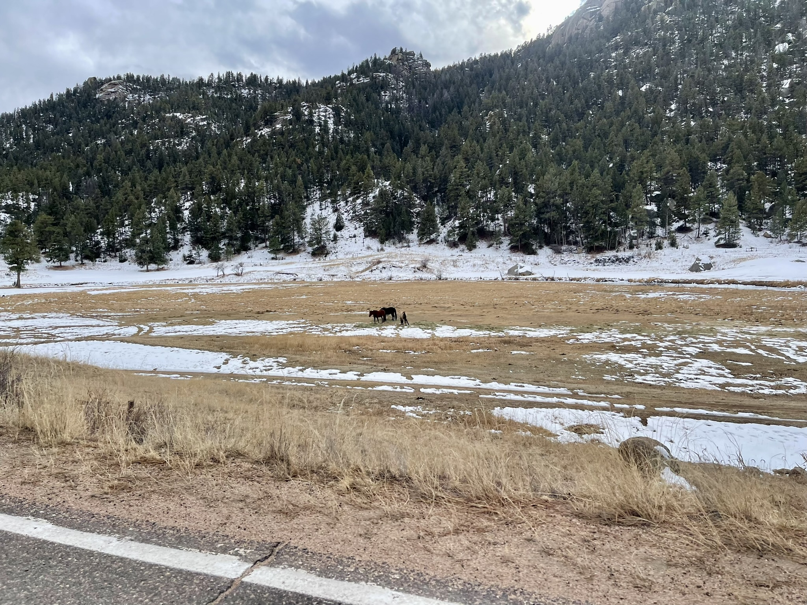

## :globe_with_meridians:Pike - San Isabel National Forest , Colorado, U.S. (2024-01-07)
`Pictures` rcfdtools <br>`Category` Freelance field visit <br>`Location` [Google Maps](http://maps.google.com/maps?q=39.407025,-105.31226388888888) or [Openstreet Map](https://www.openstreetmap.org/query?lat=39.407025&lon=-105.31226388888888) 

```geojson
{
  "type": "Feature",
  "geometry": {
    "type": "Point", 
    "coordinates": [-105.31226388888888, 39.407025]
  }, 
  "properties": {
    "Name": "Pike - San Isabel National Forest , Colorado, U.S."
  }
}
```

<br><details><summary>:camera:**43/IMG_0052.JPEG**</summary><sub> `Exif version` 0232 `OS version` 17.2.1 `Date` 2024:01:07 14:19:56 `Aperture` Not known `Brightness` 10.253516893110497 `Color space` 65535 `Compression` 6`Exposure mode` 0 `Exposure time` 0.0002039983680130559 `Focal length` 5.1 `Lens model` iPhone 12 Pro Max back triple camera 5.1mm f/1.6 `Lens specification` (1.5399999618512084, 7.5, 1.6, 2.4) `Orientation` 1 `Scene type` Not known `f number` 1.6 `White balance` 0 `Sensing method` 2 `Shutter speed` 12.259143251957623</sub><sub>`Coordinates & altitude` (39.437486111111106, -105.36055833333333, 2327.038873994638)</sub><sub> :globe_with_meridians:`Location over` [Google Maps](http://maps.google.com/maps?q=39.437486111111106,-105.36055833333333) or [Openstreet Map](https://www.openstreetmap.org/query?lat=39.437486111111106&lon=-105.36055833333333)</sub></details>

<br><details><summary>:camera:**43/IMG_0053.JPEG**</summary><sub> `Exif version` 0232 `OS version` 17.2.1 `Date` 2024:01:07 14:20:00 `Aperture` Not known `Brightness` 10.078801188476941 `Color space` 65535 `Compression` 6`Exposure mode` 0 `Exposure time` 0.00022999080036798528 `Focal length` 5.1 `Lens model` iPhone 12 Pro Max back triple camera 5.1mm f/1.6 `Lens specification` (1.5399999618512084, 7.5, 1.6, 2.4) `Orientation` 1 `Scene type` Not known `f number` 1.6 `White balance` 0 `Sensing method` 2 `Shutter speed` 12.086078519855596</sub><sub>`Coordinates & altitude` (39.43733611111111, -105.36034444444444, 2324.0525)</sub><sub> :globe_with_meridians:`Location over` [Google Maps](http://maps.google.com/maps?q=39.43733611111111,-105.36034444444444) or [Openstreet Map](https://www.openstreetmap.org/query?lat=39.43733611111111&lon=-105.36034444444444)</sub></details>

<br><details><summary>:camera:**43/IMG_0054.JPEG**</summary><sub> `Exif version` 0232 `OS version` 17.2.1 `Date` 2024:01:07 14:20:05 `Aperture` Not known `Brightness` 10.539494315954528 `Color space` 65535 `Compression` 6`Exposure mode` 0 `Exposure time` 0.00016 `Focal length` 5.1 `Lens model` iPhone 12 Pro Max back triple camera 5.1mm f/1.6 `Lens specification` (1.5399999618512084, 7.5, 1.6, 2.4) `Orientation` 1 `Scene type` Not known `f number` 1.6 `White balance` 0 `Sensing method` 2 `Shutter speed` 12.609640476860978</sub><sub>`Coordinates & altitude` (39.43708333333333, -105.35997777777777, 2322.722049689441)</sub><sub> :globe_with_meridians:`Location over` [Google Maps](http://maps.google.com/maps?q=39.43708333333333,-105.35997777777777) or [Openstreet Map](https://www.openstreetmap.org/query?lat=39.43708333333333&lon=-105.35997777777777)</sub></details>

<br><details><summary>:camera:**43/IMG_0055.JPEG**</summary><sub> `Exif version` 0232 `OS version` 17.2.1 `Date` 2024:01:07 14:20:07 `Aperture` Not known `Brightness` 10.587588601186171 `Color space` 65535 `Compression` 6`Exposure mode` 0 `Exposure time` 0.00016 `Focal length` 5.1 `Lens model` iPhone 12 Pro Max back triple camera 5.1mm f/1.6 `Lens specification` (1.5399999618512084, 7.5, 1.6, 2.4) `Orientation` 1 `Scene type` Not known `f number` 1.6 `White balance` 0 `Sensing method` 2 `Shutter speed` 12.609640476860978</sub><sub>`Coordinates & altitude` (39.43703333333333, -105.35987222222222, 2322.401785714286)</sub><sub> :globe_with_meridians:`Location over` [Google Maps](http://maps.google.com/maps?q=39.43703333333333,-105.35987222222222) or [Openstreet Map](https://www.openstreetmap.org/query?lat=39.43703333333333&lon=-105.35987222222222)</sub></details>

<br><details><summary>:camera:**43/IMG_0056.JPEG**</summary><sub> `Exif version` 0232 `OS version` 17.2.1 `Date` 2024:01:07 14:21:10 `Aperture` Not known `Brightness` 10.750216951113682 `Color space` 65535 `Compression` 6`Exposure mode` 0 `Exposure time` 0.000143000143000143 `Focal length` 5.1 `Lens model` iPhone 12 Pro Max back triple camera 5.1mm f/1.6 `Lens specification` (1.5399999618512084, 7.5, 1.6, 2.4) `Orientation` 1 `Scene type` Not known `f number` 1.6 `White balance` 0 `Sensing method` 2 `Shutter speed` 12.771697240635117</sub><sub>`Coordinates & altitude` (39.43593333333333, -105.35121111111111, 2275.9392789373815)</sub><sub> :globe_with_meridians:`Location over` [Google Maps](http://maps.google.com/maps?q=39.43593333333333,-105.35121111111111) or [Openstreet Map](https://www.openstreetmap.org/query?lat=39.43593333333333&lon=-105.35121111111111)</sub></details>

<br><details><summary>:camera:**43/IMG_0057.JPEG**</summary><sub> `Exif version` 0232 `OS version` 17.2.1 `Date` 2024:01:07 14:21:14 `Aperture` Not known `Brightness` 10.941304643878524 `Color space` 65535 `Compression` 6`Exposure mode` 0 `Exposure time` 0.000117000117000117 `Focal length` 5.1 `Lens model` iPhone 12 Pro Max back triple camera 5.1mm f/1.6 `Lens specification` (1.5399999618512084, 7.5, 1.6, 2.4) `Orientation` 1 `Scene type` Not known `f number` 1.6 `White balance` 0 `Sensing method` 2 `Shutter speed` 13.061203844208396</sub><sub>`Coordinates & altitude` (39.43550833333333, -105.3505861111111, 2272.3092037228544)</sub><sub> :globe_with_meridians:`Location over` [Google Maps](http://maps.google.com/maps?q=39.43550833333333,-105.3505861111111) or [Openstreet Map](https://www.openstreetmap.org/query?lat=39.43550833333333&lon=-105.3505861111111)</sub></details>

<br><details><summary>:camera:**43/IMG_0058.JPEG**</summary><sub> `Exif version` 0232 `OS version` 17.2.1 `Date` 2024:01:07 14:21:19 `Aperture` Not known `Brightness` 10.903110173958883 `Color space` 65535 `Compression` 6`Exposure mode` 0 `Exposure time` 0.00010900370612600828 `Focal length` 5.1 `Lens model` iPhone 12 Pro Max back triple camera 5.1mm f/1.6 `Lens specification` (1.5399999618512084, 7.5, 1.6, 2.4) `Orientation` 1 `Scene type` Not known `f number` 1.6 `White balance` 0 `Sensing method` 2 `Shutter speed` 13.16338424437299</sub><sub>`Coordinates & altitude` (39.435249999999996, -105.35003611111111, 2269.7377423033067)</sub><sub> :globe_with_meridians:`Location over` [Google Maps](http://maps.google.com/maps?q=39.435249999999996,-105.35003611111111) or [Openstreet Map](https://www.openstreetmap.org/query?lat=39.435249999999996&lon=-105.35003611111111)</sub></details>

<br><details><summary>:camera:**43/IMG_0059.JPEG**</summary><sub> `Exif version` 0232 `OS version` 17.2.1 `Date` 2024:01:07 14:27:42 `Aperture` Not known `Brightness` 9.7787243582558 `Color space` 65535 `Compression` 6`Exposure mode` 0 `Exposure time` 0.0002809778027535825 `Focal length` 5.1 `Lens model` iPhone 12 Pro Max back triple camera 5.1mm f/1.6 `Lens specification` (1.5399999618512084, 7.5, 1.6, 2.4) `Orientation` 1 `Scene type` Not known `f number` 1.6 `White balance` 0 `Sensing method` 2 `Shutter speed` 11.797142238579779</sub><sub>`Coordinates & altitude` (39.407025, -105.31226388888889, 2051.5368956743005)</sub><sub> :globe_with_meridians:`Location over` [Google Maps](http://maps.google.com/maps?q=39.407025,-105.31226388888889) or [Openstreet Map](https://www.openstreetmap.org/query?lat=39.407025&lon=-105.31226388888889)</sub></details>

<br><details><summary>:camera:**43/IMG_0060.JPEG**</summary><sub> `Exif version` 0232 `OS version` 17.2.1 `Date` 2024:01:07 14:27:52 `Aperture` Not known `Brightness` 9.298183194549583 `Color space` 65535 `Compression` 6`Exposure mode` 0 `Exposure time` 0.000368052999631947 `Focal length` 5.1 `Lens model` iPhone 12 Pro Max back triple camera 5.1mm f/1.6 `Lens specification` (1.5399999618512084, 7.5, 1.6, 2.4) `Orientation` 1 `Scene type` Not known `f number` 1.6 `White balance` 0 `Sensing method` 2 `Shutter speed` 11.408006613131791</sub><sub>`Coordinates & altitude` (39.406330555555556, -105.3106, 2050.781499202552)</sub><sub> :globe_with_meridians:`Location over` [Google Maps](http://maps.google.com/maps?q=39.406330555555556,-105.3106) or [Openstreet Map](https://www.openstreetmap.org/query?lat=39.406330555555556&lon=-105.3106)</sub></details>

<br><details><summary>:camera:**43/IMG_0061.JPEG**</summary><sub> `Exif version` 0232 `OS version` 17.2.1 `Date` 2024:01:07 14:29:19 `Aperture` Not known `Brightness` 8.729419889502763 `Color space` 65535 `Compression` 6`Exposure mode` 0 `Exposure time` 0.00046189376443418013 `Focal length` 5.1 `Lens model` iPhone 12 Pro Max back triple camera 5.1mm f/1.6 `Lens specification` (1.5399999618512084, 7.5, 1.6, 2.4) `Orientation` 1 `Scene type` Not known `f number` 1.6 `White balance` 0 `Sensing method` 2 `Shutter speed` 11.079819538434842</sub><sub>`Coordinates & altitude` (39.39828611111111, -105.29528055555555, 2040.2108013937282)</sub><sub> :globe_with_meridians:`Location over` [Google Maps](http://maps.google.com/maps?q=39.39828611111111,-105.29528055555555) or [Openstreet Map](https://www.openstreetmap.org/query?lat=39.39828611111111&lon=-105.29528055555555)</sub></details>

<br><details><summary>:camera:**43/IMG_0062.JPEG**</summary><sub> `Exif version` 0232 `OS version` 17.2.1 `Date` 2024:01:07 14:29:21 `Aperture` Not known `Brightness` 8.965126382306478 `Color space` 65535 `Compression` 6`Exposure mode` 0 `Exposure time` 0.0004710315591144607 `Focal length` 5.1 `Lens model` iPhone 12 Pro Max back triple camera 5.1mm f/1.6 `Lens specification` (1.5399999618512084, 7.5, 1.6, 2.4) `Orientation` 1 `Scene type` Not known `f number` 1.6 `White balance` 0 `Sensing method` 2 `Shutter speed` 11.051985329293574</sub><sub>`Coordinates & altitude` (39.398047222222225, -105.29488333333333, 2038.351669941061)</sub><sub> :globe_with_meridians:`Location over` [Google Maps](http://maps.google.com/maps?q=39.398047222222225,-105.29488333333333) or [Openstreet Map](https://www.openstreetmap.org/query?lat=39.398047222222225&lon=-105.29488333333333)</sub></details>

<br><details><summary>:camera:**43/IMG_0063.JPEG**</summary><sub> `Exif version` 0232 `OS version` 17.2.1 `Date` 2024:01:07 14:29:26 `Aperture` Not known `Brightness` 8.09114898295767 `Color space` 65535 `Compression` 6`Exposure mode` 0 `Exposure time` 0.0011441647597254005 `Focal length` 5.1 `Lens model` iPhone 12 Pro Max back triple camera 5.1mm f/1.6 `Lens specification` (1.5399999618512084, 7.5, 1.6, 2.4) `Orientation` 1 `Scene type` Not known `f number` 1.6 `White balance` 0 `Sensing method` 2 `Shutter speed` 9.771697240635117</sub><sub>`Coordinates & altitude` (39.397758333333336, -105.29439444444444, 2035.945652173913)</sub><sub> :globe_with_meridians:`Location over` [Google Maps](http://maps.google.com/maps?q=39.397758333333336,-105.29439444444444) or [Openstreet Map](https://www.openstreetmap.org/query?lat=39.397758333333336&lon=-105.29439444444444)</sub></details>

<br><details><summary>:camera:**43/IMG_0064.JPEG**</summary><sub> `Exif version` 0232 `OS version` 17.2.1 `Date` 2024:01:07 14:29:29 `Aperture` Not known `Brightness` 8.563571745890716 `Color space` 65535 `Compression` 6`Exposure mode` 0 `Exposure time` 0.0007042253521126761 `Focal length` 5.1 `Lens model` iPhone 12 Pro Max back triple camera 5.1mm f/1.6 `Lens specification` (1.5399999618512084, 7.5, 1.6, 2.4) `Orientation` 1 `Scene type` Not known `f number` 1.6 `White balance` 0 `Sensing method` 2 `Shutter speed` 10.472136953955136</sub><sub>`Coordinates & altitude` (39.397638888888885, -105.29419722222222, 2035.7274011299435)</sub><sub> :globe_with_meridians:`Location over` [Google Maps](http://maps.google.com/maps?q=39.397638888888885,-105.29419722222222) or [Openstreet Map](https://www.openstreetmap.org/query?lat=39.397638888888885&lon=-105.29419722222222)</sub></details>

<br><details><summary>:camera:**43/IMG_0065.JPEG**</summary><sub> `Exif version` 0232 `OS version` 17.2.1 `Date` 2024:01:07 14:30:41 `Aperture` Not known `Brightness` 8.241348947785507 `Color space` 65535 `Compression` 6`Exposure mode` 0 `Exposure time` 0.0008163265306122449 `Focal length` 5.1 `Lens model` iPhone 12 Pro Max back triple camera 5.1mm f/1.6 `Lens specification` (1.5399999618512084, 7.5, 1.6, 2.4) `Orientation` 1 `Scene type` Not known `f number` 1.6 `White balance` 0 `Sensing method` 2 `Shutter speed` 10.259143251957623</sub><sub>`Coordinates & altitude` (39.39513888888889, -105.28256111111111, 2028.5247465712582)</sub><sub> :globe_with_meridians:`Location over` [Google Maps](http://maps.google.com/maps?q=39.39513888888889,-105.28256111111111) or [Openstreet Map](https://www.openstreetmap.org/query?lat=39.39513888888889&lon=-105.28256111111111)</sub></details>

<br><details><summary>:camera:**43/IMG_0067.JPEG**</summary><sub> `Exif version` 0232 `OS version` 17.2.1 `Date` 2024:01:07 14:33:07 `Aperture` Not known `Brightness` 9.193622128243227 `Color space` 65535 `Compression` 6`Exposure mode` 0 `Exposure time` 0.00046189376443418013 `Focal length` 5.1 `Lens model` iPhone 12 Pro Max back triple camera 5.1mm f/1.6 `Lens specification` (1.5399999618512084, 7.5, 1.6, 2.4) `Orientation` 1 `Scene type` Not known `f number` 1.6 `White balance` 0 `Sensing method` 2 `Shutter speed` 11.079819538434842</sub><sub>`Coordinates & altitude` (39.384572222222225, -105.26621944444445, 2084.9857346647645)</sub><sub> :globe_with_meridians:`Location over` [Google Maps](http://maps.google.com/maps?q=39.384572222222225,-105.26621944444445) or [Openstreet Map](https://www.openstreetmap.org/query?lat=39.384572222222225&lon=-105.26621944444445)</sub></details>

<br><details><summary>:camera:**43/IMG_0068.JPEG**</summary><sub> `Exif version` 0232 `OS version` 17.2.1 `Date` 2024:01:07 14:35:25 `Aperture` Not known `Brightness` 10.53119377865475 `Color space` 65535 `Compression` 6`Exposure mode` 0 `Exposure time` 0.00016 `Focal length` 5.1 `Lens model` iPhone 12 Pro Max back triple camera 5.1mm f/1.6 `Lens specification` (1.5399999618512084, 7.5, 1.6, 2.4) `Orientation` 1 `Scene type` Not known `f number` 1.6 `White balance` 0 `Sensing method` 2 `Shutter speed` 12.609640476860978</sub><sub>`Coordinates & altitude` (39.368272222222224, -105.24684166666667, 2259.922950819672)</sub><sub> :globe_with_meridians:`Location over` [Google Maps](http://maps.google.com/maps?q=39.368272222222224,-105.24684166666667) or [Openstreet Map](https://www.openstreetmap.org/query?lat=39.368272222222224&lon=-105.24684166666667)</sub></details>

<br><details><summary>:camera:**43/IMG_0069.JPEG**</summary><sub> `Exif version` 0232 `OS version` 17.2.1 `Date` 2024:01:07 14:35:41 `Aperture` Not known `Brightness` 10.074636131613437 `Color space` 65535 `Compression` 6`Exposure mode` 0 `Exposure time` 0.0002469745616201531 `Focal length` 5.1 `Lens model` iPhone 12 Pro Max back triple camera 5.1mm f/1.6 `Lens specification` (1.5399999618512084, 7.5, 1.6, 2.4) `Orientation` 1 `Scene type` Not known `f number` 1.6 `White balance` 0 `Sensing method` 2 `Shutter speed` 11.983201343892489</sub><sub>`Coordinates & altitude` (39.365966666666665, -105.24655833333334, 2277.1442857142856)</sub><sub> :globe_with_meridians:`Location over` [Google Maps](http://maps.google.com/maps?q=39.365966666666665,-105.24655833333334) or [Openstreet Map](https://www.openstreetmap.org/query?lat=39.365966666666665&lon=-105.24655833333334)</sub></details>

<br><details><summary>:camera:**43/IMG_0070.JPEG**</summary><sub> `Exif version` 0232 `OS version` 17.2.1 `Date` 2024:01:07 14:44:14 `Aperture` Not known `Brightness` 10.822301565503983 `Color space` 65535 `Compression` 6`Exposure mode` 0 `Exposure time` 0.00013500742540839745 `Focal length` 5.1 `Lens model` iPhone 12 Pro Max back triple camera 5.1mm f/1.6 `Lens specification` (1.5399999618512084, 7.5, 1.6, 2.4) `Orientation` 1 `Scene type` Not known `f number` 1.6 `White balance` 0 `Sensing method` 2 `Shutter speed` 12.85475297060663</sub><sub>`Coordinates & altitude` (39.28629166666666, -105.276475, 2359.5055679287307)</sub><sub> :globe_with_meridians:`Location over` [Google Maps](http://maps.google.com/maps?q=39.28629166666666,-105.276475) or [Openstreet Map](https://www.openstreetmap.org/query?lat=39.28629166666666&lon=-105.276475)</sub></details>

<br><details><summary>:camera:**43/IMG_0071.JPEG**</summary><sub> `Exif version` 0232 `OS version` 17.2.1 `Date` 2024:01:07 14:44:22 `Aperture` Not known `Brightness` 10.096532418277045 `Color space` 65535 `Compression` 6`Exposure mode` 0 `Exposure time` 0.0002039983680130559 `Focal length` 5.1 `Lens model` iPhone 12 Pro Max back triple camera 5.1mm f/1.6 `Lens specification` (1.5399999618512084, 7.5, 1.6, 2.4) `Orientation` 1 `Scene type` Not known `f number` 1.6 `White balance` 0 `Sensing method` 2 `Shutter speed` 12.259143251957623</sub><sub>`Coordinates & altitude` (39.284905555555554, -105.27561944444444, 2348.289502762431)</sub><sub> :globe_with_meridians:`Location over` [Google Maps](http://maps.google.com/maps?q=39.284905555555554,-105.27561944444444) or [Openstreet Map](https://www.openstreetmap.org/query?lat=39.284905555555554&lon=-105.27561944444444)</sub></details>

<br><details><summary>:camera:**43/IMG_0072.JPEG**</summary><sub> `Exif version` 0232 `OS version` 17.2.1 `Date` 2024:01:07 14:44:25 `Aperture` Not known `Brightness` 10.177599662518457 `Color space` 65535 `Compression` 6`Exposure mode` 0 `Exposure time` 0.00022999080036798528 `Focal length` 5.1 `Lens model` iPhone 12 Pro Max back triple camera 5.1mm f/1.6 `Lens specification` (1.5399999618512084, 7.5, 1.6, 2.4) `Orientation` 1 `Scene type` Not known `f number` 1.6 `White balance` 0 `Sensing method` 2 `Shutter speed` 12.086078519855596</sub><sub>`Coordinates & altitude` (39.284461111111106, -105.27508611111111, 2338.7191489361703)</sub><sub> :globe_with_meridians:`Location over` [Google Maps](http://maps.google.com/maps?q=39.284461111111106,-105.27508611111111) or [Openstreet Map](https://www.openstreetmap.org/query?lat=39.284461111111106&lon=-105.27508611111111)</sub></details>

<br><details><summary>:camera:**43/IMG_0073.JPEG**</summary><sub> `Exif version` 0232 `OS version` 17.2.1 `Date` 2024:01:07 14:44:32 `Aperture` Not known `Brightness` 10.170190835198492 `Color space` 65535 `Compression` 6`Exposure mode` 0 `Exposure time` 0.0001950078003120125 `Focal length` 5.1 `Lens model` iPhone 12 Pro Max back triple camera 5.1mm f/1.6 `Lens specification` (1.5399999618512084, 7.5, 1.6, 2.4) `Orientation` 1 `Scene type` Not known `f number` 1.6 `White balance` 0 `Sensing method` 2 `Shutter speed` 12.324238250989843</sub><sub>`Coordinates & altitude` (39.28337222222222, -105.27382777777778, 2326.632892804699)</sub><sub> :globe_with_meridians:`Location over` [Google Maps](http://maps.google.com/maps?q=39.28337222222222,-105.27382777777778) or [Openstreet Map](https://www.openstreetmap.org/query?lat=39.28337222222222&lon=-105.27382777777778)</sub></details>

<br><details><summary>:camera:**43/IMG_0074.JPEG**</summary><sub> `Exif version` 0232 `OS version` 17.2.1 `Date` 2024:01:07 14:49:49 `Aperture` Not known `Brightness` 6.308989853292832 `Color space` 65535 `Compression` 6`Exposure mode` 0 `Exposure time` 0.002638522427440633 `Focal length` 5.1 `Lens model` iPhone 12 Pro Max back triple camera 5.1mm f/1.6 `Lens specification` (1.5399999618512084, 7.5, 1.6, 2.4) `Orientation` 1 `Scene type` Not known `f number` 1.6 `White balance` 0 `Sensing method` 2 `Shutter speed` 8.566886713711208</sub><sub>`Coordinates & altitude` (39.24424444444445, -105.25221388888889, 1987.5792592592593)</sub><sub> :globe_with_meridians:`Location over` [Google Maps](http://maps.google.com/maps?q=39.24424444444445,-105.25221388888889) or [Openstreet Map](https://www.openstreetmap.org/query?lat=39.24424444444445&lon=-105.25221388888889)</sub></details>

<br><details><summary>:camera:**43/IMG_0075.JPEG**</summary><sub> `Exif version` 0232 `OS version` 17.2.1 `Date` 2024:01:07 14:49:52 `Aperture` Not known `Brightness` 9.09753774996599 `Color space` 65535 `Compression` 6`Exposure mode` 0 `Exposure time` 0.0007818608287724785 `Focal length` 5.1 `Lens model` iPhone 12 Pro Max back triple camera 5.1mm f/1.6 `Lens specification` (1.5399999618512084, 7.5, 1.6, 2.4) `Orientation` 1 `Scene type` Not known `f number` 1.6 `White balance` 0 `Sensing method` 2 `Shutter speed` 10.320543768263246</sub><sub>`Coordinates & altitude` (39.24431111111111, -105.251625, 1986.1234487263227)</sub><sub> :globe_with_meridians:`Location over` [Google Maps](http://maps.google.com/maps?q=39.24431111111111,-105.251625) or [Openstreet Map](https://www.openstreetmap.org/query?lat=39.24431111111111&lon=-105.251625)</sub></details>

<br><details><summary>:camera:**43/IMG_0084.JPEG**</summary><sub> `Exif version` 0232 `OS version` 17.2.1 `Date` 2024:01:07 15:11:28 `Aperture` Not known `Brightness` 7.001974550241334 `Color space` 65535 `Compression` 6`Exposure mode` 0 `Exposure time` 0.0017985611510791368 `Focal length` 5.1 `Lens model` iPhone 12 Pro Max back triple camera 5.1mm f/1.6 `Lens specification` (1.5399999618512084, 7.5, 1.6, 2.4) `Orientation` 1 `Scene type` Not known `f number` 1.6 `White balance` 0 `Sensing method` 2 `Shutter speed` 9.117787386312807</sub><sub>`Coordinates & altitude` (39.291108333333334, -105.20651944444445, 1931.2447844228095)</sub><sub> :globe_with_meridians:`Location over` [Google Maps](http://maps.google.com/maps?q=39.291108333333334,-105.20651944444445) or [Openstreet Map](https://www.openstreetmap.org/query?lat=39.291108333333334&lon=-105.20651944444445)</sub></details>

<br><details><summary>:camera:**43/IMG_0085.JPEG**</summary><sub> `Exif version` 0232 `OS version` 17.2.1 `Date` 2024:01:07 15:11:44 `Aperture` Not known `Brightness` 7.774105400130123 `Color space` 65535 `Compression` 6`Exposure mode` Not known `Exposure time` 0.001006036217303823 `Focal length` 5.1 `Lens model` iPhone 12 Pro Max back camera 5.1mm f/1.6 `Lens specification` (5.1, 5.1, 1.6, 1.6) `Orientation` 1 `Scene type` Not known `f number` 1.6 `White balance` 0 `Sensing method` 2 `Shutter speed` 9.957153985977667</sub><sub>`Coordinates & altitude` (39.29108055555555, -105.20644444444444, 1930.5405092592594)</sub><sub> :globe_with_meridians:`Location over` [Google Maps](http://maps.google.com/maps?q=39.29108055555555,-105.20644444444444) or [Openstreet Map](https://www.openstreetmap.org/query?lat=39.29108055555555&lon=-105.20644444444444)</sub></details>

<br><details><summary>:camera:**43/IMG_0086.JPEG**</summary><sub> `Exif version` 0232 `OS version` 17.2.1 `Date` 2024:01:07 15:12:35 `Aperture` Not known `Brightness` 8.740261455169682 `Color space` 65535 `Compression` 6`Exposure mode` Not known `Exposure time` 0.0006090133982947625 `Focal length` 5.1 `Lens model` iPhone 12 Pro Max back camera 5.1mm f/1.6 `Lens specification` (5.1, 5.1, 1.6, 1.6) `Orientation` 1 `Scene type` Not known `f number` 1.6 `White balance` 0 `Sensing method` 2 `Shutter speed` 10.681270144443118</sub><sub>`Coordinates & altitude` (39.29107777777777, -105.20645833333333, 1924.7599243856332)</sub><sub> :globe_with_meridians:`Location over` [Google Maps](http://maps.google.com/maps?q=39.29107777777777,-105.20645833333333) or [Openstreet Map](https://www.openstreetmap.org/query?lat=39.29107777777777&lon=-105.20645833333333)</sub></details>

<br><details><summary>:camera:**43/IMG_0087.JPEG**</summary><sub> `Exif version` 0232 `OS version` 17.2.1 `Date` 2024:01:07 15:12:43 `Aperture` Not known `Brightness` 5.35635422218838 `Color space` 65535 `Compression` 6`Exposure mode` Not known `Exposure time` 0.002074688796680498 `Focal length` 5.1 `Lens model` iPhone 12 Pro Max back camera 5.1mm f/1.6 `Lens specification` (5.1, 5.1, 1.6, 1.6) `Orientation` 1 `Scene type` Not known `f number` 1.6 `White balance` 0 `Sensing method` 2 `Shutter speed` 8.911977834612106</sub><sub>`Coordinates & altitude` (39.29107777777777, -105.20645277777778, 1926.0726698262242)</sub><sub> :globe_with_meridians:`Location over` [Google Maps](http://maps.google.com/maps?q=39.29107777777777,-105.20645277777778) or [Openstreet Map](https://www.openstreetmap.org/query?lat=39.29107777777777&lon=-105.20645277777778)</sub></details>

<br><details><summary>:camera:**43/IMG_0088.JPEG**</summary><sub> `Exif version` 0232 `OS version` 17.2.1 `Date` 2024:01:07 15:18:09 `Aperture` Not known `Brightness` 6.923991313292948 `Color space` 65535 `Compression` 6`Exposure mode` 0 `Exposure time` 0.0019801980198019802 `Focal length` 5.1 `Lens model` iPhone 12 Pro Max back triple camera 5.1mm f/1.6 `Lens specification` (1.5399999618512084, 7.5, 1.6, 2.4) `Orientation` 1 `Scene type` Not known `f number` 1.6 `White balance` 0 `Sensing method` 2 `Shutter speed` 8.979555411325654</sub><sub>`Coordinates & altitude` (39.29111944444444, -105.20665, 1928.3700305810398)</sub><sub> :globe_with_meridians:`Location over` [Google Maps](http://maps.google.com/maps?q=39.29111944444444,-105.20665) or [Openstreet Map](https://www.openstreetmap.org/query?lat=39.29111944444444&lon=-105.20665)</sub></details>

<br><details><summary>:camera:**43/IMG_0089.JPEG**</summary><sub> `Exif version` 0232 `OS version` 17.2.1 `Date` 2024:01:07 15:18:31 `Aperture` Not known `Brightness` 7.493182411273486 `Color space` 65535 `Compression` 6`Exposure mode` 0 `Exposure time` 0.0013850415512465374 `Focal length` 5.1 `Lens model` iPhone 12 Pro Max back triple camera 5.1mm f/1.6 `Lens specification` (1.5399999618512084, 7.5, 1.6, 2.4) `Orientation` 1 `Scene type` Not known `f number` 1.6 `White balance` 0 `Sensing method` 2 `Shutter speed` 9.494857025303435</sub><sub>`Coordinates & altitude` (39.29108333333333, -105.20665, 1930.933626159102)</sub><sub> :globe_with_meridians:`Location over` [Google Maps](http://maps.google.com/maps?q=39.29108333333333,-105.20665) or [Openstreet Map](https://www.openstreetmap.org/query?lat=39.29108333333333&lon=-105.20665)</sub></details>

> _Citación: se permite la reproducción digital parcial o total de este repositorio, scripts, guías de desarrollo, modelos de datos, imágenes y documentación, siempre que se haga referencia como: "R.GISMobile - Sistemas de información geográficos móviles sobre QField que no requieren de conexión a Internet para su navegación". https://github.com/rcfdtools/R.GISMobile - Bogotá - Colombia - Suramérica."._

| [:house: Inicio](../Readme.md) |
|---|