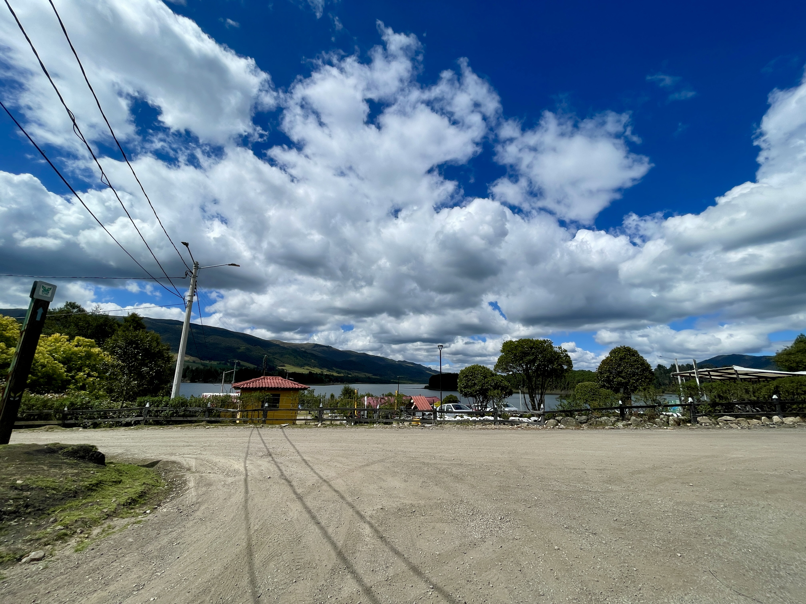
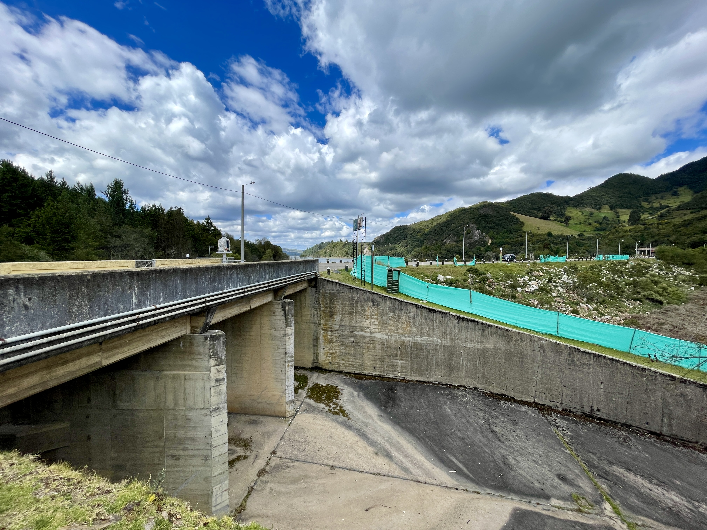
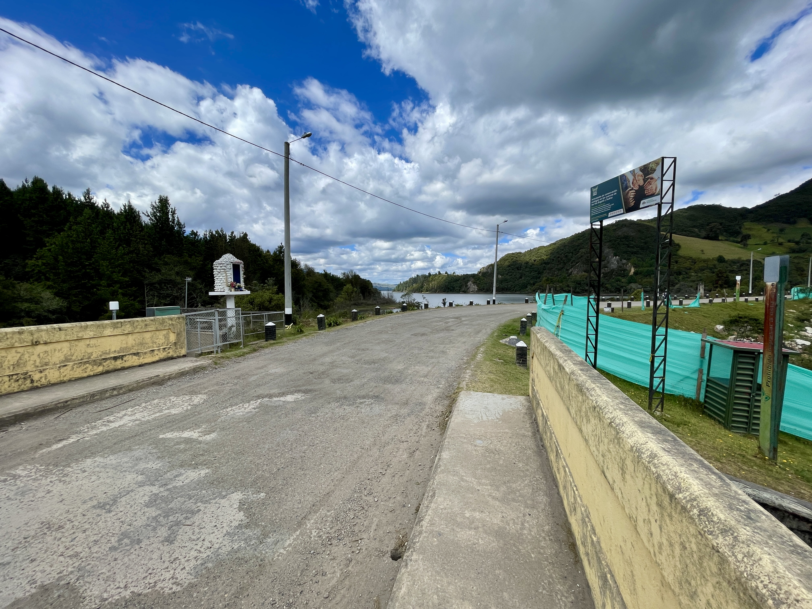
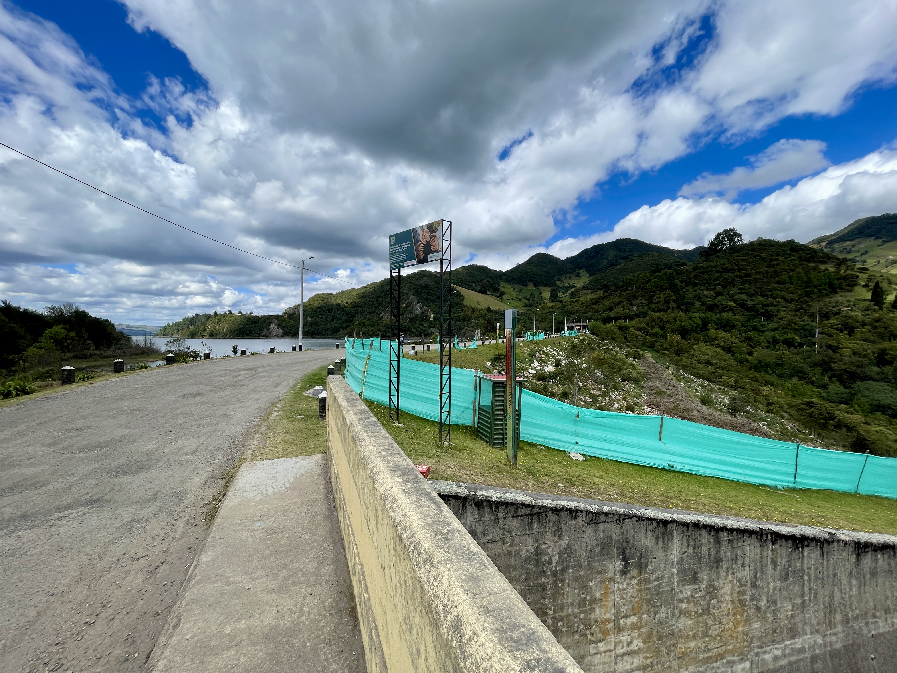
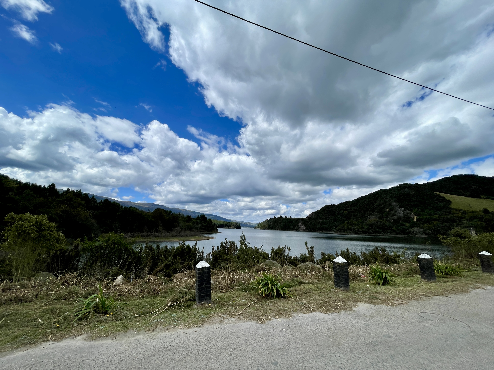
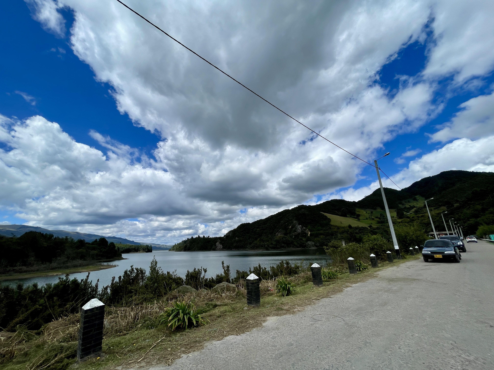
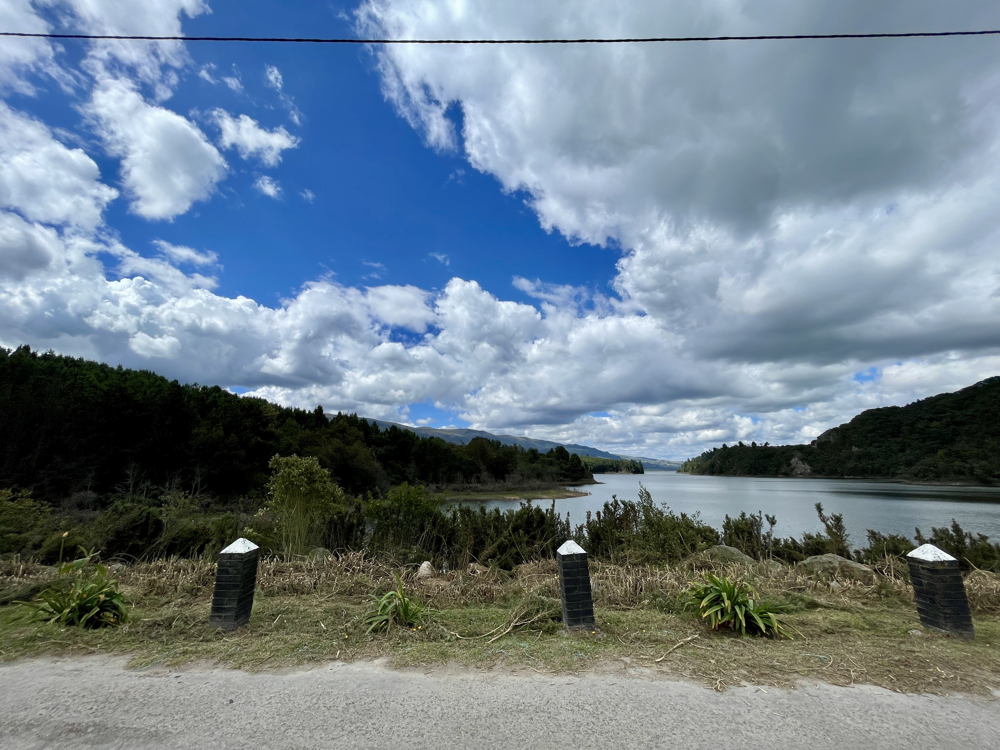
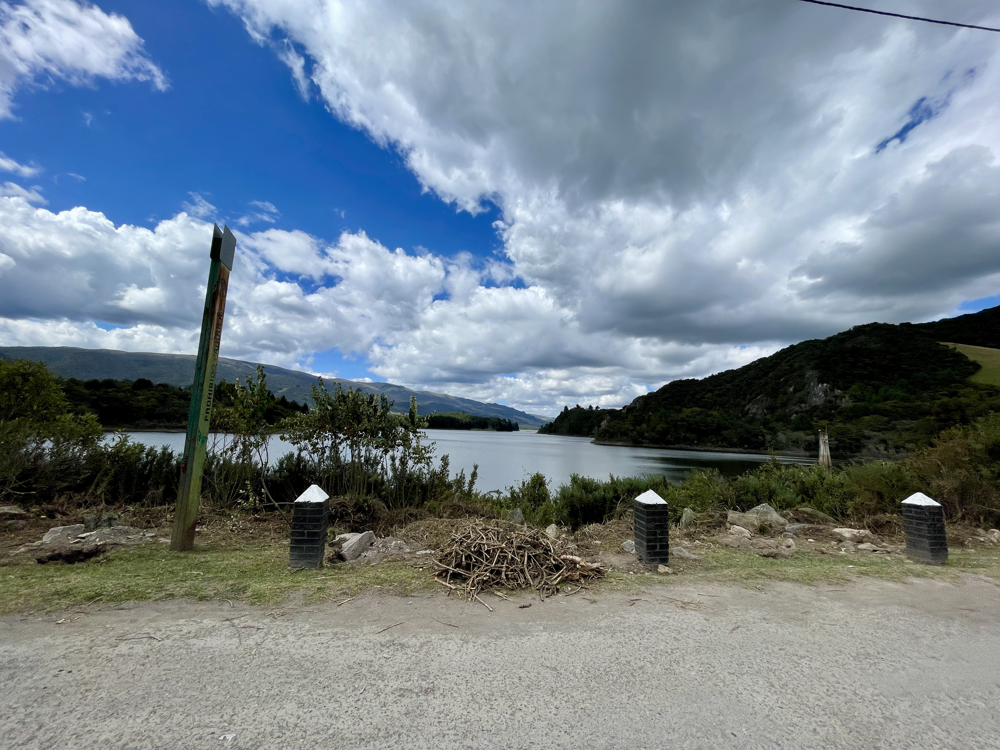
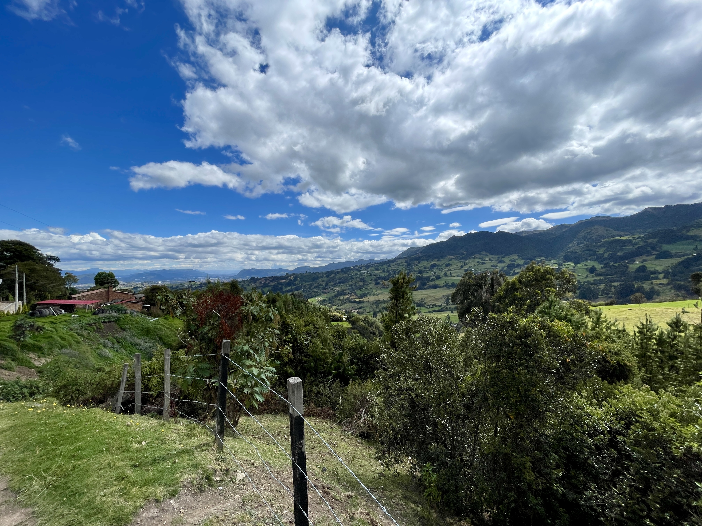
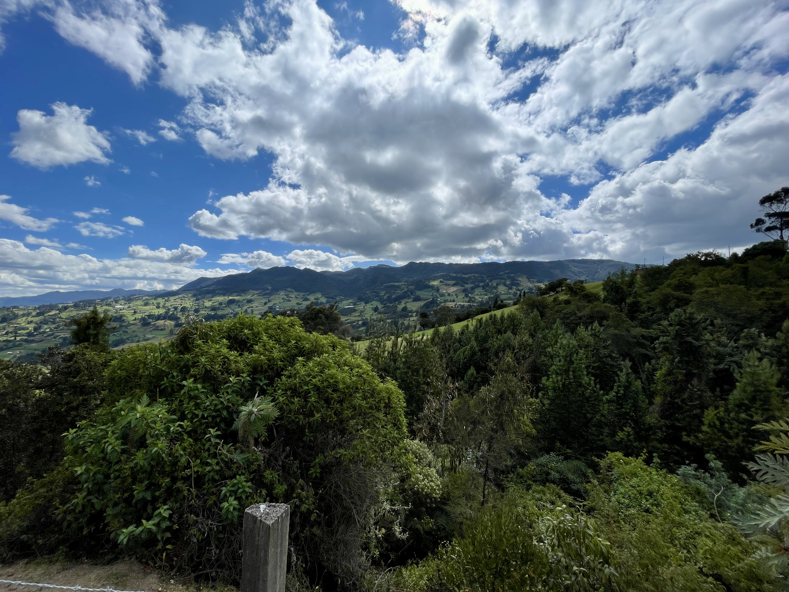

## :globe_with_meridians:Embalse del Neusa, Cogua, Cundinamarca, Colombia. (2024-09-15)
`Pictures` rcfdtools <br>`Category` Freelance field visit <br>`Location` [Google Maps](http://maps.google.com/maps?q=5.135966666666668,-73.96980277777779) or [Openstreet Map](https://www.openstreetmap.org/query?lat=5.135966666666668&lon=-73.96980277777779) 

```geojson
{
  "type": "Feature",
  "geometry": {
    "type": "Point", 
    "coordinates": [-73.96980277777779, 5.135966666666668]
  }, 
  "properties": {
    "Name": "Embalse del Neusa, Cogua, Cundinamarca, Colombia."
  }
}
```

<br><details><summary>:camera:**44/IMG_1209.JPEG**</summary><sub> `Exif version` 0232 `OS version` 18.0 `Date` 2024:09:15 14:05:08 `Aperture` Not known `Brightness` 10.823080428343586 `Color space` 65535 `Compression` Not known`Exposure mode` 0 `Exposure time` 0.00031298904538341156 `Focal length` 1.54 `Lens model` iPhone 12 Pro Max back triple camera 1.54mm f/2.4 `Lens specification` (1.5399999618512084, 7.5, 1.6, 2.4) `Orientation` 1 `Scene type` Not known `f number` 2.4 `White balance` 0 `Sensing method` 2 `Shutter speed` 11.641549725442342</sub><sub>`Coordinates & altitude` (5.139055555555556, -73.97645555555556, 3042.513613861386)</sub><sub> :globe_with_meridians:`Location over` [Google Maps](http://maps.google.com/maps?q=5.139055555555556,-73.97645555555556) or [Openstreet Map](https://www.openstreetmap.org/query?lat=5.139055555555556&lon=-73.97645555555556)</sub></details>

<br><details><summary>:camera:**44/IMG_1210.JPEG**</summary><sub> `Exif version` 0232 `OS version` 18.0 `Date` 2024:09:15 14:08:29 `Aperture` Not known `Brightness` 10.85086540077298 `Color space` 65535 `Compression` Not known`Exposure mode` 0 `Exposure time` 0.00037593984962406017 `Focal length` 1.54 `Lens model` iPhone 12 Pro Max back triple camera 1.54mm f/2.4 `Lens specification` (1.5399999618512084, 7.5, 1.6, 2.4) `Orientation` 1 `Scene type` Not known `f number` 2.4 `White balance` 0 `Sensing method` 2 `Shutter speed` 11.376979723595278</sub><sub>`Coordinates & altitude` (5.141680555555556, -73.97077222222222, 2990.926213592233)</sub><sub> :globe_with_meridians:`Location over` [Google Maps](http://maps.google.com/maps?q=5.141680555555556,-73.97077222222222) or [Openstreet Map](https://www.openstreetmap.org/query?lat=5.141680555555556&lon=-73.97077222222222)</sub></details>

<br><details><summary>:camera:**44/IMG_1211.JPEG**</summary><sub> `Exif version` 0232 `OS version` 18.0 `Date` 2024:09:15 14:11:16 `Aperture` Not known `Brightness` 8.401903788411166 `Color space` 65535 `Compression` Not known`Exposure mode` 0 `Exposure time` 0.0007639419404125286 `Focal length` 5.1 `Lens model` iPhone 12 Pro Max back triple camera 5.1mm f/1.6 `Lens specification` (1.5399999618512084, 7.5, 1.6, 2.4) `Orientation` 1 `Scene type` Not known `f number` 1.6 `White balance` 0 `Sensing method` 2 `Shutter speed` 10.354139747540007</sub><sub>`Coordinates & altitude` (5.135969444444445, -73.96980277777779, 2983.1774332472005)</sub><sub> :globe_with_meridians:`Location over` [Google Maps](http://maps.google.com/maps?q=5.135969444444445,-73.96980277777779) or [Openstreet Map](https://www.openstreetmap.org/query?lat=5.135969444444445&lon=-73.96980277777779)</sub></details>

<br><details><summary>:camera:**44/IMG_1212.JPEG**</summary><sub> `Exif version` 0232 `OS version` 18.0 `Date` 2024:09:15 14:11:18 `Aperture` Not known `Brightness` 8.873089239320887 `Color space` 65535 `Compression` Not known`Exposure mode` 0 `Exposure time` 0.0005491488193300384 `Focal length` 5.1 `Lens model` iPhone 12 Pro Max back triple camera 5.1mm f/1.6 `Lens specification` (1.5399999618512084, 7.5, 1.6, 2.4) `Orientation` 1 `Scene type` Not known `f number` 1.6 `White balance` 0 `Sensing method` 2 `Shutter speed` 10.830906233630174</sub><sub>`Coordinates & altitude` (5.135958333333334, -73.96980277777779, 2981.7843665768196)</sub><sub> :globe_with_meridians:`Location over` [Google Maps](http://maps.google.com/maps?q=5.135958333333334,-73.96980277777779) or [Openstreet Map](https://www.openstreetmap.org/query?lat=5.135958333333334&lon=-73.96980277777779)</sub></details>

<br><details><summary>:camera:**44/IMG_1213.JPEG**</summary><sub> `Exif version` 0232 `OS version` 18.0 `Date` 2024:09:15 14:11:22 `Aperture` Not known `Brightness` 8.498915777604303 `Color space` 65535 `Compression` Not known`Exposure mode` 0 `Exposure time` 0.00273224043715847 `Focal length` 1.54 `Lens model` iPhone 12 Pro Max back triple camera 1.54mm f/2.4 `Lens specification` (1.5399999618512084, 7.5, 1.6, 2.4) `Orientation` 1 `Scene type` Not known `f number` 2.4 `White balance` 0 `Sensing method` 2 `Shutter speed` 8.515826802679392</sub><sub>`Coordinates & altitude` (5.1359666666666675, -73.96980277777779, 2979.5966228893058)</sub><sub> :globe_with_meridians:`Location over` [Google Maps](http://maps.google.com/maps?q=5.1359666666666675,-73.96980277777779) or [Openstreet Map](https://www.openstreetmap.org/query?lat=5.1359666666666675&lon=-73.96980277777779)</sub></details>

<br><details><summary>:camera:**44/IMG_1214.JPEG**</summary><sub> `Exif version` 0232 `OS version` 18.0 `Date` 2024:09:15 14:11:28 `Aperture` Not known `Brightness` 8.859043305972262 `Color space` 65535 `Compression` Not known`Exposure mode` 0 `Exposure time` 0.002583979328165375 `Focal length` 1.54 `Lens model` iPhone 12 Pro Max back triple camera 1.54mm f/2.4 `Lens specification` (1.5399999618512084, 7.5, 1.6, 2.4) `Orientation` 1 `Scene type` Not known `f number` 2.4 `White balance` 0 `Sensing method` 2 `Shutter speed` 8.595062009329844</sub><sub>`Coordinates & altitude` (5.1359666666666675, -73.96980277777779, 2980.792910447761)</sub><sub> :globe_with_meridians:`Location over` [Google Maps](http://maps.google.com/maps?q=5.1359666666666675,-73.96980277777779) or [Openstreet Map](https://www.openstreetmap.org/query?lat=5.1359666666666675&lon=-73.96980277777779)</sub></details>

<br><details><summary>:camera:**44/IMG_1215.JPEG**</summary><sub> `Exif version` 0232 `OS version` 18.0 `Date` 2024:09:15 14:11:46 `Aperture` Not known `Brightness` 8.424032825322392 `Color space` 65535 `Compression` Not known`Exposure mode` 0 `Exposure time` 0.004016064257028112 `Focal length` 1.54 `Lens model` iPhone 12 Pro Max back triple camera 1.54mm f/2.4 `Lens specification` (1.5399999618512084, 7.5, 1.6, 2.4) `Orientation` 1 `Scene type` Not known `f number` 2.4 `White balance` 0 `Sensing method` 2 `Shutter speed` 7.957153985977668</sub><sub>`Coordinates & altitude` (5.1358500000000005, -73.96971944444445, 2979.3796610169493)</sub><sub> :globe_with_meridians:`Location over` [Google Maps](http://maps.google.com/maps?q=5.1358500000000005,-73.96971944444445) or [Openstreet Map](https://www.openstreetmap.org/query?lat=5.1358500000000005&lon=-73.96971944444445)</sub></details>

<br><details><summary>:camera:**44/IMG_1216.JPEG**</summary><sub> `Exif version` 0232 `OS version` 18.0 `Date` 2024:09:15 14:11:49 `Aperture` Not known `Brightness` 7.977175654030966 `Color space` 65535 `Compression` Not known`Exposure mode` 0 `Exposure time` 0.0036900369003690036 `Focal length` 1.54 `Lens model` iPhone 12 Pro Max back triple camera 1.54mm f/2.4 `Lens specification` (1.5399999618512084, 7.5, 1.6, 2.4) `Orientation` 1 `Scene type` Not known `f number` 2.4 `White balance` 0 `Sensing method` 2 `Shutter speed` 8.081772554780267</sub><sub>`Coordinates & altitude` (5.135838888888889, -73.96972777777778, 2977.862759643917)</sub><sub> :globe_with_meridians:`Location over` [Google Maps](http://maps.google.com/maps?q=5.135838888888889,-73.96972777777778) or [Openstreet Map](https://www.openstreetmap.org/query?lat=5.135838888888889&lon=-73.96972777777778)</sub></details>

<br><details><summary>:camera:**44/IMG_1217.JPEG**</summary><sub> `Exif version` 0232 `OS version` 18.0 `Date` 2024:09:15 14:11:52 `Aperture` Not known `Brightness` 8.250045053162731 `Color space` 65535 `Compression` Not known`Exposure mode` 0 `Exposure time` 0.004739336492890996 `Focal length` 1.54 `Lens model` iPhone 12 Pro Max back triple camera 1.54mm f/2.4 `Lens specification` (1.5399999618512084, 7.5, 1.6, 2.4) `Orientation` 1 `Scene type` Not known `f number` 2.4 `White balance` 0 `Sensing method` 2 `Shutter speed` 7.723029366306028</sub><sub>`Coordinates & altitude` (5.135852777777778, -73.96971944444445, 2978.1009933774835)</sub><sub> :globe_with_meridians:`Location over` [Google Maps](http://maps.google.com/maps?q=5.135852777777778,-73.96971944444445) or [Openstreet Map](https://www.openstreetmap.org/query?lat=5.135852777777778&lon=-73.96971944444445)</sub></details>

<br><details><summary>:camera:**44/IMG_1218.JPEG**</summary><sub> `Exif version` 0232 `OS version` 18.0 `Date` 2024:09:15 14:11:55 `Aperture` Not known `Brightness` 9.699629934210526 `Color space` 65535 `Compression` Not known`Exposure mode` 0 `Exposure time` 0.000980392156862745 `Focal length` 1.54 `Lens model` iPhone 12 Pro Max back triple camera 1.54mm f/2.4 `Lens specification` (1.5399999618512084, 7.5, 1.6, 2.4) `Orientation` 1 `Scene type` Not known `f number` 2.4 `White balance` 0 `Sensing method` 2 `Shutter speed` 9.994930629669156</sub><sub>`Coordinates & altitude` (5.1358500000000005, -73.96971944444445, 2978.698598130841)</sub><sub> :globe_with_meridians:`Location over` [Google Maps](http://maps.google.com/maps?q=5.1358500000000005,-73.96971944444445) or [Openstreet Map](https://www.openstreetmap.org/query?lat=5.1358500000000005&lon=-73.96971944444445)</sub></details>

<br><details><summary>:camera:**44/IMG_1219.JPEG**</summary><sub> `Exif version` 0232 `OS version` 18.0 `Date` 2024:09:15 14:12:01 `Aperture` Not known `Brightness` 9.132441200324411 `Color space` 65535 `Compression` Not known`Exposure mode` 0 `Exposure time` 0.0022935779816513763 `Focal length` 1.54 `Lens model` iPhone 12 Pro Max back triple camera 1.54mm f/2.4 `Lens specification` (1.5399999618512084, 7.5, 1.6, 2.4) `Orientation` 1 `Scene type` Not known `f number` 2.4 `White balance` 0 `Sensing method` 2 `Shutter speed` 8.767918893429739</sub><sub>`Coordinates & altitude` (5.135863888888889, -73.96971944444445, 2977.550531914894)</sub><sub> :globe_with_meridians:`Location over` [Google Maps](http://maps.google.com/maps?q=5.135863888888889,-73.96971944444445) or [Openstreet Map](https://www.openstreetmap.org/query?lat=5.135863888888889&lon=-73.96971944444445)</sub></details>

<br><details><summary>:camera:**44/IMG_1220.JPEG**</summary><sub> `Exif version` 0232 `OS version` 18.0 `Date` 2024:09:15 14:12:05 `Aperture` Not known `Brightness` 9.529806577582525 `Color space` 65535 `Compression` Not known`Exposure mode` 0 `Exposure time` 0.0011890606420927466 `Focal length` 1.54 `Lens model` iPhone 12 Pro Max back triple camera 1.54mm f/2.4 `Lens specification` (1.5399999618512084, 7.5, 1.6, 2.4) `Orientation` 1 `Scene type` Not known `f number` 2.4 `White balance` 0 `Sensing method` 2 `Shutter speed` 9.716035551572187</sub><sub>`Coordinates & altitude` (5.135875, -73.96971111111111, 2980.196905766526)</sub><sub> :globe_with_meridians:`Location over` [Google Maps](http://maps.google.com/maps?q=5.135875,-73.96971111111111) or [Openstreet Map](https://www.openstreetmap.org/query?lat=5.135875&lon=-73.96971111111111)</sub></details>

<br><details><summary>:camera:**44/IMG_1221.JPEG**</summary><sub> `Exif version` 0232 `OS version` 18.0 `Date` 2024:09:15 14:12:24 `Aperture` Not known `Brightness` 8.473522302790595 `Color space` 65535 `Compression` Not known`Exposure mode` 0 `Exposure time` 0.004291845493562232 `Focal length` 1.54 `Lens model` iPhone 12 Pro Max back triple camera 1.54mm f/2.4 `Lens specification` (1.5399999618512084, 7.5, 1.6, 2.4) `Orientation` 1 `Scene type` Not known `f number` 2.4 `White balance` 0 `Sensing method` 2 `Shutter speed` 7.863126151784218</sub><sub>`Coordinates & altitude` (5.1359666666666675, -73.96962777777777, 2982.872611464968)</sub><sub> :globe_with_meridians:`Location over` [Google Maps](http://maps.google.com/maps?q=5.1359666666666675,-73.96962777777777) or [Openstreet Map](https://www.openstreetmap.org/query?lat=5.1359666666666675&lon=-73.96962777777777)</sub></details>

<br><details><summary>:camera:**44/IMG_1222.JPEG**</summary><sub> `Exif version` 0232 `OS version` 18.0 `Date` 2024:09:15 14:12:30 `Aperture` Not known `Brightness` 8.206731345071265 `Color space` 65535 `Compression` Not known`Exposure mode` 0 `Exposure time` 0.004608294930875576 `Focal length` 1.54 `Lens model` iPhone 12 Pro Max back triple camera 1.54mm f/2.4 `Lens specification` (1.5399999618512084, 7.5, 1.6, 2.4) `Orientation` 1 `Scene type` Not known `f number` 2.4 `White balance` 0 `Sensing method` 2 `Shutter speed` 7.76164356238157</sub><sub>`Coordinates & altitude` (5.13595, -73.96963611111111, 2982.3701842546066)</sub><sub> :globe_with_meridians:`Location over` [Google Maps](http://maps.google.com/maps?q=5.13595,-73.96963611111111) or [Openstreet Map](https://www.openstreetmap.org/query?lat=5.13595&lon=-73.96963611111111)</sub></details>

<br><details><summary>:camera:**44/IMG_1223.JPEG**</summary><sub> `Exif version` 0232 `OS version` 18.0 `Date` 2024:09:15 14:12:35 `Aperture` Not known `Brightness` 9.900607824672544 `Color space` 65535 `Compression` Not known`Exposure mode` 0 `Exposure time` 0.0008756567425569177 `Focal length` 1.54 `Lens model` iPhone 12 Pro Max back triple camera 1.54mm f/2.4 `Lens specification` (1.5399999618512084, 7.5, 1.6, 2.4) `Orientation` 1 `Scene type` Not known `f number` 2.4 `White balance` 0 `Sensing method` 2 `Shutter speed` 10.156781508940252</sub><sub>`Coordinates & altitude` (5.13595, -73.96963611111111, 2982.670818505338)</sub><sub> :globe_with_meridians:`Location over` [Google Maps](http://maps.google.com/maps?q=5.13595,-73.96963611111111) or [Openstreet Map](https://www.openstreetmap.org/query?lat=5.13595&lon=-73.96963611111111)</sub></details>

<br><details><summary>:camera:**44/IMG_1224.JPEG**</summary><sub> `Exif version` 0232 `OS version` 18.0 `Date` 2024:09:15 14:12:37 `Aperture` Not known `Brightness` 9.7682722513089 `Color space` 65535 `Compression` Not known`Exposure mode` 0 `Exposure time` 0.0011682242990654205 `Focal length` 1.54 `Lens model` iPhone 12 Pro Max back triple camera 1.54mm f/2.4 `Lens specification` (1.5399999618512084, 7.5, 1.6, 2.4) `Orientation` 1 `Scene type` Not known `f number` 2.4 `White balance` 0 `Sensing method` 2 `Shutter speed` 9.741744010360458</sub><sub>`Coordinates & altitude` (5.13595, -73.96963611111111, 2982.6807909604518)</sub><sub> :globe_with_meridians:`Location over` [Google Maps](http://maps.google.com/maps?q=5.13595,-73.96963611111111) or [Openstreet Map](https://www.openstreetmap.org/query?lat=5.13595&lon=-73.96963611111111)</sub></details>

<br><details><summary>:camera:**44/IMG_1225.JPEG**</summary><sub> `Exif version` 0232 `OS version` 18.0 `Date` 2024:09:15 14:14:21 `Aperture` Not known `Brightness` 10.228184160412233 `Color space` 65535 `Compression` Not known`Exposure mode` 0 `Exposure time` 0.000501002004008016 `Focal length` 1.54 `Lens model` iPhone 12 Pro Max back triple camera 1.54mm f/2.4 `Lens specification` (1.5399999618512084, 7.5, 1.6, 2.4) `Orientation` 1 `Scene type` Not known `f number` 2.4 `White balance` 0 `Sensing method` 2 `Shutter speed` 10.962901772303995</sub><sub>`Coordinates & altitude` (5.136, -73.96899444444445, 2968.6972111553787)</sub><sub> :globe_with_meridians:`Location over` [Google Maps](http://maps.google.com/maps?q=5.136,-73.96899444444445) or [Openstreet Map](https://www.openstreetmap.org/query?lat=5.136&lon=-73.96899444444445)</sub></details>

<br><details><summary>:camera:**44/IMG_1226.JPEG**</summary><sub> `Exif version` 0232 `OS version` 18.0 `Date` 2024:09:15 14:14:23 `Aperture` Not known `Brightness` 10.345622895622895 `Color space` 65535 `Compression` Not known`Exposure mode` 0 `Exposure time` 0.0004589261128958238 `Focal length` 1.54 `Lens model` iPhone 12 Pro Max back triple camera 1.54mm f/2.4 `Lens specification` (1.5399999618512084, 7.5, 1.6, 2.4) `Orientation` 1 `Scene type` Not known `f number` 2.4 `White balance` 0 `Sensing method` 2 `Shutter speed` 11.089218221603343</sub><sub>`Coordinates & altitude` (5.13603888888889, -73.96901666666668, 2975.458193979933)</sub><sub> :globe_with_meridians:`Location over` [Google Maps](http://maps.google.com/maps?q=5.13603888888889,-73.96901666666668) or [Openstreet Map](https://www.openstreetmap.org/query?lat=5.13603888888889&lon=-73.96901666666668)</sub></details>

<br><details><summary>:camera:**44/IMG_1227.JPEG**</summary><sub> `Exif version` 0232 `OS version` 18.0 `Date` 2024:09:15 14:14:25 `Aperture` Not known `Brightness` 10.286300366300367 `Color space` 65535 `Compression` Not known`Exposure mode` 0 `Exposure time` 0.00048007681228996637 `Focal length` 1.54 `Lens model` iPhone 12 Pro Max back triple camera 1.54mm f/2.4 `Lens specification` (1.5399999618512084, 7.5, 1.6, 2.4) `Orientation` 1 `Scene type` Not known `f number` 2.4 `White balance` 0 `Sensing method` 2 `Shutter speed` 11.024677966101695</sub><sub>`Coordinates & altitude` (5.136047222222222, -73.969025, 2977.3734776725305)</sub><sub> :globe_with_meridians:`Location over` [Google Maps](http://maps.google.com/maps?q=5.136047222222222,-73.969025) or [Openstreet Map](https://www.openstreetmap.org/query?lat=5.136047222222222&lon=-73.969025)</sub></details>

<br><details><summary>:camera:**44/IMG_1228.JPEG**</summary><sub> `Exif version` 0232 `OS version` 18.0 `Date` 2024:09:15 14:15:21 `Aperture` Not known `Brightness` 10.128713348765432 `Color space` 65535 `Compression` Not known`Exposure mode` 0 `Exposure time` 0.0005841121495327102 `Focal length` 1.54 `Lens model` iPhone 12 Pro Max back triple camera 1.54mm f/2.4 `Lens specification` (1.5399999618512084, 7.5, 1.6, 2.4) `Orientation` 1 `Scene type` Not known `f number` 2.4 `White balance` 0 `Sensing method` 2 `Shutter speed` 10.741744010360458</sub><sub>`Coordinates & altitude` (5.135866666666667, -73.96788055555555, 2961.7211328976036)</sub><sub> :globe_with_meridians:`Location over` [Google Maps](http://maps.google.com/maps?q=5.135866666666667,-73.96788055555555) or [Openstreet Map](https://www.openstreetmap.org/query?lat=5.135866666666667&lon=-73.96788055555555)</sub></details>

<br><details><summary>:camera:**44/IMG_1229.JPEG**</summary><sub> `Exif version` 0232 `OS version` 18.0 `Date` 2024:09:15 14:21:15 `Aperture` Not known `Brightness` 10.203962407924816 `Color space` 65535 `Compression` Not known`Exposure mode` 0 `Exposure time` 0.0007092198581560284 `Focal length` 1.54 `Lens model` iPhone 12 Pro Max back triple camera 1.54mm f/2.4 `Lens specification` (1.5399999618512084, 7.5, 1.6, 2.4) `Orientation` 1 `Scene type` Not known `f number` 2.4 `White balance` 0 `Sensing method` 2 `Shutter speed` 10.461926753302546</sub><sub>`Coordinates & altitude` (5.122836111111111, -73.96465277777779, 2942.313909774436)</sub><sub> :globe_with_meridians:`Location over` [Google Maps](http://maps.google.com/maps?q=5.122836111111111,-73.96465277777779) or [Openstreet Map](https://www.openstreetmap.org/query?lat=5.122836111111111&lon=-73.96465277777779)</sub></details>

<br><details><summary>:camera:**44/IMG_1230.JPEG**</summary><sub> `Exif version` 0232 `OS version` 18.0 `Date` 2024:09:15 14:21:17 `Aperture` Not known `Brightness` 10.164653381549588 `Color space` 65535 `Compression` Not known`Exposure mode` 0 `Exposure time` 0.0008968609865470852 `Focal length` 1.54 `Lens model` iPhone 12 Pro Max back triple camera 1.54mm f/2.4 `Lens specification` (1.5399999618512084, 7.5, 1.6, 2.4) `Orientation` 1 `Scene type` Not known `f number` 2.4 `White balance` 0 `Sensing method` 2 `Shutter speed` 10.12260439142023</sub><sub>`Coordinates & altitude` (5.122830555555555, -73.96465277777779, 2943.3917910447763)</sub><sub> :globe_with_meridians:`Location over` [Google Maps](http://maps.google.com/maps?q=5.122830555555555,-73.96465277777779) or [Openstreet Map](https://www.openstreetmap.org/query?lat=5.122830555555555&lon=-73.96465277777779)</sub></details>

<br><details><summary>:camera:**44/IMG_1231.JPEG**</summary><sub> `Exif version` 0232 `OS version` 18.0 `Date` 2024:09:15 14:21:20 `Aperture` Not known `Brightness` 9.727355808285946 `Color space` 65535 `Compression` Not known`Exposure mode` 0 `Exposure time` 0.0015015015015015015 `Focal length` 1.54 `Lens model` iPhone 12 Pro Max back triple camera 1.54mm f/2.4 `Lens specification` (1.5399999618512084, 7.5, 1.6, 2.4) `Orientation` 1 `Scene type` Not known `f number` 2.4 `White balance` 0 `Sensing method` 2 `Shutter speed` 9.378899480069324</sub><sub>`Coordinates & altitude` (5.122825, -73.96465277777779, 2942.8952042628775)</sub><sub> :globe_with_meridians:`Location over` [Google Maps](http://maps.google.com/maps?q=5.122825,-73.96465277777779) or [Openstreet Map](https://www.openstreetmap.org/query?lat=5.122825&lon=-73.96465277777779)</sub></details>

<br><details><summary>:camera:**44/IMG_1232.JPEG**</summary><sub> `Exif version` 0232 `OS version` 18.0 `Date` 2024:09:15 14:21:36 `Aperture` Not known `Brightness` 10.322250259759537 `Color space` 65535 `Compression` Not known`Exposure mode` 0 `Exposure time` 0.0006261740763932373 `Focal length` 1.54 `Lens model` iPhone 12 Pro Max back triple camera 1.54mm f/2.4 `Lens specification` (1.5399999618512084, 7.5, 1.6, 2.4) `Orientation` 1 `Scene type` Not known `f number` 2.4 `White balance` 0 `Sensing method` 2 `Shutter speed` 10.641549725442342</sub><sub>`Coordinates & altitude` (5.122797222222222, -73.96465277777779, 2947.0995542347696)</sub><sub> :globe_with_meridians:`Location over` [Google Maps](http://maps.google.com/maps?q=5.122797222222222,-73.96465277777779) or [Openstreet Map](https://www.openstreetmap.org/query?lat=5.122797222222222&lon=-73.96465277777779)</sub></details>

<br><details><summary>:camera:**44/IMG_1233.JPEG**</summary><sub> `Exif version` 0232 `OS version` 18.0 `Date` 2024:09:15 14:23:48 `Aperture` Not known `Brightness` 9.880245725704981 `Color space` 65535 `Compression` Not known`Exposure mode` 0 `Exposure time` 0.0009389671361502347 `Focal length` 1.54 `Lens model` iPhone 12 Pro Max back triple camera 1.54mm f/2.4 `Lens specification` (1.5399999618512084, 7.5, 1.6, 2.4) `Orientation` 1 `Scene type` Not known `f number` 2.4 `White balance` 0 `Sensing method` 2 `Shutter speed` 10.056587220353853</sub><sub>`Coordinates & altitude` (5.122716666666666, -73.96461388888889, 2934.518010291595)</sub><sub> :globe_with_meridians:`Location over` [Google Maps](http://maps.google.com/maps?q=5.122716666666666,-73.96461388888889) or [Openstreet Map](https://www.openstreetmap.org/query?lat=5.122716666666666&lon=-73.96461388888889)</sub></details>

<br><details><summary>:camera:**44/IMG_1234.JPEG**</summary><sub> `Exif version` 0232 `OS version` 18.0 `Date` 2024:09:15 14:23:50 `Aperture` Not known `Brightness` 9.941809558555272 `Color space` 65535 `Compression` Not known`Exposure mode` 0 `Exposure time` 0.0007722007722007722 `Focal length` 1.54 `Lens model` iPhone 12 Pro Max back triple camera 1.54mm f/2.4 `Lens specification` (1.5399999618512084, 7.5, 1.6, 2.4) `Orientation` 1 `Scene type` Not known `f number` 2.4 `White balance` 0 `Sensing method` 2 `Shutter speed` 10.339111525318422</sub><sub>`Coordinates & altitude` (5.122713888888889, -73.96460555555556, 2934.934268185802)</sub><sub> :globe_with_meridians:`Location over` [Google Maps](http://maps.google.com/maps?q=5.122713888888889,-73.96460555555556) or [Openstreet Map](https://www.openstreetmap.org/query?lat=5.122713888888889&lon=-73.96460555555556)</sub></details>

<br><details><summary>:camera:**44/IMG_1235.JPEG**</summary><sub> `Exif version` 0232 `OS version` 18.0 `Date` 2024:09:15 14:23:53 `Aperture` Not known `Brightness` 10.08753935208693 `Color space` 65535 `Compression` Not known`Exposure mode` 0 `Exposure time` 0.000646830530401035 `Focal length` 1.54 `Lens model` iPhone 12 Pro Max back triple camera 1.54mm f/2.4 `Lens specification` (1.5399999618512084, 7.5, 1.6, 2.4) `Orientation` 1 `Scene type` Not known `f number` 2.4 `White balance` 0 `Sensing method` 2 `Shutter speed` 10.593946658675456</sub><sub>`Coordinates & altitude` (5.12271111111111, -73.9646, 2935.1681574239715)</sub><sub> :globe_with_meridians:`Location over` [Google Maps](http://maps.google.com/maps?q=5.12271111111111,-73.9646) or [Openstreet Map](https://www.openstreetmap.org/query?lat=5.12271111111111&lon=-73.9646)</sub></details>

<br><details><summary>:camera:**44/IMG_1236.JPEG**</summary><sub> `Exif version` 0232 `OS version` 18.0 `Date` 2024:09:15 14:28:17 `Aperture` Not known `Brightness` 10.606504606504606 `Color space` 65535 `Compression` Not known`Exposure mode` 0 `Exposure time` 0.0005841121495327102 `Focal length` 1.54 `Lens model` iPhone 12 Pro Max back triple camera 1.54mm f/2.4 `Lens specification` (1.5399999618512084, 7.5, 1.6, 2.4) `Orientation` 1 `Scene type` Not known `f number` 2.4 `White balance` 0 `Sensing method` 2 `Shutter speed` 10.741744010360458</sub><sub>`Coordinates & altitude` (5.122827777777777, -73.96465277777779, 2952.341252699784)</sub><sub> :globe_with_meridians:`Location over` [Google Maps](http://maps.google.com/maps?q=5.122827777777777,-73.96465277777779) or [Openstreet Map](https://www.openstreetmap.org/query?lat=5.122827777777777&lon=-73.96465277777779)</sub></details>

> _Citación: se permite la reproducción digital parcial o total de este repositorio, scripts, guías de desarrollo, modelos de datos, imágenes y documentación, siempre que se haga referencia como: "R.GISMobile - Sistemas de información geográficos móviles sobre QField que no requieren de conexión a Internet para su navegación". https://github.com/rcfdtools/R.GISMobile - Bogotá - Colombia - Suramérica."._

| [:house: Inicio](../Readme.md) |
|---|