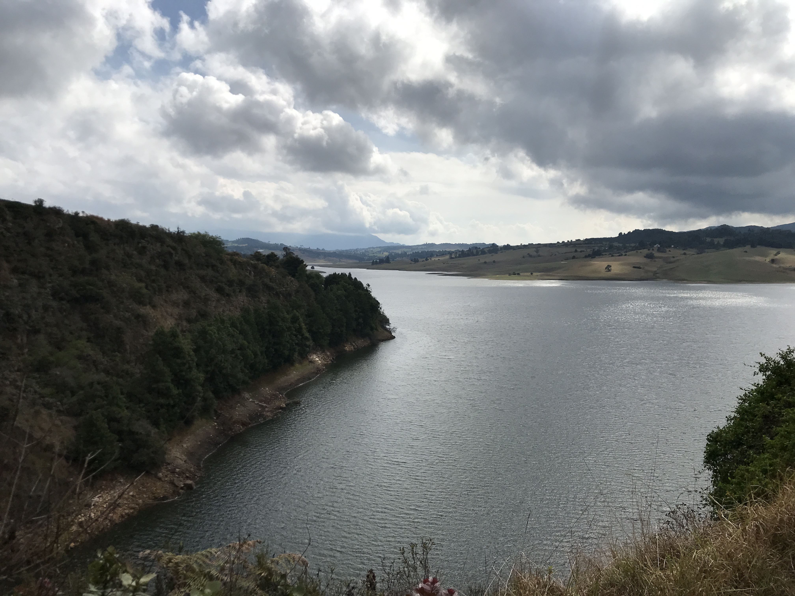
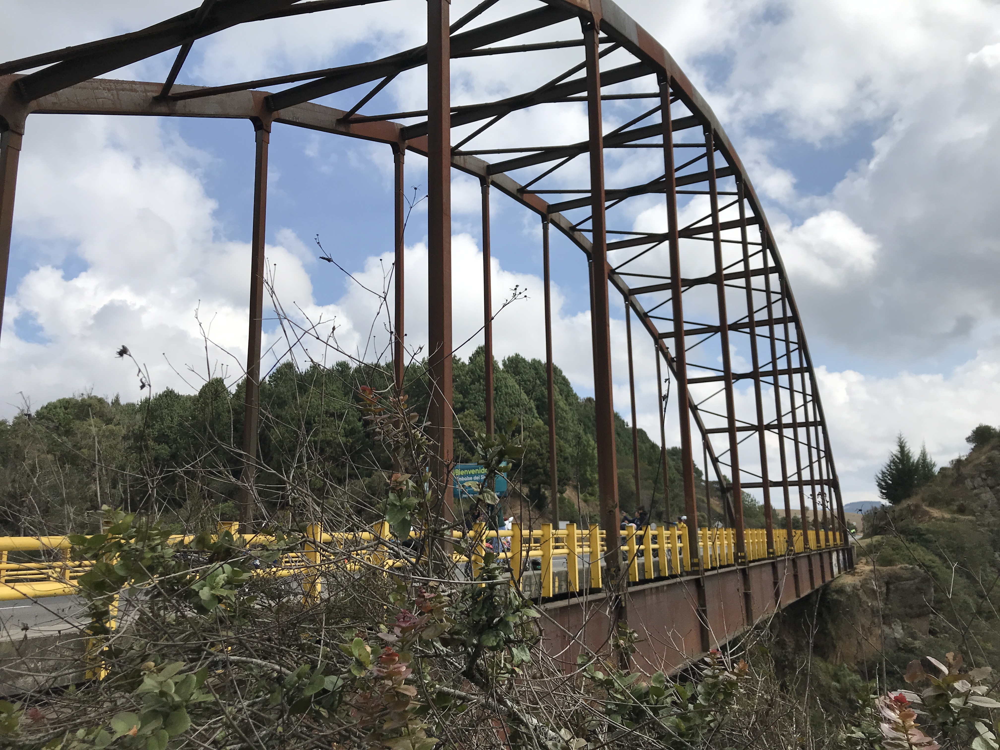
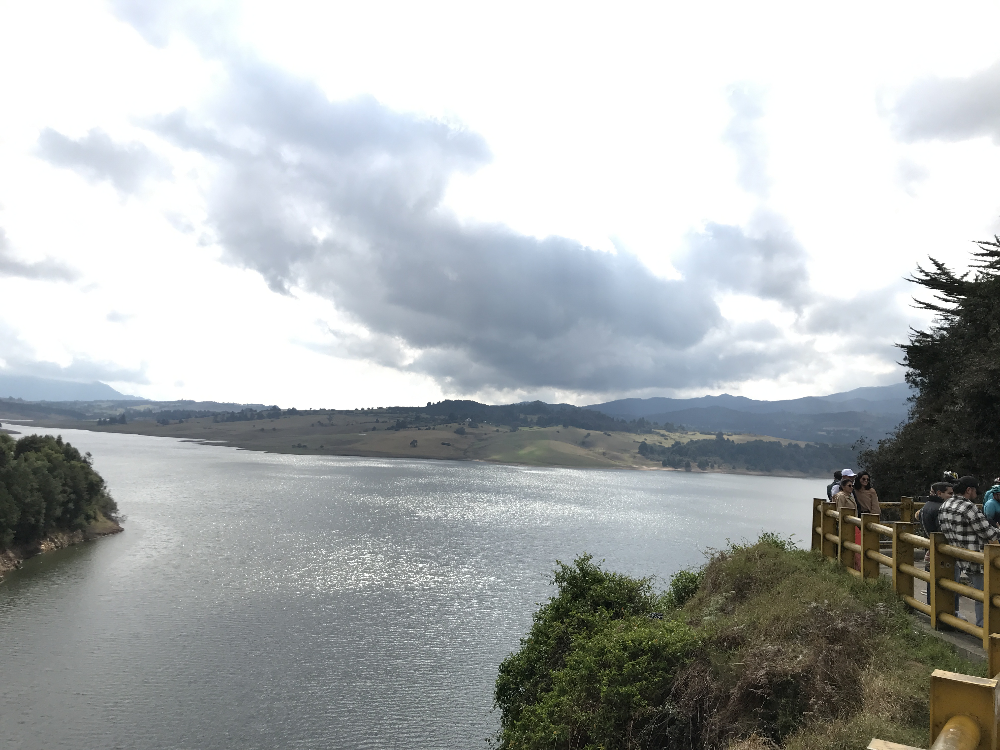

<div align="center"></div>

## Puente Sisga, I-55, Chocontá, Cundinamarca, Colombia (2024-04-03)
`Pictures` rcfdtools <br>`Category` Freelance field visit <br>`Location` [Google Maps](http://maps.google.com/maps?q=5.083201,-73.726167) or [Openstreet Map](https://www.openstreetmap.org/query?lat=5.083201&lon=-73.726167) 

```geojson
{
  "type": "Feature",
  "geometry": {
    "type": "Point", 
    "coordinates": [-73.726167, 5.083201]
  }, 
  "properties": {
    "Name": "Puente Sisga, I-55, Chocontá, Cundinamarca, Colombia"
  }
}
```

<br><details><summary>:camera:**45/IMG_0045.JPG**</summary><sub> `Exif version` 0232 `OS version` 15.8.2 `Date` 2024:03:10 09:11:13 `Aperture` Not known `Brightness` 11.673739374960057 `Color space` 65535 `Compression` 6`Exposure mode` 0 `Exposure time` 0.00018800526414739614 `Focal length` 3.99 `Lens model` iPhone 7 back camera 3.99mm f/1.8 `Lens specification` (3.9900000095374253, 3.9900000095374253, 1.8, 1.8) `Orientation` 1 `Scene type` Not known `f number` 1.8 `White balance` 0 `Sensing method` 2 `Shutter speed` 12.376979723595278</sub></details>

<br><details><summary>:camera:**45/IMG_0061.JPG**</summary><sub> `Exif version` 0232 `OS version` 15.8.2 `Date` 2024:03:10 09:12:08 `Aperture` Not known `Brightness` 11.069074474042077 `Color space` 65535 `Compression` 6`Exposure mode` 0 `Exposure time` 0.00031298904538341156 `Focal length` 3.99 `Lens model` iPhone 7 back camera 3.99mm f/1.8 `Lens specification` (3.9900000095374253, 3.9900000095374253, 1.8, 1.8) `Orientation` 1 `Scene type` Not known `f number` 1.8 `White balance` 0 `Sensing method` 2 `Shutter speed` 11.641549725442342</sub><sub>`Coordinates & altitude` (5.083216666666666, -73.72604444444444, 2714.9011627906975)</sub><sub> :earth_americas:`Location over` [Google Maps](http://maps.google.com/maps?q=5.083216666666666,-73.72604444444444) or [Openstreet Map](https://www.openstreetmap.org/query?lat=5.083216666666666&lon=-73.72604444444444)</sub></details>

<br><details><summary>:camera:**45/IMG_0062.JPG**</summary><sub> `Exif version` 0232 `OS version` 15.8.2 `Date` 2024:03:10 09:12:11 `Aperture` Not known `Brightness` 10.053112345795272 `Color space` 65535 `Compression` 6`Exposure mode` 0 `Exposure time` 0.00048007681228996637 `Focal length` 3.99 `Lens model` iPhone 7 back camera 3.99mm f/1.8 `Lens specification` (3.9900000095374253, 3.9900000095374253, 1.8, 1.8) `Orientation` 1 `Scene type` Not known `f number` 1.8 `White balance` 0 `Sensing method` 2 `Shutter speed` 11.024677966101695</sub><sub>`Coordinates & altitude` (5.083225, -73.72603611111111, 2714.4902634593354)</sub><sub> :earth_americas:`Location over` [Google Maps](http://maps.google.com/maps?q=5.083225,-73.72603611111111) or [Openstreet Map](https://www.openstreetmap.org/query?lat=5.083225&lon=-73.72603611111111)</sub></details>

<sub>_Citation: Partial or total digital reproduction of this repository, scripts, development guides, data models, images, and documentation is permitted, provided that it is referenced as: "R.GISMobile - Mobile geographic information systems on QField that do not require an internet connection for navigation." https://github.com/rcfdtools/R.GISMobile - Bogotá - Colombia - South America"._<sub>

| [:house: Home](../Readme.md) |
|---|