<div align="center"></div>

## Guachetá - Tausa - Santa Sofía - Villa de Leyva - Santana - Togui - Vélez - Barichara, San José de Suaita, Cundinamarca - Boyacá - Santander, Colombia (2022-04-12)
`Pictures` rcfdtools <br>`Category` Freelance field visit <br>`Location` [Google Maps](http://maps.google.com/maps?q=6.047301,-73.490125) or [Openstreet Map](https://www.openstreetmap.org/query?lat=6.047301&lon=-73.490125) 

```geojson
{
  "type": "Feature",
  "geometry": {
    "type": "Point", 
    "coordinates": [-73.490125, 6.047301]
  }, 
  "properties": {
    "Name": "Guachetá - Tausa - Santa Sofía - Villa de Leyva - Santana - Togui - Vélez - Barichara, San José de Suaita, Cundinamarca - Boyacá - Santander, Colombia"
  }
}
```

<br><details><summary>:camera:**46/20220411_135543.jpg**</summary><sub> `Exif version` 0220 `OS version` G955USQU8DUD3 `Date` 2022:04:11 13:55:43 `Aperture` Not known `Brightness` 10.14 `Color space` 1 `Compression` 6`Exposure mode` 0 `Exposure time` 0.0001417233560090703 `Focal length` 4.25 `Lens model` Not known `Lens specification` Not known `Orientation` 1 `Scene type` Not known `f number` 1.7 `White balance` 0 `Sensing method` 2 `Shutter speed` 12.784</sub><sub>`Coordinates & altitude` (0.0, 0.0, 0.0)</sub><sub> :earth_americas:`Location over` [Google Maps](http://maps.google.com/maps?q=0.0,0.0) or [Openstreet Map](https://www.openstreetmap.org/query?lat=0.0&lon=0.0)</sub></details>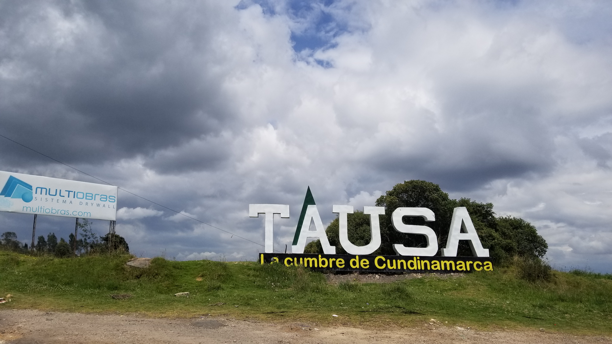

<br><details><summary>:camera:**46/20220412_054457.jpg**</summary><sub> `Exif version` 0220 `OS version` G955USQU8DUD3 `Date` 2022:04:12 05:44:57 `Aperture` Not known `Brightness` 3.35 `Color space` 1 `Compression` 6`Exposure mode` 0 `Exposure time` 0.008333333333333333 `Focal length` 4.25 `Lens model` Not known `Lens specification` Not known `Orientation` 1 `Scene type` Not known `f number` 1.7 `White balance` 0 `Sensing method` 2 `Shutter speed` 6.906</sub><sub>`Coordinates & altitude` (0.0, 0.0, 0.0)</sub><sub> :earth_americas:`Location over` [Google Maps](http://maps.google.com/maps?q=0.0,0.0) or [Openstreet Map](https://www.openstreetmap.org/query?lat=0.0&lon=0.0)</sub></details>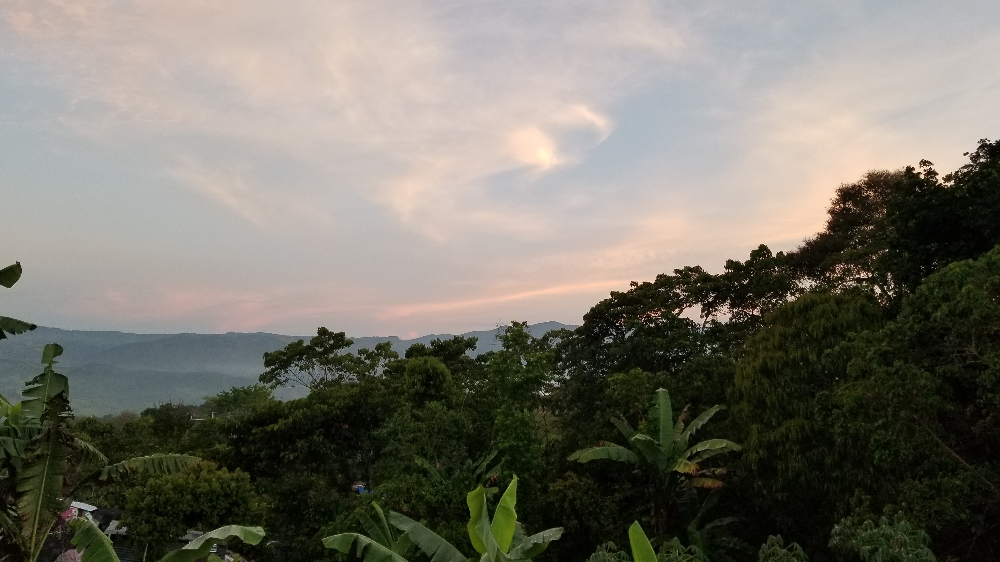

<br><details><summary>:camera:**46/20220412_054516.jpg**</summary><sub> `Exif version` 0220 `OS version` G955USQU8DUD3 `Date` 2022:04:12 05:45:16 `Aperture` Not known `Brightness` 3.38 `Color space` 1 `Compression` 6`Exposure mode` 0 `Exposure time` 0.008333333333333333 `Focal length` 4.25 `Lens model` Not known `Lens specification` Not known `Orientation` 1 `Scene type` Not known `f number` 1.7 `White balance` 0 `Sensing method` 2 `Shutter speed` 6.906</sub><sub>`Coordinates & altitude` (0.0, 0.0, 0.0)</sub><sub> :earth_americas:`Location over` [Google Maps](http://maps.google.com/maps?q=0.0,0.0) or [Openstreet Map](https://www.openstreetmap.org/query?lat=0.0&lon=0.0)</sub></details>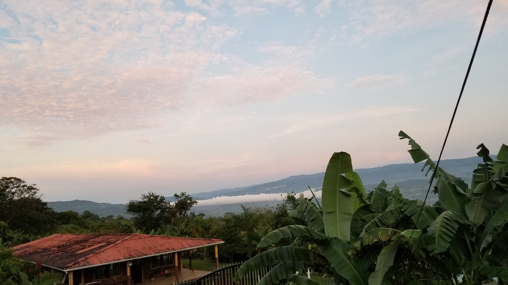

<br><details><summary>:camera:**46/20220412_054600.jpg**</summary><sub> `Exif version` 0220 `OS version` G955USQU8DUD3 `Date` 2022:04:12 05:46:00 `Aperture` Not known `Brightness` 1.92 `Color space` 1 `Compression` 6`Exposure mode` 0 `Exposure time` 0.016666666666666666 `Focal length` 4.25 `Lens model` Not known `Lens specification` Not known `Orientation` 6 `Scene type` Not known `f number` 1.7 `White balance` 0 `Sensing method` 2 `Shutter speed` 5.906</sub><sub>`Coordinates & altitude` (0.0, 0.0, 0.0)</sub><sub> :earth_americas:`Location over` [Google Maps](http://maps.google.com/maps?q=0.0,0.0) or [Openstreet Map](https://www.openstreetmap.org/query?lat=0.0&lon=0.0)</sub></details>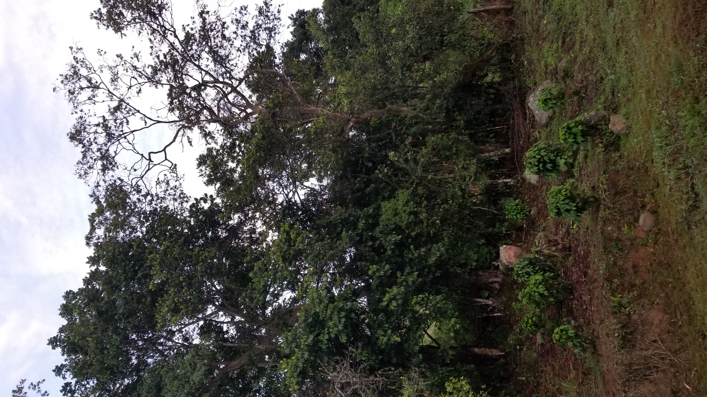

<br><details><summary>:camera:**46/20220412_054615.jpg**</summary><sub> `Exif version` 0220 `OS version` G955USQU8DUD3 `Date` 2022:04:12 05:46:15 `Aperture` Not known `Brightness` 0.71 `Color space` 1 `Compression` 6`Exposure mode` 0 `Exposure time` 0.030303030303030304 `Focal length` 4.25 `Lens model` Not known `Lens specification` Not known `Orientation` 1 `Scene type` Not known `f number` 1.7 `White balance` 0 `Sensing method` 2 `Shutter speed` 5.044</sub><sub>`Coordinates & altitude` (0.0, 0.0, 0.0)</sub><sub> :earth_americas:`Location over` [Google Maps](http://maps.google.com/maps?q=0.0,0.0) or [Openstreet Map](https://www.openstreetmap.org/query?lat=0.0&lon=0.0)</sub></details>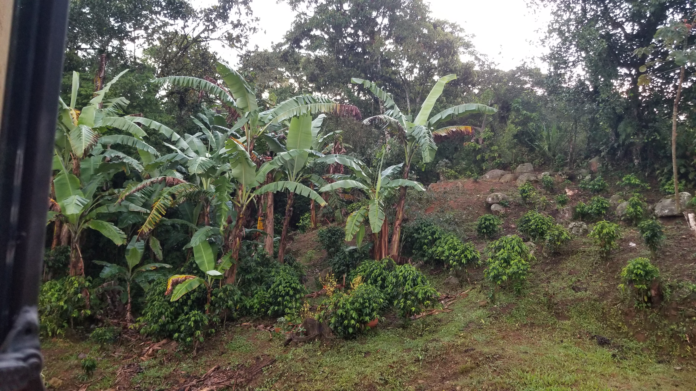

<br><details><summary>:camera:**46/20220412_073027.jpg**</summary><sub> `Exif version` 0220 `OS version` G955USQU8DUD3 `Date` 2022:04:12 07:30:27 `Aperture` Not known `Brightness` 9.03 `Color space` 1 `Compression` 6`Exposure mode` 0 `Exposure time` 0.00030339805825242716 `Focal length` 4.25 `Lens model` Not known `Lens specification` Not known `Orientation` 1 `Scene type` Not known `f number` 1.7 `White balance` 0 `Sensing method` 2 `Shutter speed` 11.686</sub><sub>`Coordinates & altitude` (0.0, 0.0, 0.0)</sub><sub> :earth_americas:`Location over` [Google Maps](http://maps.google.com/maps?q=0.0,0.0) or [Openstreet Map](https://www.openstreetmap.org/query?lat=0.0&lon=0.0)</sub></details>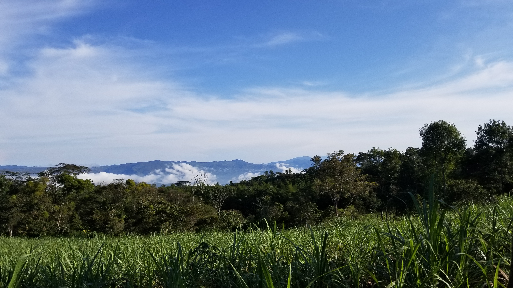

<br><details><summary>:camera:**46/20220412_073035.jpg**</summary><sub> `Exif version` 0220 `OS version` G955USQU8DUD3 `Date` 2022:04:12 07:30:35 `Aperture` Not known `Brightness` 8.76 `Color space` 1 `Compression` 6`Exposure mode` 0 `Exposure time` 0.00034916201117318437 `Focal length` 4.25 `Lens model` Not known `Lens specification` Not known `Orientation` 1 `Scene type` Not known `f number` 1.7 `White balance` 0 `Sensing method` 2 `Shutter speed` 11.483</sub><sub>`Coordinates & altitude` (0.0, 0.0, 0.0)</sub><sub> :earth_americas:`Location over` [Google Maps](http://maps.google.com/maps?q=0.0,0.0) or [Openstreet Map](https://www.openstreetmap.org/query?lat=0.0&lon=0.0)</sub></details>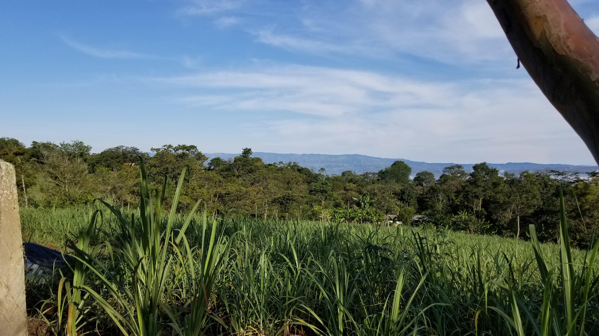

<br><details><summary>:camera:**46/20220412_073044.jpg**</summary><sub> `Exif version` 0220 `OS version` G955USQU8DUD3 `Date` 2022:04:12 07:30:44 `Aperture` Not known `Brightness` 9.09 `Color space` 1 `Compression` 6`Exposure mode` 0 `Exposure time` 0.00029069767441860465 `Focal length` 4.25 `Lens model` Not known `Lens specification` Not known `Orientation` 1 `Scene type` Not known `f number` 1.7 `White balance` 0 `Sensing method` 2 `Shutter speed` 11.748</sub><sub>`Coordinates & altitude` (0.0, 0.0, 0.0)</sub><sub> :earth_americas:`Location over` [Google Maps](http://maps.google.com/maps?q=0.0,0.0) or [Openstreet Map](https://www.openstreetmap.org/query?lat=0.0&lon=0.0)</sub></details>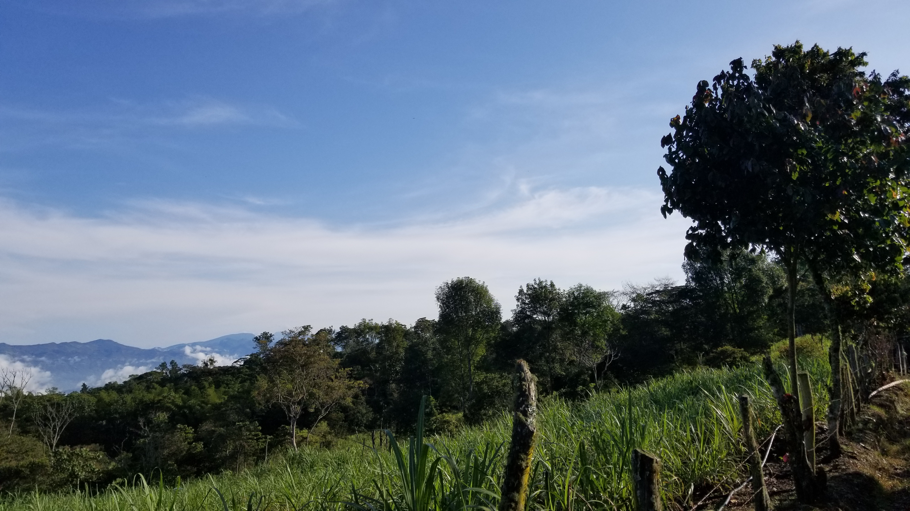

<br><details><summary>:camera:**46/20220412_073932.jpg**</summary><sub> `Exif version` 0220 `OS version` G955USQU8DUD3 `Date` 2022:04:12 07:39:32 `Aperture` Not known `Brightness` 7.01 `Color space` 1 `Compression` 6`Exposure mode` 0 `Exposure time` 0.0012285012285012285 `Focal length` 4.25 `Lens model` Not known `Lens specification` Not known `Orientation` 1 `Scene type` Not known `f number` 1.7 `White balance` 0 `Sensing method` 2 `Shutter speed` 9.668</sub><sub>`Coordinates & altitude` (0.0, 0.0, 0.0)</sub><sub> :earth_americas:`Location over` [Google Maps](http://maps.google.com/maps?q=0.0,0.0) or [Openstreet Map](https://www.openstreetmap.org/query?lat=0.0&lon=0.0)</sub></details>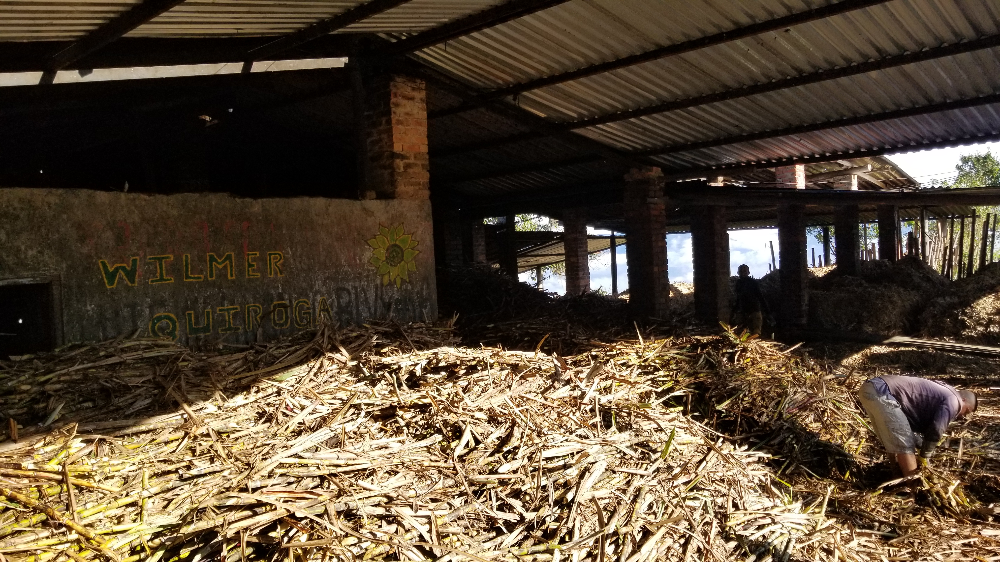

<br><details><summary>:camera:**46/20220412_073934.jpg**</summary><sub> `Exif version` 0220 `OS version` G955USQU8DUD3 `Date` 2022:04:12 07:39:34 `Aperture` Not known `Brightness` 7.01 `Color space` 1 `Compression` 6`Exposure mode` 0 `Exposure time` 0.0012195121951219512 `Focal length` 4.25 `Lens model` Not known `Lens specification` Not known `Orientation` 1 `Scene type` Not known `f number` 1.7 `White balance` 0 `Sensing method` 2 `Shutter speed` 9.679</sub><sub>`Coordinates & altitude` (0.0, 0.0, 0.0)</sub><sub> :earth_americas:`Location over` [Google Maps](http://maps.google.com/maps?q=0.0,0.0) or [Openstreet Map](https://www.openstreetmap.org/query?lat=0.0&lon=0.0)</sub></details>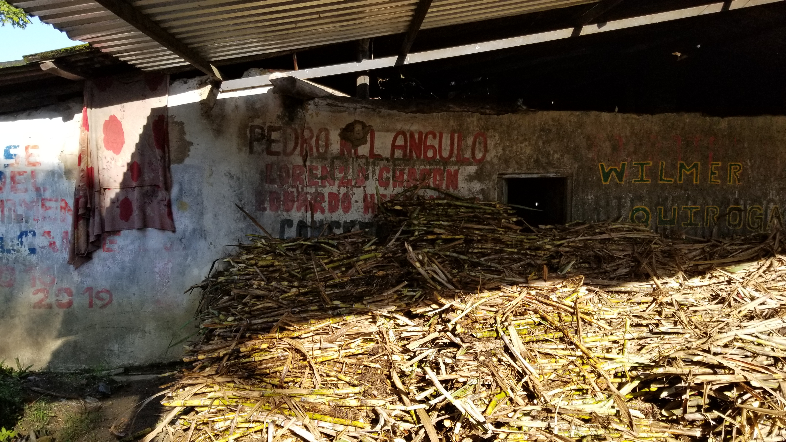

<br><details><summary>:camera:**46/20220412_073942.jpg**</summary><sub> `Exif version` 0220 `OS version` G955USQU8DUD3 `Date` 2022:04:12 07:39:42 `Aperture` Not known `Brightness` 8.59 `Color space` 1 `Compression` 6`Exposure mode` 0 `Exposure time` 0.0004045307443365696 `Focal length` 4.25 `Lens model` Not known `Lens specification` Not known `Orientation` 1 `Scene type` Not known `f number` 1.7 `White balance` 0 `Sensing method` 2 `Shutter speed` 11.271</sub><sub>`Coordinates & altitude` (0.0, 0.0, 0.0)</sub><sub> :earth_americas:`Location over` [Google Maps](http://maps.google.com/maps?q=0.0,0.0) or [Openstreet Map](https://www.openstreetmap.org/query?lat=0.0&lon=0.0)</sub></details>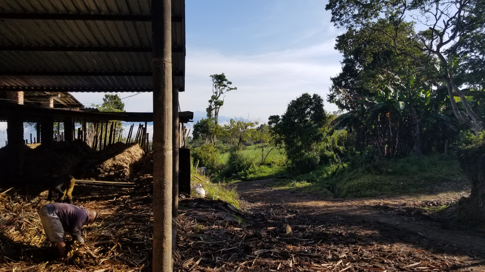

<br><details><summary>:camera:**46/20220412_074130.jpg**</summary><sub> `Exif version` 0220 `OS version` G955USQU8DUD3 `Date` 2022:04:12 07:41:30 `Aperture` Not known `Brightness` 8.86 `Color space` 1 `Compression` 6`Exposure mode` 0 `Exposure time` 0.00035014005602240897 `Focal length` 4.25 `Lens model` Not known `Lens specification` Not known `Orientation` 1 `Scene type` Not known `f number` 1.7 `White balance` 0 `Sensing method` 2 `Shutter speed` 11.479</sub><sub>`Coordinates & altitude` (0.0, 0.0, 0.0)</sub><sub> :earth_americas:`Location over` [Google Maps](http://maps.google.com/maps?q=0.0,0.0) or [Openstreet Map](https://www.openstreetmap.org/query?lat=0.0&lon=0.0)</sub></details>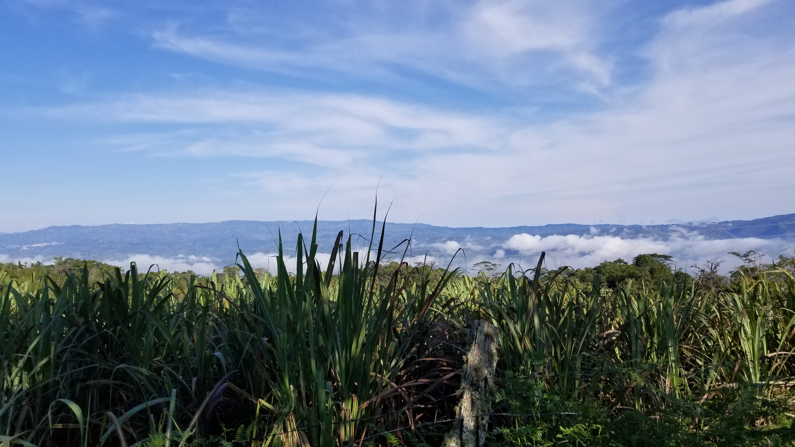

<br><details><summary>:camera:**46/20220412_074817.jpg**</summary><sub> `Exif version` 0220 `OS version` G955USQU8DUD3 `Date` 2022:04:12 07:48:17 `Aperture` Not known `Brightness` 7.67 `Color space` 1 `Compression` 6`Exposure mode` 0 `Exposure time` 0.0008116883116883117 `Focal length` 4.25 `Lens model` Not known `Lens specification` Not known `Orientation` 1 `Scene type` Not known `f number` 1.7 `White balance` 0 `Sensing method` 2 `Shutter speed` 10.266</sub><sub>`Coordinates & altitude` (0.0, 0.0, 0.0)</sub><sub> :earth_americas:`Location over` [Google Maps](http://maps.google.com/maps?q=0.0,0.0) or [Openstreet Map](https://www.openstreetmap.org/query?lat=0.0&lon=0.0)</sub></details>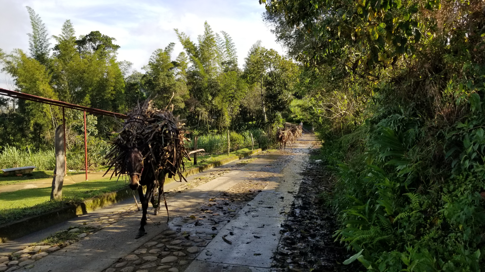

<br><details><summary>:camera:**46/20220412_074819.jpg**</summary><sub> `Exif version` 0220 `OS version` G955USQU8DUD3 `Date` 2022:04:12 07:48:19 `Aperture` Not known `Brightness` 7.76 `Color space` 1 `Compression` 6`Exposure mode` 0 `Exposure time` 0.0007374631268436578 `Focal length` 4.25 `Lens model` Not known `Lens specification` Not known `Orientation` 1 `Scene type` Not known `f number` 1.7 `White balance` 0 `Sensing method` 2 `Shutter speed` 10.405</sub><sub>`Coordinates & altitude` (0.0, 0.0, 0.0)</sub><sub> :earth_americas:`Location over` [Google Maps](http://maps.google.com/maps?q=0.0,0.0) or [Openstreet Map](https://www.openstreetmap.org/query?lat=0.0&lon=0.0)</sub></details>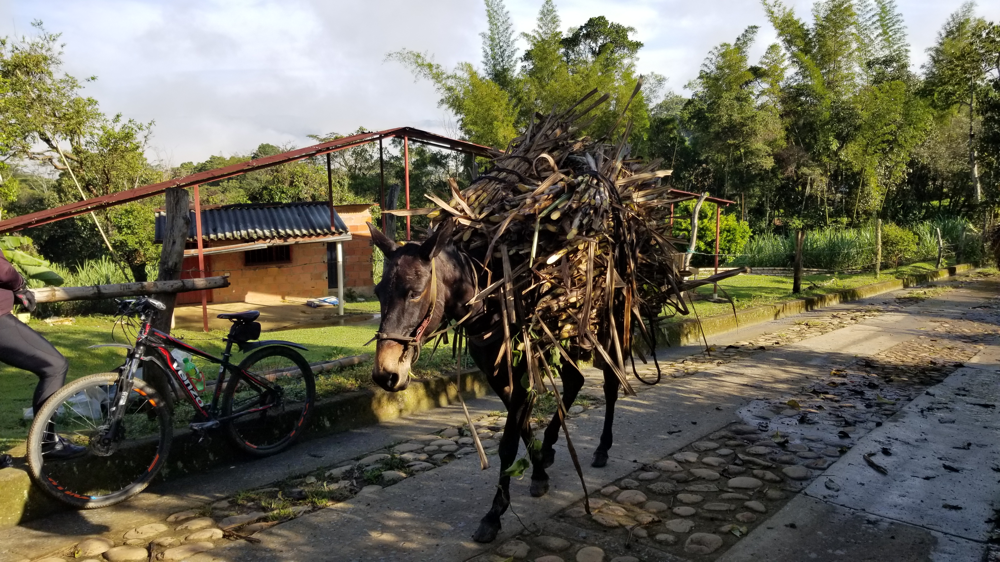

<br><details><summary>:camera:**46/20220412_074823.jpg**</summary><sub> `Exif version` 0220 `OS version` G955USQU8DUD3 `Date` 2022:04:12 07:48:23 `Aperture` Not known `Brightness` 7.55 `Color space` 1 `Compression` 6`Exposure mode` 0 `Exposure time` 0.0008169934640522876 `Focal length` 4.25 `Lens model` Not known `Lens specification` Not known `Orientation` 1 `Scene type` Not known `f number` 1.7 `White balance` 0 `Sensing method` 2 `Shutter speed` 10.257</sub><sub>`Coordinates & altitude` (0.0, 0.0, 0.0)</sub><sub> :earth_americas:`Location over` [Google Maps](http://maps.google.com/maps?q=0.0,0.0) or [Openstreet Map](https://www.openstreetmap.org/query?lat=0.0&lon=0.0)</sub></details>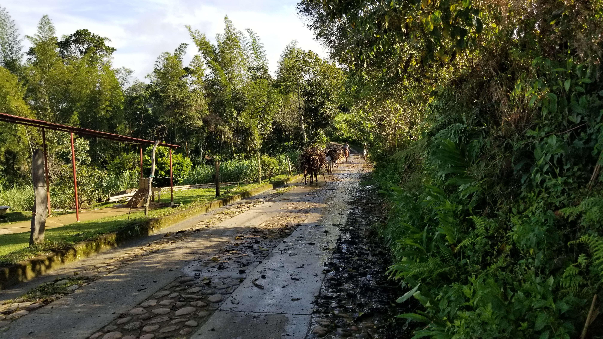

<br><details><summary>:camera:**46/20220412_074835.jpg**</summary><sub> `Exif version` 0220 `OS version` G955USQU8DUD3 `Date` 2022:04:12 07:48:35 `Aperture` Not known `Brightness` 7.74 `Color space` 1 `Compression` 6`Exposure mode` 0 `Exposure time` 0.0007309941520467836 `Focal length` 4.25 `Lens model` Not known `Lens specification` Not known `Orientation` 6 `Scene type` Not known `f number` 1.7 `White balance` 0 `Sensing method` 2 `Shutter speed` 10.417</sub><sub>`Coordinates & altitude` (0.0, 0.0, 0.0)</sub><sub> :earth_americas:`Location over` [Google Maps](http://maps.google.com/maps?q=0.0,0.0) or [Openstreet Map](https://www.openstreetmap.org/query?lat=0.0&lon=0.0)</sub></details>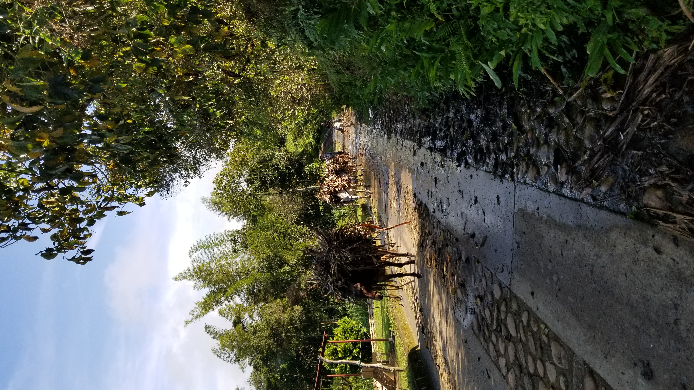

<br><details><summary>:camera:**46/20220412_140312.jpg**</summary><sub> `Exif version` 0220 `OS version` G955USQU8DUD3 `Date` 2022:04:12 14:03:12 `Aperture` Not known `Brightness` 9.4 `Color space` 1 `Compression` 6`Exposure mode` 0 `Exposure time` 0.0002376425855513308 `Focal length` 4.25 `Lens model` Not known `Lens specification` Not known `Orientation` 6 `Scene type` Not known `f number` 1.7 `White balance` 0 `Sensing method` 2 `Shutter speed` 12.038</sub><sub>`Coordinates & altitude` (6.0574364166666665, -73.48209391666667, 1622.751)</sub><sub> :earth_americas:`Location over` [Google Maps](http://maps.google.com/maps?q=6.0574364166666665,-73.48209391666667) or [Openstreet Map](https://www.openstreetmap.org/query?lat=6.0574364166666665&lon=-73.48209391666667)</sub></details>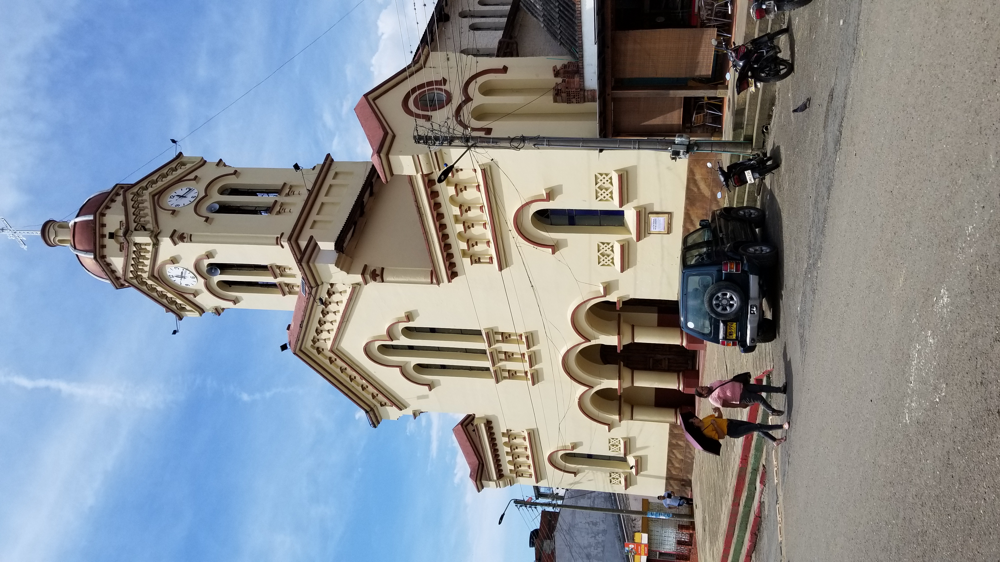

<br><details><summary>:camera:**46/20220412_140318.jpg**</summary><sub> `Exif version` 0220 `OS version` G955USQU8DUD3 `Date` 2022:04:12 14:03:18 `Aperture` Not known `Brightness` 9.1 `Color space` 1 `Compression` 6`Exposure mode` 0 `Exposure time` 0.00027901785714285713 `Focal length` 4.25 `Lens model` Not known `Lens specification` Not known `Orientation` 6 `Scene type` Not known `f number` 1.7 `White balance` 0 `Sensing method` 2 `Shutter speed` 11.807</sub><sub>`Coordinates & altitude` (6.057433055555555, -73.48210822222222, 1624.023)</sub><sub> :earth_americas:`Location over` [Google Maps](http://maps.google.com/maps?q=6.057433055555555,-73.48210822222222) or [Openstreet Map](https://www.openstreetmap.org/query?lat=6.057433055555555&lon=-73.48210822222222)</sub></details>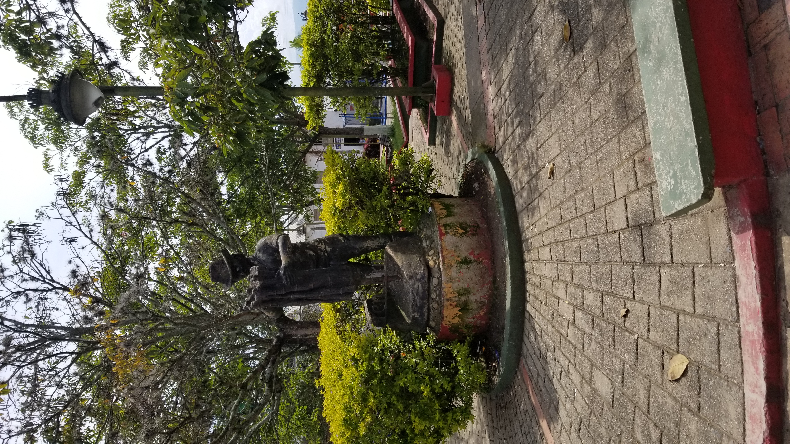

<br><details><summary>:camera:**46/20220413_052441.jpg**</summary><sub> `Exif version` 0220 `OS version` G955USQU8DUD3 `Date` 2022:04:13 05:24:41 `Aperture` Not known `Brightness` -2.74 `Color space` 1 `Compression` 6`Exposure mode` 0 `Exposure time` 0.1 `Focal length` 4.25 `Lens model` Not known `Lens specification` Not known `Orientation` 1 `Scene type` Not known `f number` 1.7 `White balance` 0 `Sensing method` 2 `Shutter speed` 3.317</sub><sub>`Coordinates & altitude` (0.0, 0.0, 0.0)</sub><sub> :earth_americas:`Location over` [Google Maps](http://maps.google.com/maps?q=0.0,0.0) or [Openstreet Map](https://www.openstreetmap.org/query?lat=0.0&lon=0.0)</sub></details>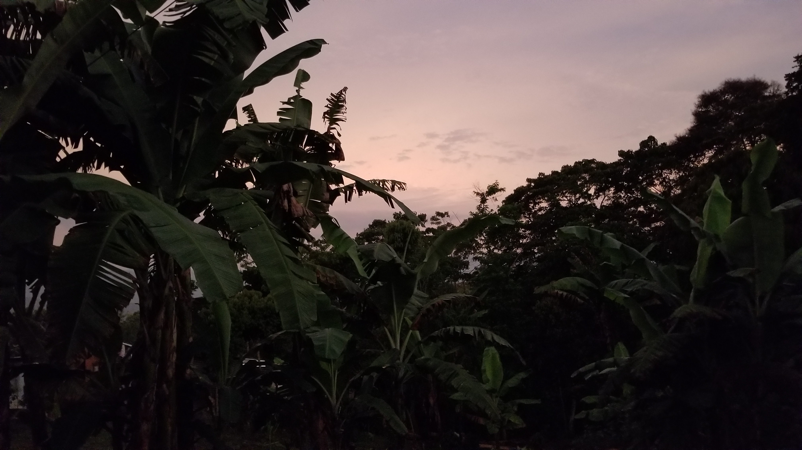

<br><details><summary>:camera:**46/20220413_080600.jpg**</summary><sub> `Exif version` 0220 `OS version` G955USQU8DUD3 `Date` 2022:04:13 08:05:59 `Aperture` Not known `Brightness` Not known `Color space` 1 `Compression` Not known`Exposure mode` 0 `Exposure time` 0.00035612535612535614 `Focal length` 4.25 `Lens model` Not known `Lens specification` Not known `Orientation` 6 `Scene type` Not known `f number` 1.7 `White balance` 0 `Sensing method` Not known `Shutter speed` Not known</sub></details>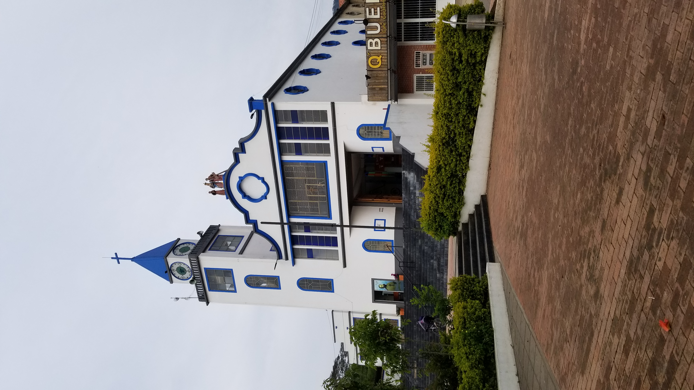

<br><details><summary>:camera:**46/20220413_080605.jpg**</summary><sub> `Exif version` 0220 `OS version` G955USQU8DUD3 `Date` 2022:04:13 08:06:05 `Aperture` Not known `Brightness` Not known `Color space` 1 `Compression` Not known`Exposure mode` 0 `Exposure time` 0.0004970178926441351 `Focal length` 4.25 `Lens model` Not known `Lens specification` Not known `Orientation` 1 `Scene type` Not known `f number` 1.7 `White balance` 0 `Sensing method` Not known `Shutter speed` Not known</sub></details>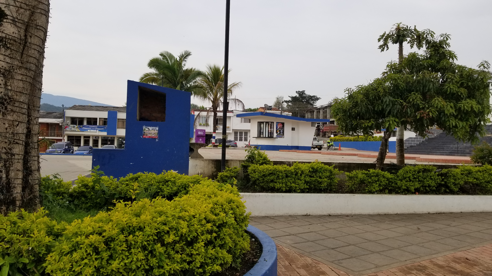

<br><details><summary>:camera:**46/20220413_080842.jpg**</summary><sub> `Exif version` 0220 `OS version` G955USQU8DUD3 `Date` 2022:04:13 08:08:42 `Aperture` Not known `Brightness` 9.5 `Color space` 1 `Compression` 6`Exposure mode` 0 `Exposure time` 0.00022644927536231884 `Focal length` 4.25 `Lens model` Not known `Lens specification` Not known `Orientation` 1 `Scene type` Not known `f number` 1.7 `White balance` 0 `Sensing method` 2 `Shutter speed` 12.108</sub><sub>`Coordinates & altitude` (0.0, 0.0, 0.0)</sub><sub> :earth_americas:`Location over` [Google Maps](http://maps.google.com/maps?q=0.0,0.0) or [Openstreet Map](https://www.openstreetmap.org/query?lat=0.0&lon=0.0)</sub></details>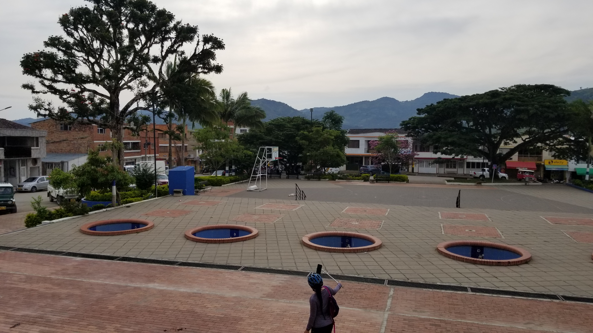

<br><details><summary>:camera:**46/20220413_080847.jpg**</summary><sub> `Exif version` 0220 `OS version` G955USQU8DUD3 `Date` 2022:04:13 08:08:47 `Aperture` Not known `Brightness` 9.15 `Color space` 1 `Compression` 6`Exposure mode` 0 `Exposure time` 0.00027533039647577095 `Focal length` 4.25 `Lens model` Not known `Lens specification` Not known `Orientation` 1 `Scene type` Not known `f number` 1.7 `White balance` 0 `Sensing method` 2 `Shutter speed` 11.826</sub><sub>`Coordinates & altitude` (0.0, 0.0, 0.0)</sub><sub> :earth_americas:`Location over` [Google Maps](http://maps.google.com/maps?q=0.0,0.0) or [Openstreet Map](https://www.openstreetmap.org/query?lat=0.0&lon=0.0)</sub></details>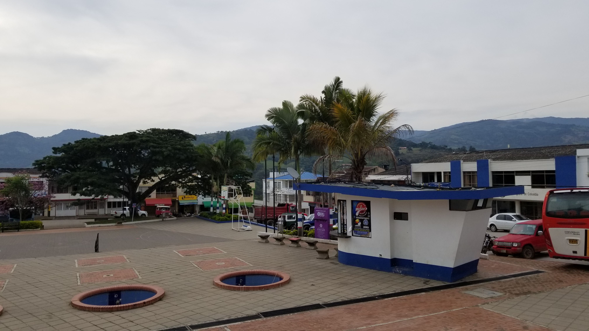

<br><details><summary>:camera:**46/20220413_081037.jpg**</summary><sub> `Exif version` 0220 `OS version` G955USQU8DUD3 `Date` 2022:04:13 08:10:37 `Aperture` Not known `Brightness` Not known `Color space` 1 `Compression` Not known`Exposure mode` 0 `Exposure time` 0.0008038585209003215 `Focal length` 4.25 `Lens model` Not known `Lens specification` Not known `Orientation` 1 `Scene type` Not known `f number` 1.7 `White balance` 0 `Sensing method` Not known `Shutter speed` Not known</sub></details>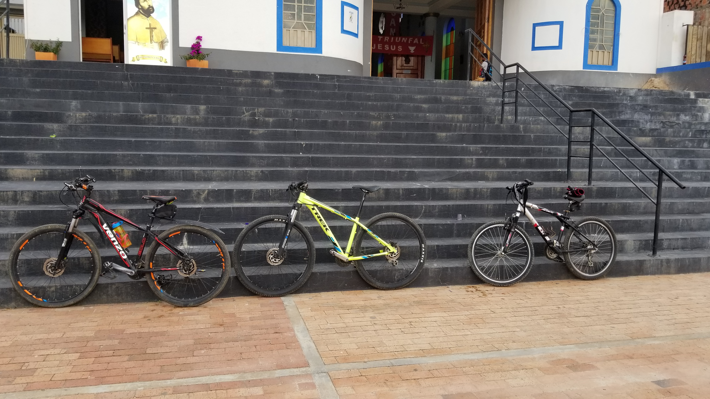

<br><details><summary>:camera:**46/20220413_081041.jpg**</summary><sub> `Exif version` 0220 `OS version` G955USQU8DUD3 `Date` 2022:04:13 08:10:41 `Aperture` Not known `Brightness` Not known `Color space` 1 `Compression` Not known`Exposure mode` 0 `Exposure time` 0.0004562043795620438 `Focal length` 4.25 `Lens model` Not known `Lens specification` Not known `Orientation` 6 `Scene type` Not known `f number` 1.7 `White balance` 0 `Sensing method` Not known `Shutter speed` Not known</sub></details>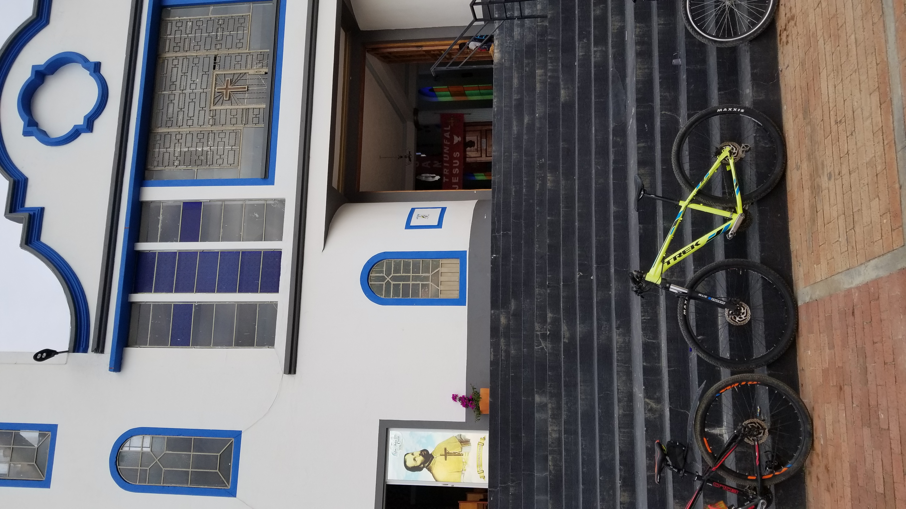

<br><details><summary>:camera:**46/20220413_094500.jpg**</summary><sub> `Exif version` 0220 `OS version` G955USQU8DUD3 `Date` 2022:04:13 09:45:00 `Aperture` Not known `Brightness` Not known `Color space` 1 `Compression` Not known`Exposure mode` 0 `Exposure time` 0.00017655367231638418 `Focal length` 4.25 `Lens model` Not known `Lens specification` Not known `Orientation` 1 `Scene type` Not known `f number` 1.7 `White balance` 0 `Sensing method` Not known `Shutter speed` Not known</sub></details>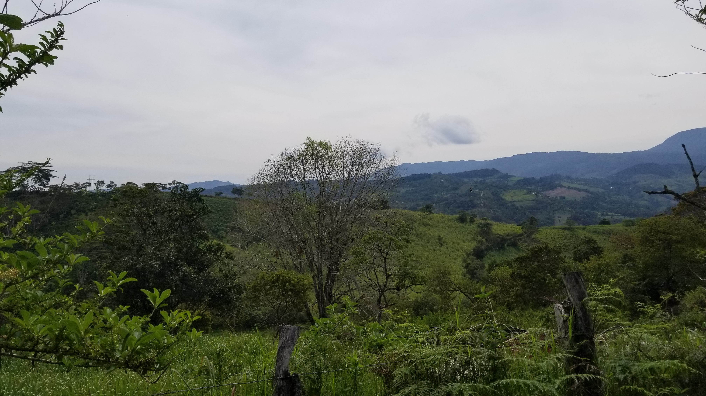

<br><details><summary>:camera:**46/20220413_094525.jpg**</summary><sub> `Exif version` 0220 `OS version` G955USQU8DUD3 `Date` 2022:04:13 09:45:25 `Aperture` Not known `Brightness` Not known `Color space` 1 `Compression` Not known`Exposure mode` 0 `Exposure time` 0.00027114967462039046 `Focal length` 4.25 `Lens model` Not known `Lens specification` Not known `Orientation` 6 `Scene type` Not known `f number` 1.7 `White balance` 0 `Sensing method` Not known `Shutter speed` Not known</sub></details>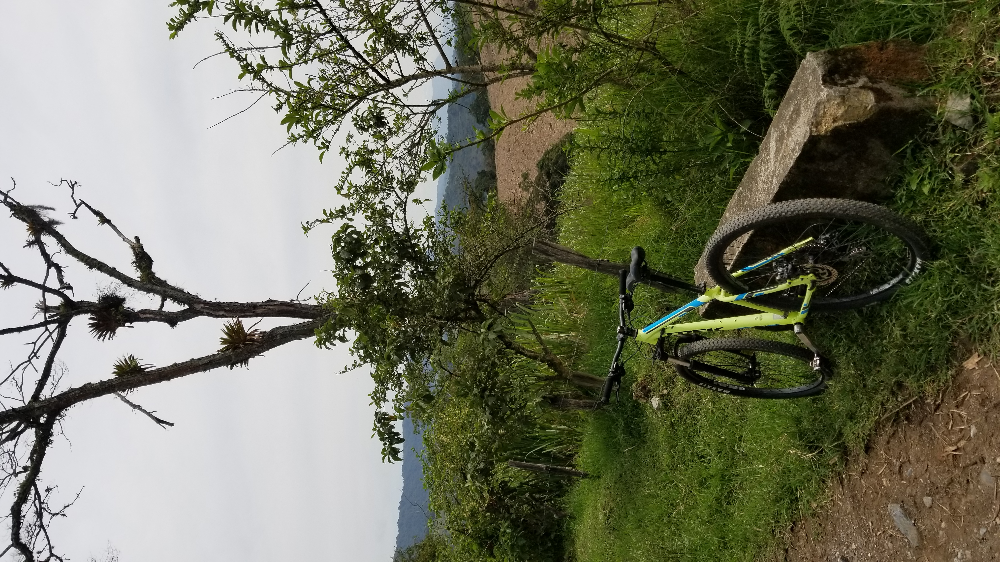

<br><details><summary>:camera:**46/20220413_094531.jpg**</summary><sub> `Exif version` 0220 `OS version` G955USQU8DUD3 `Date` 2022:04:13 09:45:31 `Aperture` Not known `Brightness` Not known `Color space` 1 `Compression` Not known`Exposure mode` 0 `Exposure time` 0.0002927400468384075 `Focal length` 4.25 `Lens model` Not known `Lens specification` Not known `Orientation` 1 `Scene type` Not known `f number` 1.7 `White balance` 0 `Sensing method` Not known `Shutter speed` Not known</sub></details>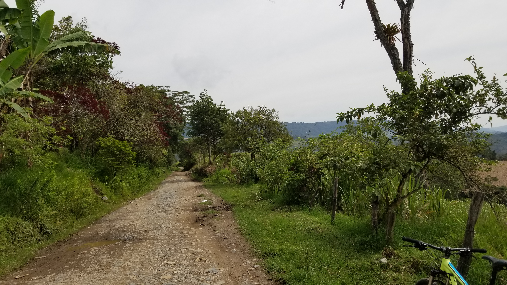

<br><details><summary>:camera:**46/20220413_094539.jpg**</summary><sub> `Exif version` 0220 `OS version` G955USQU8DUD3 `Date` 2022:04:13 09:45:39 `Aperture` Not known `Brightness` Not known `Color space` 1 `Compression` Not known`Exposure mode` 0 `Exposure time` 0.00015984654731457802 `Focal length` 4.25 `Lens model` Not known `Lens specification` Not known `Orientation` 1 `Scene type` Not known `f number` 1.7 `White balance` 0 `Sensing method` Not known `Shutter speed` Not known</sub></details>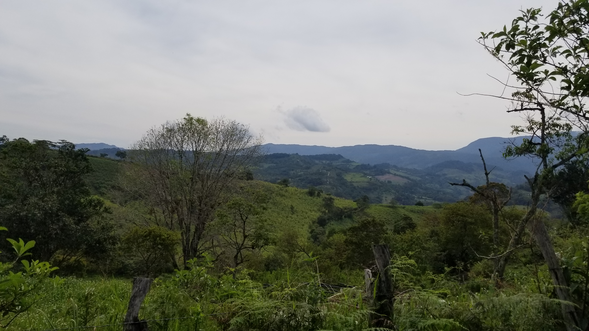

<br><details><summary>:camera:**46/20220413_094554.jpg**</summary><sub> `Exif version` 0220 `OS version` G955USQU8DUD3 `Date` 2022:04:13 09:45:54 `Aperture` Not known `Brightness` Not known `Color space` 1 `Compression` Not known`Exposure mode` 0 `Exposure time` 0.0001201923076923077 `Focal length` 4.25 `Lens model` Not known `Lens specification` Not known `Orientation` 6 `Scene type` Not known `f number` 1.7 `White balance` 0 `Sensing method` Not known `Shutter speed` Not known</sub></details>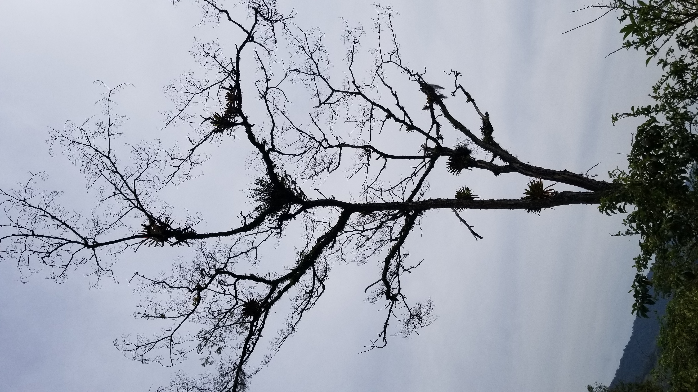

<br><details><summary>:camera:**46/20220413_094557.jpg**</summary><sub> `Exif version` 0220 `OS version` G955USQU8DUD3 `Date` 2022:04:13 09:45:57 `Aperture` Not known `Brightness` Not known `Color space` 1 `Compression` Not known`Exposure mode` 0 `Exposure time` 0.00011322463768115942 `Focal length` 4.25 `Lens model` Not known `Lens specification` Not known `Orientation` 6 `Scene type` Not known `f number` 1.7 `White balance` 0 `Sensing method` Not known `Shutter speed` Not known</sub></details>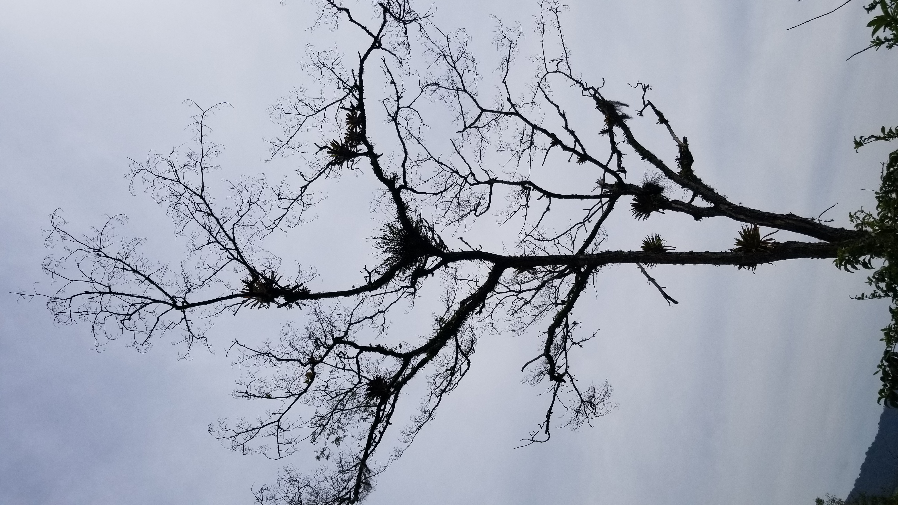

<br><details><summary>:camera:**46/20220413_101941.jpg**</summary><sub> `Exif version` 0220 `OS version` G955USQU8DUD3 `Date` 2022:04:13 10:19:41 `Aperture` Not known `Brightness` 9.76 `Color space` 1 `Compression` 6`Exposure mode` 0 `Exposure time` 0.00018436578171091445 `Focal length` 4.25 `Lens model` Not known `Lens specification` Not known `Orientation` 6 `Scene type` Not known `f number` 1.7 `White balance` 0 `Sensing method` 2 `Shutter speed` 12.405</sub><sub>`Coordinates & altitude` (5.937559722222223, -73.51279233333334, 1702.003)</sub><sub> :earth_americas:`Location over` [Google Maps](http://maps.google.com/maps?q=5.937559722222223,-73.51279233333334) or [Openstreet Map](https://www.openstreetmap.org/query?lat=5.937559722222223&lon=-73.51279233333334)</sub></details>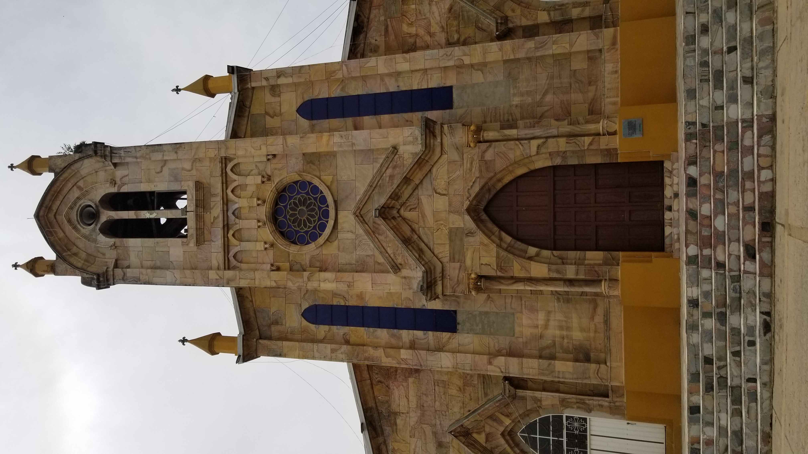

<br><details><summary>:camera:**46/20220413_101945.jpg**</summary><sub> `Exif version` 0220 `OS version` G955USQU8DUD3 `Date` 2022:04:13 10:19:45 `Aperture` Not known `Brightness` 9.24 `Color space` 1 `Compression` 6`Exposure mode` 0 `Exposure time` 0.0002759381898454746 `Focal length` 4.25 `Lens model` Not known `Lens specification` Not known `Orientation` 1 `Scene type` Not known `f number` 1.7 `White balance` 0 `Sensing method` 2 `Shutter speed` 11.823</sub><sub>`Coordinates & altitude` (5.937635222222222, -73.51282625, 1702.997)</sub><sub> :earth_americas:`Location over` [Google Maps](http://maps.google.com/maps?q=5.937635222222222,-73.51282625) or [Openstreet Map](https://www.openstreetmap.org/query?lat=5.937635222222222&lon=-73.51282625)</sub></details>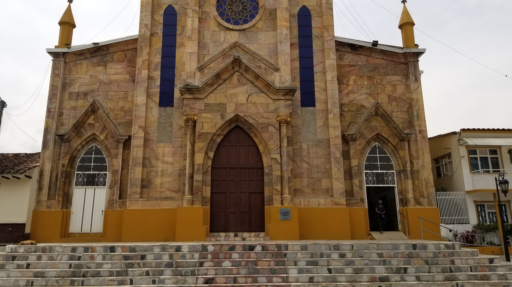

<br><details><summary>:camera:**46/20220413_101952.jpg**</summary><sub> `Exif version` 0220 `OS version` G955USQU8DUD3 `Date` 2022:04:13 10:19:52 `Aperture` Not known `Brightness` 7.55 `Color space` 1 `Compression` 6`Exposure mode` 0 `Exposure time` 0.0006230529595015577 `Focal length` 4.25 `Lens model` Not known `Lens specification` Not known `Orientation` 1 `Scene type` Not known `f number` 1.7 `White balance` 0 `Sensing method` 2 `Shutter speed` 10.648</sub><sub>`Coordinates & altitude` (5.937635222222222, -73.51282625, 1702.997)</sub><sub> :earth_americas:`Location over` [Google Maps](http://maps.google.com/maps?q=5.937635222222222,-73.51282625) or [Openstreet Map](https://www.openstreetmap.org/query?lat=5.937635222222222&lon=-73.51282625)</sub></details>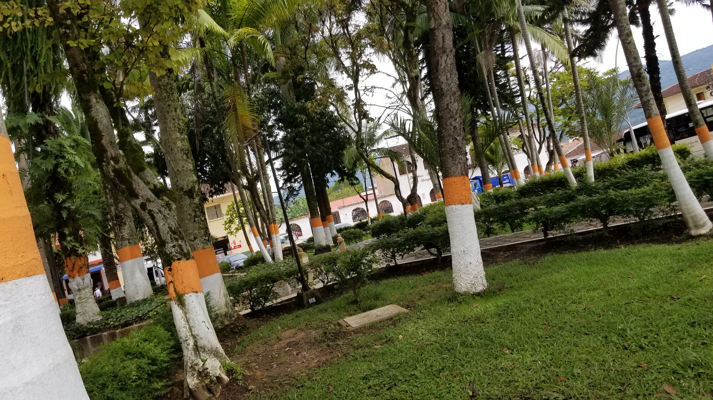

<br><details><summary>:camera:**46/20220413_101954.jpg**</summary><sub> `Exif version` 0220 `OS version` G955USQU8DUD3 `Date` 2022:04:13 10:19:54 `Aperture` Not known `Brightness` 8.12 `Color space` 1 `Compression` 6`Exposure mode` 0 `Exposure time` 0.0006009615384615385 `Focal length` 4.25 `Lens model` Not known `Lens specification` Not known `Orientation` 6 `Scene type` Not known `f number` 1.7 `White balance` 0 `Sensing method` 2 `Shutter speed` 10.7</sub><sub>`Coordinates & altitude` (5.937635222222222, -73.51282625, 1702.997)</sub><sub> :earth_americas:`Location over` [Google Maps](http://maps.google.com/maps?q=5.937635222222222,-73.51282625) or [Openstreet Map](https://www.openstreetmap.org/query?lat=5.937635222222222&lon=-73.51282625)</sub></details>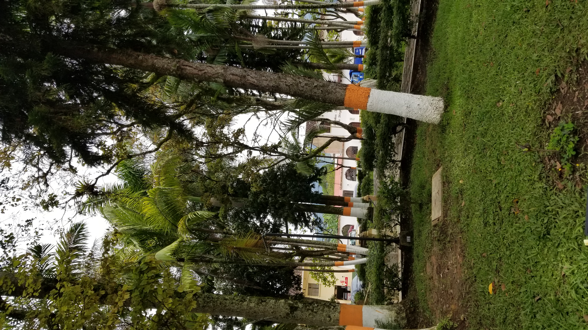

<br><details><summary>:camera:**46/20220413_102000.jpg**</summary><sub> `Exif version` 0220 `OS version` G955USQU8DUD3 `Date` 2022:04:13 10:20:00 `Aperture` Not known `Brightness` 8.81 `Color space` 1 `Compression` 6`Exposure mode` 0 `Exposure time` 0.0003443526170798898 `Focal length` 4.25 `Lens model` Not known `Lens specification` Not known `Orientation` 1 `Scene type` Not known `f number` 1.7 `White balance` 0 `Sensing method` 2 `Shutter speed` 11.503</sub><sub>`Coordinates & altitude` (5.937635222222222, -73.51282625, 1702.997)</sub><sub> :earth_americas:`Location over` [Google Maps](http://maps.google.com/maps?q=5.937635222222222,-73.51282625) or [Openstreet Map](https://www.openstreetmap.org/query?lat=5.937635222222222&lon=-73.51282625)</sub></details>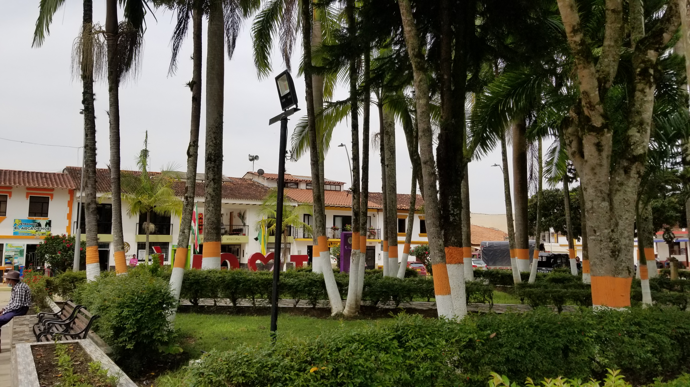

<br><details><summary>:camera:**46/20220413_102121.jpg**</summary><sub> `Exif version` 0220 `OS version` G955USQU8DUD3 `Date` 2022:04:13 10:21:21 `Aperture` Not known `Brightness` 7.8 `Color space` 1 `Compression` 6`Exposure mode` 0 `Exposure time` 0.0006180469715698393 `Focal length` 4.25 `Lens model` Not known `Lens specification` Not known `Orientation` 1 `Scene type` Not known `f number` 1.7 `White balance` 0 `Sensing method` 2 `Shutter speed` 10.66</sub><sub>`Coordinates & altitude` (5.9376588888888895, -73.51306511111112, 1691.164)</sub><sub> :earth_americas:`Location over` [Google Maps](http://maps.google.com/maps?q=5.9376588888888895,-73.51306511111112) or [Openstreet Map](https://www.openstreetmap.org/query?lat=5.9376588888888895&lon=-73.51306511111112)</sub></details>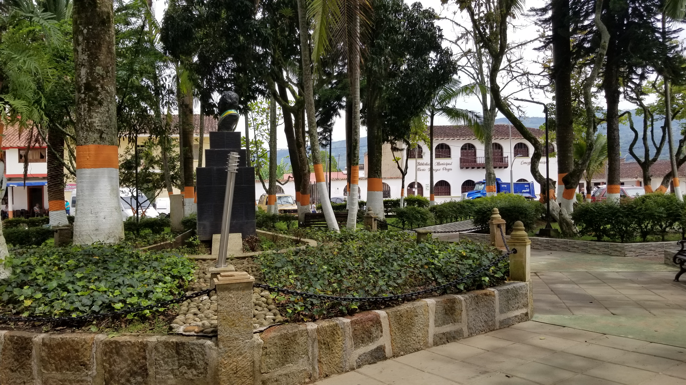

<br><details><summary>:camera:**46/20220413_102128.jpg**</summary><sub> `Exif version` 0220 `OS version` G955USQU8DUD3 `Date` 2022:04:13 10:21:28 `Aperture` Not known `Brightness` 8.71 `Color space` 1 `Compression` 6`Exposure mode` 0 `Exposure time` 0.00038580246913580245 `Focal length` 4.25 `Lens model` Not known `Lens specification` Not known `Orientation` 6 `Scene type` Not known `f number` 1.7 `White balance` 0 `Sensing method` 2 `Shutter speed` 11.339</sub><sub>`Coordinates & altitude` (5.93766675, -73.51314752777778, 1694.345)</sub><sub> :earth_americas:`Location over` [Google Maps](http://maps.google.com/maps?q=5.93766675,-73.51314752777778) or [Openstreet Map](https://www.openstreetmap.org/query?lat=5.93766675&lon=-73.51314752777778)</sub></details>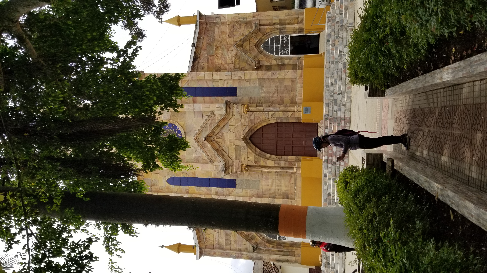

<br><details><summary>:camera:**46/20220413_102806.jpg**</summary><sub> `Exif version` 0220 `OS version` G955USQU8DUD3 `Date` 2022:04:13 10:28:06 `Aperture` Not known `Brightness` 9.88 `Color space` 1 `Compression` 6`Exposure mode` 0 `Exposure time` 0.00017361111111111112 `Focal length` 4.25 `Lens model` Not known `Lens specification` Not known `Orientation` 6 `Scene type` Not known `f number` 1.7 `White balance` 0 `Sensing method` 2 `Shutter speed` 12.491</sub><sub>`Coordinates & altitude` (5.937588305555556, -73.51312608333333, 1710.655)</sub><sub> :earth_americas:`Location over` [Google Maps](http://maps.google.com/maps?q=5.937588305555556,-73.51312608333333) or [Openstreet Map](https://www.openstreetmap.org/query?lat=5.937588305555556&lon=-73.51312608333333)</sub></details>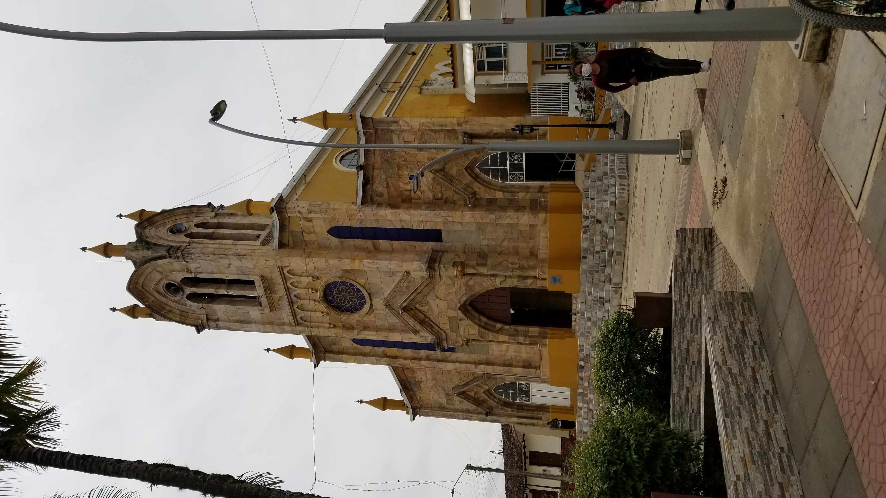

<br><details><summary>:camera:**46/20220413_102815.jpg**</summary><sub> `Exif version` 0220 `OS version` G955USQU8DUD3 `Date` 2022:04:13 10:28:15 `Aperture` Not known `Brightness` 9.88 `Color space` 1 `Compression` 6`Exposure mode` 0 `Exposure time` 0.00016801075268817206 `Focal length` 4.25 `Lens model` Not known `Lens specification` Not known `Orientation` 6 `Scene type` Not known `f number` 1.7 `White balance` 0 `Sensing method` 2 `Shutter speed` 12.539</sub><sub>`Coordinates & altitude` (5.937588305555556, -73.51312608333333, 1710.655)</sub><sub> :earth_americas:`Location over` [Google Maps](http://maps.google.com/maps?q=5.937588305555556,-73.51312608333333) or [Openstreet Map](https://www.openstreetmap.org/query?lat=5.937588305555556&lon=-73.51312608333333)</sub></details>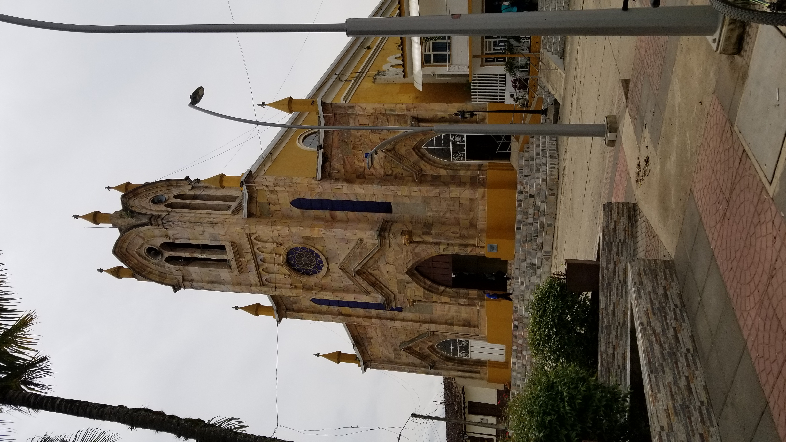

<br><details><summary>:camera:**46/20220413_102823.jpg**</summary><sub> `Exif version` 0220 `OS version` G955USQU8DUD3 `Date` 2022:04:13 10:28:23 `Aperture` Not known `Brightness` 8.56 `Color space` 1 `Compression` 6`Exposure mode` 0 `Exposure time` 0.0004032258064516129 `Focal length` 4.25 `Lens model` Not known `Lens specification` Not known `Orientation` 1 `Scene type` Not known `f number` 1.7 `White balance` 0 `Sensing method` 2 `Shutter speed` 11.276</sub><sub>`Coordinates & altitude` (5.937588305555556, -73.51312608333333, 1710.655)</sub><sub> :earth_americas:`Location over` [Google Maps](http://maps.google.com/maps?q=5.937588305555556,-73.51312608333333) or [Openstreet Map](https://www.openstreetmap.org/query?lat=5.937588305555556&lon=-73.51312608333333)</sub></details>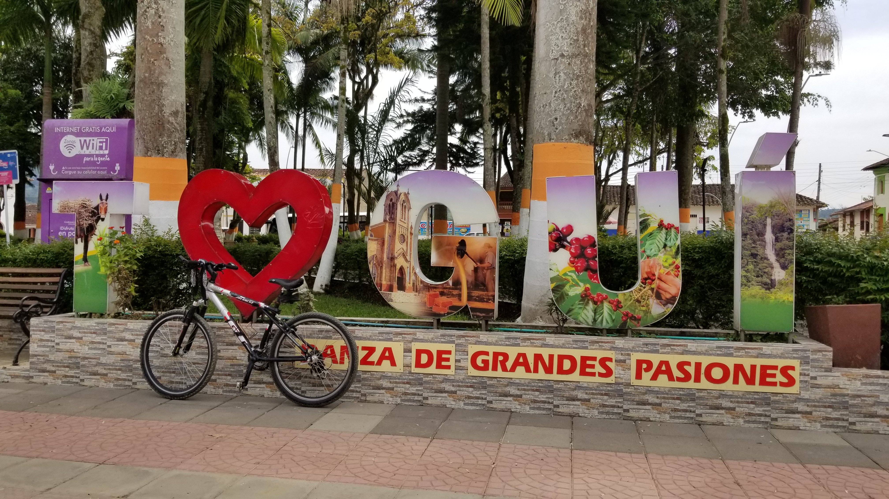

<br><details><summary>:camera:**46/20220413_184426.jpg**</summary><sub> `Exif version` 0220 `OS version` G955USQU8DUD3 `Date` 2022:04:13 18:44:26 `Aperture` Not known `Brightness` -2.46 `Color space` 1 `Compression` 6`Exposure mode` 0 `Exposure time` 0.1 `Focal length` 4.25 `Lens model` Not known `Lens specification` Not known `Orientation` 1 `Scene type` Not known `f number` 1.7 `White balance` 0 `Sensing method` 2 `Shutter speed` 3.317</sub><sub>`Coordinates & altitude` (0.0, 0.0, 0.0)</sub><sub> :earth_americas:`Location over` [Google Maps](http://maps.google.com/maps?q=0.0,0.0) or [Openstreet Map](https://www.openstreetmap.org/query?lat=0.0&lon=0.0)</sub></details>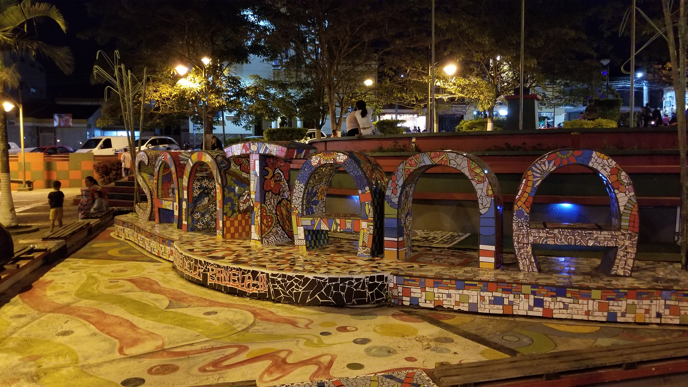

<br><details><summary>:camera:**46/20220413_184710.jpg**</summary><sub> `Exif version` 0220 `OS version` G955USQU8DUD3 `Date` 2022:04:13 18:47:10 `Aperture` Not known `Brightness` -1.38 `Color space` 1 `Compression` 6`Exposure mode` 0 `Exposure time` 0.1 `Focal length` 4.25 `Lens model` Not known `Lens specification` Not known `Orientation` 6 `Scene type` Not known `f number` 1.7 `White balance` 0 `Sensing method` 2 `Shutter speed` 3.317</sub><sub>`Coordinates & altitude` (0.0, 0.0, 0.0)</sub><sub> :earth_americas:`Location over` [Google Maps](http://maps.google.com/maps?q=0.0,0.0) or [Openstreet Map](https://www.openstreetmap.org/query?lat=0.0&lon=0.0)</sub></details>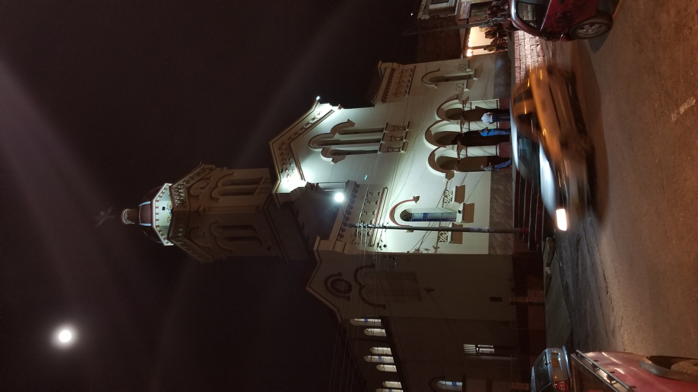

<br><details><summary>:camera:**46/20220414_065243.jpg**</summary><sub> `Exif version` 0220 `OS version` G955USQU8DUD3 `Date` 2022:04:14 06:52:43 `Aperture` Not known `Brightness` 4.01 `Color space` 1 `Compression` 6`Exposure mode` 0 `Exposure time` 0.008333333333333333 `Focal length` 4.25 `Lens model` Not known `Lens specification` Not known `Orientation` 6 `Scene type` Not known `f number` 1.7 `White balance` 0 `Sensing method` 2 `Shutter speed` 6.906</sub><sub>`Coordinates & altitude` (6.056775194444445, -73.50652241666667, 1504.134)</sub><sub> :earth_americas:`Location over` [Google Maps](http://maps.google.com/maps?q=6.056775194444445,-73.50652241666667) or [Openstreet Map](https://www.openstreetmap.org/query?lat=6.056775194444445&lon=-73.50652241666667)</sub></details>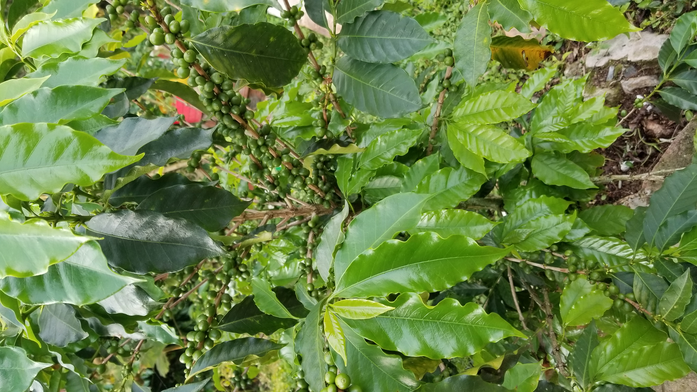

<br><details><summary>:camera:**46/20220414_065247.jpg**</summary><sub> `Exif version` 0220 `OS version` G955USQU8DUD3 `Date` 2022:04:14 06:52:47 `Aperture` Not known `Brightness` 4.32 `Color space` 1 `Compression` 6`Exposure mode` 0 `Exposure time` 0.007874015748031496 `Focal length` 4.25 `Lens model` Not known `Lens specification` Not known `Orientation` 6 `Scene type` Not known `f number` 1.7 `White balance` 0 `Sensing method` 2 `Shutter speed` 6.988</sub><sub>`Coordinates & altitude` (6.056775194444445, -73.50652241666667, 1504.134)</sub><sub> :earth_americas:`Location over` [Google Maps](http://maps.google.com/maps?q=6.056775194444445,-73.50652241666667) or [Openstreet Map](https://www.openstreetmap.org/query?lat=6.056775194444445&lon=-73.50652241666667)</sub></details>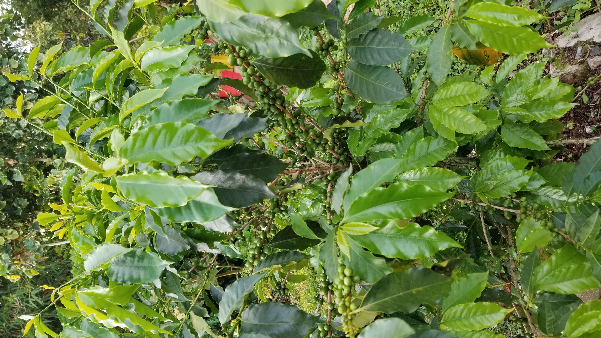

<br><details><summary>:camera:**46/20220414_065251.jpg**</summary><sub> `Exif version` 0220 `OS version` G955USQU8DUD3 `Date` 2022:04:14 06:52:51 `Aperture` Not known `Brightness` 4.17 `Color space` 1 `Compression` 6`Exposure mode` 0 `Exposure time` 0.008333333333333333 `Focal length` 4.25 `Lens model` Not known `Lens specification` Not known `Orientation` 1 `Scene type` Not known `f number` 1.7 `White balance` 0 `Sensing method` 2 `Shutter speed` 6.906</sub><sub>`Coordinates & altitude` (6.056775194444445, -73.50652241666667, 1504.134)</sub><sub> :earth_americas:`Location over` [Google Maps](http://maps.google.com/maps?q=6.056775194444445,-73.50652241666667) or [Openstreet Map](https://www.openstreetmap.org/query?lat=6.056775194444445&lon=-73.50652241666667)</sub></details>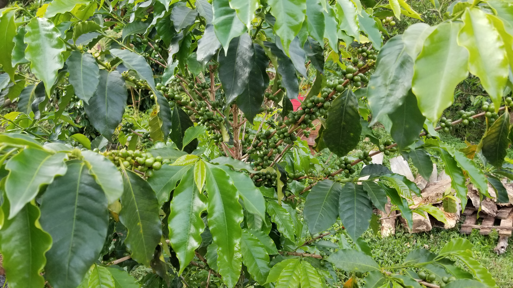

<br><details><summary>:camera:**46/20220414_071703.jpg**</summary><sub> `Exif version` 0220 `OS version` G955USQU8DUD3 `Date` 2022:04:14 07:17:03 `Aperture` Not known `Brightness` 5.01 `Color space` 1 `Compression` 6`Exposure mode` 0 `Exposure time` 0.004739336492890996 `Focal length` 4.25 `Lens model` Not known `Lens specification` Not known `Orientation` 6 `Scene type` Not known `f number` 1.7 `White balance` 0 `Sensing method` 2 `Shutter speed` 7.721</sub><sub>`Coordinates & altitude` (6.056634055555556, -73.50637263888889, 1491.646)</sub><sub> :earth_americas:`Location over` [Google Maps](http://maps.google.com/maps?q=6.056634055555556,-73.50637263888889) or [Openstreet Map](https://www.openstreetmap.org/query?lat=6.056634055555556&lon=-73.50637263888889)</sub></details>

<br><details><summary>:camera:**46/20220414_115359.jpg**</summary><sub> `Exif version` 0220 `OS version` G955USQU8DUD3 `Date` 2022:04:14 11:53:59 `Aperture` Not known `Brightness` 4.96 `Color space` 1 `Compression` 6`Exposure mode` 0 `Exposure time` 0.0053475935828877 `Focal length` 4.25 `Lens model` Not known `Lens specification` Not known `Orientation` 6 `Scene type` Not known `f number` 1.7 `White balance` 0 `Sensing method` 2 `Shutter speed` 7.546</sub><sub>`Coordinates & altitude` (6.037335583333333, -73.506562, 0.0)</sub><sub> :earth_americas:`Location over` [Google Maps](http://maps.google.com/maps?q=6.037335583333333,-73.506562) or [Openstreet Map](https://www.openstreetmap.org/query?lat=6.037335583333333&lon=-73.506562)</sub></details>

<br><details><summary>:camera:**46/20220415_074802.jpg**</summary><sub> `Exif version` 0220 `OS version` G955USQU8DUD3 `Date` 2022:04:15 07:48:02 `Aperture` Not known `Brightness` 6.81 `Color space` 1 `Compression` 6`Exposure mode` 0 `Exposure time` 0.0014792899408284023 `Focal length` 4.25 `Lens model` Not known `Lens specification` Not known `Orientation` 1 `Scene type` Not known `f number` 1.7 `White balance` 0 `Sensing method` 2 `Shutter speed` 9.4</sub><sub>`Coordinates & altitude` (6.1059786944444445, -73.49455422222222, 1040.093)</sub><sub> :earth_americas:`Location over` [Google Maps](http://maps.google.com/maps?q=6.1059786944444445,-73.49455422222222) or [Openstreet Map](https://www.openstreetmap.org/query?lat=6.1059786944444445&lon=-73.49455422222222)</sub></details>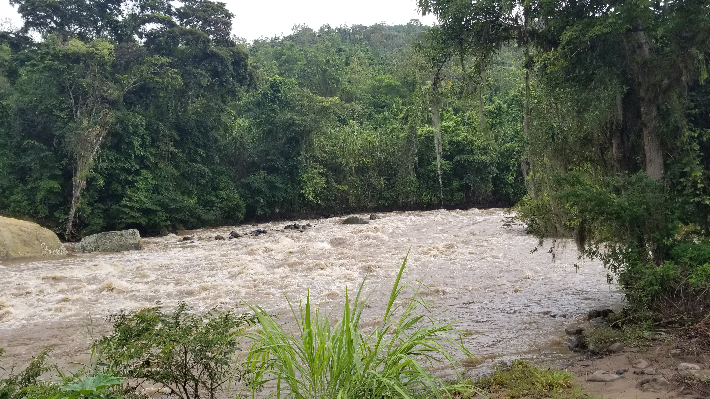

<br><details><summary>:camera:**46/20220415_074805.jpg**</summary><sub> `Exif version` 0220 `OS version` G955USQU8DUD3 `Date` 2022:04:15 07:48:05 `Aperture` Not known `Brightness` 8.08 `Color space` 1 `Compression` 6`Exposure mode` 0 `Exposure time` 0.0005787037037037037 `Focal length` 4.25 `Lens model` Not known `Lens specification` Not known `Orientation` 6 `Scene type` Not known `f number` 1.7 `White balance` 0 `Sensing method` 2 `Shutter speed` 10.754</sub><sub>`Coordinates & altitude` (6.1059786944444445, -73.49455422222222, 1040.093)</sub><sub> :earth_americas:`Location over` [Google Maps](http://maps.google.com/maps?q=6.1059786944444445,-73.49455422222222) or [Openstreet Map](https://www.openstreetmap.org/query?lat=6.1059786944444445&lon=-73.49455422222222)</sub></details>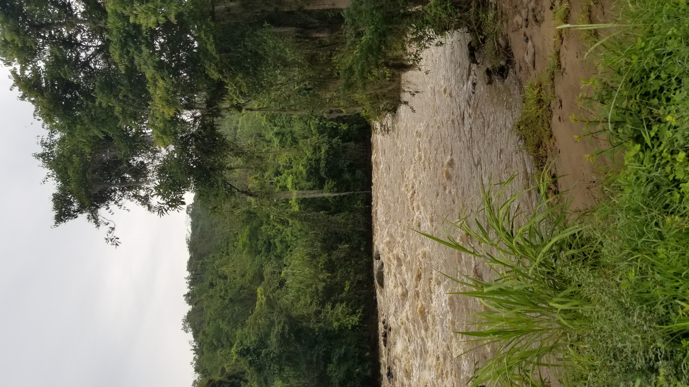

<br><details><summary>:camera:**46/20220415_074810.jpg**</summary><sub> `Exif version` 0220 `OS version` G955USQU8DUD3 `Date` 2022:04:15 07:48:10 `Aperture` Not known `Brightness` 7.76 `Color space` 1 `Compression` 6`Exposure mode` 0 `Exposure time` 0.0007331378299120235 `Focal length` 4.25 `Lens model` Not known `Lens specification` Not known `Orientation` 1 `Scene type` Not known `f number` 1.7 `White balance` 0 `Sensing method` 2 `Shutter speed` 10.413</sub><sub>`Coordinates & altitude` (6.1059786944444445, -73.49455422222222, 1040.093)</sub><sub> :earth_americas:`Location over` [Google Maps](http://maps.google.com/maps?q=6.1059786944444445,-73.49455422222222) or [Openstreet Map](https://www.openstreetmap.org/query?lat=6.1059786944444445&lon=-73.49455422222222)</sub></details>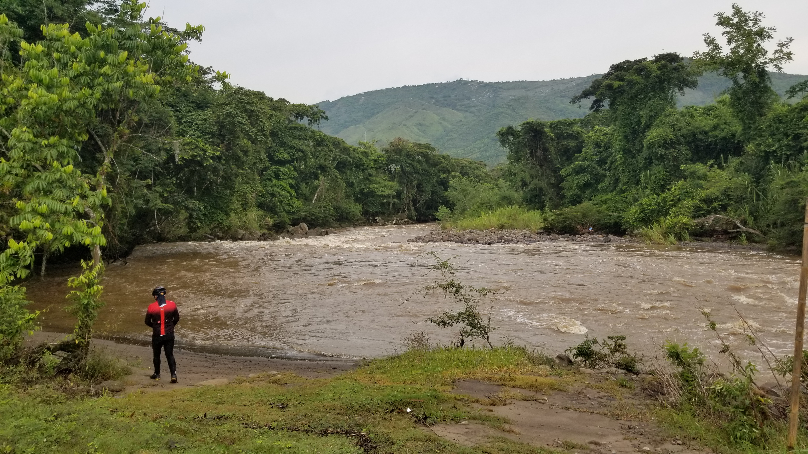

<br><details><summary>:camera:**46/20220415_075219.jpg**</summary><sub> `Exif version` 0220 `OS version` G955USQU8DUD3 `Date` 2022:04:15 07:52:19 `Aperture` Not known `Brightness` 7.74 `Color space` 1 `Compression` 6`Exposure mode` 0 `Exposure time` 0.0007575757575757576 `Focal length` 4.25 `Lens model` Not known `Lens specification` Not known `Orientation` 1 `Scene type` Not known `f number` 1.7 `White balance` 0 `Sensing method` 2 `Shutter speed` 10.366</sub><sub>`Coordinates & altitude` (6.105977277777777, -73.49454280555555, 1038.467)</sub><sub> :earth_americas:`Location over` [Google Maps](http://maps.google.com/maps?q=6.105977277777777,-73.49454280555555) or [Openstreet Map](https://www.openstreetmap.org/query?lat=6.105977277777777&lon=-73.49454280555555)</sub></details>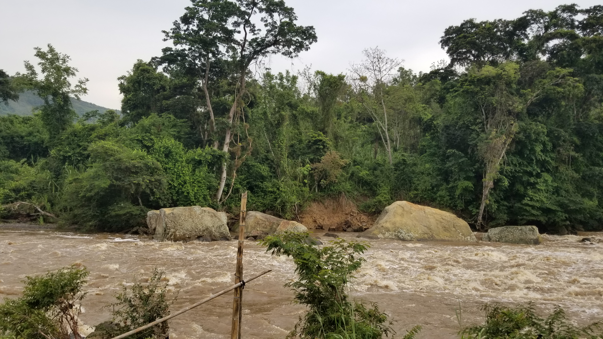

<br><details><summary>:camera:**46/20220415_075224.jpg**</summary><sub> `Exif version` 0220 `OS version` G955USQU8DUD3 `Date` 2022:04:15 07:52:24 `Aperture` Not known `Brightness` 8.0 `Color space` 1 `Compression` 6`Exposure mode` 0 `Exposure time` 0.0006476683937823834 `Focal length` 4.25 `Lens model` Not known `Lens specification` Not known `Orientation` 6 `Scene type` Not known `f number` 1.7 `White balance` 0 `Sensing method` 2 `Shutter speed` 10.592</sub><sub>`Coordinates & altitude` (6.105977277777777, -73.49454280555555, 1038.467)</sub><sub> :earth_americas:`Location over` [Google Maps](http://maps.google.com/maps?q=6.105977277777777,-73.49454280555555) or [Openstreet Map](https://www.openstreetmap.org/query?lat=6.105977277777777&lon=-73.49454280555555)</sub></details>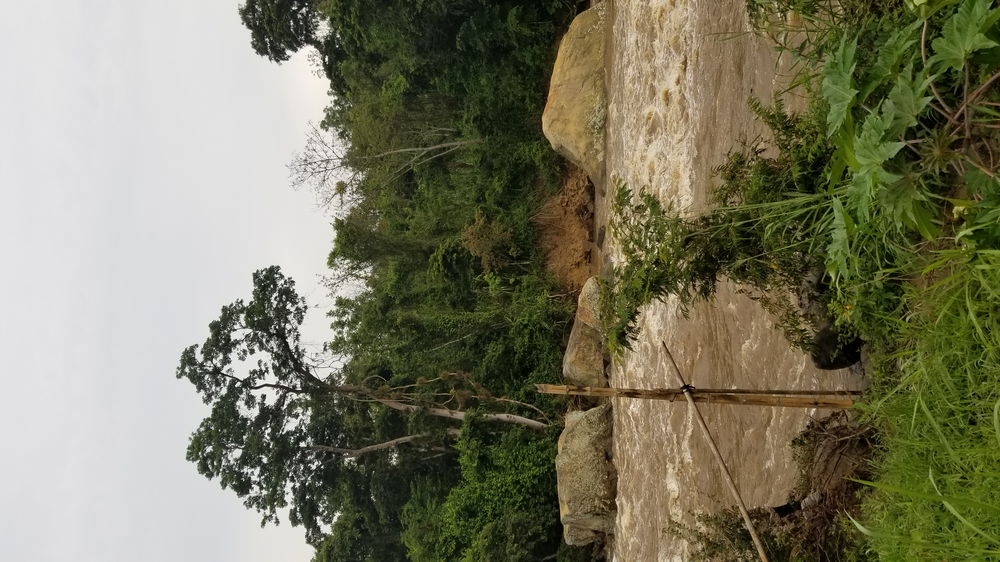

<br><details><summary>:camera:**46/20230225_082441.jpg**</summary><sub> `Exif version` 0220 `OS version` G955USQU8DUD3 `Date` 2023:02:25 08:24:40 `Aperture` Not known `Brightness` 9.76 `Color space` 1 `Compression` 6`Exposure mode` 0 `Exposure time` 0.0001329964090969544 `Focal length` 4.25 `Lens model` Not known `Lens specification` Not known `Orientation` 6 `Scene type` Not known `f number` 1.7 `White balance` 0 `Sensing method` 2 `Shutter speed` 12.876</sub><sub>`Coordinates & altitude` (6.103028194444444, -73.44164427777778, 1645.3)</sub><sub> :earth_americas:`Location over` [Google Maps](http://maps.google.com/maps?q=6.103028194444444,-73.44164427777778) or [Openstreet Map](https://www.openstreetmap.org/query?lat=6.103028194444444&lon=-73.44164427777778)</sub></details>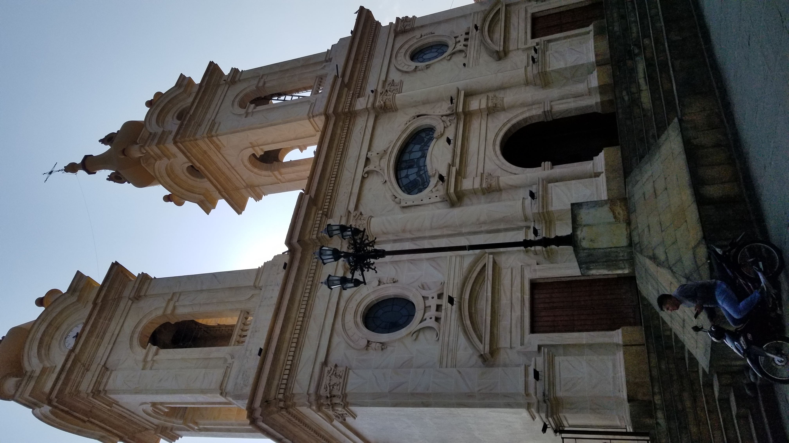

<br><details><summary>:camera:**46/20230226_162120.jpg**</summary><sub> `Exif version` 0220 `OS version` G955USQU8DUD3 `Date` 2023:02:26 16:21:20 `Aperture` Not known `Brightness` 7.58 `Color space` 1 `Compression` 6`Exposure mode` 0 `Exposure time` 0.0008650519031141869 `Focal length` 4.25 `Lens model` Not known `Lens specification` Not known `Orientation` 1 `Scene type` Not known `f number` 1.7 `White balance` 0 `Sensing method` 2 `Shutter speed` 10.174</sub><sub>`Coordinates & altitude` (0.0, 0.0, 0.0)</sub><sub> :earth_americas:`Location over` [Google Maps](http://maps.google.com/maps?q=0.0,0.0) or [Openstreet Map](https://www.openstreetmap.org/query?lat=0.0&lon=0.0)</sub></details>

<br><details><summary>:camera:**46/20230226_162126.jpg**</summary><sub> `Exif version` 0220 `OS version` G955USQU8DUD3 `Date` 2023:02:26 16:21:26 `Aperture` Not known `Brightness` 7.16 `Color space` 1 `Compression` 6`Exposure mode` 0 `Exposure time` 0.0011389521640091116 `Focal length` 4.25 `Lens model` Not known `Lens specification` Not known `Orientation` 6 `Scene type` Not known `f number` 1.7 `White balance` 0 `Sensing method` 2 `Shutter speed` 9.778</sub><sub>`Coordinates & altitude` (0.0, 0.0, 0.0)</sub><sub> :earth_americas:`Location over` [Google Maps](http://maps.google.com/maps?q=0.0,0.0) or [Openstreet Map](https://www.openstreetmap.org/query?lat=0.0&lon=0.0)</sub></details>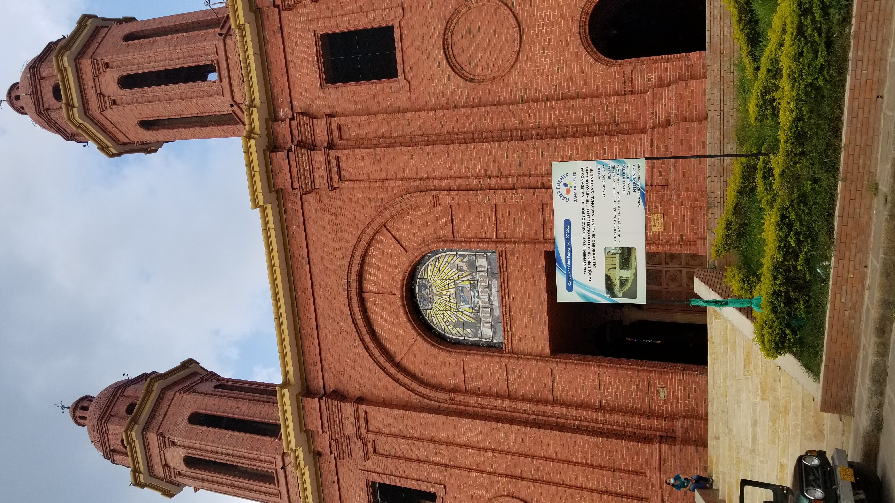

<br><details><summary>:camera:**46/20230226_162131.jpg**</summary><sub> `Exif version` 0220 `OS version` G955USQU8DUD3 `Date` 2023:02:26 16:21:31 `Aperture` Not known `Brightness` 8.77 `Color space` 1 `Compression` 6`Exposure mode` 0 `Exposure time` 0.00025700334104343357 `Focal length` 4.25 `Lens model` Not known `Lens specification` Not known `Orientation` 1 `Scene type` Not known `f number` 1.7 `White balance` 0 `Sensing method` 2 `Shutter speed` 11.925</sub><sub>`Coordinates & altitude` (0.0, 0.0, 0.0)</sub><sub> :earth_americas:`Location over` [Google Maps](http://maps.google.com/maps?q=0.0,0.0) or [Openstreet Map](https://www.openstreetmap.org/query?lat=0.0&lon=0.0)</sub></details>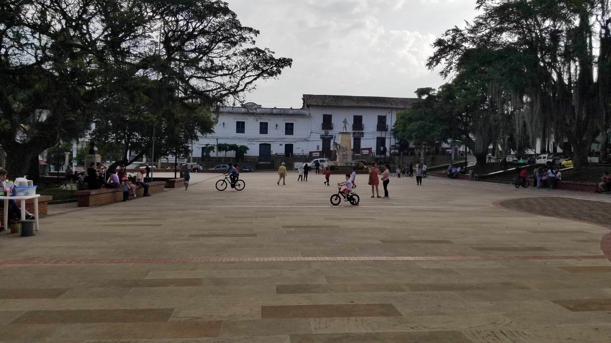

<br><details><summary>:camera:**46/20230226_162133.jpg**</summary><sub> `Exif version` 0220 `OS version` G955USQU8DUD3 `Date` 2023:02:26 16:21:33 `Aperture` Not known `Brightness` 7.61 `Color space` 1 `Compression` 6`Exposure mode` 0 `Exposure time` 0.0008417508417508417 `Focal length` 4.25 `Lens model` Not known `Lens specification` Not known `Orientation` 1 `Scene type` Not known `f number` 1.7 `White balance` 0 `Sensing method` 2 `Shutter speed` 10.214</sub><sub>`Coordinates & altitude` (0.0, 0.0, 0.0)</sub><sub> :earth_americas:`Location over` [Google Maps](http://maps.google.com/maps?q=0.0,0.0) or [Openstreet Map](https://www.openstreetmap.org/query?lat=0.0&lon=0.0)</sub></details>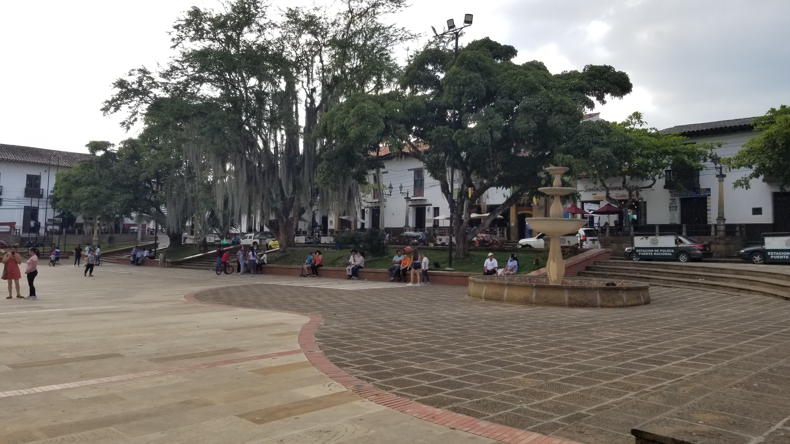

<br><details><summary>:camera:**46/20230226_162247.jpg**</summary><sub> `Exif version` 0220 `OS version` G955USQU8DUD3 `Date` 2023:02:26 16:22:47 `Aperture` Not known `Brightness` 0.9 `Color space` 1 `Compression` 6`Exposure mode` 0 `Exposure time` 0.03333333333333333 `Focal length` 4.25 `Lens model` Not known `Lens specification` Not known `Orientation` 1 `Scene type` Not known `f number` 1.7 `White balance` 0 `Sensing method` 2 `Shutter speed` 4.906</sub><sub>`Coordinates & altitude` (0.0, 0.0, 0.0)</sub><sub> :earth_americas:`Location over` [Google Maps](http://maps.google.com/maps?q=0.0,0.0) or [Openstreet Map](https://www.openstreetmap.org/query?lat=0.0&lon=0.0)</sub></details>

<br><details><summary>:camera:**46/20230226_162251.jpg**</summary><sub> `Exif version` 0220 `OS version` G955USQU8DUD3 `Date` 2023:02:26 16:22:51 `Aperture` Not known `Brightness` 0.0 `Color space` 1 `Compression` 6`Exposure mode` 0 `Exposure time` 0.043478260869565216 `Focal length` 4.25 `Lens model` Not known `Lens specification` Not known `Orientation` 1 `Scene type` Not known `f number` 1.7 `White balance` 0 `Sensing method` 2 `Shutter speed` 4.539</sub><sub>`Coordinates & altitude` (0.0, 0.0, 0.0)</sub><sub> :earth_americas:`Location over` [Google Maps](http://maps.google.com/maps?q=0.0,0.0) or [Openstreet Map](https://www.openstreetmap.org/query?lat=0.0&lon=0.0)</sub></details>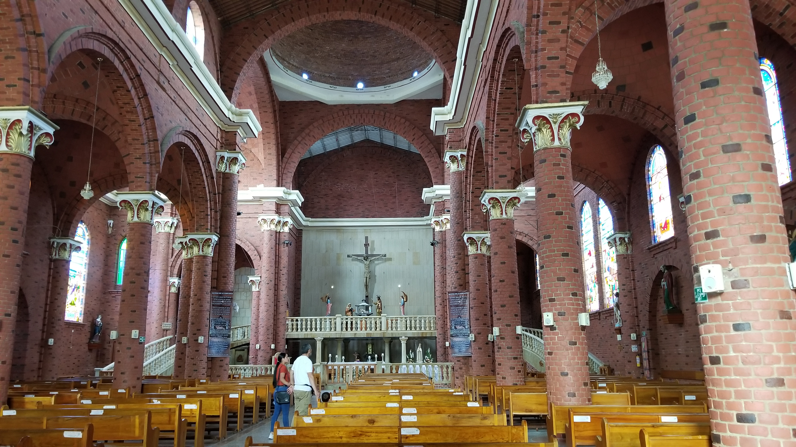

<br><details><summary>:camera:**46/20230226_162256.jpg**</summary><sub> `Exif version` 0220 `OS version` G955USQU8DUD3 `Date` 2023:02:26 16:22:56 `Aperture` Not known `Brightness` 0.19 `Color space` 1 `Compression` 6`Exposure mode` 0 `Exposure time` 0.016666666666666666 `Focal length` 4.25 `Lens model` Not known `Lens specification` Not known `Orientation` 1 `Scene type` Not known `f number` 1.7 `White balance` 0 `Sensing method` 2 `Shutter speed` 5.903</sub><sub>`Coordinates & altitude` (0.0, 0.0, 0.0)</sub><sub> :earth_americas:`Location over` [Google Maps](http://maps.google.com/maps?q=0.0,0.0) or [Openstreet Map](https://www.openstreetmap.org/query?lat=0.0&lon=0.0)</sub></details>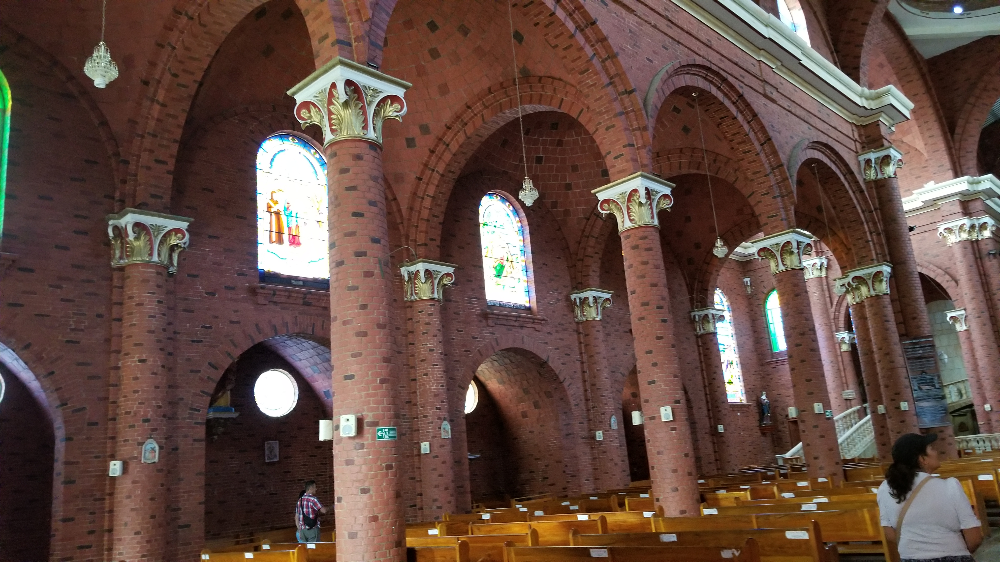

<br><details><summary>:camera:**46/IMG-20230225-WA0006.jpeg**</summary><sub> `Exif version` 0220 `OS version` G955USQU8DUD3 `Date` 2023:02:25 08:21:50 `Aperture` Not known `Brightness` 8.05 `Color space` 1 `Compression` 6`Exposure mode` 0 `Exposure time` 0.0006082725060827251 `Focal length` 4.25 `Lens model` Not known `Lens specification` Not known `Orientation` 1 `Scene type` Not known `f number` 1.7 `White balance` 0 `Sensing method` 2 `Shutter speed` 10.682</sub></details>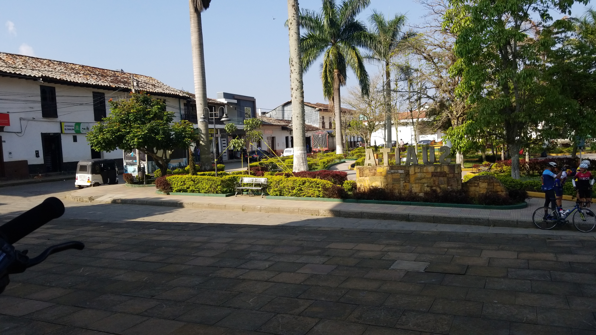

<br><details><summary>:camera:**46/IMG-20230225-WA0010.jpeg**</summary><sub> `Exif version` 0220 `OS version` G955USQU8DUD3 `Date` 2023:02:25 08:22:26 `Aperture` Not known `Brightness` 8.06 `Color space` 1 `Compression` 6`Exposure mode` 0 `Exposure time` 0.0005924170616113745 `Focal length` 4.25 `Lens model` Not known `Lens specification` Not known `Orientation` 1 `Scene type` Not known `f number` 1.7 `White balance` 0 `Sensing method` 2 `Shutter speed` 10.721</sub></details>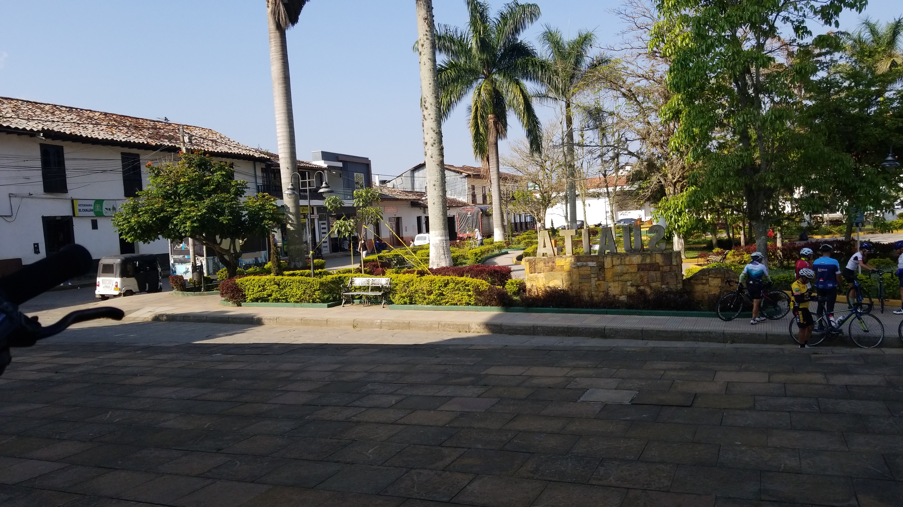

<br><details><summary>:camera:**46/IMG-20230225-WA0012.jpeg**</summary><sub> `Exif version` 0220 `OS version` G955USQU8DUD3 `Date` 2023:02:25 08:22:32 `Aperture` Not known `Brightness` 7.71 `Color space` 1 `Compression` 6`Exposure mode` 0 `Exposure time` 0.0007552870090634441 `Focal length` 4.25 `Lens model` Not known `Lens specification` Not known `Orientation` 1 `Scene type` Not known `f number` 1.7 `White balance` 0 `Sensing method` 2 `Shutter speed` 10.37</sub></details>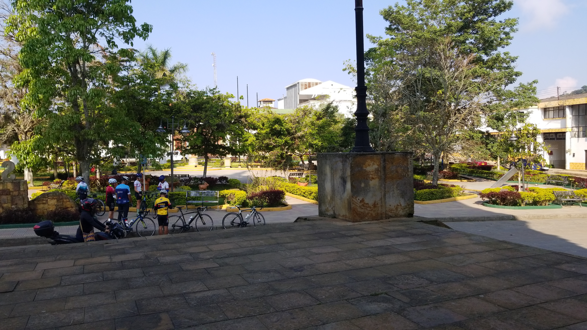

<br><details><summary>:camera:**46/IMG-20230225-WA0014.jpeg**</summary><sub> `Exif version` 0220 `OS version` G955USQU8DUD3 `Date` 2023:02:25 08:23:55 `Aperture` Not known `Brightness` 9.49 `Color space` 1 `Compression` 6`Exposure mode` 0 `Exposure time` 0.00021777003484320557 `Focal length` 4.25 `Lens model` Not known `Lens specification` Not known `Orientation` 6 `Scene type` Not known `f number` 1.7 `White balance` 0 `Sensing method` 2 `Shutter speed` 12.164</sub></details>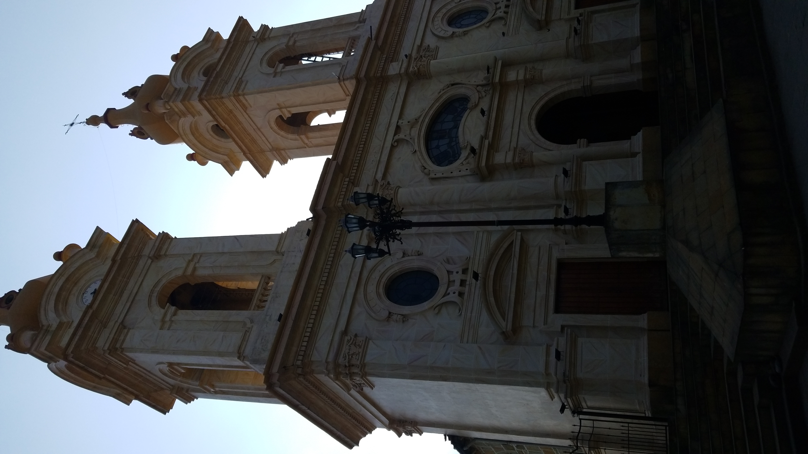

<br><details><summary>:camera:**46/IMG-20230225-WA0016.jpeg**</summary><sub> `Exif version` 0220 `OS version` G955USQU8DUD3 `Date` 2023:02:25 08:24:07 `Aperture` Not known `Brightness` 9.87 `Color space` 1 `Compression` 6`Exposure mode` 0 `Exposure time` 0.00018221574344023323 `Focal length` 4.25 `Lens model` Not known `Lens specification` Not known `Orientation` 6 `Scene type` Not known `f number` 1.7 `White balance` 0 `Sensing method` 2 `Shutter speed` 12.422</sub></details>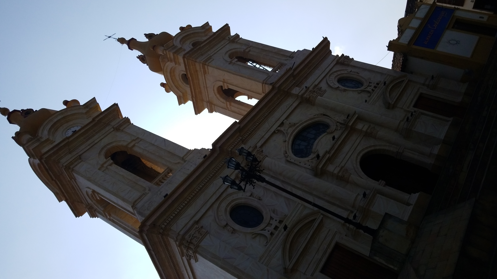

<br><details><summary>:camera:**46/IMG-20230225-WA0018.jpeg**</summary><sub> `Exif version` 0220 `OS version` G955USQU8DUD3 `Date` 2023:02:25 08:24:15 `Aperture` Not known `Brightness` 8.59 `Color space` 1 `Compression` 6`Exposure mode` 0 `Exposure time` 0.00039556962025316455 `Focal length` 4.25 `Lens model` Not known `Lens specification` Not known `Orientation` 1 `Scene type` Not known `f number` 1.7 `White balance` 0 `Sensing method` 2 `Shutter speed` 11.303</sub></details>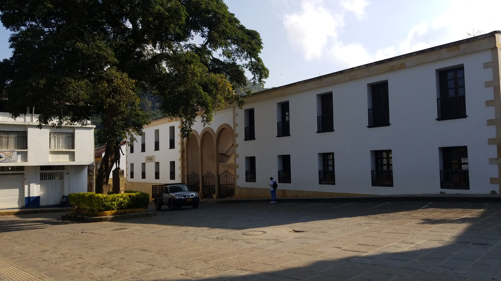

<br><details><summary>:camera:**46/IMG-20230225-WA0020.jpeg**</summary><sub> `Exif version` 0220 `OS version` G955USQU8DUD3 `Date` 2023:02:25 08:24:24 `Aperture` Not known `Brightness` 7.96 `Color space` 1 `Compression` 6`Exposure mode` 0 `Exposure time` 0.0006493506493506494 `Focal length` 4.25 `Lens model` Not known `Lens specification` Not known `Orientation` 1 `Scene type` Not known `f number` 1.7 `White balance` 0 `Sensing method` 2 `Shutter speed` 10.588</sub></details>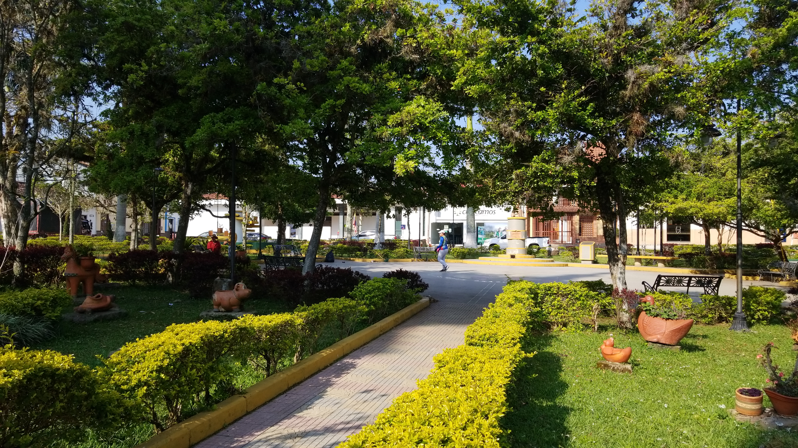

<br><details><summary>:camera:**46/IMG_0000.JPG**</summary><sub> `Exif version` Not known `OS version` 18.3.1 `Date` 2025:02:22 09:49:57 `Aperture` Not known `Brightness` 9.077479650286403 `Color space` 65535 `Compression` Not known`Exposure mode` 0 `Exposure time` 0.0003079765937788728 `Focal length` 6.86 `Lens model` iPhone 14 Pro back triple camera 6.86mm f/1.78 `Lens specification` (2.220000028611935, 9.0, 1.7799999713880652, 2.8) `Orientation` 1 `Scene type` Not known `f number` 1.78 `White balance` 0 `Sensing method` 2 `Shutter speed` 11.664782026484154</sub><sub>`Coordinates & altitude` (6.0142694444444444, -73.47695277777778, 2073.109131403118)</sub><sub> :earth_americas:`Location over` [Google Maps](http://maps.google.com/maps?q=6.0142694444444444,-73.47695277777778) or [Openstreet Map](https://www.openstreetmap.org/query?lat=6.0142694444444444&lon=-73.47695277777778)</sub></details>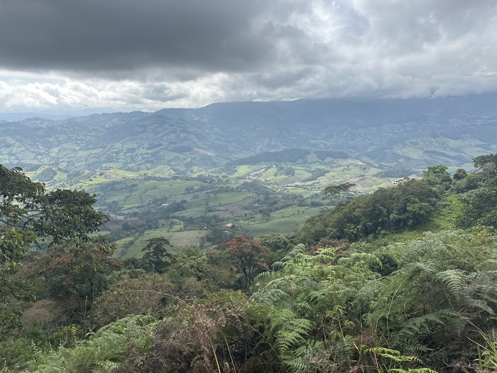

<br><details><summary>:camera:**46/IMG_0001.JPG**</summary><sub> `Exif version` Not known `OS version` 18.3.1 `Date` 2025:02:22 09:50:05 `Aperture` Not known `Brightness` 9.435151554112693 `Color space` 65535 `Compression` Not known`Exposure mode` 0 `Exposure time` 0.000259000259000259 `Focal length` 6.86 `Lens model` iPhone 14 Pro back triple camera 6.86mm f/1.78 `Lens specification` (2.220000028611935, 9.0, 1.7799999713880652, 2.8) `Orientation` 1 `Scene type` Not known `f number` 1.78 `White balance` 0 `Sensing method` 2 `Shutter speed` 11.91476028230713</sub><sub>`Coordinates & altitude` (6.014272222222222, -73.47695277777778, 2073.6564952048825)</sub><sub> :earth_americas:`Location over` [Google Maps](http://maps.google.com/maps?q=6.014272222222222,-73.47695277777778) or [Openstreet Map](https://www.openstreetmap.org/query?lat=6.014272222222222&lon=-73.47695277777778)</sub></details>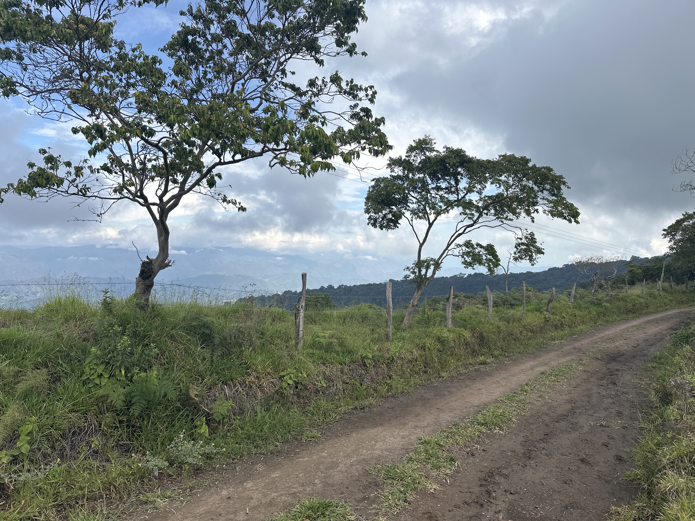

<br><details><summary>:camera:**46/IMG_0002.JPG**</summary><sub> `Exif version` Not known `OS version` 18.3.1 `Date` 2025:02:22 09:50:22 `Aperture` Not known `Brightness` 10.271771492370673 `Color space` 65535 `Compression` Not known`Exposure mode` 0 `Exposure time` 0.00015098897780462027 `Focal length` 6.86 `Lens model` iPhone 14 Pro back triple camera 6.86mm f/1.78 `Lens specification` (2.220000028611935, 9.0, 1.7799999713880652, 2.8) `Orientation` 1 `Scene type` Not known `f number` 1.78 `White balance` 0 `Sensing method` 2 `Shutter speed` 12.693163833154644</sub><sub>`Coordinates & altitude` (6.014266666666667, -73.47695277777778, 2073.7346200241254)</sub><sub> :earth_americas:`Location over` [Google Maps](http://maps.google.com/maps?q=6.014266666666667,-73.47695277777778) or [Openstreet Map](https://www.openstreetmap.org/query?lat=6.014266666666667&lon=-73.47695277777778)</sub></details>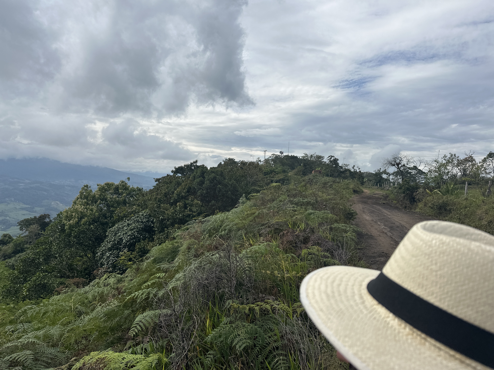

<br><details><summary>:camera:**46/IMG_0003.JPG**</summary><sub> `Exif version` Not known `OS version` 18.3.1 `Date` 2025:02:22 09:52:08 `Aperture` Not known `Brightness` 7.798509257032941 `Color space` 65535 `Compression` Not known`Exposure mode` 0 `Exposure time` 0.0008453085376162299 `Focal length` 6.86 `Lens model` iPhone 14 Pro back triple camera 6.86mm f/1.78 `Lens specification` (2.220000028611935, 9.0, 1.7799999713880652, 2.8) `Orientation` 1 `Scene type` Not known `f number` 1.78 `White balance` 0 `Sensing method` 2 `Shutter speed` 10.208761040821198</sub><sub>`Coordinates & altitude` (6.014272222222222, -73.47695277777778, 2073.77294921875)</sub><sub> :earth_americas:`Location over` [Google Maps](http://maps.google.com/maps?q=6.014272222222222,-73.47695277777778) or [Openstreet Map](https://www.openstreetmap.org/query?lat=6.014272222222222&lon=-73.47695277777778)</sub></details>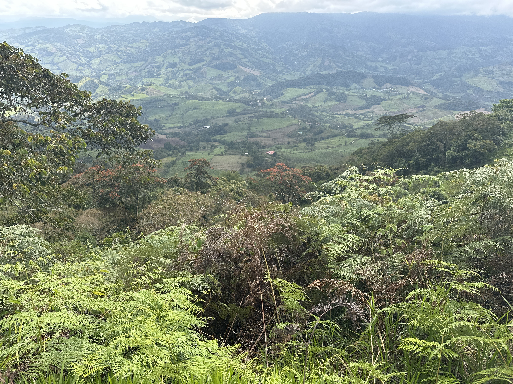

<br><details><summary>:camera:**46/IMG_0004.JPG**</summary><sub> `Exif version` Not known `OS version` 18.3.1 `Date` 2025:02:22 10:05:24 `Aperture` Not known `Brightness` 11.537386423629442 `Color space` 65535 `Compression` Not known`Exposure mode` 0 `Exposure time` 6.4e-05 `Focal length` 6.86 `Lens model` iPhone 14 Pro back triple camera 6.86mm f/1.78 `Lens specification` (2.220000028611935, 9.0, 1.7799999713880652, 2.8) `Orientation` 6 `Scene type` Not known `f number` 1.78 `White balance` 0 `Sensing method` 2 `Shutter speed` 13.931568572233173</sub><sub>`Coordinates & altitude` (6.01145, -73.47808055555556, 2090.1181640625)</sub><sub> :earth_americas:`Location over` [Google Maps](http://maps.google.com/maps?q=6.01145,-73.47808055555556) or [Openstreet Map](https://www.openstreetmap.org/query?lat=6.01145&lon=-73.47808055555556)</sub></details>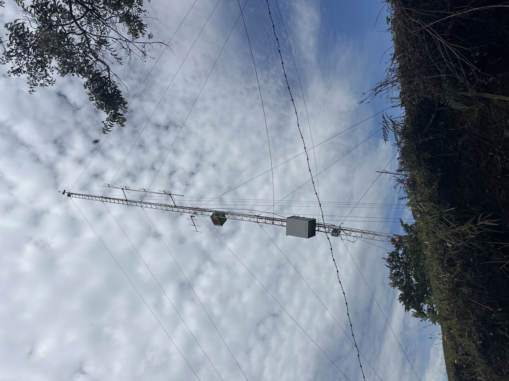

<br><details><summary>:camera:**46/IMG_0005.JPG**</summary><sub> `Exif version` Not known `OS version` 18.3.1 `Date` 2025:02:22 10:05:52 `Aperture` Not known `Brightness` 9.835073363431151 `Color space` 65535 `Compression` Not known`Exposure mode` 0 `Exposure time` 0.00019000570017100514 `Focal length` 6.86 `Lens model` iPhone 14 Pro back triple camera 6.86mm f/1.78 `Lens specification` (2.220000028611935, 9.0, 1.7799999713880652, 2.8) `Orientation` 6 `Scene type` Not known `f number` 1.78 `White balance` 0 `Sensing method` 2 `Shutter speed` 12.361712956230914</sub><sub>`Coordinates & altitude` (6.011238888888889, -73.47817222222223, 2086.9482401656314)</sub><sub> :earth_americas:`Location over` [Google Maps](http://maps.google.com/maps?q=6.011238888888889,-73.47817222222223) or [Openstreet Map](https://www.openstreetmap.org/query?lat=6.011238888888889&lon=-73.47817222222223)</sub></details>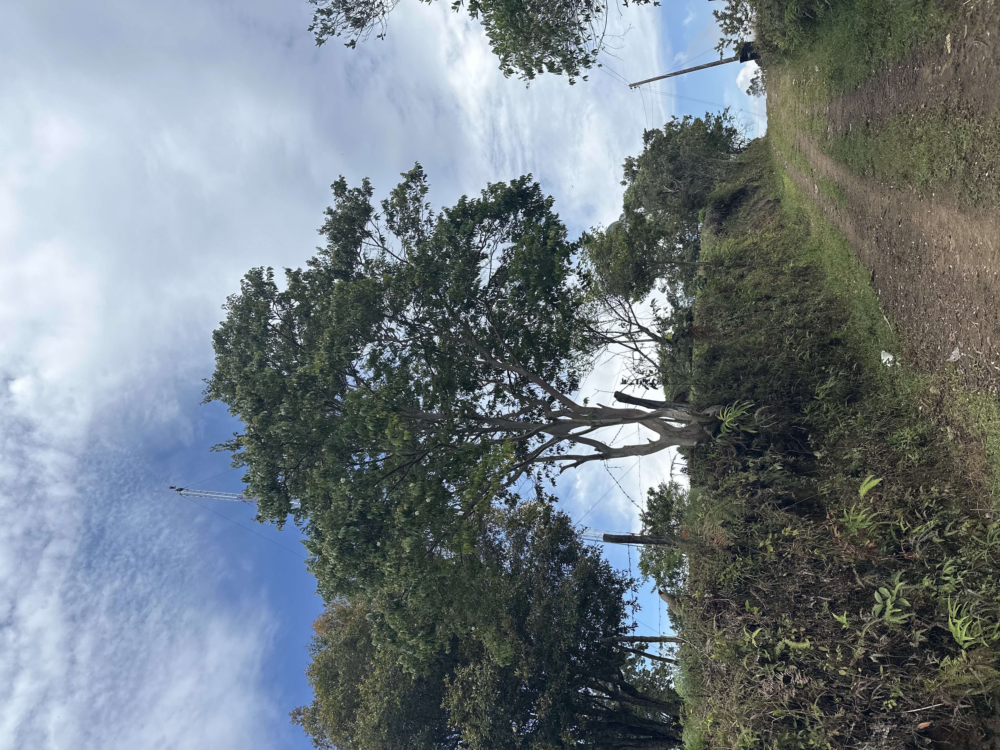

<br><details><summary>:camera:**46/IMG_0006.JPG**</summary><sub> `Exif version` Not known `OS version` 18.3.1 `Date` 2025:02:22 10:12:46 `Aperture` Not known `Brightness` 10.258325067309055 `Color space` 65535 `Compression` Not known`Exposure mode` 0 `Exposure time` 0.00014200511218403862 `Focal length` 6.86 `Lens model` iPhone 14 Pro back triple camera 6.86mm f/1.78 `Lens specification` (2.220000028611935, 9.0, 1.7799999713880652, 2.8) `Orientation` 1 `Scene type` Not known `f number` 1.78 `White balance` 0 `Sensing method` 2 `Shutter speed` 12.781821441376838</sub><sub>`Coordinates & altitude` (6.009625, -73.47894444444445, 2077.81005859375)</sub><sub> :earth_americas:`Location over` [Google Maps](http://maps.google.com/maps?q=6.009625,-73.47894444444445) or [Openstreet Map](https://www.openstreetmap.org/query?lat=6.009625&lon=-73.47894444444445)</sub></details>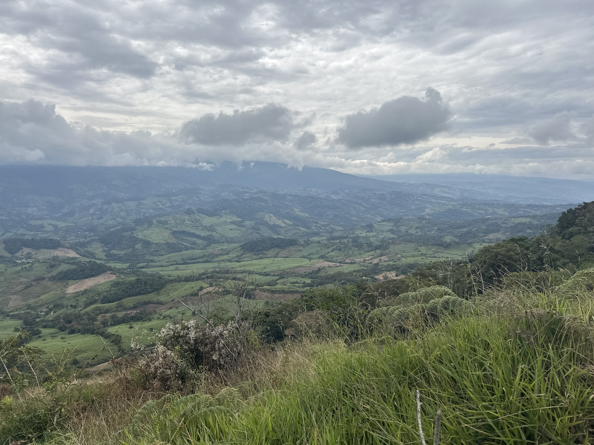

<br><details><summary>:camera:**46/IMG_0007.JPG**</summary><sub> `Exif version` Not known `OS version` 18.3.1 `Date` 2025:02:22 10:12:53 `Aperture` Not known `Brightness` 10.608845150580981 `Color space` 65535 `Compression` Not known`Exposure mode` 0 `Exposure time` 0.00011199462425803562 `Focal length` 6.86 `Lens model` iPhone 14 Pro back triple camera 6.86mm f/1.78 `Lens specification` (2.220000028611935, 9.0, 1.7799999713880652, 2.8) `Orientation` 1 `Scene type` Not known `f number` 1.78 `White balance` 0 `Sensing method` 2 `Shutter speed` 13.124213642531146</sub><sub>`Coordinates & altitude` (6.009625, -73.47894444444445, 2077.6743169398906)</sub><sub> :earth_americas:`Location over` [Google Maps](http://maps.google.com/maps?q=6.009625,-73.47894444444445) or [Openstreet Map](https://www.openstreetmap.org/query?lat=6.009625&lon=-73.47894444444445)</sub></details>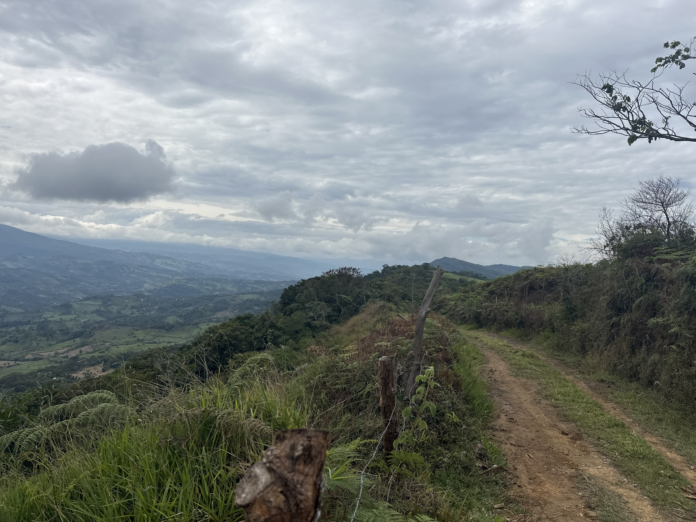

<br><details><summary>:camera:**46/IMG_0008.JPG**</summary><sub> `Exif version` Not known `OS version` 18.3.1 `Date` 2025:02:22 10:15:55 `Aperture` Not known `Brightness` 9.866761972837741 `Color space` 65535 `Compression` Not known`Exposure mode` 0 `Exposure time` 0.0006180469715698393 `Focal length` 2.22 `Lens model` iPhone 14 Pro back triple camera 2.22mm f/2.2 `Lens specification` (2.220000028611935, 9.0, 1.7799999713880652, 2.8) `Orientation` 1 `Scene type` Not known `f number` 2.2 `White balance` 0 `Sensing method` 2 `Shutter speed` 10.660105548423905</sub><sub>`Coordinates & altitude` (6.00875, -73.47968333333334, 2068.357910906298)</sub><sub> :earth_americas:`Location over` [Google Maps](http://maps.google.com/maps?q=6.00875,-73.47968333333334) or [Openstreet Map](https://www.openstreetmap.org/query?lat=6.00875&lon=-73.47968333333334)</sub></details>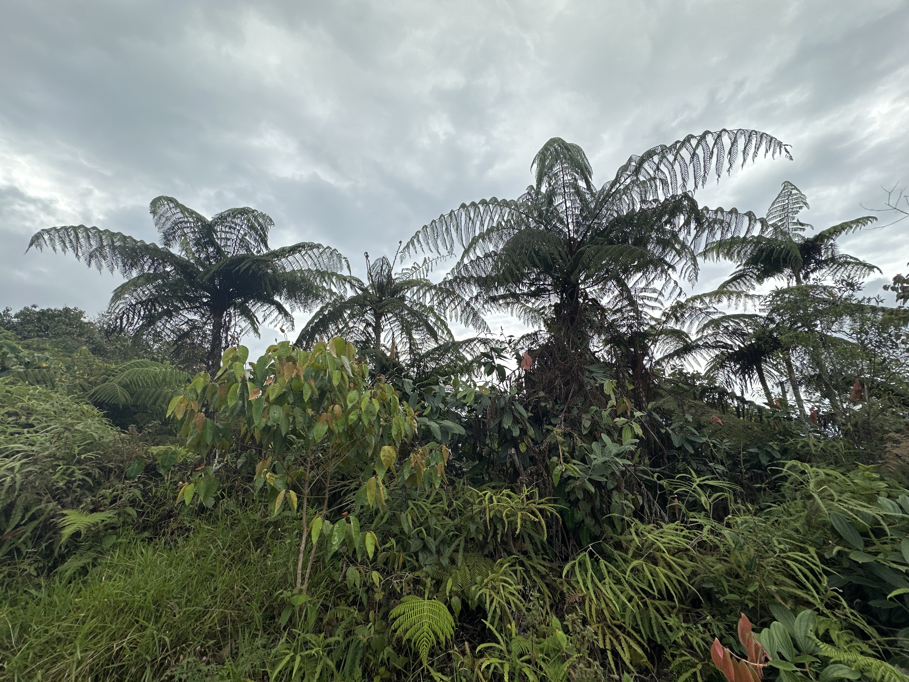

<br><details><summary>:camera:**46/IMG_0009.JPG**</summary><sub> `Exif version` Not known `OS version` 18.3.1 `Date` 2025:02:22 10:28:07 `Aperture` Not known `Brightness` 9.761288701877787 `Color space` 65535 `Compression` Not known`Exposure mode` 0 `Exposure time` 0.00020999580008399833 `Focal length` 6.86 `Lens model` iPhone 14 Pro back triple camera 6.86mm f/1.78 `Lens specification` (2.220000028611935, 9.0, 1.7799999713880652, 2.8) `Orientation` 6 `Scene type` Not known `f number` 1.78 `White balance` 0 `Sensing method` 2 `Shutter speed` 12.21732305936073</sub><sub>`Coordinates & altitude` (6.0058638888888884, -73.48356666666666, 2030.3282471157424)</sub><sub> :earth_americas:`Location over` [Google Maps](http://maps.google.com/maps?q=6.0058638888888884,-73.48356666666666) or [Openstreet Map](https://www.openstreetmap.org/query?lat=6.0058638888888884&lon=-73.48356666666666)</sub></details>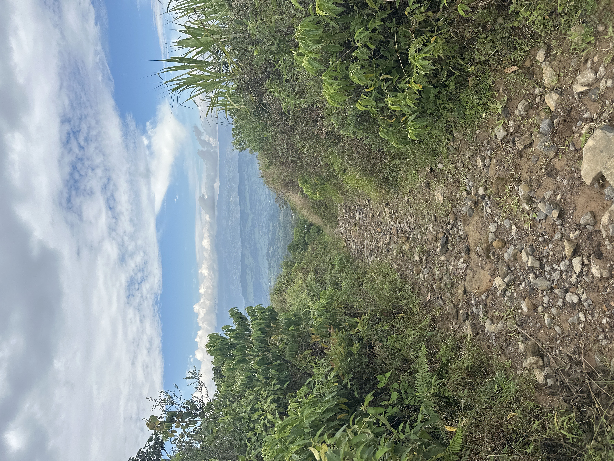

<br><details><summary>:camera:**46/IMG_0010.JPG**</summary><sub> `Exif version` Not known `OS version` 18.3.1 `Date` 2025:02:22 10:45:13 `Aperture` Not known `Brightness` 8.924365329728106 `Color space` 65535 `Compression` Not known`Exposure mode` 0 `Exposure time` 0.0015625 `Focal length` 2.22 `Lens model` iPhone 14 Pro back triple camera 2.22mm f/2.2 `Lens specification` (2.220000028611935, 9.0, 1.7799999713880652, 2.8) `Orientation` 6 `Scene type` Not known `f number` 2.2 `White balance` 0 `Sensing method` 2 `Shutter speed` 9.321466504071436</sub><sub>`Coordinates & altitude` (6.006233333333333, -73.4893111111111, 1933.970457902511)</sub><sub> :earth_americas:`Location over` [Google Maps](http://maps.google.com/maps?q=6.006233333333333,-73.4893111111111) or [Openstreet Map](https://www.openstreetmap.org/query?lat=6.006233333333333&lon=-73.4893111111111)</sub></details>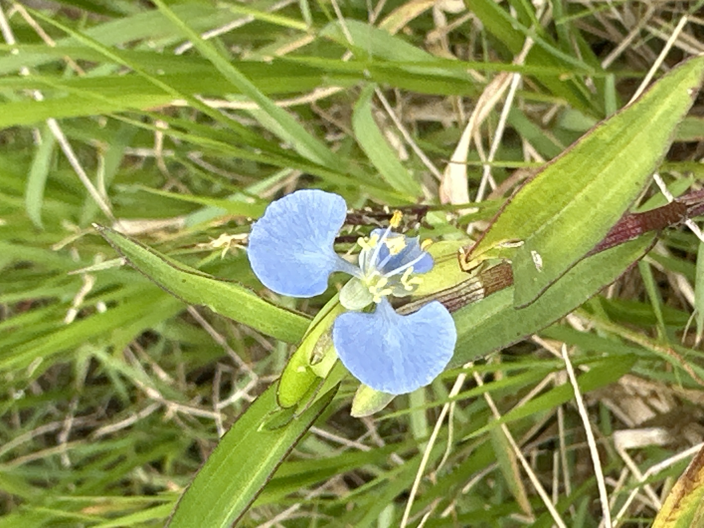

<br><details><summary>:camera:**46/IMG_0011.JPG**</summary><sub> `Exif version` Not known `OS version` 18.3.1 `Date` 2025:02:22 10:52:28 `Aperture` Not known `Brightness` 8.825171571478423 `Color space` 65535 `Compression` Not known`Exposure mode` 0 `Exposure time` 0.00039603960396039607 `Focal length` 6.86 `Lens model` iPhone 14 Pro back triple camera 6.86mm f/1.78 `Lens specification` (2.220000028611935, 9.0, 1.7799999713880652, 2.8) `Orientation` 6 `Scene type` Not known `f number` 1.78 `White balance` 0 `Sensing method` 2 `Shutter speed` 11.30221195113899</sub><sub>`Coordinates & altitude` (6.007113888888889, -73.49183611111111, 1879.2053231939165)</sub><sub> :earth_americas:`Location over` [Google Maps](http://maps.google.com/maps?q=6.007113888888889,-73.49183611111111) or [Openstreet Map](https://www.openstreetmap.org/query?lat=6.007113888888889&lon=-73.49183611111111)</sub></details>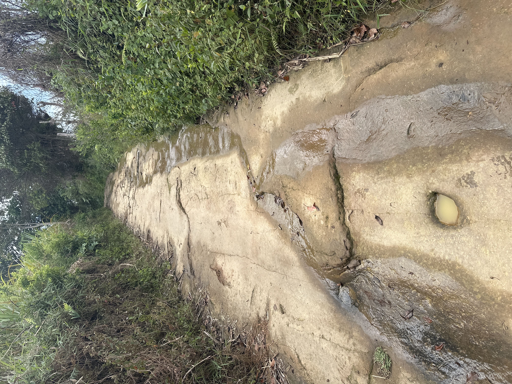

<br><details><summary>:camera:**46/IMG_0012.JPG**</summary><sub> `Exif version` Not known `OS version` 18.3.1 `Date` 2025:02:22 10:52:35 `Aperture` Not known `Brightness` 8.475966319697672 `Color space` 65535 `Compression` Not known`Exposure mode` 0 `Exposure time` 0.0005319148936170213 `Focal length` 6.86 `Lens model` iPhone 14 Pro back triple camera 6.86mm f/1.78 `Lens specification` (2.220000028611935, 9.0, 1.7799999713880652, 2.8) `Orientation` 6 `Scene type` Not known `f number` 1.78 `White balance` 0 `Sensing method` 2 `Shutter speed` 10.876286134247918</sub><sub>`Coordinates & altitude` (6.0071055555555555, -73.49182777777777, 1878.201048951049)</sub><sub> :earth_americas:`Location over` [Google Maps](http://maps.google.com/maps?q=6.0071055555555555,-73.49182777777777) or [Openstreet Map](https://www.openstreetmap.org/query?lat=6.0071055555555555&lon=-73.49182777777777)</sub></details>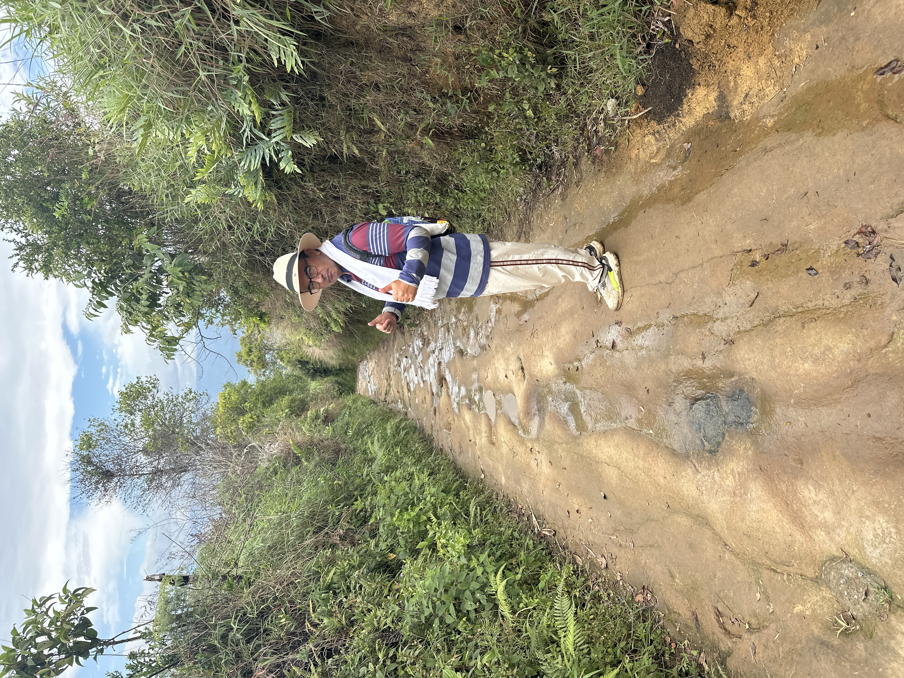

<br><details><summary>:camera:**46/IMG_0013.JPG**</summary><sub> `Exif version` Not known `OS version` 18.3.1 `Date` 2025:02:22 11:06:46 `Aperture` Not known `Brightness` 8.75756067205974 `Color space` 65535 `Compression` Not known`Exposure mode` 0 `Exposure time` 0.0004149377593360996 `Focal length` 6.86 `Lens model` iPhone 14 Pro back triple camera 6.86mm f/1.78 `Lens specification` (2.220000028611935, 9.0, 1.7799999713880652, 2.8) `Orientation` 6 `Scene type` Not known `f number` 1.78 `White balance` 0 `Sensing method` 2 `Shutter speed` 11.234601043997017</sub><sub>`Coordinates & altitude` (6.011591666666667, -73.49368888888888, 1820.7719714964371)</sub><sub> :earth_americas:`Location over` [Google Maps](http://maps.google.com/maps?q=6.011591666666667,-73.49368888888888) or [Openstreet Map](https://www.openstreetmap.org/query?lat=6.011591666666667&lon=-73.49368888888888)</sub></details>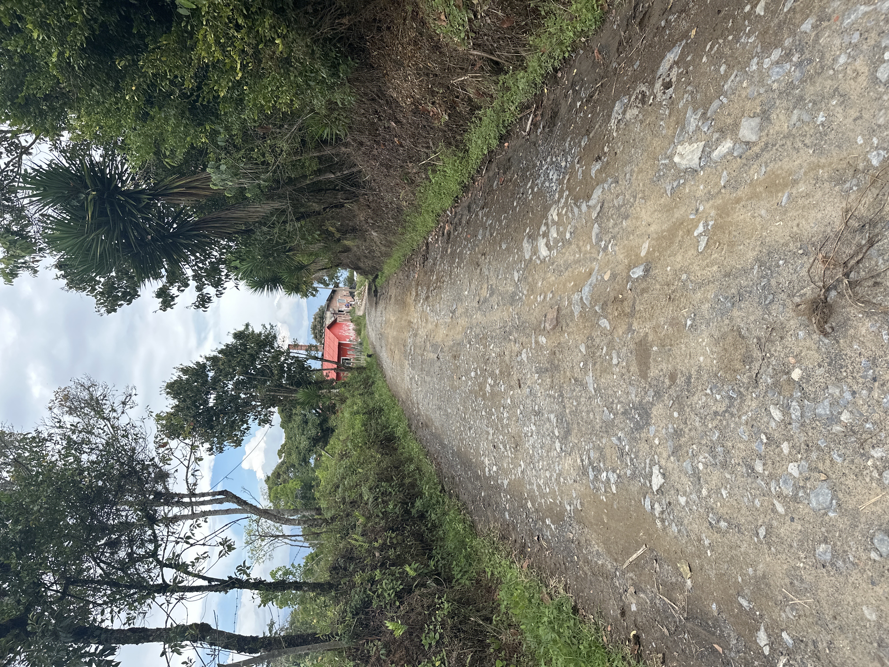

<br><details><summary>:camera:**46/IMG_0014.JPG**</summary><sub> `Exif version` Not known `OS version` 18.3.1 `Date` 2025:02:22 11:07:49 `Aperture` Not known `Brightness` 10.701643335362142 `Color space` 65535 `Compression` Not known`Exposure mode` 0 `Exposure time` 0.0001219958521410272 `Focal length` 6.86 `Lens model` iPhone 14 Pro back triple camera 6.86mm f/1.78 `Lens specification` (2.220000028611935, 9.0, 1.7799999713880652, 2.8) `Orientation` 6 `Scene type` Not known `f number` 1.78 `White balance` 0 `Sensing method` 2 `Shutter speed` 13.000831231368952</sub><sub>`Coordinates & altitude` (6.0122527777777774, -73.49396388888889, 1815.0139165009941)</sub><sub> :earth_americas:`Location over` [Google Maps](http://maps.google.com/maps?q=6.0122527777777774,-73.49396388888889) or [Openstreet Map](https://www.openstreetmap.org/query?lat=6.0122527777777774&lon=-73.49396388888889)</sub></details>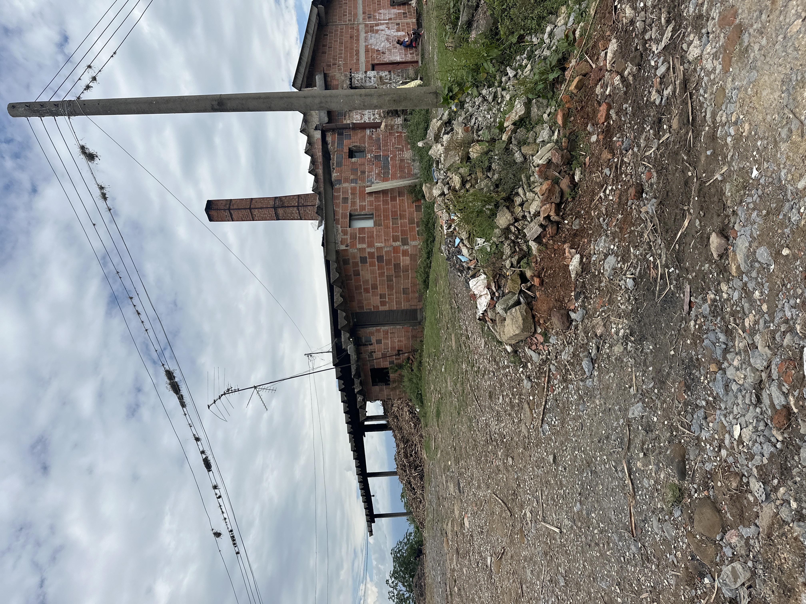

<br><details><summary>:camera:**46/IMG_0015.JPG**</summary><sub> `Exif version` Not known `OS version` 18.3.1 `Date` 2025:02:22 11:15:05 `Aperture` Not known `Brightness` 9.739553960522942 `Color space` 65535 `Compression` Not known`Exposure mode` 0 `Exposure time` 0.0002 `Focal length` 6.86 `Lens model` iPhone 14 Pro back triple camera 6.86mm f/1.78 `Lens specification` (2.220000028611935, 9.0, 1.7799999713880652, 2.8) `Orientation` 6 `Scene type` Not known `f number` 1.78 `White balance` 0 `Sensing method` 2 `Shutter speed` 12.287712391214257</sub><sub>`Coordinates & altitude` (6.016419444444445, -73.49346111111112, 1771.462890625)</sub><sub> :earth_americas:`Location over` [Google Maps](http://maps.google.com/maps?q=6.016419444444445,-73.49346111111112) or [Openstreet Map](https://www.openstreetmap.org/query?lat=6.016419444444445&lon=-73.49346111111112)</sub></details>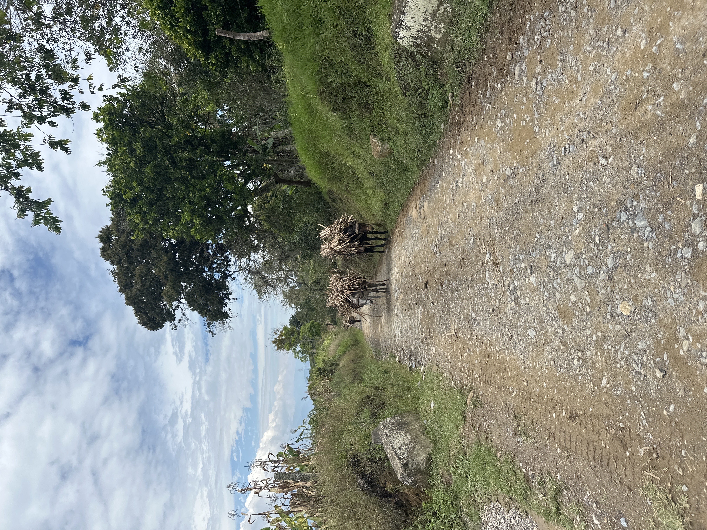

<br><details><summary>:camera:**46/IMG_0016.JPG**</summary><sub> `Exif version` Not known `OS version` 18.3.1 `Date` 2025:02:22 11:15:12 `Aperture` Not known `Brightness` 8.343435391800726 `Color space` 65535 `Compression` Not known`Exposure mode` 0 `Exposure time` 0.0005518763796909492 `Focal length` 6.86 `Lens model` iPhone 14 Pro back triple camera 6.86mm f/1.78 `Lens specification` (2.220000028611935, 9.0, 1.7799999713880652, 2.8) `Orientation` 6 `Scene type` Not known `f number` 1.78 `White balance` 0 `Sensing method` 2 `Shutter speed` 10.823044116618892</sub><sub>`Coordinates & altitude` (6.016419444444445, -73.49346111111112, 1771.1480730223125)</sub><sub> :earth_americas:`Location over` [Google Maps](http://maps.google.com/maps?q=6.016419444444445,-73.49346111111112) or [Openstreet Map](https://www.openstreetmap.org/query?lat=6.016419444444445&lon=-73.49346111111112)</sub></details>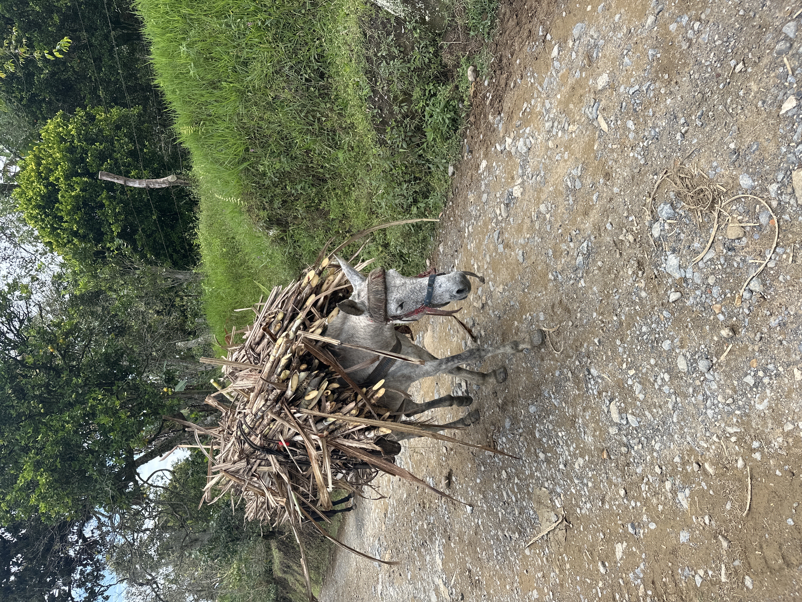

<br><details><summary>:camera:**46/IMG_0017.JPG**</summary><sub> `Exif version` Not known `OS version` 18.3.1 `Date` 2025:02:22 11:15:22 `Aperture` Not known `Brightness` 8.015283685386779 `Color space` 65535 `Compression` Not known`Exposure mode` 0 `Exposure time` 0.0006101281269066504 `Focal length` 6.86 `Lens model` iPhone 14 Pro back triple camera 6.86mm f/1.78 `Lens specification` (2.220000028611935, 9.0, 1.7799999713880652, 2.8) `Orientation` 6 `Scene type` Not known `f number` 1.78 `White balance` 0 `Sensing method` 2 `Shutter speed` 10.67890314020345</sub><sub>`Coordinates & altitude` (6.0165, -73.4934138888889, 1768.89697265625)</sub><sub> :earth_americas:`Location over` [Google Maps](http://maps.google.com/maps?q=6.0165,-73.4934138888889) or [Openstreet Map](https://www.openstreetmap.org/query?lat=6.0165&lon=-73.4934138888889)</sub></details>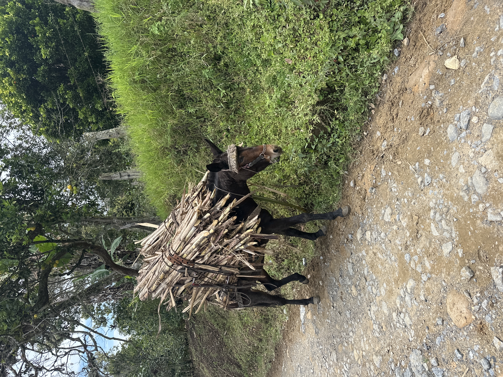

<br><details><summary>:camera:**46/IMG_0018.JPG**</summary><sub> `Exif version` Not known `OS version` 18.3.1 `Date` 2025:02:22 11:15:44 `Aperture` Not known `Brightness` 9.167683702008645 `Color space` 65535 `Compression` Not known`Exposure mode` 0 `Exposure time` 0.0004050222762251924 `Focal length` 6.86 `Lens model` iPhone 14 Pro back triple camera 6.86mm f/1.78 `Lens specification` (2.220000028611935, 9.0, 1.7799999713880652, 2.8) `Orientation` 6 `Scene type` Not known `f number` 1.78 `White balance` 0 `Sensing method` 2 `Shutter speed` 11.269790476190476</sub><sub>`Coordinates & altitude` (6.016625, -73.49339444444445, 1767.708984375)</sub><sub> :earth_americas:`Location over` [Google Maps](http://maps.google.com/maps?q=6.016625,-73.49339444444445) or [Openstreet Map](https://www.openstreetmap.org/query?lat=6.016625&lon=-73.49339444444445)</sub></details>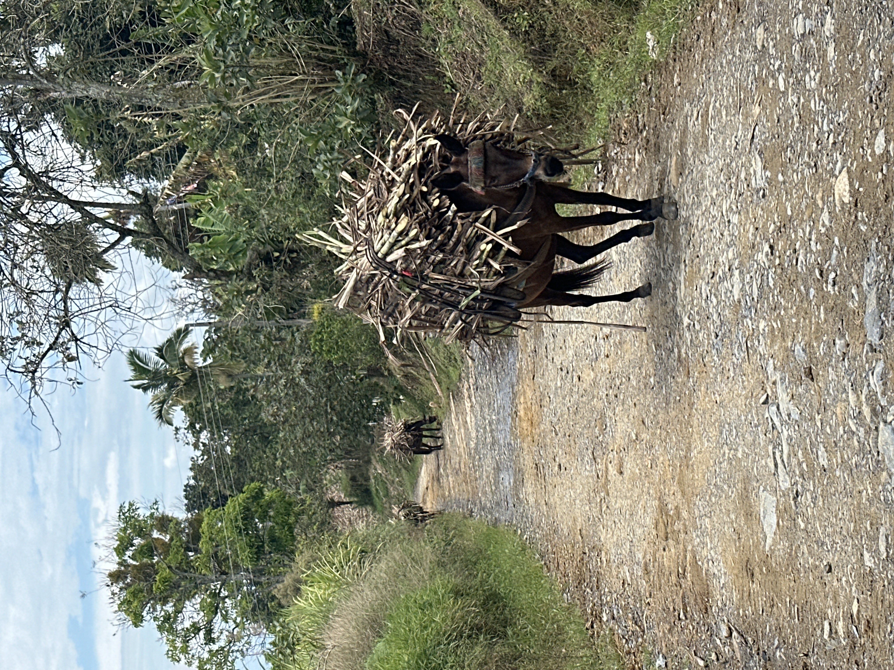

<br><details><summary>:camera:**46/IMG_0343.JPEG**</summary><sub> `Exif version` 0232 `OS version` 17.4.1 `Date` 2024:03:28 10:08:23 `Aperture` Not known `Brightness` 10.676552953156822 `Color space` 65535 `Compression` Not known`Exposure mode` 0 `Exposure time` 0.000177999288002848 `Focal length` 5.1 `Lens model` iPhone 12 Pro Max back triple camera 5.1mm f/1.6 `Lens specification` (1.5399999618512084, 7.5, 1.6, 2.4) `Orientation` 1 `Scene type` Not known `f number` 1.6 `White balance` 0 `Sensing method` 2 `Shutter speed` 12.455835145490317</sub><sub>`Coordinates & altitude` (6.0263277777777775, -73.6167, 1630.8516853932583)</sub><sub> :earth_americas:`Location over` [Google Maps](http://maps.google.com/maps?q=6.0263277777777775,-73.6167) or [Openstreet Map](https://www.openstreetmap.org/query?lat=6.0263277777777775&lon=-73.6167)</sub></details>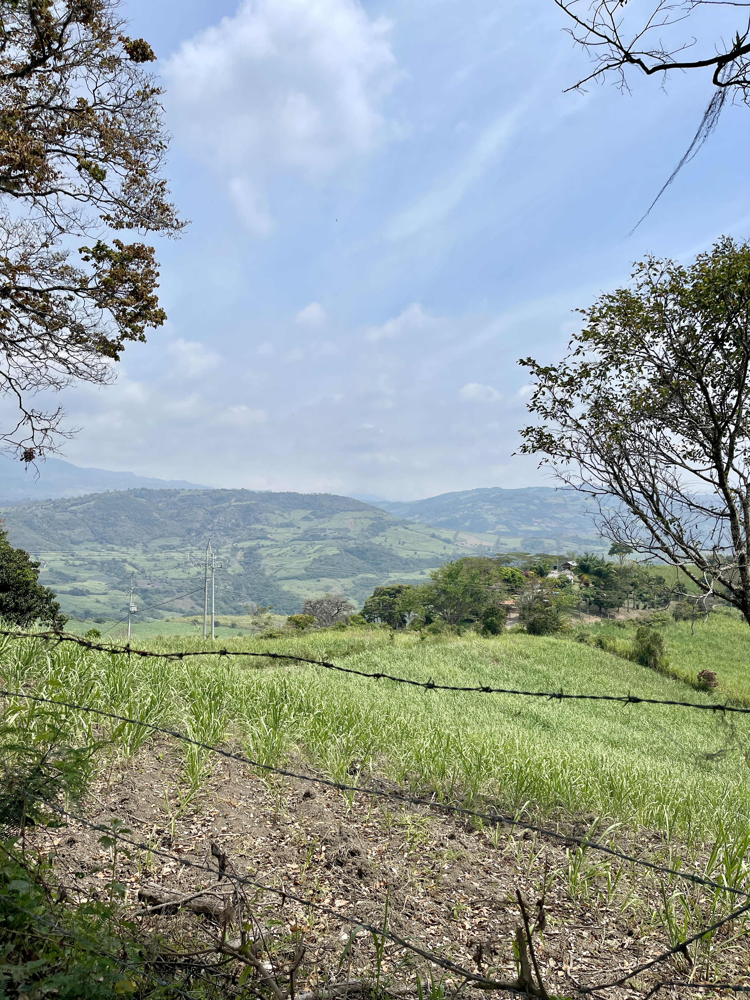

<br><details><summary>:camera:**46/IMG_0344.JPEG**</summary><sub> `Exif version` 0232 `OS version` 17.4.1 `Date` 2024:03:28 10:08:26 `Aperture` Not known `Brightness` 10.200387925809189 `Color space` 65535 `Compression` Not known`Exposure mode` 0 `Exposure time` 0.00021199915200339198 `Focal length` 5.1 `Lens model` iPhone 12 Pro Max back triple camera 5.1mm f/1.6 `Lens specification` (1.5399999618512084, 7.5, 1.6, 2.4) `Orientation` 1 `Scene type` Not known `f number` 1.6 `White balance` 0 `Sensing method` 2 `Shutter speed` 12.203648118217501</sub><sub>`Coordinates & altitude` (6.026291666666666, -73.61673055555555, 1652.975221238938)</sub><sub> :earth_americas:`Location over` [Google Maps](http://maps.google.com/maps?q=6.026291666666666,-73.61673055555555) or [Openstreet Map](https://www.openstreetmap.org/query?lat=6.026291666666666&lon=-73.61673055555555)</sub></details>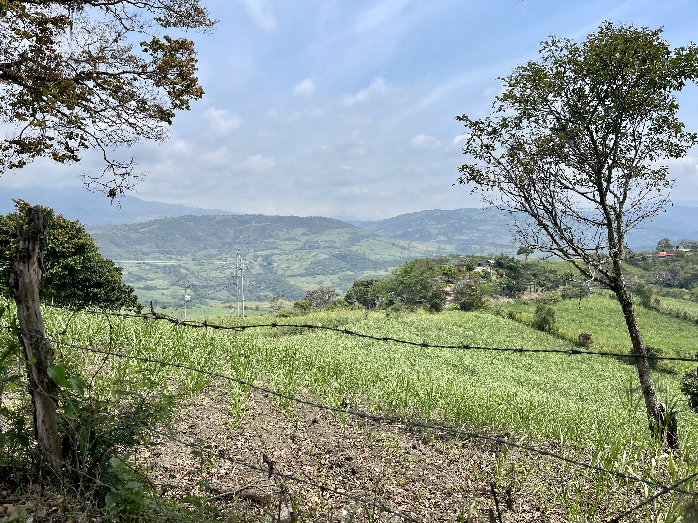

<br><details><summary>:camera:**46/IMG_0345.JPG**</summary><sub> `Exif version` 0232 `OS version` 17.4.1 `Date` 2024:03:28 10:08:32 `Aperture` Not known `Brightness` 9.345937129300118 `Color space` 65535 `Compression` 6`Exposure mode` 0 `Exposure time` 0.0003850596842510589 `Focal length` 5.1 `Lens model` iPhone 12 Pro Max back triple camera 5.1mm f/1.6 `Lens specification` (1.5399999618512084, 7.5, 1.6, 2.4) `Orientation` 1 `Scene type` Not known `f number` 1.6 `White balance` 0 `Sensing method` 2 `Shutter speed` 11.342853930057348</sub><sub>`Coordinates & altitude` (6.026291666666666, -73.61671388888888, 1650.3572984749455)</sub><sub> :earth_americas:`Location over` [Google Maps](http://maps.google.com/maps?q=6.026291666666666,-73.61671388888888) or [Openstreet Map](https://www.openstreetmap.org/query?lat=6.026291666666666&lon=-73.61671388888888)</sub></details>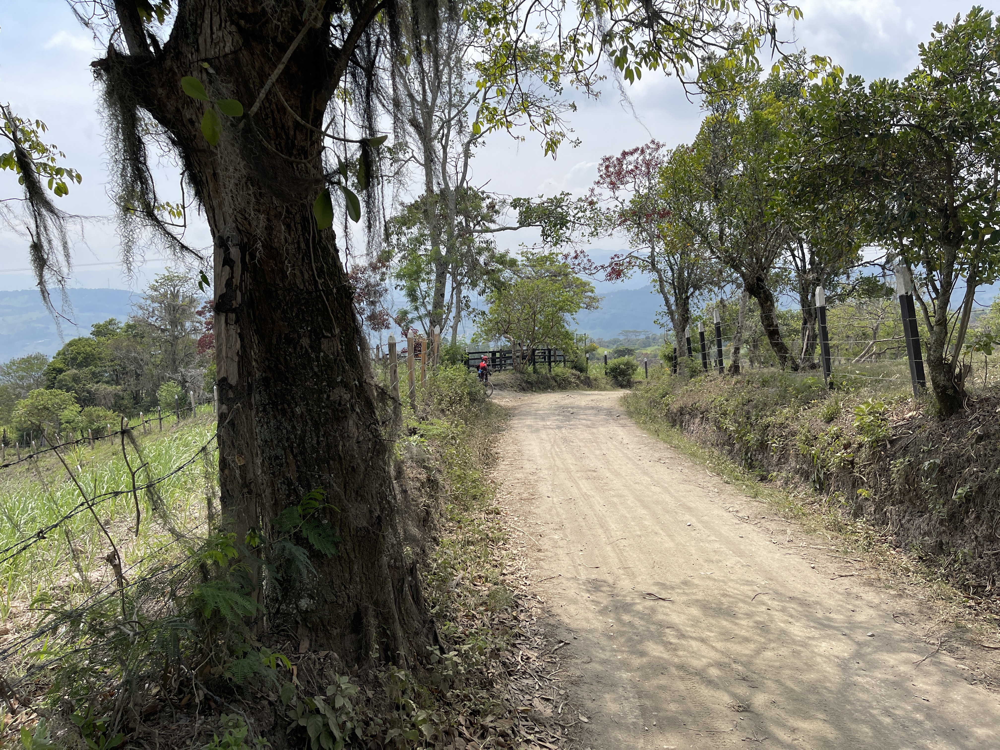

<br><details><summary>:camera:**46/IMG_0346.JPG**</summary><sub> `Exif version` 0232 `OS version` 17.4.1 `Date` 2024:03:28 10:08:37 `Aperture` Not known `Brightness` 10.386783439490445 `Color space` 65535 `Compression` 6`Exposure mode` 0 `Exposure time` 0.00018601190476190475 `Focal length` 5.1 `Lens model` iPhone 12 Pro Max back triple camera 5.1mm f/1.6 `Lens specification` (1.5399999618512084, 7.5, 1.6, 2.4) `Orientation` 1 `Scene type` Not known `f number` 1.6 `White balance` 0 `Sensing method` 2 `Shutter speed` 12.392409761529182</sub><sub>`Coordinates & altitude` (6.026302777777778, -73.61671388888888, 1649.95593220339)</sub><sub> :earth_americas:`Location over` [Google Maps](http://maps.google.com/maps?q=6.026302777777778,-73.61671388888888) or [Openstreet Map](https://www.openstreetmap.org/query?lat=6.026302777777778&lon=-73.61671388888888)</sub></details>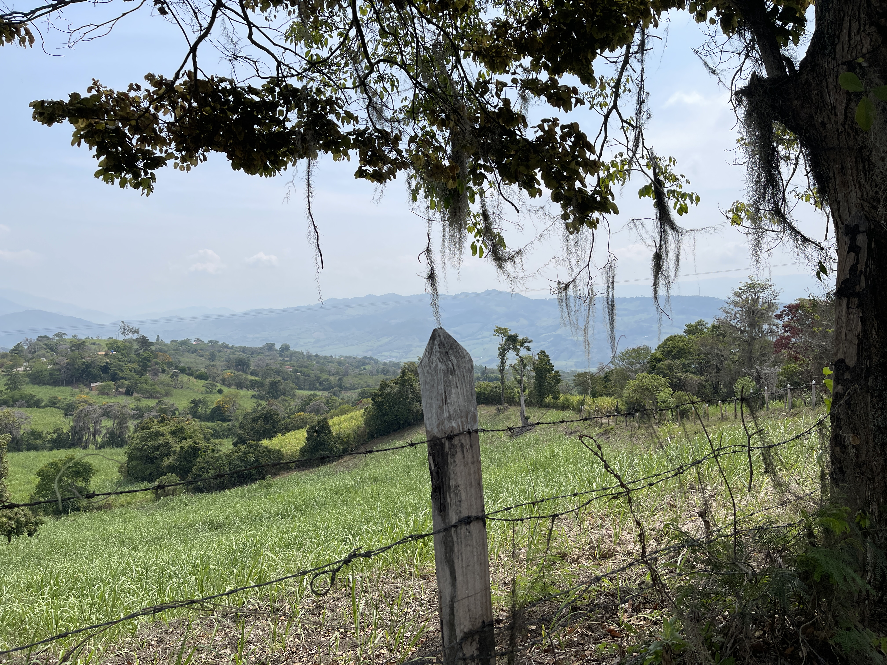

<br><details><summary>:camera:**46/IMG_0348.JPG**</summary><sub> `Exif version` 0232 `OS version` 17.4.1 `Date` 2024:03:28 10:18:51 `Aperture` Not known `Brightness` 9.786617042723114 `Color space` 65535 `Compression` 6`Exposure mode` 0 `Exposure time` 0.00026399155227032733 `Focal length` 5.1 `Lens model` iPhone 12 Pro Max back triple camera 5.1mm f/1.6 `Lens specification` (1.5399999618512084, 7.5, 1.6, 2.4) `Orientation` 1 `Scene type` Not known `f number` 1.6 `White balance` 0 `Sensing method` 2 `Shutter speed` 11.887174436419349</sub><sub>`Coordinates & altitude` (6.026477777777778, -73.61723333333333, 1630.8890392422193)</sub><sub> :earth_americas:`Location over` [Google Maps](http://maps.google.com/maps?q=6.026477777777778,-73.61723333333333) or [Openstreet Map](https://www.openstreetmap.org/query?lat=6.026477777777778&lon=-73.61723333333333)</sub></details>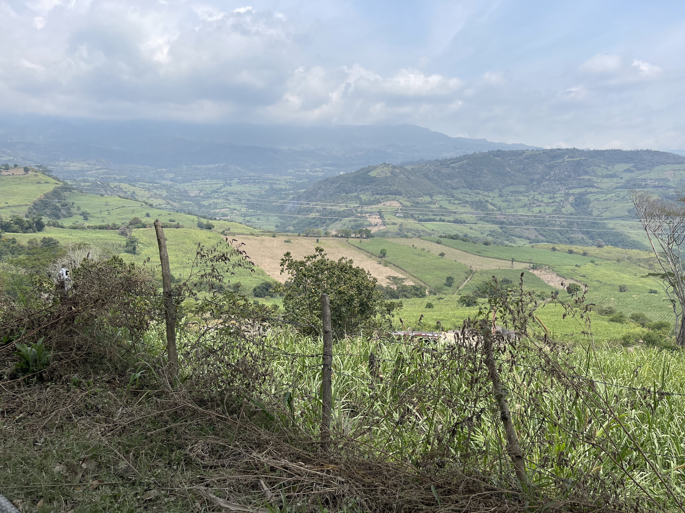

<br><details><summary>:camera:**46/IMG_0351.JPG**</summary><sub> `Exif version` 0232 `OS version` 17.4.1 `Date` 2024:03:28 10:19:25 `Aperture` Not known `Brightness` 9.793851760696706 `Color space` 65535 `Compression` 6`Exposure mode` 0 `Exposure time` 0.000273000273000273 `Focal length` 5.1 `Lens model` iPhone 12 Pro Max back triple camera 5.1mm f/1.6 `Lens specification` (1.5399999618512084, 7.5, 1.6, 2.4) `Orientation` 1 `Scene type` Not known `f number` 1.6 `White balance` 0 `Sensing method` 2 `Shutter speed` 11.838811420982736</sub><sub>`Coordinates & altitude` (6.026466666666667, -73.61718055555555, 1655.5815561959655)</sub><sub> :earth_americas:`Location over` [Google Maps](http://maps.google.com/maps?q=6.026466666666667,-73.61718055555555) or [Openstreet Map](https://www.openstreetmap.org/query?lat=6.026466666666667&lon=-73.61718055555555)</sub></details>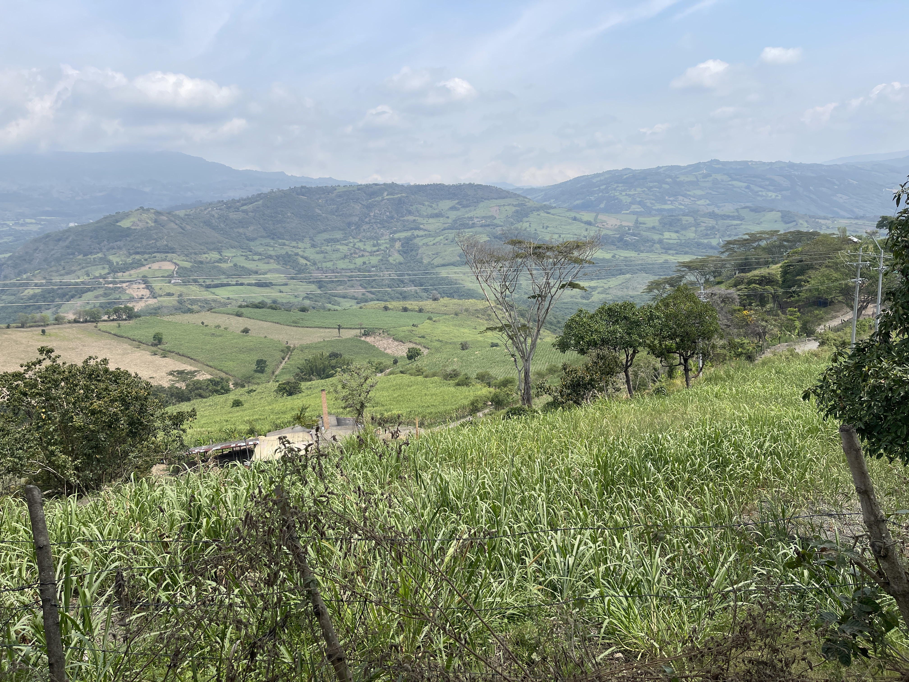

<br><details><summary>:camera:**46/IMG_0363.JPG**</summary><sub> `Exif version` 0232 `OS version` 17.4.1 `Date` 2024:03:28 11:06:43 `Aperture` Not known `Brightness` 10.196511947267235 `Color space` 65535 `Compression` 6`Exposure mode` 0 `Exposure time` 0.0005889281507656066 `Focal length` 7.5 `Lens model` iPhone 12 Pro Max back triple camera 7.5mm f/2.2 `Lens specification` (1.5399999618512084, 7.5, 1.6, 2.4) `Orientation` 1 `Scene type` Not known `f number` 2.2 `White balance` 0 `Sensing method` 2 `Shutter speed` 10.729444741057128</sub><sub>`Coordinates & altitude` (6.024161111111111, -73.62272777777777, 1691.3050541516245)</sub><sub> :earth_americas:`Location over` [Google Maps](http://maps.google.com/maps?q=6.024161111111111,-73.62272777777777) or [Openstreet Map](https://www.openstreetmap.org/query?lat=6.024161111111111&lon=-73.62272777777777)</sub></details>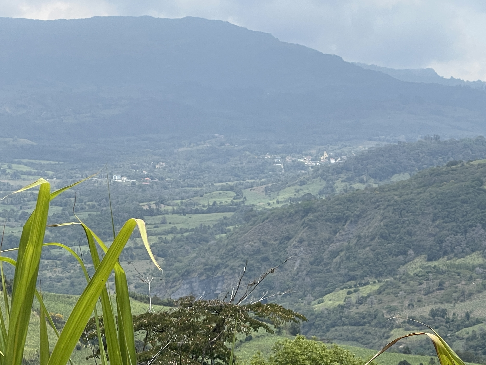

<br><details><summary>:camera:**46/IMG_0364.JPG**</summary><sub> `Exif version` 0232 `OS version` 17.4.1 `Date` 2024:03:28 11:06:47 `Aperture` Not known `Brightness` 10.370389021780184 `Color space` 65535 `Compression` 6`Exposure mode` 0 `Exposure time` 0.000501002004008016 `Focal length` 1.54 `Lens model` iPhone 12 Pro Max back triple camera 1.54mm f/2.4 `Lens specification` (1.5399999618512084, 7.5, 1.6, 2.4) `Orientation` 1 `Scene type` Not known `f number` 2.4 `White balance` 0 `Sensing method` 2 `Shutter speed` 10.962901772303995</sub><sub>`Coordinates & altitude` (6.024161111111111, -73.62272777777777, 1691.9876712328767)</sub><sub> :earth_americas:`Location over` [Google Maps](http://maps.google.com/maps?q=6.024161111111111,-73.62272777777777) or [Openstreet Map](https://www.openstreetmap.org/query?lat=6.024161111111111&lon=-73.62272777777777)</sub></details>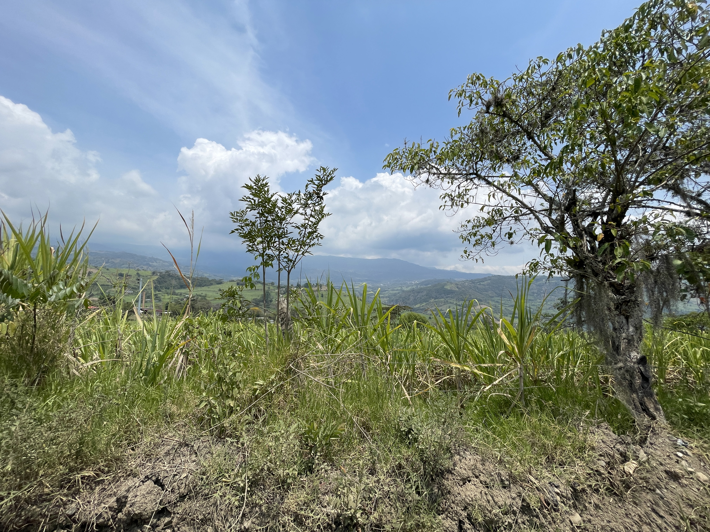

<br><details><summary>:camera:**46/IMG_0365.JPG**</summary><sub> `Exif version` 0232 `OS version` 17.4.1 `Date` 2024:03:28 11:06:52 `Aperture` Not known `Brightness` 10.606632852126415 `Color space` 65535 `Compression` 6`Exposure mode` 0 `Exposure time` 0.000501002004008016 `Focal length` 1.54 `Lens model` iPhone 12 Pro Max back triple camera 1.54mm f/2.4 `Lens specification` (1.5399999618512084, 7.5, 1.6, 2.4) `Orientation` 1 `Scene type` Not known `f number` 2.4 `White balance` 0 `Sensing method` 2 `Shutter speed` 10.962901772303995</sub><sub>`Coordinates & altitude` (6.024152777777778, -73.62271944444444, 1692.691771269177)</sub><sub> :earth_americas:`Location over` [Google Maps](http://maps.google.com/maps?q=6.024152777777778,-73.62271944444444) or [Openstreet Map](https://www.openstreetmap.org/query?lat=6.024152777777778&lon=-73.62271944444444)</sub></details>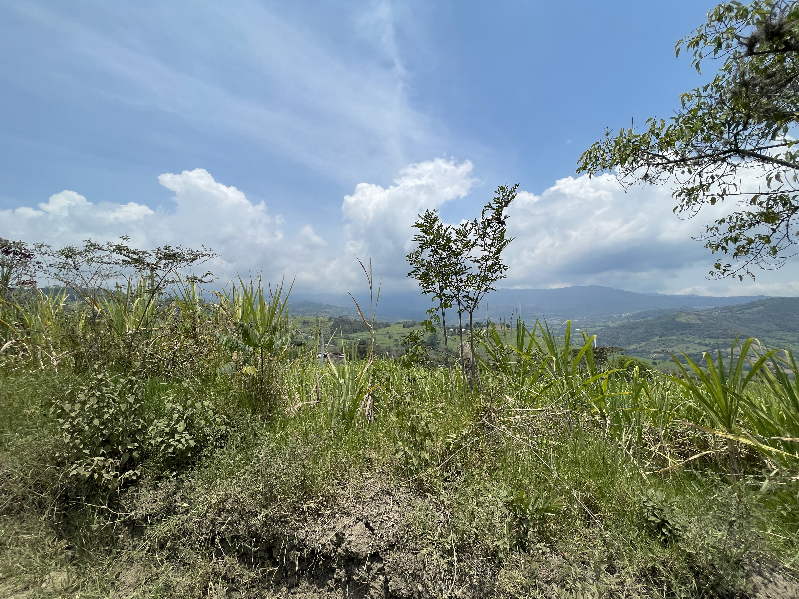

<br><details><summary>:camera:**46/IMG_0370.JPG**</summary><sub> `Exif version` 0232 `OS version` 17.4.1 `Date` 2024:03:28 12:44:18 `Aperture` Not known `Brightness` 9.970724599284674 `Color space` 65535 `Compression` 6`Exposure mode` 0 `Exposure time` 0.000273000273000273 `Focal length` 5.1 `Lens model` iPhone 12 Pro Max back triple camera 5.1mm f/1.6 `Lens specification` (1.5399999618512084, 7.5, 1.6, 2.4) `Orientation` 6 `Scene type` Not known `f number` 1.6 `White balance` 0 `Sensing method` 2 `Shutter speed` 11.838811420982736</sub><sub>`Coordinates & altitude` (6.025416666666667, -73.57309722222222, 1491.4733333333334)</sub><sub> :earth_americas:`Location over` [Google Maps](http://maps.google.com/maps?q=6.025416666666667,-73.57309722222222) or [Openstreet Map](https://www.openstreetmap.org/query?lat=6.025416666666667&lon=-73.57309722222222)</sub></details>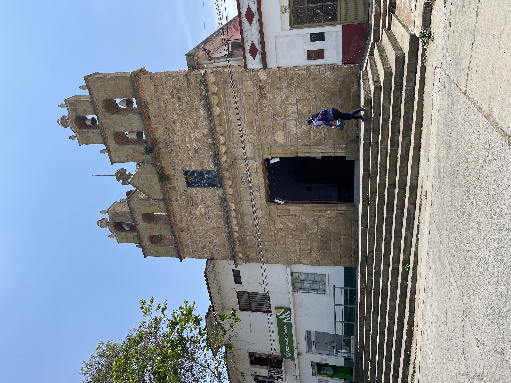

<br><details><summary>:camera:**46/IMG_0371.JPG**</summary><sub> `Exif version` 0232 `OS version` 17.4.1 `Date` 2024:03:28 12:44:23 `Aperture` Not known `Brightness` 9.836657735437134 `Color space` 65535 `Compression` 6`Exposure mode` 0 `Exposure time` 0.00025497195308516065 `Focal length` 5.1 `Lens model` iPhone 12 Pro Max back triple camera 5.1mm f/1.6 `Lens specification` (1.5399999618512084, 7.5, 1.6, 2.4) `Orientation` 1 `Scene type` Not known `f number` 1.6 `White balance` 0 `Sensing method` 2 `Shutter speed` 11.93721513217867</sub><sub>`Coordinates & altitude` (6.025338888888889, -73.57287777777778, 1524.8473581213307)</sub><sub> :earth_americas:`Location over` [Google Maps](http://maps.google.com/maps?q=6.025338888888889,-73.57287777777778) or [Openstreet Map](https://www.openstreetmap.org/query?lat=6.025338888888889&lon=-73.57287777777778)</sub></details>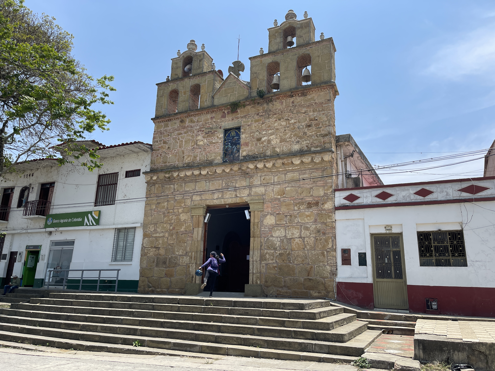

<br><details><summary>:camera:**46/IMG_0372.JPG**</summary><sub> `Exif version` 0232 `OS version` 17.4.1 `Date` 2024:03:28 12:44:28 `Aperture` Not known `Brightness` 9.325125789530029 `Color space` 65535 `Compression` 6`Exposure mode` 0 `Exposure time` 0.0003929273084479371 `Focal length` 5.1 `Lens model` iPhone 12 Pro Max back triple camera 5.1mm f/1.6 `Lens specification` (1.5399999618512084, 7.5, 1.6, 2.4) `Orientation` 1 `Scene type` Not known `f number` 1.6 `White balance` 0 `Sensing method` 2 `Shutter speed` 11.31318306010929</sub><sub>`Coordinates & altitude` (6.025325, -73.57288333333332, 1528.91864608076)</sub><sub> :earth_americas:`Location over` [Google Maps](http://maps.google.com/maps?q=6.025325,-73.57288333333332) or [Openstreet Map](https://www.openstreetmap.org/query?lat=6.025325&lon=-73.57288333333332)</sub></details>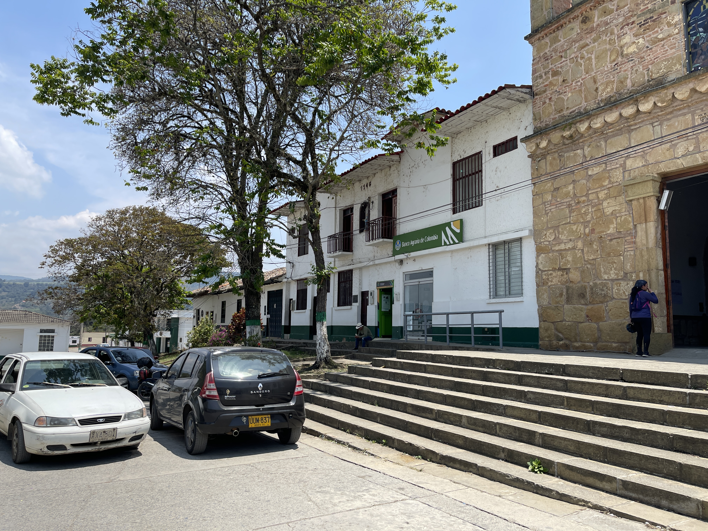

<br><details><summary>:camera:**46/IMG_0373.JPG**</summary><sub> `Exif version` 0232 `OS version` 17.4.1 `Date` 2024:03:28 12:44:44 `Aperture` Not known `Brightness` 9.959296606000985 `Color space` 65535 `Compression` 6`Exposure mode` 0 `Exposure time` 0.0002809778027535825 `Focal length` 5.1 `Lens model` iPhone 12 Pro Max back triple camera 5.1mm f/1.6 `Lens specification` (1.5399999618512084, 7.5, 1.6, 2.4) `Orientation` 1 `Scene type` Not known `f number` 1.6 `White balance` 0 `Sensing method` 2 `Shutter speed` 11.797142238579779</sub><sub>`Coordinates & altitude` (6.025277777777777, -73.57290555555555, 1531.5374211000901)</sub><sub> :earth_americas:`Location over` [Google Maps](http://maps.google.com/maps?q=6.025277777777777,-73.57290555555555) or [Openstreet Map](https://www.openstreetmap.org/query?lat=6.025277777777777&lon=-73.57290555555555)</sub></details>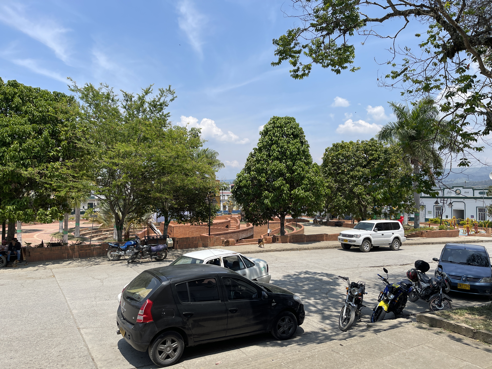

<br><details><summary>:camera:**46/IMG_0374.JPG**</summary><sub> `Exif version` 0232 `OS version` 17.4.1 `Date` 2024:03:28 12:44:46 `Aperture` Not known `Brightness` 10.34412300222537 `Color space` 65535 `Compression` 6`Exposure mode` 0 `Exposure time` 0.00023798191337458352 `Focal length` 5.1 `Lens model` iPhone 12 Pro Max back triple camera 5.1mm f/1.6 `Lens specification` (1.5399999618512084, 7.5, 1.6, 2.4) `Orientation` 1 `Scene type` Not known `f number` 1.6 `White balance` 0 `Sensing method` 2 `Shutter speed` 12.036750815730723</sub><sub>`Coordinates & altitude` (6.025286111111111, -73.57290555555555, 1532.7590987868284)</sub><sub> :earth_americas:`Location over` [Google Maps](http://maps.google.com/maps?q=6.025286111111111,-73.57290555555555) or [Openstreet Map](https://www.openstreetmap.org/query?lat=6.025286111111111&lon=-73.57290555555555)</sub></details>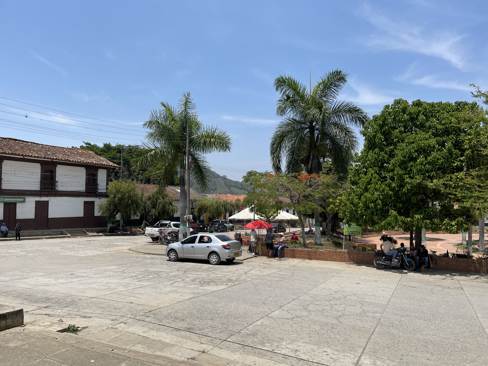

<br><details><summary>:camera:**46/IMG_0375.JPG**</summary><sub> `Exif version` 0232 `OS version` 17.4.1 `Date` 2024:03:28 12:45:52 `Aperture` Not known `Brightness` 1.85405889780457 `Color space` 65535 `Compression` 6`Exposure mode` 0 `Exposure time` 0.016666666666666666 `Focal length` 5.1 `Lens model` iPhone 12 Pro Max back triple camera 5.1mm f/1.6 `Lens specification` (1.5399999618512084, 7.5, 1.6, 2.4) `Orientation` 6 `Scene type` Not known `f number` 1.6 `White balance` 0 `Sensing method` 2 `Shutter speed` 5.915282590512606</sub><sub>`Coordinates & altitude` (6.025291666666667, -73.57290555555555, 1523.059513830679)</sub><sub> :earth_americas:`Location over` [Google Maps](http://maps.google.com/maps?q=6.025291666666667,-73.57290555555555) or [Openstreet Map](https://www.openstreetmap.org/query?lat=6.025291666666667&lon=-73.57290555555555)</sub></details>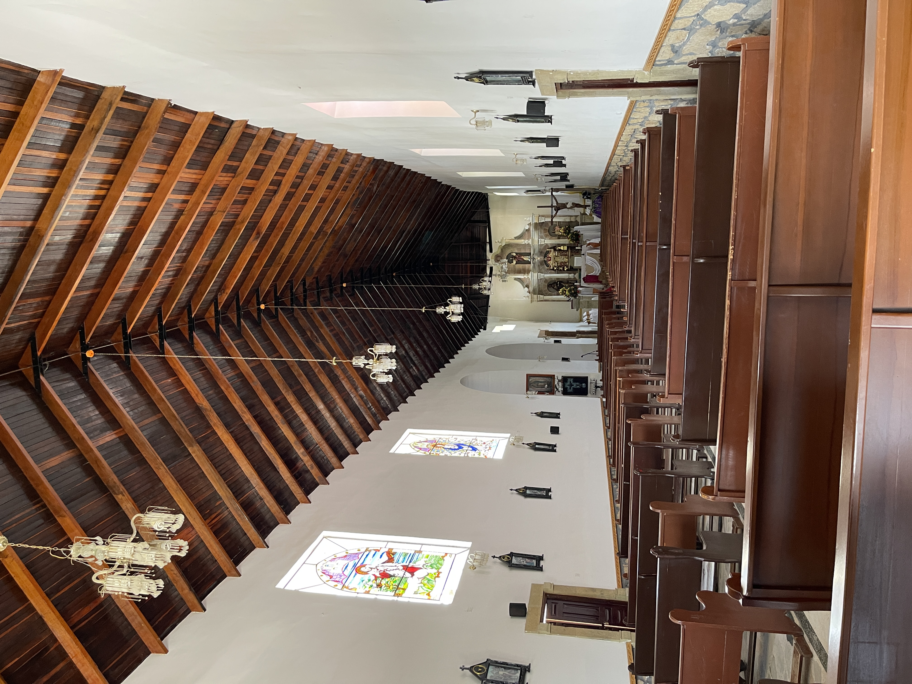

<br><details><summary>:camera:**46/IMG_0376.JPG**</summary><sub> `Exif version` 0232 `OS version` 17.4.1 `Date` 2024:03:28 12:45:56 `Aperture` Not known `Brightness` 2.6765017200317542 `Color space` 65535 `Compression` 6`Exposure mode` 0 `Exposure time` 0.012987012987012988 `Focal length` 5.1 `Lens model` iPhone 12 Pro Max back triple camera 5.1mm f/1.6 `Lens specification` (1.5399999618512084, 7.5, 1.6, 2.4) `Orientation` 1 `Scene type` Not known `f number` 1.6 `White balance` 0 `Sensing method` 2 `Shutter speed` 6.27224157036568</sub><sub>`Coordinates & altitude` (6.025291666666667, -73.57290555555555, 1529.752386634845)</sub><sub> :earth_americas:`Location over` [Google Maps](http://maps.google.com/maps?q=6.025291666666667,-73.57290555555555) or [Openstreet Map](https://www.openstreetmap.org/query?lat=6.025291666666667&lon=-73.57290555555555)</sub></details>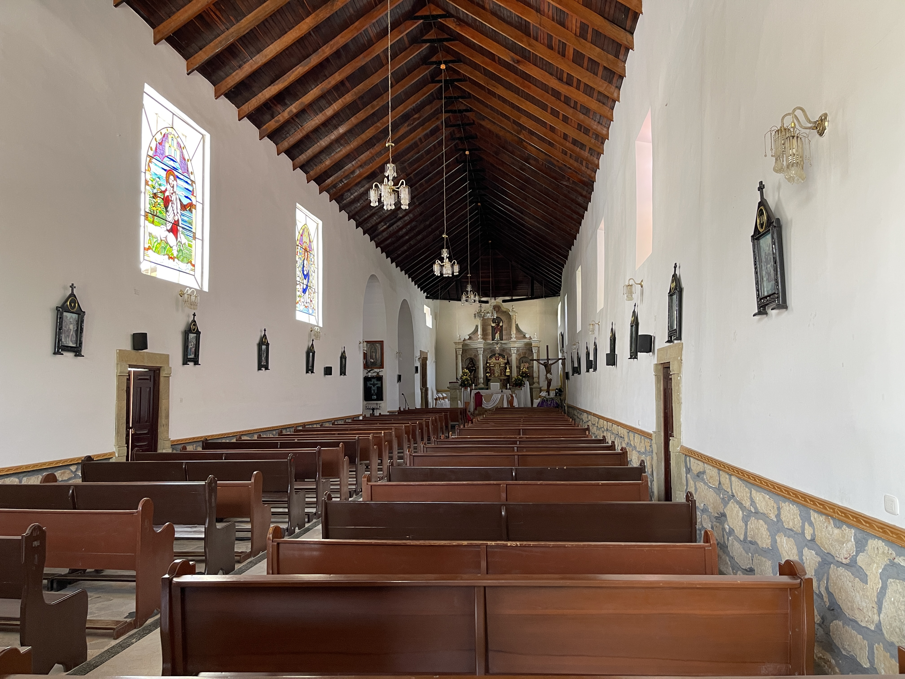

<br><details><summary>:camera:**46/IMG_0378.JPG**</summary><sub> `Exif version` 0232 `OS version` 17.4.1 `Date` 2024:03:29 10:53:52 `Aperture` Not known `Brightness` 10.608724653148347 `Color space` 65535 `Compression` 6`Exposure mode` 0 `Exposure time` 0.00016 `Focal length` 5.1 `Lens model` iPhone 12 Pro Max back triple camera 5.1mm f/1.6 `Lens specification` (1.5399999618512084, 7.5, 1.6, 2.4) `Orientation` 1 `Scene type` Not known `f number` 1.6 `White balance` 0 `Sensing method` 2 `Shutter speed` 12.609640476860978</sub><sub>`Coordinates & altitude` (5.955788888888889, -73.700325, 1983.9814658803707)</sub><sub> :earth_americas:`Location over` [Google Maps](http://maps.google.com/maps?q=5.955788888888889,-73.700325) or [Openstreet Map](https://www.openstreetmap.org/query?lat=5.955788888888889&lon=-73.700325)</sub></details>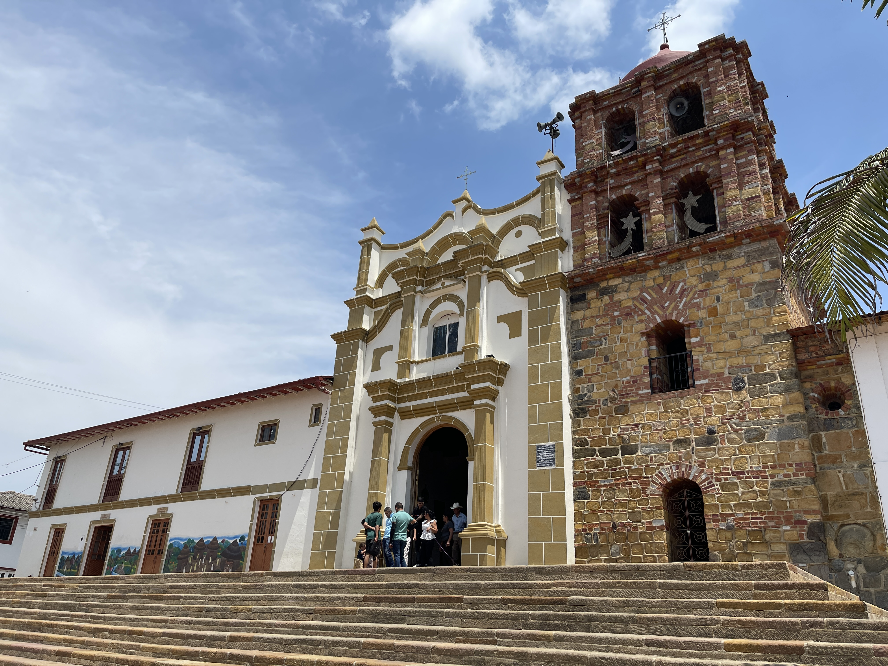

<br><details><summary>:camera:**46/IMG_0380.JPG**</summary><sub> `Exif version` 0232 `OS version` 17.4.1 `Date` 2024:03:29 10:55:07 `Aperture` Not known `Brightness` 2.7319306330341986 `Color space` 65535 `Compression` 6`Exposure mode` 0 `Exposure time` 0.01282051282051282 `Focal length` 5.1 `Lens model` iPhone 12 Pro Max back triple camera 5.1mm f/1.6 `Lens specification` (1.5399999618512084, 7.5, 1.6, 2.4) `Orientation` 6 `Scene type` Not known `f number` 1.6 `White balance` 0 `Sensing method` 2 `Shutter speed` 6.277044416770444</sub><sub>`Coordinates & altitude` (5.95615, -73.70042500000001, 1974.5506607929515)</sub><sub> :earth_americas:`Location over` [Google Maps](http://maps.google.com/maps?q=5.95615,-73.70042500000001) or [Openstreet Map](https://www.openstreetmap.org/query?lat=5.95615&lon=-73.70042500000001)</sub></details>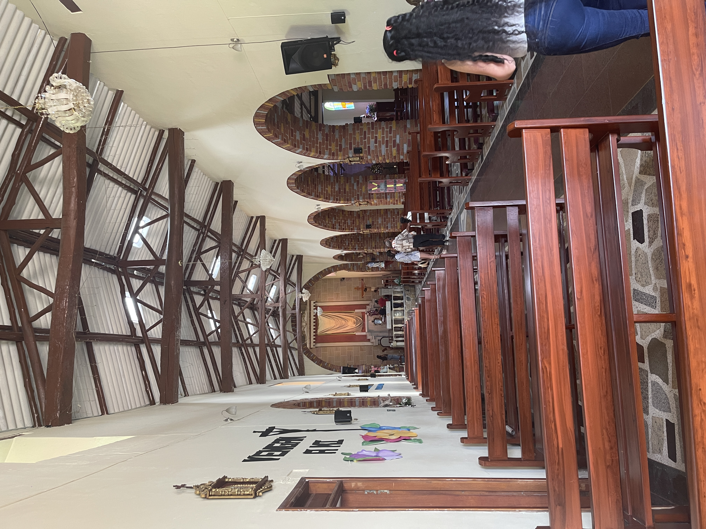

<br><details><summary>:camera:**46/IMG_0384.JPG**</summary><sub> `Exif version` 0232 `OS version` 17.4.1 `Date` 2024:03:29 11:20:01 `Aperture` Not known `Brightness` 9.555273391000714 `Color space` 65535 `Compression` 6`Exposure mode` 0 `Exposure time` 0.000333000333000333 `Focal length` 5.1 `Lens model` iPhone 12 Pro Max back triple camera 5.1mm f/1.6 `Lens specification` (1.5399999618512084, 7.5, 1.6, 2.4) `Orientation` 6 `Scene type` Not known `f number` 1.6 `White balance` 0 `Sensing method` 2 `Shutter speed` 11.552190197036314</sub><sub>`Coordinates & altitude` (5.955697222222223, -73.70049444444444, 1988.2104689203925)</sub><sub> :earth_americas:`Location over` [Google Maps](http://maps.google.com/maps?q=5.955697222222223,-73.70049444444444) or [Openstreet Map](https://www.openstreetmap.org/query?lat=5.955697222222223&lon=-73.70049444444444)</sub></details>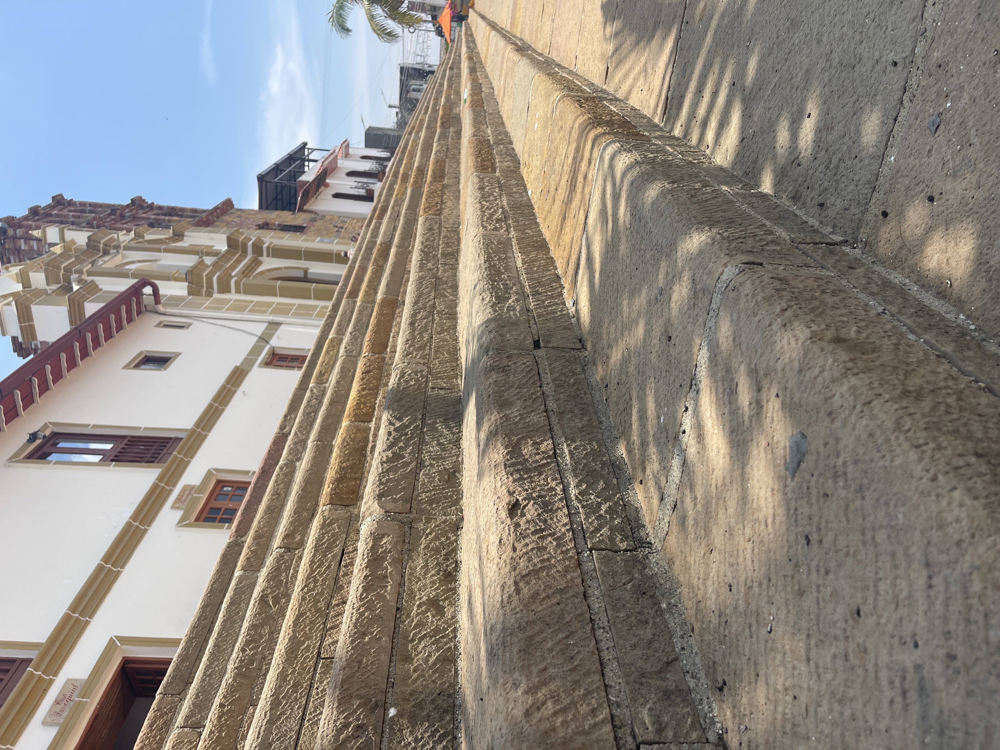

<br><details><summary>:camera:**46/IMG_0385.JPG**</summary><sub> `Exif version` 0232 `OS version` 17.4.1 `Date` 2024:03:29 11:20:07 `Aperture` Not known `Brightness` 9.89260331666228 `Color space` 65535 `Compression` 6`Exposure mode` 0 `Exposure time` 0.00026399155227032733 `Focal length` 5.1 `Lens model` iPhone 12 Pro Max back triple camera 5.1mm f/1.6 `Lens specification` (1.5399999618512084, 7.5, 1.6, 2.4) `Orientation` 1 `Scene type` Not known `f number` 1.6 `White balance` 0 `Sensing method` 2 `Shutter speed` 11.887174436419349</sub><sub>`Coordinates & altitude` (5.955702777777778, -73.70049444444444, 1989.0205278592375)</sub><sub> :earth_americas:`Location over` [Google Maps](http://maps.google.com/maps?q=5.955702777777778,-73.70049444444444) or [Openstreet Map](https://www.openstreetmap.org/query?lat=5.955702777777778&lon=-73.70049444444444)</sub></details>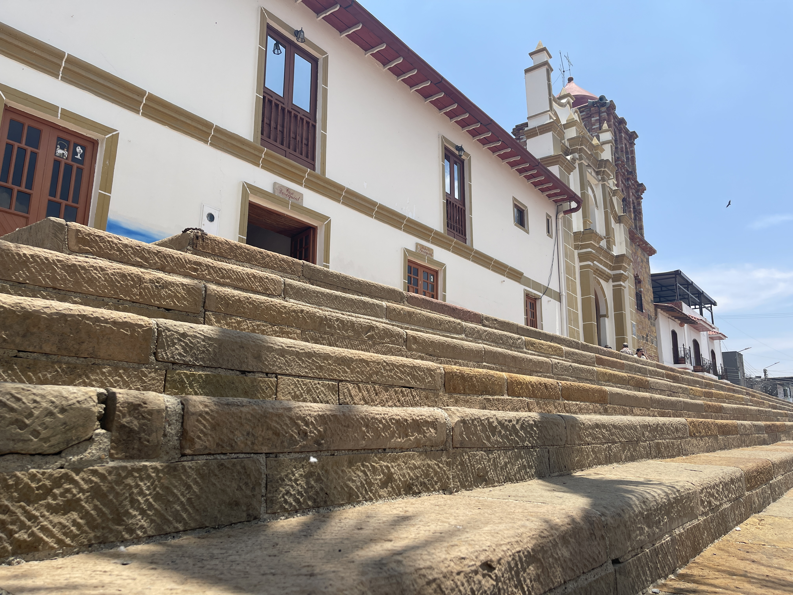

<br><details><summary>:camera:**46/IMG_0386.JPG**</summary><sub> `Exif version` 0232 `OS version` 17.4.1 `Date` 2024:03:29 11:52:45 `Aperture` Not known `Brightness` 10.359383363665561 `Color space` 65535 `Compression` 6`Exposure mode` 0 `Exposure time` 0.00021199915200339198 `Focal length` 5.1 `Lens model` iPhone 12 Pro Max back triple camera 5.1mm f/1.6 `Lens specification` (1.5399999618512084, 7.5, 1.6, 2.4) `Orientation` 1 `Scene type` Not known `f number` 1.6 `White balance` 0 `Sensing method` 2 `Shutter speed` 12.203648118217501</sub><sub>`Coordinates & altitude` (5.955625, -73.70027222222222, 1983.9314159292035)</sub><sub> :earth_americas:`Location over` [Google Maps](http://maps.google.com/maps?q=5.955625,-73.70027222222222) or [Openstreet Map](https://www.openstreetmap.org/query?lat=5.955625&lon=-73.70027222222222)</sub></details>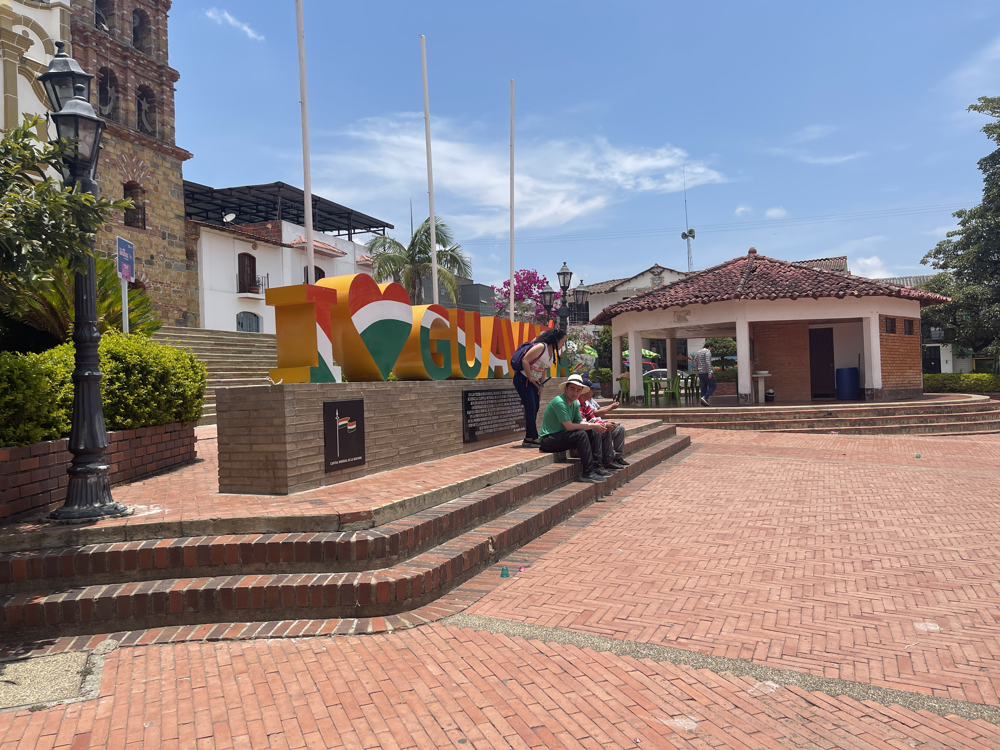

<br><details><summary>:camera:**46/IMG_0393.JPG**</summary><sub> `Exif version` 0232 `OS version` 17.4.1 `Date` 2024:03:29 11:54:36 `Aperture` Not known `Brightness` 10.843603099987295 `Color space` 65535 `Compression` 6`Exposure mode` 0 `Exposure time` 0.000143000143000143 `Focal length` 5.1 `Lens model` iPhone 12 Pro Max back triple camera 5.1mm f/1.6 `Lens specification` (1.5399999618512084, 7.5, 1.6, 2.4) `Orientation` 6 `Scene type` Not known `f number` 1.6 `White balance` 0 `Sensing method` 2 `Shutter speed` 12.771697240635117</sub><sub>`Coordinates & altitude` (5.955613888888889, -73.70033333333333, 1978.3374045801527)</sub><sub> :earth_americas:`Location over` [Google Maps](http://maps.google.com/maps?q=5.955613888888889,-73.70033333333333) or [Openstreet Map](https://www.openstreetmap.org/query?lat=5.955613888888889&lon=-73.70033333333333)</sub></details>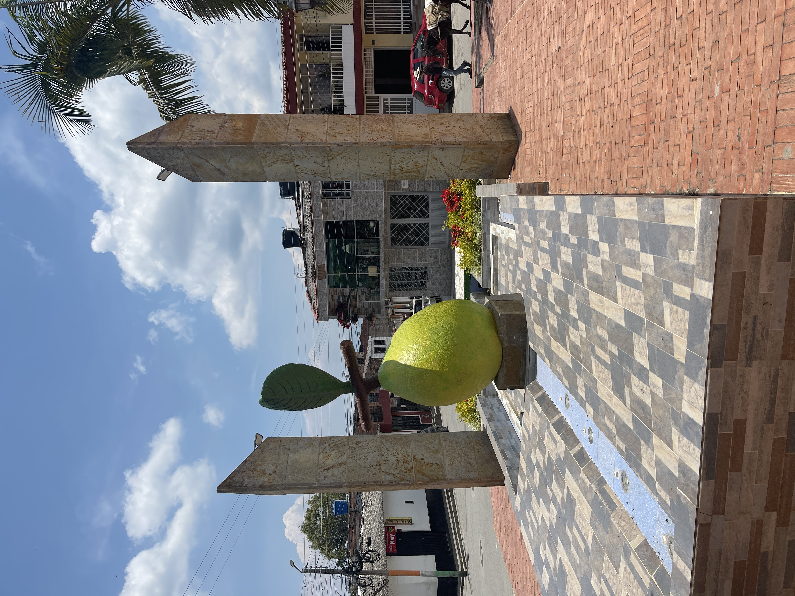

<br><details><summary>:camera:**46/IMG_0401.JPG**</summary><sub> `Exif version` 0232 `OS version` 17.4.1 `Date` 2024:03:29 11:56:03 `Aperture` Not known `Brightness` 11.058457374830853 `Color space` 65535 `Compression` 6`Exposure mode` 0 `Exposure time` 0.00010900370612600828 `Focal length` 5.1 `Lens model` iPhone 12 Pro Max back triple camera 5.1mm f/1.6 `Lens specification` (1.5399999618512084, 7.5, 1.6, 2.4) `Orientation` 1 `Scene type` Not known `f number` 1.6 `White balance` 0 `Sensing method` 2 `Shutter speed` 13.16338424437299</sub><sub>`Coordinates & altitude` (5.955477777777778, -73.70011111111111, 1989.8379120879122)</sub><sub> :earth_americas:`Location over` [Google Maps](http://maps.google.com/maps?q=5.955477777777778,-73.70011111111111) or [Openstreet Map](https://www.openstreetmap.org/query?lat=5.955477777777778&lon=-73.70011111111111)</sub></details>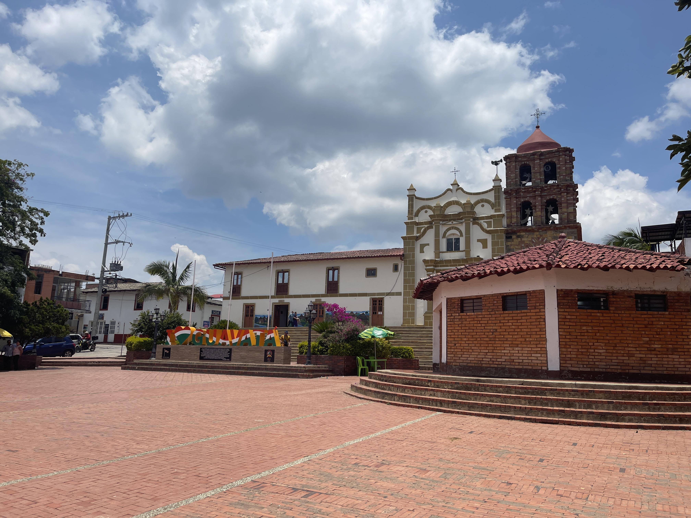

<br><details><summary>:camera:**46/IMG_0411.JPG**</summary><sub> `Exif version` 0232 `OS version` 17.4.1 `Date` 2024:03:29 13:09:55 `Aperture` Not known `Brightness` 10.054085134673782 `Color space` 65535 `Compression` 6`Exposure mode` 0 `Exposure time` 0.00022999080036798528 `Focal length` 5.1 `Lens model` iPhone 12 Pro Max back triple camera 5.1mm f/1.6 `Lens specification` (1.5399999618512084, 7.5, 1.6, 2.4) `Orientation` 6 `Scene type` Not known `f number` 1.6 `White balance` 0 `Sensing method` 2 `Shutter speed` 12.086078519855596</sub><sub>`Coordinates & altitude` (6.000025, -73.66922777777778, 2124.133056133056)</sub><sub> :earth_americas:`Location over` [Google Maps](http://maps.google.com/maps?q=6.000025,-73.66922777777778) or [Openstreet Map](https://www.openstreetmap.org/query?lat=6.000025&lon=-73.66922777777778)</sub></details>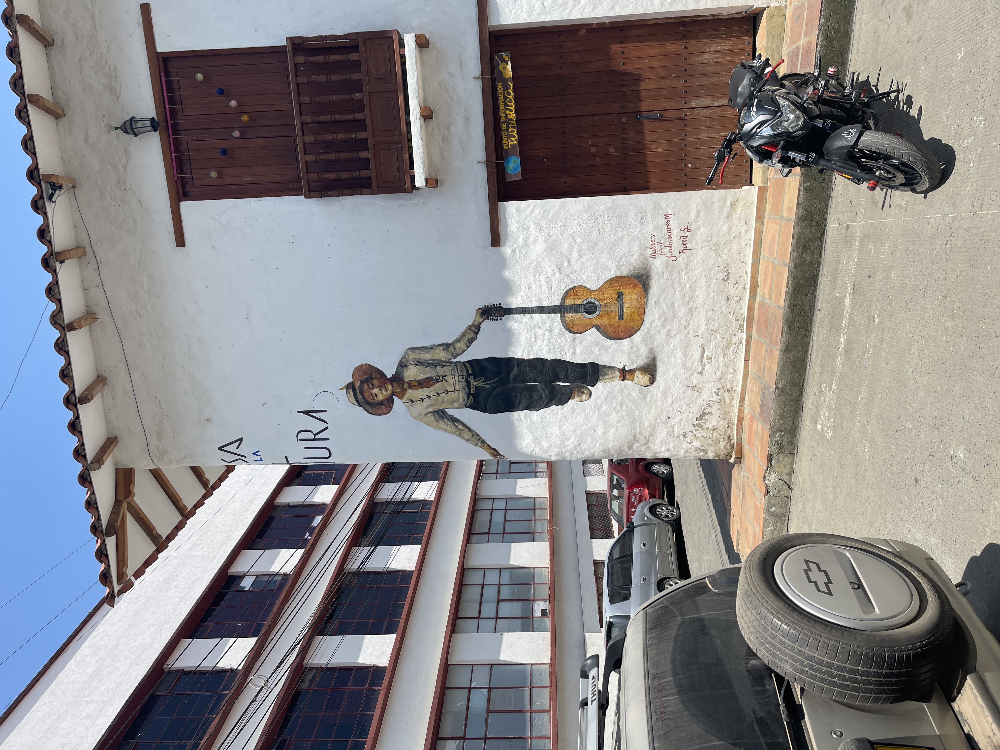

<br><details><summary>:camera:**46/IMG_0412.JPG**</summary><sub> `Exif version` 0232 `OS version` 17.4.1 `Date` 2024:03:29 14:29:03 `Aperture` Not known `Brightness` 3.22780910609858 `Color space` 65535 `Compression` 6`Exposure mode` 0 `Exposure time` 0.008695652173913044 `Focal length` 5.1 `Lens model` iPhone 12 Pro Max back triple camera 5.1mm f/1.6 `Lens specification` (1.5399999618512084, 7.5, 1.6, 2.4) `Orientation` 6 `Scene type` Not known `f number` 1.6 `White balance` 0 `Sensing method` 2 `Shutter speed` 6.8401331783109605</sub><sub>`Coordinates & altitude` (6.011844444444445, -73.67179166666668, 2134.5305164319248)</sub><sub> :earth_americas:`Location over` [Google Maps](http://maps.google.com/maps?q=6.011844444444445,-73.67179166666668) or [Openstreet Map](https://www.openstreetmap.org/query?lat=6.011844444444445&lon=-73.67179166666668)</sub></details>

<br><details><summary>:camera:**46/IMG_0413.JPG**</summary><sub> `Exif version` 0232 `OS version` 17.4.1 `Date` 2024:03:29 14:29:06 `Aperture` Not known `Brightness` 2.9034371090012514 `Color space` 65535 `Compression` 6`Exposure mode` 0 `Exposure time` 0.011111111111111112 `Focal length` 5.1 `Lens model` iPhone 12 Pro Max back triple camera 5.1mm f/1.6 `Lens specification` (1.5399999618512084, 7.5, 1.6, 2.4) `Orientation` 1 `Scene type` Not known `f number` 1.6 `White balance` 0 `Sensing method` 2 `Shutter speed` 6.48992118823886</sub><sub>`Coordinates & altitude` (6.012422222222222, -73.67139444444445, 2137.3187250996016)</sub><sub> :earth_americas:`Location over` [Google Maps](http://maps.google.com/maps?q=6.012422222222222,-73.67139444444445) or [Openstreet Map](https://www.openstreetmap.org/query?lat=6.012422222222222&lon=-73.67139444444445)</sub></details>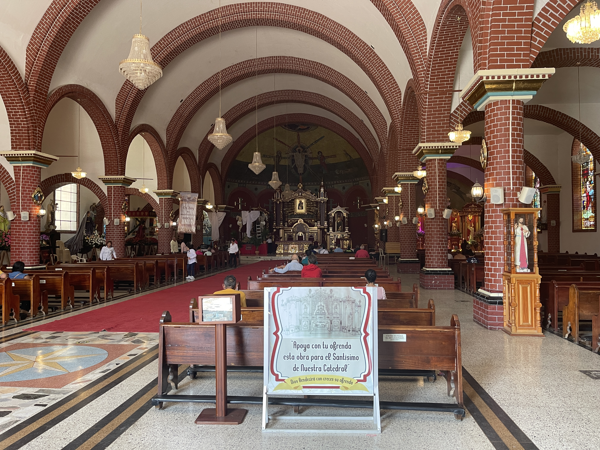

<br><details><summary>:camera:**46/IMG_0414.JPG**</summary><sub> `Exif version` 0232 `OS version` 17.4.1 `Date` 2024:03:29 14:29:15 `Aperture` Not known `Brightness` 2.101079051694715 `Color space` 65535 `Compression` 6`Exposure mode` 0 `Exposure time` 0.016666666666666666 `Focal length` 5.1 `Lens model` iPhone 12 Pro Max back triple camera 5.1mm f/1.6 `Lens specification` (1.5399999618512084, 7.5, 1.6, 2.4) `Orientation` 1 `Scene type` Not known `f number` 1.6 `White balance` 0 `Sensing method` 2 `Shutter speed` 5.914499196065449</sub><sub>`Coordinates & altitude` (6.012286111111111, -73.67147777777778, 2140.7735583684953)</sub><sub> :earth_americas:`Location over` [Google Maps](http://maps.google.com/maps?q=6.012286111111111,-73.67147777777778) or [Openstreet Map](https://www.openstreetmap.org/query?lat=6.012286111111111&lon=-73.67147777777778)</sub></details>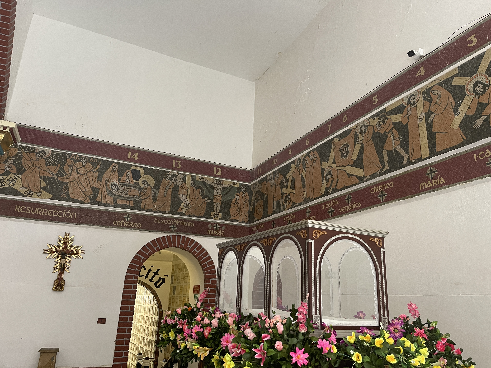

<br><details><summary>:camera:**46/IMG_0415.JPG**</summary><sub> `Exif version` 0232 `OS version` 17.4.1 `Date` 2024:03:29 14:29:44 `Aperture` Not known `Brightness` 2.2065293431791684 `Color space` 65535 `Compression` 6`Exposure mode` 0 `Exposure time` 0.016666666666666666 `Focal length` 5.1 `Lens model` iPhone 12 Pro Max back triple camera 5.1mm f/1.6 `Lens specification` (1.5399999618512084, 7.5, 1.6, 2.4) `Orientation` 6 `Scene type` Not known `f number` 1.6 `White balance` 0 `Sensing method` 2 `Shutter speed` 5.914499196065449</sub><sub>`Coordinates & altitude` (6.0120861111111115, -73.67156111111112, 2145.0081799591003)</sub><sub> :earth_americas:`Location over` [Google Maps](http://maps.google.com/maps?q=6.0120861111111115,-73.67156111111112) or [Openstreet Map](https://www.openstreetmap.org/query?lat=6.0120861111111115&lon=-73.67156111111112)</sub></details>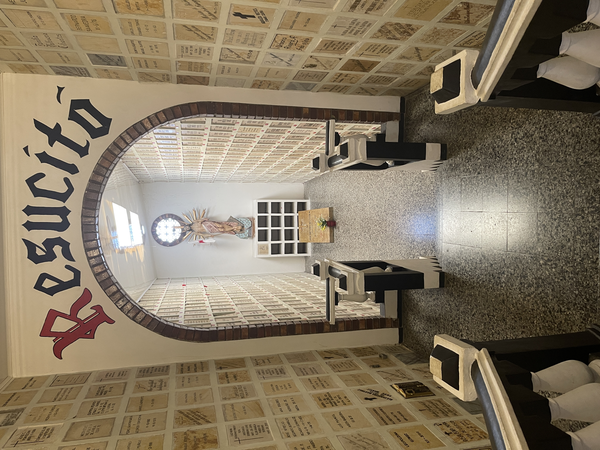

<br><details><summary>:camera:**46/IMG_0416.JPG**</summary><sub> `Exif version` 0232 `OS version` 17.4.1 `Date` 2024:03:29 14:30:13 `Aperture` Not known `Brightness` 3.3436085626911316 `Color space` 65535 `Compression` 6`Exposure mode` 0 `Exposure time` 0.00847457627118644 `Focal length` 5.1 `Lens model` iPhone 12 Pro Max back triple camera 5.1mm f/1.6 `Lens specification` (1.5399999618512084, 7.5, 1.6, 2.4) `Orientation` 1 `Scene type` Not known `f number` 1.6 `White balance` 0 `Sensing method` 2 `Shutter speed` 6.888028568567901</sub><sub>`Coordinates & altitude` (6.012261111111111, -73.67152222222222, 2119.7860116569527)</sub><sub> :earth_americas:`Location over` [Google Maps](http://maps.google.com/maps?q=6.012261111111111,-73.67152222222222) or [Openstreet Map](https://www.openstreetmap.org/query?lat=6.012261111111111&lon=-73.67152222222222)</sub></details>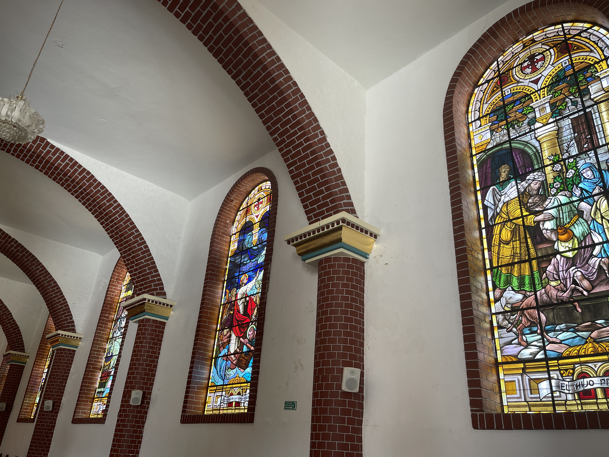

<br><details><summary>:camera:**46/IMG_0417.JPG**</summary><sub> `Exif version` 0232 `OS version` 17.4.1 `Date` 2024:03:29 14:30:44 `Aperture` Not known `Brightness` 0.9112187868533046 `Color space` 65535 `Compression` 6`Exposure mode` 0 `Exposure time` 0.016666666666666666 `Focal length` 5.1 `Lens model` iPhone 12 Pro Max back triple camera 5.1mm f/1.6 `Lens specification` (1.5399999618512084, 7.5, 1.6, 2.4) `Orientation` 6 `Scene type` Not known `f number` 1.6 `White balance` 0 `Sensing method` 2 `Shutter speed` 5.914499196065449</sub><sub>`Coordinates & altitude` (6.012511111111111, -73.67136388888889, 2131.276)</sub><sub> :earth_americas:`Location over` [Google Maps](http://maps.google.com/maps?q=6.012511111111111,-73.67136388888889) or [Openstreet Map](https://www.openstreetmap.org/query?lat=6.012511111111111&lon=-73.67136388888889)</sub></details>

<br><details><summary>:camera:**46/IMG_0418.JPG**</summary><sub> `Exif version` 0232 `OS version` 17.4.1 `Date` 2024:03:29 14:30:49 `Aperture` Not known `Brightness` 0.8796164183561734 `Color space` 65535 `Compression` 6`Exposure mode` 0 `Exposure time` 0.016666666666666666 `Focal length` 5.1 `Lens model` iPhone 12 Pro Max back triple camera 5.1mm f/1.6 `Lens specification` (1.5399999618512084, 7.5, 1.6, 2.4) `Orientation` 1 `Scene type` Not known `f number` 1.6 `White balance` 0 `Sensing method` 2 `Shutter speed` 5.907034876800381</sub><sub>`Coordinates & altitude` (6.012466666666667, -73.67133333333334, 2130.5794676806086)</sub><sub> :earth_americas:`Location over` [Google Maps](http://maps.google.com/maps?q=6.012466666666667,-73.67133333333334) or [Openstreet Map](https://www.openstreetmap.org/query?lat=6.012466666666667&lon=-73.67133333333334)</sub></details>

<br><details><summary>:camera:**46/IMG_0419.JPG**</summary><sub> `Exif version` 0232 `OS version` 17.4.1 `Date` 2024:03:29 14:32:08 `Aperture` Not known `Brightness` 1.4825942006512638 `Color space` 65535 `Compression` 6`Exposure mode` 0 `Exposure time` 0.016666666666666666 `Focal length` 5.1 `Lens model` iPhone 12 Pro Max back triple camera 5.1mm f/1.6 `Lens specification` (1.5399999618512084, 7.5, 1.6, 2.4) `Orientation` 6 `Scene type` Not known `f number` 1.6 `White balance` 0 `Sensing method` 2 `Shutter speed` 5.914499196065449</sub><sub>`Coordinates & altitude` (6.012605555555556, -73.67111944444444, 2173.2589118198875)</sub><sub> :earth_americas:`Location over` [Google Maps](http://maps.google.com/maps?q=6.012605555555556,-73.67111944444444) or [Openstreet Map](https://www.openstreetmap.org/query?lat=6.012605555555556&lon=-73.67111944444444)</sub></details>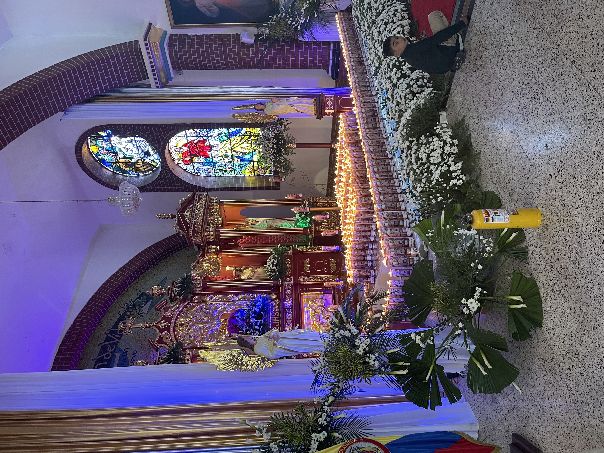

<br><details><summary>:camera:**46/IMG_0420.JPG**</summary><sub> `Exif version` 0232 `OS version` 17.4.1 `Date` 2024:03:29 14:33:52 `Aperture` Not known `Brightness` 10.717550760072287 `Color space` 65535 `Compression` 6`Exposure mode` 0 `Exposure time` 0.000143000143000143 `Focal length` 5.1 `Lens model` iPhone 12 Pro Max back triple camera 5.1mm f/1.6 `Lens specification` (1.5399999618512084, 7.5, 1.6, 2.4) `Orientation` 6 `Scene type` Not known `f number` 1.6 `White balance` 0 `Sensing method` 2 `Shutter speed` 12.771697240635117</sub><sub>`Coordinates & altitude` (6.012194444444445, -73.67162222222223, 2116.9224855861626)</sub><sub> :earth_americas:`Location over` [Google Maps](http://maps.google.com/maps?q=6.012194444444445,-73.67162222222223) or [Openstreet Map](https://www.openstreetmap.org/query?lat=6.012194444444445&lon=-73.67162222222223)</sub></details>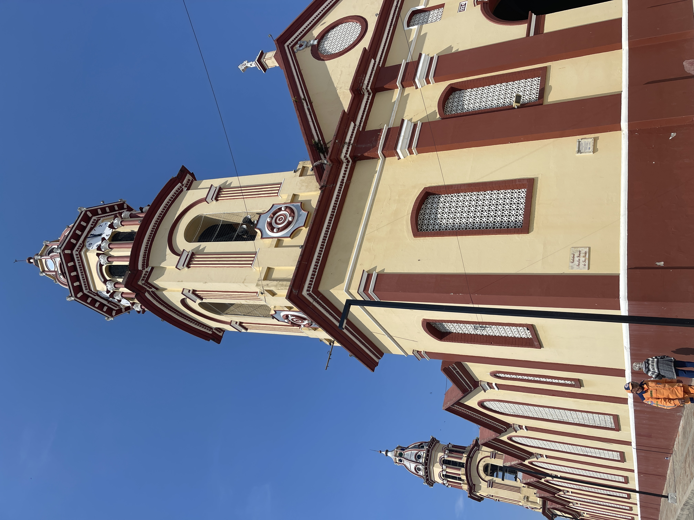

<br><details><summary>:camera:**46/IMG_0421.JPEG**</summary><sub> `Exif version` 0232 `OS version` 17.4.1 `Date` 2024:03:29 14:34:05 `Aperture` Not known `Brightness` 10.61887503624239 `Color space` 65535 `Compression` Not known`Exposure mode` 0 `Exposure time` 0.000501002004008016 `Focal length` 1.54 `Lens model` iPhone 12 Pro Max back triple camera 1.54mm f/2.4 `Lens specification` (1.5399999618512084, 7.5, 1.6, 2.4) `Orientation` 1 `Scene type` Not known `f number` 2.4 `White balance` 0 `Sensing method` 2 `Shutter speed` 10.962901772303995</sub><sub>`Coordinates & altitude` (6.012294444444445, -73.67165277777778, 2135.627075351213)</sub><sub> :earth_americas:`Location over` [Google Maps](http://maps.google.com/maps?q=6.012294444444445,-73.67165277777778) or [Openstreet Map](https://www.openstreetmap.org/query?lat=6.012294444444445&lon=-73.67165277777778)</sub></details>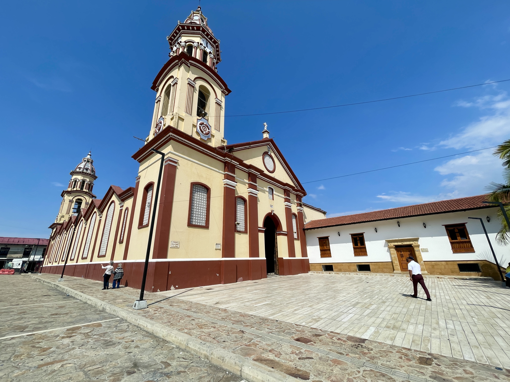

<br><details><summary>:camera:**46/IMG_0422.JPEG**</summary><sub> `Exif version` 0232 `OS version` 17.4.1 `Date` 2024:03:29 14:34:16 `Aperture` Not known `Brightness` 11.10087517273146 `Color space` 65535 `Compression` Not known`Exposure mode` 0 `Exposure time` 0.00033400133600534405 `Focal length` 1.54 `Lens model` iPhone 12 Pro Max back triple camera 1.54mm f/2.4 `Lens specification` (1.5399999618512084, 7.5, 1.6, 2.4) `Orientation` 1 `Scene type` Not known `f number` 2.4 `White balance` 0 `Sensing method` 2 `Shutter speed` 11.547864283550439</sub><sub>`Coordinates & altitude` (6.012375, -73.67170555555556, 2138.372191011236)</sub><sub> :earth_americas:`Location over` [Google Maps](http://maps.google.com/maps?q=6.012375,-73.67170555555556) or [Openstreet Map](https://www.openstreetmap.org/query?lat=6.012375&lon=-73.67170555555556)</sub></details>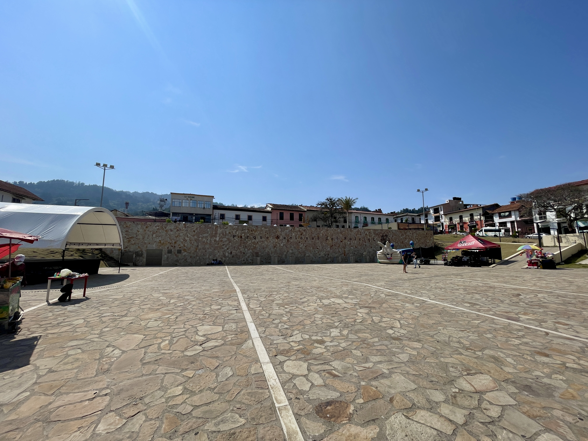

<br><details><summary>:camera:**46/IMG_0423.JPG**</summary><sub> `Exif version` 0232 `OS version` 17.4.1 `Date` 2024:03:29 14:34:39 `Aperture` Not known `Brightness` 10.478180700676091 `Color space` 65535 `Compression` 6`Exposure mode` 0 `Exposure time` 0.0004589261128958238 `Focal length` 1.54 `Lens model` iPhone 12 Pro Max back triple camera 1.54mm f/2.4 `Lens specification` (1.5399999618512084, 7.5, 1.6, 2.4) `Orientation` 1 `Scene type` Not known `f number` 2.4 `White balance` 0 `Sensing method` 2 `Shutter speed` 11.089218221603343</sub><sub>`Coordinates & altitude` (6.012405555555556, -73.67186111111111, 2141.453164556962)</sub><sub> :earth_americas:`Location over` [Google Maps](http://maps.google.com/maps?q=6.012405555555556,-73.67186111111111) or [Openstreet Map](https://www.openstreetmap.org/query?lat=6.012405555555556&lon=-73.67186111111111)</sub></details>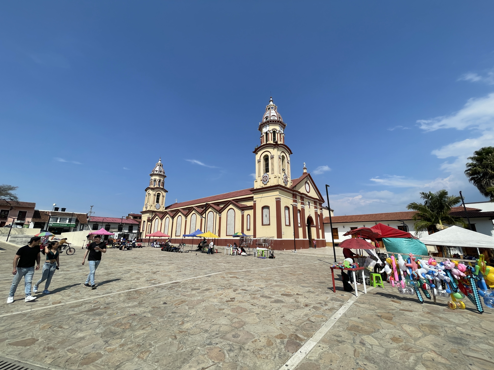

<br><details><summary>:camera:**46/IMG_0424.JPG**</summary><sub> `Exif version` 0232 `OS version` 17.4.1 `Date` 2024:03:29 14:34:49 `Aperture` Not known `Brightness` 10.523707709722048 `Color space` 65535 `Compression` 6`Exposure mode` 0 `Exposure time` 0.0006261740763932373 `Focal length` 1.54 `Lens model` iPhone 12 Pro Max back triple camera 1.54mm f/2.4 `Lens specification` (1.5399999618512084, 7.5, 1.6, 2.4) `Orientation` 1 `Scene type` Not known `f number` 2.4 `White balance` 0 `Sensing method` 2 `Shutter speed` 10.641549725442342</sub><sub>`Coordinates & altitude` (6.012433333333333, -73.67189722222223, 2141.233231707317)</sub><sub> :earth_americas:`Location over` [Google Maps](http://maps.google.com/maps?q=6.012433333333333,-73.67189722222223) or [Openstreet Map](https://www.openstreetmap.org/query?lat=6.012433333333333&lon=-73.67189722222223)</sub></details>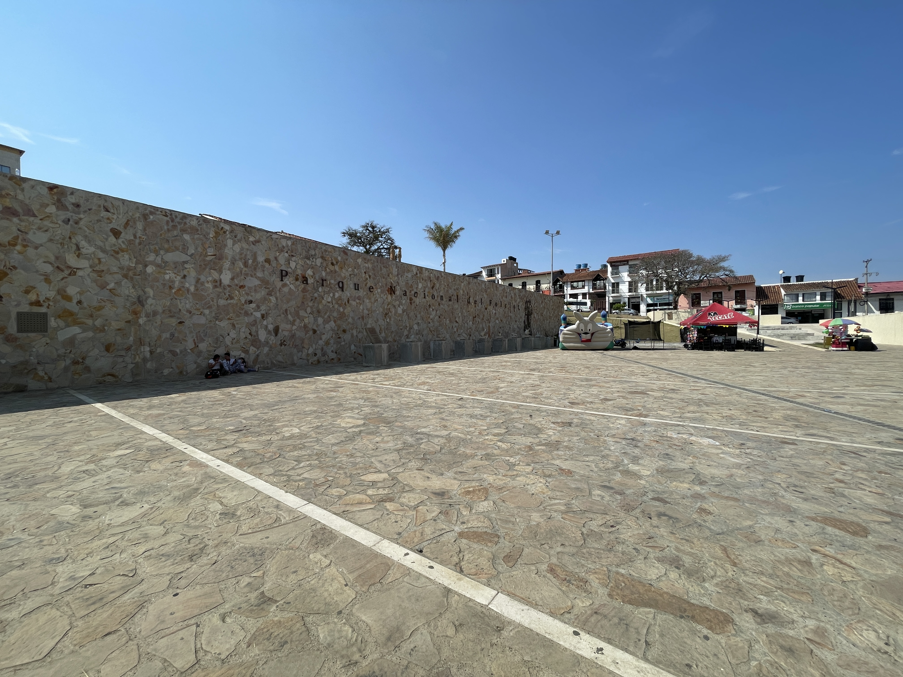

<br><details><summary>:camera:**46/IMG_0425.JPG**</summary><sub> `Exif version` 0232 `OS version` 17.4.1 `Date` 2024:03:29 14:36:03 `Aperture` Not known `Brightness` 8.895300059926376 `Color space` 65535 `Compression` 6`Exposure mode` 0 `Exposure time` 0.0005060728744939271 `Focal length` 5.1 `Lens model` iPhone 12 Pro Max back triple camera 5.1mm f/1.6 `Lens specification` (1.5399999618512084, 7.5, 1.6, 2.4) `Orientation` 6 `Scene type` Not known `f number` 1.6 `White balance` 0 `Sensing method` 2 `Shutter speed` 10.948574996654921</sub><sub>`Coordinates & altitude` (6.012755555555556, -73.67186666666667, 2131.0533453887883)</sub><sub> :earth_americas:`Location over` [Google Maps](http://maps.google.com/maps?q=6.012755555555556,-73.67186666666667) or [Openstreet Map](https://www.openstreetmap.org/query?lat=6.012755555555556&lon=-73.67186666666667)</sub></details>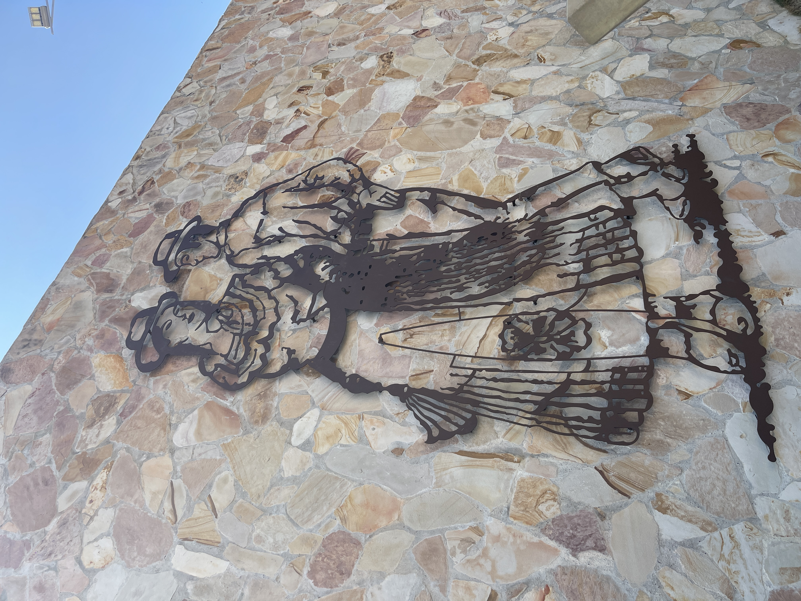

<br><details><summary>:camera:**46/IMG_0426.JPG**</summary><sub> `Exif version` 0232 `OS version` 17.4.1 `Date` 2024:03:29 14:39:06 `Aperture` Not known `Brightness` 10.28930872366359 `Color space` 65535 `Compression` 6`Exposure mode` 0 `Exposure time` 0.0011261261261261261 `Focal length` 1.54 `Lens model` iPhone 12 Pro Max back triple camera 1.54mm f/2.4 `Lens specification` (1.5399999618512084, 7.5, 1.6, 2.4) `Orientation` 1 `Scene type` Not known `f number` 2.4 `White balance` 0 `Sensing method` 2 `Shutter speed` 9.794577457089757</sub><sub>`Coordinates & altitude` (6.013025, -73.67179166666668, 2148.0811744386874)</sub><sub> :earth_americas:`Location over` [Google Maps](http://maps.google.com/maps?q=6.013025,-73.67179166666668) or [Openstreet Map](https://www.openstreetmap.org/query?lat=6.013025&lon=-73.67179166666668)</sub></details>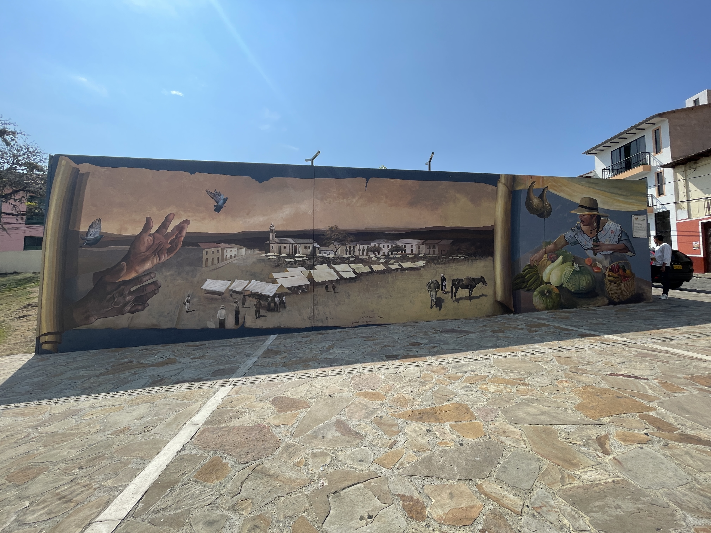

<br><details><summary>:camera:**46/IMG_0430.JPG**</summary><sub> `Exif version` 0232 `OS version` 17.4.1 `Date` 2024:03:29 15:40:22 `Aperture` Not known `Brightness` 11.452697133437129 `Color space` 65535 `Compression` 6`Exposure mode` 0 `Exposure time` 8.300132802124833e-05 `Focal length` 5.1 `Lens model` iPhone 12 Pro Max back triple camera 5.1mm f/1.6 `Lens specification` (1.5399999618512084, 7.5, 1.6, 2.4) `Orientation` 6 `Scene type` Not known `f number` 1.6 `White balance` 0 `Sensing method` 2 `Shutter speed` 13.556529146890593</sub><sub>`Coordinates & altitude` (5.981744444444445, -73.6288611111111, 1827.4050279329608)</sub><sub> :earth_americas:`Location over` [Google Maps](http://maps.google.com/maps?q=5.981744444444445,-73.6288611111111) or [Openstreet Map](https://www.openstreetmap.org/query?lat=5.981744444444445&lon=-73.6288611111111)</sub></details>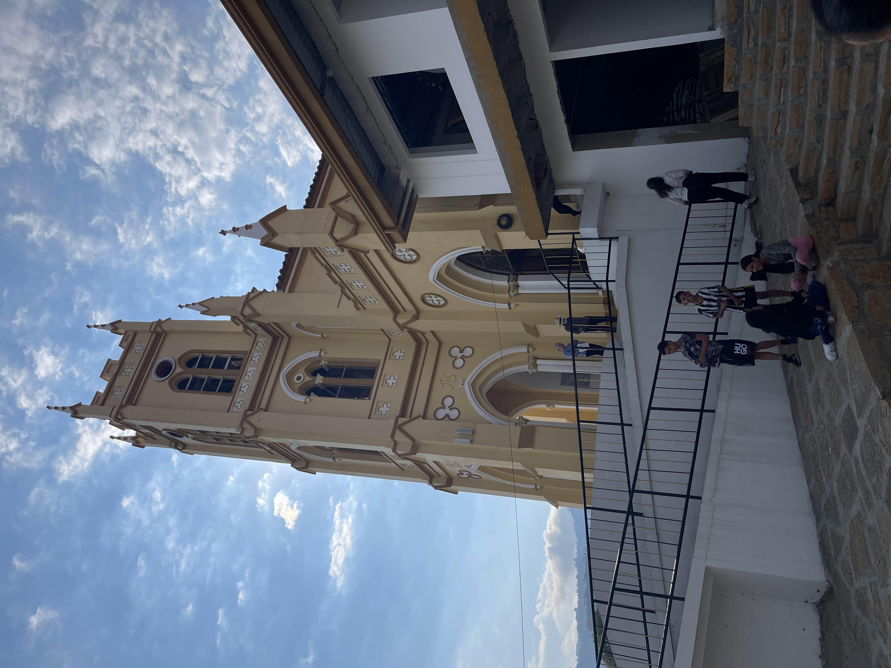

<br><details><summary>:camera:**46/IMG_0431.JPG**</summary><sub> `Exif version` 0232 `OS version` 17.4.1 `Date` 2024:03:29 15:40:45 `Aperture` Not known `Brightness` 11.315216552150082 `Color space` 65535 `Compression` 6`Exposure mode` 0 `Exposure time` 9.1000091000091e-05 `Focal length` 5.1 `Lens model` iPhone 12 Pro Max back triple camera 5.1mm f/1.6 `Lens specification` (1.5399999618512084, 7.5, 1.6, 2.4) `Orientation` 1 `Scene type` Not known `f number` 1.6 `White balance` 0 `Sensing method` 2 `Shutter speed` 13.423773919655304</sub><sub>`Coordinates & altitude` (6.062911111111111, -73.6374888888889, 1798.2069092245497)</sub><sub> :earth_americas:`Location over` [Google Maps](http://maps.google.com/maps?q=6.062911111111111,-73.6374888888889) or [Openstreet Map](https://www.openstreetmap.org/query?lat=6.062911111111111&lon=-73.6374888888889)</sub></details>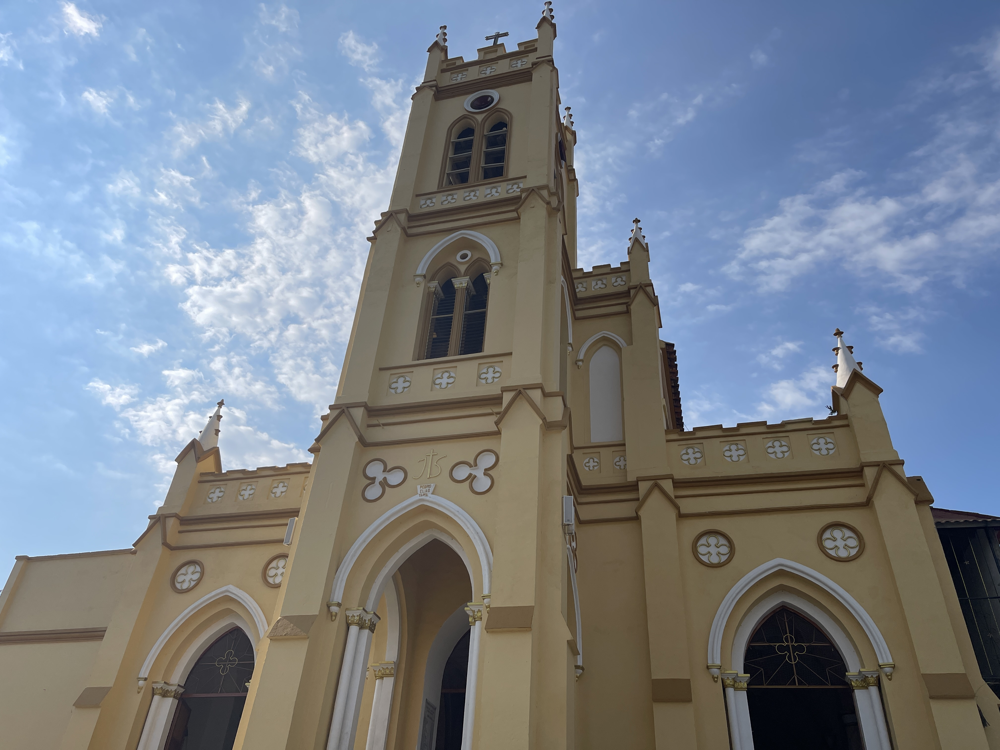

<br><details><summary>:camera:**46/IMG_0432.JPG**</summary><sub> `Exif version` 0232 `OS version` 17.4.1 `Date` 2024:03:29 15:40:51 `Aperture` Not known `Brightness` 10.463236967903482 `Color space` 65535 `Compression` 6`Exposure mode` 0 `Exposure time` 0.0001690045631232043 `Focal length` 5.1 `Lens model` iPhone 12 Pro Max back triple camera 5.1mm f/1.6 `Lens specification` (1.5399999618512084, 7.5, 1.6, 2.4) `Orientation` 6 `Scene type` Not known `f number` 1.6 `White balance` 0 `Sensing method` 2 `Shutter speed` 12.53068914229053</sub><sub>`Coordinates & altitude` (6.062916666666666, -73.63748055555556, 1798.253052164262)</sub><sub> :earth_americas:`Location over` [Google Maps](http://maps.google.com/maps?q=6.062916666666666,-73.63748055555556) or [Openstreet Map](https://www.openstreetmap.org/query?lat=6.062916666666666&lon=-73.63748055555556)</sub></details>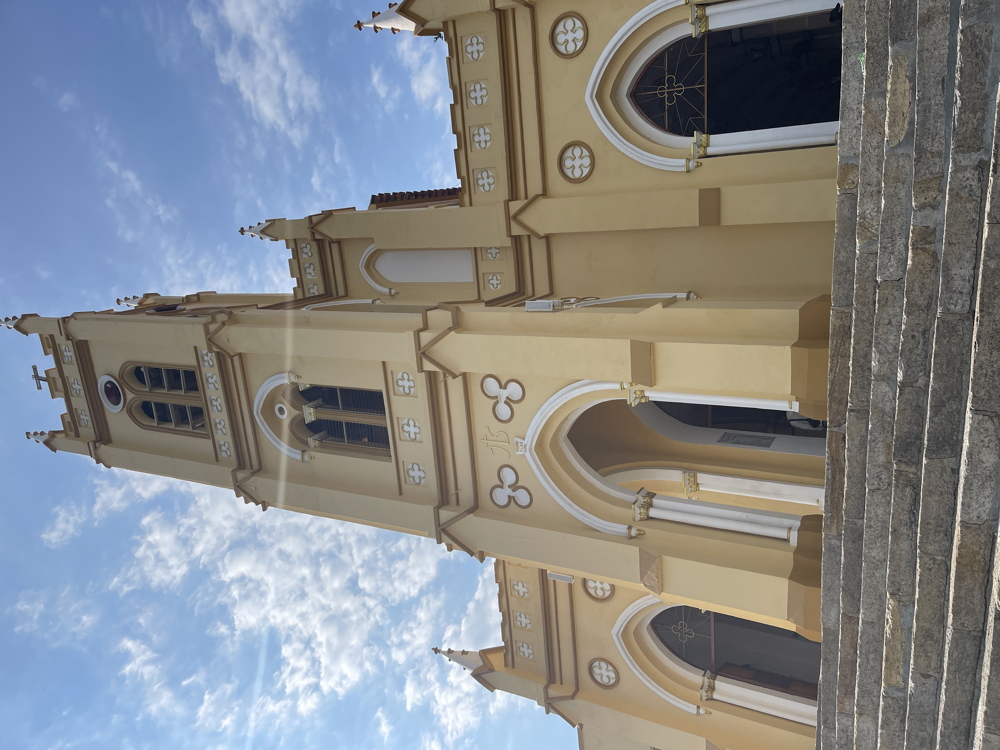

<br><details><summary>:camera:**46/IMG_0433.JPG**</summary><sub> `Exif version` 0232 `OS version` 17.4.1 `Date` 2024:03:29 15:40:59 `Aperture` Not known `Brightness` 10.589537326433366 `Color space` 65535 `Compression` 6`Exposure mode` 0 `Exposure time` 0.0005841121495327102 `Focal length` 1.54 `Lens model` iPhone 12 Pro Max back triple camera 1.54mm f/2.4 `Lens specification` (1.5399999618512084, 7.5, 1.6, 2.4) `Orientation` 6 `Scene type` Not known `f number` 2.4 `White balance` 0 `Sensing method` 2 `Shutter speed` 10.741744010360458</sub><sub>`Coordinates & altitude` (6.062911111111111, -73.63748055555556, 1794.3033448673586)</sub><sub> :earth_americas:`Location over` [Google Maps](http://maps.google.com/maps?q=6.062911111111111,-73.63748055555556) or [Openstreet Map](https://www.openstreetmap.org/query?lat=6.062911111111111&lon=-73.63748055555556)</sub></details>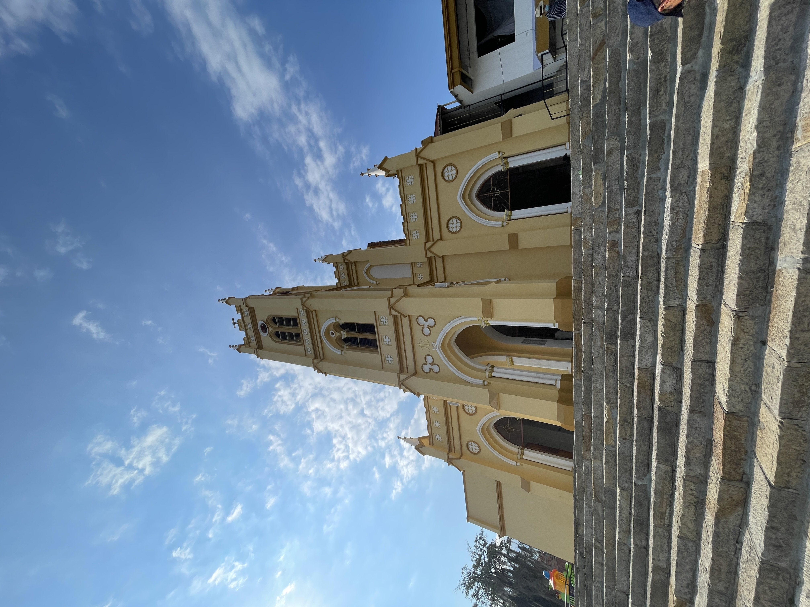

<br><details><summary>:camera:**46/IMG_0434.JPG**</summary><sub> `Exif version` 0232 `OS version` 17.4.1 `Date` 2024:03:29 15:41:06 `Aperture` Not known `Brightness` 9.498693636746735 `Color space` 65535 `Compression` 6`Exposure mode` 0 `Exposure time` 0.0009389671361502347 `Focal length` 1.54 `Lens model` iPhone 12 Pro Max back triple camera 1.54mm f/2.4 `Lens specification` (1.5399999618512084, 7.5, 1.6, 2.4) `Orientation` 1 `Scene type` Not known `f number` 2.4 `White balance` 0 `Sensing method` 2 `Shutter speed` 10.056587220353853</sub><sub>`Coordinates & altitude` (6.062908333333334, -73.63748055555556, 1794.2706310679612)</sub><sub> :earth_americas:`Location over` [Google Maps](http://maps.google.com/maps?q=6.062908333333334,-73.63748055555556) or [Openstreet Map](https://www.openstreetmap.org/query?lat=6.062908333333334&lon=-73.63748055555556)</sub></details>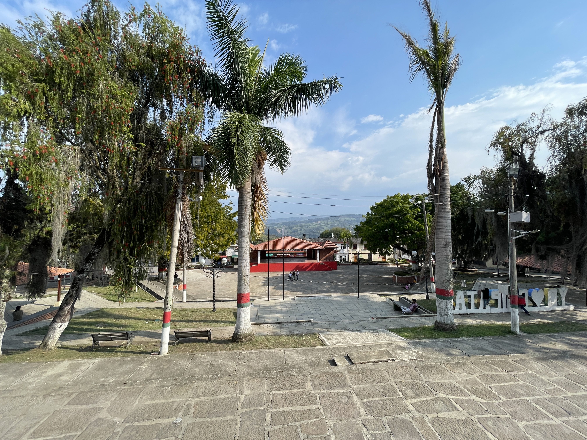

<br><details><summary>:camera:**46/IMG_0435.JPG**</summary><sub> `Exif version` 0232 `OS version` 17.4.1 `Date` 2024:03:29 15:41:39 `Aperture` Not known `Brightness` 8.940461109703572 `Color space` 65535 `Compression` 6`Exposure mode` 0 `Exposure time` 0.0021691973969631237 `Focal length` 1.54 `Lens model` iPhone 12 Pro Max back triple camera 1.54mm f/2.4 `Lens specification` (1.5399999618512084, 7.5, 1.6, 2.4) `Orientation` 6 `Scene type` Not known `f number` 2.4 `White balance` 0 `Sensing method` 2 `Shutter speed` 8.848754225616627</sub><sub>`Coordinates & altitude` (6.062983333333333, -73.6374888888889, 1798.961791831357)</sub><sub> :earth_americas:`Location over` [Google Maps](http://maps.google.com/maps?q=6.062983333333333,-73.6374888888889) or [Openstreet Map](https://www.openstreetmap.org/query?lat=6.062983333333333&lon=-73.6374888888889)</sub></details>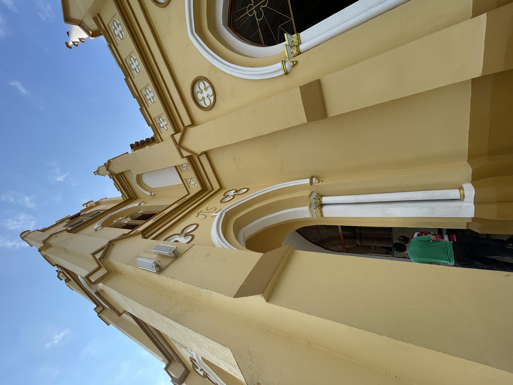

<br><details><summary>:camera:**46/IMG_0436.JPG**</summary><sub> `Exif version` 0232 `OS version` 17.4.1 `Date` 2024:03:29 15:42:06 `Aperture` Not known `Brightness` 3.6763698757879815 `Color space` 65535 `Compression` 6`Exposure mode` 0 `Exposure time` 0.010101010101010102 `Focal length` 1.54 `Lens model` iPhone 12 Pro Max back triple camera 1.54mm f/2.4 `Lens specification` (1.5399999618512084, 7.5, 1.6, 2.4) `Orientation` 6 `Scene type` Not known `f number` 2.4 `White balance` 0 `Sensing method` 2 `Shutter speed` 6.633792506821055</sub><sub>`Coordinates & altitude` (6.062919444444444, -73.63742777777779, 1790.4278169014085)</sub><sub> :earth_americas:`Location over` [Google Maps](http://maps.google.com/maps?q=6.062919444444444,-73.63742777777779) or [Openstreet Map](https://www.openstreetmap.org/query?lat=6.062919444444444&lon=-73.63742777777779)</sub></details>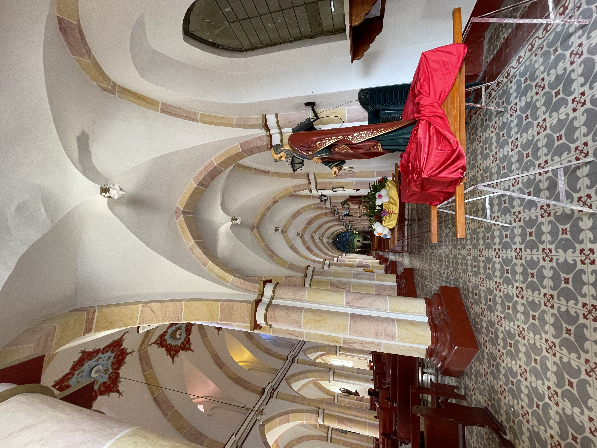

<br><details><summary>:camera:**46/IMG_0437.JPG**</summary><sub> `Exif version` 0232 `OS version` 17.4.1 `Date` 2024:03:29 15:42:23 `Aperture` Not known `Brightness` 3.71644731657341 `Color space` 65535 `Compression` 6`Exposure mode` 0 `Exposure time` 0.010101010101010102 `Focal length` 1.54 `Lens model` iPhone 12 Pro Max back triple camera 1.54mm f/2.4 `Lens specification` (1.5399999618512084, 7.5, 1.6, 2.4) `Orientation` 6 `Scene type` Not known `f number` 2.4 `White balance` 0 `Sensing method` 2 `Shutter speed` 6.633792506821055</sub><sub>`Coordinates & altitude` (6.062905555555555, -73.63750555555556, 1795.961303462322)</sub><sub> :earth_americas:`Location over` [Google Maps](http://maps.google.com/maps?q=6.062905555555555,-73.63750555555556) or [Openstreet Map](https://www.openstreetmap.org/query?lat=6.062905555555555&lon=-73.63750555555556)</sub></details>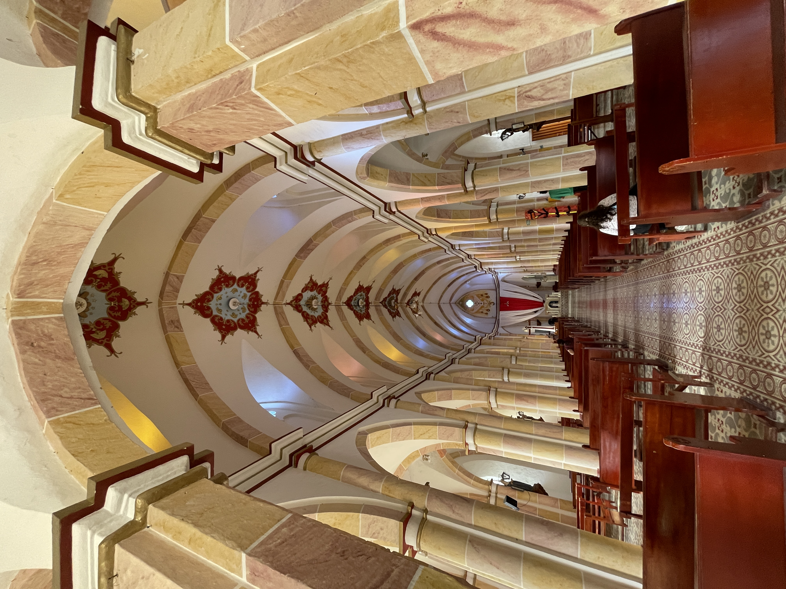

<br><details><summary>:camera:**46/IMG_0438.JPG**</summary><sub> `Exif version` 0232 `OS version` 17.4.1 `Date` 2024:03:29 15:42:59 `Aperture` Not known `Brightness` 4.015618374558304 `Color space` 65535 `Compression` 6`Exposure mode` 0 `Exposure time` 0.010101010101010102 `Focal length` 1.54 `Lens model` iPhone 12 Pro Max back triple camera 1.54mm f/2.4 `Lens specification` (1.5399999618512084, 7.5, 1.6, 2.4) `Orientation` 1 `Scene type` Not known `f number` 2.4 `White balance` 0 `Sensing method` 2 `Shutter speed` 6.633792506821055</sub><sub>`Coordinates & altitude` (6.062766666666667, -73.63780277777778, 1794.0018315018315)</sub><sub> :earth_americas:`Location over` [Google Maps](http://maps.google.com/maps?q=6.062766666666667,-73.63780277777778) or [Openstreet Map](https://www.openstreetmap.org/query?lat=6.062766666666667&lon=-73.63780277777778)</sub></details>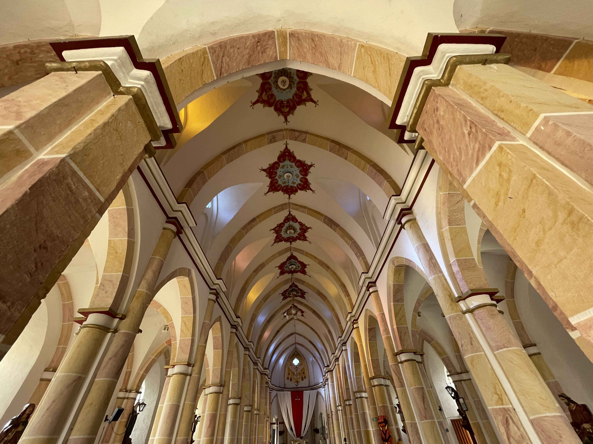

<br><details><summary>:camera:**46/IMG_0444.JPG**</summary><sub> `Exif version` 0232 `OS version` 17.4.1 `Date` 2024:03:29 15:52:27 `Aperture` Not known `Brightness` 9.912762022194821 `Color space` 65535 `Compression` 6`Exposure mode` 0 `Exposure time` 0.001314060446780552 `Focal length` 1.54 `Lens model` iPhone 12 Pro Max back triple camera 1.54mm f/2.4 `Lens specification` (1.5399999618512084, 7.5, 1.6, 2.4) `Orientation` 6 `Scene type` Not known `f number` 2.4 `White balance` 0 `Sensing method` 2 `Shutter speed` 9.571819010021256</sub><sub>`Coordinates & altitude` (6.0628416666666665, -73.63745833333334, 1785.970093457944)</sub><sub> :earth_americas:`Location over` [Google Maps](http://maps.google.com/maps?q=6.0628416666666665,-73.63745833333334) or [Openstreet Map](https://www.openstreetmap.org/query?lat=6.0628416666666665&lon=-73.63745833333334)</sub></details>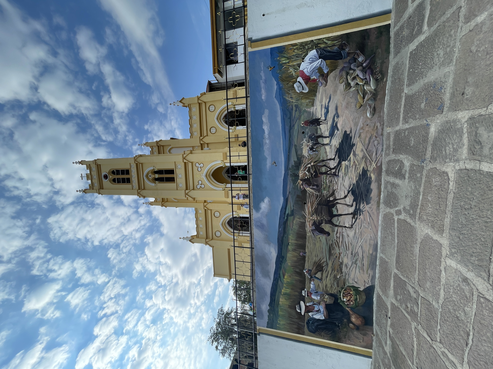

<br><details><summary>:camera:**46/IMG_0445.JPG**</summary><sub> `Exif version` 0232 `OS version` 17.4.1 `Date` 2024:03:29 15:52:41 `Aperture` Not known `Brightness` 9.406494206413365 `Color space` 65535 `Compression` 6`Exposure mode` 0 `Exposure time` 0.001876172607879925 `Focal length` 1.54 `Lens model` iPhone 12 Pro Max back triple camera 1.54mm f/2.4 `Lens specification` (1.5399999618512084, 7.5, 1.6, 2.4) `Orientation` 6 `Scene type` Not known `f number` 2.4 `White balance` 0 `Sensing method` 2 `Shutter speed` 9.057355631042592</sub><sub>`Coordinates & altitude` (6.0628416666666665, -73.63747222222223, 1788.0736086175943)</sub><sub> :earth_americas:`Location over` [Google Maps](http://maps.google.com/maps?q=6.0628416666666665,-73.63747222222223) or [Openstreet Map](https://www.openstreetmap.org/query?lat=6.0628416666666665&lon=-73.63747222222223)</sub></details>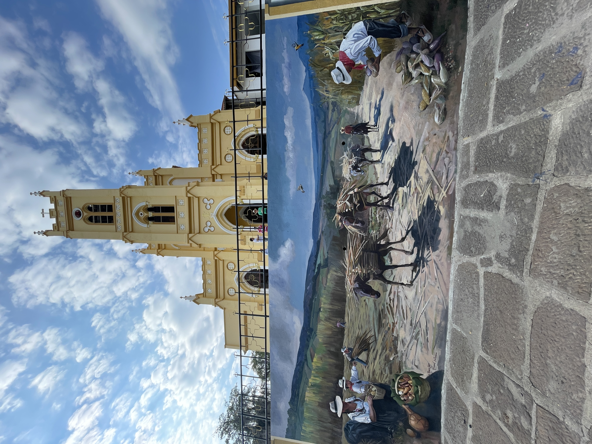

<br><details><summary>:camera:**46/IMG_0449.JPG**</summary><sub> `Exif version` 0232 `OS version` 17.4.1 `Date` 2024:03:29 15:56:20 `Aperture` Not known `Brightness` 8.850272131511717 `Color space` 65535 `Compression` 6`Exposure mode` 0 `Exposure time` 0.0016260162601626016 `Focal length` 1.54 `Lens model` iPhone 12 Pro Max back triple camera 1.54mm f/2.4 `Lens specification` (1.5399999618512084, 7.5, 1.6, 2.4) `Orientation` 1 `Scene type` Not known `f number` 2.4 `White balance` 0 `Sensing method` 2 `Shutter speed` 9.263570030254494</sub><sub>`Coordinates & altitude` (6.062672222222222, -73.63757222222223, 1784.2842998585572)</sub><sub> :earth_americas:`Location over` [Google Maps](http://maps.google.com/maps?q=6.062672222222222,-73.63757222222223) or [Openstreet Map](https://www.openstreetmap.org/query?lat=6.062672222222222&lon=-73.63757222222223)</sub></details>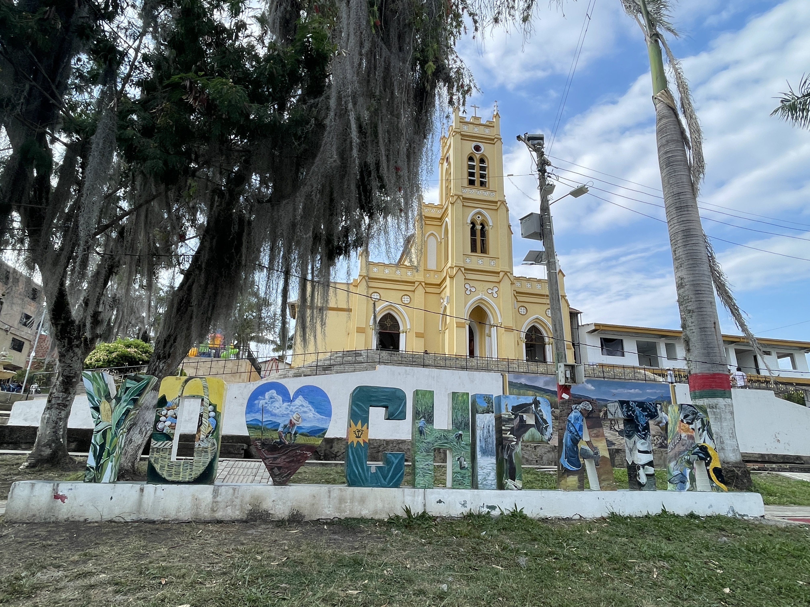

<br><details><summary>:camera:**46/IMG_2010.JPG**</summary><sub> `Exif version` 0232 `OS version` 18.3.1 `Date` 2025:02:22 09:51:57 `Aperture` Not known `Brightness` 6.622628715846574 `Color space` 65535 `Compression` 6`Exposure mode` 0 `Exposure time` 0.00847457627118644 `Focal length` 9.0 `Lens model` iPhone 14 Pro back triple camera 9mm f/2.8 `Lens specification` (2.220000028611935, 9.0, 1.7799999713880652, 2.8) `Orientation` 1 `Scene type` Not known `f number` 2.8 `White balance` 0 `Sensing method` 2 `Shutter speed` 6.878151727202043</sub><sub>`Coordinates & altitude` (6.014266666666667, -73.47694444444444, 2074.542113323124)</sub><sub> :earth_americas:`Location over` [Google Maps](http://maps.google.com/maps?q=6.014266666666667,-73.47694444444444) or [Openstreet Map](https://www.openstreetmap.org/query?lat=6.014266666666667&lon=-73.47694444444444)</sub></details>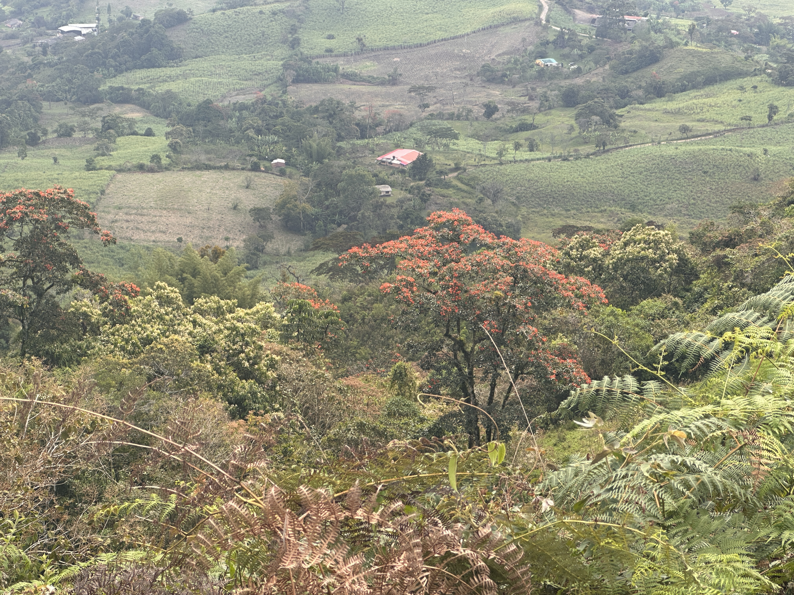

<br><details><summary>:camera:**46/IMG_2013.JPG**</summary><sub> `Exif version` 0232 `OS version` 18.3.1 `Date` 2025:02:22 09:52:53 `Aperture` Not known `Brightness` 9.563981799313483 `Color space` 65535 `Compression` 6`Exposure mode` Not known `Exposure time` 0.00022799817601459188 `Focal length` 6.86 `Lens model` iPhone 14 Pro back camera 6.86mm f/1.78 `Lens specification` (6.8600001335175875, 6.8600001335175875, 1.7799999713880652, 1.7799999713880652) `Orientation` 1 `Scene type` Not known `f number` 1.78 `White balance` 0 `Sensing method` 2 `Shutter speed` 12.098678565299467</sub><sub>`Coordinates & altitude` (6.014272222222222, -73.47696111111111, 2073.8551752921535)</sub><sub> :earth_americas:`Location over` [Google Maps](http://maps.google.com/maps?q=6.014272222222222,-73.47696111111111) or [Openstreet Map](https://www.openstreetmap.org/query?lat=6.014272222222222&lon=-73.47696111111111)</sub></details>

<br><details><summary>:camera:**46/IMG_2014.JPG**</summary><sub> `Exif version` 0232 `OS version` 18.3.1 `Date` 2025:02:22 09:55:28 `Aperture` Not known `Brightness` 9.84685077097308 `Color space` 65535 `Compression` 6`Exposure mode` Not known `Exposure time` 0.00019798059790140566 `Focal length` 6.86 `Lens model` iPhone 14 Pro back camera 6.86mm f/1.78 `Lens specification` (6.8600001335175875, 6.8600001335175875, 1.7799999713880652, 1.7799999713880652) `Orientation` 1 `Scene type` Not known `f number` 1.78 `White balance` 0 `Sensing method` 2 `Shutter speed` 12.30221195113899</sub><sub>`Coordinates & altitude` (6.013738888888889, -73.4773388888889, 2074.2828985507244)</sub><sub> :earth_americas:`Location over` [Google Maps](http://maps.google.com/maps?q=6.013738888888889,-73.4773388888889) or [Openstreet Map](https://www.openstreetmap.org/query?lat=6.013738888888889&lon=-73.4773388888889)</sub></details>

<br><details><summary>:camera:**46/IMG_20250816_092936512.jpg**</summary><sub> `Exif version` 0220 `OS version`  `Date` 2025:08:16 09:29:37 `Aperture` Not known `Brightness` 0.0 `Color space` 1 `Compression` 6`Exposure mode` 0 `Exposure time` 0.000540378 `Focal length` 2.13 `Lens model` Not known `Lens specification` Not known `Orientation` 1 `Scene type` Not known `f number` 2.2 `White balance` 0 `Sensing method` 1 `Shutter speed` 10.853</sub><sub>`Coordinates & altitude` (5.3850421666666675, -73.68643186111112, 2695.0)</sub><sub> :earth_americas:`Location over` [Google Maps](http://maps.google.com/maps?q=5.3850421666666675,-73.68643186111112) or [Openstreet Map](https://www.openstreetmap.org/query?lat=5.3850421666666675&lon=-73.68643186111112)</sub></details>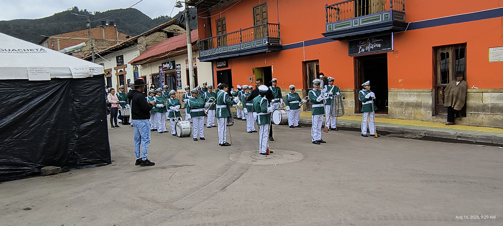

<br><details><summary>:camera:**46/IMG_20250816_092940765.jpg**</summary><sub> `Exif version` 0220 `OS version`  `Date` 2025:08:16 09:29:41 `Aperture` Not known `Brightness` 0.0 `Color space` 1 `Compression` 6`Exposure mode` 0 `Exposure time` 0.000530371 `Focal length` 2.13 `Lens model` Not known `Lens specification` Not known `Orientation` 6 `Scene type` Not known `f number` 2.2 `White balance` 0 `Sensing method` 1 `Shutter speed` 10.88</sub><sub>`Coordinates & altitude` (5.3850421666666675, -73.68643186111112, 2695.0)</sub><sub> :earth_americas:`Location over` [Google Maps](http://maps.google.com/maps?q=5.3850421666666675,-73.68643186111112) or [Openstreet Map](https://www.openstreetmap.org/query?lat=5.3850421666666675&lon=-73.68643186111112)</sub></details>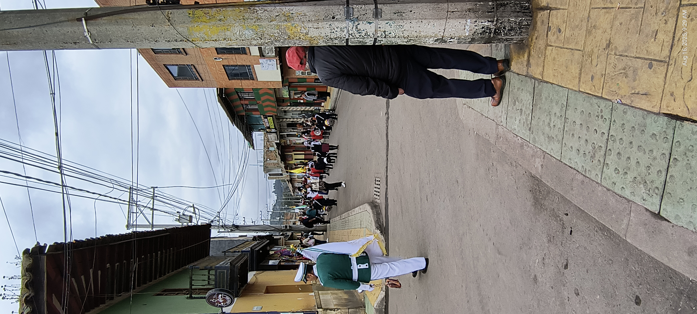

<br><details><summary>:camera:**46/IMG_20250816_092943426.jpg**</summary><sub> `Exif version` 0220 `OS version`  `Date` 2025:08:16 09:29:44 `Aperture` Not known `Brightness` 0.0 `Color space` 1 `Compression` 6`Exposure mode` 0 `Exposure time` 0.00050035 `Focal length` 2.13 `Lens model` Not known `Lens specification` Not known `Orientation` 6 `Scene type` Not known `f number` 2.2 `White balance` 0 `Sensing method` 1 `Shutter speed` 10.964</sub><sub>`Coordinates & altitude` (5.3850421666666675, -73.68643186111112, 2695.0)</sub><sub> :earth_americas:`Location over` [Google Maps](http://maps.google.com/maps?q=5.3850421666666675,-73.68643186111112) or [Openstreet Map](https://www.openstreetmap.org/query?lat=5.3850421666666675&lon=-73.68643186111112)</sub></details>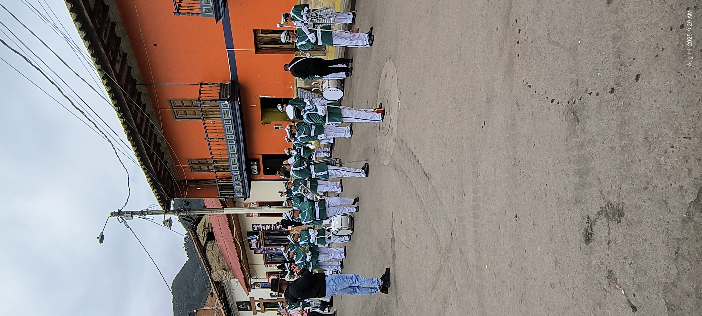

<br><details><summary>:camera:**46/IMG_20250816_092945679.jpg**</summary><sub> `Exif version` 0220 `OS version`  `Date` 2025:08:16 09:29:46 `Aperture` Not known `Brightness` 0.0 `Color space` 1 `Compression` 6`Exposure mode` 0 `Exposure time` 0.00050035 `Focal length` 2.13 `Lens model` Not known `Lens specification` Not known `Orientation` 6 `Scene type` Not known `f number` 2.2 `White balance` 0 `Sensing method` 1 `Shutter speed` 10.964</sub><sub>`Coordinates & altitude` (5.3850421666666675, -73.68643186111112, 2695.0)</sub><sub> :earth_americas:`Location over` [Google Maps](http://maps.google.com/maps?q=5.3850421666666675,-73.68643186111112) or [Openstreet Map](https://www.openstreetmap.org/query?lat=5.3850421666666675&lon=-73.68643186111112)</sub></details>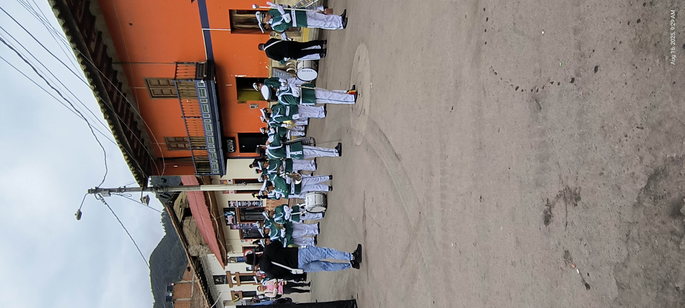

<br><details><summary>:camera:**46/IMG_20250816_092951887.jpg**</summary><sub> `Exif version` 0220 `OS version`  `Date` 2025:08:16 09:29:52 `Aperture` Not known `Brightness` 0.0 `Color space` 1 `Compression` 6`Exposure mode` 0 `Exposure time` 0.000250175 `Focal length` 2.13 `Lens model` Not known `Lens specification` Not known `Orientation` 1 `Scene type` Not known `f number` 2.2 `White balance` 0 `Sensing method` 1 `Shutter speed` 11.964</sub><sub>`Coordinates & altitude` (5.3850421666666675, -73.68643186111112, 2695.0)</sub><sub> :earth_americas:`Location over` [Google Maps](http://maps.google.com/maps?q=5.3850421666666675,-73.68643186111112) or [Openstreet Map](https://www.openstreetmap.org/query?lat=5.3850421666666675&lon=-73.68643186111112)</sub></details>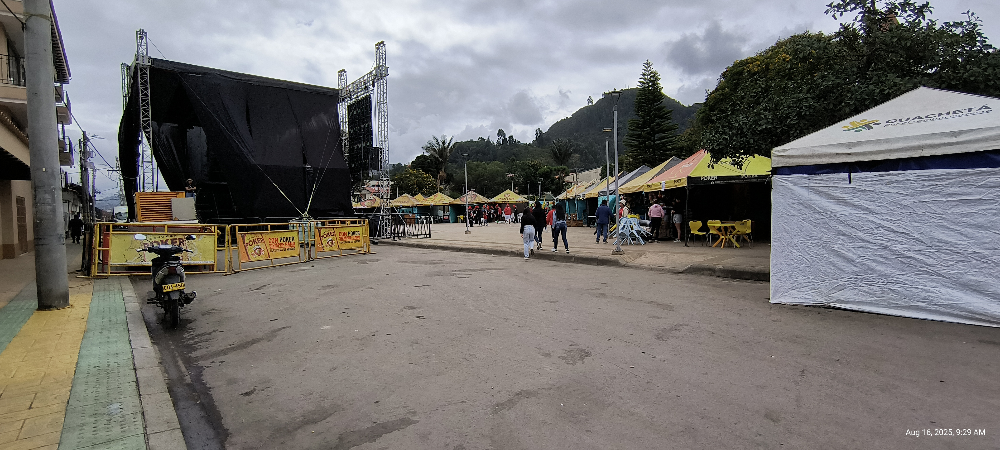

<br><details><summary>:camera:**46/IMG_20250816_105015018.jpg**</summary><sub> `Exif version` 0220 `OS version`  `Date` 2025:08:16 10:50:15 `Aperture` Not known `Brightness` 0.0 `Color space` 1 `Compression` 6`Exposure mode` 0 `Exposure time` 0.000290203 `Focal length` 2.13 `Lens model` Not known `Lens specification` Not known `Orientation` 1 `Scene type` Not known `f number` 2.2 `White balance` 0 `Sensing method` 1 `Shutter speed` 11.75</sub><sub>`Coordinates & altitude` (5.583733111111111, -73.69647977777778, 0.0)</sub><sub> :earth_americas:`Location over` [Google Maps](http://maps.google.com/maps?q=5.583733111111111,-73.69647977777778) or [Openstreet Map](https://www.openstreetmap.org/query?lat=5.583733111111111&lon=-73.69647977777778)</sub></details>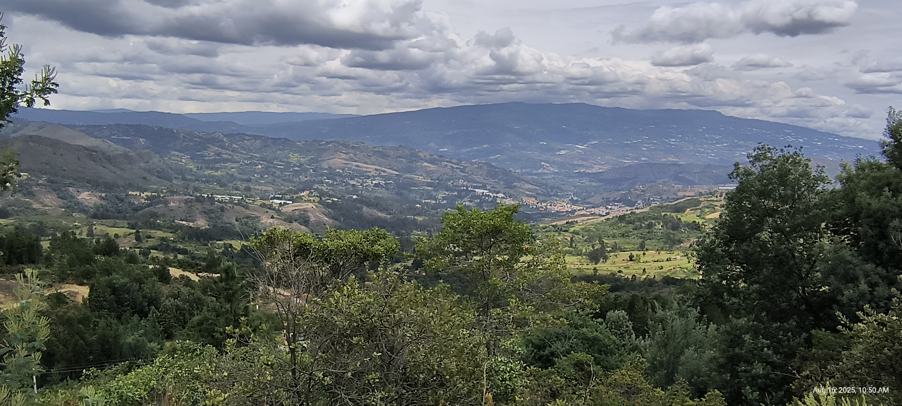

<br><details><summary>:camera:**46/IMG_20250816_105021908.jpg**</summary><sub> `Exif version` 0220 `OS version`  `Date` 2025:08:16 10:50:22 `Aperture` Not known `Brightness` 0.0 `Color space` 1 `Compression` 6`Exposure mode` 0 `Exposure time` 0.000390273 `Focal length` 2.13 `Lens model` Not known `Lens specification` Not known `Orientation` 1 `Scene type` Not known `f number` 2.2 `White balance` 0 `Sensing method` 1 `Shutter speed` 11.323</sub><sub>`Coordinates & altitude` (5.583733111111111, -73.69647977777778, 0.0)</sub><sub> :earth_americas:`Location over` [Google Maps](http://maps.google.com/maps?q=5.583733111111111,-73.69647977777778) or [Openstreet Map](https://www.openstreetmap.org/query?lat=5.583733111111111&lon=-73.69647977777778)</sub></details>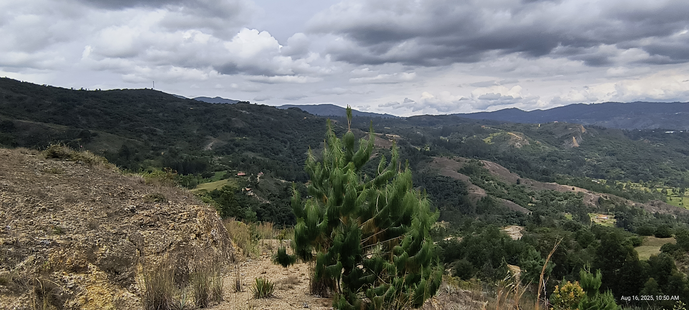

<br><details><summary>:camera:**46/IMG_20250816_105028760.jpg**</summary><sub> `Exif version` 0220 `OS version`  `Date` 2025:08:16 10:50:29 `Aperture` Not known `Brightness` 0.0 `Color space` 1 `Compression` 6`Exposure mode` 0 `Exposure time` 0.000310217 `Focal length` 2.13 `Lens model` Not known `Lens specification` Not known `Orientation` 1 `Scene type` Not known `f number` 2.2 `White balance` 0 `Sensing method` 1 `Shutter speed` 11.654</sub><sub>`Coordinates & altitude` (5.583733111111111, -73.69647977777778, 0.0)</sub><sub> :earth_americas:`Location over` [Google Maps](http://maps.google.com/maps?q=5.583733111111111,-73.69647977777778) or [Openstreet Map](https://www.openstreetmap.org/query?lat=5.583733111111111&lon=-73.69647977777778)</sub></details>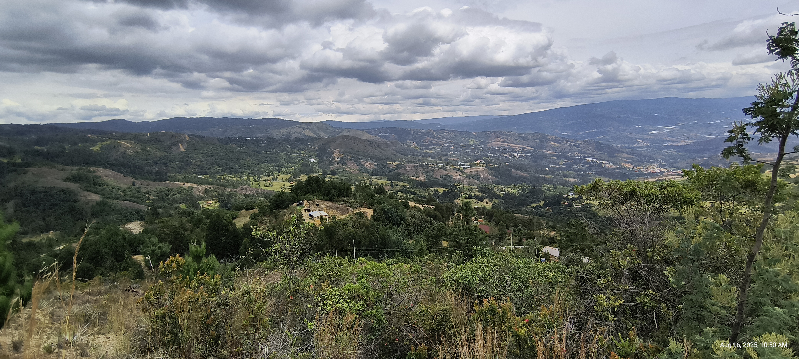

<br><details><summary>:camera:**46/IMG_20250816_105032978.jpg**</summary><sub> `Exif version` 0220 `OS version`  `Date` 2025:08:16 10:50:33 `Aperture` Not known `Brightness` 0.0 `Color space` 1 `Compression` 6`Exposure mode` 0 `Exposure time` 0.000270189 `Focal length` 2.13 `Lens model` Not known `Lens specification` Not known `Orientation` 1 `Scene type` Not known `f number` 2.2 `White balance` 0 `Sensing method` 1 `Shutter speed` 11.853</sub><sub>`Coordinates & altitude` (5.583733111111111, -73.69647977777778, 0.0)</sub><sub> :earth_americas:`Location over` [Google Maps](http://maps.google.com/maps?q=5.583733111111111,-73.69647977777778) or [Openstreet Map](https://www.openstreetmap.org/query?lat=5.583733111111111&lon=-73.69647977777778)</sub></details>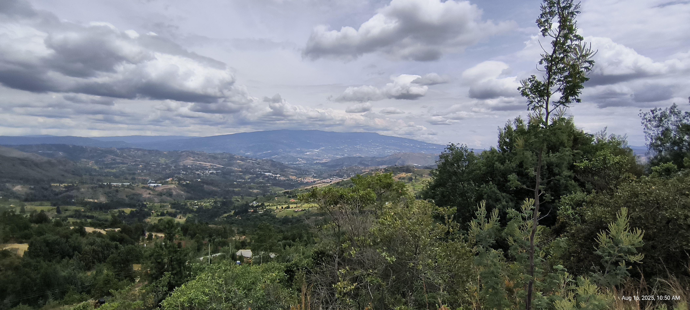

<br><details><summary>:camera:**46/IMG_20250816_105036614.jpg**</summary><sub> `Exif version` 0220 `OS version`  `Date` 2025:08:16 10:50:37 `Aperture` Not known `Brightness` 0.0 `Color space` 1 `Compression` 6`Exposure mode` 0 `Exposure time` 0.000280196 `Focal length` 2.13 `Lens model` Not known `Lens specification` Not known `Orientation` 6 `Scene type` Not known `f number` 2.2 `White balance` 0 `Sensing method` 1 `Shutter speed` 11.801</sub><sub>`Coordinates & altitude` (5.583733111111111, -73.69647977777778, 0.0)</sub><sub> :earth_americas:`Location over` [Google Maps](http://maps.google.com/maps?q=5.583733111111111,-73.69647977777778) or [Openstreet Map](https://www.openstreetmap.org/query?lat=5.583733111111111&lon=-73.69647977777778)</sub></details>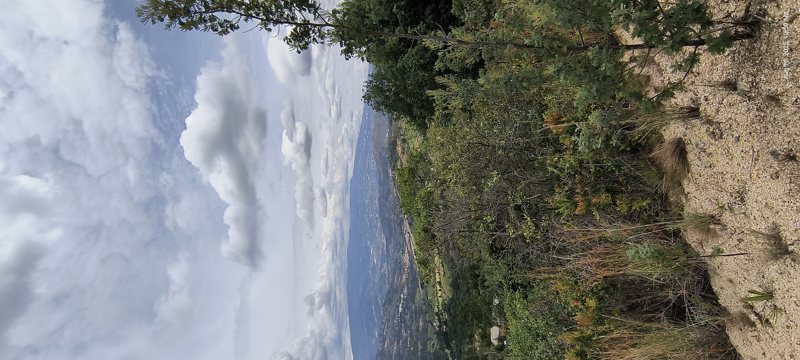

<br><details><summary>:camera:**46/IMG_20250816_105158227.jpg**</summary><sub> `Exif version` 0220 `OS version`  `Date` 2025:08:16 10:51:59 `Aperture` Not known `Brightness` 0.0 `Color space` 1 `Compression` 6`Exposure mode` 0 `Exposure time` 0.00050035 `Focal length` 2.13 `Lens model` Not known `Lens specification` Not known `Orientation` 1 `Scene type` Not known `f number` 2.2 `White balance` 0 `Sensing method` 1 `Shutter speed` 10.964</sub><sub>`Coordinates & altitude` (5.506512138888889, -73.62281797222222, 2613.0)</sub><sub> :earth_americas:`Location over` [Google Maps](http://maps.google.com/maps?q=5.506512138888889,-73.62281797222222) or [Openstreet Map](https://www.openstreetmap.org/query?lat=5.506512138888889&lon=-73.62281797222222)</sub></details>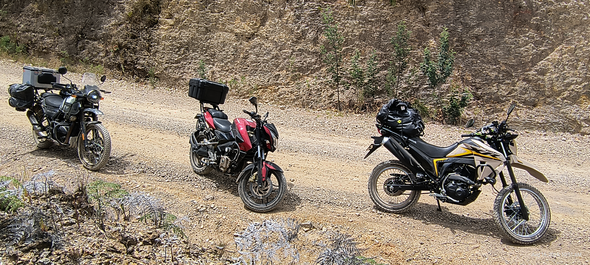

<br><details><summary>:camera:**46/IMG_20250816_105200530.jpg**</summary><sub> `Exif version` 0220 `OS version`  `Date` 2025:08:16 10:52:01 `Aperture` Not known `Brightness` 0.0 `Color space` 1 `Compression` 6`Exposure mode` 0 `Exposure time` 0.000470329 `Focal length` 2.13 `Lens model` Not known `Lens specification` Not known `Orientation` 1 `Scene type` Not known `f number` 2.2 `White balance` 0 `Sensing method` 1 `Shutter speed` 11.054</sub><sub>`Coordinates & altitude` (5.506512138888889, -73.62281797222222, 2613.0)</sub><sub> :earth_americas:`Location over` [Google Maps](http://maps.google.com/maps?q=5.506512138888889,-73.62281797222222) or [Openstreet Map](https://www.openstreetmap.org/query?lat=5.506512138888889&lon=-73.62281797222222)</sub></details>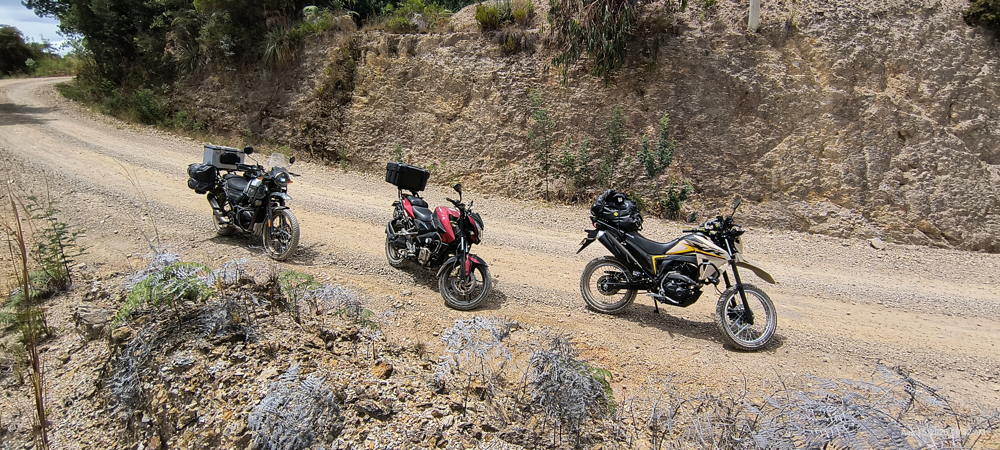

<br><details><summary>:camera:**46/IMG_20250816_105202297.jpg**</summary><sub> `Exif version` 0220 `OS version`  `Date` 2025:08:16 10:52:03 `Aperture` Not known `Brightness` 0.0 `Color space` 1 `Compression` 6`Exposure mode` 0 `Exposure time` 0.000470329 `Focal length` 2.13 `Lens model` Not known `Lens specification` Not known `Orientation` 1 `Scene type` Not known `f number` 2.2 `White balance` 0 `Sensing method` 1 `Shutter speed` 11.054</sub><sub>`Coordinates & altitude` (5.506512138888889, -73.62281797222222, 2613.0)</sub><sub> :earth_americas:`Location over` [Google Maps](http://maps.google.com/maps?q=5.506512138888889,-73.62281797222222) or [Openstreet Map](https://www.openstreetmap.org/query?lat=5.506512138888889&lon=-73.62281797222222)</sub></details>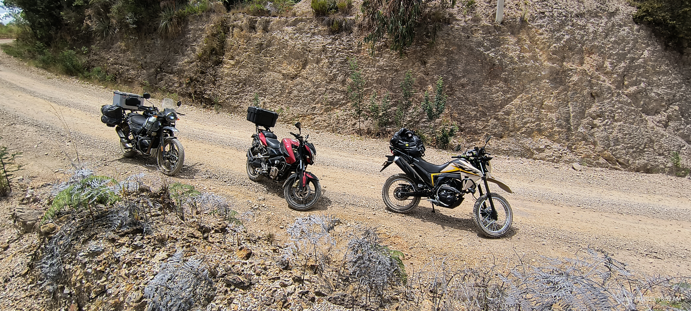

<br><details><summary>:camera:**46/IMG_20250816_112503211_HDR.jpg**</summary><sub> `Exif version` 0220 `OS version`  `Date` 2025:08:16 11:25:04 `Aperture` Not known `Brightness` 0.0 `Color space` 1 `Compression` 6`Exposure mode` 0 `Exposure time` 0.00050035 `Focal length` 2.13 `Lens model` Not known `Lens specification` Not known `Orientation` 6 `Scene type` Not known `f number` 2.2 `White balance` 0 `Sensing method` 1 `Shutter speed` 10.964</sub><sub>`Coordinates & altitude` (5.5380701666666665, -73.63306424999999, 2286.0)</sub><sub> :earth_americas:`Location over` [Google Maps](http://maps.google.com/maps?q=5.5380701666666665,-73.63306424999999) or [Openstreet Map](https://www.openstreetmap.org/query?lat=5.5380701666666665&lon=-73.63306424999999)</sub></details>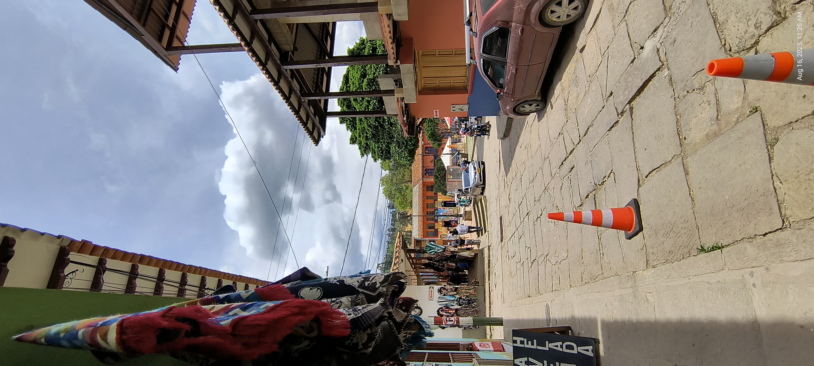

<br><details><summary>:camera:**46/IMG_20250816_112507148_HDR.jpg**</summary><sub> `Exif version` 0220 `OS version`  `Date` 2025:08:16 11:25:08 `Aperture` Not known `Brightness` 0.0 `Color space` 1 `Compression` 6`Exposure mode` 0 `Exposure time` 0.000550385 `Focal length` 2.13 `Lens model` Not known `Lens specification` Not known `Orientation` 1 `Scene type` Not known `f number` 2.2 `White balance` 0 `Sensing method` 1 `Shutter speed` 10.827</sub><sub>`Coordinates & altitude` (5.5380701666666665, -73.63306424999999, 2286.0)</sub><sub> :earth_americas:`Location over` [Google Maps](http://maps.google.com/maps?q=5.5380701666666665,-73.63306424999999) or [Openstreet Map](https://www.openstreetmap.org/query?lat=5.5380701666666665&lon=-73.63306424999999)</sub></details>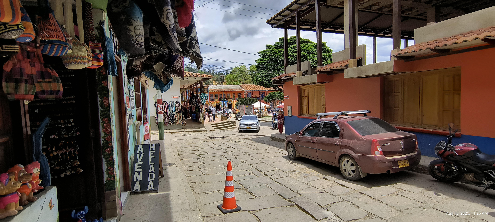

<br><details><summary>:camera:**46/IMG_20250816_112702468_HDR.jpg**</summary><sub> `Exif version` 0220 `OS version`  `Date` 2025:08:16 11:27:04 `Aperture` Not known `Brightness` 0.0 `Color space` 1 `Compression` 6`Exposure mode` 0 `Exposure time` 0.000320224 `Focal length` 2.13 `Lens model` Not known `Lens specification` Not known `Orientation` 1 `Scene type` Not known `f number` 2.2 `White balance` 0 `Sensing method` 1 `Shutter speed` 11.608</sub><sub>`Coordinates & altitude` (5.537725944444444, -73.63275908333333, 2175.0)</sub><sub> :earth_americas:`Location over` [Google Maps](http://maps.google.com/maps?q=5.537725944444444,-73.63275908333333) or [Openstreet Map](https://www.openstreetmap.org/query?lat=5.537725944444444&lon=-73.63275908333333)</sub></details>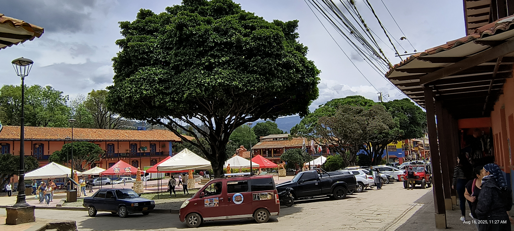

<br><details><summary>:camera:**46/IMG_20250816_112705975.jpg**</summary><sub> `Exif version` 0220 `OS version`  `Date` 2025:08:16 11:27:06 `Aperture` Not known `Brightness` 0.0 `Color space` 1 `Compression` 6`Exposure mode` 0 `Exposure time` 0.000310217 `Focal length` 2.13 `Lens model` Not known `Lens specification` Not known `Orientation` 6 `Scene type` Not known `f number` 2.2 `White balance` 0 `Sensing method` 1 `Shutter speed` 11.654</sub><sub>`Coordinates & altitude` (5.537725944444444, -73.63275908333333, 2175.0)</sub><sub> :earth_americas:`Location over` [Google Maps](http://maps.google.com/maps?q=5.537725944444444,-73.63275908333333) or [Openstreet Map](https://www.openstreetmap.org/query?lat=5.537725944444444&lon=-73.63275908333333)</sub></details>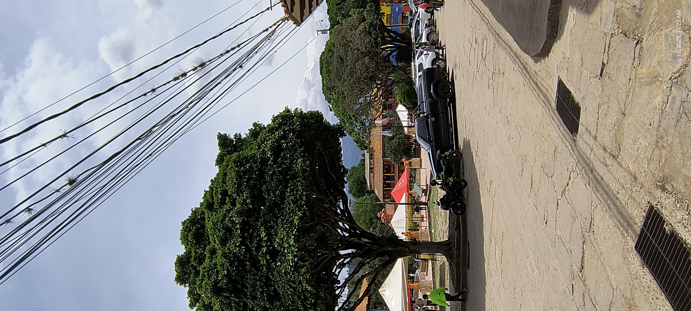

<br><details><summary>:camera:**46/IMG_20250816_112713093.jpg**</summary><sub> `Exif version` 0220 `OS version`  `Date` 2025:08:16 11:27:13 `Aperture` Not known `Brightness` 0.0 `Color space` 1 `Compression` 6`Exposure mode` 0 `Exposure time` 0.000350245 `Focal length` 2.13 `Lens model` Not known `Lens specification` Not known `Orientation` 6 `Scene type` Not known `f number` 2.2 `White balance` 0 `Sensing method` 1 `Shutter speed` 11.479</sub><sub>`Coordinates & altitude` (5.537725944444444, -73.63275908333333, 2175.0)</sub><sub> :earth_americas:`Location over` [Google Maps](http://maps.google.com/maps?q=5.537725944444444,-73.63275908333333) or [Openstreet Map](https://www.openstreetmap.org/query?lat=5.537725944444444&lon=-73.63275908333333)</sub></details>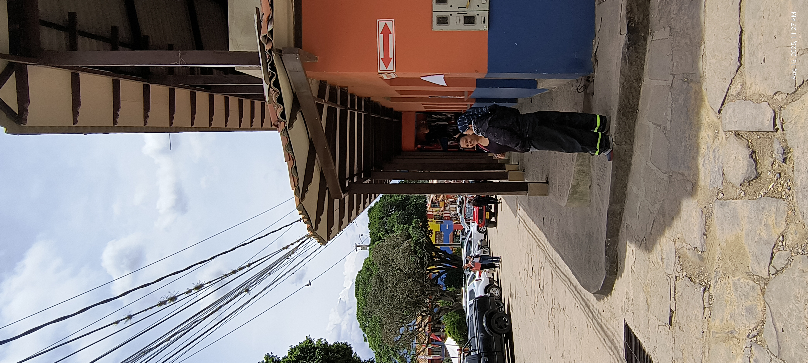

<br><details><summary>:camera:**46/IMG_20250816_112721841.jpg**</summary><sub> `Exif version` 0220 `OS version`  `Date` 2025:08:16 11:27:22 `Aperture` Not known `Brightness` 0.0 `Color space` 1 `Compression` 6`Exposure mode` 0 `Exposure time` 0.00040028 `Focal length` 2.13 `Lens model` Not known `Lens specification` Not known `Orientation` 6 `Scene type` Not known `f number` 2.2 `White balance` 0 `Sensing method` 1 `Shutter speed` 11.286</sub><sub>`Coordinates & altitude` (5.537725944444444, -73.63275908333333, 2175.0)</sub><sub> :earth_americas:`Location over` [Google Maps](http://maps.google.com/maps?q=5.537725944444444,-73.63275908333333) or [Openstreet Map](https://www.openstreetmap.org/query?lat=5.537725944444444&lon=-73.63275908333333)</sub></details>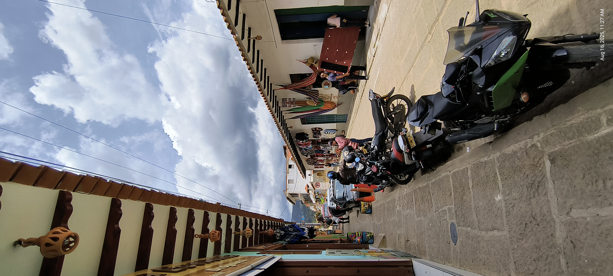

<br><details><summary>:camera:**46/IMG_20250816_112725352.jpg**</summary><sub> `Exif version` 0220 `OS version`  `Date` 2025:08:16 11:27:26 `Aperture` Not known `Brightness` 0.0 `Color space` 1 `Compression` 6`Exposure mode` 0 `Exposure time` 0.000470329 `Focal length` 2.13 `Lens model` Not known `Lens specification` Not known `Orientation` 1 `Scene type` Not known `f number` 2.2 `White balance` 0 `Sensing method` 1 `Shutter speed` 11.054</sub><sub>`Coordinates & altitude` (5.537725944444444, -73.63275908333333, 2175.0)</sub><sub> :earth_americas:`Location over` [Google Maps](http://maps.google.com/maps?q=5.537725944444444,-73.63275908333333) or [Openstreet Map](https://www.openstreetmap.org/query?lat=5.537725944444444&lon=-73.63275908333333)</sub></details>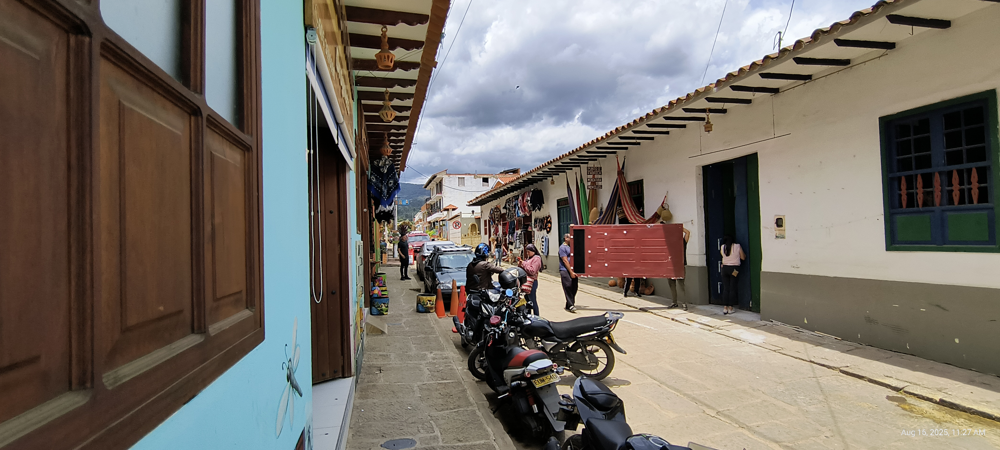

<br><details><summary>:camera:**46/IMG_20250816_112746015.jpg**</summary><sub> `Exif version` 0220 `OS version`  `Date` 2025:08:16 11:27:46 `Aperture` Not known `Brightness` 0.0 `Color space` 1 `Compression` 6`Exposure mode` 0 `Exposure time` 0.00040028 `Focal length` 2.13 `Lens model` Not known `Lens specification` Not known `Orientation` 1 `Scene type` Not known `f number` 2.2 `White balance` 0 `Sensing method` 1 `Shutter speed` 11.286</sub><sub>`Coordinates & altitude` (5.537725944444444, -73.63275908333333, 2175.0)</sub><sub> :earth_americas:`Location over` [Google Maps](http://maps.google.com/maps?q=5.537725944444444,-73.63275908333333) or [Openstreet Map](https://www.openstreetmap.org/query?lat=5.537725944444444&lon=-73.63275908333333)</sub></details>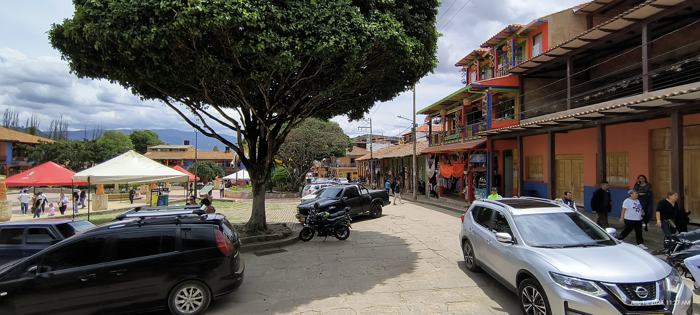

<br><details><summary>:camera:**46/IMG_20250816_112748960.jpg**</summary><sub> `Exif version` 0220 `OS version`  `Date` 2025:08:16 11:27:49 `Aperture` Not known `Brightness` 0.0 `Color space` 1 `Compression` 6`Exposure mode` 0 `Exposure time` 0.000380266 `Focal length` 2.13 `Lens model` Not known `Lens specification` Not known `Orientation` 1 `Scene type` Not known `f number` 2.2 `White balance` 0 `Sensing method` 1 `Shutter speed` 11.36</sub><sub>`Coordinates & altitude` (5.537725944444444, -73.63275908333333, 2175.0)</sub><sub> :earth_americas:`Location over` [Google Maps](http://maps.google.com/maps?q=5.537725944444444,-73.63275908333333) or [Openstreet Map](https://www.openstreetmap.org/query?lat=5.537725944444444&lon=-73.63275908333333)</sub></details>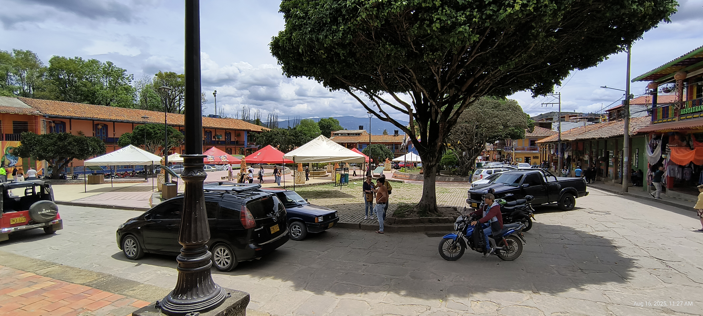

<br><details><summary>:camera:**46/IMG_20250816_112752331.jpg**</summary><sub> `Exif version` 0220 `OS version`  `Date` 2025:08:16 11:27:53 `Aperture` Not known `Brightness` 0.0 `Color space` 1 `Compression` 6`Exposure mode` 0 `Exposure time` 0.000350245 `Focal length` 2.13 `Lens model` Not known `Lens specification` Not known `Orientation` 1 `Scene type` Not known `f number` 2.2 `White balance` 0 `Sensing method` 1 `Shutter speed` 11.479</sub><sub>`Coordinates & altitude` (5.537725944444444, -73.63275908333333, 2175.0)</sub><sub> :earth_americas:`Location over` [Google Maps](http://maps.google.com/maps?q=5.537725944444444,-73.63275908333333) or [Openstreet Map](https://www.openstreetmap.org/query?lat=5.537725944444444&lon=-73.63275908333333)</sub></details>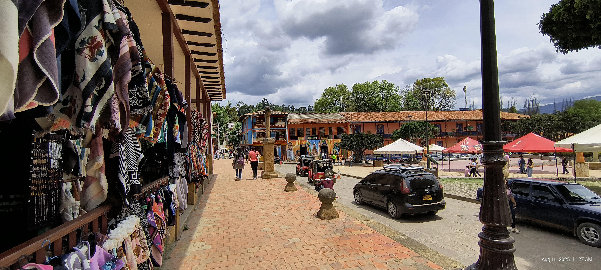

<br><details><summary>:camera:**46/IMG_20250816_115134530.jpg**</summary><sub> `Exif version` 0220 `OS version`  `Date` 2025:08:16 11:51:35 `Aperture` Not known `Brightness` 0.0 `Color space` 1 `Compression` 6`Exposure mode` 0 `Exposure time` 0.000370259 `Focal length` 2.13 `Lens model` Not known `Lens specification` Not known `Orientation` 6 `Scene type` Not known `f number` 2.2 `White balance` 0 `Sensing method` 1 `Shutter speed` 11.399</sub><sub>`Coordinates & altitude` (5.5405101666666665, -73.63288877777777, 2168.0)</sub><sub> :earth_americas:`Location over` [Google Maps](http://maps.google.com/maps?q=5.5405101666666665,-73.63288877777777) or [Openstreet Map](https://www.openstreetmap.org/query?lat=5.5405101666666665&lon=-73.63288877777777)</sub></details>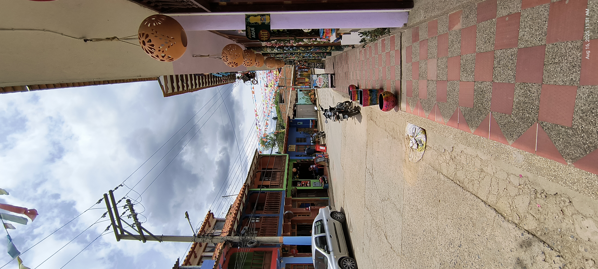

<br><details><summary>:camera:**46/IMG_20250816_115147927.jpg**</summary><sub> `Exif version` 0220 `OS version`  `Date` 2025:08:16 11:51:48 `Aperture` Not known `Brightness` 0.0 `Color space` 1 `Compression` 6`Exposure mode` 0 `Exposure time` 0.000440308 `Focal length` 2.13 `Lens model` Not known `Lens specification` Not known `Orientation` 1 `Scene type` Not known `f number` 2.2 `White balance` 0 `Sensing method` 1 `Shutter speed` 11.149</sub><sub>`Coordinates & altitude` (5.5405101666666665, -73.63288877777777, 2168.0)</sub><sub> :earth_americas:`Location over` [Google Maps](http://maps.google.com/maps?q=5.5405101666666665,-73.63288877777777) or [Openstreet Map](https://www.openstreetmap.org/query?lat=5.5405101666666665&lon=-73.63288877777777)</sub></details>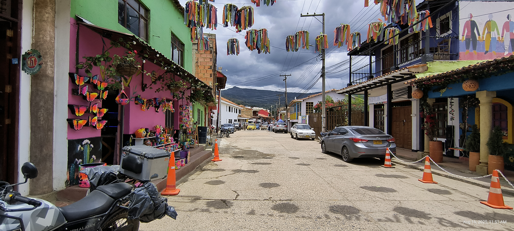

<br><details><summary>:camera:**46/IMG_20250816_134323380.jpg**</summary><sub> `Exif version` 0220 `OS version`  `Date` 2025:08:16 13:43:25 `Aperture` Not known `Brightness` 0.0 `Color space` 1 `Compression` 6`Exposure mode` 0 `Exposure time` 0.000512 `Focal length` 5.56 `Lens model` Not known `Lens specification` Not known `Orientation` 6 `Scene type` Not known `f number` 1.88 `White balance` 0 `Sensing method` 1 `Shutter speed` 10.931</sub></details>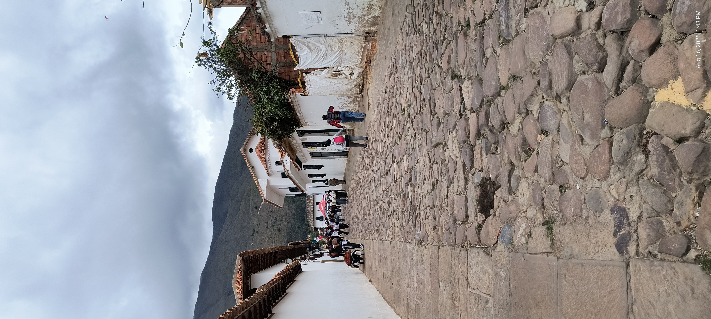

<br><details><summary>:camera:**46/IMG_20250816_134326445.jpg**</summary><sub> `Exif version` 0220 `OS version`  `Date` 2025:08:16 13:43:27 `Aperture` Not known `Brightness` 0.0 `Color space` 1 `Compression` 6`Exposure mode` 0 `Exposure time` 0.000448 `Focal length` 5.56 `Lens model` Not known `Lens specification` Not known `Orientation` 1 `Scene type` Not known `f number` 1.88 `White balance` 0 `Sensing method` 1 `Shutter speed` 11.124</sub></details>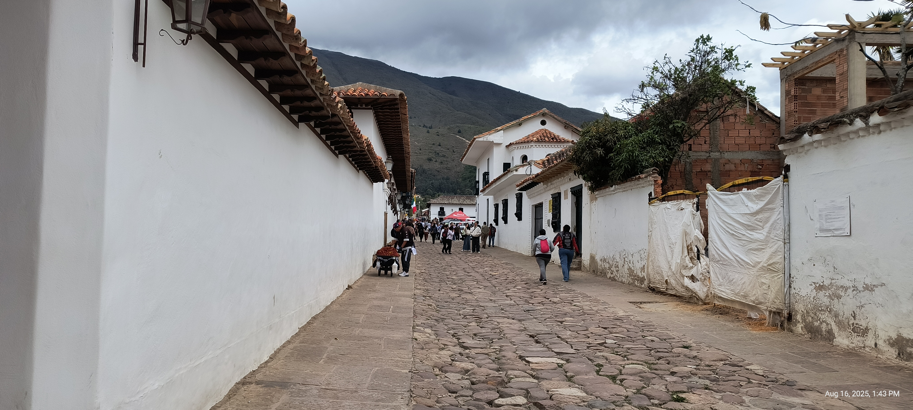

<br><details><summary>:camera:**46/IMG_20250816_134329402_HDR.jpg**</summary><sub> `Exif version` 0220 `OS version`  `Date` 2025:08:16 13:43:31 `Aperture` Not known `Brightness` 0.0 `Color space` 1 `Compression` 6`Exposure mode` 0 `Exposure time` 0.000448 `Focal length` 5.56 `Lens model` Not known `Lens specification` Not known `Orientation` 1 `Scene type` Not known `f number` 1.88 `White balance` 0 `Sensing method` 1 `Shutter speed` 11.124</sub></details>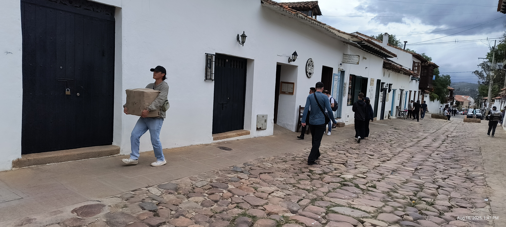

<br><details><summary>:camera:**46/IMG_20250816_134423245.jpg**</summary><sub> `Exif version` 0220 `OS version`  `Date` 2025:08:16 13:44:23 `Aperture` Not known `Brightness` 0.0 `Color space` 1 `Compression` 6`Exposure mode` 0 `Exposure time` 0.00032 `Focal length` 5.56 `Lens model` Not known `Lens specification` Not known `Orientation` 1 `Scene type` Not known `f number` 1.88 `White balance` 0 `Sensing method` 1 `Shutter speed` 11.609</sub></details>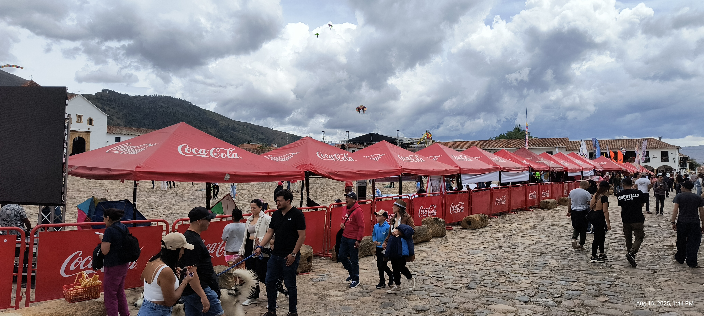

<br><details><summary>:camera:**46/IMG_20250816_134425623.jpg**</summary><sub> `Exif version` 0220 `OS version`  `Date` 2025:08:16 13:44:26 `Aperture` Not known `Brightness` 0.0 `Color space` 1 `Compression` 6`Exposure mode` 0 `Exposure time` 0.000256 `Focal length` 5.56 `Lens model` Not known `Lens specification` Not known `Orientation` 1 `Scene type` Not known `f number` 1.88 `White balance` 0 `Sensing method` 1 `Shutter speed` 11.931</sub></details>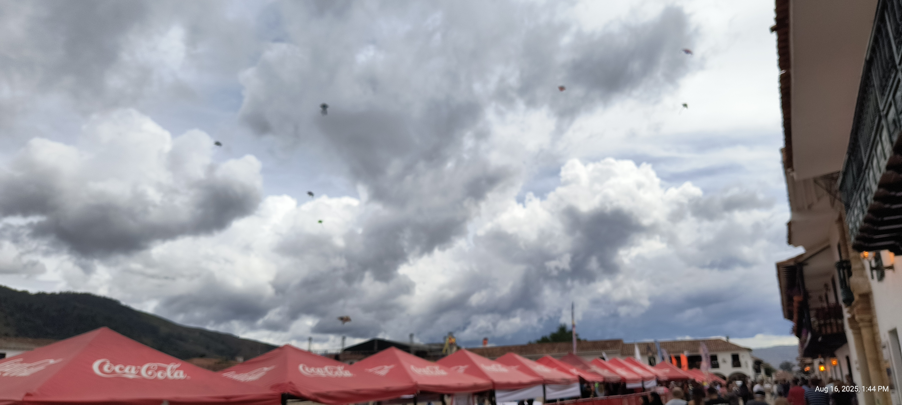

<br><details><summary>:camera:**46/IMG_20250816_134432715_HDR.jpg**</summary><sub> `Exif version` 0220 `OS version`  `Date` 2025:08:16 13:44:34 `Aperture` Not known `Brightness` 0.0 `Color space` 1 `Compression` 6`Exposure mode` 0 `Exposure time` 0.000330231 `Focal length` 2.13 `Lens model` Not known `Lens specification` Not known `Orientation` 6 `Scene type` Not known `f number` 2.2 `White balance` 0 `Sensing method` 1 `Shutter speed` 11.564</sub></details>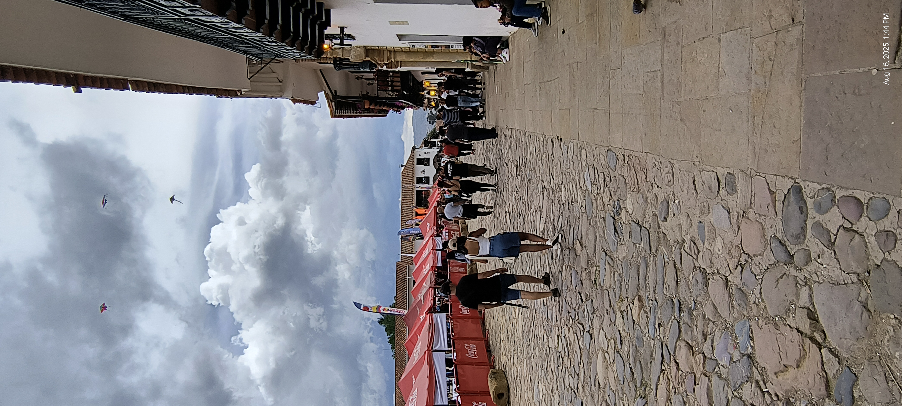

<br><details><summary>:camera:**46/IMG_20250816_134439473.jpg**</summary><sub> `Exif version` 0220 `OS version`  `Date` 2025:08:16 13:44:40 `Aperture` Not known `Brightness` 0.0 `Color space` 1 `Compression` 6`Exposure mode` 0 `Exposure time` 0.000470329 `Focal length` 2.13 `Lens model` Not known `Lens specification` Not known `Orientation` 1 `Scene type` Not known `f number` 2.2 `White balance` 0 `Sensing method` 1 `Shutter speed` 11.054</sub></details>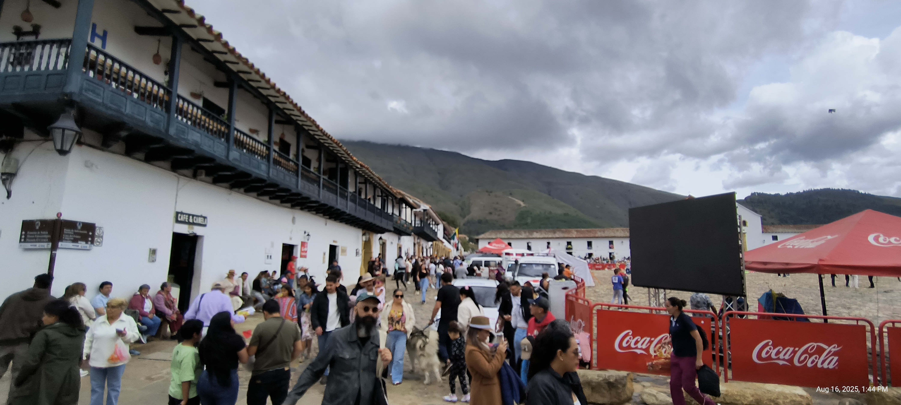

<br><details><summary>:camera:**46/IMG_20250816_134445777.jpg**</summary><sub> `Exif version` 0220 `OS version`  `Date` 2025:08:16 13:44:46 `Aperture` Not known `Brightness` 0.0 `Color space` 1 `Compression` 6`Exposure mode` 0 `Exposure time` 0.000420294 `Focal length` 2.13 `Lens model` Not known `Lens specification` Not known `Orientation` 6 `Scene type` Not known `f number` 2.2 `White balance` 0 `Sensing method` 1 `Shutter speed` 11.216</sub></details>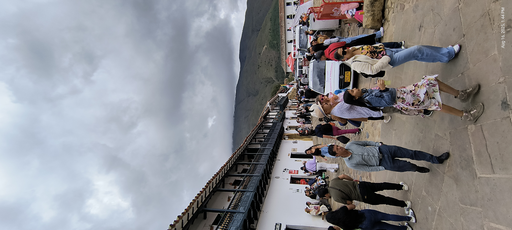

<br><details><summary>:camera:**46/IMG_20250816_134451829.jpg**</summary><sub> `Exif version` 0220 `OS version`  `Date` 2025:08:16 13:44:52 `Aperture` Not known `Brightness` 0.0 `Color space` 1 `Compression` 6`Exposure mode` 0 `Exposure time` 0.000540378 `Focal length` 2.13 `Lens model` Not known `Lens specification` Not known `Orientation` 1 `Scene type` Not known `f number` 2.2 `White balance` 0 `Sensing method` 1 `Shutter speed` 10.853</sub></details>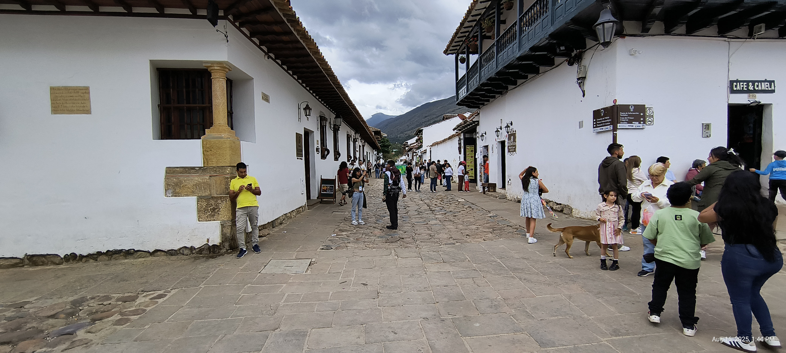

<br><details><summary>:camera:**46/IMG_20250816_134454303.jpg**</summary><sub> `Exif version` 0220 `OS version`  `Date` 2025:08:16 13:44:54 `Aperture` Not known `Brightness` 0.0 `Color space` 1 `Compression` 6`Exposure mode` 0 `Exposure time` 0.00050035 `Focal length` 2.13 `Lens model` Not known `Lens specification` Not known `Orientation` 6 `Scene type` Not known `f number` 2.2 `White balance` 0 `Sensing method` 1 `Shutter speed` 10.964</sub></details>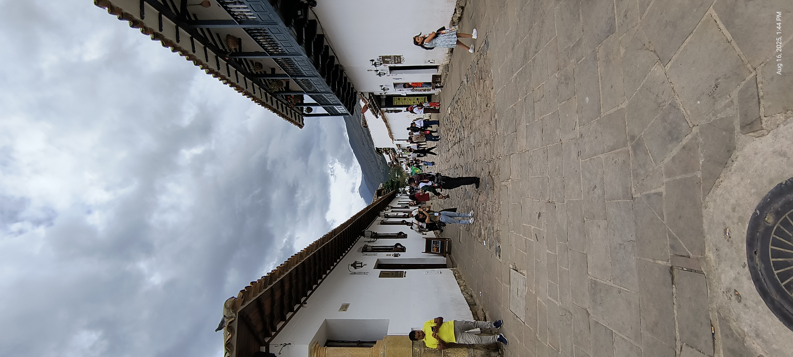

<br><details><summary>:camera:**46/IMG_20250816_134459973.jpg**</summary><sub> `Exif version` 0220 `OS version`  `Date` 2025:08:16 13:45:00 `Aperture` Not known `Brightness` 0.0 `Color space` 1 `Compression` 6`Exposure mode` 0 `Exposure time` 0.000320224 `Focal length` 2.13 `Lens model` Not known `Lens specification` Not known `Orientation` 1 `Scene type` Not known `f number` 2.2 `White balance` 0 `Sensing method` 1 `Shutter speed` 11.608</sub></details>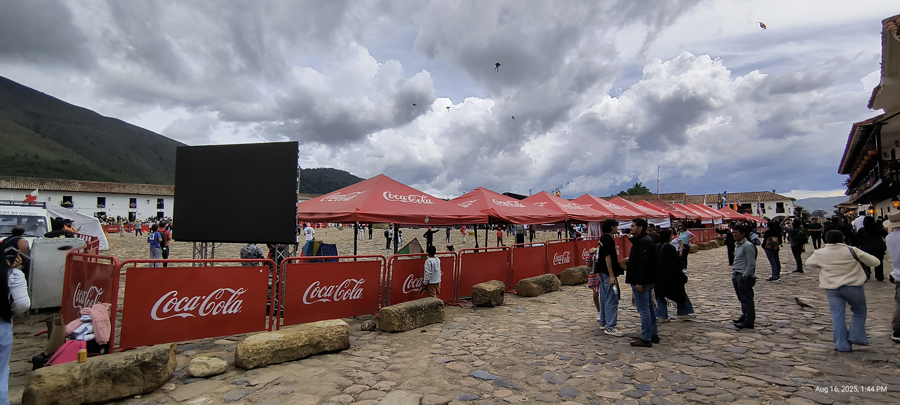

<br><details><summary>:camera:**46/IMG_20250816_134502200.jpg**</summary><sub> `Exif version` 0220 `OS version`  `Date` 2025:08:16 13:45:02 `Aperture` Not known `Brightness` 0.0 `Color space` 1 `Compression` 6`Exposure mode` 0 `Exposure time` 0.000230161 `Focal length` 2.13 `Lens model` Not known `Lens specification` Not known `Orientation` 6 `Scene type` Not known `f number` 2.2 `White balance` 0 `Sensing method` 1 `Shutter speed` 12.085</sub></details>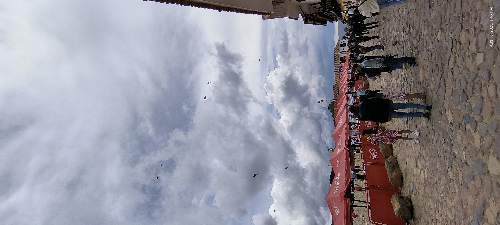

<br><details><summary>:camera:**46/IMG_20250816_134512724_BURST000_COVER.jpg**</summary><sub> `Exif version` 0220 `OS version`  `Date` 2025:08:16 13:45:14 `Aperture` Not known `Brightness` 0.0 `Color space` 1 `Compression` 6`Exposure mode` 0 `Exposure time` 0.001481036 `Focal length` 2.13 `Lens model` Not known `Lens specification` Not known `Orientation` 1 `Scene type` Not known `f number` 2.2 `White balance` 0 `Sensing method` 1 `Shutter speed` 9.399</sub></details>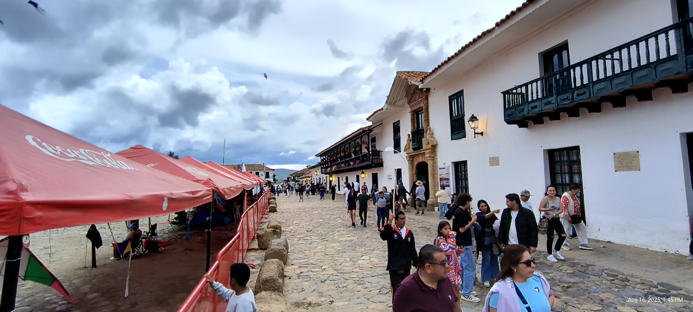

<br><details><summary>:camera:**46/IMG_20250816_134512724_BURST001_COMP.jpg**</summary><sub> `Exif version` 0220 `OS version`  `Date` 2025:08:16 13:45:14 `Aperture` Not known `Brightness` 0.0 `Color space` 1 `Compression` 6`Exposure mode` 0 `Exposure time` 0.001481036 `Focal length` 2.13 `Lens model` Not known `Lens specification` Not known `Orientation` 1 `Scene type` Not known `f number` 2.2 `White balance` 0 `Sensing method` 1 `Shutter speed` 9.399</sub></details>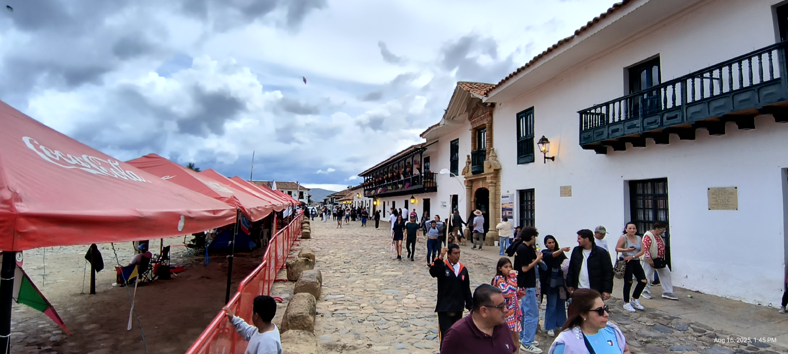

<br><details><summary>:camera:**46/IMG_20250816_134517398.jpg**</summary><sub> `Exif version` 0220 `OS version`  `Date` 2025:08:16 13:45:18 `Aperture` Not known `Brightness` 0.0 `Color space` 1 `Compression` 6`Exposure mode` 0 `Exposure time` 0.000510357 `Focal length` 2.13 `Lens model` Not known `Lens specification` Not known `Orientation` 1 `Scene type` Not known `f number` 2.2 `White balance` 0 `Sensing method` 1 `Shutter speed` 10.936</sub></details>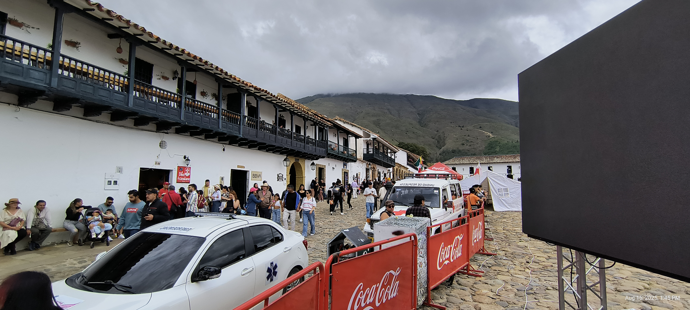

<br><details><summary>:camera:**46/IMG_20250816_134519026.jpg**</summary><sub> `Exif version` 0220 `OS version`  `Date` 2025:08:16 13:45:19 `Aperture` Not known `Brightness` 0.0 `Color space` 1 `Compression` 6`Exposure mode` 0 `Exposure time` 0.000510357 `Focal length` 2.13 `Lens model` Not known `Lens specification` Not known `Orientation` 1 `Scene type` Not known `f number` 2.2 `White balance` 0 `Sensing method` 1 `Shutter speed` 10.936</sub></details>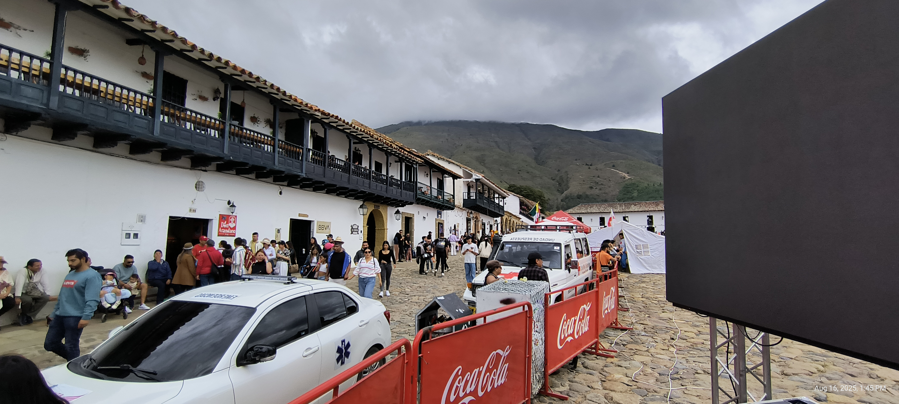

<br><details><summary>:camera:**46/IMG_20250816_134547637.jpg**</summary><sub> `Exif version` 0220 `OS version`  `Date` 2025:08:16 13:45:48 `Aperture` Not known `Brightness` 0.0 `Color space` 1 `Compression` 6`Exposure mode` 0 `Exposure time` 0.00050035 `Focal length` 2.13 `Lens model` Not known `Lens specification` Not known `Orientation` 1 `Scene type` Not known `f number` 2.2 `White balance` 0 `Sensing method` 1 `Shutter speed` 10.964</sub></details>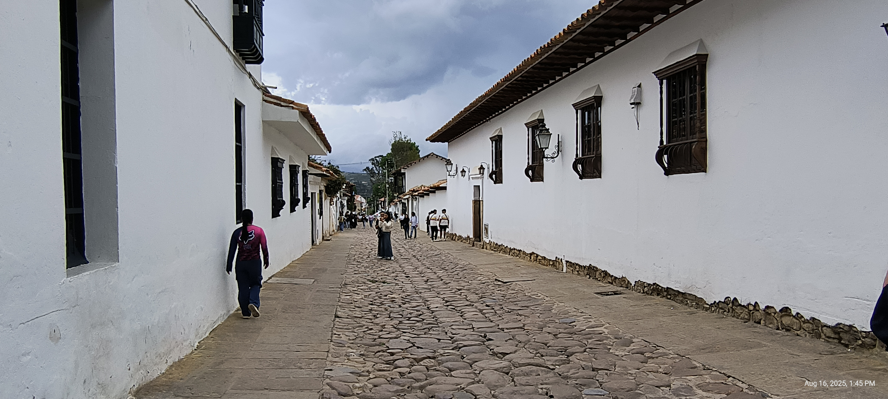

<br><details><summary>:camera:**46/IMG_20250816_134749775.jpg**</summary><sub> `Exif version` 0220 `OS version`  `Date` 2025:08:16 13:47:50 `Aperture` Not known `Brightness` 0.0 `Color space` 1 `Compression` 6`Exposure mode` 0 `Exposure time` 0.00064 `Focal length` 5.56 `Lens model` Not known `Lens specification` Not known `Orientation` 1 `Scene type` Not known `f number` 1.88 `White balance` 0 `Sensing method` 1 `Shutter speed` 10.609</sub></details>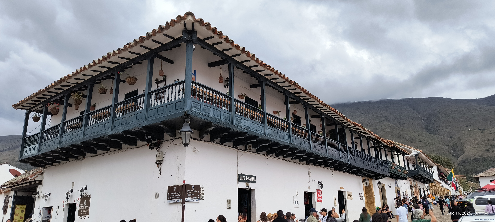

<br><details><summary>:camera:**46/IMG_20250816_150335704.jpg**</summary><sub> `Exif version` 0220 `OS version`  `Date` 2025:08:16 15:03:36 `Aperture` Not known `Brightness` 0.0 `Color space` 1 `Compression` 6`Exposure mode` 0 `Exposure time` 0.000310217 `Focal length` 2.13 `Lens model` Not known `Lens specification` Not known `Orientation` 1 `Scene type` Not known `f number` 2.2 `White balance` 0 `Sensing method` 1 `Shutter speed` 11.654</sub></details>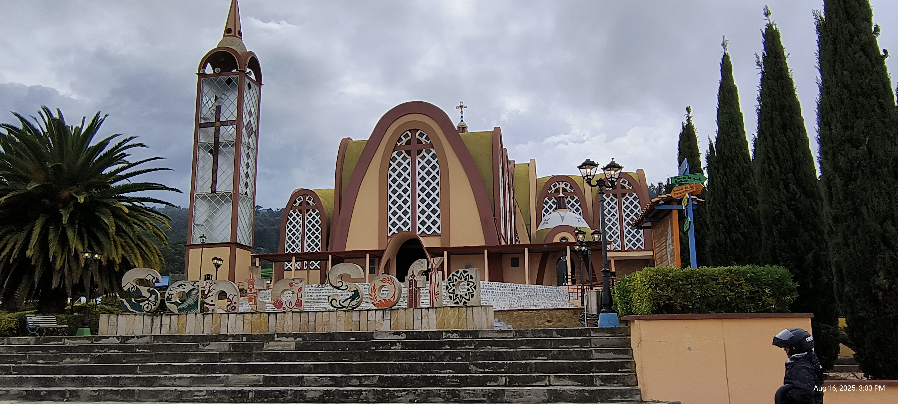

<br><details><summary>:camera:**46/IMG_20250816_150356656.jpg**</summary><sub> `Exif version` 0220 `OS version`  `Date` 2025:08:16 15:03:57 `Aperture` Not known `Brightness` 0.0 `Color space` 1 `Compression` 6`Exposure mode` 0 `Exposure time` 0.000260182 `Focal length` 2.13 `Lens model` Not known `Lens specification` Not known `Orientation` 1 `Scene type` Not known `f number` 2.2 `White balance` 0 `Sensing method` 1 `Shutter speed` 11.908</sub></details>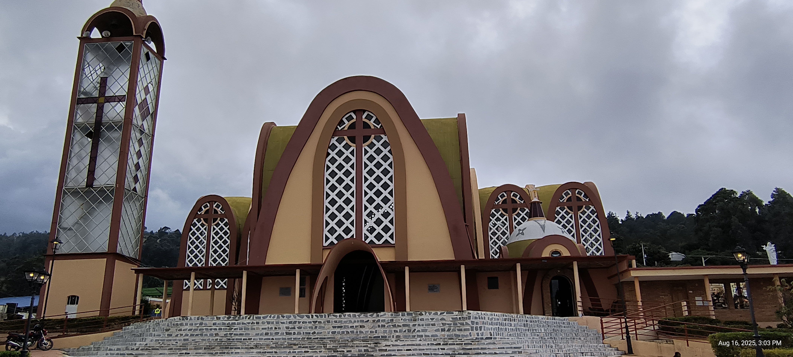

<br><details><summary>:camera:**46/IMG_20250816_150401743.jpg**</summary><sub> `Exif version` 0220 `OS version`  `Date` 2025:08:16 15:04:02 `Aperture` Not known `Brightness` 0.0 `Color space` 1 `Compression` 6`Exposure mode` 0 `Exposure time` 0.000190133 `Focal length` 2.13 `Lens model` Not known `Lens specification` Not known `Orientation` 6 `Scene type` Not known `f number` 2.2 `White balance` 0 `Sensing method` 1 `Shutter speed` 12.36</sub></details>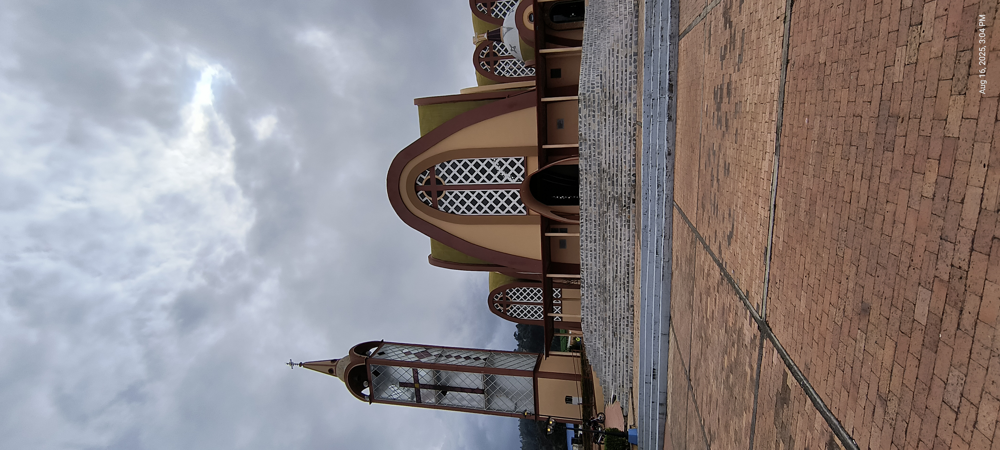

<br><details><summary>:camera:**46/IMG_20250816_150405318.jpg**</summary><sub> `Exif version` 0220 `OS version`  `Date` 2025:08:16 15:04:05 `Aperture` Not known `Brightness` 0.0 `Color space` 1 `Compression` 6`Exposure mode` 0 `Exposure time` 0.000210147 `Focal length` 2.13 `Lens model` Not known `Lens specification` Not known `Orientation` 1 `Scene type` Not known `f number` 2.2 `White balance` 0 `Sensing method` 1 `Shutter speed` 12.216</sub></details>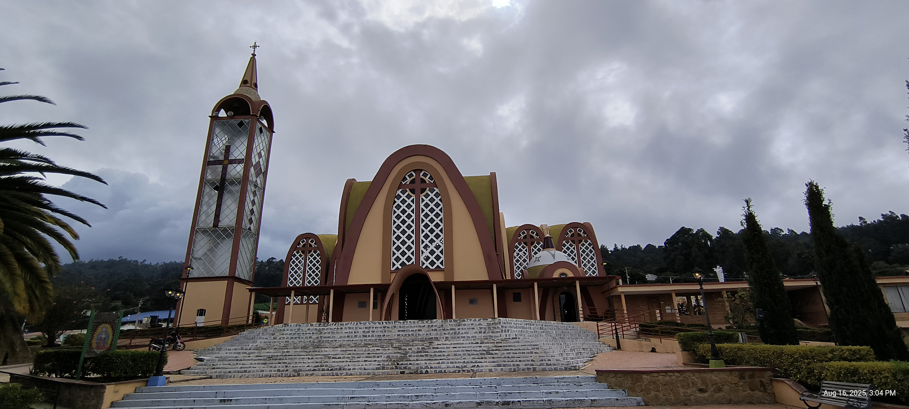

<br><details><summary>:camera:**46/IMG_20250816_150542148.jpg**</summary><sub> `Exif version` 0220 `OS version`  `Date` 2025:08:16 15:05:42 `Aperture` Not known `Brightness` 0.0 `Color space` 1 `Compression` 6`Exposure mode` 0 `Exposure time` 0.000190133 `Focal length` 2.13 `Lens model` Not known `Lens specification` Not known `Orientation` 1 `Scene type` Not known `f number` 2.2 `White balance` 0 `Sensing method` 1 `Shutter speed` 12.36</sub></details>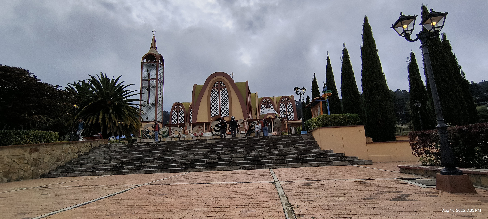

<br><details><summary>:camera:**46/IMG_20250816_150548002.jpg**</summary><sub> `Exif version` 0220 `OS version`  `Date` 2025:08:16 15:05:48 `Aperture` Not known `Brightness` 0.0 `Color space` 1 `Compression` 6`Exposure mode` 0 `Exposure time` 0.000170119 `Focal length` 2.13 `Lens model` Not known `Lens specification` Not known `Orientation` 6 `Scene type` Not known `f number` 2.2 `White balance` 0 `Sensing method` 1 `Shutter speed` 12.521</sub></details>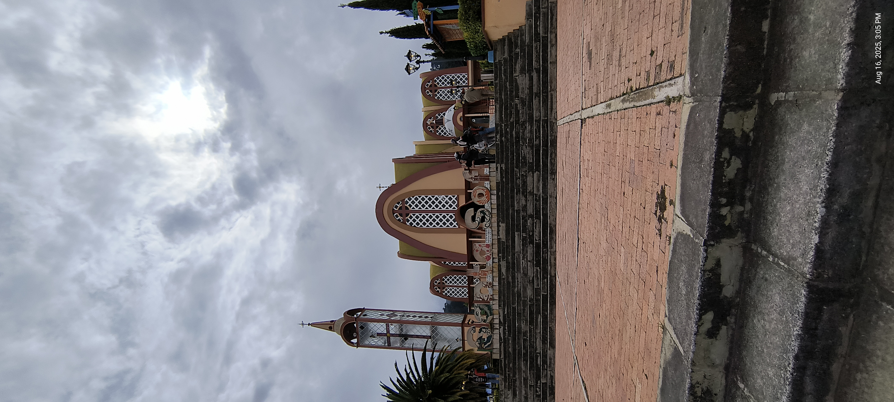

<br><details><summary>:camera:**46/IMG_20250816_151217324.jpg**</summary><sub> `Exif version` 0220 `OS version`  `Date` 2025:08:16 15:12:18 `Aperture` Not known `Brightness` 0.0 `Color space` 1 `Compression` 6`Exposure mode` 0 `Exposure time` 0.000310217 `Focal length` 2.13 `Lens model` Not known `Lens specification` Not known `Orientation` 6 `Scene type` Not known `f number` 2.2 `White balance` 0 `Sensing method` 1 `Shutter speed` 11.654</sub></details>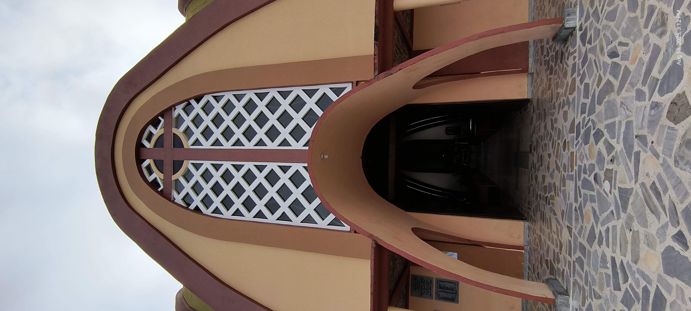

<br><details><summary>:camera:**46/IMG_20250816_151220235.jpg**</summary><sub> `Exif version` 0220 `OS version`  `Date` 2025:08:16 15:12:20 `Aperture` Not known `Brightness` 0.0 `Color space` 1 `Compression` 6`Exposure mode` 0 `Exposure time` 0.000280196 `Focal length` 2.13 `Lens model` Not known `Lens specification` Not known `Orientation` 6 `Scene type` Not known `f number` 2.2 `White balance` 0 `Sensing method` 1 `Shutter speed` 11.801</sub></details>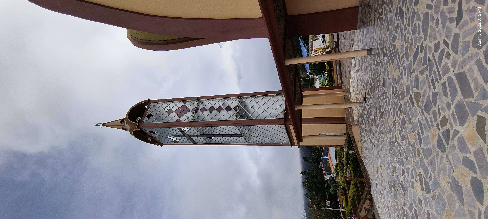

<br><details><summary>:camera:**46/IMG_20250816_151225442.jpg**</summary><sub> `Exif version` 0220 `OS version`  `Date` 2025:08:16 15:12:26 `Aperture` Not known `Brightness` 0.0 `Color space` 1 `Compression` 6`Exposure mode` 0 `Exposure time` 0.000310217 `Focal length` 2.13 `Lens model` Not known `Lens specification` Not known `Orientation` 1 `Scene type` Not known `f number` 2.2 `White balance` 0 `Sensing method` 1 `Shutter speed` 11.654</sub></details>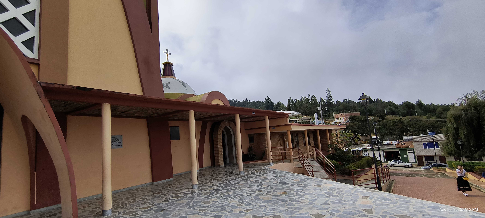

<br><details><summary>:camera:**46/IMG_20250816_151230198.jpg**</summary><sub> `Exif version` 0220 `OS version`  `Date` 2025:08:16 15:12:30 `Aperture` Not known `Brightness` 0.0 `Color space` 1 `Compression` 6`Exposure mode` 0 `Exposure time` 0.000480336 `Focal length` 2.13 `Lens model` Not known `Lens specification` Not known `Orientation` 1 `Scene type` Not known `f number` 2.2 `White balance` 0 `Sensing method` 1 `Shutter speed` 11.023</sub></details>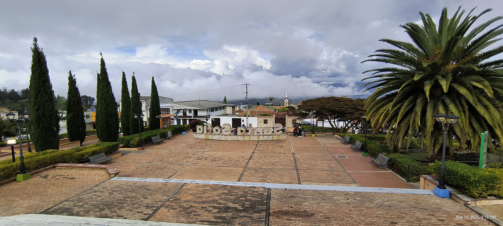

<br><details><summary>:camera:**46/IMG_20250816_151246389_HDR.jpg**</summary><sub> `Exif version` 0220 `OS version`  `Date` 2025:08:16 15:12:48 `Aperture` Not known `Brightness` 0.0 `Color space` 1 `Compression` 6`Exposure mode` 0 `Exposure time` 0.008335831 `Focal length` 2.13 `Lens model` Not known `Lens specification` Not known `Orientation` 6 `Scene type` Not known `f number` 2.2 `White balance` 0 `Sensing method` 1 `Shutter speed` 6.906</sub></details>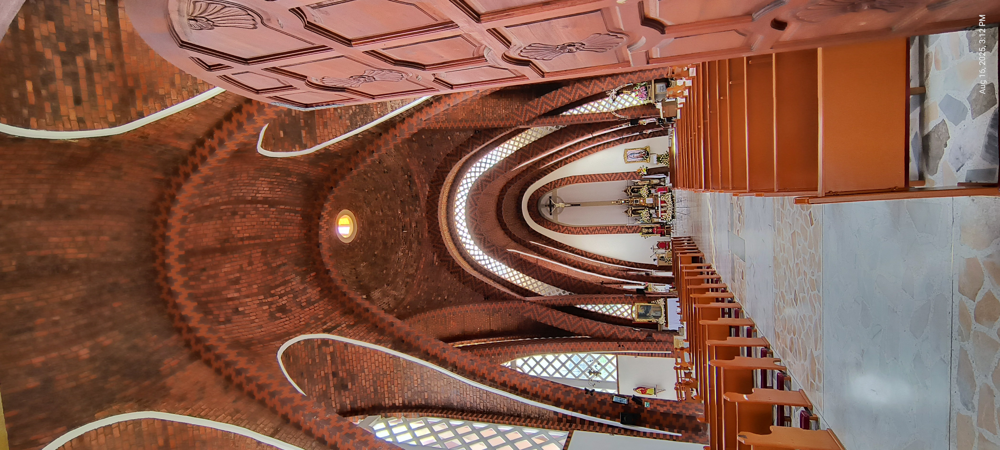

<br><details><summary>:camera:**46/IMG_20250816_151250042_HDR.jpg**</summary><sub> `Exif version` 0220 `OS version`  `Date` 2025:08:16 15:12:51 `Aperture` Not known `Brightness` 0.0 `Color space` 1 `Compression` 6`Exposure mode` 0 `Exposure time` 0.008335831 `Focal length` 2.13 `Lens model` Not known `Lens specification` Not known `Orientation` 1 `Scene type` Not known `f number` 2.2 `White balance` 0 `Sensing method` 1 `Shutter speed` 6.906</sub></details>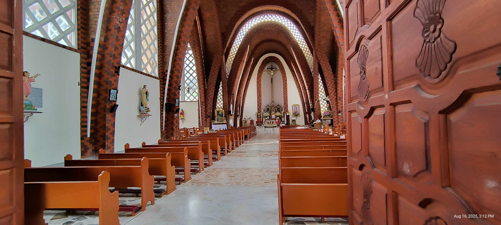

<br><details><summary>:camera:**46/IMG_20250816_151302000_HDR.jpg**</summary><sub> `Exif version` 0220 `OS version`  `Date` 2025:08:16 15:13:03 `Aperture` Not known `Brightness` 0.0 `Color space` 1 `Compression` 6`Exposure mode` 0 `Exposure time` 0.008335831 `Focal length` 2.13 `Lens model` Not known `Lens specification` Not known `Orientation` 6 `Scene type` Not known `f number` 2.2 `White balance` 0 `Sensing method` 1 `Shutter speed` 6.906</sub></details>

<br><details><summary>:camera:**46/IMG_20250816_151330484_HDR.jpg**</summary><sub> `Exif version` 0220 `OS version`  `Date` 2025:08:16 15:13:32 `Aperture` Not known `Brightness` 0.0 `Color space` 1 `Compression` 6`Exposure mode` 0 `Exposure time` 0.009996993 `Focal length` 2.13 `Lens model` Not known `Lens specification` Not known `Orientation` 6 `Scene type` Not known `f number` 2.2 `White balance` 0 `Sensing method` 1 `Shutter speed` 6.644</sub></details>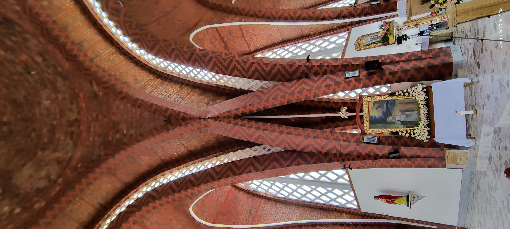

<br><details><summary>:camera:**46/IMG_20250816_151334041_HDR.jpg**</summary><sub> `Exif version` 0220 `OS version`  `Date` 2025:08:16 15:13:35 `Aperture` Not known `Brightness` 0.0 `Color space` 1 `Compression` 6`Exposure mode` 0 `Exposure time` 0.008335831 `Focal length` 2.13 `Lens model` Not known `Lens specification` Not known `Orientation` 6 `Scene type` Not known `f number` 2.2 `White balance` 0 `Sensing method` 1 `Shutter speed` 6.906</sub></details>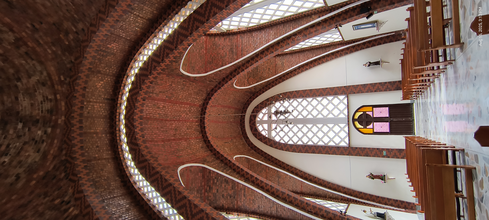

<br><details><summary>:camera:**46/IMG_20250816_151337377_HDR.jpg**</summary><sub> `Exif version` 0220 `OS version`  `Date` 2025:08:16 15:13:39 `Aperture` Not known `Brightness` 0.0 `Color space` 1 `Compression` 6`Exposure mode` 0 `Exposure time` 0.008335831 `Focal length` 2.13 `Lens model` Not known `Lens specification` Not known `Orientation` 6 `Scene type` Not known `f number` 2.2 `White balance` 0 `Sensing method` 1 `Shutter speed` 6.906</sub></details>

<br><details><summary>:camera:**46/IMG_20250816_151345306_HDR.jpg**</summary><sub> `Exif version` 0220 `OS version`  `Date` 2025:08:16 15:13:47 `Aperture` Not known `Brightness` 0.0 `Color space` 1 `Compression` 6`Exposure mode` 0 `Exposure time` 0.008335831 `Focal length` 2.13 `Lens model` Not known `Lens specification` Not known `Orientation` 6 `Scene type` Not known `f number` 2.2 `White balance` 0 `Sensing method` 1 `Shutter speed` 6.906</sub></details>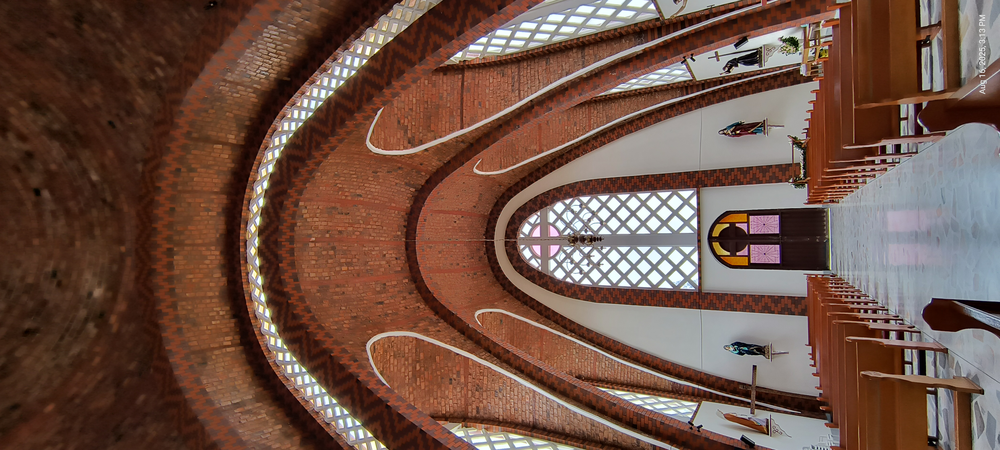

<br><details><summary>:camera:**46/IMG_20250816_151354218_HDR.jpg**</summary><sub> `Exif version` 0220 `OS version`  `Date` 2025:08:16 15:13:55 `Aperture` Not known `Brightness` 0.0 `Color space` 1 `Compression` 6`Exposure mode` 0 `Exposure time` 0.008335831 `Focal length` 2.13 `Lens model` Not known `Lens specification` Not known `Orientation` 6 `Scene type` Not known `f number` 2.2 `White balance` 0 `Sensing method` 1 `Shutter speed` 6.906</sub></details>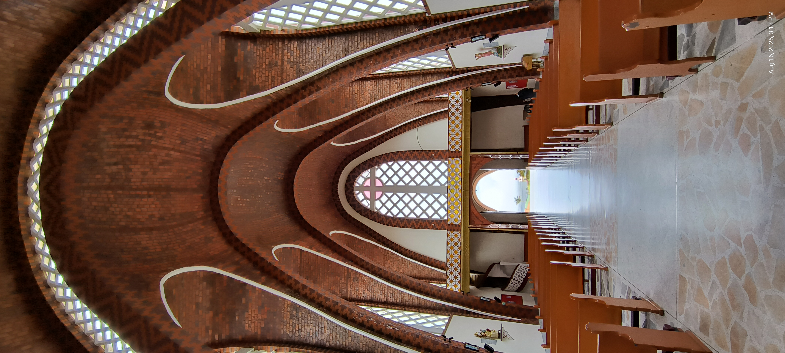

<br><details><summary>:camera:**46/IMG_20250816_151401933_HDR.jpg**</summary><sub> `Exif version` 0220 `OS version`  `Date` 2025:08:16 15:14:03 `Aperture` Not known `Brightness` 0.0 `Color space` 1 `Compression` 6`Exposure mode` 0 `Exposure time` 0.005613927 `Focal length` 2.13 `Lens model` Not known `Lens specification` Not known `Orientation` 6 `Scene type` Not known `f number` 2.2 `White balance` 0 `Sensing method` 1 `Shutter speed` 7.476</sub></details>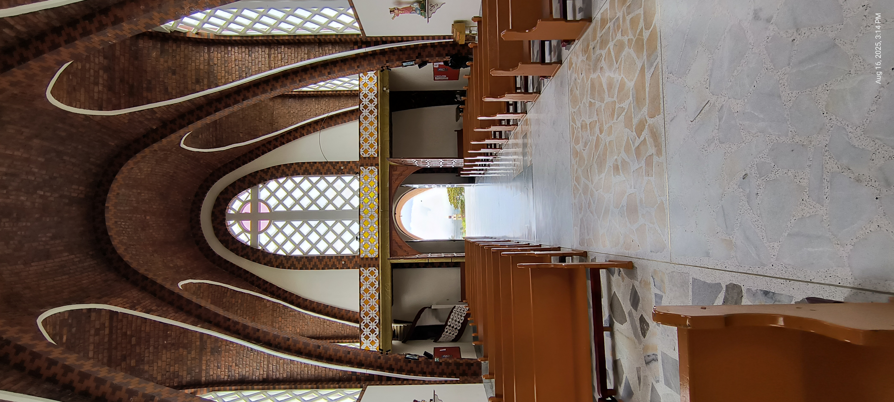

<br><details><summary>:camera:**46/IMG_20250816_151414958_HDR.jpg**</summary><sub> `Exif version` 0220 `OS version`  `Date` 2025:08:16 15:14:16 `Aperture` Not known `Brightness` 0.0 `Color space` 1 `Compression` 6`Exposure mode` 0 `Exposure time` 0.003972779 `Focal length` 2.13 `Lens model` Not known `Lens specification` Not known `Orientation` 6 `Scene type` Not known `f number` 2.2 `White balance` 0 `Sensing method` 1 `Shutter speed` 7.975</sub></details>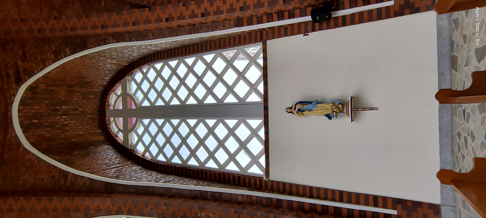

<br><details><summary>:camera:**46/IMG_20250816_151427363_HDR.jpg**</summary><sub> `Exif version` 0220 `OS version`  `Date` 2025:08:16 15:14:28 `Aperture` Not known `Brightness` 0.0 `Color space` 1 `Compression` 6`Exposure mode` 0 `Exposure time` 0.004192933 `Focal length` 2.13 `Lens model` Not known `Lens specification` Not known `Orientation` 6 `Scene type` Not known `f number` 2.2 `White balance` 0 `Sensing method` 1 `Shutter speed` 7.897</sub></details>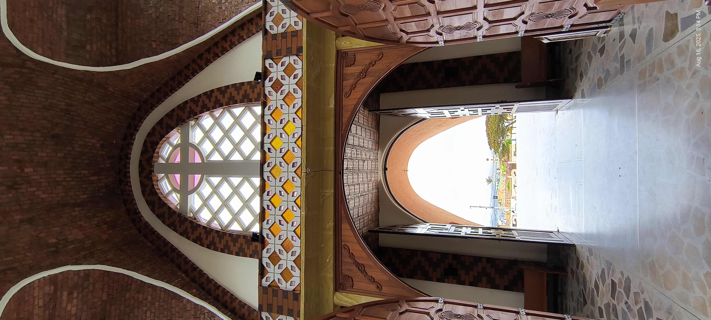

<br><details><summary>:camera:**46/IMG_20250816_151545768_HDR.jpg**</summary><sub> `Exif version` 0220 `OS version`  `Date` 2025:08:16 15:15:47 `Aperture` Not known `Brightness` 0.0 `Color space` 1 `Compression` 6`Exposure mode` 0 `Exposure time` 0.016671662 `Focal length` 2.13 `Lens model` Not known `Lens specification` Not known `Orientation` 6 `Scene type` Not known `f number` 2.2 `White balance` 0 `Sensing method` 1 `Shutter speed` 5.906</sub></details>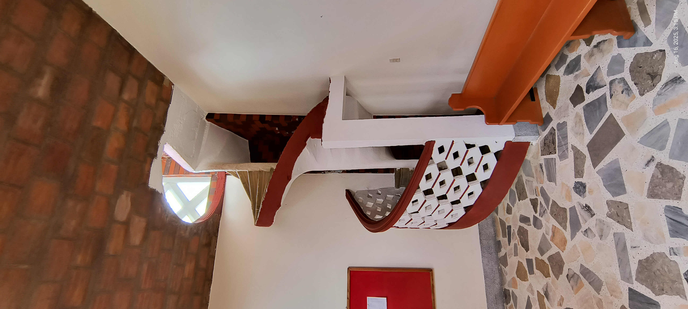

<br><details><summary>:camera:**46/IMG_20250816_151556873.jpg**</summary><sub> `Exif version` 0220 `OS version`  `Date` 2025:08:16 15:15:57 `Aperture` Not known `Brightness` 0.0 `Color space` 1 `Compression` 6`Exposure mode` 0 `Exposure time` 0.000720504 `Focal length` 2.13 `Lens model` Not known `Lens specification` Not known `Orientation` 6 `Scene type` Not known `f number` 2.2 `White balance` 0 `Sensing method` 1 `Shutter speed` 10.438</sub></details>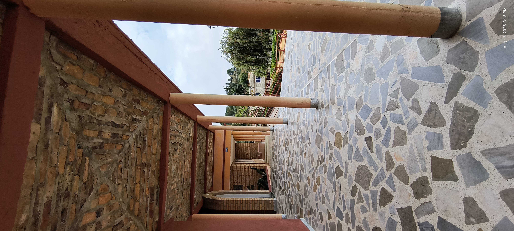

<br><details><summary>:camera:**46/IMG_20250816_151643473.jpg**</summary><sub> `Exif version` 0220 `OS version`  `Date` 2025:08:16 15:16:44 `Aperture` Not known `Brightness` 0.0 `Color space` 1 `Compression` 6`Exposure mode` 0 `Exposure time` 0.000460322 `Focal length` 2.13 `Lens model` Not known `Lens specification` Not known `Orientation` 1 `Scene type` Not known `f number` 2.2 `White balance` 0 `Sensing method` 1 `Shutter speed` 11.085</sub></details>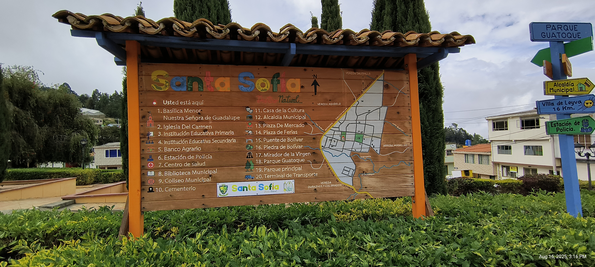

<br><details><summary>:camera:**46/IMG_20250816_151648913.jpg**</summary><sub> `Exif version` 0220 `OS version`  `Date` 2025:08:16 15:16:49 `Aperture` Not known `Brightness` 0.0 `Color space` 1 `Compression` 6`Exposure mode` 0 `Exposure time` 0.000360252 `Focal length` 2.13 `Lens model` Not known `Lens specification` Not known `Orientation` 6 `Scene type` Not known `f number` 2.2 `White balance` 0 `Sensing method` 1 `Shutter speed` 11.438</sub></details>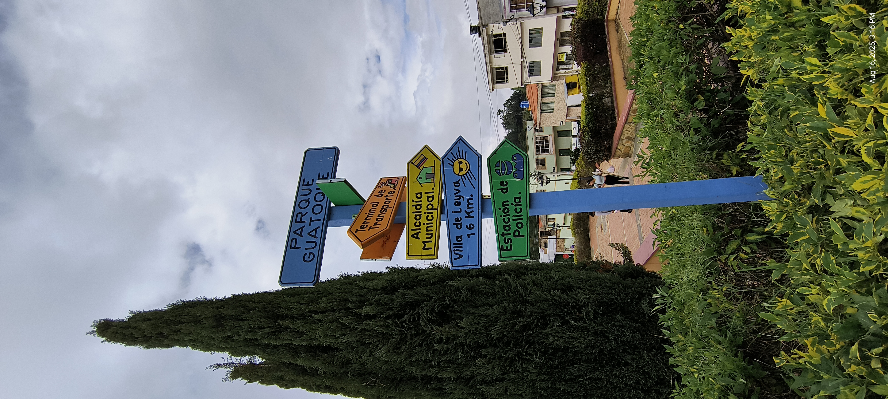

<br><details><summary>:camera:**46/IMG_20250816_151830450.jpg**</summary><sub> `Exif version` 0220 `OS version`  `Date` 2025:08:16 15:18:31 `Aperture` Not known `Brightness` 0.0 `Color space` 1 `Compression` 6`Exposure mode` 0 `Exposure time` 0.000220154 `Focal length` 2.13 `Lens model` Not known `Lens specification` Not known `Orientation` 6 `Scene type` Not known `f number` 2.2 `White balance` 0 `Sensing method` 1 `Shutter speed` 12.149</sub></details>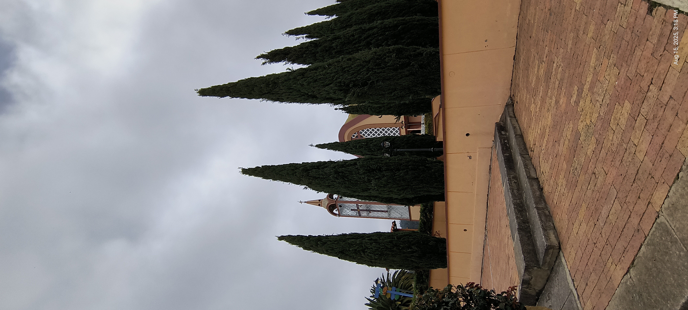

<br><details><summary>:camera:**46/IMG_20250920_170314891_HDR.jpg**</summary><sub> `Exif version` 0220 `OS version`  `Date` 2025:09:20 17:03:18 `Aperture` Not known `Brightness` 0.0 `Color space` 1 `Compression` 6`Exposure mode` 0 `Exposure time` 0.004224 `Focal length` 5.56 `Lens model` Not known `Lens specification` Not known `Orientation` 6 `Scene type` Not known `f number` 1.88 `White balance` 0 `Sensing method` 1 `Shutter speed` 7.887</sub><sub>`Coordinates & altitude` (6.17503213888889, -73.44754027777778, 1442.0)</sub><sub> :earth_americas:`Location over` [Google Maps](http://maps.google.com/maps?q=6.17503213888889,-73.44754027777778) or [Openstreet Map](https://www.openstreetmap.org/query?lat=6.17503213888889&lon=-73.44754027777778)</sub></details>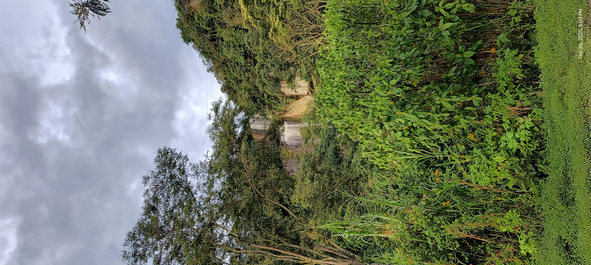

<br><details><summary>:camera:**46/IMG_20250920_170449883_HDR.jpg**</summary><sub> `Exif version` 0220 `OS version`  `Date` 2025:09:20 17:04:53 `Aperture` Not known `Brightness` 0.0 `Color space` 1 `Compression` 6`Exposure mode` 0 `Exposure time` 0.016672 `Focal length` 5.56 `Lens model` Not known `Lens specification` Not known `Orientation` 6 `Scene type` Not known `f number` 1.88 `White balance` 0 `Sensing method` 1 `Shutter speed` 5.906</sub><sub>`Coordinates & altitude` (6.175046916666667, -73.44745633333334, 1449.0)</sub><sub> :earth_americas:`Location over` [Google Maps](http://maps.google.com/maps?q=6.175046916666667,-73.44745633333334) or [Openstreet Map](https://www.openstreetmap.org/query?lat=6.175046916666667&lon=-73.44745633333334)</sub></details>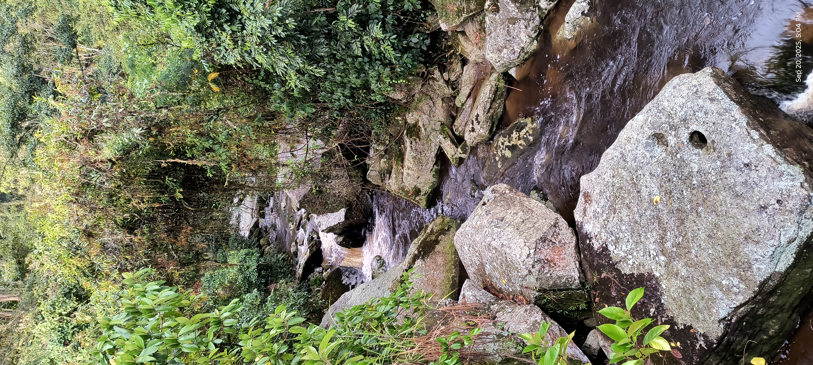

<br><details><summary>:camera:**46/IMG_20250920_170834272_HDR.jpg**</summary><sub> `Exif version` 0220 `OS version`  `Date` 2025:09:20 17:08:36 `Aperture` Not known `Brightness` 0.0 `Color space` 1 `Compression` 6`Exposure mode` 0 `Exposure time` 0.004224 `Focal length` 5.56 `Lens model` Not known `Lens specification` Not known `Orientation` 6 `Scene type` Not known `f number` 1.88 `White balance` 0 `Sensing method` 1 `Shutter speed` 7.887</sub><sub>`Coordinates & altitude` (6.175632944444445, -73.44624327777778, 1445.0)</sub><sub> :earth_americas:`Location over` [Google Maps](http://maps.google.com/maps?q=6.175632944444445,-73.44624327777778) or [Openstreet Map](https://www.openstreetmap.org/query?lat=6.175632944444445&lon=-73.44624327777778)</sub></details>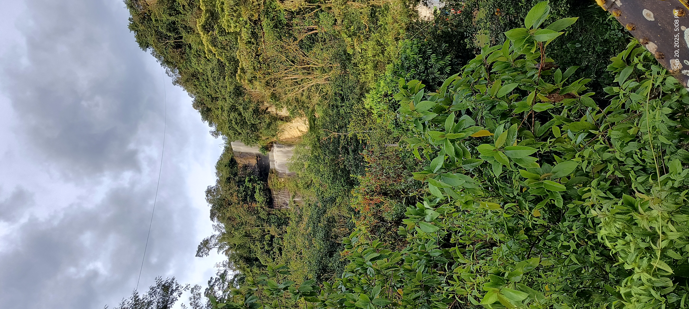

<br><details><summary>:camera:**46/IMG_20250920_170839609_HDR.jpg**</summary><sub> `Exif version` 0220 `OS version`  `Date` 2025:09:20 17:08:41 `Aperture` Not known `Brightness` 0.0 `Color space` 1 `Compression` 6`Exposure mode` 0 `Exposure time` 0.003488 `Focal length` 5.56 `Lens model` Not known `Lens specification` Not known `Orientation` 1 `Scene type` Not known `f number` 1.88 `White balance` 0 `Sensing method` 1 `Shutter speed` 8.163</sub><sub>`Coordinates & altitude` (6.175632944444445, -73.44624327777778, 1445.0)</sub><sub> :earth_americas:`Location over` [Google Maps](http://maps.google.com/maps?q=6.175632944444445,-73.44624327777778) or [Openstreet Map](https://www.openstreetmap.org/query?lat=6.175632944444445&lon=-73.44624327777778)</sub></details>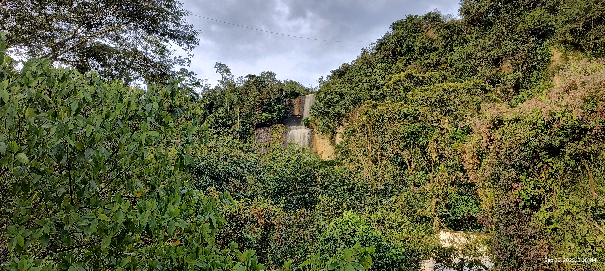

<br><details><summary>:camera:**46/IMG_20250920_170843581.jpg**</summary><sub> `Exif version` 0220 `OS version`  `Date` 2025:09:20 17:08:47 `Aperture` Not known `Brightness` 0.0 `Color space` 1 `Compression` 6`Exposure mode` 0 `Exposure time` 0.003488 `Focal length` 5.56 `Lens model` Not known `Lens specification` Not known `Orientation` 1 `Scene type` Not known `f number` 1.88 `White balance` 0 `Sensing method` 1 `Shutter speed` 8.163</sub><sub>`Coordinates & altitude` (6.175632944444445, -73.44624327777778, 1445.0)</sub><sub> :earth_americas:`Location over` [Google Maps](http://maps.google.com/maps?q=6.175632944444445,-73.44624327777778) or [Openstreet Map](https://www.openstreetmap.org/query?lat=6.175632944444445&lon=-73.44624327777778)</sub></details>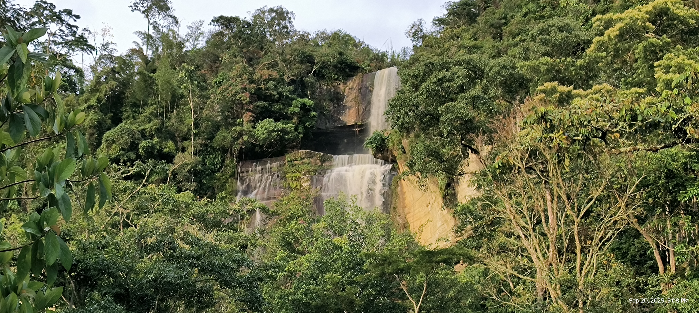

<br><details><summary>:camera:**46/IMG_20250920_171023840.jpg**</summary><sub> `Exif version` 0220 `OS version`  `Date` 2025:09:20 17:10:27 `Aperture` Not known `Brightness` 0.0 `Color space` 1 `Compression` 6`Exposure mode` 0 `Exposure time` 0.002688 `Focal length` 5.56 `Lens model` Not known `Lens specification` Not known `Orientation` 6 `Scene type` Not known `f number` 1.88 `White balance` 0 `Sensing method` 1 `Shutter speed` 8.539</sub><sub>`Coordinates & altitude` (6.174680222222222, -73.44779202777778, 1428.0)</sub><sub> :earth_americas:`Location over` [Google Maps](http://maps.google.com/maps?q=6.174680222222222,-73.44779202777778) or [Openstreet Map](https://www.openstreetmap.org/query?lat=6.174680222222222&lon=-73.44779202777778)</sub></details>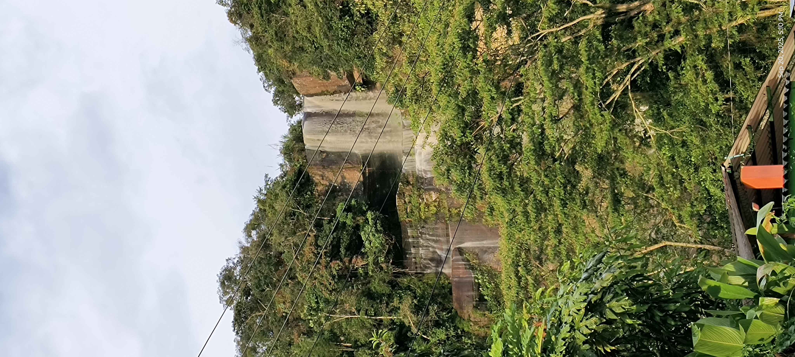

<br><details><summary>:camera:**46/IMG_20250920_171251235_HDR.jpg**</summary><sub> `Exif version` 0220 `OS version`  `Date` 2025:09:20 17:12:52 `Aperture` Not known `Brightness` 0.0 `Color space` 1 `Compression` 6`Exposure mode` 0 `Exposure time` 0.003008 `Focal length` 5.56 `Lens model` Not known `Lens specification` Not known `Orientation` 6 `Scene type` Not known `f number` 1.88 `White balance` 0 `Sensing method` 1 `Shutter speed` 8.376</sub><sub>`Coordinates & altitude` (6.175538055555556, -73.44769286111112, 1434.0)</sub><sub> :earth_americas:`Location over` [Google Maps](http://maps.google.com/maps?q=6.175538055555556,-73.44769286111112) or [Openstreet Map](https://www.openstreetmap.org/query?lat=6.175538055555556&lon=-73.44769286111112)</sub></details>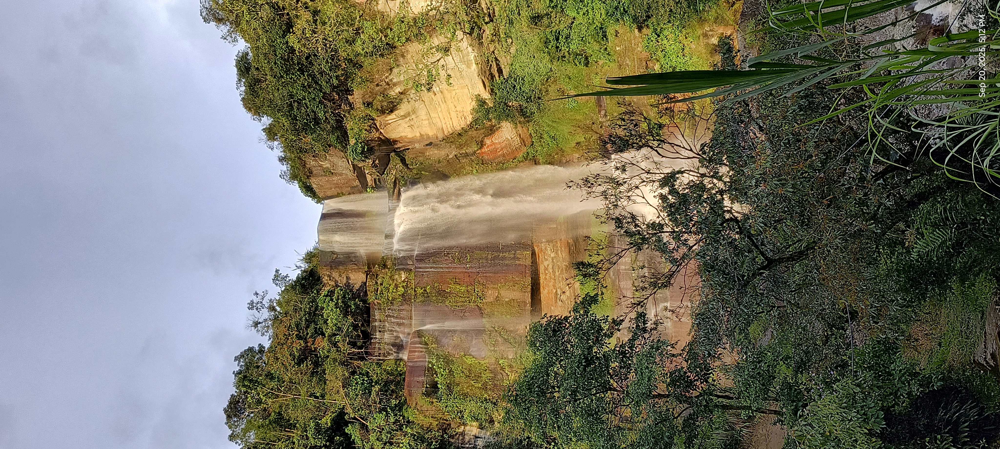

<br><details><summary>:camera:**46/IMG_20250920_171408594_HDR.jpg**</summary><sub> `Exif version` 0220 `OS version`  `Date` 2025:09:20 17:14:10 `Aperture` Not known `Brightness` 0.0 `Color space` 1 `Compression` 6`Exposure mode` 0 `Exposure time` 0.003542478 `Focal length` 2.13 `Lens model` Not known `Lens specification` Not known `Orientation` 6 `Scene type` Not known `f number` 2.2 `White balance` 0 `Sensing method` 1 `Shutter speed` 8.141</sub><sub>`Coordinates & altitude` (6.1749119722222225, -73.44898222222223, 1434.0)</sub><sub> :earth_americas:`Location over` [Google Maps](http://maps.google.com/maps?q=6.1749119722222225,-73.44898222222223) or [Openstreet Map](https://www.openstreetmap.org/query?lat=6.1749119722222225&lon=-73.44898222222223)</sub></details>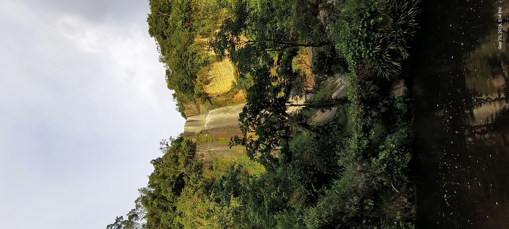

<br><details><summary>:camera:**46/IMG_20250920_173917803.jpg**</summary><sub> `Exif version` 0220 `OS version`  `Date` 2025:09:20 17:39:18 `Aperture` Not known `Brightness` 0.0 `Color space` 1 `Compression` 6`Exposure mode` 0 `Exposure time` 0.00832 `Focal length` 5.56 `Lens model` Not known `Lens specification` Not known `Orientation` 6 `Scene type` Not known `f number` 1.88 `White balance` 0 `Sensing method` 1 `Shutter speed` 6.909</sub><sub>`Coordinates & altitude` (6.159203027777778, -73.44826505555555, 1415.0)</sub><sub> :earth_americas:`Location over` [Google Maps](http://maps.google.com/maps?q=6.159203027777778,-73.44826505555555) or [Openstreet Map](https://www.openstreetmap.org/query?lat=6.159203027777778&lon=-73.44826505555555)</sub></details>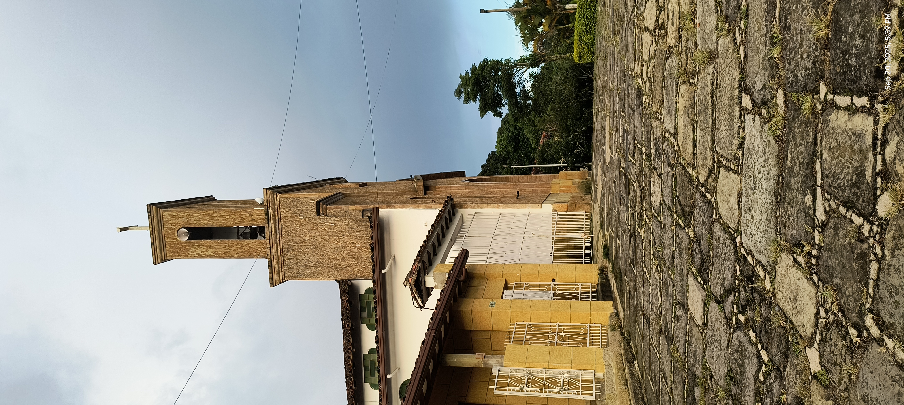

<br><details><summary>:camera:**46/IMG_20250920_173929107_HDR.jpg**</summary><sub> `Exif version` 0220 `OS version`  `Date` 2025:09:20 17:39:30 `Aperture` Not known `Brightness` 0.0 `Color space` 1 `Compression` 6`Exposure mode` 0 `Exposure time` 0.00432 `Focal length` 5.56 `Lens model` Not known `Lens specification` Not known `Orientation` 1 `Scene type` Not known `f number` 1.88 `White balance` 0 `Sensing method` 1 `Shutter speed` 7.854</sub><sub>`Coordinates & altitude` (6.159203027777778, -73.44826505555555, 1415.0)</sub><sub> :earth_americas:`Location over` [Google Maps](http://maps.google.com/maps?q=6.159203027777778,-73.44826505555555) or [Openstreet Map](https://www.openstreetmap.org/query?lat=6.159203027777778&lon=-73.44826505555555)</sub></details>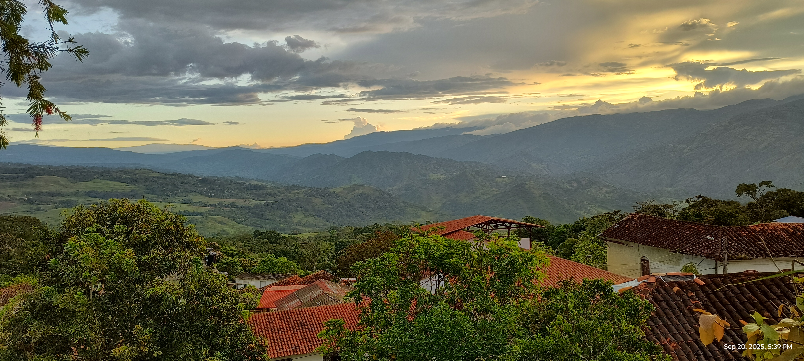

<br><details><summary>:camera:**46/IMG_20250920_174005404.jpg**</summary><sub> `Exif version` 0220 `OS version`  `Date` 2025:09:20 17:40:06 `Aperture` Not known `Brightness` 0.0 `Color space` 1 `Compression` 6`Exposure mode` 0 `Exposure time` 0.008335831 `Focal length` 2.13 `Lens model` Not known `Lens specification` Not known `Orientation` 6 `Scene type` Not known `f number` 2.2 `White balance` 0 `Sensing method` 1 `Shutter speed` 6.906</sub><sub>`Coordinates & altitude` (6.159203027777778, -73.44826505555555, 1415.0)</sub><sub> :earth_americas:`Location over` [Google Maps](http://maps.google.com/maps?q=6.159203027777778,-73.44826505555555) or [Openstreet Map](https://www.openstreetmap.org/query?lat=6.159203027777778&lon=-73.44826505555555)</sub></details>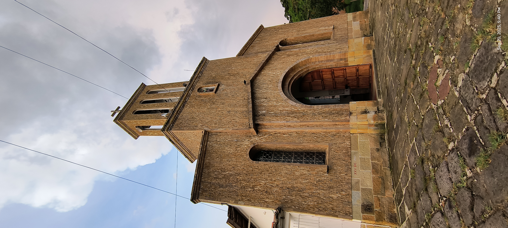

<br><details><summary>:camera:**46/IMG_20250920_174028852.jpg**</summary><sub> `Exif version` 0220 `OS version`  `Date` 2025:09:20 17:40:29 `Aperture` Not known `Brightness` 0.0 `Color space` 1 `Compression` 6`Exposure mode` 0 `Exposure time` 0.008335831 `Focal length` 2.13 `Lens model` Not known `Lens specification` Not known `Orientation` 6 `Scene type` Not known `f number` 2.2 `White balance` 0 `Sensing method` 1 `Shutter speed` 6.906</sub><sub>`Coordinates & altitude` (6.159203027777778, -73.44826505555555, 1415.0)</sub><sub> :earth_americas:`Location over` [Google Maps](http://maps.google.com/maps?q=6.159203027777778,-73.44826505555555) or [Openstreet Map](https://www.openstreetmap.org/query?lat=6.159203027777778&lon=-73.44826505555555)</sub></details>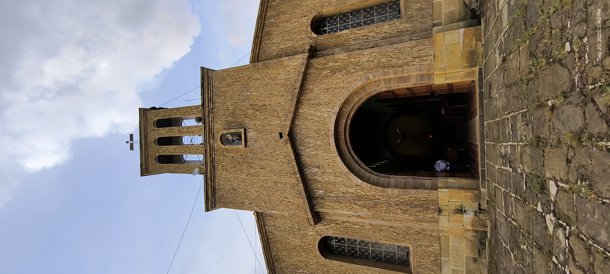

<br><details><summary>:camera:**46/IMG_20250920_174037902.jpg**</summary><sub> `Exif version` 0220 `OS version`  `Date` 2025:09:20 17:40:38 `Aperture` Not known `Brightness` 0.0 `Color space` 1 `Compression` 6`Exposure mode` 0 `Exposure time` 0.006964872 `Focal length` 2.13 `Lens model` Not known `Lens specification` Not known `Orientation` 1 `Scene type` Not known `f number` 2.2 `White balance` 0 `Sensing method` 1 `Shutter speed` 7.165</sub><sub>`Coordinates & altitude` (6.159203027777778, -73.44826505555555, 1415.0)</sub><sub> :earth_americas:`Location over` [Google Maps](http://maps.google.com/maps?q=6.159203027777778,-73.44826505555555) or [Openstreet Map](https://www.openstreetmap.org/query?lat=6.159203027777778&lon=-73.44826505555555)</sub></details>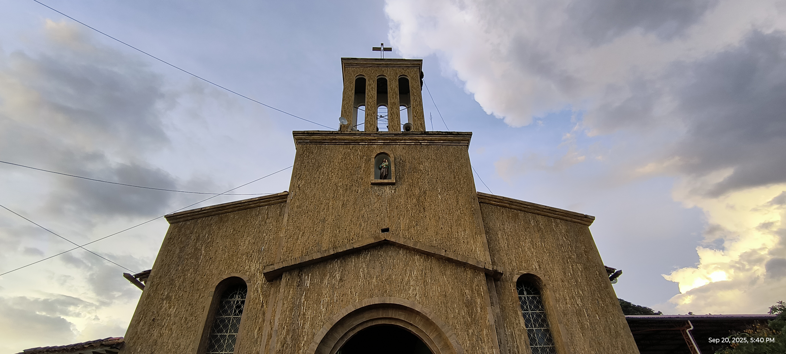

<br><details><summary>:camera:**46/IMG_20250920_174043039_HDR.jpg**</summary><sub> `Exif version` 0220 `OS version`  `Date` 2025:09:20 17:40:44 `Aperture` Not known `Brightness` 0.0 `Color space` 1 `Compression` 6`Exposure mode` 0 `Exposure time` 0.006594613 `Focal length` 2.13 `Lens model` Not known `Lens specification` Not known `Orientation` 1 `Scene type` Not known `f number` 2.2 `White balance` 0 `Sensing method` 1 `Shutter speed` 7.244</sub><sub>`Coordinates & altitude` (6.159203027777778, -73.44826505555555, 1415.0)</sub><sub> :earth_americas:`Location over` [Google Maps](http://maps.google.com/maps?q=6.159203027777778,-73.44826505555555) or [Openstreet Map](https://www.openstreetmap.org/query?lat=6.159203027777778&lon=-73.44826505555555)</sub></details>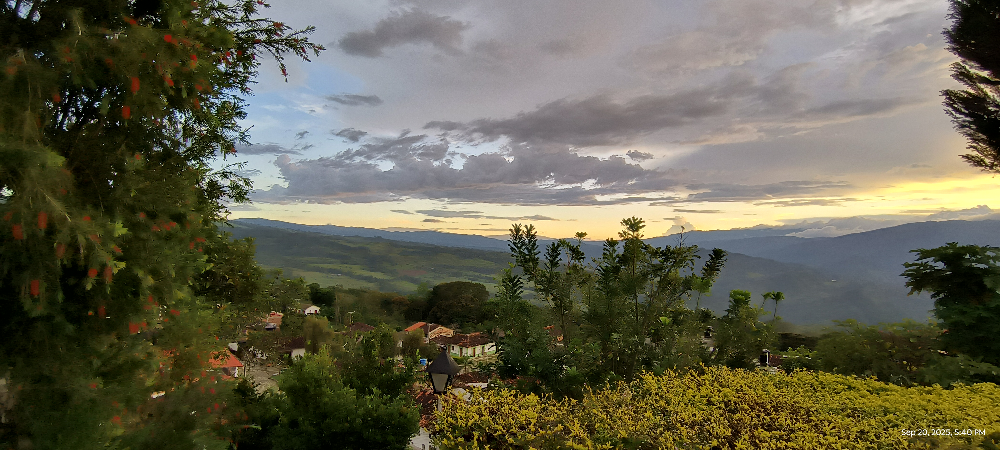

<br><details><summary>:camera:**46/IMG_20250920_174044920_HDR.jpg**</summary><sub> `Exif version` 0220 `OS version`  `Date` 2025:09:20 17:40:46 `Aperture` Not known `Brightness` 0.0 `Color space` 1 `Compression` 6`Exposure mode` 0 `Exposure time` 0.005934151 `Focal length` 2.13 `Lens model` Not known `Lens specification` Not known `Orientation` 1 `Scene type` Not known `f number` 2.2 `White balance` 0 `Sensing method` 1 `Shutter speed` 7.396</sub><sub>`Coordinates & altitude` (6.159203027777778, -73.44826505555555, 1415.0)</sub><sub> :earth_americas:`Location over` [Google Maps](http://maps.google.com/maps?q=6.159203027777778,-73.44826505555555) or [Openstreet Map](https://www.openstreetmap.org/query?lat=6.159203027777778&lon=-73.44826505555555)</sub></details>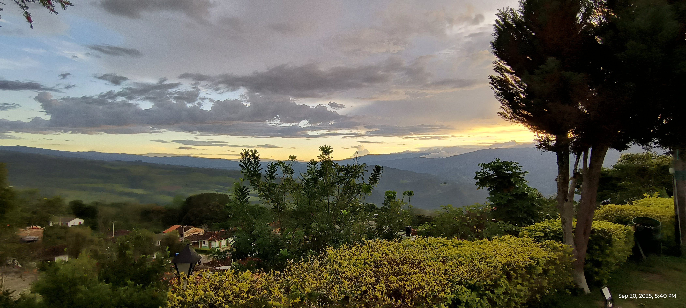

<br><details><summary>:camera:**46/IMG_20250920_174130657_HDR.jpg**</summary><sub> `Exif version` 0220 `OS version`  `Date` 2025:09:20 17:41:32 `Aperture` Not known `Brightness` 0.0 `Color space` 1 `Compression` 6`Exposure mode` 0 `Exposure time` 0.030000986 `Focal length` 2.13 `Lens model` Not known `Lens specification` Not known `Orientation` 6 `Scene type` Not known `f number` 2.2 `White balance` 0 `Sensing method` 1 `Shutter speed` 5.058</sub><sub>`Coordinates & altitude` (6.159377083333334, -73.44801330555556, 1415.0)</sub><sub> :earth_americas:`Location over` [Google Maps](http://maps.google.com/maps?q=6.159377083333334,-73.44801330555556) or [Openstreet Map](https://www.openstreetmap.org/query?lat=6.159377083333334&lon=-73.44801330555556)</sub></details>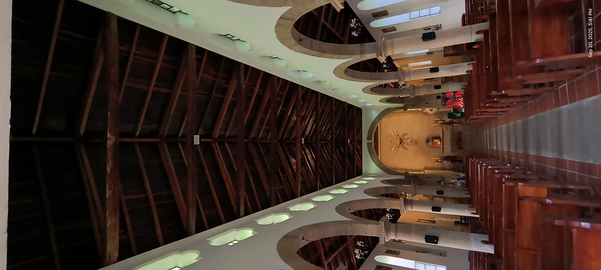

<br><details><summary>:camera:**46/IMG_20250920_174209877.jpg**</summary><sub> `Exif version` 0220 `OS version`  `Date` 2025:09:20 17:42:10 `Aperture` Not known `Brightness` 0.0 `Color space` 1 `Compression` 6`Exposure mode` 0 `Exposure time` 0.030016 `Focal length` 5.56 `Lens model` Not known `Lens specification` Not known `Orientation` 6 `Scene type` Not known `f number` 1.88 `White balance` 0 `Sensing method` 1 `Shutter speed` 5.058</sub><sub>`Coordinates & altitude` (6.159196833333334, -73.44873044444445, 1415.0)</sub><sub> :earth_americas:`Location over` [Google Maps](http://maps.google.com/maps?q=6.159196833333334,-73.44873044444445) or [Openstreet Map](https://www.openstreetmap.org/query?lat=6.159196833333334&lon=-73.44873044444445)</sub></details>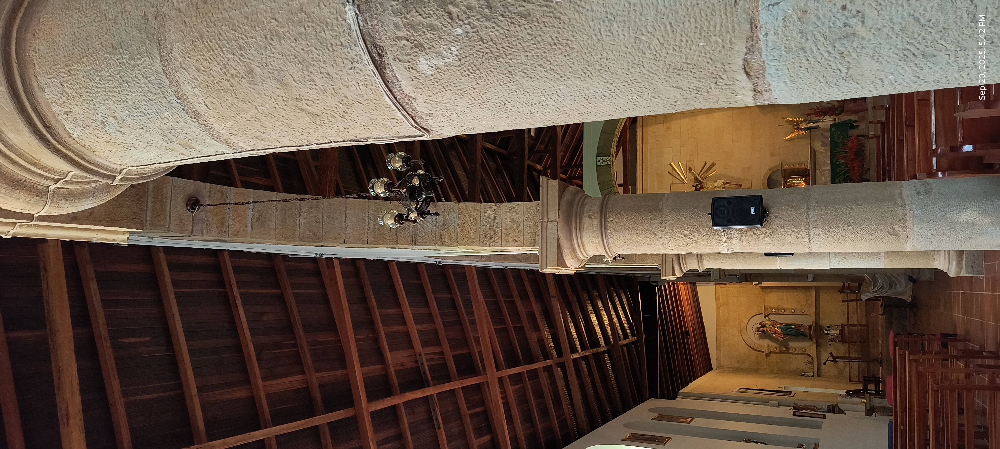

<br><details><summary>:camera:**46/IMG_20250920_174359581_HDR.jpg**</summary><sub> `Exif version` 0220 `OS version`  `Date` 2025:09:20 17:44:01 `Aperture` Not known `Brightness` 0.0 `Color space` 1 `Compression` 6`Exposure mode` 0 `Exposure time` 0.010016 `Focal length` 5.56 `Lens model` Not known `Lens specification` Not known `Orientation` 6 `Scene type` Not known `f number` 1.88 `White balance` 0 `Sensing method` 1 `Shutter speed` 6.641</sub><sub>`Coordinates & altitude` (6.159090027777778, -73.44858550000001, 1415.0)</sub><sub> :earth_americas:`Location over` [Google Maps](http://maps.google.com/maps?q=6.159090027777778,-73.44858550000001) or [Openstreet Map](https://www.openstreetmap.org/query?lat=6.159090027777778&lon=-73.44858550000001)</sub></details>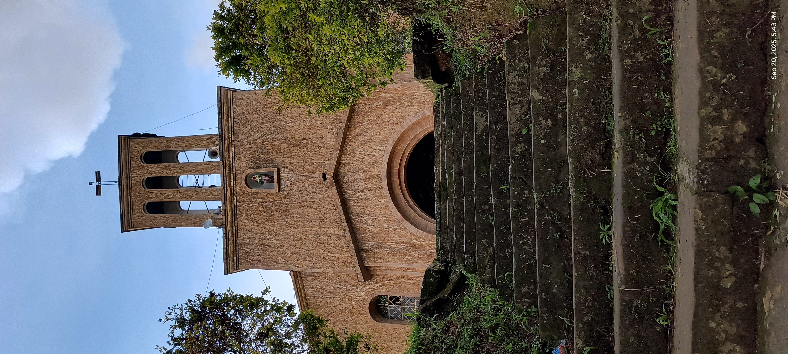

<br><details><summary>:camera:**46/IMG_20251102_091056713.jpg**</summary><sub> `Exif version` 0220 `OS version`  `Date` 2025:11:02 09:10:57 `Aperture` Not known `Brightness` 0.0 `Color space` 1 `Compression` 6`Exposure mode` 0 `Exposure time` 0.00050035 `Focal length` 2.13 `Lens model` Not known `Lens specification` Not known `Orientation` 6 `Scene type` Not known `f number` 2.2 `White balance` 0 `Sensing method` 1 `Shutter speed` 10.964</sub><sub>`Coordinates & altitude` (6.047197805555555, -73.49040983333333, 0.0)</sub><sub> :earth_americas:`Location over` [Google Maps](http://maps.google.com/maps?q=6.047197805555555,-73.49040983333333) or [Openstreet Map](https://www.openstreetmap.org/query?lat=6.047197805555555&lon=-73.49040983333333)</sub></details>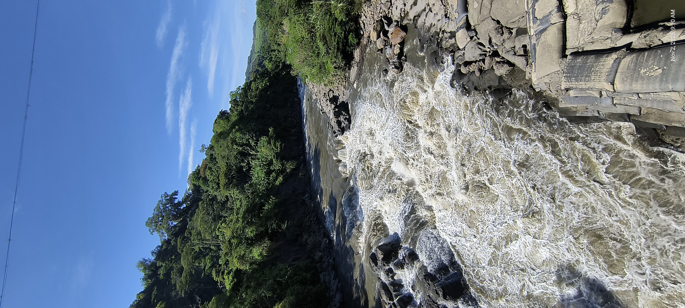

<br><details><summary>:camera:**46/IMG_20251102_091117422.jpg**</summary><sub> `Exif version` 0220 `OS version`  `Date` 2025:11:02 09:11:18 `Aperture` Not known `Brightness` 0.0 `Color space` 1 `Compression` 6`Exposure mode` 0 `Exposure time` 0.00050035 `Focal length` 2.13 `Lens model` Not known `Lens specification` Not known `Orientation` 6 `Scene type` Not known `f number` 2.2 `White balance` 0 `Sensing method` 1 `Shutter speed` 10.964</sub><sub>`Coordinates & altitude` (6.047197805555555, -73.49040983333333, 0.0)</sub><sub> :earth_americas:`Location over` [Google Maps](http://maps.google.com/maps?q=6.047197805555555,-73.49040983333333) or [Openstreet Map](https://www.openstreetmap.org/query?lat=6.047197805555555&lon=-73.49040983333333)</sub></details>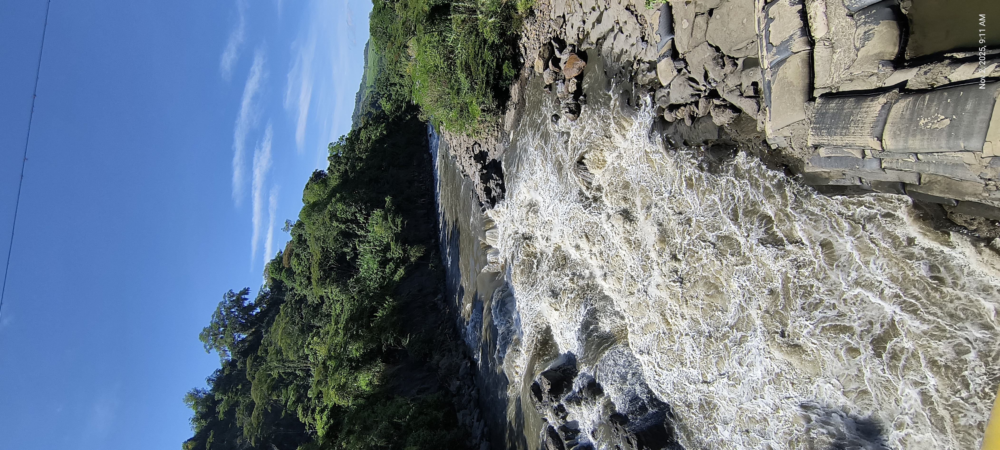

<br><details><summary>:camera:**46/IMG_20251102_091836061.jpg**</summary><sub> `Exif version` 0220 `OS version`  `Date` 2025:11:02 09:18:36 `Aperture` Not known `Brightness` 0.0 `Color space` 1 `Compression` 6`Exposure mode` 0 `Exposure time` 0.00050035 `Focal length` 2.13 `Lens model` Not known `Lens specification` Not known `Orientation` 6 `Scene type` Not known `f number` 2.2 `White balance` 0 `Sensing method` 1 `Shutter speed` 10.964</sub><sub>`Coordinates & altitude` (6.047197805555555, -73.49040983333333, 0.0)</sub><sub> :earth_americas:`Location over` [Google Maps](http://maps.google.com/maps?q=6.047197805555555,-73.49040983333333) or [Openstreet Map](https://www.openstreetmap.org/query?lat=6.047197805555555&lon=-73.49040983333333)</sub></details>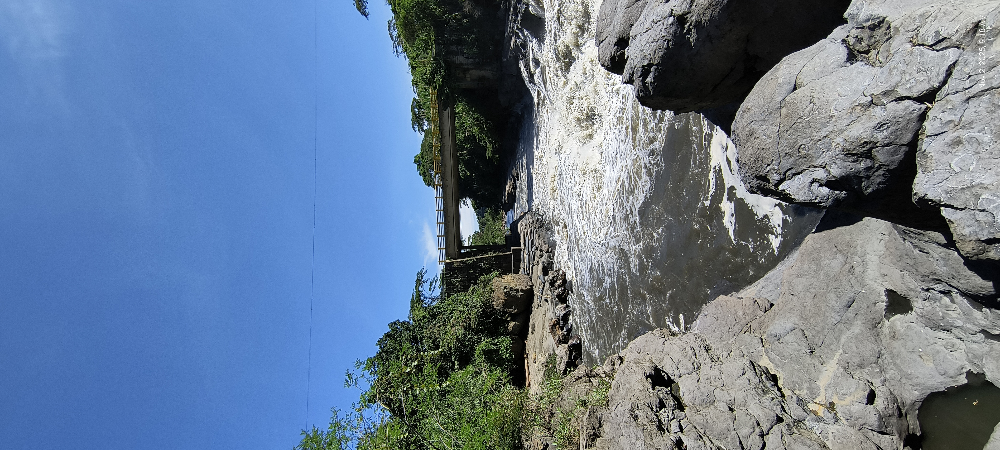

<br><details><summary>:camera:**46/IMG_20251102_091839347.jpg**</summary><sub> `Exif version` 0220 `OS version`  `Date` 2025:11:02 09:18:40 `Aperture` Not known `Brightness` 0.0 `Color space` 1 `Compression` 6`Exposure mode` 0 `Exposure time` 0.00050035 `Focal length` 2.13 `Lens model` Not known `Lens specification` Not known `Orientation` 6 `Scene type` Not known `f number` 2.2 `White balance` 0 `Sensing method` 1 `Shutter speed` 10.964</sub><sub>`Coordinates & altitude` (6.047197805555555, -73.49040983333333, 0.0)</sub><sub> :earth_americas:`Location over` [Google Maps](http://maps.google.com/maps?q=6.047197805555555,-73.49040983333333) or [Openstreet Map](https://www.openstreetmap.org/query?lat=6.047197805555555&lon=-73.49040983333333)</sub></details>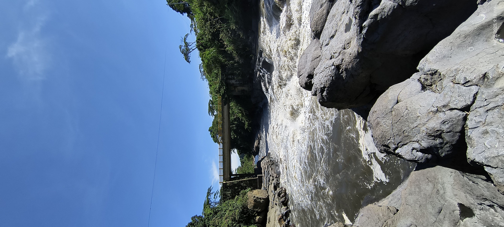

<br><details><summary>:camera:**46/IMG_20251102_091858974.jpg**</summary><sub> `Exif version` 0220 `OS version`  `Date` 2025:11:02 09:18:59 `Aperture` Not known `Brightness` 0.0 `Color space` 1 `Compression` 6`Exposure mode` 0 `Exposure time` 0.000460322 `Focal length` 2.13 `Lens model` Not known `Lens specification` Not known `Orientation` 6 `Scene type` Not known `f number` 2.2 `White balance` 0 `Sensing method` 1 `Shutter speed` 11.085</sub><sub>`Coordinates & altitude` (6.047197805555555, -73.49040983333333, 0.0)</sub><sub> :earth_americas:`Location over` [Google Maps](http://maps.google.com/maps?q=6.047197805555555,-73.49040983333333) or [Openstreet Map](https://www.openstreetmap.org/query?lat=6.047197805555555&lon=-73.49040983333333)</sub></details>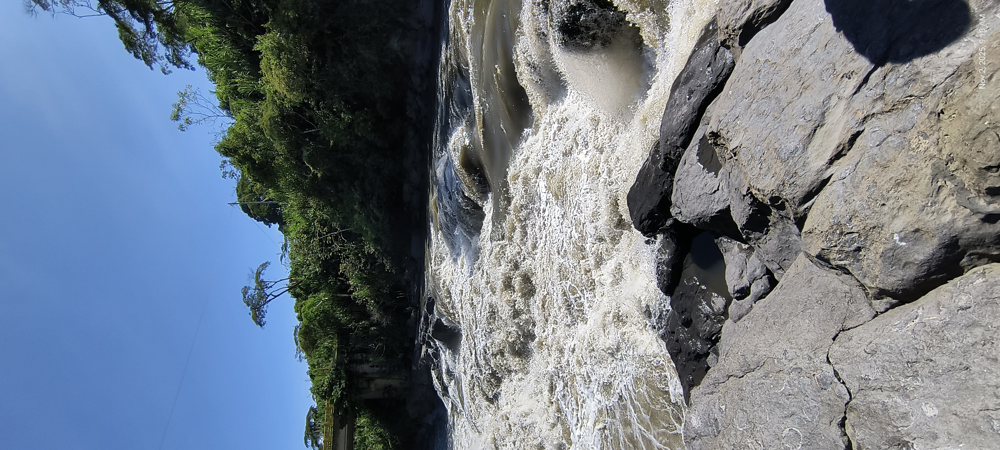

<br><details><summary>:camera:**46/IMG_2038.JPG**</summary><sub> `Exif version` 0232 `OS version` 18.3.1 `Date` 2025:02:23 10:07:57 `Aperture` Not known `Brightness` 5.099790316431567 `Color space` 65535 `Compression` 6`Exposure mode` 0 `Exposure time` 0.005780346820809248 `Focal length` 6.86 `Lens model` iPhone 14 Pro back triple camera 6.86mm f/1.78 `Lens specification` (2.220000028611935, 9.0, 1.7799999713880652, 2.8) `Orientation` 6 `Scene type` Not known `f number` 1.78 `White balance` 0 `Sensing method` 2 `Shutter speed` 7.4332179578540165</sub><sub>`Coordinates & altitude` (5.823161111111111, -73.50856944444445, 2364.861066235864)</sub><sub> :earth_americas:`Location over` [Google Maps](http://maps.google.com/maps?q=5.823161111111111,-73.50856944444445) or [Openstreet Map](https://www.openstreetmap.org/query?lat=5.823161111111111&lon=-73.50856944444445)</sub></details>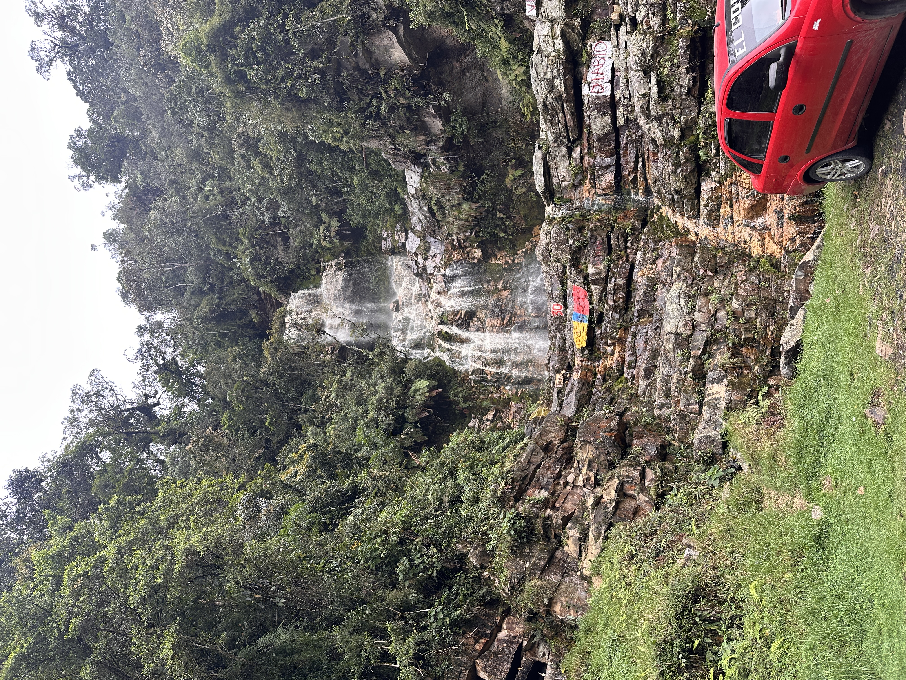

<br><details><summary>:camera:**46/IMG_2041.JPG**</summary><sub> `Exif version` 0232 `OS version` 18.3.1 `Date` 2025:02:23 10:09:53 `Aperture` Not known `Brightness` 5.10994055960953 `Color space` 65535 `Compression` 6`Exposure mode` 0 `Exposure time` 0.00641025641025641 `Focal length` 6.86 `Lens model` iPhone 14 Pro back triple camera 6.86mm f/1.78 `Lens specification` (2.220000028611935, 9.0, 1.7799999713880652, 2.8) `Orientation` 1 `Scene type` Not known `f number` 1.78 `White balance` 0 `Sensing method` 2 `Shutter speed` 7.283210987449681</sub><sub>`Coordinates & altitude` (5.823305555555556, -73.50876666666667, 2382.3525179856115)</sub><sub> :earth_americas:`Location over` [Google Maps](http://maps.google.com/maps?q=5.823305555555556,-73.50876666666667) or [Openstreet Map](https://www.openstreetmap.org/query?lat=5.823305555555556&lon=-73.50876666666667)</sub></details>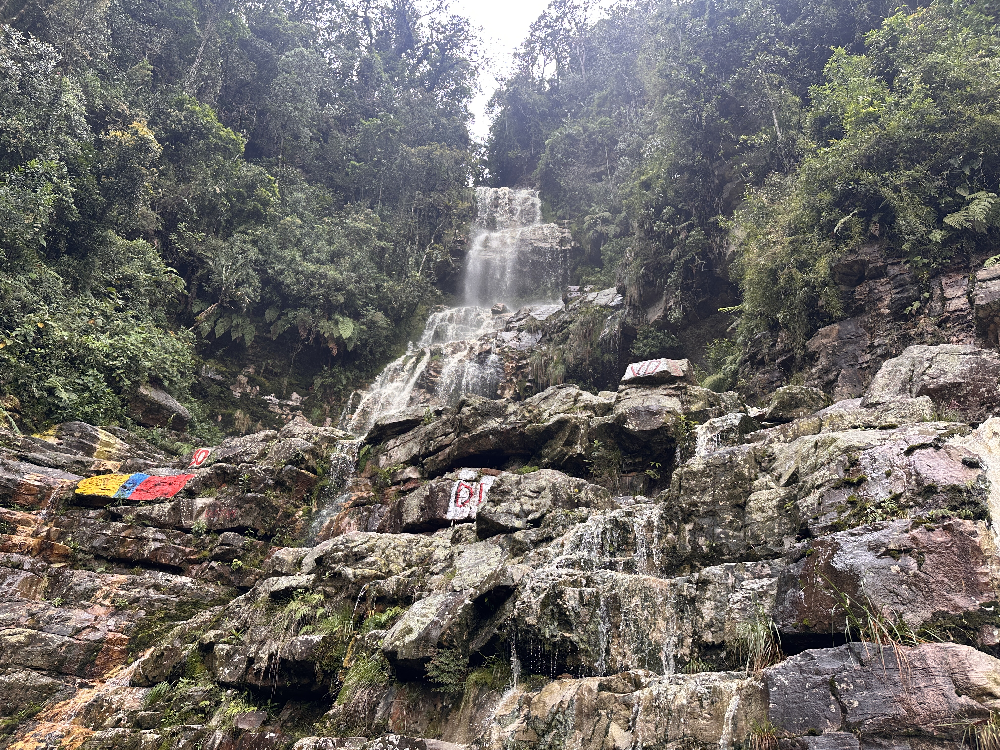

<br><details><summary>:camera:**46/IMG_2044.JPG**</summary><sub> `Exif version` 0232 `OS version` 18.3.1 `Date` 2025:02:23 12:07:48 `Aperture` Not known `Brightness` 10.237836790075596 `Color space` 65535 `Compression` 6`Exposure mode` 0 `Exposure time` 0.00013199577613516366 `Focal length` 6.86 `Lens model` iPhone 14 Pro back triple camera 6.86mm f/1.78 `Lens specification` (2.220000028611935, 9.0, 1.7799999713880652, 2.8) `Orientation` 1 `Scene type` Not known `f number` 1.78 `White balance` 0 `Sensing method` 2 `Shutter speed` 12.887174436419349</sub><sub>`Coordinates & altitude` (5.5382138888888885, -73.35942777777777, 2726.608173076923)</sub><sub> :earth_americas:`Location over` [Google Maps](http://maps.google.com/maps?q=5.5382138888888885,-73.35942777777777) or [Openstreet Map](https://www.openstreetmap.org/query?lat=5.5382138888888885&lon=-73.35942777777777)</sub></details>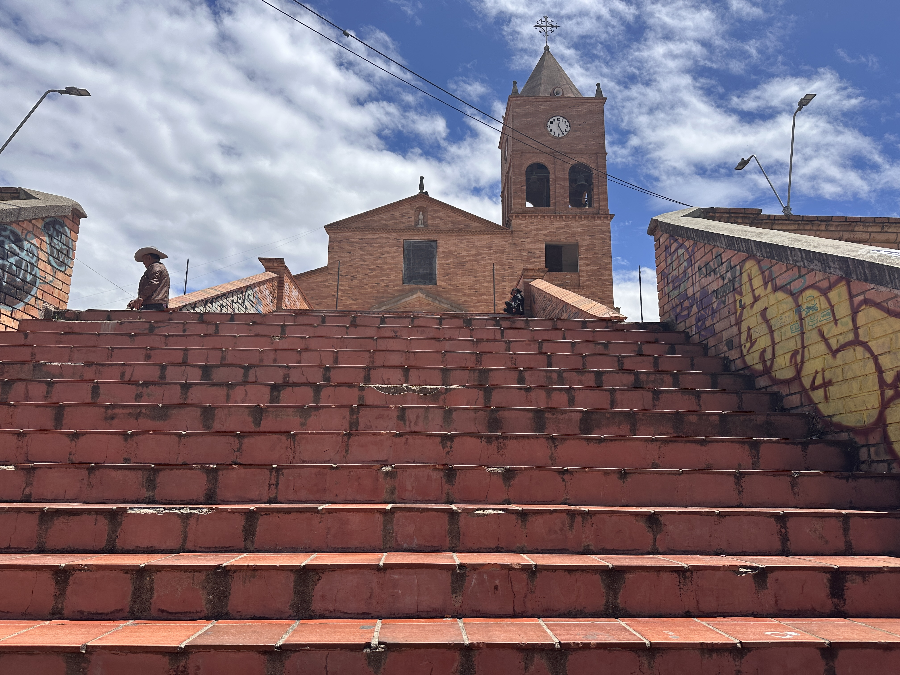

<br><details><summary>:camera:**46/IMG_2045.JPG**</summary><sub> `Exif version` 0232 `OS version` 18.3.1 `Date` 2025:02:23 12:07:51 `Aperture` Not known `Brightness` 10.36791910835344 `Color space` 65535 `Compression` 6`Exposure mode` 0 `Exposure time` 0.0001219958521410272 `Focal length` 6.86 `Lens model` iPhone 14 Pro back triple camera 6.86mm f/1.78 `Lens specification` (2.220000028611935, 9.0, 1.7799999713880652, 2.8) `Orientation` 6 `Scene type` Not known `f number` 1.78 `White balance` 0 `Sensing method` 2 `Shutter speed` 13.000831231368952</sub><sub>`Coordinates & altitude` (5.538288888888888, -73.35948055555555, 2725.153897401732)</sub><sub> :earth_americas:`Location over` [Google Maps](http://maps.google.com/maps?q=5.538288888888888,-73.35948055555555) or [Openstreet Map](https://www.openstreetmap.org/query?lat=5.538288888888888&lon=-73.35948055555555)</sub></details>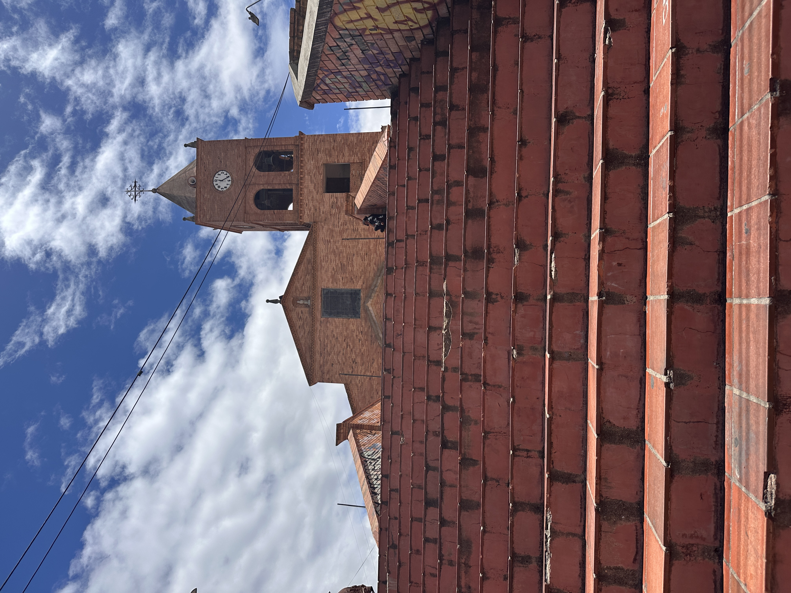

<br><details><summary>:camera:**46/IMG_2046.JPG**</summary><sub> `Exif version` 0232 `OS version` 18.3.1 `Date` 2025:02:23 12:23:13 `Aperture` Not known `Brightness` 10.863282697295295 `Color space` 65535 `Compression` 6`Exposure mode` 0 `Exposure time` 0.00010299721907508497 `Focal length` 6.86 `Lens model` iPhone 14 Pro back triple camera 6.86mm f/1.78 `Lens specification` (2.220000028611935, 9.0, 1.7799999713880652, 2.8) `Orientation` 1 `Scene type` Not known `f number` 1.78 `White balance` 0 `Sensing method` 2 `Shutter speed` 13.245068045152442</sub><sub>`Coordinates & altitude` (5.535211111111111, -73.36123611111111, 2735.7178153446034)</sub><sub> :earth_americas:`Location over` [Google Maps](http://maps.google.com/maps?q=5.535211111111111,-73.36123611111111) or [Openstreet Map](https://www.openstreetmap.org/query?lat=5.535211111111111&lon=-73.36123611111111)</sub></details>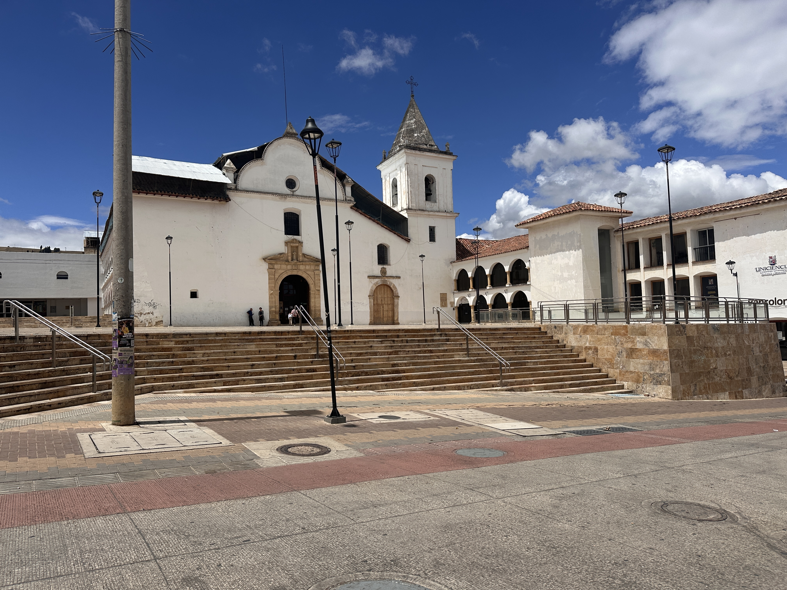

<br><details><summary>:camera:**46/IMG_2047.JPG**</summary><sub> `Exif version` 0232 `OS version` 18.3.1 `Date` 2025:02:23 12:23:17 `Aperture` Not known `Brightness` 10.537432731877177 `Color space` 65535 `Compression` 6`Exposure mode` 0 `Exposure time` 0.0001219958521410272 `Focal length` 6.86 `Lens model` iPhone 14 Pro back triple camera 6.86mm f/1.78 `Lens specification` (2.220000028611935, 9.0, 1.7799999713880652, 2.8) `Orientation` 1 `Scene type` Not known `f number` 1.78 `White balance` 0 `Sensing method` 2 `Shutter speed` 13.000831231368952</sub><sub>`Coordinates & altitude` (5.535097222222222, -73.36123611111111, 2765.067692307692)</sub><sub> :earth_americas:`Location over` [Google Maps](http://maps.google.com/maps?q=5.535097222222222,-73.36123611111111) or [Openstreet Map](https://www.openstreetmap.org/query?lat=5.535097222222222&lon=-73.36123611111111)</sub></details>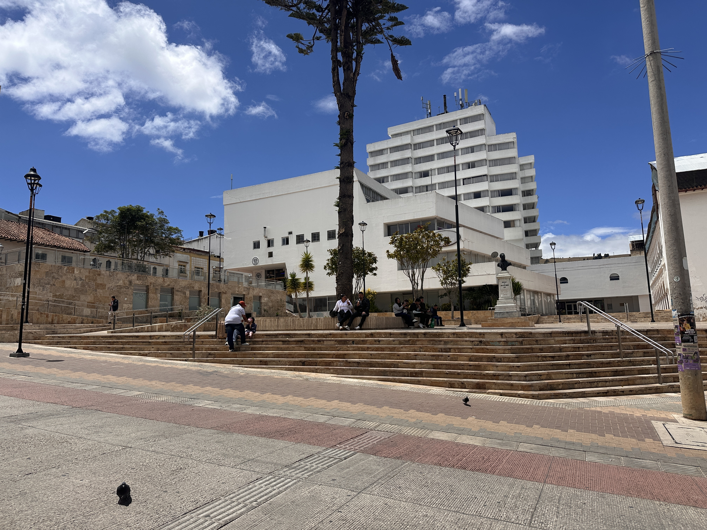

<br><details><summary>:camera:**46/IMG_2048.JPG**</summary><sub> `Exif version` 0232 `OS version` 18.3.1 `Date` 2025:02:23 12:23:20 `Aperture` Not known `Brightness` 10.28847926267281 `Color space` 65535 `Compression` 6`Exposure mode` 0 `Exposure time` 0.00014200511218403862 `Focal length` 6.86 `Lens model` iPhone 14 Pro back triple camera 6.86mm f/1.78 `Lens specification` (2.220000028611935, 9.0, 1.7799999713880652, 2.8) `Orientation` 6 `Scene type` Not known `f number` 1.78 `White balance` 0 `Sensing method` 2 `Shutter speed` 12.781821441376838</sub><sub>`Coordinates & altitude` (5.535127777777777, -73.3612611111111, 2765.142284569138)</sub><sub> :earth_americas:`Location over` [Google Maps](http://maps.google.com/maps?q=5.535127777777777,-73.3612611111111) or [Openstreet Map](https://www.openstreetmap.org/query?lat=5.535127777777777&lon=-73.3612611111111)</sub></details>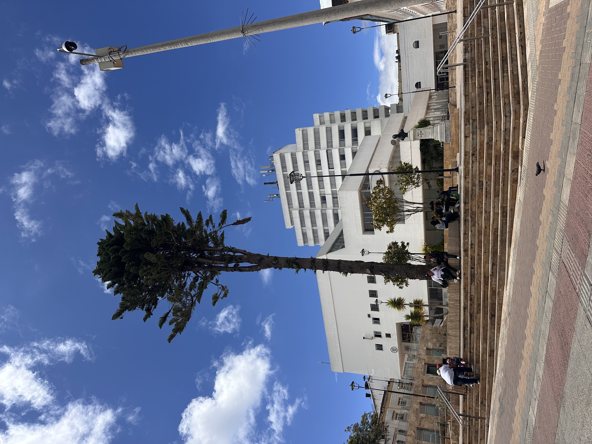

<br><details><summary>:camera:**46/IMG_2049.JPG**</summary><sub> `Exif version` 0232 `OS version` 18.3.1 `Date` 2025:02:23 12:23:25 `Aperture` Not known `Brightness` 10.423191350409985 `Color space` 65535 `Compression` 6`Exposure mode` 0 `Exposure time` 0.00013199577613516366 `Focal length` 6.86 `Lens model` iPhone 14 Pro back triple camera 6.86mm f/1.78 `Lens specification` (2.220000028611935, 9.0, 1.7799999713880652, 2.8) `Orientation` 6 `Scene type` Not known `f number` 1.78 `White balance` 0 `Sensing method` 2 `Shutter speed` 12.887174436419349</sub><sub>`Coordinates & altitude` (5.535130555555555, -73.36125277777778, 2765.024347826087)</sub><sub> :earth_americas:`Location over` [Google Maps](http://maps.google.com/maps?q=5.535130555555555,-73.36125277777778) or [Openstreet Map](https://www.openstreetmap.org/query?lat=5.535130555555555&lon=-73.36125277777778)</sub></details>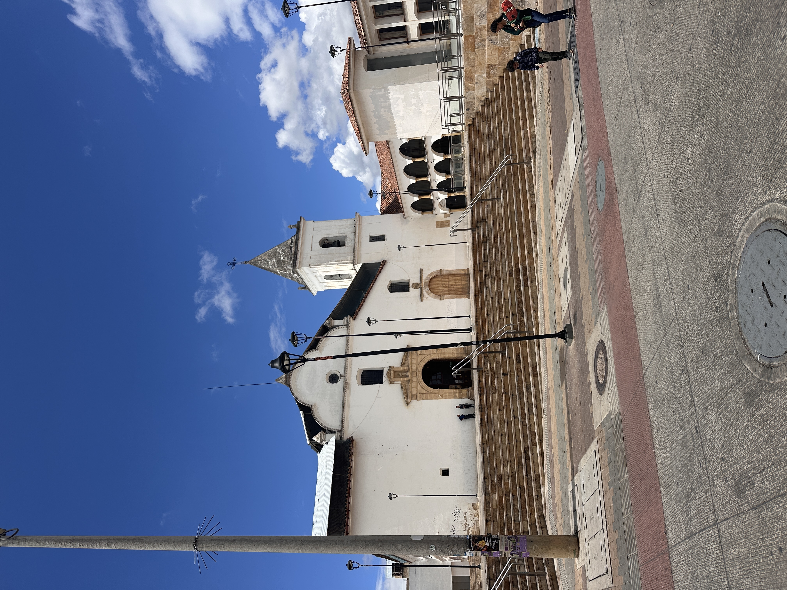

<br><details><summary>:camera:**46/IMG_2332.JPG**</summary><sub> `Exif version` 0232 `OS version` 18.5 `Date` 2025:04:17 14:46:49 `Aperture` Not known `Brightness` 6.67281746031746 `Color space` 65535 `Compression` 6`Exposure mode` 0 `Exposure time` 0.0018214936247723133 `Focal length` 6.86 `Lens model` iPhone 14 Pro back triple camera 6.86mm f/1.78 `Lens specification` (2.220000028611935, 9.0, 1.7799999713880652, 2.8) `Orientation` 6 `Scene type` Not known `f number` 1.78 `White balance` 0 `Sensing method` 2 `Shutter speed` 9.101053362657716</sub></details>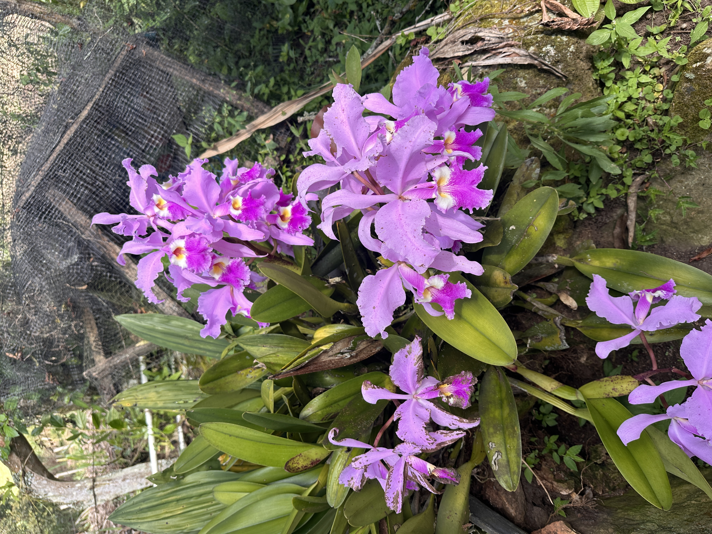

<br><details><summary>:camera:**46/IMG_2333.JPG**</summary><sub> `Exif version` 0232 `OS version` 18.5 `Date` 2025:04:17 17:16:03 `Aperture` Not known `Brightness` 4.659887618925994 `Color space` 65535 `Compression` 6`Exposure mode` 0 `Exposure time` 0.010101010101010102 `Focal length` 2.22 `Lens model` iPhone 14 Pro back triple camera 2.22mm f/2.2 `Lens specification` (2.220000028611935, 9.0, 1.7799999713880652, 2.8) `Orientation` 6 `Scene type` Not known `f number` 2.2 `White balance` 0 `Sensing method` 2 `Shutter speed` 6.631073005975578</sub><sub>`Coordinates & altitude` (6.01995, -73.49620833333333, 1693.3240997229916)</sub><sub> :earth_americas:`Location over` [Google Maps](http://maps.google.com/maps?q=6.01995,-73.49620833333333) or [Openstreet Map](https://www.openstreetmap.org/query?lat=6.01995&lon=-73.49620833333333)</sub></details>

<br><details><summary>:camera:**46/IMG_2334.JPG**</summary><sub> `Exif version` 0232 `OS version` 18.5 `Date` 2025:04:17 17:16:36 `Aperture` Not known `Brightness` 4.844197883169708 `Color space` 65535 `Compression` 6`Exposure mode` 0 `Exposure time` 0.010101010101010102 `Focal length` 2.22 `Lens model` iPhone 14 Pro back triple camera 2.22mm f/2.2 `Lens specification` (2.220000028611935, 9.0, 1.7799999713880652, 2.8) `Orientation` 6 `Scene type` Not known `f number` 2.2 `White balance` 0 `Sensing method` 2 `Shutter speed` 6.631073005975578</sub><sub>`Coordinates & altitude` (6.019930555555556, -73.49628611111112, 1699.6573248407644)</sub><sub> :earth_americas:`Location over` [Google Maps](http://maps.google.com/maps?q=6.019930555555556,-73.49628611111112) or [Openstreet Map](https://www.openstreetmap.org/query?lat=6.019930555555556&lon=-73.49628611111112)</sub></details>

<br><details><summary>:camera:**46/IMG_2335.JPG**</summary><sub> `Exif version` 0232 `OS version` 18.5 `Date` 2025:04:17 17:18:06 `Aperture` Not known `Brightness` 1.2025742681800902 `Color space` 65535 `Compression` 6`Exposure mode` 0 `Exposure time` 0.016666666666666666 `Focal length` 2.22 `Lens model` iPhone 14 Pro back triple camera 2.22mm f/2.2 `Lens specification` (2.220000028611935, 9.0, 1.7799999713880652, 2.8) `Orientation` 6 `Scene type` Not known `f number` 2.2 `White balance` 0 `Sensing method` 2 `Shutter speed` 5.914847325380749</sub><sub>`Coordinates & altitude` (6.019927777777777, -73.49617777777777, 1698.3553191489361)</sub><sub> :earth_americas:`Location over` [Google Maps](http://maps.google.com/maps?q=6.019927777777777,-73.49617777777777) or [Openstreet Map](https://www.openstreetmap.org/query?lat=6.019927777777777&lon=-73.49617777777777)</sub></details>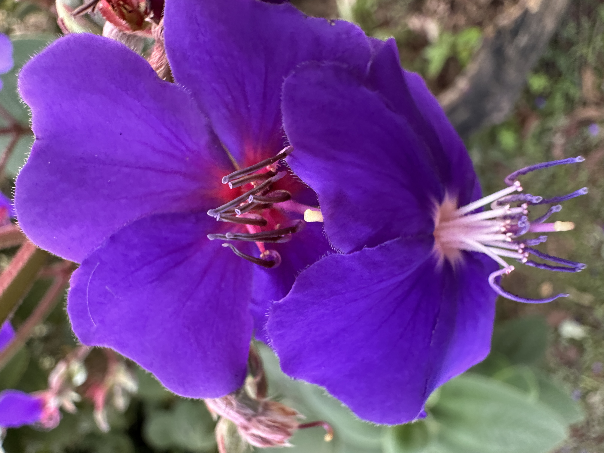

<br><details><summary>:camera:**46/IMG_2336.JPG**</summary><sub> `Exif version` 0232 `OS version` 18.5 `Date` 2025:04:17 17:18:35 `Aperture` Not known `Brightness` 1.4728840051153318 `Color space` 65535 `Compression` 6`Exposure mode` 0 `Exposure time` 0.016666666666666666 `Focal length` 2.22 `Lens model` iPhone 14 Pro back triple camera 2.22mm f/2.2 `Lens specification` (2.220000028611935, 9.0, 1.7799999713880652, 2.8) `Orientation` 6 `Scene type` Not known `f number` 2.2 `White balance` 0 `Sensing method` 2 `Shutter speed` 5.914847325380749</sub><sub>`Coordinates & altitude` (6.019977777777778, -73.49617777777777, 1708.8896396396397)</sub><sub> :earth_americas:`Location over` [Google Maps](http://maps.google.com/maps?q=6.019977777777778,-73.49617777777777) or [Openstreet Map](https://www.openstreetmap.org/query?lat=6.019977777777778&lon=-73.49617777777777)</sub></details>

<br><details><summary>:camera:**46/IMG_2337.JPG**</summary><sub> `Exif version` 0232 `OS version` 18.5 `Date` 2025:04:17 17:18:37 `Aperture` Not known `Brightness` 1.6891318253183696 `Color space` 65535 `Compression` 6`Exposure mode` 0 `Exposure time` 0.0196078431372549 `Focal length` 2.22 `Lens model` iPhone 14 Pro back triple camera 2.22mm f/2.2 `Lens specification` (2.220000028611935, 9.0, 1.7799999713880652, 2.8) `Orientation` 6 `Scene type` Not known `f number` 2.2 `White balance` 0 `Sensing method` 2 `Shutter speed` 5.6631727711694735</sub><sub>`Coordinates & altitude` (6.019977777777778, -73.49618611111111, 1709.2586872586874)</sub><sub> :earth_americas:`Location over` [Google Maps](http://maps.google.com/maps?q=6.019977777777778,-73.49618611111111) or [Openstreet Map](https://www.openstreetmap.org/query?lat=6.019977777777778&lon=-73.49618611111111)</sub></details>

<br><details><summary>:camera:**46/IMG_E0018.JPG**</summary><sub> `Exif version` 0221 `OS version` 18.3.1 `Date` 2025:02:22 11:15:44 `Aperture` Not known `Brightness` 9.167683702008645 `Color space` 65535 `Compression` Not known`Exposure mode` 0 `Exposure time` 0.0004050222762251924 `Focal length` 6.86 `Lens model` iPhone 14 Pro back triple camera 6.86mm f/1.78 `Lens specification` (2.220000028611935, 9.0, 1.7799999713880652, 2.8) `Orientation` 1 `Scene type` Not known `f number` 1.78 `White balance` 0 `Sensing method` 2 `Shutter speed` 11.269790476190476</sub><sub>`Coordinates & altitude` (6.016625, -73.49339444444445, 1767.708984375)</sub><sub> :earth_americas:`Location over` [Google Maps](http://maps.google.com/maps?q=6.016625,-73.49339444444445) or [Openstreet Map](https://www.openstreetmap.org/query?lat=6.016625&lon=-73.49339444444445)</sub></details>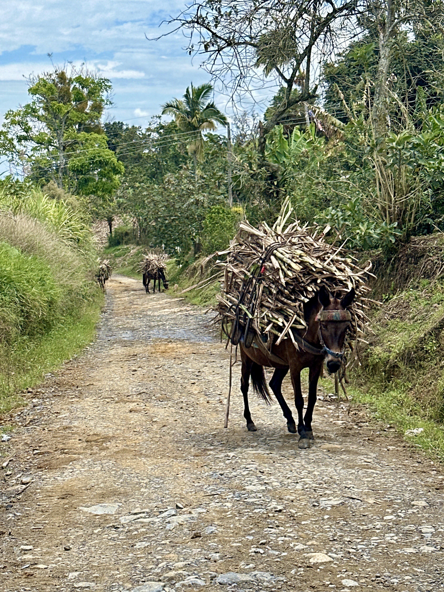

<br><details><summary>:camera:**46/IMG_E2046.JPG**</summary><sub> `Exif version` 0232 `OS version` 18.3.1 `Date` 2025:02:23 12:23:13 `Aperture` Not known `Brightness` 10.863282697295295 `Color space` 65535 `Compression` Not known`Exposure mode` 0 `Exposure time` 0.00010299721907508497 `Focal length` 6.86 `Lens model` iPhone 14 Pro back triple camera 6.86mm f/1.78 `Lens specification` (2.220000028611935, 9.0, 1.7799999713880652, 2.8) `Orientation` 1 `Scene type` Not known `f number` 1.78 `White balance` 0 `Sensing method` 2 `Shutter speed` 13.245068045152442</sub><sub>`Coordinates & altitude` (5.535211111111111, -73.36123611111111, 2735.7178153446034)</sub><sub> :earth_americas:`Location over` [Google Maps](http://maps.google.com/maps?q=5.535211111111111,-73.36123611111111) or [Openstreet Map](https://www.openstreetmap.org/query?lat=5.535211111111111&lon=-73.36123611111111)</sub></details>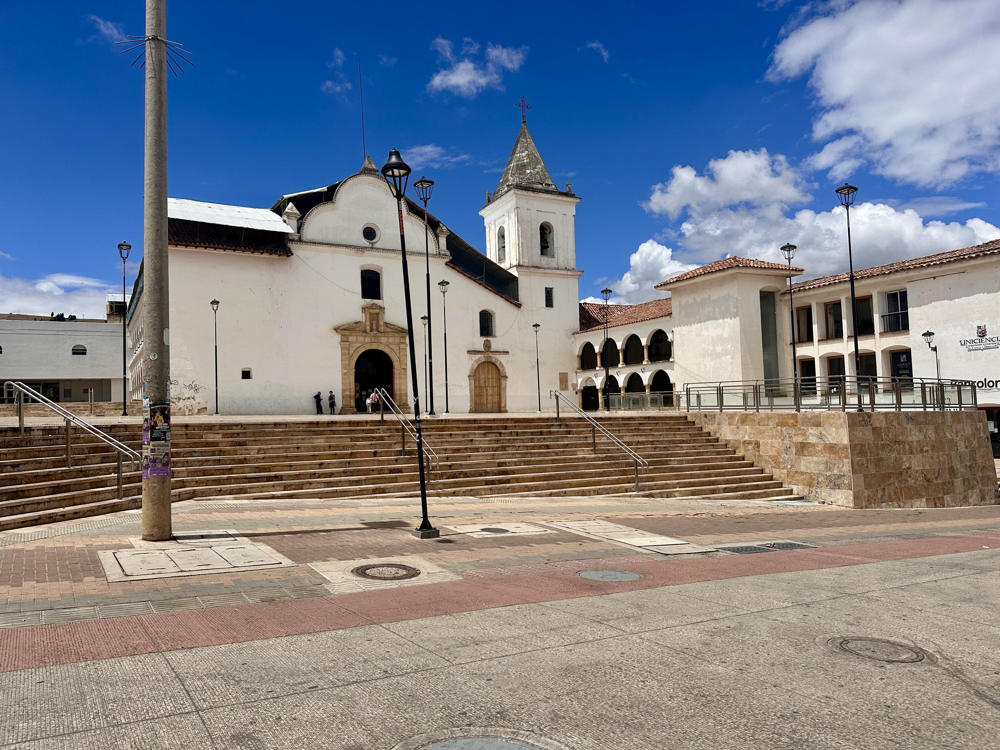

<br><details><summary>:camera:**46/PXL_20230406_113931173.jpg**</summary><sub> `Exif version` 0232 `OS version` HDR+ 1.0.514217843zd `Date` 2023:04:06 06:39:31 `Aperture` Not known `Brightness` 6.24 `Color space` 1 `Compression` 6`Exposure mode` 0 `Exposure time` 0.003145 `Focal length` 6.81 `Lens model` Pixel 6 back camera 6.81mm f/1.85 `Lens specification` Not known `Orientation` 1 `Scene type` Not known `f number` 1.85 `White balance` 0 `Sensing method` 2 `Shutter speed` 8.31</sub></details>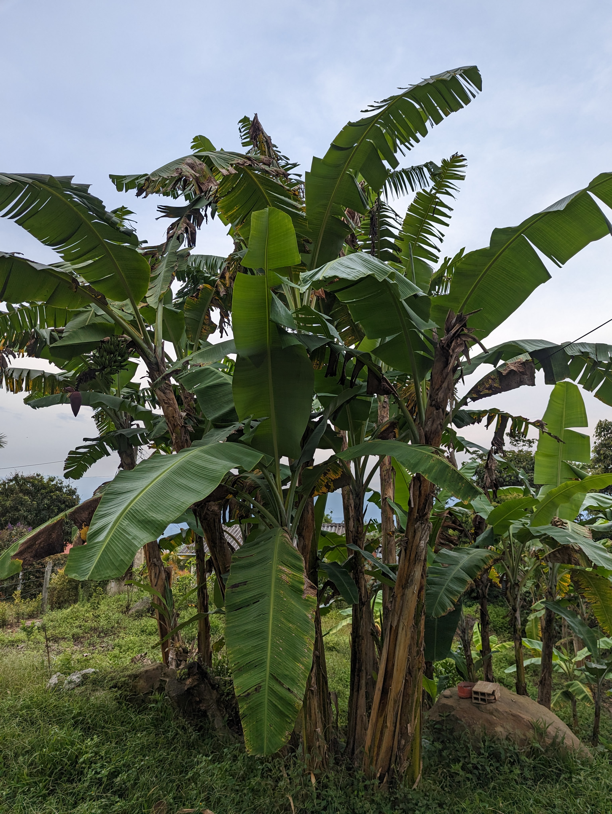

<br><details><summary>:camera:**46/PXL_20230406_113938355.jpg**</summary><sub> `Exif version` 0232 `OS version` HDR+ 1.0.514217843zd `Date` 2023:04:06 06:39:38 `Aperture` Not known `Brightness` 3.98 `Color space` 1 `Compression` 6`Exposure mode` 0 `Exposure time` 0.01303 `Focal length` 6.81 `Lens model` Pixel 6 back camera 6.81mm f/1.85 `Lens specification` Not known `Orientation` 1 `Scene type` Not known `f number` 1.85 `White balance` 0 `Sensing method` 2 `Shutter speed` 6.26</sub></details>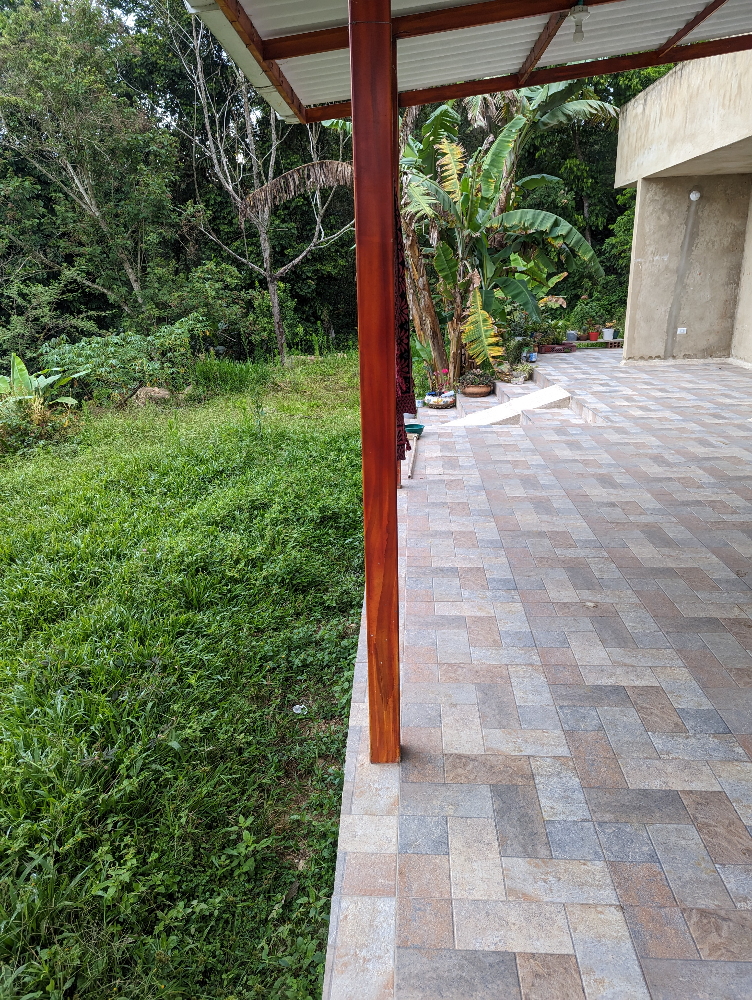

<br><details><summary>:camera:**46/PXL_20230406_121658126.jpg**</summary><sub> `Exif version` 0232 `OS version` HDR+ 1.0.514217843zd `Date` 2023:04:06 07:16:58 `Aperture` Not known `Brightness` 5.26 `Color space` 1 `Compression` 6`Exposure mode` 0 `Exposure time` 0.006493 `Focal length` 6.81 `Lens model` Pixel 6 back camera 6.81mm f/1.85 `Lens specification` Not known `Orientation` 1 `Scene type` Not known `f number` 1.85 `White balance` 0 `Sensing method` 2 `Shutter speed` 7.27</sub></details>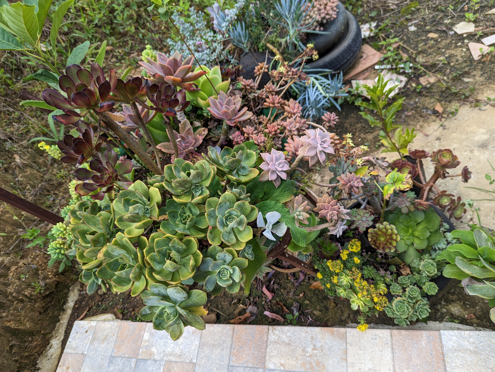

<br><details><summary>:camera:**46/PXL_20230406_170549684.jpg**</summary><sub> `Exif version` 0232 `OS version` HDR+ 1.0.514217843zd `Date` 2023:04:06 12:05:49 `Aperture` Not known `Brightness` 9.19 `Color space` 1 `Compression` 6`Exposure mode` 0 `Exposure time` 0.000415 `Focal length` 6.81 `Lens model` Pixel 6 back camera 6.81mm f/1.85 `Lens specification` Not known `Orientation` 1 `Scene type` Not known `f number` 1.85 `White balance` 0 `Sensing method` 2 `Shutter speed` 11.23</sub><sub>`Coordinates & altitude` (6.020019444444444, -73.49635555555555, 1742.0)</sub><sub> :earth_americas:`Location over` [Google Maps](http://maps.google.com/maps?q=6.020019444444444,-73.49635555555555) or [Openstreet Map](https://www.openstreetmap.org/query?lat=6.020019444444444&lon=-73.49635555555555)</sub></details>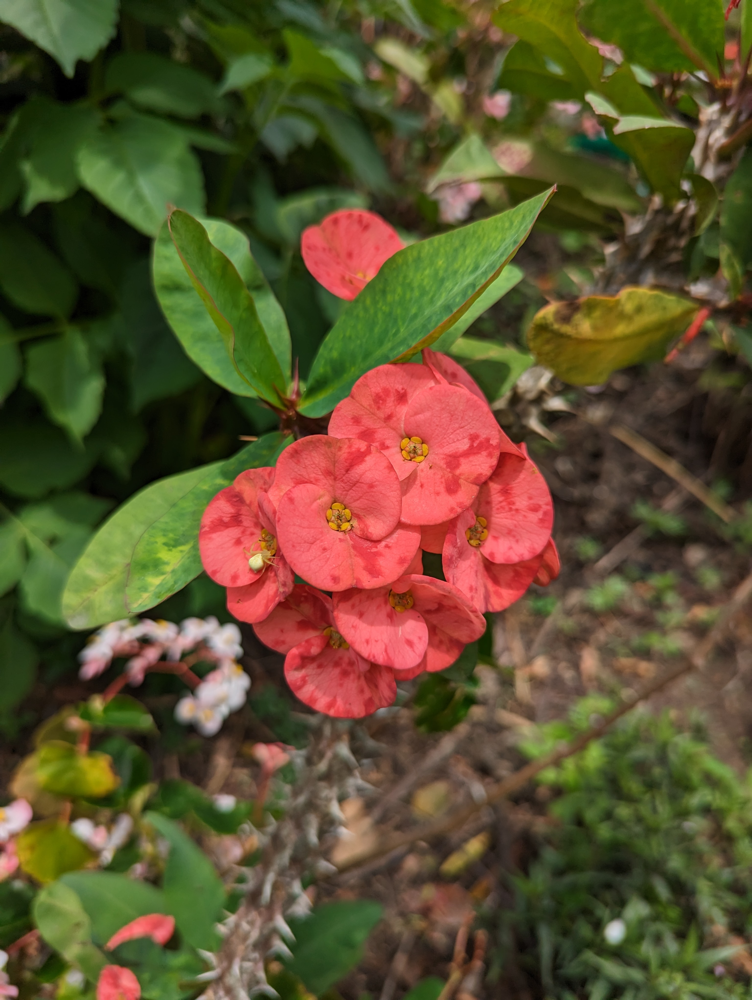

<br><details><summary>:camera:**46/PXL_20230406_170601758.jpg**</summary><sub> `Exif version` 0232 `OS version` HDR+ 1.0.514217843zd `Date` 2023:04:06 12:06:01 `Aperture` Not known `Brightness` 9.11 `Color space` 1 `Compression` 6`Exposure mode` 0 `Exposure time` 0.000451 `Focal length` 6.81 `Lens model` Pixel 6 back camera 6.81mm f/1.85 `Lens specification` Not known `Orientation` 1 `Scene type` Not known `f number` 1.85 `White balance` 0 `Sensing method` 2 `Shutter speed` 11.12</sub><sub>`Coordinates & altitude` (6.020019444444444, -73.49635555555555, 1742.0)</sub><sub> :earth_americas:`Location over` [Google Maps](http://maps.google.com/maps?q=6.020019444444444,-73.49635555555555) or [Openstreet Map](https://www.openstreetmap.org/query?lat=6.020019444444444&lon=-73.49635555555555)</sub></details>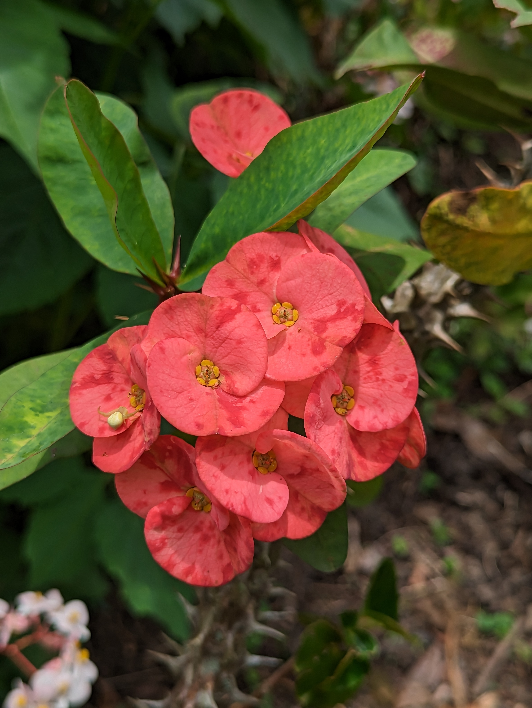

<br><details><summary>:camera:**46/PXL_20230406_170607267.jpg**</summary><sub> `Exif version` 0232 `OS version` HDR+ 1.0.514217843zd `Date` 2023:04:06 12:06:07 `Aperture` Not known `Brightness` 8.95 `Color space` 1 `Compression` 6`Exposure mode` 0 `Exposure time` 0.000451 `Focal length` 6.81 `Lens model` Pixel 6 back camera 6.81mm f/1.85 `Lens specification` Not known `Orientation` 1 `Scene type` Not known `f number` 1.85 `White balance` 0 `Sensing method` 2 `Shutter speed` 11.12</sub><sub>`Coordinates & altitude` (6.020019444444444, -73.49635555555555, 1742.0)</sub><sub> :earth_americas:`Location over` [Google Maps](http://maps.google.com/maps?q=6.020019444444444,-73.49635555555555) or [Openstreet Map](https://www.openstreetmap.org/query?lat=6.020019444444444&lon=-73.49635555555555)</sub></details>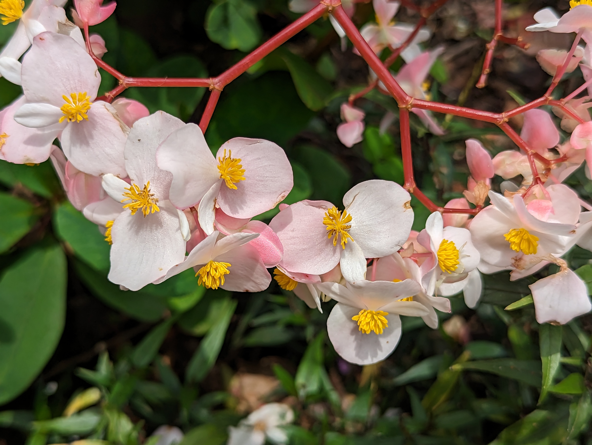

<br><details><summary>:camera:**46/PXL_20230406_170626848.jpg**</summary><sub> `Exif version` 0232 `OS version` HDR+ 1.0.514217843zd `Date` 2023:04:06 12:06:26 `Aperture` Not known `Brightness` 6.99 `Color space` 1 `Compression` 6`Exposure mode` 0 `Exposure time` 0.001917 `Focal length` 6.81 `Lens model` Pixel 6 back camera 6.81mm f/1.85 `Lens specification` Not known `Orientation` 1 `Scene type` Not known `f number` 1.85 `White balance` 0 `Sensing method` 2 `Shutter speed` 9.03</sub><sub>`Coordinates & altitude` (6.020019444444444, -73.49635555555555, 1742.0)</sub><sub> :earth_americas:`Location over` [Google Maps](http://maps.google.com/maps?q=6.020019444444444,-73.49635555555555) or [Openstreet Map](https://www.openstreetmap.org/query?lat=6.020019444444444&lon=-73.49635555555555)</sub></details>

<br><details><summary>:camera:**46/PXL_20230406_170645181.jpg**</summary><sub> `Exif version` 0232 `OS version` HDR+ 1.0.514217843zd `Date` 2023:04:06 12:06:45 `Aperture` Not known `Brightness` 8.88 `Color space` 1 `Compression` 6`Exposure mode` 0 `Exposure time` 0.00174 `Focal length` 6.81 `Lens model` Pixel 6 back camera 6.81mm f/1.85 `Lens specification` Not known `Orientation` 1 `Scene type` Not known `f number` 1.85 `White balance` 0 `Sensing method` 2 `Shutter speed` 9.17</sub><sub>`Coordinates & altitude` (6.020019444444444, -73.49635555555555, 1742.0)</sub><sub> :earth_americas:`Location over` [Google Maps](http://maps.google.com/maps?q=6.020019444444444,-73.49635555555555) or [Openstreet Map](https://www.openstreetmap.org/query?lat=6.020019444444444&lon=-73.49635555555555)</sub></details>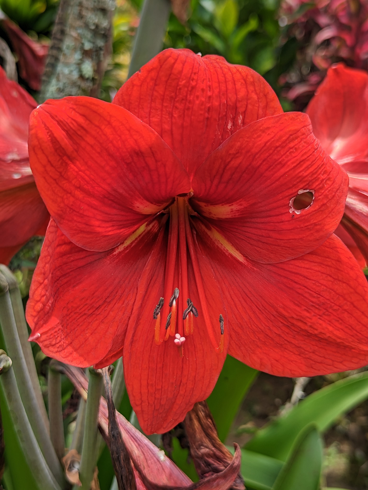

<br><details><summary>:camera:**46/PXL_20230406_170710337.jpg**</summary><sub> `Exif version` 0232 `OS version` HDR+ 1.0.514217843zd `Date` 2023:04:06 12:07:10 `Aperture` Not known `Brightness` 9.08 `Color space` 1 `Compression` 6`Exposure mode` 0 `Exposure time` 0.000451 `Focal length` 6.81 `Lens model` Pixel 6 back camera 6.81mm f/1.85 `Lens specification` Not known `Orientation` 1 `Scene type` Not known `f number` 1.85 `White balance` 0 `Sensing method` 2 `Shutter speed` 11.12</sub><sub>`Coordinates & altitude` (6.020019444444444, -73.49635555555555, 1742.0)</sub><sub> :earth_americas:`Location over` [Google Maps](http://maps.google.com/maps?q=6.020019444444444,-73.49635555555555) or [Openstreet Map](https://www.openstreetmap.org/query?lat=6.020019444444444&lon=-73.49635555555555)</sub></details>

<br><details><summary>:camera:**46/PXL_20230406_170724435.jpg**</summary><sub> `Exif version` 0232 `OS version` HDR+ 1.0.514217843zd `Date` 2023:04:06 12:07:24 `Aperture` Not known `Brightness` 9.61 `Color space` 1 `Compression` 6`Exposure mode` 0 `Exposure time` 0.000292 `Focal length` 6.81 `Lens model` Pixel 6 back camera 6.81mm f/1.85 `Lens specification` Not known `Orientation` 1 `Scene type` Not known `f number` 1.85 `White balance` 0 `Sensing method` 2 `Shutter speed` 11.74</sub><sub>`Coordinates & altitude` (6.020019444444444, -73.49635555555555, 1742.0)</sub><sub> :earth_americas:`Location over` [Google Maps](http://maps.google.com/maps?q=6.020019444444444,-73.49635555555555) or [Openstreet Map](https://www.openstreetmap.org/query?lat=6.020019444444444&lon=-73.49635555555555)</sub></details>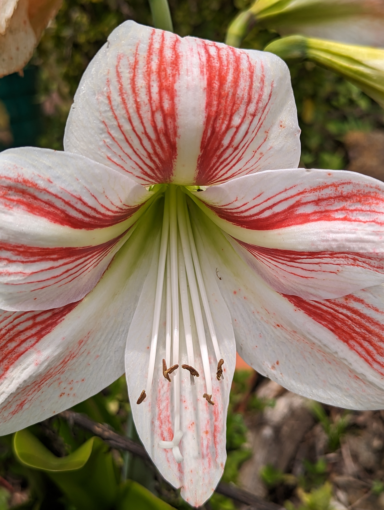

<br><details><summary>:camera:**46/PXL_20230406_170746242.jpg**</summary><sub> `Exif version` 0232 `OS version` HDR+ 1.0.514217843zd `Date` 2023:04:06 12:07:46 `Aperture` Not known `Brightness` 6.72 `Color space` 1 `Compression` 6`Exposure mode` 0 `Exposure time` 0.002668 `Focal length` 6.81 `Lens model` Pixel 6 back camera 6.81mm f/1.85 `Lens specification` Not known `Orientation` 1 `Scene type` Not known `f number` 1.85 `White balance` 0 `Sensing method` 2 `Shutter speed` 8.55</sub><sub>`Coordinates & altitude` (6.020019444444444, -73.49635555555555, 1742.0)</sub><sub> :earth_americas:`Location over` [Google Maps](http://maps.google.com/maps?q=6.020019444444444,-73.49635555555555) or [Openstreet Map](https://www.openstreetmap.org/query?lat=6.020019444444444&lon=-73.49635555555555)</sub></details>

<br><details><summary>:camera:**46/PXL_20230406_170754648.jpg**</summary><sub> `Exif version` 0232 `OS version` HDR+ 1.0.514217843zd `Date` 2023:04:06 12:07:54 `Aperture` Not known `Brightness` 7.06 `Color space` 1 `Compression` 6`Exposure mode` 0 `Exposure time` 0.00174 `Focal length` 6.81 `Lens model` Pixel 6 back camera 6.81mm f/1.85 `Lens specification` Not known `Orientation` 1 `Scene type` Not known `f number` 1.85 `White balance` 0 `Sensing method` 2 `Shutter speed` 9.17</sub><sub>`Coordinates & altitude` (6.020019444444444, -73.49635555555555, 1742.0)</sub><sub> :earth_americas:`Location over` [Google Maps](http://maps.google.com/maps?q=6.020019444444444,-73.49635555555555) or [Openstreet Map](https://www.openstreetmap.org/query?lat=6.020019444444444&lon=-73.49635555555555)</sub></details>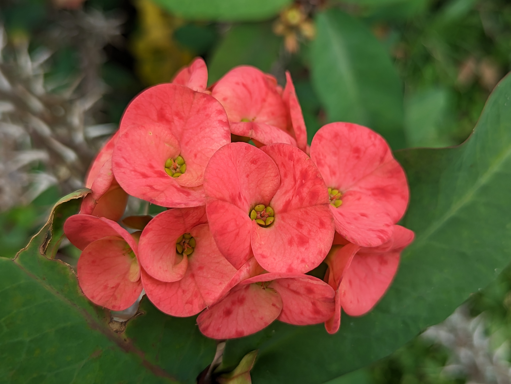

<br><details><summary>:camera:**46/PXL_20230406_170801477.jpg**</summary><sub> `Exif version` 0232 `OS version` HDR+ 1.0.514217843zd `Date` 2023:04:06 12:08:01 `Aperture` Not known `Brightness` 6.76 `Color space` 1 `Compression` 6`Exposure mode` 0 `Exposure time` 0.002297 `Focal length` 6.81 `Lens model` Pixel 6 back camera 6.81mm f/1.85 `Lens specification` Not known `Orientation` 1 `Scene type` Not known `f number` 1.85 `White balance` 0 `Sensing method` 2 `Shutter speed` 8.77</sub><sub>`Coordinates & altitude` (6.020019444444444, -73.49635555555555, 1742.0)</sub><sub> :earth_americas:`Location over` [Google Maps](http://maps.google.com/maps?q=6.020019444444444,-73.49635555555555) or [Openstreet Map](https://www.openstreetmap.org/query?lat=6.020019444444444&lon=-73.49635555555555)</sub></details>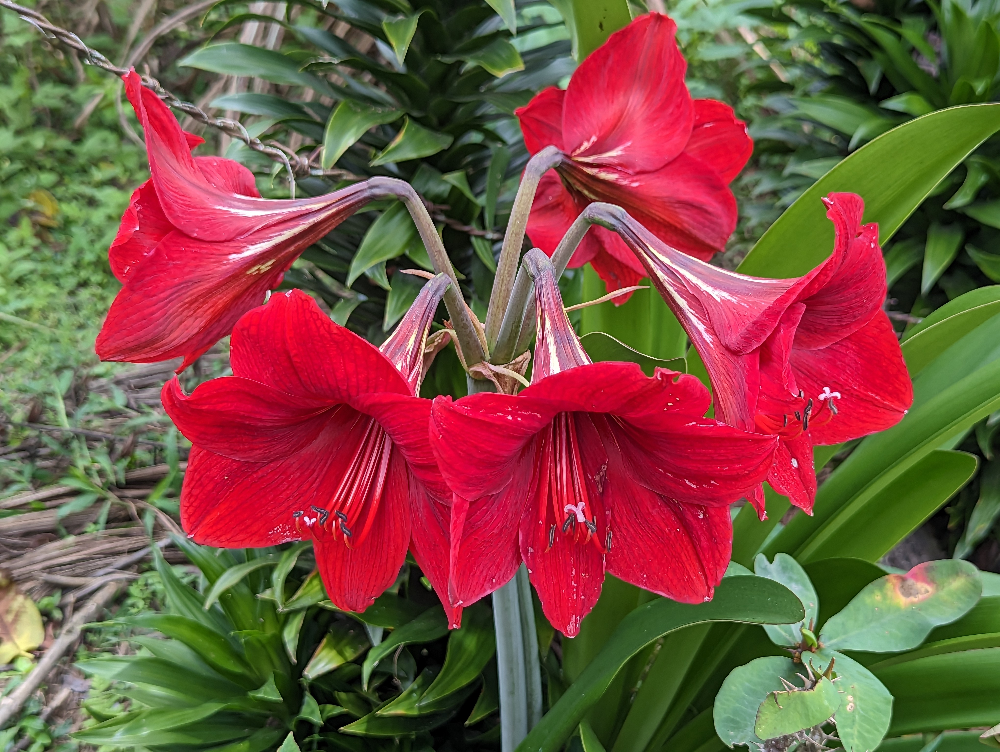

<br><details><summary>:camera:**46/PXL_20230406_170816607.jpg**</summary><sub> `Exif version` 0232 `OS version` HDR+ 1.0.514217843zd `Date` 2023:04:06 12:08:16 `Aperture` Not known `Brightness` 7.0 `Color space` 1 `Compression` 6`Exposure mode` 0 `Exposure time` 0.002032 `Focal length` 6.81 `Lens model` Pixel 6 back camera 6.81mm f/1.85 `Lens specification` Not known `Orientation` 1 `Scene type` Not known `f number` 1.85 `White balance` 0 `Sensing method` 2 `Shutter speed` 8.94</sub><sub>`Coordinates & altitude` (6.020019444444444, -73.49635555555555, 1742.0)</sub><sub> :earth_americas:`Location over` [Google Maps](http://maps.google.com/maps?q=6.020019444444444,-73.49635555555555) or [Openstreet Map](https://www.openstreetmap.org/query?lat=6.020019444444444&lon=-73.49635555555555)</sub></details>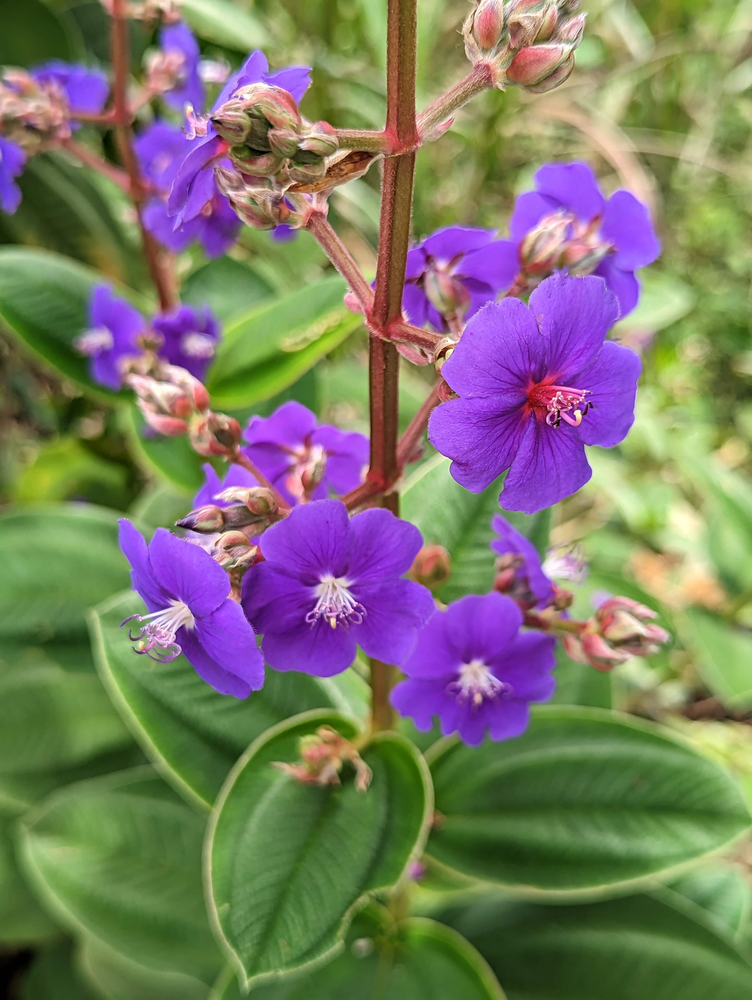

<br><details><summary>:camera:**46/PXL_20230406_170852778.MP.jpg**</summary><sub> `Exif version` 0232 `OS version` HDR+ 1.0.514217843zd `Date` 2023:04:06 12:08:52 `Aperture` Not known `Brightness` 8.44 `Color space` 1 `Compression` 6`Exposure mode` 0 `Exposure time` 0.000654 `Focal length` 6.81 `Lens model` Pixel 6 back camera 6.81mm f/1.85 `Lens specification` Not known `Orientation` 1 `Scene type` Not known `f number` 1.85 `White balance` 0 `Sensing method` 2 `Shutter speed` 10.58</sub><sub>`Coordinates & altitude` (6.020019444444444, -73.49635555555555, 1742.0)</sub><sub> :earth_americas:`Location over` [Google Maps](http://maps.google.com/maps?q=6.020019444444444,-73.49635555555555) or [Openstreet Map](https://www.openstreetmap.org/query?lat=6.020019444444444&lon=-73.49635555555555)</sub></details>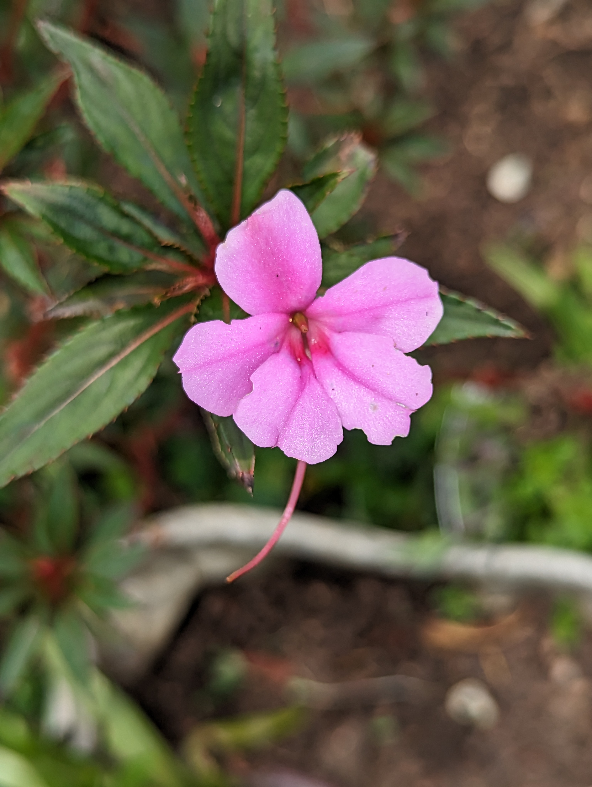

<br><details><summary>:camera:**46/PXL_20230406_183231279.jpg**</summary><sub> `Exif version` 0232 `OS version` HDR+ 1.0.514217843zd `Date` 2023:04:06 13:32:31 `Aperture` Not known `Brightness` 6.83 `Color space` 1 `Compression` 6`Exposure mode` 0 `Exposure time` 0.002191 `Focal length` 6.81 `Lens model` Pixel 6 back camera 6.81mm f/1.85 `Lens specification` Not known `Orientation` 1 `Scene type` Not known `f number` 1.85 `White balance` 0 `Sensing method` 2 `Shutter speed` 8.83</sub><sub>`Coordinates & altitude` (5.0309333333333335, -73.99904722222222, 2624.09)</sub><sub> :earth_americas:`Location over` [Google Maps](http://maps.google.com/maps?q=5.0309333333333335,-73.99904722222222) or [Openstreet Map](https://www.openstreetmap.org/query?lat=5.0309333333333335&lon=-73.99904722222222)</sub></details>

<br><details><summary>:camera:**46/PXL_20230406_183438334.jpg**</summary><sub> `Exif version` 0232 `OS version` HDR+ 1.0.514217843zd `Date` 2023:04:06 13:34:38 `Aperture` Not known `Brightness` 5.54 `Color space` 1 `Compression` 6`Exposure mode` 0 `Exposure time` 0.004991 `Focal length` 6.81 `Lens model` Pixel 6 back camera 6.81mm f/1.85 `Lens specification` Not known `Orientation` 1 `Scene type` Not known `f number` 1.85 `White balance` 0 `Sensing method` 2 `Shutter speed` 7.65</sub><sub>`Coordinates & altitude` (6.02375, -73.52646666666666, 2624.09)</sub><sub> :earth_americas:`Location over` [Google Maps](http://maps.google.com/maps?q=6.02375,-73.52646666666666) or [Openstreet Map](https://www.openstreetmap.org/query?lat=6.02375&lon=-73.52646666666666)</sub></details>

<br><details><summary>:camera:**46/PXL_20230406_183455060.jpg**</summary><sub> `Exif version` 0232 `OS version` HDR+ 1.0.514217843zd `Date` 2023:04:06 13:34:55 `Aperture` Not known `Brightness` 5.39 `Color space` 1 `Compression` 6`Exposure mode` 0 `Exposure time` 0.004178 `Focal length` 6.81 `Lens model` Pixel 6 back camera 6.81mm f/1.85 `Lens specification` Not known `Orientation` 1 `Scene type` Not known `f number` 1.85 `White balance` 0 `Sensing method` 2 `Shutter speed` 7.9</sub><sub>`Coordinates & altitude` (6.02375, -73.52646666666666, 2624.09)</sub><sub> :earth_americas:`Location over` [Google Maps](http://maps.google.com/maps?q=6.02375,-73.52646666666666) or [Openstreet Map](https://www.openstreetmap.org/query?lat=6.02375&lon=-73.52646666666666)</sub></details>

<br><details><summary>:camera:**46/PXL_20230406_183731361.jpg**</summary><sub> `Exif version` 0232 `OS version` HDR+ 1.0.514217843zd `Date` 2023:04:06 13:37:31 `Aperture` Not known `Brightness` 5.58 `Color space` 1 `Compression` 6`Exposure mode` 0 `Exposure time` 0.005203 `Focal length` 6.81 `Lens model` Pixel 6 back camera 6.81mm f/1.85 `Lens specification` Not known `Orientation` 1 `Scene type` Not known `f number` 1.85 `White balance` 0 `Sensing method` 2 `Shutter speed` 7.59</sub><sub>`Coordinates & altitude` (6.019975, -73.49621666666667, 2624.09)</sub><sub> :earth_americas:`Location over` [Google Maps](http://maps.google.com/maps?q=6.019975,-73.49621666666667) or [Openstreet Map](https://www.openstreetmap.org/query?lat=6.019975&lon=-73.49621666666667)</sub></details>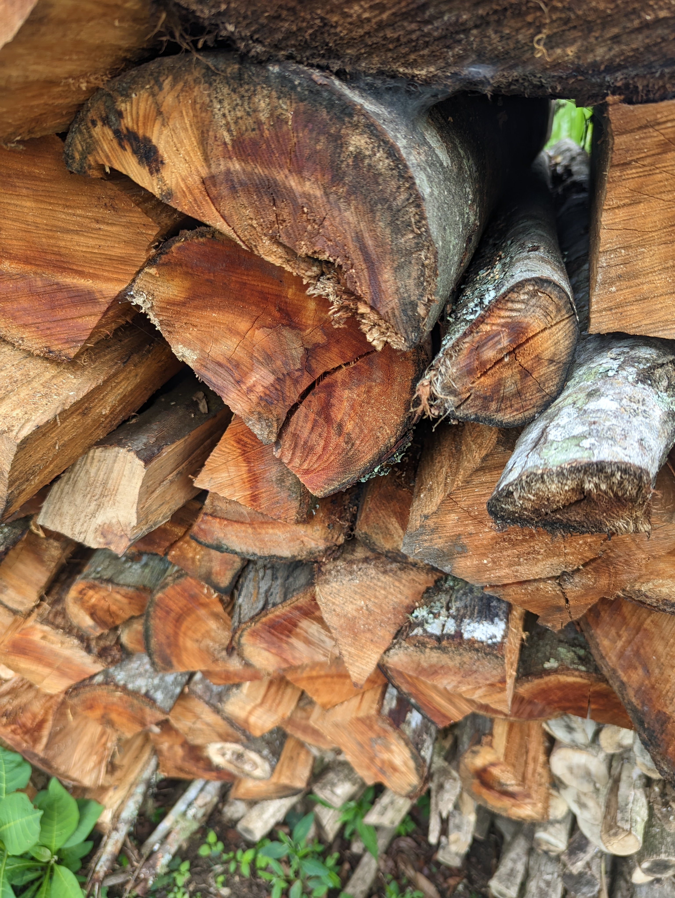

<br><details><summary>:camera:**46/PXL_20230406_184235187.jpg**</summary><sub> `Exif version` 0232 `OS version` HDR+ 1.0.514217843zd `Date` 2023:04:06 13:42:35 `Aperture` Not known `Brightness` 6.43 `Color space` 1 `Compression` 6`Exposure mode` 0 `Exposure time` 0.002756 `Focal length` 6.81 `Lens model` Pixel 6 back camera 6.81mm f/1.85 `Lens specification` Not known `Orientation` 1 `Scene type` Not known `f number` 1.85 `White balance` 0 `Sensing method` 2 `Shutter speed` 8.5</sub><sub>`Coordinates & altitude` (6.019888888888889, -73.49632222222222, 2628.4)</sub><sub> :earth_americas:`Location over` [Google Maps](http://maps.google.com/maps?q=6.019888888888889,-73.49632222222222) or [Openstreet Map](https://www.openstreetmap.org/query?lat=6.019888888888889&lon=-73.49632222222222)</sub></details>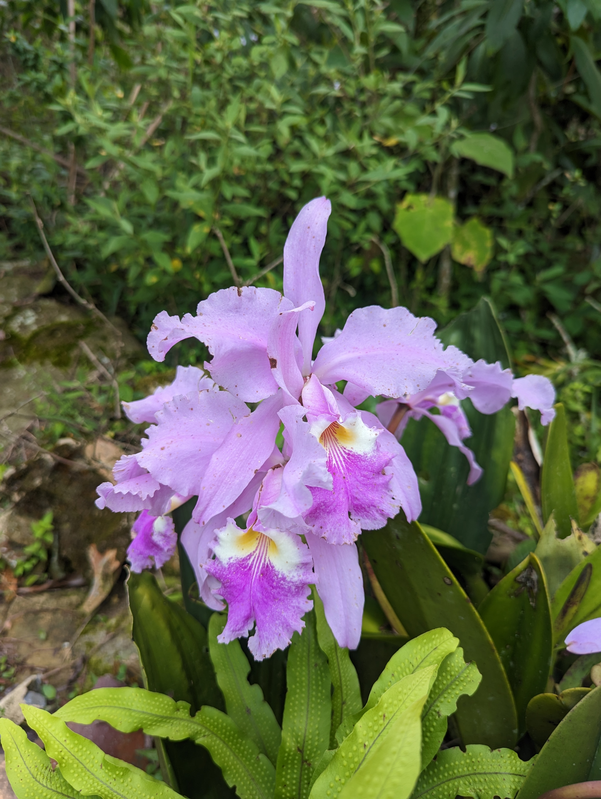

<br><details><summary>:camera:**46/PXL_20230406_184244406.jpg**</summary><sub> `Exif version` 0232 `OS version` HDR+ 1.0.514217843zd `Date` 2023:04:06 13:42:44 `Aperture` Not known `Brightness` 6.56 `Color space` 1 `Compression` 6`Exposure mode` 0 `Exposure time` 0.002527 `Focal length` 6.81 `Lens model` Pixel 6 back camera 6.81mm f/1.85 `Lens specification` Not known `Orientation` 1 `Scene type` Not known `f number` 1.85 `White balance` 0 `Sensing method` 2 `Shutter speed` 8.63</sub><sub>`Coordinates & altitude` (6.019888888888889, -73.49632222222222, 2628.4)</sub><sub> :earth_americas:`Location over` [Google Maps](http://maps.google.com/maps?q=6.019888888888889,-73.49632222222222) or [Openstreet Map](https://www.openstreetmap.org/query?lat=6.019888888888889&lon=-73.49632222222222)</sub></details>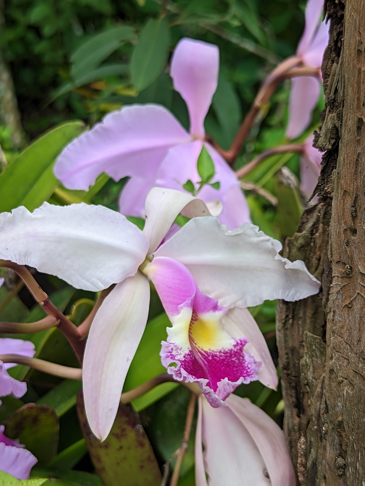

<br><details><summary>:camera:**46/PXL_20230406_184300202.jpg**</summary><sub> `Exif version` 0232 `OS version` HDR+ 1.0.514217843zd `Date` 2023:04:06 13:43:00 `Aperture` Not known `Brightness` 6.49 `Color space` 1 `Compression` 6`Exposure mode` 0 `Exposure time` 0.002765 `Focal length` 6.81 `Lens model` Pixel 6 back camera 6.81mm f/1.85 `Lens specification` Not known `Orientation` 1 `Scene type` Not known `f number` 1.85 `White balance` 0 `Sensing method` 2 `Shutter speed` 8.5</sub><sub>`Coordinates & altitude` (6.019888888888889, -73.49632222222222, 2628.4)</sub><sub> :earth_americas:`Location over` [Google Maps](http://maps.google.com/maps?q=6.019888888888889,-73.49632222222222) or [Openstreet Map](https://www.openstreetmap.org/query?lat=6.019888888888889&lon=-73.49632222222222)</sub></details>

<br><details><summary>:camera:**46/PXL_20230406_184313096.jpg**</summary><sub> `Exif version` 0232 `OS version` HDR+ 1.0.514217843zd `Date` 2023:04:06 13:43:13 `Aperture` Not known `Brightness` 6.59 `Color space` 1 `Compression` 6`Exposure mode` 0 `Exposure time` 0.00258 `Focal length` 6.81 `Lens model` Pixel 6 back camera 6.81mm f/1.85 `Lens specification` Not known `Orientation` 1 `Scene type` Not known `f number` 1.85 `White balance` 0 `Sensing method` 2 `Shutter speed` 8.6</sub><sub>`Coordinates & altitude` (6.019888888888889, -73.49632222222222, 2628.4)</sub><sub> :earth_americas:`Location over` [Google Maps](http://maps.google.com/maps?q=6.019888888888889,-73.49632222222222) or [Openstreet Map](https://www.openstreetmap.org/query?lat=6.019888888888889&lon=-73.49632222222222)</sub></details>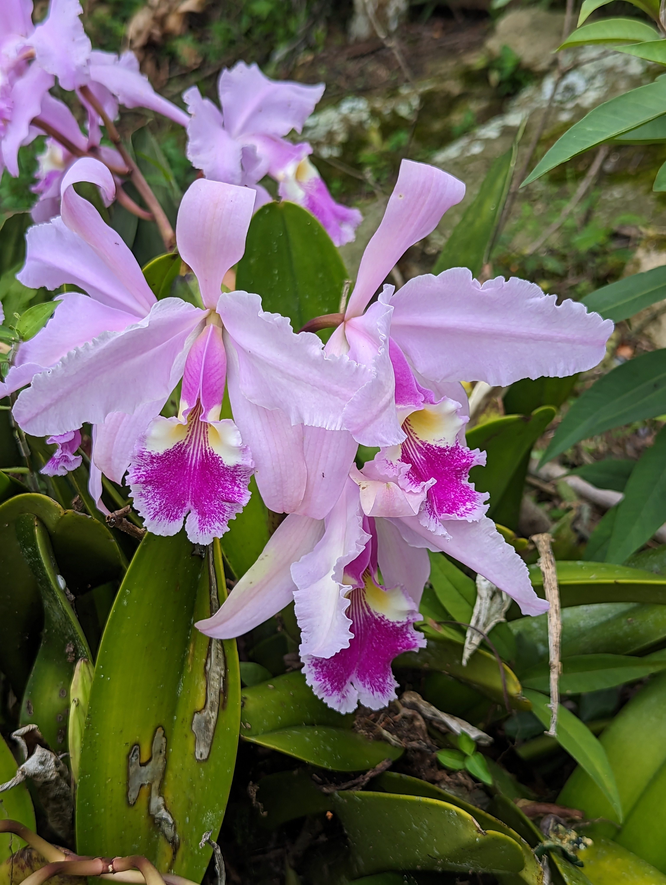

<br><details><summary>:camera:**46/PXL_20230406_184346920.jpg**</summary><sub> `Exif version` 0232 `OS version` HDR+ 1.0.514217843zd `Date` 2023:04:06 13:43:46 `Aperture` Not known `Brightness` 6.93 `Color space` 1 `Compression` 6`Exposure mode` 0 `Exposure time` 0.002739 `Focal length` 6.81 `Lens model` Pixel 6 back camera 6.81mm f/1.85 `Lens specification` Not known `Orientation` 1 `Scene type` Not known `f number` 1.85 `White balance` 0 `Sensing method` 2 `Shutter speed` 8.51</sub><sub>`Coordinates & altitude` (6.019958333333333, -73.4963638888889, 2624.09)</sub><sub> :earth_americas:`Location over` [Google Maps](http://maps.google.com/maps?q=6.019958333333333,-73.4963638888889) or [Openstreet Map](https://www.openstreetmap.org/query?lat=6.019958333333333&lon=-73.4963638888889)</sub></details>

<br><details><summary>:camera:**46/PXL_20230406_184356210.jpg**</summary><sub> `Exif version` 0232 `OS version` HDR+ 1.0.514217843zd `Date` 2023:04:06 13:43:56 `Aperture` Not known `Brightness` 6.69 `Color space` 1 `Compression` 6`Exposure mode` 0 `Exposure time` 0.002403 `Focal length` 6.81 `Lens model` Pixel 6 back camera 6.81mm f/1.85 `Lens specification` Not known `Orientation` 1 `Scene type` Not known `f number` 1.85 `White balance` 0 `Sensing method` 2 `Shutter speed` 8.7</sub><sub>`Coordinates & altitude` (6.019958333333333, -73.4963638888889, 2624.09)</sub><sub> :earth_americas:`Location over` [Google Maps](http://maps.google.com/maps?q=6.019958333333333,-73.4963638888889) or [Openstreet Map](https://www.openstreetmap.org/query?lat=6.019958333333333&lon=-73.4963638888889)</sub></details>

<br><details><summary>:camera:**46/PXL_20230406_184721532.jpg**</summary><sub> `Exif version` 0232 `OS version` HDR+ 1.0.514217843zd `Date` 2023:04:06 13:47:21 `Aperture` Not known `Brightness` 4.59 `Color space` 1 `Compression` 6`Exposure mode` 0 `Exposure time` 0.006723 `Focal length` 6.81 `Lens model` Pixel 6 back camera 6.81mm f/1.85 `Lens specification` Not known `Orientation` 1 `Scene type` Not known `f number` 1.85 `White balance` 0 `Sensing method` 2 `Shutter speed` 7.22</sub><sub>`Coordinates & altitude` (6.0198, -73.4963361111111, 2629.07)</sub><sub> :earth_americas:`Location over` [Google Maps](http://maps.google.com/maps?q=6.0198,-73.4963361111111) or [Openstreet Map](https://www.openstreetmap.org/query?lat=6.0198&lon=-73.4963361111111)</sub></details>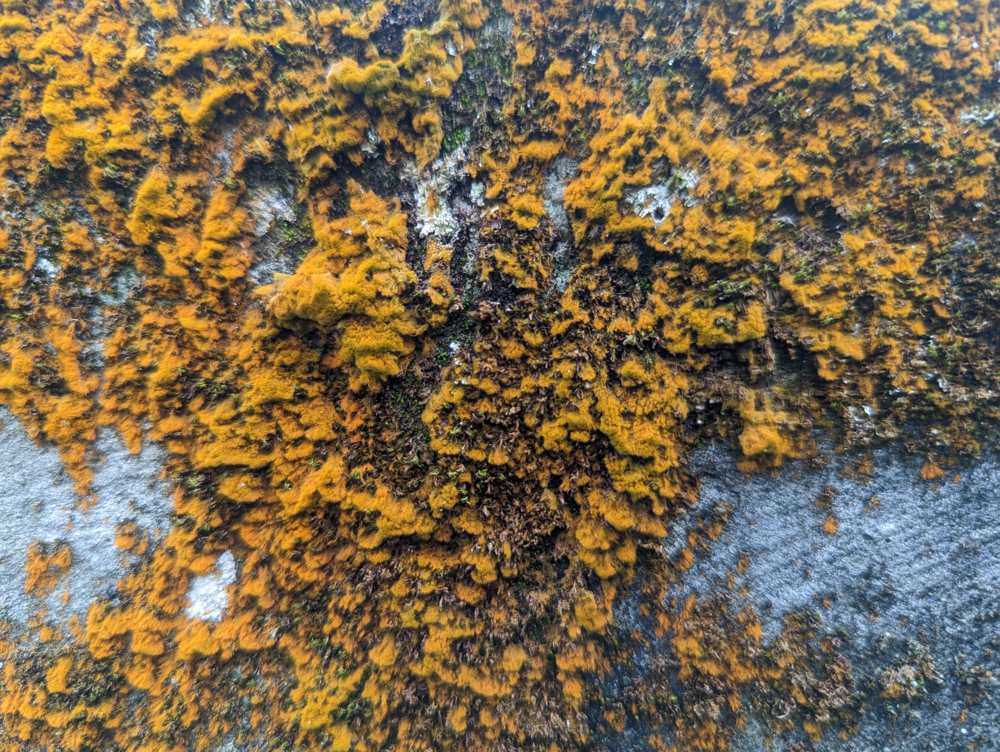

<br><details><summary>:camera:**46/PXL_20230406_184726923.jpg**</summary><sub> `Exif version` 0232 `OS version` HDR+ 1.0.514217843zd `Date` 2023:04:06 13:47:26 `Aperture` Not known `Brightness` 6.27 `Color space` 1 `Compression` 6`Exposure mode` 0 `Exposure time` 0.004461 `Focal length` 6.81 `Lens model` Pixel 6 back camera 6.81mm f/1.85 `Lens specification` Not known `Orientation` 1 `Scene type` Not known `f number` 1.85 `White balance` 0 `Sensing method` 2 `Shutter speed` 7.81</sub><sub>`Coordinates & altitude` (6.0198, -73.4963361111111, 2629.07)</sub><sub> :earth_americas:`Location over` [Google Maps](http://maps.google.com/maps?q=6.0198,-73.4963361111111) or [Openstreet Map](https://www.openstreetmap.org/query?lat=6.0198&lon=-73.4963361111111)</sub></details>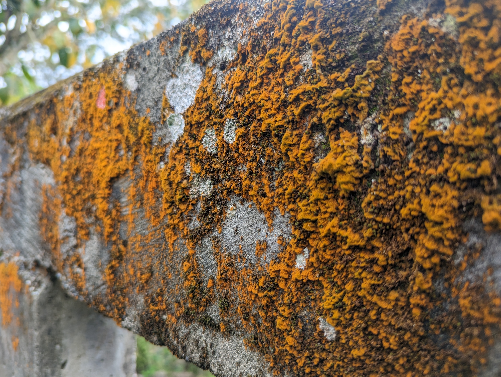

<br><details><summary>:camera:**46/PXL_20230406_184733268.jpg**</summary><sub> `Exif version` 0232 `OS version` HDR+ 1.0.514217843zd `Date` 2023:04:06 13:47:33 `Aperture` Not known `Brightness` 5.84 `Color space` 1 `Compression` 6`Exposure mode` 0 `Exposure time` 0.004258 `Focal length` 6.81 `Lens model` Pixel 6 back camera 6.81mm f/1.85 `Lens specification` Not known `Orientation` 1 `Scene type` Not known `f number` 1.85 `White balance` 0 `Sensing method` 2 `Shutter speed` 7.88</sub><sub>`Coordinates & altitude` (6.0198, -73.4963361111111, 2629.07)</sub><sub> :earth_americas:`Location over` [Google Maps](http://maps.google.com/maps?q=6.0198,-73.4963361111111) or [Openstreet Map](https://www.openstreetmap.org/query?lat=6.0198&lon=-73.4963361111111)</sub></details>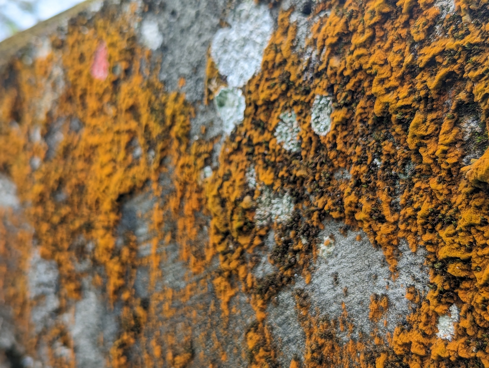

<br><details><summary>:camera:**46/PXL_20230406_184940307.jpg**</summary><sub> `Exif version` 0232 `OS version` HDR+ 1.0.514217843zd `Date` 2023:04:06 13:49:40 `Aperture` Not known `Brightness` 5.55 `Color space` 1 `Compression` 6`Exposure mode` 0 `Exposure time` 0.004956 `Focal length` 6.81 `Lens model` Pixel 6 back camera 6.81mm f/1.85 `Lens specification` Not known `Orientation` 1 `Scene type` Not known `f number` 1.85 `White balance` 0 `Sensing method` 2 `Shutter speed` 7.66</sub><sub>`Coordinates & altitude` (6.020047222222222, -73.49621388888889, 2628.05)</sub><sub> :earth_americas:`Location over` [Google Maps](http://maps.google.com/maps?q=6.020047222222222,-73.49621388888889) or [Openstreet Map](https://www.openstreetmap.org/query?lat=6.020047222222222&lon=-73.49621388888889)</sub></details>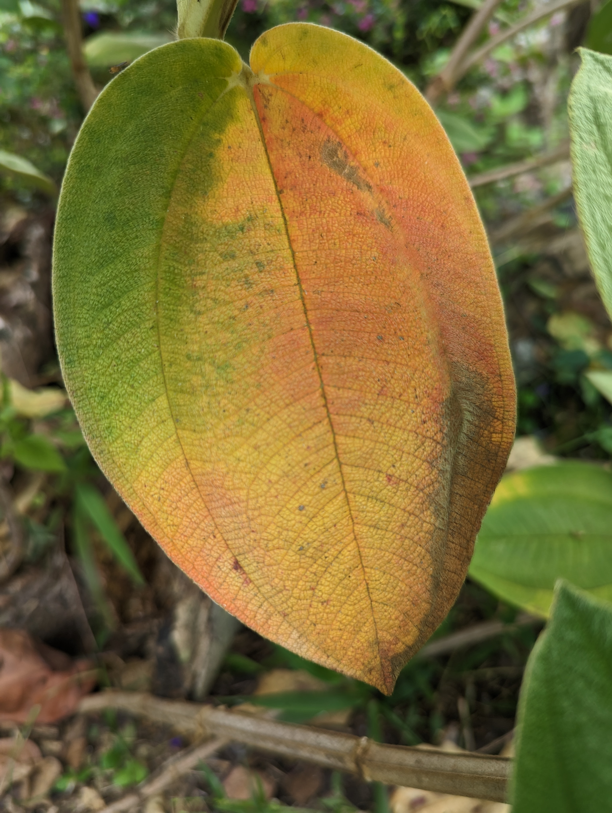

<br><details><summary>:camera:**46/PXL_20230406_185152783.jpg**</summary><sub> `Exif version` 0232 `OS version` HDR+ 1.0.514217843zd `Date` 2023:04:06 13:51:52 `Aperture` Not known `Brightness` 6.35 `Color space` 1 `Compression` 6`Exposure mode` 0 `Exposure time` 0.003542 `Focal length` 6.81 `Lens model` Pixel 6 back camera 6.81mm f/1.85 `Lens specification` Not known `Orientation` 1 `Scene type` Not known `f number` 1.85 `White balance` 0 `Sensing method` 2 `Shutter speed` 8.14</sub><sub>`Coordinates & altitude` (6.020047222222222, -73.49621388888889, 2628.05)</sub><sub> :earth_americas:`Location over` [Google Maps](http://maps.google.com/maps?q=6.020047222222222,-73.49621388888889) or [Openstreet Map](https://www.openstreetmap.org/query?lat=6.020047222222222&lon=-73.49621388888889)</sub></details>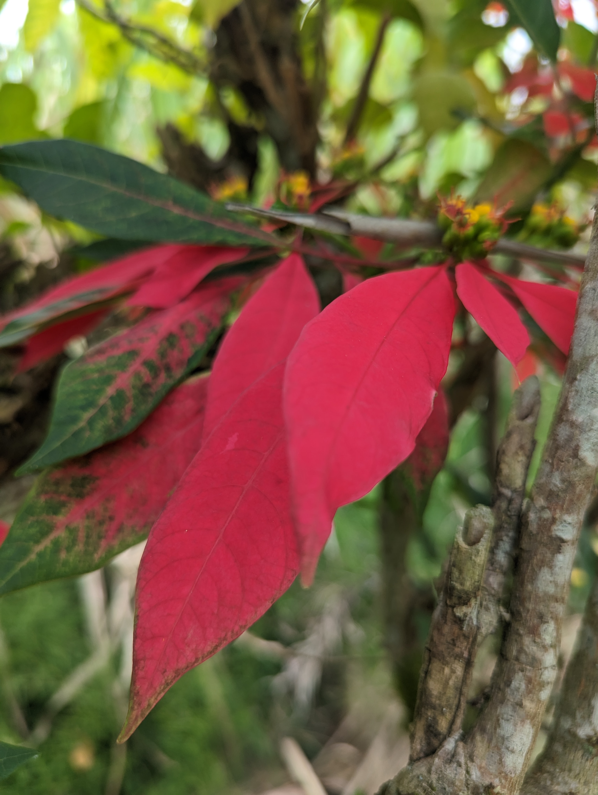

<br><details><summary>:camera:**46/PXL_20230406_185212273.jpg**</summary><sub> `Exif version` 0232 `OS version` HDR+ 1.0.514217843zd `Date` 2023:04:06 13:52:12 `Aperture` Not known `Brightness` 6.2 `Color space` 1 `Compression` 6`Exposure mode` 0 `Exposure time` 0.003719 `Focal length` 6.81 `Lens model` Pixel 6 back camera 6.81mm f/1.85 `Lens specification` Not known `Orientation` 1 `Scene type` Not known `f number` 1.85 `White balance` 0 `Sensing method` 2 `Shutter speed` 8.07</sub><sub>`Coordinates & altitude` (6.020047222222222, -73.49621388888889, 2628.05)</sub><sub> :earth_americas:`Location over` [Google Maps](http://maps.google.com/maps?q=6.020047222222222,-73.49621388888889) or [Openstreet Map](https://www.openstreetmap.org/query?lat=6.020047222222222&lon=-73.49621388888889)</sub></details>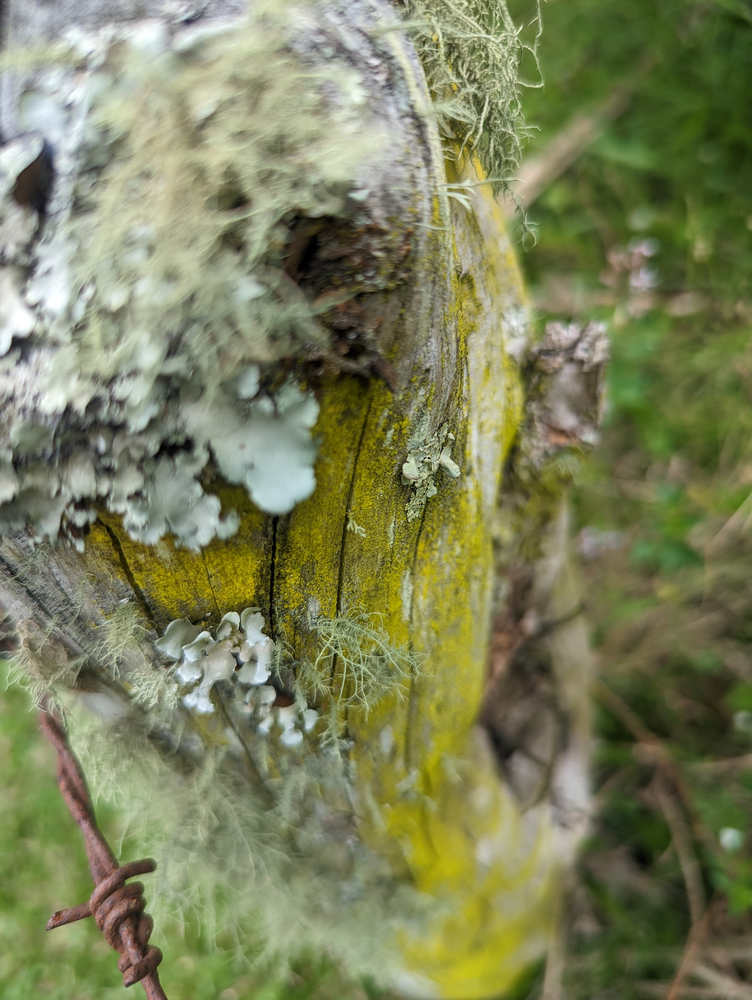

<br><details><summary>:camera:**46/PXL_20230406_185437099.jpg**</summary><sub> `Exif version` 0232 `OS version` HDR+ 1.0.514217843zd `Date` 2023:04:06 13:54:37 `Aperture` Not known `Brightness` 6.53 `Color space` 1 `Compression` 6`Exposure mode` 0 `Exposure time` 0.002898 `Focal length` 6.81 `Lens model` Pixel 6 back camera 6.81mm f/1.85 `Lens specification` Not known `Orientation` 1 `Scene type` Not known `f number` 1.85 `White balance` 0 `Sensing method` 2 `Shutter speed` 8.43</sub><sub>`Coordinates & altitude` (6.020066666666667, -73.49635555555555, 2628.15)</sub><sub> :earth_americas:`Location over` [Google Maps](http://maps.google.com/maps?q=6.020066666666667,-73.49635555555555) or [Openstreet Map](https://www.openstreetmap.org/query?lat=6.020066666666667&lon=-73.49635555555555)</sub></details>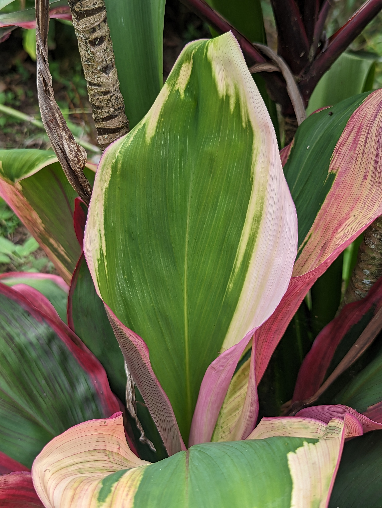

<br><details><summary>:camera:**46/PXL_20230406_185443069.jpg**</summary><sub> `Exif version` 0232 `OS version` HDR+ 1.0.514217843zd `Date` 2023:04:06 13:54:43 `Aperture` Not known `Brightness` 6.83 `Color space` 1 `Compression` 6`Exposure mode` 0 `Exposure time` 0.002041 `Focal length` 6.81 `Lens model` Pixel 6 back camera 6.81mm f/1.85 `Lens specification` Not known `Orientation` 1 `Scene type` Not known `f number` 1.85 `White balance` 0 `Sensing method` 2 `Shutter speed` 8.94</sub><sub>`Coordinates & altitude` (6.020066666666667, -73.49635555555555, 2628.15)</sub><sub> :earth_americas:`Location over` [Google Maps](http://maps.google.com/maps?q=6.020066666666667,-73.49635555555555) or [Openstreet Map](https://www.openstreetmap.org/query?lat=6.020066666666667&lon=-73.49635555555555)</sub></details>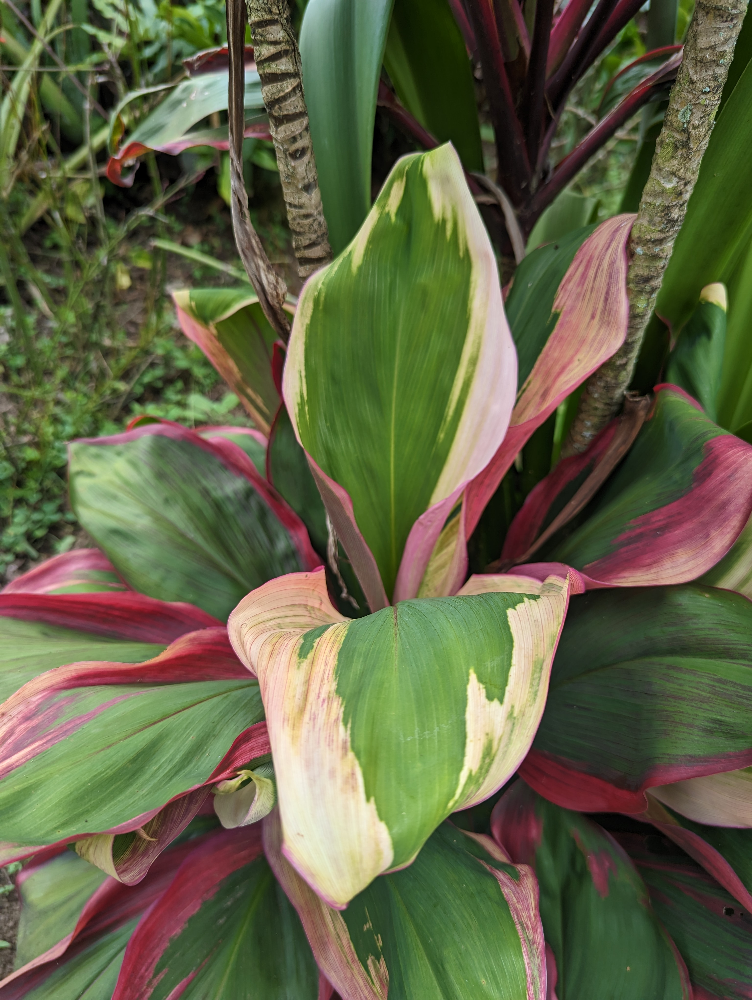

<br><details><summary>:camera:**46/PXL_20230406_192951427.jpg**</summary><sub> `Exif version` 0232 `OS version` HDR+ 1.0.514217843zd `Date` 2023:04:06 14:29:51 `Aperture` Not known `Brightness` 6.82 `Color space` 1 `Compression` 6`Exposure mode` 0 `Exposure time` 0.002208 `Focal length` 6.81 `Lens model` Pixel 6 back camera 6.81mm f/1.85 `Lens specification` Not known `Orientation` 1 `Scene type` Not known `f number` 1.85 `White balance` 0 `Sensing method` 2 `Shutter speed` 8.82</sub><sub>`Coordinates & altitude` (6.019930555555556, -73.49635555555555, 1711.0)</sub><sub> :earth_americas:`Location over` [Google Maps](http://maps.google.com/maps?q=6.019930555555556,-73.49635555555555) or [Openstreet Map](https://www.openstreetmap.org/query?lat=6.019930555555556&lon=-73.49635555555555)</sub></details>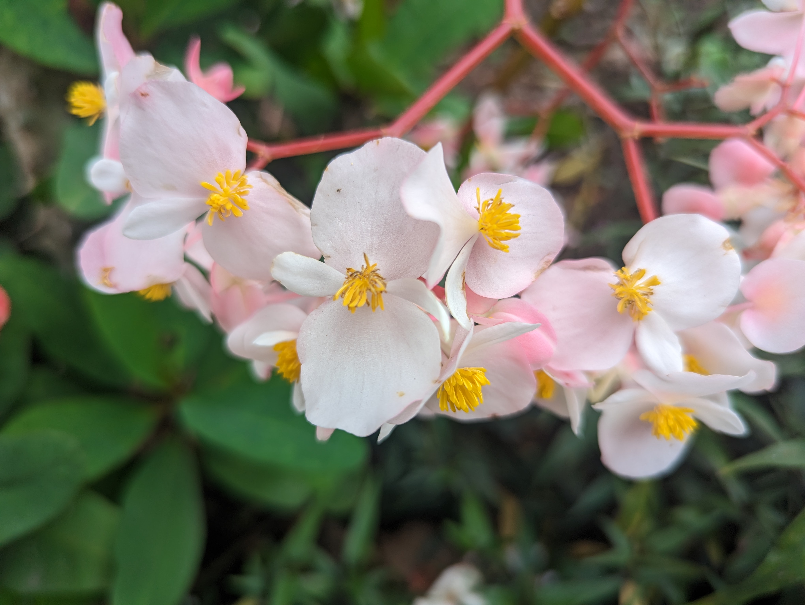

<br><details><summary>:camera:**46/PXL_20230407_154951982.MP.jpg**</summary><sub> `Exif version` 0232 `OS version` HDR+ 1.0.514217843zd `Date` 2023:04:07 10:49:51 `Aperture` Not known `Brightness` 9.47 `Color space` 1 `Compression` 6`Exposure mode` 0 `Exposure time` 0.000336 `Focal length` 6.81 `Lens model` Pixel 6 back camera 6.81mm f/1.85 `Lens specification` Not known `Orientation` 1 `Scene type` Not known `f number` 1.85 `White balance` 0 `Sensing method` 2 `Shutter speed` 11.54</sub><sub>`Coordinates & altitude` (6.634419444444444, -73.22548611111111, 1307.2)</sub><sub> :earth_americas:`Location over` [Google Maps](http://maps.google.com/maps?q=6.634419444444444,-73.22548611111111) or [Openstreet Map](https://www.openstreetmap.org/query?lat=6.634419444444444&lon=-73.22548611111111)</sub></details>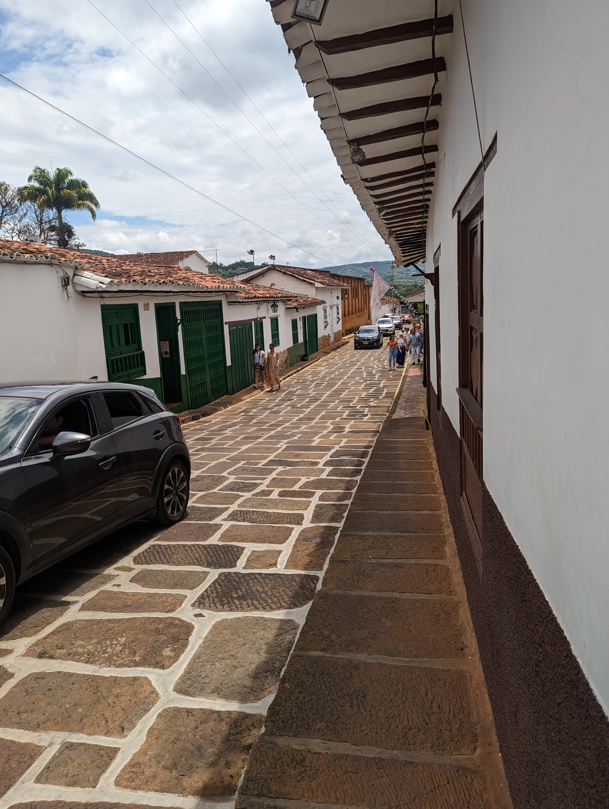

<br><details><summary>:camera:**46/PXL_20230407_154955736.jpg**</summary><sub> `Exif version` 0232 `OS version` HDR+ 1.0.514217843zd `Date` 2023:04:07 10:49:55 `Aperture` Not known `Brightness` 9.34 `Color space` 1 `Compression` 6`Exposure mode` 0 `Exposure time` 0.000345 `Focal length` 6.81 `Lens model` Pixel 6 back camera 6.81mm f/1.85 `Lens specification` Not known `Orientation` 1 `Scene type` Not known `f number` 1.85 `White balance` 0 `Sensing method` 2 `Shutter speed` 11.5</sub><sub>`Coordinates & altitude` (6.634419444444444, -73.22548611111111, 1307.2)</sub><sub> :earth_americas:`Location over` [Google Maps](http://maps.google.com/maps?q=6.634419444444444,-73.22548611111111) or [Openstreet Map](https://www.openstreetmap.org/query?lat=6.634419444444444&lon=-73.22548611111111)</sub></details>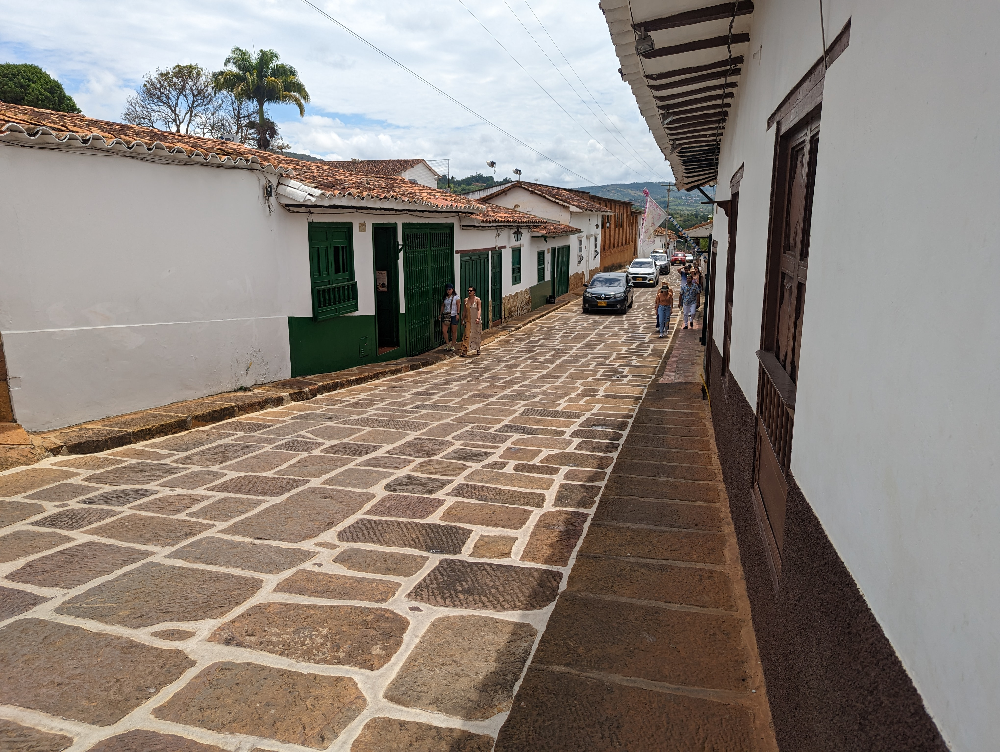

<br><details><summary>:camera:**46/PXL_20230407_155307196.jpg**</summary><sub> `Exif version` 0232 `OS version` HDR+ 1.0.514217843zd `Date` 2023:04:07 10:53:07 `Aperture` Not known `Brightness` 10.37 `Color space` 1 `Compression` 6`Exposure mode` 0 `Exposure time` 0.000212 `Focal length` 6.81 `Lens model` Pixel 6 back camera 6.81mm f/1.85 `Lens specification` Not known `Orientation` 1 `Scene type` Not known `f number` 1.85 `White balance` 0 `Sensing method` 2 `Shutter speed` 12.2</sub><sub>`Coordinates & altitude` (6.634419444444444, -73.22548611111111, 1307.2)</sub><sub> :earth_americas:`Location over` [Google Maps](http://maps.google.com/maps?q=6.634419444444444,-73.22548611111111) or [Openstreet Map](https://www.openstreetmap.org/query?lat=6.634419444444444&lon=-73.22548611111111)</sub></details>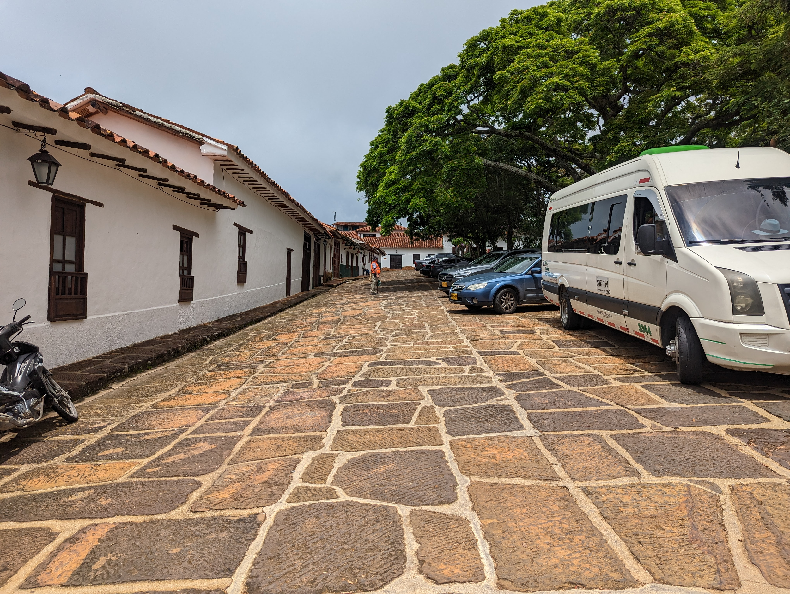

<br><details><summary>:camera:**46/PXL_20230407_155354615.jpg**</summary><sub> `Exif version` 0232 `OS version` HDR+ 1.0.514217843zd `Date` 2023:04:07 10:53:54 `Aperture` Not known `Brightness` 9.83 `Color space` 1 `Compression` 6`Exposure mode` 0 `Exposure time` 0.000274 `Focal length` 6.81 `Lens model` Pixel 6 back camera 6.81mm f/1.85 `Lens specification` Not known `Orientation` 1 `Scene type` Not known `f number` 1.85 `White balance` 0 `Sensing method` 2 `Shutter speed` 11.83</sub><sub>`Coordinates & altitude` (6.635888888888888, -73.22558055555555, 1319.99)</sub><sub> :earth_americas:`Location over` [Google Maps](http://maps.google.com/maps?q=6.635888888888888,-73.22558055555555) or [Openstreet Map](https://www.openstreetmap.org/query?lat=6.635888888888888&lon=-73.22558055555555)</sub></details>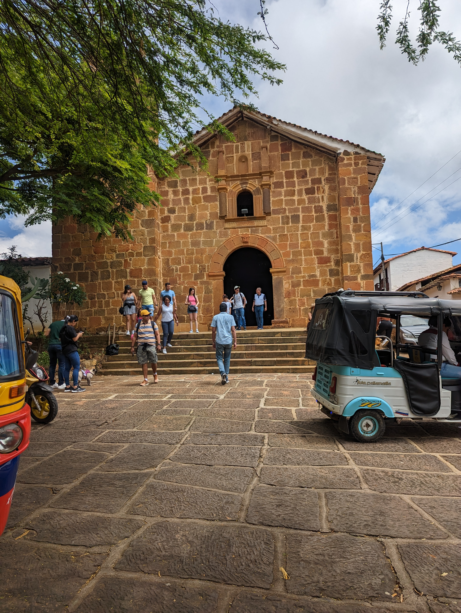

<br><details><summary>:camera:**46/PXL_20230407_155407288.jpg**</summary><sub> `Exif version` 0232 `OS version` HDR+ 1.0.514217843zd `Date` 2023:04:07 10:54:07 `Aperture` Not known `Brightness` 9.87 `Color space` 1 `Compression` 6`Exposure mode` 0 `Exposure time` 0.000212 `Focal length` 6.81 `Lens model` Pixel 6 back camera 6.81mm f/1.85 `Lens specification` Not known `Orientation` 1 `Scene type` Not known `f number` 1.85 `White balance` 0 `Sensing method` 2 `Shutter speed` 12.2</sub><sub>`Coordinates & altitude` (6.635888888888888, -73.22558055555555, 1319.99)</sub><sub> :earth_americas:`Location over` [Google Maps](http://maps.google.com/maps?q=6.635888888888888,-73.22558055555555) or [Openstreet Map](https://www.openstreetmap.org/query?lat=6.635888888888888&lon=-73.22558055555555)</sub></details>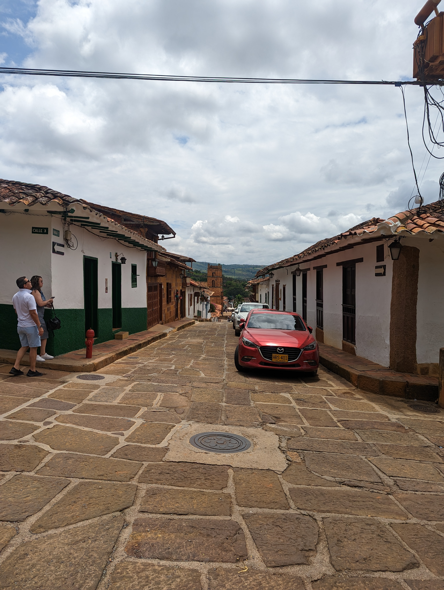

<br><details><summary>:camera:**46/PXL_20230407_155449146.jpg**</summary><sub> `Exif version` 0232 `OS version` HDR+ 1.0.514217843zd `Date` 2023:04:07 10:54:49 `Aperture` Not known `Brightness` 10.16 `Color space` 1 `Compression` 6`Exposure mode` 0 `Exposure time` 0.000212 `Focal length` 6.81 `Lens model` Pixel 6 back camera 6.81mm f/1.85 `Lens specification` Not known `Orientation` 1 `Scene type` Not known `f number` 1.85 `White balance` 0 `Sensing method` 2 `Shutter speed` 12.2</sub><sub>`Coordinates & altitude` (6.635888888888888, -73.22558055555555, 1319.99)</sub><sub> :earth_americas:`Location over` [Google Maps](http://maps.google.com/maps?q=6.635888888888888,-73.22558055555555) or [Openstreet Map](https://www.openstreetmap.org/query?lat=6.635888888888888&lon=-73.22558055555555)</sub></details>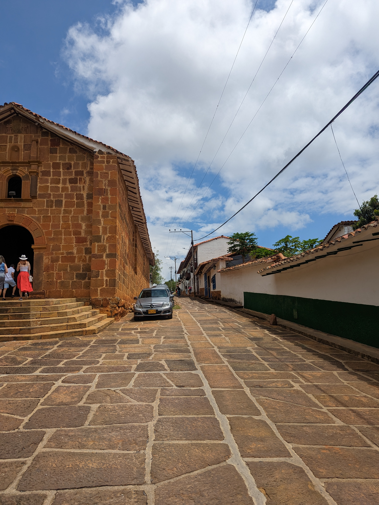

<br><details><summary>:camera:**46/PXL_20230407_155451450.jpg**</summary><sub> `Exif version` 0232 `OS version` HDR+ 1.0.514217843zd `Date` 2023:04:07 10:54:51 `Aperture` Not known `Brightness` 10.37 `Color space` 1 `Compression` 6`Exposure mode` 0 `Exposure time` 0.000212 `Focal length` 6.81 `Lens model` Pixel 6 back camera 6.81mm f/1.85 `Lens specification` Not known `Orientation` 1 `Scene type` Not known `f number` 1.85 `White balance` 0 `Sensing method` 2 `Shutter speed` 12.2</sub><sub>`Coordinates & altitude` (6.635888888888888, -73.22558055555555, 1319.99)</sub><sub> :earth_americas:`Location over` [Google Maps](http://maps.google.com/maps?q=6.635888888888888,-73.22558055555555) or [Openstreet Map](https://www.openstreetmap.org/query?lat=6.635888888888888&lon=-73.22558055555555)</sub></details>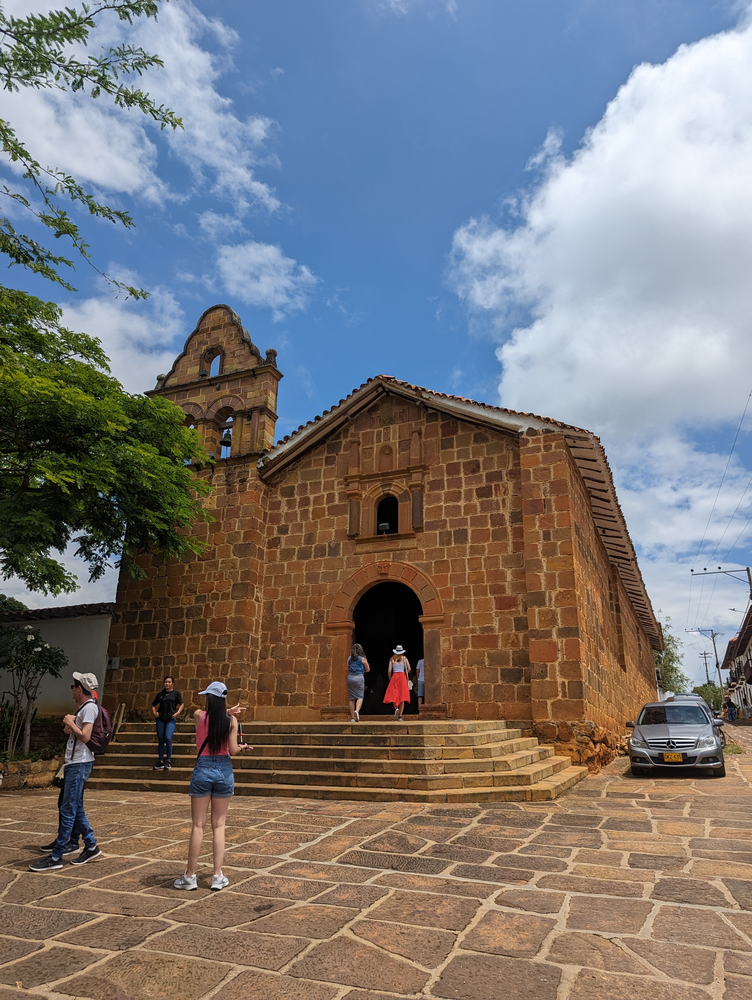

<br><details><summary>:camera:**46/PXL_20230407_155636545.jpg**</summary><sub> `Exif version` 0232 `OS version` HDR+ 1.0.514217843zd `Date` 2023:04:07 10:56:36 `Aperture` Not known `Brightness` -0.65 `Color space` 1 `Compression` 6`Exposure mode` 0 `Exposure time` 0.02909 `Focal length` 6.81 `Lens model` Pixel 6 back camera 6.81mm f/1.85 `Lens specification` Not known `Orientation` 1 `Scene type` Not known `f number` 1.85 `White balance` 0 `Sensing method` 2 `Shutter speed` 5.1</sub><sub>`Coordinates & altitude` (6.635888888888888, -73.22558055555555, 1326.28)</sub><sub> :earth_americas:`Location over` [Google Maps](http://maps.google.com/maps?q=6.635888888888888,-73.22558055555555) or [Openstreet Map](https://www.openstreetmap.org/query?lat=6.635888888888888&lon=-73.22558055555555)</sub></details>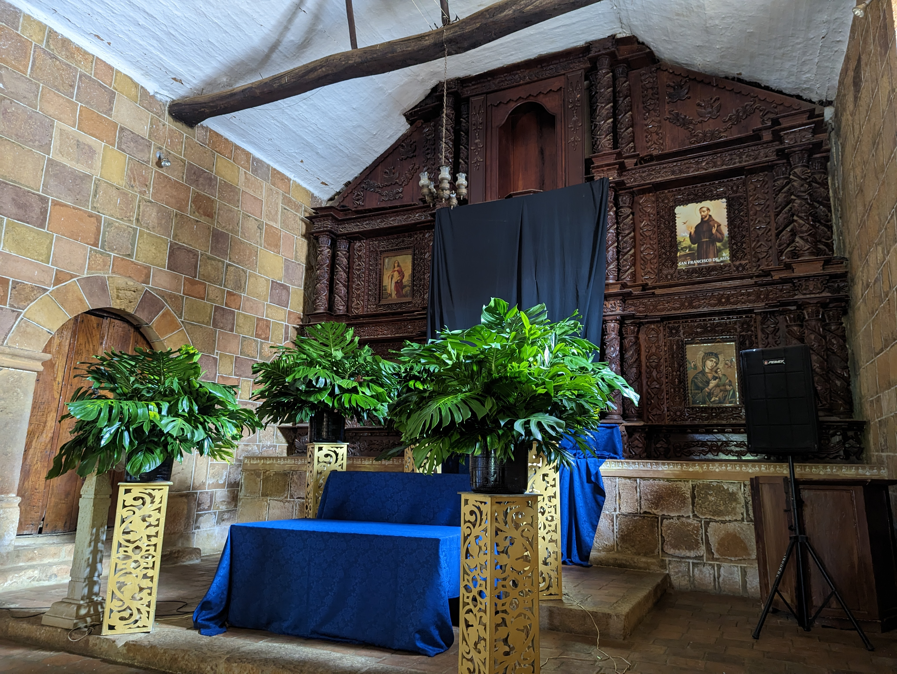

<br><details><summary>:camera:**46/PXL_20230407_155847701.MP.jpg**</summary><sub> `Exif version` 0232 `OS version` HDR+ 1.0.514217843zd `Date` 2023:04:07 10:58:47 `Aperture` Not known `Brightness` 3.61 `Color space` 1 `Compression` 6`Exposure mode` 0 `Exposure time` 0.014638 `Focal length` 6.81 `Lens model` Pixel 6 back camera 6.81mm f/1.85 `Lens specification` Not known `Orientation` 1 `Scene type` Not known `f number` 1.85 `White balance` 0 `Sensing method` 2 `Shutter speed` 6.09</sub><sub>`Coordinates & altitude` (6.635888888888888, -73.22558055555555, 1326.28)</sub><sub> :earth_americas:`Location over` [Google Maps](http://maps.google.com/maps?q=6.635888888888888,-73.22558055555555) or [Openstreet Map](https://www.openstreetmap.org/query?lat=6.635888888888888&lon=-73.22558055555555)</sub></details>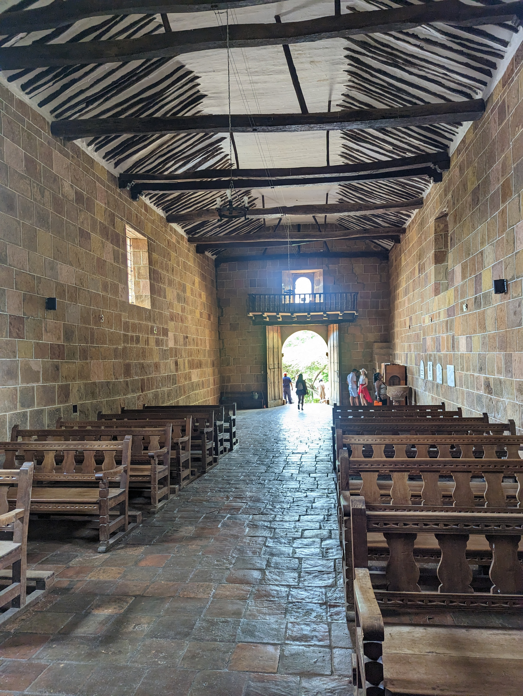

<br><details><summary>:camera:**46/PXL_20230407_160006097.jpg**</summary><sub> `Exif version` 0232 `OS version` HDR+ 1.0.514217843zd `Date` 2023:04:07 11:00:06 `Aperture` Not known `Brightness` 9.63 `Color space` 1 `Compression` 6`Exposure mode` 0 `Exposure time` 0.000398 `Focal length` 6.81 `Lens model` Pixel 6 back camera 6.81mm f/1.85 `Lens specification` Not known `Orientation` 1 `Scene type` Not known `f number` 1.85 `White balance` 0 `Sensing method` 2 `Shutter speed` 11.3</sub><sub>`Coordinates & altitude` (6.636013888888888, -73.22564444444444, 1318.8)</sub><sub> :earth_americas:`Location over` [Google Maps](http://maps.google.com/maps?q=6.636013888888888,-73.22564444444444) or [Openstreet Map](https://www.openstreetmap.org/query?lat=6.636013888888888&lon=-73.22564444444444)</sub></details>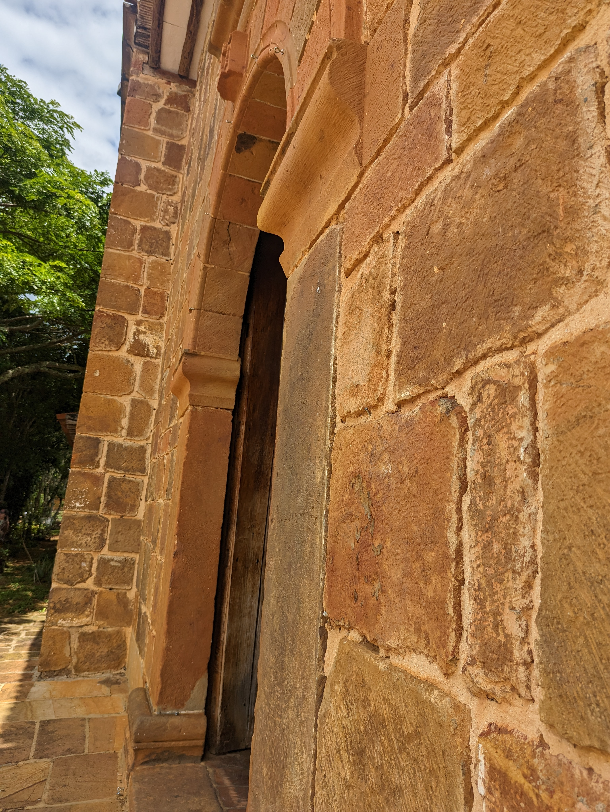

<br><details><summary>:camera:**46/PXL_20230407_160010328.jpg**</summary><sub> `Exif version` 0232 `OS version` HDR+ 1.0.514217843zd `Date` 2023:04:07 11:00:10 `Aperture` Not known `Brightness` 10.31 `Color space` 1 `Compression` 6`Exposure mode` 0 `Exposure time` 0.000256 `Focal length` 6.81 `Lens model` Pixel 6 back camera 6.81mm f/1.85 `Lens specification` Not known `Orientation` 1 `Scene type` Not known `f number` 1.85 `White balance` 0 `Sensing method` 2 `Shutter speed` 11.93</sub><sub>`Coordinates & altitude` (6.636013888888888, -73.22564444444444, 1318.8)</sub><sub> :earth_americas:`Location over` [Google Maps](http://maps.google.com/maps?q=6.636013888888888,-73.22564444444444) or [Openstreet Map](https://www.openstreetmap.org/query?lat=6.636013888888888&lon=-73.22564444444444)</sub></details>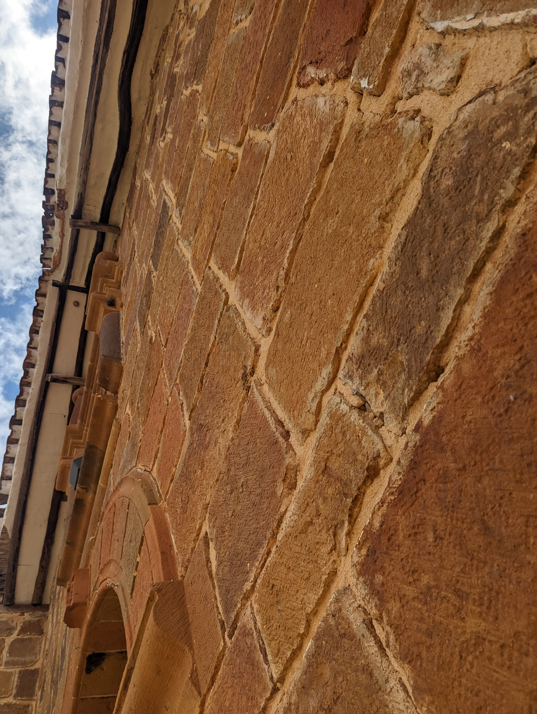

<br><details><summary>:camera:**46/PXL_20230407_160016290.jpg**</summary><sub> `Exif version` 0232 `OS version` HDR+ 1.0.514217843zd `Date` 2023:04:07 11:00:16 `Aperture` Not known `Brightness` 8.4 `Color space` 1 `Compression` 6`Exposure mode` 0 `Exposure time` 0.000671 `Focal length` 6.81 `Lens model` Pixel 6 back camera 6.81mm f/1.85 `Lens specification` Not known `Orientation` 1 `Scene type` Not known `f number` 1.85 `White balance` 0 `Sensing method` 2 `Shutter speed` 10.54</sub><sub>`Coordinates & altitude` (6.636013888888888, -73.22564444444444, 1318.8)</sub><sub> :earth_americas:`Location over` [Google Maps](http://maps.google.com/maps?q=6.636013888888888,-73.22564444444444) or [Openstreet Map](https://www.openstreetmap.org/query?lat=6.636013888888888&lon=-73.22564444444444)</sub></details>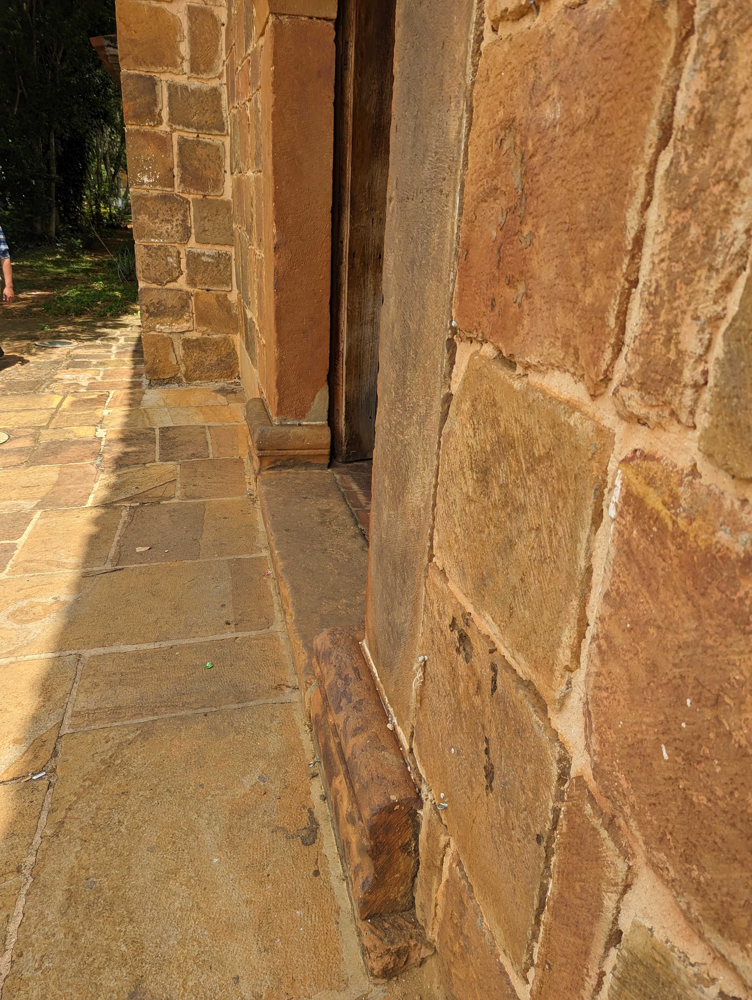

<br><details><summary>:camera:**46/PXL_20230407_160115872.jpg**</summary><sub> `Exif version` 0232 `OS version` HDR+ 1.0.514217843zd `Date` 2023:04:07 11:01:15 `Aperture` Not known `Brightness` 5.44 `Color space` 1 `Compression` 6`Exposure mode` 0 `Exposure time` 0.007677 `Focal length` 6.81 `Lens model` Pixel 6 back camera 6.81mm f/1.85 `Lens specification` Not known `Orientation` 1 `Scene type` Not known `f number` 1.85 `White balance` 0 `Sensing method` 2 `Shutter speed` 7.03</sub><sub>`Coordinates & altitude` (6.636108333333333, -73.22570277777778, 1328.36)</sub><sub> :earth_americas:`Location over` [Google Maps](http://maps.google.com/maps?q=6.636108333333333,-73.22570277777778) or [Openstreet Map](https://www.openstreetmap.org/query?lat=6.636108333333333&lon=-73.22570277777778)</sub></details>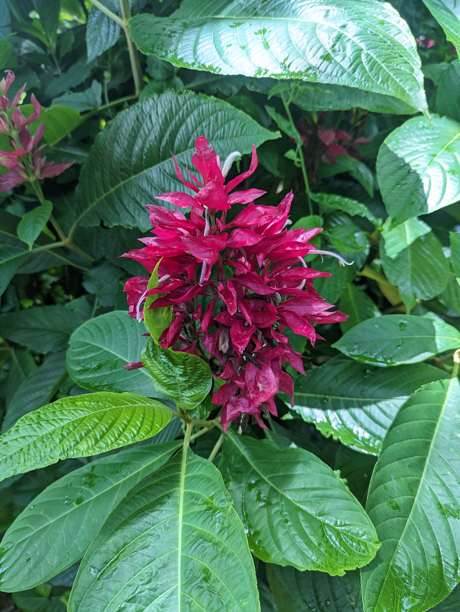

<br><details><summary>:camera:**46/PXL_20230407_160120901.jpg**</summary><sub> `Exif version` 0232 `OS version` HDR+ 1.0.514217843zd `Date` 2023:04:07 11:01:20 `Aperture` Not known `Brightness` 4.88 `Color space` 1 `Compression` 6`Exposure mode` 0 `Exposure time` 0.009329 `Focal length` 6.81 `Lens model` Pixel 6 back camera 6.81mm f/1.85 `Lens specification` Not known `Orientation` 1 `Scene type` Not known `f number` 1.85 `White balance` 0 `Sensing method` 2 `Shutter speed` 6.74</sub><sub>`Coordinates & altitude` (6.636108333333333, -73.22570277777778, 1328.36)</sub><sub> :earth_americas:`Location over` [Google Maps](http://maps.google.com/maps?q=6.636108333333333,-73.22570277777778) or [Openstreet Map](https://www.openstreetmap.org/query?lat=6.636108333333333&lon=-73.22570277777778)</sub></details>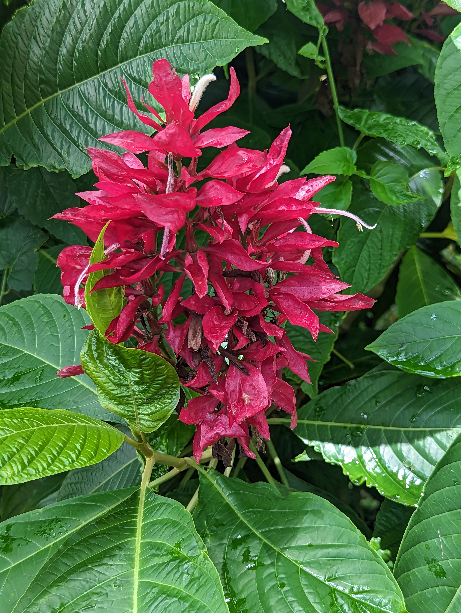

<br><details><summary>:camera:**46/PXL_20230407_160335412.jpg**</summary><sub> `Exif version` 0232 `OS version` HDR+ 1.0.514217843zd `Date` 2023:04:07 11:03:35 `Aperture` Not known `Brightness` 9.97 `Color space` 1 `Compression` 6`Exposure mode` 0 `Exposure time` 0.000486 `Focal length` 6.81 `Lens model` Pixel 6 back camera 6.81mm f/1.85 `Lens specification` Not known `Orientation` 1 `Scene type` Not known `f number` 1.85 `White balance` 0 `Sensing method` 2 `Shutter speed` 11.01</sub><sub>`Coordinates & altitude` (6.636108333333333, -73.22570277777778, 1328.36)</sub><sub> :earth_americas:`Location over` [Google Maps](http://maps.google.com/maps?q=6.636108333333333,-73.22570277777778) or [Openstreet Map](https://www.openstreetmap.org/query?lat=6.636108333333333&lon=-73.22570277777778)</sub></details>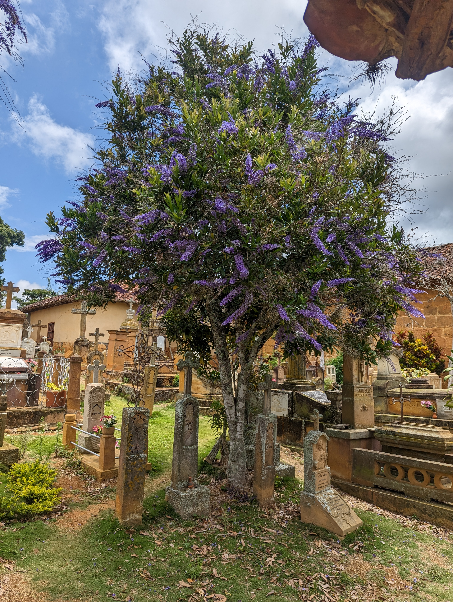

<br><details><summary>:camera:**46/PXL_20230407_160340672.jpg**</summary><sub> `Exif version` 0232 `OS version` HDR+ 1.0.514217843zd `Date` 2023:04:07 11:03:40 `Aperture` Not known `Brightness` 8.99 `Color space` 1 `Compression` 6`Exposure mode` 0 `Exposure time` 0.000477 `Focal length` 6.81 `Lens model` Pixel 6 back camera 6.81mm f/1.85 `Lens specification` Not known `Orientation` 1 `Scene type` Not known `f number` 1.85 `White balance` 0 `Sensing method` 2 `Shutter speed` 11.03</sub><sub>`Coordinates & altitude` (6.636302777777777, -73.22571666666667, 1333.0)</sub><sub> :earth_americas:`Location over` [Google Maps](http://maps.google.com/maps?q=6.636302777777777,-73.22571666666667) or [Openstreet Map](https://www.openstreetmap.org/query?lat=6.636302777777777&lon=-73.22571666666667)</sub></details>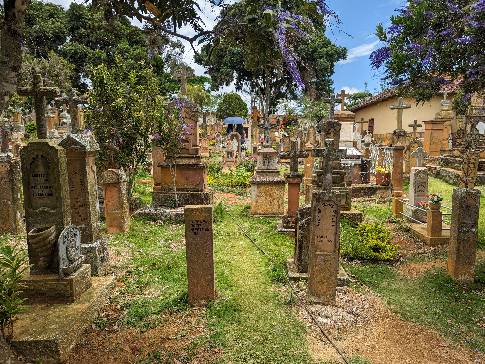

<br><details><summary>:camera:**46/PXL_20230407_160348485.jpg**</summary><sub> `Exif version` 0232 `OS version` HDR+ 1.0.514217843zd `Date` 2023:04:07 11:03:48 `Aperture` Not known `Brightness` 7.92 `Color space` 1 `Compression` 6`Exposure mode` 0 `Exposure time` 0.001166 `Focal length` 6.81 `Lens model` Pixel 6 back camera 6.81mm f/1.85 `Lens specification` Not known `Orientation` 1 `Scene type` Not known `f number` 1.85 `White balance` 0 `Sensing method` 2 `Shutter speed` 9.74</sub><sub>`Coordinates & altitude` (6.636302777777777, -73.22571666666667, 1333.0)</sub><sub> :earth_americas:`Location over` [Google Maps](http://maps.google.com/maps?q=6.636302777777777,-73.22571666666667) or [Openstreet Map](https://www.openstreetmap.org/query?lat=6.636302777777777&lon=-73.22571666666667)</sub></details>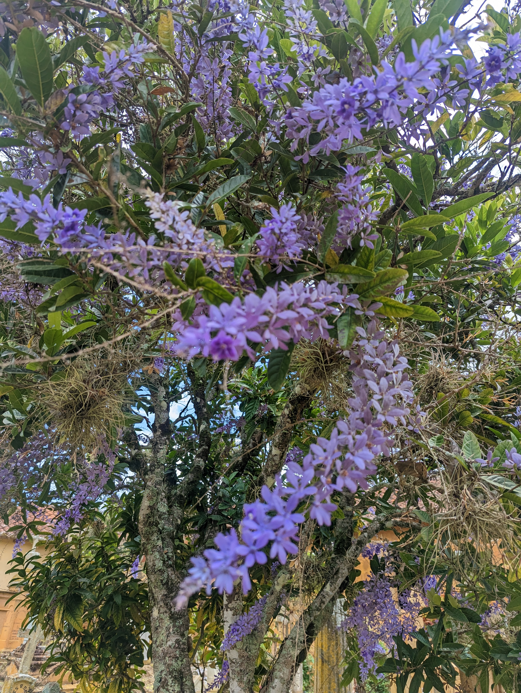

<br><details><summary>:camera:**46/PXL_20230407_160536010.jpg**</summary><sub> `Exif version` 0232 `OS version` HDR+ 1.0.514217843zd `Date` 2023:04:07 11:05:36 `Aperture` Not known `Brightness` 7.21 `Color space` 1 `Compression` 6`Exposure mode` 0 `Exposure time` 0.00212 `Focal length` 6.81 `Lens model` Pixel 6 back camera 6.81mm f/1.85 `Lens specification` Not known `Orientation` 1 `Scene type` Not known `f number` 1.85 `White balance` 0 `Sensing method` 2 `Shutter speed` 8.88</sub><sub>`Coordinates & altitude` (6.636302777777777, -73.22571666666667, 1333.0)</sub><sub> :earth_americas:`Location over` [Google Maps](http://maps.google.com/maps?q=6.636302777777777,-73.22571666666667) or [Openstreet Map](https://www.openstreetmap.org/query?lat=6.636302777777777&lon=-73.22571666666667)</sub></details>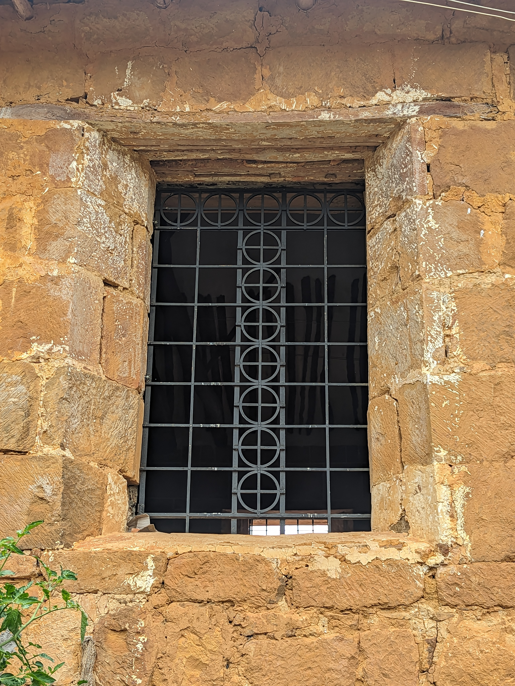

<br><details><summary>:camera:**46/PXL_20230407_160638004.jpg**</summary><sub> `Exif version` 0232 `OS version` HDR+ 1.0.514217843zd `Date` 2023:04:07 11:06:38 `Aperture` Not known `Brightness` 7.38 `Color space` 1 `Compression` 6`Exposure mode` 0 `Exposure time` 0.001652 `Focal length` 6.81 `Lens model` Pixel 6 back camera 6.81mm f/1.85 `Lens specification` Not known `Orientation` 1 `Scene type` Not known `f number` 1.85 `White balance` 0 `Sensing method` 2 `Shutter speed` 9.24</sub><sub>`Coordinates & altitude` (6.6364777777777775, -73.22569722222222, 1318.2)</sub><sub> :earth_americas:`Location over` [Google Maps](http://maps.google.com/maps?q=6.6364777777777775,-73.22569722222222) or [Openstreet Map](https://www.openstreetmap.org/query?lat=6.6364777777777775&lon=-73.22569722222222)</sub></details>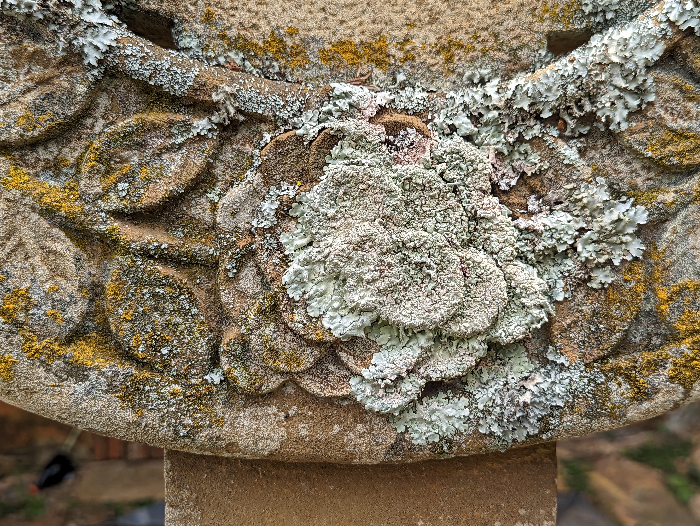

<br><details><summary>:camera:**46/PXL_20230407_160647017.jpg**</summary><sub> `Exif version` 0232 `OS version` HDR+ 1.0.514217843zd `Date` 2023:04:07 11:06:47 `Aperture` Not known `Brightness` 9.39 `Color space` 1 `Compression` 6`Exposure mode` 0 `Exposure time` 0.000491 `Focal length` 2.35 `Lens model` Pixel 6 back camera 2.35mm f/2.2 `Lens specification` Not known `Orientation` 1 `Scene type` Not known `f number` 2.2 `White balance` 0 `Sensing method` 2 `Shutter speed` 10.99</sub><sub>`Coordinates & altitude` (6.6364777777777775, -73.22569722222222, 1318.2)</sub><sub> :earth_americas:`Location over` [Google Maps](http://maps.google.com/maps?q=6.6364777777777775,-73.22569722222222) or [Openstreet Map](https://www.openstreetmap.org/query?lat=6.6364777777777775&lon=-73.22569722222222)</sub></details>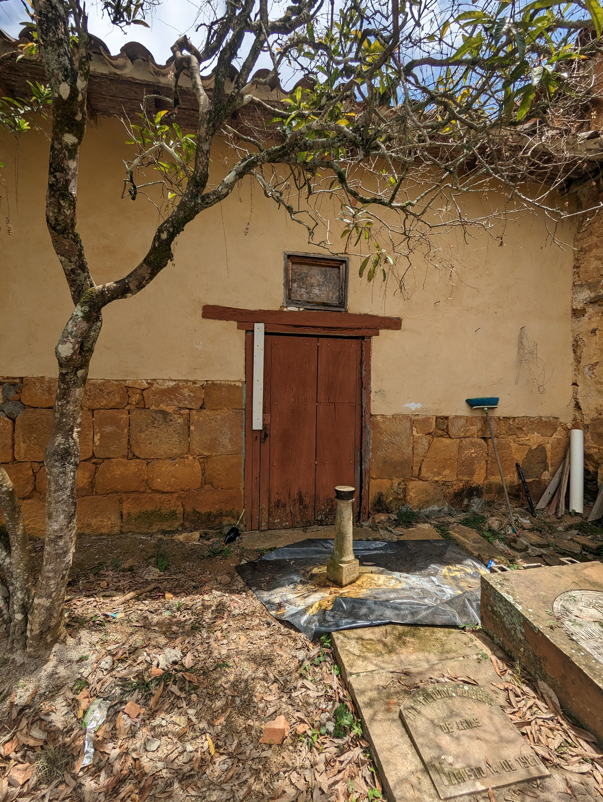

<br><details><summary>:camera:**46/PXL_20230407_160815905.jpg**</summary><sub> `Exif version` 0232 `OS version` HDR+ 1.0.514217843zd `Date` 2023:04:07 11:08:15 `Aperture` Not known `Brightness` 9.63 `Color space` 1 `Compression` 6`Exposure mode` 0 `Exposure time` 0.000361 `Focal length` 2.35 `Lens model` Pixel 6 back camera 2.35mm f/2.2 `Lens specification` Not known `Orientation` 1 `Scene type` Not known `f number` 2.2 `White balance` 0 `Sensing method` 2 `Shutter speed` 11.43</sub><sub>`Coordinates & altitude` (6.6364777777777775, -73.22569722222222, 1318.2)</sub><sub> :earth_americas:`Location over` [Google Maps](http://maps.google.com/maps?q=6.6364777777777775,-73.22569722222222) or [Openstreet Map](https://www.openstreetmap.org/query?lat=6.6364777777777775&lon=-73.22569722222222)</sub></details>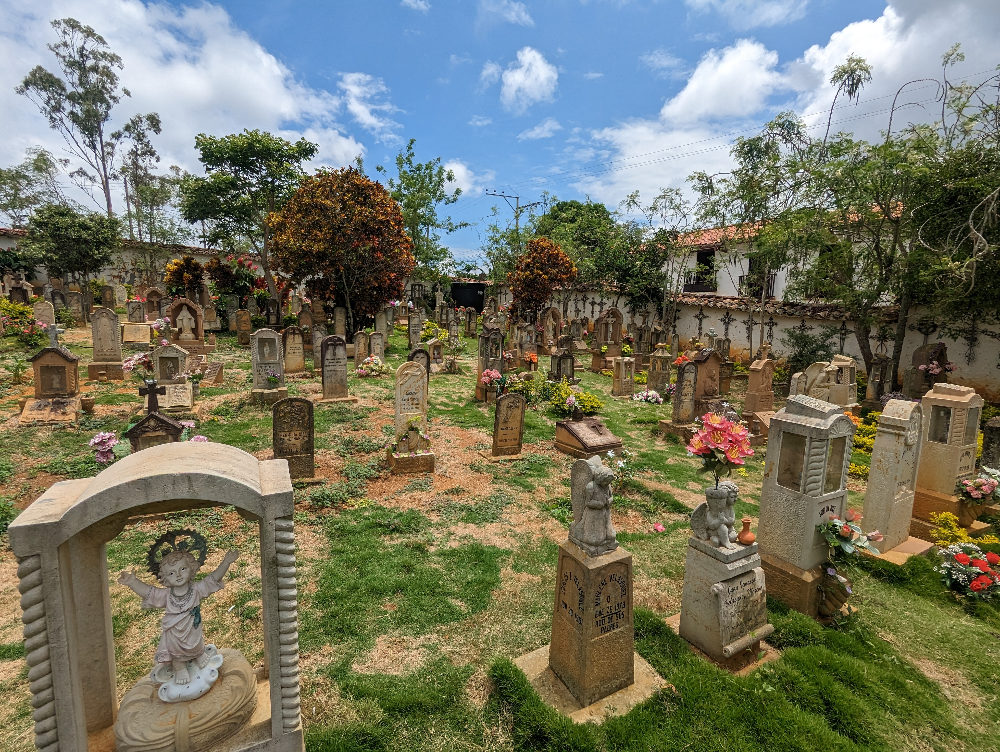

<br><details><summary>:camera:**46/PXL_20230407_160838705.jpg**</summary><sub> `Exif version` 0232 `OS version` HDR+ 1.0.514217843zd `Date` 2023:04:07 11:08:38 `Aperture` Not known `Brightness` 7.43 `Color space` 1 `Compression` 6`Exposure mode` 0 `Exposure time` 0.002093 `Focal length` 2.35 `Lens model` Pixel 6 back camera 2.35mm f/2.2 `Lens specification` Not known `Orientation` 1 `Scene type` Not known `f number` 2.2 `White balance` 0 `Sensing method` 2 `Shutter speed` 8.9</sub><sub>`Coordinates & altitude` (6.636644444444444, -73.22573333333334, 1318.2)</sub><sub> :earth_americas:`Location over` [Google Maps](http://maps.google.com/maps?q=6.636644444444444,-73.22573333333334) or [Openstreet Map](https://www.openstreetmap.org/query?lat=6.636644444444444&lon=-73.22573333333334)</sub></details>

<br><details><summary>:camera:**46/PXL_20230407_160843558.jpg**</summary><sub> `Exif version` 0232 `OS version` HDR+ 1.0.514217843zd `Date` 2023:04:07 11:08:43 `Aperture` Not known `Brightness` 7.36 `Color space` 1 `Compression` 6`Exposure mode` 0 `Exposure time` 0.00188 `Focal length` 2.35 `Lens model` Pixel 6 back camera 2.35mm f/2.2 `Lens specification` Not known `Orientation` 1 `Scene type` Not known `f number` 2.2 `White balance` 0 `Sensing method` 2 `Shutter speed` 9.06</sub><sub>`Coordinates & altitude` (6.636644444444444, -73.22573333333334, 1318.2)</sub><sub> :earth_americas:`Location over` [Google Maps](http://maps.google.com/maps?q=6.636644444444444,-73.22573333333334) or [Openstreet Map](https://www.openstreetmap.org/query?lat=6.636644444444444&lon=-73.22573333333334)</sub></details>

<br><details><summary>:camera:**46/PXL_20230407_160858829.jpg**</summary><sub> `Exif version` 0232 `OS version` HDR+ 1.0.514217843zd `Date` 2023:04:07 11:08:58 `Aperture` Not known `Brightness` 6.47 `Color space` 1 `Compression` 6`Exposure mode` 0 `Exposure time` 0.003871 `Focal length` 2.35 `Lens model` Pixel 6 back camera 2.35mm f/2.2 `Lens specification` Not known `Orientation` 1 `Scene type` Not known `f number` 2.2 `White balance` 0 `Sensing method` 2 `Shutter speed` 8.01</sub><sub>`Coordinates & altitude` (6.636644444444444, -73.22573333333334, 1318.2)</sub><sub> :earth_americas:`Location over` [Google Maps](http://maps.google.com/maps?q=6.636644444444444,-73.22573333333334) or [Openstreet Map](https://www.openstreetmap.org/query?lat=6.636644444444444&lon=-73.22573333333334)</sub></details>

<br><details><summary>:camera:**46/PXL_20230407_161828745.jpg**</summary><sub> `Exif version` 0232 `OS version` HDR+ 1.0.514217843zd `Date` 2023:04:07 11:18:28 `Aperture` Not known `Brightness` 9.43 `Color space` 1 `Compression` 6`Exposure mode` 0 `Exposure time` 0.000353 `Focal length` 6.81 `Lens model` Pixel 6 back camera 6.81mm f/1.85 `Lens specification` Not known `Orientation` 1 `Scene type` Not known `f number` 1.85 `White balance` 0 `Sensing method` 2 `Shutter speed` 11.47</sub><sub>`Coordinates & altitude` (6.634566666666666, -73.22105833333333, 1318.2)</sub><sub> :earth_americas:`Location over` [Google Maps](http://maps.google.com/maps?q=6.634566666666666,-73.22105833333333) or [Openstreet Map](https://www.openstreetmap.org/query?lat=6.634566666666666&lon=-73.22105833333333)</sub></details>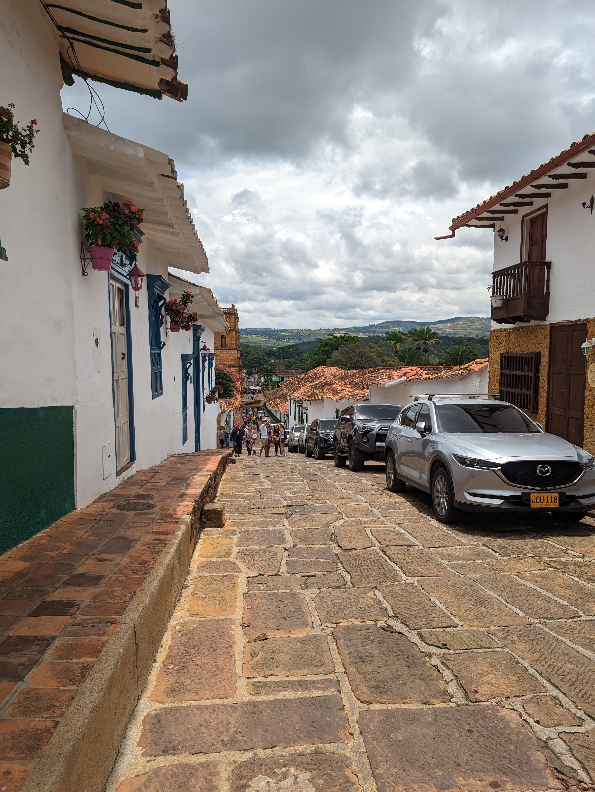

<br><details><summary>:camera:**46/PXL_20230407_162636364.jpg**</summary><sub> `Exif version` 0232 `OS version` HDR+ 1.0.514217843zd `Date` 2023:04:07 11:26:36 `Aperture` Not known `Brightness` 5.78 `Color space` 1 `Compression` 6`Exposure mode` 0 `Exposure time` 0.004638 `Focal length` 6.81 `Lens model` Pixel 6 back camera 6.81mm f/1.85 `Lens specification` Not known `Orientation` 1 `Scene type` Not known `f number` 1.85 `White balance` 0 `Sensing method` 2 `Shutter speed` 7.75</sub><sub>`Coordinates & altitude` (6.636291666666666, -73.22398611111112, 1306.59)</sub><sub> :earth_americas:`Location over` [Google Maps](http://maps.google.com/maps?q=6.636291666666666,-73.22398611111112) or [Openstreet Map](https://www.openstreetmap.org/query?lat=6.636291666666666&lon=-73.22398611111112)</sub></details>

<br><details><summary>:camera:**46/PXL_20230407_162642126.jpg**</summary><sub> `Exif version` 0232 `OS version` HDR+ 1.0.514217843zd `Date` 2023:04:07 11:26:42 `Aperture` Not known `Brightness` 5.23 `Color space` 1 `Compression` 6`Exposure mode` 0 `Exposure time` 0.006475 `Focal length` 6.81 `Lens model` Pixel 6 back camera 6.81mm f/1.85 `Lens specification` Not known `Orientation` 1 `Scene type` Not known `f number` 1.85 `White balance` 0 `Sensing method` 2 `Shutter speed` 7.27</sub><sub>`Coordinates & altitude` (6.636291666666666, -73.22398611111112, 1306.59)</sub><sub> :earth_americas:`Location over` [Google Maps](http://maps.google.com/maps?q=6.636291666666666,-73.22398611111112) or [Openstreet Map](https://www.openstreetmap.org/query?lat=6.636291666666666&lon=-73.22398611111112)</sub></details>

<br><details><summary>:camera:**46/PXL_20230407_162709585.jpg**</summary><sub> `Exif version` 0232 `OS version` HDR+ 1.0.514217843zd `Date` 2023:04:07 11:27:09 `Aperture` Not known `Brightness` 10.72 `Color space` 1 `Compression` 6`Exposure mode` 0 `Exposure time` 0.000133 `Focal length` 6.81 `Lens model` Pixel 6 back camera 6.81mm f/1.85 `Lens specification` Not known `Orientation` 1 `Scene type` Not known `f number` 1.85 `White balance` 0 `Sensing method` 2 `Shutter speed` 12.88</sub><sub>`Coordinates & altitude` (6.636144444444444, -73.22399444444444, 1313.4)</sub><sub> :earth_americas:`Location over` [Google Maps](http://maps.google.com/maps?q=6.636144444444444,-73.22399444444444) or [Openstreet Map](https://www.openstreetmap.org/query?lat=6.636144444444444&lon=-73.22399444444444)</sub></details>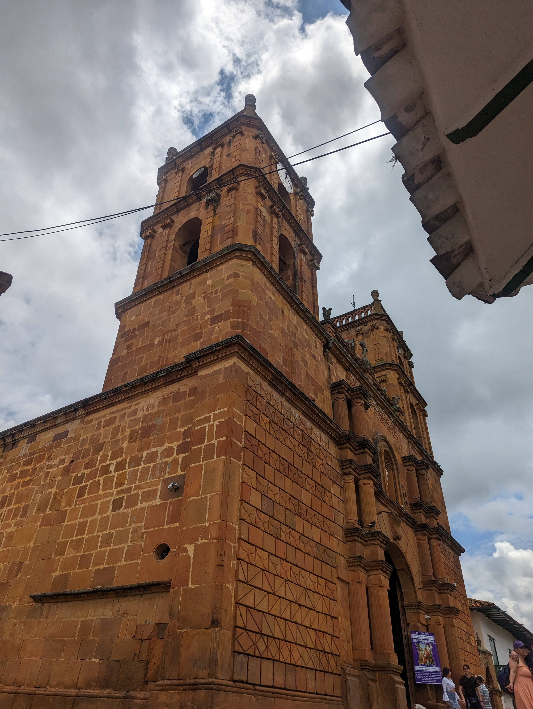

<br><details><summary>:camera:**46/PXL_20230407_162714230.jpg**</summary><sub> `Exif version` 0232 `OS version` HDR+ 1.0.514217843zd `Date` 2023:04:07 11:27:14 `Aperture` Not known `Brightness` 10.72 `Color space` 1 `Compression` 6`Exposure mode` 0 `Exposure time` 0.000159 `Focal length` 6.81 `Lens model` Pixel 6 back camera 6.81mm f/1.85 `Lens specification` Not known `Orientation` 1 `Scene type` Not known `f number` 1.85 `White balance` 0 `Sensing method` 2 `Shutter speed` 12.62</sub><sub>`Coordinates & altitude` (6.636144444444444, -73.22399444444444, 1313.4)</sub><sub> :earth_americas:`Location over` [Google Maps](http://maps.google.com/maps?q=6.636144444444444,-73.22399444444444) or [Openstreet Map](https://www.openstreetmap.org/query?lat=6.636144444444444&lon=-73.22399444444444)</sub></details>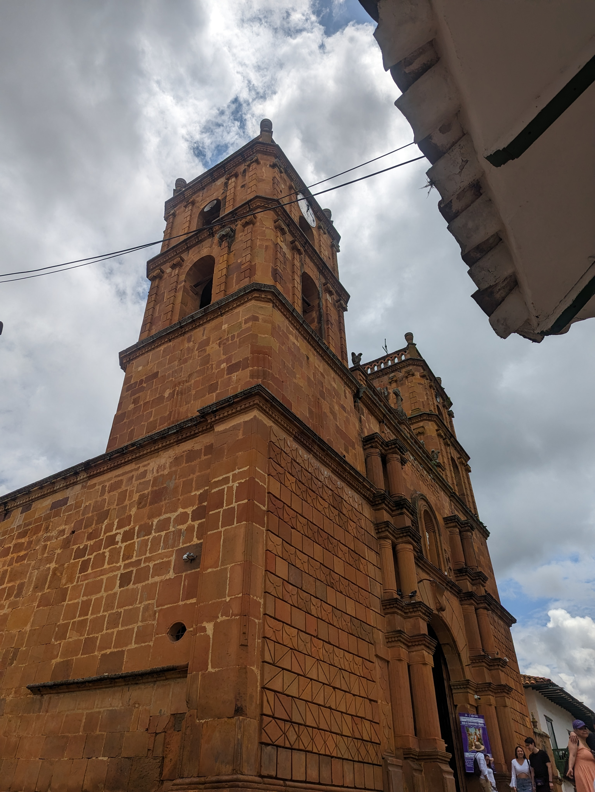

<br><details><summary>:camera:**46/PXL_20230407_162736080.jpg**</summary><sub> `Exif version` 0232 `OS version` HDR+ 1.0.514217843zd `Date` 2023:04:07 11:27:36 `Aperture` Not known `Brightness` 11.61 `Color space` 1 `Compression` 6`Exposure mode` 0 `Exposure time` 8e-05 `Focal length` 6.81 `Lens model` Pixel 6 back camera 6.81mm f/1.85 `Lens specification` Not known `Orientation` 1 `Scene type` Not known `f number` 1.85 `White balance` 0 `Sensing method` 2 `Shutter speed` 13.62</sub><sub>`Coordinates & altitude` (6.636144444444444, -73.22399444444444, 1313.4)</sub><sub> :earth_americas:`Location over` [Google Maps](http://maps.google.com/maps?q=6.636144444444444,-73.22399444444444) or [Openstreet Map](https://www.openstreetmap.org/query?lat=6.636144444444444&lon=-73.22399444444444)</sub></details>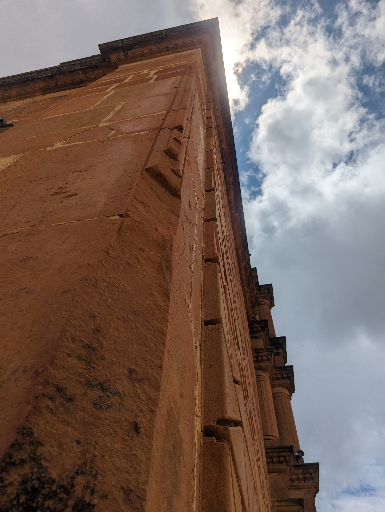

<br><details><summary>:camera:**46/PXL_20230407_162744612.jpg**</summary><sub> `Exif version` 0232 `OS version` HDR+ 1.0.514217843zd `Date` 2023:04:07 11:27:44 `Aperture` Not known `Brightness` 9.44 `Color space` 1 `Compression` 6`Exposure mode` 0 `Exposure time` 0.000265 `Focal length` 6.81 `Lens model` Pixel 6 back camera 6.81mm f/1.85 `Lens specification` Not known `Orientation` 1 `Scene type` Not known `f number` 1.85 `White balance` 0 `Sensing method` 2 `Shutter speed` 11.88</sub><sub>`Coordinates & altitude` (6.636144444444444, -73.22399444444444, 1313.4)</sub><sub> :earth_americas:`Location over` [Google Maps](http://maps.google.com/maps?q=6.636144444444444,-73.22399444444444) or [Openstreet Map](https://www.openstreetmap.org/query?lat=6.636144444444444&lon=-73.22399444444444)</sub></details>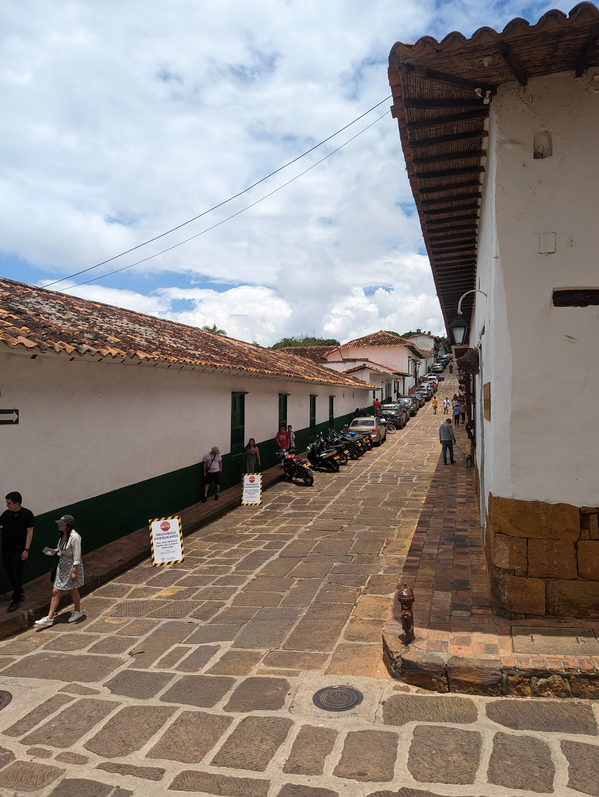

<br><details><summary>:camera:**46/PXL_20230407_162753798.jpg**</summary><sub> `Exif version` 0232 `OS version` HDR+ 1.0.514217843zd `Date` 2023:04:07 11:27:53 `Aperture` Not known `Brightness` 10.14 `Color space` 1 `Compression` 6`Exposure mode` 0 `Exposure time` 0.000221 `Focal length` 6.81 `Lens model` Pixel 6 back camera 6.81mm f/1.85 `Lens specification` Not known `Orientation` 1 `Scene type` Not known `f number` 1.85 `White balance` 0 `Sensing method` 2 `Shutter speed` 12.14</sub><sub>`Coordinates & altitude` (6.636144444444444, -73.22399444444444, 1313.4)</sub><sub> :earth_americas:`Location over` [Google Maps](http://maps.google.com/maps?q=6.636144444444444,-73.22399444444444) or [Openstreet Map](https://www.openstreetmap.org/query?lat=6.636144444444444&lon=-73.22399444444444)</sub></details>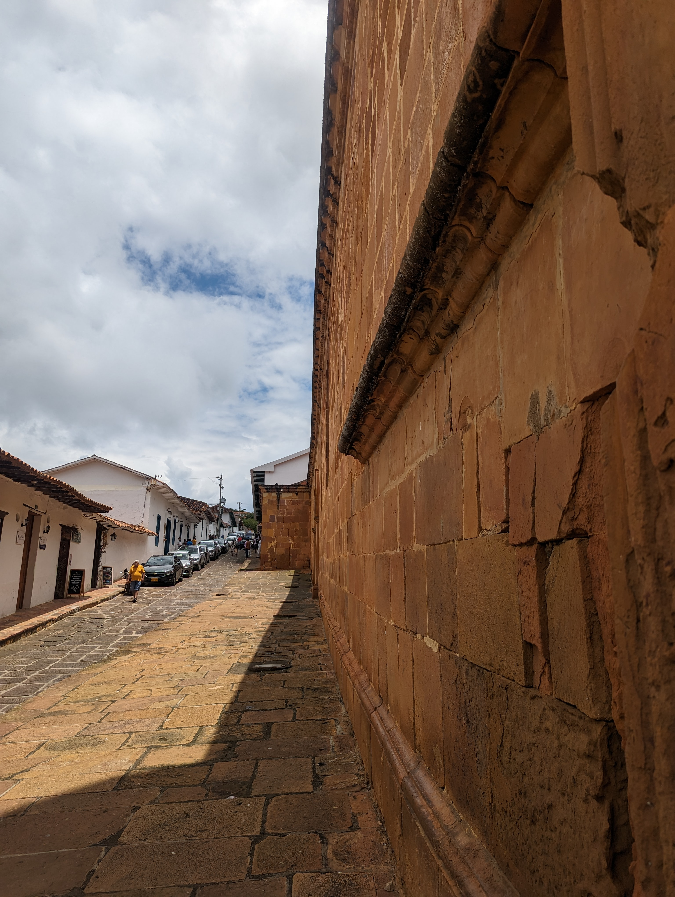

<br><details><summary>:camera:**46/PXL_20230407_162800253.jpg**</summary><sub> `Exif version` 0232 `OS version` HDR+ 1.0.514217843zd `Date` 2023:04:07 11:28:00 `Aperture` Not known `Brightness` 10.13 `Color space` 1 `Compression` 6`Exposure mode` 0 `Exposure time` 0.000168 `Focal length` 6.81 `Lens model` Pixel 6 back camera 6.81mm f/1.85 `Lens specification` Not known `Orientation` 1 `Scene type` Not known `f number` 1.85 `White balance` 0 `Sensing method` 2 `Shutter speed` 12.54</sub><sub>`Coordinates & altitude` (6.636144444444444, -73.22399444444444, 1313.4)</sub><sub> :earth_americas:`Location over` [Google Maps](http://maps.google.com/maps?q=6.636144444444444,-73.22399444444444) or [Openstreet Map](https://www.openstreetmap.org/query?lat=6.636144444444444&lon=-73.22399444444444)</sub></details>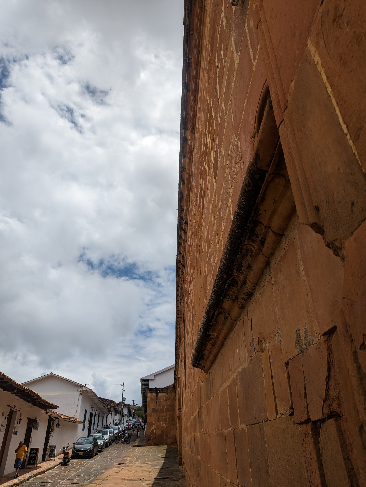

<br><details><summary>:camera:**46/PXL_20230407_162815142.jpg**</summary><sub> `Exif version` 0232 `OS version` HDR+ 1.0.514217843zd `Date` 2023:04:07 11:28:15 `Aperture` Not known `Brightness` 9.43 `Color space` 1 `Compression` 6`Exposure mode` 0 `Exposure time` 0.000345 `Focal length` 6.81 `Lens model` Pixel 6 back camera 6.81mm f/1.85 `Lens specification` Not known `Orientation` 1 `Scene type` Not known `f number` 1.85 `White balance` 0 `Sensing method` 2 `Shutter speed` 11.5</sub><sub>`Coordinates & altitude` (6.636166666666666, -73.22382222222222, 1313.4)</sub><sub> :earth_americas:`Location over` [Google Maps](http://maps.google.com/maps?q=6.636166666666666,-73.22382222222222) or [Openstreet Map](https://www.openstreetmap.org/query?lat=6.636166666666666&lon=-73.22382222222222)</sub></details>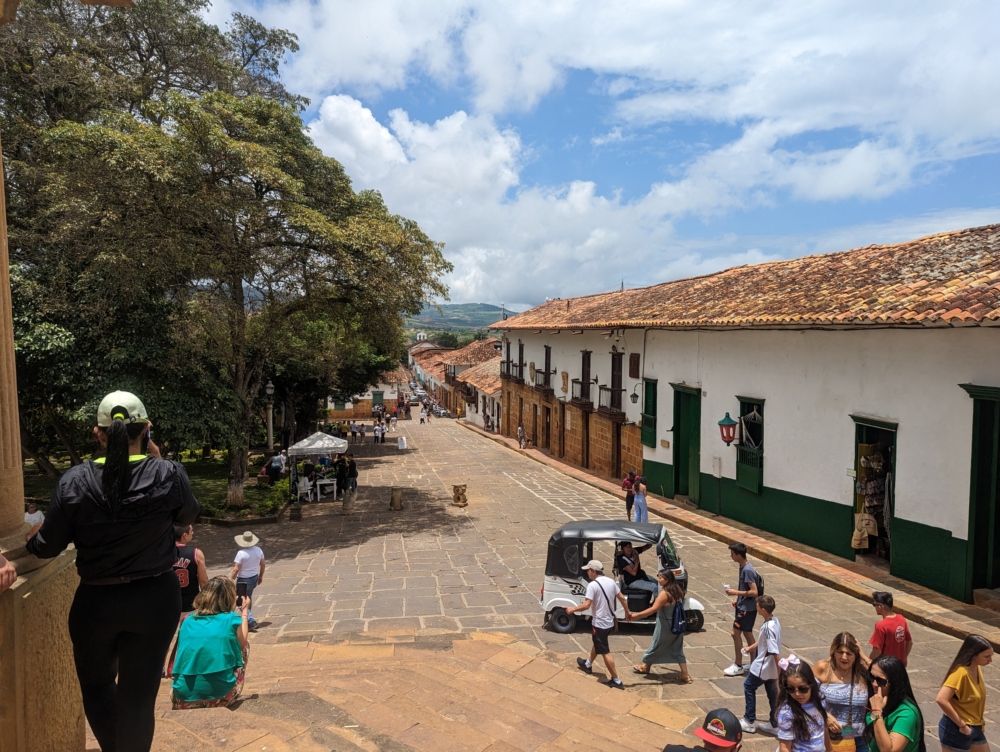

<br><details><summary>:camera:**46/PXL_20230407_162914007.jpg**</summary><sub> `Exif version` 0232 `OS version` HDR+ 1.0.514217843zd `Date` 2023:04:07 11:29:14 `Aperture` Not known `Brightness` 2.79 `Color space` 1 `Compression` 6`Exposure mode` 0 `Exposure time` 0.027156 `Focal length` 6.81 `Lens model` Pixel 6 back camera 6.81mm f/1.85 `Lens specification` Not known `Orientation` 1 `Scene type` Not known `f number` 1.85 `White balance` 0 `Sensing method` 2 `Shutter speed` 5.2</sub><sub>`Coordinates & altitude` (6.636277777777777, -73.22338611111111, 1313.4)</sub><sub> :earth_americas:`Location over` [Google Maps](http://maps.google.com/maps?q=6.636277777777777,-73.22338611111111) or [Openstreet Map](https://www.openstreetmap.org/query?lat=6.636277777777777&lon=-73.22338611111111)</sub></details>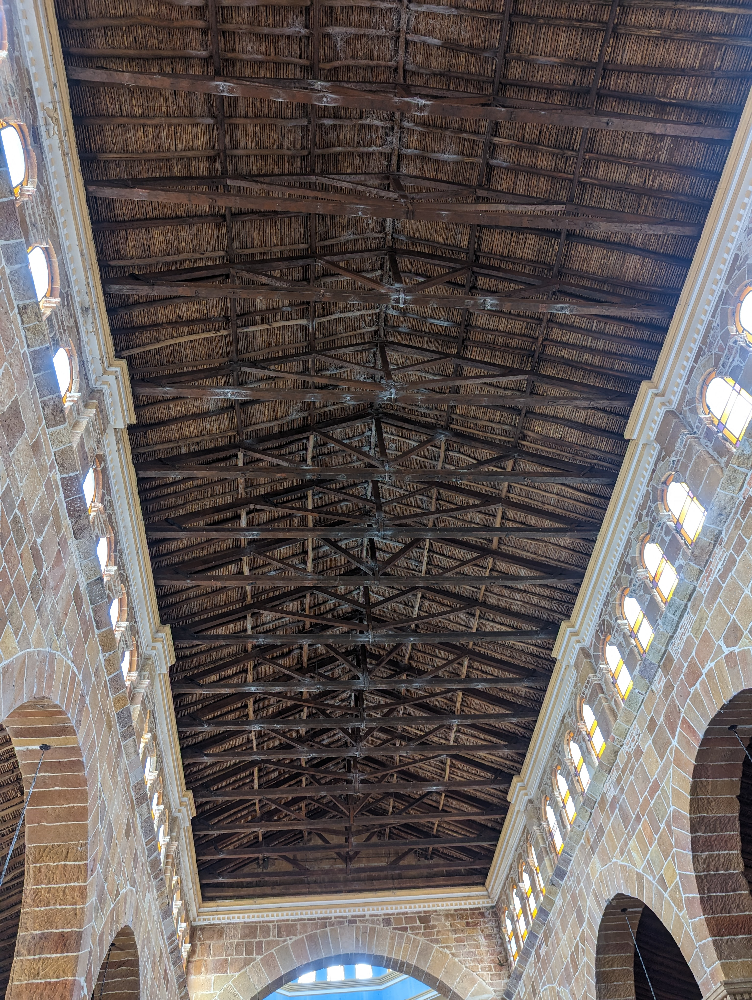

<br><details><summary>:camera:**46/PXL_20230407_162918153.MP.jpg**</summary><sub> `Exif version` 0232 `OS version` HDR+ 1.0.514217843zd `Date` 2023:04:07 11:29:18 `Aperture` Not known `Brightness` 3.12 `Color space` 1 `Compression` 6`Exposure mode` 0 `Exposure time` 0.010088 `Focal length` 6.81 `Lens model` Pixel 6 back camera 6.81mm f/1.85 `Lens specification` Not known `Orientation` 1 `Scene type` Not known `f number` 1.85 `White balance` 0 `Sensing method` 2 `Shutter speed` 6.63</sub><sub>`Coordinates & altitude` (6.636277777777777, -73.22338611111111, 1313.4)</sub><sub> :earth_americas:`Location over` [Google Maps](http://maps.google.com/maps?q=6.636277777777777,-73.22338611111111) or [Openstreet Map](https://www.openstreetmap.org/query?lat=6.636277777777777&lon=-73.22338611111111)</sub></details>

<br><details><summary>:camera:**46/PXL_20230407_162937500.jpg**</summary><sub> `Exif version` 0232 `OS version` HDR+ 1.0.514217843zd `Date` 2023:04:07 11:29:37 `Aperture` Not known `Brightness` 2.96 `Color space` 1 `Compression` 6`Exposure mode` 0 `Exposure time` 0.015424 `Focal length` 6.81 `Lens model` Pixel 6 back camera 6.81mm f/1.85 `Lens specification` Not known `Orientation` 1 `Scene type` Not known `f number` 1.85 `White balance` 0 `Sensing method` 2 `Shutter speed` 6.02</sub><sub>`Coordinates & altitude` (6.63645, -73.22368333333334, 1313.4)</sub><sub> :earth_americas:`Location over` [Google Maps](http://maps.google.com/maps?q=6.63645,-73.22368333333334) or [Openstreet Map](https://www.openstreetmap.org/query?lat=6.63645&lon=-73.22368333333334)</sub></details>

<br><details><summary>:camera:**46/PXL_20230407_162951259.jpg**</summary><sub> `Exif version` 0232 `OS version` HDR+ 1.0.514217843zd `Date` 2023:04:07 11:29:51 `Aperture` Not known `Brightness` 2.35 `Color space` 1 `Compression` 6`Exposure mode` 0 `Exposure time` 0.041997 `Focal length` 6.81 `Lens model` Pixel 6 back camera 6.81mm f/1.85 `Lens specification` Not known `Orientation` 1 `Scene type` Not known `f number` 1.85 `White balance` 0 `Sensing method` 2 `Shutter speed` 4.57</sub><sub>`Coordinates & altitude` (6.63645, -73.22368333333334, 1313.4)</sub><sub> :earth_americas:`Location over` [Google Maps](http://maps.google.com/maps?q=6.63645,-73.22368333333334) or [Openstreet Map](https://www.openstreetmap.org/query?lat=6.63645&lon=-73.22368333333334)</sub></details>

<br><details><summary>:camera:**46/PXL_20230407_163016248.jpg**</summary><sub> `Exif version` 0232 `OS version` HDR+ 1.0.514217843zd `Date` 2023:04:07 11:30:16 `Aperture` Not known `Brightness` 0.02 `Color space` 1 `Compression` 6`Exposure mode` 0 `Exposure time` 0.015141 `Focal length` 6.81 `Lens model` Pixel 6 back camera 6.81mm f/1.85 `Lens specification` Not known `Orientation` 1 `Scene type` Not known `f number` 1.85 `White balance` 0 `Sensing method` 2 `Shutter speed` 6.05</sub><sub>`Coordinates & altitude` (6.63645, -73.22368333333334, 1313.4)</sub><sub> :earth_americas:`Location over` [Google Maps](http://maps.google.com/maps?q=6.63645,-73.22368333333334) or [Openstreet Map](https://www.openstreetmap.org/query?lat=6.63645&lon=-73.22368333333334)</sub></details>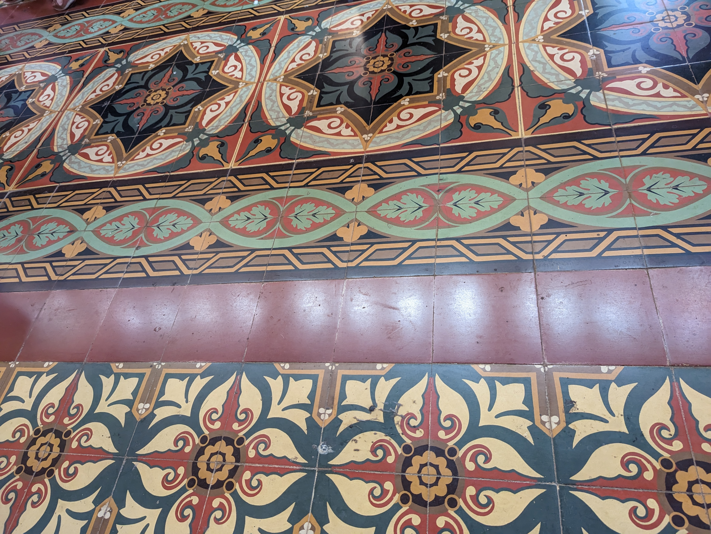

<br><details><summary>:camera:**46/PXL_20230407_163021830.jpg**</summary><sub> `Exif version` 0232 `OS version` HDR+ 1.0.514217843zd `Date` 2023:04:07 11:30:21 `Aperture` Not known `Brightness` -0.04 `Color space` 1 `Compression` 6`Exposure mode` 0 `Exposure time` 0.019788 `Focal length` 6.81 `Lens model` Pixel 6 back camera 6.81mm f/1.85 `Lens specification` Not known `Orientation` 1 `Scene type` Not known `f number` 1.85 `White balance` 0 `Sensing method` 2 `Shutter speed` 5.66</sub><sub>`Coordinates & altitude` (6.63645, -73.22368333333334, 1313.4)</sub><sub> :earth_americas:`Location over` [Google Maps](http://maps.google.com/maps?q=6.63645,-73.22368333333334) or [Openstreet Map](https://www.openstreetmap.org/query?lat=6.63645&lon=-73.22368333333334)</sub></details>

<br><details><summary>:camera:**46/PXL_20230407_163033764.jpg**</summary><sub> `Exif version` 0232 `OS version` HDR+ 1.0.514217843zd `Date` 2023:04:07 11:30:33 `Aperture` Not known `Brightness` 0.02 `Color space` 1 `Compression` 6`Exposure mode` 0 `Exposure time` 0.041997 `Focal length` 6.81 `Lens model` Pixel 6 back camera 6.81mm f/1.85 `Lens specification` Not known `Orientation` 1 `Scene type` Not known `f number` 1.85 `White balance` 0 `Sensing method` 2 `Shutter speed` 4.57</sub><sub>`Coordinates & altitude` (6.63645, -73.22368333333334, 1313.4)</sub><sub> :earth_americas:`Location over` [Google Maps](http://maps.google.com/maps?q=6.63645,-73.22368333333334) or [Openstreet Map](https://www.openstreetmap.org/query?lat=6.63645&lon=-73.22368333333334)</sub></details>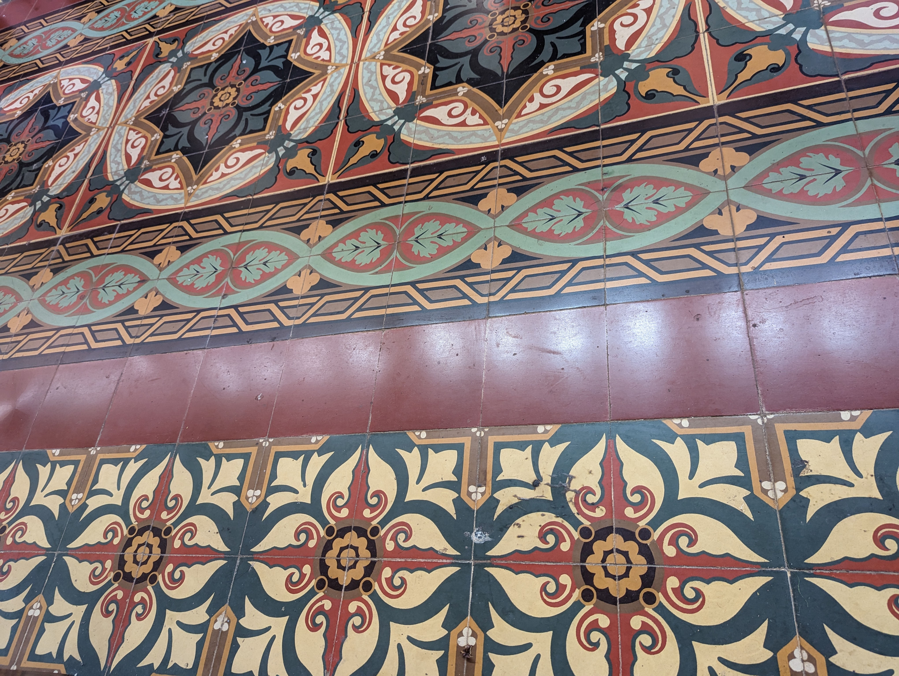

<br><details><summary>:camera:**46/PXL_20230407_163044348.jpg**</summary><sub> `Exif version` 0232 `OS version` HDR+ 1.0.514217843zd `Date` 2023:04:07 11:30:44 `Aperture` Not known `Brightness` 0.26 `Color space` 1 `Compression` 6`Exposure mode` 0 `Exposure time` 0.041997 `Focal length` 6.81 `Lens model` Pixel 6 back camera 6.81mm f/1.85 `Lens specification` Not known `Orientation` 1 `Scene type` Not known `f number` 1.85 `White balance` 0 `Sensing method` 2 `Shutter speed` 4.57</sub><sub>`Coordinates & altitude` (6.63645, -73.22368333333334, 1313.4)</sub><sub> :earth_americas:`Location over` [Google Maps](http://maps.google.com/maps?q=6.63645,-73.22368333333334) or [Openstreet Map](https://www.openstreetmap.org/query?lat=6.63645&lon=-73.22368333333334)</sub></details>

<br><details><summary>:camera:**46/PXL_20230407_163215740.MP.jpg**</summary><sub> `Exif version` 0232 `OS version` HDR+ 1.0.514217843zd `Date` 2023:04:07 11:32:15 `Aperture` Not known `Brightness` 1.35 `Color space` 1 `Compression` 6`Exposure mode` 0 `Exposure time` 0.007403 `Focal length` 6.81 `Lens model` Pixel 6 back camera 6.81mm f/1.85 `Lens specification` Not known `Orientation` 1 `Scene type` Not known `f number` 1.85 `White balance` 0 `Sensing method` 2 `Shutter speed` 7.08</sub><sub>`Coordinates & altitude` (6.636397222222222, -73.22370555555555, 1313.4)</sub><sub> :earth_americas:`Location over` [Google Maps](http://maps.google.com/maps?q=6.636397222222222,-73.22370555555555) or [Openstreet Map](https://www.openstreetmap.org/query?lat=6.636397222222222&lon=-73.22370555555555)</sub></details>

<br><details><summary>:camera:**46/PXL_20230407_163226341.MP.jpg**</summary><sub> `Exif version` 0232 `OS version` HDR+ 1.0.514217843zd `Date` 2023:04:07 11:32:26 `Aperture` Not known `Brightness` 2.1 `Color space` 1 `Compression` 6`Exposure mode` 0 `Exposure time` 0.033331 `Focal length` 6.81 `Lens model` Pixel 6 back camera 6.81mm f/1.85 `Lens specification` Not known `Orientation` 1 `Scene type` Not known `f number` 1.85 `White balance` 0 `Sensing method` 2 `Shutter speed` 4.91</sub><sub>`Coordinates & altitude` (6.636397222222222, -73.22370555555555, 1313.4)</sub><sub> :earth_americas:`Location over` [Google Maps](http://maps.google.com/maps?q=6.636397222222222,-73.22370555555555) or [Openstreet Map](https://www.openstreetmap.org/query?lat=6.636397222222222&lon=-73.22370555555555)</sub></details>

<br><details><summary>:camera:**46/PXL_20230407_163446227.jpg**</summary><sub> `Exif version` 0232 `OS version` HDR+ 1.0.514217843zd `Date` 2023:04:07 11:34:46 `Aperture` Not known `Brightness` 6.63 `Color space` 1 `Compression` 6`Exposure mode` 0 `Exposure time` 0.002518 `Focal length` 6.81 `Lens model` Pixel 6 back camera 6.81mm f/1.85 `Lens specification` Not known `Orientation` 1 `Scene type` Not known `f number` 1.85 `White balance` 0 `Sensing method` 2 `Shutter speed` 8.63</sub><sub>`Coordinates & altitude` (6.636394444444444, -73.22371111111111, 1311.41)</sub><sub> :earth_americas:`Location over` [Google Maps](http://maps.google.com/maps?q=6.636394444444444,-73.22371111111111) or [Openstreet Map](https://www.openstreetmap.org/query?lat=6.636394444444444&lon=-73.22371111111111)</sub></details>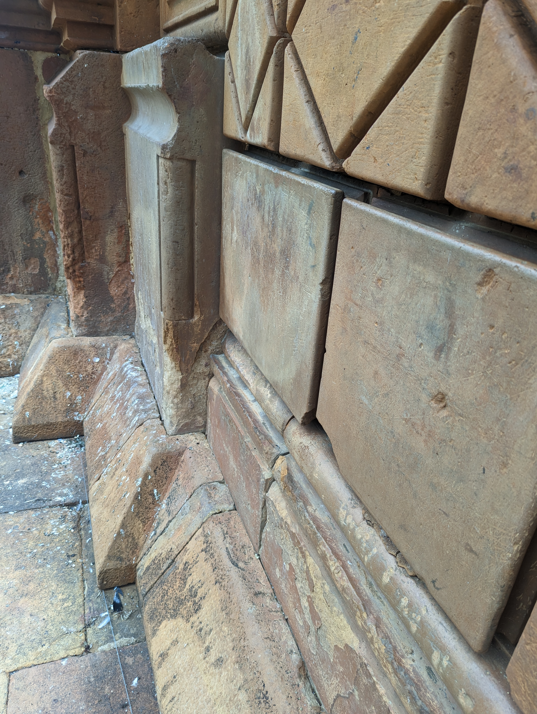

<br><details><summary>:camera:**46/PXL_20230407_163455936.jpg**</summary><sub> `Exif version` 0232 `OS version` HDR+ 1.0.514217843zd `Date` 2023:04:07 11:34:55 `Aperture` Not known `Brightness` 7.54 `Color space` 1 `Compression` 6`Exposure mode` 0 `Exposure time` 0.001307 `Focal length` 6.81 `Lens model` Pixel 6 back camera 6.81mm f/1.85 `Lens specification` Not known `Orientation` 1 `Scene type` Not known `f number` 1.85 `White balance` 0 `Sensing method` 2 `Shutter speed` 9.58</sub><sub>`Coordinates & altitude` (6.636394444444444, -73.22371111111111, 1311.41)</sub><sub> :earth_americas:`Location over` [Google Maps](http://maps.google.com/maps?q=6.636394444444444,-73.22371111111111) or [Openstreet Map](https://www.openstreetmap.org/query?lat=6.636394444444444&lon=-73.22371111111111)</sub></details>

<br><details><summary>:camera:**46/PXL_20230407_163502744.jpg**</summary><sub> `Exif version` 0232 `OS version` HDR+ 1.0.514217843zd `Date` 2023:04:07 11:35:02 `Aperture` Not known `Brightness` 10.29 `Color space` 1 `Compression` 6`Exposure mode` 0 `Exposure time` 0.000194 `Focal length` 6.81 `Lens model` Pixel 6 back camera 6.81mm f/1.85 `Lens specification` Not known `Orientation` 1 `Scene type` Not known `f number` 1.85 `White balance` 0 `Sensing method` 2 `Shutter speed` 12.33</sub><sub>`Coordinates & altitude` (6.636394444444444, -73.22371111111111, 1311.41)</sub><sub> :earth_americas:`Location over` [Google Maps](http://maps.google.com/maps?q=6.636394444444444,-73.22371111111111) or [Openstreet Map](https://www.openstreetmap.org/query?lat=6.636394444444444&lon=-73.22371111111111)</sub></details>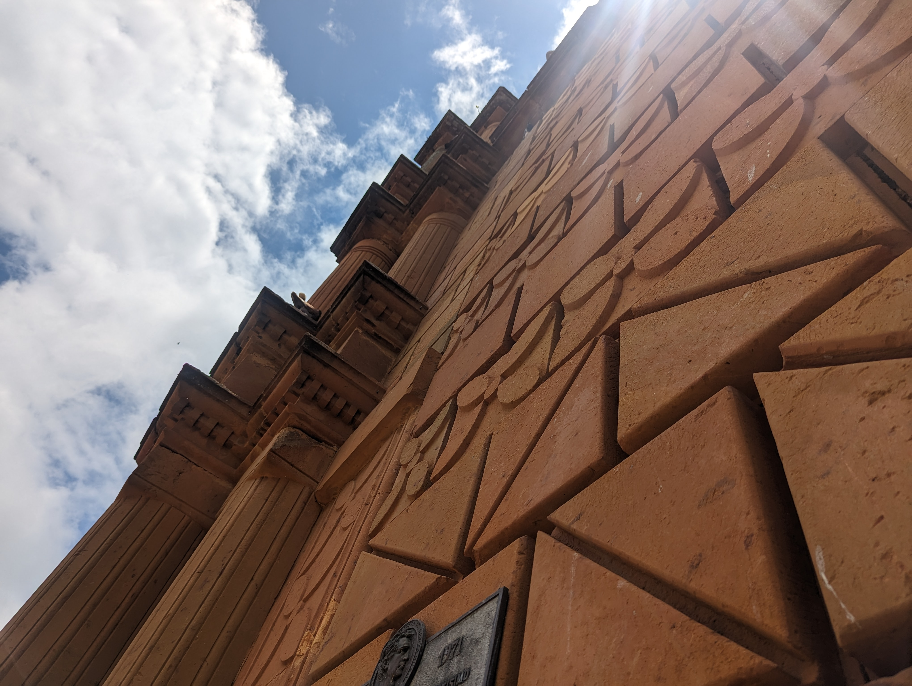

<br><details><summary>:camera:**46/PXL_20230407_163506196.jpg**</summary><sub> `Exif version` 0232 `OS version` HDR+ 1.0.514217843zd `Date` 2023:04:07 11:35:06 `Aperture` Not known `Brightness` 10.79 `Color space` 1 `Compression` 6`Exposure mode` 0 `Exposure time` 0.000124 `Focal length` 6.81 `Lens model` Pixel 6 back camera 6.81mm f/1.85 `Lens specification` Not known `Orientation` 1 `Scene type` Not known `f number` 1.85 `White balance` 0 `Sensing method` 2 `Shutter speed` 12.98</sub><sub>`Coordinates & altitude` (6.636394444444444, -73.22371111111111, 1311.41)</sub><sub> :earth_americas:`Location over` [Google Maps](http://maps.google.com/maps?q=6.636394444444444,-73.22371111111111) or [Openstreet Map](https://www.openstreetmap.org/query?lat=6.636394444444444&lon=-73.22371111111111)</sub></details>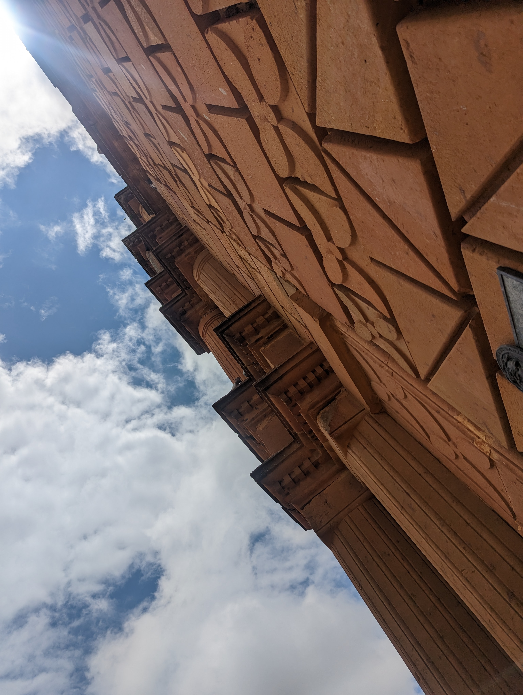

<br><details><summary>:camera:**46/PXL_20230407_163557366.jpg**</summary><sub> `Exif version` 0232 `OS version` HDR+ 1.0.514217843zd `Date` 2023:04:07 11:35:57 `Aperture` Not known `Brightness` 9.55 `Color space` 1 `Compression` 6`Exposure mode` 0 `Exposure time` 0.000318 `Focal length` 6.81 `Lens model` Pixel 6 back camera 6.81mm f/1.85 `Lens specification` Not known `Orientation` 1 `Scene type` Not known `f number` 1.85 `White balance` 0 `Sensing method` 2 `Shutter speed` 11.62</sub><sub>`Coordinates & altitude` (6.636255555555555, -73.22369444444445, 1299.4)</sub><sub> :earth_americas:`Location over` [Google Maps](http://maps.google.com/maps?q=6.636255555555555,-73.22369444444445) or [Openstreet Map](https://www.openstreetmap.org/query?lat=6.636255555555555&lon=-73.22369444444445)</sub></details>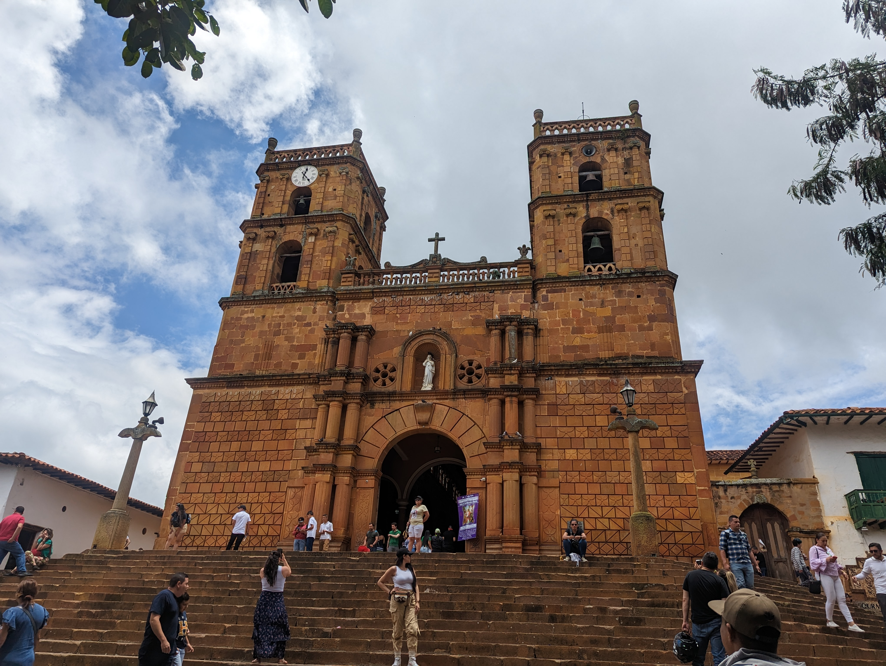

<br><details><summary>:camera:**46/PXL_20230407_163557366~2.jpg**</summary><sub> `Exif version` 0232 `OS version` HDR+ 1.0.514217843zd `Date` 2023:04:07 11:35:57 `Aperture` Not known `Brightness` 9.55 `Color space` 1 `Compression` 6`Exposure mode` 0 `Exposure time` 0.000318 `Focal length` 6.81 `Lens model` Pixel 6 back camera 6.81mm f/1.85 `Lens specification` Not known `Orientation` 1 `Scene type` Not known `f number` 1.85 `White balance` 0 `Sensing method` 2 `Shutter speed` 11.62</sub><sub>`Coordinates & altitude` (6.636255555555555, -73.22369444444445, 1299.4)</sub><sub> :earth_americas:`Location over` [Google Maps](http://maps.google.com/maps?q=6.636255555555555,-73.22369444444445) or [Openstreet Map](https://www.openstreetmap.org/query?lat=6.636255555555555&lon=-73.22369444444445)</sub></details>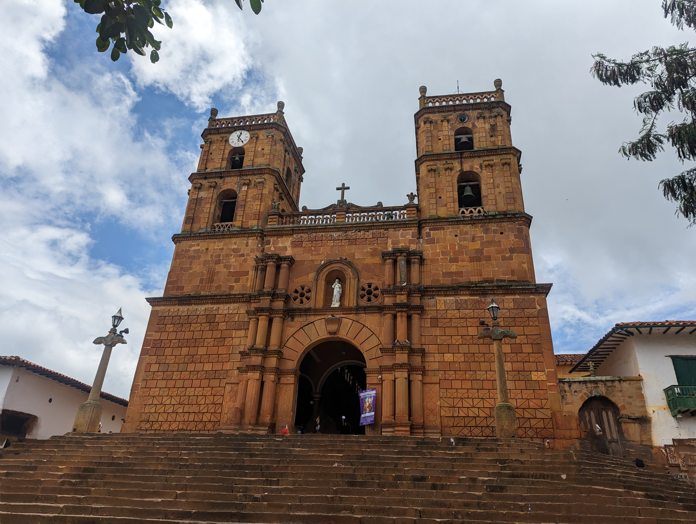

<br><details><summary>:camera:**46/PXL_20230407_163607888.jpg**</summary><sub> `Exif version` 0232 `OS version` HDR+ 1.0.514217843zd `Date` 2023:04:07 11:36:07 `Aperture` Not known `Brightness` 9.78 `Color space` 1 `Compression` 6`Exposure mode` 0 `Exposure time` 0.000283 `Focal length` 6.81 `Lens model` Pixel 6 back camera 6.81mm f/1.85 `Lens specification` Not known `Orientation` 1 `Scene type` Not known `f number` 1.85 `White balance` 0 `Sensing method` 2 `Shutter speed` 11.79</sub><sub>`Coordinates & altitude` (6.636255555555555, -73.22369444444445, 1299.4)</sub><sub> :earth_americas:`Location over` [Google Maps](http://maps.google.com/maps?q=6.636255555555555,-73.22369444444445) or [Openstreet Map](https://www.openstreetmap.org/query?lat=6.636255555555555&lon=-73.22369444444445)</sub></details>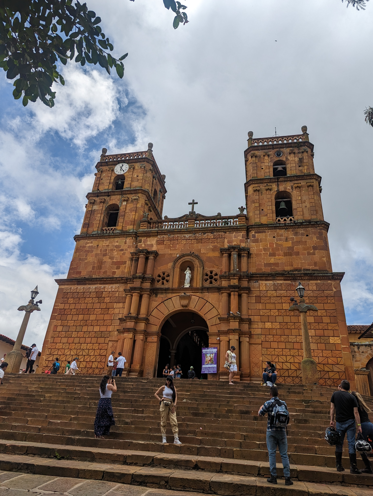

<br><details><summary>:camera:**46/PXL_20230407_163607888~2.jpg**</summary><sub> `Exif version` 0232 `OS version` HDR+ 1.0.514217843zd `Date` 2023:04:07 11:36:07 `Aperture` Not known `Brightness` 9.78 `Color space` 1 `Compression` 6`Exposure mode` 0 `Exposure time` 0.000283 `Focal length` 6.81 `Lens model` Pixel 6 back camera 6.81mm f/1.85 `Lens specification` Not known `Orientation` 1 `Scene type` Not known `f number` 1.85 `White balance` 0 `Sensing method` 2 `Shutter speed` 11.79</sub><sub>`Coordinates & altitude` (6.636255555555555, -73.22369444444445, 1299.4)</sub><sub> :earth_americas:`Location over` [Google Maps](http://maps.google.com/maps?q=6.636255555555555,-73.22369444444445) or [Openstreet Map](https://www.openstreetmap.org/query?lat=6.636255555555555&lon=-73.22369444444445)</sub></details>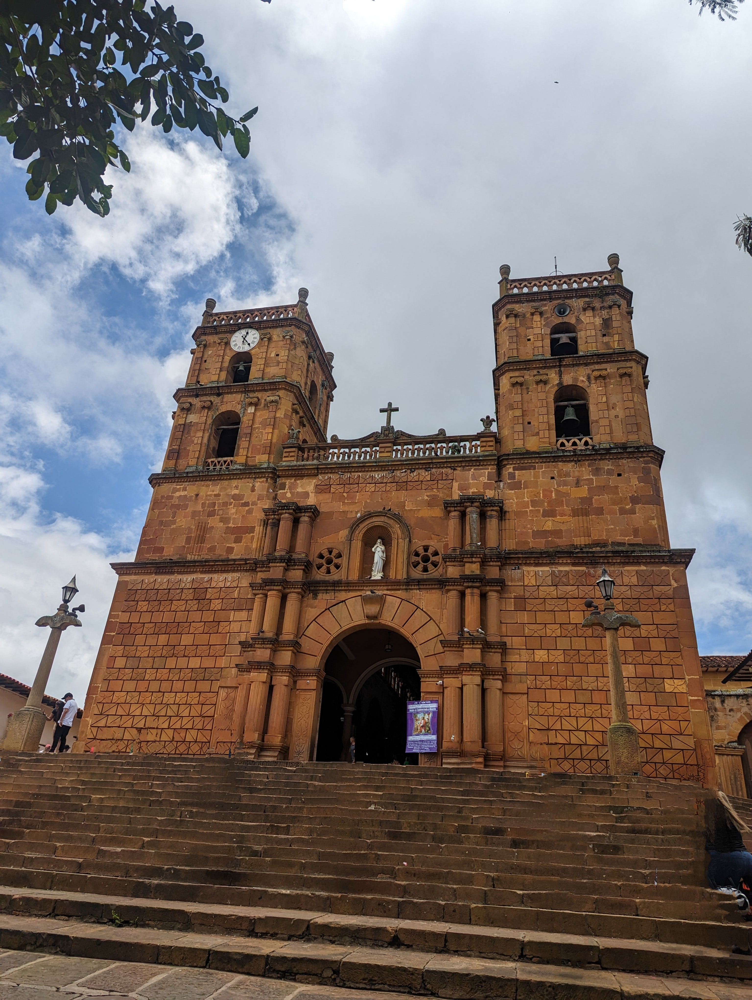

<br><details><summary>:camera:**46/PXL_20230407_163633846.MP.jpg**</summary><sub> `Exif version` 0232 `OS version` HDR+ 1.0.514217843zd `Date` 2023:04:07 11:36:33 `Aperture` Not known `Brightness` 8.88 `Color space` 1 `Compression` 6`Exposure mode` 0 `Exposure time` 0.000539 `Focal length` 6.81 `Lens model` Pixel 6 back camera 6.81mm f/1.85 `Lens specification` Not known `Orientation` 1 `Scene type` Not known `f number` 1.85 `White balance` 0 `Sensing method` 2 `Shutter speed` 10.86</sub><sub>`Coordinates & altitude` (6.636255555555555, -73.22369444444445, 1299.4)</sub><sub> :earth_americas:`Location over` [Google Maps](http://maps.google.com/maps?q=6.636255555555555,-73.22369444444445) or [Openstreet Map](https://www.openstreetmap.org/query?lat=6.636255555555555&lon=-73.22369444444445)</sub></details>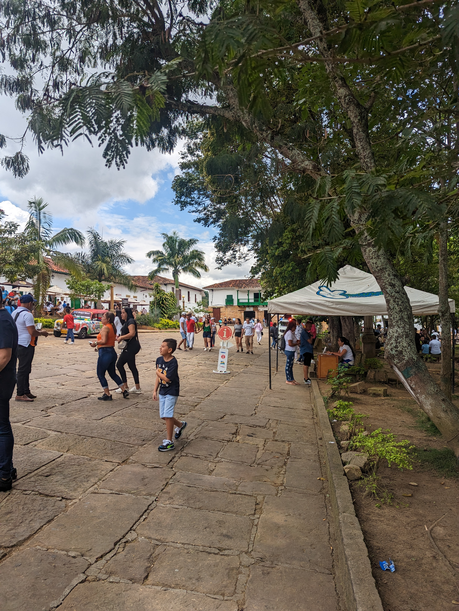

<br><details><summary>:camera:**46/PXL_20230407_170918506.jpg**</summary><sub> `Exif version` 0232 `OS version` HDR+ 1.0.514217843zd `Date` 2023:04:07 12:09:18 `Aperture` Not known `Brightness` 9.44 `Color space` 1 `Compression` 6`Exposure mode` 0 `Exposure time` 0.000336 `Focal length` 6.81 `Lens model` Pixel 6 back camera 6.81mm f/1.85 `Lens specification` Not known `Orientation` 1 `Scene type` Not known `f number` 1.85 `White balance` 0 `Sensing method` 2 `Shutter speed` 11.54</sub><sub>`Coordinates & altitude` (6.63735, -73.22309444444444, 1313.59)</sub><sub> :earth_americas:`Location over` [Google Maps](http://maps.google.com/maps?q=6.63735,-73.22309444444444) or [Openstreet Map](https://www.openstreetmap.org/query?lat=6.63735&lon=-73.22309444444444)</sub></details>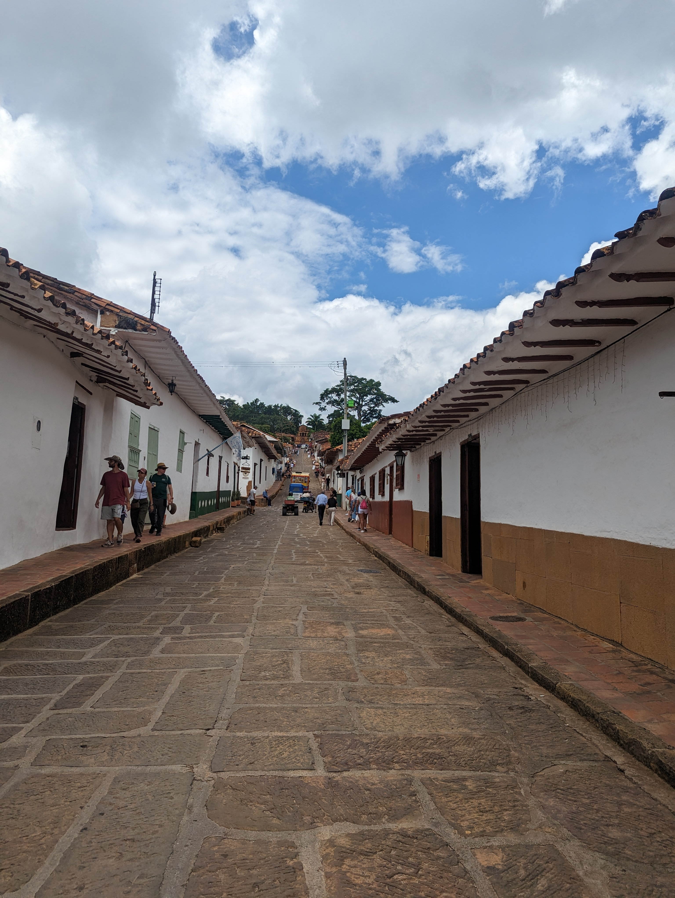

<br><details><summary>:camera:**46/PXL_20230407_170933071.jpg**</summary><sub> `Exif version` 0232 `OS version` HDR+ 1.0.514217843zd `Date` 2023:04:07 12:09:33 `Aperture` Not known `Brightness` 9.19 `Color space` 1 `Compression` 6`Exposure mode` 0 `Exposure time` 0.000415 `Focal length` 6.81 `Lens model` Pixel 6 back camera 6.81mm f/1.85 `Lens specification` Not known `Orientation` 1 `Scene type` Not known `f number` 1.85 `White balance` 0 `Sensing method` 2 `Shutter speed` 11.23</sub><sub>`Coordinates & altitude` (6.63735, -73.22309444444444, 1313.59)</sub><sub> :earth_americas:`Location over` [Google Maps](http://maps.google.com/maps?q=6.63735,-73.22309444444444) or [Openstreet Map](https://www.openstreetmap.org/query?lat=6.63735&lon=-73.22309444444444)</sub></details>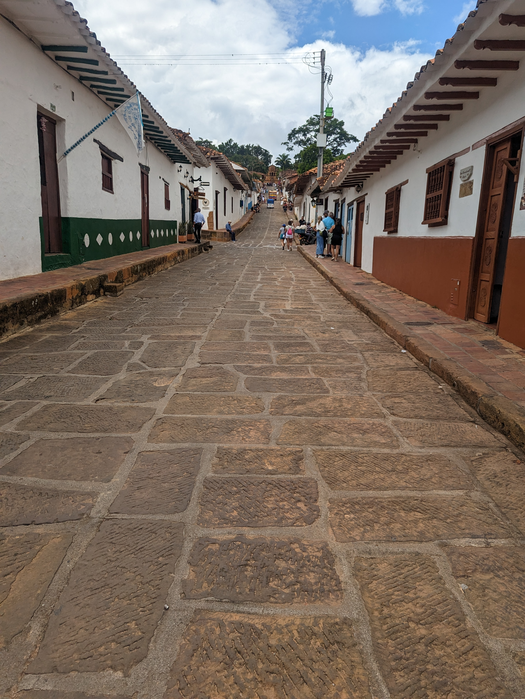

<br><details><summary>:camera:**46/PXL_20230407_170934473.jpg**</summary><sub> `Exif version` 0232 `OS version` HDR+ 1.0.514217843zd `Date` 2023:04:07 12:09:34 `Aperture` Not known `Brightness` 9.2 `Color space` 1 `Compression` 6`Exposure mode` 0 `Exposure time` 0.000433 `Focal length` 6.81 `Lens model` Pixel 6 back camera 6.81mm f/1.85 `Lens specification` Not known `Orientation` 1 `Scene type` Not known `f number` 1.85 `White balance` 0 `Sensing method` 2 `Shutter speed` 11.17</sub><sub>`Coordinates & altitude` (6.63735, -73.22309444444444, 1313.59)</sub><sub> :earth_americas:`Location over` [Google Maps](http://maps.google.com/maps?q=6.63735,-73.22309444444444) or [Openstreet Map](https://www.openstreetmap.org/query?lat=6.63735&lon=-73.22309444444444)</sub></details>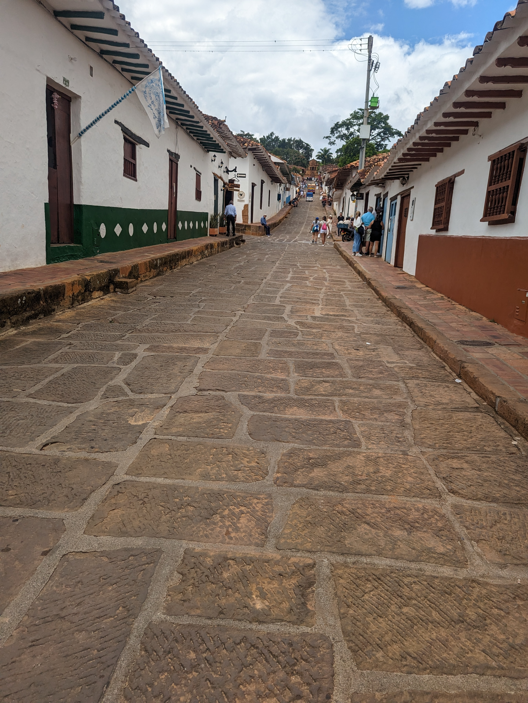

<br><details><summary>:camera:**46/PXL_20230407_171733760.jpg**</summary><sub> `Exif version` 0232 `OS version` HDR+ 1.0.520435816zd `Date` 2023:04:07 12:17:33 `Aperture` Not known `Brightness` 9.46 `Color space` 1 `Compression` 6`Exposure mode` 0 `Exposure time` 0.000345 `Focal length` 6.81 `Lens model` Pixel 6 back camera 6.81mm f/1.85 `Lens specification` Not known `Orientation` 1 `Scene type` Not known `f number` 1.85 `White balance` 0 `Sensing method` 2 `Shutter speed` 11.5</sub><sub>`Coordinates & altitude` (6.635233333333333, -73.22179444444444, 1347.42)</sub><sub> :earth_americas:`Location over` [Google Maps](http://maps.google.com/maps?q=6.635233333333333,-73.22179444444444) or [Openstreet Map](https://www.openstreetmap.org/query?lat=6.635233333333333&lon=-73.22179444444444)</sub></details>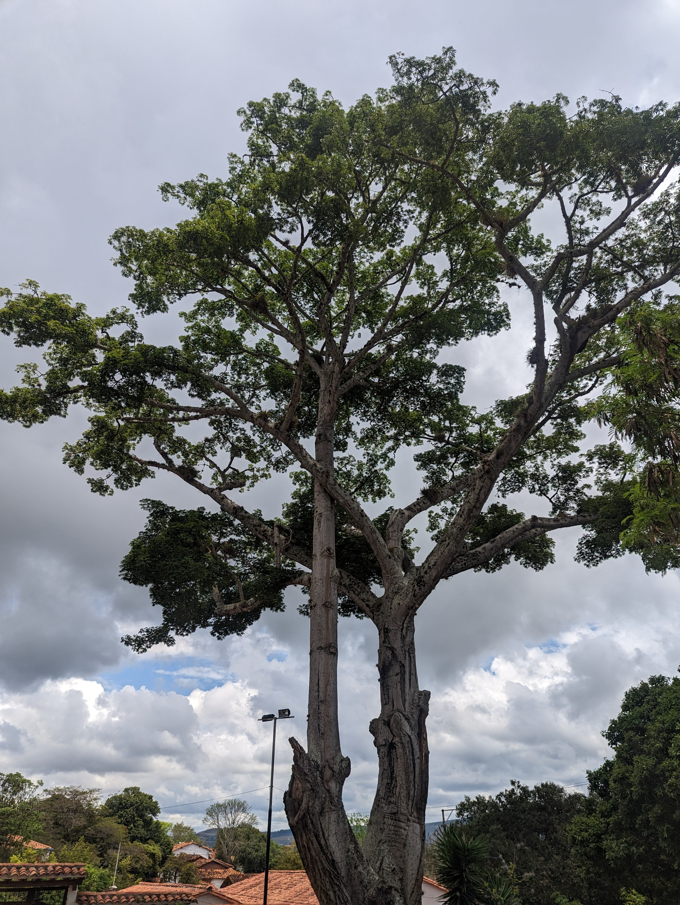

<br><details><summary>:camera:**46/PXL_20230407_171741604.jpg**</summary><sub> `Exif version` 0232 `OS version` HDR+ 1.0.520435816zd `Date` 2023:04:07 12:17:41 `Aperture` Not known `Brightness` 9.75 `Color space` 1 `Compression` 6`Exposure mode` 0 `Exposure time` 0.000327 `Focal length` 6.81 `Lens model` Pixel 6 back camera 6.81mm f/1.85 `Lens specification` Not known `Orientation` 1 `Scene type` Not known `f number` 1.85 `White balance` 0 `Sensing method` 2 `Shutter speed` 11.58</sub><sub>`Coordinates & altitude` (6.635233333333333, -73.22179444444444, 1347.42)</sub><sub> :earth_americas:`Location over` [Google Maps](http://maps.google.com/maps?q=6.635233333333333,-73.22179444444444) or [Openstreet Map](https://www.openstreetmap.org/query?lat=6.635233333333333&lon=-73.22179444444444)</sub></details>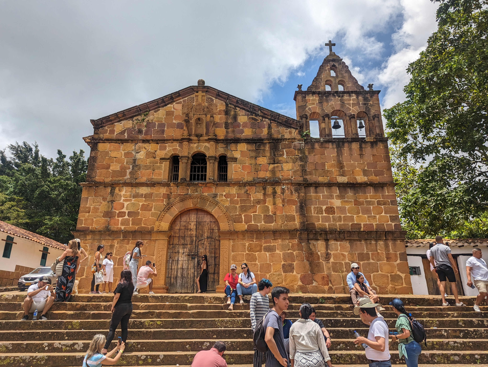

<br><details><summary>:camera:**46/PXL_20230407_171835957.jpg**</summary><sub> `Exif version` 0232 `OS version` HDR+ 1.0.520435816zd `Date` 2023:04:07 12:18:35 `Aperture` Not known `Brightness` 8.78 `Color space` 1 `Compression` 6`Exposure mode` 0 `Exposure time` 0.000539 `Focal length` 6.81 `Lens model` Pixel 6 back camera 6.81mm f/1.85 `Lens specification` Not known `Orientation` 1 `Scene type` Not known `f number` 1.85 `White balance` 0 `Sensing method` 2 `Shutter speed` 10.86</sub><sub>`Coordinates & altitude` (6.6399833333333325, -73.22316666666667, 1339.59)</sub><sub> :earth_americas:`Location over` [Google Maps](http://maps.google.com/maps?q=6.6399833333333325,-73.22316666666667) or [Openstreet Map](https://www.openstreetmap.org/query?lat=6.6399833333333325&lon=-73.22316666666667)</sub></details>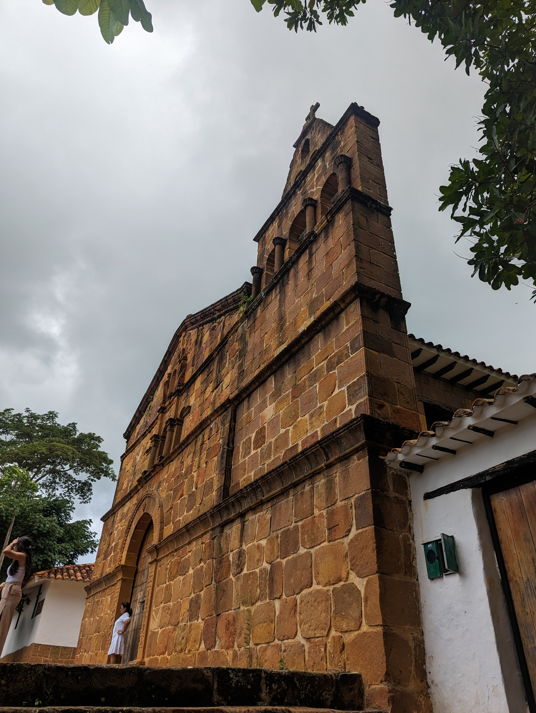

<br><details><summary>:camera:**46/PXL_20230407_172239683.jpg**</summary><sub> `Exif version` 0232 `OS version` HDR+ 1.0.520435816zd `Date` 2023:04:07 12:22:39 `Aperture` Not known `Brightness` 8.9 `Color space` 1 `Compression` 6`Exposure mode` 0 `Exposure time` 0.000521 `Focal length` 6.81 `Lens model` Pixel 6 back camera 6.81mm f/1.85 `Lens specification` Not known `Orientation` 1 `Scene type` Not known `f number` 1.85 `White balance` 0 `Sensing method` 2 `Shutter speed` 10.91</sub><sub>`Coordinates & altitude` (6.6399027777777775, -73.2230388888889, 1343.09)</sub><sub> :earth_americas:`Location over` [Google Maps](http://maps.google.com/maps?q=6.6399027777777775,-73.2230388888889) or [Openstreet Map](https://www.openstreetmap.org/query?lat=6.6399027777777775&lon=-73.2230388888889)</sub></details>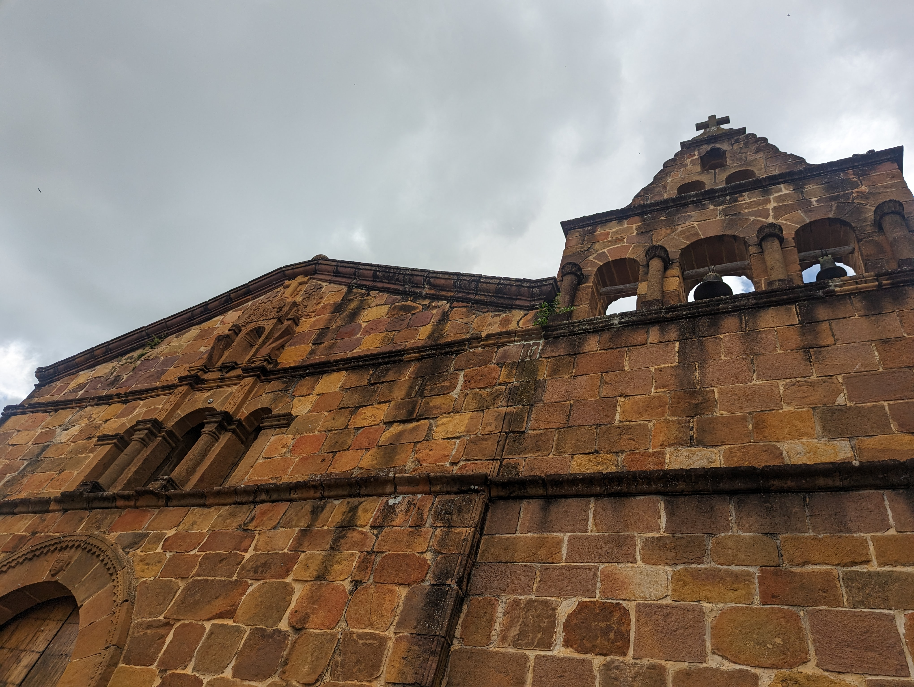

<br><details><summary>:camera:**46/PXL_20230407_172243723.jpg**</summary><sub> `Exif version` 0232 `OS version` HDR+ 1.0.520435816zd `Date` 2023:04:07 12:22:43 `Aperture` Not known `Brightness` 7.53 `Color space` 1 `Compression` 6`Exposure mode` 0 `Exposure time` 0.001519 `Focal length` 6.81 `Lens model` Pixel 6 back camera 6.81mm f/1.85 `Lens specification` Not known `Orientation` 1 `Scene type` Not known `f number` 1.85 `White balance` 0 `Sensing method` 2 `Shutter speed` 9.36</sub><sub>`Coordinates & altitude` (6.6399027777777775, -73.2230388888889, 1343.09)</sub><sub> :earth_americas:`Location over` [Google Maps](http://maps.google.com/maps?q=6.6399027777777775,-73.2230388888889) or [Openstreet Map](https://www.openstreetmap.org/query?lat=6.6399027777777775&lon=-73.2230388888889)</sub></details>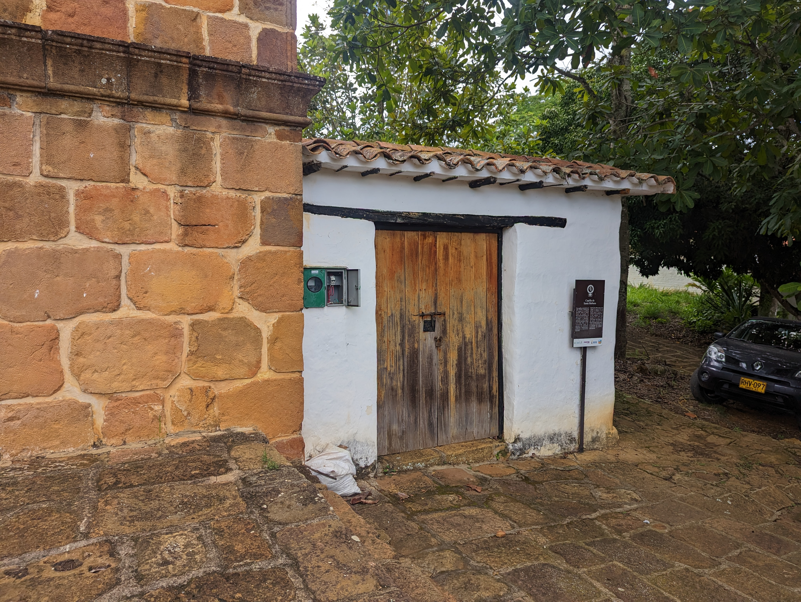

<br><details><summary>:camera:**46/PXL_20230407_172636145.jpg**</summary><sub> `Exif version` 0232 `OS version` HDR+ 1.0.520435816zd `Date` 2023:04:07 12:26:36 `Aperture` Not known `Brightness` 9.19 `Color space` 1 `Compression` 6`Exposure mode` 0 `Exposure time` 0.000406 `Focal length` 6.81 `Lens model` Pixel 6 back camera 6.81mm f/1.85 `Lens specification` Not known `Orientation` 1 `Scene type` Not known `f number` 1.85 `White balance` 0 `Sensing method` 2 `Shutter speed` 11.26</sub><sub>`Coordinates & altitude` (6.639863888888889, -73.22427222222223, 1343.09)</sub><sub> :earth_americas:`Location over` [Google Maps](http://maps.google.com/maps?q=6.639863888888889,-73.22427222222223) or [Openstreet Map](https://www.openstreetmap.org/query?lat=6.639863888888889&lon=-73.22427222222223)</sub></details>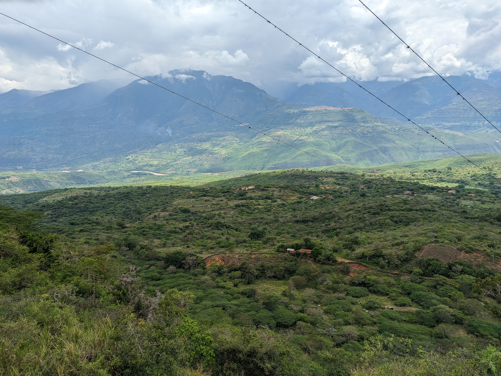

<br><details><summary>:camera:**46/PXL_20230407_172801292.jpg**</summary><sub> `Exif version` 0232 `OS version` HDR+ 1.0.520435816zd `Date` 2023:04:07 12:28:01 `Aperture` Not known `Brightness` 9.19 `Color space` 1 `Compression` 6`Exposure mode` 0 `Exposure time` 0.000415 `Focal length` 6.81 `Lens model` Pixel 6 back camera 6.81mm f/1.85 `Lens specification` Not known `Orientation` 1 `Scene type` Not known `f number` 1.85 `White balance` 0 `Sensing method` 2 `Shutter speed` 11.23</sub><sub>`Coordinates & altitude` (6.639863888888889, -73.22427222222223, 1343.09)</sub><sub> :earth_americas:`Location over` [Google Maps](http://maps.google.com/maps?q=6.639863888888889,-73.22427222222223) or [Openstreet Map](https://www.openstreetmap.org/query?lat=6.639863888888889&lon=-73.22427222222223)</sub></details>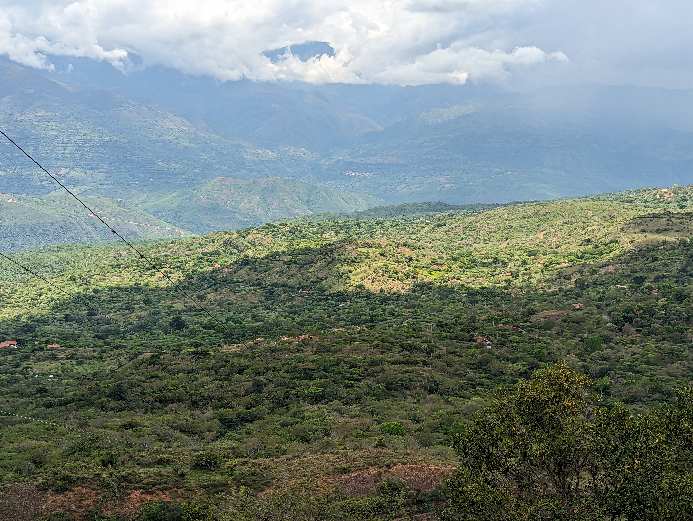

<br><details><summary>:camera:**46/PXL_20230407_173839065.jpg**</summary><sub> `Exif version` 0232 `OS version` HDR+ 1.0.520435816zd `Date` 2023:04:07 12:38:39 `Aperture` Not known `Brightness` 7.87 `Color space` 1 `Compression` 6`Exposure mode` 0 `Exposure time` 0.001087 `Focal length` 6.81 `Lens model` Pixel 6 back camera 6.81mm f/1.85 `Lens specification` Not known `Orientation` 1 `Scene type` Not known `f number` 1.85 `White balance` 0 `Sensing method` 2 `Shutter speed` 9.85</sub><sub>`Coordinates & altitude` (6.639975, -73.223275, 1340.7)</sub><sub> :earth_americas:`Location over` [Google Maps](http://maps.google.com/maps?q=6.639975,-73.223275) or [Openstreet Map](https://www.openstreetmap.org/query?lat=6.639975&lon=-73.223275)</sub></details>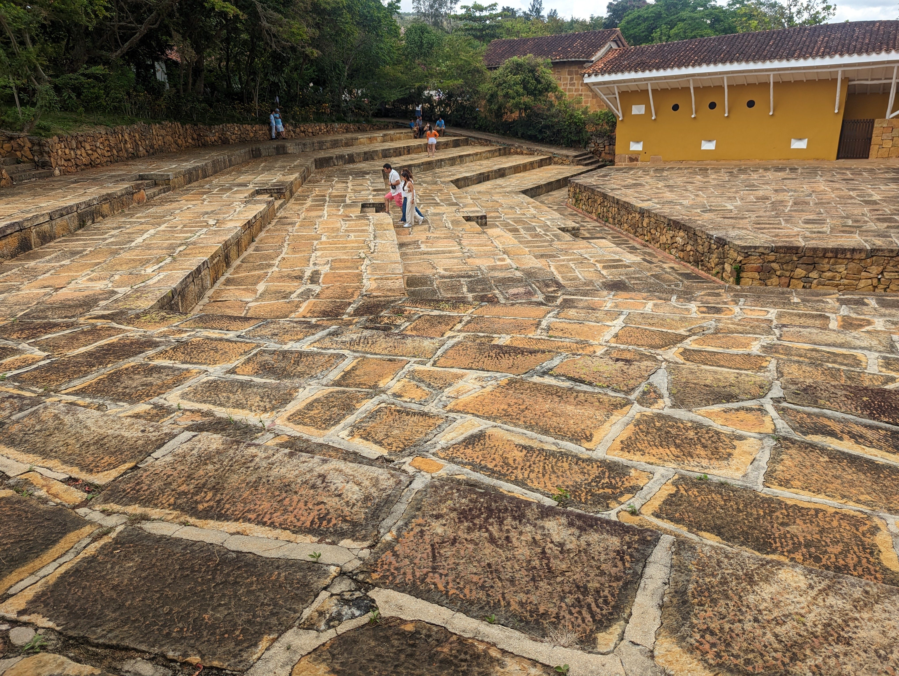

<br><details><summary>:camera:**46/PXL_20230407_173842940.jpg**</summary><sub> `Exif version` 0232 `OS version` HDR+ 1.0.520435816zd `Date` 2023:04:07 12:38:42 `Aperture` Not known `Brightness` 9.39 `Color space` 1 `Compression` 6`Exposure mode` 0 `Exposure time` 0.000353 `Focal length` 6.81 `Lens model` Pixel 6 back camera 6.81mm f/1.85 `Lens specification` Not known `Orientation` 1 `Scene type` Not known `f number` 1.85 `White balance` 0 `Sensing method` 2 `Shutter speed` 11.47</sub><sub>`Coordinates & altitude` (6.639975, -73.223275, 1340.7)</sub><sub> :earth_americas:`Location over` [Google Maps](http://maps.google.com/maps?q=6.639975,-73.223275) or [Openstreet Map](https://www.openstreetmap.org/query?lat=6.639975&lon=-73.223275)</sub></details>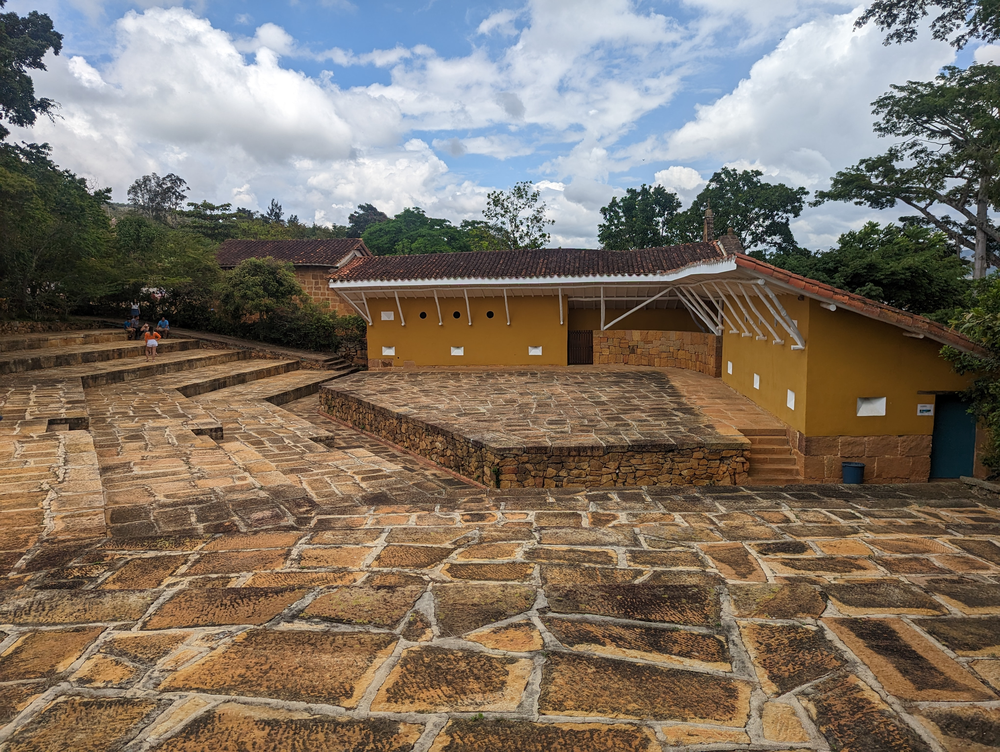

<br><details><summary>:camera:**46/PXL_20230407_173851360.jpg**</summary><sub> `Exif version` 0232 `OS version` HDR+ 1.0.520435816zd `Date` 2023:04:07 12:38:51 `Aperture` Not known `Brightness` 5.58 `Color space` 1 `Compression` 6`Exposure mode` 0 `Exposure time` 0.005194 `Focal length` 6.81 `Lens model` Pixel 6 back camera 6.81mm f/1.85 `Lens specification` Not known `Orientation` 1 `Scene type` Not known `f number` 1.85 `White balance` 0 `Sensing method` 2 `Shutter speed` 7.59</sub><sub>`Coordinates & altitude` (6.639975, -73.223275, 1340.7)</sub><sub> :earth_americas:`Location over` [Google Maps](http://maps.google.com/maps?q=6.639975,-73.223275) or [Openstreet Map](https://www.openstreetmap.org/query?lat=6.639975&lon=-73.223275)</sub></details>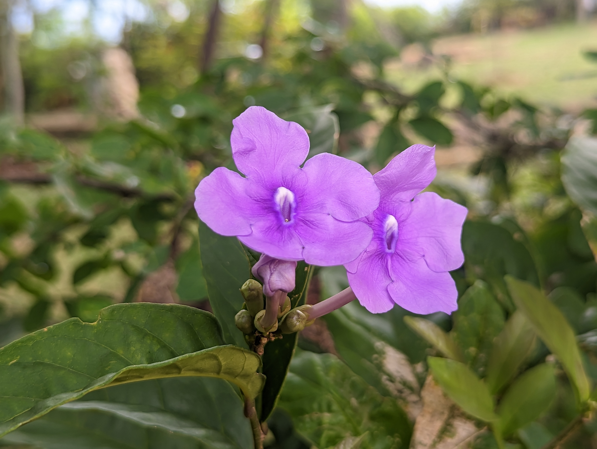

<br><details><summary>:camera:**46/PXL_20230407_174139371.jpg**</summary><sub> `Exif version` 0232 `OS version` HDR+ 1.0.520435816zd `Date` 2023:04:07 12:41:39 `Aperture` Not known `Brightness` 9.47 `Color space` 1 `Compression` 6`Exposure mode` 0 `Exposure time` 0.000336 `Focal length` 6.81 `Lens model` Pixel 6 back camera 6.81mm f/1.85 `Lens specification` Not known `Orientation` 1 `Scene type` Not known `f number` 1.85 `White balance` 0 `Sensing method` 2 `Shutter speed` 11.54</sub><sub>`Coordinates & altitude` (6.640552777777777, -73.22349722222222, 1340.7)</sub><sub> :earth_americas:`Location over` [Google Maps](http://maps.google.com/maps?q=6.640552777777777,-73.22349722222222) or [Openstreet Map](https://www.openstreetmap.org/query?lat=6.640552777777777&lon=-73.22349722222222)</sub></details>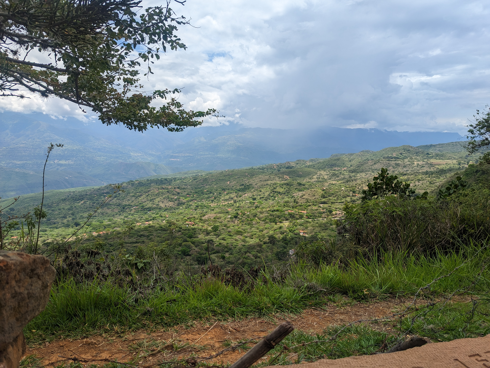

<br><details><summary>:camera:**46/PXL_20230407_174147707.jpg**</summary><sub> `Exif version` 0232 `OS version` HDR+ 1.0.520435816zd `Date` 2023:04:07 12:41:47 `Aperture` Not known `Brightness` 9.29 `Color space` 1 `Compression` 6`Exposure mode` 0 `Exposure time` 0.000389 `Focal length` 6.81 `Lens model` Pixel 6 back camera 6.81mm f/1.85 `Lens specification` Not known `Orientation` 1 `Scene type` Not known `f number` 1.85 `White balance` 0 `Sensing method` 2 `Shutter speed` 11.33</sub><sub>`Coordinates & altitude` (6.640552777777777, -73.22349722222222, 1340.7)</sub><sub> :earth_americas:`Location over` [Google Maps](http://maps.google.com/maps?q=6.640552777777777,-73.22349722222222) or [Openstreet Map](https://www.openstreetmap.org/query?lat=6.640552777777777&lon=-73.22349722222222)</sub></details>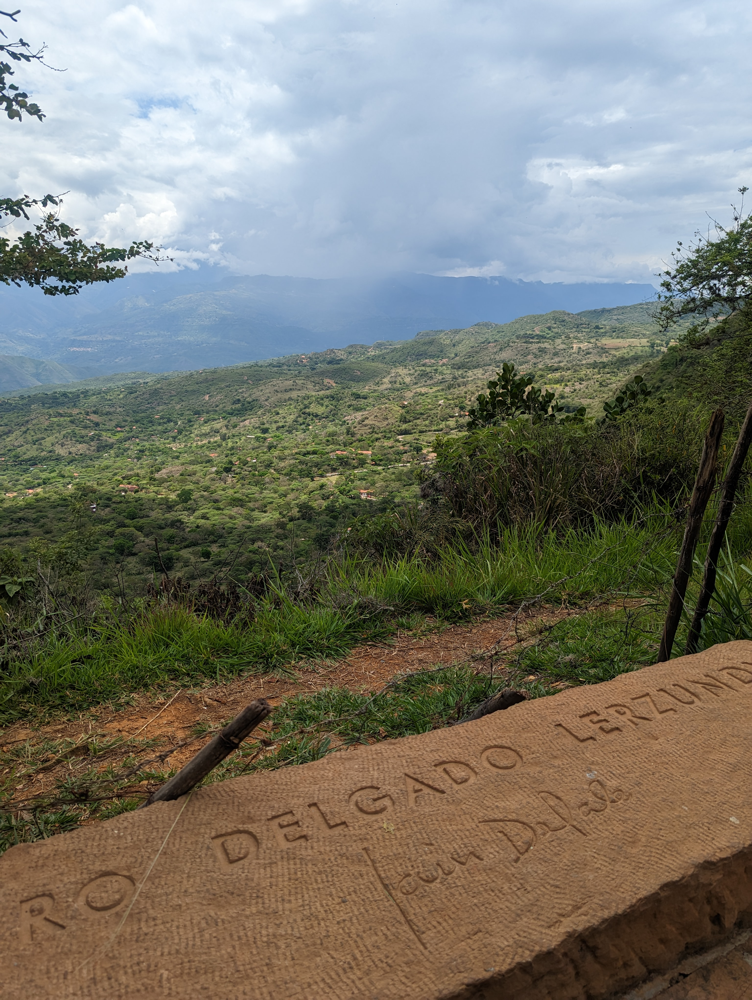

<br><details><summary>:camera:**46/PXL_20230407_175053931.jpg**</summary><sub> `Exif version` 0232 `OS version` HDR+ 1.0.520435816zd `Date` 2023:04:07 12:50:53 `Aperture` Not known `Brightness` 9.61 `Color space` 1 `Compression` 6`Exposure mode` 0 `Exposure time` 0.000292 `Focal length` 6.81 `Lens model` Pixel 6 back camera 6.81mm f/1.85 `Lens specification` Not known `Orientation` 1 `Scene type` Not known `f number` 1.85 `White balance` 0 `Sensing method` 2 `Shutter speed` 11.74</sub><sub>`Coordinates & altitude` (6.640177777777778, -73.22338888888889, 1340.7)</sub><sub> :earth_americas:`Location over` [Google Maps](http://maps.google.com/maps?q=6.640177777777778,-73.22338888888889) or [Openstreet Map](https://www.openstreetmap.org/query?lat=6.640177777777778&lon=-73.22338888888889)</sub></details>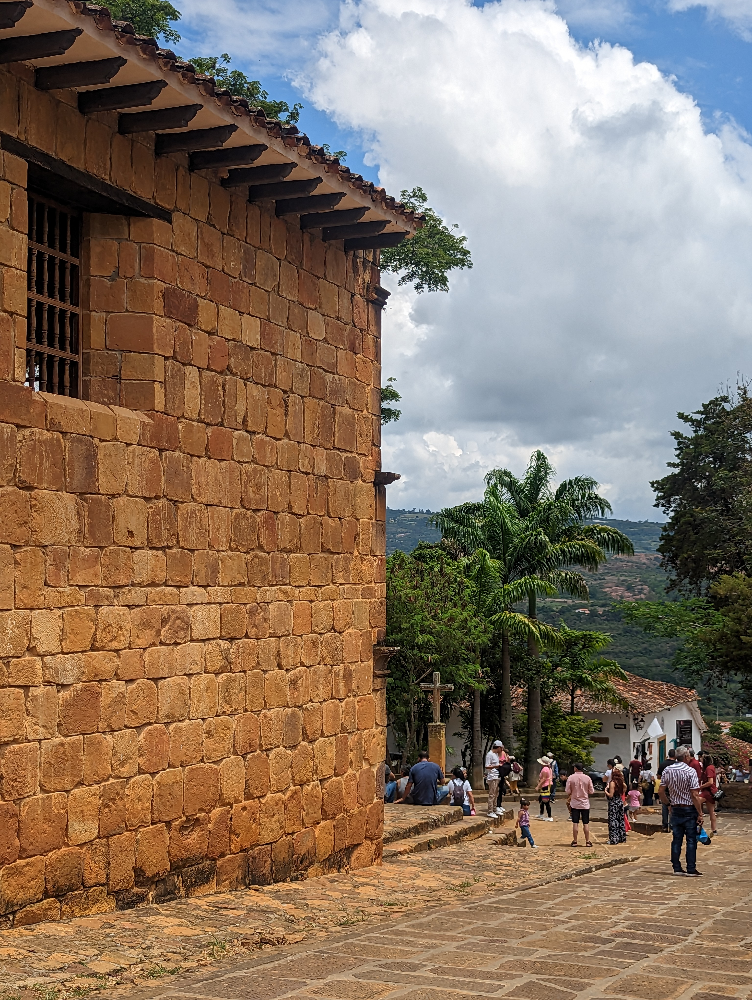

<br><details><summary>:camera:**46/PXL_20230407_204654144.jpg**</summary><sub> `Exif version` 0232 `OS version` HDR+ 1.0.520435816zd `Date` 2023:04:07 15:46:54 `Aperture` Not known `Brightness` 8.78 `Color space` 1 `Compression` 6`Exposure mode` 0 `Exposure time` 0.000592 `Focal length` 6.81 `Lens model` Pixel 6 back camera 6.81mm f/1.85 `Lens specification` Not known `Orientation` 1 `Scene type` Not known `f number` 1.85 `White balance` 0 `Sensing method` 2 `Shutter speed` 10.72</sub><sub>`Coordinates & altitude` (6.632416666666667, -73.22808888888889, 1306.4)</sub><sub> :earth_americas:`Location over` [Google Maps](http://maps.google.com/maps?q=6.632416666666667,-73.22808888888889) or [Openstreet Map](https://www.openstreetmap.org/query?lat=6.632416666666667&lon=-73.22808888888889)</sub></details>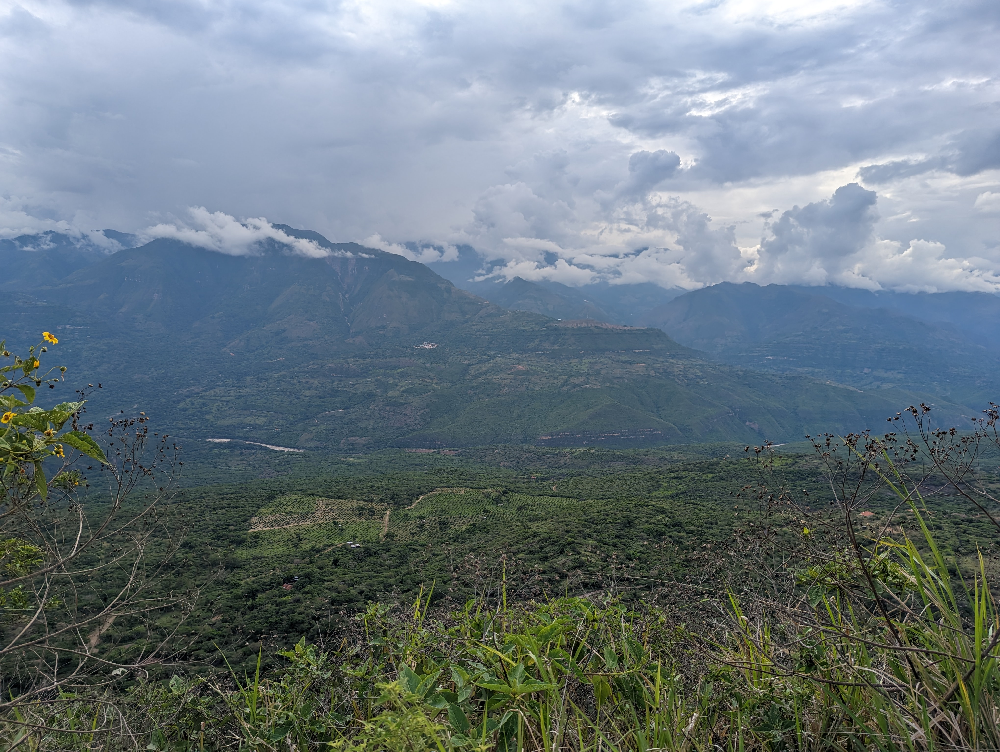

<br><details><summary>:camera:**46/PXL_20230407_204656313.jpg**</summary><sub> `Exif version` 0232 `OS version` HDR+ 1.0.520435816zd `Date` 2023:04:07 15:46:56 `Aperture` Not known `Brightness` 9.92 `Color space` 1 `Compression` 6`Exposure mode` 0 `Exposure time` 0.00023 `Focal length` 6.81 `Lens model` Pixel 6 back camera 6.81mm f/1.85 `Lens specification` Not known `Orientation` 1 `Scene type` Not known `f number` 1.85 `White balance` 0 `Sensing method` 2 `Shutter speed` 12.09</sub><sub>`Coordinates & altitude` (6.631983333333334, -73.22833888888889, 1307.7)</sub><sub> :earth_americas:`Location over` [Google Maps](http://maps.google.com/maps?q=6.631983333333334,-73.22833888888889) or [Openstreet Map](https://www.openstreetmap.org/query?lat=6.631983333333334&lon=-73.22833888888889)</sub></details>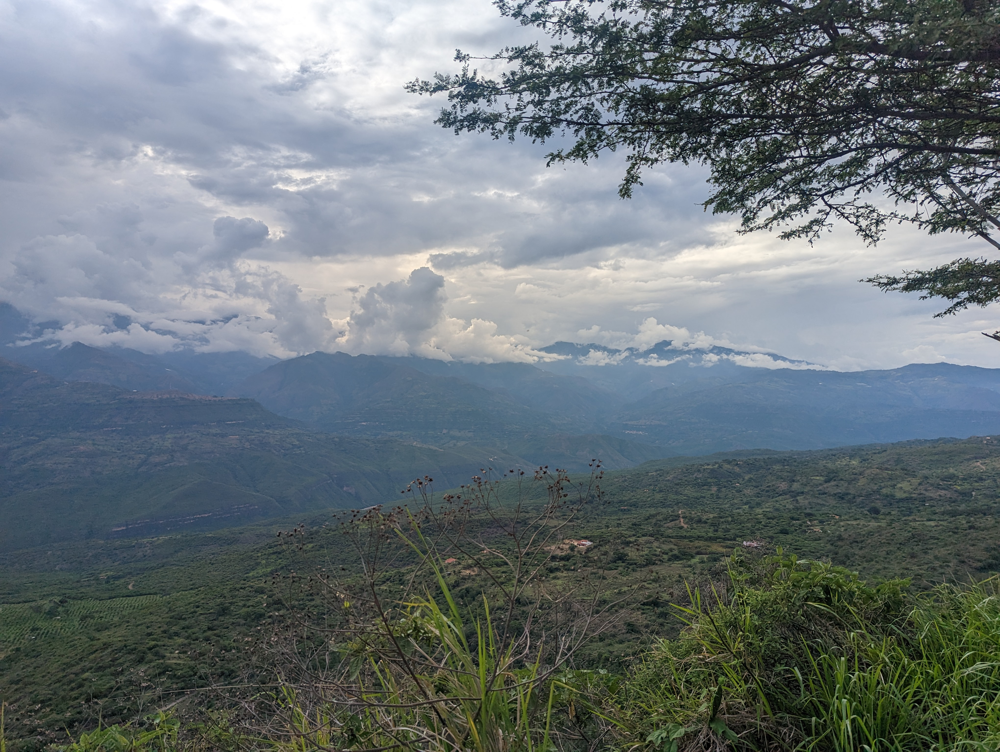

<br><details><summary>:camera:**46/PXL_20230407_204700319.jpg**</summary><sub> `Exif version` 0232 `OS version` HDR+ 1.0.520435816zd `Date` 2023:04:07 15:47:00 `Aperture` Not known `Brightness` 10.13 `Color space` 1 `Compression` 6`Exposure mode` 0 `Exposure time` 0.000212 `Focal length` 6.81 `Lens model` Pixel 6 back camera 6.81mm f/1.85 `Lens specification` Not known `Orientation` 1 `Scene type` Not known `f number` 1.85 `White balance` 0 `Sensing method` 2 `Shutter speed` 12.2</sub><sub>`Coordinates & altitude` (6.631983333333334, -73.22833888888889, 1307.7)</sub><sub> :earth_americas:`Location over` [Google Maps](http://maps.google.com/maps?q=6.631983333333334,-73.22833888888889) or [Openstreet Map](https://www.openstreetmap.org/query?lat=6.631983333333334&lon=-73.22833888888889)</sub></details>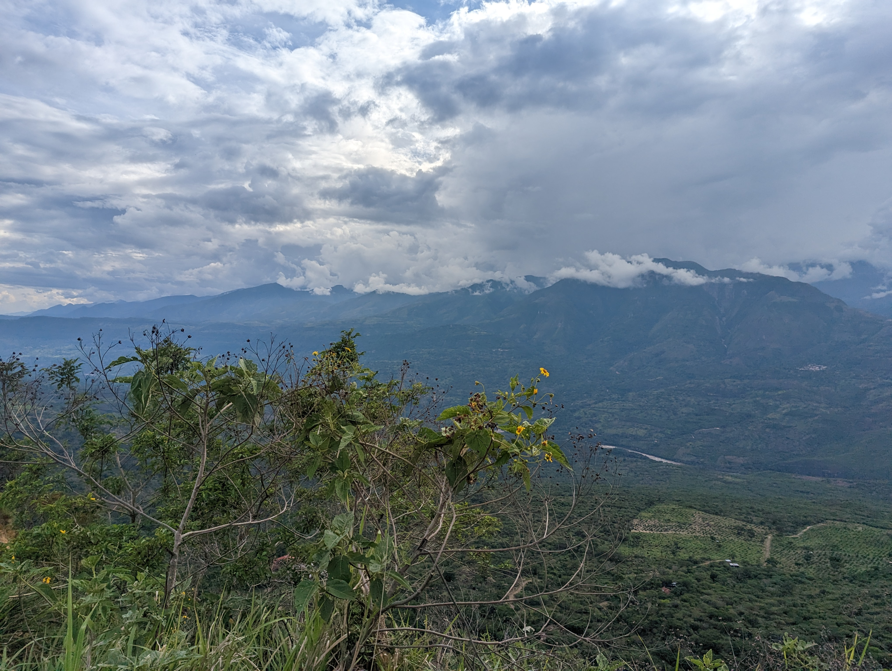

<br><details><summary>:camera:**46/PXL_20230407_204850517.MP.jpg**</summary><sub> `Exif version` 0232 `OS version` HDR+ 1.0.520435816zd `Date` 2023:04:07 15:48:50 `Aperture` Not known `Brightness` 9.39 `Color space` 1 `Compression` 6`Exposure mode` 0 `Exposure time` 0.000353 `Focal length` 6.81 `Lens model` Pixel 6 back camera 6.81mm f/1.85 `Lens specification` Not known `Orientation` 1 `Scene type` Not known `f number` 1.85 `White balance` 0 `Sensing method` 2 `Shutter speed` 11.47</sub><sub>`Coordinates & altitude` (6.631186111111112, -73.22861388888889, 1307.7)</sub><sub> :earth_americas:`Location over` [Google Maps](http://maps.google.com/maps?q=6.631186111111112,-73.22861388888889) or [Openstreet Map](https://www.openstreetmap.org/query?lat=6.631186111111112&lon=-73.22861388888889)</sub></details>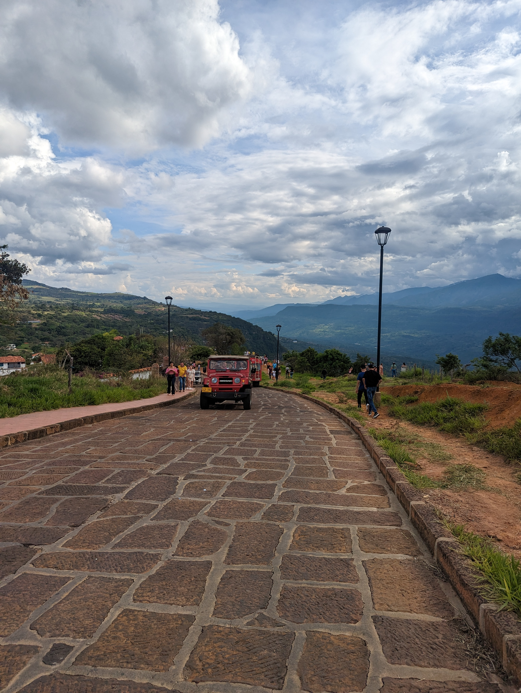

<br><details><summary>:camera:**46/PXL_20230407_205103474.jpg**</summary><sub> `Exif version` 0232 `OS version` HDR+ 1.0.520435816zd `Date` 2023:04:07 15:51:03 `Aperture` Not known `Brightness` 7.79 `Color space` 1 `Compression` 6`Exposure mode` 0 `Exposure time` 0.001122 `Focal length` 6.81 `Lens model` Pixel 6 back camera 6.81mm f/1.85 `Lens specification` Not known `Orientation` 1 `Scene type` Not known `f number` 1.85 `White balance` 0 `Sensing method` 2 `Shutter speed` 9.8</sub><sub>`Coordinates & altitude` (6.630819444444445, -73.22894444444445, 1307.7)</sub><sub> :earth_americas:`Location over` [Google Maps](http://maps.google.com/maps?q=6.630819444444445,-73.22894444444445) or [Openstreet Map](https://www.openstreetmap.org/query?lat=6.630819444444445&lon=-73.22894444444445)</sub></details>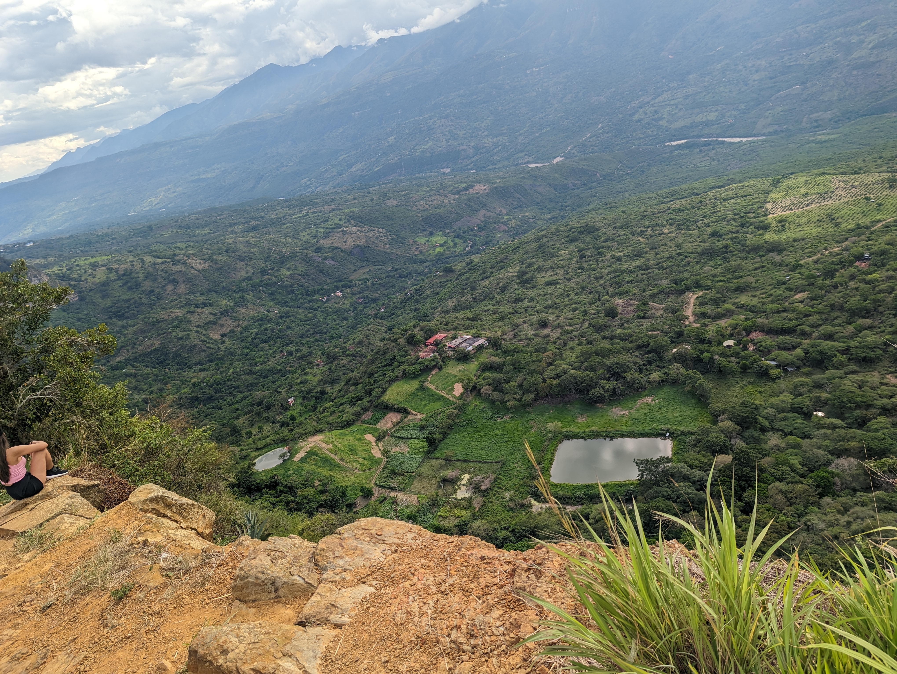

<br><details><summary>:camera:**46/PXL_20230407_205128358.MP.jpg**</summary><sub> `Exif version` 0232 `OS version` HDR+ 1.0.520435816zd `Date` 2023:04:07 15:51:28 `Aperture` Not known `Brightness` 8.78 `Color space` 1 `Compression` 6`Exposure mode` 0 `Exposure time` 0.000539 `Focal length` 6.81 `Lens model` Pixel 6 back camera 6.81mm f/1.85 `Lens specification` Not known `Orientation` 1 `Scene type` Not known `f number` 1.85 `White balance` 0 `Sensing method` 2 `Shutter speed` 10.86</sub><sub>`Coordinates & altitude` (6.630819444444445, -73.22894444444445, 1307.7)</sub><sub> :earth_americas:`Location over` [Google Maps](http://maps.google.com/maps?q=6.630819444444445,-73.22894444444445) or [Openstreet Map](https://www.openstreetmap.org/query?lat=6.630819444444445&lon=-73.22894444444445)</sub></details>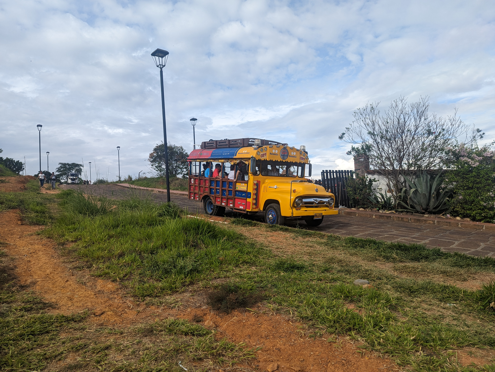

<br><details><summary>:camera:**46/PXL_20230407_205211477.jpg**</summary><sub> `Exif version` 0232 `OS version` HDR+ 1.0.520435816zd `Date` 2023:04:07 15:52:11 `Aperture` Not known `Brightness` 8.97 `Color space` 1 `Compression` 6`Exposure mode` 0 `Exposure time` 0.000495 `Focal length` 6.81 `Lens model` Pixel 6 back camera 6.81mm f/1.85 `Lens specification` Not known `Orientation` 1 `Scene type` Not known `f number` 1.85 `White balance` 0 `Sensing method` 2 `Shutter speed` 10.98</sub><sub>`Coordinates & altitude` (6.630819444444445, -73.22894444444445, 1307.7)</sub><sub> :earth_americas:`Location over` [Google Maps](http://maps.google.com/maps?q=6.630819444444445,-73.22894444444445) or [Openstreet Map](https://www.openstreetmap.org/query?lat=6.630819444444445&lon=-73.22894444444445)</sub></details>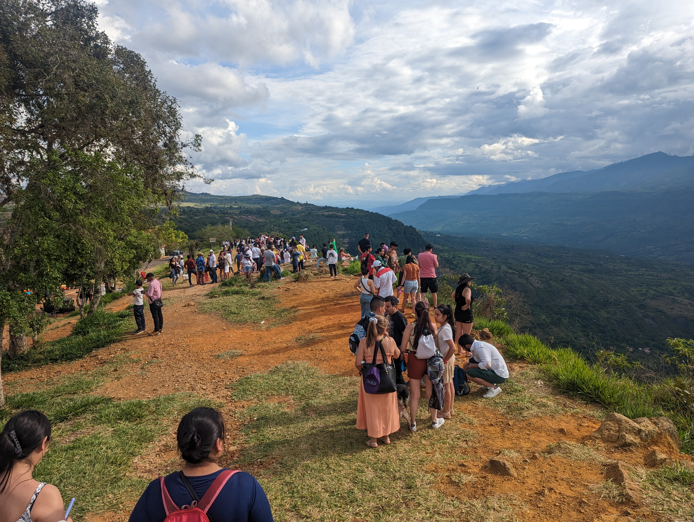

<br><details><summary>:camera:**46/PXL_20230407_205740210.jpg**</summary><sub> `Exif version` 0232 `OS version` HDR+ 1.0.520435816zd `Date` 2023:04:07 15:57:40 `Aperture` Not known `Brightness` 8.69 `Color space` 1 `Compression` 6`Exposure mode` 0 `Exposure time` 0.000539 `Focal length` 6.81 `Lens model` Pixel 6 back camera 6.81mm f/1.85 `Lens specification` Not known `Orientation` 1 `Scene type` Not known `f number` 1.85 `White balance` 0 `Sensing method` 2 `Shutter speed` 10.86</sub><sub>`Coordinates & altitude` (6.629783333333334, -73.22900555555556, 1267.59)</sub><sub> :earth_americas:`Location over` [Google Maps](http://maps.google.com/maps?q=6.629783333333334,-73.22900555555556) or [Openstreet Map](https://www.openstreetmap.org/query?lat=6.629783333333334&lon=-73.22900555555556)</sub></details>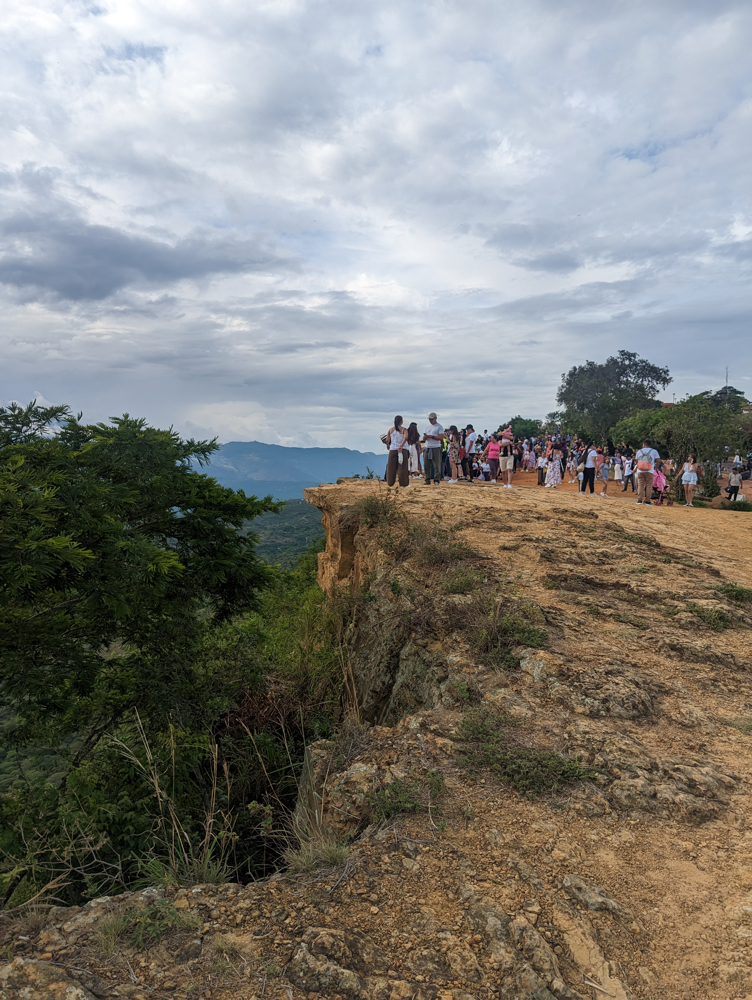

<br><details><summary>:camera:**46/PXL_20230407_205748859.jpg**</summary><sub> `Exif version` 0232 `OS version` HDR+ 1.0.520435816zd `Date` 2023:04:07 15:57:48 `Aperture` Not known `Brightness` 8.84 `Color space` 1 `Compression` 6`Exposure mode` 0 `Exposure time` 0.00053 `Focal length` 6.81 `Lens model` Pixel 6 back camera 6.81mm f/1.85 `Lens specification` Not known `Orientation` 1 `Scene type` Not known `f number` 1.85 `White balance` 0 `Sensing method` 2 `Shutter speed` 10.88</sub><sub>`Coordinates & altitude` (6.629783333333334, -73.22900555555556, 1267.59)</sub><sub> :earth_americas:`Location over` [Google Maps](http://maps.google.com/maps?q=6.629783333333334,-73.22900555555556) or [Openstreet Map](https://www.openstreetmap.org/query?lat=6.629783333333334&lon=-73.22900555555556)</sub></details>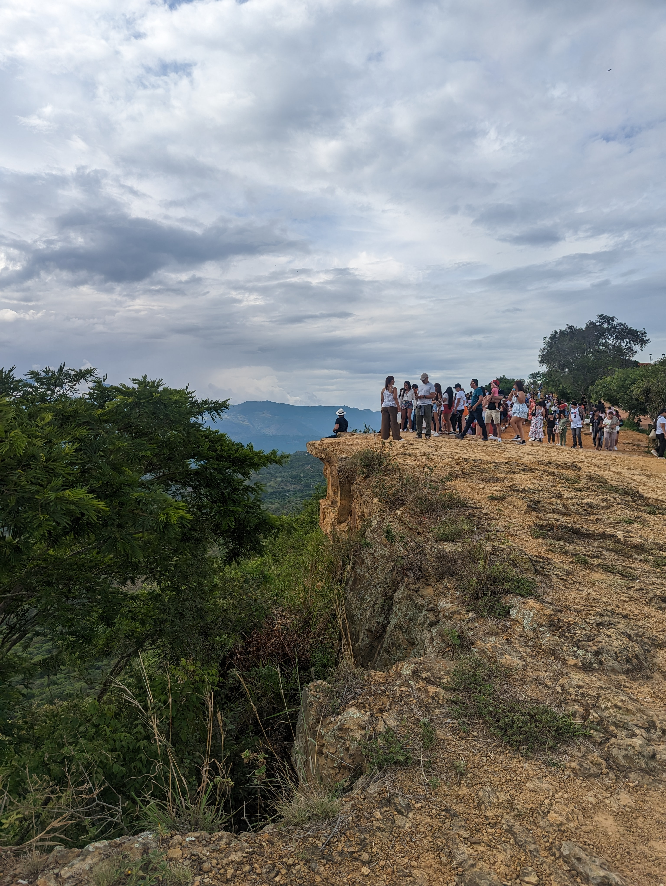

<br><details><summary>:camera:**46/PXL_20230407_210004357.jpg**</summary><sub> `Exif version` 0232 `OS version` HDR+ 1.0.520435816zd `Date` 2023:04:07 16:00:04 `Aperture` Not known `Brightness` 6.67 `Color space` 1 `Compression` 6`Exposure mode` 0 `Exposure time` 0.002686 `Focal length` 6.81 `Lens model` Pixel 6 back camera 6.81mm f/1.85 `Lens specification` Not known `Orientation` 1 `Scene type` Not known `f number` 1.85 `White balance` 0 `Sensing method` 2 `Shutter speed` 8.54</sub><sub>`Coordinates & altitude` (6.629783333333334, -73.22900555555556, 1267.59)</sub><sub> :earth_americas:`Location over` [Google Maps](http://maps.google.com/maps?q=6.629783333333334,-73.22900555555556) or [Openstreet Map](https://www.openstreetmap.org/query?lat=6.629783333333334&lon=-73.22900555555556)</sub></details>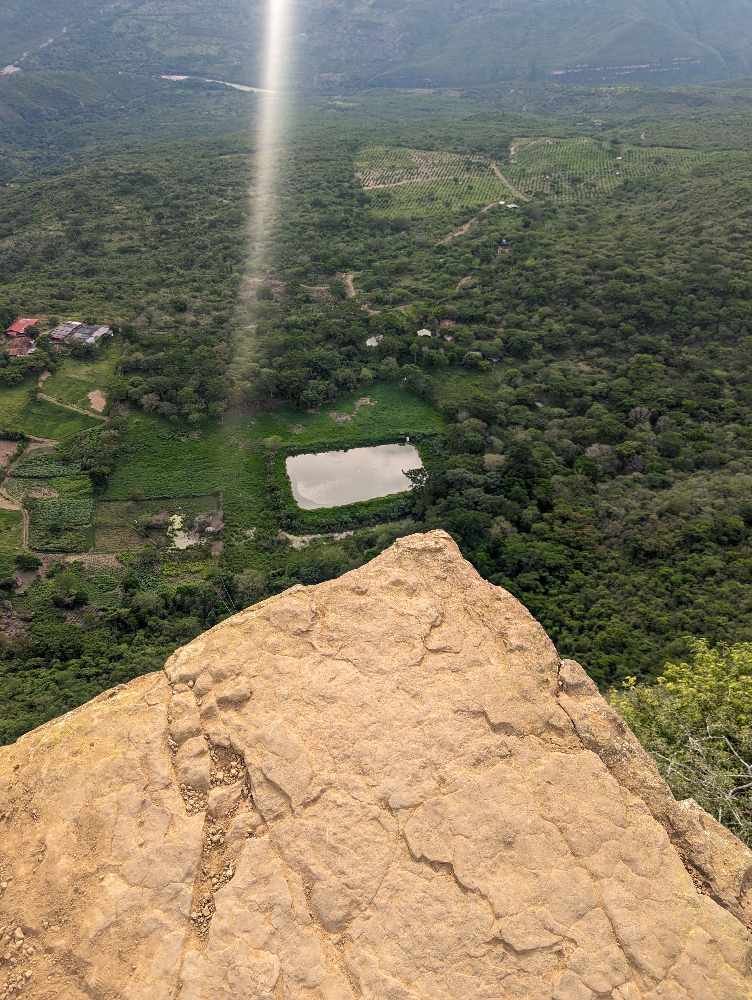

<br><details><summary>:camera:**46/PXL_20230407_210207098.jpg**</summary><sub> `Exif version` 0232 `OS version` HDR+ 1.0.520435816zd `Date` 2023:04:07 16:02:07 `Aperture` Not known `Brightness` 9.13 `Color space` 1 `Compression` 6`Exposure mode` 0 `Exposure time` 0.000433 `Focal length` 6.81 `Lens model` Pixel 6 back camera 6.81mm f/1.85 `Lens specification` Not known `Orientation` 1 `Scene type` Not known `f number` 1.85 `White balance` 0 `Sensing method` 2 `Shutter speed` 11.17</sub><sub>`Coordinates & altitude` (6.629313888888889, -73.22907500000001, 1264.3)</sub><sub> :earth_americas:`Location over` [Google Maps](http://maps.google.com/maps?q=6.629313888888889,-73.22907500000001) or [Openstreet Map](https://www.openstreetmap.org/query?lat=6.629313888888889&lon=-73.22907500000001)</sub></details>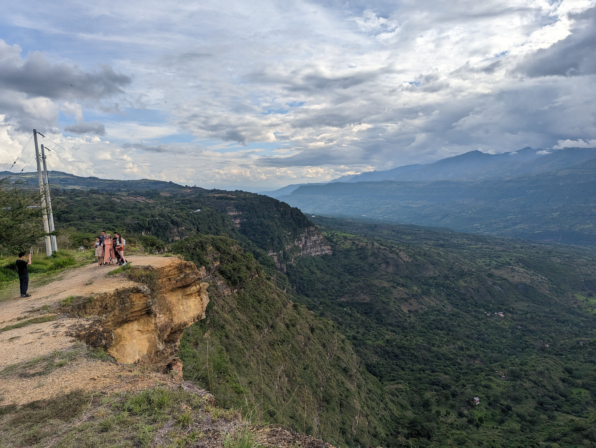

<br><details><summary>:camera:**46/PXL_20230407_211023017.jpg**</summary><sub> `Exif version` 0232 `OS version` HDR+ 1.0.520435816zd `Date` 2023:04:07 16:10:23 `Aperture` Not known `Brightness` 5.84 `Color space` 1 `Compression` 6`Exposure mode` 0 `Exposure time` 0.004329 `Focal length` 6.81 `Lens model` Pixel 6 back camera 6.81mm f/1.85 `Lens specification` Not known `Orientation` 1 `Scene type` Not known `f number` 1.85 `White balance` 0 `Sensing method` 2 `Shutter speed` 7.85</sub><sub>`Coordinates & altitude` (6.629275000000001, -73.22898055555555, 1308.2)</sub><sub> :earth_americas:`Location over` [Google Maps](http://maps.google.com/maps?q=6.629275000000001,-73.22898055555555) or [Openstreet Map](https://www.openstreetmap.org/query?lat=6.629275000000001&lon=-73.22898055555555)</sub></details>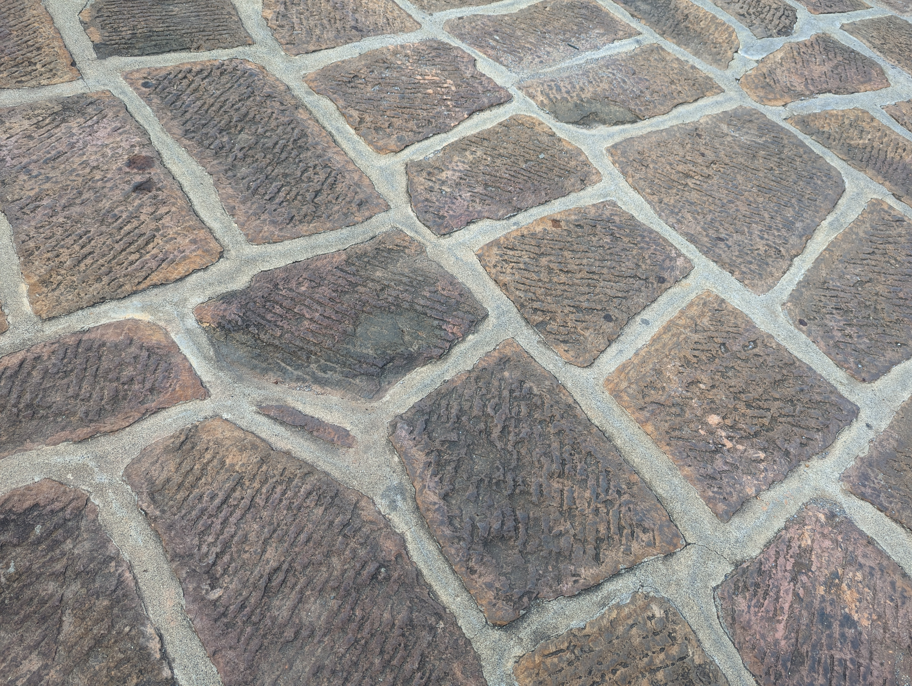

<br><details><summary>:camera:**46/PXL_20230407_211027087.jpg**</summary><sub> `Exif version` 0232 `OS version` HDR+ 1.0.520435816zd `Date` 2023:04:07 16:10:27 `Aperture` Not known `Brightness` 8.19 `Color space` 1 `Compression` 6`Exposure mode` 0 `Exposure time` 0.000813 `Focal length` 6.81 `Lens model` Pixel 6 back camera 6.81mm f/1.85 `Lens specification` Not known `Orientation` 1 `Scene type` Not known `f number` 1.85 `White balance` 0 `Sensing method` 2 `Shutter speed` 10.26</sub><sub>`Coordinates & altitude` (6.629275000000001, -73.22898055555555, 1308.2)</sub><sub> :earth_americas:`Location over` [Google Maps](http://maps.google.com/maps?q=6.629275000000001,-73.22898055555555) or [Openstreet Map](https://www.openstreetmap.org/query?lat=6.629275000000001&lon=-73.22898055555555)</sub></details>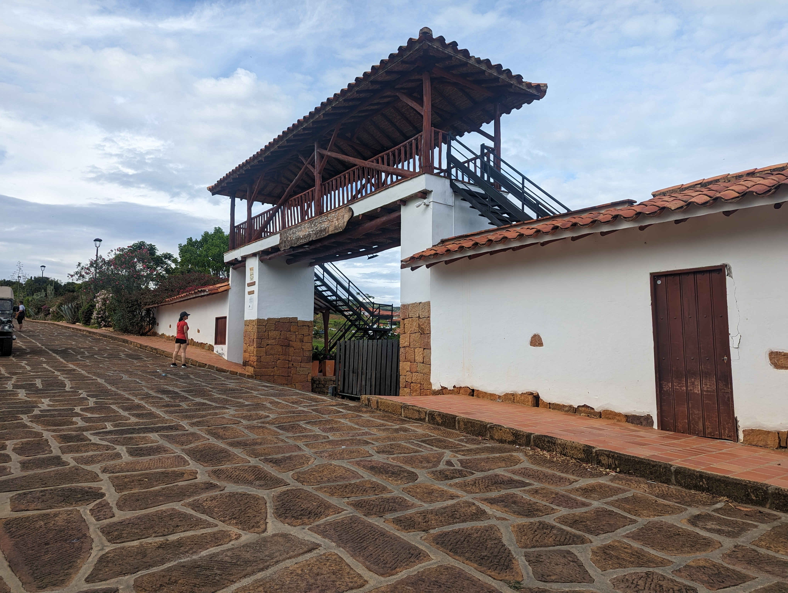

<br><details><summary>:camera:**46/PXL_20230407_214849582.MP.jpg**</summary><sub> `Exif version` 0232 `OS version` HDR+ 1.0.520435816zd `Date` 2023:04:07 16:48:49 `Aperture` Not known `Brightness` 6.93 `Color space` 1 `Compression` 6`Exposure mode` 0 `Exposure time` 0.001988 `Focal length` 6.81 `Lens model` Pixel 6 back camera 6.81mm f/1.85 `Lens specification` Not known `Orientation` 1 `Scene type` Not known `f number` 1.85 `White balance` 0 `Sensing method` 2 `Shutter speed` 8.97</sub><sub>`Coordinates & altitude` (6.634566666666666, -73.22105833333333, 1296.5)</sub><sub> :earth_americas:`Location over` [Google Maps](http://maps.google.com/maps?q=6.634566666666666,-73.22105833333333) or [Openstreet Map](https://www.openstreetmap.org/query?lat=6.634566666666666&lon=-73.22105833333333)</sub></details>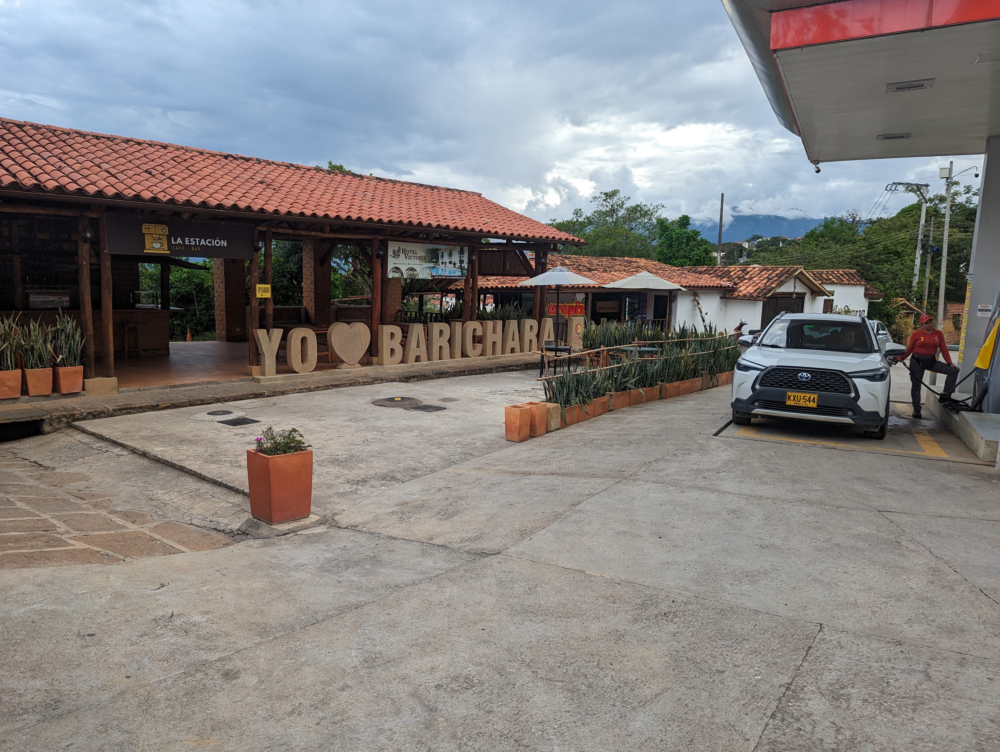

<br><details><summary>:camera:**46/PXL_20230407_214902319.jpg**</summary><sub> `Exif version` 0232 `OS version` HDR+ 1.0.520435816zd `Date` 2023:04:07 16:49:02 `Aperture` Not known `Brightness` 6.76 `Color space` 1 `Compression` 6`Exposure mode` 0 `Exposure time` 0.002191 `Focal length` 6.81 `Lens model` Pixel 6 back camera 6.81mm f/1.85 `Lens specification` Not known `Orientation` 1 `Scene type` Not known `f number` 1.85 `White balance` 0 `Sensing method` 2 `Shutter speed` 8.83</sub><sub>`Coordinates & altitude` (6.6344055555555554, -73.21905833333334, 1278.8)</sub><sub> :earth_americas:`Location over` [Google Maps](http://maps.google.com/maps?q=6.6344055555555554,-73.21905833333334) or [Openstreet Map](https://www.openstreetmap.org/query?lat=6.6344055555555554&lon=-73.21905833333334)</sub></details>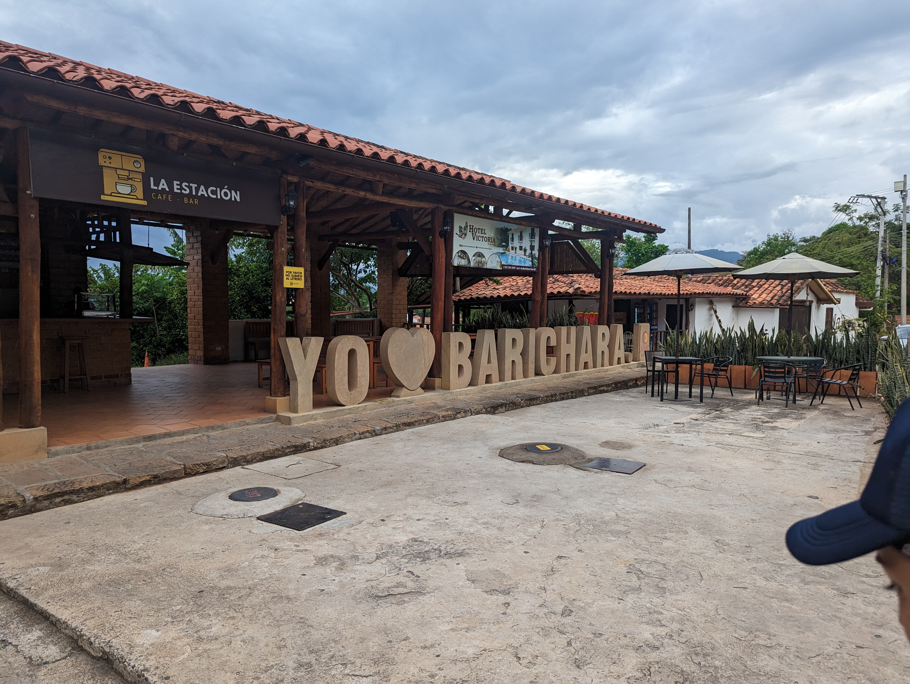

<br><details><summary>:camera:**46/PXL_20230407_214918975.jpg**</summary><sub> `Exif version` 0232 `OS version` HDR+ 1.0.520435816zd `Date` 2023:04:07 16:49:18 `Aperture` Not known `Brightness` 5.16 `Color space` 1 `Compression` 6`Exposure mode` 0 `Exposure time` 0.006811 `Focal length` 6.81 `Lens model` Pixel 6 back camera 6.81mm f/1.85 `Lens specification` Not known `Orientation` 1 `Scene type` Not known `f number` 1.85 `White balance` 0 `Sensing method` 2 `Shutter speed` 7.2</sub><sub>`Coordinates & altitude` (6.6344055555555554, -73.21905833333334, 1278.8)</sub><sub> :earth_americas:`Location over` [Google Maps](http://maps.google.com/maps?q=6.6344055555555554,-73.21905833333334) or [Openstreet Map](https://www.openstreetmap.org/query?lat=6.6344055555555554&lon=-73.21905833333334)</sub></details>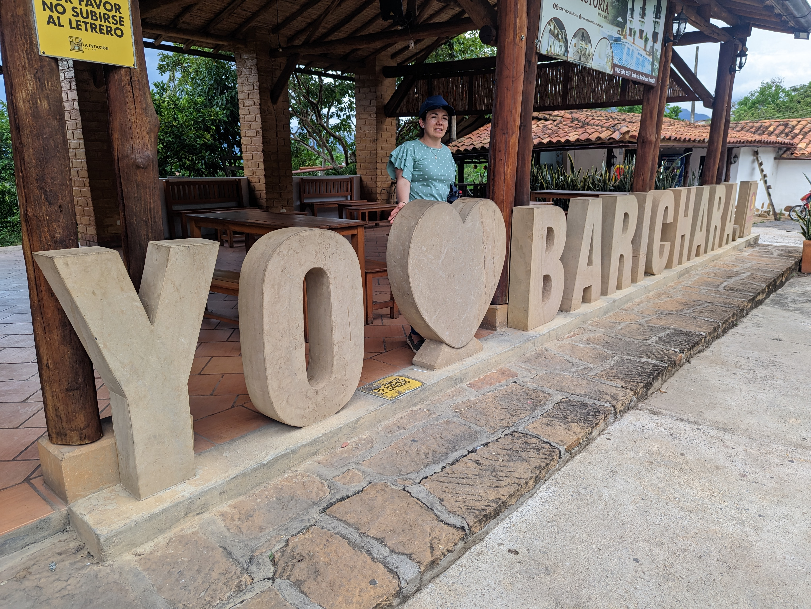

<br><details><summary>:camera:**46/PXL_20230407_214920207.jpg**</summary><sub> `Exif version` 0232 `OS version` HDR+ 1.0.520435816zd `Date` 2023:04:07 16:49:20 `Aperture` Not known `Brightness` 5.74 `Color space` 1 `Compression` 6`Exposure mode` 0 `Exposure time` 0.00606 `Focal length` 6.81 `Lens model` Pixel 6 back camera 6.81mm f/1.85 `Lens specification` Not known `Orientation` 1 `Scene type` Not known `f number` 1.85 `White balance` 0 `Sensing method` 2 `Shutter speed` 7.37</sub><sub>`Coordinates & altitude` (6.6344055555555554, -73.21905833333334, 1278.8)</sub><sub> :earth_americas:`Location over` [Google Maps](http://maps.google.com/maps?q=6.6344055555555554,-73.21905833333334) or [Openstreet Map](https://www.openstreetmap.org/query?lat=6.6344055555555554&lon=-73.21905833333334)</sub></details>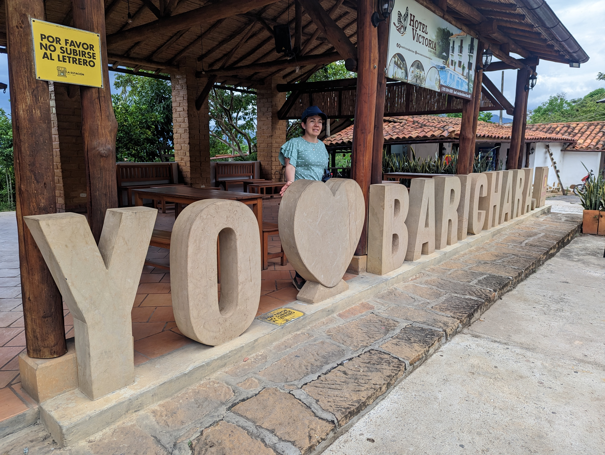

<br><details><summary>:camera:**46/PXL_20230407_214932127.jpg**</summary><sub> `Exif version` 0232 `OS version` HDR+ 1.0.520435816zd `Date` 2023:04:07 16:49:32 `Aperture` Not known `Brightness` 6.12 `Color space` 1 `Compression` 6`Exposure mode` 0 `Exposure time` 0.003666 `Focal length` 6.81 `Lens model` Pixel 6 back camera 6.81mm f/1.85 `Lens specification` Not known `Orientation` 1 `Scene type` Not known `f number` 1.85 `White balance` 0 `Sensing method` 2 `Shutter speed` 8.09</sub><sub>`Coordinates & altitude` (6.6344055555555554, -73.21905833333334, 1278.8)</sub><sub> :earth_americas:`Location over` [Google Maps](http://maps.google.com/maps?q=6.6344055555555554,-73.21905833333334) or [Openstreet Map](https://www.openstreetmap.org/query?lat=6.6344055555555554&lon=-73.21905833333334)</sub></details>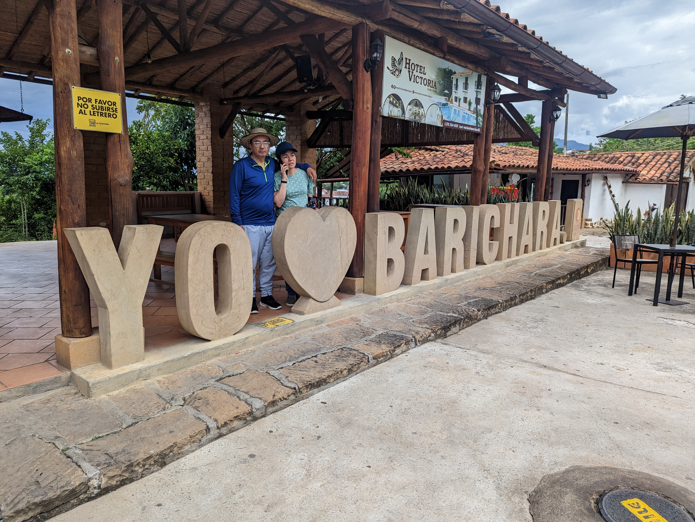

<br><details><summary>:camera:**46/PXL_20230407_214934177.jpg**</summary><sub> `Exif version` 0232 `OS version` HDR+ 1.0.520435816zd `Date` 2023:04:07 16:49:34 `Aperture` Not known `Brightness` 6.75 `Color space` 1 `Compression` 6`Exposure mode` 0 `Exposure time` 0.002553 `Focal length` 6.81 `Lens model` Pixel 6 back camera 6.81mm f/1.85 `Lens specification` Not known `Orientation` 1 `Scene type` Not known `f number` 1.85 `White balance` 0 `Sensing method` 2 `Shutter speed` 8.61</sub><sub>`Coordinates & altitude` (6.6344055555555554, -73.21905833333334, 1278.8)</sub><sub> :earth_americas:`Location over` [Google Maps](http://maps.google.com/maps?q=6.6344055555555554,-73.21905833333334) or [Openstreet Map](https://www.openstreetmap.org/query?lat=6.6344055555555554&lon=-73.21905833333334)</sub></details>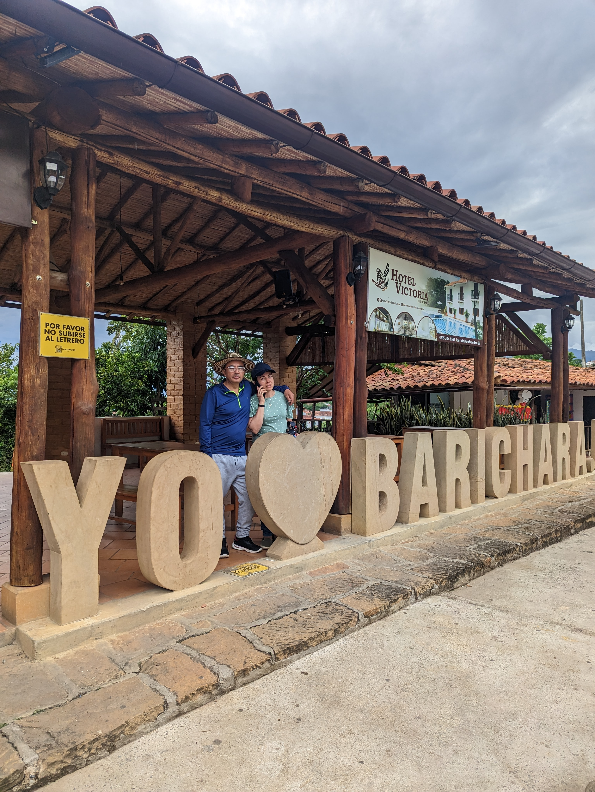

<br><details><summary>:camera:**46/PXL_20230407_214941601.jpg**</summary><sub> `Exif version` 0232 `OS version` HDR+ 1.0.520435816zd `Date` 2023:04:07 16:49:41 `Aperture` Not known `Brightness` 6.41 `Color space` 1 `Compression` 6`Exposure mode` 0 `Exposure time` 0.003304 `Focal length` 6.81 `Lens model` Pixel 6 back camera 6.81mm f/1.85 `Lens specification` Not known `Orientation` 1 `Scene type` Not known `f number` 1.85 `White balance` 0 `Sensing method` 2 `Shutter speed` 8.24</sub><sub>`Coordinates & altitude` (6.6344055555555554, -73.21905833333334, 1278.8)</sub><sub> :earth_americas:`Location over` [Google Maps](http://maps.google.com/maps?q=6.6344055555555554,-73.21905833333334) or [Openstreet Map](https://www.openstreetmap.org/query?lat=6.6344055555555554&lon=-73.21905833333334)</sub></details>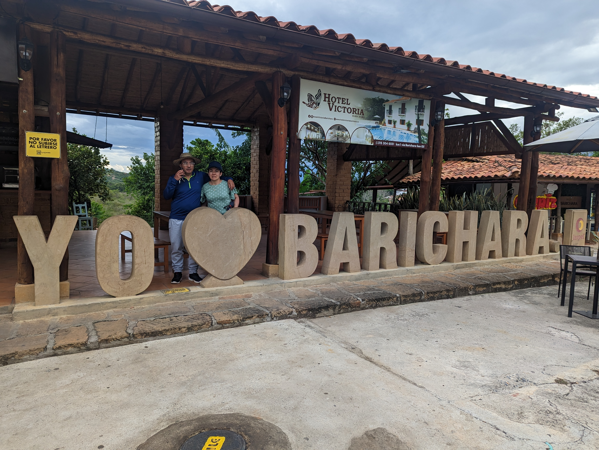

<br><details><summary>:camera:**46/PXL_20230407_214943096.jpg**</summary><sub> `Exif version` 0232 `OS version` HDR+ 1.0.520435816zd `Date` 2023:04:07 16:49:43 `Aperture` Not known `Brightness` 7.25 `Color space` 1 `Compression` 6`Exposure mode` 0 `Exposure time` 0.002191 `Focal length` 6.81 `Lens model` Pixel 6 back camera 6.81mm f/1.85 `Lens specification` Not known `Orientation` 1 `Scene type` Not known `f number` 1.85 `White balance` 0 `Sensing method` 2 `Shutter speed` 8.83</sub><sub>`Coordinates & altitude` (6.6344055555555554, -73.21905833333334, 1278.8)</sub><sub> :earth_americas:`Location over` [Google Maps](http://maps.google.com/maps?q=6.6344055555555554,-73.21905833333334) or [Openstreet Map](https://www.openstreetmap.org/query?lat=6.6344055555555554&lon=-73.21905833333334)</sub></details>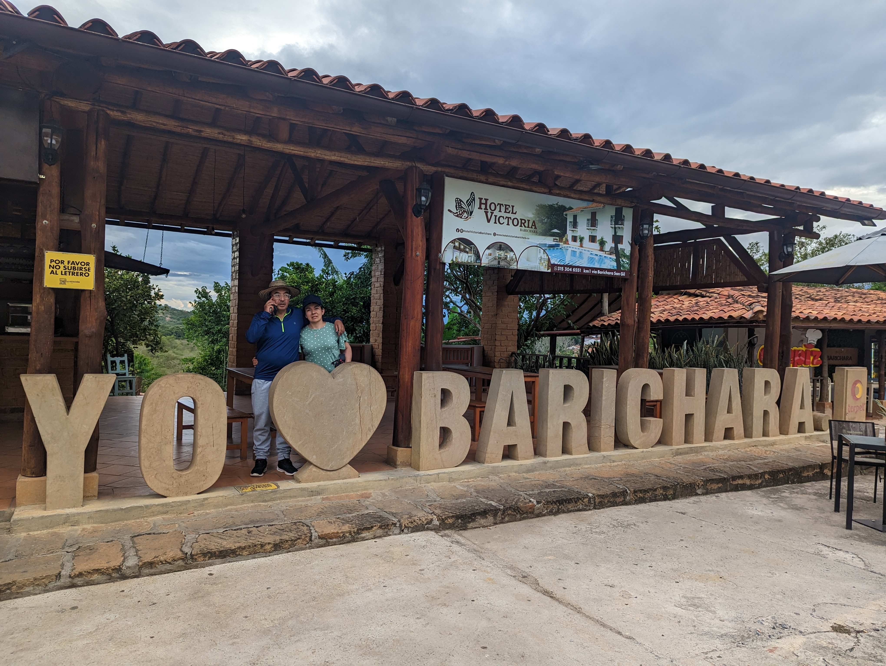

<br><details><summary>:camera:**46/PXL_20230409_190800531.MP.jpg**</summary><sub> `Exif version` 0232 `OS version` HDR+ 1.0.520435816zd `Date` 2023:04:09 14:08:00 `Aperture` Not known `Brightness` 8.47 `Color space` 1 `Compression` 6`Exposure mode` 0 `Exposure time` 0.000671 `Focal length` 6.81 `Lens model` Pixel 6 back camera 6.81mm f/1.85 `Lens specification` Not known `Orientation` 1 `Scene type` Not known `f number` 1.85 `White balance` 0 `Sensing method` 2 `Shutter speed` 10.54</sub><sub>`Coordinates & altitude` (6.052702777777777, -73.50208055555555, 1492.53)</sub><sub> :earth_americas:`Location over` [Google Maps](http://maps.google.com/maps?q=6.052702777777777,-73.50208055555555) or [Openstreet Map](https://www.openstreetmap.org/query?lat=6.052702777777777&lon=-73.50208055555555)</sub></details>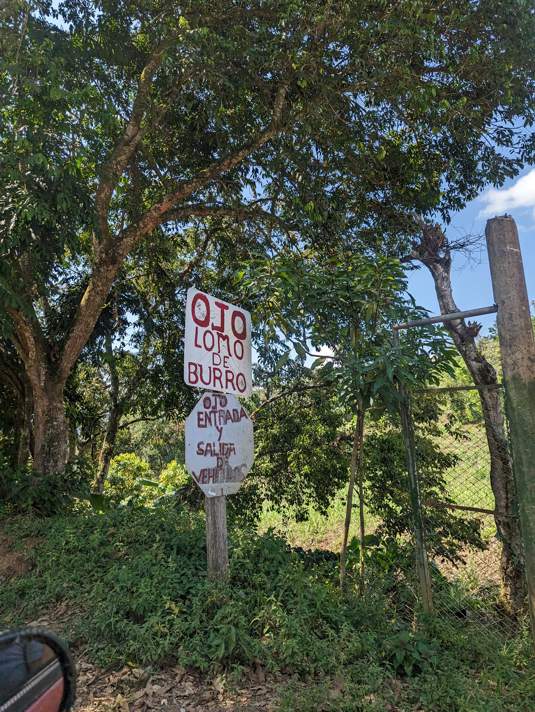

<sub>_Citation: Partial or total digital reproduction of this repository, scripts, development guides, data models, images, and documentation is permitted, provided that it is referenced as: "R.GISMobile - Mobile geographic information systems on QField that do not require an internet connection for navigation." https://github.com/rcfdtools/R.GISMobile - Bogotá - Colombia - South America"._<sub>

| [:house: Home](../Readme.md) |
|---|