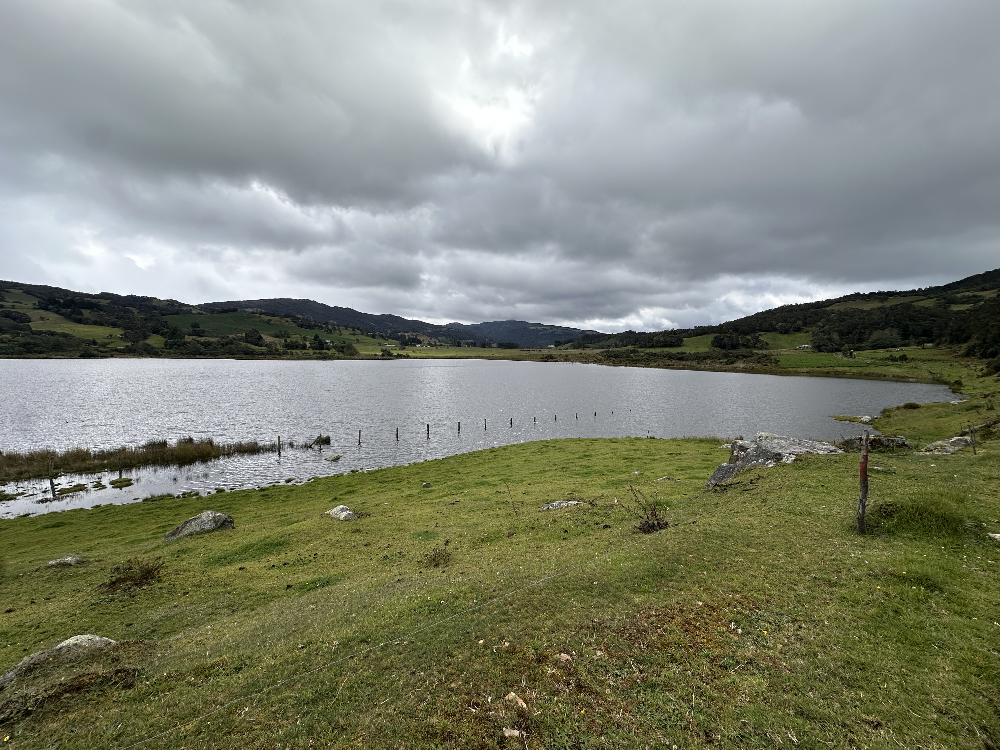
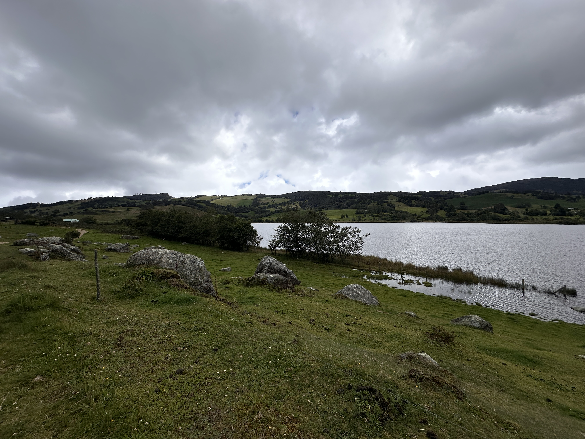
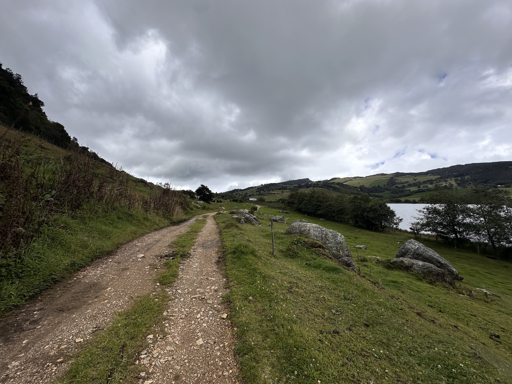
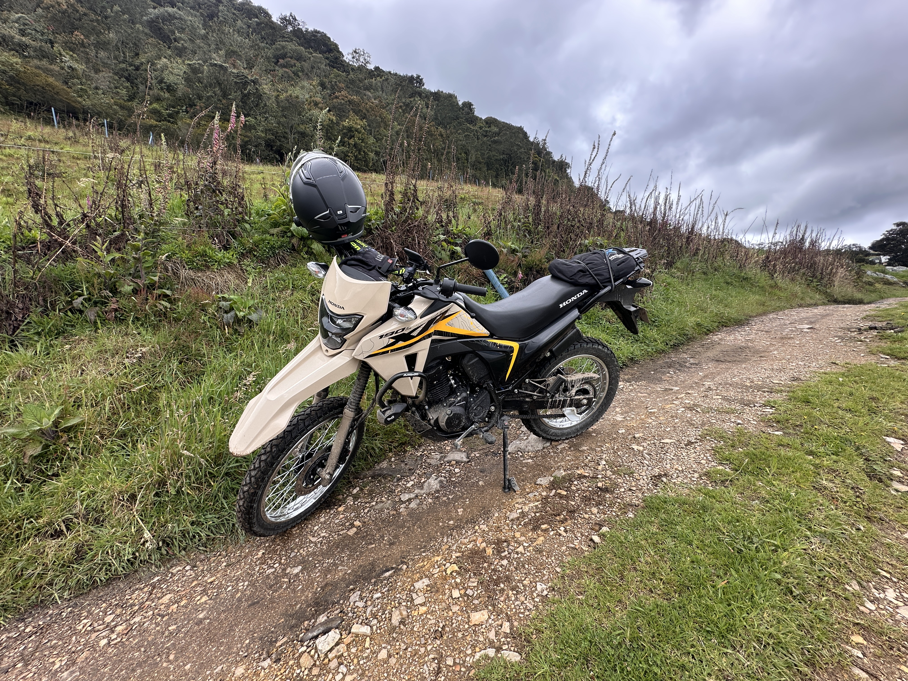
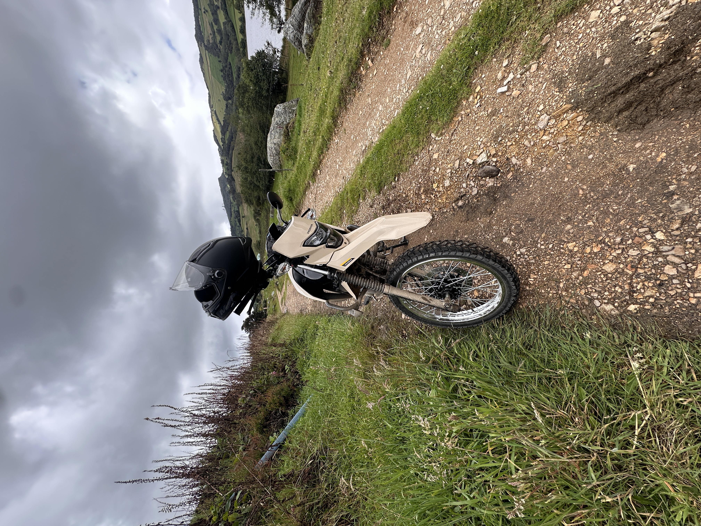
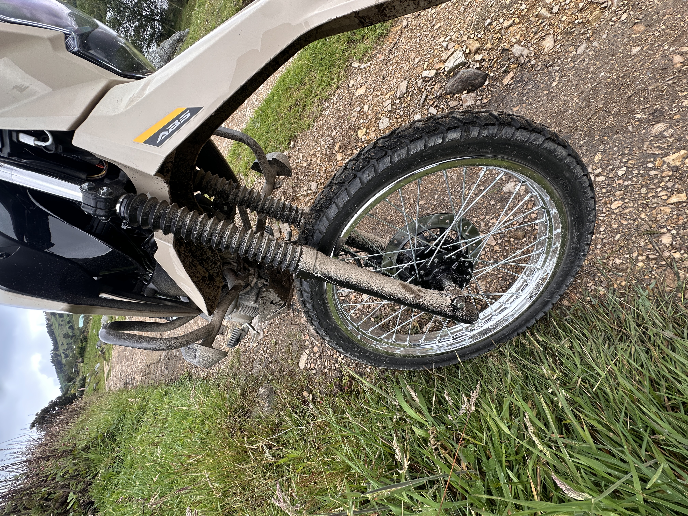
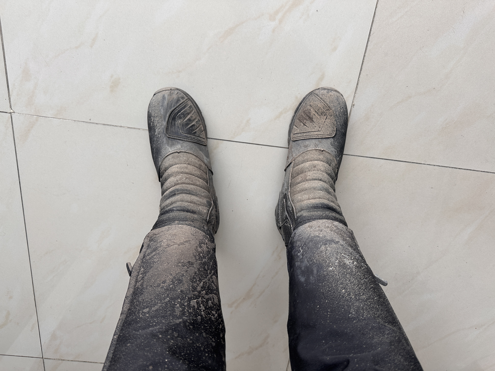

<div align="center"></div>

## Subachoque - Pantano de Arce, Cundinamarca, Colombia (2025-04-11)
`Pictures` rcfdtools <br>`Category` Freelance field visit <br>`Location` [Google Maps](http://maps.google.com/maps?q=5.002233,-74.180353) or [Openstreet Map](https://www.openstreetmap.org/query?lat=5.002233&lon=-74.180353) 

```geojson
{
  "type": "Feature",
  "geometry": {
    "type": "Point", 
    "coordinates": [-74.180353, 5.002233]
  }, 
  "properties": {
    "Name": "Subachoque - Pantano de Arce, Cundinamarca, Colombia"
  }
}
```

<br><details><summary>:camera:**48/IMG_2285.JPG**</summary><sub> `Exif version` 0232 `OS version` 18.5 `Date` 2025:04:11 10:23:03 `Aperture` Not known `Brightness` 9.839545398997922 `Color space` 65535 `Compression` 6`Exposure mode` 0 `Exposure time` 0.000547945205479452 `Focal length` 2.22 `Lens model` iPhone 14 Pro back triple camera 2.22mm f/2.2 `Lens specification` (2.220000028611935, 9.0, 1.7799999713880652, 2.8) `Orientation` 1 `Scene type` Not known `f number` 2.2 `White balance` 0 `Sensing method` 2 `Shutter speed` 10.83353647919206</sub><sub>`Coordinates & altitude` (5.000480555555556, -74.17743611111112, 3188.5429362880886)</sub><sub> :globe_with_meridians:`Location over` [Google Maps](http://maps.google.com/maps?q=5.000480555555556,-74.17743611111112) or [Openstreet Map](https://www.openstreetmap.org/query?lat=5.000480555555556&lon=-74.17743611111112)</sub></details>

<br><details><summary>:camera:**48/IMG_2286.JPG**</summary><sub> `Exif version` 0232 `OS version` 18.5 `Date` 2025:04:11 10:23:06 `Aperture` Not known `Brightness` 10.370932726511823 `Color space` 65535 `Compression` 6`Exposure mode` 0 `Exposure time` 0.0002680246582685607 `Focal length` 2.22 `Lens model` iPhone 14 Pro back triple camera 2.22mm f/2.2 `Lens specification` (2.220000028611935, 9.0, 1.7799999713880652, 2.8) `Orientation` 1 `Scene type` Not known `f number` 2.2 `White balance` 0 `Sensing method` 2 `Shutter speed` 11.865479390681003</sub><sub>`Coordinates & altitude` (5.000491666666667, -74.17742222222223, 3190.9634888438136)</sub><sub> :globe_with_meridians:`Location over` [Google Maps](http://maps.google.com/maps?q=5.000491666666667,-74.17742222222223) or [Openstreet Map](https://www.openstreetmap.org/query?lat=5.000491666666667&lon=-74.17742222222223)</sub></details>

<br><details><summary>:camera:**48/IMG_2287.JPG**</summary><sub> `Exif version` 0232 `OS version` 18.5 `Date` 2025:04:11 10:23:08 `Aperture` Not known `Brightness` 10.182988947621336 `Color space` 65535 `Compression` 6`Exposure mode` 0 `Exposure time` 0.0003379520108144643 `Focal length` 2.22 `Lens model` iPhone 14 Pro back triple camera 2.22mm f/2.2 `Lens specification` (2.220000028611935, 9.0, 1.7799999713880652, 2.8) `Orientation` 1 `Scene type` Not known `f number` 2.2 `White balance` 0 `Sensing method` 2 `Shutter speed` 11.53068914229053</sub><sub>`Coordinates & altitude` (5.000505555555556, -74.17740555555557, 3191.4167289021657)</sub><sub> :globe_with_meridians:`Location over` [Google Maps](http://maps.google.com/maps?q=5.000505555555556,-74.17740555555557) or [Openstreet Map](https://www.openstreetmap.org/query?lat=5.000505555555556&lon=-74.17740555555557)</sub></details>

<br><details><summary>:camera:**48/IMG_2288.JPG**</summary><sub> `Exif version` 0232 `OS version` 18.5 `Date` 2025:04:11 10:23:19 `Aperture` Not known `Brightness` 7.786926055688733 `Color space` 65535 `Compression` 6`Exposure mode` 0 `Exposure time` 0.002793296089385475 `Focal length` 2.22 `Lens model` iPhone 14 Pro back triple camera 2.22mm f/2.2 `Lens specification` (2.220000028611935, 9.0, 1.7799999713880652, 2.8) `Orientation` 1 `Scene type` Not known `f number` 2.2 `White balance` 0 `Sensing method` 2 `Shutter speed` 8.481904034062994</sub><sub>`Coordinates & altitude` (5.0005138888888885, -74.17739722222223, 3190.9555483452305)</sub><sub> :globe_with_meridians:`Location over` [Google Maps](http://maps.google.com/maps?q=5.0005138888888885,-74.17739722222223) or [Openstreet Map](https://www.openstreetmap.org/query?lat=5.0005138888888885&lon=-74.17739722222223)</sub></details>

<br><details><summary>:camera:**48/IMG_2289.JPG**</summary><sub> `Exif version` 0232 `OS version` 18.5 `Date` 2025:04:11 10:23:27 `Aperture` Not known `Brightness` 9.005189903279076 `Color space` 65535 `Compression` 6`Exposure mode` 0 `Exposure time` 0.001379310344827586 `Focal length` 2.22 `Lens model` iPhone 14 Pro back triple camera 2.22mm f/2.2 `Lens specification` (2.220000028611935, 9.0, 1.7799999713880652, 2.8) `Orientation` 6 `Scene type` Not known `f number` 2.2 `White balance` 0 `Sensing method` 2 `Shutter speed` 9.502161828289067</sub><sub>`Coordinates & altitude` (5.000491666666667, -74.17739166666667, 3191.029810298103)</sub><sub> :globe_with_meridians:`Location over` [Google Maps](http://maps.google.com/maps?q=5.000491666666667,-74.17739166666667) or [Openstreet Map](https://www.openstreetmap.org/query?lat=5.000491666666667&lon=-74.17739166666667)</sub></details>

<br><details><summary>:camera:**48/IMG_2290.JPG**</summary><sub> `Exif version` 0232 `OS version` 18.5 `Date` 2025:04:11 10:23:33 `Aperture` Not known `Brightness` 7.162859577230495 `Color space` 65535 `Compression` 6`Exposure mode` 0 `Exposure time` 0.003745318352059925 `Focal length` 2.22 `Lens model` iPhone 14 Pro back triple camera 2.22mm f/2.2 `Lens specification` (2.220000028611935, 9.0, 1.7799999713880652, 2.8) `Orientation` 6 `Scene type` Not known `f number` 2.2 `White balance` 0 `Sensing method` 2 `Shutter speed` 8.06158924402222</sub><sub>`Coordinates & altitude` (5.000491666666667, -74.17741388888889, 3188.465783664459)</sub><sub> :globe_with_meridians:`Location over` [Google Maps](http://maps.google.com/maps?q=5.000491666666667,-74.17741388888889) or [Openstreet Map](https://www.openstreetmap.org/query?lat=5.000491666666667&lon=-74.17741388888889)</sub></details>

<br><details><summary>:camera:**48/IMG_2294.JPG**</summary><sub> `Exif version` 0232 `OS version` 18.5 `Date` 2025:04:11 10:25:09 `Aperture` Not known `Brightness` 9.577855641205327 `Color space` 65535 `Compression` 6`Exposure mode` Not known `Exposure time` 0.00022799817601459188 `Focal length` 6.86 `Lens model` iPhone 14 Pro back camera 6.86mm f/1.78 `Lens specification` (6.8600001335175875, 6.8600001335175875, 1.7799999713880652, 1.7799999713880652) `Orientation` 1 `Scene type` Not known `f number` 1.78 `White balance` 0 `Sensing method` 2 `Shutter speed` 12.098678565299467</sub><sub>`Coordinates & altitude` (5.000525, -74.17740555555557, 3188.9078822412157)</sub><sub> :globe_with_meridians:`Location over` [Google Maps](http://maps.google.com/maps?q=5.000525,-74.17740555555557) or [Openstreet Map](https://www.openstreetmap.org/query?lat=5.000525&lon=-74.17740555555557)</sub></details>

<br><details><summary>:camera:**48/IMG_2295.JPG**</summary><sub> `Exif version` 0232 `OS version` 18.5 `Date` 2025:04:11 12:19:18 `Aperture` Not known `Brightness` 5.765705614567526 `Color space` 65535 `Compression` 6`Exposure mode` 0 `Exposure time` 0.004484304932735426 `Focal length` 6.86 `Lens model` iPhone 14 Pro back triple camera 6.86mm f/1.78 `Lens specification` (2.220000028611935, 9.0, 1.7799999713880652, 2.8) `Orientation` 6 `Scene type` Not known `f number` 1.78 `White balance` 0 `Sensing method` 2 `Shutter speed` 7.8000331071014735</sub><sub>`Coordinates & altitude` (5.025591666666666, -73.99642222222222, 2572.5585774058577)</sub><sub> :globe_with_meridians:`Location over` [Google Maps](http://maps.google.com/maps?q=5.025591666666666,-73.99642222222222) or [Openstreet Map](https://www.openstreetmap.org/query?lat=5.025591666666666&lon=-73.99642222222222)</sub></details>

<sub>_Citation: Partial or total digital reproduction of this repository, scripts, development guides, data models, images, and documentation is permitted, provided that it is referenced as: "R.GISMobile - Mobile geographic information systems on QField that do not require an internet connection for navigation." https://github.com/rcfdtools/R.GISMobile - Bogotá - Colombia - South America"._<sub>

| [:house: POI home](../Readme.md) |
|---|