<div align="center"></div>

## Laguna de Suesca, Cundinamarca, Colombia (2025-08-07)
`Pictures` rcfdtools <br>`Category` Freelance field visit <br>`Location` [Google Maps](http://maps.google.com/maps?q=5.185168,-73.788042) or [Openstreet Map](https://www.openstreetmap.org/query?lat=5.185168&lon=-73.788042) 

```geojson
{
  "type": "Feature",
  "geometry": {
    "type": "Point", 
    "coordinates": [-73.788042, 5.185168]
  }, 
  "properties": {
    "Name": "Laguna de Suesca, Cundinamarca, Colombia"
  }
}
```

<br><details><summary>:camera:**49/IMG_20250803_155342021.jpg**</summary><sub> `Exif version` 0220 `OS version`  `Date` 2025:08:03 15:53:43 `Aperture` Not known `Brightness` 0.0 `Color space` 1 `Compression` 6`Exposure mode` 0 `Exposure time` 0.000192 `Focal length` 5.56 `Lens model` Not known `Lens specification` Not known `Orientation` 6 `Scene type` Not known `f number` 1.88 `White balance` 0 `Sensing method` 1 `Shutter speed` 12.346</sub></details>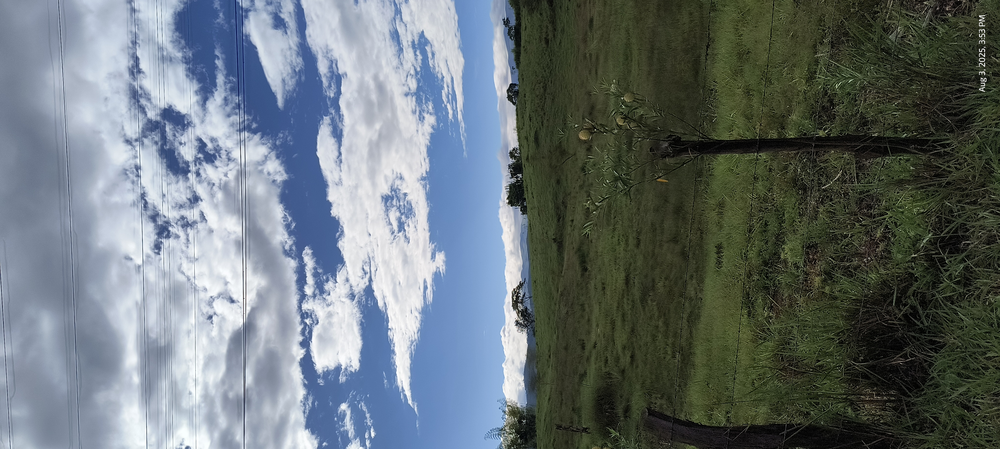

<br><details><summary>:camera:**49/IMG_20250803_155537045_HDR.jpg**</summary><sub> `Exif version` 0220 `OS version`  `Date` 2025:08:03 15:55:38 `Aperture` Not known `Brightness` 0.0 `Color space` 1 `Compression` 6`Exposure mode` 0 `Exposure time` 0.000128 `Focal length` 5.56 `Lens model` Not known `Lens specification` Not known `Orientation` 1 `Scene type` Not known `f number` 1.88 `White balance` 0 `Sensing method` 1 `Shutter speed` 12.931</sub></details>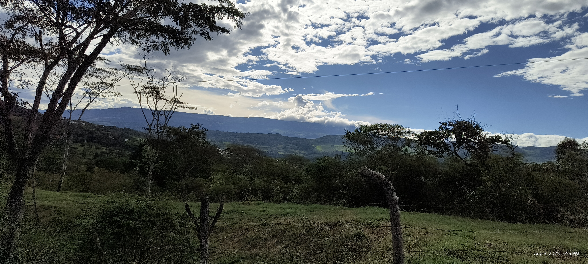

<br><details><summary>:camera:**49/IMG_20250803_155539976_HDR.jpg**</summary><sub> `Exif version` 0220 `OS version`  `Date` 2025:08:03 15:55:41 `Aperture` Not known `Brightness` 0.0 `Color space` 1 `Compression` 6`Exposure mode` 0 `Exposure time` 0.000128 `Focal length` 5.56 `Lens model` Not known `Lens specification` Not known `Orientation` 1 `Scene type` Not known `f number` 1.88 `White balance` 0 `Sensing method` 1 `Shutter speed` 12.931</sub></details>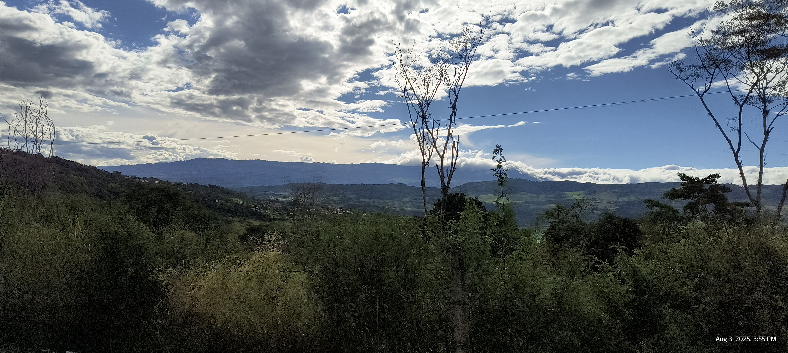

<br><details><summary>:camera:**49/IMG_20250803_155543666_HDR.jpg**</summary><sub> `Exif version` 0220 `OS version`  `Date` 2025:08:03 15:55:45 `Aperture` Not known `Brightness` 0.0 `Color space` 1 `Compression` 6`Exposure mode` 0 `Exposure time` 0.000128 `Focal length` 5.56 `Lens model` Not known `Lens specification` Not known `Orientation` 6 `Scene type` Not known `f number` 1.88 `White balance` 0 `Sensing method` 1 `Shutter speed` 12.931</sub></details>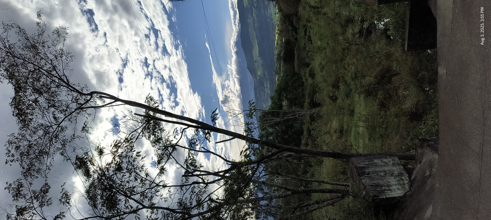

<br><details><summary>:camera:**49/IMG_20250803_160005968_HDR.jpg**</summary><sub> `Exif version` 0220 `OS version`  `Date` 2025:08:03 16:00:07 `Aperture` Not known `Brightness` 0.0 `Color space` 1 `Compression` 6`Exposure mode` 0 `Exposure time` 0.000192 `Focal length` 5.56 `Lens model` Not known `Lens specification` Not known `Orientation` 1 `Scene type` Not known `f number` 1.88 `White balance` 0 `Sensing method` 1 `Shutter speed` 12.346</sub></details>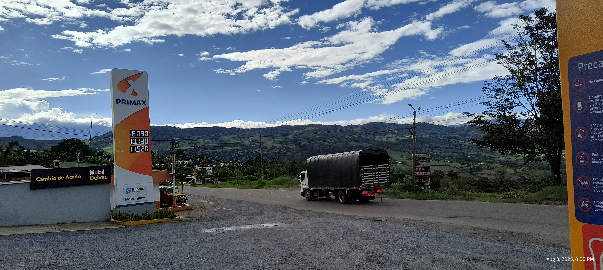

<br><details><summary>:camera:**49/IMG_20250803_160013533.jpg**</summary><sub> `Exif version` 0220 `OS version`  `Date` 2025:08:03 16:00:14 `Aperture` Not known `Brightness` 0.0 `Color space` 1 `Compression` 6`Exposure mode` 0 `Exposure time` 0.000224 `Focal length` 5.56 `Lens model` Not known `Lens specification` Not known `Orientation` 6 `Scene type` Not known `f number` 1.88 `White balance` 0 `Sensing method` 1 `Shutter speed` 12.124</sub></details>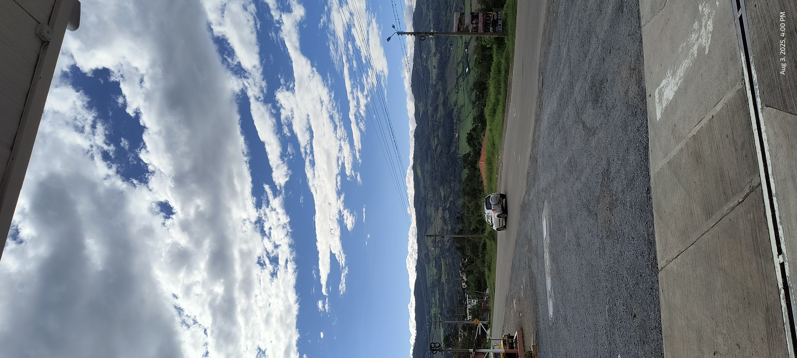

<br><details><summary>:camera:**49/IMG_20250803_160342622.jpg**</summary><sub> `Exif version` 0220 `OS version`  `Date` 2025:08:03 16:03:43 `Aperture` Not known `Brightness` 0.0 `Color space` 1 `Compression` 6`Exposure mode` 0 `Exposure time` 0.00048 `Focal length` 5.56 `Lens model` Not known `Lens specification` Not known `Orientation` 1 `Scene type` Not known `f number` 1.88 `White balance` 0 `Sensing method` 1 `Shutter speed` 11.024</sub></details>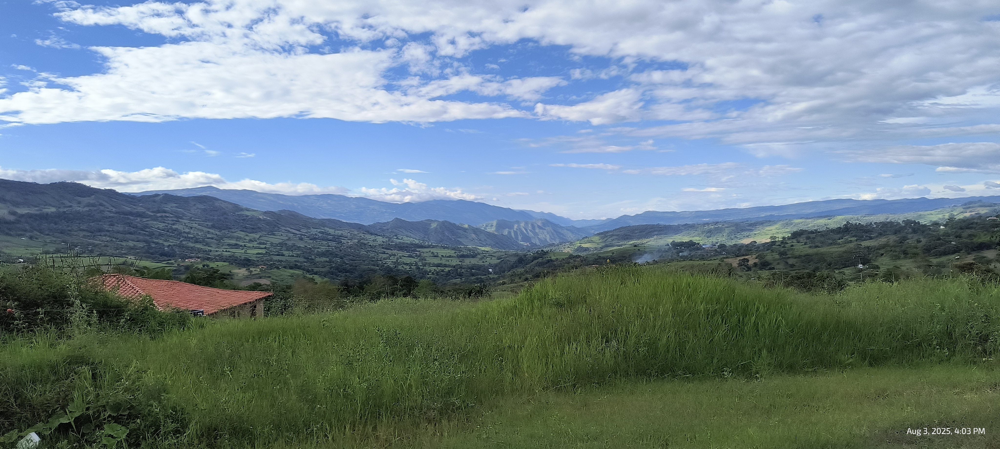

<br><details><summary>:camera:**49/IMG_20250803_160344331.jpg**</summary><sub> `Exif version` 0220 `OS version`  `Date` 2025:08:03 16:03:45 `Aperture` Not known `Brightness` 0.0 `Color space` 1 `Compression` 6`Exposure mode` 0 `Exposure time` 0.000576 `Focal length` 5.56 `Lens model` Not known `Lens specification` Not known `Orientation` 1 `Scene type` Not known `f number` 1.88 `White balance` 0 `Sensing method` 1 `Shutter speed` 10.761</sub></details>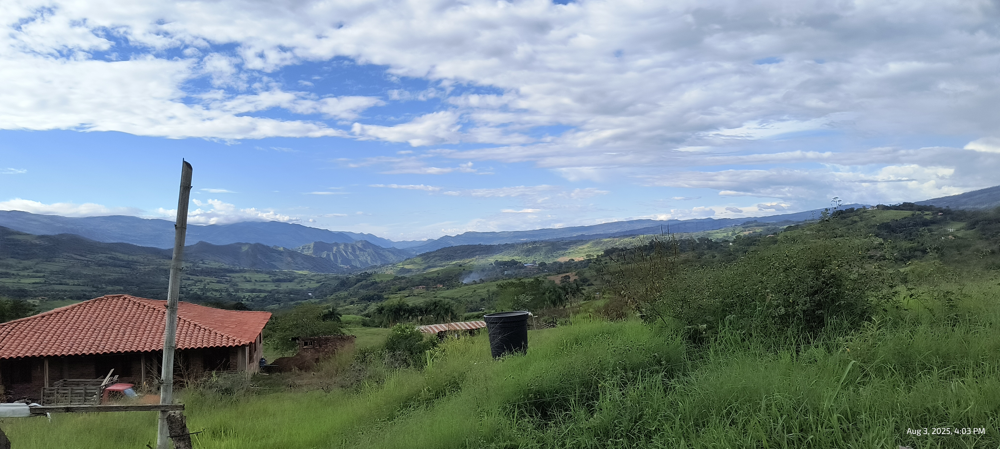

<br><details><summary>:camera:**49/IMG_20250803_160345895.jpg**</summary><sub> `Exif version` 0220 `OS version`  `Date` 2025:08:03 16:03:46 `Aperture` Not known `Brightness` 0.0 `Color space` 1 `Compression` 6`Exposure mode` 0 `Exposure time` 0.000416 `Focal length` 5.56 `Lens model` Not known `Lens specification` Not known `Orientation` 1 `Scene type` Not known `f number` 1.88 `White balance` 0 `Sensing method` 1 `Shutter speed` 11.231</sub></details>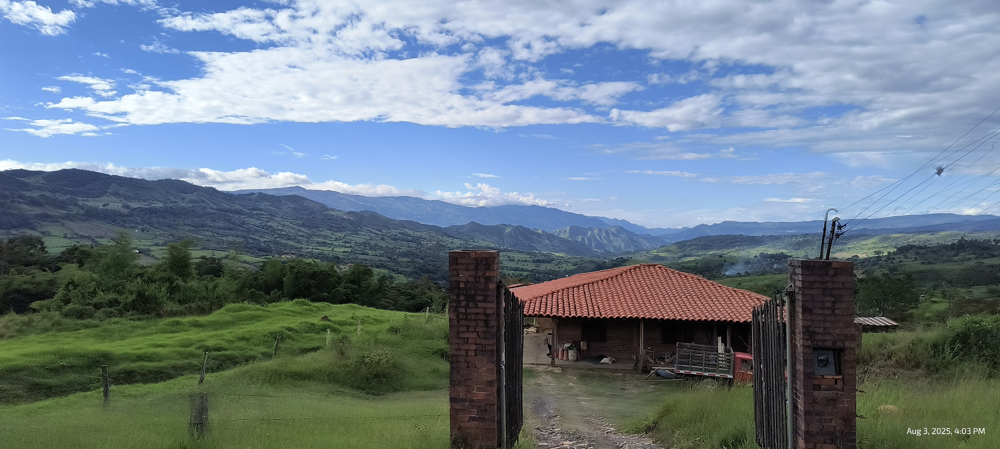

<br><details><summary>:camera:**49/IMG_20250807_113930847.jpg**</summary><sub> `Exif version` 0220 `OS version`  `Date` 2025:08:07 11:39:32 `Aperture` Not known `Brightness` 0.0 `Color space` 1 `Compression` 6`Exposure mode` 0 `Exposure time` 0.000384 `Focal length` 5.56 `Lens model` Not known `Lens specification` Not known `Orientation` 1 `Scene type` Not known `f number` 1.88 `White balance` 0 `Sensing method` 1 `Shutter speed` 11.346</sub></details>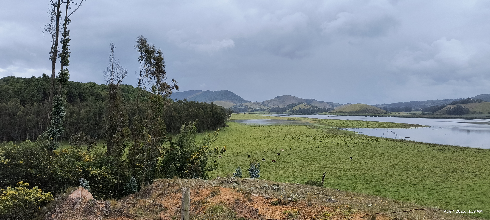

<br><details><summary>:camera:**49/IMG_20250807_113933060.jpg**</summary><sub> `Exif version` 0220 `OS version`  `Date` 2025:08:07 11:39:33 `Aperture` Not known `Brightness` 0.0 `Color space` 1 `Compression` 6`Exposure mode` 0 `Exposure time` 0.00032 `Focal length` 5.56 `Lens model` Not known `Lens specification` Not known `Orientation` 1 `Scene type` Not known `f number` 1.88 `White balance` 0 `Sensing method` 1 `Shutter speed` 11.609</sub></details>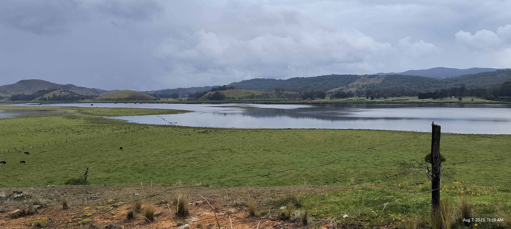

<br><details><summary>:camera:**49/IMG_20250807_113936061.jpg**</summary><sub> `Exif version` 0220 `OS version`  `Date` 2025:08:07 11:39:36 `Aperture` Not known `Brightness` 0.0 `Color space` 1 `Compression` 6`Exposure mode` 0 `Exposure time` 0.000352 `Focal length` 5.56 `Lens model` Not known `Lens specification` Not known `Orientation` 1 `Scene type` Not known `f number` 1.88 `White balance` 0 `Sensing method` 1 `Shutter speed` 11.472</sub></details>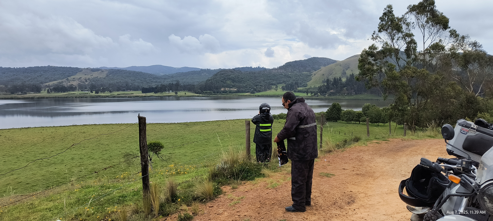

<br><details><summary>:camera:**49/IMG_20250807_113937677.jpg**</summary><sub> `Exif version` 0220 `OS version`  `Date` 2025:08:07 11:39:38 `Aperture` Not known `Brightness` 0.0 `Color space` 1 `Compression` 6`Exposure mode` 0 `Exposure time` 0.000352 `Focal length` 5.56 `Lens model` Not known `Lens specification` Not known `Orientation` 1 `Scene type` Not known `f number` 1.88 `White balance` 0 `Sensing method` 1 `Shutter speed` 11.472</sub></details>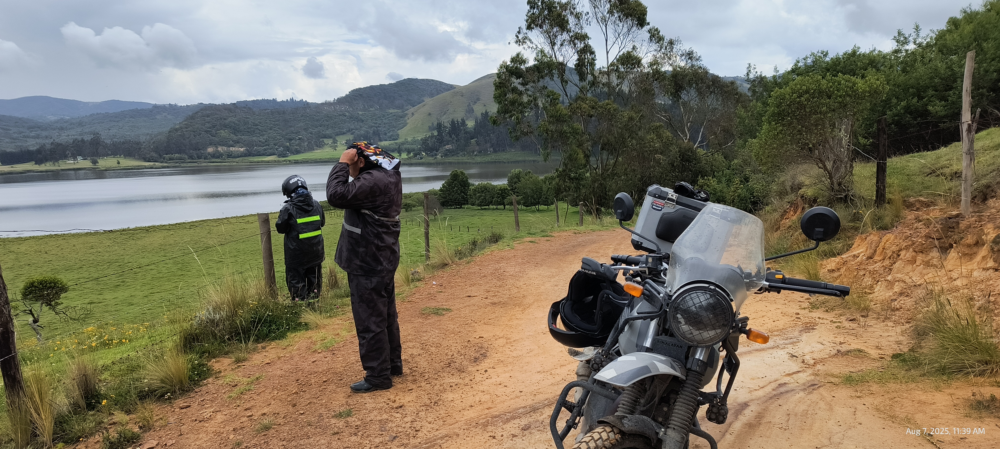

<br><details><summary>:camera:**49/IMG_20250807_113945753.jpg**</summary><sub> `Exif version` 0220 `OS version`  `Date` 2025:08:07 11:39:46 `Aperture` Not known `Brightness` 0.0 `Color space` 1 `Compression` 6`Exposure mode` 0 `Exposure time` 0.000384 `Focal length` 5.56 `Lens model` Not known `Lens specification` Not known `Orientation` 1 `Scene type` Not known `f number` 1.88 `White balance` 0 `Sensing method` 1 `Shutter speed` 11.346</sub></details>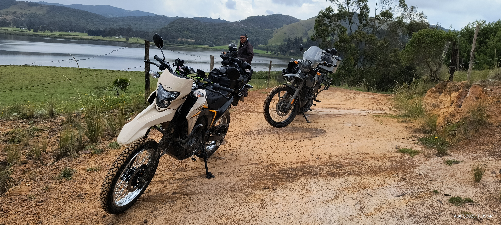

<br><details><summary>:camera:**49/IMG_20250807_113954453.jpg**</summary><sub> `Exif version` 0220 `OS version`  `Date` 2025:08:07 11:39:55 `Aperture` Not known `Brightness` 0.0 `Color space` 1 `Compression` 6`Exposure mode` 0 `Exposure time` 0.000256 `Focal length` 5.56 `Lens model` Not known `Lens specification` Not known `Orientation` 6 `Scene type` Not known `f number` 1.88 `White balance` 0 `Sensing method` 1 `Shutter speed` 11.931</sub></details>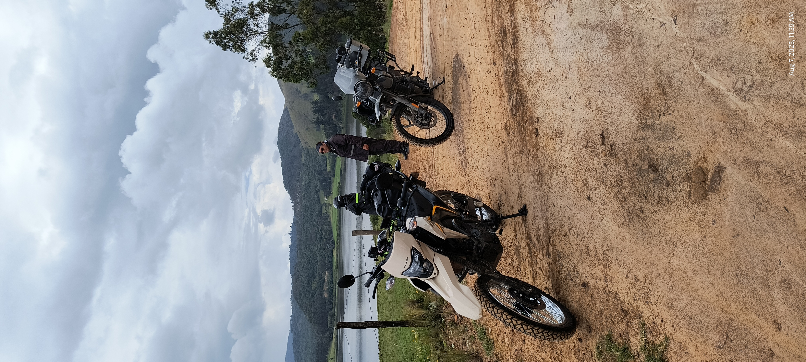

<br><details><summary>:camera:**49/IMG_20250807_114001994.jpg**</summary><sub> `Exif version` 0220 `OS version`  `Date` 2025:08:07 11:40:02 `Aperture` Not known `Brightness` 0.0 `Color space` 1 `Compression` 6`Exposure mode` 0 `Exposure time` 0.000288 `Focal length` 5.56 `Lens model` Not known `Lens specification` Not known `Orientation` 6 `Scene type` Not known `f number` 1.88 `White balance` 0 `Sensing method` 1 `Shutter speed` 11.761</sub></details>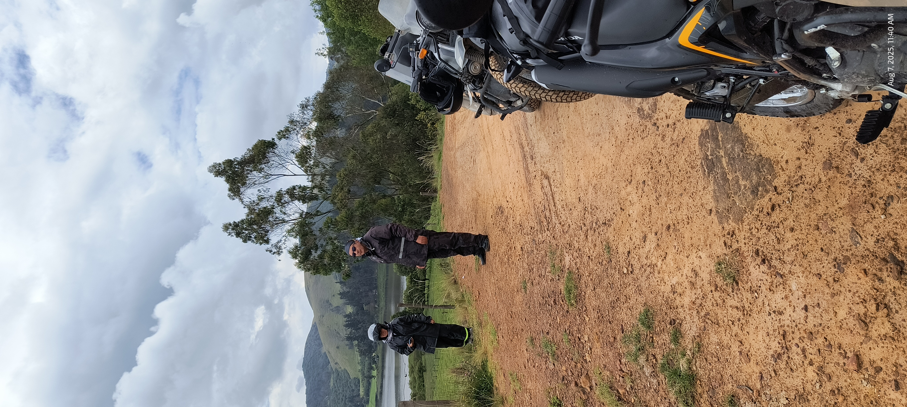

<br><details><summary>:camera:**49/IMG_20250807_114004558.jpg**</summary><sub> `Exif version` 0220 `OS version`  `Date` 2025:08:07 11:40:05 `Aperture` Not known `Brightness` 0.0 `Color space` 1 `Compression` 6`Exposure mode` 0 `Exposure time` 0.00032 `Focal length` 5.56 `Lens model` Not known `Lens specification` Not known `Orientation` 1 `Scene type` Not known `f number` 1.88 `White balance` 0 `Sensing method` 1 `Shutter speed` 11.609</sub></details>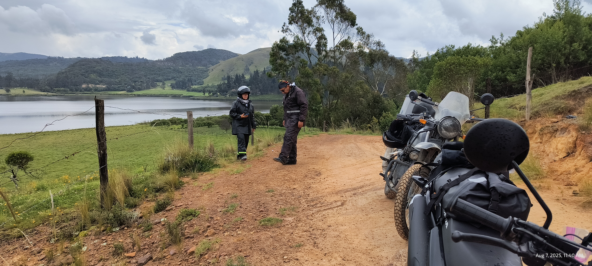

<br><details><summary>:camera:**49/IMG_20250807_114027053.jpg**</summary><sub> `Exif version` 0220 `OS version`  `Date` 2025:08:07 11:40:27 `Aperture` Not known `Brightness` 0.0 `Color space` 1 `Compression` 6`Exposure mode` 0 `Exposure time` 0.000384 `Focal length` 5.56 `Lens model` Not known `Lens specification` Not known `Orientation` 1 `Scene type` Not known `f number` 1.88 `White balance` 0 `Sensing method` 1 `Shutter speed` 11.346</sub></details>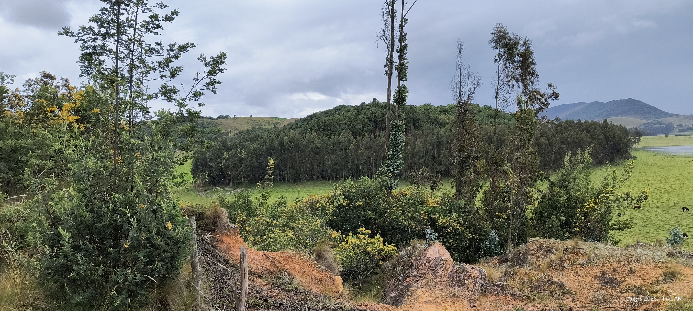

<br><details><summary>:camera:**49/IMG_20250807_114029339.jpg**</summary><sub> `Exif version` 0220 `OS version`  `Date` 2025:08:07 11:40:29 `Aperture` Not known `Brightness` 0.0 `Color space` 1 `Compression` 6`Exposure mode` 0 `Exposure time` 0.000352 `Focal length` 5.56 `Lens model` Not known `Lens specification` Not known `Orientation` 1 `Scene type` Not known `f number` 1.88 `White balance` 0 `Sensing method` 1 `Shutter speed` 11.472</sub></details>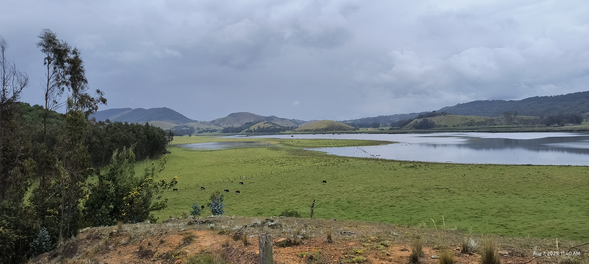

<br><details><summary>:camera:**49/IMG_20250807_114031651.jpg**</summary><sub> `Exif version` 0220 `OS version`  `Date` 2025:08:07 11:40:32 `Aperture` Not known `Brightness` 0.0 `Color space` 1 `Compression` 6`Exposure mode` 0 `Exposure time` 0.000288 `Focal length` 5.56 `Lens model` Not known `Lens specification` Not known `Orientation` 1 `Scene type` Not known `f number` 1.88 `White balance` 0 `Sensing method` 1 `Shutter speed` 11.761</sub></details>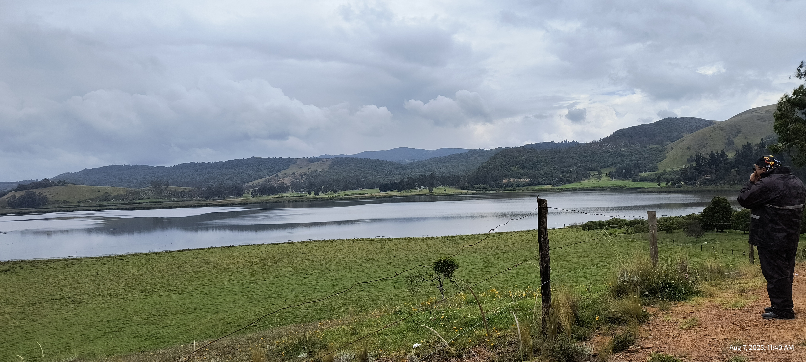

<br><details><summary>:camera:**49/IMG_20250807_114033513.jpg**</summary><sub> `Exif version` 0220 `OS version`  `Date` 2025:08:07 11:40:34 `Aperture` Not known `Brightness` 0.0 `Color space` 1 `Compression` 6`Exposure mode` 0 `Exposure time` 0.000288 `Focal length` 5.56 `Lens model` Not known `Lens specification` Not known `Orientation` 1 `Scene type` Not known `f number` 1.88 `White balance` 0 `Sensing method` 1 `Shutter speed` 11.761</sub></details>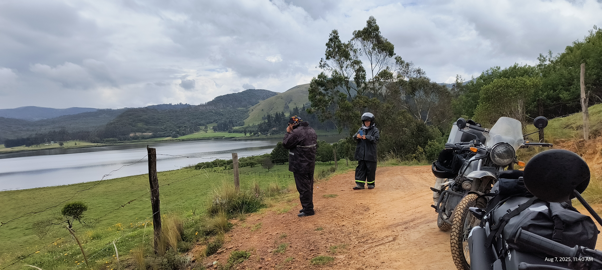

<br><details><summary>:camera:**49/IMG_20250807_133601575_HDR.jpg**</summary><sub> `Exif version` 0220 `OS version`  `Date` 2025:08:07 13:36:03 `Aperture` Not known `Brightness` 0.0 `Color space` 1 `Compression` 6`Exposure mode` 0 `Exposure time` 0.000256 `Focal length` 5.56 `Lens model` Not known `Lens specification` Not known `Orientation` 1 `Scene type` Not known `f number` 1.88 `White balance` 0 `Sensing method` 1 `Shutter speed` 11.931</sub></details>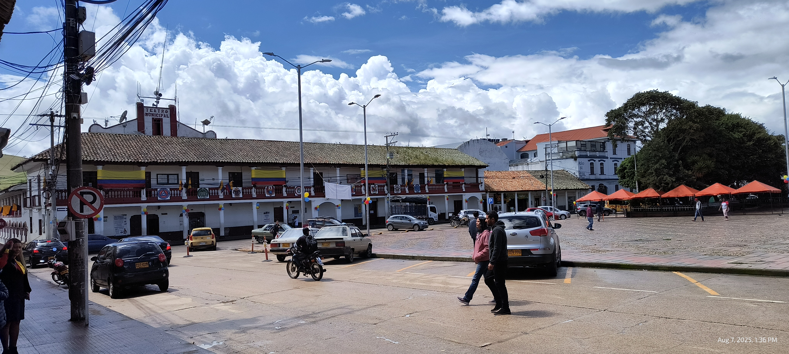

<br><details><summary>:camera:**49/IMG_20250807_133605276_HDR.jpg**</summary><sub> `Exif version` 0220 `OS version`  `Date` 2025:08:07 13:36:06 `Aperture` Not known `Brightness` 0.0 `Color space` 1 `Compression` 6`Exposure mode` 0 `Exposure time` 0.000416 `Focal length` 5.56 `Lens model` Not known `Lens specification` Not known `Orientation` 1 `Scene type` Not known `f number` 1.88 `White balance` 0 `Sensing method` 1 `Shutter speed` 11.231</sub></details>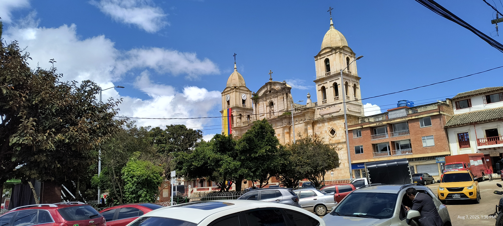

<br><details><summary>:camera:**49/IMG_20250807_133608358_HDR.jpg**</summary><sub> `Exif version` 0220 `OS version`  `Date` 2025:08:07 13:36:10 `Aperture` Not known `Brightness` 0.0 `Color space` 1 `Compression` 6`Exposure mode` 0 `Exposure time` 0.000352 `Focal length` 5.56 `Lens model` Not known `Lens specification` Not known `Orientation` 1 `Scene type` Not known `f number` 1.88 `White balance` 0 `Sensing method` 1 `Shutter speed` 11.472</sub></details>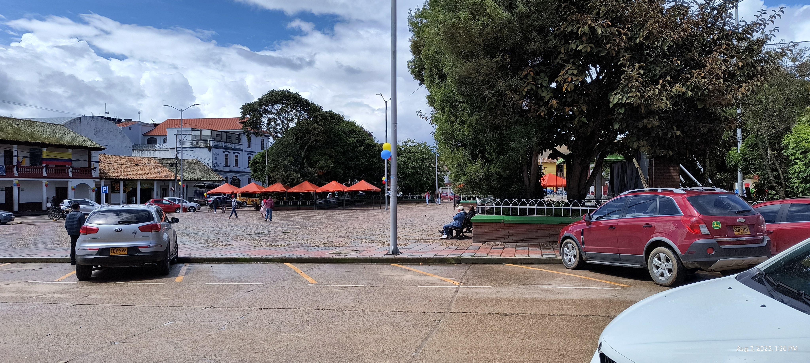

<br><details><summary>:camera:**49/IMG_20250807_141004750.jpg**</summary><sub> `Exif version` 0220 `OS version`  `Date` 2025:08:07 14:10:05 `Aperture` Not known `Brightness` 0.0 `Color space` 1 `Compression` 6`Exposure mode` 0 `Exposure time` 0.000490343 `Focal length` 2.13 `Lens model` Not known `Lens specification` Not known `Orientation` 1 `Scene type` Not known `f number` 2.2 `White balance` 0 `Sensing method` 1 `Shutter speed` 10.993</sub></details>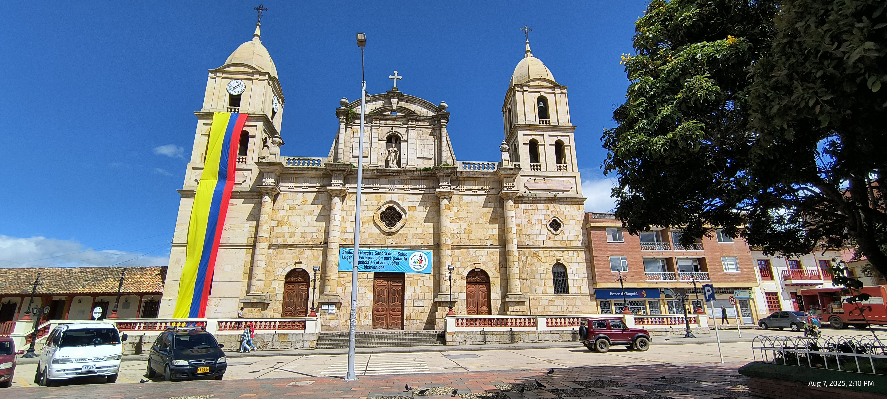

<br><details><summary>:camera:**49/IMG_20250807_141008482.jpg**</summary><sub> `Exif version` 0220 `OS version`  `Date` 2025:08:07 14:10:09 `Aperture` Not known `Brightness` 0.0 `Color space` 1 `Compression` 6`Exposure mode` 0 `Exposure time` 0.000450315 `Focal length` 2.13 `Lens model` Not known `Lens specification` Not known `Orientation` 1 `Scene type` Not known `f number` 2.2 `White balance` 0 `Sensing method` 1 `Shutter speed` 11.116</sub></details>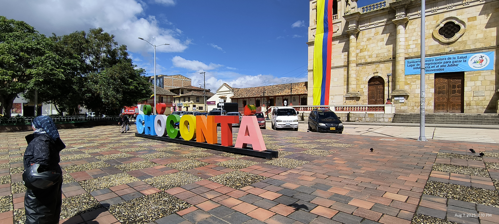

<br><details><summary>:camera:**49/IMG_20250807_141011115.jpg**</summary><sub> `Exif version` 0220 `OS version`  `Date` 2025:08:07 14:10:11 `Aperture` Not known `Brightness` 0.0 `Color space` 1 `Compression` 6`Exposure mode` 0 `Exposure time` 0.000450315 `Focal length` 2.13 `Lens model` Not known `Lens specification` Not known `Orientation` 1 `Scene type` Not known `f number` 2.2 `White balance` 0 `Sensing method` 1 `Shutter speed` 11.116</sub></details>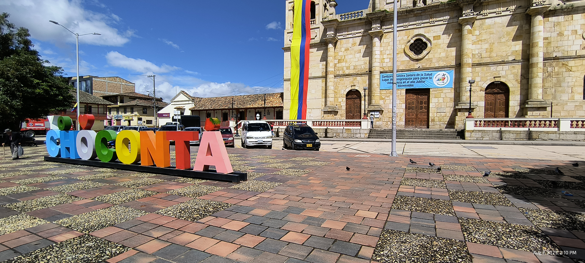

<br><details><summary>:camera:**49/IMG_20250807_141014080.jpg**</summary><sub> `Exif version` 0220 `OS version`  `Date` 2025:08:07 14:10:14 `Aperture` Not known `Brightness` 0.0 `Color space` 1 `Compression` 6`Exposure mode` 0 `Exposure time` 0.000430301 `Focal length` 2.13 `Lens model` Not known `Lens specification` Not known `Orientation` 1 `Scene type` Not known `f number` 2.2 `White balance` 0 `Sensing method` 1 `Shutter speed` 11.182</sub></details>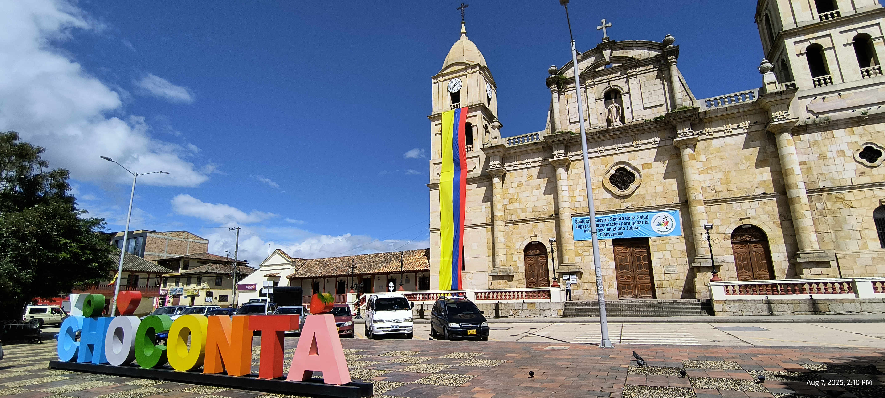

<br><details><summary>:camera:**49/IMG_20250807_141617683.jpg**</summary><sub> `Exif version` 0220 `OS version`  `Date` 2025:08:07 14:16:18 `Aperture` Not known `Brightness` 0.0 `Color space` 1 `Compression` 6`Exposure mode` 0 `Exposure time` 0.000220154 `Focal length` 2.13 `Lens model` Not known `Lens specification` Not known `Orientation` 1 `Scene type` Not known `f number` 2.2 `White balance` 0 `Sensing method` 1 `Shutter speed` 12.149</sub></details>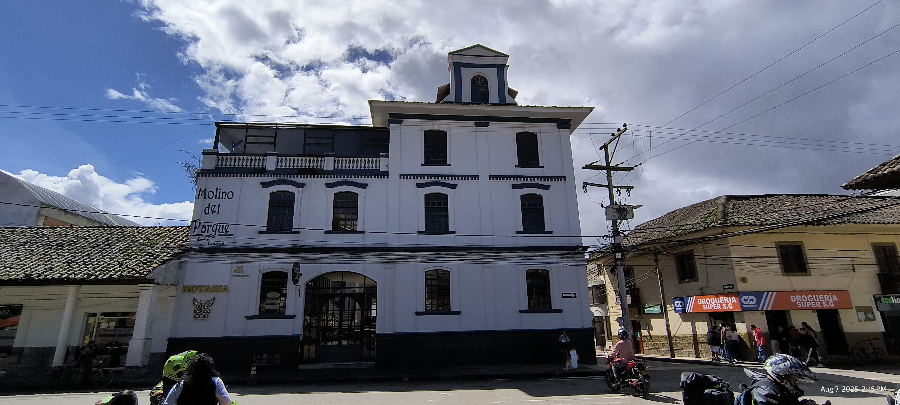

<br><details><summary>:camera:**49/IMG_20250807_141620890_HDR.jpg**</summary><sub> `Exif version` 0220 `OS version`  `Date` 2025:08:07 14:16:22 `Aperture` Not known `Brightness` 0.0 `Color space` 1 `Compression` 6`Exposure mode` 0 `Exposure time` 0.000170119 `Focal length` 2.13 `Lens model` Not known `Lens specification` Not known `Orientation` 6 `Scene type` Not known `f number` 2.2 `White balance` 0 `Sensing method` 1 `Shutter speed` 12.521</sub></details>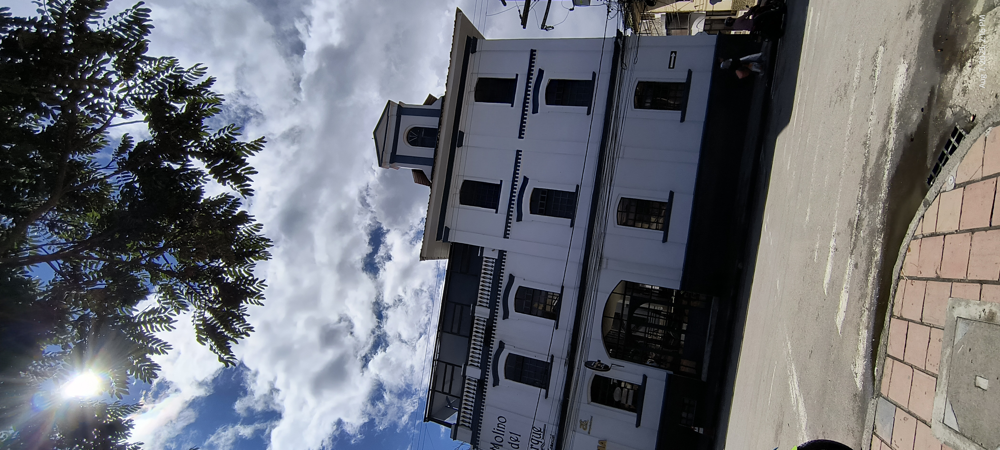

<br><details><summary>:camera:**49/IMG_20250807_141626201.jpg**</summary><sub> `Exif version` 0220 `OS version`  `Date` 2025:08:07 14:16:26 `Aperture` Not known `Brightness` 0.0 `Color space` 1 `Compression` 6`Exposure mode` 0 `Exposure time` 0.00050035 `Focal length` 2.13 `Lens model` Not known `Lens specification` Not known `Orientation` 1 `Scene type` Not known `f number` 2.2 `White balance` 0 `Sensing method` 1 `Shutter speed` 10.964</sub></details>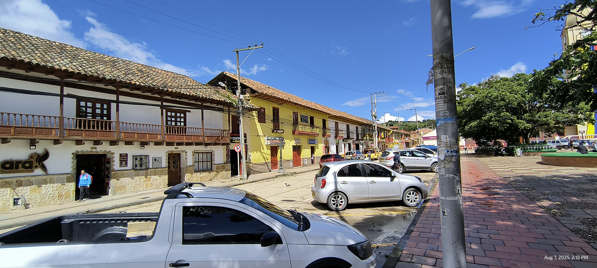

<br><details><summary>:camera:**49/IMG_20250807_141645461_HDR.jpg**</summary><sub> `Exif version` 0220 `OS version`  `Date` 2025:08:07 14:16:47 `Aperture` Not known `Brightness` 0.0 `Color space` 1 `Compression` 6`Exposure mode` 0 `Exposure time` 0.000340238 `Focal length` 2.13 `Lens model` Not known `Lens specification` Not known `Orientation` 1 `Scene type` Not known `f number` 2.2 `White balance` 0 `Sensing method` 1 `Shutter speed` 11.521</sub></details>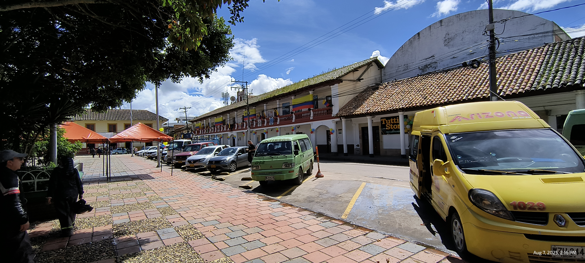

<sub>_Citation: Partial or total digital reproduction of this repository, scripts, development guides, data models, images, and documentation is permitted, provided that it is referenced as: "R.GISMobile - Mobile geographic information systems on QField that do not require an internet connection for navigation." https://github.com/rcfdtools/R.GISMobile - Bogotá - Colombia - South America"._<sub>

| [:house: POI home](../Readme.md) |
|---|