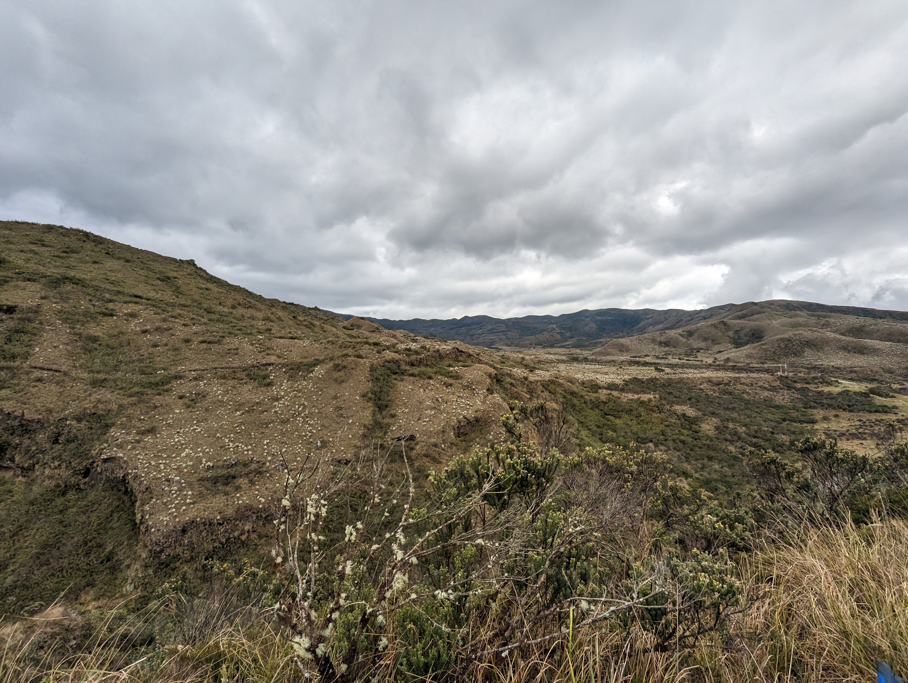
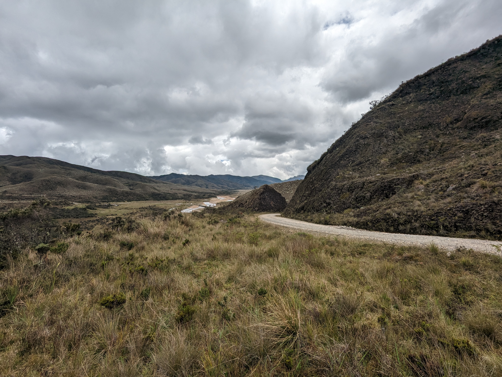

## Localización futura presa Río La Playa - Guatiquía (2023-05-03)
:camera: Fotos: rcfdtools<br>Categoría: Technical field visit

```geojson
{
  "type": "Feature",
  "geometry": {
    "type": "Point", 
    "coordinates": [-73.75708888888889, 4.5409]
  }, 
  "properties": {
    "Name": "Localización futura presa Río La Playa - Guatiquía"
  }
}
```

`File` **5/PXL_20230503_174747256.jpg** <sub>`OS version` HDR+ 1.0.520435816zd `Date` 2023:05:03 12:47:47 `Aperture` Not known `Brightness` 6.15 `Color space` 1 `Compression` 6 `Exif version` 0232 `Exposure mode` 0 `Exposure time` 0.003958 `Focal length` 6.81 `Lens model` Pixel 6 back camera 6.81mm f/1.85 `Lens specification` Not known `Orientation` 1 `Scene type` Not known `Software` HDR+ 1.0.520435816zd `White balance` 0</sub><sub>`Coordinates & altitude` (4.5409, -73.75708888888889, 3220.78)</sub><sub>:earth_americas: Location over [Google Maps](http://maps.google.com/maps?q=4.5409,-73.75708888888889) or [Openstreet Map](https://www.openstreetmap.org/query?lat=4.5409&lon=-73.75708888888889)</sub></sub>


`File` **5/PXL_20230503_174751371.jpg** <sub>`OS version` HDR+ 1.0.520435816zd `Date` 2023:05:03 12:47:51 `Aperture` Not known `Brightness` 6.45 `Color space` 1 `Compression` 6 `Exif version` 0232 `Exposure mode` 0 `Exposure time` 0.003224 `Focal length` 6.81 `Lens model` Pixel 6 back camera 6.81mm f/1.85 `Lens specification` Not known `Orientation` 1 `Scene type` Not known `Software` HDR+ 1.0.520435816zd `White balance` 0</sub><sub>`Coordinates & altitude` (4.5409, -73.75708888888889, 3220.78)</sub><sub>:earth_americas: Location over [Google Maps](http://maps.google.com/maps?q=4.5409,-73.75708888888889) or [Openstreet Map](https://www.openstreetmap.org/query?lat=4.5409&lon=-73.75708888888889)</sub></sub>


`File` **5/PXL_20230503_174827257.jpg** <sub>`OS version` HDR+ 1.0.520435816zd `Date` 2023:05:03 12:48:27 `Aperture` Not known `Brightness` 8.41 `Color space` 1 `Compression` 6 `Exif version` 0232 `Exposure mode` 0 `Exposure time` 0.000889 `Focal length` 2.35 `Lens model` Pixel 6 back camera 2.35mm f/2.2 `Lens specification` Not known `Orientation` 1 `Scene type` Not known `Software` HDR+ 1.0.520435816zd `White balance` 0</sub><sub>`Coordinates & altitude` (4.540480555555556, -73.75746388888889, 3224.2)</sub><sub>:earth_americas: Location over [Google Maps](http://maps.google.com/maps?q=4.540480555555556,-73.75746388888889) or [Openstreet Map](https://www.openstreetmap.org/query?lat=4.540480555555556&lon=-73.75746388888889)</sub></sub>


`File` **5/PXL_20230503_174837491.jpg** <sub>`OS version` HDR+ 1.0.520435816zd `Date` 2023:05:03 12:48:37 `Aperture` Not known `Brightness` 9.94 `Color space` 1 `Compression` 6 `Exif version` 0232 `Exposure mode` 0 `Exposure time` 0.000296 `Focal length` 2.35 `Lens model` Pixel 6 back camera 2.35mm f/2.2 `Lens specification` Not known `Orientation` 1 `Scene type` Not known `Software` HDR+ 1.0.520435816zd `White balance` 0</sub><sub>`Coordinates & altitude` (4.540480555555556, -73.75746388888889, 3224.2)</sub><sub>:earth_americas: Location over [Google Maps](http://maps.google.com/maps?q=4.540480555555556,-73.75746388888889) or [Openstreet Map](https://www.openstreetmap.org/query?lat=4.540480555555556&lon=-73.75746388888889)</sub></sub>


| [:house: Inicio](../Readme.md) |
|---|