<div align="center"></div>

## :earth_americas:POI: _“San Martín, Meta, Colombia (2018-03-29)”_
`Pictures` rcfdtools <br>`Category` Freelance field visit <br>`Location` [Google Maps](http://maps.google.com/maps?q=3.708075,-73.701043) or [Openstreet Map](https://www.openstreetmap.org/query?lat=3.708075&lon=-73.701043) 

```geojson
{
  "type": "Feature",
  "geometry": {
    "type": "Point", 
    "coordinates": [-73.701043, 3.708075]
  }, 
  "properties": {
    "Name": "San Martín, Meta, Colombia"
  }
}
```

<br><details><summary>:camera:**50/20180310_073558_001.jpg**</summary><sub> `Exif version` 0220 `OS version` G930PVPS5BRA1 `Date` 2018:03:10 07:35:59 `Aperture` Not known `Brightness` 9.22 `Color space` 1 `Compression` 6`Exposure mode` 0 `Exposure time` 0.00034626038781163435 `Focal length` 4.2 `Lens model` Not known `Lens specification` Not known `Orientation` 1 `Scene type` Not known `f number` 1.7 `White balance` 0 `Sensing method` 2 `Shutter speed` 11.495</sub></details>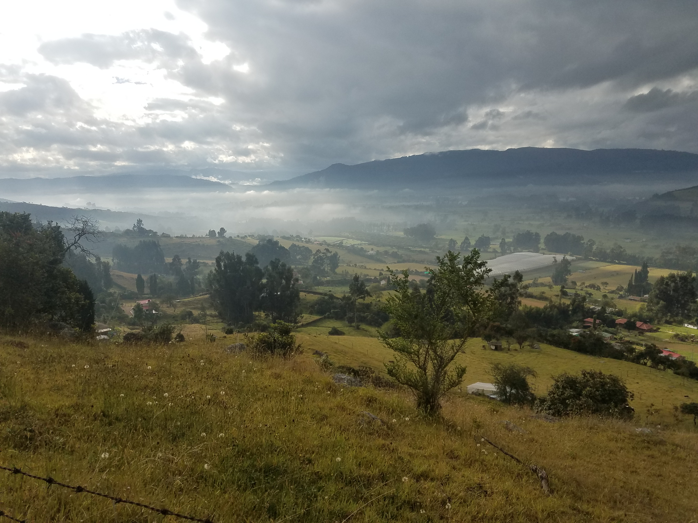

<br><details><summary>:camera:**50/20180310_073605_001.jpg**</summary><sub> `Exif version` 0220 `OS version` G930PVPS5BRA1 `Date` 2018:03:10 07:36:05 `Aperture` Not known `Brightness` 10.78 `Color space` 1 `Compression` 6`Exposure mode` 0 `Exposure time` 0.00012703252032520327 `Focal length` 4.2 `Lens model` Not known `Lens specification` Not known `Orientation` 1 `Scene type` Not known `f number` 1.7 `White balance` 0 `Sensing method` 2 `Shutter speed` 12.942</sub></details>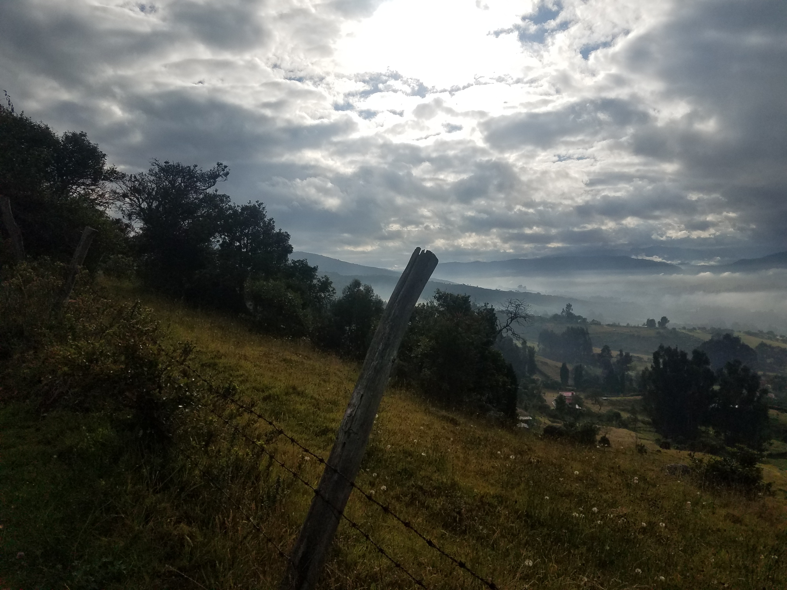

<br><details><summary>:camera:**50/20180329_134615.jpg**</summary><sub> `Exif version` 0220 `OS version` G930PVPS5BRA1 `Date` 2018:03:29 13:46:15 `Aperture` Not known `Brightness` 10.04 `Color space` 1 `Compression` 6`Exposure mode` 0 `Exposure time` 0.00020833333333333335 `Focal length` 4.2 `Lens model` Not known `Lens specification` Not known `Orientation` 1 `Scene type` Not known `f number` 1.7 `White balance` 0 `Sensing method` 2 `Shutter speed` 12.228</sub></details>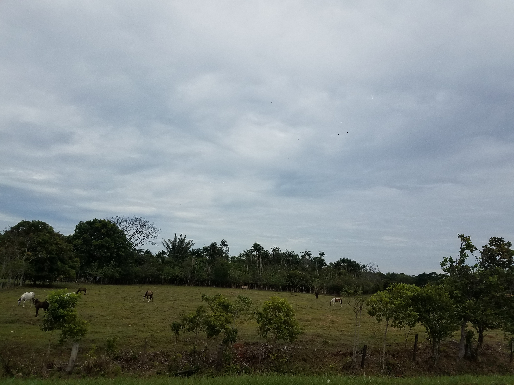

<br><details><summary>:camera:**50/20180329_143519.jpg**</summary><sub> `Exif version` 0220 `OS version` G930PVPS5BRA1 `Date` 2018:03:29 14:35:19 `Aperture` Not known `Brightness` 10.62 `Color space` 1 `Compression` 6`Exposure mode` 0 `Exposure time` 0.00013736263736263736 `Focal length` 4.2 `Lens model` Not known `Lens specification` Not known `Orientation` 1 `Scene type` Not known `f number` 1.7 `White balance` 0 `Sensing method` 2 `Shutter speed` 12.829</sub><sub>`Coordinates & altitude` (3.489412138888889, -73.65893816666667, 436.0)</sub><sub> :earth_americas:`Location over` [Google Maps](http://maps.google.com/maps?q=3.489412138888889,-73.65893816666667) or [Openstreet Map](https://www.openstreetmap.org/query?lat=3.489412138888889&lon=-73.65893816666667)</sub></details>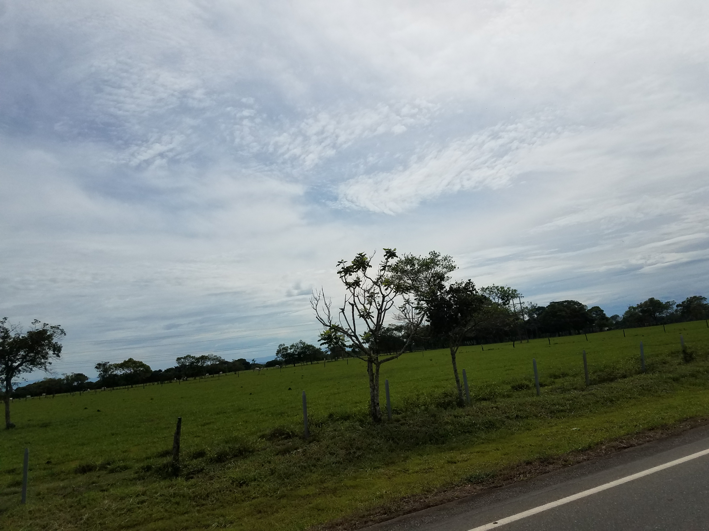

<br><details><summary>:camera:**50/20180329_152128.jpg**</summary><sub> `Exif version` 0220 `OS version` G930PVPS5BRA1 `Date` 2018:03:29 15:21:28 `Aperture` Not known `Brightness` 10.17 `Color space` 1 `Compression` 6`Exposure mode` 0 `Exposure time` 0.00017908309455587392 `Focal length` 4.2 `Lens model` Not known `Lens specification` Not known `Orientation` 1 `Scene type` Not known `f number` 1.7 `White balance` 0 `Sensing method` 2 `Shutter speed` 12.447</sub><sub>`Coordinates & altitude` (3.4355449444444446, -73.76103758333333, 366.0)</sub><sub> :earth_americas:`Location over` [Google Maps](http://maps.google.com/maps?q=3.4355449444444446,-73.76103758333333) or [Openstreet Map](https://www.openstreetmap.org/query?lat=3.4355449444444446&lon=-73.76103758333333)</sub></details>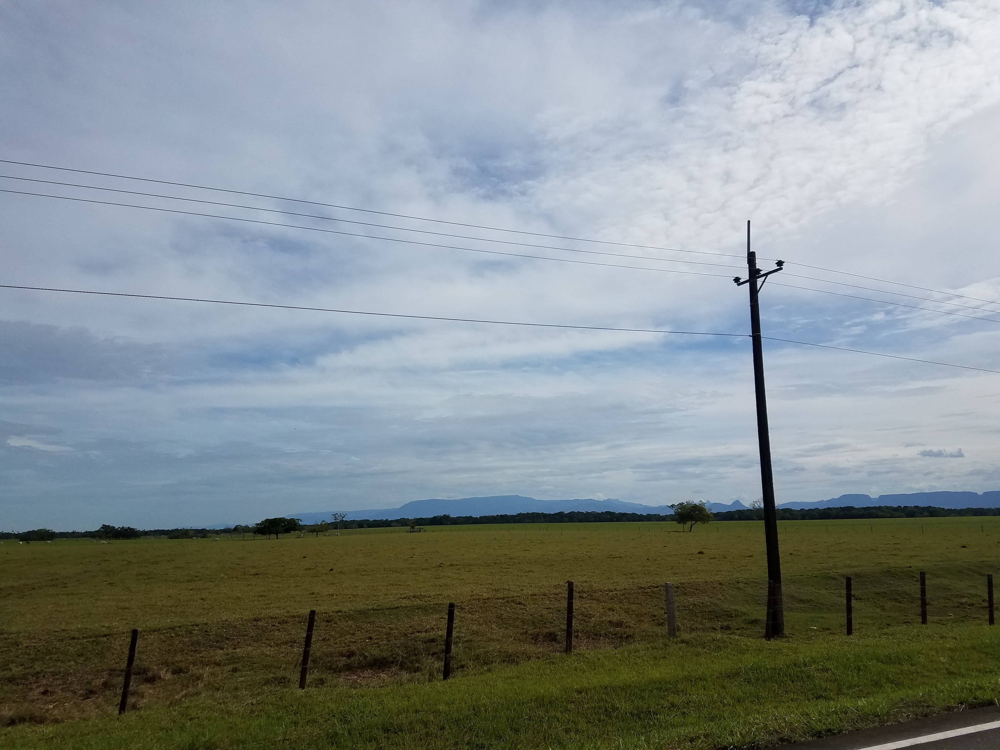

<br><details><summary>:camera:**50/20180329_152144.jpg**</summary><sub> `Exif version` 0220 `OS version` G930PVPS5BRA1 `Date` 2018:03:29 15:21:44 `Aperture` Not known `Brightness` Not known `Color space` 1 `Compression` Not known`Exposure mode` 0 `Exposure time` Not known `Focal length` 4.2 `Lens model` Not known `Lens specification` Not known `Orientation` 1 `Scene type` Not known `f number` 1.7 `White balance` 0 `Sensing method` Not known `Shutter speed` Not known</sub></details>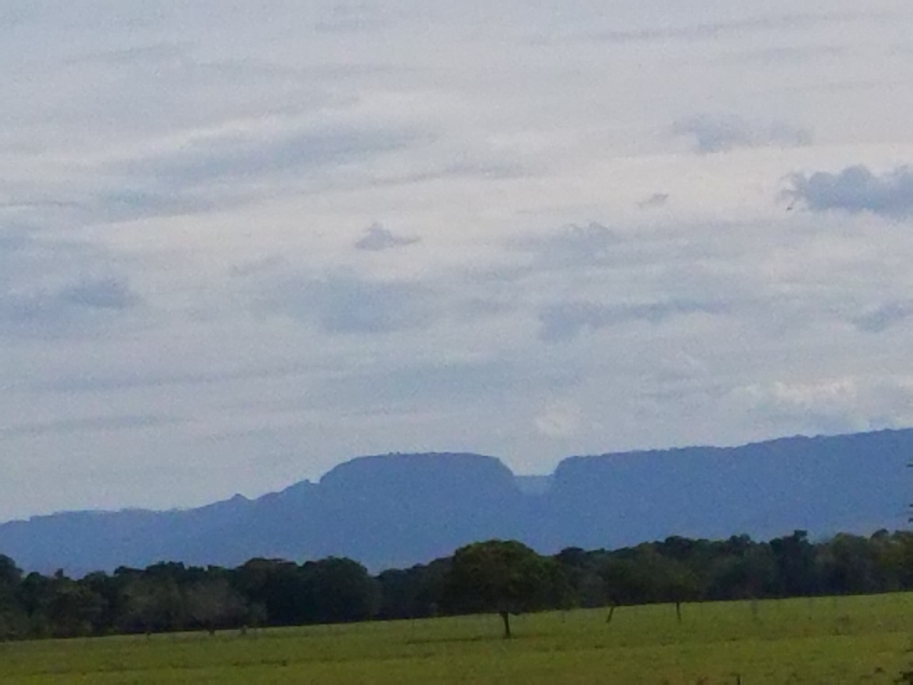

<br><details><summary>:camera:**50/20180329_152146_001.jpg**</summary><sub> `Exif version` 0220 `OS version` G930PVPS5BRA1 `Date` 2018:03:29 15:21:46 `Aperture` Not known `Brightness` 10.19 `Color space` 1 `Compression` 6`Exposure mode` 0 `Exposure time` 0.0002042483660130719 `Focal length` 4.2 `Lens model` Not known `Lens specification` Not known `Orientation` 1 `Scene type` Not known `f number` 1.7 `White balance` 0 `Sensing method` 2 `Shutter speed` 12.257</sub><sub>`Coordinates & altitude` (3.401824138888889, -73.81847527777778, 450.0)</sub><sub> :earth_americas:`Location over` [Google Maps](http://maps.google.com/maps?q=3.401824138888889,-73.81847527777778) or [Openstreet Map](https://www.openstreetmap.org/query?lat=3.401824138888889&lon=-73.81847527777778)</sub></details>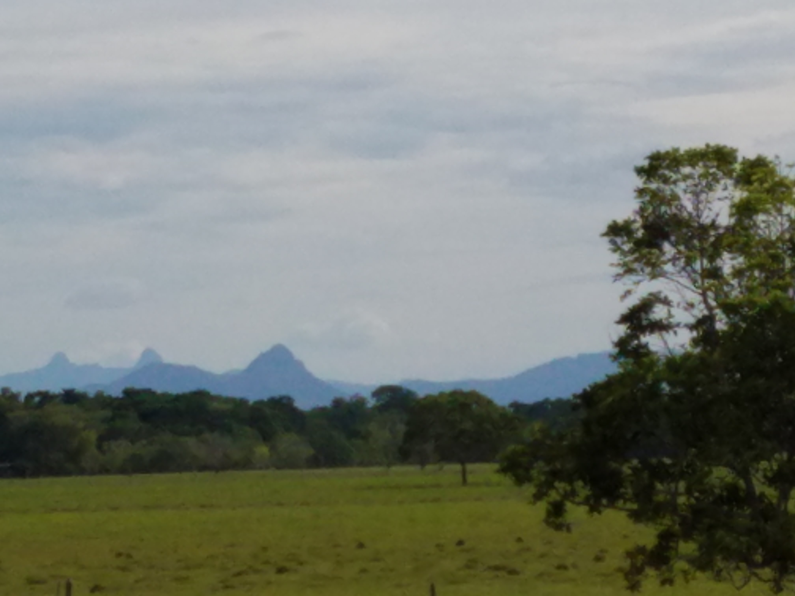

<br><details><summary>:camera:**50/20180329_152148.jpg**</summary><sub> `Exif version` 0220 `OS version` G930PVPS5BRA1 `Date` 2018:03:29 15:21:48 `Aperture` Not known `Brightness` Not known `Color space` 1 `Compression` Not known`Exposure mode` 0 `Exposure time` Not known `Focal length` 4.2 `Lens model` Not known `Lens specification` Not known `Orientation` 1 `Scene type` Not known `f number` 1.7 `White balance` 0 `Sensing method` Not known `Shutter speed` Not known</sub></details>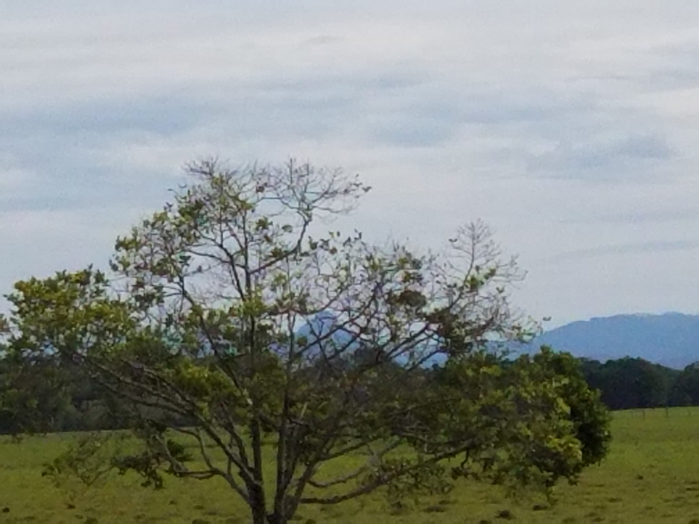

<br><details><summary>:camera:**50/20180329_152150.jpg**</summary><sub> `Exif version` 0220 `OS version` G930PVPS5BRA1 `Date` 2018:03:29 15:21:50 `Aperture` Not known `Brightness` Not known `Color space` 1 `Compression` Not known`Exposure mode` 0 `Exposure time` Not known `Focal length` 4.2 `Lens model` Not known `Lens specification` Not known `Orientation` 1 `Scene type` Not known `f number` 1.7 `White balance` 0 `Sensing method` Not known `Shutter speed` Not known</sub></details>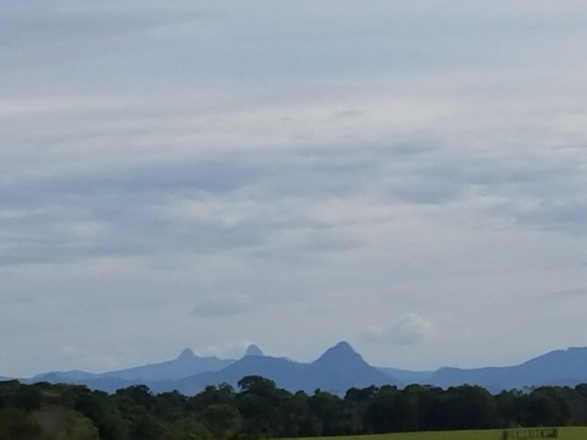

<br><details><summary>:camera:**50/20180329_152153.jpg**</summary><sub> `Exif version` 0220 `OS version` G930PVPS5BRA1 `Date` 2018:03:29 15:21:53 `Aperture` Not known `Brightness` Not known `Color space` 1 `Compression` Not known`Exposure mode` 0 `Exposure time` Not known `Focal length` 4.2 `Lens model` Not known `Lens specification` Not known `Orientation` 1 `Scene type` Not known `f number` 1.7 `White balance` 0 `Sensing method` Not known `Shutter speed` Not known</sub></details>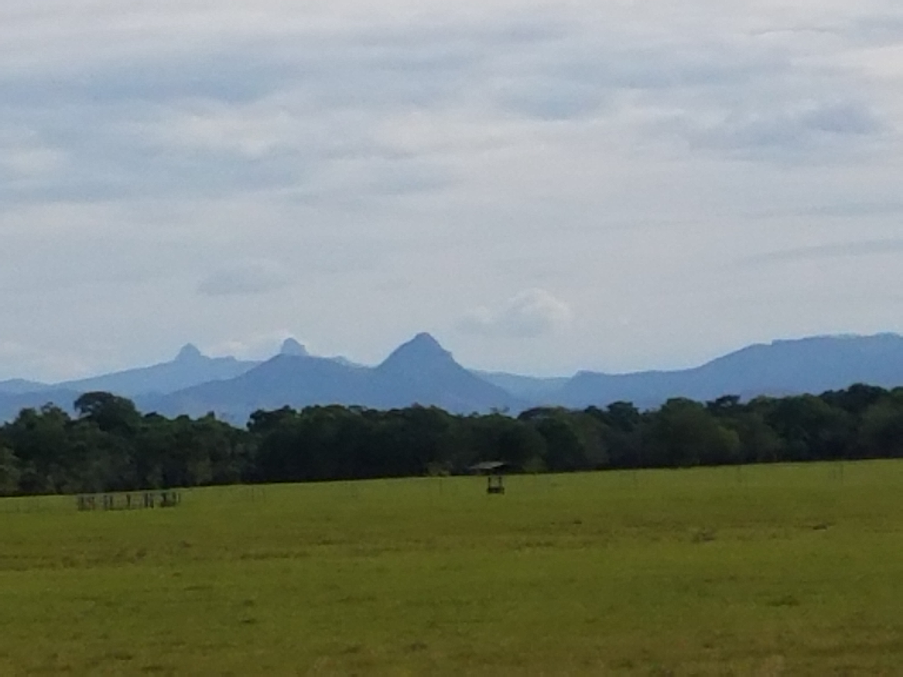

<br><details><summary>:camera:**50/20180329_152419.jpg**</summary><sub> `Exif version` 0220 `OS version` G930PVPS5BRA1 `Date` 2018:03:29 15:24:19 `Aperture` Not known `Brightness` 9.85 `Color space` 1 `Compression` 6`Exposure mode` 0 `Exposure time` 0.0002256317689530686 `Focal length` 4.2 `Lens model` Not known `Lens specification` Not known `Orientation` 1 `Scene type` Not known `f number` 1.7 `White balance` 0 `Sensing method` 2 `Shutter speed` 12.113</sub><sub>`Coordinates & altitude` (3.4000293888888886, -73.85104108333333, 454.0)</sub><sub> :earth_americas:`Location over` [Google Maps](http://maps.google.com/maps?q=3.4000293888888886,-73.85104108333333) or [Openstreet Map](https://www.openstreetmap.org/query?lat=3.4000293888888886&lon=-73.85104108333333)</sub></details>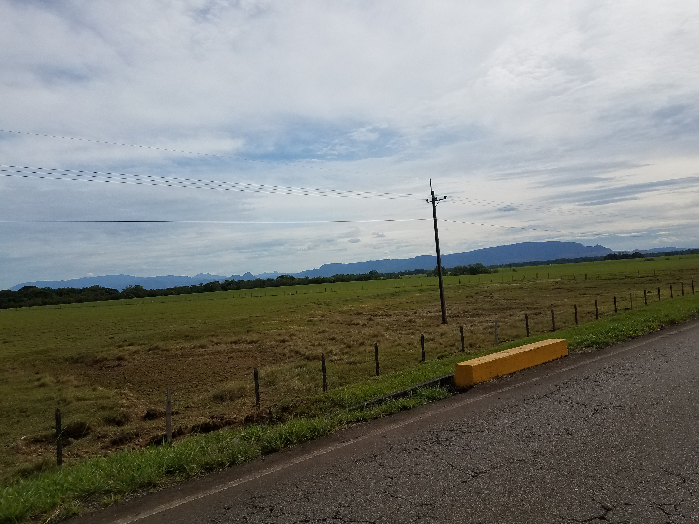

<br><details><summary>:camera:**50/20180329_152423.jpg**</summary><sub> `Exif version` 0220 `OS version` G930PVPS5BRA1 `Date` 2018:03:29 15:24:23 `Aperture` Not known `Brightness` 9.93 `Color space` 1 `Compression` 6`Exposure mode` 0 `Exposure time` 0.00022644927536231884 `Focal length` 4.2 `Lens model` Not known `Lens specification` Not known `Orientation` 1 `Scene type` Not known `f number` 1.7 `White balance` 0 `Sensing method` 2 `Shutter speed` 12.108</sub><sub>`Coordinates & altitude` (3.4000293888888886, -73.85104108333333, 454.0)</sub><sub> :earth_americas:`Location over` [Google Maps](http://maps.google.com/maps?q=3.4000293888888886,-73.85104108333333) or [Openstreet Map](https://www.openstreetmap.org/query?lat=3.4000293888888886&lon=-73.85104108333333)</sub></details>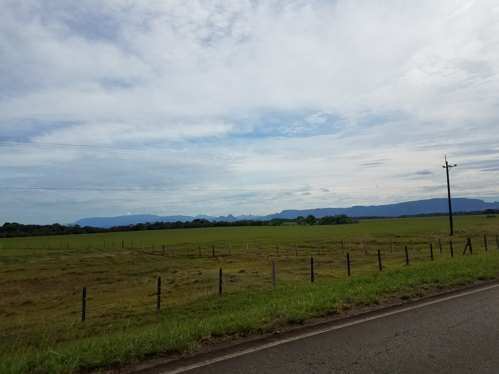

<br><details><summary>:camera:**50/20180329_162244.jpg**</summary><sub> `Exif version` 0220 `OS version` G930PVPS5BRA1 `Date` 2018:03:29 16:22:44 `Aperture` Not known `Brightness` 8.69 `Color space` 1 `Compression` 6`Exposure mode` 0 `Exposure time` 0.0005102040816326531 `Focal length` 4.2 `Lens model` Not known `Lens specification` Not known `Orientation` 1 `Scene type` Not known `f number` 1.7 `White balance` 0 `Sensing method` 2 `Shutter speed` 10.936</sub><sub>`Coordinates & altitude` (3.4031670277777777, -73.79706386111111, 399.0)</sub><sub> :earth_americas:`Location over` [Google Maps](http://maps.google.com/maps?q=3.4031670277777777,-73.79706386111111) or [Openstreet Map](https://www.openstreetmap.org/query?lat=3.4031670277777777&lon=-73.79706386111111)</sub></details>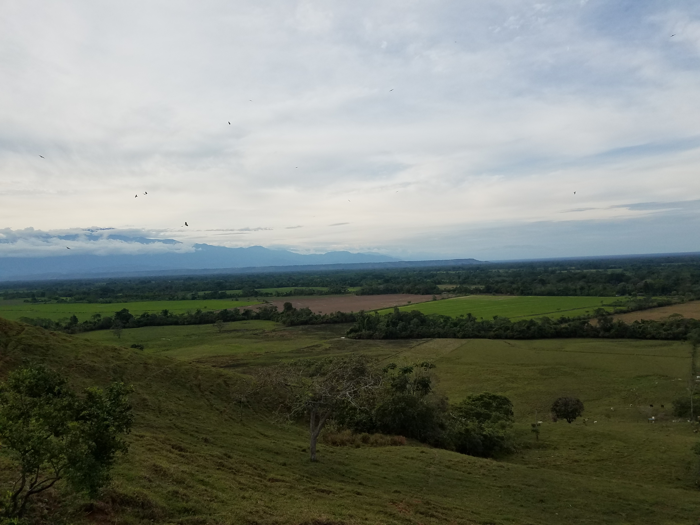

<br><details><summary>:camera:**50/20180329_162246.jpg**</summary><sub> `Exif version` 0220 `OS version` G930PVPS5BRA1 `Date` 2018:03:29 16:22:46 `Aperture` Not known `Brightness` 8.49 `Color space` 1 `Compression` 6`Exposure mode` 0 `Exposure time` 0.000591016548463357 `Focal length` 4.2 `Lens model` Not known `Lens specification` Not known `Orientation` 1 `Scene type` Not known `f number` 1.7 `White balance` 0 `Sensing method` 2 `Shutter speed` 10.724</sub><sub>`Coordinates & altitude` (3.4031670277777777, -73.79706386111111, 399.0)</sub><sub> :earth_americas:`Location over` [Google Maps](http://maps.google.com/maps?q=3.4031670277777777,-73.79706386111111) or [Openstreet Map](https://www.openstreetmap.org/query?lat=3.4031670277777777&lon=-73.79706386111111)</sub></details>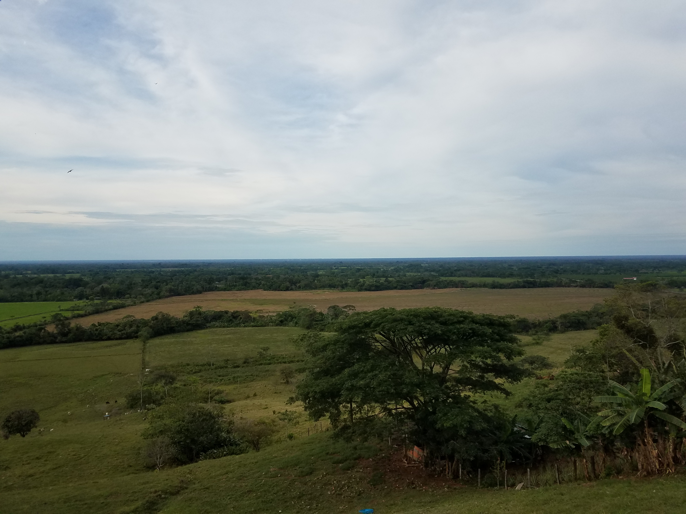

<br><details><summary>:camera:**50/20180329_162248.jpg**</summary><sub> `Exif version` 0220 `OS version` G930PVPS5BRA1 `Date` 2018:03:29 16:22:48 `Aperture` Not known `Brightness` 8.51 `Color space` 1 `Compression` 6`Exposure mode` 0 `Exposure time` 0.0005592841163310962 `Focal length` 4.2 `Lens model` Not known `Lens specification` Not known `Orientation` 1 `Scene type` Not known `f number` 1.7 `White balance` 0 `Sensing method` 2 `Shutter speed` 10.804</sub><sub>`Coordinates & altitude` (3.4031670277777777, -73.79706386111111, 399.0)</sub><sub> :earth_americas:`Location over` [Google Maps](http://maps.google.com/maps?q=3.4031670277777777,-73.79706386111111) or [Openstreet Map](https://www.openstreetmap.org/query?lat=3.4031670277777777&lon=-73.79706386111111)</sub></details>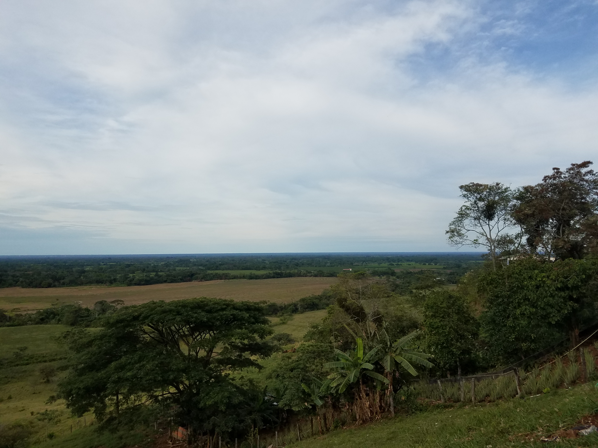

<br><details><summary>:camera:**50/20180329_162256.jpg**</summary><sub> `Exif version` 0220 `OS version` G930PVPS5BRA1 `Date` 2018:03:29 16:22:56 `Aperture` Not known `Brightness` 8.76 `Color space` 1 `Compression` 6`Exposure mode` 0 `Exposure time` 0.00047709923664122136 `Focal length` 4.2 `Lens model` Not known `Lens specification` Not known `Orientation` 1 `Scene type` Not known `f number` 1.7 `White balance` 0 `Sensing method` 2 `Shutter speed` 11.033</sub><sub>`Coordinates & altitude` (3.4031670277777777, -73.79706386111111, 399.0)</sub><sub> :earth_americas:`Location over` [Google Maps](http://maps.google.com/maps?q=3.4031670277777777,-73.79706386111111) or [Openstreet Map](https://www.openstreetmap.org/query?lat=3.4031670277777777&lon=-73.79706386111111)</sub></details>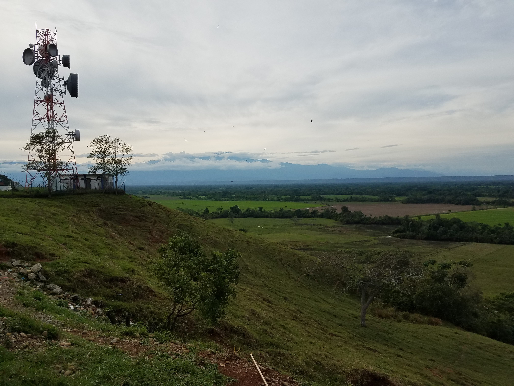

<br><details><summary>:camera:**50/20180329_200411.jpg**</summary><sub> `Exif version` 0220 `OS version` G930PVPS5BRA1 `Date` 2018:03:29 20:04:11 `Aperture` Not known `Brightness` -1.87 `Color space` 1 `Compression` 6`Exposure mode` 0 `Exposure time` 0.1 `Focal length` 4.2 `Lens model` Not known `Lens specification` Not known `Orientation` 1 `Scene type` Not known `f number` 1.7 `White balance` 0 `Sensing method` 2 `Shutter speed` 3.317</sub></details>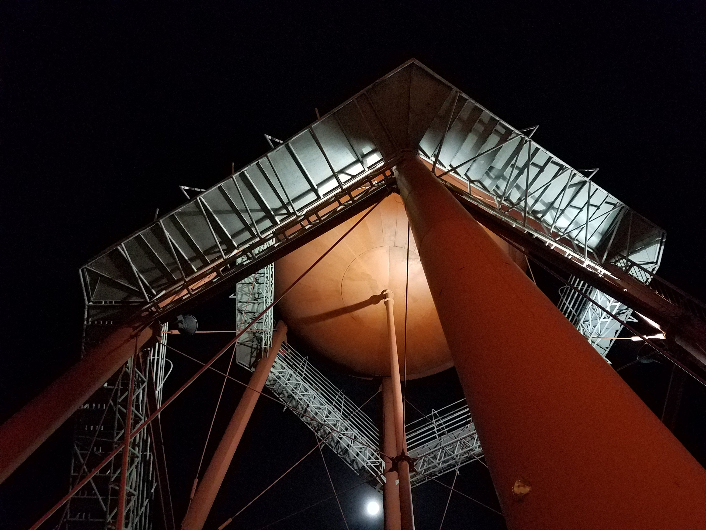

<br><details><summary>:camera:**50/20180329_200635.jpg**</summary><sub> `Exif version` 0220 `OS version` G930PVPS5BRA1 `Date` 2018:03:29 20:06:35 `Aperture` Not known `Brightness` -3.49 `Color space` 1 `Compression` 6`Exposure mode` 0 `Exposure time` 0.1 `Focal length` 4.2 `Lens model` Not known `Lens specification` Not known `Orientation` 1 `Scene type` Not known `f number` 1.7 `White balance` 0 `Sensing method` 2 `Shutter speed` 3.317</sub></details>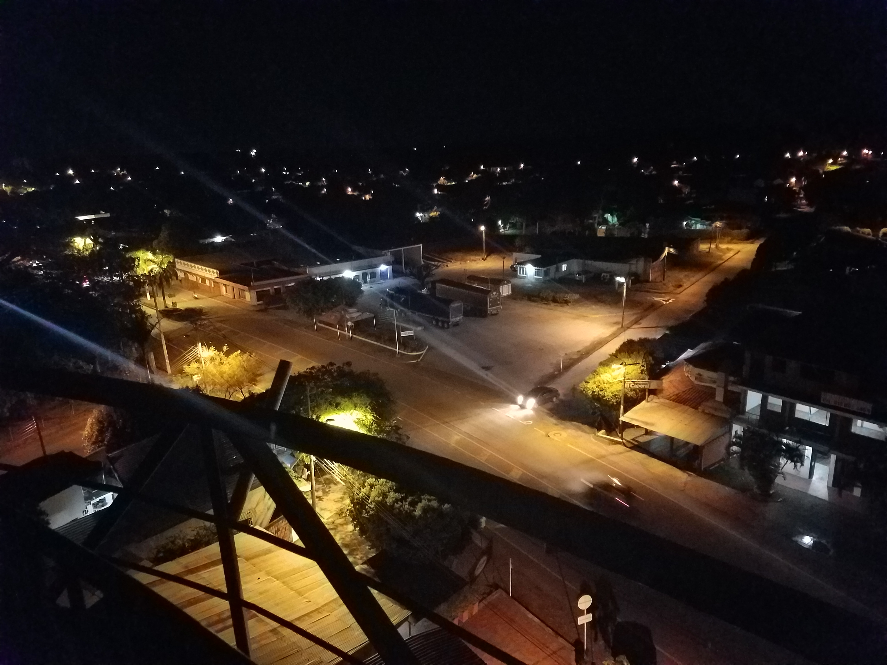

<br><details><summary>:camera:**50/20180329_200655.jpg**</summary><sub> `Exif version` 0220 `OS version` G930PVPS5BRA1 `Date` 2018:03:29 20:06:55 `Aperture` Not known `Brightness` -3.96 `Color space` 1 `Compression` 6`Exposure mode` 0 `Exposure time` 0.1111111111111111 `Focal length` 4.2 `Lens model` Not known `Lens specification` Not known `Orientation` 1 `Scene type` Not known `f number` 1.7 `White balance` 0 `Sensing method` 2 `Shutter speed` 3.179</sub></details>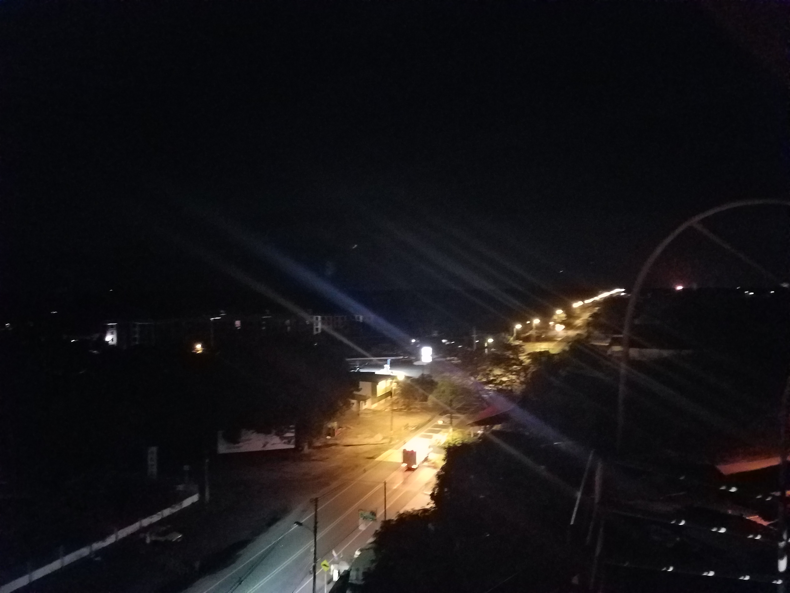

<br><details><summary>:camera:**50/20180329_201440.jpg**</summary><sub> `Exif version` 0220 `OS version` G930PVPS5BRA1 `Date` 2018:03:29 20:14:40 `Aperture` Not known `Brightness` -1.35 `Color space` 1 `Compression` 6`Exposure mode` 0 `Exposure time` 0.1 `Focal length` 4.2 `Lens model` Not known `Lens specification` Not known `Orientation` 1 `Scene type` Not known `f number` 1.7 `White balance` 0 `Sensing method` 2 `Shutter speed` 3.317</sub></details>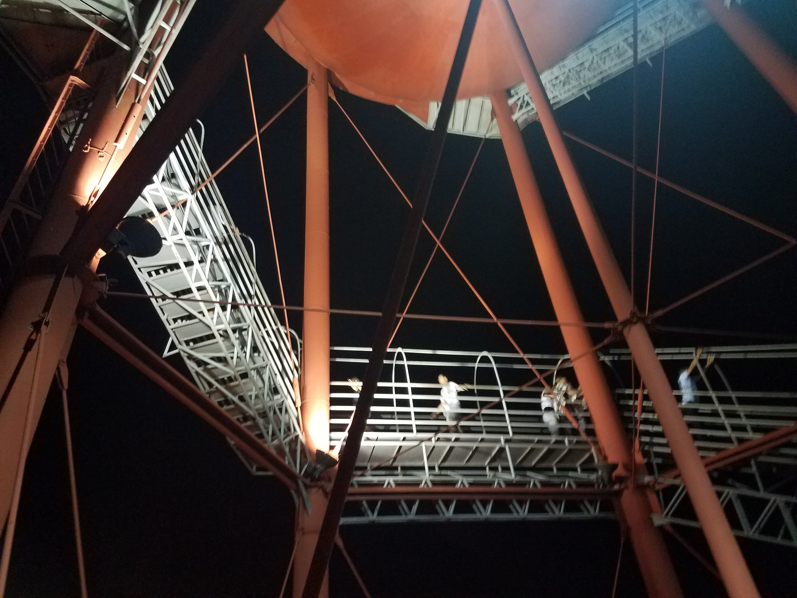

<br><details><summary>:camera:**50/20180330_121739.jpg**</summary><sub> `Exif version` 0220 `OS version` G930PVPS5BRA1 `Date` 2018:03:30 12:17:39 `Aperture` Not known `Brightness` 6.16 `Color space` 1 `Compression` 6`Exposure mode` 0 `Exposure time` 0.003048780487804878 `Focal length` 4.2 `Lens model` Not known `Lens specification` Not known `Orientation` 1 `Scene type` Not known `f number` 1.7 `White balance` 0 `Sensing method` 2 `Shutter speed` 8.357</sub><sub>`Coordinates & altitude` (3.691826888888889, -73.70052477777779, 0.0)</sub><sub> :earth_americas:`Location over` [Google Maps](http://maps.google.com/maps?q=3.691826888888889,-73.70052477777779) or [Openstreet Map](https://www.openstreetmap.org/query?lat=3.691826888888889&lon=-73.70052477777779)</sub></details>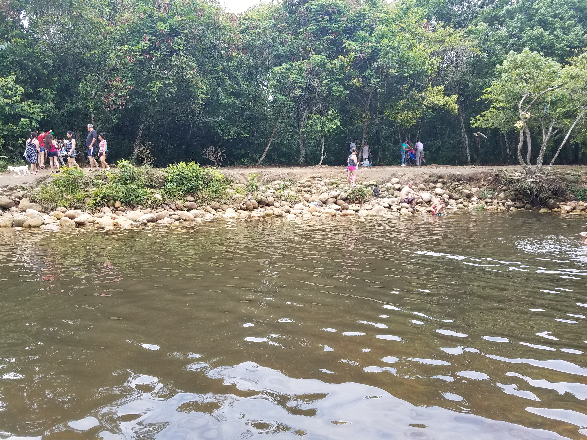

<br><details><summary>:camera:**50/20180330_121741.jpg**</summary><sub> `Exif version` 0220 `OS version` G930PVPS5BRA1 `Date` 2018:03:30 12:17:41 `Aperture` Not known `Brightness` 5.86 `Color space` 1 `Compression` 6`Exposure mode` 0 `Exposure time` 0.0035211267605633804 `Focal length` 4.2 `Lens model` Not known `Lens specification` Not known `Orientation` 1 `Scene type` Not known `f number` 1.7 `White balance` 0 `Sensing method` 2 `Shutter speed` 8.149</sub><sub>`Coordinates & altitude` (3.691826888888889, -73.70052477777779, 0.0)</sub><sub> :earth_americas:`Location over` [Google Maps](http://maps.google.com/maps?q=3.691826888888889,-73.70052477777779) or [Openstreet Map](https://www.openstreetmap.org/query?lat=3.691826888888889&lon=-73.70052477777779)</sub></details>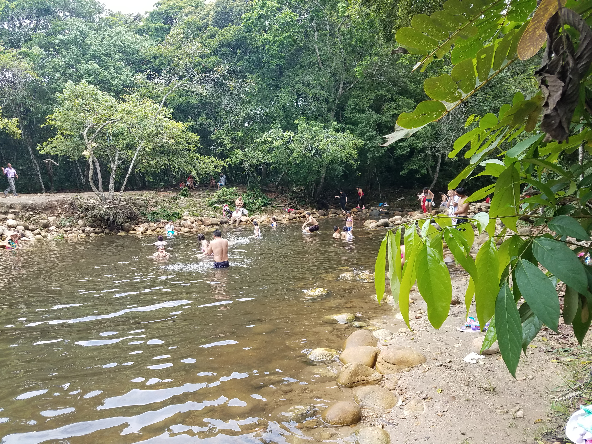

<br><details><summary>:camera:**50/20180330_163559.jpg**</summary><sub> `Exif version` 0220 `OS version` G930PVPS5BRA1 `Date` 2018:03:30 16:35:59 `Aperture` Not known `Brightness` 8.26 `Color space` 1 `Compression` 6`Exposure mode` 0 `Exposure time` 0.0006811989100817438 `Focal length` 4.2 `Lens model` Not known `Lens specification` Not known `Orientation` 1 `Scene type` Not known `f number` 1.7 `White balance` 0 `Sensing method` 2 `Shutter speed` 10.519</sub><sub>`Coordinates & altitude` (3.7033790833333335, -73.70078119444445, 0.0)</sub><sub> :earth_americas:`Location over` [Google Maps](http://maps.google.com/maps?q=3.7033790833333335,-73.70078119444445) or [Openstreet Map](https://www.openstreetmap.org/query?lat=3.7033790833333335&lon=-73.70078119444445)</sub></details>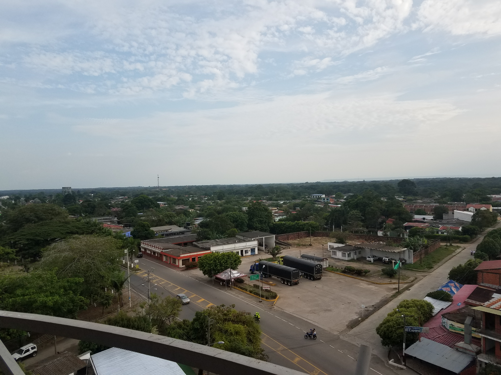

<br><details><summary>:camera:**50/20180330_163602.jpg**</summary><sub> `Exif version` 0220 `OS version` G930PVPS5BRA1 `Date` 2018:03:30 16:36:02 `Aperture` Not known `Brightness` 8.73 `Color space` 1 `Compression` 6`Exposure mode` 0 `Exposure time` 0.0004807692307692308 `Focal length` 4.2 `Lens model` Not known `Lens specification` Not known `Orientation` 1 `Scene type` Not known `f number` 1.7 `White balance` 0 `Sensing method` 2 `Shutter speed` 11.022</sub><sub>`Coordinates & altitude` (3.7033790833333335, -73.70078119444445, 0.0)</sub><sub> :earth_americas:`Location over` [Google Maps](http://maps.google.com/maps?q=3.7033790833333335,-73.70078119444445) or [Openstreet Map](https://www.openstreetmap.org/query?lat=3.7033790833333335&lon=-73.70078119444445)</sub></details>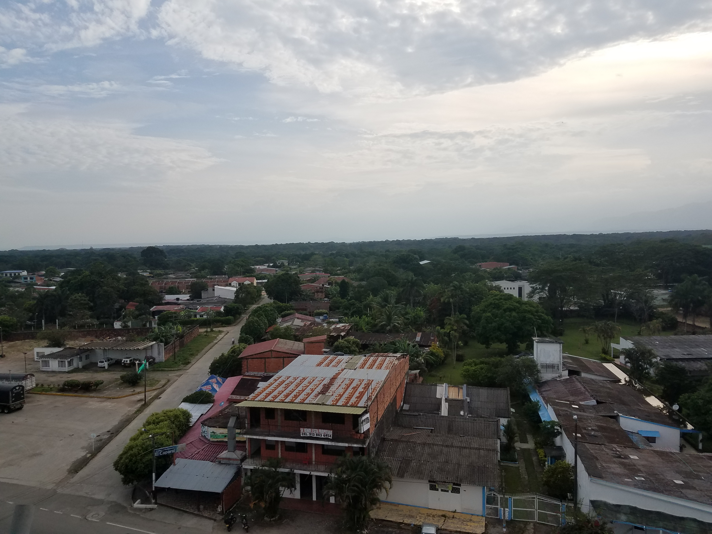

<br><details><summary>:camera:**50/20180330_163605.jpg**</summary><sub> `Exif version` 0220 `OS version` G930PVPS5BRA1 `Date` 2018:03:30 16:36:05 `Aperture` Not known `Brightness` 9.03 `Color space` 1 `Compression` 6`Exposure mode` 0 `Exposure time` 0.00040716612377850165 `Focal length` 4.2 `Lens model` Not known `Lens specification` Not known `Orientation` 1 `Scene type` Not known `f number` 1.7 `White balance` 0 `Sensing method` 2 `Shutter speed` 11.262</sub><sub>`Coordinates & altitude` (3.7033790833333335, -73.70078119444445, 0.0)</sub><sub> :earth_americas:`Location over` [Google Maps](http://maps.google.com/maps?q=3.7033790833333335,-73.70078119444445) or [Openstreet Map](https://www.openstreetmap.org/query?lat=3.7033790833333335&lon=-73.70078119444445)</sub></details>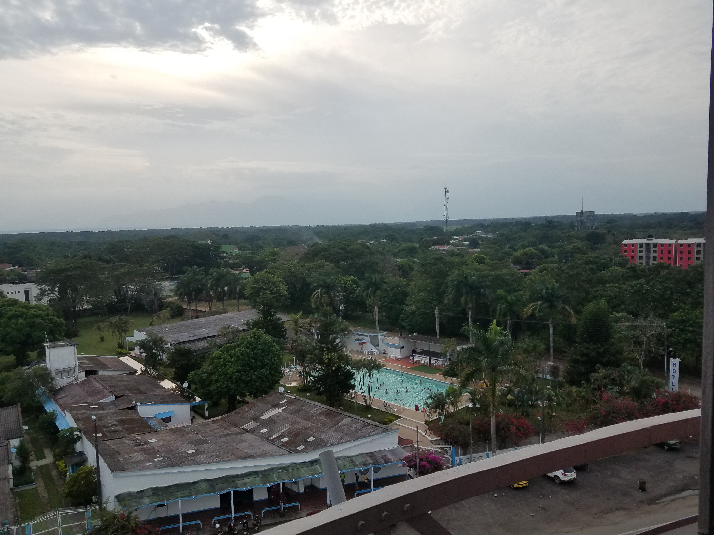

<br><details><summary>:camera:**50/20180330_163621.jpg**</summary><sub> `Exif version` 0220 `OS version` G930PVPS5BRA1 `Date` 2018:03:30 16:36:21 `Aperture` Not known `Brightness` 6.46 `Color space` 1 `Compression` 6`Exposure mode` 0 `Exposure time` 0.0024752475247524753 `Focal length` 4.2 `Lens model` Not known `Lens specification` Not known `Orientation` 1 `Scene type` Not known `f number` 1.7 `White balance` 0 `Sensing method` 2 `Shutter speed` 8.658</sub><sub>`Coordinates & altitude` (3.703183, -73.7007605, 0.0)</sub><sub> :earth_americas:`Location over` [Google Maps](http://maps.google.com/maps?q=3.703183,-73.7007605) or [Openstreet Map](https://www.openstreetmap.org/query?lat=3.703183&lon=-73.7007605)</sub></details>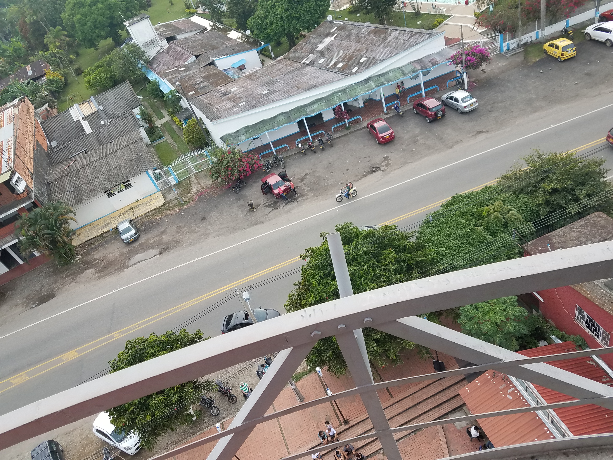

<br><details><summary>:camera:**50/20180330_163628.jpg**</summary><sub> `Exif version` 0220 `OS version` G930PVPS5BRA1 `Date` 2018:03:30 16:36:28 `Aperture` Not known `Brightness` 6.56 `Color space` 1 `Compression` 6`Exposure mode` 0 `Exposure time` 0.0022222222222222222 `Focal length` 4.2 `Lens model` Not known `Lens specification` Not known `Orientation` 1 `Scene type` Not known `f number` 1.7 `White balance` 0 `Sensing method` 2 `Shutter speed` 8.813</sub><sub>`Coordinates & altitude` (3.703166416666667, -73.70058627777777, 447.0)</sub><sub> :earth_americas:`Location over` [Google Maps](http://maps.google.com/maps?q=3.703166416666667,-73.70058627777777) or [Openstreet Map](https://www.openstreetmap.org/query?lat=3.703166416666667&lon=-73.70058627777777)</sub></details>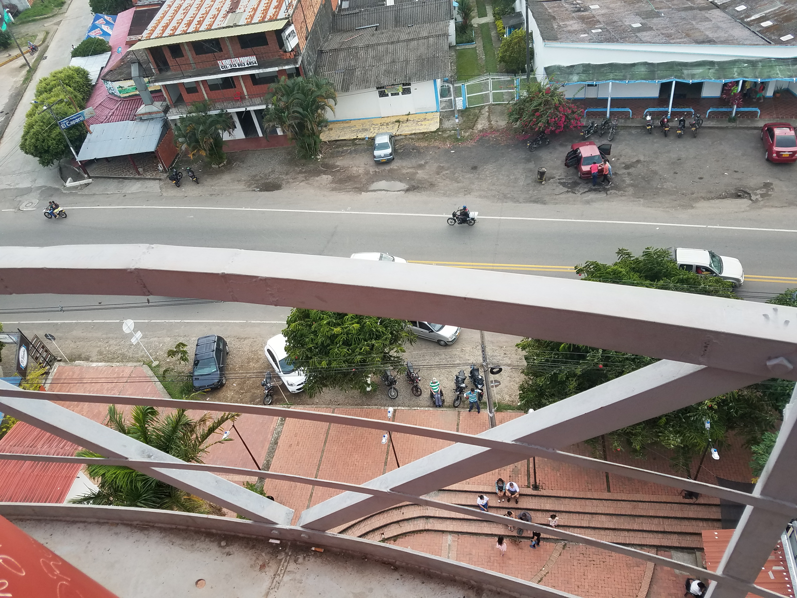

<br><details><summary>:camera:**50/20180330_172614.jpg**</summary><sub> `Exif version` 0220 `OS version` G930PVPS5BRA1 `Date` 2018:03:30 17:26:14 `Aperture` Not known `Brightness` 6.44 `Color space` 1 `Compression` 6`Exposure mode` 0 `Exposure time` 0.002352941176470588 `Focal length` 4.2 `Lens model` Not known `Lens specification` Not known `Orientation` 1 `Scene type` Not known `f number` 1.7 `White balance` 0 `Sensing method` 2 `Shutter speed` 8.731</sub><sub>`Coordinates & altitude` (3.6990994444444447, -73.70021141666668, 454.0)</sub><sub> :earth_americas:`Location over` [Google Maps](http://maps.google.com/maps?q=3.6990994444444447,-73.70021141666668) or [Openstreet Map](https://www.openstreetmap.org/query?lat=3.6990994444444447&lon=-73.70021141666668)</sub></details>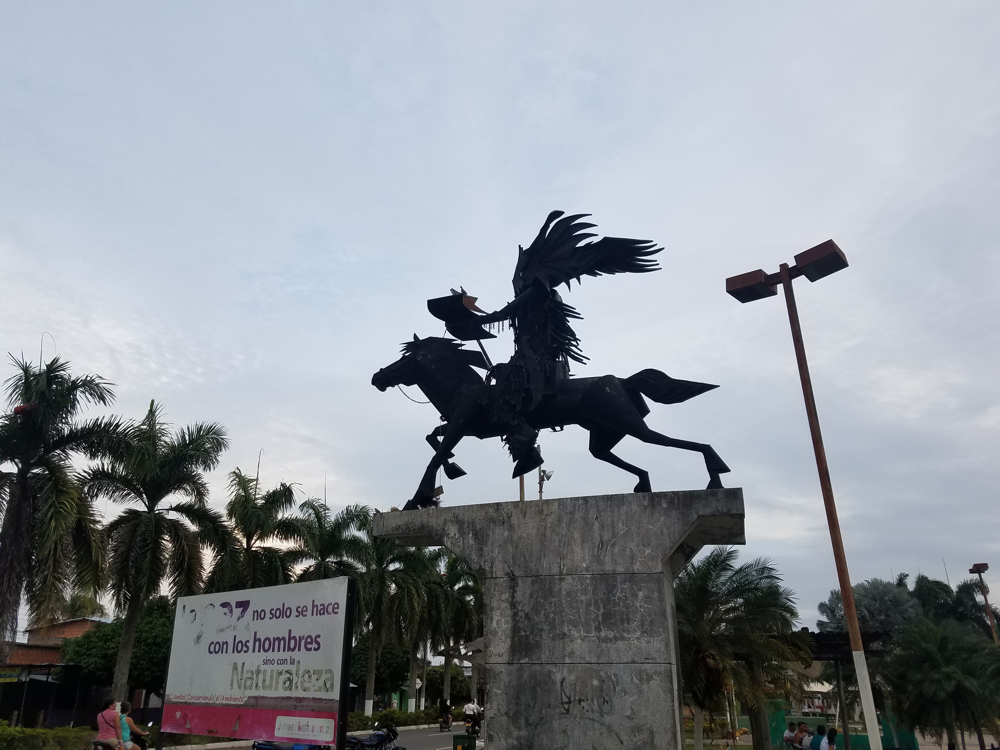

<br><details><summary>:camera:**50/20180331_065914.jpg**</summary><sub> `Exif version` 0220 `OS version` G930PVPS5BRA1 `Date` 2018:03:31 06:59:14 `Aperture` Not known `Brightness` 5.96 `Color space` 1 `Compression` 6`Exposure mode` 0 `Exposure time` 0.003367003367003367 `Focal length` 4.2 `Lens model` Not known `Lens specification` Not known `Orientation` 1 `Scene type` Not known `f number` 1.7 `White balance` 0 `Sensing method` 2 `Shutter speed` 8.214</sub><sub>`Coordinates & altitude` (3.691098083333334, -73.69629619444444, 433.799)</sub><sub> :earth_americas:`Location over` [Google Maps](http://maps.google.com/maps?q=3.691098083333334,-73.69629619444444) or [Openstreet Map](https://www.openstreetmap.org/query?lat=3.691098083333334&lon=-73.69629619444444)</sub></details>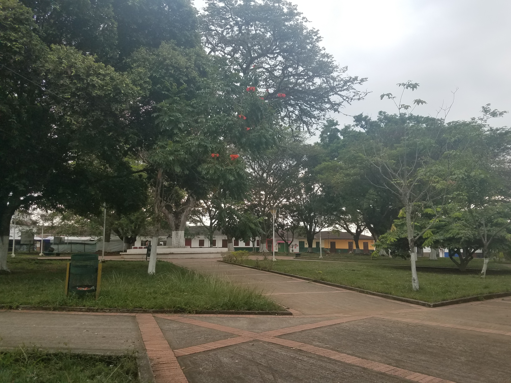

<sub>_Citation: Partial or total digital reproduction of this repository, scripts, development guides, data models, images, and documentation is permitted, provided that it is referenced as: "R.GISMobile - Mobile geographic information systems on QField that do not require an internet connection for navigation." https://github.com/rcfdtools/R.GISMobile - Bogotá - Colombia - South America"._<sub>

| [:house: Home](../Readme.md) |
|---|