<div align="center"></div>

## Oicatá, Boyacá, Colombia (2023-04-03)
`Pictures` rcfdtools <br>`Category` Freelance field visit <br>`Location` [Google Maps](http://maps.google.com/maps?q=5.610318,-73.283936) or [Openstreet Map](https://www.openstreetmap.org/query?lat=5.610318&lon=-73.283936) 

```geojson
{
  "type": "Feature",
  "geometry": {
    "type": "Point", 
    "coordinates": [-73.283936, 5.610318]
  }, 
  "properties": {
    "Name": "Oicatá, Boyacá, Colombia"
  }
}
```

<br><details><summary>:camera:**51/49544F26-DDB9-4E9D-88B0-9794FC7F72AB.jpg**</summary><sub> `Exif version` 0232 `OS version` 17.4.1 `Date` 2024:04:02 11:24:49 `Aperture` Not known `Brightness` 9.733110058898257 `Color space` 1 `Compression` Not known`Exposure mode` 0 `Exposure time` 0.00030703101013202335 `Focal length` 5.1 `Lens model` iPhone 12 Pro Max back camera 5.1mm f/1.6 `Lens specification` (5.1, 5.1, 1.6, 1.6) `Orientation` 1 `Scene type` Not known `f number` 1.6 `White balance` 0 `Sensing method` 2 `Shutter speed` 11.669473724050489</sub></details>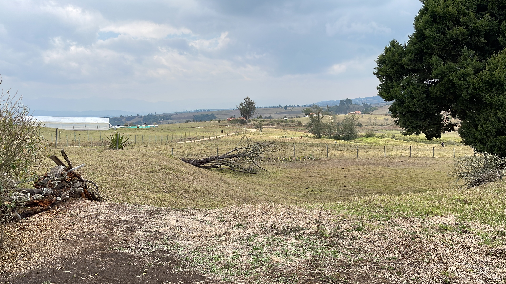

<br><details><summary>:camera:**51/IMG_2297.JPG**</summary><sub> `Exif version` 0232 `OS version` 18.5 `Date` 2025:04:13 10:05:48 `Aperture` Not known `Brightness` 10.28890266584005 `Color space` 65535 `Compression` 6`Exposure mode` 0 `Exposure time` 0.00014200511218403862 `Focal length` 6.86 `Lens model` iPhone 14 Pro back triple camera 6.86mm f/1.78 `Lens specification` (2.220000028611935, 9.0, 1.7799999713880652, 2.8) `Orientation` 1 `Scene type` Not known `f number` 1.78 `White balance` 0 `Sensing method` 2 `Shutter speed` 12.781821441376838</sub><sub>`Coordinates & altitude` (5.6013972222222215, -73.30648055555555, 2672.456464379947)</sub><sub> :globe_with_meridians:`Location over` [Google Maps](http://maps.google.com/maps?q=5.6013972222222215,-73.30648055555555) or [Openstreet Map](https://www.openstreetmap.org/query?lat=5.6013972222222215&lon=-73.30648055555555)</sub></details>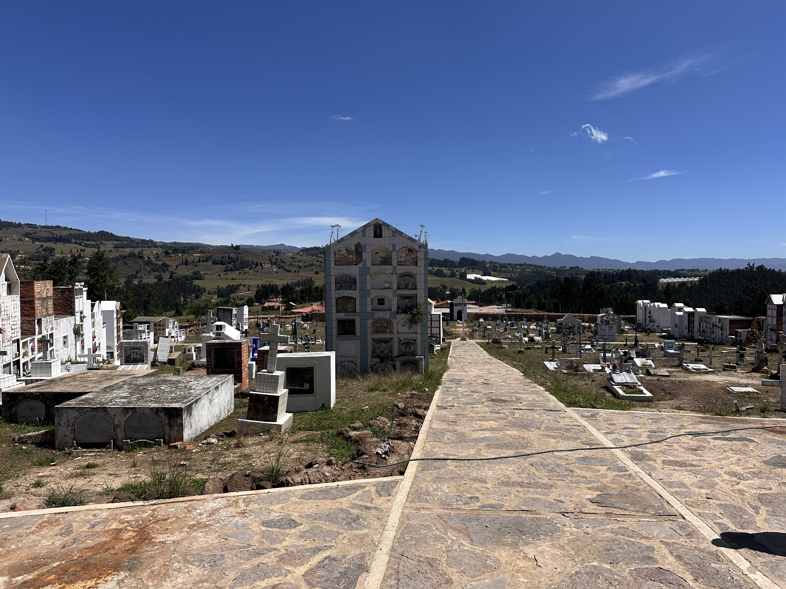

<br><details><summary>:camera:**51/IMG_2299.JPG**</summary><sub> `Exif version` 0232 `OS version` 18.5 `Date` 2025:04:13 14:11:23 `Aperture` Not known `Brightness` 10.134631578947369 `Color space` 65535 `Compression` 6`Exposure mode` 0 `Exposure time` 0.0003819709702062643 `Focal length` 2.22 `Lens model` iPhone 14 Pro back triple camera 2.22mm f/2.2 `Lens specification` (2.220000028611935, 9.0, 1.7799999713880652, 2.8) `Orientation` 1 `Scene type` Not known `f number` 2.2 `White balance` 0 `Sensing method` 2 `Shutter speed` 11.354139747540007</sub><sub>`Coordinates & altitude` (5.609038888888889, -73.2812888888889, 2714.67069154775)</sub><sub> :globe_with_meridians:`Location over` [Google Maps](http://maps.google.com/maps?q=5.609038888888889,-73.2812888888889) or [Openstreet Map](https://www.openstreetmap.org/query?lat=5.609038888888889&lon=-73.2812888888889)</sub></details>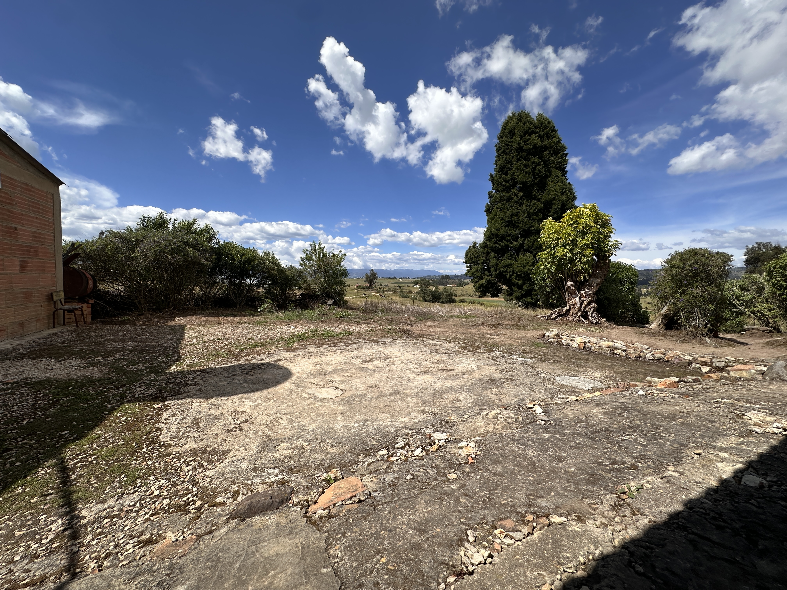

<br><details><summary>:camera:**51/IMG_2300.JPG**</summary><sub> `Exif version` 0232 `OS version` 18.5 `Date` 2025:04:13 14:14:36 `Aperture` Not known `Brightness` 10.185990840965863 `Color space` 65535 `Compression` 6`Exposure mode` 0 `Exposure time` 0.0004079967360261118 `Focal length` 2.22 `Lens model` iPhone 14 Pro back triple camera 2.22mm f/2.2 `Lens specification` (2.220000028611935, 9.0, 1.7799999713880652, 2.8) `Orientation` 1 `Scene type` Not known `f number` 2.2 `White balance` 0 `Sensing method` 2 `Shutter speed` 11.25914323752839</sub><sub>`Coordinates & altitude` (5.609080555555555, -73.2812111111111, 2714.82476635514)</sub><sub> :globe_with_meridians:`Location over` [Google Maps](http://maps.google.com/maps?q=5.609080555555555,-73.2812111111111) or [Openstreet Map](https://www.openstreetmap.org/query?lat=5.609080555555555&lon=-73.2812111111111)</sub></details>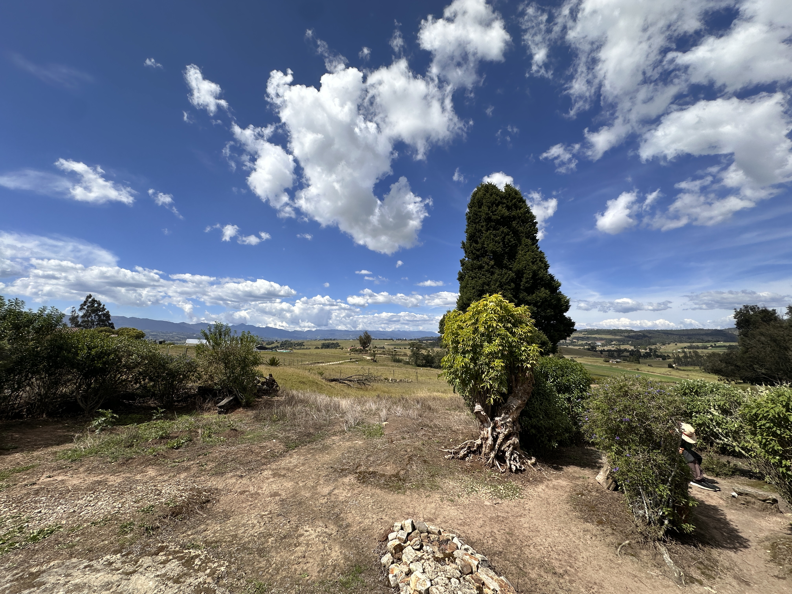

<br><details><summary>:camera:**51/IMG_2301.JPG**</summary><sub> `Exif version` 0232 `OS version` 18.5 `Date` 2025:04:13 14:17:10 `Aperture` Not known `Brightness` 10.004767610204183 `Color space` 65535 `Compression` 6`Exposure mode` 0 `Exposure time` 0.0005299417064122947 `Focal length` 2.22 `Lens model` iPhone 14 Pro back triple camera 2.22mm f/2.2 `Lens specification` (2.220000028611935, 9.0, 1.7799999713880652, 2.8) `Orientation` 1 `Scene type` Not known `f number` 2.2 `White balance` 0 `Sensing method` 2 `Shutter speed` 10.881720019840513</sub><sub>`Coordinates & altitude` (5.609055555555555, -73.28120555555556, 2714.5197255574612)</sub><sub> :globe_with_meridians:`Location over` [Google Maps](http://maps.google.com/maps?q=5.609055555555555,-73.28120555555556) or [Openstreet Map](https://www.openstreetmap.org/query?lat=5.609055555555555&lon=-73.28120555555556)</sub></details>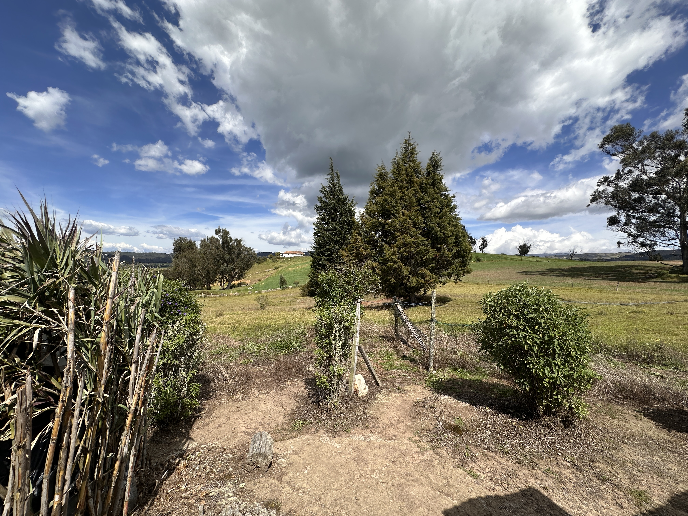

<br><details><summary>:camera:**51/IMG_2302.JPG**</summary><sub> `Exif version` 0232 `OS version` 18.5 `Date` 2025:04:13 14:17:50 `Aperture` Not known `Brightness` 9.661956668012381 `Color space` 65535 `Compression` 6`Exposure mode` 0 `Exposure time` 0.00045998160073597056 `Focal length` 2.22 `Lens model` iPhone 14 Pro back triple camera 2.22mm f/2.2 `Lens specification` (2.220000028611935, 9.0, 1.7799999713880652, 2.8) `Orientation` 1 `Scene type` Not known `f number` 2.2 `White balance` 0 `Sensing method` 2 `Shutter speed` 11.086078519855596</sub><sub>`Coordinates & altitude` (5.609052777777777, -73.28119722222222, 2714.690220820189)</sub><sub> :globe_with_meridians:`Location over` [Google Maps](http://maps.google.com/maps?q=5.609052777777777,-73.28119722222222) or [Openstreet Map](https://www.openstreetmap.org/query?lat=5.609052777777777&lon=-73.28119722222222)</sub></details>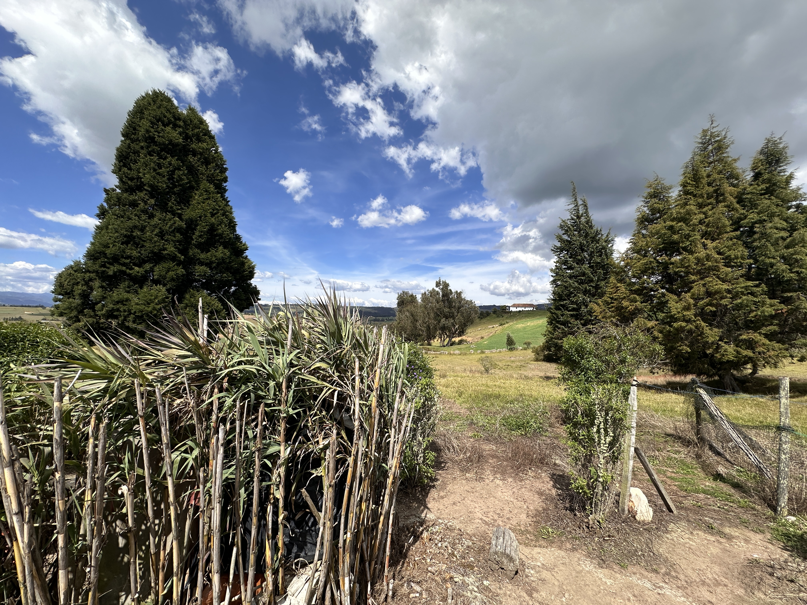

<br><details><summary>:camera:**51/PXL_20230402_133216883.jpg**</summary><sub> `Exif version` 0232 `OS version` HDR+ 1.0.514217843zd `Date` 2023:04:02 08:32:16 `Aperture` Not known `Brightness` 4.75 `Color space` 1 `Compression` 6`Exposure mode` 0 `Exposure time` 0.009947 `Focal length` 6.81 `Lens model` Pixel 6 back camera 6.81mm f/1.85 `Lens specification` Not known `Orientation` 1 `Scene type` Not known `f number` 1.85 `White balance` 0 `Sensing method` 2 `Shutter speed` 6.65</sub><sub>`Coordinates & altitude` (5.4509694444444445, -73.4305138888889, 2754.0)</sub><sub> :globe_with_meridians:`Location over` [Google Maps](http://maps.google.com/maps?q=5.4509694444444445,-73.4305138888889) or [Openstreet Map](https://www.openstreetmap.org/query?lat=5.4509694444444445&lon=-73.4305138888889)</sub></details>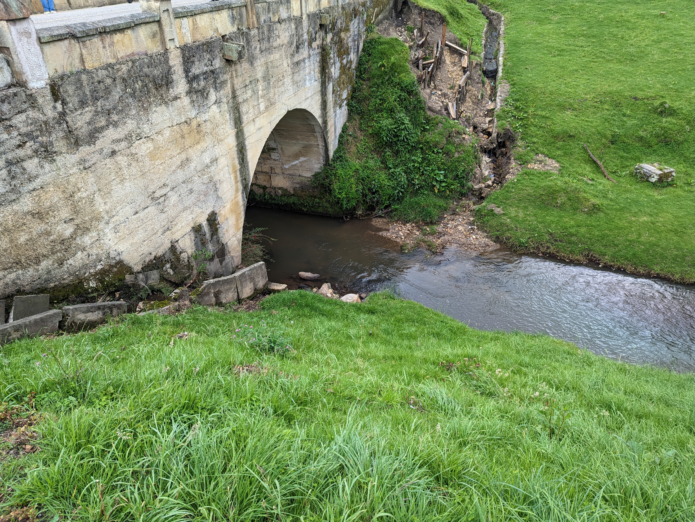

<br><details><summary>:camera:**51/PXL_20230402_133222176.jpg**</summary><sub> `Exif version` 0232 `OS version` HDR+ 1.0.514217843zd `Date` 2023:04:02 08:32:22 `Aperture` Not known `Brightness` 8.24 `Color space` 1 `Compression` 6`Exposure mode` 0 `Exposure time` 0.000751 `Focal length` 6.81 `Lens model` Pixel 6 back camera 6.81mm f/1.85 `Lens specification` Not known `Orientation` 1 `Scene type` Not known `f number` 1.85 `White balance` 0 `Sensing method` 2 `Shutter speed` 10.38</sub><sub>`Coordinates & altitude` (5.4509694444444445, -73.4305138888889, 2754.0)</sub><sub> :globe_with_meridians:`Location over` [Google Maps](http://maps.google.com/maps?q=5.4509694444444445,-73.4305138888889) or [Openstreet Map](https://www.openstreetmap.org/query?lat=5.4509694444444445&lon=-73.4305138888889)</sub></details>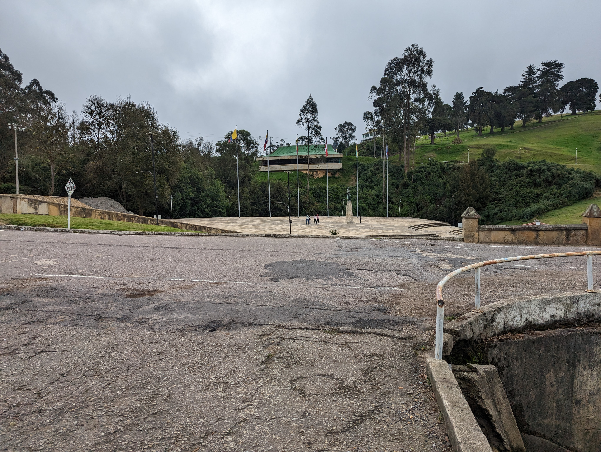

<br><details><summary>:camera:**51/PXL_20230402_133222176~2.jpg**</summary><sub> `Exif version` 0232 `OS version` HDR+ 1.0.514217843zd `Date` 2023:04:02 08:32:22 `Aperture` Not known `Brightness` 8.24 `Color space` 1 `Compression` 6`Exposure mode` 0 `Exposure time` 0.000751 `Focal length` 6.81 `Lens model` Pixel 6 back camera 6.81mm f/1.85 `Lens specification` Not known `Orientation` 1 `Scene type` Not known `f number` 1.85 `White balance` 0 `Sensing method` 2 `Shutter speed` 10.38</sub><sub>`Coordinates & altitude` (5.4509694444444445, -73.4305138888889, 2754.0)</sub><sub> :globe_with_meridians:`Location over` [Google Maps](http://maps.google.com/maps?q=5.4509694444444445,-73.4305138888889) or [Openstreet Map](https://www.openstreetmap.org/query?lat=5.4509694444444445&lon=-73.4305138888889)</sub></details>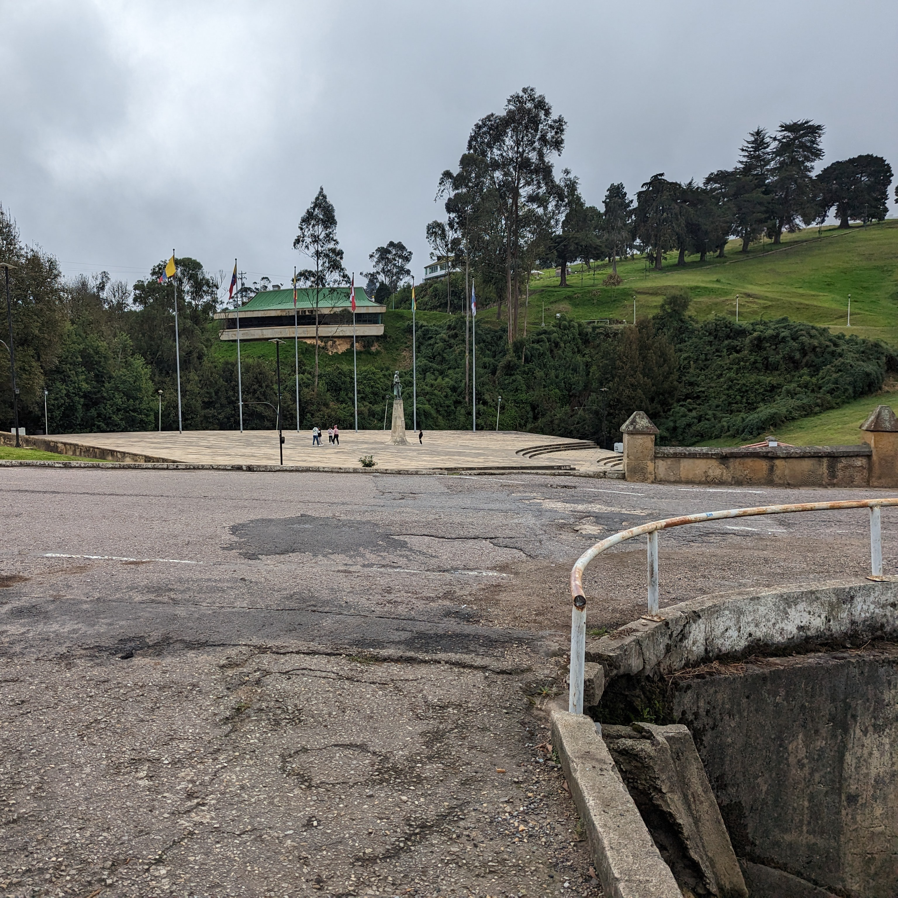

<br><details><summary>:camera:**51/PXL_20230402_133309994.jpg**</summary><sub> `Exif version` 0232 `OS version` HDR+ 1.0.514217843zd `Date` 2023:04:02 08:33:09 `Aperture` Not known `Brightness` 7.83 `Color space` 1 `Compression` 6`Exposure mode` 0 `Exposure time` 0.001148 `Focal length` 6.81 `Lens model` Pixel 6 back camera 6.81mm f/1.85 `Lens specification` Not known `Orientation` 1 `Scene type` Not known `f number` 1.85 `White balance` 0 `Sensing method` 2 `Shutter speed` 9.77</sub><sub>`Coordinates & altitude` (5.450936111111111, -73.43055277777778, 2740.0)</sub><sub> :globe_with_meridians:`Location over` [Google Maps](http://maps.google.com/maps?q=5.450936111111111,-73.43055277777778) or [Openstreet Map](https://www.openstreetmap.org/query?lat=5.450936111111111&lon=-73.43055277777778)</sub></details>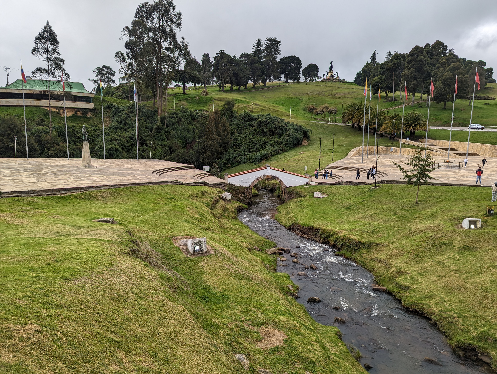

<br><details><summary>:camera:**51/PXL_20230402_133313948.jpg**</summary><sub> `Exif version` 0232 `OS version` HDR+ 1.0.514217843zd `Date` 2023:04:02 08:33:13 `Aperture` Not known `Brightness` 8.6 `Color space` 1 `Compression` 6`Exposure mode` 0 `Exposure time` 0.000627 `Focal length` 6.81 `Lens model` Pixel 6 back camera 6.81mm f/1.85 `Lens specification` Not known `Orientation` 1 `Scene type` Not known `f number` 1.85 `White balance` 0 `Sensing method` 2 `Shutter speed` 10.64</sub><sub>`Coordinates & altitude` (5.450936111111111, -73.43055277777778, 2740.0)</sub><sub> :globe_with_meridians:`Location over` [Google Maps](http://maps.google.com/maps?q=5.450936111111111,-73.43055277777778) or [Openstreet Map](https://www.openstreetmap.org/query?lat=5.450936111111111&lon=-73.43055277777778)</sub></details>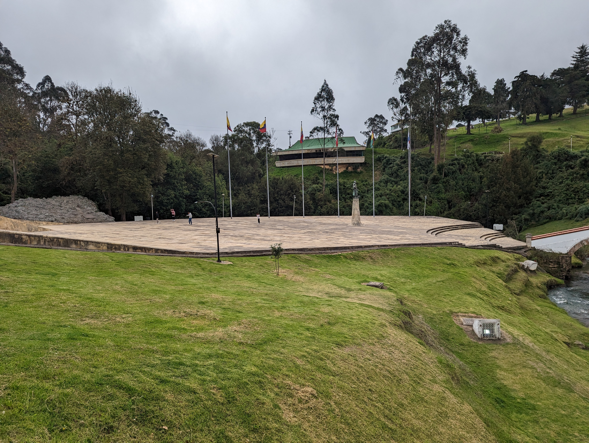

<br><details><summary>:camera:**51/PXL_20230402_133319425.jpg**</summary><sub> `Exif version` 0232 `OS version` HDR+ 1.0.514217843zd `Date` 2023:04:02 08:33:19 `Aperture` Not known `Brightness` 7.74 `Color space` 1 `Compression` 6`Exposure mode` 0 `Exposure time` 0.001113 `Focal length` 6.81 `Lens model` Pixel 6 back camera 6.81mm f/1.85 `Lens specification` Not known `Orientation` 1 `Scene type` Not known `f number` 1.85 `White balance` 0 `Sensing method` 2 `Shutter speed` 9.81</sub><sub>`Coordinates & altitude` (5.450936111111111, -73.43055277777778, 2740.0)</sub><sub> :globe_with_meridians:`Location over` [Google Maps](http://maps.google.com/maps?q=5.450936111111111,-73.43055277777778) or [Openstreet Map](https://www.openstreetmap.org/query?lat=5.450936111111111&lon=-73.43055277777778)</sub></details>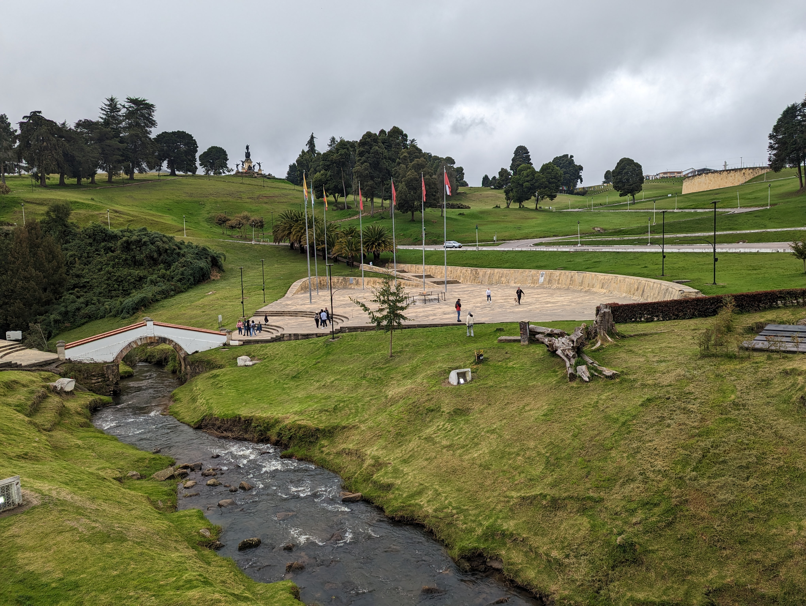

<br><details><summary>:camera:**51/PXL_20230402_133319425~2.jpg**</summary><sub> `Exif version` 0232 `OS version` HDR+ 1.0.514217843zd `Date` 2023:04:02 08:33:19 `Aperture` Not known `Brightness` 7.74 `Color space` 1 `Compression` 6`Exposure mode` 0 `Exposure time` 0.001113 `Focal length` 6.81 `Lens model` Pixel 6 back camera 6.81mm f/1.85 `Lens specification` Not known `Orientation` 1 `Scene type` Not known `f number` 1.85 `White balance` 0 `Sensing method` 2 `Shutter speed` 9.81</sub><sub>`Coordinates & altitude` (5.450936111111111, -73.43055277777778, 2740.0)</sub><sub> :globe_with_meridians:`Location over` [Google Maps](http://maps.google.com/maps?q=5.450936111111111,-73.43055277777778) or [Openstreet Map](https://www.openstreetmap.org/query?lat=5.450936111111111&lon=-73.43055277777778)</sub></details>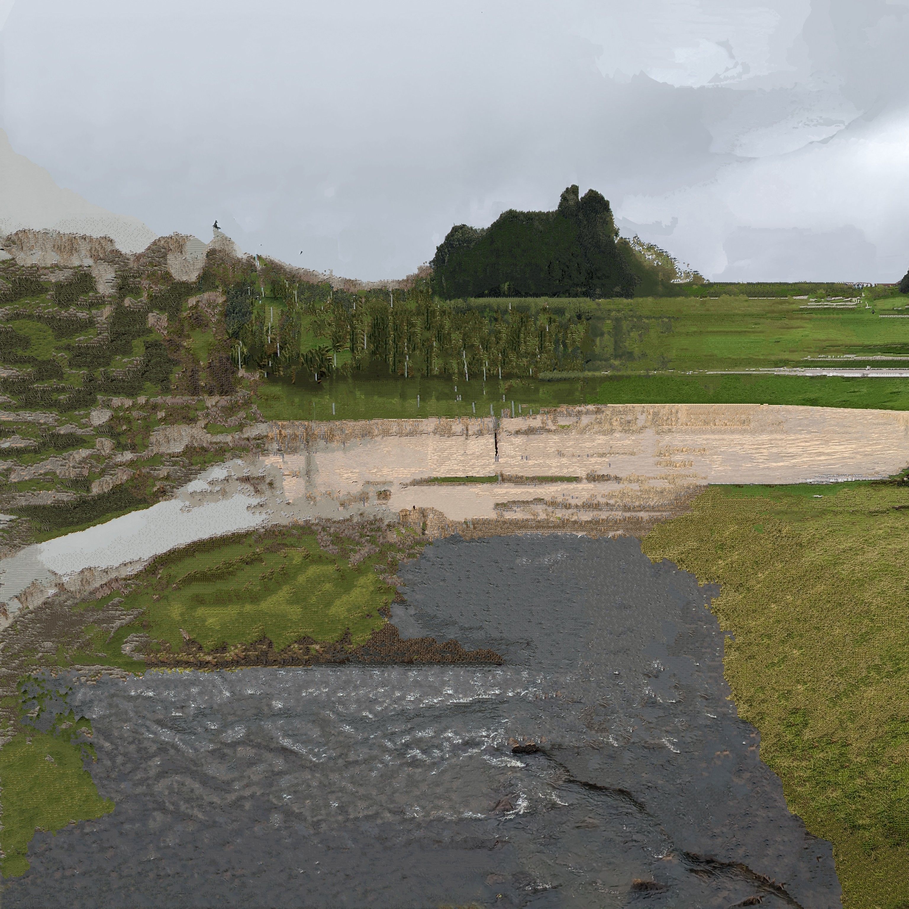

<br><details><summary>:camera:**51/PXL_20230402_133444698.jpg**</summary><sub> `Exif version` 0232 `OS version` HDR+ 1.0.514217843zd `Date` 2023:04:02 08:34:44 `Aperture` Not known `Brightness` 8.22 `Color space` 1 `Compression` 6`Exposure mode` 0 `Exposure time` 0.000813 `Focal length` 6.81 `Lens model` Pixel 6 back camera 6.81mm f/1.85 `Lens specification` Not known `Orientation` 1 `Scene type` Not known `f number` 1.85 `White balance` 0 `Sensing method` 2 `Shutter speed` 10.26</sub><sub>`Coordinates & altitude` (5.450688888888889, -73.43034722222222, 2751.0)</sub><sub> :globe_with_meridians:`Location over` [Google Maps](http://maps.google.com/maps?q=5.450688888888889,-73.43034722222222) or [Openstreet Map](https://www.openstreetmap.org/query?lat=5.450688888888889&lon=-73.43034722222222)</sub></details>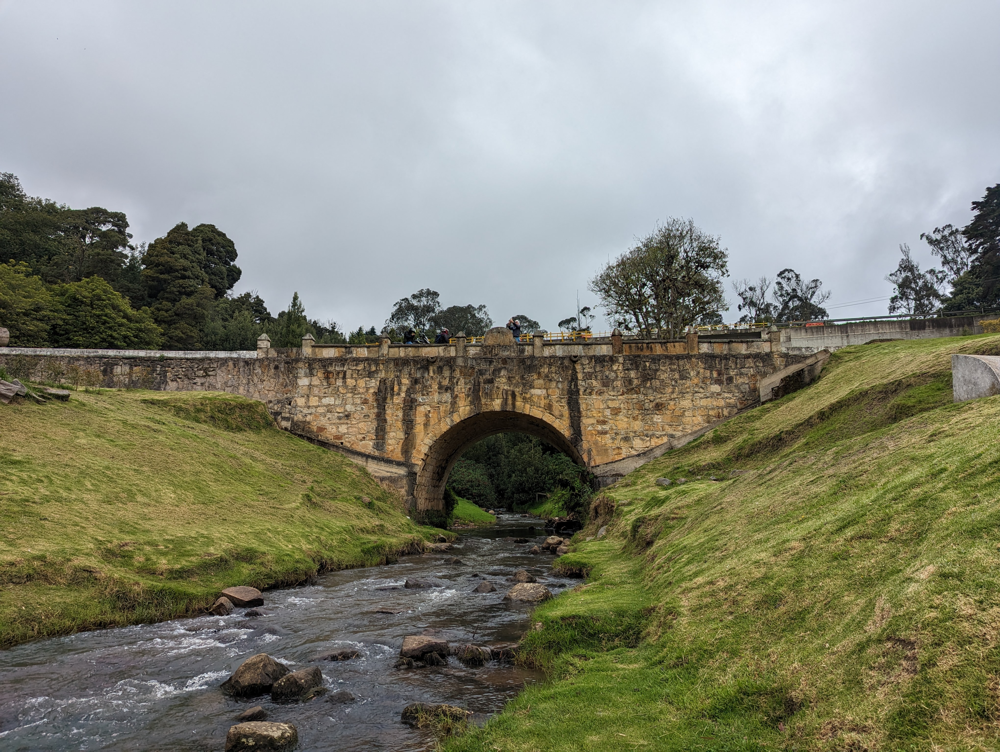

<br><details><summary>:camera:**51/PXL_20230402_133447795.jpg**</summary><sub> `Exif version` 0232 `OS version` HDR+ 1.0.514217843zd `Date` 2023:04:02 08:34:47 `Aperture` Not known `Brightness` 7.93 `Color space` 1 `Compression` 6`Exposure mode` 0 `Exposure time` 0.000954 `Focal length` 6.81 `Lens model` Pixel 6 back camera 6.81mm f/1.85 `Lens specification` Not known `Orientation` 1 `Scene type` Not known `f number` 1.85 `White balance` 0 `Sensing method` 2 `Shutter speed` 10.03</sub><sub>`Coordinates & altitude` (5.450688888888889, -73.43034722222222, 2751.0)</sub><sub> :globe_with_meridians:`Location over` [Google Maps](http://maps.google.com/maps?q=5.450688888888889,-73.43034722222222) or [Openstreet Map](https://www.openstreetmap.org/query?lat=5.450688888888889&lon=-73.43034722222222)</sub></details>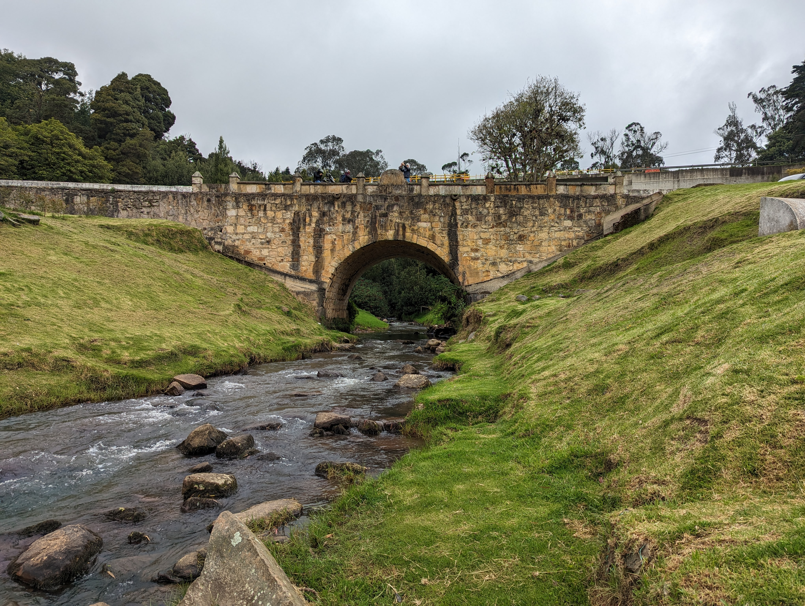

<br><details><summary>:camera:**51/PXL_20230402_133456974.jpg**</summary><sub> `Exif version` 0232 `OS version` HDR+ 1.0.514217843zd `Date` 2023:04:02 08:34:56 `Aperture` Not known `Brightness` 7.43 `Color space` 1 `Compression` 6`Exposure mode` 0 `Exposure time` 0.00129 `Focal length` 6.81 `Lens model` Pixel 6 back camera 6.81mm f/1.85 `Lens specification` Not known `Orientation` 1 `Scene type` Not known `f number` 1.85 `White balance` 0 `Sensing method` 2 `Shutter speed` 9.6</sub><sub>`Coordinates & altitude` (5.450688888888889, -73.43034722222222, 2751.0)</sub><sub> :globe_with_meridians:`Location over` [Google Maps](http://maps.google.com/maps?q=5.450688888888889,-73.43034722222222) or [Openstreet Map](https://www.openstreetmap.org/query?lat=5.450688888888889&lon=-73.43034722222222)</sub></details>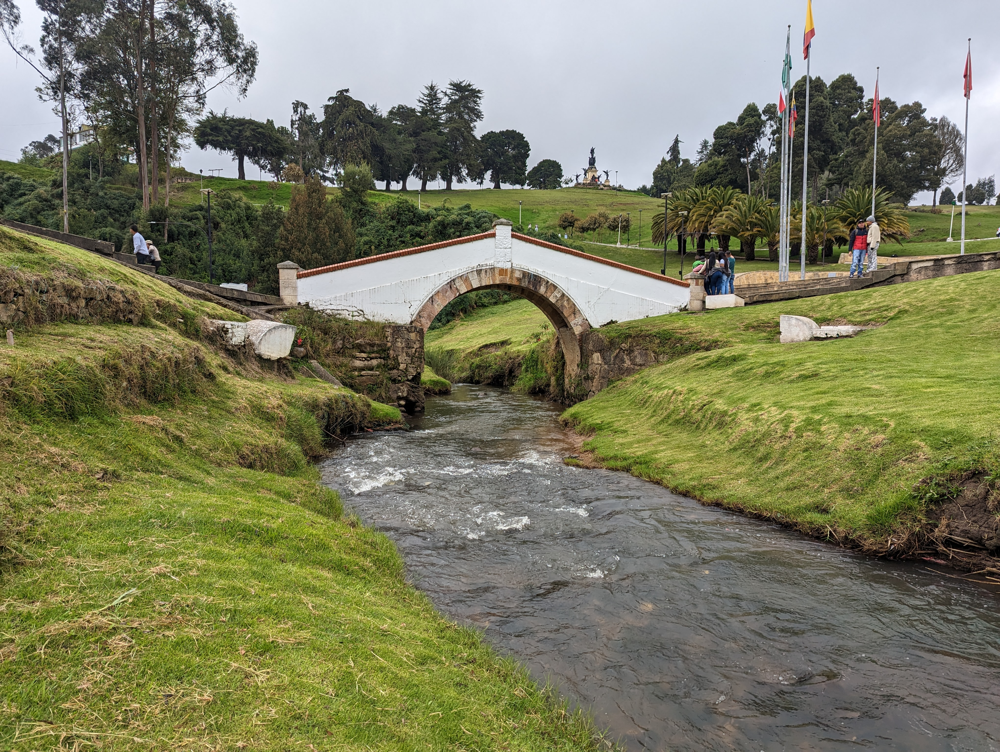

<br><details><summary>:camera:**51/PXL_20230402_133606074.jpg**</summary><sub> `Exif version` 0232 `OS version` HDR+ 1.0.514217843zd `Date` 2023:04:02 08:36:06 `Aperture` Not known `Brightness` 7.47 `Color space` 1 `Compression` 6`Exposure mode` 0 `Exposure time` 0.001466 `Focal length` 6.81 `Lens model` Pixel 6 back camera 6.81mm f/1.85 `Lens specification` Not known `Orientation` 1 `Scene type` Not known `f number` 1.85 `White balance` 0 `Sensing method` 2 `Shutter speed` 9.41</sub><sub>`Coordinates & altitude` (5.450833333333334, -73.430075, 2774.0)</sub><sub> :globe_with_meridians:`Location over` [Google Maps](http://maps.google.com/maps?q=5.450833333333334,-73.430075) or [Openstreet Map](https://www.openstreetmap.org/query?lat=5.450833333333334&lon=-73.430075)</sub></details>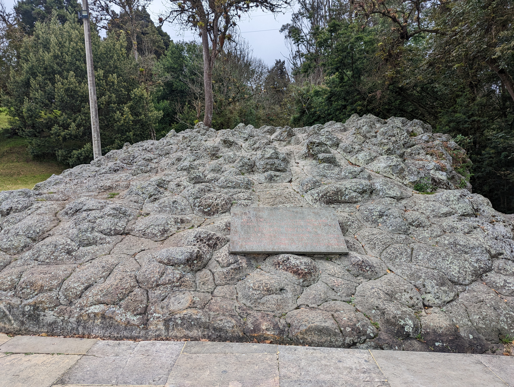

<br><details><summary>:camera:**51/PXL_20230402_133606074~2.jpg**</summary><sub> `Exif version` 0232 `OS version` HDR+ 1.0.514217843zd `Date` 2023:04:02 08:36:06 `Aperture` Not known `Brightness` 7.47 `Color space` 1 `Compression` 6`Exposure mode` 0 `Exposure time` 0.001466 `Focal length` 6.81 `Lens model` Pixel 6 back camera 6.81mm f/1.85 `Lens specification` Not known `Orientation` 1 `Scene type` Not known `f number` 1.85 `White balance` 0 `Sensing method` 2 `Shutter speed` 9.41</sub><sub>`Coordinates & altitude` (5.450833333333334, -73.430075, 2774.0)</sub><sub> :globe_with_meridians:`Location over` [Google Maps](http://maps.google.com/maps?q=5.450833333333334,-73.430075) or [Openstreet Map](https://www.openstreetmap.org/query?lat=5.450833333333334&lon=-73.430075)</sub></details>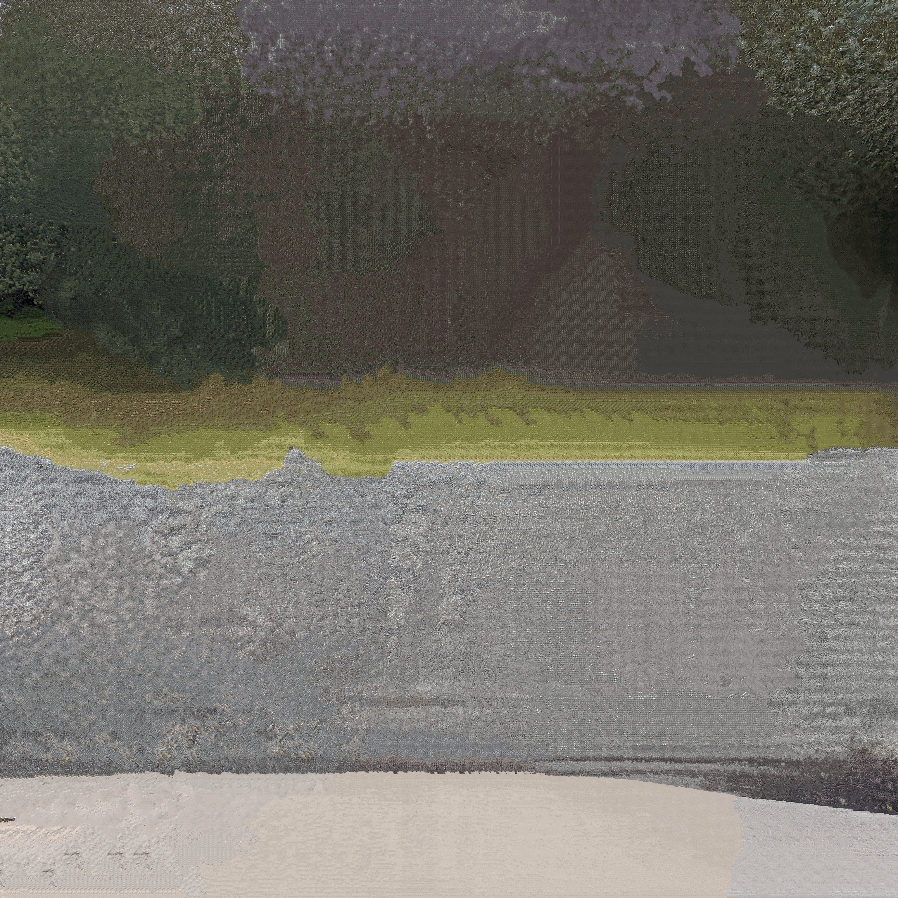

<br><details><summary>:camera:**51/PXL_20230402_133615197.jpg**</summary><sub> `Exif version` 0232 `OS version` HDR+ 1.0.514217843zd `Date` 2023:04:02 08:36:15 `Aperture` Not known `Brightness` 5.43 `Color space` 1 `Compression` 6`Exposure mode` 0 `Exposure time` 0.005177 `Focal length` 6.81 `Lens model` Pixel 6 back camera 6.81mm f/1.85 `Lens specification` Not known `Orientation` 1 `Scene type` Not known `f number` 1.85 `White balance` 0 `Sensing method` 2 `Shutter speed` 7.59</sub><sub>`Coordinates & altitude` (5.450833333333334, -73.430075, 2774.0)</sub><sub> :globe_with_meridians:`Location over` [Google Maps](http://maps.google.com/maps?q=5.450833333333334,-73.430075) or [Openstreet Map](https://www.openstreetmap.org/query?lat=5.450833333333334&lon=-73.430075)</sub></details>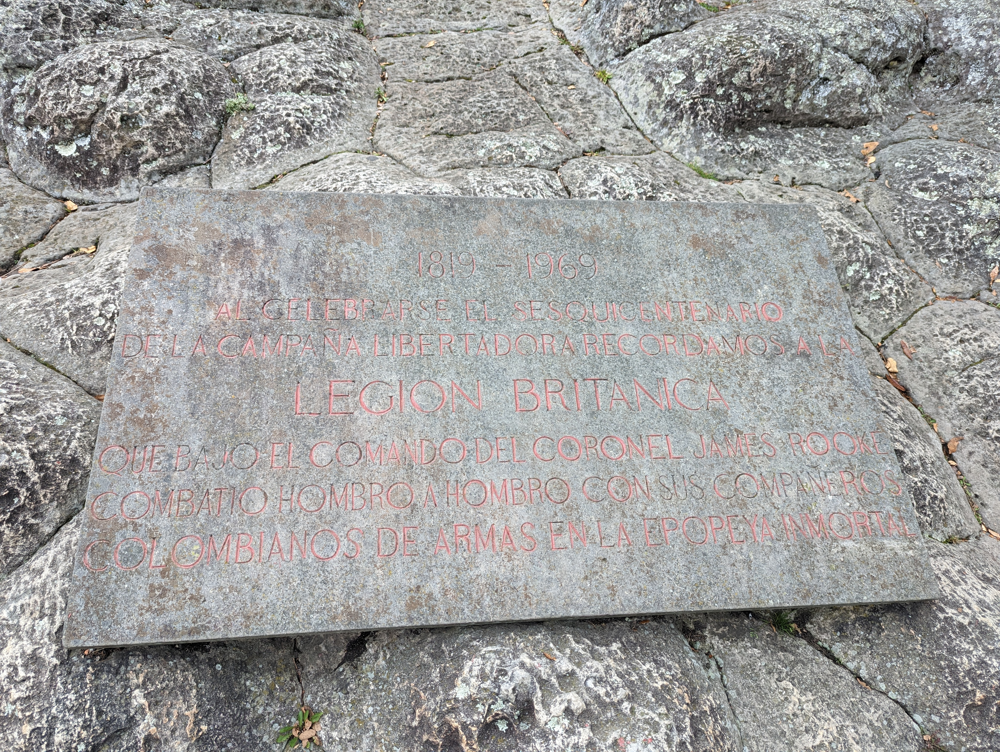

<br><details><summary>:camera:**51/PXL_20230402_133942725.MOTION-01.COVER.jpg**</summary><sub> `Exif version` 0232 `OS version` HDR+ 1.0.514217843zm `Date` 2023:04:02 08:39:42 `Aperture` Not known `Brightness` 8.02 `Color space` 1 `Compression` Not known`Exposure mode` 0 `Exposure time` 0.000875 `Focal length` 6.81 `Lens model` Pixel 6 back camera 6.81mm f/1.85 `Lens specification` Not known `Orientation` 1 `Scene type` Not known `f number` 1.85 `White balance` 0 `Sensing method` 2 `Shutter speed` 10.16</sub><sub>`Coordinates & altitude` (5.4503111111111116, -73.43053055555556, 2738.38)</sub><sub> :globe_with_meridians:`Location over` [Google Maps](http://maps.google.com/maps?q=5.4503111111111116,-73.43053055555556) or [Openstreet Map](https://www.openstreetmap.org/query?lat=5.4503111111111116&lon=-73.43053055555556)</sub></details>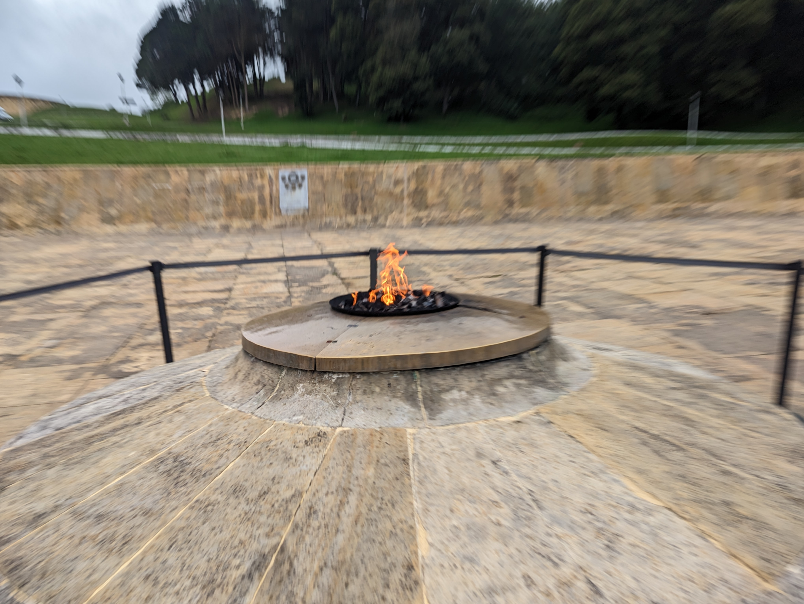

<br><details><summary>:camera:**51/PXL_20230402_133942725.MOTION-02.ORIGINAL.jpg**</summary><sub> `Exif version` 0232 `OS version` HDR+ 1.0.514217843zm `Date` 2023:04:02 08:39:42 `Aperture` Not known `Brightness` 8.02 `Color space` 1 `Compression` Not known`Exposure mode` 0 `Exposure time` 0.000875 `Focal length` 6.81 `Lens model` Pixel 6 back camera 6.81mm f/1.85 `Lens specification` Not known `Orientation` 1 `Scene type` Not known `f number` 1.85 `White balance` 0 `Sensing method` 2 `Shutter speed` 10.16</sub><sub>`Coordinates & altitude` (5.4503111111111116, -73.43053055555556, 2738.38)</sub><sub> :globe_with_meridians:`Location over` [Google Maps](http://maps.google.com/maps?q=5.4503111111111116,-73.43053055555556) or [Openstreet Map](https://www.openstreetmap.org/query?lat=5.4503111111111116&lon=-73.43053055555556)</sub></details>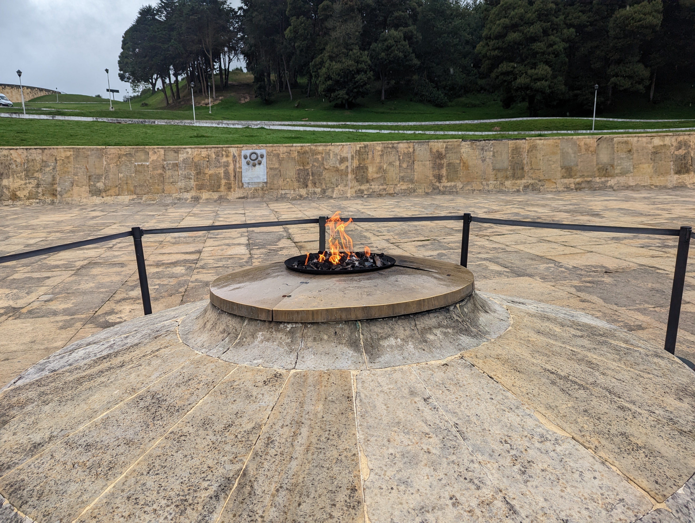

<br><details><summary>:camera:**51/PXL_20230402_133952500.jpg**</summary><sub> `Exif version` 0232 `OS version` HDR+ 1.0.514217843zd `Date` 2023:04:02 08:39:52 `Aperture` Not known `Brightness` 8.08 `Color space` 1 `Compression` 6`Exposure mode` 0 `Exposure time` 0.000919 `Focal length` 6.81 `Lens model` Pixel 6 back camera 6.81mm f/1.85 `Lens specification` Not known `Orientation` 1 `Scene type` Not known `f number` 1.85 `White balance` 0 `Sensing method` 2 `Shutter speed` 10.09</sub><sub>`Coordinates & altitude` (5.4503111111111116, -73.43053055555556, 2738.38)</sub><sub> :globe_with_meridians:`Location over` [Google Maps](http://maps.google.com/maps?q=5.4503111111111116,-73.43053055555556) or [Openstreet Map](https://www.openstreetmap.org/query?lat=5.4503111111111116&lon=-73.43053055555556)</sub></details>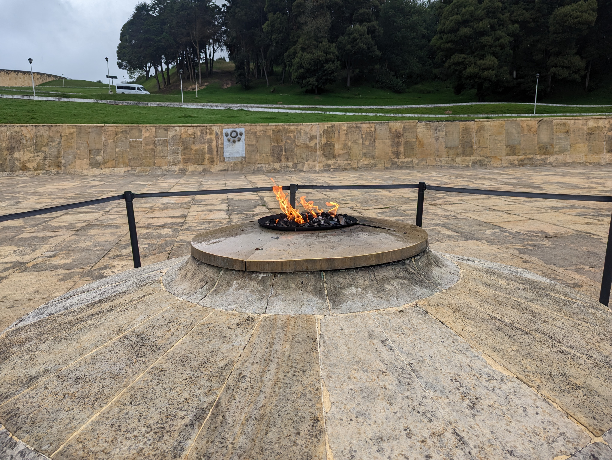

<br><details><summary>:camera:**51/PXL_20230402_134446161.jpg**</summary><sub> `Exif version` 0232 `OS version` HDR+ 1.0.514217843zd `Date` 2023:04:02 08:44:46 `Aperture` Not known `Brightness` 6.52 `Color space` 1 `Compression` 6`Exposure mode` 0 `Exposure time` 0.002986 `Focal length` 6.81 `Lens model` Pixel 6 back camera 6.81mm f/1.85 `Lens specification` Not known `Orientation` 1 `Scene type` Not known `f number` 1.85 `White balance` 0 `Sensing method` 2 `Shutter speed` 8.39</sub><sub>`Coordinates & altitude` (5.450511111111111, -73.43058888888889, 2740.0)</sub><sub> :globe_with_meridians:`Location over` [Google Maps](http://maps.google.com/maps?q=5.450511111111111,-73.43058888888889) or [Openstreet Map](https://www.openstreetmap.org/query?lat=5.450511111111111&lon=-73.43058888888889)</sub></details>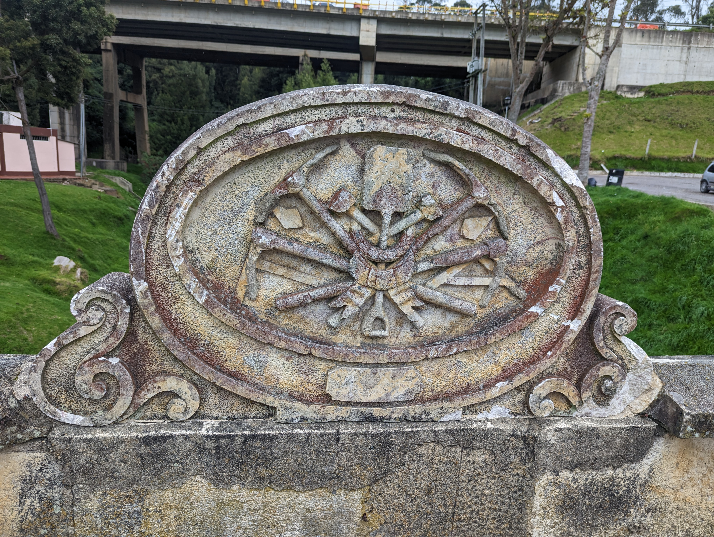

<br><details><summary>:camera:**51/PXL_20230402_150027616.jpg**</summary><sub> `Exif version` 0232 `OS version` HDR+ 1.0.514217843zd `Date` 2023:04:02 10:00:27 `Aperture` Not known `Brightness` 6.06 `Color space` 1 `Compression` 6`Exposure mode` 0 `Exposure time` 0.003074 `Focal length` 6.81 `Lens model` Pixel 6 back camera 6.81mm f/1.85 `Lens specification` Not known `Orientation` 1 `Scene type` Not known `f number` 1.85 `White balance` 0 `Sensing method` 2 `Shutter speed` 8.35</sub></details>

<br><details><summary>:camera:**51/PXL_20230402_155259246.jpg**</summary><sub> `Exif version` 0232 `OS version` HDR+ 1.0.514217843zd `Date` 2023:04:02 10:52:59 `Aperture` Not known `Brightness` 9.15 `Color space` 1 `Compression` 6`Exposure mode` 0 `Exposure time` 0.000539 `Focal length` 6.81 `Lens model` Pixel 6 back camera 6.81mm f/1.85 `Lens specification` Not known `Orientation` 1 `Scene type` Not known `f number` 1.85 `White balance` 0 `Sensing method` 2 `Shutter speed` 10.86</sub><sub>`Coordinates & altitude` (5.608977777777778, -73.2812388888889, 2740.0)</sub><sub> :globe_with_meridians:`Location over` [Google Maps](http://maps.google.com/maps?q=5.608977777777778,-73.2812388888889) or [Openstreet Map](https://www.openstreetmap.org/query?lat=5.608977777777778&lon=-73.2812388888889)</sub></details>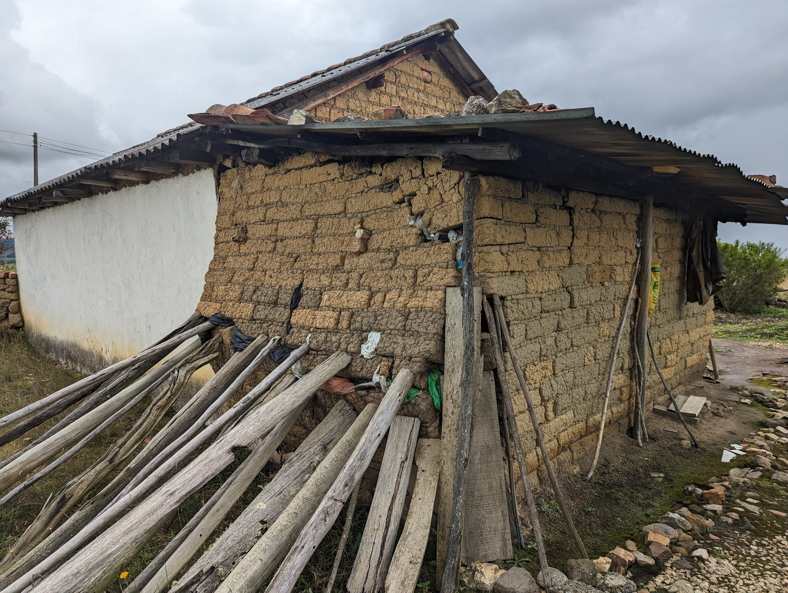

<br><details><summary>:camera:**51/PXL_20230402_155305686.jpg**</summary><sub> `Exif version` 0232 `OS version` HDR+ 1.0.514217843zd `Date` 2023:04:02 10:53:05 `Aperture` Not known `Brightness` 9.33 `Color space` 1 `Compression` 6`Exposure mode` 0 `Exposure time` 0.000406 `Focal length` 6.81 `Lens model` Pixel 6 back camera 6.81mm f/1.85 `Lens specification` Not known `Orientation` 1 `Scene type` Not known `f number` 1.85 `White balance` 0 `Sensing method` 2 `Shutter speed` 11.26</sub><sub>`Coordinates & altitude` (5.608977777777778, -73.2812388888889, 2740.0)</sub><sub> :globe_with_meridians:`Location over` [Google Maps](http://maps.google.com/maps?q=5.608977777777778,-73.2812388888889) or [Openstreet Map](https://www.openstreetmap.org/query?lat=5.608977777777778&lon=-73.2812388888889)</sub></details>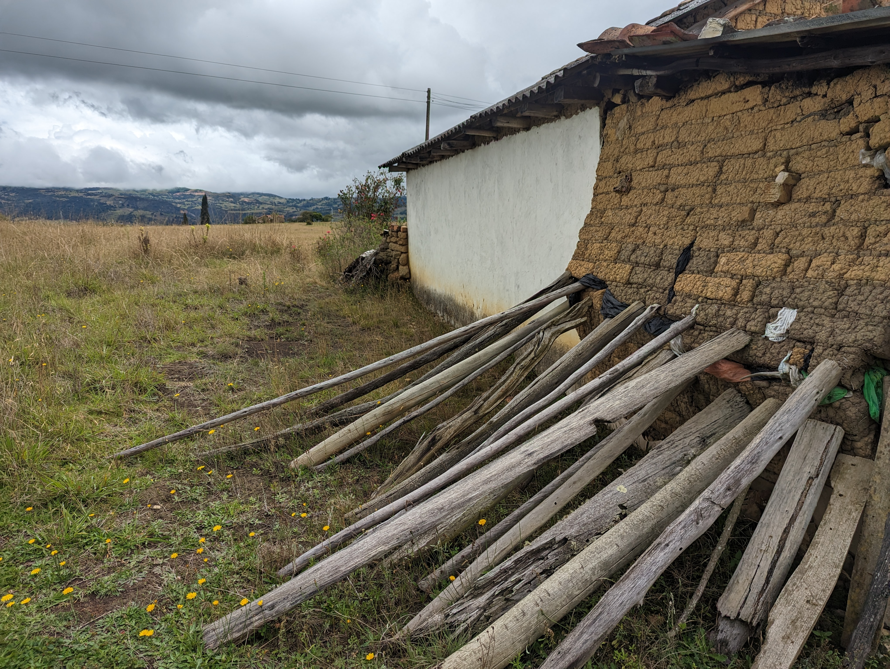

<br><details><summary>:camera:**51/PXL_20230402_155313576.jpg**</summary><sub> `Exif version` 0232 `OS version` HDR+ 1.0.514217843zd `Date` 2023:04:02 10:53:13 `Aperture` Not known `Brightness` 9.19 `Color space` 1 `Compression` 6`Exposure mode` 0 `Exposure time` 0.000398 `Focal length` 6.81 `Lens model` Pixel 6 back camera 6.81mm f/1.85 `Lens specification` Not known `Orientation` 1 `Scene type` Not known `f number` 1.85 `White balance` 0 `Sensing method` 2 `Shutter speed` 11.3</sub><sub>`Coordinates & altitude` (5.608977777777778, -73.2812388888889, 2740.0)</sub><sub> :globe_with_meridians:`Location over` [Google Maps](http://maps.google.com/maps?q=5.608977777777778,-73.2812388888889) or [Openstreet Map](https://www.openstreetmap.org/query?lat=5.608977777777778&lon=-73.2812388888889)</sub></details>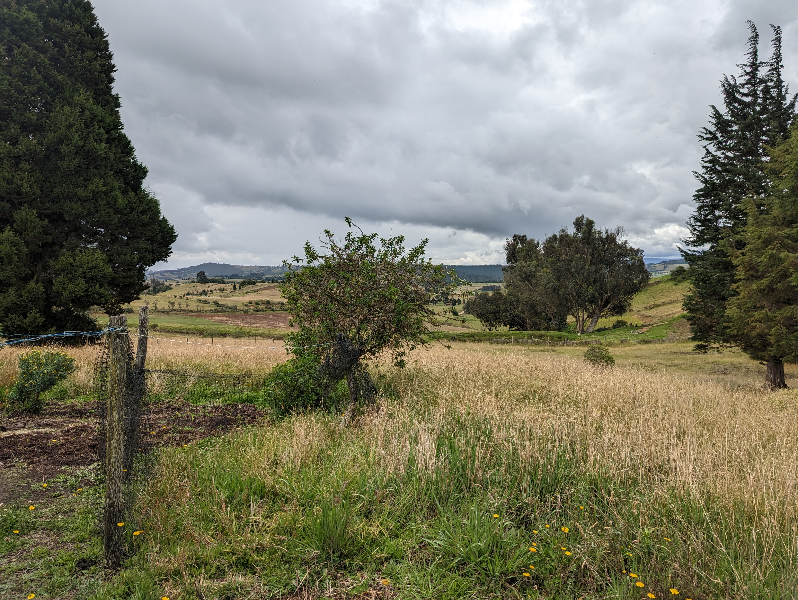

<br><details><summary>:camera:**51/PXL_20230402_160042101.jpg**</summary><sub> `Exif version` 0232 `OS version` HDR+ 1.0.514217843zd `Date` 2023:04:02 11:00:42 `Aperture` Not known `Brightness` 6.77 `Color space` 1 `Compression` 6`Exposure mode` 0 `Exposure time` 0.00265 `Focal length` 6.81 `Lens model` Pixel 6 back camera 6.81mm f/1.85 `Lens specification` Not known `Orientation` 1 `Scene type` Not known `f number` 1.85 `White balance` 0 `Sensing method` 2 `Shutter speed` 8.56</sub><sub>`Coordinates & altitude` (5.609299999999999, -73.28063055555556, 2740.0)</sub><sub> :globe_with_meridians:`Location over` [Google Maps](http://maps.google.com/maps?q=5.609299999999999,-73.28063055555556) or [Openstreet Map](https://www.openstreetmap.org/query?lat=5.609299999999999&lon=-73.28063055555556)</sub></details>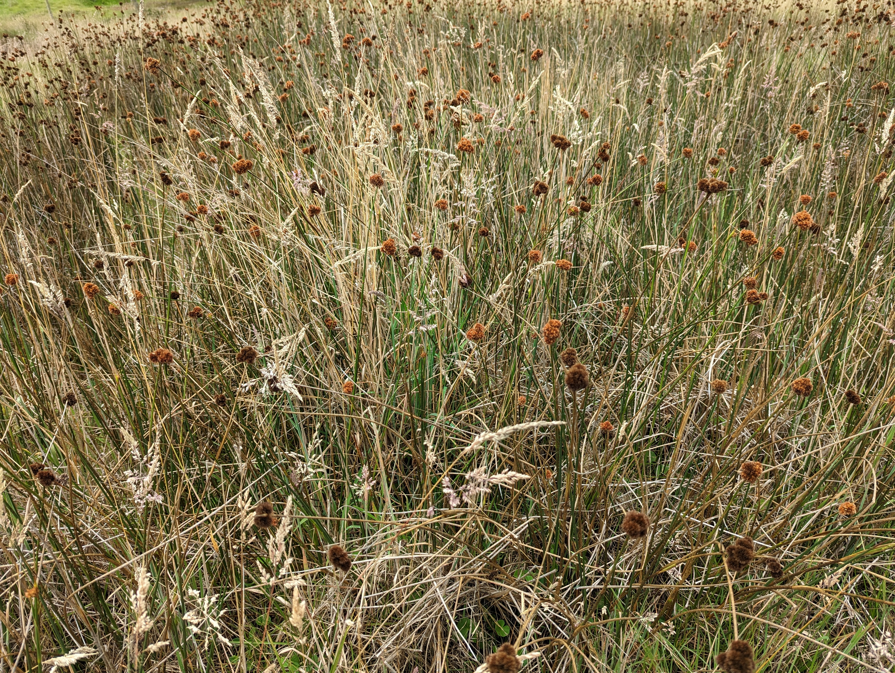

<br><details><summary>:camera:**51/PXL_20230402_160057912.PORTRAIT.jpg**</summary><sub> `Exif version` 0232 `OS version` HDR+ 1.0.514217843zp `Date` 2023:04:02 11:00:57 `Aperture` Not known `Brightness` 6.95 `Color space` 1 `Compression` 6`Exposure mode` 0 `Exposure time` 0.00227 `Focal length` 6.81 `Lens model` Pixel 6 back camera 6.81mm f/1.85 `Lens specification` Not known `Orientation` 1 `Scene type` Not known `f number` 1.85 `White balance` 0 `Sensing method` 2 `Shutter speed` 8.78</sub><sub>`Coordinates & altitude` (5.609299999999999, -73.28063055555556, 2740.0)</sub><sub> :globe_with_meridians:`Location over` [Google Maps](http://maps.google.com/maps?q=5.609299999999999,-73.28063055555556) or [Openstreet Map](https://www.openstreetmap.org/query?lat=5.609299999999999&lon=-73.28063055555556)</sub></details>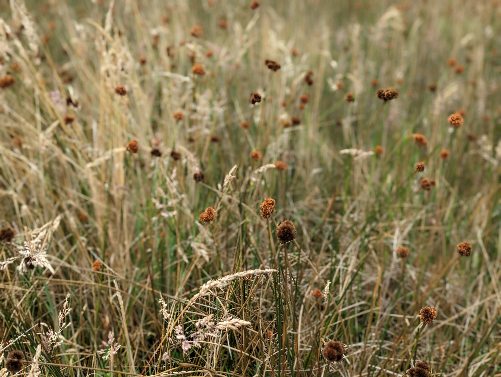

<br><details><summary>:camera:**51/PXL_20230402_160057912.PORTRAIT~2.jpg**</summary><sub> `Exif version` 0232 `OS version` HDR+ 1.0.514217843zp `Date` 2023:04:02 11:00:57 `Aperture` Not known `Brightness` 6.95 `Color space` 1 `Compression` 6`Exposure mode` 0 `Exposure time` 0.00227 `Focal length` 6.81 `Lens model` Pixel 6 back camera 6.81mm f/1.85 `Lens specification` Not known `Orientation` 1 `Scene type` Not known `f number` 1.85 `White balance` 0 `Sensing method` 2 `Shutter speed` 8.78</sub><sub>`Coordinates & altitude` (5.609299999999999, -73.28063055555556, 2740.0)</sub><sub> :globe_with_meridians:`Location over` [Google Maps](http://maps.google.com/maps?q=5.609299999999999,-73.28063055555556) or [Openstreet Map](https://www.openstreetmap.org/query?lat=5.609299999999999&lon=-73.28063055555556)</sub></details>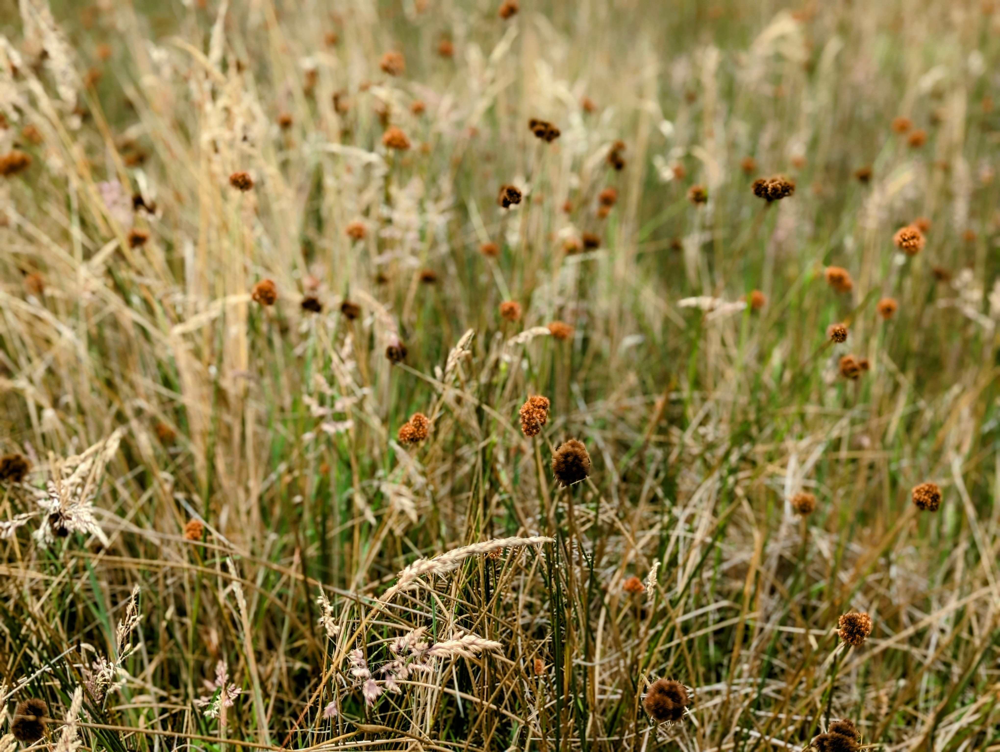

<br><details><summary>:camera:**51/PXL_20230402_160057912.PORTRAIT~3.jpg**</summary><sub> `Exif version` 0232 `OS version` HDR+ 1.0.514217843zp `Date` 2023:04:02 11:00:57 `Aperture` Not known `Brightness` 6.95 `Color space` 1 `Compression` 6`Exposure mode` 0 `Exposure time` 0.00227 `Focal length` 6.81 `Lens model` Pixel 6 back camera 6.81mm f/1.85 `Lens specification` Not known `Orientation` 1 `Scene type` Not known `f number` 1.85 `White balance` 0 `Sensing method` 2 `Shutter speed` 8.78</sub><sub>`Coordinates & altitude` (5.609299999999999, -73.28063055555556, 2740.0)</sub><sub> :globe_with_meridians:`Location over` [Google Maps](http://maps.google.com/maps?q=5.609299999999999,-73.28063055555556) or [Openstreet Map](https://www.openstreetmap.org/query?lat=5.609299999999999&lon=-73.28063055555556)</sub></details>

<br><details><summary>:camera:**51/PXL_20230402_160106212.NIGHT.jpg**</summary><sub> `Exif version` 0232 `OS version` HDR+ 1.0.514217843zl `Date` 2023:04:02 11:01:06 `Aperture` Not known `Brightness` 6.89 `Color space` 1 `Compression` 6`Exposure mode` 0 `Exposure time` 0.002368 `Focal length` 6.81 `Lens model` Pixel 6 back camera 6.81mm f/1.85 `Lens specification` Not known `Orientation` 1 `Scene type` Not known `f number` 1.85 `White balance` 0 `Sensing method` 2 `Shutter speed` 8.72</sub><sub>`Coordinates & altitude` (5.609299999999999, -73.28063055555556, 2740.0)</sub><sub> :globe_with_meridians:`Location over` [Google Maps](http://maps.google.com/maps?q=5.609299999999999,-73.28063055555556) or [Openstreet Map](https://www.openstreetmap.org/query?lat=5.609299999999999&lon=-73.28063055555556)</sub></details>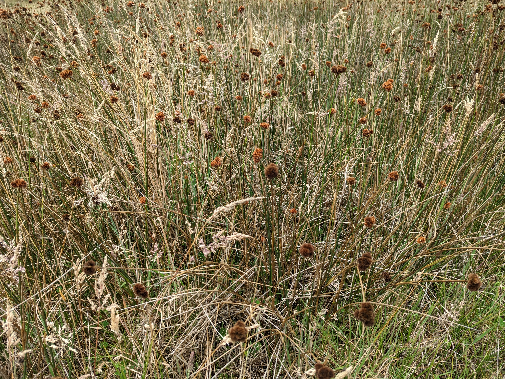

<br><details><summary>:camera:**51/PXL_20230402_160121202.MP.jpg**</summary><sub> `Exif version` 0232 `OS version` HDR+ 1.0.514217843zd `Date` 2023:04:02 11:01:21 `Aperture` Not known `Brightness` 9.32 `Color space` 1 `Compression` 6`Exposure mode` 0 `Exposure time` 0.00038 `Focal length` 6.81 `Lens model` Pixel 6 back camera 6.81mm f/1.85 `Lens specification` Not known `Orientation` 1 `Scene type` Not known `f number` 1.85 `White balance` 0 `Sensing method` 2 `Shutter speed` 11.36</sub><sub>`Coordinates & altitude` (5.609299999999999, -73.28063055555556, 2740.0)</sub><sub> :globe_with_meridians:`Location over` [Google Maps](http://maps.google.com/maps?q=5.609299999999999,-73.28063055555556) or [Openstreet Map](https://www.openstreetmap.org/query?lat=5.609299999999999&lon=-73.28063055555556)</sub></details>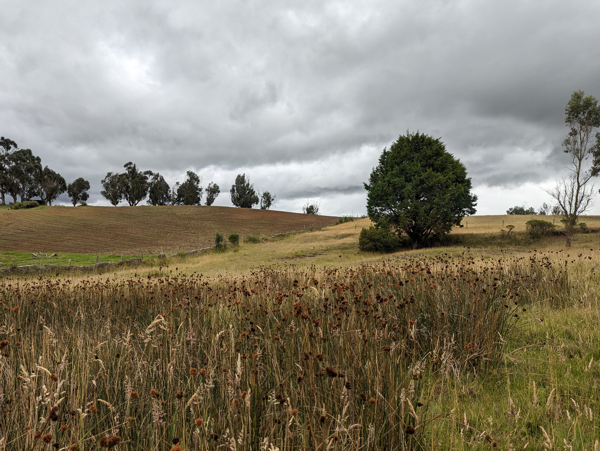

<br><details><summary>:camera:**51/PXL_20230402_160126802.jpg**</summary><sub> `Exif version` 0232 `OS version` HDR+ 1.0.514217843zd `Date` 2023:04:02 11:01:26 `Aperture` Not known `Brightness` 8.69 `Color space` 1 `Compression` 6`Exposure mode` 0 `Exposure time` 0.000574 `Focal length` 6.81 `Lens model` Pixel 6 back camera 6.81mm f/1.85 `Lens specification` Not known `Orientation` 1 `Scene type` Not known `f number` 1.85 `White balance` 0 `Sensing method` 2 `Shutter speed` 10.77</sub><sub>`Coordinates & altitude` (5.609299999999999, -73.28063055555556, 2740.0)</sub><sub> :globe_with_meridians:`Location over` [Google Maps](http://maps.google.com/maps?q=5.609299999999999,-73.28063055555556) or [Openstreet Map](https://www.openstreetmap.org/query?lat=5.609299999999999&lon=-73.28063055555556)</sub></details>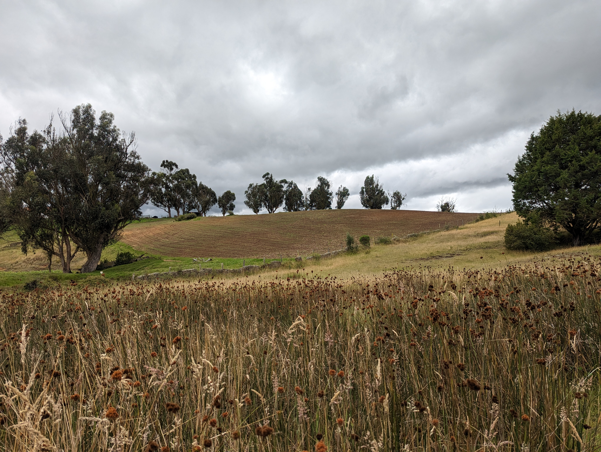

<br><details><summary>:camera:**51/PXL_20230402_160135161.MP.jpg**</summary><sub> `Exif version` 0232 `OS version` HDR+ 1.0.514217843zd `Date` 2023:04:02 11:01:35 `Aperture` Not known `Brightness` 8.8 `Color space` 1 `Compression` 6`Exposure mode` 0 `Exposure time` 0.000557 `Focal length` 6.81 `Lens model` Pixel 6 back camera 6.81mm f/1.85 `Lens specification` Not known `Orientation` 1 `Scene type` Not known `f number` 1.85 `White balance` 0 `Sensing method` 2 `Shutter speed` 10.81</sub><sub>`Coordinates & altitude` (5.609299999999999, -73.28063055555556, 2740.0)</sub><sub> :globe_with_meridians:`Location over` [Google Maps](http://maps.google.com/maps?q=5.609299999999999,-73.28063055555556) or [Openstreet Map](https://www.openstreetmap.org/query?lat=5.609299999999999&lon=-73.28063055555556)</sub></details>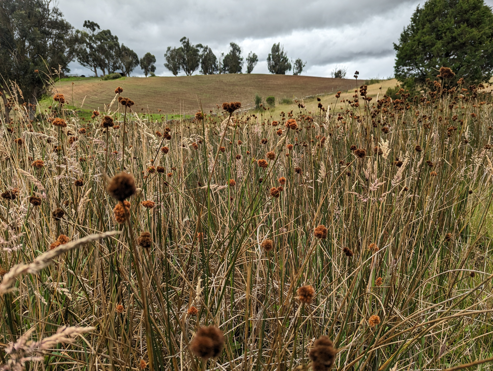

<br><details><summary>:camera:**51/PXL_20230402_160140576.jpg**</summary><sub> `Exif version` 0232 `OS version` HDR+ 1.0.514217843zd `Date` 2023:04:02 11:01:40 `Aperture` Not known `Brightness` 9.68 `Color space` 1 `Compression` 6`Exposure mode` 0 `Exposure time` 0.000353 `Focal length` 6.81 `Lens model` Pixel 6 back camera 6.81mm f/1.85 `Lens specification` Not known `Orientation` 1 `Scene type` Not known `f number` 1.85 `White balance` 0 `Sensing method` 2 `Shutter speed` 11.47</sub><sub>`Coordinates & altitude` (5.609299999999999, -73.28063055555556, 2740.0)</sub><sub> :globe_with_meridians:`Location over` [Google Maps](http://maps.google.com/maps?q=5.609299999999999,-73.28063055555556) or [Openstreet Map](https://www.openstreetmap.org/query?lat=5.609299999999999&lon=-73.28063055555556)</sub></details>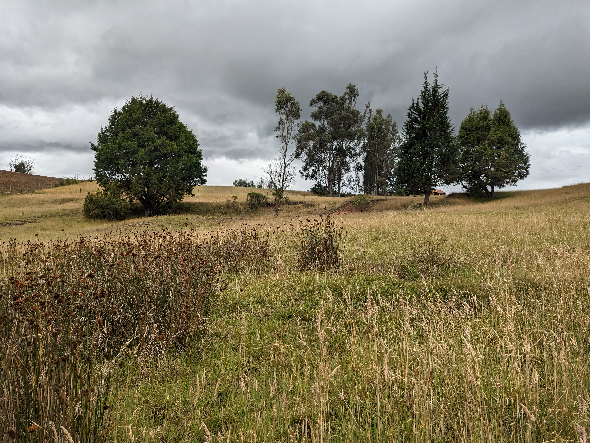

<br><details><summary>:camera:**51/PXL_20230402_160149157.jpg**</summary><sub> `Exif version` 0232 `OS version` HDR+ 1.0.514217843zd `Date` 2023:04:02 11:01:49 `Aperture` Not known `Brightness` 9.46 `Color space` 1 `Compression` 6`Exposure mode` 0 `Exposure time` 0.000309 `Focal length` 6.81 `Lens model` Pixel 6 back camera 6.81mm f/1.85 `Lens specification` Not known `Orientation` 1 `Scene type` Not known `f number` 1.85 `White balance` 0 `Sensing method` 2 `Shutter speed` 11.66</sub><sub>`Coordinates & altitude` (5.609299999999999, -73.28063055555556, 2740.0)</sub><sub> :globe_with_meridians:`Location over` [Google Maps](http://maps.google.com/maps?q=5.609299999999999,-73.28063055555556) or [Openstreet Map](https://www.openstreetmap.org/query?lat=5.609299999999999&lon=-73.28063055555556)</sub></details>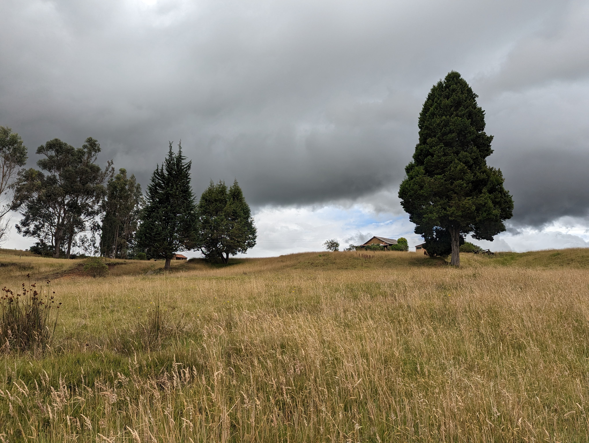

<br><details><summary>:camera:**51/PXL_20230402_160235742.MP.jpg**</summary><sub> `Exif version` 0232 `OS version` HDR+ 1.0.514217843zd `Date` 2023:04:02 11:02:35 `Aperture` Not known `Brightness` 6.56 `Color space` 1 `Compression` 6`Exposure mode` 0 `Exposure time` 0.002898 `Focal length` 6.81 `Lens model` Pixel 6 back camera 6.81mm f/1.85 `Lens specification` Not known `Orientation` 1 `Scene type` Not known `f number` 1.85 `White balance` 0 `Sensing method` 2 `Shutter speed` 8.43</sub><sub>`Coordinates & altitude` (5.60933611111111, -73.28053055555556, 2732.0)</sub><sub> :globe_with_meridians:`Location over` [Google Maps](http://maps.google.com/maps?q=5.60933611111111,-73.28053055555556) or [Openstreet Map](https://www.openstreetmap.org/query?lat=5.60933611111111&lon=-73.28053055555556)</sub></details>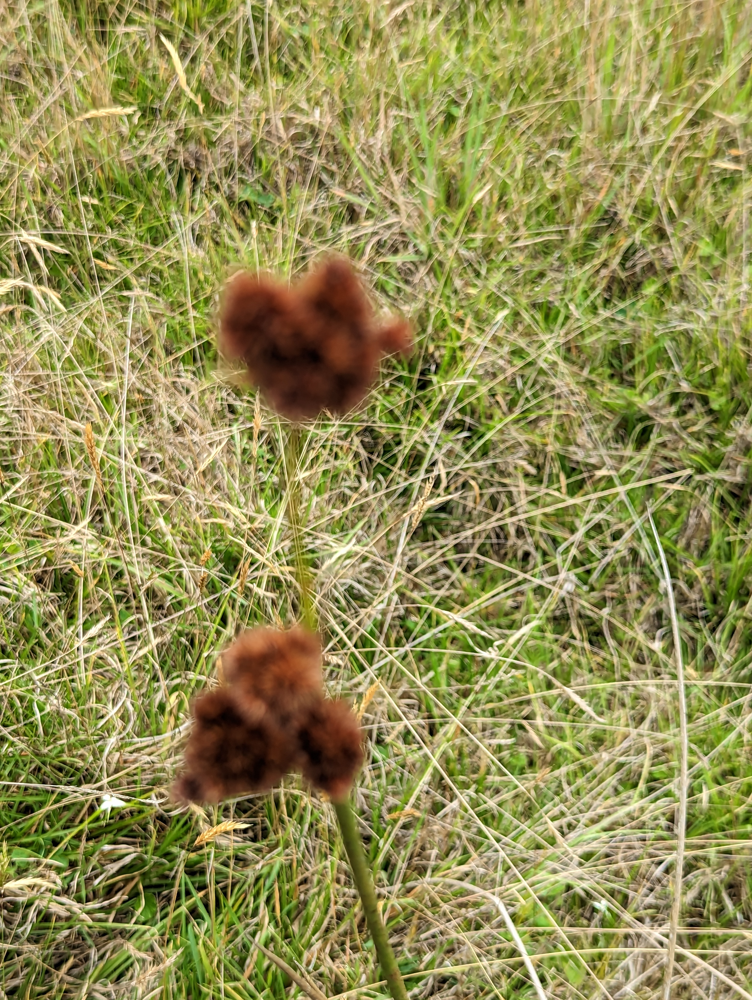

<br><details><summary>:camera:**51/PXL_20230402_160235742_exported_666_1680467445375.jpg**</summary><sub> `Exif version` 0232 `OS version` HDR+ 1.0.514217843zd `Date` 2023:04:02 11:02:34 `Aperture` Not known `Brightness` 6.56 `Color space` 1 `Compression` 6`Exposure mode` 0 `Exposure time` 0.002898 `Focal length` 6.81 `Lens model` Pixel 6 back camera 6.81mm f/1.85 `Lens specification` Not known `Orientation` 1 `Scene type` Not known `f number` 1.85 `White balance` 0 `Sensing method` 2 `Shutter speed` 8.43</sub><sub>`Coordinates & altitude` (5.609333333333333, -73.28053055555556, 2732.0)</sub><sub> :globe_with_meridians:`Location over` [Google Maps](http://maps.google.com/maps?q=5.609333333333333,-73.28053055555556) or [Openstreet Map](https://www.openstreetmap.org/query?lat=5.609333333333333&lon=-73.28053055555556)</sub></details>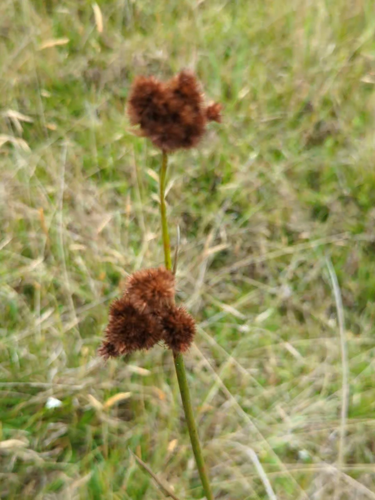

<br><details><summary>:camera:**51/PXL_20230402_160258022.PORTRAIT.jpg**</summary><sub> `Exif version` 0232 `OS version` HDR+ 1.0.514217843zp `Date` 2023:04:02 11:02:58 `Aperture` Not known `Brightness` 6.56 `Color space` 1 `Compression` 6`Exposure mode` 0 `Exposure time` 0.003145 `Focal length` 6.81 `Lens model` Pixel 6 back camera 6.81mm f/1.85 `Lens specification` Not known `Orientation` 1 `Scene type` Not known `f number` 1.85 `White balance` 0 `Sensing method` 2 `Shutter speed` 8.31</sub><sub>`Coordinates & altitude` (5.60933611111111, -73.28053055555556, 2732.0)</sub><sub> :globe_with_meridians:`Location over` [Google Maps](http://maps.google.com/maps?q=5.60933611111111,-73.28053055555556) or [Openstreet Map](https://www.openstreetmap.org/query?lat=5.60933611111111&lon=-73.28053055555556)</sub></details>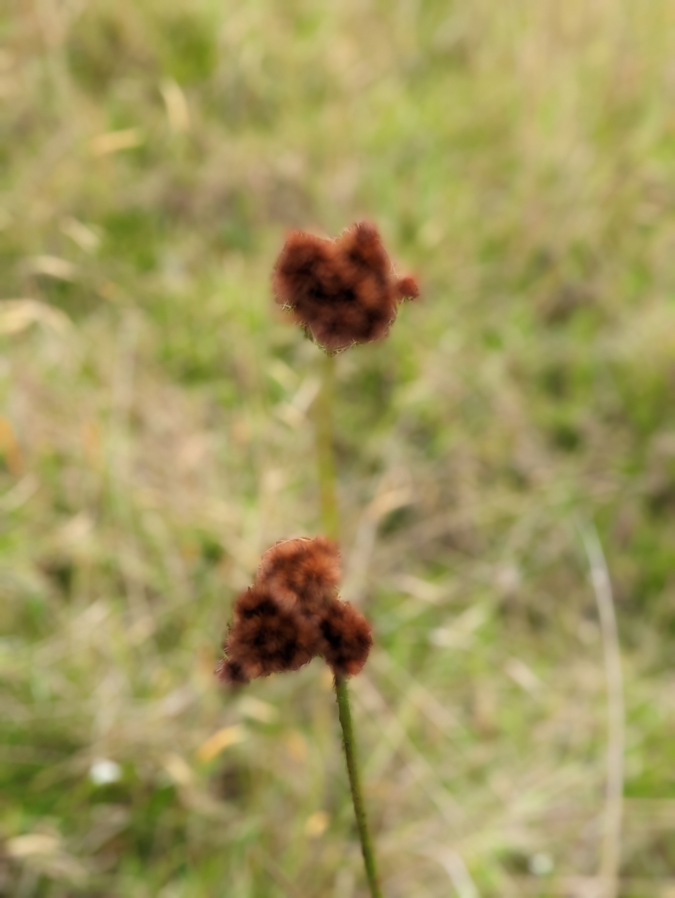

<br><details><summary>:camera:**51/PXL_20230402_160529960.jpg**</summary><sub> `Exif version` 0232 `OS version` HDR+ 1.0.514217843zd `Date` 2023:04:02 11:05:29 `Aperture` Not known `Brightness` 6.38 `Color space` 1 `Compression` 6`Exposure mode` 0 `Exposure time` 0.003463 `Focal length` 6.81 `Lens model` Pixel 6 back camera 6.81mm f/1.85 `Lens specification` Not known `Orientation` 1 `Scene type` Not known `f number` 1.85 `White balance` 0 `Sensing method` 2 `Shutter speed` 8.17</sub><sub>`Coordinates & altitude` (5.6092861111111105, -73.28105833333333, 2748.0)</sub><sub> :globe_with_meridians:`Location over` [Google Maps](http://maps.google.com/maps?q=5.6092861111111105,-73.28105833333333) or [Openstreet Map](https://www.openstreetmap.org/query?lat=5.6092861111111105&lon=-73.28105833333333)</sub></details>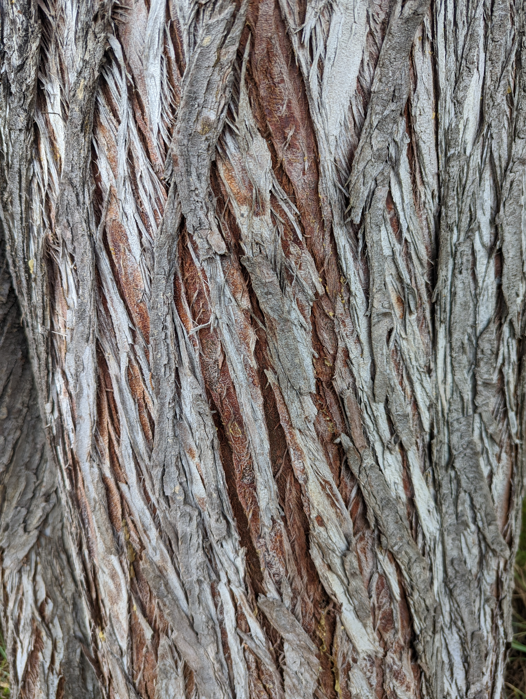

<br><details><summary>:camera:**51/PXL_20230402_160541699.jpg**</summary><sub> `Exif version` 0232 `OS version` HDR+ 1.0.514217843zd `Date` 2023:04:02 11:05:41 `Aperture` Not known `Brightness` 6.05 `Color space` 1 `Compression` 6`Exposure mode` 0 `Exposure time` 0.003931 `Focal length` 6.81 `Lens model` Pixel 6 back camera 6.81mm f/1.85 `Lens specification` Not known `Orientation` 1 `Scene type` Not known `f number` 1.85 `White balance` 0 `Sensing method` 2 `Shutter speed` 7.99</sub><sub>`Coordinates & altitude` (5.6092861111111105, -73.28105833333333, 2748.0)</sub><sub> :globe_with_meridians:`Location over` [Google Maps](http://maps.google.com/maps?q=5.6092861111111105,-73.28105833333333) or [Openstreet Map](https://www.openstreetmap.org/query?lat=5.6092861111111105&lon=-73.28105833333333)</sub></details>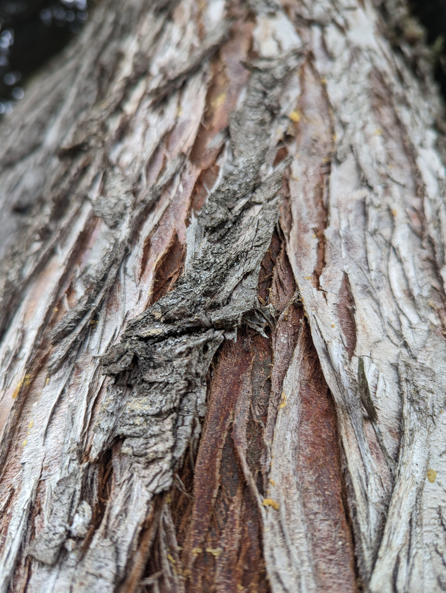

<br><details><summary>:camera:**51/PXL_20230402_160550477.jpg**</summary><sub> `Exif version` 0232 `OS version` HDR+ 1.0.514217843zd `Date` 2023:04:02 11:05:50 `Aperture` Not known `Brightness` 6.3 `Color space` 1 `Compression` 6`Exposure mode` 0 `Exposure time` 0.003772 `Focal length` 6.81 `Lens model` Pixel 6 back camera 6.81mm f/1.85 `Lens specification` Not known `Orientation` 1 `Scene type` Not known `f number` 1.85 `White balance` 0 `Sensing method` 2 `Shutter speed` 8.05</sub><sub>`Coordinates & altitude` (5.6092861111111105, -73.28105833333333, 2748.0)</sub><sub> :globe_with_meridians:`Location over` [Google Maps](http://maps.google.com/maps?q=5.6092861111111105,-73.28105833333333) or [Openstreet Map](https://www.openstreetmap.org/query?lat=5.6092861111111105&lon=-73.28105833333333)</sub></details>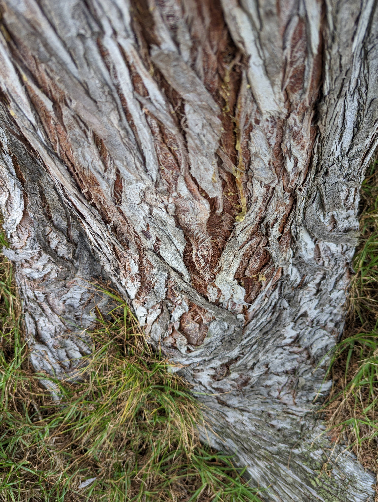

<br><details><summary>:camera:**51/PXL_20230402_160826665.jpg**</summary><sub> `Exif version` 0232 `OS version` HDR+ 1.0.514217843zd `Date` 2023:04:02 11:08:26 `Aperture` Not known `Brightness` 9.16 `Color space` 1 `Compression` 6`Exposure mode` 0 `Exposure time` 0.000645 `Focal length` 6.81 `Lens model` Pixel 6 back camera 6.81mm f/1.85 `Lens specification` Not known `Orientation` 1 `Scene type` Not known `f number` 1.85 `White balance` 0 `Sensing method` 2 `Shutter speed` 10.6</sub><sub>`Coordinates & altitude` (5.608899999999999, -73.281025, 2752.57)</sub><sub> :globe_with_meridians:`Location over` [Google Maps](http://maps.google.com/maps?q=5.608899999999999,-73.281025) or [Openstreet Map](https://www.openstreetmap.org/query?lat=5.608899999999999&lon=-73.281025)</sub></details>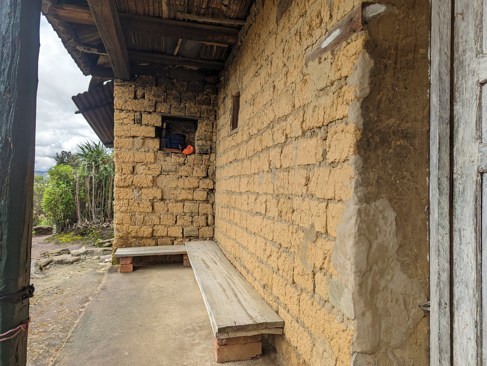

<br><details><summary>:camera:**51/PXL_20230402_161612734.jpg**</summary><sub> `Exif version` 0232 `OS version` HDR+ 1.0.514217843zd `Date` 2023:04:02 11:16:12 `Aperture` Not known `Brightness` 7.51 `Color space` 1 `Compression` 6`Exposure mode` 0 `Exposure time` 0.001369 `Focal length` 6.81 `Lens model` Pixel 6 back camera 6.81mm f/1.85 `Lens specification` Not known `Orientation` 1 `Scene type` Not known `f number` 1.85 `White balance` 0 `Sensing method` 2 `Shutter speed` 9.51</sub><sub>`Coordinates & altitude` (5.609191666666666, -73.28128055555555, 2757.0)</sub><sub> :globe_with_meridians:`Location over` [Google Maps](http://maps.google.com/maps?q=5.609191666666666,-73.28128055555555) or [Openstreet Map](https://www.openstreetmap.org/query?lat=5.609191666666666&lon=-73.28128055555555)</sub></details>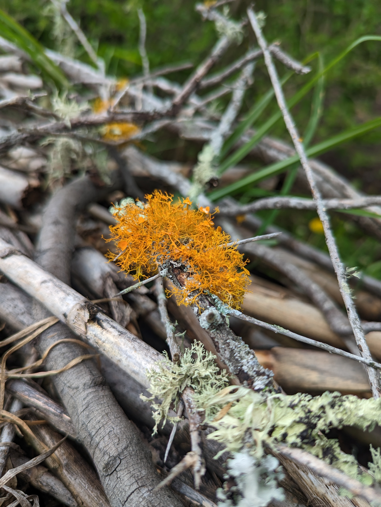

<br><details><summary>:camera:**51/PXL_20230402_161618498.PORTRAIT.ORIGINAL.jpg**</summary><sub> `Exif version` 0232 `OS version` HDR+ 1.0.514217843zp `Date` 2023:04:02 11:16:18 `Aperture` Not known `Brightness` 7.41 `Color space` 1 `Compression` 6`Exposure mode` 0 `Exposure time` 0.001537 `Focal length` 6.81 `Lens model` Pixel 6 back camera 6.81mm f/1.85 `Lens specification` Not known `Orientation` 1 `Scene type` Not known `f number` 1.85 `White balance` 0 `Sensing method` 2 `Shutter speed` 9.35</sub><sub>`Coordinates & altitude` (5.609191666666666, -73.28128055555555, 2757.0)</sub><sub> :globe_with_meridians:`Location over` [Google Maps](http://maps.google.com/maps?q=5.609191666666666,-73.28128055555555) or [Openstreet Map](https://www.openstreetmap.org/query?lat=5.609191666666666&lon=-73.28128055555555)</sub></details>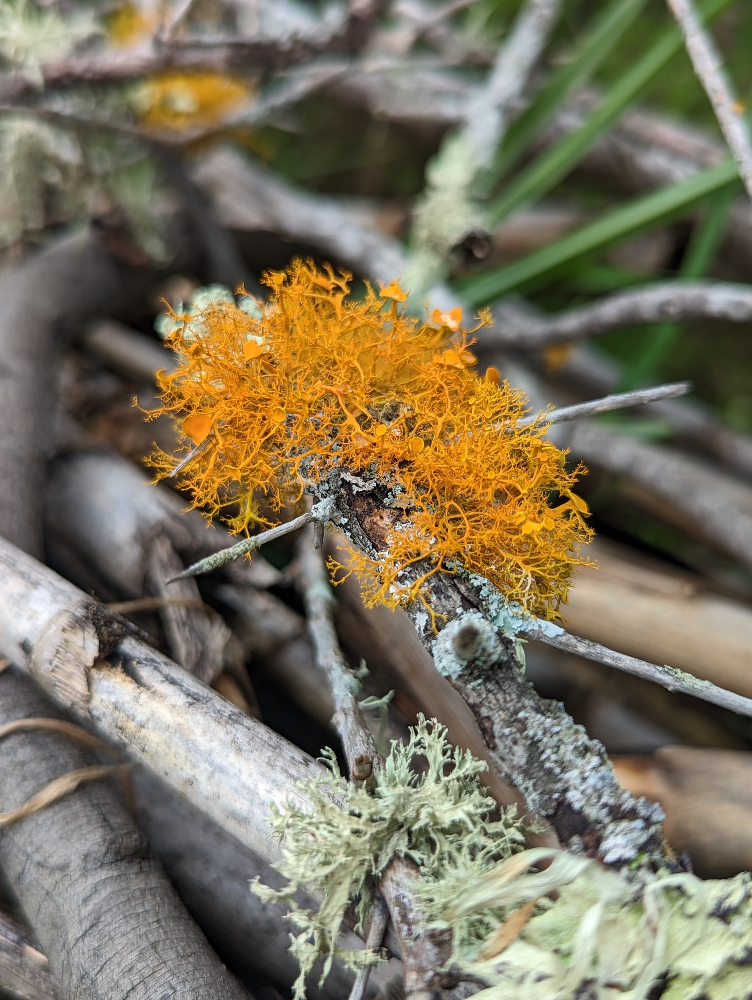

<br><details><summary>:camera:**51/PXL_20230402_161618498.PORTRAIT.ORIGINAL~2.jpg**</summary><sub> `Exif version` 0232 `OS version` HDR+ 1.0.514217843zp `Date` 2023:04:02 11:16:18 `Aperture` Not known `Brightness` 7.41 `Color space` 1 `Compression` 6`Exposure mode` 0 `Exposure time` 0.001537 `Focal length` 6.81 `Lens model` Pixel 6 back camera 6.81mm f/1.85 `Lens specification` Not known `Orientation` 1 `Scene type` Not known `f number` 1.85 `White balance` 0 `Sensing method` 2 `Shutter speed` 9.35</sub><sub>`Coordinates & altitude` (5.609191666666666, -73.28128055555555, 2757.0)</sub><sub> :globe_with_meridians:`Location over` [Google Maps](http://maps.google.com/maps?q=5.609191666666666,-73.28128055555555) or [Openstreet Map](https://www.openstreetmap.org/query?lat=5.609191666666666&lon=-73.28128055555555)</sub></details>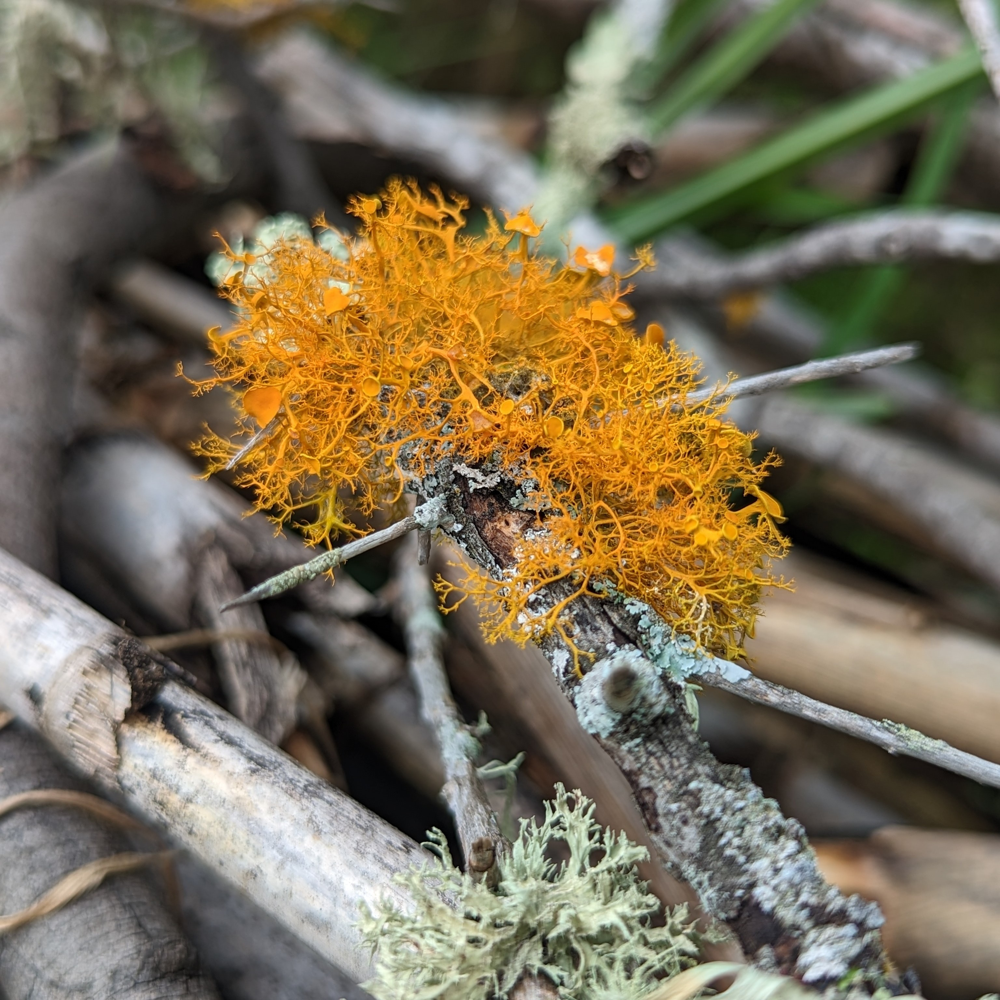

<br><details><summary>:camera:**51/PXL_20230402_161701972.jpg**</summary><sub> `Exif version` 0232 `OS version` HDR+ 1.0.514217843zd `Date` 2023:04:02 11:17:01 `Aperture` Not known `Brightness` 9.1 `Color space` 1 `Compression` 6`Exposure mode` 0 `Exposure time` 0.000424 `Focal length` 6.81 `Lens model` Pixel 6 back camera 6.81mm f/1.85 `Lens specification` Not known `Orientation` 1 `Scene type` Not known `f number` 1.85 `White balance` 0 `Sensing method` 2 `Shutter speed` 11.2</sub><sub>`Coordinates & altitude` (5.609191666666666, -73.28128055555555, 2757.0)</sub><sub> :globe_with_meridians:`Location over` [Google Maps](http://maps.google.com/maps?q=5.609191666666666,-73.28128055555555) or [Openstreet Map](https://www.openstreetmap.org/query?lat=5.609191666666666&lon=-73.28128055555555)</sub></details>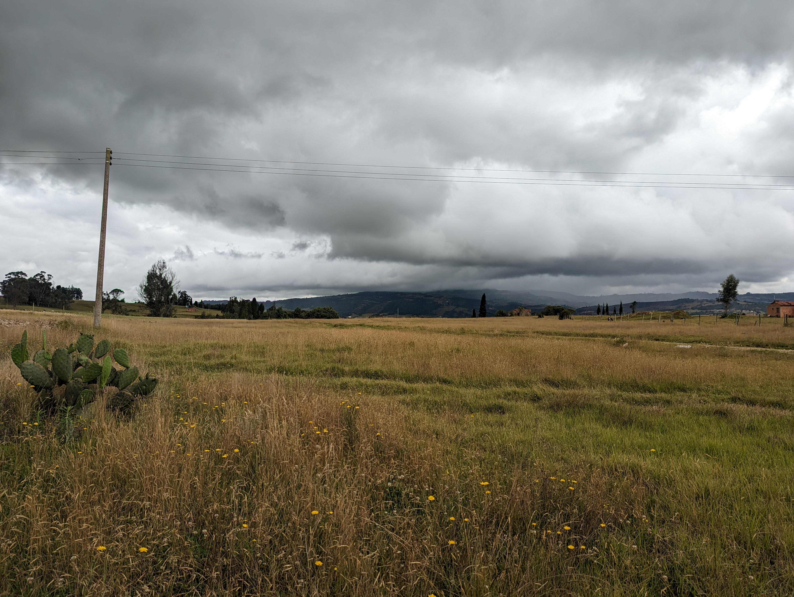

<br><details><summary>:camera:**51/PXL_20230402_161701972~2.jpg**</summary><sub> `Exif version` 0232 `OS version` HDR+ 1.0.514217843zd `Date` 2023:04:02 11:17:01 `Aperture` Not known `Brightness` 9.1 `Color space` 1 `Compression` 6`Exposure mode` 0 `Exposure time` 0.000424 `Focal length` 6.81 `Lens model` Pixel 6 back camera 6.81mm f/1.85 `Lens specification` Not known `Orientation` 1 `Scene type` Not known `f number` 1.85 `White balance` 0 `Sensing method` 2 `Shutter speed` 11.2</sub><sub>`Coordinates & altitude` (5.609191666666666, -73.28128055555555, 2757.0)</sub><sub> :globe_with_meridians:`Location over` [Google Maps](http://maps.google.com/maps?q=5.609191666666666,-73.28128055555555) or [Openstreet Map](https://www.openstreetmap.org/query?lat=5.609191666666666&lon=-73.28128055555555)</sub></details>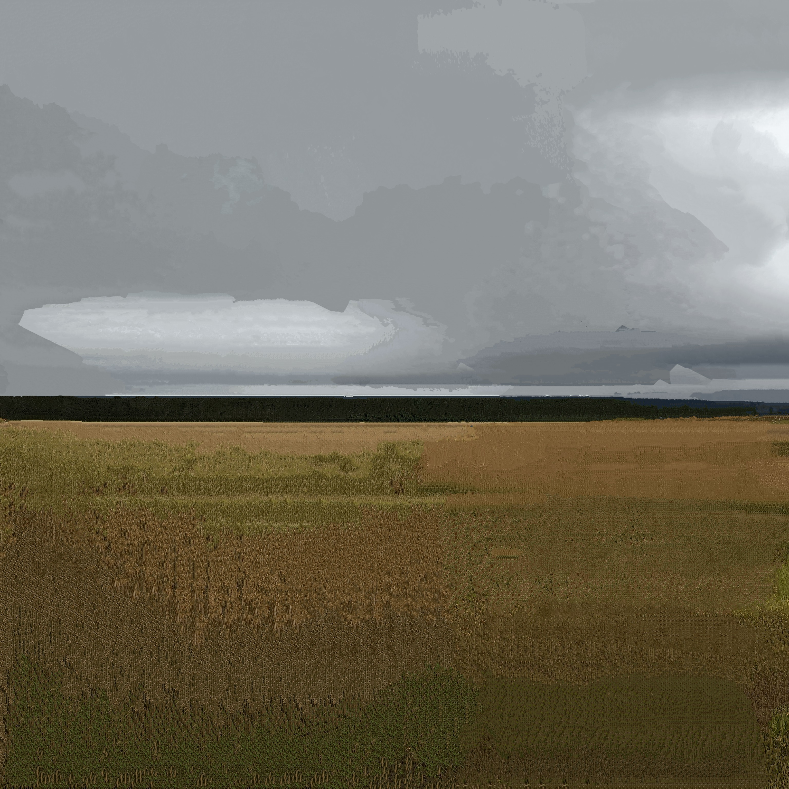

<br><details><summary>:camera:**51/PXL_20230402_161707380.jpg**</summary><sub> `Exif version` 0232 `OS version` HDR+ 1.0.514217843zd `Date` 2023:04:02 11:17:07 `Aperture` Not known `Brightness` 9.62 `Color space` 1 `Compression` 6`Exposure mode` 0 `Exposure time` 0.000309 `Focal length` 6.81 `Lens model` Pixel 6 back camera 6.81mm f/1.85 `Lens specification` Not known `Orientation` 1 `Scene type` Not known `f number` 1.85 `White balance` 0 `Sensing method` 2 `Shutter speed` 11.66</sub><sub>`Coordinates & altitude` (5.609191666666666, -73.28128055555555, 2757.0)</sub><sub> :globe_with_meridians:`Location over` [Google Maps](http://maps.google.com/maps?q=5.609191666666666,-73.28128055555555) or [Openstreet Map](https://www.openstreetmap.org/query?lat=5.609191666666666&lon=-73.28128055555555)</sub></details>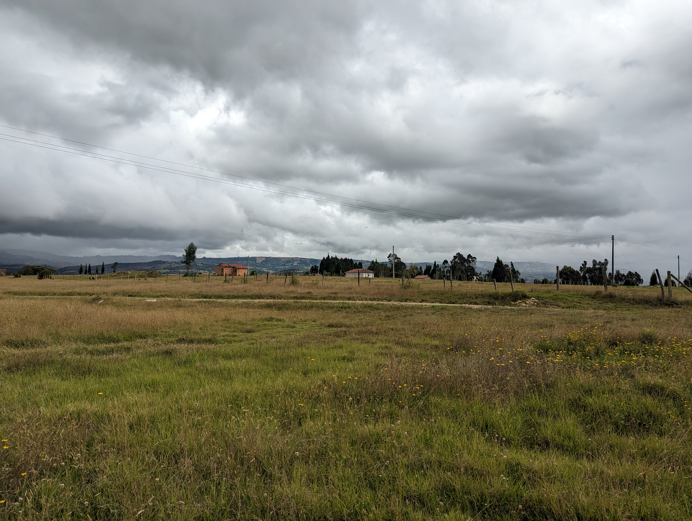

<br><details><summary>:camera:**51/PXL_20230402_161712289.jpg**</summary><sub> `Exif version` 0232 `OS version` HDR+ 1.0.514217843zd `Date` 2023:04:02 11:17:12 `Aperture` Not known `Brightness` 9.72 `Color space` 1 `Compression` 6`Exposure mode` 0 `Exposure time` 0.000283 `Focal length` 6.81 `Lens model` Pixel 6 back camera 6.81mm f/1.85 `Lens specification` Not known `Orientation` 1 `Scene type` Not known `f number` 1.85 `White balance` 0 `Sensing method` 2 `Shutter speed` 11.79</sub><sub>`Coordinates & altitude` (5.609191666666666, -73.28128055555555, 2757.0)</sub><sub> :globe_with_meridians:`Location over` [Google Maps](http://maps.google.com/maps?q=5.609191666666666,-73.28128055555555) or [Openstreet Map](https://www.openstreetmap.org/query?lat=5.609191666666666&lon=-73.28128055555555)</sub></details>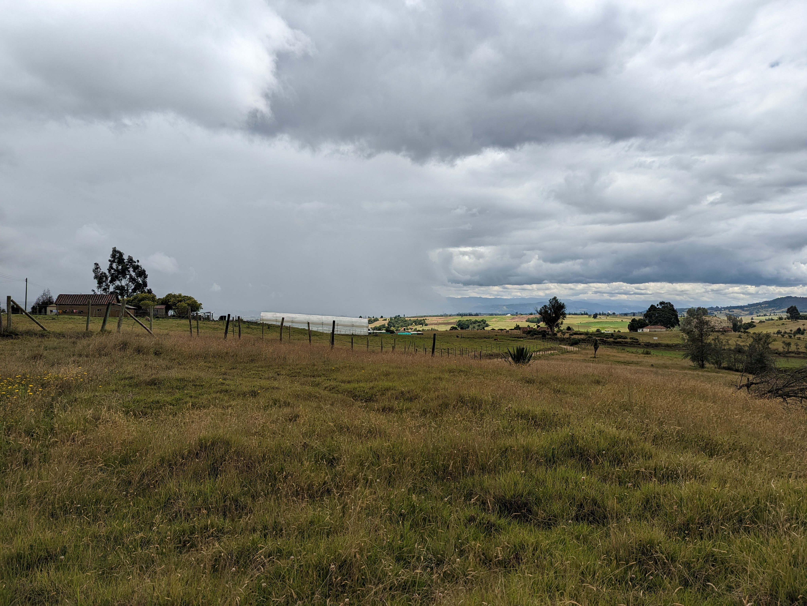

<br><details><summary>:camera:**51/PXL_20230402_161849364.jpg**</summary><sub> `Exif version` 0232 `OS version` HDR+ 1.0.514217843zd `Date` 2023:04:02 11:18:49 `Aperture` Not known `Brightness` 8.82 `Color space` 1 `Compression` 6`Exposure mode` 0 `Exposure time` 0.000504 `Focal length` 6.81 `Lens model` Pixel 6 back camera 6.81mm f/1.85 `Lens specification` Not known `Orientation` 1 `Scene type` Not known `f number` 1.85 `White balance` 0 `Sensing method` 2 `Shutter speed` 10.96</sub><sub>`Coordinates & altitude` (5.609097222222222, -73.28132777777778, 2738.0)</sub><sub> :globe_with_meridians:`Location over` [Google Maps](http://maps.google.com/maps?q=5.609097222222222,-73.28132777777778) or [Openstreet Map](https://www.openstreetmap.org/query?lat=5.609097222222222&lon=-73.28132777777778)</sub></details>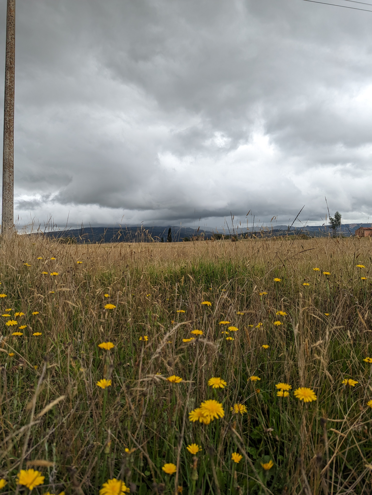

<br><details><summary>:camera:**51/PXL_20230402_161855971.jpg**</summary><sub> `Exif version` 0232 `OS version` HDR+ 1.0.514217843zd `Date` 2023:04:02 11:18:55 `Aperture` Not known `Brightness` 7.15 `Color space` 1 `Compression` 6`Exposure mode` 0 `Exposure time` 0.001793 `Focal length` 6.81 `Lens model` Pixel 6 back camera 6.81mm f/1.85 `Lens specification` Not known `Orientation` 1 `Scene type` Not known `f number` 1.85 `White balance` 0 `Sensing method` 2 `Shutter speed` 9.12</sub><sub>`Coordinates & altitude` (5.609097222222222, -73.28132777777778, 2738.0)</sub><sub> :globe_with_meridians:`Location over` [Google Maps](http://maps.google.com/maps?q=5.609097222222222,-73.28132777777778) or [Openstreet Map](https://www.openstreetmap.org/query?lat=5.609097222222222&lon=-73.28132777777778)</sub></details>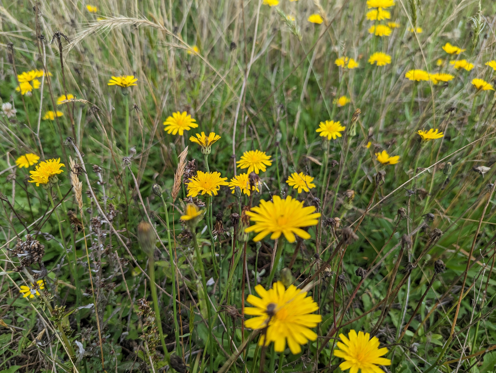

<br><details><summary>:camera:**51/PXL_20230402_161901922.jpg**</summary><sub> `Exif version` 0232 `OS version` HDR+ 1.0.514217843zd `Date` 2023:04:02 11:19:01 `Aperture` Not known `Brightness` 9.72 `Color space` 1 `Compression` 6`Exposure mode` 0 `Exposure time` 0.000283 `Focal length` 6.81 `Lens model` Pixel 6 back camera 6.81mm f/1.85 `Lens specification` Not known `Orientation` 1 `Scene type` Not known `f number` 1.85 `White balance` 0 `Sensing method` 2 `Shutter speed` 11.79</sub><sub>`Coordinates & altitude` (5.609102777777777, -73.281375, 2750.0)</sub><sub> :globe_with_meridians:`Location over` [Google Maps](http://maps.google.com/maps?q=5.609102777777777,-73.281375) or [Openstreet Map](https://www.openstreetmap.org/query?lat=5.609102777777777&lon=-73.281375)</sub></details>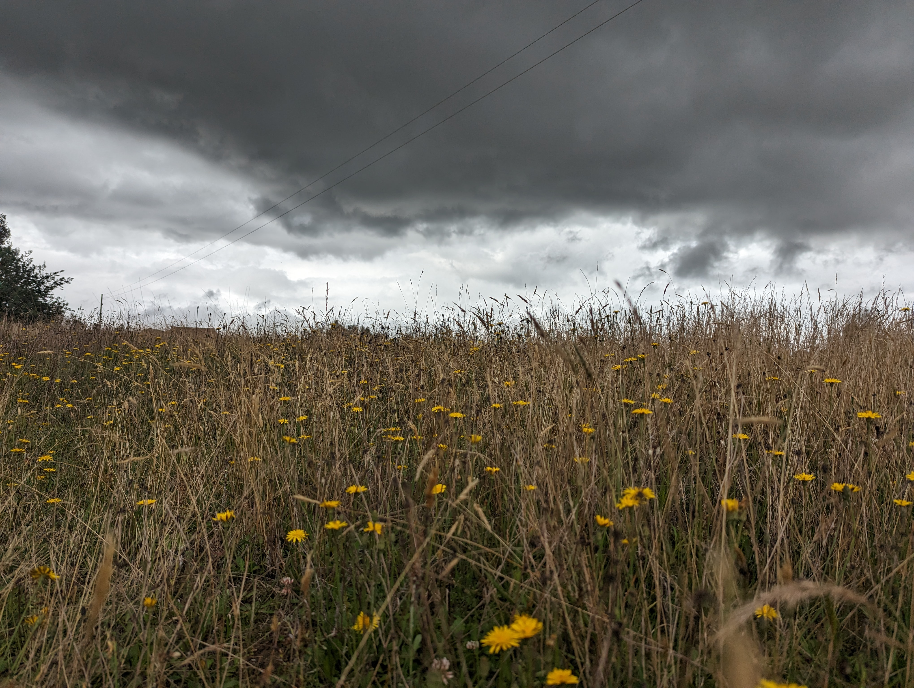

<br><details><summary>:camera:**51/PXL_20230402_161913560.PORTRAIT.jpg**</summary><sub> `Exif version` 0232 `OS version` HDR+ 1.0.514217843zp `Date` 2023:04:02 11:19:13 `Aperture` Not known `Brightness` 6.78 `Color space` 1 `Compression` 6`Exposure mode` 0 `Exposure time` 0.00212 `Focal length` 6.81 `Lens model` Pixel 6 back camera 6.81mm f/1.85 `Lens specification` Not known `Orientation` 1 `Scene type` Not known `f number` 1.85 `White balance` 0 `Sensing method` 2 `Shutter speed` 8.88</sub><sub>`Coordinates & altitude` (5.609102777777777, -73.281375, 2750.0)</sub><sub> :globe_with_meridians:`Location over` [Google Maps](http://maps.google.com/maps?q=5.609102777777777,-73.281375) or [Openstreet Map](https://www.openstreetmap.org/query?lat=5.609102777777777&lon=-73.281375)</sub></details>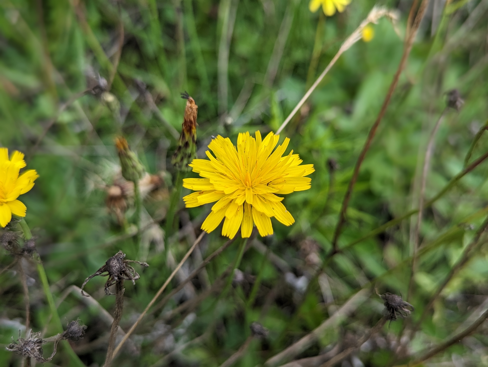

<br><details><summary>:camera:**51/PXL_20230402_161922134.PORTRAIT.jpg**</summary><sub> `Exif version` 0232 `OS version` HDR+ 1.0.514217843zp `Date` 2023:04:02 11:19:22 `Aperture` Not known `Brightness` 7.6 `Color space` 1 `Compression` 6`Exposure mode` 0 `Exposure time` 0.001254 `Focal length` 6.81 `Lens model` Pixel 6 back camera 6.81mm f/1.85 `Lens specification` Not known `Orientation` 1 `Scene type` Not known `f number` 1.85 `White balance` 0 `Sensing method` 2 `Shutter speed` 9.64</sub><sub>`Coordinates & altitude` (5.609102777777777, -73.281375, 2750.0)</sub><sub> :globe_with_meridians:`Location over` [Google Maps](http://maps.google.com/maps?q=5.609102777777777,-73.281375) or [Openstreet Map](https://www.openstreetmap.org/query?lat=5.609102777777777&lon=-73.281375)</sub></details>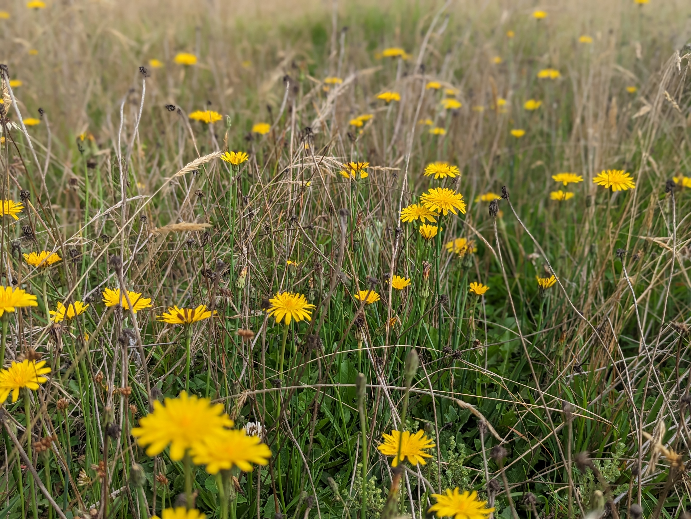

<br><details><summary>:camera:**51/PXL_20230402_161928583.PORTRAIT.jpg**</summary><sub> `Exif version` 0232 `OS version` HDR+ 1.0.514217843zp `Date` 2023:04:02 11:19:28 `Aperture` Not known `Brightness` 7.48 `Color space` 1 `Compression` 6`Exposure mode` 0 `Exposure time` 0.001334 `Focal length` 6.81 `Lens model` Pixel 6 back camera 6.81mm f/1.85 `Lens specification` Not known `Orientation` 1 `Scene type` Not known `f number` 1.85 `White balance` 0 `Sensing method` 2 `Shutter speed` 9.55</sub><sub>`Coordinates & altitude` (5.609102777777777, -73.281375, 2750.0)</sub><sub> :globe_with_meridians:`Location over` [Google Maps](http://maps.google.com/maps?q=5.609102777777777,-73.281375) or [Openstreet Map](https://www.openstreetmap.org/query?lat=5.609102777777777&lon=-73.281375)</sub></details>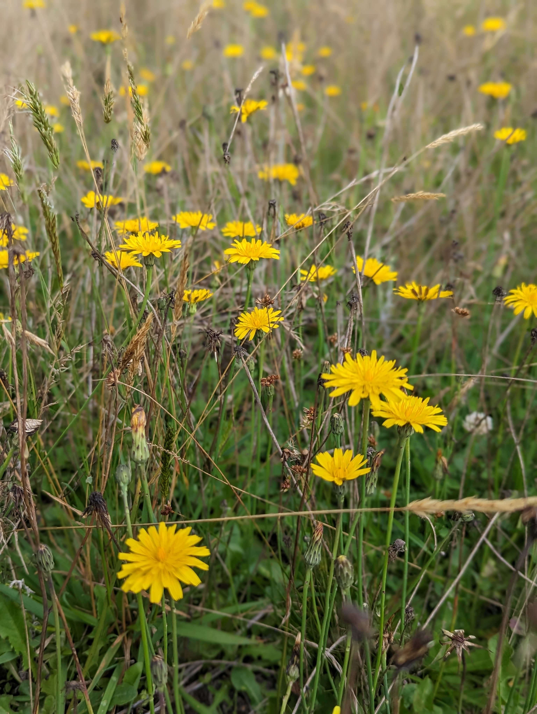

<br><details><summary>:camera:**51/PXL_20230402_201937994.jpg**</summary><sub> `Exif version` 0232 `OS version` HDR+ 1.0.514217843zd `Date` 2023:04:02 15:19:37 `Aperture` Not known `Brightness` 5.93 `Color space` 1 `Compression` 6`Exposure mode` 0 `Exposure time` 0.003984 `Focal length` 6.81 `Lens model` Pixel 6 back camera 6.81mm f/1.85 `Lens specification` Not known `Orientation` 1 `Scene type` Not known `f number` 1.85 `White balance` 0 `Sensing method` 2 `Shutter speed` 7.97</sub></details>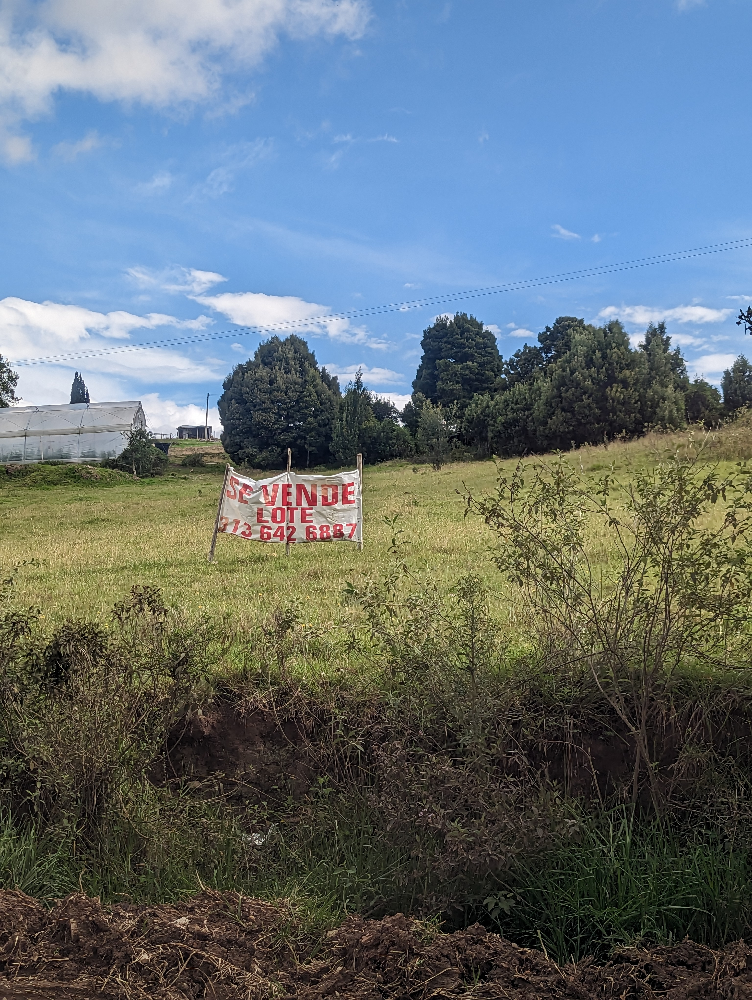

<sub>_Citation: Partial or total digital reproduction of this repository, scripts, development guides, data models, images, and documentation is permitted, provided that it is referenced as: "R.GISMobile - Mobile geographic information systems on QField that do not require an internet connection for navigation." https://github.com/rcfdtools/R.GISMobile - Bogotá - Colombia - South America"._<sub>

| [:house: POI home](../Readme.md) |
|---|