<div align="center"></div>

## Pauna, Boyacá, Colombia (2018-07-08)
`Pictures` rcfdtools <br>`Category` Freelance field visit <br>`Location` [Google Maps](http://maps.google.com/maps?q=5.659578,-73.984318) or [Openstreet Map](https://www.openstreetmap.org/query?lat=5.659578&lon=-73.984318) 

```geojson
{
  "type": "Feature",
  "geometry": {
    "type": "Point", 
    "coordinates": [-73.984318, 5.659578]
  }, 
  "properties": {
    "Name": "Pauna, Boyacá, Colombia"
  }
}
```

<br><details><summary>:camera:**52/20180707_141027.jpg**</summary><sub> `Exif version` 0220 `OS version` G930PVPU6CRE7 `Date` 2018:07:07 14:10:27 `Aperture` Not known `Brightness` 7.53 `Color space` 1 `Compression` 6`Exposure mode` 0 `Exposure time` 0.001160092807424594 `Focal length` 4.2 `Lens model` Not known `Lens specification` Not known `Orientation` 1 `Scene type` Not known `f number` 1.7 `White balance` 0 `Sensing method` 2 `Shutter speed` 9.751</sub></details>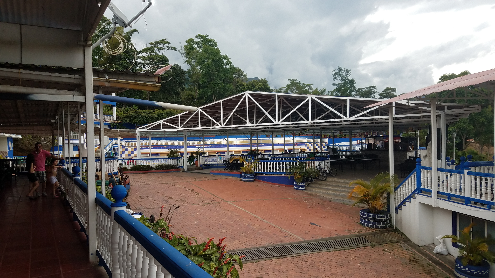

<br><details><summary>:camera:**52/20180707_141036.jpg**</summary><sub> `Exif version` 0220 `OS version` G930PVPU6CRE7 `Date` 2018:07:07 14:10:36 `Aperture` Not known `Brightness` 7.85 `Color space` 1 `Compression` 6`Exposure mode` 0 `Exposure time` 0.0009433962264150943 `Focal length` 4.2 `Lens model` Not known `Lens specification` Not known `Orientation` 1 `Scene type` Not known `f number` 1.7 `White balance` 0 `Sensing method` 2 `Shutter speed` 10.049</sub></details>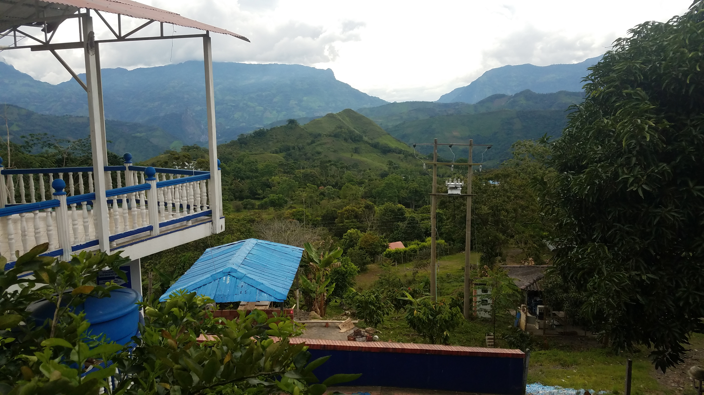

<br><details><summary>:camera:**52/20180707_173625.jpg**</summary><sub> `Exif version` 0220 `OS version` G930PVPU6CRE7 `Date` 2018:07:07 17:36:25 `Aperture` Not known `Brightness` 5.14 `Color space` 1 `Compression` 6`Exposure mode` 0 `Exposure time` 0.005952380952380952 `Focal length` 4.2 `Lens model` Not known `Lens specification` Not known `Orientation` 1 `Scene type` Not known `f number` 1.7 `White balance` 0 `Sensing method` 2 `Shutter speed` 7.392</sub></details>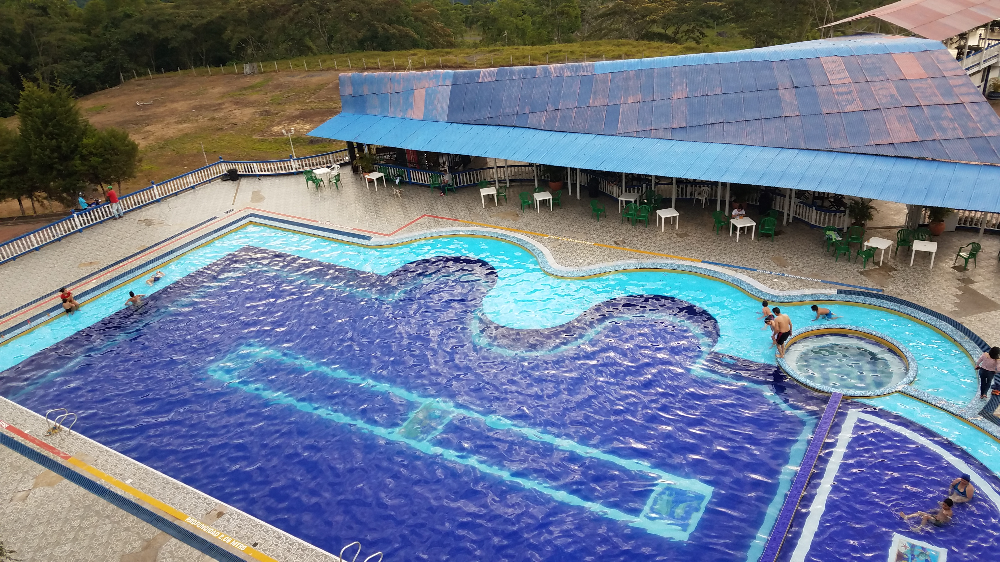

<br><details><summary>:camera:**52/20180707_173628.jpg**</summary><sub> `Exif version` 0220 `OS version` G930PVPU6CRE7 `Date` 2018:07:07 17:36:28 `Aperture` Not known `Brightness` 5.43 `Color space` 1 `Compression` 6`Exposure mode` 0 `Exposure time` 0.004807692307692308 `Focal length` 4.2 `Lens model` Not known `Lens specification` Not known `Orientation` 1 `Scene type` Not known `f number` 1.7 `White balance` 0 `Sensing method` 2 `Shutter speed` 7.7</sub></details>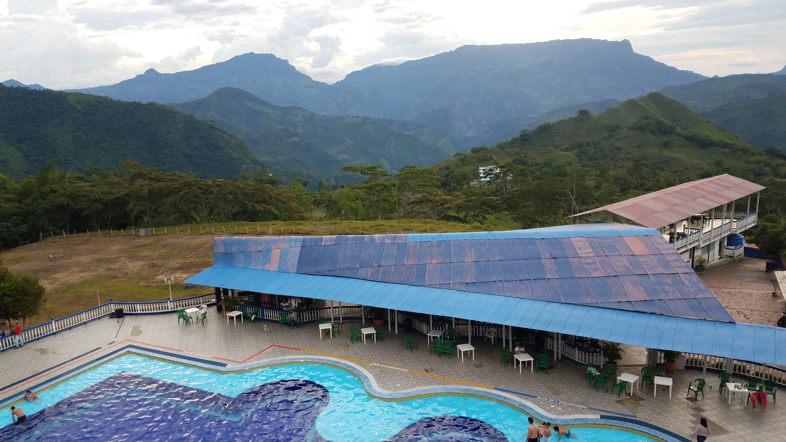

<br><details><summary>:camera:**52/20180707_173635.jpg**</summary><sub> `Exif version` 0220 `OS version` G930PVPU6CRE7 `Date` 2018:07:07 17:36:35 `Aperture` Not known `Brightness` 5.21 `Color space` 1 `Compression` 6`Exposure mode` 0 `Exposure time` 0.005780346820809248 `Focal length` 4.2 `Lens model` Not known `Lens specification` Not known `Orientation` 1 `Scene type` Not known `f number` 1.7 `White balance` 0 `Sensing method` 2 `Shutter speed` 7.434</sub></details>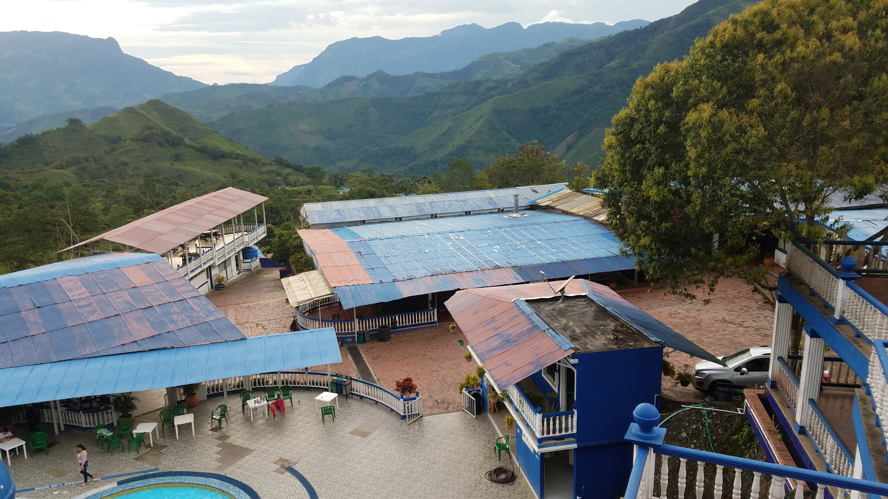

<br><details><summary>:camera:**52/20180707_173637.jpg**</summary><sub> `Exif version` 0220 `OS version` G930PVPU6CRE7 `Date` 2018:07:07 17:36:37 `Aperture` Not known `Brightness` 5.11 `Color space` 1 `Compression` 6`Exposure mode` 0 `Exposure time` 0.00625 `Focal length` 4.2 `Lens model` Not known `Lens specification` Not known `Orientation` 1 `Scene type` Not known `f number` 1.7 `White balance` 0 `Sensing method` 2 `Shutter speed` 7.321</sub></details>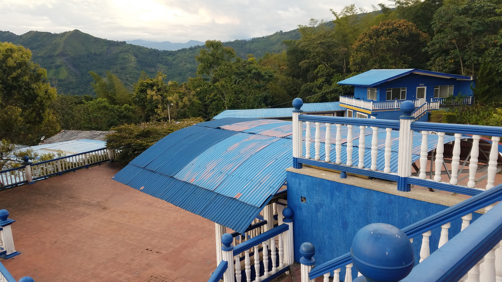

<br><details><summary>:camera:**52/20180707_173644.jpg**</summary><sub> `Exif version` 0220 `OS version` G930PVPU6CRE7 `Date` 2018:07:07 17:36:44 `Aperture` Not known `Brightness` 5.25 `Color space` 1 `Compression` 6`Exposure mode` 0 `Exposure time` 0.005555555555555556 `Focal length` 4.2 `Lens model` Not known `Lens specification` Not known `Orientation` 1 `Scene type` Not known `f number` 1.7 `White balance` 0 `Sensing method` 2 `Shutter speed` 7.491</sub></details>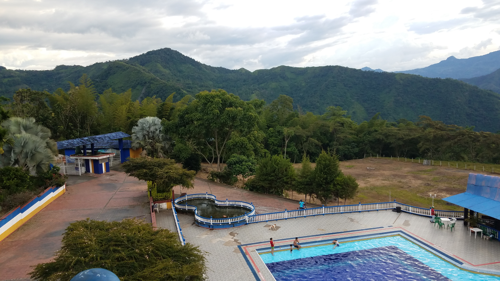

<br><details><summary>:camera:**52/20180707_173838.jpg**</summary><sub> `Exif version` 0220 `OS version` G930PVPU6CRE7 `Date` 2018:07:07 17:38:37 `Aperture` Not known `Brightness` 8.58 `Color space` 1 `Compression` 6`Exposure mode` 0 `Exposure time` 0.0005580357142857143 `Focal length` 4.2 `Lens model` Not known `Lens specification` Not known `Orientation` 1 `Scene type` Not known `f number` 1.7 `White balance` 0 `Sensing method` 2 `Shutter speed` 10.807</sub></details>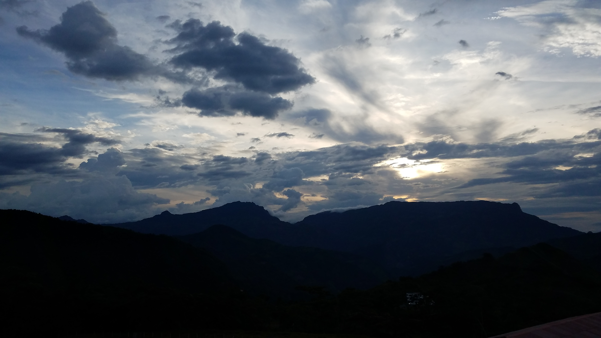

<br><details><summary>:camera:**52/20180708_071452.jpg**</summary><sub> `Exif version` 0220 `OS version` G930PVPU6CRE7 `Date` 2018:07:08 07:14:51 `Aperture` Not known `Brightness` 2.86 `Color space` 1 `Compression` 6`Exposure mode` 0 `Exposure time` 0.016666666666666666 `Focal length` 4.2 `Lens model` Not known `Lens specification` Not known `Orientation` 1 `Scene type` Not known `f number` 1.7 `White balance` 0 `Sensing method` 2 `Shutter speed` 5.906</sub></details>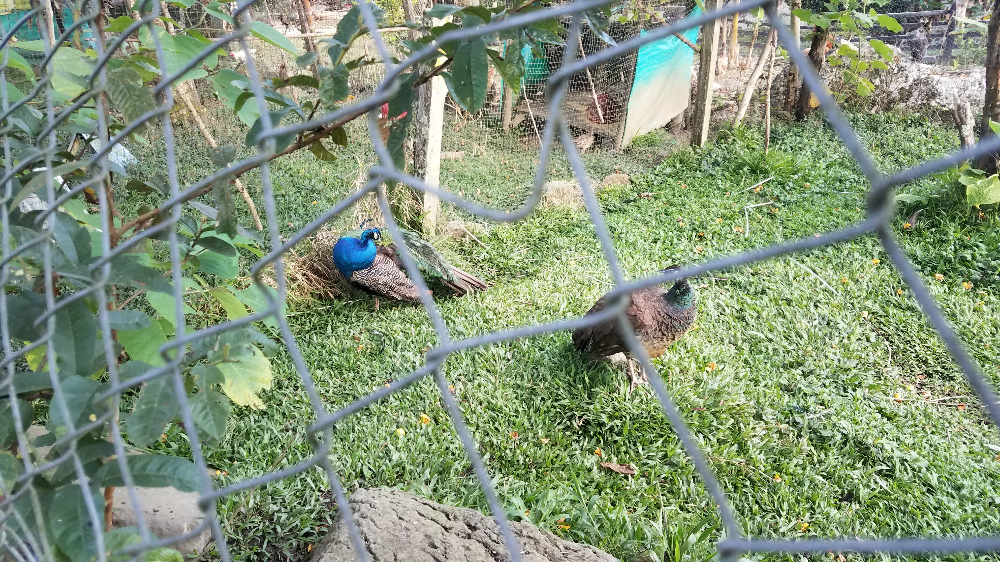

<br><details><summary>:camera:**52/20180708_071934.jpg**</summary><sub> `Exif version` 0220 `OS version` G930PVPU6CRE7 `Date` 2018:07:08 07:19:34 `Aperture` Not known `Brightness` 7.43 `Color space` 1 `Compression` 6`Exposure mode` 0 `Exposure time` 0.001256281407035176 `Focal length` 4.2 `Lens model` Not known `Lens specification` Not known `Orientation` 1 `Scene type` Not known `f number` 1.7 `White balance` 0 `Sensing method` 2 `Shutter speed` 9.636</sub></details>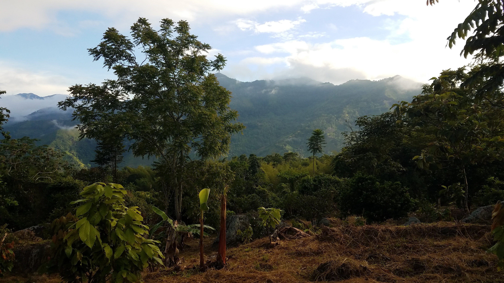

<br><details><summary>:camera:**52/20180708_072012.jpg**</summary><sub> `Exif version` 0220 `OS version` G930PVPU6CRE7 `Date` 2018:07:08 07:20:12 `Aperture` Not known `Brightness` 8.45 `Color space` 1 `Compression` 6`Exposure mode` 0 `Exposure time` 0.0006527415143603133 `Focal length` 4.2 `Lens model` Not known `Lens specification` Not known `Orientation` 1 `Scene type` Not known `f number` 1.7 `White balance` 0 `Sensing method` 2 `Shutter speed` 10.581</sub></details>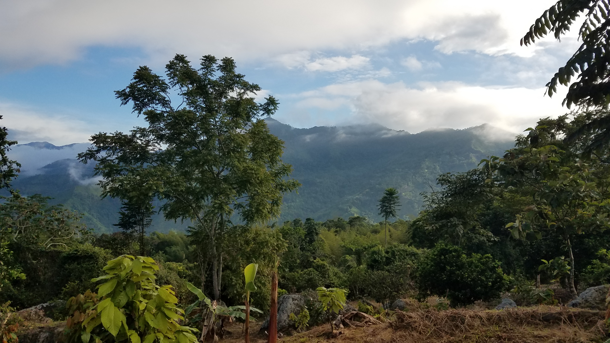

<br><details><summary>:camera:**52/20180708_072237.jpg**</summary><sub> `Exif version` 0220 `OS version` G930PVPU6CRE7 `Date` 2018:07:08 07:22:37 `Aperture` Not known `Brightness` 10.26 `Color space` 1 `Compression` 6`Exposure mode` 0 `Exposure time` 0.0001690045631232043 `Focal length` 4.2 `Lens model` Not known `Lens specification` Not known `Orientation` 1 `Scene type` Not known `f number` 1.7 `White balance` 0 `Sensing method` 2 `Shutter speed` 12.53</sub></details>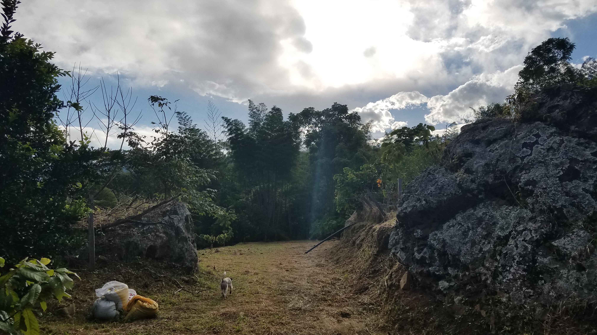

<br><details><summary>:camera:**52/20180708_072420.jpg**</summary><sub> `Exif version` 0220 `OS version` G930PVPU6CRE7 `Date` 2018:07:08 07:24:20 `Aperture` Not known `Brightness` 4.36 `Color space` 1 `Compression` 6`Exposure mode` 0 `Exposure time` 0.008333333333333333 `Focal length` 4.2 `Lens model` Not known `Lens specification` Not known `Orientation` 6 `Scene type` Not known `f number` 1.7 `White balance` 0 `Sensing method` 2 `Shutter speed` 6.906</sub></details>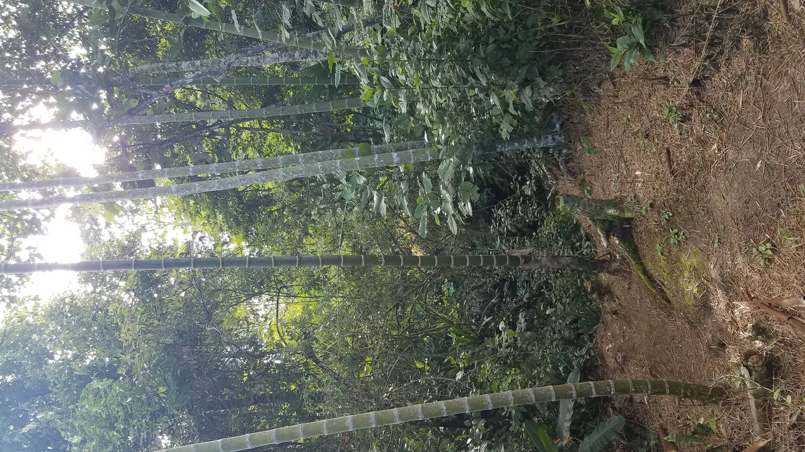

<br><details><summary>:camera:**52/20180708_072532.jpg**</summary><sub> `Exif version` 0220 `OS version` G930PVPU6CRE7 `Date` 2018:07:08 07:25:32 `Aperture` Not known `Brightness` 1.09 `Color space` 1 `Compression` 6`Exposure mode` 0 `Exposure time` 0.025 `Focal length` 4.2 `Lens model` Not known `Lens specification` Not known `Orientation` 1 `Scene type` Not known `f number` 1.7 `White balance` 0 `Sensing method` 2 `Shutter speed` 5.321</sub></details>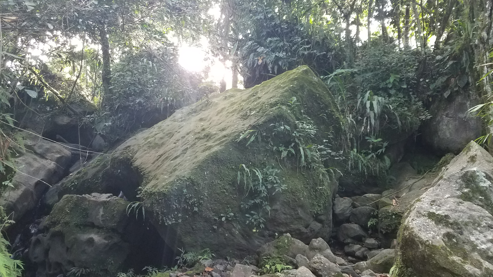

<br><details><summary>:camera:**52/20180708_072553.jpg**</summary><sub> `Exif version` 0220 `OS version` G930PVPU6CRE7 `Date` 2018:07:08 07:25:53 `Aperture` Not known `Brightness` 0.39 `Color space` 1 `Compression` 6`Exposure mode` 0 `Exposure time` 0.041666666666666664 `Focal length` 4.2 `Lens model` Not known `Lens specification` Not known `Orientation` 6 `Scene type` Not known `f number` 1.7 `White balance` 0 `Sensing method` 2 `Shutter speed` 4.584</sub></details>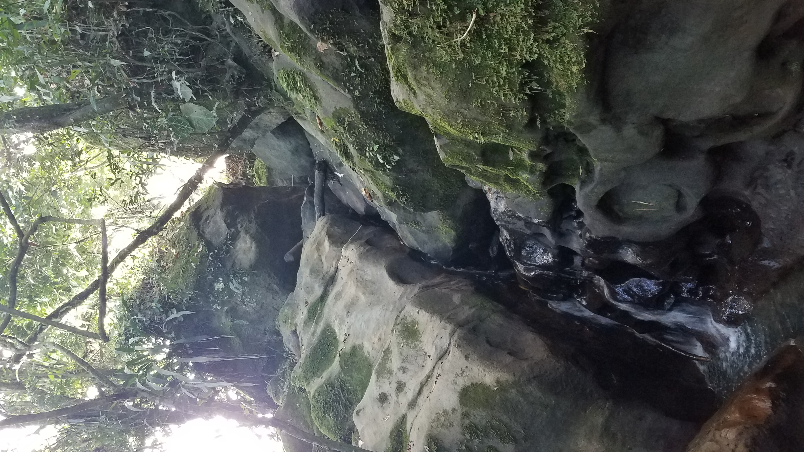

<br><details><summary>:camera:**52/20180708_072602.jpg**</summary><sub> `Exif version` 0220 `OS version` G930PVPU6CRE7 `Date` 2018:07:08 07:26:02 `Aperture` Not known `Brightness` Not known `Color space` 1 `Compression` Not known`Exposure mode` 0 `Exposure time` 0.025 `Focal length` 4.2 `Lens model` Not known `Lens specification` Not known `Orientation` 6 `Scene type` Not known `f number` 1.7 `White balance` 0 `Sensing method` Not known `Shutter speed` Not known</sub></details>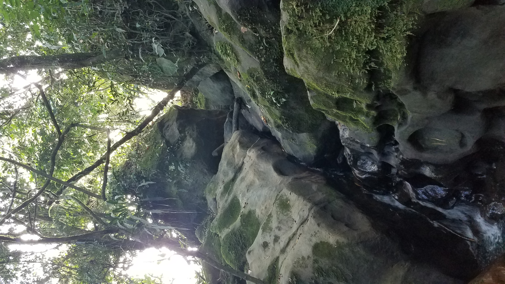

<br><details><summary>:camera:**52/20180708_072814.jpg**</summary><sub> `Exif version` 0220 `OS version` G930PVPU6CRE7 `Date` 2018:07:08 07:28:14 `Aperture` Not known `Brightness` -1.66 `Color space` 1 `Compression` 6`Exposure mode` 0 `Exposure time` 0.1 `Focal length` 4.2 `Lens model` Not known `Lens specification` Not known `Orientation` 6 `Scene type` Not known `f number` 1.7 `White balance` 0 `Sensing method` 2 `Shutter speed` 3.317</sub></details>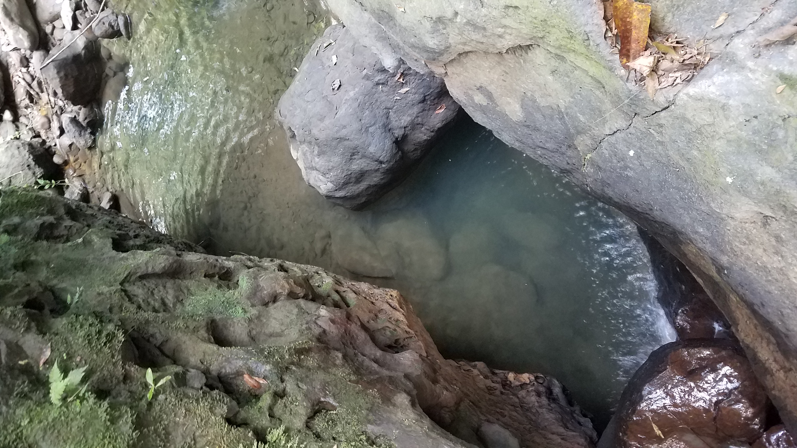

<br><details><summary>:camera:**52/20180708_072821.jpg**</summary><sub> `Exif version` 0220 `OS version` G930PVPU6CRE7 `Date` 2018:07:08 07:28:20 `Aperture` Not known `Brightness` 0.33 `Color space` 1 `Compression` 6`Exposure mode` 0 `Exposure time` 0.041666666666666664 `Focal length` 4.2 `Lens model` Not known `Lens specification` Not known `Orientation` 1 `Scene type` Not known `f number` 1.7 `White balance` 0 `Sensing method` 2 `Shutter speed` 4.584</sub></details>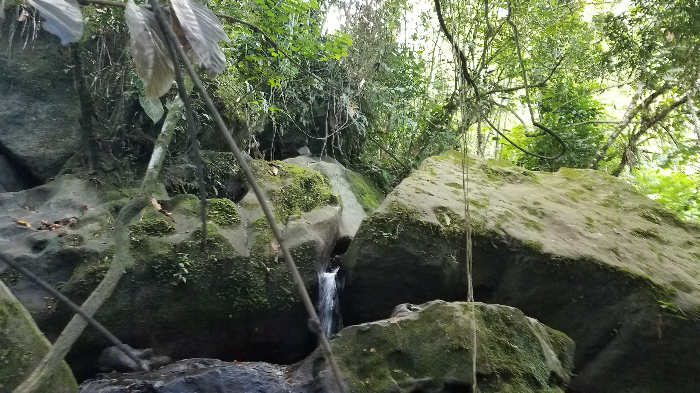

<br><details><summary>:camera:**52/20180708_072827.jpg**</summary><sub> `Exif version` 0220 `OS version` G930PVPU6CRE7 `Date` 2018:07:08 07:28:27 `Aperture` Not known `Brightness` -0.91 `Color space` 1 `Compression` 6`Exposure mode` 0 `Exposure time` 0.08333333333333333 `Focal length` 4.2 `Lens model` Not known `Lens specification` Not known `Orientation` 6 `Scene type` Not known `f number` 1.7 `White balance` 0 `Sensing method` 2 `Shutter speed` 3.558</sub></details>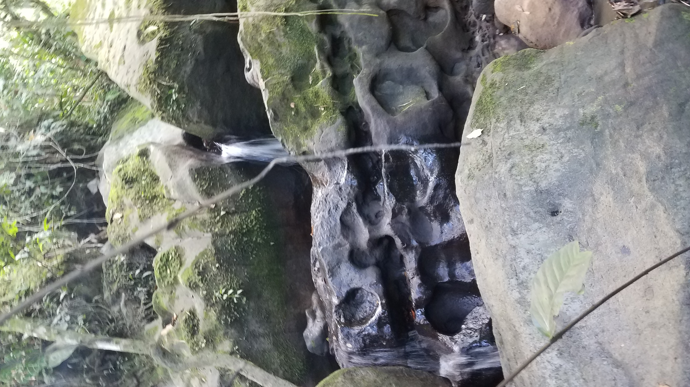

<br><details><summary>:camera:**52/20180708_072848.jpg**</summary><sub> `Exif version` 0220 `OS version` G930PVPU6CRE7 `Date` 2018:07:08 07:28:48 `Aperture` Not known `Brightness` -1.0 `Color space` 1 `Compression` 6`Exposure mode` 0 `Exposure time` 0.09090909090909091 `Focal length` 4.2 `Lens model` Not known `Lens specification` Not known `Orientation` 6 `Scene type` Not known `f number` 1.7 `White balance` 0 `Sensing method` 2 `Shutter speed` 3.495</sub></details>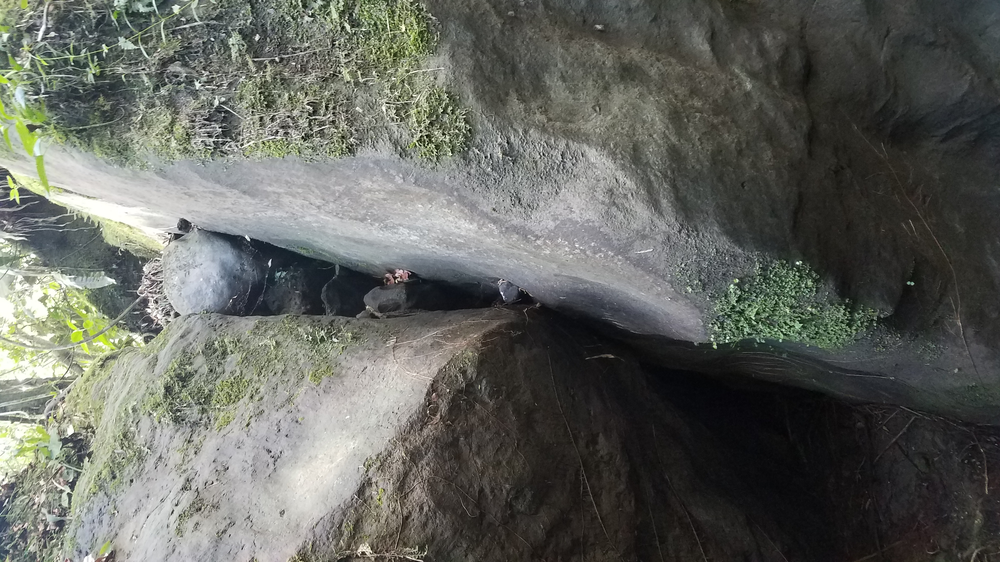

<br><details><summary>:camera:**52/20180708_073012.jpg**</summary><sub> `Exif version` 0220 `OS version` G930PVPU6CRE7 `Date` 2018:07:08 07:30:11 `Aperture` Not known `Brightness` Not known `Color space` 1 `Compression` Not known`Exposure mode` 0 `Exposure time` 0.016666666666666666 `Focal length` 4.2 `Lens model` Not known `Lens specification` Not known `Orientation` 6 `Scene type` Not known `f number` 1.7 `White balance` 0 `Sensing method` Not known `Shutter speed` Not known</sub></details>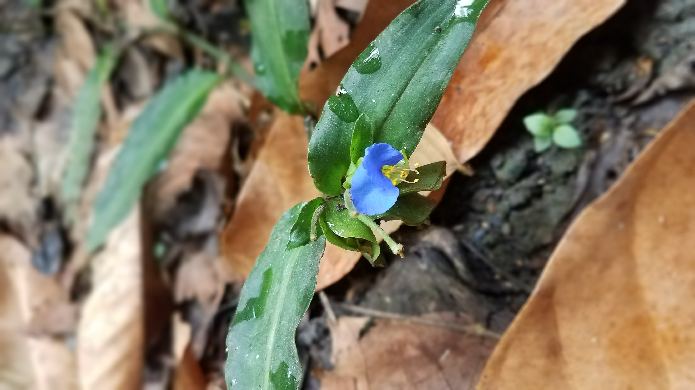

<br><details><summary>:camera:**52/20180708_073015.jpg**</summary><sub> `Exif version` 0220 `OS version` G930PVPU6CRE7 `Date` 2018:07:08 07:30:15 `Aperture` Not known `Brightness` Not known `Color space` 1 `Compression` Not known`Exposure mode` 0 `Exposure time` 0.016666666666666666 `Focal length` 4.2 `Lens model` Not known `Lens specification` Not known `Orientation` 6 `Scene type` Not known `f number` 1.7 `White balance` 0 `Sensing method` Not known `Shutter speed` Not known</sub></details>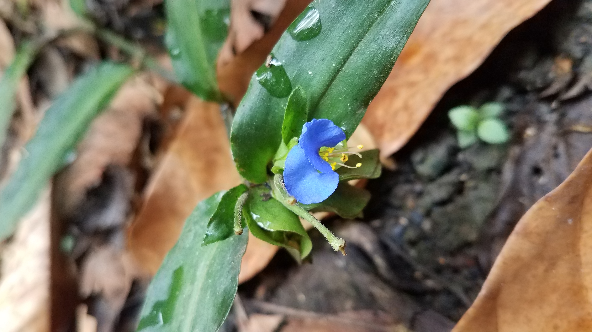

<br><details><summary>:camera:**52/20180708_073025.jpg**</summary><sub> `Exif version` 0220 `OS version` G930PVPU6CRE7 `Date` 2018:07:08 07:30:25 `Aperture` Not known `Brightness` Not known `Color space` 1 `Compression` Not known`Exposure mode` 0 `Exposure time` 0.025 `Focal length` 4.2 `Lens model` Not known `Lens specification` Not known `Orientation` 6 `Scene type` Not known `f number` 1.7 `White balance` 0 `Sensing method` Not known `Shutter speed` Not known</sub></details>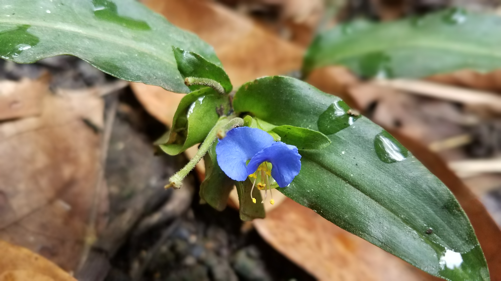

<br><details><summary>:camera:**52/20180708_073321.jpg**</summary><sub> `Exif version` 0220 `OS version` G930PVPU6CRE7 `Date` 2018:07:08 07:33:21 `Aperture` Not known `Brightness` Not known `Color space` 1 `Compression` Not known`Exposure mode` 0 `Exposure time` 0.016666666666666666 `Focal length` 4.2 `Lens model` Not known `Lens specification` Not known `Orientation` 1 `Scene type` Not known `f number` 1.7 `White balance` 0 `Sensing method` Not known `Shutter speed` Not known</sub></details>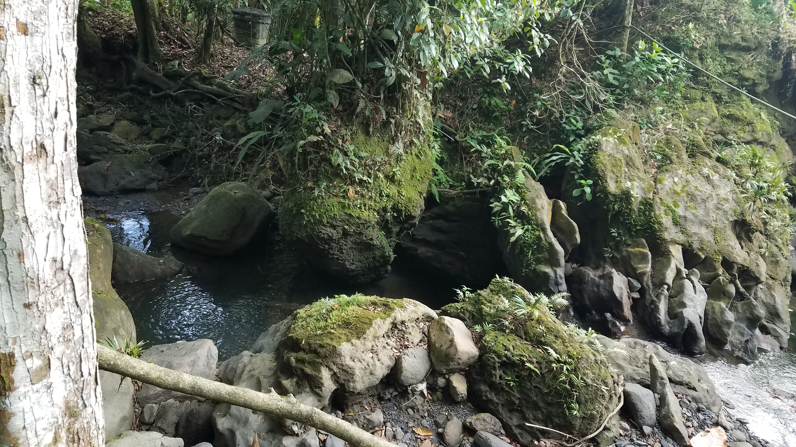

<br><details><summary>:camera:**52/20180708_073332.jpg**</summary><sub> `Exif version` 0220 `OS version` G930PVPU6CRE7 `Date` 2018:07:08 07:33:32 `Aperture` Not known `Brightness` Not known `Color space` 1 `Compression` Not known`Exposure mode` 0 `Exposure time` 0.016666666666666666 `Focal length` 4.2 `Lens model` Not known `Lens specification` Not known `Orientation` 6 `Scene type` Not known `f number` 1.7 `White balance` 0 `Sensing method` Not known `Shutter speed` Not known</sub></details>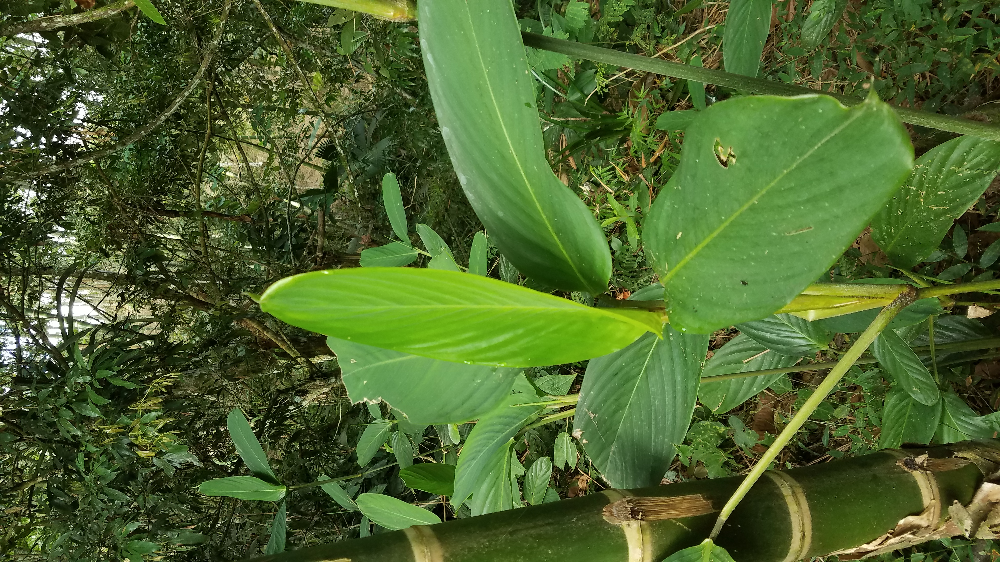

<br><details><summary>:camera:**52/20180708_073337.jpg**</summary><sub> `Exif version` 0220 `OS version` G930PVPU6CRE7 `Date` 2018:07:08 07:33:37 `Aperture` Not known `Brightness` 3.03 `Color space` 1 `Compression` 6`Exposure mode` 0 `Exposure time` 0.016666666666666666 `Focal length` 4.2 `Lens model` Not known `Lens specification` Not known `Orientation` 6 `Scene type` Not known `f number` 1.7 `White balance` 0 `Sensing method` 2 `Shutter speed` 5.906</sub></details>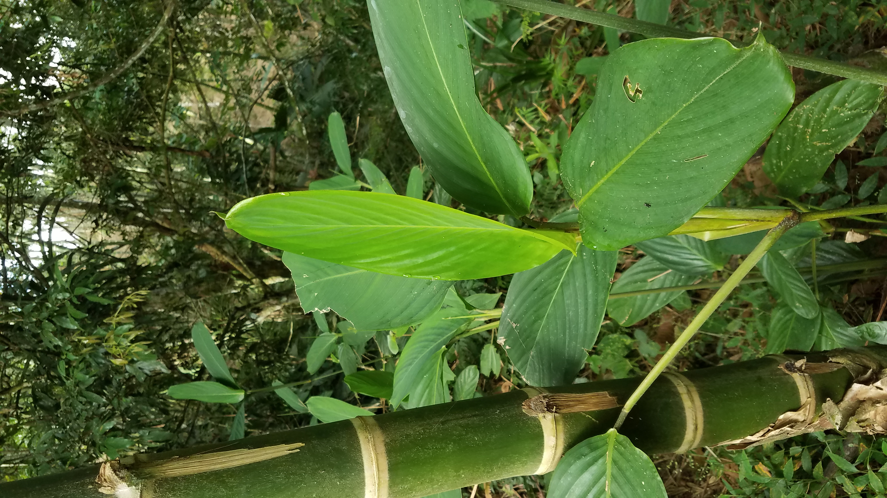

<br><details><summary>:camera:**52/20180708_073342.jpg**</summary><sub> `Exif version` 0220 `OS version` G930PVPU6CRE7 `Date` 2018:07:08 07:33:42 `Aperture` Not known `Brightness` 2.63 `Color space` 1 `Compression` 6`Exposure mode` 0 `Exposure time` 0.016666666666666666 `Focal length` 4.2 `Lens model` Not known `Lens specification` Not known `Orientation` 1 `Scene type` Not known `f number` 1.7 `White balance` 0 `Sensing method` 2 `Shutter speed` 5.906</sub></details>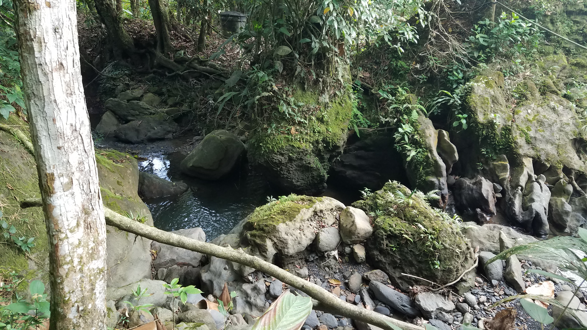

<br><details><summary>:camera:**52/20180708_073434.jpg**</summary><sub> `Exif version` 0220 `OS version` G930PVPU6CRE7 `Date` 2018:07:08 07:34:33 `Aperture` Not known `Brightness` 2.05 `Color space` 1 `Compression` 6`Exposure mode` 0 `Exposure time` 0.016666666666666666 `Focal length` 4.2 `Lens model` Not known `Lens specification` Not known `Orientation` 6 `Scene type` Not known `f number` 1.7 `White balance` 0 `Sensing method` 2 `Shutter speed` 5.906</sub></details>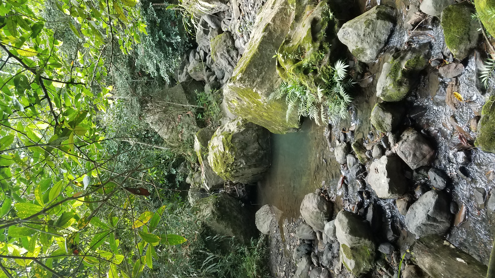

<br><details><summary>:camera:**52/20180708_073448.jpg**</summary><sub> `Exif version` 0220 `OS version` G930PVPU6CRE7 `Date` 2018:07:08 07:34:48 `Aperture` Not known `Brightness` 2.0 `Color space` 1 `Compression` 6`Exposure mode` 0 `Exposure time` 0.016666666666666666 `Focal length` 4.2 `Lens model` Not known `Lens specification` Not known `Orientation` 1 `Scene type` Not known `f number` 1.7 `White balance` 0 `Sensing method` 2 `Shutter speed` 5.906</sub></details>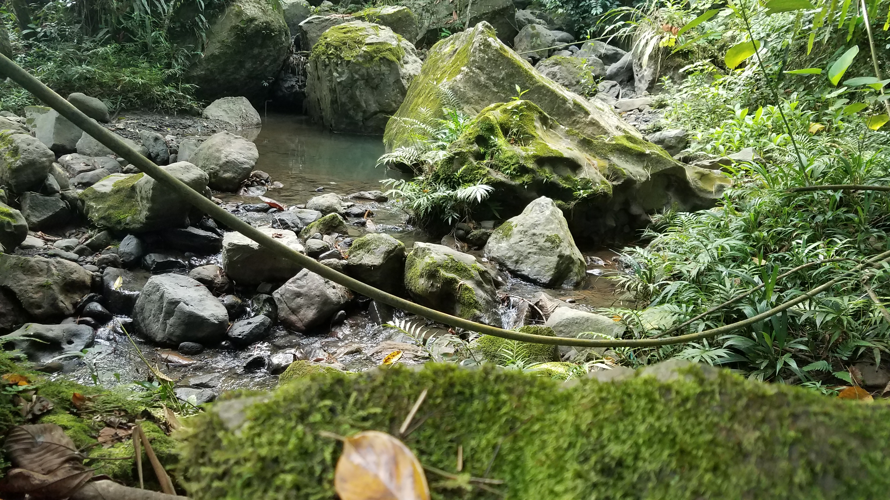

<br><details><summary>:camera:**52/20180708_073734.jpg**</summary><sub> `Exif version` 0220 `OS version` G930PVPU6CRE7 `Date` 2018:07:08 07:37:34 `Aperture` Not known `Brightness` 0.45 `Color space` 1 `Compression` 6`Exposure mode` 0 `Exposure time` 0.041666666666666664 `Focal length` 4.2 `Lens model` Not known `Lens specification` Not known `Orientation` 1 `Scene type` Not known `f number` 1.7 `White balance` 0 `Sensing method` 2 `Shutter speed` 4.584</sub></details>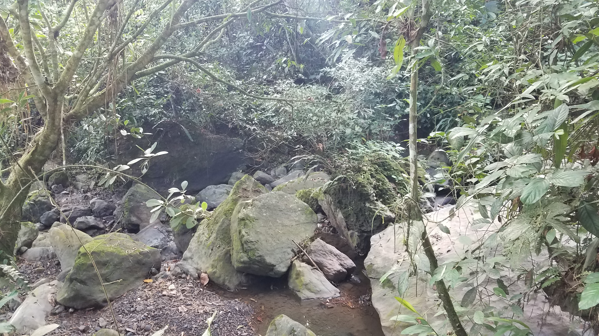

<br><details><summary>:camera:**52/20180708_073817.jpg**</summary><sub> `Exif version` 0220 `OS version` G930PVPU6CRE7 `Date` 2018:07:08 07:38:17 `Aperture` Not known `Brightness` 1.19 `Color space` 1 `Compression` 6`Exposure mode` 0 `Exposure time` 0.025 `Focal length` 4.2 `Lens model` Not known `Lens specification` Not known `Orientation` 6 `Scene type` Not known `f number` 1.7 `White balance` 0 `Sensing method` 2 `Shutter speed` 5.321</sub></details>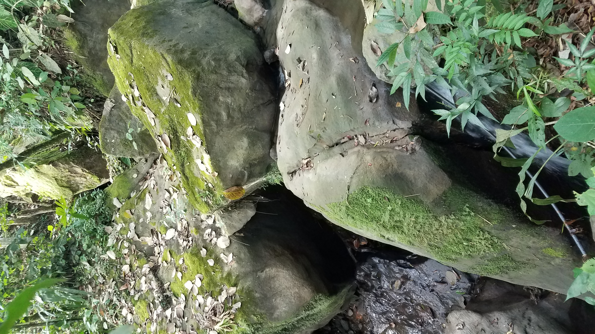

<br><details><summary>:camera:**52/20180708_073827.jpg**</summary><sub> `Exif version` 0220 `OS version` G930PVPU6CRE7 `Date` 2018:07:08 07:38:27 `Aperture` Not known `Brightness` Not known `Color space` 1 `Compression` Not known`Exposure mode` 0 `Exposure time` 0.016666666666666666 `Focal length` 4.2 `Lens model` Not known `Lens specification` Not known `Orientation` 6 `Scene type` Not known `f number` 1.7 `White balance` 0 `Sensing method` Not known `Shutter speed` Not known</sub></details>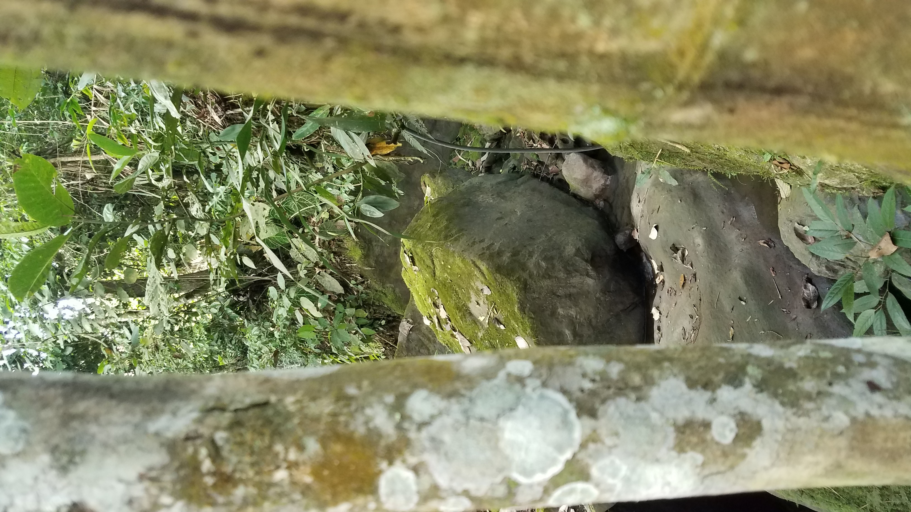

<br><details><summary>:camera:**52/20180708_073833.jpg**</summary><sub> `Exif version` 0220 `OS version` G930PVPU6CRE7 `Date` 2018:07:08 07:38:33 `Aperture` Not known `Brightness` Not known `Color space` 1 `Compression` Not known`Exposure mode` 0 `Exposure time` 0.025 `Focal length` 4.2 `Lens model` Not known `Lens specification` Not known `Orientation` 1 `Scene type` Not known `f number` 1.7 `White balance` 0 `Sensing method` Not known `Shutter speed` Not known</sub></details>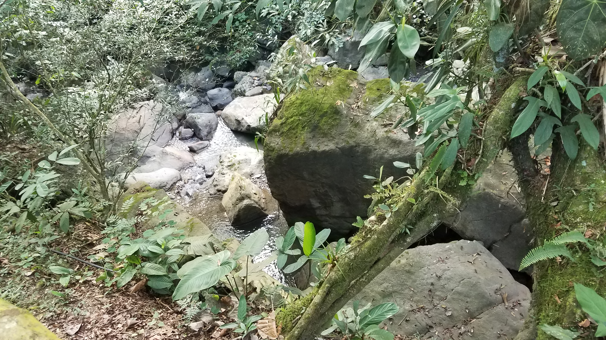

<br><details><summary>:camera:**52/20180708_073903.jpg**</summary><sub> `Exif version` 0220 `OS version` G930PVPU6CRE7 `Date` 2018:07:08 07:39:03 `Aperture` Not known `Brightness` Not known `Color space` 1 `Compression` Not known`Exposure mode` 0 `Exposure time` 0.025 `Focal length` 4.2 `Lens model` Not known `Lens specification` Not known `Orientation` 1 `Scene type` Not known `f number` 1.7 `White balance` 0 `Sensing method` Not known `Shutter speed` Not known</sub></details>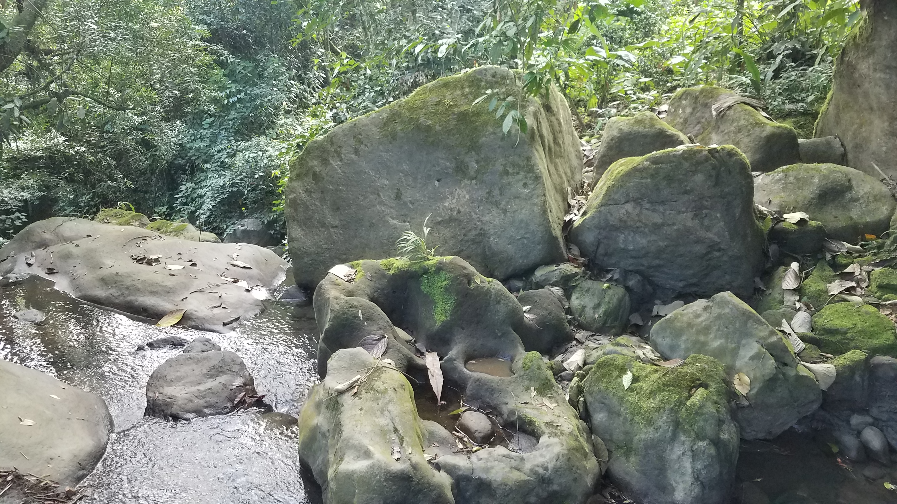

<br><details><summary>:camera:**52/20180708_073907.jpg**</summary><sub> `Exif version` 0220 `OS version` G930PVPU6CRE7 `Date` 2018:07:08 07:39:06 `Aperture` Not known `Brightness` Not known `Color space` 1 `Compression` Not known`Exposure mode` 0 `Exposure time` 0.016666666666666666 `Focal length` 4.2 `Lens model` Not known `Lens specification` Not known `Orientation` 1 `Scene type` Not known `f number` 1.7 `White balance` 0 `Sensing method` Not known `Shutter speed` Not known</sub></details>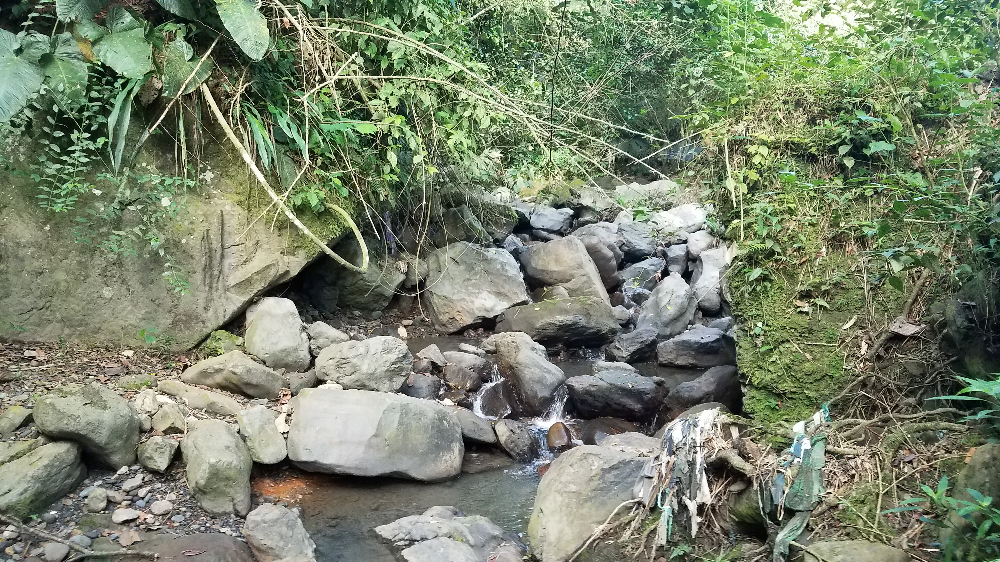

<br><details><summary>:camera:**52/20180708_074046.jpg**</summary><sub> `Exif version` 0220 `OS version` G930PVPU6CRE7 `Date` 2018:07:08 07:40:45 `Aperture` Not known `Brightness` Not known `Color space` 1 `Compression` Not known`Exposure mode` 0 `Exposure time` 0.008333333333333333 `Focal length` 4.2 `Lens model` Not known `Lens specification` Not known `Orientation` 6 `Scene type` Not known `f number` 1.7 `White balance` 0 `Sensing method` Not known `Shutter speed` Not known</sub></details>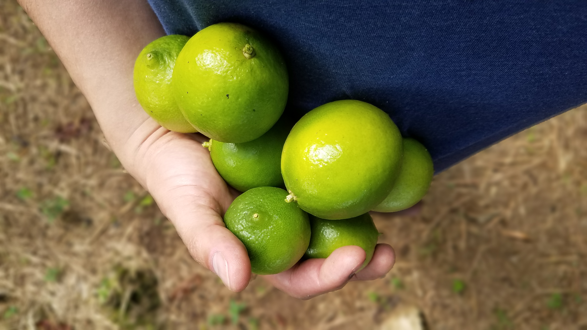

<br><details><summary>:camera:**52/20180708_074050.jpg**</summary><sub> `Exif version` 0220 `OS version` G930PVPU6CRE7 `Date` 2018:07:08 07:40:50 `Aperture` Not known `Brightness` 4.51 `Color space` 1 `Compression` 6`Exposure mode` 0 `Exposure time` 0.008333333333333333 `Focal length` 4.2 `Lens model` Not known `Lens specification` Not known `Orientation` 6 `Scene type` Not known `f number` 1.7 `White balance` 0 `Sensing method` 2 `Shutter speed` 6.906</sub></details>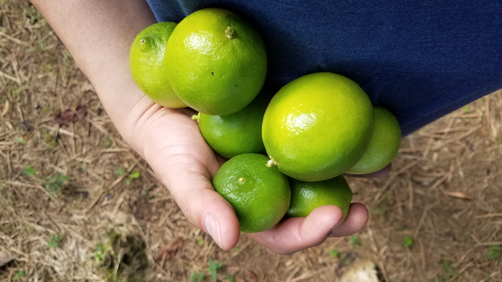

<br><details><summary>:camera:**52/20180708_074135.jpg**</summary><sub> `Exif version` 0220 `OS version` G930PVPU6CRE7 `Date` 2018:07:08 07:41:35 `Aperture` Not known `Brightness` 1.79 `Color space` 1 `Compression` 6`Exposure mode` 0 `Exposure time` 0.016666666666666666 `Focal length` 4.2 `Lens model` Not known `Lens specification` Not known `Orientation` 6 `Scene type` Not known `f number` 1.7 `White balance` 0 `Sensing method` 2 `Shutter speed` 5.906</sub></details>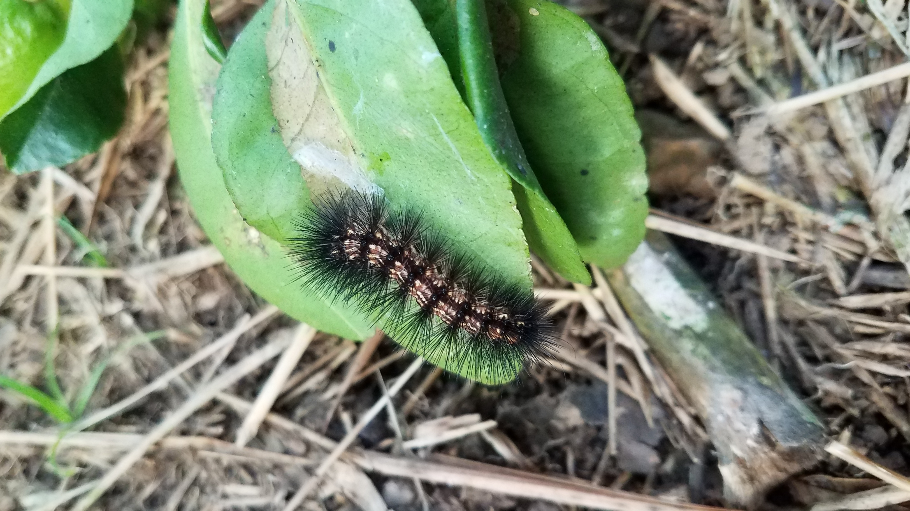

<br><details><summary>:camera:**52/20180708_074146.jpg**</summary><sub> `Exif version` 0220 `OS version` G930PVPU6CRE7 `Date` 2018:07:08 07:41:45 `Aperture` Not known `Brightness` Not known `Color space` 1 `Compression` Not known`Exposure mode` 0 `Exposure time` 0.016666666666666666 `Focal length` 4.2 `Lens model` Not known `Lens specification` Not known `Orientation` 6 `Scene type` Not known `f number` 1.7 `White balance` 0 `Sensing method` Not known `Shutter speed` Not known</sub></details>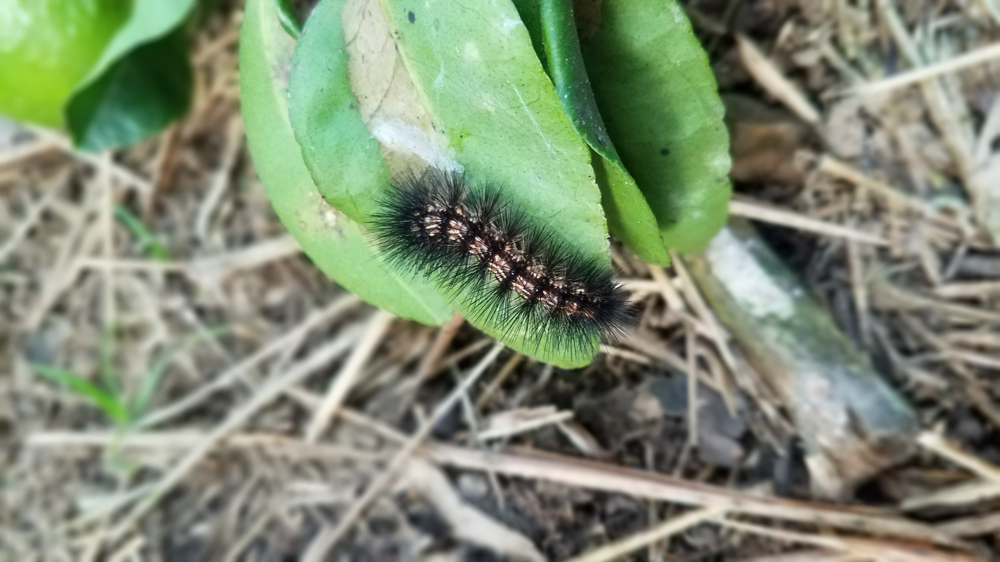

<br><details><summary>:camera:**52/20180708_074423.jpg**</summary><sub> `Exif version` 0220 `OS version` G930PVPU6CRE7 `Date` 2018:07:08 07:44:22 `Aperture` Not known `Brightness` 3.21 `Color space` 1 `Compression` 6`Exposure mode` 0 `Exposure time` 0.016666666666666666 `Focal length` 4.2 `Lens model` Not known `Lens specification` Not known `Orientation` 6 `Scene type` Not known `f number` 1.7 `White balance` 0 `Sensing method` 2 `Shutter speed` 5.906</sub></details>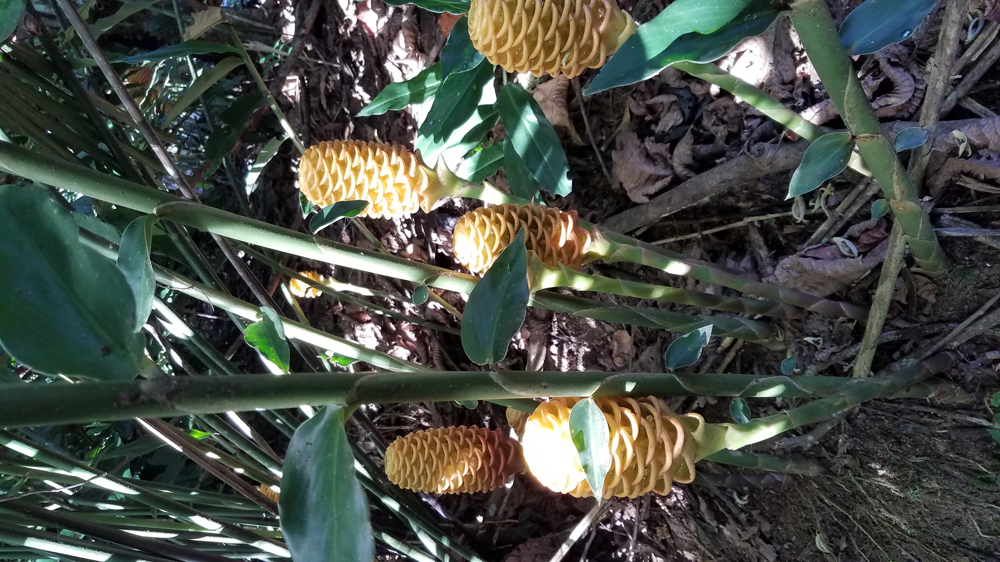

<br><details><summary>:camera:**52/20180708_074432.jpg**</summary><sub> `Exif version` 0220 `OS version` G930PVPU6CRE7 `Date` 2018:07:08 07:44:32 `Aperture` Not known `Brightness` 3.04 `Color space` 1 `Compression` 6`Exposure mode` 0 `Exposure time` 0.016666666666666666 `Focal length` 4.2 `Lens model` Not known `Lens specification` Not known `Orientation` 6 `Scene type` Not known `f number` 1.7 `White balance` 0 `Sensing method` 2 `Shutter speed` 5.906</sub></details>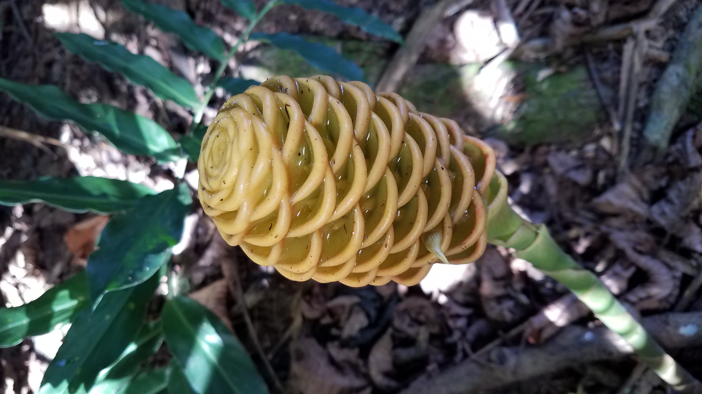

<br><details><summary>:camera:**52/20180708_074438.jpg**</summary><sub> `Exif version` 0220 `OS version` G930PVPU6CRE7 `Date` 2018:07:08 07:44:38 `Aperture` Not known `Brightness` 3.88 `Color space` 1 `Compression` 6`Exposure mode` 0 `Exposure time` 0.008333333333333333 `Focal length` 4.2 `Lens model` Not known `Lens specification` Not known `Orientation` 6 `Scene type` Not known `f number` 1.7 `White balance` 0 `Sensing method` 2 `Shutter speed` 6.906</sub></details>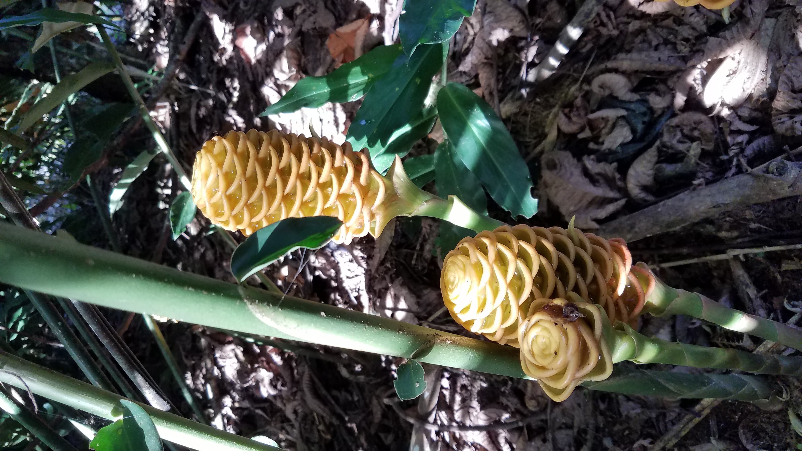

<br><details><summary>:camera:**52/20180708_074456.jpg**</summary><sub> `Exif version` 0220 `OS version` G930PVPU6CRE7 `Date` 2018:07:08 07:44:56 `Aperture` Not known `Brightness` 3.91 `Color space` 1 `Compression` 6`Exposure mode` 0 `Exposure time` 0.008333333333333333 `Focal length` 4.2 `Lens model` Not known `Lens specification` Not known `Orientation` 1 `Scene type` Not known `f number` 1.7 `White balance` 0 `Sensing method` 2 `Shutter speed` 6.906</sub></details>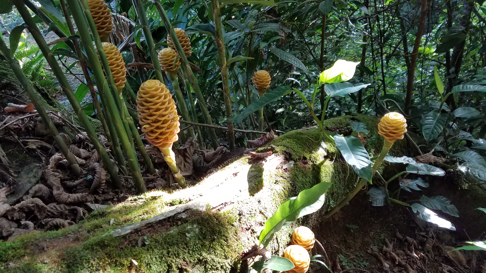

<br><details><summary>:camera:**52/20180708_074501.jpg**</summary><sub> `Exif version` 0220 `OS version` G930PVPU6CRE7 `Date` 2018:07:08 07:45:01 `Aperture` Not known `Brightness` 2.97 `Color space` 1 `Compression` 6`Exposure mode` 0 `Exposure time` 0.016666666666666666 `Focal length` 4.2 `Lens model` Not known `Lens specification` Not known `Orientation` 6 `Scene type` Not known `f number` 1.7 `White balance` 0 `Sensing method` 2 `Shutter speed` 5.906</sub></details>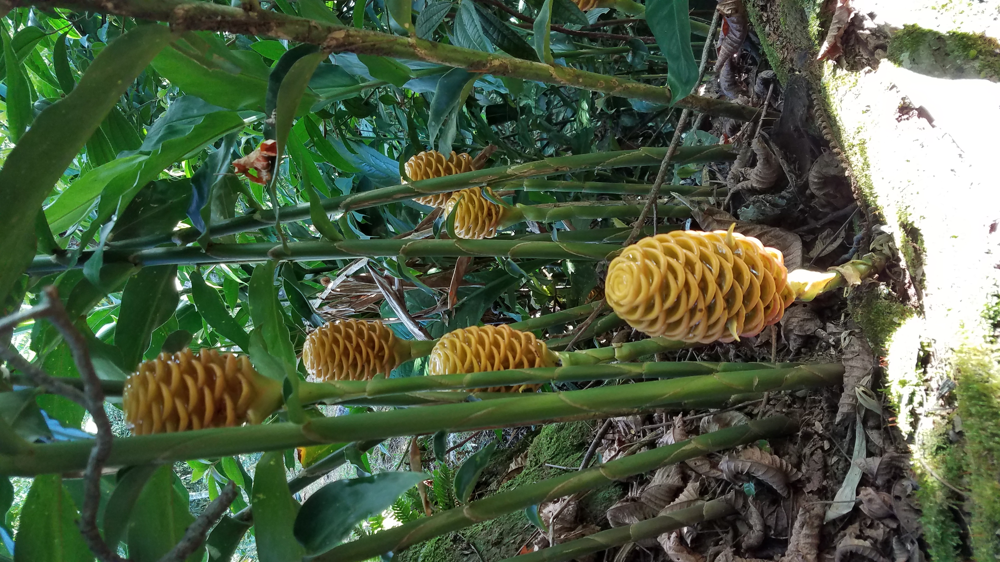

<br><details><summary>:camera:**52/20180708_074510.jpg**</summary><sub> `Exif version` 0220 `OS version` G930PVPU6CRE7 `Date` 2018:07:08 07:45:09 `Aperture` Not known `Brightness` 3.05 `Color space` 1 `Compression` Not known`Exposure mode` 0 `Exposure time` 0.016666666666666666 `Focal length` 4.2 `Lens model` Not known `Lens specification` Not known `Orientation` 6 `Scene type` Not known `f number` 1.7 `White balance` 0 `Sensing method` 2 `Shutter speed` 5.906</sub></details>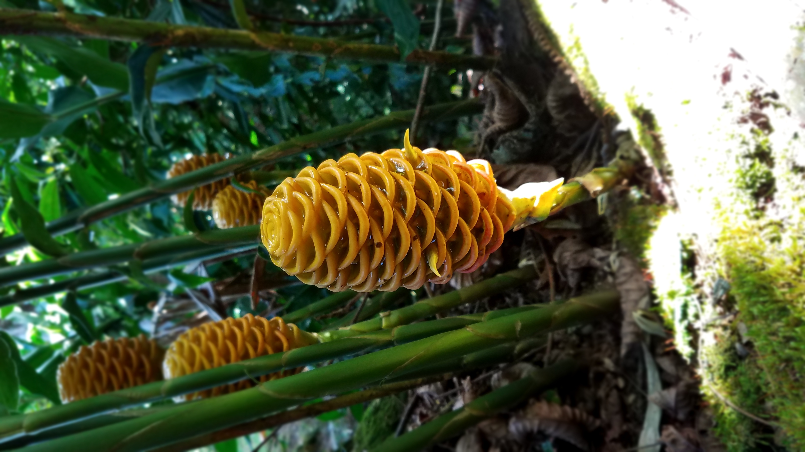

<br><details><summary>:camera:**52/20180708_074645.jpg**</summary><sub> `Exif version` 0220 `OS version` G930PVPU6CRE7 `Date` 2018:07:08 07:46:45 `Aperture` Not known `Brightness` 7.14 `Color space` 1 `Compression` 6`Exposure mode` 0 `Exposure time` 0.001488095238095238 `Focal length` 4.2 `Lens model` Not known `Lens specification` Not known `Orientation` 6 `Scene type` Not known `f number` 1.7 `White balance` 0 `Sensing method` 2 `Shutter speed` 9.392</sub></details>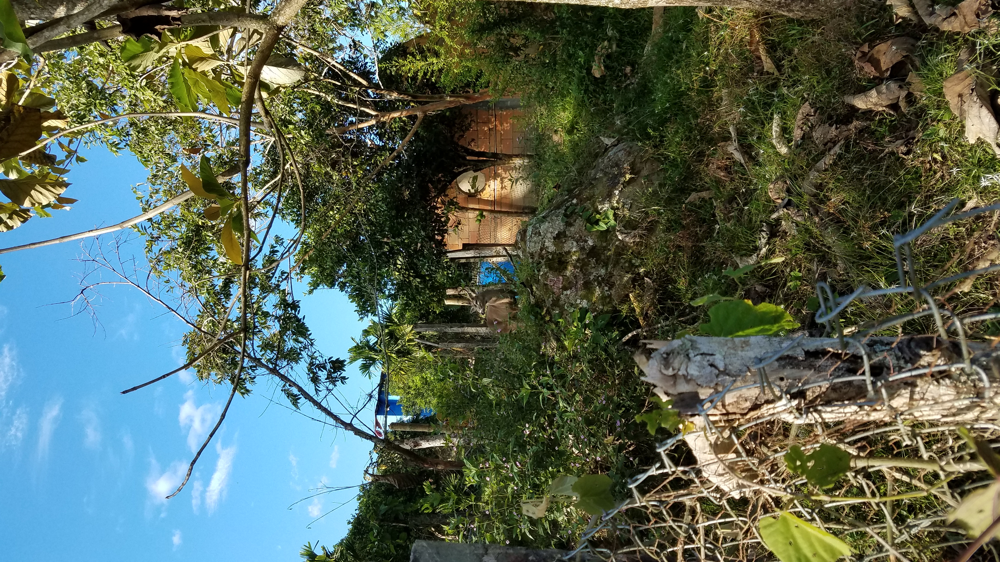

<br><details><summary>:camera:**52/20180708_074650.jpg**</summary><sub> `Exif version` 0220 `OS version` G930PVPU6CRE7 `Date` 2018:07:08 07:46:50 `Aperture` Not known `Brightness` Not known `Color space` 1 `Compression` 6`Exposure mode` 0 `Exposure time` 0.0017301038062283738 `Focal length` 4.2 `Lens model` Not known `Lens specification` Not known `Orientation` 6 `Scene type` Not known `f number` 1.7 `White balance` 0 `Sensing method` Not known `Shutter speed` Not known</sub></details>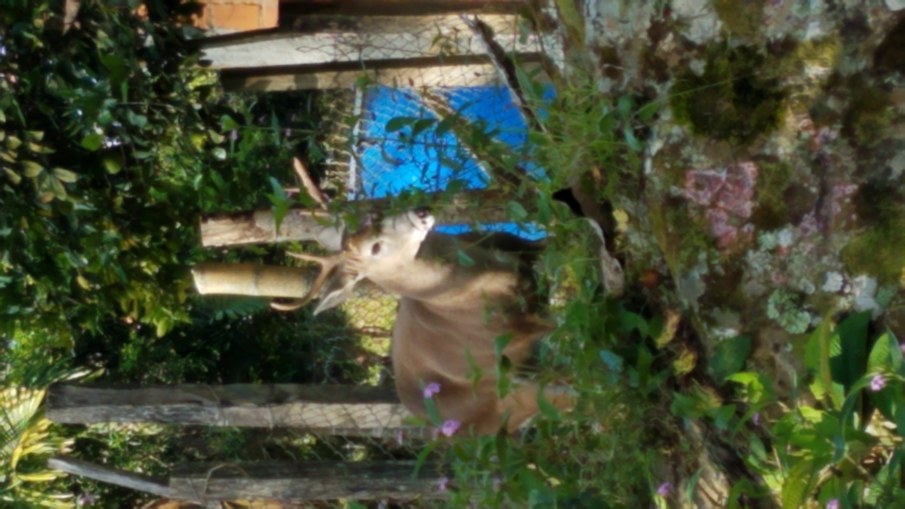

<br><details><summary>:camera:**52/20180708_074705.jpg**</summary><sub> `Exif version` 0220 `OS version` G930PVPU6CRE7 `Date` 2018:07:08 07:47:05 `Aperture` Not known `Brightness` 6.76 `Color space` 1 `Compression` 6`Exposure mode` 0 `Exposure time` 0.00196078431372549 `Focal length` 4.2 `Lens model` Not known `Lens specification` Not known `Orientation` 1 `Scene type` Not known `f number` 1.7 `White balance` 0 `Sensing method` 2 `Shutter speed` 8.994</sub></details>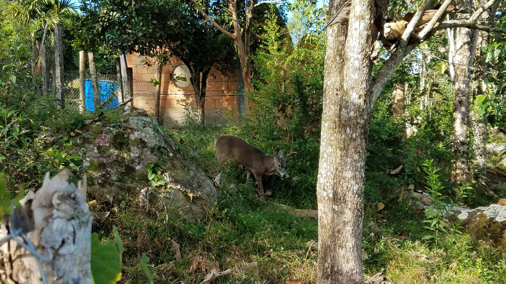

<br><details><summary>:camera:**52/20180708_074711.jpg**</summary><sub> `Exif version` 0220 `OS version` G930PVPU6CRE7 `Date` 2018:07:08 07:47:11 `Aperture` Not known `Brightness` 5.9 `Color space` 1 `Compression` 6`Exposure mode` 0 `Exposure time` 0.003663003663003663 `Focal length` 4.2 `Lens model` Not known `Lens specification` Not known `Orientation` 1 `Scene type` Not known `f number` 1.7 `White balance` 0 `Sensing method` 2 `Shutter speed` 8.092</sub></details>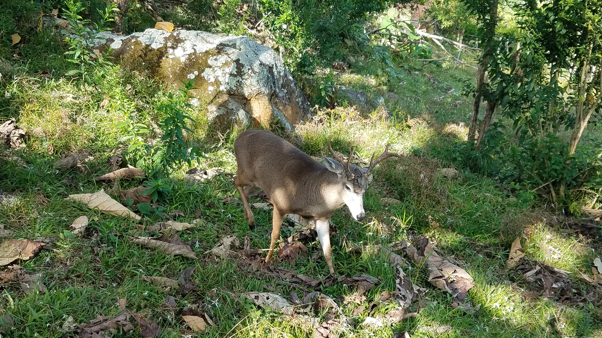

<br><details><summary>:camera:**52/20180708_074714.jpg**</summary><sub> `Exif version` 0220 `OS version` G930PVPU6CRE7 `Date` 2018:07:08 07:47:13 `Aperture` Not known `Brightness` 5.96 `Color space` 1 `Compression` 6`Exposure mode` 0 `Exposure time` 0.0033444816053511705 `Focal length` 4.2 `Lens model` Not known `Lens specification` Not known `Orientation` 1 `Scene type` Not known `f number` 1.7 `White balance` 0 `Sensing method` 2 `Shutter speed` 8.224</sub></details>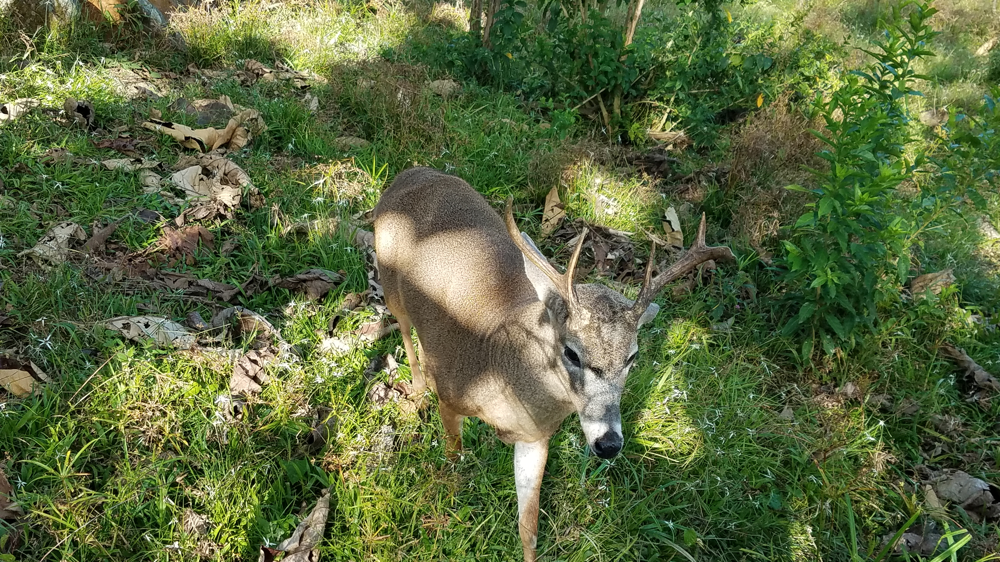

<br><details><summary>:camera:**52/20180708_074723.jpg**</summary><sub> `Exif version` 0220 `OS version` G930PVPU6CRE7 `Date` 2018:07:08 07:47:23 `Aperture` Not known `Brightness` 4.64 `Color space` 1 `Compression` 6`Exposure mode` 0 `Exposure time` 0.008333333333333333 `Focal length` 4.2 `Lens model` Not known `Lens specification` Not known `Orientation` 6 `Scene type` Not known `f number` 1.7 `White balance` 0 `Sensing method` 2 `Shutter speed` 6.906</sub></details>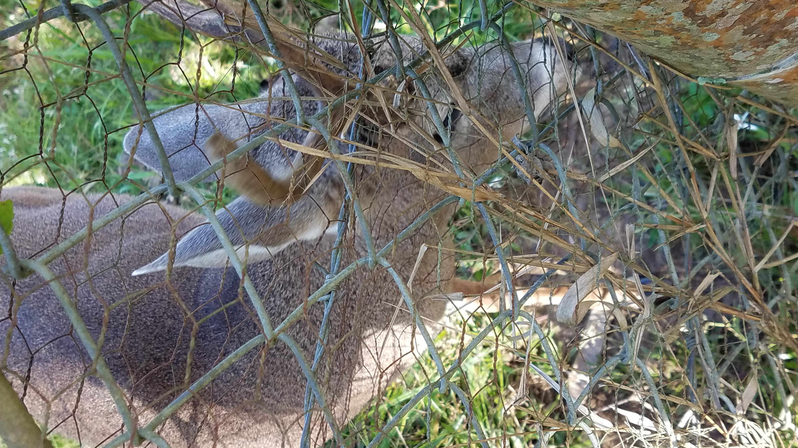

<br><details><summary>:camera:**52/20180708_074730.jpg**</summary><sub> `Exif version` 0220 `OS version` G930PVPU6CRE7 `Date` 2018:07:08 07:47:30 `Aperture` Not known `Brightness` 5.46 `Color space` 1 `Compression` 6`Exposure mode` 0 `Exposure time` 0.005 `Focal length` 4.2 `Lens model` Not known `Lens specification` Not known `Orientation` 6 `Scene type` Not known `f number` 1.7 `White balance` 0 `Sensing method` 2 `Shutter speed` 7.643</sub></details>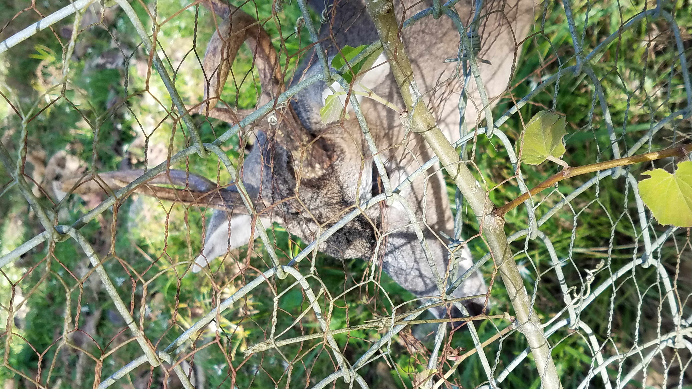

<br><details><summary>:camera:**52/20180708_075303.jpg**</summary><sub> `Exif version` 0220 `OS version` G930PVPU6CRE7 `Date` 2018:07:08 07:53:03 `Aperture` Not known `Brightness` 4.44 `Color space` 1 `Compression` 6`Exposure mode` 0 `Exposure time` 0.008333333333333333 `Focal length` 4.2 `Lens model` Not known `Lens specification` Not known `Orientation` 6 `Scene type` Not known `f number` 1.7 `White balance` 0 `Sensing method` 2 `Shutter speed` 6.906</sub></details>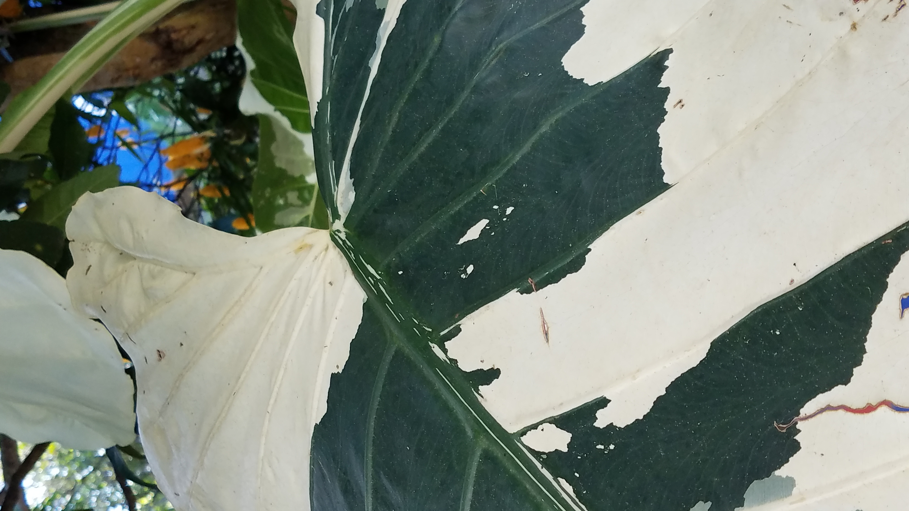

<br><details><summary>:camera:**52/20180708_075315.jpg**</summary><sub> `Exif version` 0220 `OS version` G930PVPU6CRE7 `Date` 2018:07:08 07:53:15 `Aperture` Not known `Brightness` Not known `Color space` 1 `Compression` Not known`Exposure mode` 0 `Exposure time` 0.008333333333333333 `Focal length` 4.2 `Lens model` Not known `Lens specification` Not known `Orientation` 6 `Scene type` Not known `f number` 1.7 `White balance` 0 `Sensing method` Not known `Shutter speed` Not known</sub></details>

<br><details><summary>:camera:**52/20180708_143006.jpg**</summary><sub> `Exif version` 0220 `OS version` G930PVPU6CRE7 `Date` 2018:07:08 14:30:06 `Aperture` Not known `Brightness` 10.32 `Color space` 1 `Compression` 6`Exposure mode` 0 `Exposure time` 0.00015984654731457802 `Focal length` 4.2 `Lens model` Not known `Lens specification` Not known `Orientation` 1 `Scene type` Not known `f number` 1.7 `White balance` 0 `Sensing method` 2 `Shutter speed` 12.611</sub></details>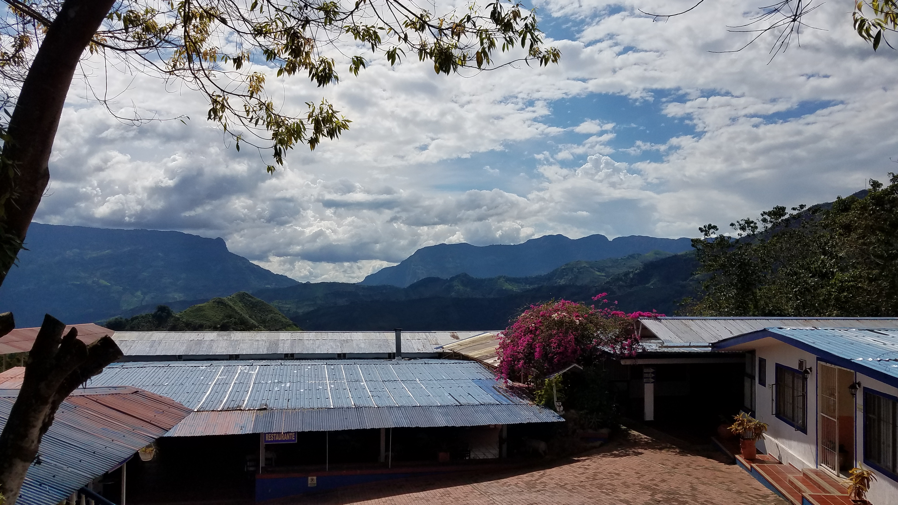

<sub>_Citation: Partial or total digital reproduction of this repository, scripts, development guides, data models, images, and documentation is permitted, provided that it is referenced as: "R.GISMobile - Mobile geographic information systems on QField that do not require an internet connection for navigation." https://github.com/rcfdtools/R.GISMobile - Bogotá - Colombia - South America"._<sub>

| [:house: Home](../Readme.md) |
|---|