<div align="center"></div>

## Ráquira, Boyacá, Colombia (2017-08-20)
`Pictures` rcfdtools <br>`Category` Freelance field visit <br>`Location` [Google Maps](http://maps.google.com/maps?q=5.538295,-73.633589) or [Openstreet Map](https://www.openstreetmap.org/query?lat=5.538295&lon=-73.633589) 

```geojson
{
  "type": "Feature",
  "geometry": {
    "type": "Point", 
    "coordinates": [-73.633589, 5.538295]
  }, 
  "properties": {
    "Name": "Ráquira, Boyacá, Colombia"
  }
}
```

<br><details><summary>:camera:**53/IMG_20170820_112303.jpg**</summary><sub> `Exif version` 0220 `OS version` P895T20_MPCS-user 6.0.1 MMB29M 20170418.111425 release-keys `Date` 2017:08:20 11:23:03 `Aperture` Not known `Brightness` 0.0 `Color space` 1 `Compression` 6`Exposure mode` 0 `Exposure time` 0.0011507479861910242 `Focal length` 3.46 `Lens model` Not known `Lens specification` Not known `Orientation` Not known `Scene type` Not known `f number` 2.2 `White balance` 0 `Sensing method` 2 `Shutter speed` 9.762</sub></details>

<br><details><summary>:camera:**53/IMG_20170820_112522.jpg**</summary><sub> `Exif version` 0220 `OS version` P895T20_MPCS-user 6.0.1 MMB29M 20170418.111425 release-keys `Date` 2017:08:20 11:25:22 `Aperture` Not known `Brightness` 0.0 `Color space` 1 `Compression` 6`Exposure mode` 0 `Exposure time` 0.0008598452278589854 `Focal length` 3.46 `Lens model` Not known `Lens specification` Not known `Orientation` Not known `Scene type` Not known `f number` 2.2 `White balance` 0 `Sensing method` 2 `Shutter speed` 10.183</sub></details>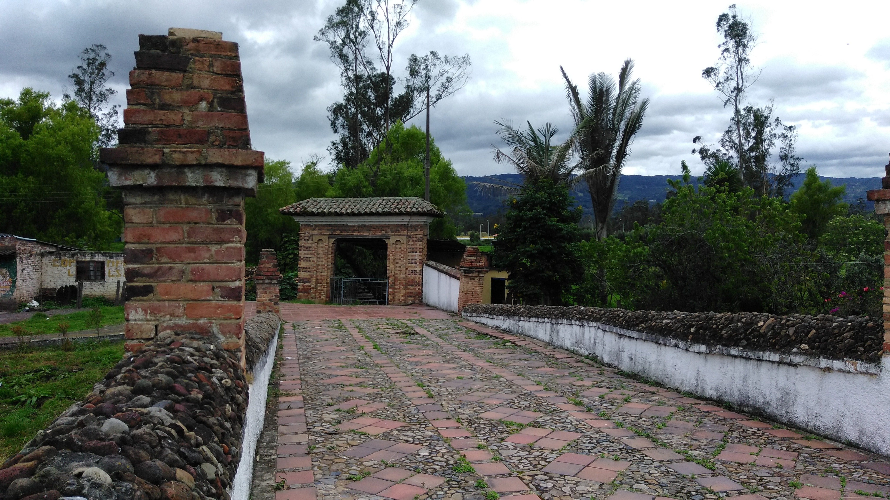

<br><details><summary>:camera:**53/IMG_20170820_124207.jpg**</summary><sub> `Exif version` 0220 `OS version` P895T20_MPCS-user 6.0.1 MMB29M 20170418.111425 release-keys `Date` 2017:08:20 12:42:07 `Aperture` Not known `Brightness` 0.0 `Color space` 1 `Compression` 6`Exposure mode` 0 `Exposure time` 0.000777000777000777 `Focal length` 3.46 `Lens model` Not known `Lens specification` Not known `Orientation` Not known `Scene type` Not known `f number` 2.2 `White balance` 0 `Sensing method` 2 `Shutter speed` 10.33</sub></details>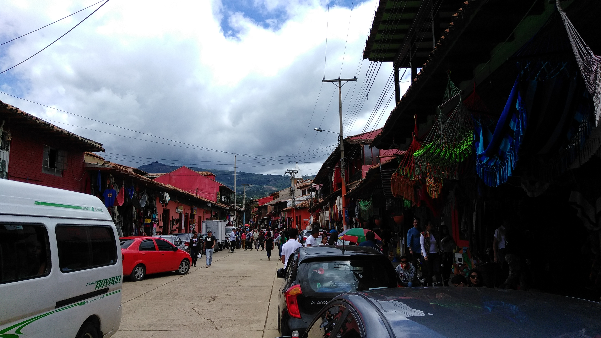

<br><details><summary>:camera:**53/IMG_20170820_125036.jpg**</summary><sub> `Exif version` 0220 `OS version` P895T20_MPCS-user 6.0.1 MMB29M 20170418.111425 release-keys `Date` 2017:08:20 12:50:36 `Aperture` Not known `Brightness` 0.0 `Color space` 1 `Compression` 6`Exposure mode` 0 `Exposure time` 0.001303780964797914 `Focal length` 3.46 `Lens model` Not known `Lens specification` Not known `Orientation` Not known `Scene type` Not known `f number` 2.2 `White balance` 0 `Sensing method` 2 `Shutter speed` 9.583</sub></details>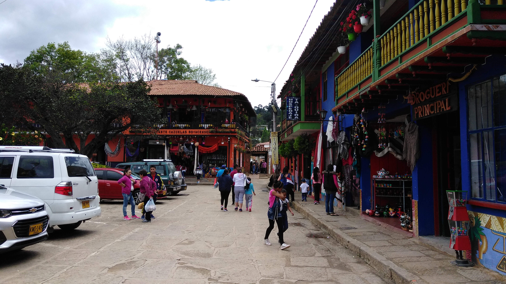

<br><details><summary>:camera:**53/IMG_20170820_125042.jpg**</summary><sub> `Exif version` 0220 `OS version` P895T20_MPCS-user 6.0.1 MMB29M 20170418.111425 release-keys `Date` 2017:08:20 12:50:42 `Aperture` Not known `Brightness` 0.0 `Color space` 1 `Compression` 6`Exposure mode` 0 `Exposure time` 0.0006381620931716656 `Focal length` 3.46 `Lens model` Not known `Lens specification` Not known `Orientation` Not known `Scene type` Not known `f number` 2.2 `White balance` 0 `Sensing method` 2 `Shutter speed` 10.614</sub></details>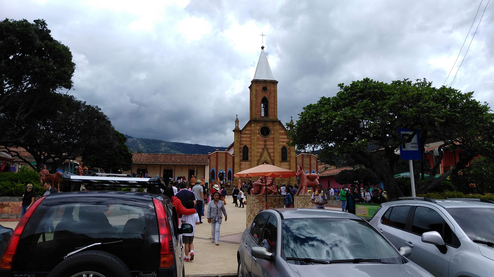

<br><details><summary>:camera:**53/IMG_20170820_125101.jpg**</summary><sub> `Exif version` 0220 `OS version` P895T20_MPCS-user 6.0.1 MMB29M 20170418.111425 release-keys `Date` 2017:08:20 12:51:01 `Aperture` Not known `Brightness` 0.0 `Color space` 1 `Compression` 6`Exposure mode` 0 `Exposure time` 0.0006657789613848203 `Focal length` 3.46 `Lens model` Not known `Lens specification` Not known `Orientation` Not known `Scene type` Not known `f number` 2.2 `White balance` 0 `Sensing method` 2 `Shutter speed` 10.552</sub></details>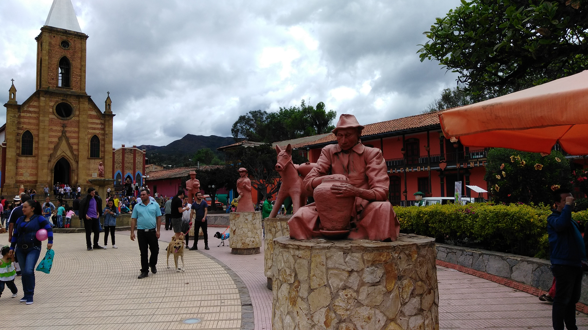

<br><details><summary>:camera:**53/IMG_20170820_125113.jpg**</summary><sub> `Exif version` 0220 `OS version` P895T20_MPCS-user 6.0.1 MMB29M 20170418.111425 release-keys `Date` 2017:08:20 12:51:12 `Aperture` Not known `Brightness` 0.0 `Color space` 1 `Compression` 6`Exposure mode` 0 `Exposure time` 0.00040225261464199515 `Focal length` 3.46 `Lens model` Not known `Lens specification` Not known `Orientation` Not known `Scene type` Not known `f number` 2.2 `White balance` 0 `Sensing method` 2 `Shutter speed` 11.279</sub></details>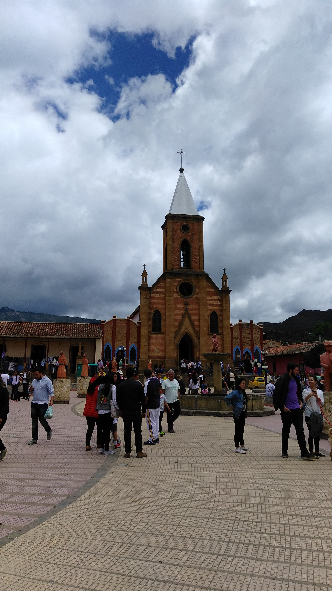

<br><details><summary>:camera:**53/IMG_20170820_125245.jpg**</summary><sub> `Exif version` 0220 `OS version` P895T20_MPCS-user 6.0.1 MMB29M 20170418.111425 release-keys `Date` 2017:08:20 12:52:45 `Aperture` Not known `Brightness` 0.0 `Color space` 1 `Compression` 6`Exposure mode` 0 `Exposure time` 0.00033288948069241014 `Focal length` 3.46 `Lens model` Not known `Lens specification` Not known `Orientation` Not known `Scene type` Not known `f number` 2.2 `White balance` 0 `Sensing method` 2 `Shutter speed` 11.552</sub></details>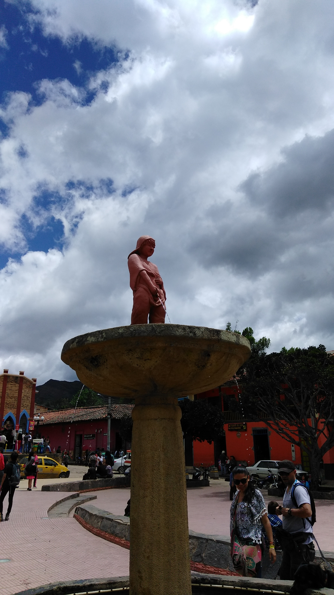

<br><details><summary>:camera:**53/IMG_20170820_125252.jpg**</summary><sub> `Exif version` 0220 `OS version` P895T20_MPCS-user 6.0.1 MMB29M 20170418.111425 release-keys `Date` 2017:08:20 12:52:52 `Aperture` Not known `Brightness` 0.0 `Color space` 1 `Compression` 6`Exposure mode` 0 `Exposure time` 0.0005963029218843172 `Focal length` 3.46 `Lens model` Not known `Lens specification` Not known `Orientation` Not known `Scene type` Not known `f number` 2.2 `White balance` 0 `Sensing method` 2 `Shutter speed` 10.711</sub></details>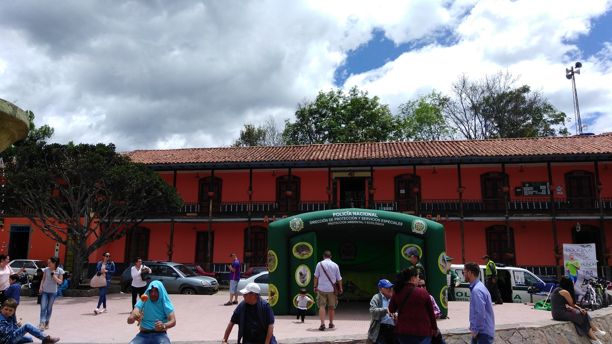

<br><details><summary>:camera:**53/IMG_20170820_125257.jpg**</summary><sub> `Exif version` 0220 `OS version` P895T20_MPCS-user 6.0.1 MMB29M 20170418.111425 release-keys `Date` 2017:08:20 12:52:57 `Aperture` Not known `Brightness` 0.0 `Color space` 1 `Compression` 6`Exposure mode` 0 `Exposure time` 0.0008319467554076539 `Focal length` 3.46 `Lens model` Not known `Lens specification` Not known `Orientation` Not known `Scene type` Not known `f number` 2.2 `White balance` 0 `Sensing method` 2 `Shutter speed` 10.23</sub></details>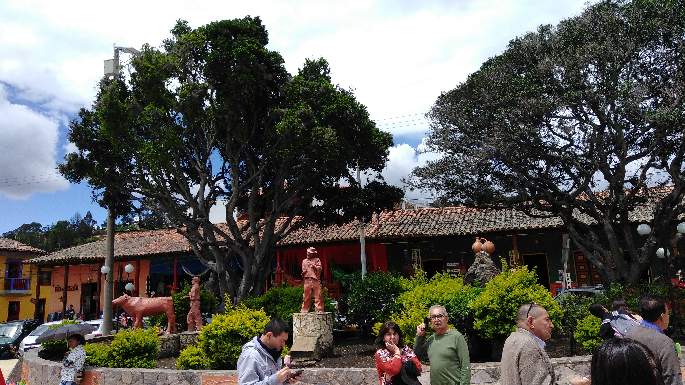

<br><details><summary>:camera:**53/IMG_20170820_125300.jpg**</summary><sub> `Exif version` 0220 `OS version` P895T20_MPCS-user 6.0.1 MMB29M 20170418.111425 release-keys `Date` 2017:08:20 12:52:59 `Aperture` Not known `Brightness` 0.0 `Color space` 1 `Compression` 6`Exposure mode` 0 `Exposure time` 0.0006657789613848203 `Focal length` 3.46 `Lens model` Not known `Lens specification` Not known `Orientation` Not known `Scene type` Not known `f number` 2.2 `White balance` 0 `Sensing method` 2 `Shutter speed` 10.552</sub></details>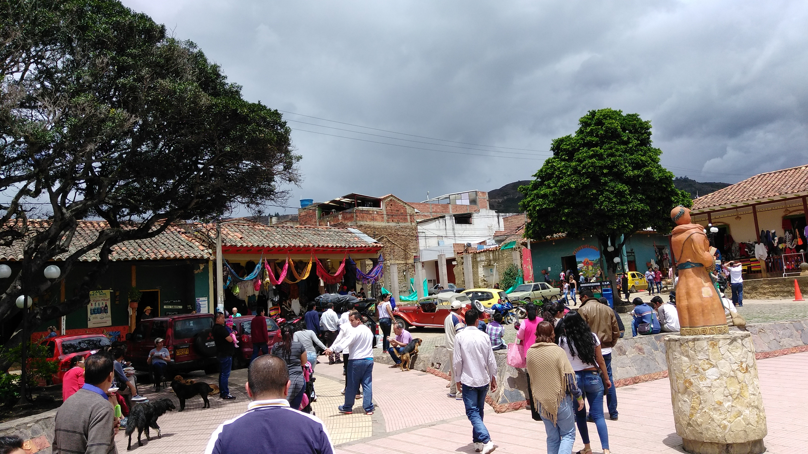

<br><details><summary>:camera:**53/IMG_20170820_125432.jpg**</summary><sub> `Exif version` 0220 `OS version` P895T20_MPCS-user 6.0.1 MMB29M 20170418.111425 release-keys `Date` 2017:08:20 12:54:32 `Aperture` Not known `Brightness` 0.0 `Color space` 1 `Compression` 6`Exposure mode` 0 `Exposure time` 0.0005408328826392645 `Focal length` 3.46 `Lens model` Not known `Lens specification` Not known `Orientation` Not known `Scene type` Not known `f number` 2.2 `White balance` 0 `Sensing method` 2 `Shutter speed` 10.852</sub></details>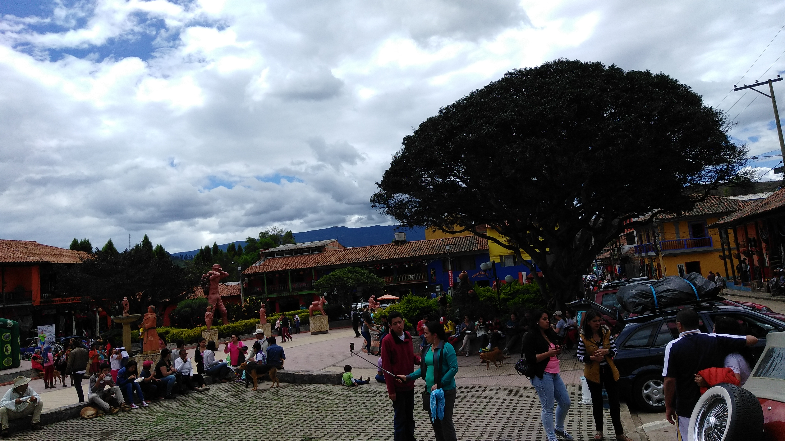

<br><details><summary>:camera:**53/IMG_20170820_131415.jpg**</summary><sub> `Exif version` 0220 `OS version` P895T20_MPCS-user 6.0.1 MMB29M 20170418.111425 release-keys `Date` 2017:08:20 13:14:15 `Aperture` Not known `Brightness` 0.0 `Color space` 1 `Compression` 6`Exposure mode` 0 `Exposure time` 0.006060606060606061 `Focal length` 3.46 `Lens model` Not known `Lens specification` Not known `Orientation` Not known `Scene type` Not known `f number` 2.2 `White balance` 0 `Sensing method` 2 `Shutter speed` 7.369</sub></details>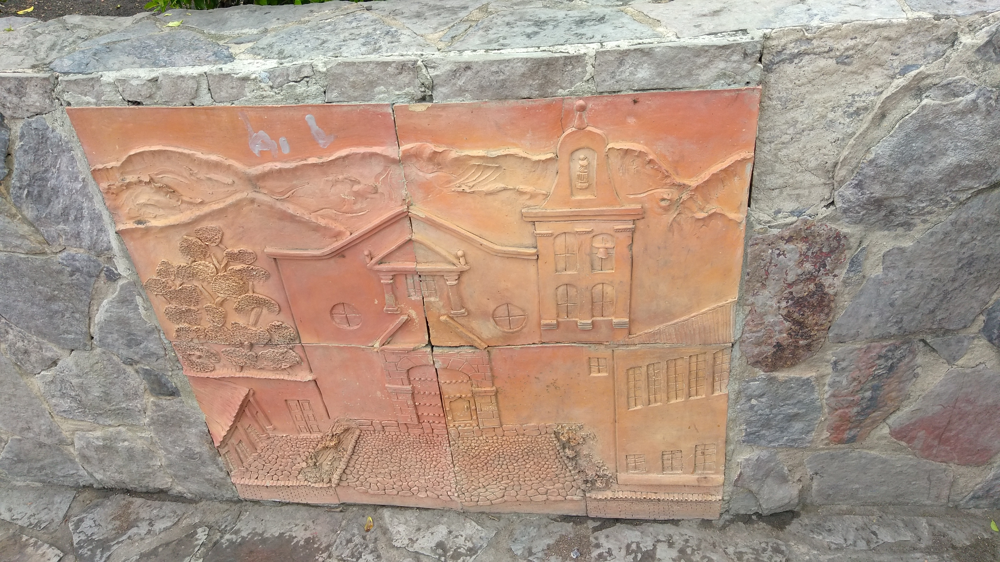

<br><details><summary>:camera:**53/IMG_20170820_144109.jpg**</summary><sub> `Exif version` 0220 `OS version` P895T20_MPCS-user 6.0.1 MMB29M 20170418.111425 release-keys `Date` 2017:08:20 14:41:09 `Aperture` Not known `Brightness` 0.0 `Color space` 1 `Compression` 6`Exposure mode` 0 `Exposure time` 0.041666666666666664 `Focal length` 3.46 `Lens model` Not known `Lens specification` Not known `Orientation` Not known `Scene type` Not known `f number` 2.2 `White balance` 0 `Sensing method` 2 `Shutter speed` 4.584</sub></details>

<br><details><summary>:camera:**53/IMG_20170820_144112.jpg**</summary><sub> `Exif version` 0220 `OS version` P895T20_MPCS-user 6.0.1 MMB29M 20170418.111425 release-keys `Date` 2017:08:20 14:41:12 `Aperture` Not known `Brightness` 0.0 `Color space` 1 `Compression` 6`Exposure mode` 0 `Exposure time` 0.041666666666666664 `Focal length` 3.46 `Lens model` Not known `Lens specification` Not known `Orientation` Not known `Scene type` Not known `f number` 2.2 `White balance` 0 `Sensing method` 2 `Shutter speed` 4.584</sub></details>

<br><details><summary>:camera:**53/IMG_20170820_144217.jpg**</summary><sub> `Exif version` 0220 `OS version` P895T20_MPCS-user 6.0.1 MMB29M 20170418.111425 release-keys `Date` 2017:08:20 14:42:17 `Aperture` Not known `Brightness` 0.0 `Color space` 1 `Compression` 6`Exposure mode` 0 `Exposure time` 0.041666666666666664 `Focal length` 3.46 `Lens model` Not known `Lens specification` Not known `Orientation` Not known `Scene type` Not known `f number` 2.2 `White balance` 0 `Sensing method` 2 `Shutter speed` 4.584</sub></details>

<br><details><summary>:camera:**53/IMG_20170820_144228.jpg**</summary><sub> `Exif version` 0220 `OS version` P895T20_MPCS-user 6.0.1 MMB29M 20170418.111425 release-keys `Date` 2017:08:20 14:42:28 `Aperture` Not known `Brightness` 0.0 `Color space` 1 `Compression` 6`Exposure mode` 0 `Exposure time` 0.041666666666666664 `Focal length` 3.46 `Lens model` Not known `Lens specification` Not known `Orientation` Not known `Scene type` Not known `f number` 2.2 `White balance` 0 `Sensing method` 2 `Shutter speed` 4.584</sub></details>

<br><details><summary>:camera:**53/IMG_20170820_144232.jpg**</summary><sub> `Exif version` 0220 `OS version` P895T20_MPCS-user 6.0.1 MMB29M 20170418.111425 release-keys `Date` 2017:08:20 14:42:32 `Aperture` Not known `Brightness` 0.0 `Color space` 1 `Compression` 6`Exposure mode` 0 `Exposure time` 0.041666666666666664 `Focal length` 3.46 `Lens model` Not known `Lens specification` Not known `Orientation` Not known `Scene type` Not known `f number` 2.2 `White balance` 0 `Sensing method` 2 `Shutter speed` 4.584</sub></details>

<br><details><summary>:camera:**53/IMG_20170820_144342.jpg**</summary><sub> `Exif version` 0220 `OS version` P895T20_MPCS-user 6.0.1 MMB29M 20170418.111425 release-keys `Date` 2017:08:20 14:43:42 `Aperture` Not known `Brightness` 0.0 `Color space` 1 `Compression` 6`Exposure mode` 0 `Exposure time` 0.041666666666666664 `Focal length` 3.46 `Lens model` Not known `Lens specification` Not known `Orientation` Not known `Scene type` Not known `f number` 2.2 `White balance` 0 `Sensing method` 2 `Shutter speed` 4.584</sub></details>

<br><details><summary>:camera:**53/IMG_20170820_144631.jpg**</summary><sub> `Exif version` 0220 `OS version` P895T20_MPCS-user 6.0.1 MMB29M 20170418.111425 release-keys `Date` 2017:08:20 14:46:31 `Aperture` Not known `Brightness` 0.0 `Color space` 1 `Compression` 6`Exposure mode` 0 `Exposure time` 0.041666666666666664 `Focal length` 3.46 `Lens model` Not known `Lens specification` Not known `Orientation` Not known `Scene type` Not known `f number` 2.2 `White balance` 0 `Sensing method` 2 `Shutter speed` 4.584</sub></details>

<br><details><summary>:camera:**53/IMG_20170820_151029.jpg**</summary><sub> `Exif version` 0220 `OS version` P895T20_MPCS-user 6.0.1 MMB29M 20170418.111425 release-keys `Date` 2017:08:20 15:10:29 `Aperture` Not known `Brightness` 0.0 `Color space` 1 `Compression` 6`Exposure mode` 0 `Exposure time` 0.041666666666666664 `Focal length` 3.46 `Lens model` Not known `Lens specification` Not known `Orientation` Not known `Scene type` Not known `f number` 2.2 `White balance` 0 `Sensing method` 2 `Shutter speed` 4.584</sub></details>

<br><details><summary>:camera:**53/IMG_20170820_162253.jpg**</summary><sub> `Exif version` 0220 `OS version` P895T20_MPCS-user 6.0.1 MMB29M 20170418.111425 release-keys `Date` 2017:08:20 16:22:53 `Aperture` Not known `Brightness` 0.0 `Color space` 1 `Compression` 6`Exposure mode` 0 `Exposure time` 0.008333333333333333 `Focal length` 3.46 `Lens model` Not known `Lens specification` Not known `Orientation` Not known `Scene type` Not known `f number` 2.2 `White balance` 0 `Sensing method` 2 `Shutter speed` 6.906</sub></details>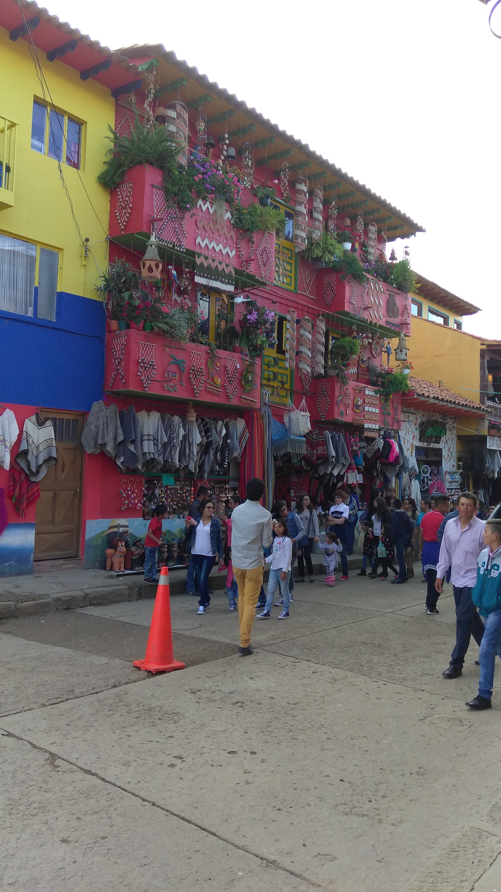

<sub>_Citation: Partial or total digital reproduction of this repository, scripts, development guides, data models, images, and documentation is permitted, provided that it is referenced as: "R.GISMobile - Mobile geographic information systems on QField that do not require an internet connection for navigation." https://github.com/rcfdtools/R.GISMobile - Bogotá - Colombia - South America"._<sub>

| [:house: Home](../Readme.md) |
|---|