<div align="center"></div>

## :earth_americas:POI: _“Saravena, Arauca, Colombia (2012-11-16)”_
`Pictures` rcfdtools <br>`Category` Freelance field visit <br>`Location` [Google Maps](http://maps.google.com/maps?q=6.93436,-71.863894) or [Openstreet Map](https://www.openstreetmap.org/query?lat=6.93436&lon=-71.863894) 

```geojson
{
  "type": "Feature",
  "geometry": {
    "type": "Point", 
    "coordinates": [-71.863894, 6.93436]
  }, 
  "properties": {
    "Name": "Saravena, Arauca, Colombia"
  }
}
```

<br><details><summary>:camera:**54/20121116_143141.jpg**</summary><sub> `Exif version` 0220 `OS version` N7000XXLPY `Date` 2012:11:16 14:31:41 `Aperture` Not known `Brightness` 9.28 `Color space` 1 `Compression` 6`Exposure mode` 0 `Exposure time` 0.0011061946902654867 `Focal length` 3.97 `Lens model` Not known `Lens specification` Not known `Orientation` 1 `Scene type` Not known `f number` 2.65 `White balance` 0 `Sensing method` Not known `Shutter speed` 9.82</sub></details>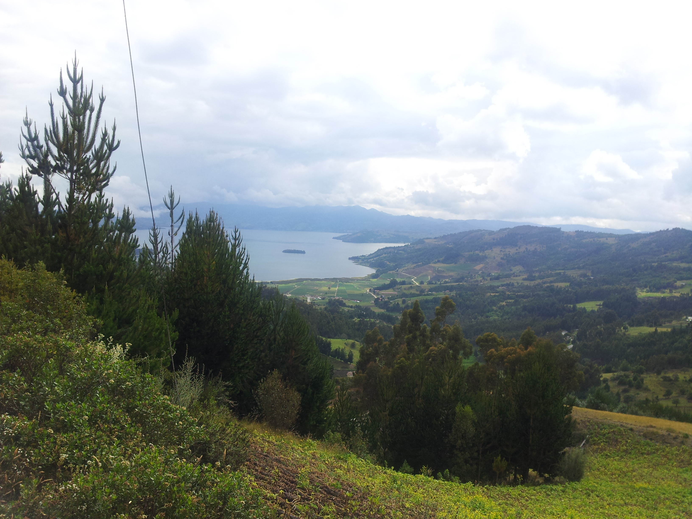

<br><details><summary>:camera:**54/20121116_143202.jpg**</summary><sub> `Exif version` 0220 `OS version` N7000XXLPY `Date` 2012:11:16 14:32:02 `Aperture` Not known `Brightness` 10.04 `Color space` 1 `Compression` 6`Exposure mode` 0 `Exposure time` 0.0006489292667099286 `Focal length` 3.97 `Lens model` Not known `Lens specification` Not known `Orientation` 1 `Scene type` Not known `f number` 2.65 `White balance` 0 `Sensing method` Not known `Shutter speed` 10.59</sub></details>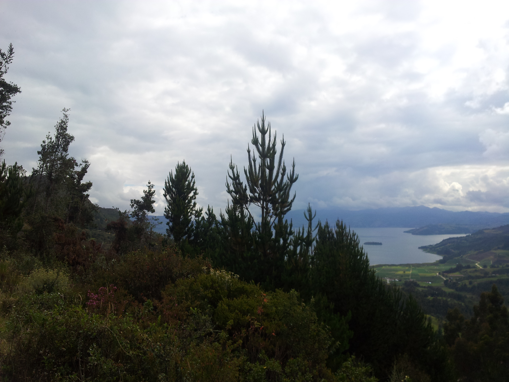

<br><details><summary>:camera:**54/20121116_151906.jpg**</summary><sub> `Exif version` 0220 `OS version` N7000XXLPY `Date` 2012:11:16 15:19:06 `Aperture` Not known `Brightness` 5.37 `Color space` 1 `Compression` 6`Exposure mode` 0 `Exposure time` 0.01 `Focal length` 3.97 `Lens model` Not known `Lens specification` Not known `Orientation` 1 `Scene type` Not known `f number` 2.65 `White balance` 0 `Sensing method` Not known `Shutter speed` 6.64</sub></details>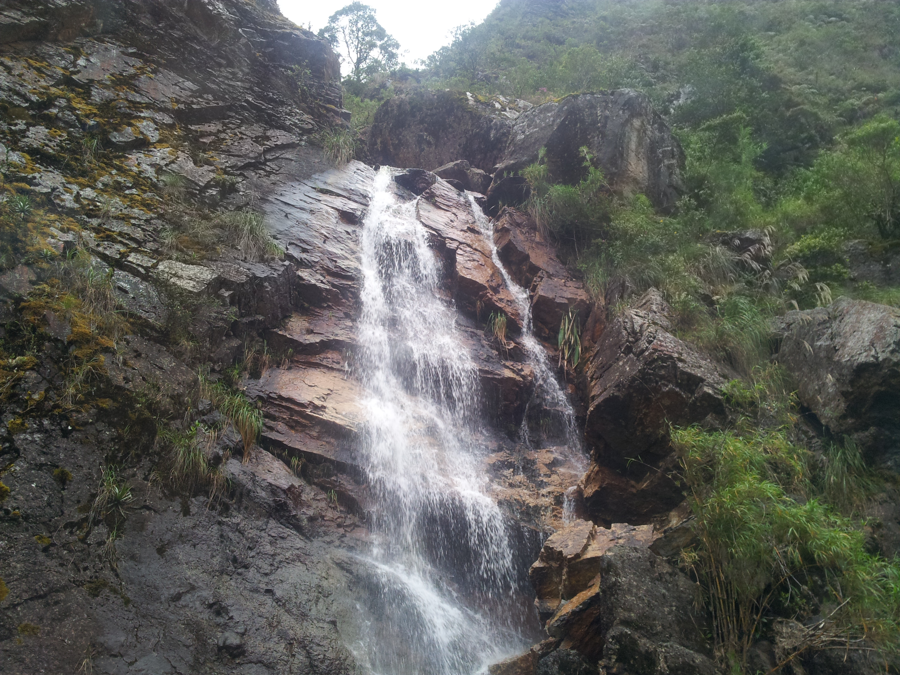

<br><details><summary>:camera:**54/20121116_151910.jpg**</summary><sub> `Exif version` 0220 `OS version` N7000XXLPY `Date` 2012:11:16 15:19:10 `Aperture` Not known `Brightness` 5.48 `Color space` 1 `Compression` 6`Exposure mode` 0 `Exposure time` 0.01 `Focal length` 3.97 `Lens model` Not known `Lens specification` Not known `Orientation` 1 `Scene type` Not known `f number` 2.65 `White balance` 0 `Sensing method` Not known `Shutter speed` 6.64</sub></details>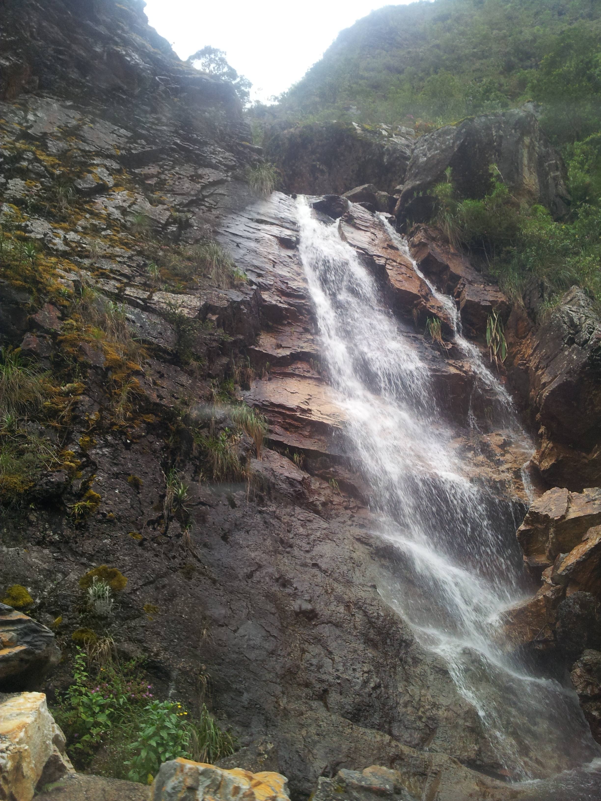

<br><details><summary>:camera:**54/20121116_160957.jpg**</summary><sub> `Exif version` 0220 `OS version` N7000XXLPY `Date` 2012:11:16 16:09:57 `Aperture` Not known `Brightness` 4.02 `Color space` 1 `Compression` 6`Exposure mode` 0 `Exposure time` 0.030303030303030304 `Focal length` 3.97 `Lens model` Not known `Lens specification` Not known `Orientation` 1 `Scene type` Not known `f number` 2.65 `White balance` 0 `Sensing method` Not known `Shutter speed` 5.05</sub></details>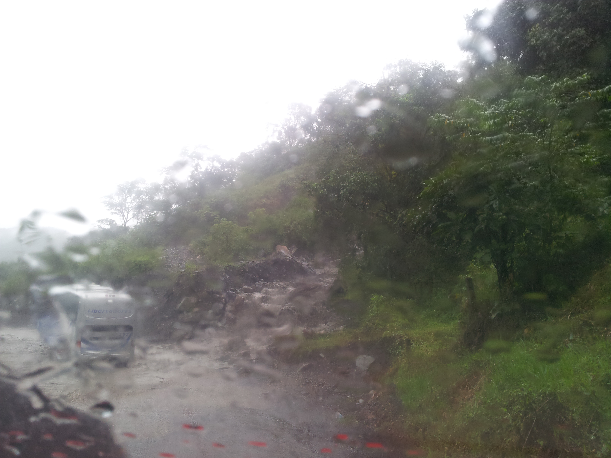

<br><details><summary>:camera:**54/20140412_101126.jpg**</summary><sub> `Exif version` 0220 `OS version` N7000XXLT5 `Date` 2014:04:12 10:11:26 `Aperture` Not known `Brightness` 10.11 `Color space` 1 `Compression` 6`Exposure mode` 0 `Exposure time` 0.0006222775357809583 `Focal length` 3.97 `Lens model` Not known `Lens specification` Not known `Orientation` 6 `Scene type` Not known `f number` 2.65 `White balance` 0 `Sensing method` Not known `Shutter speed` 10.65</sub></details>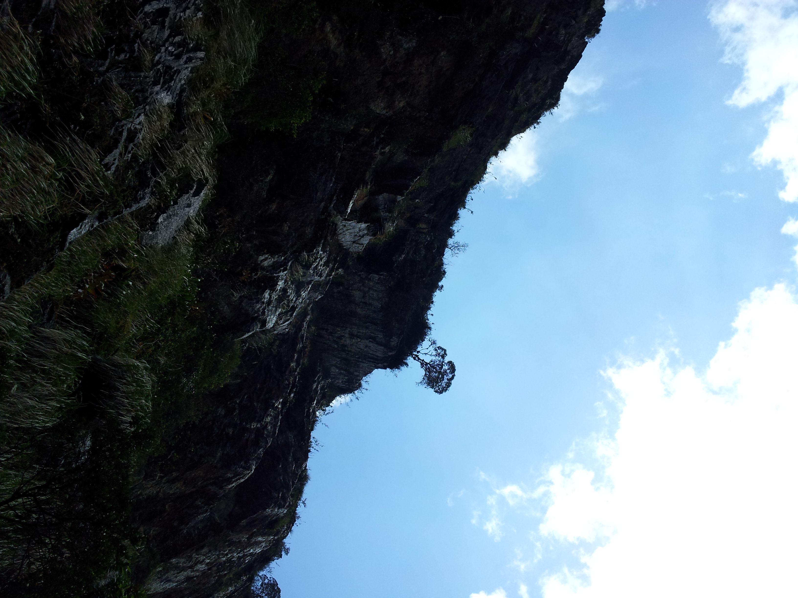

<br><details><summary>:camera:**54/20140412_101133.jpg**</summary><sub> `Exif version` 0220 `OS version` N7000XXLT5 `Date` 2014:04:12 10:11:32 `Aperture` Not known `Brightness` 10.31 `Color space` 1 `Compression` 6`Exposure mode` 0 `Exposure time` 0.0005417118093174431 `Focal length` 3.97 `Lens model` Not known `Lens specification` Not known `Orientation` 1 `Scene type` Not known `f number` 2.65 `White balance` 0 `Sensing method` Not known `Shutter speed` 10.85</sub></details>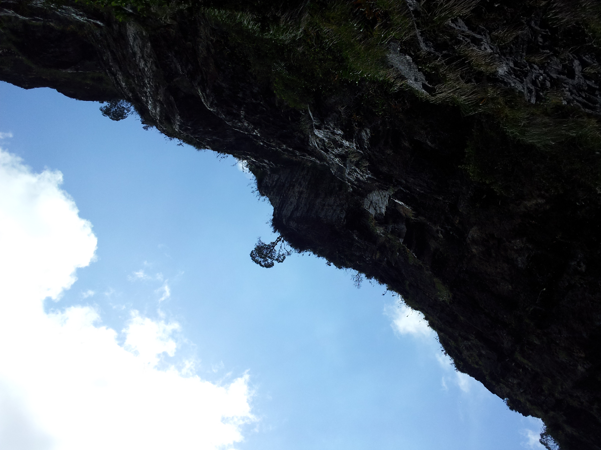

<br><details><summary>:camera:**54/20140412_101718.jpg**</summary><sub> `Exif version` 0220 `OS version` N7000XXLT5 `Date` 2014:04:12 10:17:17 `Aperture` Not known `Brightness` 9.5 `Color space` 1 `Compression` 6`Exposure mode` 0 `Exposure time` 0.0009433962264150943 `Focal length` 3.97 `Lens model` Not known `Lens specification` Not known `Orientation` 1 `Scene type` Not known `f number` 2.65 `White balance` 0 `Sensing method` Not known `Shutter speed` 10.05</sub></details>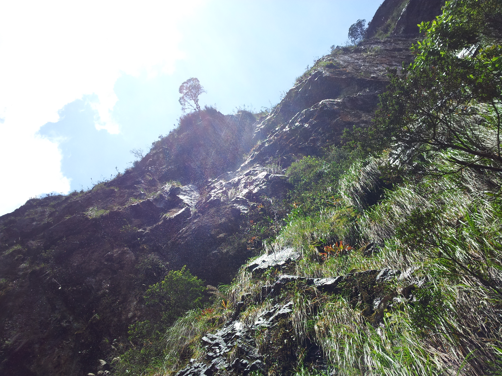

<br><details><summary>:camera:**54/20140412_101727.jpg**</summary><sub> `Exif version` 0220 `OS version` N7000XXLT5 `Date` 2014:04:12 10:17:27 `Aperture` Not known `Brightness` 9.38 `Color space` 1 `Compression` 6`Exposure mode` 0 `Exposure time` 0.0009970089730807576 `Focal length` 3.97 `Lens model` Not known `Lens specification` Not known `Orientation` 1 `Scene type` Not known `f number` 2.65 `White balance` 0 `Sensing method` Not known `Shutter speed` 9.97</sub></details>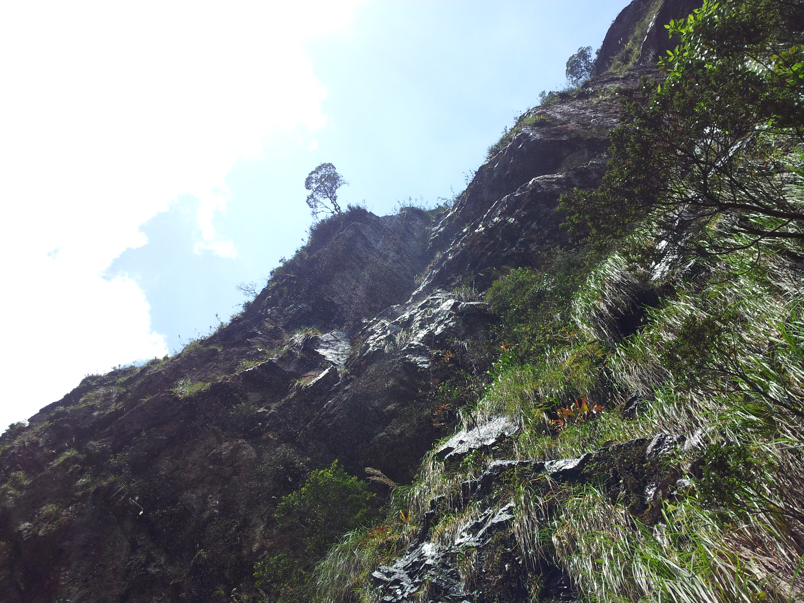

<br><details><summary>:camera:**54/20140412_101736.jpg**</summary><sub> `Exif version` 0220 `OS version` N7000XXLT5 `Date` 2014:04:12 10:17:36 `Aperture` Not known `Brightness` 9.63 `Color space` 1 `Compression` 6`Exposure mode` 0 `Exposure time` 0.0008382229673093043 `Focal length` 3.97 `Lens model` Not known `Lens specification` Not known `Orientation` 1 `Scene type` Not known `f number` 2.65 `White balance` 0 `Sensing method` Not known `Shutter speed` 10.22</sub></details>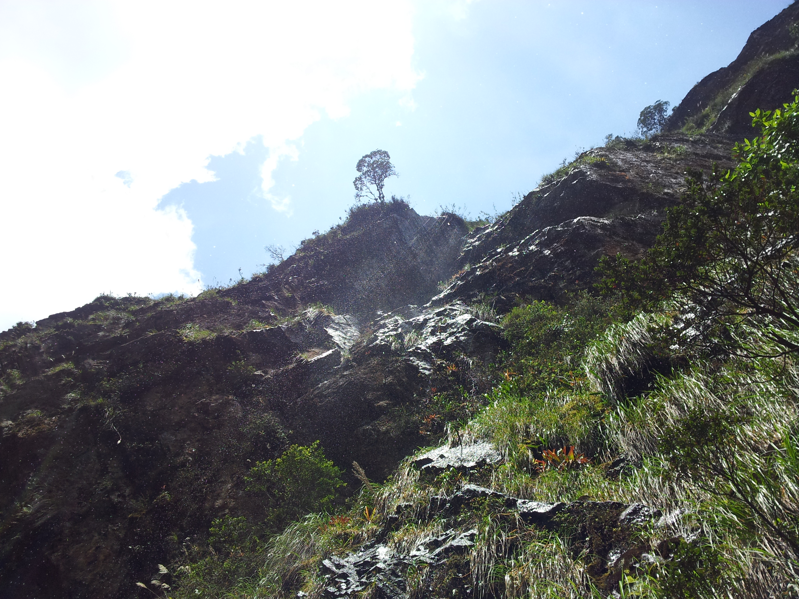

<br><details><summary>:camera:**54/20140412_101947.jpg**</summary><sub> `Exif version` 0220 `OS version` N7000XXLT5 `Date` 2014:04:12 10:19:47 `Aperture` Not known `Brightness` 6.89 `Color space` 1 `Compression` 6`Exposure mode` 0 `Exposure time` 0.00558659217877095 `Focal length` 3.97 `Lens model` Not known `Lens specification` Not known `Orientation` 1 `Scene type` Not known `f number` 2.65 `White balance` 0 `Sensing method` Not known `Shutter speed` 7.48</sub></details>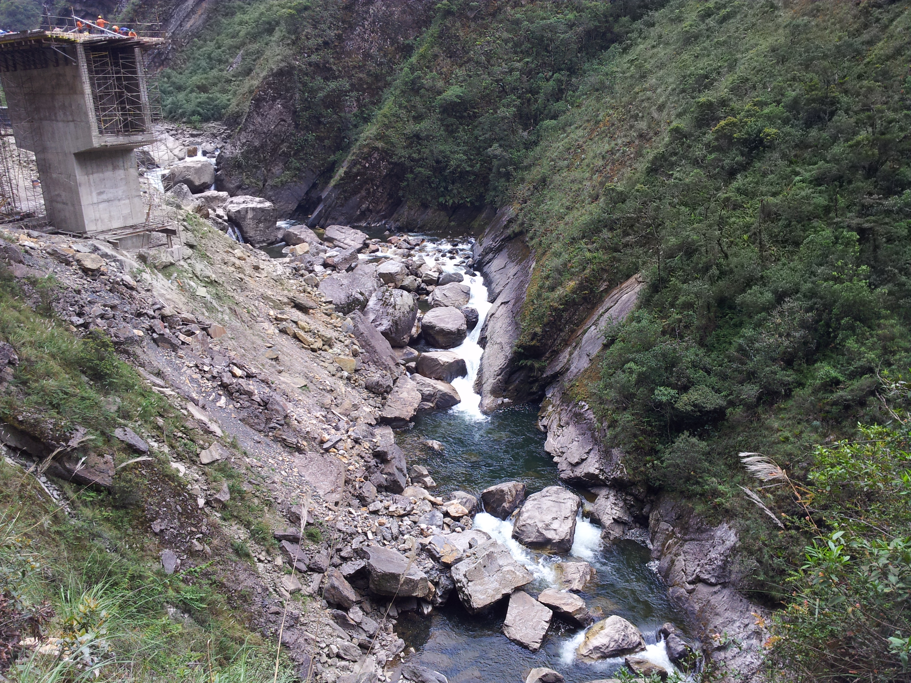

<br><details><summary>:camera:**54/20140412_102020.jpg**</summary><sub> `Exif version` 0220 `OS version` N7000XXLT5 `Date` 2014:04:12 10:20:20 `Aperture` Not known `Brightness` 6.96 `Color space` 1 `Compression` 6`Exposure mode` 0 `Exposure time` 0.0053475935828877 `Focal length` 3.97 `Lens model` Not known `Lens specification` Not known `Orientation` 6 `Scene type` Not known `f number` 2.65 `White balance` 0 `Sensing method` Not known `Shutter speed` 7.55</sub></details>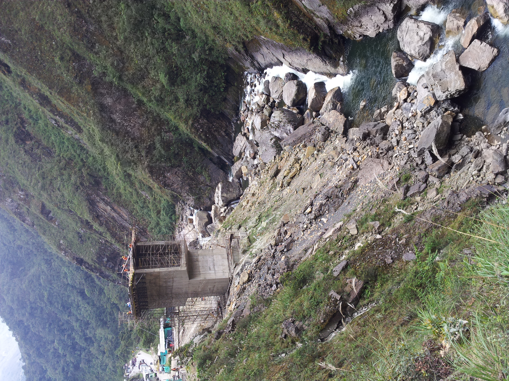

<br><details><summary>:camera:**54/20140412_102026.jpg**</summary><sub> `Exif version` 0220 `OS version` N7000XXLT5 `Date` 2014:04:12 10:20:25 `Aperture` Not known `Brightness` 7.18 `Color space` 1 `Compression` 6`Exposure mode` 0 `Exposure time` 0.004608294930875576 `Focal length` 3.97 `Lens model` Not known `Lens specification` Not known `Orientation` 6 `Scene type` Not known `f number` 2.65 `White balance` 0 `Sensing method` Not known `Shutter speed` 7.76</sub></details>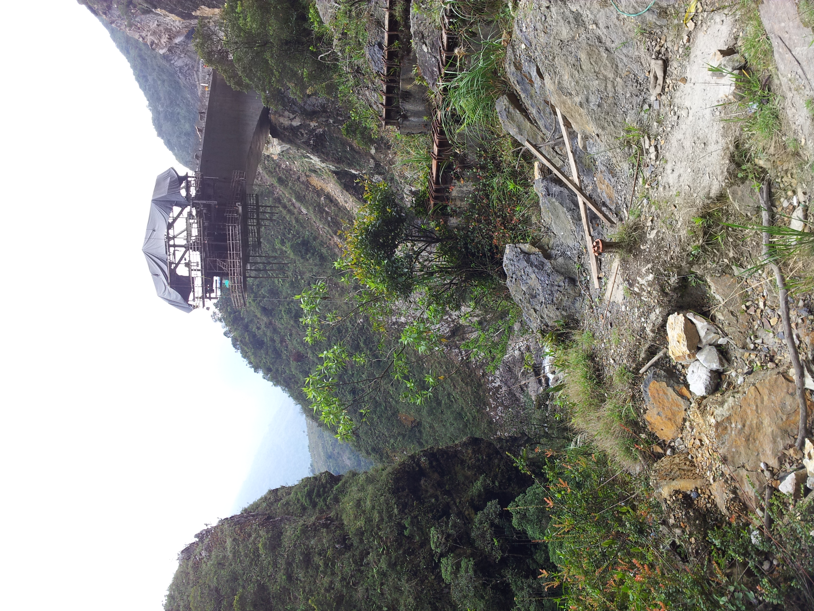

<br><details><summary>:camera:**54/20140412_102031.jpg**</summary><sub> `Exif version` 0220 `OS version` N7000XXLT5 `Date` 2014:04:12 10:20:31 `Aperture` Not known `Brightness` 7.02 `Color space` 1 `Compression` 6`Exposure mode` 0 `Exposure time` 0.005128205128205128 `Focal length` 3.97 `Lens model` Not known `Lens specification` Not known `Orientation` 6 `Scene type` Not known `f number` 2.65 `White balance` 0 `Sensing method` Not known `Shutter speed` 7.61</sub></details>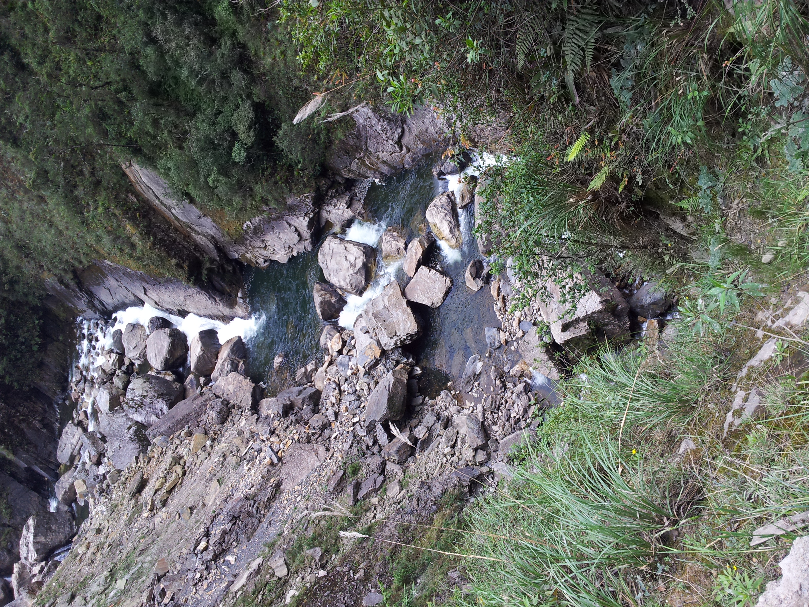

<br><details><summary>:camera:**54/20140412_102139.jpg**</summary><sub> `Exif version` 0220 `OS version` N7000XXLT5 `Date` 2014:04:12 10:21:39 `Aperture` Not known `Brightness` 6.69 `Color space` 1 `Compression` 6`Exposure mode` 0 `Exposure time` 0.0064516129032258064 `Focal length` 3.97 `Lens model` Not known `Lens specification` Not known `Orientation` 6 `Scene type` Not known `f number` 2.65 `White balance` 0 `Sensing method` Not known `Shutter speed` 7.28</sub></details>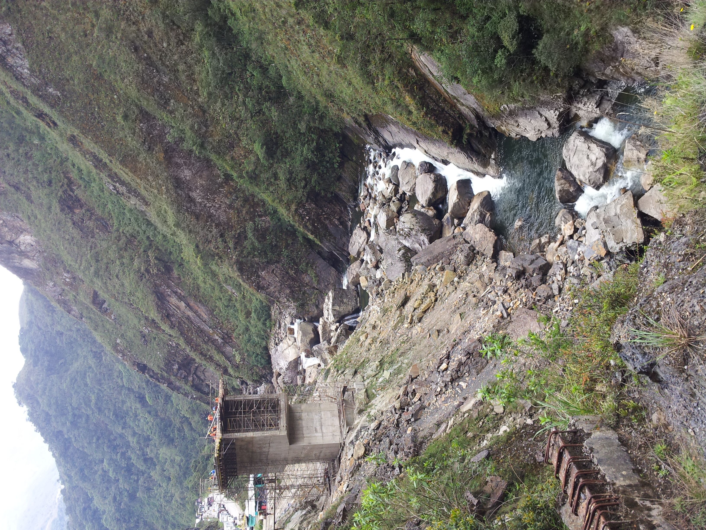

<br><details><summary>:camera:**54/20140412_102201.jpg**</summary><sub> `Exif version` 0220 `OS version` N7000XXLT5 `Date` 2014:04:12 10:22:00 `Aperture` Not known `Brightness` 6.61 `Color space` 1 `Compression` 6`Exposure mode` 0 `Exposure time` 0.006802721088435374 `Focal length` 3.97 `Lens model` Not known `Lens specification` Not known `Orientation` 6 `Scene type` Not known `f number` 2.65 `White balance` 0 `Sensing method` Not known `Shutter speed` 7.2</sub></details>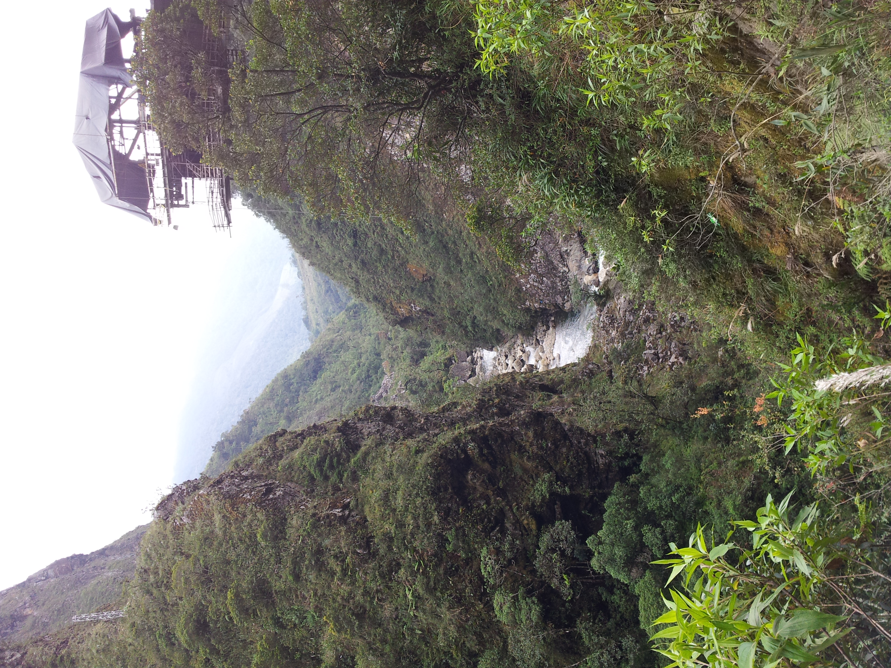

<br><details><summary>:camera:**54/20140412_102315.jpg**</summary><sub> `Exif version` 0220 `OS version` N7000XXLT5 `Date` 2014:04:12 10:23:14 `Aperture` Not known `Brightness` 6.43 `Color space` 1 `Compression` 6`Exposure mode` 0 `Exposure time` 0.007692307692307693 `Focal length` 3.97 `Lens model` Not known `Lens specification` Not known `Orientation` 1 `Scene type` Not known `f number` 2.65 `White balance` 0 `Sensing method` Not known `Shutter speed` 7.02</sub></details>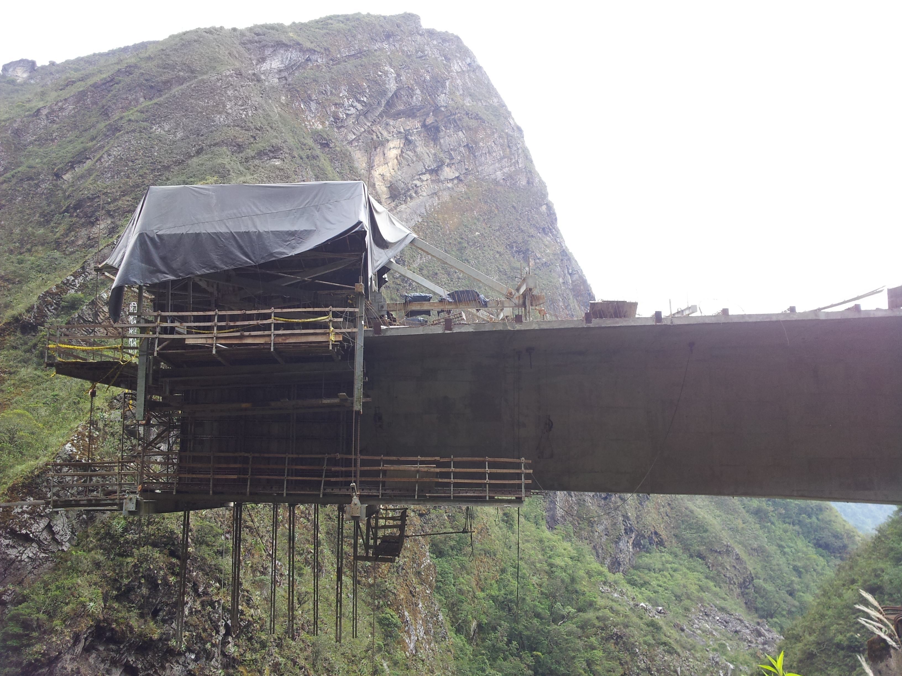

<br><details><summary>:camera:**54/20140412_102319.jpg**</summary><sub> `Exif version` 0220 `OS version` N7000XXLT5 `Date` 2014:04:12 10:23:18 `Aperture` Not known `Brightness` 9.31 `Color space` 1 `Compression` 6`Exposure mode` 0 `Exposure time` 0.001076426264800861 `Focal length` 3.97 `Lens model` Not known `Lens specification` Not known `Orientation` 1 `Scene type` Not known `f number` 2.65 `White balance` 0 `Sensing method` Not known `Shutter speed` 9.86</sub></details>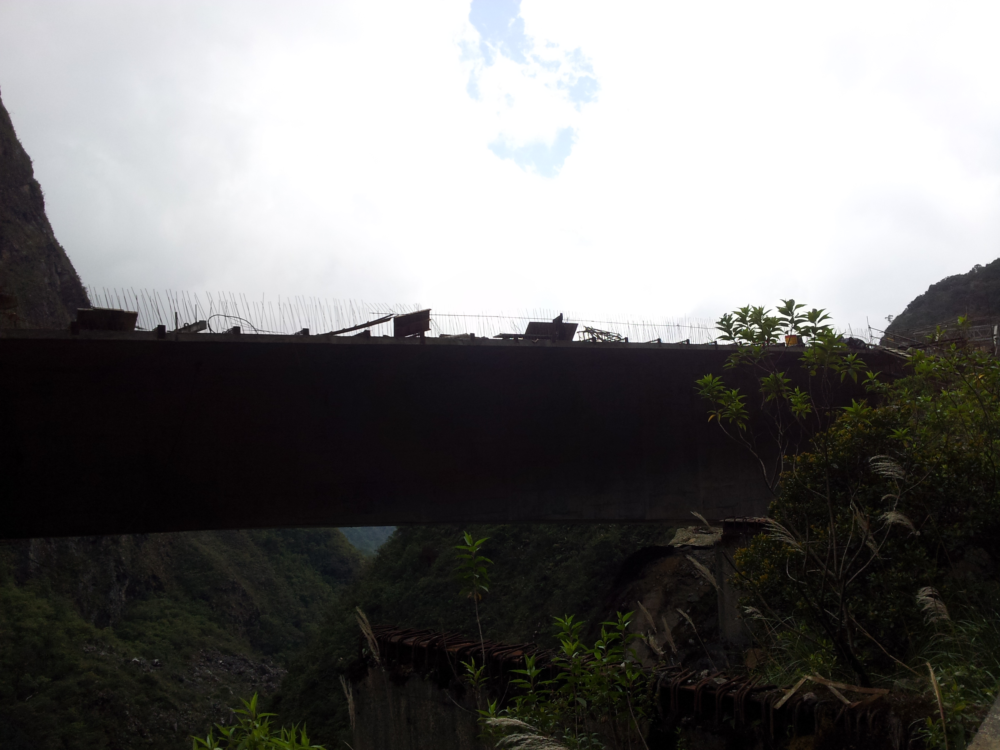

<br><details><summary>:camera:**54/20140412_102323.jpg**</summary><sub> `Exif version` 0220 `OS version` N7000XXLT5 `Date` 2014:04:12 10:23:23 `Aperture` Not known `Brightness` 8.17 `Color space` 1 `Compression` 6`Exposure mode` 0 `Exposure time` 0.002320185614849188 `Focal length` 3.97 `Lens model` Not known `Lens specification` Not known `Orientation` 1 `Scene type` Not known `f number` 2.65 `White balance` 0 `Sensing method` Not known `Shutter speed` 8.75</sub></details>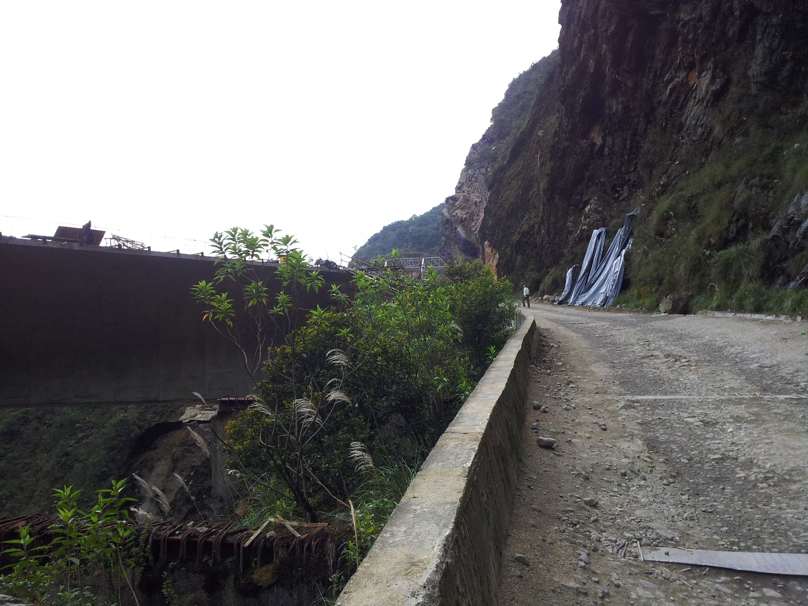

<br><details><summary>:camera:**54/20140412_102415.jpg**</summary><sub> `Exif version` 0220 `OS version` N7000XXLT5 `Date` 2014:04:12 10:24:15 `Aperture` Not known `Brightness` 7.77 `Color space` 1 `Compression` 6`Exposure mode` 0 `Exposure time` 0.00303951367781155 `Focal length` 3.97 `Lens model` Not known `Lens specification` Not known `Orientation` 6 `Scene type` Not known `f number` 2.65 `White balance` 0 `Sensing method` Not known `Shutter speed` 8.36</sub></details>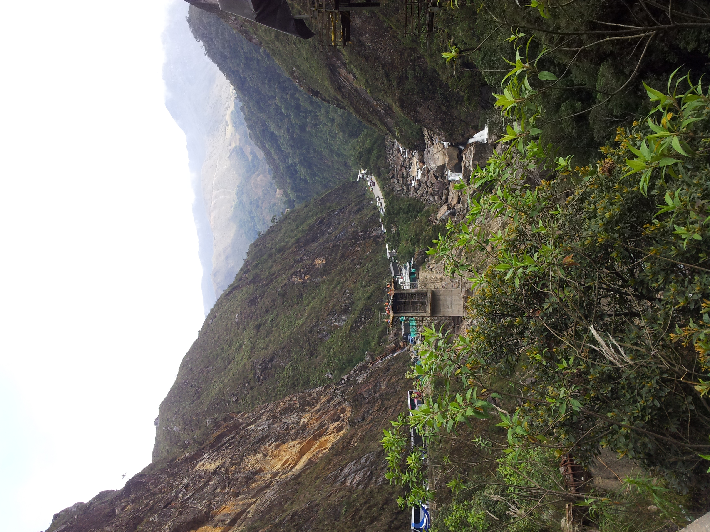

<br><details><summary>:camera:**54/20140412_102425.jpg**</summary><sub> `Exif version` 0220 `OS version` N7000XXLT5 `Date` 2014:04:12 10:24:25 `Aperture` Not known `Brightness` 7.21 `Color space` 1 `Compression` 6`Exposure mode` 0 `Exposure time` 0.004484304932735426 `Focal length` 3.97 `Lens model` Not known `Lens specification` Not known `Orientation` 1 `Scene type` Not known `f number` 2.65 `White balance` 0 `Sensing method` Not known `Shutter speed` 7.8</sub></details>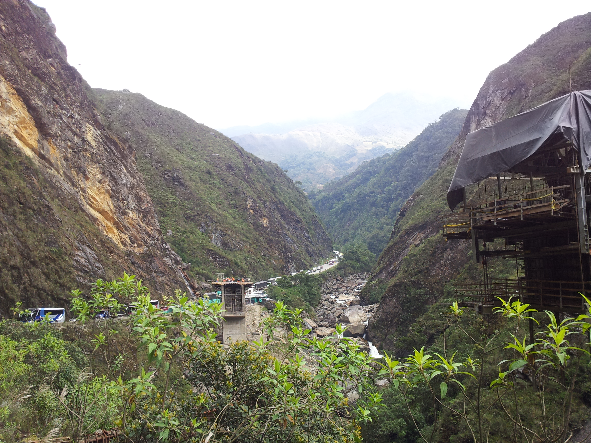

<br><details><summary>:camera:**54/20150606_080941.jpg**</summary><sub> `Exif version` 0220 `OS version` G900VVRU1BOA8 `Date` 2015:06:06 08:09:41 `Aperture` Not known `Brightness` 2.42 `Color space` 1 `Compression` 6`Exposure mode` 0 `Exposure time` 0.03333333333333333 `Focal length` 4.8 `Lens model` Not known `Lens specification` Not known `Orientation` 6 `Scene type` Not known `f number` 2.2 `White balance` 0 `Sensing method` 2 `Shutter speed` 4.9</sub></details>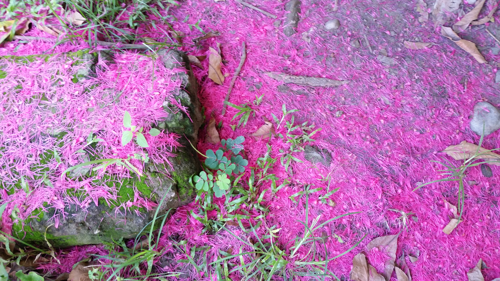

<br><details><summary>:camera:**54/20150606_081015.jpg**</summary><sub> `Exif version` 0220 `OS version` G900VVRU1BOA8 `Date` 2015:06:06 08:10:15 `Aperture` Not known `Brightness` 2.53 `Color space` 1 `Compression` 6`Exposure mode` 0 `Exposure time` 0.03333333333333333 `Focal length` 4.8 `Lens model` Not known `Lens specification` Not known `Orientation` 1 `Scene type` Not known `f number` 2.2 `White balance` 0 `Sensing method` 2 `Shutter speed` 4.9</sub></details>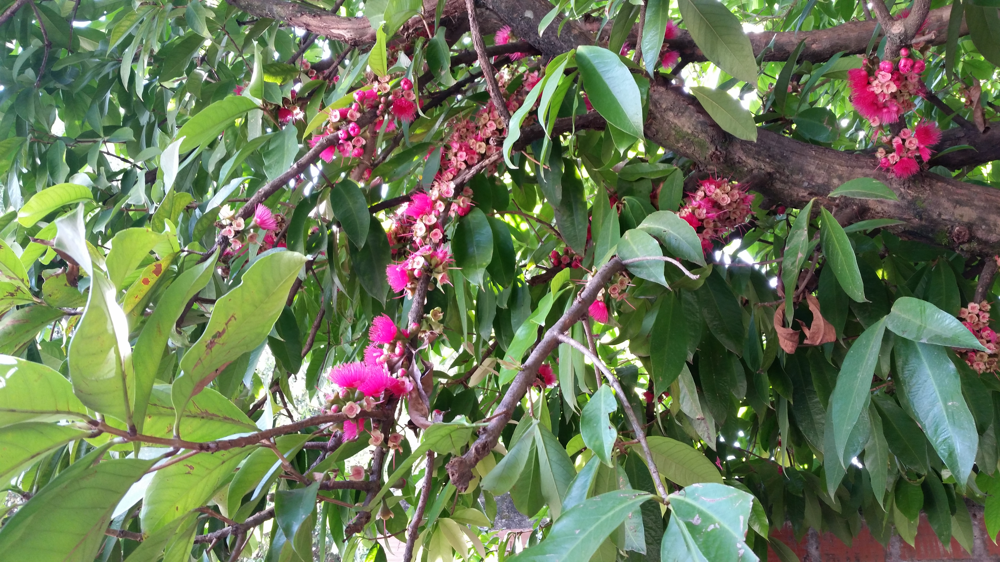

<br><details><summary>:camera:**54/IMG_20160811_155828.jpg**</summary><sub> `Exif version` 0220 `OS version` MOB30Z `Date` 2016:08:11 15:58:28 `Aperture` Not known `Brightness` 0.0 `Color space` 1 `Compression` 6`Exposure mode` 0 `Exposure time` 0.0004528985507246377 `Focal length` 3.7 `Lens model` Not known `Lens specification` Not known `Orientation` 1 `Scene type` Not known `f number` 2.65 `White balance` 0 `Sensing method` Not known `Shutter speed` -11.11</sub></details>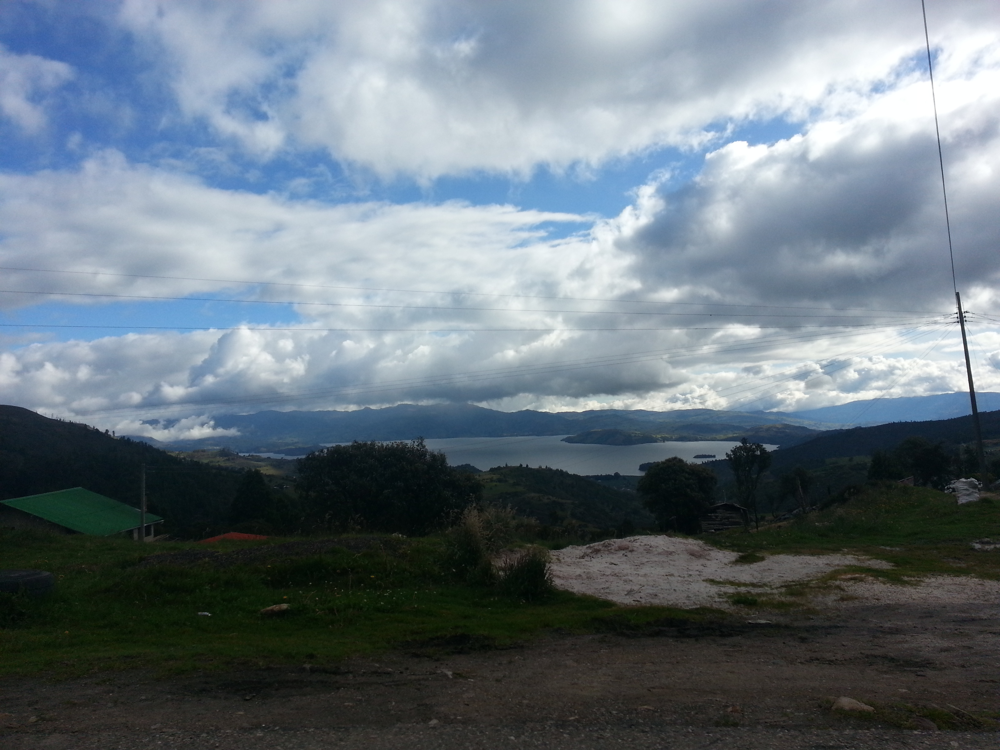

<br><details><summary>:camera:**54/IMG_20160811_155829.jpg**</summary><sub> `Exif version` 0220 `OS version` MOB30Z `Date` 2016:08:11 15:58:29 `Aperture` Not known `Brightness` 0.0 `Color space` 1 `Compression` 6`Exposure mode` 0 `Exposure time` 0.0004970178926441351 `Focal length` 3.7 `Lens model` Not known `Lens specification` Not known `Orientation` 1 `Scene type` Not known `f number` 2.65 `White balance` 0 `Sensing method` Not known `Shutter speed` -10.97</sub></details>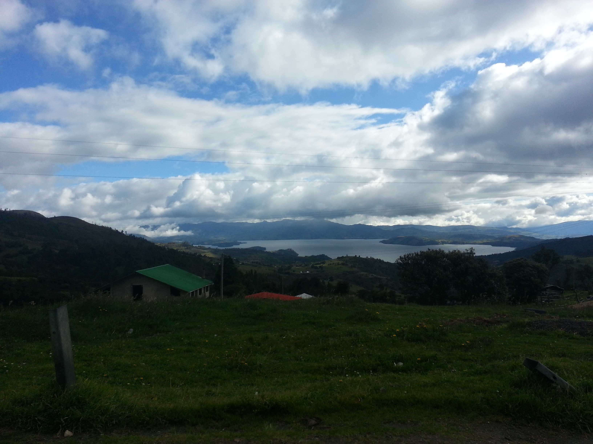

<br><details><summary>:camera:**54/IMG_20160811_155830.jpg**</summary><sub> `Exif version` 0220 `OS version` MOB30Z `Date` 2016:08:11 15:58:30 `Aperture` Not known `Brightness` 0.0 `Color space` 1 `Compression` 6`Exposure mode` 0 `Exposure time` 0.0004930966469428008 `Focal length` 3.7 `Lens model` Not known `Lens specification` Not known `Orientation` 1 `Scene type` Not known `f number` 2.65 `White balance` 0 `Sensing method` Not known `Shutter speed` -10.99</sub></details>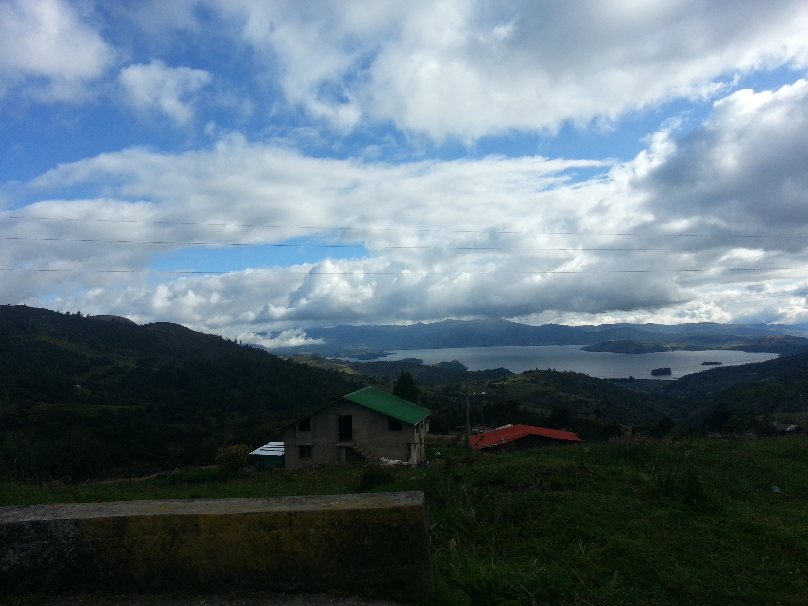

<br><details><summary>:camera:**54/IMG_20160811_155831.jpg**</summary><sub> `Exif version` 0220 `OS version` MOB30Z `Date` 2016:08:11 15:58:32 `Aperture` Not known `Brightness` 0.0 `Color space` 1 `Compression` 6`Exposure mode` 0 `Exposure time` 0.0005376344086021505 `Focal length` 3.7 `Lens model` Not known `Lens specification` Not known `Orientation` 1 `Scene type` Not known `f number` 2.65 `White balance` 0 `Sensing method` Not known `Shutter speed` -10.86</sub></details>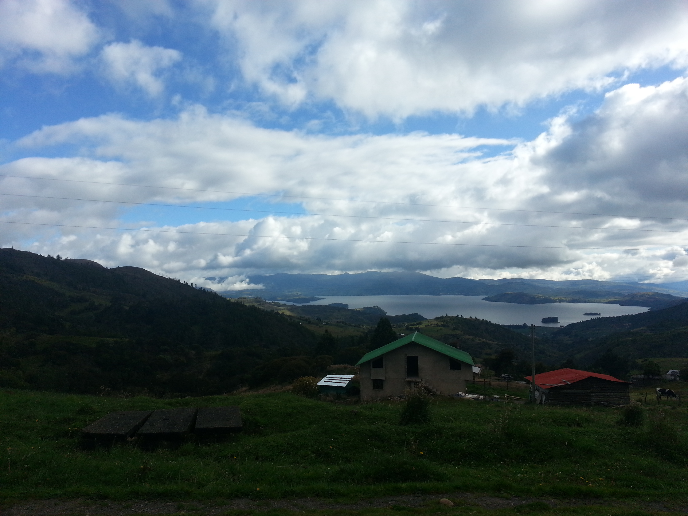

<br><details><summary>:camera:**54/IMG_20160811_160133.jpg**</summary><sub> `Exif version` 0220 `OS version` MOB30Z `Date` 2016:08:11 16:01:34 `Aperture` Not known `Brightness` 0.0 `Color space` 1 `Compression` 6`Exposure mode` 0 `Exposure time` 0.0008305647840531562 `Focal length` 3.7 `Lens model` Not known `Lens specification` Not known `Orientation` 1 `Scene type` Not known `f number` 2.65 `White balance` 0 `Sensing method` Not known `Shutter speed` -10.23</sub></details>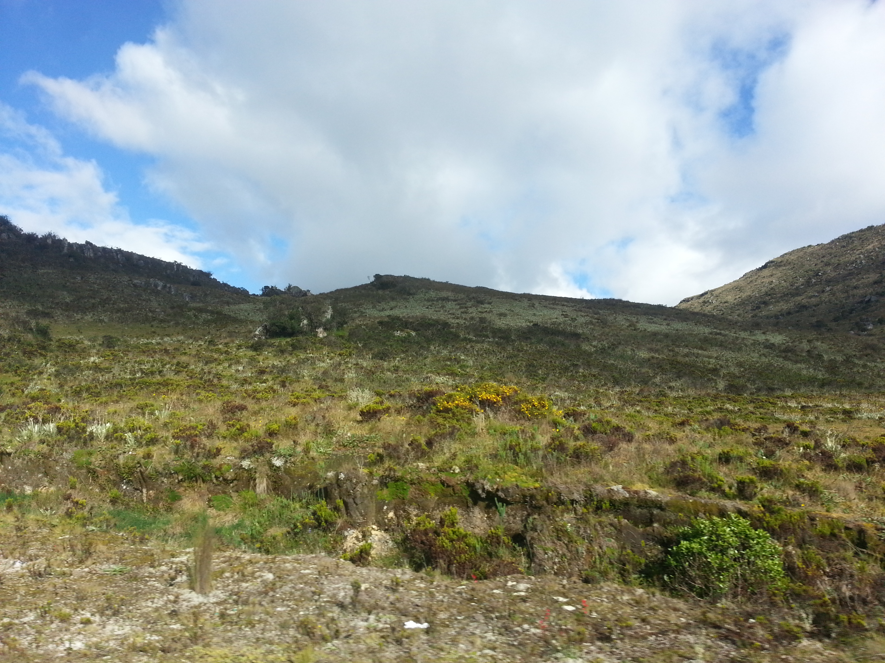

<br><details><summary>:camera:**54/IMG_20160811_160139.jpg**</summary><sub> `Exif version` 0220 `OS version` MOB30Z `Date` 2016:08:11 16:01:39 `Aperture` Not known `Brightness` 0.0 `Color space` 1 `Compression` 6`Exposure mode` 0 `Exposure time` 0.0009225092250922509 `Focal length` 3.7 `Lens model` Not known `Lens specification` Not known `Orientation` 1 `Scene type` Not known `f number` 2.65 `White balance` 0 `Sensing method` Not known `Shutter speed` -10.08</sub></details>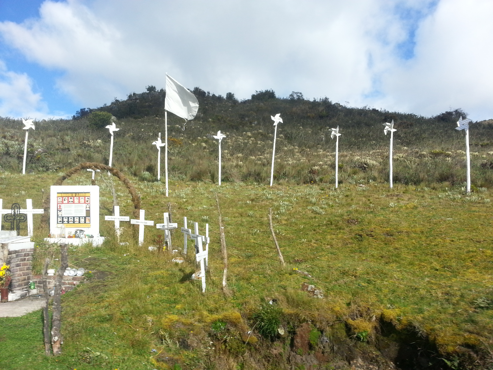

<br><details><summary>:camera:**54/IMG_20160811_160253.jpg**</summary><sub> `Exif version` 0220 `OS version` MOB30Z `Date` 2016:08:11 16:02:53 `Aperture` Not known `Brightness` 0.0 `Color space` 1 `Compression` 6`Exposure mode` 0 `Exposure time` 0.000580046403712297 `Focal length` 3.7 `Lens model` Not known `Lens specification` Not known `Orientation` 1 `Scene type` Not known `f number` 2.65 `White balance` 0 `Sensing method` Not known `Shutter speed` -10.75</sub></details>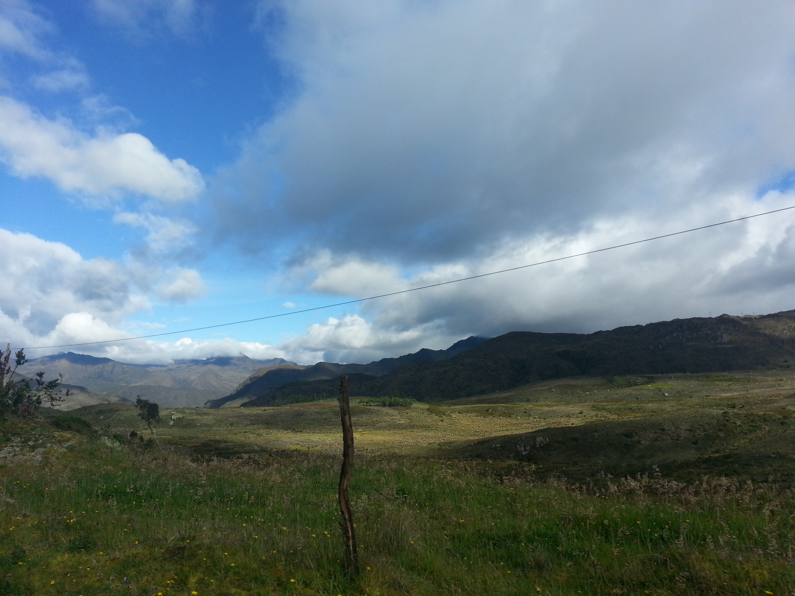

<br><details><summary>:camera:**54/IMG_20160811_160447.jpg**</summary><sub> `Exif version` 0220 `OS version` MOB30Z `Date` 2016:08:11 16:04:47 `Aperture` Not known `Brightness` 0.0 `Color space` 1 `Compression` 6`Exposure mode` 0 `Exposure time` 0.0006234413965087282 `Focal length` 3.7 `Lens model` Not known `Lens specification` Not known `Orientation` 1 `Scene type` Not known `f number` 2.65 `White balance` 0 `Sensing method` Not known `Shutter speed` -10.65</sub></details>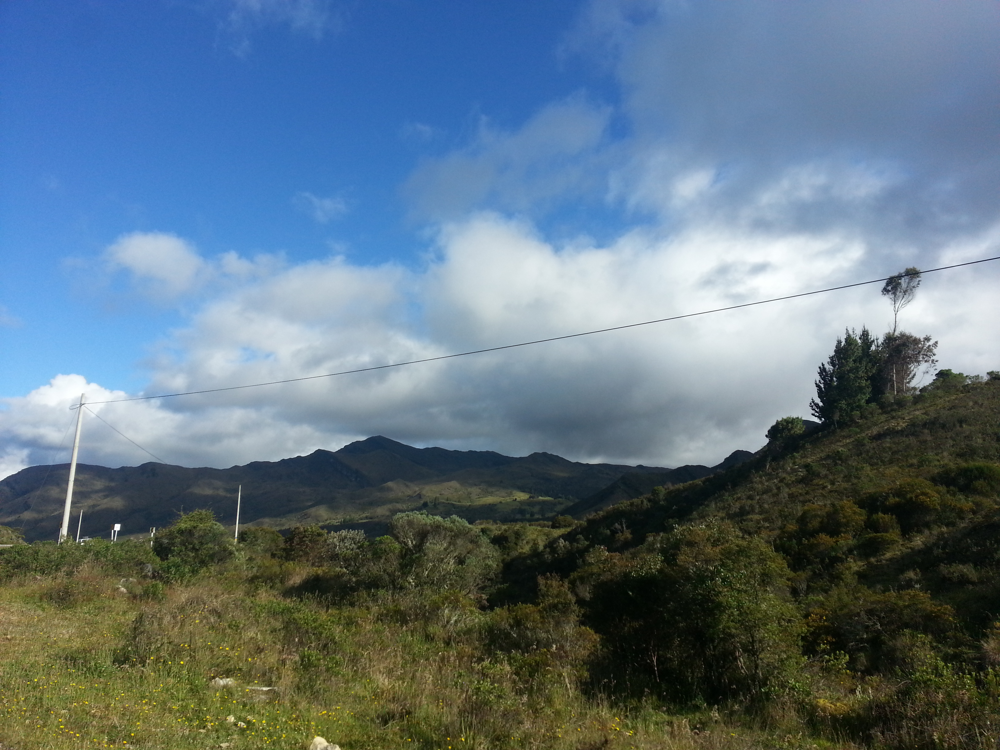

<br><details><summary>:camera:**54/IMG_20160813_063338.jpg**</summary><sub> `Exif version` 0220 `OS version` MOB30Z `Date` 2016:08:13 06:33:38 `Aperture` Not known `Brightness` 0.0 `Color space` 1 `Compression` 6`Exposure mode` 0 `Exposure time` 0.008403361344537815 `Focal length` 3.7 `Lens model` Not known `Lens specification` Not known `Orientation` 1 `Scene type` Not known `f number` 2.65 `White balance` 0 `Sensing method` Not known `Shutter speed` -6.89</sub></details>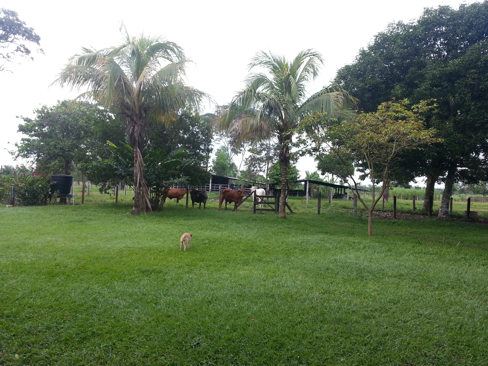

<br><details><summary>:camera:**54/IMG_20160813_063622.jpg**</summary><sub> `Exif version` 0220 `OS version` MOB30Z `Date` 2016:08:13 06:36:22 `Aperture` Not known `Brightness` 0.0 `Color space` 1 `Compression` 6`Exposure mode` 0 `Exposure time` 0.020833333333333332 `Focal length` 3.7 `Lens model` Not known `Lens specification` Not known `Orientation` 1 `Scene type` Not known `f number` 2.65 `White balance` 0 `Sensing method` Not known `Shutter speed` -5.58</sub></details>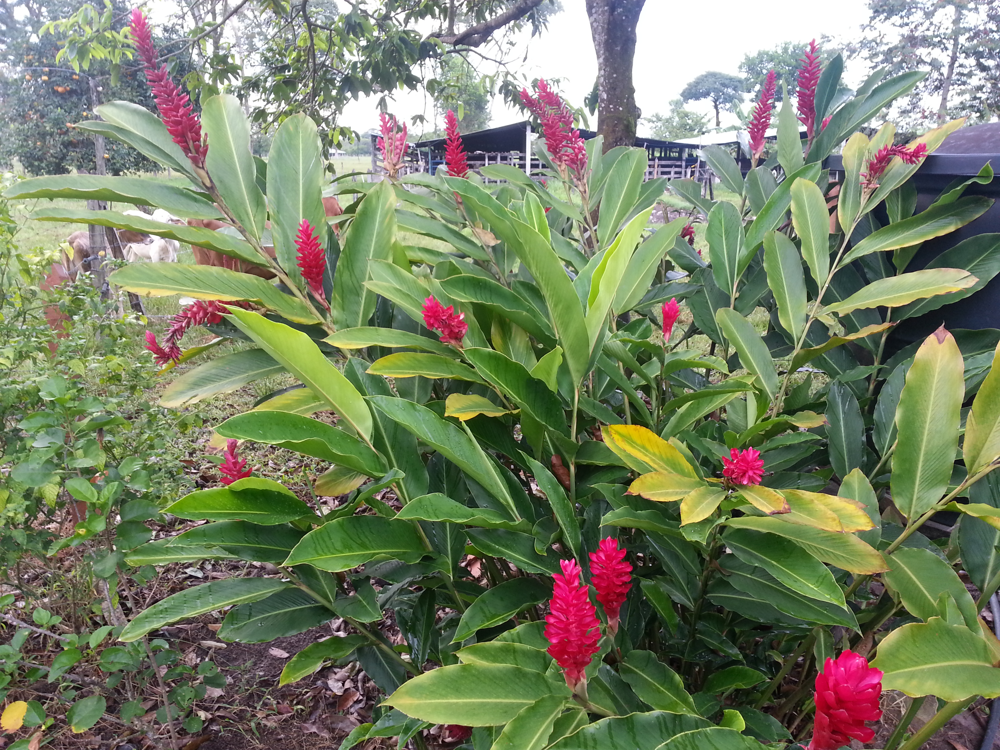

<br><details><summary>:camera:**54/IMG_20160813_063632.jpg**</summary><sub> `Exif version` 0220 `OS version` MOB30Z `Date` 2016:08:13 06:36:32 `Aperture` Not known `Brightness` 0.0 `Color space` 1 `Compression` 6`Exposure mode` 0 `Exposure time` 0.005050505050505051 `Focal length` 3.7 `Lens model` Not known `Lens specification` Not known `Orientation` 1 `Scene type` Not known `f number` 2.65 `White balance` 0 `Sensing method` Not known `Shutter speed` -7.63</sub></details>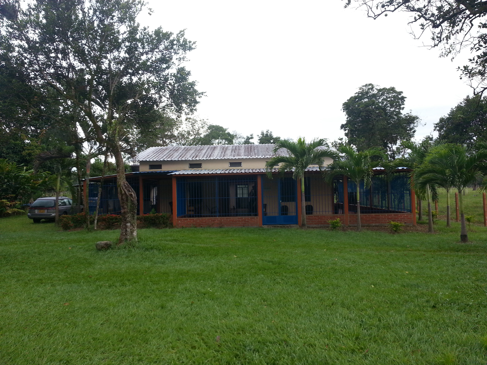

<br><details><summary>:camera:**54/IMG_20160813_163716.jpg**</summary><sub> `Exif version` 0220 `OS version` MOB30Z `Date` 2016:08:13 16:37:16 `Aperture` Not known `Brightness` 0.0 `Color space` 1 `Compression` 6`Exposure mode` 0 `Exposure time` 0.0625 `Focal length` 3.7 `Lens model` Not known `Lens specification` Not known `Orientation` 1 `Scene type` Not known `f number` 2.65 `White balance` 0 `Sensing method` Not known `Shutter speed` -4.0</sub></details>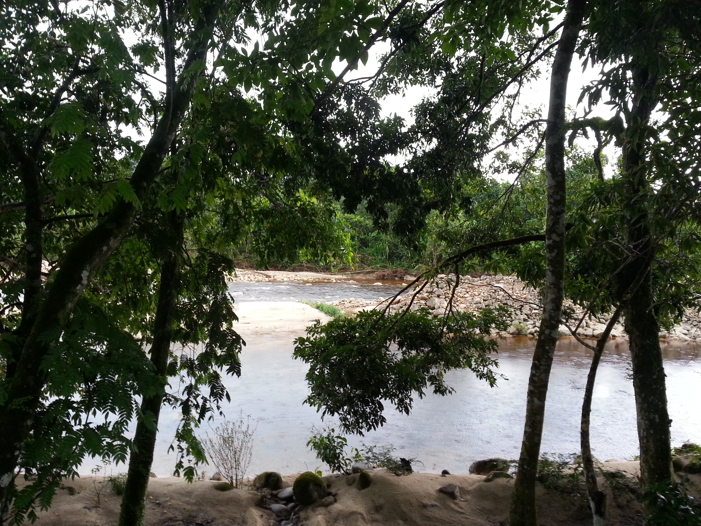

<br><details><summary>:camera:**54/IMG_20160814_145852.jpg**</summary><sub> `Exif version` 0220 `OS version` MOB30Z `Date` 2016:08:14 14:58:52 `Aperture` Not known `Brightness` 0.0 `Color space` 1 `Compression` 6`Exposure mode` 0 `Exposure time` 0.0013736263736263737 `Focal length` 3.7 `Lens model` Not known `Lens specification` Not known `Orientation` 6 `Scene type` Not known `f number` 2.65 `White balance` 0 `Sensing method` Not known `Shutter speed` -9.51</sub></details>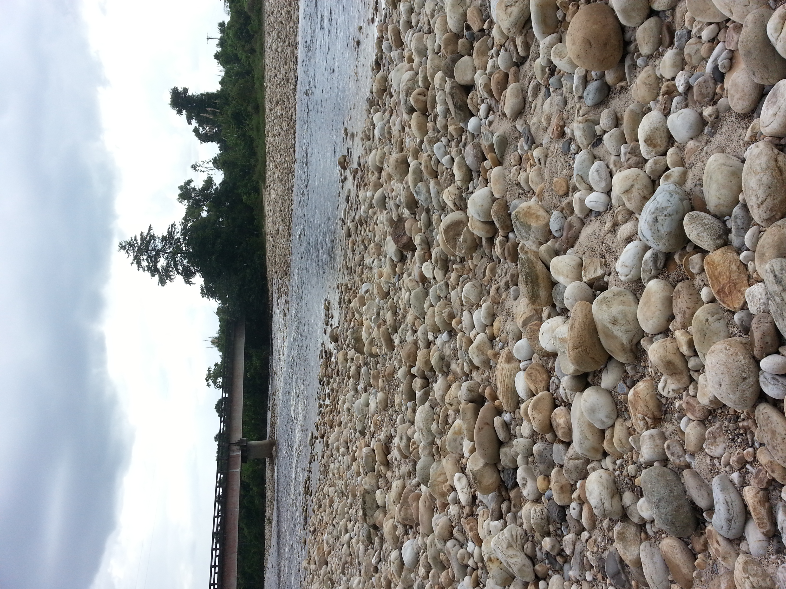

<br><details><summary>:camera:**54/IMG_20160814_145857.jpg**</summary><sub> `Exif version` 0220 `OS version` MOB30Z `Date` 2016:08:14 14:58:57 `Aperture` Not known `Brightness` 0.0 `Color space` 1 `Compression` 6`Exposure mode` 0 `Exposure time` 0.0013227513227513227 `Focal length` 3.7 `Lens model` Not known `Lens specification` Not known `Orientation` 1 `Scene type` Not known `f number` 2.65 `White balance` 0 `Sensing method` Not known `Shutter speed` -9.56</sub></details>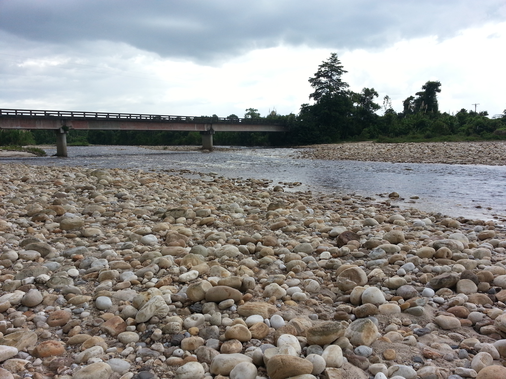

<br><details><summary>:camera:**54/IMG_20160814_150018.jpg**</summary><sub> `Exif version` 0220 `OS version` MOB30Z `Date` 2016:08:14 15:00:18 `Aperture` Not known `Brightness` 0.0 `Color space` 1 `Compression` 6`Exposure mode` 0 `Exposure time` 0.0015772870662460567 `Focal length` 3.7 `Lens model` Not known `Lens specification` Not known `Orientation` 1 `Scene type` Not known `f number` 2.65 `White balance` 0 `Sensing method` Not known `Shutter speed` -9.31</sub></details>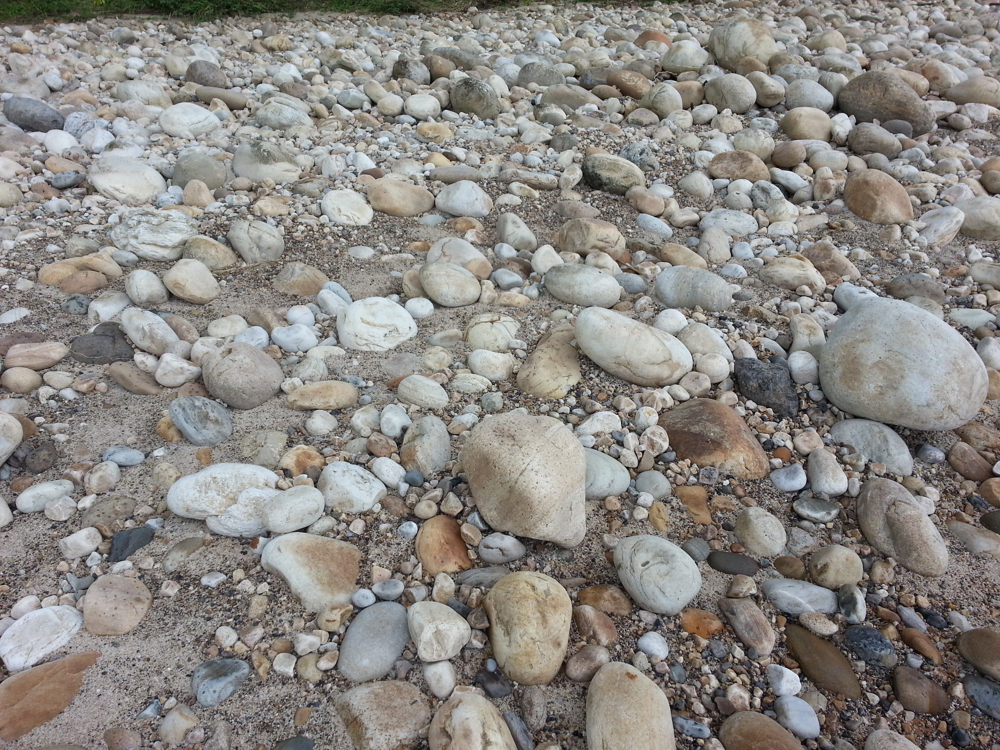

<br><details><summary>:camera:**54/IMG_20160814_153120.jpg**</summary><sub> `Exif version` 0220 `OS version` MOB30Z `Date` 2016:08:14 15:31:20 `Aperture` Not known `Brightness` 0.0 `Color space` 1 `Compression` 6`Exposure mode` 0 `Exposure time` 0.001037344398340249 `Focal length` 3.7 `Lens model` Not known `Lens specification` Not known `Orientation` 1 `Scene type` Not known `f number` 2.65 `White balance` 0 `Sensing method` Not known `Shutter speed` -9.91</sub></details>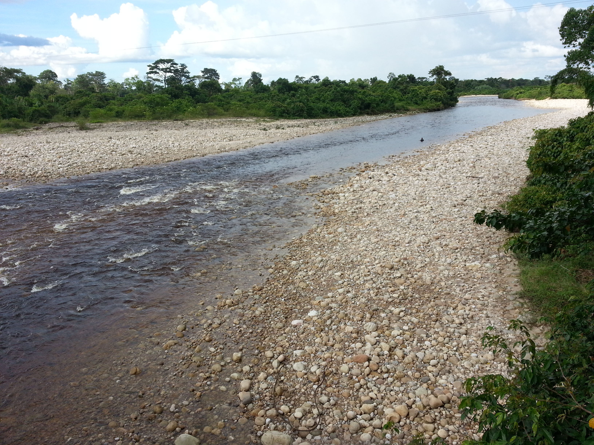

<br><details><summary>:camera:**54/IMG_20160814_153123.jpg**</summary><sub> `Exif version` 0220 `OS version` MOB30Z `Date` 2016:08:14 15:31:23 `Aperture` Not known `Brightness` 0.0 `Color space` 1 `Compression` 6`Exposure mode` 0 `Exposure time` 0.0008361204013377926 `Focal length` 3.7 `Lens model` Not known `Lens specification` Not known `Orientation` 1 `Scene type` Not known `f number` 2.65 `White balance` 0 `Sensing method` Not known `Shutter speed` -10.22</sub></details>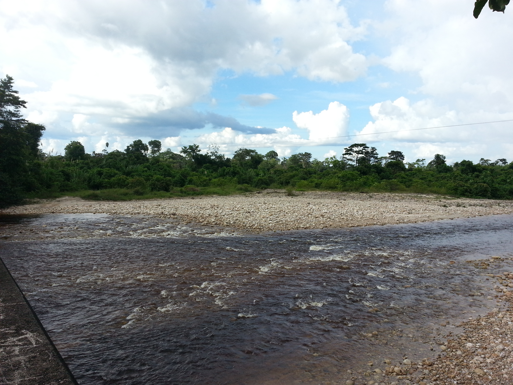

<br><details><summary>:camera:**54/IMG_20160814_153135.jpg**</summary><sub> `Exif version` 0220 `OS version` MOB30Z `Date` 2016:08:14 15:31:35 `Aperture` Not known `Brightness` 0.0 `Color space` 1 `Compression` 6`Exposure mode` 0 `Exposure time` 0.0015772870662460567 `Focal length` 3.7 `Lens model` Not known `Lens specification` Not known `Orientation` 1 `Scene type` Not known `f number` 2.65 `White balance` 0 `Sensing method` Not known `Shutter speed` -9.31</sub></details>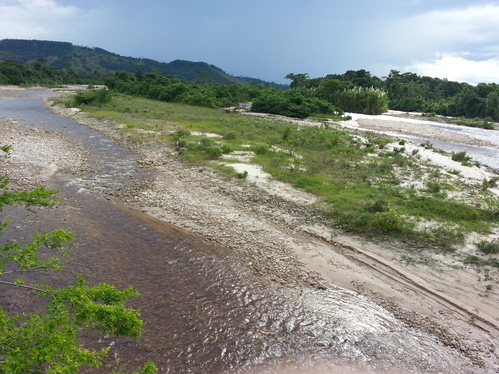

<br><details><summary>:camera:**54/IMG_20160814_153140.jpg**</summary><sub> `Exif version` 0220 `OS version` MOB30Z `Date` 2016:08:14 15:31:40 `Aperture` Not known `Brightness` 0.0 `Color space` 1 `Compression` 6`Exposure mode` 0 `Exposure time` 0.00101010101010101 `Focal length` 3.7 `Lens model` Not known `Lens specification` Not known `Orientation` 1 `Scene type` Not known `f number` 2.65 `White balance` 0 `Sensing method` Not known `Shutter speed` -9.95</sub></details>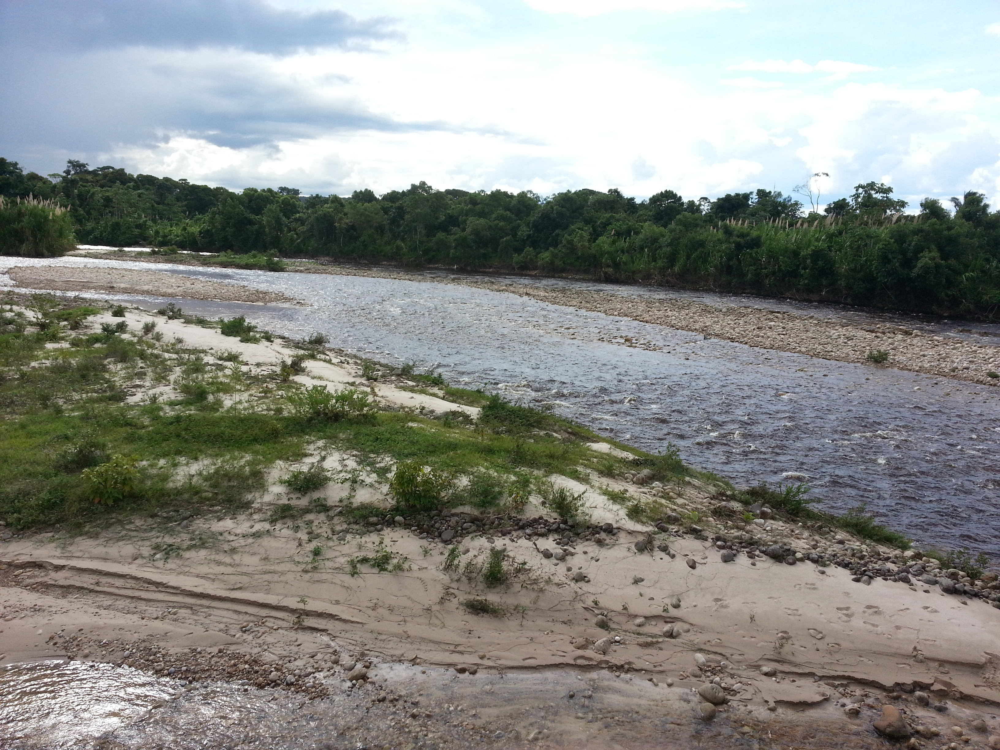

<br><details><summary>:camera:**54/IMG_20160814_153144.jpg**</summary><sub> `Exif version` 0220 `OS version` MOB30Z `Date` 2016:08:14 15:31:44 `Aperture` Not known `Brightness` 0.0 `Color space` 1 `Compression` 6`Exposure mode` 0 `Exposure time` 0.0009689922480620155 `Focal length` 3.7 `Lens model` Not known `Lens specification` Not known `Orientation` 1 `Scene type` Not known `f number` 2.65 `White balance` 0 `Sensing method` Not known `Shutter speed` -10.01</sub></details>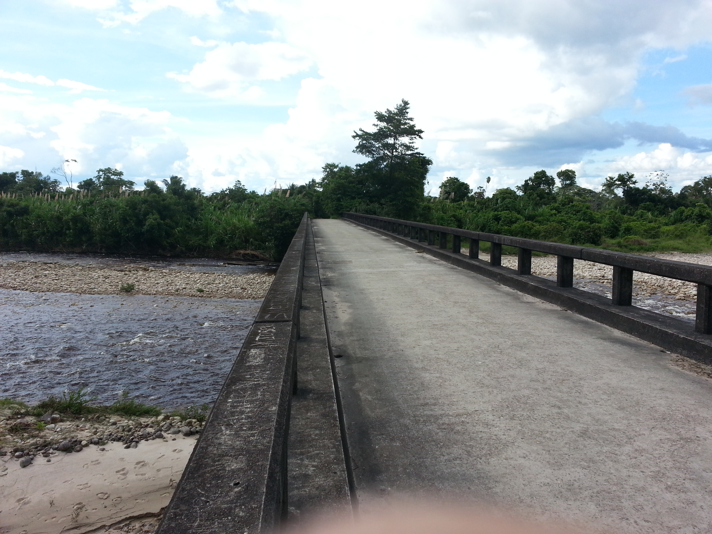

<br><details><summary>:camera:**54/IMG_20160815_052720.jpg**</summary><sub> `Exif version` 0220 `OS version` MOB30Z `Date` 2016:08:15 05:27:20 `Aperture` Not known `Brightness` 0.0 `Color space` 1 `Compression` 6`Exposure mode` 0 `Exposure time` 0.06666666666666667 `Focal length` 3.7 `Lens model` Not known `Lens specification` Not known `Orientation` 1 `Scene type` Not known `f number` 2.65 `White balance` 0 `Sensing method` Not known `Shutter speed` -3.91</sub></details>

<br><details><summary>:camera:**54/IMG_20160815_052808.jpg**</summary><sub> `Exif version` 0220 `OS version` MOB30Z `Date` 2016:08:15 05:28:08 `Aperture` Not known `Brightness` 0.0 `Color space` 1 `Compression` 6`Exposure mode` 0 `Exposure time` 0.03571428571428571 `Focal length` 3.7 `Lens model` Not known `Lens specification` Not known `Orientation` 1 `Scene type` Not known `f number` 2.65 `White balance` 0 `Sensing method` Not known `Shutter speed` -4.81</sub><sub>`Coordinates & altitude` (6.9245528, -71.8761984, 213.69)</sub><sub> :earth_americas:`Location over` [Google Maps](http://maps.google.com/maps?q=6.9245528,-71.8761984) or [Openstreet Map](https://www.openstreetmap.org/query?lat=6.9245528&lon=-71.8761984)</sub></details>

<br><details><summary>:camera:**54/IMG_20160815_052812.jpg**</summary><sub> `Exif version` 0220 `OS version` MOB30Z `Date` 2016:08:15 05:28:13 `Aperture` Not known `Brightness` 0.0 `Color space` 1 `Compression` 6`Exposure mode` 0 `Exposure time` 0.03333333333333333 `Focal length` 3.7 `Lens model` Not known `Lens specification` Not known `Orientation` 1 `Scene type` Not known `f number` 2.65 `White balance` 0 `Sensing method` Not known `Shutter speed` -4.91</sub><sub>`Coordinates & altitude` (6.9245528, -71.8761984, 232.4)</sub><sub> :earth_americas:`Location over` [Google Maps](http://maps.google.com/maps?q=6.9245528,-71.8761984) or [Openstreet Map](https://www.openstreetmap.org/query?lat=6.9245528&lon=-71.8761984)</sub></details>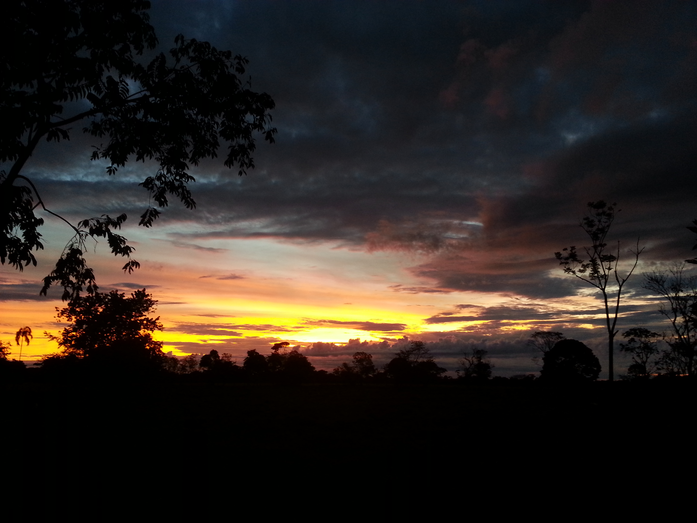

<br><details><summary>:camera:**54/IMG_20160815_053541.jpg**</summary><sub> `Exif version` 0220 `OS version` MOB30Z `Date` 2016:08:15 05:35:41 `Aperture` Not known `Brightness` 0.0 `Color space` 1 `Compression` 6`Exposure mode` 0 `Exposure time` 0.012987012987012988 `Focal length` 3.7 `Lens model` Not known `Lens specification` Not known `Orientation` 1 `Scene type` Not known `f number` 2.65 `White balance` 0 `Sensing method` Not known `Shutter speed` -6.27</sub><sub>`Coordinates & altitude` (6.9347192, -71.8820864, 241.18)</sub><sub> :earth_americas:`Location over` [Google Maps](http://maps.google.com/maps?q=6.9347192,-71.8820864) or [Openstreet Map](https://www.openstreetmap.org/query?lat=6.9347192&lon=-71.8820864)</sub></details>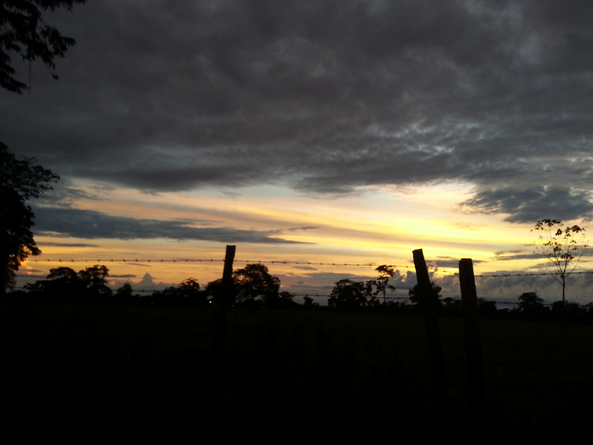

<br><details><summary>:camera:**54/IMG_20160815_053543.jpg**</summary><sub> `Exif version` 0220 `OS version` MOB30Z `Date` 2016:08:15 05:35:43 `Aperture` Not known `Brightness` 0.0 `Color space` 1 `Compression` 6`Exposure mode` 0 `Exposure time` 0.012987012987012988 `Focal length` 3.7 `Lens model` Not known `Lens specification` Not known `Orientation` 1 `Scene type` Not known `f number` 2.65 `White balance` 0 `Sensing method` Not known `Shutter speed` -6.27</sub><sub>`Coordinates & altitude` (6.9347192, -71.8820864, 241.18)</sub><sub> :earth_americas:`Location over` [Google Maps](http://maps.google.com/maps?q=6.9347192,-71.8820864) or [Openstreet Map](https://www.openstreetmap.org/query?lat=6.9347192&lon=-71.8820864)</sub></details>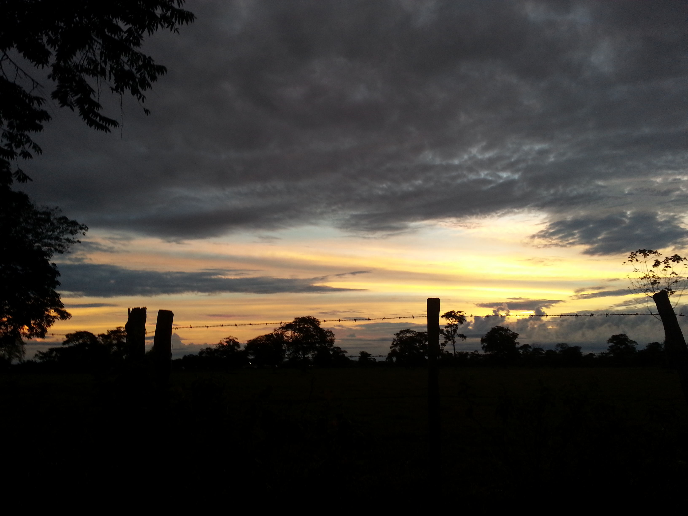

<br><details><summary>:camera:**54/IMG_20160815_121134.jpg**</summary><sub> `Exif version` 0220 `OS version` MOB30Z `Date` 2016:08:15 12:11:35 `Aperture` Not known `Brightness` 0.0 `Color space` 1 `Compression` 6`Exposure mode` 0 `Exposure time` 0.0048543689320388345 `Focal length` 3.7 `Lens model` Not known `Lens specification` Not known `Orientation` 1 `Scene type` Not known `f number` 2.65 `White balance` 0 `Sensing method` Not known `Shutter speed` -7.69</sub></details>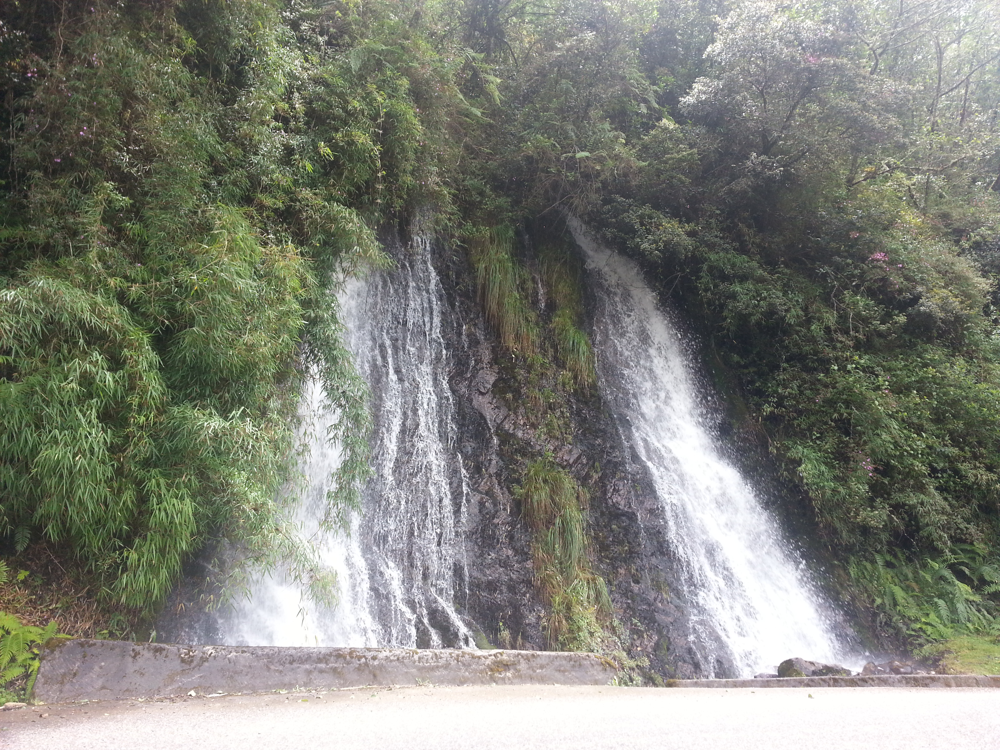

<sub>_Citation: Partial or total digital reproduction of this repository, scripts, development guides, data models, images, and documentation is permitted, provided that it is referenced as: "R.GISMobile - Mobile geographic information systems on QField that do not require an internet connection for navigation." https://github.com/rcfdtools/R.GISMobile - Bogotá - Colombia - South America"._<sub>

| [:house: Home](../Readme.md) |
|---|