<div align="center"></div>

## :earth_americas:POI: Sevilla, Valle, Colombia (2013-12-25)
`Pictures` rcfdtools <br>`Category` Freelance field visit <br>`Location` [Google Maps](http://maps.google.com/maps?q=4.264387,-75.934291) or [Openstreet Map](https://www.openstreetmap.org/query?lat=4.264387&lon=-75.934291) 

```geojson
{
  "type": "Feature",
  "geometry": {
    "type": "Point", 
    "coordinates": [-75.934291, 4.264387]
  }, 
  "properties": {
    "Name": "Sevilla, Valle, Colombia"
  }
}
```

<br><details><summary>:camera:**55/20131224_173809.jpg**</summary><sub> `Exif version` 0220 `OS version` N7000XXLS2 `Date` 2013:12:24 17:38:09 `Aperture` Not known `Brightness` 5.54 `Color space` 1 `Compression` 6`Exposure mode` 0 `Exposure time` 0.01 `Focal length` 3.97 `Lens model` Not known `Lens specification` Not known `Orientation` 1 `Scene type` Not known `f number` 2.65 `White balance` 0 `Sensing method` Not known `Shutter speed` 6.64</sub></details>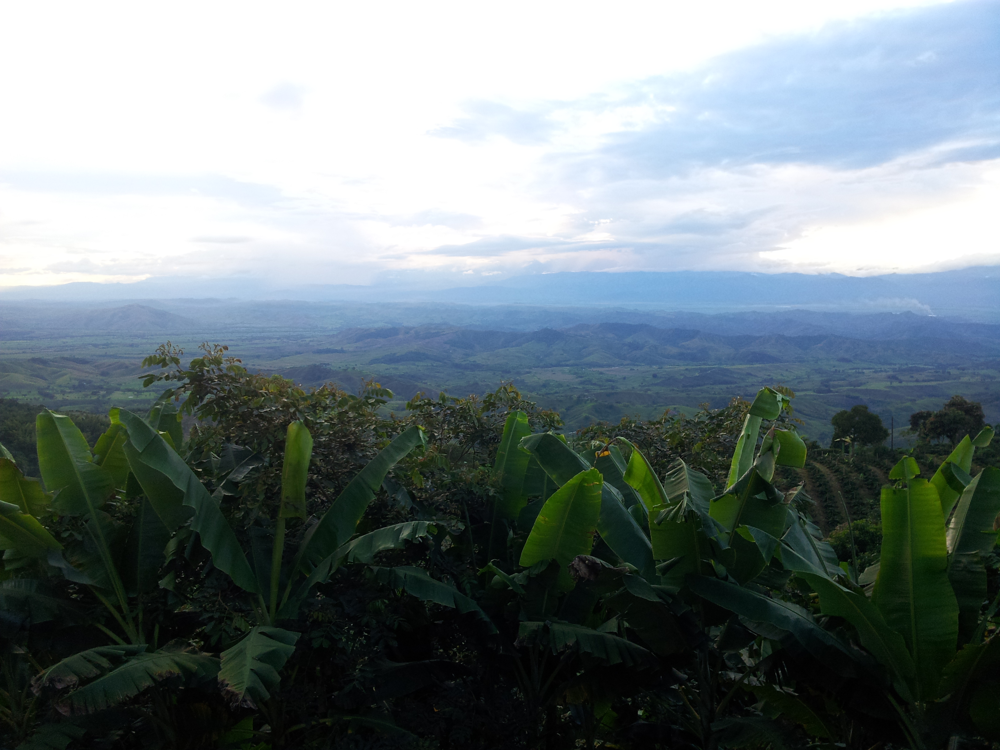

<br><details><summary>:camera:**55/20131224_173814.jpg**</summary><sub> `Exif version` 0220 `OS version` N7000XXLS2 `Date` 2013:12:24 17:38:14 `Aperture` Not known `Brightness` 5.05 `Color space` 1 `Compression` 6`Exposure mode` 0 `Exposure time` 0.02 `Focal length` 3.97 `Lens model` Not known `Lens specification` Not known `Orientation` 1 `Scene type` Not known `f number` 2.65 `White balance` 0 `Sensing method` Not known `Shutter speed` 5.64</sub></details>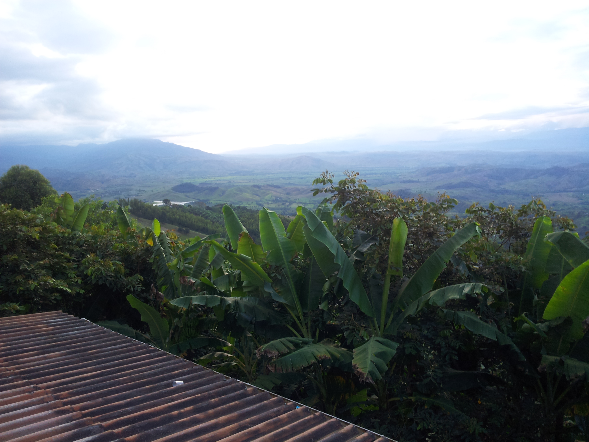

<br><details><summary>:camera:**55/20131224_173819.jpg**</summary><sub> `Exif version` 0220 `OS version` N7000XXLS2 `Date` 2013:12:24 17:38:19 `Aperture` Not known `Brightness` 5.6 `Color space` 1 `Compression` 6`Exposure mode` 0 `Exposure time` 0.01 `Focal length` 3.97 `Lens model` Not known `Lens specification` Not known `Orientation` 1 `Scene type` Not known `f number` 2.65 `White balance` 0 `Sensing method` Not known `Shutter speed` 6.64</sub></details>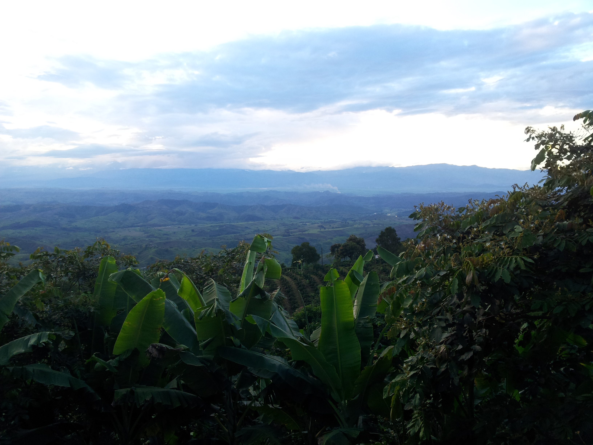

<br><details><summary>:camera:**55/20131225_065133.jpg**</summary><sub> `Exif version` 0220 `OS version` N7000XXLS2 `Date` 2013:12:25 06:51:33 `Aperture` Not known `Brightness` 5.74 `Color space` 1 `Compression` 6`Exposure mode` 0 `Exposure time` 0.01 `Focal length` 3.97 `Lens model` Not known `Lens specification` Not known `Orientation` 6 `Scene type` Not known `f number` 2.65 `White balance` 0 `Sensing method` Not known `Shutter speed` 6.64</sub></details>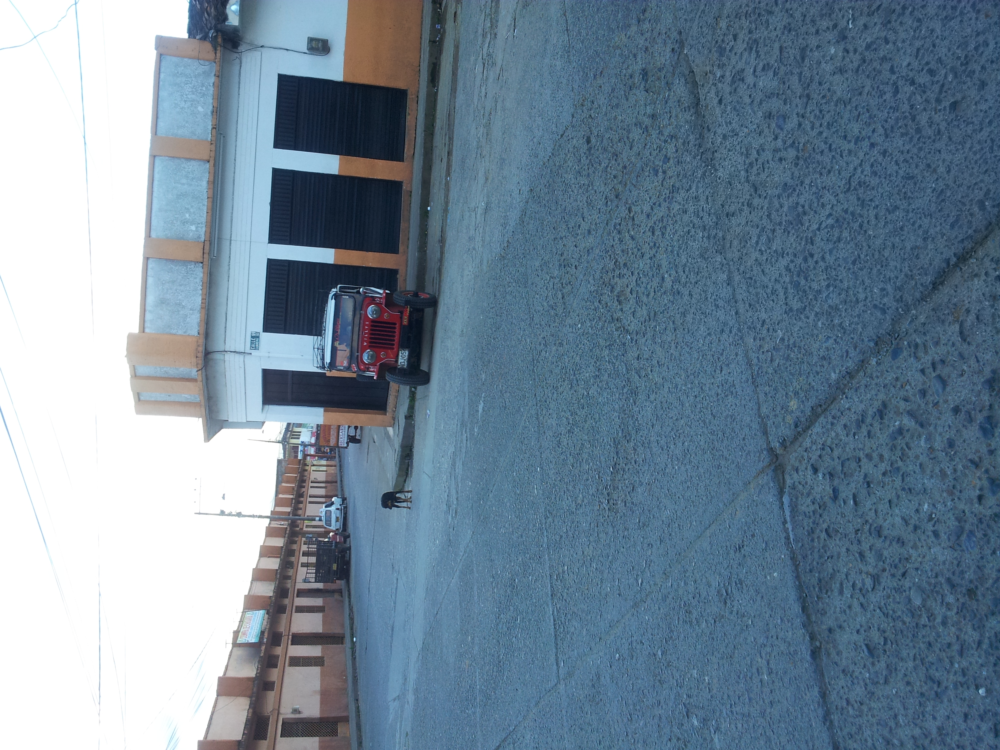

<br><details><summary>:camera:**55/20131225_065435.jpg**</summary><sub> `Exif version` 0220 `OS version` N7000XXLS2 `Date` 2013:12:25 06:54:35 `Aperture` Not known `Brightness` 8.3 `Color space` 1 `Compression` 6`Exposure mode` 0 `Exposure time` 0.002183406113537118 `Focal length` 3.97 `Lens model` Not known `Lens specification` Not known `Orientation` 1 `Scene type` Not known `f number` 2.65 `White balance` 0 `Sensing method` Not known `Shutter speed` 8.84</sub></details>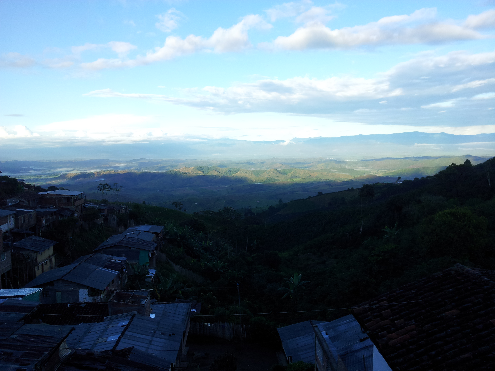

<br><details><summary>:camera:**55/20131225_065441.jpg**</summary><sub> `Exif version` 0220 `OS version` N7000XXLS2 `Date` 2013:12:25 06:54:41 `Aperture` Not known `Brightness` 8.57 `Color space` 1 `Compression` 6`Exposure mode` 0 `Exposure time` 0.0018083182640144665 `Focal length` 3.97 `Lens model` Not known `Lens specification` Not known `Orientation` 1 `Scene type` Not known `f number` 2.65 `White balance` 0 `Sensing method` Not known `Shutter speed` 9.11</sub></details>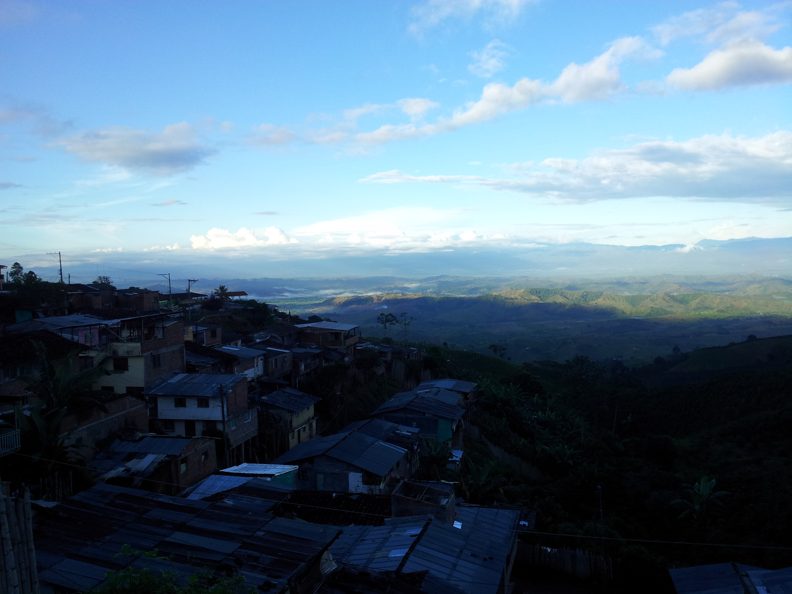

<br><details><summary>:camera:**55/20131225_070313.jpg**</summary><sub> `Exif version` 0220 `OS version` N7000XXLS2 `Date` 2013:12:25 07:03:12 `Aperture` Not known `Brightness` 9.14 `Color space` 1 `Compression` 6`Exposure mode` 0 `Exposure time` 0.0012106537530266344 `Focal length` 3.97 `Lens model` Not known `Lens specification` Not known `Orientation` 6 `Scene type` Not known `f number` 2.65 `White balance` 0 `Sensing method` Not known `Shutter speed` 9.69</sub></details>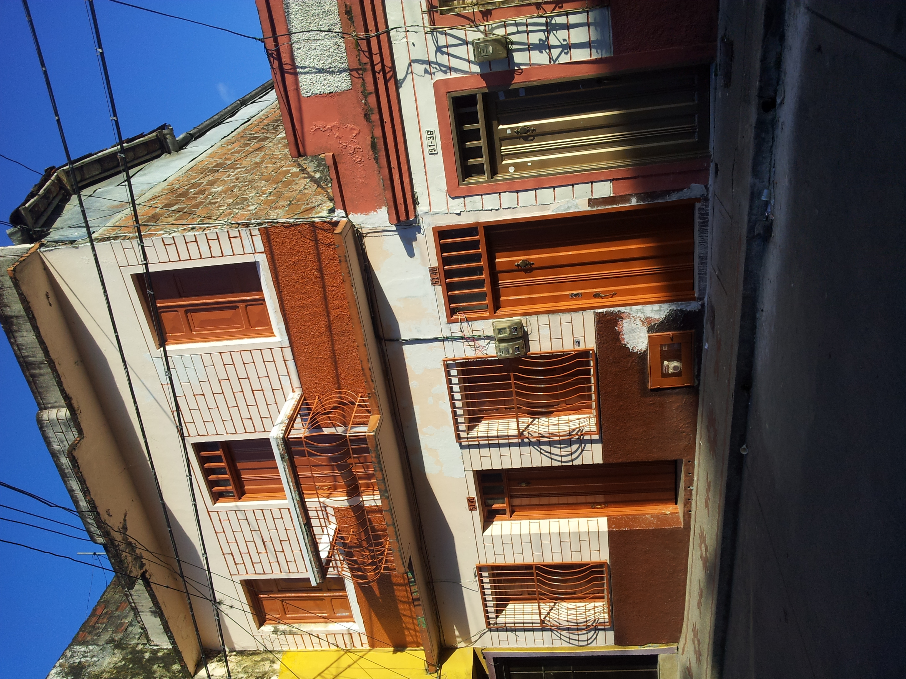

<br><details><summary>:camera:**55/20131225_070544.jpg**</summary><sub> `Exif version` 0220 `OS version` N7000XXLS2 `Date` 2013:12:25 07:05:44 `Aperture` Not known `Brightness` 7.7 `Color space` 1 `Compression` 6`Exposure mode` 0 `Exposure time` 0.0033112582781456954 `Focal length` 3.97 `Lens model` Not known `Lens specification` Not known `Orientation` 1 `Scene type` Not known `f number` 2.65 `White balance` 0 `Sensing method` Not known `Shutter speed` 8.24</sub></details>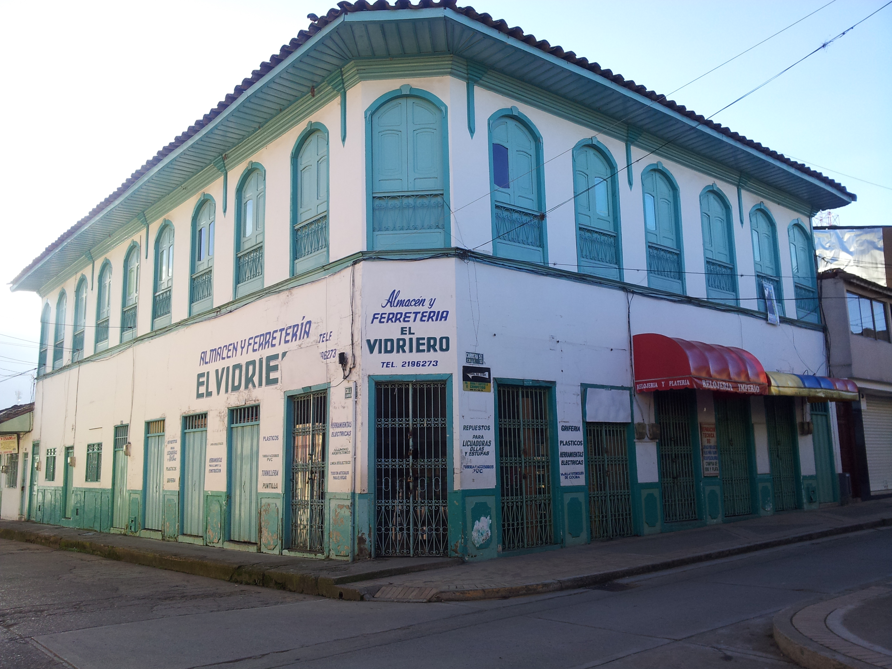

<br><details><summary>:camera:**55/20131225_070554.jpg**</summary><sub> `Exif version` 0220 `OS version` N7000XXLS2 `Date` 2013:12:25 07:05:54 `Aperture` Not known `Brightness` 9.88 `Color space` 1 `Compression` 6`Exposure mode` 0 `Exposure time` 0.00072992700729927 `Focal length` 3.97 `Lens model` Not known `Lens specification` Not known `Orientation` 1 `Scene type` Not known `f number` 2.65 `White balance` 0 `Sensing method` Not known `Shutter speed` 10.42</sub></details>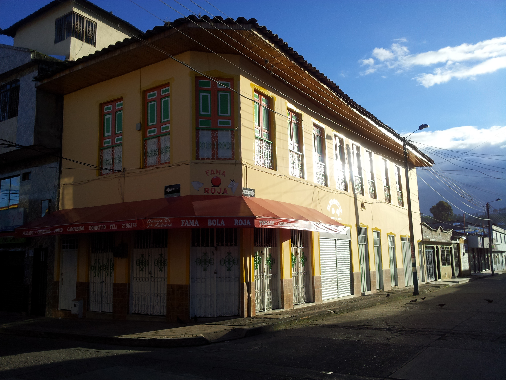

<br><details><summary>:camera:**55/20131225_070744.jpg**</summary><sub> `Exif version` 0220 `OS version` N7000XXLS2 `Date` 2013:12:25 07:07:44 `Aperture` Not known `Brightness` 6.54 `Color space` 1 `Compression` 6`Exposure mode` 0 `Exposure time` 0.007407407407407408 `Focal length` 3.97 `Lens model` Not known `Lens specification` Not known `Orientation` 1 `Scene type` Not known `f number` 2.65 `White balance` 0 `Sensing method` Not known `Shutter speed` 7.08</sub></details>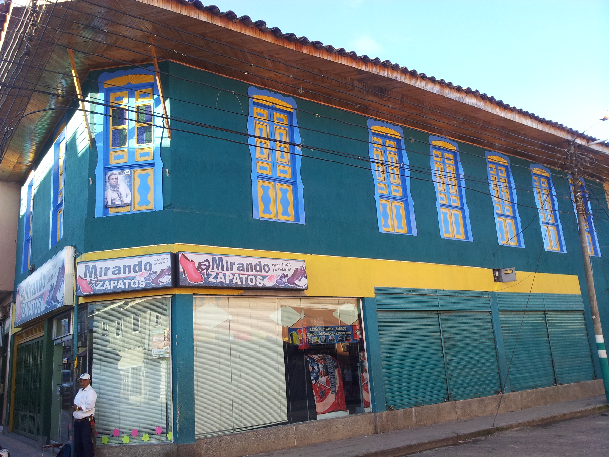

<br><details><summary>:camera:**55/20131225_070750.jpg**</summary><sub> `Exif version` 0220 `OS version` N7000XXLS2 `Date` 2013:12:25 07:07:49 `Aperture` Not known `Brightness` 7.77 `Color space` 1 `Compression` 6`Exposure mode` 0 `Exposure time` 0.0031545741324921135 `Focal length` 3.97 `Lens model` Not known `Lens specification` Not known `Orientation` 1 `Scene type` Not known `f number` 2.65 `White balance` 0 `Sensing method` Not known `Shutter speed` 8.31</sub></details>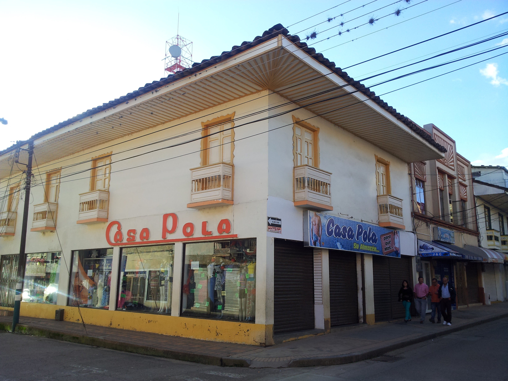

<sub>_Citation: Partial or total digital reproduction of this repository, scripts, development guides, data models, images, and documentation is permitted, provided that it is referenced as: "R.GISMobile - Mobile geographic information systems on QField that do not require an internet connection for navigation." https://github.com/rcfdtools/R.GISMobile - Bogotá - Colombia - South America"._<sub>

| [:house: Home](../Readme.md) |
|---|