<div align="center"></div>

## Bailey - Georgetown - Guanella road - Xcel Energy Cabin Creek - Clear Lake - Green Lake, Colorado, USA (2025-06-22)
`Pictures` rcfdtools <br>`Category` Freelance field visit <br>`Location` [Google Maps](http://maps.google.com/maps?q=38.899026,-107.108074) or [Openstreet Map](https://www.openstreetmap.org/query?lat=38.899026&lon=-107.108074) 

```geojson
{
  "type": "Feature",
  "geometry": {
    "type": "Point", 
    "coordinates": [-107.108074, 38.899026]
  }, 
  "properties": {
    "Name": "Bailey - Georgetown - Guanella road - Xcel Energy Cabin Creek - Clear Lake - Green Lake, Colorado, USA"
  }
}
```

<br><details><summary>:camera:**56/IMG_0300.jpg**</summary><sub> `Exif version` 0232 `OS version` 18.5 `Date` 2025:06:14 14:40:47 `Aperture` Not known `Brightness` 10.907740795568502 `Color space` 65535 `Compression` Not known`Exposure mode` 0 `Exposure time` 0.00011299435028248587 `Focal length` 5.960000038146973 `Lens model` iPhone 16 Plus back dual wide camera 5.96mm f/1.6 `Lens specification` (2.220000028611935, 5.960000038146973, 1.6, 2.2) `Orientation` 1 `Scene type` Not known `f number` 1.6 `White balance` 0 `Sensing method` 2 `Shutter speed` 13.111389612993785</sub><sub>`Coordinates & altitude` (39.59449444444445, -105.711425, 3558.7085828343315)</sub><sub> :globe_with_meridians:`Location over` [Google Maps](http://maps.google.com/maps?q=39.59449444444445,-105.711425) or [Openstreet Map](https://www.openstreetmap.org/query?lat=39.59449444444445&lon=-105.711425)</sub></details>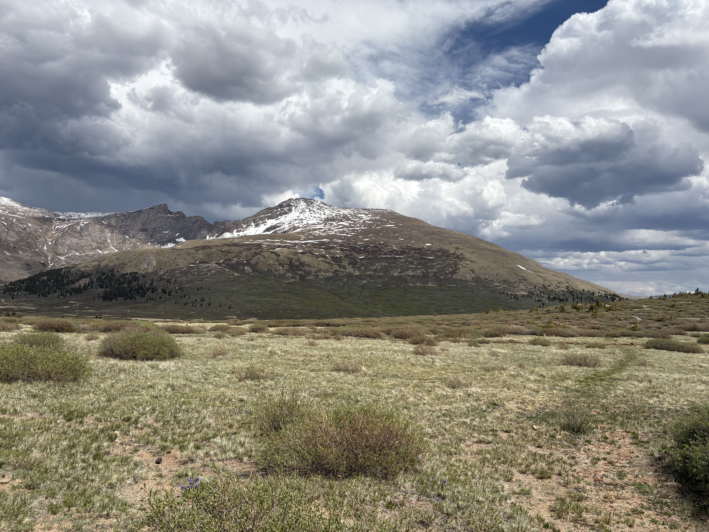

<br><details><summary>:camera:**56/IMG_0301.jpg**</summary><sub> `Exif version` 0232 `OS version` 18.5 `Date` 2025:06:14 14:40:57 `Aperture` Not known `Brightness` 11.194368625197528 `Color space` 65535 `Compression` Not known`Exposure mode` 0 `Exposure time` 0.00018698578908002991 `Focal length` 5.960000038146973 `Lens model` iPhone 16 Plus back dual wide camera 5.96mm f/1.6 `Lens specification` (2.220000028611935, 5.960000038146973, 1.6, 2.2) `Orientation` 1 `Scene type` Not known `f number` 1.6 `White balance` 0 `Sensing method` 2 `Shutter speed` 12.384674110125012</sub><sub>`Coordinates & altitude` (39.594458333333336, -105.7113638888889, 3552.769129287599)</sub><sub> :globe_with_meridians:`Location over` [Google Maps](http://maps.google.com/maps?q=39.594458333333336,-105.7113638888889) or [Openstreet Map](https://www.openstreetmap.org/query?lat=39.594458333333336&lon=-105.7113638888889)</sub></details>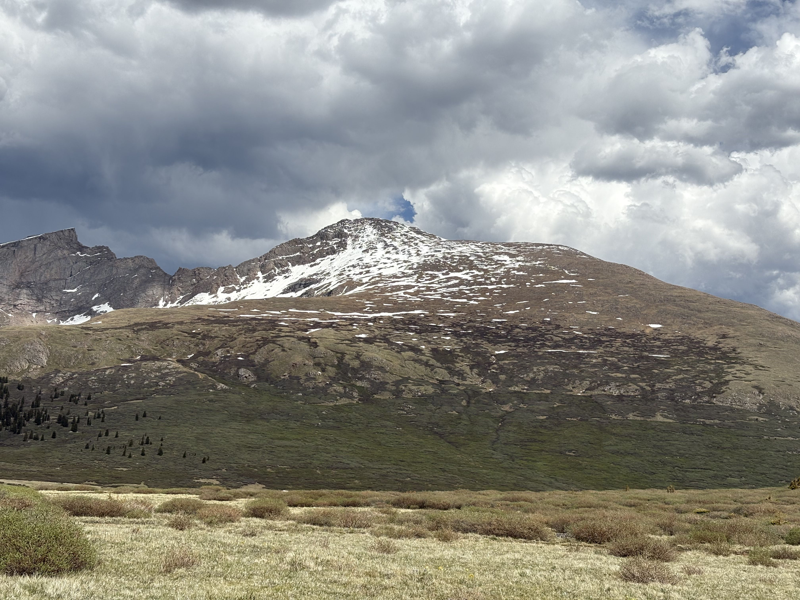

<br><details><summary>:camera:**56/IMG_0302.jpg**</summary><sub> `Exif version` 0232 `OS version` 18.5 `Date` 2025:06:14 14:41:05 `Aperture` Not known `Brightness` 11.094826343853581 `Color space` 65535 `Compression` Not known`Exposure mode` 0 `Exposure time` 0.00011299435028248587 `Focal length` 5.960000038146973 `Lens model` iPhone 16 Plus back dual wide camera 5.96mm f/1.6 `Lens specification` (2.220000028611935, 5.960000038146973, 1.6, 2.2) `Orientation` 6 `Scene type` Not known `f number` 1.6 `White balance` 0 `Sensing method` 2 `Shutter speed` 13.111389612993785</sub><sub>`Coordinates & altitude` (39.59446388888889, -105.7113638888889, 3553.063807531381)</sub><sub> :globe_with_meridians:`Location over` [Google Maps](http://maps.google.com/maps?q=39.59446388888889,-105.7113638888889) or [Openstreet Map](https://www.openstreetmap.org/query?lat=39.59446388888889&lon=-105.7113638888889)</sub></details>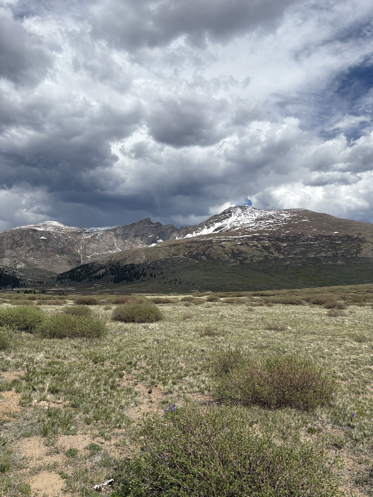

<br><details><summary>:camera:**56/IMG_0303.jpg**</summary><sub> `Exif version` 0232 `OS version` 18.5 `Date` 2025:06:14 14:41:10 `Aperture` Not known `Brightness` 11.09765710532078 `Color space` 65535 `Compression` Not known`Exposure mode` 0 `Exposure time` 0.00011299435028248587 `Focal length` 5.960000038146973 `Lens model` iPhone 16 Plus back dual wide camera 5.96mm f/1.6 `Lens specification` (2.220000028611935, 5.960000038146973, 1.6, 2.2) `Orientation` 6 `Scene type` Not known `f number` 1.6 `White balance` 0 `Sensing method` 2 `Shutter speed` 13.111389612993785</sub><sub>`Coordinates & altitude` (39.59446388888889, -105.71137222222222, 3552.9017013232515)</sub><sub> :globe_with_meridians:`Location over` [Google Maps](http://maps.google.com/maps?q=39.59446388888889,-105.71137222222222) or [Openstreet Map](https://www.openstreetmap.org/query?lat=39.59446388888889&lon=-105.71137222222222)</sub></details>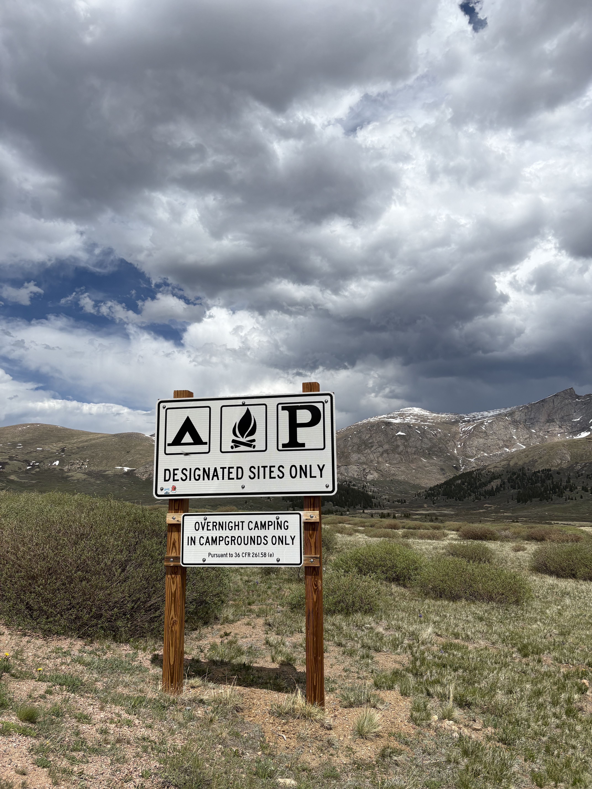

<br><details><summary>:camera:**56/IMG_0304.jpg**</summary><sub> `Exif version` 0232 `OS version` 18.5 `Date` 2025:06:14 14:41:13 `Aperture` Not known `Brightness` 10.618629954479848 `Color space` 65535 `Compression` Not known`Exposure mode` 0 `Exposure time` 0.00015800284405119292 `Focal length` 5.960000038146973 `Lens model` iPhone 16 Plus back dual wide camera 5.96mm f/1.6 `Lens specification` (2.220000028611935, 5.960000038146973, 1.6, 2.2) `Orientation` 1 `Scene type` Not known `f number` 1.6 `White balance` 0 `Sensing method` 2 `Shutter speed` 12.627787823990356</sub><sub>`Coordinates & altitude` (39.59446388888889, -105.71138055555556, 3553.331632653061)</sub><sub> :globe_with_meridians:`Location over` [Google Maps](http://maps.google.com/maps?q=39.59446388888889,-105.71138055555556) or [Openstreet Map](https://www.openstreetmap.org/query?lat=39.59446388888889&lon=-105.71138055555556)</sub></details>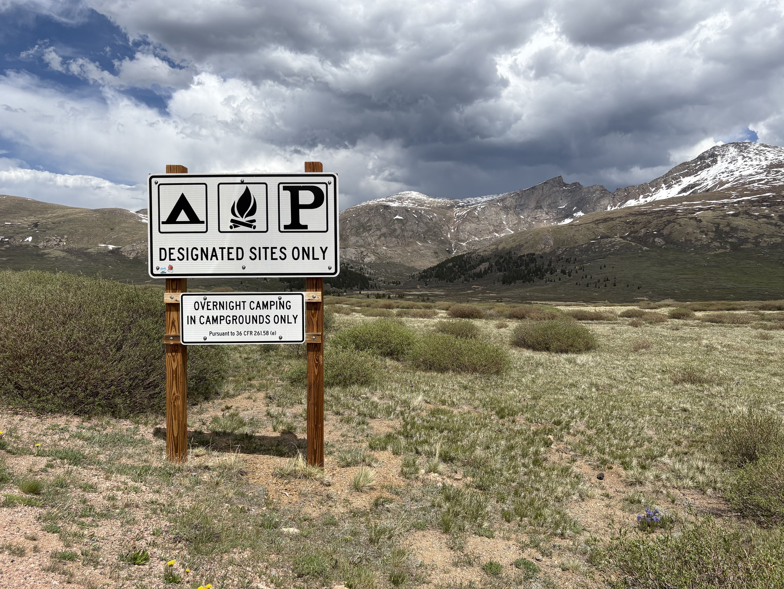

<br><details><summary>:camera:**56/IMG_0305.jpg**</summary><sub> `Exif version` 0232 `OS version` 18.5 `Date` 2025:06:14 14:41:28 `Aperture` Not known `Brightness` 10.869647859143658 `Color space` 65535 `Compression` Not known`Exposure mode` Not known `Exposure time` 0.00012799180852425445 `Focal length` 5.960000038146973 `Lens model` iPhone 16 Plus back camera 5.96mm f/1.6 `Lens specification` (5.960000038146973, 5.960000038146973, 1.6, 1.6) `Orientation` 1 `Scene type` Not known `f number` 1.6 `White balance` 0 `Sensing method` 2 `Shutter speed` 12.931568572233173</sub><sub>`Coordinates & altitude` (39.59447777777778, -105.71139444444445, 3555.154945054945)</sub><sub> :globe_with_meridians:`Location over` [Google Maps](http://maps.google.com/maps?q=39.59447777777778,-105.71139444444445) or [Openstreet Map](https://www.openstreetmap.org/query?lat=39.59447777777778&lon=-105.71139444444445)</sub></details>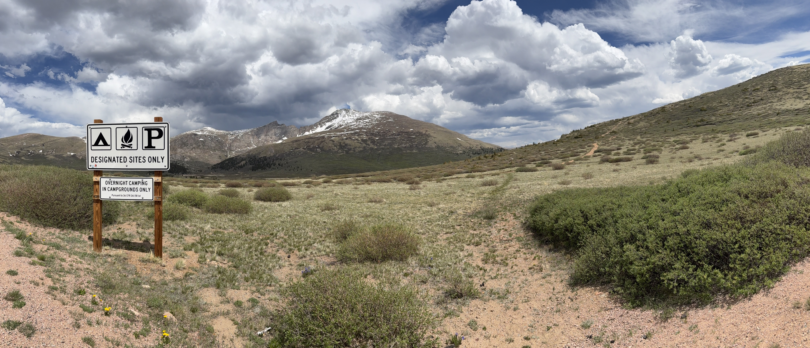

<br><details><summary>:camera:**56/IMG_0306.jpg**</summary><sub> `Exif version` 0232 `OS version` 18.5 `Date` 2025:06:14 14:43:43 `Aperture` Not known `Brightness` 11.150605871330418 `Color space` 65535 `Compression` Not known`Exposure mode` 0 `Exposure time` 9.9000099000099e-05 `Focal length` 5.960000038146973 `Lens model` iPhone 16 Plus back dual wide camera 5.96mm f/1.6 `Lens specification` (2.220000028611935, 5.960000038146973, 1.6, 2.2) `Orientation` 1 `Scene type` Not known `f number` 1.6 `White balance` 0 `Sensing method` 2 `Shutter speed` 13.30221195113899</sub><sub>`Coordinates & altitude` (39.598125, -105.71015277777778, 3465.142180094787)</sub><sub> :globe_with_meridians:`Location over` [Google Maps](http://maps.google.com/maps?q=39.598125,-105.71015277777778) or [Openstreet Map](https://www.openstreetmap.org/query?lat=39.598125&lon=-105.71015277777778)</sub></details>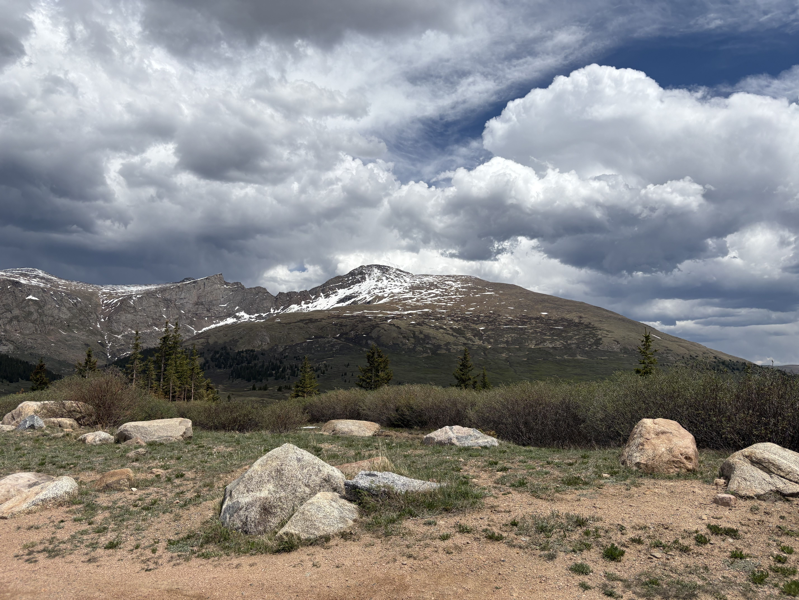

<br><details><summary>:camera:**56/IMG_0307.jpg**</summary><sub> `Exif version` 0232 `OS version` 18.5 `Date` 2025:06:14 14:43:48 `Aperture` Not known `Brightness` 10.879543904102913 `Color space` 65535 `Compression` Not known`Exposure mode` 0 `Exposure time` 0.00011299435028248587 `Focal length` 5.960000038146973 `Lens model` iPhone 16 Plus back dual wide camera 5.96mm f/1.6 `Lens specification` (2.220000028611935, 5.960000038146973, 1.6, 2.2) `Orientation` 1 `Scene type` Not known `f number` 1.6 `White balance` 0 `Sensing method` 2 `Shutter speed` 13.111389612993785</sub><sub>`Coordinates & altitude` (39.598275, -105.70919166666667, 3527.1597542242703)</sub><sub> :globe_with_meridians:`Location over` [Google Maps](http://maps.google.com/maps?q=39.598275,-105.70919166666667) or [Openstreet Map](https://www.openstreetmap.org/query?lat=39.598275&lon=-105.70919166666667)</sub></details>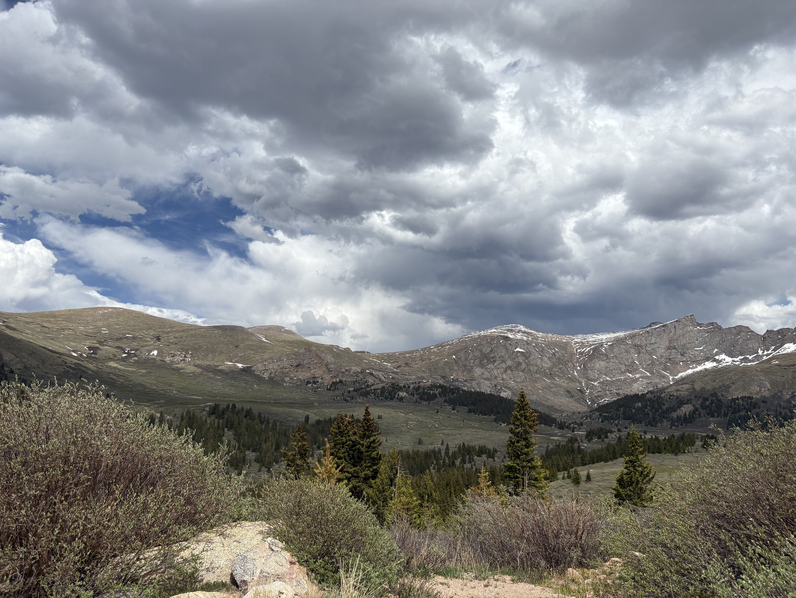

<br><details><summary>:camera:**56/IMG_0309.jpg**</summary><sub> `Exif version` 0232 `OS version` 18.5 `Date` 2025:06:14 14:46:34 `Aperture` Not known `Brightness` 10.245554158433627 `Color space` 65535 `Compression` Not known`Exposure mode` 0 `Exposure time` 0.00015800284405119292 `Focal length` 5.960000038146973 `Lens model` iPhone 16 Plus back dual wide camera 5.96mm f/1.6 `Lens specification` (2.220000028611935, 5.960000038146973, 1.6, 2.2) `Orientation` 1 `Scene type` Not known `f number` 1.6 `White balance` 0 `Sensing method` 2 `Shutter speed` 12.627787823990356</sub><sub>`Coordinates & altitude` (39.60559722222222, -105.71311111111112, 3400.2105369807496)</sub><sub> :globe_with_meridians:`Location over` [Google Maps](http://maps.google.com/maps?q=39.60559722222222,-105.71311111111112) or [Openstreet Map](https://www.openstreetmap.org/query?lat=39.60559722222222&lon=-105.71311111111112)</sub></details>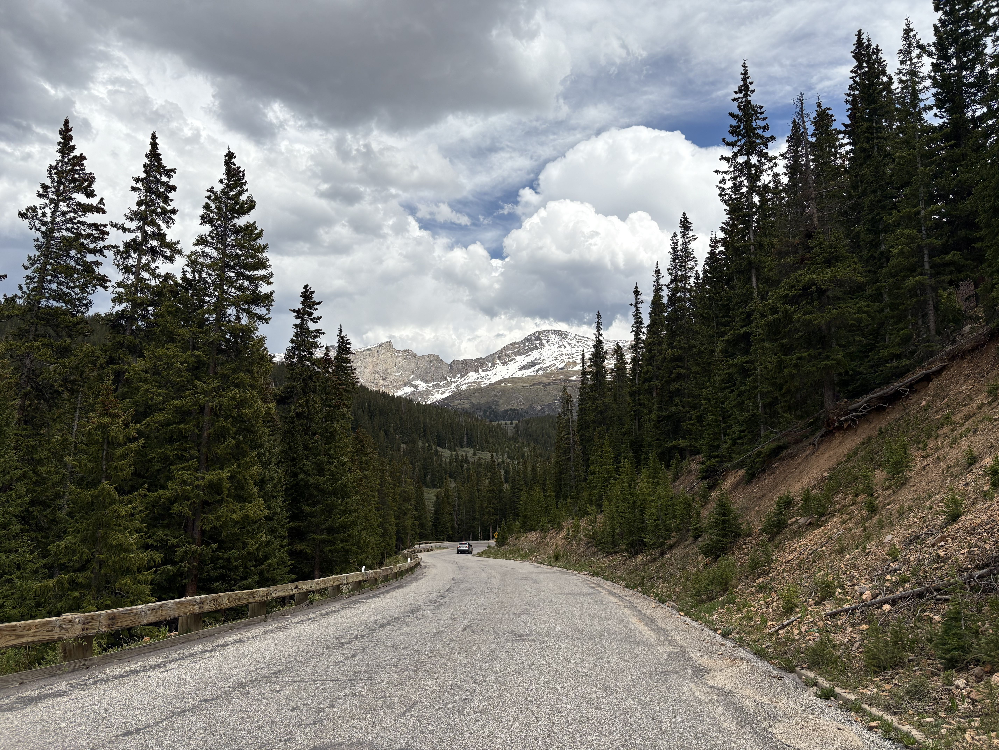

<br><details><summary>:camera:**56/IMG_0310.jpg**</summary><sub> `Exif version` 0232 `OS version` 18.5 `Date` 2025:06:14 14:46:40 `Aperture` Not known `Brightness` 11.429465234328887 `Color space` 65535 `Compression` Not known`Exposure mode` 0 `Exposure time` 8.399832003359933e-05 `Focal length` 5.960000038146973 `Lens model` iPhone 16 Plus back dual wide camera 5.96mm f/1.6 `Lens specification` (2.220000028611935, 5.960000038146973, 1.6, 2.2) `Orientation` 6 `Scene type` Not known `f number` 1.6 `White balance` 0 `Sensing method` 2 `Shutter speed` 13.539251137291497</sub><sub>`Coordinates & altitude` (39.605583333333335, -105.71310555555556, 3400.421965317919)</sub><sub> :globe_with_meridians:`Location over` [Google Maps](http://maps.google.com/maps?q=39.605583333333335,-105.71310555555556) or [Openstreet Map](https://www.openstreetmap.org/query?lat=39.605583333333335&lon=-105.71310555555556)</sub></details>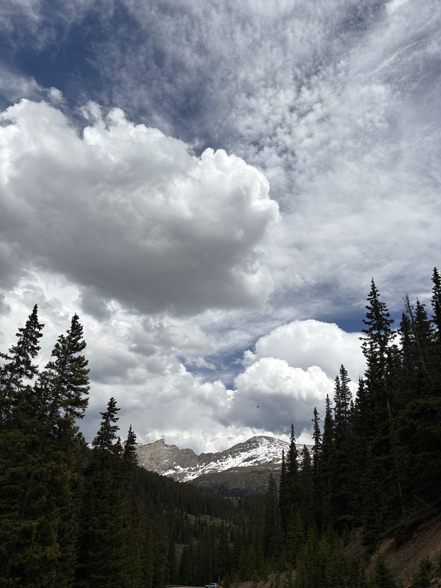

<br><details><summary>:camera:**56/IMG_0311.jpg**</summary><sub> `Exif version` 0232 `OS version` 18.5 `Date` 2025:06:14 14:48:02 `Aperture` Not known `Brightness` 10.534896501190694 `Color space` 65535 `Compression` Not known`Exposure mode` 0 `Exposure time` 0.00015800284405119292 `Focal length` 5.960000038146973 `Lens model` iPhone 16 Plus back dual wide camera 5.96mm f/1.6 `Lens specification` (2.220000028611935, 5.960000038146973, 1.6, 2.2) `Orientation` 6 `Scene type` Not known `f number` 1.6 `White balance` 0 `Sensing method` 2 `Shutter speed` 12.627787823990356</sub><sub>`Coordinates & altitude` (39.60924444444444, -105.71470000000001, 3337.602380952381)</sub><sub> :globe_with_meridians:`Location over` [Google Maps](http://maps.google.com/maps?q=39.60924444444444,-105.71470000000001) or [Openstreet Map](https://www.openstreetmap.org/query?lat=39.60924444444444&lon=-105.71470000000001)</sub></details>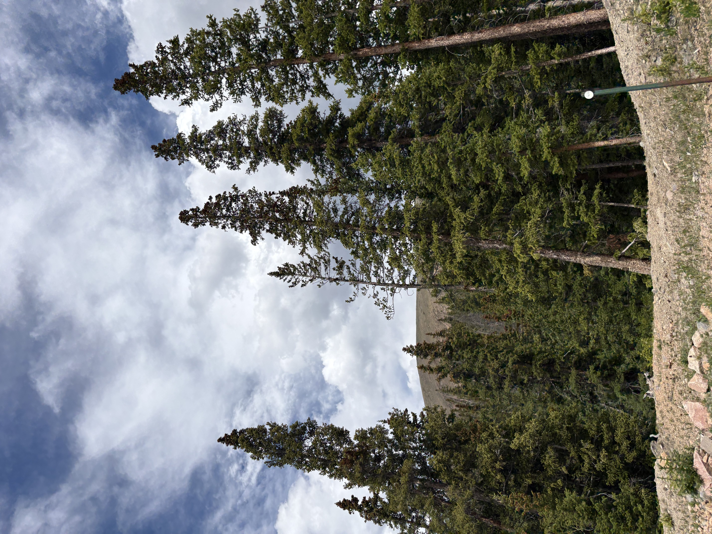

<br><details><summary>:camera:**56/IMG_0312.jpg**</summary><sub> `Exif version` 0232 `OS version` 18.5 `Date` 2025:06:14 14:48:09 `Aperture` Not known `Brightness` 10.29280462184874 `Color space` 65535 `Compression` Not known`Exposure mode` 0 `Exposure time` 0.0001719986240110079 `Focal length` 5.960000038146973 `Lens model` iPhone 16 Plus back dual wide camera 5.96mm f/1.6 `Lens specification` (2.220000028611935, 5.960000038146973, 1.6, 2.2) `Orientation` 1 `Scene type` Not known `f number` 1.6 `White balance` 0 `Sensing method` 2 `Shutter speed` 12.505303816441831</sub><sub>`Coordinates & altitude` (39.609547222222226, -105.71527222222223, 3327.048426150121)</sub><sub> :globe_with_meridians:`Location over` [Google Maps](http://maps.google.com/maps?q=39.609547222222226,-105.71527222222223) or [Openstreet Map](https://www.openstreetmap.org/query?lat=39.609547222222226&lon=-105.71527222222223)</sub></details>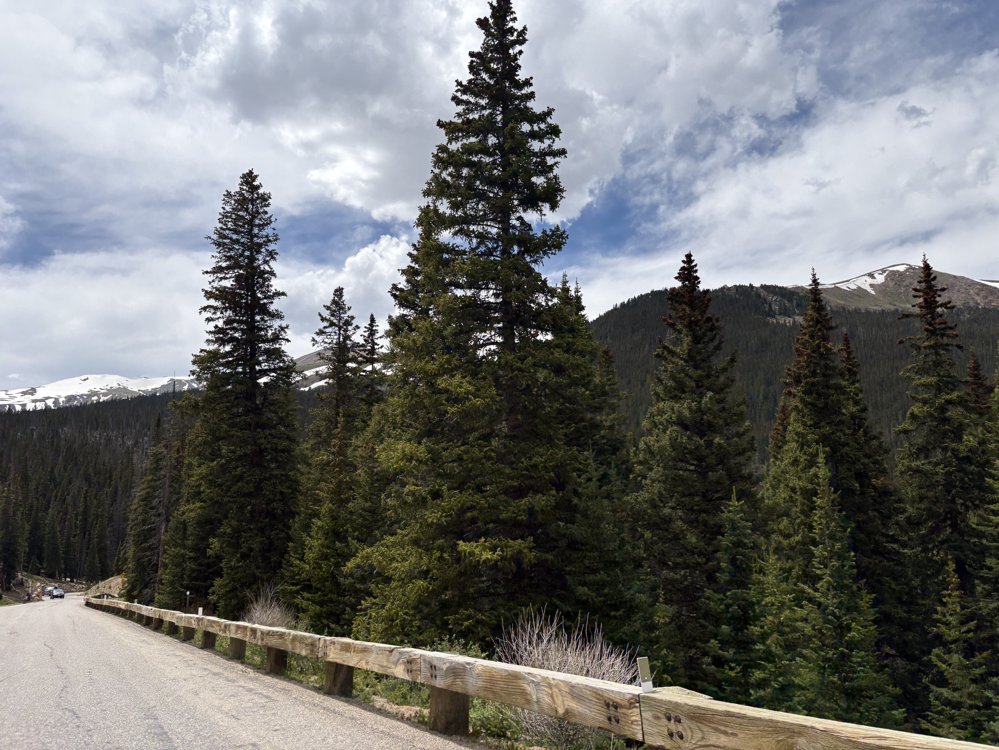

<br><details><summary>:camera:**56/IMG_0324.jpg**</summary><sub> `Exif version` 0232 `OS version` 18.5 `Date` 2025:06:14 14:57:04 `Aperture` Not known `Brightness` 10.593299869052816 `Color space` 65535 `Compression` Not known`Exposure mode` Not known `Exposure time` 0.000143000143000143 `Focal length` 5.960000038146973 `Lens model` iPhone 16 Plus back camera 5.96mm f/1.6 `Lens specification` (5.960000038146973, 5.960000038146973, 1.6, 1.6) `Orientation` 1 `Scene type` Not known `f number` 1.6 `White balance` 0 `Sensing method` 2 `Shutter speed` 12.771697240635117</sub><sub>`Coordinates & altitude` (39.65655833333333, -105.70813055555556, 3060.1685761047465)</sub><sub> :globe_with_meridians:`Location over` [Google Maps](http://maps.google.com/maps?q=39.65655833333333,-105.70813055555556) or [Openstreet Map](https://www.openstreetmap.org/query?lat=39.65655833333333&lon=-105.70813055555556)</sub></details>

<br><details><summary>:camera:**56/IMG_0325.jpg**</summary><sub> `Exif version` 0232 `OS version` 18.5 `Date` 2025:06:14 14:57:37 `Aperture` Not known `Brightness` 8.588205813564985 `Color space` 65535 `Compression` Not known`Exposure mode` 0 `Exposure time` 0.0009276437847866419 `Focal length` 2.220000028611935 `Lens model` iPhone 16 Plus back dual wide camera 2.22mm f/2.2 `Lens specification` (2.220000028611935, 2.220000028611935, 2.2, 2.2) `Orientation` 1 `Scene type` Not known `f number` 2.2 `White balance` 0 `Sensing method` 2 `Shutter speed` 10.073587570621468</sub></details>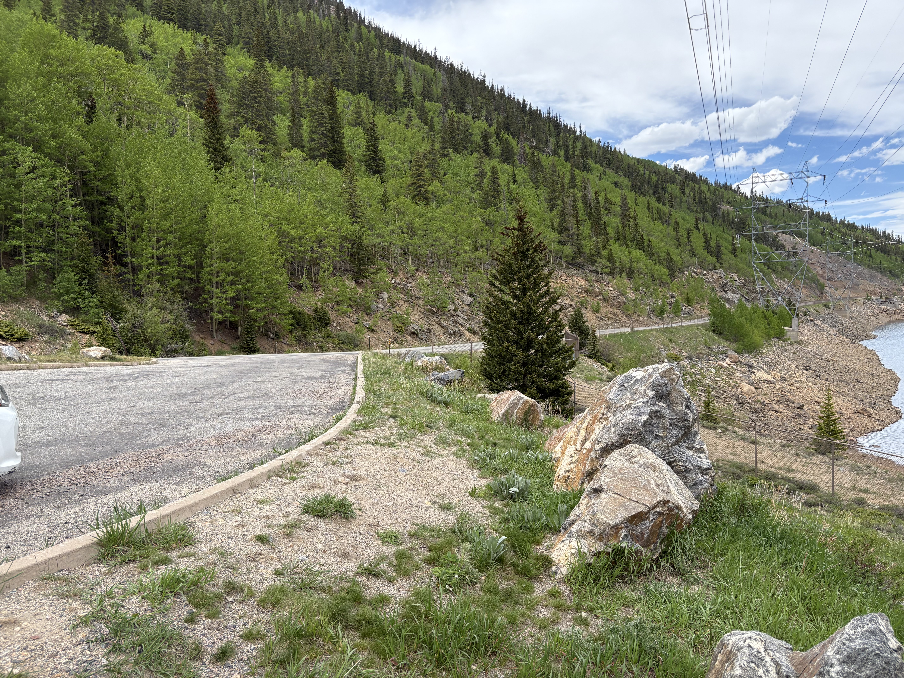

<br><details><summary>:camera:**56/IMG_0326.jpg**</summary><sub> `Exif version` 0232 `OS version` 18.5 `Date` 2025:06:14 14:57:53 `Aperture` Not known `Brightness` 8.38926278332173 `Color space` 65535 `Compression` Not known`Exposure mode` 0 `Exposure time` 0.0010070493454179255 `Focal length` 2.220000028611935 `Lens model` iPhone 16 Plus back dual wide camera 2.22mm f/2.2 `Lens specification` (2.220000028611935, 2.220000028611935, 2.2, 2.2) `Orientation` 1 `Scene type` Not known `f number` 2.2 `White balance` 0 `Sensing method` 2 `Shutter speed` 9.955720597912945</sub></details>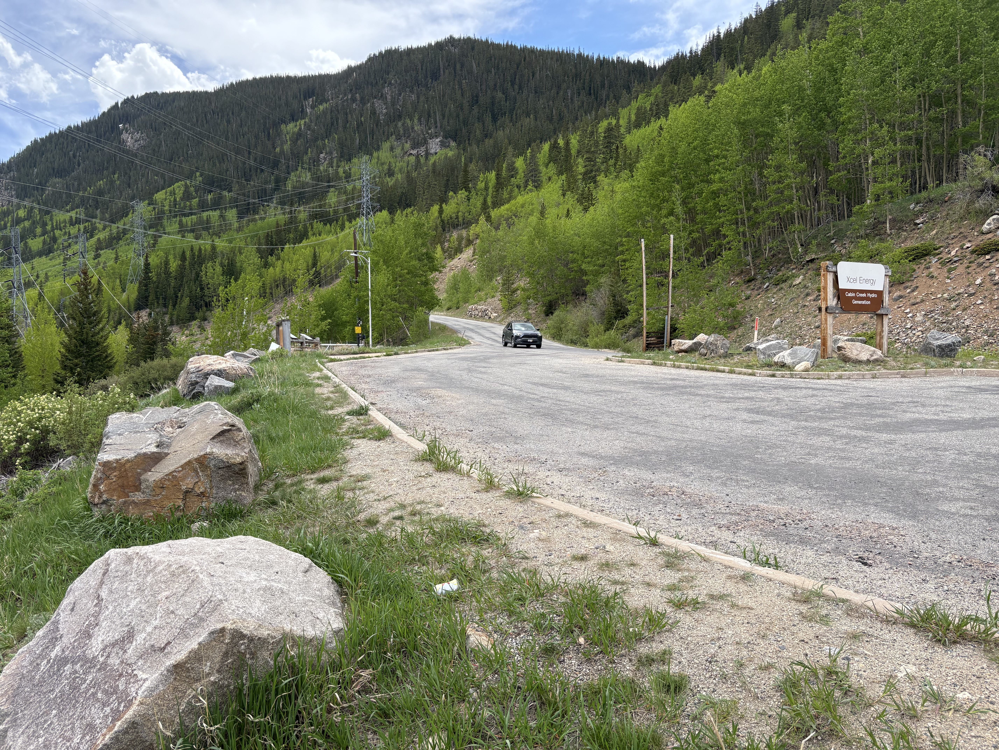

<br><details><summary>:camera:**56/IMG_0327.jpg**</summary><sub> `Exif version` 0232 `OS version` 18.5 `Date` 2025:06:14 14:58:35 `Aperture` Not known `Brightness` 8.571149200506154 `Color space` 65535 `Compression` Not known`Exposure mode` 0 `Exposure time` 0.0004528985507246377 `Focal length` 5.960000038146973 `Lens model` iPhone 16 Plus back dual wide camera 5.96mm f/1.6 `Lens specification` (2.220000028611935, 5.960000038146973, 1.6, 2.2) `Orientation` 1 `Scene type` Not known `f number` 1.6 `White balance` 0 `Sensing method` 2 `Shutter speed` 11.108201328564128</sub><sub>`Coordinates & altitude` (39.65646388888889, -105.70824444444445, 3060.3450586264657)</sub><sub> :globe_with_meridians:`Location over` [Google Maps](http://maps.google.com/maps?q=39.65646388888889,-105.70824444444445) or [Openstreet Map](https://www.openstreetmap.org/query?lat=39.65646388888889&lon=-105.70824444444445)</sub></details>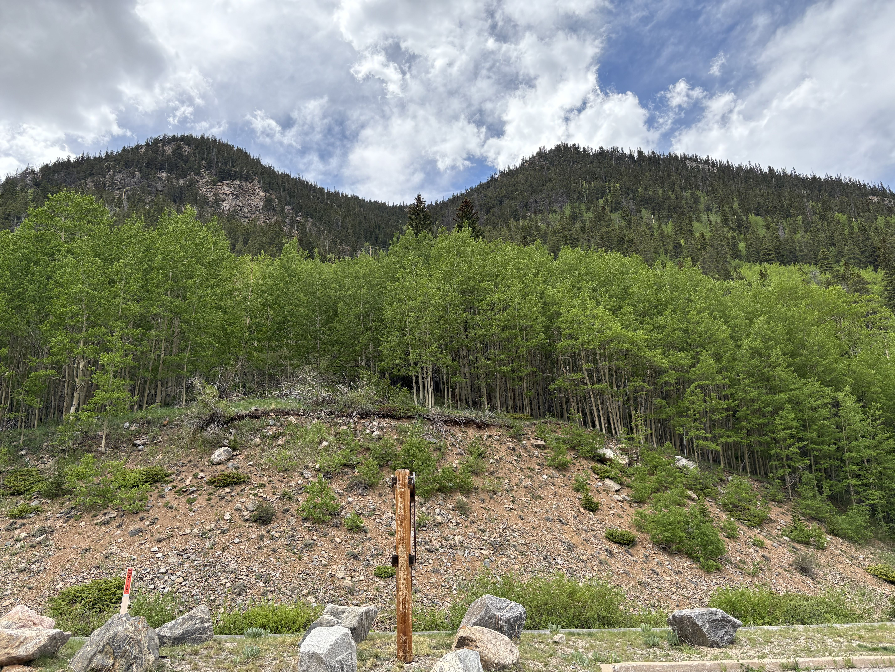

<br><details><summary>:camera:**56/IMG_0328.jpg**</summary><sub> `Exif version` 0232 `OS version` 18.5 `Date` 2025:06:14 14:58:54 `Aperture` Not known `Brightness` 7.882313829787234 `Color space` 65535 `Compression` Not known`Exposure mode` 0 `Exposure time` 0.0012048192771084338 `Focal length` 5.960000038146973 `Lens model` iPhone 16 Plus back dual wide camera 5.96mm f/1.6 `Lens specification` (2.220000028611935, 5.960000038146973, 1.6, 2.2) `Orientation` 1 `Scene type` Not known `f number` 1.6 `White balance` 0 `Sensing method` 2 `Shutter speed` 9.696751141401442</sub><sub>`Coordinates & altitude` (39.656302777777775, -105.70835833333334, 3060.173669467787)</sub><sub> :globe_with_meridians:`Location over` [Google Maps](http://maps.google.com/maps?q=39.656302777777775,-105.70835833333334) or [Openstreet Map](https://www.openstreetmap.org/query?lat=39.656302777777775&lon=-105.70835833333334)</sub></details>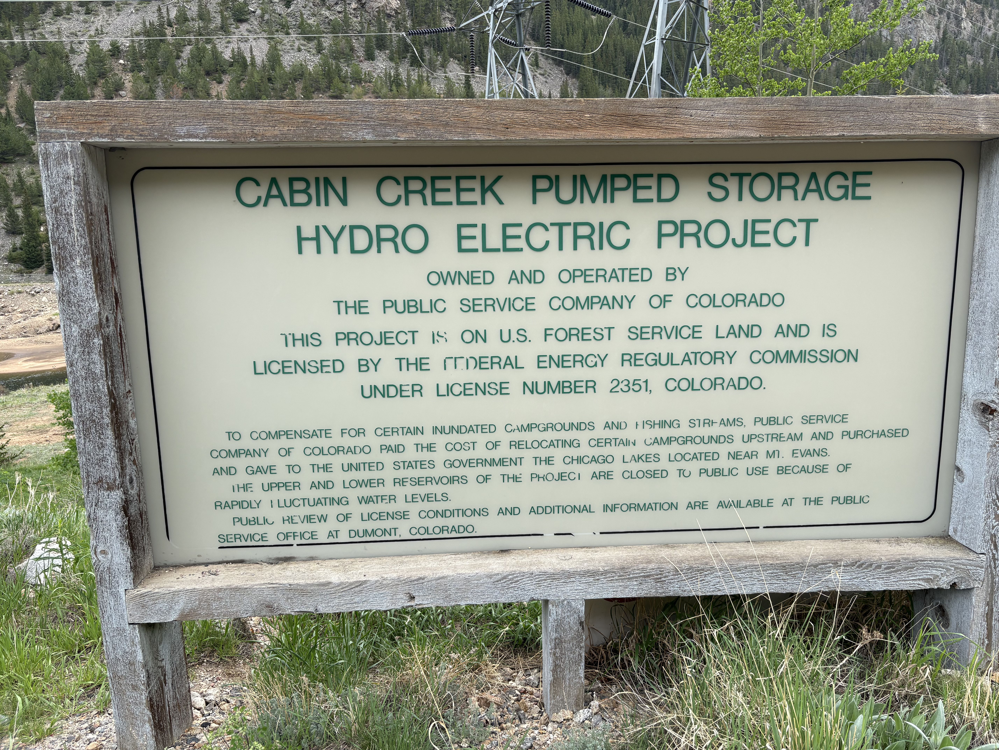

<br><details><summary>:camera:**56/IMG_0329.jpg**</summary><sub> `Exif version` 0232 `OS version` 18.5 `Date` 2025:06:14 14:59:12 `Aperture` Not known `Brightness` 10.42659478885894 `Color space` 65535 `Compression` Not known`Exposure mode` 0 `Exposure time` 0.000231000231000231 `Focal length` 5.960000038146973 `Lens model` iPhone 16 Plus back dual wide camera 5.96mm f/1.6 `Lens specification` (2.220000028611935, 5.960000038146973, 1.6, 2.2) `Orientation` 1 `Scene type` Not known `f number` 1.6 `White balance` 0 `Sensing method` 2 `Shutter speed` 12.079819538434842</sub><sub>`Coordinates & altitude` (39.65625277777777, -105.70836666666666, 3063.559284116331)</sub><sub> :globe_with_meridians:`Location over` [Google Maps](http://maps.google.com/maps?q=39.65625277777777,-105.70836666666666) or [Openstreet Map](https://www.openstreetmap.org/query?lat=39.65625277777777&lon=-105.70836666666666)</sub></details>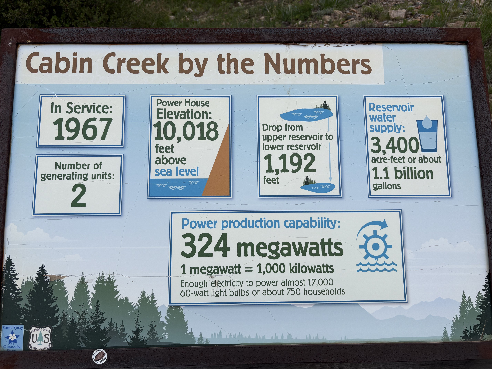

<br><details><summary>:camera:**56/IMG_0330.jpg**</summary><sub> `Exif version` 0232 `OS version` 18.5 `Date` 2025:06:14 14:59:32 `Aperture` Not known `Brightness` 10.184357889497262 `Color space` 65535 `Compression` Not known`Exposure mode` 0 `Exposure time` 0.00026102845210127906 `Focal length` 5.960000038146973 `Lens model` iPhone 16 Plus back dual wide camera 5.96mm f/1.6 `Lens specification` (2.220000028611935, 5.960000038146973, 1.6, 2.2) `Orientation` 1 `Scene type` Not known `f number` 1.6 `White balance` 0 `Sensing method` 2 `Shutter speed` 11.903662575491914</sub><sub>`Coordinates & altitude` (39.65623611111111, -105.70838888888889, 3062.4750692520774)</sub><sub> :globe_with_meridians:`Location over` [Google Maps](http://maps.google.com/maps?q=39.65623611111111,-105.70838888888889) or [Openstreet Map](https://www.openstreetmap.org/query?lat=39.65623611111111&lon=-105.70838888888889)</sub></details>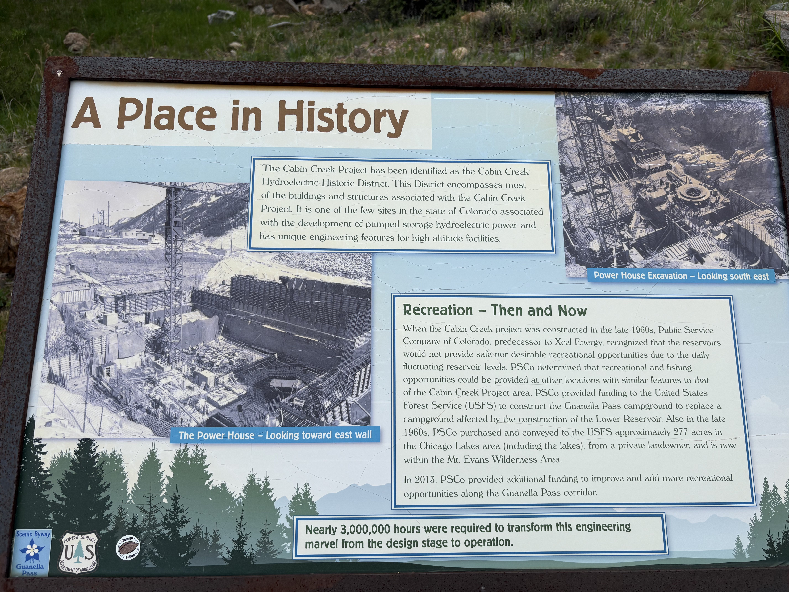

<br><details><summary>:camera:**56/IMG_0331.jpg**</summary><sub> `Exif version` 0232 `OS version` 18.5 `Date` 2025:06:14 14:59:50 `Aperture` Not known `Brightness` 9.175322570187383 `Color space` 65535 `Compression` Not known`Exposure mode` 0 `Exposure time` 0.0004528985507246377 `Focal length` 5.960000038146973 `Lens model` iPhone 16 Plus back dual wide camera 5.96mm f/1.6 `Lens specification` (2.220000028611935, 5.960000038146973, 1.6, 2.2) `Orientation` 1 `Scene type` Not known `f number` 1.6 `White balance` 0 `Sensing method` 2 `Shutter speed` 11.108201328564128</sub><sub>`Coordinates & altitude` (39.656216666666666, -105.70840555555556, 3061.922126081582)</sub><sub> :globe_with_meridians:`Location over` [Google Maps](http://maps.google.com/maps?q=39.656216666666666,-105.70840555555556) or [Openstreet Map](https://www.openstreetmap.org/query?lat=39.656216666666666&lon=-105.70840555555556)</sub></details>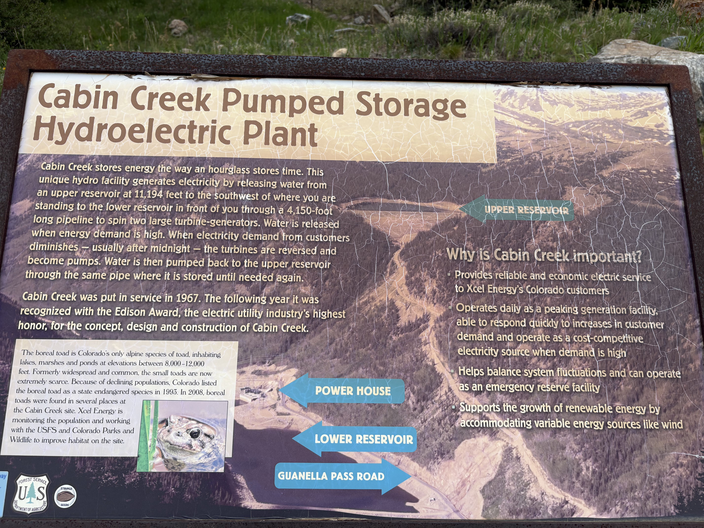

<br><details><summary>:camera:**56/IMG_0332.jpg**</summary><sub> `Exif version` 0232 `OS version` 18.5 `Date` 2025:06:14 15:00:02 `Aperture` Not known `Brightness` 7.364553531094715 `Color space` 65535 `Compression` Not known`Exposure mode` 0 `Exposure time` 0.0015151515151515152 `Focal length` 5.960000038146973 `Lens model` iPhone 16 Plus back dual wide camera 5.96mm f/1.6 `Lens specification` (2.220000028611935, 5.960000038146973, 1.6, 2.2) `Orientation` 1 `Scene type` Not known `f number` 1.6 `White balance` 0 `Sensing method` 2 `Shutter speed` 9.366466498103666</sub><sub>`Coordinates & altitude` (39.65616111111111, -105.70841111111112, 3063.4445797807552)</sub><sub> :globe_with_meridians:`Location over` [Google Maps](http://maps.google.com/maps?q=39.65616111111111,-105.70841111111112) or [Openstreet Map](https://www.openstreetmap.org/query?lat=39.65616111111111&lon=-105.70841111111112)</sub></details>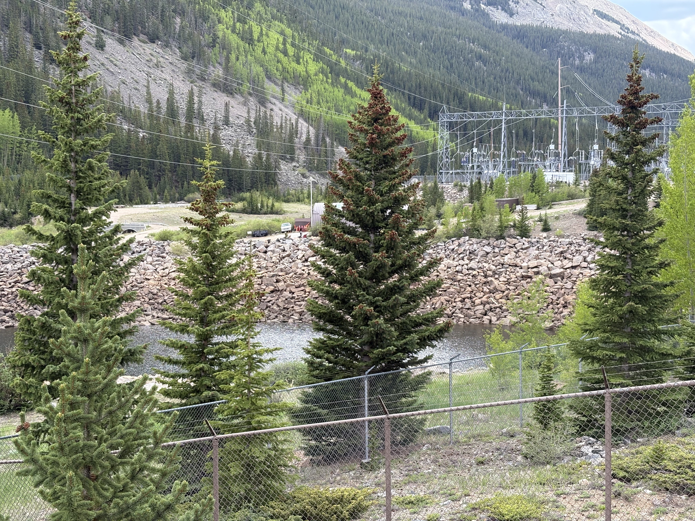

<br><details><summary>:camera:**56/IMG_0333.jpg**</summary><sub> `Exif version` 0232 `OS version` 18.5 `Date` 2025:06:14 15:00:04 `Aperture` Not known `Brightness` 7.620282040647035 `Color space` 65535 `Compression` Not known`Exposure mode` 0 `Exposure time` 0.0010427528675703858 `Focal length` 5.960000038146973 `Lens model` iPhone 16 Plus back dual wide camera 5.96mm f/1.6 `Lens specification` (2.220000028611935, 5.960000038146973, 1.6, 2.2) `Orientation` 1 `Scene type` Not known `f number` 1.6 `White balance` 0 `Sensing method` 2 `Shutter speed` 9.905045118949959</sub><sub>`Coordinates & altitude` (39.65616111111111, -105.70841111111112, 3063.4611211573238)</sub><sub> :globe_with_meridians:`Location over` [Google Maps](http://maps.google.com/maps?q=39.65616111111111,-105.70841111111112) or [Openstreet Map](https://www.openstreetmap.org/query?lat=39.65616111111111&lon=-105.70841111111112)</sub></details>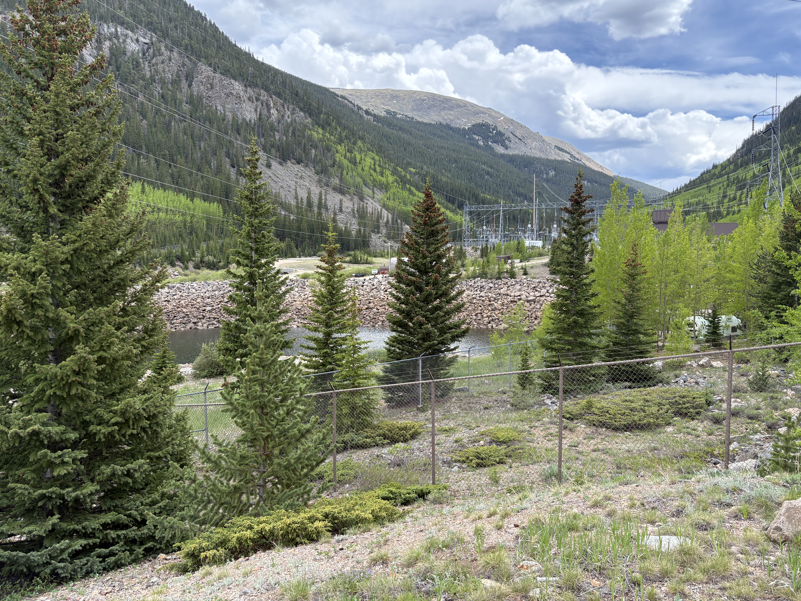

<br><details><summary>:camera:**56/IMG_0334.jpg**</summary><sub> `Exif version` 0232 `OS version` 18.5 `Date` 2025:06:14 15:00:08 `Aperture` Not known `Brightness` 10.430722825730586 `Color space` 65535 `Compression` Not known`Exposure mode` 0 `Exposure time` 0.00018698578908002991 `Focal length` 5.960000038146973 `Lens model` iPhone 16 Plus back dual wide camera 5.96mm f/1.6 `Lens specification` (2.220000028611935, 5.960000038146973, 1.6, 2.2) `Orientation` 6 `Scene type` Not known `f number` 1.6 `White balance` 0 `Sensing method` 2 `Shutter speed` 12.384674110125012</sub><sub>`Coordinates & altitude` (39.656166666666664, -105.70841111111112, 3063.6924829157174)</sub><sub> :globe_with_meridians:`Location over` [Google Maps](http://maps.google.com/maps?q=39.656166666666664,-105.70841111111112) or [Openstreet Map](https://www.openstreetmap.org/query?lat=39.656166666666664&lon=-105.70841111111112)</sub></details>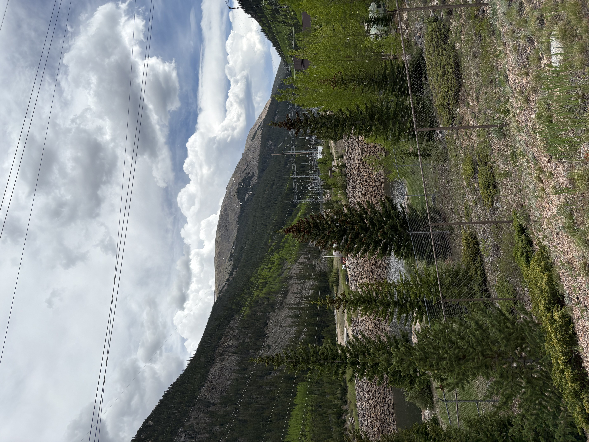

<br><details><summary>:camera:**56/IMG_0335.jpg**</summary><sub> `Exif version` 0232 `OS version` 18.5 `Date` 2025:06:14 15:00:23 `Aperture` Not known `Brightness` 7.846973589991997 `Color space` 65535 `Compression` Not known`Exposure mode` 0 `Exposure time` 0.0010869565217391304 `Focal length` 5.960000038146973 `Lens model` iPhone 16 Plus back dual wide camera 5.96mm f/1.6 `Lens specification` (2.220000028611935, 5.960000038146973, 1.6, 2.2) `Orientation` 6 `Scene type` Not known `f number` 1.6 `White balance` 0 `Sensing method` 2 `Shutter speed` 9.845432352563279</sub><sub>`Coordinates & altitude` (39.656216666666666, -105.70846666666667, 3063.040223463687)</sub><sub> :globe_with_meridians:`Location over` [Google Maps](http://maps.google.com/maps?q=39.656216666666666,-105.70846666666667) or [Openstreet Map](https://www.openstreetmap.org/query?lat=39.656216666666666&lon=-105.70846666666667)</sub></details>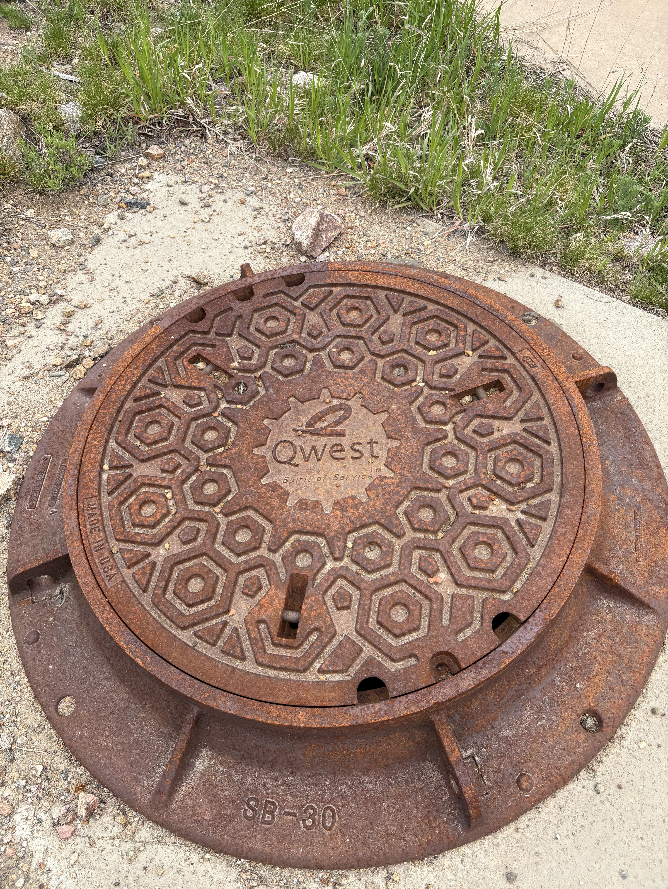

<br><details><summary>:camera:**56/IMG_0336.jpg**</summary><sub> `Exif version` 0232 `OS version` 18.5 `Date` 2025:06:14 15:01:08 `Aperture` Not known `Brightness` 8.6918480099222 `Color space` 65535 `Compression` Not known`Exposure mode` 0 `Exposure time` 0.0004079967360261118 `Focal length` 5.960000038146973 `Lens model` iPhone 16 Plus back dual wide camera 5.96mm f/1.6 `Lens specification` (2.220000028611935, 5.960000038146973, 1.6, 2.2) `Orientation` 6 `Scene type` Not known `f number` 1.6 `White balance` 0 `Sensing method` 2 `Shutter speed` 11.259143231822819</sub><sub>`Coordinates & altitude` (39.65646388888889, -105.70830555555555, 3071.3709369024855)</sub><sub> :globe_with_meridians:`Location over` [Google Maps](http://maps.google.com/maps?q=39.65646388888889,-105.70830555555555) or [Openstreet Map](https://www.openstreetmap.org/query?lat=39.65646388888889&lon=-105.70830555555555)</sub></details>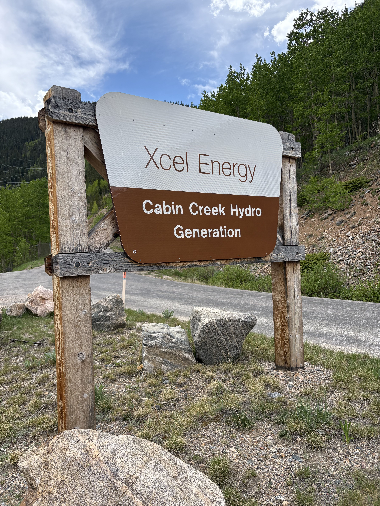

<br><details><summary>:camera:**56/IMG_0338.jpg**</summary><sub> `Exif version` 0232 `OS version` 18.5 `Date` 2025:06:14 15:03:52 `Aperture` Not known `Brightness` 7.272174850534157 `Color space` 65535 `Compression` Not known`Exposure mode` 0 `Exposure time` 0.0011173184357541898 `Focal length` 5.960000038146973 `Lens model` iPhone 16 Plus back dual wide camera 5.96mm f/1.6 `Lens specification` (2.220000028611935, 5.960000038146973, 1.6, 2.2) `Orientation` 6 `Scene type` Not known `f number` 1.6 `White balance` 0 `Sensing method` 2 `Shutter speed` 9.806155099191344</sub><sub>`Coordinates & altitude` (39.66373333333333, -105.70581944444444, 3056.615566037736)</sub><sub> :globe_with_meridians:`Location over` [Google Maps](http://maps.google.com/maps?q=39.66373333333333,-105.70581944444444) or [Openstreet Map](https://www.openstreetmap.org/query?lat=39.66373333333333&lon=-105.70581944444444)</sub></details>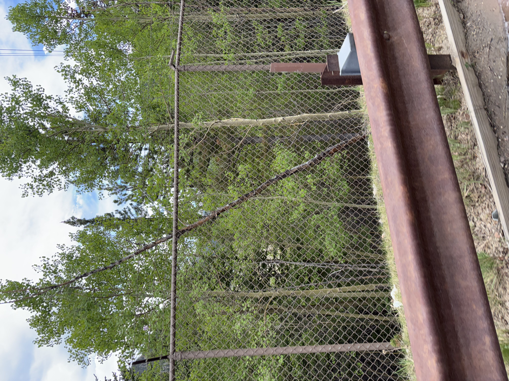

<br><details><summary>:camera:**56/IMG_0341.jpg**</summary><sub> `Exif version` 0232 `OS version` 18.5 `Date` 2025:06:14 15:05:49 `Aperture` Not known `Brightness` 9.621354243001612 `Color space` 65535 `Compression` Not known`Exposure mode` 0 `Exposure time` 0.0008880994671403197 `Focal length` 2.220000028611935 `Lens model` iPhone 16 Plus back dual wide camera 2.22mm f/2.2 `Lens specification` (2.220000028611935, 5.960000038146973, 1.6, 2.2) `Orientation` 1 `Scene type` Not known `f number` 2.2 `White balance` 0 `Sensing method` 2 `Shutter speed` 10.137152701091038</sub><sub>`Coordinates & altitude` (39.67417222222222, -105.70565, 3024.8745980707395)</sub><sub> :globe_with_meridians:`Location over` [Google Maps](http://maps.google.com/maps?q=39.67417222222222,-105.70565) or [Openstreet Map](https://www.openstreetmap.org/query?lat=39.67417222222222&lon=-105.70565)</sub></details>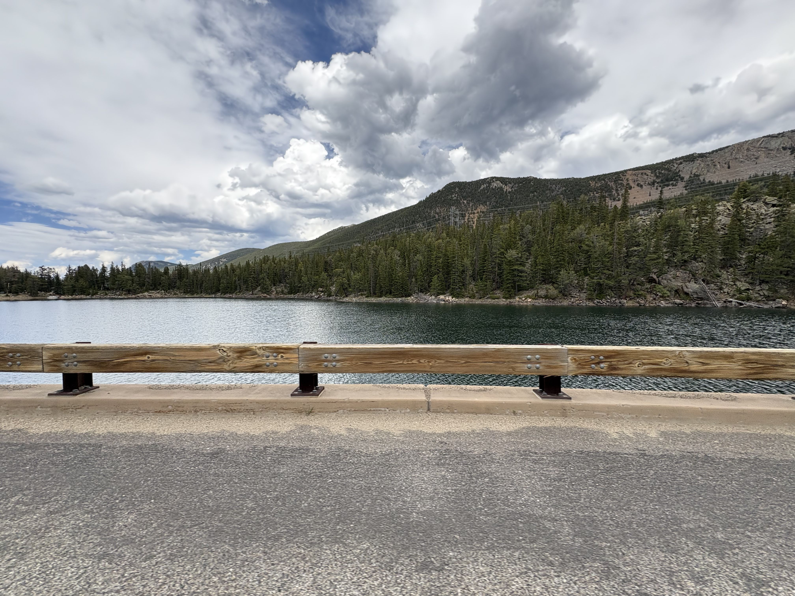

<br><details><summary>:camera:**56/IMG_0342.jpg**</summary><sub> `Exif version` 0232 `OS version` 18.5 `Date` 2025:06:14 15:05:50 `Aperture` Not known `Brightness` 10.246085534003273 `Color space` 65535 `Compression` Not known`Exposure mode` 0 `Exposure time` 0.0004930966469428008 `Focal length` 2.220000028611935 `Lens model` iPhone 16 Plus back dual wide camera 2.22mm f/2.2 `Lens specification` (2.220000028611935, 5.960000038146973, 1.6, 2.2) `Orientation` 1 `Scene type` Not known `f number` 2.2 `White balance` 0 `Sensing method` 2 `Shutter speed` 10.986124737210933</sub><sub>`Coordinates & altitude` (39.674255555555554, -105.70570277777779, 3025.139247943596)</sub><sub> :globe_with_meridians:`Location over` [Google Maps](http://maps.google.com/maps?q=39.674255555555554,-105.70570277777779) or [Openstreet Map](https://www.openstreetmap.org/query?lat=39.674255555555554&lon=-105.70570277777779)</sub></details>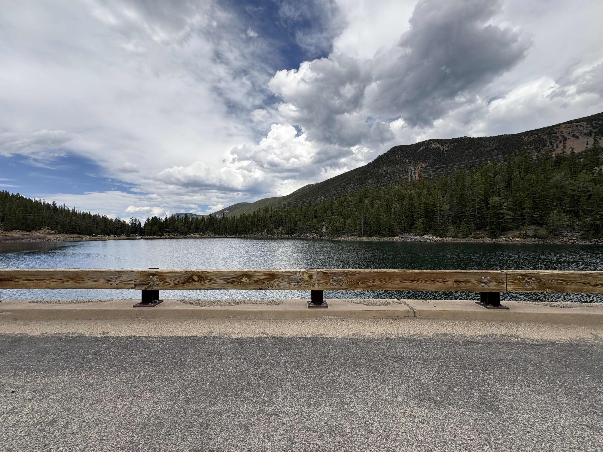

<br><details><summary>:camera:**56/IMG_0343.jpg**</summary><sub> `Exif version` 0232 `OS version` 18.5 `Date` 2025:06:14 15:05:53 `Aperture` Not known `Brightness` 10.297785119921684 `Color space` 65535 `Compression` Not known`Exposure mode` 0 `Exposure time` 0.00036101083032490973 `Focal length` 2.220000028611935 `Lens model` iPhone 16 Plus back dual wide camera 2.22mm f/2.2 `Lens specification` (2.220000028611935, 5.960000038146973, 1.6, 2.2) `Orientation` 1 `Scene type` Not known `f number` 2.2 `White balance` 0 `Sensing method` 2 `Shutter speed` 11.435713532327814</sub><sub>`Coordinates & altitude` (39.67446388888889, -105.70591111111112, 3025.012048192771)</sub><sub> :globe_with_meridians:`Location over` [Google Maps](http://maps.google.com/maps?q=39.67446388888889,-105.70591111111112) or [Openstreet Map](https://www.openstreetmap.org/query?lat=39.67446388888889&lon=-105.70591111111112)</sub></details>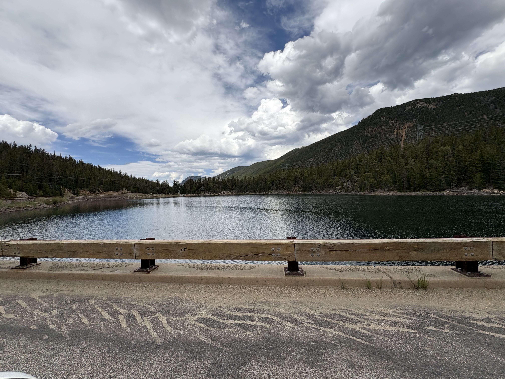

<br><details><summary>:camera:**56/IMG_0344.jpg**</summary><sub> `Exif version` 0232 `OS version` 18.5 `Date` 2025:06:14 15:05:57 `Aperture` Not known `Brightness` 8.924642597528472 `Color space` 65535 `Compression` Not known`Exposure mode` 0 `Exposure time` 0.001349527665317139 `Focal length` 2.220000028611935 `Lens model` iPhone 16 Plus back dual wide camera 2.22mm f/2.2 `Lens specification` (2.220000028611935, 5.960000038146973, 1.6, 2.2) `Orientation` 1 `Scene type` Not known `f number` 2.2 `White balance` 0 `Sensing method` 2 `Shutter speed` 9.533893941994165</sub><sub>`Coordinates & altitude` (39.67468888888889, -105.70605555555557, 3025.524500907441)</sub><sub> :globe_with_meridians:`Location over` [Google Maps](http://maps.google.com/maps?q=39.67468888888889,-105.70605555555557) or [Openstreet Map](https://www.openstreetmap.org/query?lat=39.67468888888889&lon=-105.70605555555557)</sub></details>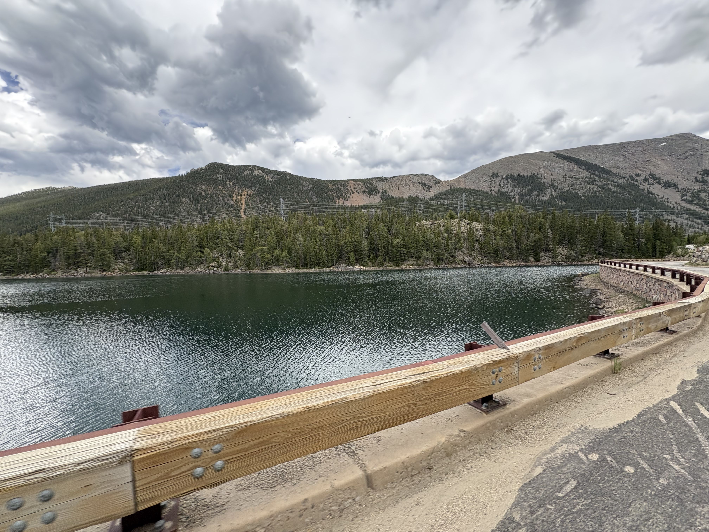

<br><details><summary>:camera:**56/IMG_0345.jpg**</summary><sub> `Exif version` 0232 `OS version` 18.5 `Date` 2025:06:14 15:06:01 `Aperture` Not known `Brightness` 9.221399554448958 `Color space` 65535 `Compression` Not known`Exposure mode` 0 `Exposure time` 0.0011655011655011655 `Focal length` 2.220000028611935 `Lens model` iPhone 16 Plus back dual wide camera 2.22mm f/2.2 `Lens specification` (2.220000028611935, 5.960000038146973, 1.6, 2.2) `Orientation` 1 `Scene type` Not known `f number` 2.2 `White balance` 0 `Sensing method` 2 `Shutter speed` 9.745454329661982</sub><sub>`Coordinates & altitude` (39.67511666666667, -105.70616111111111, 3025.9439421338157)</sub><sub> :globe_with_meridians:`Location over` [Google Maps](http://maps.google.com/maps?q=39.67511666666667,-105.70616111111111) or [Openstreet Map](https://www.openstreetmap.org/query?lat=39.67511666666667&lon=-105.70616111111111)</sub></details>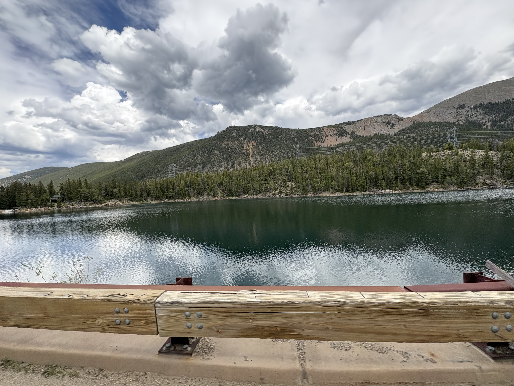

<br><details><summary>:camera:**56/IMG_0346.jpg**</summary><sub> `Exif version` 0232 `OS version` 18.5 `Date` 2025:06:14 15:06:12 `Aperture` Not known `Brightness` 9.616391059422133 `Color space` 65535 `Compression` Not known`Exposure mode` 0 `Exposure time` 0.0009407337723424271 `Focal length` 2.220000028611935 `Lens model` iPhone 16 Plus back dual wide camera 2.22mm f/2.2 `Lens specification` (2.220000028611935, 5.960000038146973, 1.6, 2.2) `Orientation` 1 `Scene type` Not known `f number` 2.2 `White balance` 0 `Sensing method` 2 `Shutter speed` 10.053517656720503</sub><sub>`Coordinates & altitude` (39.67605555555555, -105.70590277777778, 3025.0938461538462)</sub><sub> :globe_with_meridians:`Location over` [Google Maps](http://maps.google.com/maps?q=39.67605555555555,-105.70590277777778) or [Openstreet Map](https://www.openstreetmap.org/query?lat=39.67605555555555&lon=-105.70590277777778)</sub></details>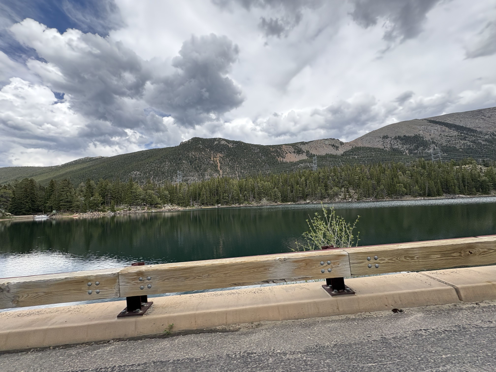

<br><details><summary>:camera:**56/IMG_0347.jpg**</summary><sub> `Exif version` 0232 `OS version` 18.5 `Date` 2025:06:14 15:09:40 `Aperture` Not known `Brightness` 8.414149821640903 `Color space` 65535 `Compression` Not known`Exposure mode` 0 `Exposure time` 0.001584786053882726 `Focal length` 2.220000028611935 `Lens model` iPhone 16 Plus back dual wide camera 2.22mm f/2.2 `Lens specification` (2.220000028611935, 5.960000038146973, 1.6, 2.2) `Orientation` 6 `Scene type` Not known `f number` 2.2 `White balance` 0 `Sensing method` 2 `Shutter speed` 9.300391521533685</sub><sub>`Coordinates & altitude` (39.67635277777777, -105.69924166666667, 2961.898454746137)</sub><sub> :globe_with_meridians:`Location over` [Google Maps](http://maps.google.com/maps?q=39.67635277777777,-105.69924166666667) or [Openstreet Map](https://www.openstreetmap.org/query?lat=39.67635277777777&lon=-105.69924166666667)</sub></details>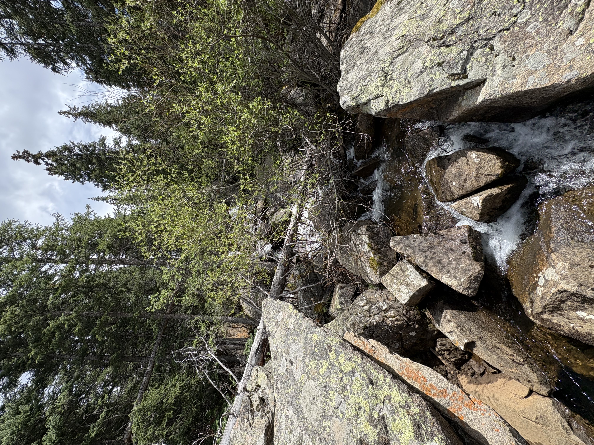

<br><details><summary>:camera:**56/IMG_0349.jpg**</summary><sub> `Exif version` 0232 `OS version` 18.5 `Date` 2025:06:14 15:10:17 `Aperture` Not known `Brightness` 8.474791439970984 `Color space` 65535 `Compression` Not known`Exposure mode` 0 `Exposure time` 0.0015600624024961 `Focal length` 2.220000028611935 `Lens model` iPhone 16 Plus back dual wide camera 2.22mm f/2.2 `Lens specification` (2.220000028611935, 5.960000038146973, 1.6, 2.2) `Orientation` 1 `Scene type` Not known `f number` 2.2 `White balance` 0 `Sensing method` 2 `Shutter speed` 9.324238250989843</sub><sub>`Coordinates & altitude` (39.676405555555554, -105.69916666666667, 2964.644793152639)</sub><sub> :globe_with_meridians:`Location over` [Google Maps](http://maps.google.com/maps?q=39.676405555555554,-105.69916666666667) or [Openstreet Map](https://www.openstreetmap.org/query?lat=39.676405555555554&lon=-105.69916666666667)</sub></details>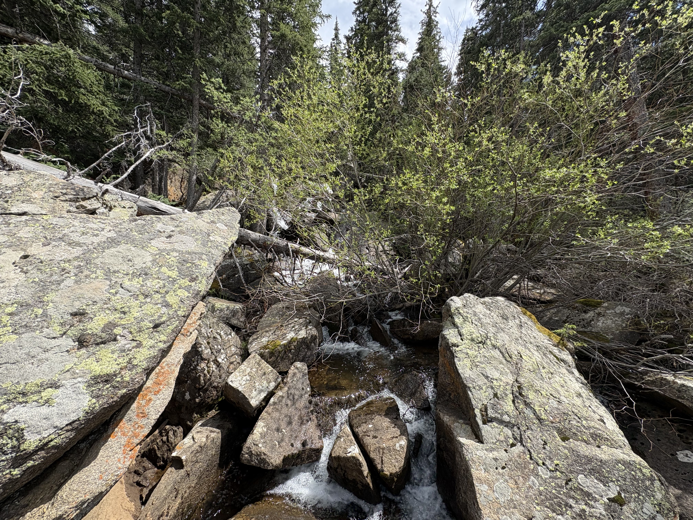

<br><details><summary>:camera:**56/IMG_0350.jpg**</summary><sub> `Exif version` 0232 `OS version` 18.5 `Date` 2025:06:14 15:10:21 `Aperture` Not known `Brightness` 8.517462553759454 `Color space` 65535 `Compression` Not known`Exposure mode` 0 `Exposure time` 0.0015060240963855422 `Focal length` 2.220000028611935 `Lens model` iPhone 16 Plus back dual wide camera 2.22mm f/2.2 `Lens specification` (2.220000028611935, 5.960000038146973, 1.6, 2.2) `Orientation` 6 `Scene type` Not known `f number` 2.2 `White balance` 0 `Sensing method` 2 `Shutter speed` 9.374104874104875</sub><sub>`Coordinates & altitude` (39.676405555555554, -105.69917222222223, 2965.0771653543306)</sub><sub> :globe_with_meridians:`Location over` [Google Maps](http://maps.google.com/maps?q=39.676405555555554,-105.69917222222223) or [Openstreet Map](https://www.openstreetmap.org/query?lat=39.676405555555554&lon=-105.69917222222223)</sub></details>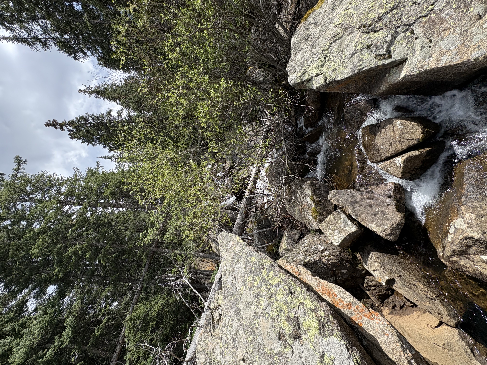

<br><details><summary>:camera:**56/IMG_0351.jpg**</summary><sub> `Exif version` 0232 `OS version` 18.5 `Date` 2025:06:14 15:12:58 `Aperture` Not known `Brightness` 8.664993602991832 `Color space` 65535 `Compression` Not known`Exposure mode` 0 `Exposure time` 0.0005411255411255411 `Focal length` 5.960000038146973 `Lens model` iPhone 16 Plus back dual wide camera 5.96mm f/1.6 `Lens specification` (2.220000028611935, 5.960000038146973, 1.6, 2.2) `Orientation` 1 `Scene type` Not known `f number` 1.6 `White balance` 0 `Sensing method` 2 `Shutter speed` 10.852083783200174</sub><sub>`Coordinates & altitude` (39.680875, -105.70266666666667, 2947.442470389171)</sub><sub> :globe_with_meridians:`Location over` [Google Maps](http://maps.google.com/maps?q=39.680875,-105.70266666666667) or [Openstreet Map](https://www.openstreetmap.org/query?lat=39.680875&lon=-105.70266666666667)</sub></details>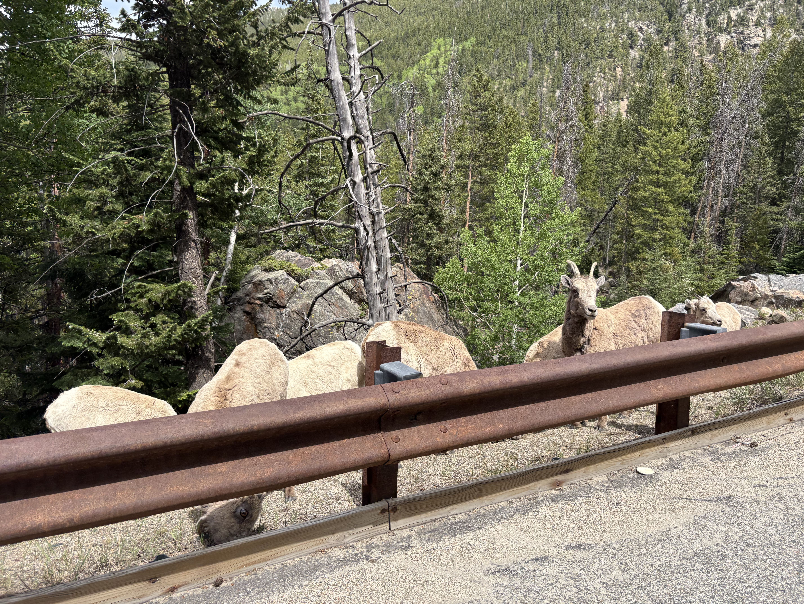

<br><details><summary>:camera:**56/IMG_0352.jpg**</summary><sub> `Exif version` 0232 `OS version` 18.5 `Date` 2025:06:14 15:13:00 `Aperture` Not known `Brightness` 9.169514592469378 `Color space` 65535 `Compression` Not known`Exposure mode` 0 `Exposure time` 0.001152073732718894 `Focal length` 2.220000028611935 `Lens model` iPhone 16 Plus back dual wide camera 2.22mm f/2.2 `Lens specification` (2.220000028611935, 5.960000038146973, 1.6, 2.2) `Orientation` 1 `Scene type` Not known `f number` 2.2 `White balance` 0 `Sensing method` 2 `Shutter speed` 9.76164356238157</sub><sub>`Coordinates & altitude` (39.68092222222222, -105.70263611111112, 2929.2156626506026)</sub><sub> :globe_with_meridians:`Location over` [Google Maps](http://maps.google.com/maps?q=39.68092222222222,-105.70263611111112) or [Openstreet Map](https://www.openstreetmap.org/query?lat=39.68092222222222&lon=-105.70263611111112)</sub></details>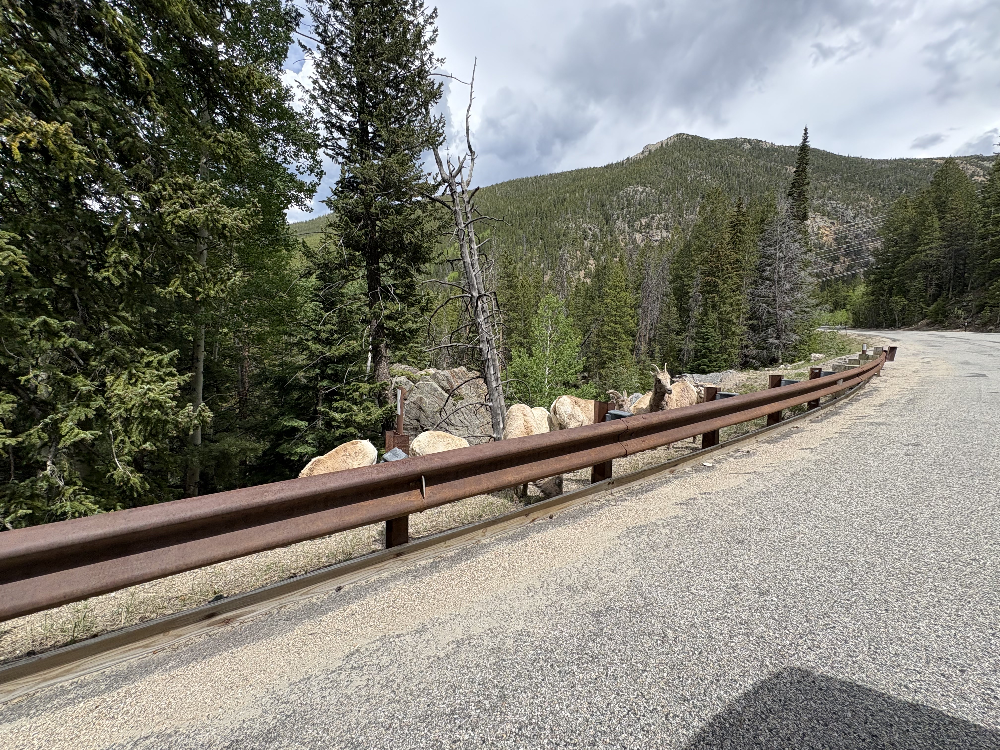

<br><details><summary>:camera:**56/IMG_0353.jpg**</summary><sub> `Exif version` 0232 `OS version` 18.5 `Date` 2025:06:14 15:15:42 `Aperture` Not known `Brightness` 8.766806136680614 `Color space` 65535 `Compression` Not known`Exposure mode` 0 `Exposure time` 0.00037893141341417203 `Focal length` 5.960000038146973 `Lens model` iPhone 16 Plus back dual wide camera 5.96mm f/1.6 `Lens specification` (2.220000028611935, 5.960000038146973, 1.6, 2.2) `Orientation` 1 `Scene type` Not known `f number` 1.6 `White balance` 0 `Sensing method` 2 `Shutter speed` 11.365514532600157</sub><sub>`Coordinates & altitude` (39.69200555555555, -105.69811944444444, 2815.032)</sub><sub> :globe_with_meridians:`Location over` [Google Maps](http://maps.google.com/maps?q=39.69200555555555,-105.69811944444444) or [Openstreet Map](https://www.openstreetmap.org/query?lat=39.69200555555555&lon=-105.69811944444444)</sub></details>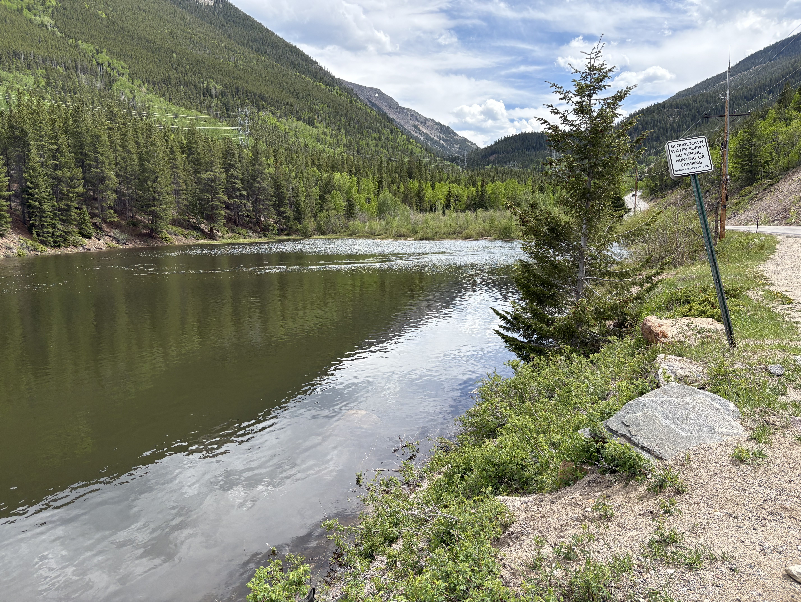

<br><details><summary>:camera:**56/IMG_0354.jpg**</summary><sub> `Exif version` 0232 `OS version` 18.5 `Date` 2025:06:14 15:15:44 `Aperture` Not known `Brightness` 7.74106644332775 `Color space` 65535 `Compression` Not known`Exposure mode` 0 `Exposure time` 0.0007178750897343862 `Focal length` 5.960000038146973 `Lens model` iPhone 16 Plus back dual wide camera 5.96mm f/1.6 `Lens specification` (2.220000028611935, 5.960000038146973, 1.6, 2.2) `Orientation` 1 `Scene type` Not known `f number` 1.6 `White balance` 0 `Sensing method` 2 `Shutter speed` 10.443728536385937</sub><sub>`Coordinates & altitude` (39.69200833333333, -105.69810555555556, 2815.114030738721)</sub><sub> :globe_with_meridians:`Location over` [Google Maps](http://maps.google.com/maps?q=39.69200833333333,-105.69810555555556) or [Openstreet Map](https://www.openstreetmap.org/query?lat=39.69200833333333&lon=-105.69810555555556)</sub></details>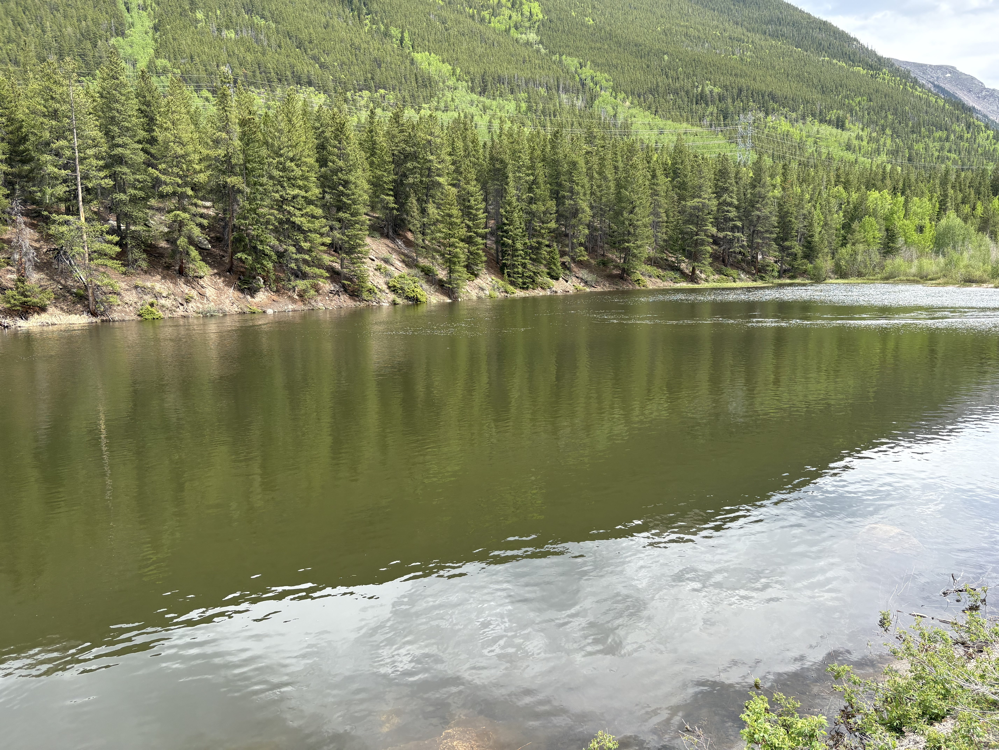

<br><details><summary>:camera:**56/IMG_0355.jpg**</summary><sub> `Exif version` 0232 `OS version` 18.5 `Date` 2025:06:14 15:15:47 `Aperture` Not known `Brightness` 8.586109697373058 `Color space` 65535 `Compression` Not known`Exposure mode` 0 `Exposure time` 0.0005998800239952009 `Focal length` 5.960000038146973 `Lens model` iPhone 16 Plus back dual wide camera 5.96mm f/1.6 `Lens specification` (2.220000028611935, 5.960000038146973, 1.6, 2.2) `Orientation` 1 `Scene type` Not known `f number` 1.6 `White balance` 0 `Sensing method` 2 `Shutter speed` 10.702749878387273</sub><sub>`Coordinates & altitude` (39.69201666666666, -105.69810555555556, 2814.7138849929875)</sub><sub> :globe_with_meridians:`Location over` [Google Maps](http://maps.google.com/maps?q=39.69201666666666,-105.69810555555556) or [Openstreet Map](https://www.openstreetmap.org/query?lat=39.69201666666666&lon=-105.69810555555556)</sub></details>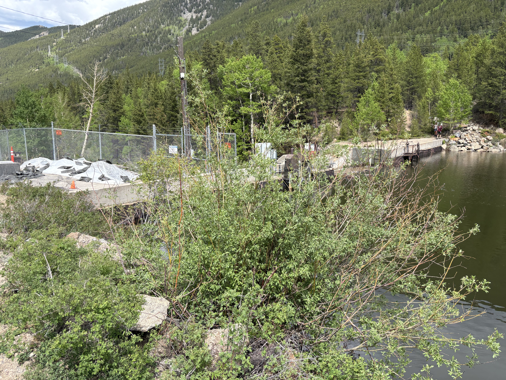

<br><details><summary>:camera:**56/IMG_0356.jpg**</summary><sub> `Exif version` 0232 `OS version` 18.5 `Date` 2025:06:14 15:16:02 `Aperture` Not known `Brightness` 9.551122398820253 `Color space` 65535 `Compression` Not known`Exposure mode` 0 `Exposure time` 0.0003049710277523635 `Focal length` 5.960000038146973 `Lens model` iPhone 16 Plus back dual wide camera 5.96mm f/1.6 `Lens specification` (2.220000028611935, 5.960000038146973, 1.6, 2.2) `Orientation` 6 `Scene type` Not known `f number` 1.6 `White balance` 0 `Sensing method` 2 `Shutter speed` 11.67890314020345</sub><sub>`Coordinates & altitude` (39.692119444444444, -105.69802777777778, 2813.653825575174)</sub><sub> :globe_with_meridians:`Location over` [Google Maps](http://maps.google.com/maps?q=39.692119444444444,-105.69802777777778) or [Openstreet Map](https://www.openstreetmap.org/query?lat=39.692119444444444&lon=-105.69802777777778)</sub></details>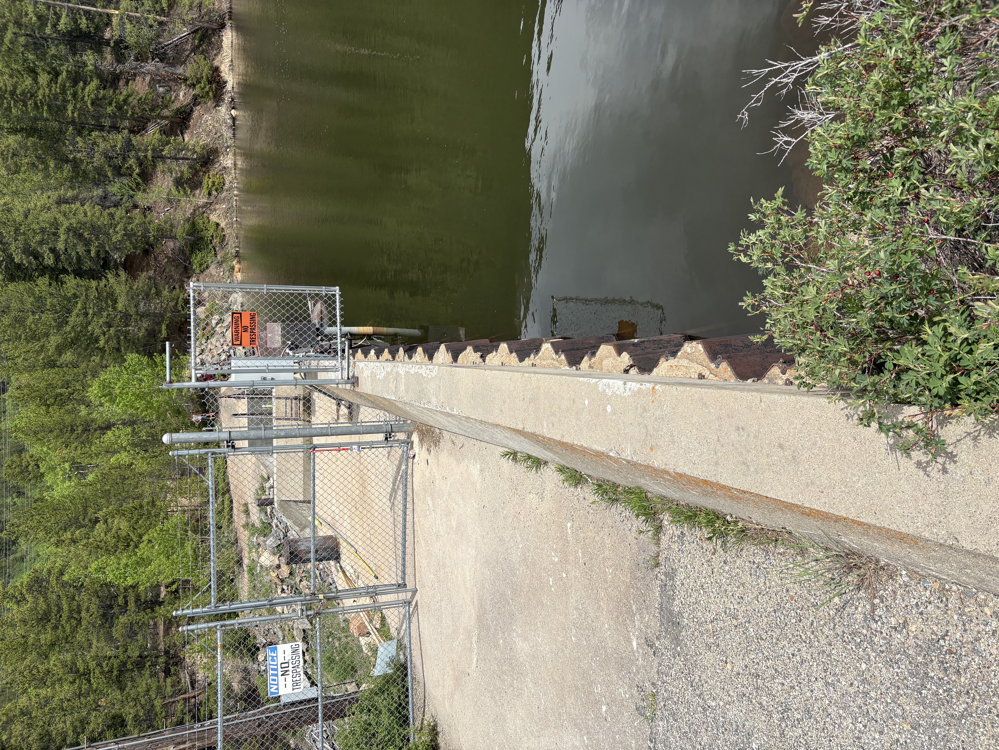

<br><details><summary>:camera:**56/IMG_0357.jpg**</summary><sub> `Exif version` 0232 `OS version` 18.5 `Date` 2025:06:14 15:16:20 `Aperture` Not known `Brightness` 9.777607948032097 `Color space` 65535 `Compression` Not known`Exposure mode` 0 `Exposure time` 0.000231000231000231 `Focal length` 5.960000038146973 `Lens model` iPhone 16 Plus back dual wide camera 5.96mm f/1.6 `Lens specification` (2.220000028611935, 5.960000038146973, 1.6, 2.2) `Orientation` 1 `Scene type` Not known `f number` 1.6 `White balance` 0 `Sensing method` 2 `Shutter speed` 12.079819538434842</sub><sub>`Coordinates & altitude` (39.692161111111105, -105.69792222222223, 2810.8655834564256)</sub><sub> :globe_with_meridians:`Location over` [Google Maps](http://maps.google.com/maps?q=39.692161111111105,-105.69792222222223) or [Openstreet Map](https://www.openstreetmap.org/query?lat=39.692161111111105&lon=-105.69792222222223)</sub></details>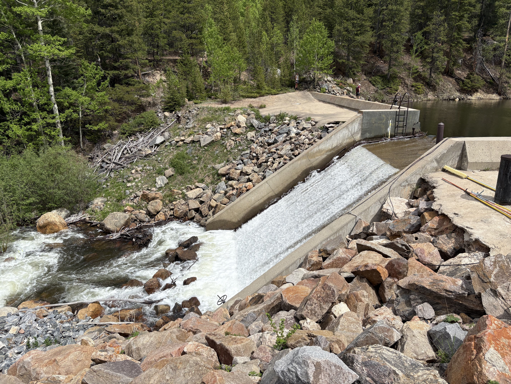

<br><details><summary>:camera:**56/IMG_0359.jpg**</summary><sub> `Exif version` 0232 `OS version` 18.5 `Date` 2025:06:14 15:16:40 `Aperture` Not known `Brightness` 9.421591324479103 `Color space` 65535 `Compression` Not known`Exposure mode` 0 `Exposure time` 0.0006510416666666666 `Focal length` 2.220000028611935 `Lens model` iPhone 16 Plus back dual wide camera 2.22mm f/2.2 `Lens specification` (2.220000028611935, 5.960000038146973, 1.6, 2.2) `Orientation` 1 `Scene type` Not known `f number` 2.2 `White balance` 0 `Sensing method` 2 `Shutter speed` 10.585054832950778</sub><sub>`Coordinates & altitude` (39.69216944444444, -105.69793055555556, 2812.3008658008657)</sub><sub> :globe_with_meridians:`Location over` [Google Maps](http://maps.google.com/maps?q=39.69216944444444,-105.69793055555556) or [Openstreet Map](https://www.openstreetmap.org/query?lat=39.69216944444444&lon=-105.69793055555556)</sub></details>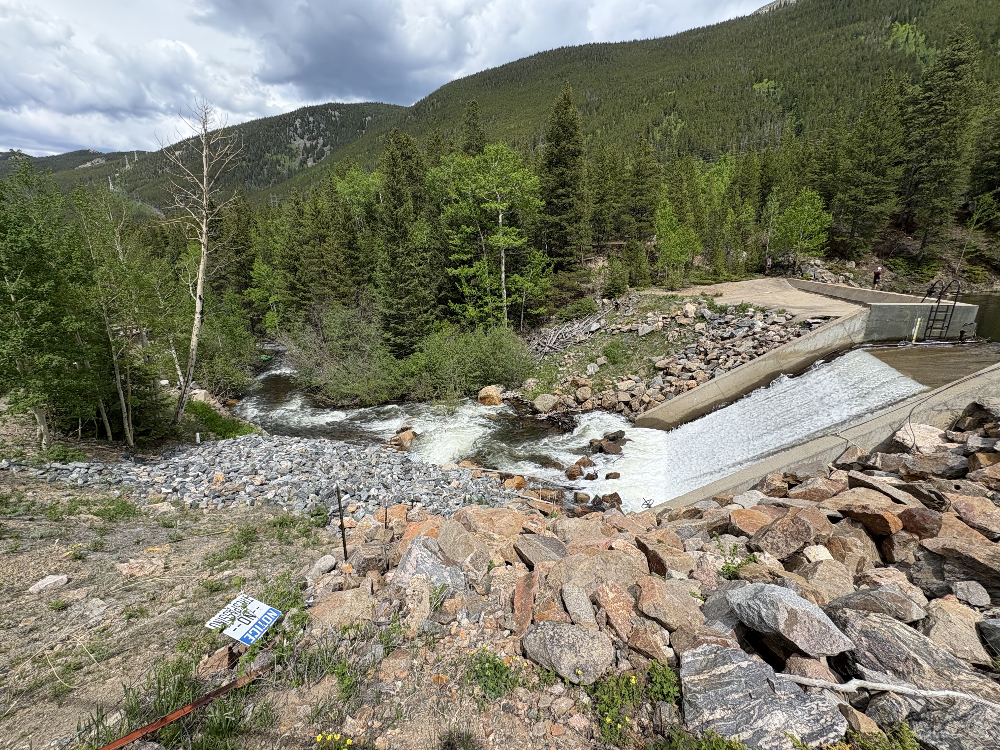

<br><details><summary>:camera:**56/IMG_0360.jpg**</summary><sub> `Exif version` 0232 `OS version` 18.5 `Date` 2025:06:14 15:16:46 `Aperture` Not known `Brightness` 9.475277555224906 `Color space` 65535 `Compression` Not known`Exposure mode` 0 `Exposure time` 0.000625 `Focal length` 2.220000028611935 `Lens model` iPhone 16 Plus back dual wide camera 2.22mm f/2.2 `Lens specification` (2.220000028611935, 5.960000038146973, 1.6, 2.2) `Orientation` 1 `Scene type` Not known `f number` 2.2 `White balance` 0 `Sensing method` 2 `Shutter speed` 10.64385619074439</sub><sub>`Coordinates & altitude` (39.692161111111105, -105.69792222222223, 2812.3923841059604)</sub><sub> :globe_with_meridians:`Location over` [Google Maps](http://maps.google.com/maps?q=39.692161111111105,-105.69792222222223) or [Openstreet Map](https://www.openstreetmap.org/query?lat=39.692161111111105&lon=-105.69792222222223)</sub></details>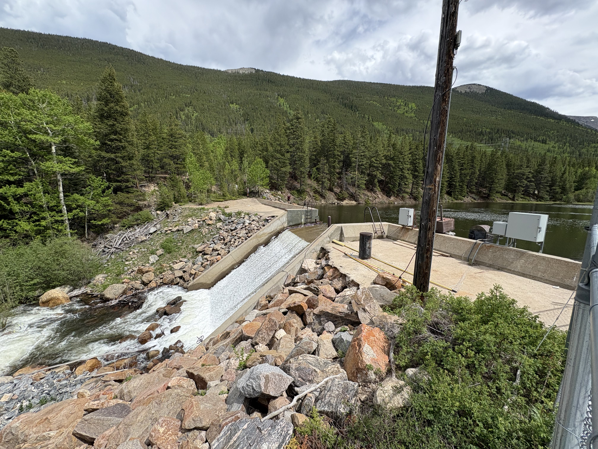

<br><details><summary>:camera:**56/IMG_0363.jpg**</summary><sub> `Exif version` 0232 `OS version` 18.5 `Date` 2025:06:14 15:17:43 `Aperture` Not known `Brightness` 9.305083633978354 `Color space` 65535 `Compression` Not known`Exposure mode` 0 `Exposure time` 0.00042301184433164127 `Focal length` 5.960000038146973 `Lens model` iPhone 16 Plus back dual wide camera 5.96mm f/1.6 `Lens specification` (2.220000028611935, 5.960000038146973, 1.6, 2.2) `Orientation` 6 `Scene type` Not known `f number` 1.6 `White balance` 0 `Sensing method` 2 `Shutter speed` 11.207054712242</sub><sub>`Coordinates & altitude` (39.69210555555555, -105.69800555555555, 2809.901628222524)</sub><sub> :globe_with_meridians:`Location over` [Google Maps](http://maps.google.com/maps?q=39.69210555555555,-105.69800555555555) or [Openstreet Map](https://www.openstreetmap.org/query?lat=39.69210555555555&lon=-105.69800555555555)</sub></details>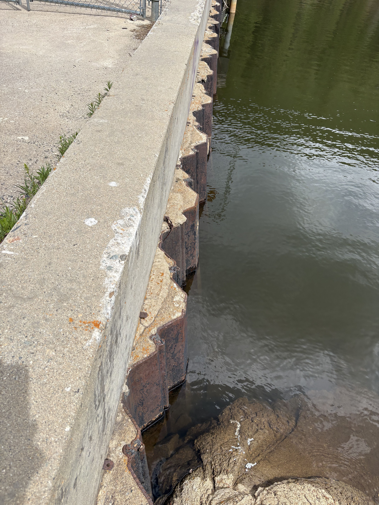

<br><details><summary>:camera:**56/IMG_0364.jpg**</summary><sub> `Exif version` 0232 `OS version` 18.5 `Date` 2025:06:14 15:18:04 `Aperture` Not known `Brightness` 10.977763314893155 `Color space` 65535 `Compression` Not known`Exposure mode` 0 `Exposure time` 0.00012799180852425445 `Focal length` 5.960000038146973 `Lens model` iPhone 16 Plus back dual wide camera 5.96mm f/1.6 `Lens specification` (2.220000028611935, 5.960000038146973, 1.6, 2.2) `Orientation` 6 `Scene type` Not known `f number` 1.6 `White balance` 0 `Sensing method` 2 `Shutter speed` 12.931568572233173</sub><sub>`Coordinates & altitude` (39.69196944444444, -105.69812777777778, 2815.03981264637)</sub><sub> :globe_with_meridians:`Location over` [Google Maps](http://maps.google.com/maps?q=39.69196944444444,-105.69812777777778) or [Openstreet Map](https://www.openstreetmap.org/query?lat=39.69196944444444&lon=-105.69812777777778)</sub></details>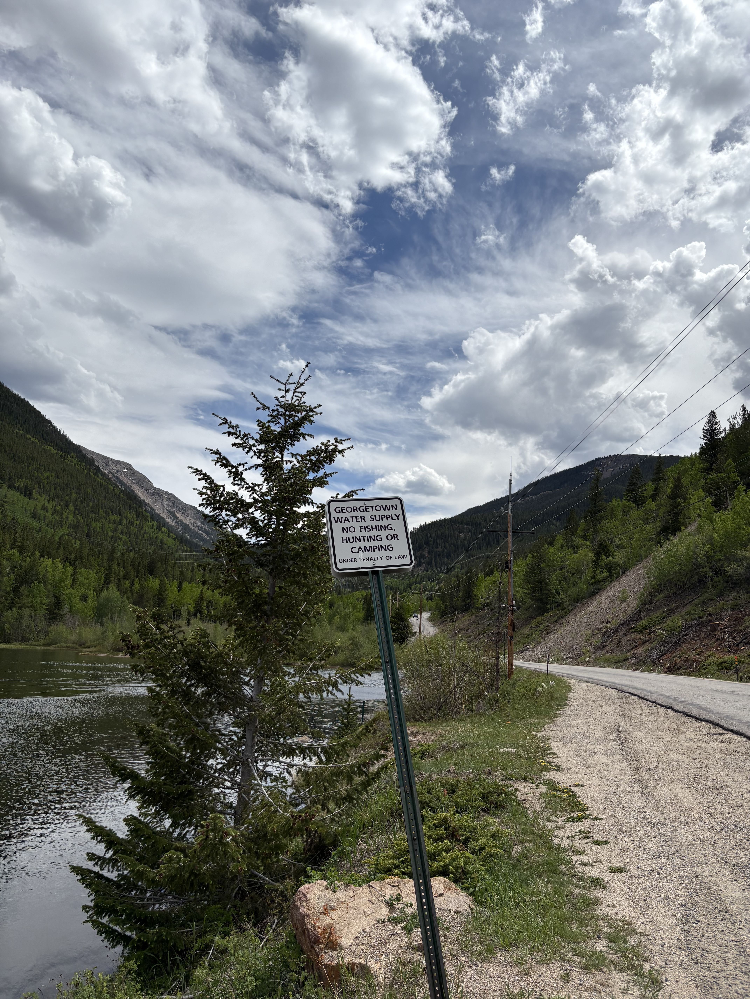

<br><details><summary>:camera:**56/IMG_0365.jpg**</summary><sub> `Exif version` 0232 `OS version` 18.5 `Date` 2025:06:14 15:21:45 `Aperture` Not known `Brightness` 8.746300175982569 `Color space` 65535 `Compression` Not known`Exposure mode` 0 `Exposure time` 0.0004380201489268506 `Focal length` 5.960000038146973 `Lens model` iPhone 16 Plus back dual wide camera 5.96mm f/1.6 `Lens specification` (2.220000028611935, 5.960000038146973, 1.6, 2.2) `Orientation` 1 `Scene type` Not known `f number` 1.6 `White balance` 0 `Sensing method` 2 `Shutter speed` 11.156781508940252</sub><sub>`Coordinates & altitude` (39.70271666666667, -105.6960138888889, 2665.5844504021447)</sub><sub> :globe_with_meridians:`Location over` [Google Maps](http://maps.google.com/maps?q=39.70271666666667,-105.6960138888889) or [Openstreet Map](https://www.openstreetmap.org/query?lat=39.70271666666667&lon=-105.6960138888889)</sub></details>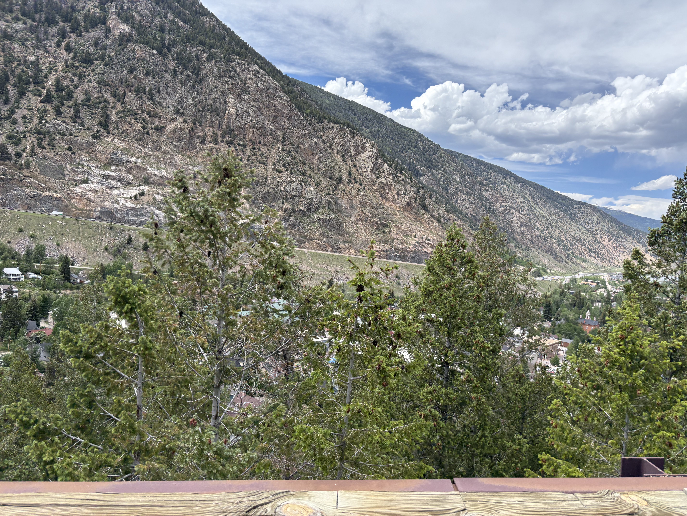

<br><details><summary>:camera:**56/IMG_0366.jpg**</summary><sub> `Exif version` 0232 `OS version` 18.5 `Date` 2025:06:14 15:21:47 `Aperture` Not known `Brightness` 8.945139169019766 `Color space` 65535 `Compression` Not known`Exposure mode` 0 `Exposure time` 0.00033500837520938025 `Focal length` 5.960000038146973 `Lens model` iPhone 16 Plus back dual wide camera 5.96mm f/1.6 `Lens specification` (2.220000028611935, 5.960000038146973, 1.6, 2.2) `Orientation` 1 `Scene type` Not known `f number` 1.6 `White balance` 0 `Sensing method` 2 `Shutter speed` 11.543551276309897</sub><sub>`Coordinates & altitude` (39.70270555555556, -105.69604444444445, 2664.714819427148)</sub><sub> :globe_with_meridians:`Location over` [Google Maps](http://maps.google.com/maps?q=39.70270555555556,-105.69604444444445) or [Openstreet Map](https://www.openstreetmap.org/query?lat=39.70270555555556&lon=-105.69604444444445)</sub></details>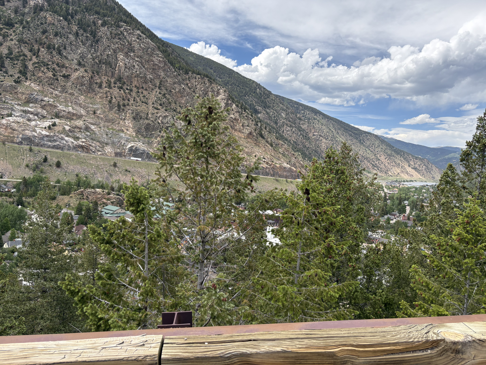

<br><details><summary>:camera:**56/IMG_0367.jpg**</summary><sub> `Exif version` 0232 `OS version` 18.5 `Date` 2025:06:14 15:21:48 `Aperture` Not known `Brightness` 8.165896682066359 `Color space` 65535 `Compression` Not known`Exposure mode` 0 `Exposure time` 0.0005998800239952009 `Focal length` 5.960000038146973 `Lens model` iPhone 16 Plus back dual wide camera 5.96mm f/1.6 `Lens specification` (2.220000028611935, 5.960000038146973, 1.6, 2.2) `Orientation` 1 `Scene type` Not known `f number` 1.6 `White balance` 0 `Sensing method` 2 `Shutter speed` 10.702749878387273</sub><sub>`Coordinates & altitude` (39.70269722222223, -105.69606666666667, 2665.151832460733)</sub><sub> :globe_with_meridians:`Location over` [Google Maps](http://maps.google.com/maps?q=39.70269722222223,-105.69606666666667) or [Openstreet Map](https://www.openstreetmap.org/query?lat=39.70269722222223&lon=-105.69606666666667)</sub></details>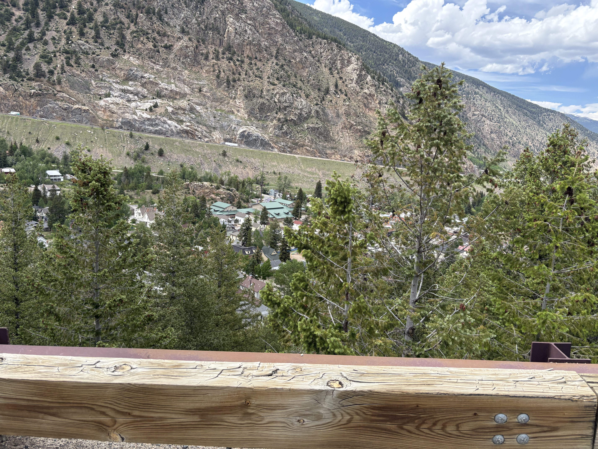

<sub>_Citation: Partial or total digital reproduction of this repository, scripts, development guides, data models, images, and documentation is permitted, provided that it is referenced as: "R.GISMobile - Mobile geographic information systems on QField that do not require an internet connection for navigation." https://github.com/rcfdtools/R.GISMobile - Bogotá - Colombia - South America"._<sub>

| [:house: Home](../Readme.md) |
|---|