<div align="center"></div>

## Zipaquirá, Cundinamarca, Colombia (2023-05-24)
`Pictures` rcfdtools <br>`Category` Freelance field visit <br>`Location` [Google Maps](http://maps.google.com/maps?q=5.018813,-74.009868) or [Openstreet Map](https://www.openstreetmap.org/query?lat=5.018813&lon=-74.009868) 

```geojson
{
  "type": "Feature",
  "geometry": {
    "type": "Point", 
    "coordinates": [-74.009868, 5.018813]
  }, 
  "properties": {
    "Name": "Zipaquirá, Cundinamarca, Colombia"
  }
}
```

<br><details><summary>:camera:**57/IMG_20260208_124914638_HDR.jpg**</summary><sub> `Exif version` 0220 `OS version`  `Date` 2026:02:08 12:49:17 `Aperture` Not known `Brightness` 0.0 `Color space` 1 `Compression` 6`Exposure mode` 0 `Exposure time` 0.001030721 `Focal length` 2.13 `Lens model` Not known `Lens specification` Not known `Orientation` 6 `Scene type` Not known `f number` 2.2 `White balance` 0 `Sensing method` 1 `Shutter speed` 9.922</sub></details>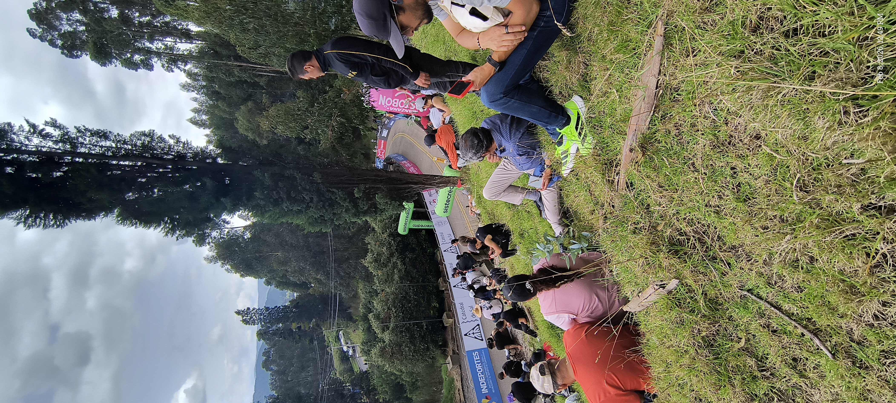

<br><details><summary>:camera:**57/IMG_20260208_124920007.jpg**</summary><sub> `Exif version` 0220 `OS version`  `Date` 2026:02:08 12:49:21 `Aperture` Not known `Brightness` 0.0 `Color space` 1 `Compression` 6`Exposure mode` 0 `Exposure time` 0.000790553 `Focal length` 2.13 `Lens model` Not known `Lens specification` Not known `Orientation` 1 `Scene type` Not known `f number` 2.2 `White balance` 0 `Sensing method` 1 `Shutter speed` 10.304</sub></details>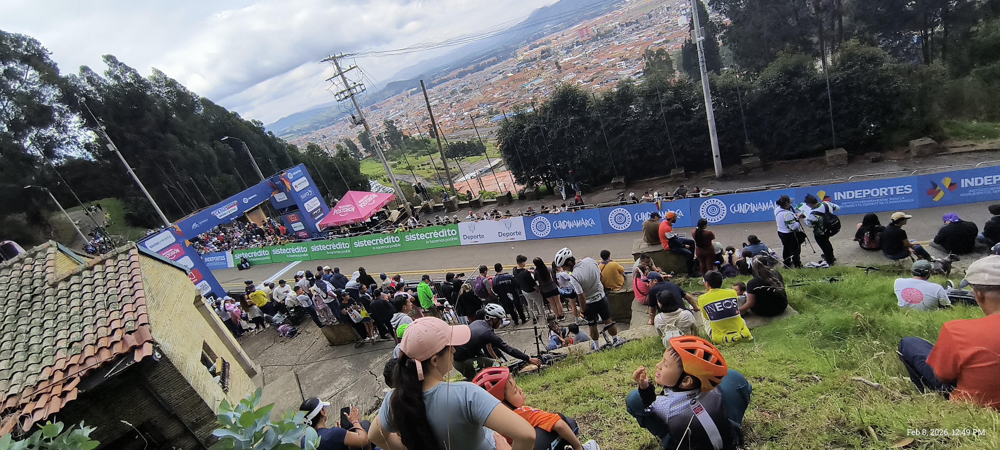

<br><details><summary>:camera:**57/IMG_20260208_124921955.jpg**</summary><sub> `Exif version` 0220 `OS version`  `Date` 2026:02:08 12:49:22 `Aperture` Not known `Brightness` 0.0 `Color space` 1 `Compression` 6`Exposure mode` 0 `Exposure time` 0.000510357 `Focal length` 2.13 `Lens model` Not known `Lens specification` Not known `Orientation` 6 `Scene type` Not known `f number` 2.2 `White balance` 0 `Sensing method` 1 `Shutter speed` 10.936</sub></details>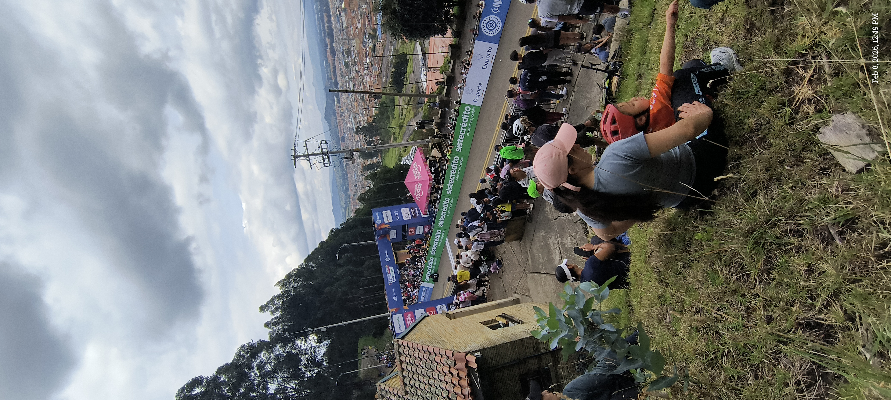

<br><details><summary>:camera:**57/IMG_20260208_124925999.jpg**</summary><sub> `Exif version` 0220 `OS version`  `Date` 2026:02:08 12:49:26 `Aperture` Not known `Brightness` 0.0 `Color space` 1 `Compression` 6`Exposure mode` 0 `Exposure time` 0.000690483 `Focal length` 2.13 `Lens model` Not known `Lens specification` Not known `Orientation` 1 `Scene type` Not known `f number` 2.2 `White balance` 0 `Sensing method` 1 `Shutter speed` 10.5</sub></details>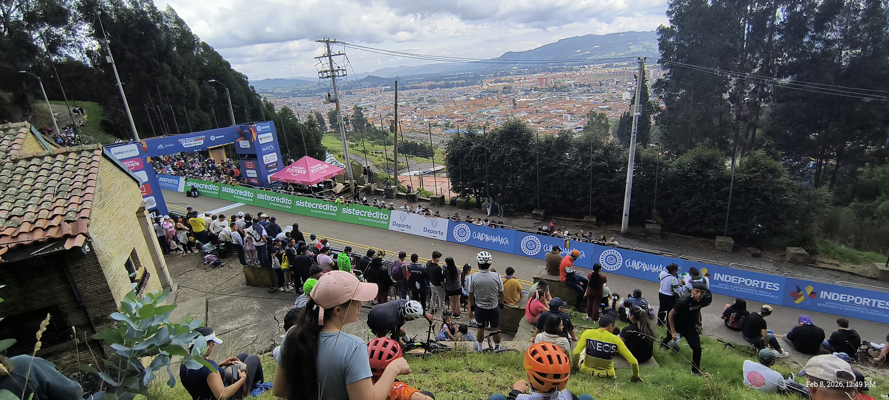

<br><details><summary>:camera:**57/PXL_20230524_105711848.MP.jpg**</summary><sub> `Exif version` 0232 `OS version` HDR+ 1.0.520435816zd `Date` 2023:05:24 05:57:11 `Aperture` Not known `Brightness` 3.27 `Color space` 1 `Compression` 6`Exposure mode` 0 `Exposure time` 0.002465 `Focal length` 6.81 `Lens model` Pixel 6 back camera 6.81mm f/1.85 `Lens specification` Not known `Orientation` 1 `Scene type` Not known `f number` 1.85 `White balance` 0 `Sensing method` 2 `Shutter speed` 8.66</sub><sub>`Coordinates & altitude` (5.024772222222222, -73.99793333333334, 2616.0)</sub><sub> :globe_with_meridians:`Location over` [Google Maps](http://maps.google.com/maps?q=5.024772222222222,-73.99793333333334) or [Openstreet Map](https://www.openstreetmap.org/query?lat=5.024772222222222&lon=-73.99793333333334)</sub></details>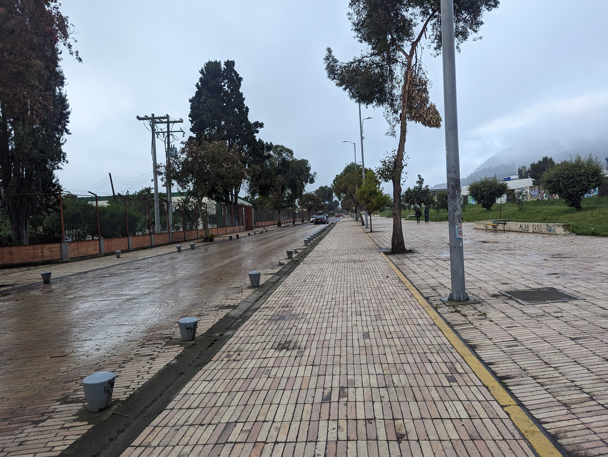

<br><details><summary>:camera:**57/PXL_20230524_110200599.MP.jpg**</summary><sub> `Exif version` 0232 `OS version` HDR+ 1.0.520435816zd `Date` 2023:05:24 06:02:00 `Aperture` Not known `Brightness` 5.05 `Color space` 1 `Compression` 6`Exposure mode` 0 `Exposure time` 0.004028 `Focal length` 6.81 `Lens model` Pixel 6 back camera 6.81mm f/1.85 `Lens specification` Not known `Orientation` 1 `Scene type` Not known `f number` 1.85 `White balance` 0 `Sensing method` 2 `Shutter speed` 7.96</sub><sub>`Coordinates & altitude` (5.022322222222222, -74.00104444444445, 2631.0)</sub><sub> :globe_with_meridians:`Location over` [Google Maps](http://maps.google.com/maps?q=5.022322222222222,-74.00104444444445) or [Openstreet Map](https://www.openstreetmap.org/query?lat=5.022322222222222&lon=-74.00104444444445)</sub></details>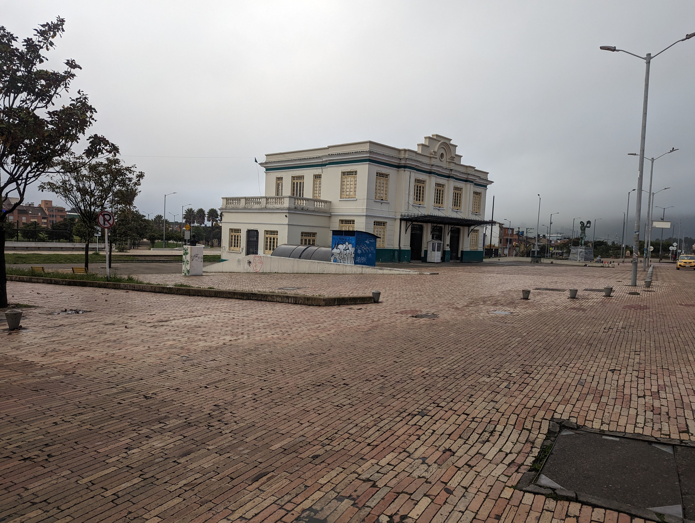

<br><details><summary>:camera:**57/PXL_20230524_110240979.MP.jpg**</summary><sub> `Exif version` 0232 `OS version` HDR+ 1.0.520435816zd `Date` 2023:05:24 06:02:40 `Aperture` Not known `Brightness` 4.28 `Color space` 1 `Compression` 6`Exposure mode` 0 `Exposure time` 0.001537 `Focal length` 6.81 `Lens model` Pixel 6 back camera 6.81mm f/1.85 `Lens specification` Not known `Orientation` 1 `Scene type` Not known `f number` 1.85 `White balance` 0 `Sensing method` 2 `Shutter speed` 9.35</sub><sub>`Coordinates & altitude` (5.022322222222222, -74.00104444444445, 2631.0)</sub><sub> :globe_with_meridians:`Location over` [Google Maps](http://maps.google.com/maps?q=5.022322222222222,-74.00104444444445) or [Openstreet Map](https://www.openstreetmap.org/query?lat=5.022322222222222&lon=-74.00104444444445)</sub></details>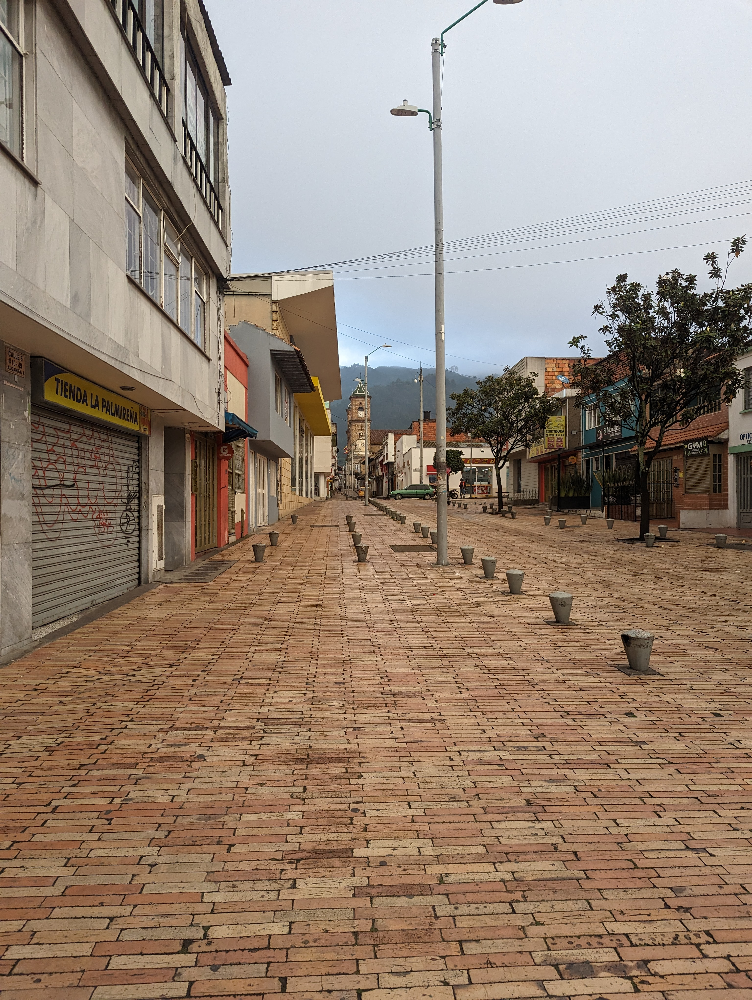

<br><details><summary>:camera:**57/PXL_20230524_110435873.MP.jpg**</summary><sub> `Exif version` 0232 `OS version` HDR+ 1.0.520435816zd `Date` 2023:05:24 06:04:35 `Aperture` Not known `Brightness` 4.73 `Color space` 1 `Compression` 6`Exposure mode` 0 `Exposure time` 0.003516 `Focal length` 6.81 `Lens model` Pixel 6 back camera 6.81mm f/1.85 `Lens specification` Not known `Orientation` 1 `Scene type` Not known `f number` 1.85 `White balance` 0 `Sensing method` 2 `Shutter speed` 8.15</sub><sub>`Coordinates & altitude` (5.022322222222222, -74.00104444444445, 2631.0)</sub><sub> :globe_with_meridians:`Location over` [Google Maps](http://maps.google.com/maps?q=5.022322222222222,-74.00104444444445) or [Openstreet Map](https://www.openstreetmap.org/query?lat=5.022322222222222&lon=-74.00104444444445)</sub></details>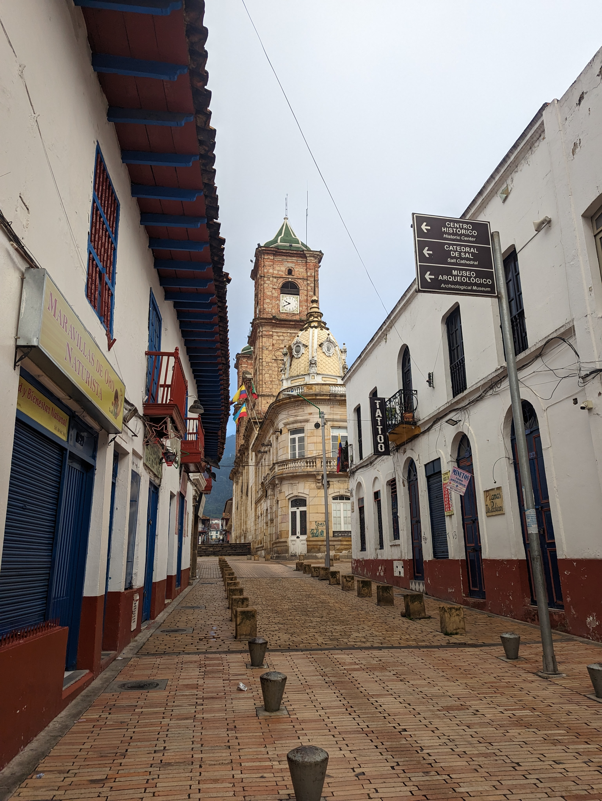

<br><details><summary>:camera:**57/PXL_20230524_110505135.jpg**</summary><sub> `Exif version` 0232 `OS version` HDR+ 1.0.520435816zd `Date` 2023:05:24 06:05:05 `Aperture` Not known `Brightness` 6.15 `Color space` 1 `Compression` 6`Exposure mode` 0 `Exposure time` 0.003004 `Focal length` 6.81 `Lens model` Pixel 6 back camera 6.81mm f/1.85 `Lens specification` Not known `Orientation` 1 `Scene type` Not known `f number` 1.85 `White balance` 0 `Sensing method` 2 `Shutter speed` 8.38</sub><sub>`Coordinates & altitude` (5.0232833333333335, -74.003275, 2641.0)</sub><sub> :globe_with_meridians:`Location over` [Google Maps](http://maps.google.com/maps?q=5.0232833333333335,-74.003275) or [Openstreet Map](https://www.openstreetmap.org/query?lat=5.0232833333333335&lon=-74.003275)</sub></details>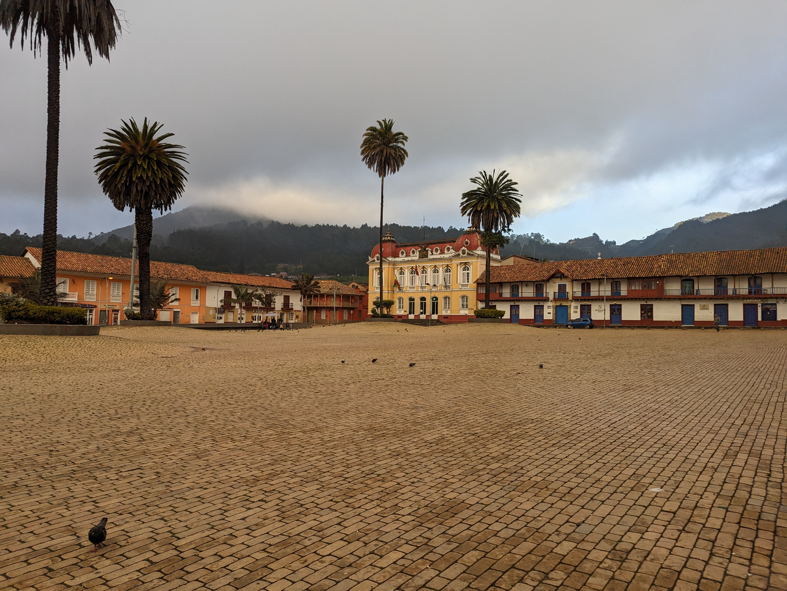

<br><details><summary>:camera:**57/PXL_20230524_110509190.MP.jpg**</summary><sub> `Exif version` 0232 `OS version` HDR+ 1.0.520435816zd `Date` 2023:05:24 06:05:09 `Aperture` Not known `Brightness` 4.49 `Color space` 1 `Compression` 6`Exposure mode` 0 `Exposure time` 0.002588 `Focal length` 6.81 `Lens model` Pixel 6 back camera 6.81mm f/1.85 `Lens specification` Not known `Orientation` 1 `Scene type` Not known `f number` 1.85 `White balance` 0 `Sensing method` 2 `Shutter speed` 8.59</sub><sub>`Coordinates & altitude` (5.0232833333333335, -74.003275, 2641.0)</sub><sub> :globe_with_meridians:`Location over` [Google Maps](http://maps.google.com/maps?q=5.0232833333333335,-74.003275) or [Openstreet Map](https://www.openstreetmap.org/query?lat=5.0232833333333335&lon=-74.003275)</sub></details>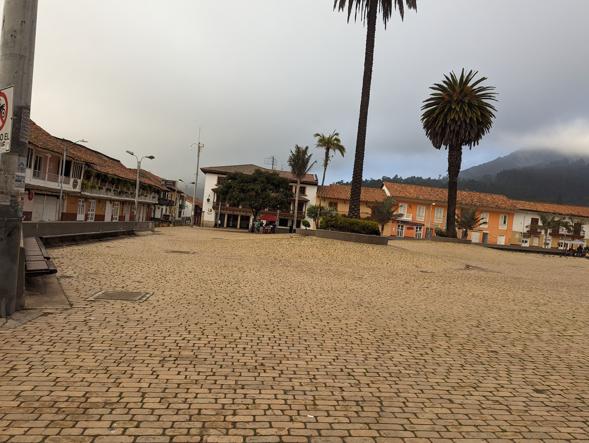

<br><details><summary>:camera:**57/PXL_20230524_110510992.jpg**</summary><sub> `Exif version` 0232 `OS version` HDR+ 1.0.520435816zd `Date` 2023:05:24 06:05:10 `Aperture` Not known `Brightness` 4.75 `Color space` 1 `Compression` 6`Exposure mode` 0 `Exposure time` 0.003348 `Focal length` 6.81 `Lens model` Pixel 6 back camera 6.81mm f/1.85 `Lens specification` Not known `Orientation` 1 `Scene type` Not known `f number` 1.85 `White balance` 0 `Sensing method` 2 `Shutter speed` 8.22</sub><sub>`Coordinates & altitude` (5.0232833333333335, -74.003275, 2641.0)</sub><sub> :globe_with_meridians:`Location over` [Google Maps](http://maps.google.com/maps?q=5.0232833333333335,-74.003275) or [Openstreet Map](https://www.openstreetmap.org/query?lat=5.0232833333333335&lon=-74.003275)</sub></details>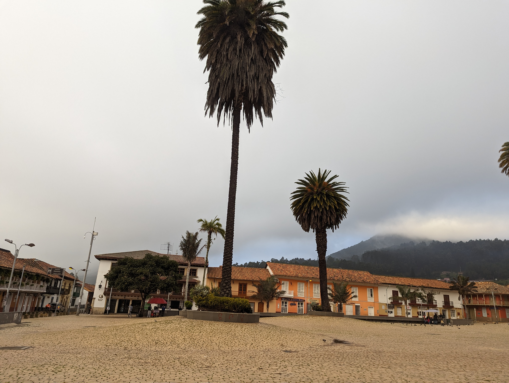

<br><details><summary>:camera:**57/PXL_20230524_110520688.jpg**</summary><sub> `Exif version` 0232 `OS version` HDR+ 1.0.520435816zd `Date` 2023:05:24 06:05:20 `Aperture` Not known `Brightness` 6.13 `Color space` 1 `Compression` 6`Exposure mode` 0 `Exposure time` 0.003719 `Focal length` 6.81 `Lens model` Pixel 6 back camera 6.81mm f/1.85 `Lens specification` Not known `Orientation` 1 `Scene type` Not known `f number` 1.85 `White balance` 0 `Sensing method` 2 `Shutter speed` 8.07</sub><sub>`Coordinates & altitude` (5.0232833333333335, -74.003275, 2641.0)</sub><sub> :globe_with_meridians:`Location over` [Google Maps](http://maps.google.com/maps?q=5.0232833333333335,-74.003275) or [Openstreet Map](https://www.openstreetmap.org/query?lat=5.0232833333333335&lon=-74.003275)</sub></details>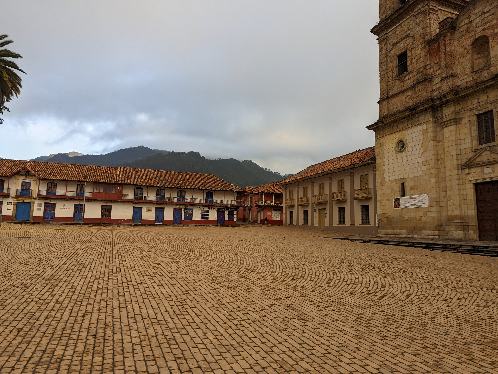

<br><details><summary>:camera:**57/PXL_20230524_110949173.jpg**</summary><sub> `Exif version` 0232 `OS version` HDR+ 1.0.520435816zd `Date` 2023:05:24 06:09:49 `Aperture` Not known `Brightness` 4.82 `Color space` 1 `Compression` 6`Exposure mode` 0 `Exposure time` 0.003516 `Focal length` 6.81 `Lens model` Pixel 6 back camera 6.81mm f/1.85 `Lens specification` Not known `Orientation` 1 `Scene type` Not known `f number` 1.85 `White balance` 0 `Sensing method` 2 `Shutter speed` 8.15</sub><sub>`Coordinates & altitude` (5.0232833333333335, -74.003275, 2641.0)</sub><sub> :globe_with_meridians:`Location over` [Google Maps](http://maps.google.com/maps?q=5.0232833333333335,-74.003275) or [Openstreet Map](https://www.openstreetmap.org/query?lat=5.0232833333333335&lon=-74.003275)</sub></details>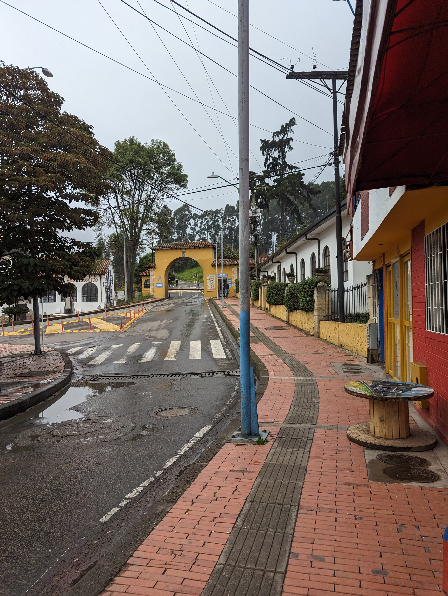

<br><details><summary>:camera:**57/PXL_20230524_110952360.MP.jpg**</summary><sub> `Exif version` 0232 `OS version` HDR+ 1.0.520435816zd `Date` 2023:05:24 06:09:52 `Aperture` Not known `Brightness` 4.92 `Color space` 1 `Compression` 6`Exposure mode` 0 `Exposure time` 0.00273 `Focal length` 6.81 `Lens model` Pixel 6 back camera 6.81mm f/1.85 `Lens specification` Not known `Orientation` 1 `Scene type` Not known `f number` 1.85 `White balance` 0 `Sensing method` 2 `Shutter speed` 8.52</sub><sub>`Coordinates & altitude` (5.021772222222222, -74.0067, 2646.0)</sub><sub> :globe_with_meridians:`Location over` [Google Maps](http://maps.google.com/maps?q=5.021772222222222,-74.0067) or [Openstreet Map](https://www.openstreetmap.org/query?lat=5.021772222222222&lon=-74.0067)</sub></details>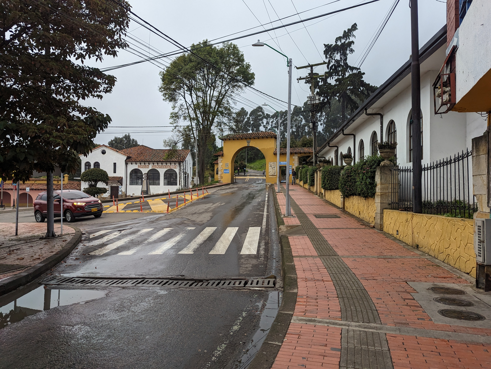

<br><details><summary>:camera:**57/PXL_20230524_111152644.MP.jpg**</summary><sub> `Exif version` 0232 `OS version` HDR+ 1.0.520435816zd `Date` 2023:05:24 06:11:52 `Aperture` Not known `Brightness` 4.78 `Color space` 1 `Compression` 6`Exposure mode` 0 `Exposure time` 0.002482 `Focal length` 6.81 `Lens model` Pixel 6 back camera 6.81mm f/1.85 `Lens specification` Not known `Orientation` 1 `Scene type` Not known `f number` 1.85 `White balance` 0 `Sensing method` 2 `Shutter speed` 8.65</sub><sub>`Coordinates & altitude` (5.021191666666667, -74.00790833333333, 2659.0)</sub><sub> :globe_with_meridians:`Location over` [Google Maps](http://maps.google.com/maps?q=5.021191666666667,-74.00790833333333) or [Openstreet Map](https://www.openstreetmap.org/query?lat=5.021191666666667&lon=-74.00790833333333)</sub></details>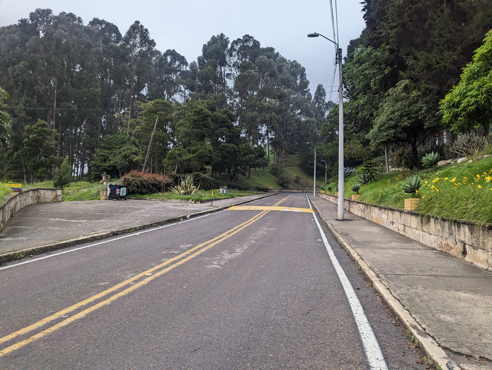

<br><details><summary>:camera:**57/PXL_20230524_111411884.jpg**</summary><sub> `Exif version` 0232 `OS version` HDR+ 1.0.520435816zd `Date` 2023:05:24 06:14:11 `Aperture` Not known `Brightness` 4.85 `Color space` 1 `Compression` 6`Exposure mode` 0 `Exposure time` 0.003065 `Focal length` 6.81 `Lens model` Pixel 6 back camera 6.81mm f/1.85 `Lens specification` Not known `Orientation` 1 `Scene type` Not known `f number` 1.85 `White balance` 0 `Sensing method` 2 `Shutter speed` 8.35</sub><sub>`Coordinates & altitude` (5.021191666666667, -74.00790833333333, 2659.0)</sub><sub> :globe_with_meridians:`Location over` [Google Maps](http://maps.google.com/maps?q=5.021191666666667,-74.00790833333333) or [Openstreet Map](https://www.openstreetmap.org/query?lat=5.021191666666667&lon=-74.00790833333333)</sub></details>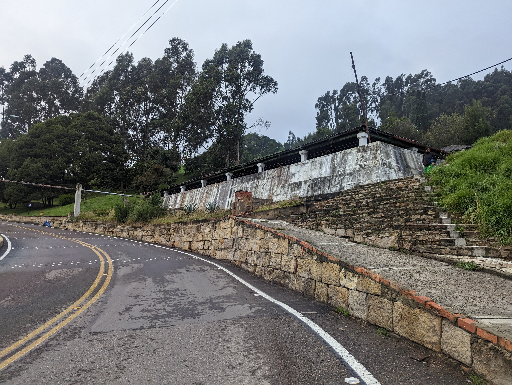

<br><details><summary>:camera:**57/PXL_20230524_111541632.jpg**</summary><sub> `Exif version` 0232 `OS version` HDR+ 1.0.520435816zd `Date` 2023:05:24 06:15:41 `Aperture` Not known `Brightness` 4.92 `Color space` 1 `Compression` 6`Exposure mode` 0 `Exposure time` 0.006555 `Focal length` 6.81 `Lens model` Pixel 6 back camera 6.81mm f/1.85 `Lens specification` Not known `Orientation` 1 `Scene type` Not known `f number` 1.85 `White balance` 0 `Sensing method` 2 `Shutter speed` 7.25</sub><sub>`Coordinates & altitude` (5.021216666666667, -74.00920555555555, 2675.0)</sub><sub> :globe_with_meridians:`Location over` [Google Maps](http://maps.google.com/maps?q=5.021216666666667,-74.00920555555555) or [Openstreet Map](https://www.openstreetmap.org/query?lat=5.021216666666667&lon=-74.00920555555555)</sub></details>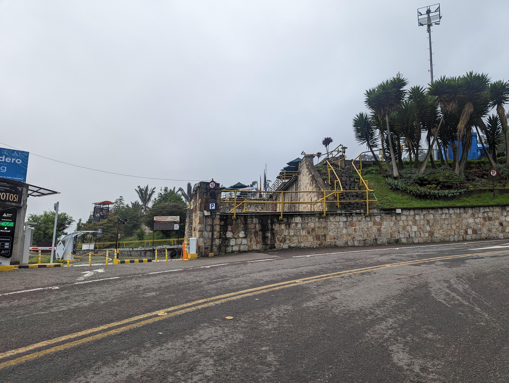

<br><details><summary>:camera:**57/PXL_20230524_111549838.jpg**</summary><sub> `Exif version` 0232 `OS version` HDR+ 1.0.520435816zd `Date` 2023:05:24 06:15:49 `Aperture` Not known `Brightness` 4.48 `Color space` 1 `Compression` 6`Exposure mode` 0 `Exposure time` 0.001431 `Focal length` 6.81 `Lens model` Pixel 6 back camera 6.81mm f/1.85 `Lens specification` Not known `Orientation` 1 `Scene type` Not known `f number` 1.85 `White balance` 0 `Sensing method` 2 `Shutter speed` 9.45</sub><sub>`Coordinates & altitude` (5.020033333333333, -74.00894166666667, 2693.74)</sub><sub> :globe_with_meridians:`Location over` [Google Maps](http://maps.google.com/maps?q=5.020033333333333,-74.00894166666667) or [Openstreet Map](https://www.openstreetmap.org/query?lat=5.020033333333333&lon=-74.00894166666667)</sub></details>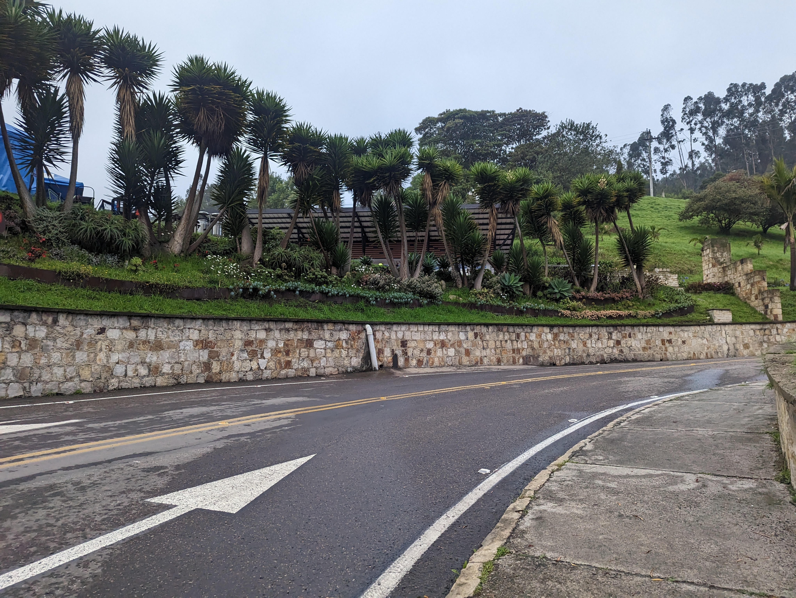

<br><details><summary>:camera:**57/PXL_20230524_111816070.jpg**</summary><sub> `Exif version` 0232 `OS version` HDR+ 1.0.520435816zd `Date` 2023:05:24 06:18:16 `Aperture` Not known `Brightness` 5.19 `Color space` 1 `Compression` 6`Exposure mode` 0 `Exposure time` 0.003958 `Focal length` 6.81 `Lens model` Pixel 6 back camera 6.81mm f/1.85 `Lens specification` Not known `Orientation` 1 `Scene type` Not known `f number` 1.85 `White balance` 0 `Sensing method` 2 `Shutter speed` 7.98</sub><sub>`Coordinates & altitude` (5.020033333333333, -74.00894166666667, 2693.74)</sub><sub> :globe_with_meridians:`Location over` [Google Maps](http://maps.google.com/maps?q=5.020033333333333,-74.00894166666667) or [Openstreet Map](https://www.openstreetmap.org/query?lat=5.020033333333333&lon=-74.00894166666667)</sub></details>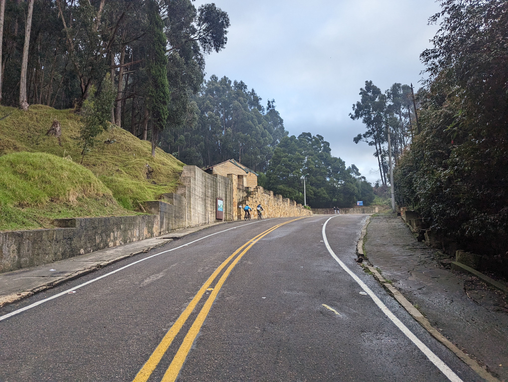

<br><details><summary>:camera:**57/PXL_20230524_111857946.jpg**</summary><sub> `Exif version` 0232 `OS version` HDR+ 1.0.520435816zd `Date` 2023:05:24 06:18:57 `Aperture` Not known `Brightness` 6.31 `Color space` 1 `Compression` 6`Exposure mode` 0 `Exposure time` 0.003542 `Focal length` 6.81 `Lens model` Pixel 6 back camera 6.81mm f/1.85 `Lens specification` Not known `Orientation` 1 `Scene type` Not known `f number` 1.85 `White balance` 0 `Sensing method` 2 `Shutter speed` 8.14</sub><sub>`Coordinates & altitude` (5.020986111111111, -74.01075, 2717.85)</sub><sub> :globe_with_meridians:`Location over` [Google Maps](http://maps.google.com/maps?q=5.020986111111111,-74.01075) or [Openstreet Map](https://www.openstreetmap.org/query?lat=5.020986111111111&lon=-74.01075)</sub></details>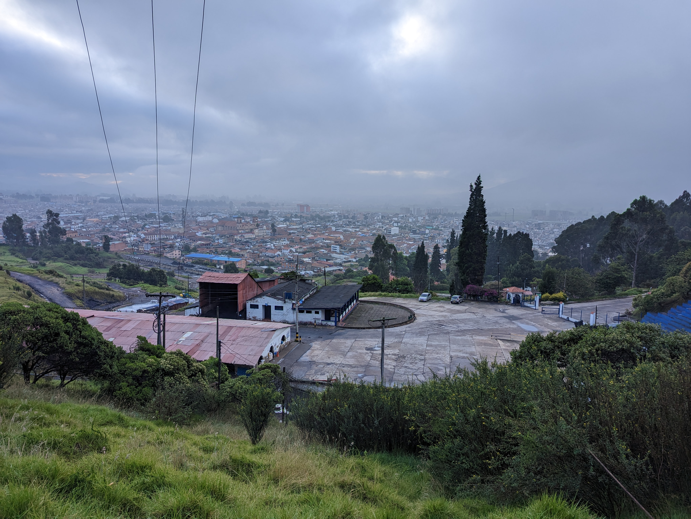

<br><details><summary>:camera:**57/PXL_20230524_111901064.jpg**</summary><sub> `Exif version` 0232 `OS version` HDR+ 1.0.520435816zd `Date` 2023:05:24 06:19:01 `Aperture` Not known `Brightness` 5.61 `Color space` 1 `Compression` 6`Exposure mode` 0 `Exposure time` 0.006422 `Focal length` 6.81 `Lens model` Pixel 6 back camera 6.81mm f/1.85 `Lens specification` Not known `Orientation` 1 `Scene type` Not known `f number` 1.85 `White balance` 0 `Sensing method` 2 `Shutter speed` 7.28</sub><sub>`Coordinates & altitude` (5.020986111111111, -74.01075, 2717.85)</sub><sub> :globe_with_meridians:`Location over` [Google Maps](http://maps.google.com/maps?q=5.020986111111111,-74.01075) or [Openstreet Map](https://www.openstreetmap.org/query?lat=5.020986111111111&lon=-74.01075)</sub></details>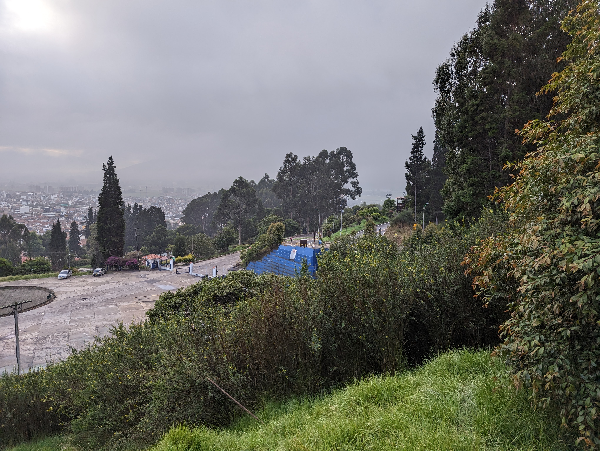

<br><details><summary>:camera:**57/PXL_20230524_111904908.jpg**</summary><sub> `Exif version` 0232 `OS version` HDR+ 1.0.520435816zd `Date` 2023:05:24 06:19:04 `Aperture` Not known `Brightness` 3.69 `Color space` 1 `Compression` 6`Exposure mode` 0 `Exposure time` 0.001652 `Focal length` 6.81 `Lens model` Pixel 6 back camera 6.81mm f/1.85 `Lens specification` Not known `Orientation` 1 `Scene type` Not known `f number` 1.85 `White balance` 0 `Sensing method` 2 `Shutter speed` 9.24</sub><sub>`Coordinates & altitude` (5.020986111111111, -74.01075, 2717.85)</sub><sub> :globe_with_meridians:`Location over` [Google Maps](http://maps.google.com/maps?q=5.020986111111111,-74.01075) or [Openstreet Map](https://www.openstreetmap.org/query?lat=5.020986111111111&lon=-74.01075)</sub></details>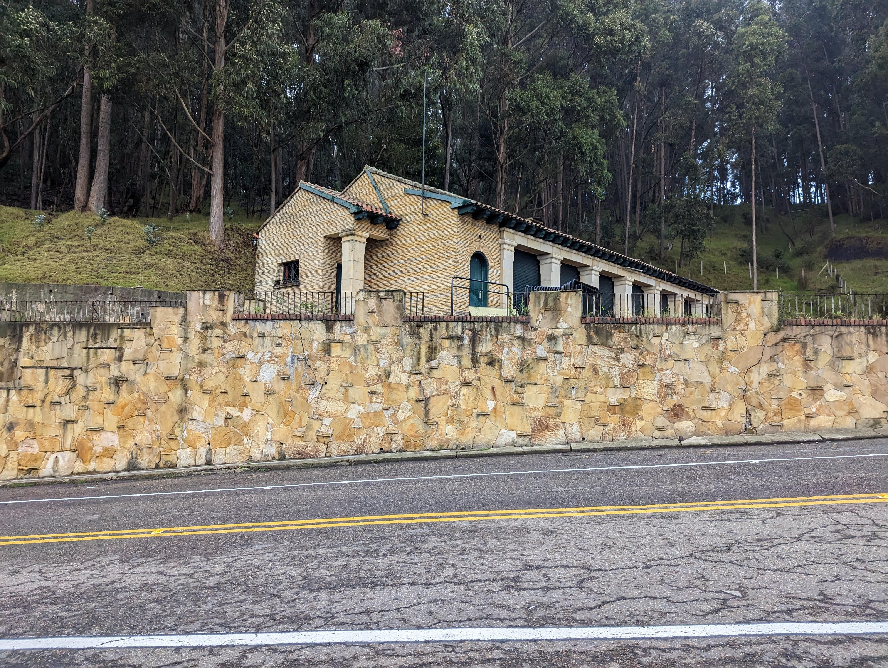

<br><details><summary>:camera:**57/PXL_20230524_111932081.jpg**</summary><sub> `Exif version` 0232 `OS version` HDR+ 1.0.520435816zd `Date` 2023:05:24 06:19:32 `Aperture` Not known `Brightness` 1.31 `Color space` 1 `Compression` 6`Exposure mode` 0 `Exposure time` 0.009011 `Focal length` 6.81 `Lens model` Pixel 6 back camera 6.81mm f/1.85 `Lens specification` Not known `Orientation` 1 `Scene type` Not known `f number` 1.85 `White balance` 0 `Sensing method` 2 `Shutter speed` 6.79</sub><sub>`Coordinates & altitude` (5.020986111111111, -74.01075, 2717.85)</sub><sub> :globe_with_meridians:`Location over` [Google Maps](http://maps.google.com/maps?q=5.020986111111111,-74.01075) or [Openstreet Map](https://www.openstreetmap.org/query?lat=5.020986111111111&lon=-74.01075)</sub></details>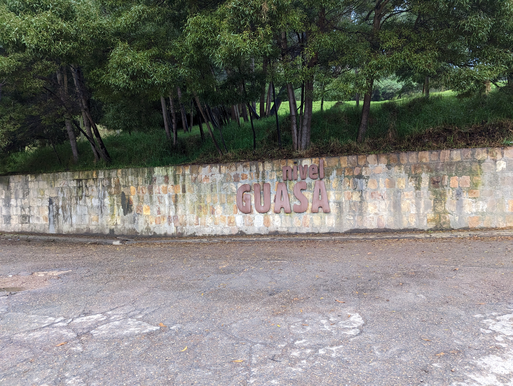

<br><details><summary>:camera:**57/PXL_20230524_112053810.MP.jpg**</summary><sub> `Exif version` 0232 `OS version` HDR+ 1.0.520435816zd `Date` 2023:05:24 06:20:53 `Aperture` Not known `Brightness` 5.26 `Color space` 1 `Compression` 6`Exposure mode` 0 `Exposure time` 0.003436 `Focal length` 6.81 `Lens model` Pixel 6 back camera 6.81mm f/1.85 `Lens specification` Not known `Orientation` 1 `Scene type` Not known `f number` 1.85 `White balance` 0 `Sensing method` 2 `Shutter speed` 8.18</sub><sub>`Coordinates & altitude` (5.020986111111111, -74.01075, 2717.85)</sub><sub> :globe_with_meridians:`Location over` [Google Maps](http://maps.google.com/maps?q=5.020986111111111,-74.01075) or [Openstreet Map](https://www.openstreetmap.org/query?lat=5.020986111111111&lon=-74.01075)</sub></details>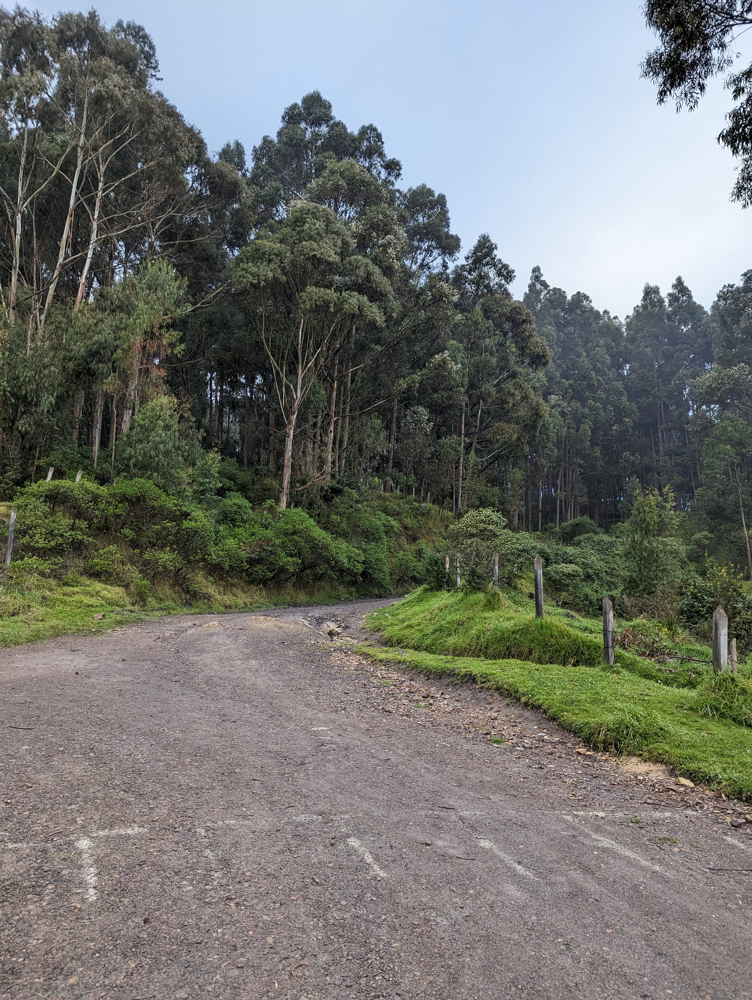

<br><details><summary>:camera:**57/PXL_20230524_112407714.MP.jpg**</summary><sub> `Exif version` 0232 `OS version` HDR+ 1.0.520435816zd `Date` 2023:05:24 06:24:07 `Aperture` Not known `Brightness` 4.03 `Color space` 1 `Compression` 6`Exposure mode` 0 `Exposure time` 0.00174 `Focal length` 6.81 `Lens model` Pixel 6 back camera 6.81mm f/1.85 `Lens specification` Not known `Orientation` 1 `Scene type` Not known `f number` 1.85 `White balance` 0 `Sensing method` 2 `Shutter speed` 9.17</sub><sub>`Coordinates & altitude` (5.022591666666667, -74.01085833333333, 2724.0)</sub><sub> :globe_with_meridians:`Location over` [Google Maps](http://maps.google.com/maps?q=5.022591666666667,-74.01085833333333) or [Openstreet Map](https://www.openstreetmap.org/query?lat=5.022591666666667&lon=-74.01085833333333)</sub></details>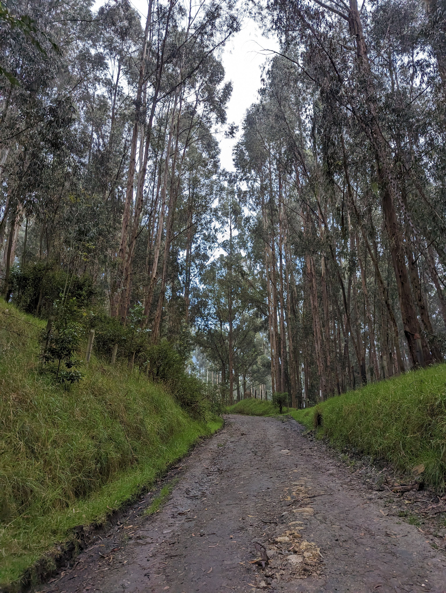

<br><details><summary>:camera:**57/PXL_20230524_112705994.jpg**</summary><sub> `Exif version` 0232 `OS version` HDR+ 1.0.520435816zp `Date` 2023:05:24 06:27:05 `Aperture` Not known `Brightness` 6.69 `Color space` 1 `Compression` 6`Exposure mode` 0 `Exposure time` 0.002253 `Focal length` 6.81 `Lens model` Pixel 6 back camera 6.81mm f/1.85 `Lens specification` Not known `Orientation` 1 `Scene type` Not known `f number` 1.85 `White balance` 0 `Sensing method` 2 `Shutter speed` 8.79</sub><sub>`Coordinates & altitude` (5.023783333333333, -74.01359444444445, 2796.0)</sub><sub> :globe_with_meridians:`Location over` [Google Maps](http://maps.google.com/maps?q=5.023783333333333,-74.01359444444445) or [Openstreet Map](https://www.openstreetmap.org/query?lat=5.023783333333333&lon=-74.01359444444445)</sub></details>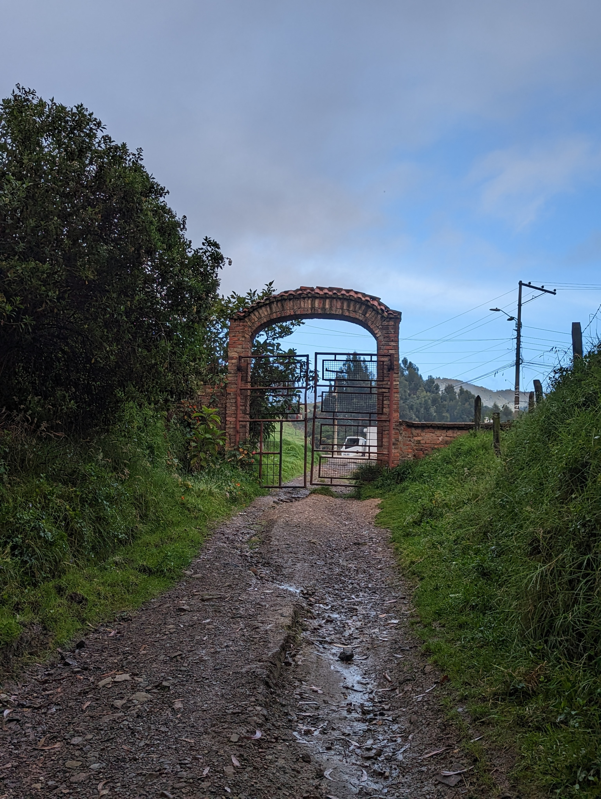

<br><details><summary>:camera:**57/PXL_20230524_112715625.MP.jpg**</summary><sub> `Exif version` 0232 `OS version` HDR+ 1.0.520435816zd `Date` 2023:05:24 06:27:15 `Aperture` Not known `Brightness` 6.28 `Color space` 1 `Compression` 6`Exposure mode` 0 `Exposure time` 0.003277 `Focal length` 6.81 `Lens model` Pixel 6 back camera 6.81mm f/1.85 `Lens specification` Not known `Orientation` 1 `Scene type` Not known `f number` 1.85 `White balance` 0 `Sensing method` 2 `Shutter speed` 8.25</sub><sub>`Coordinates & altitude` (5.023783333333333, -74.01359444444445, 2796.0)</sub><sub> :globe_with_meridians:`Location over` [Google Maps](http://maps.google.com/maps?q=5.023783333333333,-74.01359444444445) or [Openstreet Map](https://www.openstreetmap.org/query?lat=5.023783333333333&lon=-74.01359444444445)</sub></details>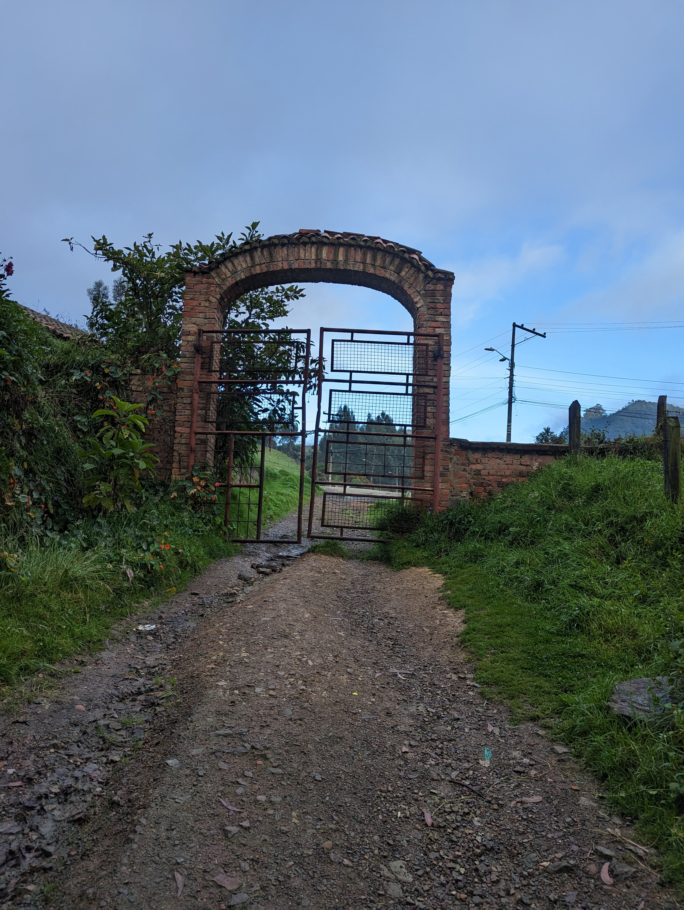

<br><details><summary>:camera:**57/PXL_20230524_112837177.MP.jpg**</summary><sub> `Exif version` 0232 `OS version` HDR+ 1.0.520435816zd `Date` 2023:05:24 06:28:37 `Aperture` Not known `Brightness` 6.76 `Color space` 1 `Compression` 6`Exposure mode` 0 `Exposure time` 0.002244 `Focal length` 6.81 `Lens model` Pixel 6 back camera 6.81mm f/1.85 `Lens specification` Not known `Orientation` 1 `Scene type` Not known `f number` 1.85 `White balance` 0 `Sensing method` 2 `Shutter speed` 8.8</sub><sub>`Coordinates & altitude` (5.024311111111111, -74.01452777777777, 2803.12)</sub><sub> :globe_with_meridians:`Location over` [Google Maps](http://maps.google.com/maps?q=5.024311111111111,-74.01452777777777) or [Openstreet Map](https://www.openstreetmap.org/query?lat=5.024311111111111&lon=-74.01452777777777)</sub></details>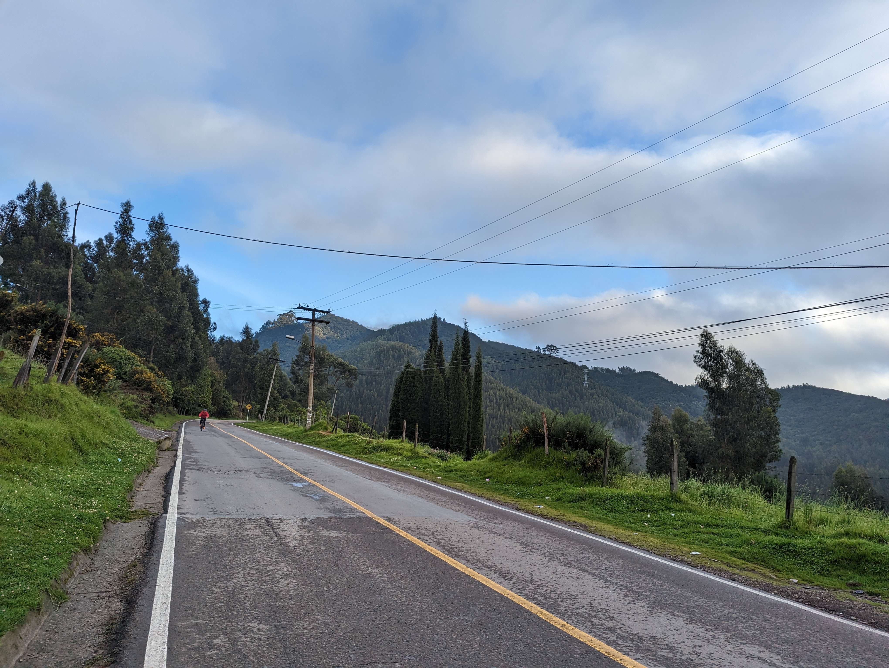

<br><details><summary>:camera:**57/PXL_20230524_113439130.jpg**</summary><sub> `Exif version` 0232 `OS version` HDR+ 1.0.520435816zd `Date` 2023:05:24 06:34:39 `Aperture` Not known `Brightness` 7.09 `Color space` 1 `Compression` 6`Exposure mode` 0 `Exposure time` 0.002535 `Focal length` 6.81 `Lens model` Pixel 6 back camera 6.81mm f/1.85 `Lens specification` Not known `Orientation` 1 `Scene type` Not known `f number` 1.85 `White balance` 0 `Sensing method` 2 `Shutter speed` 8.62</sub><sub>`Coordinates & altitude` (5.025158333333334, -74.01851388888889, 2858.1)</sub><sub> :globe_with_meridians:`Location over` [Google Maps](http://maps.google.com/maps?q=5.025158333333334,-74.01851388888889) or [Openstreet Map](https://www.openstreetmap.org/query?lat=5.025158333333334&lon=-74.01851388888889)</sub></details>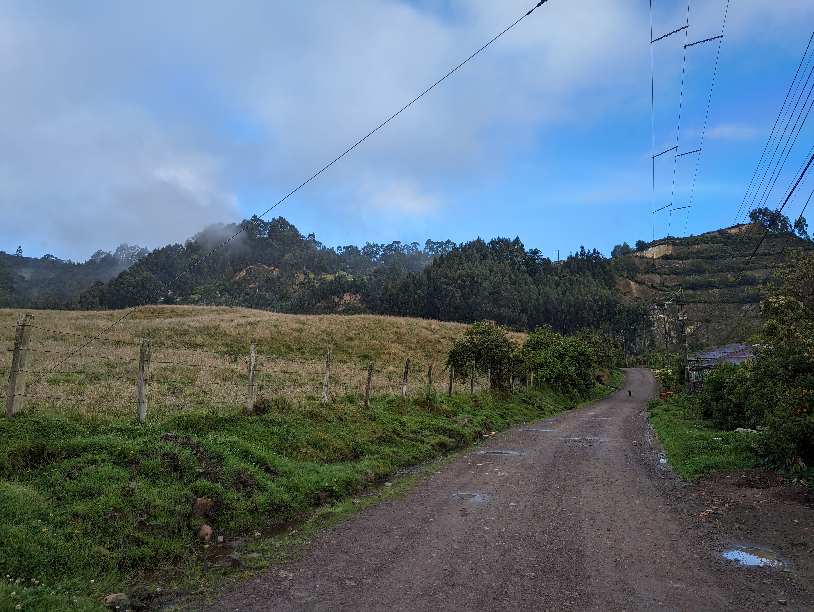

<br><details><summary>:camera:**57/PXL_20230524_113442639.jpg**</summary><sub> `Exif version` 0232 `OS version` HDR+ 1.0.520435816zd `Date` 2023:05:24 06:34:42 `Aperture` Not known `Brightness` 6.56 `Color space` 1 `Compression` 6`Exposure mode` 0 `Exposure time` 0.00258 `Focal length` 6.81 `Lens model` Pixel 6 back camera 6.81mm f/1.85 `Lens specification` Not known `Orientation` 1 `Scene type` Not known `f number` 1.85 `White balance` 0 `Sensing method` 2 `Shutter speed` 8.6</sub><sub>`Coordinates & altitude` (5.025158333333334, -74.01851388888889, 2858.1)</sub><sub> :globe_with_meridians:`Location over` [Google Maps](http://maps.google.com/maps?q=5.025158333333334,-74.01851388888889) or [Openstreet Map](https://www.openstreetmap.org/query?lat=5.025158333333334&lon=-74.01851388888889)</sub></details>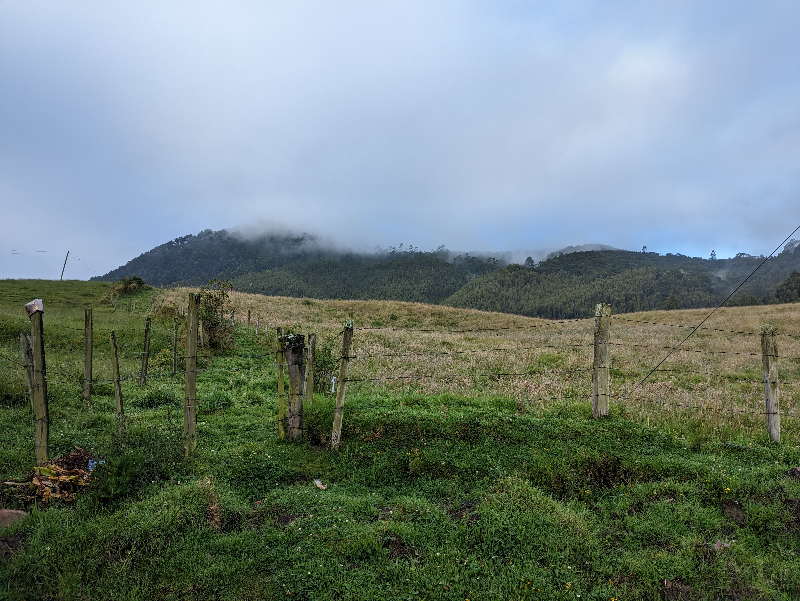

<br><details><summary>:camera:**57/PXL_20230524_115603979.jpg**</summary><sub> `Exif version` 0232 `OS version` HDR+ 1.0.520435816zd `Date` 2023:05:24 06:56:03 `Aperture` Not known `Brightness` 8.78 `Color space` 1 `Compression` 6`Exposure mode` 0 `Exposure time` 0.000813 `Focal length` 6.81 `Lens model` Pixel 6 back camera 6.81mm f/1.85 `Lens specification` Not known `Orientation` 1 `Scene type` Not known `f number` 1.85 `White balance` 0 `Sensing method` 2 `Shutter speed` 10.26</sub><sub>`Coordinates & altitude` (5.0233888888888885, -74.00443333333334, 2858.1)</sub><sub> :globe_with_meridians:`Location over` [Google Maps](http://maps.google.com/maps?q=5.0233888888888885,-74.00443333333334) or [Openstreet Map](https://www.openstreetmap.org/query?lat=5.0233888888888885&lon=-74.00443333333334)</sub></details>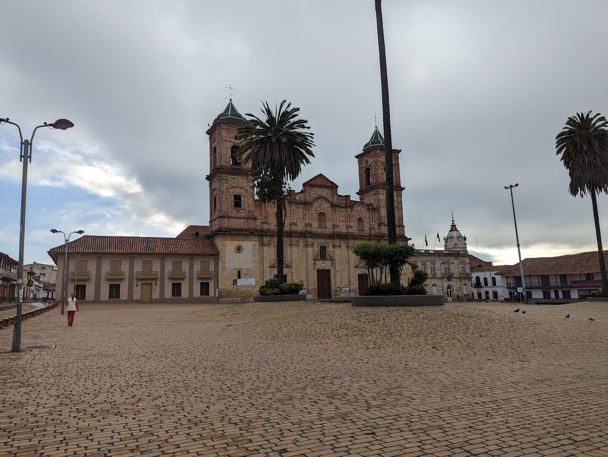

<br><details><summary>:camera:**57/PXL_20230524_115622385.jpg**</summary><sub> `Exif version` 0232 `OS version` HDR+ 1.0.520435816zd `Date` 2023:05:24 06:56:22 `Aperture` Not known `Brightness` 8.75 `Color space` 1 `Compression` 6`Exposure mode` 0 `Exposure time` 0.000954 `Focal length` 6.81 `Lens model` Pixel 6 back camera 6.81mm f/1.85 `Lens specification` Not known `Orientation` 1 `Scene type` Not known `f number` 1.85 `White balance` 0 `Sensing method` 2 `Shutter speed` 10.03</sub><sub>`Coordinates & altitude` (5.0233888888888885, -74.00443333333334, 2858.1)</sub><sub> :globe_with_meridians:`Location over` [Google Maps](http://maps.google.com/maps?q=5.0233888888888885,-74.00443333333334) or [Openstreet Map](https://www.openstreetmap.org/query?lat=5.0233888888888885&lon=-74.00443333333334)</sub></details>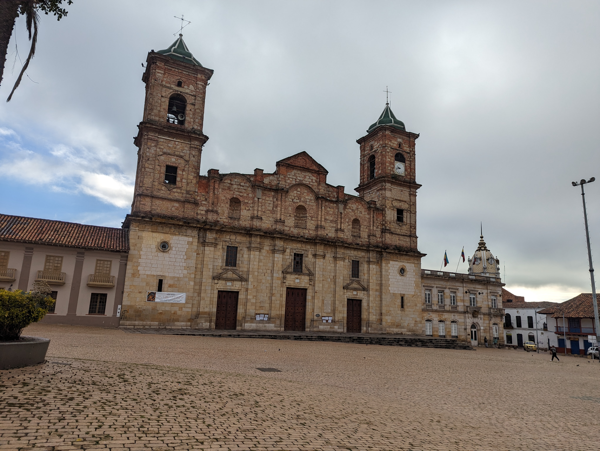

<br><details><summary>:camera:**57/PXL_20230524_115624118.jpg**</summary><sub> `Exif version` 0232 `OS version` HDR+ 1.0.520435816zd `Date` 2023:05:24 06:56:24 `Aperture` Not known `Brightness` 8.46 `Color space` 1 `Compression` 6`Exposure mode` 0 `Exposure time` 0.000618 `Focal length` 6.81 `Lens model` Pixel 6 back camera 6.81mm f/1.85 `Lens specification` Not known `Orientation` 1 `Scene type` Not known `f number` 1.85 `White balance` 0 `Sensing method` 2 `Shutter speed` 10.66</sub><sub>`Coordinates & altitude` (5.0233888888888885, -74.00443333333334, 2858.1)</sub><sub> :globe_with_meridians:`Location over` [Google Maps](http://maps.google.com/maps?q=5.0233888888888885,-74.00443333333334) or [Openstreet Map](https://www.openstreetmap.org/query?lat=5.0233888888888885&lon=-74.00443333333334)</sub></details>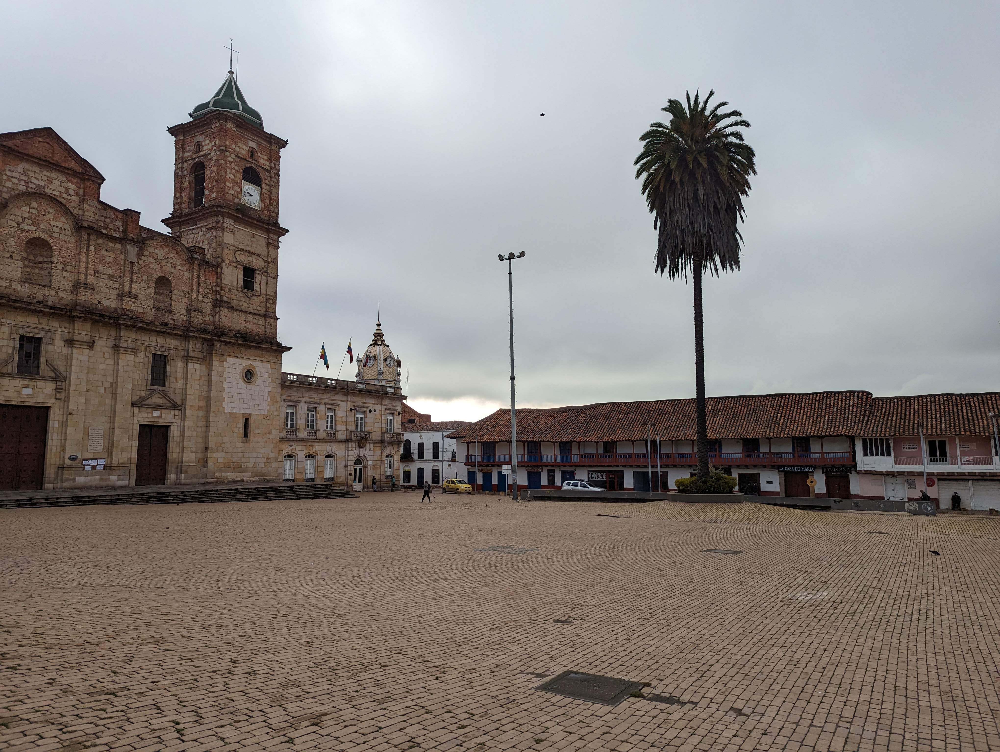

<sub>_Citation: Partial or total digital reproduction of this repository, scripts, development guides, data models, images, and documentation is permitted, provided that it is referenced as: "R.GISMobile - Mobile geographic information systems on QField that do not require an internet connection for navigation." https://github.com/rcfdtools/R.GISMobile - Bogotá - Colombia - South America"._<sub>

| [:house: Home](../Readme.md) |
|---|